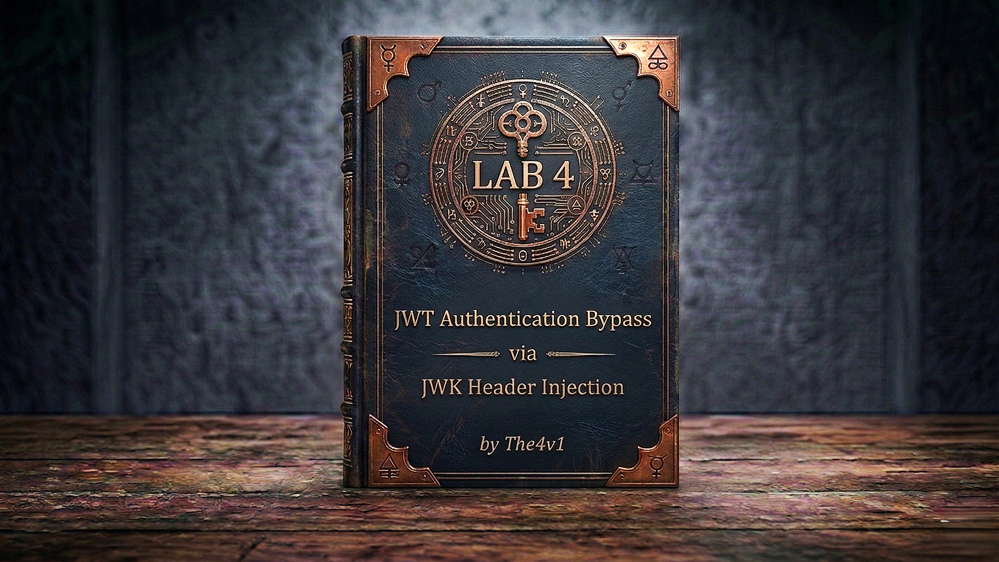

---

**Difficulty:** 🟡 Practitioner

**Goal:**

- 🔑 Log in as `wiener` / `peter` — send the post-login `GET /my-account` to Burp Repeater — confirm `/admin` is blocked
- 🛠️ In **JWT Editor Keys**, generate a new RSA key pair
- ✏️ In the **JSON Web Token** tab, change `sub` to `"administrator"` — click **Attack → Embedded JWK** — select your RSA key — JWT Editor injects your public key into the header and signs with your private key
- 🗺️ Send `GET /admin` — the server uses the embedded public key to verify — signature matches — admin panel loads
- 🗑️ Delete the user `carlos` → lab solved!

---

## 🧠 **Concept Recap**

> **JWT authentication bypass via JWK header injection** exploits a server that supports the `jwk` header parameter — an optional JWT field designed to embed the verification public key directly in the token. The intention was to make key distribution convenient. The flaw: the server uses whatever key the token provides without checking whether it came from a trusted source. An attacker generates their own RSA key pair, embeds their public key in the token header, signs the token with their private key, and the server verifies it with the attacker-supplied public key — perfectly matching, perfectly accepted.

### 📊 **Lab 3 vs Lab 4 — Two Different Asymmetric Attacks**

||**Lab 3 — Weak Secret**|**Lab 4 — JWK Injection (this lab)**|
|---|---|---|
|**Algorithm**|HS256 (symmetric)|RS256 (asymmetric)|
|**What's exploited**|Secret is too weak to resist cracking|Server trusts attacker-supplied public key|
|**Attack prerequisite**|Wordlist + hashcat|Generate any RSA key pair|
|**Signature valid?**|✅ Yes — signed with cracked secret|✅ Yes — signed with attacker's private key|
|**Server's mistake**|Used a guessable secret|Accepted a public key from the token itself|
|**Tool**|hashcat + JWT Editor|JWT Editor only|

```js
The circular trust problem:

  Normal RS256 flow:
    Server holds a trusted public key → verifies any token against it
    Attacker cannot forge a valid signature without the server's private key ✅

  JWK injection flow:
    Server reads public key FROM the token → verifies the token against it
    Attacker provides THEIR OWN public key in the token
    Attacker signs with THEIR OWN private key
    Server verifies: "does this signature match this public key?" → YES ✅
    But the key came from the attacker — circular, self-referential trust ❌

The server is essentially asking the attacker: "Which key should I use to verify you?"
```

**The full attack flow:**

```js
Log in as wiener → capture JWT → send to Repeater
         ↓
GET /admin with original token → blocked (sub: wiener)
         ↓
JWT Editor Keys → Generate new RSA key pair (2048-bit)
  → You now hold: private key (sign) + public key (verify)
         ↓
Repeater → JSON Web Token tab:
  Payload: sub → "administrator"
  Attack → Embedded JWK → select RSA key → OK
         ↓
JWT Editor injects into header:
  { "alg":"RS256", "kid":"your-key-id", "jwk": { ...your public key... } }
  Signs token with your private key → valid signature
         ↓
Server reads jwk from header → uses YOUR public key to verify
  → Signature matches YOUR public key ✅
  → sub: "administrator" → admin access granted ✅
         ↓
Delete carlos → lab solved ✅
```

---
---

## 🛠️ **Step-by-Step Attack**

---

### 🔧 **Step 1 — Install JWT Editor Extension**

1. 🖱️ In Burp → **Extensions** → **BApp Store**
2. 🖱️ Search **JWT Editor** → click **Install**

```js
JWT Editor adds two things needed for this lab:
  → JWT Editor Keys tab: generate and store RSA key pairs
  → JSON Web Token tab in Repeater: edit claims + one-click Attack menu
     including the "Embedded JWK" option that does the injection automatically
```

---

### 🔧 **Step 2 — Log In and Capture the JWT**

1. 🌐 Click **"Access the lab"**
2. 🔌 Ensure **Burp Suite is running** and proxying traffic
3. 🖱️ Log in with `wiener` / `peter`
4. 🖱️ In Burp → **Proxy → HTTP history** → find the post-login `GET /my-account`
5. 🖱️ Right-click → **"Send to Repeater"**

```js
Inspect the JWT in Inspector:
  Header:  { "alg": "RS256", "typ": "JWT" }
  Payload: { "sub": "wiener", "exp": ... }

alg: RS256 confirms this is asymmetric — the server signs with a private key
and verifies with a public key. We can't crack or guess the private key.
Instead, we'll supply our own public key via the jwk parameter.
```

---

### 🔧 **Step 3 — Confirm You're Blocked from /admin**

1. 🖱️ In Repeater, change the path to `/admin` → click **"Send"**

```js
Expected result:
  → "Admin interface only accessible if logged in as the administrator"
  → sub: "wiener" → blocked
  → We need sub: "administrator" with a valid RS256 signature
  → We can't forge a signature without a private key — so we'll supply our own keypair
```

---

### 🔧 **Step 4 — Generate a New RSA Key Pair**

1. 🖱️ In Burp → **JWT Editor Keys** tab (top menu bar)
2. 🖱️ Click **"New RSA Key"**
3. 🖱️ In the dialog, click **"Generate"** — a 2048-bit RSA key pair is created automatically
4. 🖱️ Click **"OK"** to save

```js
What was just generated:
  → Private key: used to SIGN the forged JWT (stays inside Burp/JWT Editor)
  → Public key:  used to VERIFY the JWT — we'll embed this in the token header

You control both keys — the server has never seen either of them.
The attack works because we'll convince the server to use OUR public key for verification.
```

---

### 🔧 **Step 5 — Change the `sub` Claim to `administrator`**

1. 🖱️ Back in Repeater → click the **JSON Web Token** tab
2. 🖱️ In the **Payload** section, change `"sub"` to `"administrator"`:

```json
{
  "sub": "administrator",
  "exp": 1648037164
}
```

```js
Don't sign or send yet — make the payload change first.
The Attack → Embedded JWK step in the next step will handle
both the signing and the key injection in one operation.
```

---

### 🔧 **Step 6 — Inject the JWK and Sign**

1. 🖱️ At the bottom of the **JSON Web Token** tab, click **"Attack"**
2. 🖱️ Select **"Embedded JWK"**
3. 🖱️ When prompted, select the RSA key you generated in Step 4 → click **"OK"**

```js
What JWT Editor did in one click:
  1. Took your RSA public key → formatted it as a JWK object
  2. Added a "jwk" parameter to the JWT header containing that public key
  3. Signed the entire token (header + modified payload) with your RSA private key
  4. Updated the Cookie header in Repeater with the fully modified token

The resulting JWT header now looks like:
  {
    "alg": "RS256",
    "typ": "JWT",
    "kid": "your-generated-key-id",
    "jwk": {
      "kty": "RSA",
      "e": "AQAB",
      "kid": "your-generated-key-id",
      "n": "<your RSA public modulus — a long base64url string>"
    }
  }

The kid in the header matches the kid inside the jwk — this is what tells
the server which embedded key to pick when verifying.
```

---

### 🔧 **Step 7 — Access the Admin Panel**

1. 🖱️ Confirm the path is `/admin` → click **"Send"**

```js
Expected result:
  → 200 OK — admin panel loads ✅

What the server did:
  1. Read the JWT header → found a "jwk" parameter → extracted the public key from it
  2. Used that public key to verify the JWT signature
  3. Signature matches — because you signed with the corresponding private key ✅
  4. Read sub: "administrator" → granted admin access ✅

The server never asked: "Do I know this key? Is it on my approved list?"
It just used whatever key the token told it to use — that's the vulnerability.
```

---

### 🔧 **Step 8 — Delete carlos**

1. 🖱️ In the admin panel response, find the delete endpoint:

```js
/admin/delete?username=carlos
```

2. 🖱️ Update the path in Repeater:

```http
GET /admin/delete?username=carlos HTTP/1.1
Cookie: session=<your-jwk-injected-jwt>
```

3. 🖱️ Click **"Send"**

```js
Result:
  → carlos deleted ✅
  → Lab solved! 🎉
```

---

## 🎉 **Lab Solved!**

```
✅ Logged in as wiener → captured JWT → confirmed RS256 algorithm
✅ Generated RSA key pair in JWT Editor Keys
✅ Changed sub → "administrator"
✅ Attack → Embedded JWK → public key injected into header, signed with private key
✅ Server used attacker-supplied public key to verify → passed
✅ Admin panel loaded → deleted carlos
✅ Lab complete!
```

---

## 🔗 **Complete Attack Chain**

```r
1. Log in as wiener → GET /my-account → Send to Repeater
2. GET /admin → blocked (sub: wiener)
3. JWT Editor Keys → New RSA Key → Generate → OK
4. JSON Web Token tab → Payload: sub → "administrator"
5. Attack → Embedded JWK → select RSA key → OK
   → jwk injected into header, token signed with private key
6. GET /admin → server trusts embedded jwk → admin panel loads
7. GET /admin/delete?username=carlos → lab solved
```

**Seven steps. No cracking. No wordlists. Just generating a key pair and letting the server trust it.**

---

## 🧠 **Deep Understanding**

### What is the `jwk` header parameter?

```js
The JWT spec (RFC 7517) defines several optional header parameters:
  → jwk: embed the public key directly in the token header
  → jku: provide a URL where the server can fetch a key set
  → kid: a key ID the server can use to look up the right key locally

"jwk" was designed for convenience — the token carries its own verification key,
so the verifier doesn't need to maintain a key store or fetch a URL.

Legitimate use case:
  → Internal microservice communication where both parties trust each other
  → Short-lived tokens in tightly controlled environments

Why it's dangerous for public-facing servers:
  → Any client can put any key in the jwk field
  → If the server uses it without validating the key's origin or membership
    in a trusted set → the attacker controls the verification entirely
  → The server is outsourcing its trust decision to the token it's trying to verify
```

### The self-referential trust problem

```js
Secure RS256 verification model:
  Server has: trusted_public_key (stored server-side, immutable)
  For each token: verify_signature(token, trusted_public_key)
  Attacker cannot forge: they don't have the server's private key

JWK injection model (vulnerable):
  For each token: key = token.header.jwk  ← key comes FROM the token
                  verify_signature(token, key)
  Attacker can forge: they provide their own key pair
                      the signature always matches their own public key

It's like a hotel asking a guest: "Which master key should I use to check if your key is valid?"
The guest hands over their own master key → everything opens → the check is meaningless.
```

### `jwk` vs `jku` — two related header injection attacks

```js
jwk (this lab):
  → Full public key embedded directly in the token header
  → No network request needed from the server
  → Self-contained: token carries its own verification key
  → Simpler attack — everything is in one token

jku (next lab):
  → URL pointing to a JWK Set (JWKS) the server should fetch
  → Server makes an HTTP request to the attacker-controlled URL
  → Attacker hosts a JWKS with their public key at that URL
  → More complex — requires hosting an external endpoint
  → Blocked if server validates the jku URL against a whitelist

Both share the same root cause:
  → Server lets the token dictate which key to use for verification
  → The key (or key location) is client-controlled
  → Fix for both: the server must determine the key independently of the token
```

---

## 🐛 **Troubleshooting**

```js
Problem: "Embedded JWK" option is missing from the Attack menu
→ Ensure JWT Editor extension is installed and active (Extensions → Installed)
→ The JSON Web Token tab must be the active tab in Repeater before clicking Attack
→ Restart Burp and try again if the tab doesn't appear

Problem: GET /admin still returns 403 after the attack step
→ Verify the JWT header now contains a "jwk" field (check in Inspector)
→ Verify the payload shows sub: "administrator" (not "wiener")
→ Ensure the RSA key was selected when prompted — not cancelled
→ Re-run Attack → Embedded JWK and check the header was updated

Problem: The admin panel loads but the delete link for carlos is not visible
→ Search the response for "carlos" using Ctrl+F in the response panel
→ Or look for "/admin/delete" in the response — the URL pattern is consistent
→ Render the response in browser: right-click → Show response in browser

Problem: Delete request returns 403 even after admin panel loaded
→ The modified JWT must be carried into the delete request
→ Check that the Cookie in the delete request still has the jwk-injected token
→ If Burp reverted to the original cookie, re-do Attack → Embedded JWK
   and immediately change the path to /admin/delete?username=carlos before sending

Problem: JWT Editor Keys tab shows no keys / key disappeared
→ Keys persist within a Burp session — check you're in the same Burp instance
→ If the key is gone, generate a new one and repeat the Attack step
```

---

## 💬 **In One Line**

📝 The server read the public key directly from the JWT's `jwk` header parameter without checking if it was a trusted key — so embedding an attacker-generated public key and signing with the matching private key produced a token the server verified and accepted. That's **JWK Header Injection** — the server let the token choose its own verification key.

---
---

## 🔒 **How to Fix It**

```js
# Priority 1 — Never read verification keys from the token itself
# The server must have its own trusted key store — independent of token content

# ❌ BAD — key taken from the token's jwk header:
header = jwt.get_unverified_header(token)
public_key = deserialize_jwk(header['jwk'])       # attacker-controlled
payload = jwt.decode(token, public_key, algorithms=['RS256'])

# ✅ GOOD — key loaded from server-side trusted store only:
SERVER_PUBLIC_KEY = load_public_key('/etc/app/jwt_public.pem')  # fixed, server-controlled
payload = jwt.decode(token, SERVER_PUBLIC_KEY, algorithms=['RS256'])
# The jwk header parameter is completely ignored
```

```js
# Priority 2 — Explicitly reject tokens that contain a jwk header parameter

def verify_token(token):
    header = jwt.get_unverified_header(token)

    if 'jwk' in header:
        raise ValueError("Tokens with embedded jwk are not accepted")

    if 'jku' in header:
        raise ValueError("Tokens with external key URLs are not accepted")

    return jwt.decode(token, SERVER_PUBLIC_KEY, algorithms=['RS256'])
```

```js
# Priority 3 — If kid is used for key rotation, look it up in a server-side whitelist
# The kid value from the token selects a key — but only from keys YOU control

TRUSTED_KEYS = {
    'key-2024-01': load_public_key('key_2024_01.pem'),
    'key-2024-07': load_public_key('key_2024_07.pem'),
}

def verify_token(token):
    header = jwt.get_unverified_header(token)
    kid = header.get('kid')

    if kid not in TRUSTED_KEYS:
        raise ValueError(f"Unknown key ID: {kid}")   # attacker's key ID rejected

    return jwt.decode(token, TRUSTED_KEYS[kid], algorithms=['RS256'])
```

```js
# Priority 4 — Verify the user's role from the database after token verification
# Even if an attacker bypasses JWT verification, a DB check on the role stops the escalation

@app.route('/admin')
def admin_panel():
    payload = verify_token(request.cookies.get('session'))
    user = db.get_user(payload['sub'])

    if not user or user.role != 'admin':
        abort(403)   # wiener's DB record says role = "user" → blocked regardless

    return render_admin_panel()
```

---
