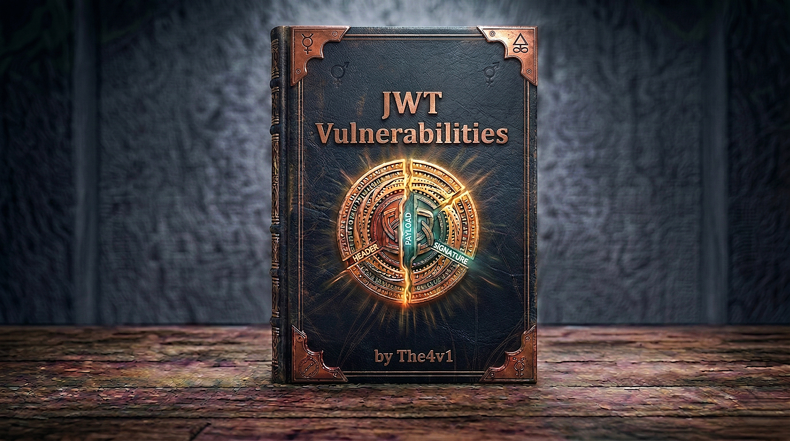

---

## 🧠 **What are JSON Web Tokens (JWT)?**

👉 **JWT (JSON Web Token)** is a **compact and standardized format** used for securely transmitting information between parties as a **JSON object**.  
🔹 It is **digitally signed** to ensure authenticity and integrity of the data.

**Key Points:**

- Used for **authentication**, **authorization**, and **information exchange**
    
- Data is stored **client-side**, making it **stateless**
    
- Widely used in **APIs**, **SSO (Single Sign-On)**, and **microservices**
    

💡 **JWT = Secure way to prove user identity without maintaining server sessions**

---

## 🎯 **Why Use JWTs?**

|Use Case|Benefit|
|---|---|
|🌐 **Distributed Systems**|All backend services can verify tokens using a shared public key|
|⚡ **Scalability**|No need for session databases – reduces server load|
|🔄 **Stateless**|Authentication data is stored within the token itself|
|🚀 **Microservices**|Independent services can verify identity using a public key|
|📱 **API Authentication**|Ideal for mobile or SPA (Single Page Application) authentication|

---

## 📦 **Structure of JWT**

A JWT has **three parts**, separated by dots (`.`):

```
Header.Payload.Signature
```

Each part is **Base64URL encoded**.

**Example:**

```
eyJhbGciOiJIUzI1NiIsInR5cCI6IkpXVCJ9.
eyJzdWIiOiIxMjM0NTY3ODkwIiwibmFtZSI6IkpvaG4gRG9lIiwiaWF0IjoxNTE2MjM5MDIyfQ.
SflKxwRJSMeKKF2QT4fwpMeJf36POk6yJV_adQssw5c
```

`HEADER . PAYLOAD . SIGNATURE` — each part is base64url-encoded and dot-separated.

| Part                |                             Contains | Notes / Example                                                             |
| ------------------- | -----------------------------------: | --------------------------------------------------------------------------- |
| 🏷 Header           |                       Token metadata | `{"alg":"HS256","typ":"JWT"}`                                               |
| 🧾 Payload (claims) |                Data about user/usage | `{"sub":"1234","iss":"auth.example","exp":1699999999}` — readable by anyone |
| 🔐 Signature        | Crypto signature over header+payload | Ensures integrity; produced with secret (HMAC) or private key (RSA/ECDSA)   |

---

### 🔹 **1️⃣ Header**

The **header** specifies the token type and the algorithm used for signing.

```json
{
  "alg": "HS256",
  "typ": "JWT"
}
```

|Field|Description|
|---|---|
|`alg`|Algorithm used to sign token (e.g., HS256, RS256)|
|`typ`|Type of token (usually “JWT”)|
|`kid`|Key ID – identifies which key was used|
|`jwk`|JSON Web Key – can contain a public key|
|`jku`|JSON Web Key Set URL – points to where the public keys are stored|

💡 **Header is Base64-encoded, not encrypted!**  
It only describes **how** the token should be verified.

---

### 🔹 **2️⃣ Payload (Claims)**

The **payload** holds the data or “claims” about the user or context.

```json
{
  "sub": "1234567890",
  "name": "John Doe",
  "email": "john@example.com",
  "role": "ADMIN",
  "iat": 1516239022,
  "exp": 1648037164
}
```

**Standard Claims:**

|Claim|Meaning|Example|
|---|---|---|
|`sub`|Subject (user identifier)|"user-123"|
|`iss`|Issuer (who created the token)|"auth-server"|
|`aud`|Audience (intended recipient)|"api.example.com"|
|`exp`|Expiration timestamp|1648037164|
|`iat`|Issued at timestamp|1516239022|
|`nbf`|Not valid before|1516239022|

**Custom Claims:**  
You can add any custom data like role, permissions, etc.

```json
{
  "username": "carlos",
  "role": "admin",
  "permissions": ["read", "write", "delete"]
}
```

⚠️ **Payload is only encoded, not encrypted.**  
Anyone can decode it — never store passwords or secrets inside!

---

### 🔹 **3️⃣ Signature**

The **signature** ensures the data hasn’t been altered.  
It’s created using the algorithm specified in the header.

```
HMACSHA256(
  base64UrlEncode(header) + "." + base64UrlEncode(payload),
  secret
)
```

**Purpose of Signature:**

- Validates **integrity** – ensures data is untampered
    
- Confirms **authenticity** – only the signer (server) can generate a valid signature
    
- **If the signature doesn’t match, the token is invalid.**

##### **How it works:**

1. Combine encoded header + payload
2. Hash using specified algorithm + secret key
3. Result = signature (gibberish-looking string)

**Example signature:**

```
SflKxwRJSMeKKF2QT4fwpMeJf36POk6yJV_adQssw5c
```

> 🔐 **Security:** Signature ensures token hasn't been tampered with!

---

## 🔄 **Stateless vs Stateful Authentication (VERY IMPORTANT)**

This is the **core reason JWT exists**, but many people only memorize the word.

---

## 🔹 **Stateful Authentication (Traditional Sessions)**

👉 Server **remembers the user state**

### 🔁 How it works

1. User logs in
    
2. Server creates a **session**
    
3. Session ID stored **server-side**
    
4. Session ID sent to client (cookie)
    
5. On every request → server checks session DB
    

```
Client ── session_id ──► Server
Server ── looks up session ──► DB
```

### ✅ Pros

- Easy to **revoke sessions**
    
- More **control**
    
- Better for **high-security apps**
    

### ❌ Cons

- Needs **session storage**
    
- Harder to scale
    
- Sticky sessions needed in load balancers
    

---

## 🔹 **Stateless Authentication (JWT)**

👉 Server **does NOT remember anything**

### 🔁 How it works

1. User logs in
    
2. Server issues **JWT**
    
3. Client stores token
    
4. Every request sends JWT
    
5. Server verifies signature only
    

```
Client ── JWT ──► Server
Server ── verify signature ──► OK
```

### ✅ Pros

- No session DB
    
- Horizontally scalable
    
- Perfect for APIs & microservices
    

### ❌ Cons

- Hard to revoke
    
- Token theft = access until expiry
    
- Larger request size
    

---

### 🧠 **One-Line Difference (Interview Gold)**

> **Stateful** = Server remembers  
> **Stateless** = Token remembers

---

## 📊 **Stateless vs Stateful (Quick Table)**

|Feature|Stateful|Stateless (JWT)|
|---|---|---|
|Session stored|Server|Client|
|Scalability|Medium|High|
|Revocation|Easy|Hard|
|DB lookup|Yes|No|
|Best for|Web apps|APIs, Mobile, Microservices|

---

## 🔐 **JWT Signing Methods**

### **1️⃣ Symmetric Signing (HMAC)**

|Algorithm|Description|
|---|---|
|HS256|HMAC with SHA-256|
|HS384|HMAC with SHA-384|
|HS512|HMAC with SHA-512|

- Uses the **same secret key** to sign and verify tokens.
- Simple and fast.
- ⚠️ Must keep the secret safe — if leaked, attackers can forge tokens.

**Example:**

```python
secret = "mySecret123"
signature = HMAC-SHA256(header + payload, secret)
```


---

### **2️⃣ Asymmetric Signing (RSA/ECDSA)**

|Algorithm|Description|
|---|---|
|RS256|RSA with SHA-256|
|RS384|RSA with SHA-384|
|RS512|RSA with SHA-512|
|ES256|ECDSA with SHA-256|

- Uses **two keys**:
    - 🔑 **Private Key** → signs the token (only the auth server has it)
    - 🧩 **Public Key** → verifies the token (shared across services)
- ✅ More secure for distributed systems.

**Example:**

```python
# Auth service signs with private key
signature = RSA-SHA256(header + payload, private_key)

# Other services verify with public key
verify(token, public_key)  # Returns true/false
```

💡 Even if public key leaks, attackers **can’t create** valid tokens (only verify them).

---

## 🎭 **How JWT Verification Works**

```
┌───────────────────────────────────────┐
│ Step 1: Receive Token                 │
└───────────────────────────────────────┘
              ↓
┌───────────────────────────────────────┐
│ Step 2: Decode Header & Payload       │
│ (Base64 decoding only)                │
└───────────────────────────────────────┘
              ↓
┌───────────────────────────────────────┐
│ Step 3: Recreate Signature            │
│ HMAC(header + payload, secret)        │
└───────────────────────────────────────┘
              ↓
┌───────────────────────────────────────┐
│ Step 4: Compare Signatures            │
│ If same → Token valid ✅              │
│ If different → Reject ❌              │
└───────────────────────────────────────┘
```

💡 **JWT signatures are not decrypted — they are re-generated and compared.**

---

## ⚙️ **How JWTs Work in Authentication**

1. 🧍 User logs in with credentials
    
2. 🗝️ Server verifies and generates a JWT
    
3. 📩 Server sends JWT to client
    
4. 🌐 Client stores JWT (usually in cookie or local storage)
    
5. 📡 Client sends JWT in headers for future API calls
    
6. 🔎 Server verifies signature and grants/denies access
    

✅ **Stateless:** No session data is stored on the server.  
❌ **Difficult Revocation:** Once issued, JWTs stay valid until they expire.

---

## 🔐 **Token Storage Options**

|Storage Method|Security Level|Notes|
|---|---|---|
|❌ `localStorage`|Low|Vulnerable to XSS|
|⚠️ Regular cookies|Medium|Can be accessed via JS|
|✅ `HttpOnly` cookies|High|Protected from XSS but needs CSRF protection|
|✅ `HttpOnly + SameSite` cookies|Very High|Best practice for most apps|

---

## ⏱ **Token Lifetime**

- **Access Token:**  
    Short-lived (5–15 minutes). Used for API requests.
    
- **Refresh Token:**  
    Long-lived (days or weeks). Used to generate new access tokens.
    

**Advantages of short-lived tokens:**

- ⏰ Reduces attack window
    
- 🔄 Allows updated user data with each refresh
    
- 🛡️ Limits damage if token is stolen
    

---

## 🔄 **Refresh Token Flow**

```
1️⃣ User logs in → Server issues:
   - Access Token (15 min)
   - Refresh Token (30 days)
   
2️⃣ Access token used for API requests

3️⃣ When access token expires →
   Client sends refresh token to get a new one

4️⃣ Server verifies refresh token and issues new access token
```

💡 Refresh tokens are usually stored **securely server-side** and can be revoked anytime.

---

## **🔄 JWT vs JWS vs JWE — The Difference**

---

👉 Many people use these terms interchangeably, but they are different specs.

|Standard|Full Name|What It Does|
|---|---|---|
|**JWT**|JSON Web Token|Base format — defines the claims structure|
|**JWS**|JSON Web Signature|JWT + signature (most common — what we call "JWT")|
|**JWE**|JSON Web Encryption|JWT where the payload is ENCRYPTED (not just signed)|

→ When people say "JWT" they almost always mean **JWS** — a signed token → JWE is rare — payload is actually encrypted so nobody can read the claims → Most JWT attacks apply to JWS tokens (signed but not encrypted)

> 💡 The JWT spec itself just defines the format. JWS adds the signature. JWE adds encryption. Most apps use JWS only.

---

## 🧪 **Testing JWT Security**

### **Manual Testing Checklist**

```
☑️ Try algorithm = "none"
☑️ Change alg from RS256 to HS256
☑️ Modify claims (role, username)
☑️ Remove signature
☑️ Use expired token
☑️ Inject jwk header
☑️ Inject jku header
☑️ Test kid path traversal
☑️ Test kid SQL injection
☑️ Try brute-force weak secret
☑️ Check if signature verified
```

---

### **Tools for JWT Testing**

|Tool|Purpose|
|---|---|
|🌐 **jwt.io**|Decode and verify JWTs online|
|🔨 **Burp JWT Editor**|Modify and attack JWTs in Burp|
|🔑 **hashcat**|Brute-force JWT secrets|
|🐍 **jwt_tool**|Python tool for JWT attacks|
|🧪 **Postman**|Test JWT APIs|

---

## 🔥 **Burp Suite JWT Editor Extension**

**Features:**

- Decode JWT automatically
- Modify claims easily
- Sign with custom keys
- Test algorithm confusion
- Inject JWK/JKU headers

**Usage:**

1. Install from BApp Store
2. Intercept request with JWT
3. JWT Editor tab appears
4. Modify claims
5. Sign with attack keys

---

## 📊 **JWT vs Session Tokens**

|Feature|JWT|Session Token|
|---|---|---|
|Storage|Client-side|Server-side|
|Stateless|✅ Yes|❌ No|
|Scalability|✅ High|⚠️ Medium|
|Revocation|❌ Hard|✅ Easy|
|Security|⚠️ Needs care|✅ More controlled|

💡 **JWTs** are perfect for scalability and microservices.  
But for highly sensitive or long-term sessions, **server sessions** are safer.

---

## 💡 **When to Use JWTs**

### ✅ **Best For**

- Microservices & distributed APIs
    
- Stateless authentication
    
- Short-lived access tokens
    
- Mobile & single-page applications (SPAs)
    
- Single Sign-On (SSO)
    

### ❌ **Avoid When**

- You need frequent token revocation
    
- You store sensitive or large data in tokens
    
- Simpler session cookies can do the job
    

---

## 🧩 **Summary Table**

|Component|Purpose|Security Note|
|---|---|---|
|**Header**|Describes algorithm & type|Validate algorithm before using|
|**Payload**|Contains user data & claims|Never store secrets here|
|**Signature**|Ensures integrity & authenticity|Always verify it|
|**Secret/Private Key**|Used to sign JWT|Keep secure & rotate regularly|
|**Public Key**|Used to verify JWT|Can be shared safely|

---

## **🌍 Real-World CVEs & Bug Bounty Cases**

---

### 🔴 CVE-2018-0114 — node-jose (jwk Injection) — Critical

- **Product:** node-jose (widely used Node.js JWT library)
- **Type:** JWK header injection — library trusted any key embedded in `jwk` parameter
- **Impact:** Any unauthenticated attacker could sign tokens as any user — including admins
- **Root Cause:** Library parsed `jwk` parameter from token header and used it directly for verification without checking if it was trusted
- **Lesson:** Libraries must maintain a hardcoded list of trusted public keys. NEVER use the key from the token itself for verification.

---

### 🔴 CVE-2022-21449 — Java "Psychic Signatures" — CVSS 7.5

- **Product:** Java JDK (all versions before Java 15.0.7, 17.0.3, 18.0.1)
- **Type:** ECDSA signature verification bypass
- **Attack:** Submit a JWT where both ECDSA signature values (r and s) are set to ZERO — `r=0, s=0`
- **Impact:** Java's ECDSA implementation incorrectly accepted this completely invalid signature as valid
- **Affected:** Any Java application using `java.security.Signature` for ECDSA-signed JWTs (ES256, ES384, ES512)
- **Lesson:** Even standard library implementations can have catastrophic signature verification bugs. Keep JDK updated.

---

### 🔴 CVE-2015-9235 — jsonwebtoken library — alg:none Bypass

- **Product:** jsonwebtoken npm package (most popular JWT library)
- **Type:** Accepted tokens with `alg: none` in production
- **Impact:** Any attacker could forge tokens for any user with arbitrary claims
- **Fixed in:** jsonwebtoken 4.2.2
- **Lesson:** JWT libraries must explicitly reject `alg: none` unless the developer opts in deliberately.

---

### 🔴 CVE-2016-5431 — python-jwt — alg:none + Algorithm Confusion

- **Product:** python-jwt library
- **Type:** Both alg:none bypass AND algorithm confusion vulnerability
- **Impact:** Complete authentication bypass — forge tokens as any user
- **Lesson:** Multiple JWT vulnerabilities often coexist in the same library.

---

### 💰 HackerOne Bug Bounty — Auth Bypass via Algorithm Confusion ($3,000+)

- **Type:** RS256 → HS256 algorithm confusion
- **Scenario:** Company used RS256 for authentication JWTs. Public key was exposed at `/.well-known/jwks.json`. Server used a library that accepted algorithm from the token header without validation.
- **Attack:** Attacker fetched the public key → created HS256 token using public key as secret → changed role to admin → full admin access
- **Lesson:** Always specify the expected algorithm explicitly on the server. Never use `verify(token, key)` without `{algorithms: ['RS256']}`.

---

### 💰 HackerOne Bug Bounty — kid Path Traversal → RCE Potential

- **Type:** kid parameter path traversal
- **Scenario:** Application used `kid` parameter to determine key file path. No sanitization on the value.
- **Attack:** `"kid": "../../../../../../dev/null"` → signed JWT with empty string → admin access
- **Lesson:** kid parameter must NEVER be used directly in file system paths. Validate against a whitelist of known key IDs only.

---

### 💰 HackerOne Report #1066790 — jku SSRF + JWT Bypass

- **Type:** jku header injection leading to both SSRF and authentication bypass
- **Scenario:** Server fetched the URL specified in `jku` without domain whitelisting
- **Attack:** Attacker hosted their own JWKS, pointed `jku` to it, signed token with matching private key → admin access. SSRF against internal services as a bonus.
- **Lesson:** Whitelist allowed jku domains strictly. Disable HTTP redirects for key fetching. Log and alert on unexpected external key URL requests.

---

## **📋 Quick Testing Checklist**

---

### 🔍 Discovery & Identification

- → Find JWT → Authorization header, cookies, response body
- → Decode all 3 parts → note all claims and header parameters
- → Note the algorithm (alg) being used
- → Check if `kid`, `jku`, or `jwk` parameters are present
- → Try accessing protected resources with NO token → what happens?

### ✏️ Basic Signature Tests

- → Modify one byte in the signature → does server reject it? (if not → signature not verified!)
- → Modify a claim (role, sub) without changing signature → accepted? (no verification at all!)
- → Try `"alg": "none"` → `"None"` → `"NONE"` → `"nOnE"` → any accepted?

### 🔓 Algorithm Attacks

- → If HS256/HS384/HS512 → try brute force with hashcat
- → If RS256/ES256 → try algorithm confusion (RS256→HS256)
- → Check `/.well-known/jwks.json` and `/jwks.json` for exposed public key
- → If RS256 and public key available → can you perform algorithm confusion?

### 🎯 Header Parameter Attacks

- → `kid` present → try `../../dev/null` path traversal → sign with `""`
- → `kid` present → try SQL injection: `' UNION SELECT 'secret' --`
- → `jku` present → point to your server → host own JWKS → accepted?
- → `jwk` present → try injecting your own public key in header
- → No `jku`/`jwk` → try ADDING them to the header → accepted?

### ⏰ Claim Validation Tests

- → Test with expired token (past exp) → accepted?
- → Test with wrong `iss` value → accepted?
- → Test with wrong `aud` value → accepted?
- → If token valid → change `role`, `isAdmin`, `sub` → what's possible?

---
---

# **🛡️ Extra =**

## 🔧 **Developer Implementation**

### **Generate Secure JWT**

```python
import jwt, secrets
from datetime import datetime, timedelta

SECRET = secrets.token_urlsafe(32)

payload = {
    "sub": "user123",
    "username": "carlos",
    "role": "admin",
    "iat": datetime.utcnow(),
    "exp": datetime.utcnow() + timedelta(minutes=15)
}

token = jwt.encode(payload, SECRET, algorithm="HS256")
```

---

### **Verify JWT**

```python
def verify_token(token):
    try:
        payload = jwt.decode(token, SECRET, algorithms=["HS256"])
        return payload
    except jwt.ExpiredSignatureError:
        raise ValueError("Token expired")
    except jwt.InvalidSignatureError:
        raise ValueError("Invalid signature")
```

---

### **Validate Required Claims**

```python
def validate_claims(payload):
    if "sub" not in payload or "exp" not in payload:
        raise ValueError("Missing important claims")
    if payload["iss"] != "trusted-auth-service":
        raise ValueError("Invalid issuer")
```

---

